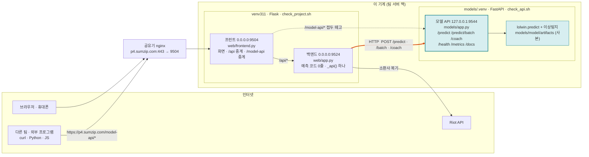
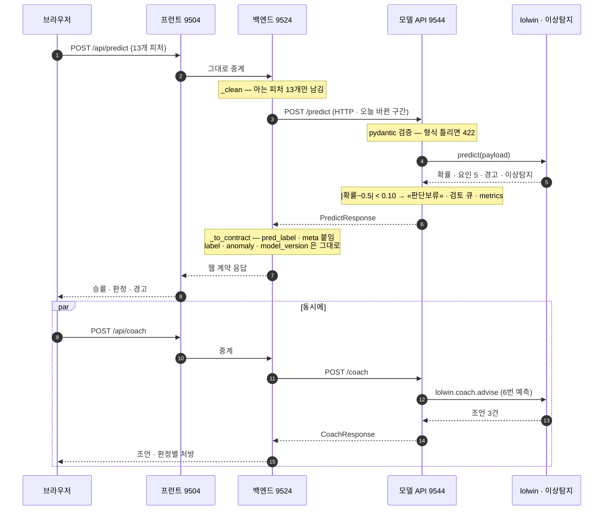
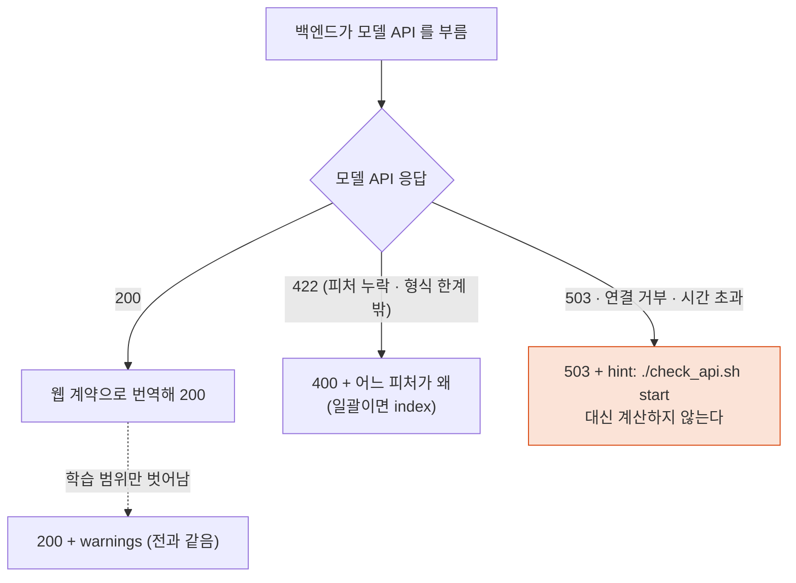

<!-- ─────────────────────────────────────────────
  모델 API 서비스 · 웹서비스 아키텍처 — 2026-09-22 에 무엇을, 왜, 어떤 순서로 만들었나.
  왜 필요한가: 오늘 하루에 «모델 API 서버 신설 → 독립 운영 → 외부 공개 → 웹서비스 전환» 네 단계가
  한꺼번에 들어갔다. 코드와 커밋 로그만 보면 순서와 이유가 안 보인다. 이 문서가 그 순서를 적는다.
  계약(무엇을 넣으면 무엇이 나오나)은 serving.md, 외부 연계 절차는 api_guide.md 가 정본이다.
  주로 보는 사람: 팀원 · 발표 준비 · Claude(검수)
  ───────────────────────────────────────────── -->

# 모델 API 서비스 · 웹서비스 아키텍처 — 단계별 설명과 도식

**한 줄 요약** — 어제까지 웹 백엔드가 파이썬 함수(`lolwin.predict`)를 직접 불러 예측했다.
오늘부터는 **독립 모델 API 서버**(FastAPI · 9544)가 예측을 전담하고, 웹 백엔드는 그 서버에 HTTP 로 묻는다.
같은 서버가 `https://p4.sumzip.com/model-api` 로 밖에도 열려 있어 **다른 팀·다른 프로그램도 같은 모델**을 쓴다.

관련 커밋 (team 브랜치, 2026-09-22):

| 커밋 | 단계 | 내용 |
|---|---|---|
| `c9cf261` | 1·2 | 모델 API 서버(`models/` FastAPI 9544) 독립 운영 + 외부 연계 가이드 |
| `a84ac8c` | 3 | 외부 공개를 학생절차 규약(`pN.sumzip.com/model-api` · `954N`)에 맞춤 |
| `d031a9e` | 4 | 웹서비스의 예측·분류 기능을 모델 API 경유로 전환 |

---

## 0. 전과 후 — 그림 한 장

```
[전 · 2026-09-21 까지]

  브라우저 ──▶ 프런트 (9504) ──▶ 백엔드 (9524) ──함수 호출──▶ lolwin.predict ──▶ artifacts/model.joblib
              화면·중계           Flask · 웹 API              (같은 프로세스 안)


[후 · 2026-09-22 부터]

  브라우저 ──▶ 프런트 (9504) ──▶ 백엔드 (9524) ──HTTP──▶ 모델 API (9544) ──▶ lolwin.predict ──▶ models/model/artifacts/model.joblib
              화면·중계           Flask · 웹 API             FastAPI · 예측 전담     (모델 API 프로세스 안)      (정본 artifacts/ 와 md5 동일)
                    │                                              ▲
                    └── /model-api/* ─(접두 떼고)──────────────────┘
                                                                   ▲
  다른 팀 · 외부 프로그램 ──▶ https://p4.sumzip.com/model-api/* ──┘   Swagger: /model-api/docs
```

바뀐 것은 **화살표 하나**다. 백엔드에서 모델로 가는 화살표가 "함수 호출"에서 "HTTP 요청"이 됐다.
그 대신 모델이 **어디서든 부를 수 있는 서비스**가 됐다.

---

## 1. 왜 API 서버를 따로 두나

식당에 비유하면 이렇다.

| | 전 (함수 호출) | 후 (API 서버) |
|---|---|---|
| 비유 | 홀 직원이 주방에 들어가 직접 요리 | 주방을 따로 두고 주문서를 넘김 |
| 모델을 쓰려면 | 파이썬이어야 하고, 같은 저장소 코드를 import 해야 함 | HTTP 만 되면 어떤 언어·어떤 기계든 됨 |
| 모델을 바꾸면 | 웹 서버를 다시 띄워야 함 | 모델 API 만 다시 띄우면 됨 |
| 부하가 몰리면 | 웹과 모델이 한 프로세스라 같이 느려짐 | 모델 API 만 따로 늘릴 수 있음 |
| 누가 얼마나 썼나 | 알 수 없음 | `/metrics` 로 요청 수·오류율·지연·판단보류율을 봄 |
| 위험 | 없음 | 모델 API 가 꺼지면 예측이 안 됨 → **503 으로 정직하게 알린다** (4단계) |

이 프로젝트에서 특히 중요한 이유는 **수업 규약**이다. 네 팀이 각자 `pN.sumzip.com/model-api` 로 모델을 공개해야 하고,
다른 팀이 우리 모델을, 우리가 다른 팀 모델을 HTTP 로 부를 수 있어야 한다.

---

## 2. 1단계 — 모델 API 서버 만들기 (`models/`)

### 2-1. 뼈대: 팀 공용 `app.py` + 팀별 세 파일

MS 과정에서 배운 6일치 뼈대를 그대로 썼다. **`app.py` 에는 팀 이름도 피처 이름도 없다.** 팀마다 다른 것은 세 파일뿐이다.

```
models/
├─ app.py           팀 공용 서버 — 아래 MS1~MS6 을 전부 여기서 한다. 팀 것을 모른다
├─ predict.py       [팀] _load() 한 번 · predict(payload) → dict   ← 팀 모델을 부르는 유일한 곳
├─ schemas.py       [팀] 무엇을 받고(PredictRequest 13개) 무엇을 돌려주나(PredictResponse)
├─ settings.py      [팀] 모델 이름·버전·정책값 — .env 로 바꾼다, 코드는 안 고친다
├─ routes_team.py   [팀] /schema · /examples · /coach — 팀 전용 엔드포인트
├─ metrics.py       운영 다섯 숫자
├─ model/           모델 사본 (아래 2-3)
├─ examples/        request.json · request_batch.json — 검사·벤치가 같은 입력을 쓰게
├─ test_app.py      단위 검사 10건 (서버 없이)
└─ bench.py         지연 측정 (단건 · 배치 · 동시)
```

| 단계 | 무엇 | `app.py` 에서 |
|---|---|---|
| MS1 | 예측을 HTTP 로 연다 | `POST /predict` |
| MS2 | 계약 — 형식이 틀리면 422 | `schemas.py` 의 `response_model` |
| MS3 | 기동 때 한 번 적재 | `lifespan` 에서 `warmup()` — 첫 요청이 느리지 않게 |
| MS4 | 실패 설계 | `ValueError` → 422(입력 문제) · 그 밖 → 500(서버 문제) · 접전은 «판단보류» + 검토 큐 |
| MS5 | 설정 분리 | `settings.py` ← `.env` |
| MS6 | 다섯 숫자 | `GET /metrics` — 요청 수 · 오류율 · p50/p95 지연 · 판단보류율 · 라벨 분포 |

### 2-2. 팀 `predict.py` 가 하는 세 가지

```
입력 13개 (블루−레드 차이)
   │
   ├──▶ lolwin.predict  ──▶ 승리 확률 · 예측 · 승리요인 5개 · 경고
   │
   ├──▶ anomaly.detect  ──▶ 이 경기 상태가 학습 데이터에서 보기 드문가 (이상탐지)
   │
   └──▶ 정책: |확률 − 0.5| < 0.10 이면 label = "판단보류"   (settings.close_margin)
   │
   ▼
한 응답: {label, win_prob_blue, pred, top_factors, anomaly, warnings, model_version}
```

1. **두 모델을 한 번만 적재**한다 (승패 예측 + 이상탐지).
2. **입력 하나로 두 모델을 부르고 한 응답으로 합친다.** 두 모델의 입력 형식이 완전히 같아서 가능하다.
3. **접전이면 판단을 보류**한다. 팀 모델에는 없던 정책이다. 이런 요청은 `review_queue.jsonl` 에 남겨 사람이 본다.

### 2-3. 모델 사본 — 왜 복사했나

`models/model/` 아래에 `lolwin/` 패키지와 `artifacts/`(모델·스키마)를 **복사**해 두었다.
저장소의 다른 부분 없이 `models/` 폴더 하나만 가져가도 API 가 완전히 뜨게 하기 위해서다 (다른 기계 배포).

대신 **정본과 어긋날 위험**이 생긴다. 그래서 두 겹으로 지킨다.

- `models/test_app.py::test_golden_parity` — 골든 50건을 사본으로 계산해 정답지와 대조 (서버 없이).
- 웹 백엔드가 기동할 때 예시 3건을 **모델 API 와 정본 `lolwin.predict` 양쪽**으로 계산해 차이 0 을 확인 (4단계).

재학습하면 `artifacts/` 와 `models/model/artifacts/` 를 **같이** 바꾸고 `MODEL_VERSION` 을 올린다.

### 2-4. 엔드포인트

| 경로 | 용도 |
|---|---|
| `GET /health` | 준비됐나 · 모델 이름·버전 · 적재 시간 |
| `POST /predict` | 한 건 |
| `POST /predict/batch` | 여러 건 (최대 32) |
| `GET /schema` | 입력 13개의 뜻·형·학습 범위 |
| `GET /examples` | 예시 입력 3건 |
| `POST /coach` | 무엇을 했다면 승률이 얼마나 올랐나 |
| `GET /metrics` | 운영 다섯 숫자 |
| `GET /docs` | Swagger — 브라우저에서 직접 눌러 볼 수 있다 |

---

## 3. 2단계 — 독립 운영 (`check_api.sh`)

웹서비스(`check_project.sh`)와 **완전히 별개 프로세스·별개 가상환경**으로 돈다.

```
./check_api.sh setup      models/.venv 만들고 models/requirements.txt 설치 (처음 한 번)
./check_api.sh start      uvicorn app:app --host 127.0.0.1 --port 9544 --root-path /model-api
./check_api.sh status     health 200 인가
./check_api.sh test       단위 10건 + (서버가 떠 있으면) HTTP 스모크 10건
./check_api.sh stop
```

| 결정 | 이유 |
|---|---|
| 가상환경을 따로 (`models/.venv`) | FastAPI·pydantic 을 운영 `venv311` 에 넣지 않는다. 웹이 깨질 위험을 분리 |
| `--host 127.0.0.1` | 포트를 밖에 직접 열지 않는다. 같은 기계의 프런트만 부른다 |
| 포트 `9544` | 수업 규약 — 4팀 = `954N` |
| `.env` 로 설정 | 포트·판단보류 폭·이상탐지 포함 여부·CORS·API 키를 코드 수정 없이 바꾼다 |

---

## 4. 3단계 — 외부 공개 (`pN.sumzip.com/model-api`)

### 4-1. 규약

수업 규약은 하나다 — **N팀 = `pN.sumzip.com` · 포트 `954N` · 경로 `/model-api`**.
`/api` 는 팀 웹 백엔드가 이미 쓰므로 모델 API 는 언제나 `/model-api` 뒤에 있다.

### 4-2. 원리 — 두 줄이면 되는 이유

```
브라우저 · 외부     https://p4.sumzip.com/model-api/predict
        │
        ▼  (공유기 nginx → 이 기계 9504)
프런트 (9504)      /model-api/predict  ──접두 «/model-api» 를 떼고──▶  http://127.0.0.1:9544/predict
        │
        ▼
uvicorn (9544)     --root-path /model-api   ← «나는 /model-api 뒤에 있다» 를 알고 있어서
                                               Swagger(/model-api/docs) 가 openapi.json 을 제자리에서 찾는다
```

- 프런트는 **접두만 떼고 그대로 넘긴다.** 경로·본문·질의·`X-API-Key` 헤더 전부.
- uvicorn 은 **접두를 안다.** 이 옵션이 빠지면 `/docs` 는 열려도 «Failed to load API definition» 이 뜬다.
- nginx 는 건드리지 않았다. 이미 `p4.sumzip.com → 9504` 로 열려 있던 길을 그대로 쓴다.

### 4-3. 열린 주소

| 무엇 | 주소 |
|---|---|
| Swagger (직접 눌러 보기) | https://p4.sumzip.com/model-api/docs |
| 예측 | `POST https://p4.sumzip.com/model-api/predict` |
| 상태 | https://p4.sumzip.com/model-api/health |
| 연계 가이드 · 클라이언트 예시 | [api_guide.md](api_guide.md) 3장 (curl · Python · JavaScript) |

API 키는 현재 비어 있어 누구나 부를 수 있다. 잠그려면 `models/.env` 의 `API_KEYS` 에 키를 넣는다 — POST 에만 검사하고 GET(`/docs` `/health`)은 열어 둔다.

---

## 5. 4단계 — 웹서비스 전환 (`web/app.py`)

### 5-1. 원칙

> 백엔드는 예측을 직접 하지 않는다. 모델을 읽지도 않는다. 모델 API 를 부르는 곳은 함수 하나(`_api()`)뿐이다.

전에도 "계산은 `lolwin.predict` 한 곳" 이었다. 원칙은 그대로이고, **그 한 곳이 다른 프로세스로 옮겨갔을 뿐**이다.

### 5-2. 어떤 기능이 어디로 가나

웹의 예측·분류 기능 다섯 개가 전부 모델 API 를 거친다.

| 웹 기능 | 백엔드 경로 | 모델 API 호출 | 비고 |
|---|---|---|---|
| 승패 예측 한 건 | `POST /api/predict` | `POST /predict` | 화면의 «판정 + 코칭» 버튼 |
| 일괄 예측 | `POST /api/predict/batch` | `POST /predict/batch` **32건씩** 나눠서 | 웹은 최대 1,000건, API 는 32건이라 |
| 코칭 | `POST /api/coach` | `POST /coach` | 조언 3건 + 판정별 처방 |
| 시험셋 복기 1,976판 | `GET /api/matches` | `/predict/batch` 32건씩 62번 | 기동 직후 백그라운드에서 **미리** 만든다 (약 20초) |
| 소환사 복기 | `POST /api/summoner` | 경기마다 `POST /predict` | `src/riot_api.py` 에 예측 함수를 넘긴다 |

예측이 아닌 기능(`/api/report` `/api/match-types` `/api/ranking` `/api/champions` `/api/schedule` `/api/vote`)은 CSV 를 읽을 뿐이라 바뀌지 않았다.

### 5-3. 응답은 어떻게 맞추나

모델 API 의 응답(`PredictResponse`)과 웹의 기존 계약([serving.md](serving.md) 3장)은 모양이 조금 다르다.
화면과 기존 연동이 깨지지 않게 백엔드가 **번역**한다.

```
모델 API 응답                          웹 응답 (기존 필드 유지 + 새 필드 추가)
{                                      {
  label: "블루 승리 예측"|"판단보류"      win_prob_blue   ← 그대로
  win_prob_blue                          pred            ← 그대로
  pred                                   pred_label      ← pred 로 만든다 (화면이 읽는 필드)
  top_factors[5]                         top_factors     ← 그대로
  anomaly {...}                          warnings        ← 그대로 (접전이면 «판단보류» 경고가 붙어 온다)
  warnings[]                             meta            ← schema.json 에서 (기존 계약)
  model_version                          label           ← 새 필드 (판단보류)
}                                        anomaly         ← 새 필드 (이상탐지)
                                         model_version   ← 새 필드
                                       }
```

### 5-4. 실패했을 때 — 대신 계산하지 않는다

| 상황 | 모델 API | 웹 백엔드가 돌려주는 것 |
|---|---|---|
| 피처 누락 · 형식 한계 밖 (골드차 ±30,000 등) | 422 | **400** + 어느 피처가 왜 (일괄이면 `index` 도) |
| 학습 범위만 벗어남 | 200 + warnings | **200** + warnings (전과 같다) |
| 모델 API 꺼짐 · 연결 거부 · 시간 초과 · 준비 중 | 503 / 연결 실패 | **503** + `hint: ./check_api.sh start` |

모델 API 가 꺼져 있을 때 백엔드가 몰래 정본 함수로 대신 계산하면 편하겠지만 **하지 않는다.**
"지금은 못 한다" 고 말하는 편이, 두 경로가 조용히 다른 답을 내는 것보다 낫다.

### 5-5. 그래서 기동 순서가 바뀌었다

```
./check_project.sh start
   ├─ 1. 모델 API health 가 200 이 아니면  ./check_api.sh start   (예측·코칭이 여기서 계산되므로 먼저)
   ├─ 2. 백엔드 (9524) — 기동하면서 예시 3건으로 파리티 실측, 복기 1,976판 백그라운드 예열
   └─ 3. 프런트 (9504)

./check_project.sh status     model-api · backend · frontend · 공개 도메인 네 줄
./check_project.sh stop       모델 API 는 건드리지 않는다 (다른 팀도 부르는 독립 서버) — 끄려면 ./check_api.sh stop
```

---

## 6. 아키텍처 도식

### 6-1. 구성도 — 프로세스 · 포트 · 파일

```
┌─ 이 기계 (팀 서버 맥) ──────────────────────────────────────────────────────────────────────────┐
│                                                                                                  │
│   venv311 ──────────────────────────────────────┐     models/.venv ─────────────────────────┐   │
│                                                 │                                            │   │
│   ┌────────────────────┐   ┌──────────────────┐ │     ┌──────────────────────────────────┐   │   │
│   │ 프런트  web/frontend.py │   │ 백엔드  web/app.py │ │     │ 모델 API  models/app.py (FastAPI) │   │   │
│   │ Flask · 0.0.0.0:9504 │   │ Flask · 0.0.0.0:9524│ │     │ uvicorn · 127.0.0.1:9544         │   │   │
│   │                    │   │                  │ │     │ --root-path /model-api            │   │   │
│   │  /            화면  │   │ /api/predict     │ │     │                                  │   │   │
│   │  /api/*   ──중계──▶│──▶│ /api/coach       │─┼─HTTP─▶│ /predict  /predict/batch  /coach │   │   │
│   │  /model-api/* ─접두 떼고────────────────────┼───────▶│ /health  /schema  /examples      │   │   │
│   │  /figures/*        │   │ /api/matches     │ │     │ /metrics  /docs                   │   │   │
│   │  /healthz          │   │ /api/summoner ─┐ │ │     │         │                        │   │   │
│   └────────────────────┘   │ /api/report 등 │ │ │     │         ▼                        │   │   │
│            ▲               └────────────────┼─┘ │     │  predict.py ─┬─ lolwin.predict    │   │   │
│            │                                │   │     │              └─ anomaly.detect    │   │   │
│            │                   Riot API ◀───┘   │     │         │                        │   │   │
│            │                                    │     │         ▼                        │   │   │
│            │                                    │     │  model/artifacts/model.joblib     │   │   │
│            │                                    │     │  model/anomaly_detect/model.joblib│   │   │
│            │                                    │     └──────────────────────────────────┘   │   │
│            │                                    │        (사본 — 정본 artifacts/ 와 md5 동일)   │   │
│            │                                    └────────────────────────────────────────────┘   │
└────────────┼─────────────────────────────────────────────────────────────────────────────────────┘
             │  9504
   공유기 nginx (https · Let's Encrypt)   p4.sumzip.com ──▶ 이 기계:9504
             ▲
   브라우저 · 휴대폰 · 다른 팀 · 외부 프로그램
```

| 프로세스 | 포트 | 바인드 | 가상환경 | 띄우는 스크립트 | 하는 일 |
|---|---|---|---|---|---|
| 프런트 | 9504 | 0.0.0.0 | venv311 | `check_project.sh` | 화면 · `/api` 중계 · `/model-api` 중계 |
| 백엔드 | 9524 | 0.0.0.0 | venv311 | `check_project.sh` | 웹 API · 모델 API 에 예측을 넘김 · CSV 리포트 |
| 모델 API | 9544 | 127.0.0.1 | models/.venv | `check_api.sh` | 예측 · 코칭 · 이상탐지 · Swagger · metrics |

### 6-2. 흐름 — 화면에서 «판정 + 코칭» 을 누르면

```
브라우저          프런트 9504        백엔드 9524              모델 API 9544           lolwin / anomaly
   │                 │                  │                        │                        │
   │ POST /api/predict (13개)           │                        │                        │
   ├────────────────▶│ 그대로 중계       │                        │                        │
   │                 ├─────────────────▶│ _clean: 아는 13개만     │                        │
   │                 │                  ├─ POST /predict ───────▶│ pydantic 검증(422?)     │
   │                 │                  │                        ├─ predict() ───────────▶│ 확률·요인·이상탐지
   │                 │                  │                        │◀───────────────────────┤
   │                 │                  │                        ├─ 접전? → 판단보류·검토큐 │
   │                 │                  │◀── PredictResponse ────┤ metrics 기록            │
   │                 │                  ├─ _to_contract: pred_label·meta 붙임             │
   │                 │◀─────────────────┤                        │                        │
   │◀────────────────┤                  │                        │                        │
   │ (동시에)         │                  │                        │                        │
   │ POST /api/coach ├─────────────────▶├─ POST /coach ─────────▶├─ lolwin.coach.advise ─▶│ 6번 예측해 상승폭
   │◀────────────────┤◀─────────────────┤◀───────────────────────┤                        │
   │ 화면: 승률 · 판정 · 조언 3건 · 경고  │                        │                        │
```

### 6-3. 흐름 — 외부 프로그램이 직접 부르면

```
외부 (다른 팀 · curl · Python)      프런트 9504                      모델 API 9544
   │                                   │                                 │
   │ POST https://p4.sumzip.com/model-api/predict                        │
   ├──────────────────────────────────▶│ «/model-api» 접두를 뗀다          │
   │                                   ├─ POST http://127.0.0.1:9544/predict ─▶│ (--root-path 로 접두를 안다)
   │                                   │◀─────────────────────────────────┤
   │◀──────────────────────────────────┤ 응답 그대로                       │
   │ {label, win_prob_blue, pred, top_factors, anomaly, warnings, model_version}
```

웹 백엔드가 받는 것과 **같은 서버·같은 모델·같은 응답**이다. 6-2 와 다른 점은 백엔드의 번역(5-3)이 없다는 것뿐이다.

### 6-4. 흐름 — 소환사 복기 (Riot + 모델 API)

```
브라우저 ─▶ 프런트 ─▶ 백엔드 /api/summoner ─▶ src/riot_api.analyze_recent(riot_id, predict_fn=백엔드의 predict)
                                                  │
                                                  ├─ Riot API: 최근 경기 목록 · 경기 상세 · 타임라인 (경기마다)
                                                  ├─ 타임라인 → 10분 시점 13개 피처
                                                  ├─ predict_fn(피처) ──HTTP──▶ 모델 API /predict   ← 여기가 바뀐 곳
                                                  ├─ 내가 레드면 확률·승패를 내 팀 기준으로 뒤집음
                                                  └─ 판정(역전패·우세승…) · 레이더 · 성향 · 라인 기준선 (lolwin.coach — 표시 규칙)
```

`riot_api.py` 는 예측 함수를 **밖에서 받는다**(`predict_fn`). 웹은 모델 API 용 함수를 넘기고,
명령행·노트북에서 쓸 때는 안 넘기면 정본 `lolwin.predict` 를 쓴다. 모델 API 가 형식 한계로 거부한 경기는 그 판만 건너뛴다.

---

## 6-5. 같은 도식을 Mermaid 로 — GitHub 에서 그림으로 렌더링된다

아래 세 블록은 GitHub 문서 화면에서 바로 그림이 되고, [mermaid.live](https://mermaid.live) 에 붙여 넣으면 편집·PNG 저장이 된다.
draw.io(diagrams.net) 에서는 «Arrange → Insert → Advanced → Mermaid» 에 붙여 넣으면 편집 가능한 도형으로 들어온다.

### 구성도



굵은 주황 선(백엔드 → 모델 API)이 오늘 바뀐 화살표다. 전에는 백엔드 안에서 `lolwin.predict` 를 함수로 불렀다.

### 요청 흐름 — 화면에서 «판정 + 코칭»



### 실패했을 때



---

## 7. 무엇이 이 구조를 지키나 — 검사 체계

| 검사 | 무엇을 지키나 | 서버 필요 |
|---|---|---|
| `tests/test_regression.py` | 정본 모델의 예측 50건이 정답지와 같다 | 아니오 |
| `models/test_app.py` (10건) | 모델 API 계약 · **사본이 골든 50건을 재현** · 코치 · `--root-path` | 아니오 |
| `tests/test_contract.py` | `lolwin.predict` 출력 형식·에러 규약 (serving.md 3·4장) | 아니오 |
| `web/test_parity.py` | **직접 호출 · 모델 API · 백엔드 · 프런트 네 경로의 확률이 같다** | 예 |
| `web/test_api.py` | 웹 엔드포인트 스모크 — 형식 한계 밖 400 · 학습 범위 밖 200+경고 · 코칭 · 모델 API 연결 · `/model-api` 중계 | 예 |
| 백엔드 기동 시 파리티 실측 | `/api/health` 의 `parity.passed` — 사본이 정본과 어긋나면 false | 예 |
| `src/factcheck.py` | 문서 수치가 근거 파일과 맞다 | 아니오 |

**검사가 진짜 잡는지 확인했다.** 확률을 늘 0.4242 로 답하는 가짜 모델 API 를 백엔드에 붙였더니
`parity.passed=false` 가 됐고 `test_parity.py` 가 첫 건에서 실패했다 (CLAUDE.md 규칙 — 새 규칙은 틀린 값을 넣어 확인한다).

한 번에 돌리는 명령:

```bash
./check_api.sh test          # 모델 API 쪽
./check_project.sh test      # 웹 쪽 — verify(회귀·계약·코칭·JS·재현성·문서) + 파리티 4경로 + 스모크
```

---

## 8. 운영 — 누가 무엇을 하나

| 상황 | 사람이 할 일 | 스크립트가 알아서 하는 것 |
|---|---|---|
| 처음 설치 | `./check_api.sh setup` 한 번 | 가상환경 · 의존성 · `.env` 복사 |
| 서비스 켜기 | `./check_project.sh start` | 모델 API 가 꺼져 있으면 먼저 띄움 → 백엔드(파리티 실측·복기 예열) → 프런트 |
| 상태 보기 | `./check_project.sh status` | 모델 API · 백엔드 · 프런트 · 공개 도메인 네 줄 |
| 예측이 503 | `./check_api.sh start` 또는 `logs/api.log` 확인 | 백엔드는 다음 `/api/health` 때 파리티를 다시 잼 |
| 모델 재학습 | `artifacts/` 와 `models/model/artifacts/` 를 **같이** 교체, `MODEL_VERSION` 올림, 골든 정답지 재생성 | 파리티 검사가 어긋남을 잡음 |
| 외부에 키를 요구하고 싶을 때 | `models/.env` 의 `API_KEYS` 채우고 `./check_api.sh restart` | POST 에 `X-API-Key` 검사 |
| 컴퓨터 재부팅 | 접속해서 `./check_project.sh start` | 자동으로 살아나지 않는다 |

---

## 9. 오늘 기준 남은 것

- `README.md` 의 «서비스 — 모델이 어떻게 돌아가나» 절이 옛 경로(백엔드 → `lolwin.predict` 함수 호출)로 적혀 있다. README 는 사람 담당이라 고치지 않았다. 이 문서 0장의 «후» 그림을 옮기면 된다.
- 외부 개발자용 묶음(`/model-api-kit` — openapi.json · 가이드 · 파이썬 클라이언트 · zip)이 프런트에 추가되는 중이다 (미커밋).
- API 키가 비어 있어 공개 주소로 누구나 예측을 부를 수 있다. 수업 범위에서는 문제없지만, 잠글지는 팀이 정한다.
- 화면 자체는 아직 `/api/*` 만 쓴다. 화면이 `/model-api` 를 직접 부르게 할 필요는 없다 — 백엔드가 이미 거기로 넘기고, 화면은 백엔드가 주는 리포트·랭킹 등도 함께 쓰기 때문이다.
