<!-- ─────────────────────────────────────────────
  비즈니스 프로세스 다이어그램 + UC별 상세 액티비티 다이어그램.
  왜 필요한가: 유스케이스 명세(UC_01~UC_14)는 "무엇을"을 액터 목표 단위로 적었다. 이 문서는 그 흐름을
  시간 순서와 담당(레인) 기준으로 이어 붙여 "누가 언제 무엇을 넘겨주는가"를 한 장씩 보이게 한다.
  주로 보는 사람: 팀원(구현·운영) · 발표 준비 · Claude(검수)
  ───────────────────────────────────────────── -->

# LoL 인게임 시점별 경기 데이터 기반 승패 예측 및 핵심 승리요인 분석 비즈니스 프로세스 및 액티비티 다이어그램
**UC_00~UC_14 의 Sequence Diagram 과 업무흐름을 통합한 프로세스 모델 · UML 2.5.1 Activity Diagram 표기**

---

> **문서 식별**: `docs/usecases/BP_00_비즈니스프로세스_액티비티다이어그램.md`
> **작성일**: 2026-09-07 · **표준**: UML 2.5.1 (OMG) Activity Diagram — 스윔레인(ActivityPartition)·결정/병합·포크/조인·반복. BPMN 2.0 의 풀/레인·게이트웨이·이벤트에 대응한다(§6 대응표).
> **원천(SoT)**: [UC_00_개요_LoL승패예측및핵심승리요인분석.md](UC_00_개요_LoL승패예측및핵심승리요인분석.md) §3·§5 와 `UC_01`~`UC_14` 의 기본흐름·대체흐름·예외흐름·Sequence Diagram. 여기에 없는 활동은 그리지 않았다.
> **다이어그램**: 19장 (프로세스 조감 1 · 비즈니스 프로세스 4 · 액티비티 14). 모두 로컬 Kroki 렌더 검증(HTTP 200) 뒤 `diagrams/*.svg` 로 저장했다. 뷰어 링크는 사내 서버라 SSO 로그인이 필요하고, 그림 파일은 로그인 없이 보인다.
> **읽기 전에**: 처음이면 [유스케이스_쉬운설명.md](유스케이스_쉬운설명.md) 를 먼저 본다.

---

## 목차

1. [목적·범위·표기](#1-목적범위표기)
2. [비즈니스 프로세스 조감](#2-비즈니스-프로세스-조감)
3. [비즈니스 프로세스 다이어그램](#3-비즈니스-프로세스-다이어그램)
4. [상세 액티비티 다이어그램 (UC1~UC14)](#4-상세-액티비티-다이어그램-uc1uc14)
5. [프로세스 간 핸드오프 (산출물·소비)](#5-프로세스-간-핸드오프-산출물소비)
6. [표기 규칙과 표준 준수 노트](#6-표기-규칙과-표준-준수-노트)

---

## 1. 목적·범위·표기

유스케이스 문서는 액터의 **목표 하나**를 한 장씩 적는다. 그래서 "소환사 복기가 끝난 뒤 코칭과 티어가 어떻게 이어지나", "재학습한 모델이 언제 사이트에 올라가나"처럼 **여러 UC 를 가로지르는 순서**는 UC 문서만으로는 보이지 않는다.
이 문서는 14개 UC 의 Sequence Diagram 에 적힌 메시지 순서와 기본흐름의 단계를 **시간 순 · 담당(레인) 기준**으로 다시 엮어 네 개의 비즈니스 프로세스로 묶고, 각 UC 를 결정·예외까지 포함한 액티비티 다이어그램으로 내렸다.

| 구분 | 무엇을 보이나 | 장수 | 원천 |
|---|---|:--:|---|
| 프로세스 조감 (L0) | 네 프로세스 P1~P4 가 서로 무엇을 넘겨주는가 | 1 | UC_00 §3·§5, §6 |
| 비즈니스 프로세스 (BP-1~4) | 프로세스마다 레인(담당)별 활동과 결정, UC 경계 | 4 | UC_01~UC_14 기본흐름·Sequence |
| 액티비티 (AD-1~14) | UC 하나의 활동 순서, 결정 분기(E·A 흐름 번호), 종료점 | 14 | 각 UC 문서 §5 |

**표기 약속**

- 레인 이름은 UC 문서의 lifeline 이름을 그대로 쓴다(이용자 · 화면·프런트 · 백엔드 · lolwin · Riot Games API 등).
- 결정 노드의 가지에 `(E3)` 처럼 붙은 번호는 그 UC 문서의 **예외흐름 번호**, `(A1)` 은 **대체흐름 번호**다. 다이어그램에서 UC 문서로 바로 찾아갈 수 있다.
- «include» · «extend» 는 UC 다이어그램의 관계를 그대로 옮긴 것이다. 액티비티에서는 포크(동시 호출) 또는 별도 활동으로 나타난다.
- 활동 안의 파일명·API 경로는 추적성을 위해 남겼다. 뜻은 각 UC 문서의 "쉽게 말하면"에 있다.

---

## 2. 비즈니스 프로세스 조감

네 프로세스는 독립적이지 않다. P3 가 만든 모델을 P4 가 사이트에 올리고, P2 가 만든 표를 P1 이 읽고, P4 가 갱신한 열쇠가 P1 의 소환사 검색을 켠다.

| 프로세스 | 이름 | 포함 UC | 주체 | 주기 | 산출물 → 소비처 |
|:--:|---|---|---|---|---|
| P1 | 복기·판정 이용 | UC1~UC8 | 이용자 · 외부 연동 개발자 | 이용자가 올 때마다 | 화면 결과(저장 없음) |
| P2 | 데이터 스냅샷 수집 | UC9 · UC10 | 서비스 담당 | 자료 없음 — 확인 필요 ([추론] 하루 1회 이상, loop 모드는 45분 이상 간격) | `schedule.csv` · `champion_stats.csv` · `champion_top_players.csv` · `ranking.csv` → P1 |
| P3 | 모델 변경·검증 | UC11 · UC12 | 팀원(분석·개발) | 피처·모델·문서를 바꿀 때마다 | `artifacts/model.joblib` · `schema.json` · `golden_predictions.json` → P4 |
| P4 | 운영 (배포·키) | UC13 · UC14 (+UC12 포함) | 서비스 담당 | 매일 · push 가 있을 때 · 발표 당일 | 살아 있는 서비스 · `RIOT_READY` → P1 |

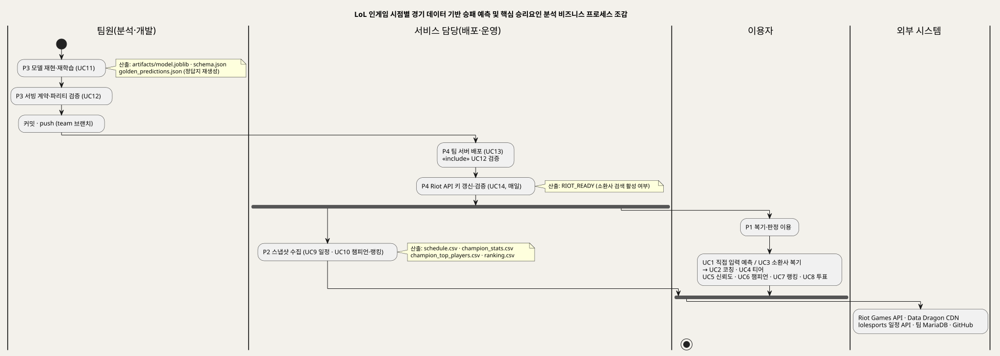

PlantUML 소스 보기

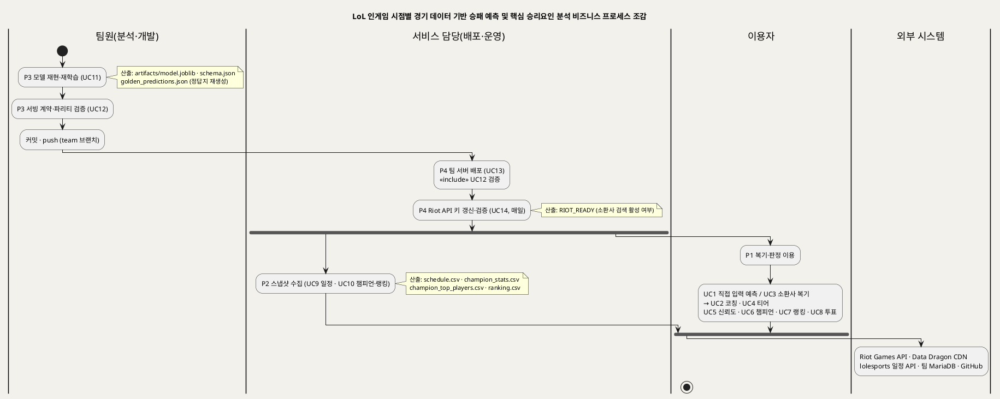
```plantuml
@startuml bp_L0
skinparam backgroundColor #F3F1EB
skinparam shadowing false
skinparam activityFontSize 12
skinparam noteFontSize 11
title LoL 인게임 시점별 경기 데이터 기반 승패 예측 및 핵심 승리요인 분석 비즈니스 프로세스 조감

|팀원(분석·개발)|
start
:P3 모델 재현·재학습 (UC11);
note right
  산출: artifacts/model.joblib · schema.json
  golden_predictions.json (정답지 재생성)
end note
:P3 서빙 계약·파리티 검증 (UC12);
:커밋 · push (team 브랜치);
|서비스 담당(배포·운영)|
:P4 팀 서버 배포 (UC13)
«include» UC12 검증;
:P4 Riot API 키 갱신·검증 (UC14, 매일);
note right
  산출: RIOT_READY (소환사 검색 활성 여부)
end note
fork
  :P2 스냅샷 수집 (UC9 일정 · UC10 챔피언·랭킹);
  note right
    산출: schedule.csv · champion_stats.csv
    champion_top_players.csv · ranking.csv
  end note
fork again
  |이용자|
  :P1 복기·판정 이용;
  :UC1 직접 입력 예측 / UC3 소환사 복기
  → UC2 코칭 · UC4 티어
  UC5 신뢰도 · UC6 챔피언 · UC7 랭킹 · UC8 투표;
end fork
|외부 시스템|
:Riot Games API · Data Dragon CDN
lolesports 일정 API · 팀 MariaDB · GitHub;
detach
|이용자|
stop
@enduml
```

소스를 직접 렌더하려면 **[「프로세스 조감」 PlantUML 뷰어로 열기](https://plantuml.sumzip.com/plantuml/svg/eNp1lM9v01gQx-_-K0baSyqtCmnZhU0vQENZpAJVFw6copfYTUwdO7IdECiH0roo1EFNVymbdJ0oXWVbdjdI7s8kor3kT9lj3vh_YJ7d0nDgZL03M2--7zPf59uWzUy7mNcgXUjNX5esZVUvMJPlIc0yy1nTKOryrKEZJvwwNz0Xv3d3LMPKMdl4qepZWGKapYxFWMZWX6j2qzlDt39TXysQnxqL6oatXEXikq3amgLzxjxgsz86rGDLAXQ9bFf5kQOjw_NR3wf-3sfmceD4QCvu1wE3BkHlI2C9jP1d4P4mBNsn6HZFgO91cadGpwE_ddBpAh84uFfmbhk3OhDUHL7rodMXC9z1R35VkkpBZQX_rMaigmFv5Hvc9yZKUghISixMA__3I3_fB2x1g7oz7InvdgM3TiD2dDYen5iRxMXAVLM5WwLAVR9PvQRQtbpEQKxreUNWtMnnRlpT0zDsgZXJKXk2-dwydMrPGpqs6KmCqcgq4TN0K4xADNvb3D3B_RXRGdea6BxMSIouhxxDYeh4fNCA0ZGD2-fDXlCpEIDAJVSHK7jXDPVNkb4Efu5w3xW9C0UrBzFboXHwfoW3PBzUKaMUHuUIMNw95u4gxn0_2OzSbXeOsf6GeCQWbgCxCpseOhDFwxbTE9LwP1XPaEVZGX4G0fRCwUxYtagaNtxZeADBagdG_gG6beJ8JfHGj8D3O9g8-x7KxQePn6QW791JPiMqbytBo46r3bDF2jsIGjTSA8A_uvx0ZQzQkmEu0xmJhSlyRoevreNaD7Bcx_0t0fUXMt0ZIRZQSMN1wINaUDvDD_1hj7c-BasDUgPwjZ4rRWKEclFTJjPWC3FCJsfyBZpdilxjW2I3TP-6bRuFVEFjrxTTuiwxmU4vI3uR-41sYFmmCm-UyPq48w-2qqXwKnHgRyf0DsSsq0J8FBdCE3QJwP032N4iv6zz9t-XT-Qa3Y-88pVbdASV_P_2dwoRnvMaDj5FIGjGro8fjin8dPYneo5t_pfPN50o-vMVpWjjJkSsotUtCMrdYMubCacQDqCEjT7NJXzXG51g3SMjhX64z_KKFbqCSpPMZpA0WZZ8P5t8JGmGplgFw7StyyldJAoDPmSmypJ3xfK-av9aTM9IsmKzTE4ax2URcuk26aB_nPQFmdNaRQ==)** (사내 서버, SSO 로그인 필요) 또는 [로컬 Kroki 로 열기](http://192.168.0.91:8889/plantuml/svg/eNp1lM9v01gQx-_-K0baSyqtCmnZhU0vQENZpAJVFw6copfYTUwdO7IdECiH0roo1EFNVymbdJ0oXWVbdjdI7s8kor3kT9lj3vh_YJ7d0nDgZL03M2--7zPf59uWzUy7mNcgXUjNX5esZVUvMJPlIc0yy1nTKOryrKEZJvwwNz0Xv3d3LMPKMdl4qepZWGKapYxFWMZWX6j2qzlDt39TXysQnxqL6oatXEXikq3amgLzxjxgsz86rGDLAXQ9bFf5kQOjw_NR3wf-3sfmceD4QCvu1wE3BkHlI2C9jP1d4P4mBNsn6HZFgO91cadGpwE_ddBpAh84uFfmbhk3OhDUHL7rodMXC9z1R35VkkpBZQX_rMaigmFv5Hvc9yZKUghISixMA__3I3_fB2x1g7oz7InvdgM3TiD2dDYen5iRxMXAVLM5WwLAVR9PvQRQtbpEQKxreUNWtMnnRlpT0zDsgZXJKXk2-dwydMrPGpqs6KmCqcgq4TN0K4xADNvb3D3B_RXRGdea6BxMSIouhxxDYeh4fNCA0ZGD2-fDXlCpEIDAJVSHK7jXDPVNkb4Efu5w3xW9C0UrBzFboXHwfoW3PBzUKaMUHuUIMNw95u4gxn0_2OzSbXeOsf6GeCQWbgCxCpseOhDFwxbTE9LwP1XPaEVZGX4G0fRCwUxYtagaNtxZeADBagdG_gG6beJ8JfHGj8D3O9g8-x7KxQePn6QW791JPiMqbytBo46r3bDF2jsIGjTSA8A_uvx0ZQzQkmEu0xmJhSlyRoevreNaD7Bcx_0t0fUXMt0ZIRZQSMN1wINaUDvDD_1hj7c-BasDUgPwjZ4rRWKEclFTJjPWC3FCJsfyBZpdilxjW2I3TP-6bRuFVEFjrxTTuiwxmU4vI3uR-41sYFmmCm-UyPq48w-2qqXwKnHgRyf0DsSsq0J8FBdCE3QJwP032N4iv6zz9t-XT-Qa3Y-88pVbdASV_P_2dwoRnvMaDj5FIGjGro8fjin8dPYneo5t_pfPN50o-vMVpWjjJkSsotUtCMrdYMubCacQDqCEjT7NJXzXG51g3SMjhX64z_KKFbqCSpPMZpA0WZZ8P5t8JGmGplgFw7StyyldJAoDPmSmypJ3xfK-av9aTM9IsmKzTE4ax2URcuk26aB_nPQFmdNaRQ==) (내부망 전용). 위 그림 파일은 로그인 없이 보인다.

#### 다이어그램 쉽게 읽기

1. **네 줄(레인)** 은 "누가 하는 일인가"다. 위에서 아래로 시간이 흐른다.
2. 팀원이 모델을 다시 공부시키고 검사해서 금고(GitHub)에 넣으면, 서비스 담당이 그것을 서버에 올리고 매일 열쇠를 갈아 끼운다.
3. 그 뒤 두 갈래가 **동시에** 돈다(굵은 가로선). 한쪽에서는 로봇이 밤에 자료를 모으고, 다른 쪽에서는 이용자가 사이트를 쓴다.
4. 맨 아래 "외부 시스템" 줄은 우리가 만들지 않은, 자료를 주는 곳이다. 어느 프로세스든 필요할 때 거기에 물어본다.

---

## 3. 비즈니스 프로세스 다이어그램

### 3.1 BP-1 복기·판정 이용 프로세스 (UC1~UC8)

이용자가 사이트에 들어와서 나가기까지의 한 번의 방문이다. 첫 화면이 뜰 때 성적표(UC5)가 먼저 준비되고, 이용자는 세 갈래 중 하나로 간다. 소환사 검색 갈래가 가장 길고, 경기 행을 펼치는 순간 코칭(UC2)·티어(UC4)·챔피언 초상이 **동시에** 불린다.

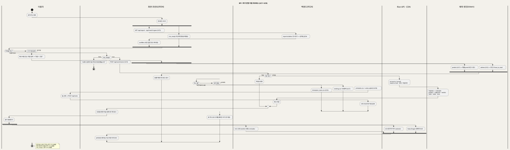

PlantUML 소스 보기

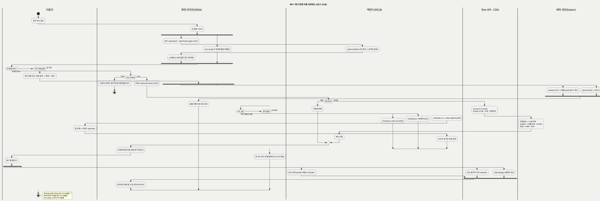
```plantuml
@startuml bp_1_service
skinparam backgroundColor #F3F1EB
skinparam shadowing false
skinparam activityFontSize 12
skinparam noteFontSize 11
title BP-1 복기·판정 이용 프로세스 (UC1~UC8)

|이용자|
start
:공개 주소 접속;
|화면·프런트(9504)|
:첫 화면 그리기;
fork
  :GET /api/report · /api/match-types (UC5);
  |백엔드(9524)|
  :reports/tables CSV 읽기 → 성적표 JSON;
  |화면·프런트(9504)|
  :confBins 보관 (접전 경고 재사용);
fork again
  :riot_ready 로 검색창 활성/비활성;
end fork
|이용자|
if (무엇을 하나?) then (소환사 검색)
  |화면·프런트(9504)|
  if (riot_ready?) then (false)
    :"소환사 검색이 일시적으로 중단됐습니다";
    stop
  else (true)
    :POST /api/summoner (UC3);
  endif
  |백엔드(9524)|
  if (5분 캐시?) then (적중)
    :저장값 반환;
  else (미적중)
    |Riot API · CDN|
    :account-v1 puuid
    match-v5 ids · 상세 · 타임라인;
    |예측 엔진(lolwin)|
    :타임라인 → 13개 피처
    predict → 승률·요인 · verdict
    style · radar · lane;
    |백엔드(9524)|
    :캐시 저장;
  endif
  |화면·프런트(9504)|
  :프로필·판정 타일·성향·경기 행 표시;
  |이용자|
  :경기 행 펼치기;
  fork
    |백엔드(9524)|
    :UC2 코칭 (verdict 포함) «include»;
  fork again
    |Riot API · CDN|
    :UC4 참가자 티어 «extend»;
  fork again
    :Data Dragon 챔피언 초상;
  end fork
  |화면·프런트(9504)|
  :승리요인·궤적·팀 구성·코칭·티어 표시;
elseif (수치 직접 입력) then
  |이용자|
  :예시 버튼 또는 직접 입력 → "판정 + 코칭";
  |화면·프런트(9504)|
  fork
    |예측 엔진(lolwin)|
    :predict (UC1) → 확률·pred·요인 5·경고;
  fork again
    :advise (UC2) → 조언 3·how_to_read;
  end fork
  |화면·프런트(9504)|
  :승률·라벨·코칭·경고 표시;
else (탭 이동)
  |화면·프런트(9504)|
  if (어느 탭?) then (최근 챔피언 승률)
    |백엔드(9524)|
    :champion_stats.csv (UC6);
  elseif (유저 랭킹) then
    :ranking.csv 100명씩 (UC7);
  else (승부예측)
    :schedule.csv + votes.sqlite3 (UC8);
    |이용자|
    :팀 선택 → POST /api/vote;
    |백엔드(9524)|
    :시작 전 경기만 저장·집계;
  endif
  |화면·프런트(9504)|
  :표·카드 표시 (이름 클릭은 UC3 로 이동);
endif
|이용자|
stop
note right
  회색 표(스냅샷 CSV)는 BP-2 의 산출물.
  예측 엔진의 모델은 BP-3 의 산출물.
  riot_ready 는 BP-4 의 산출물.
end note
@enduml
```

소스를 직접 렌더하려면 **[「BP-1 복기·판정 이용 프로세스」 PlantUML 뷰어로 열기](https://plantuml.sumzip.com/plantuml/svg/eNqVVltT21YQftev2KEv1mS4mEubwkNTTOi0DwlTSl8ZYQuswUiuJDul4-kAFpQY0pjUEMPY1Ey5JmYqwGDTmhf_lDz6HP2H7jmSsUmApE8In93v7H777e55ZJiSbsZmIjARHfePG7IeV4KyYEwralTSpRmYkILTU7oWU0MBLaLp8Nlwz7D_8WCLhRGWQtozRZ2CSSlitPpKQVOJK-bssKaao8ovMvi7W05VzZSbJ37BVMyIDIMj7X4gZ-f1il0rO6tpWlgHmi_RrSNwMhbZyVGrQlO74BsL-H8dCzwUBSHhntPtdELg6Qj9dQSwc0D_qtKlVaCFNbr0YkBIOJsZclRCXET603ZSFd-XfV29YkLop6dvwT2FerlC9ot4_4AwqenTAkD_N49_gE4pqnTqclTTTaiV3X9nJDMYbjdno7LBAuoTB9A6QewT-jpD_sghejdDRwTX0eg0pYkIGgdGf8SsrvASeLf0Cqh1QgvzzloOvht9-oSD3BkqggU1dXJQUQ3kqVQvzYGPJViwoH56VT8rAN0u0oUiMiK6GYA0JSkqj0LRzHFdlkKzgEyi_RxNPqf2FaaOvJ50kkvL_RoQZDUEPP1WdpVJ8JFiib7-jeYtcNazZCH7lQhmWFYxiKVVZzOLN3u44kfSYGDNgK5huIiYL8bb9j4mxoK8VelKDvmiuSrLgu6ukZVDkk7T1DlZWSYru20D3N0wtSh-yIgHPlOPNVBHno565TRiMzOaKuuseD28eJi2MnlHEVnAfeTCAvpPGiNoJo6h7K554LQwR7f36vYrIHYWYx-4joD8XWm1THyPucPXI98yNQWGniRcfykYxGYz2-N-iMZiSoj_6uos3gdKyGDmNDmPbcC-nCReZxGkJF9xs07Q7DKt7ABGTw8sX0SLYG-KHnqrOVeev4f1iZOp0tMsN4nqckgJmq4sU5dkr1Ar060Ms8fr4rLOTj16Z7Ff8UddCkk6-4hIquwFcQt9jBxOHLgc3aD7Prm7fe-sW9cDgaWRr2Jg1omzsVcrM-FjKzkbzwGbCK_gLdQiXERptfm9Si-zvMMBvB6_M-axQDfQqwy9PAaflz44L4vO-qEItbeKGozEQnLt3wbUdbPdWeGxQC9Qu1K3kYQ0OCs23SghkvyziWzcCtQ_JJkSDOnSlKYCPcmwcm1UgJaWUQgejY087mWSFXS_6JYTWbvYRUEyUuegfl5EMpFRnin-5obVYJMpmMmfLmeROaAH8zhycNAsksKe2wYfEs50iMUmp5aTqgLJpkkqc9OTi6zNq-kDj-W2j42_ZsHuU3pDx2xPiPwiZ3Odq5mdXGu6zxXPWeE22qVQXGGdixJwIeiOzYjvqZXD2rNxU-Oj6_8WgMWAHUhOD5t0e5O7lW7wOcljtvrIy81PGaVYLpJCPSWPm4PpPFcvV1sVw68X75N7MCzNRBVNHcdNahodQSPO8v9cbMwxflWugC0MZPvYWbi8Lj_bL5KK632Ke_m7usibRZo5Yv5fiM05yIK4mHNr5w1NIxiWQ7GIzB0fQBxfBkaH8VNEMeUe5v5QbMy2VoWx0YDSpVbBSeZ5fZqTnUHcP4pwhWyjEL21WbHJwao3mLAsB2v1M-vTB9RaDn0uS3iHV0LMEgu3jztyHv8c0_wc4IbhS9erKN-wCH3z8YILiz2LQFemwmzKOluruPUYKNK2S5KLNFlmjweR9RI-lXA05bEdF2x6kSPFage63GgKdkreHJIXFRYCOvR86ND6KHBRe983YvJmcQmP8Asfi8J_V4bSWQ==)** (사내 서버, SSO 로그인 필요) 또는 [로컬 Kroki 로 열기](http://192.168.0.91:8889/plantuml/svg/eNqVVltT21YQftev2KEv1mS4mEubwkNTTOi0DwlTSl8ZYQuswUiuJDul4-kAFpQY0pjUEMPY1Ey5JmYqwGDTmhf_lDz6HP2H7jmSsUmApE8In93v7H777e55ZJiSbsZmIjARHfePG7IeV4KyYEwralTSpRmYkILTU7oWU0MBLaLp8Nlwz7D_8WCLhRGWQtozRZ2CSSlitPpKQVOJK-bssKaao8ovMvi7W05VzZSbJ37BVMyIDIMj7X4gZ-f1il0rO6tpWlgHmi_RrSNwMhbZyVGrQlO74BsL-H8dCzwUBSHhntPtdELg6Qj9dQSwc0D_qtKlVaCFNbr0YkBIOJsZclRCXET603ZSFd-XfV29YkLop6dvwT2FerlC9ot4_4AwqenTAkD_N49_gE4pqnTqclTTTaiV3X9nJDMYbjdno7LBAuoTB9A6QewT-jpD_sghejdDRwTX0eg0pYkIGgdGf8SsrvASeLf0Cqh1QgvzzloOvht9-oSD3BkqggU1dXJQUQ3kqVQvzYGPJViwoH56VT8rAN0u0oUiMiK6GYA0JSkqj0LRzHFdlkKzgEyi_RxNPqf2FaaOvJ50kkvL_RoQZDUEPP1WdpVJ8JFiib7-jeYtcNazZCH7lQhmWFYxiKVVZzOLN3u44kfSYGDNgK5huIiYL8bb9j4mxoK8VelKDvmiuSrLgu6ukZVDkk7T1DlZWSYru20D3N0wtSh-yIgHPlOPNVBHno565TRiMzOaKuuseD28eJi2MnlHEVnAfeTCAvpPGiNoJo6h7K554LQwR7f36vYrIHYWYx-4joD8XWm1THyPucPXI98yNQWGniRcfykYxGYz2-N-iMZiSoj_6uos3gdKyGDmNDmPbcC-nCReZxGkJF9xs07Q7DKt7ABGTw8sX0SLYG-KHnqrOVeev4f1iZOp0tMsN4nqckgJmq4sU5dkr1Ar060Ms8fr4rLOTj16Z7Ff8UddCkk6-4hIquwFcQt9jBxOHLgc3aD7Prm7fe-sW9cDgaWRr2Jg1omzsVcrM-FjKzkbzwGbCK_gLdQiXERptfm9Si-zvMMBvB6_M-axQDfQqwy9PAaflz44L4vO-qEItbeKGozEQnLt3wbUdbPdWeGxQC9Qu1K3kYQ0OCs23SghkvyziWzcCtQ_JJkSDOnSlKYCPcmwcm1UgJaWUQgejY087mWSFXS_6JYTWbvYRUEyUuegfl5EMpFRnin-5obVYJMpmMmfLmeROaAH8zhycNAsksKe2wYfEs50iMUmp5aTqgLJpkkqc9OTi6zNq-kDj-W2j42_ZsHuU3pDx2xPiPwiZ3Odq5mdXGu6zxXPWeE22qVQXGGdixJwIeiOzYjvqZXD2rNxU-Oj6_8WgMWAHUhOD5t0e5O7lW7wOcljtvrIy81PGaVYLpJCPSWPm4PpPFcvV1sVw68X75N7MCzNRBVNHcdNahodQSPO8v9cbMwxflWugC0MZPvYWbi8Lj_bL5KK632Ke_m7usibRZo5Yv5fiM05yIK4mHNr5w1NIxiWQ7GIzB0fQBxfBkaH8VNEMeUe5v5QbMy2VoWx0YDSpVbBSeZ5fZqTnUHcP4pwhWyjEL21WbHJwao3mLAsB2v1M-vTB9RaDn0uS3iHV0LMEgu3jztyHv8c0_wc4IbhS9erKN-wCH3z8YILiz2LQFemwmzKOluruPUYKNK2S5KLNFlmjweR9RI-lXA05bEdF2x6kSPFage63GgKdkreHJIXFRYCOvR86ND6KHBRe983YvJmcQmP8Asfi8J_V4bSWQ==) (내부망 전용). 위 그림 파일은 로그인 없이 보인다.

| 구간 | 대응 UC | 대응 Sequence 메시지 | 비고 |
|---|:--:|---|---|
| 첫 화면 → 성적표 준비 | UC5 | UC5 시퀀스 1~6 | `confBins` 는 이후 접전 경고에 재사용 |
| 검색창 활성/비활성 | UC14 | UC14 시퀀스 7 | `riot_ready` 는 P4 산출물 |
| 소환사 검색 → 경기 목록 | UC3 | UC3 시퀀스 1~9 | 5분 캐시 적중이면 Riot 호출 0회 |
| 경기 행 펼침 → 코칭·티어·초상 | UC2 · UC4 | UC3 시퀀스 10, UC2 A1, UC4 1~8 | 포크: 세 요청이 동시에 나간다 |
| 수치 직접 입력 | UC1 · UC2 | UC1 시퀀스 3~8 | `/api/predict` 와 `/api/coach` 동시 호출 |
| 탭 이동 | UC6 · UC7 · UC8 | 각 시퀀스 1~7 | 세 탭 모두 요청 시 외부 호출 0회 |

### 3.2 BP-2 데이터 스냅샷 수집 프로세스 (UC9·UC10)

`run_collectors.sh` 한 바퀴다. 일정 → 챔피언 → 랭킹 순서로 세 수집기가 차례로 돌고, loop 모드면 5분 쉬고 다시 돈다. 서비스는 이 프로세스가 굳힌 CSV 만 읽는다.

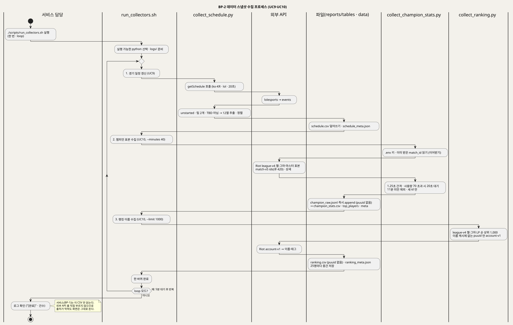

PlantUML 소스 보기

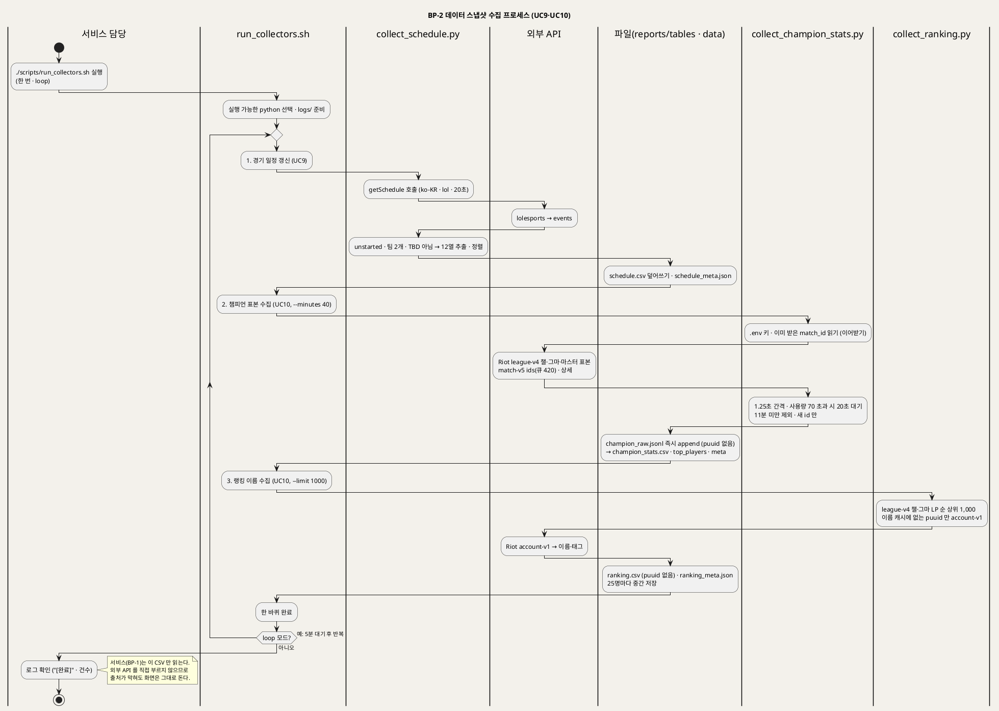
```plantuml
@startuml bp_2_collect
skinparam backgroundColor #F3F1EB
skinparam shadowing false
skinparam activityFontSize 12
skinparam noteFontSize 11
title BP-2 데이터 스냅샷 수집 프로세스 (UC9·UC10)

|서비스 담당|
start
:./scripts/run_collectors.sh 실행
(한 번 · loop);
|run_collectors.sh|
:실행 가능한 python 선택 · logs/ 준비;
repeat
  :1. 경기 일정 갱신 (UC9);
  |collect_schedule.py|
  :getSchedule 호출 (ko-KR · lol · 20초);
  |외부 API|
  :lolesports → events;
  |collect_schedule.py|
  :unstarted · 팀 2개 · TBD 아님 → 12열 추출 · 정렬;
  |파일(reports/tables · data)|
  :schedule.csv 덮어쓰기 · schedule_meta.json;
  |run_collectors.sh|
  :2. 챔피언 표본 수집 (UC10, --minutes 40);
  |collect_champion_stats.py|
  :.env 키 · 이미 받은 match_id 읽기 (이어받기);
  |외부 API|
  :Riot league-v4 챌·그마·마스터 표본
  match-v5 ids(큐 420) · 상세;
  |collect_champion_stats.py|
  :1.25초 간격 · 사용량 70 초과 시 20초 대기
  11분 미만 제외 · 새 id 만;
  |파일(reports/tables · data)|
  :champion_raw.jsonl 즉시 append (puuid 없음)
  → champion_stats.csv · top_players · meta;
  |run_collectors.sh|
  :3. 랭킹 이름 수집 (UC10, --limit 1000);
  |collect_ranking.py|
  :league-v4 챌·그마 LP 순 상위 1,000
  이름 캐시에 없는 puuid 만 account-v1;
  |외부 API|
  :Riot account-v1 → 이름·태그;
  |파일(reports/tables · data)|
  :ranking.csv (puuid 없음) · ranking_meta.json
  25명마다 중간 저장;
  |run_collectors.sh|
  :한 바퀴 완료;
repeat while (loop 모드?) is (예: 5분 대기 후 반복) not (아니오)
|서비스 담당|
:로그 확인 ("[완료]" · 건수);
note right
  서비스(BP-1)는 이 CSV 만 읽는다.
  외부 API 를 직접 부르지 않으므로
  출처가 막혀도 화면은 그대로 돈다.
end note
stop
@enduml
```

소스를 직접 렌더하려면 **[「BP-2 데이터 스냅샷 수집 프로세스」 PlantUML 뷰어로 열기](https://plantuml.sumzip.com/plantuml/svg/eNqNVU1PG1cU3c-vuEo3Yyk2HgdUlSyaQotUtQsUmm6qyhrGU3vKeGY082xE5cUAk8hgV4HGgGnGKVVNKFHaGHBtU9GNf0qXfm_-Q-97xkASitj4493Pc8959z3wiOqSQt6EeSedSmu2aeoakbwFw3JUV83DvKotZF27YGWmbdN24YOZezPKZ1NXPLycmrEXDSsL36mmp1-xqBoxigZZmrEtMmf8oIOSumK1bKJfWhSJGMTUYWo2ngL6Y4s12lHQArbepKuP2WoXWLnODjYhqgX015AFPbSA_Gj6o3730bSSjElSiQUhPQ34Oa20aeW0JAlw0mRizNNcwyHemFuwRhht10t4OWCVZrS9JsnRVgj0uAz9Lpi27cTuS6X3nEvS5NAdBi2fru_zGGeJ5GwLWLAXrTaG0VlvDFjTx17uS67u6CqRACaVBAyO_xn0EFPjjO1tYY4jVtkTGLAaQOm8VtrTcnqmYOoJZ6nEI7M6mTs_gqjeY50Q5AU7_sXDYTmTf6WSrF0epmG7Pdrx4ZPZz0U0OuieY7vEg3-f_AR6UbeId2O9giXmpmd44qjqQ2rQCvnvr6Y-BbYV0EpdpFJSbKcNrFPjHaEZQdG91yJ1VK0iShnR88JjRJ3HJrhPRiVqTFS5qKp5RST8T7bdZs9afD7oNjKm8zpRE997tiXSXsMIZkolgB3VotoZ2-5BtBnSk95ILTLXxl2Ix_OGVSDYwnjy7VlrOTXvGLaVRsjEG00goVtFiFaaAlWjTd_0gLaes4YPeZVoubSRwWPBpYxm7Byt-O_a-T80bAKmrmYLerw4jp1W-91Bt0cPyv0ufqBcuc6HbaO_KBAvToCR8eRoeQPGU8mY6GN1GVV_i-aVRGoCxYD6CgbHhyJ05TX7-ZD-sgYfJgFNg5Mz1H04FA3Qqo-9Y6Si0E4ACJYeVJHMEIEMC5exGcDD21J70ZerLgryTGAv13hF1XF0KwOyUyjwGe48YY1qDEO4nN5Bw2WBWYntpB1TXdJdUYTr4QYp3EsAffFHtHIqaHsZvKcD08gbBJRk8h0duKqFiyk7muG1fMGXs5gvFEyEASh3MQs6jyr9vYEI2c4Gh0XXazDEyGepahouUBIvKv8rkEsXMYthzn43Wg2x9m3nPgLBR_f2iLnfufXySmFIaoK-eozQaKWJK2sTJYPE--zF_g0zFpuyVYt8vPu7Af2tOtpysJgzcEXJfH8CffU7fRZ-HAPDw0tSL0_ChFCXEBtEz_Fnq05P_orxdwA9-Fops3ozdt0en8SVj3OAaHeLNXog3_lmWPnbOxzY4KiNNCOf_EUB18jm-MK9yCLjk6LEOCM4VZie-1pwgvcXjxB3gvteMAJ0H-_GwTLb2wQ8ovttduDj0ltn4Rl942Mf3L0TsuM6vgGYaS2q-_RpgK3V6GGbrwgulir3BPq0LApwyfPe8D2yHekB_sUHV_oPJXZrmw==)** (사내 서버, SSO 로그인 필요) 또는 [로컬 Kroki 로 열기](http://192.168.0.91:8889/plantuml/svg/eNqNVU1PG1cU3c-vuEo3Yyk2HgdUlSyaQotUtQsUmm6qyhrGU3vKeGY082xE5cUAk8hgV4HGgGnGKVVNKFHaGHBtU9GNf0qXfm_-Q-97xkASitj4493Pc8959z3wiOqSQt6EeSedSmu2aeoakbwFw3JUV83DvKotZF27YGWmbdN24YOZezPKZ1NXPLycmrEXDSsL36mmp1-xqBoxigZZmrEtMmf8oIOSumK1bKJfWhSJGMTUYWo2ngL6Y4s12lHQArbepKuP2WoXWLnODjYhqgX015AFPbSA_Gj6o3730bSSjElSiQUhPQ34Oa20aeW0JAlw0mRizNNcwyHemFuwRhht10t4OWCVZrS9JsnRVgj0uAz9Lpi27cTuS6X3nEvS5NAdBi2fru_zGGeJ5GwLWLAXrTaG0VlvDFjTx17uS67u6CqRACaVBAyO_xn0EFPjjO1tYY4jVtkTGLAaQOm8VtrTcnqmYOoJZ6nEI7M6mTs_gqjeY50Q5AU7_sXDYTmTf6WSrF0epmG7Pdrx4ZPZz0U0OuieY7vEg3-f_AR6UbeId2O9giXmpmd44qjqQ2rQCvnvr6Y-BbYV0EpdpFJSbKcNrFPjHaEZQdG91yJ1VK0iShnR88JjRJ3HJrhPRiVqTFS5qKp5RST8T7bdZs9afD7oNjKm8zpRE997tiXSXsMIZkolgB3VotoZ2-5BtBnSk95ILTLXxl2Ix_OGVSDYwnjy7VlrOTXvGLaVRsjEG00goVtFiFaaAlWjTd_0gLaes4YPeZVoubSRwWPBpYxm7Byt-O_a-T80bAKmrmYLerw4jp1W-91Bt0cPyv0ufqBcuc6HbaO_KBAvToCR8eRoeQPGU8mY6GN1GVV_i-aVRGoCxYD6CgbHhyJ05TX7-ZD-sgYfJgFNg5Mz1H04FA3Qqo-9Y6Si0E4ACJYeVJHMEIEMC5exGcDD21J70ZerLgryTGAv13hF1XF0KwOyUyjwGe48YY1qDEO4nN5Bw2WBWYntpB1TXdJdUYTr4QYp3EsAffFHtHIqaHsZvKcD08gbBJRk8h0duKqFiyk7muG1fMGXs5gvFEyEASh3MQs6jyr9vYEI2c4Gh0XXazDEyGepahouUBIvKv8rkEsXMYthzn43Wg2x9m3nPgLBR_f2iLnfufXySmFIaoK-eozQaKWJK2sTJYPE--zF_g0zFpuyVYt8vPu7Af2tOtpysJgzcEXJfH8CffU7fRZ-HAPDw0tSL0_ChFCXEBtEz_Fnq05P_orxdwA9-Fops3ozdt0en8SVj3OAaHeLNXog3_lmWPnbOxzY4KiNNCOf_EUB18jm-MK9yCLjk6LEOCM4VZie-1pwgvcXjxB3gvteMAJ0H-_GwTLb2wQ8ovttduDj0ltn4Rl942Mf3L0TsuM6vgGYaS2q-_RpgK3V6GGbrwgulir3BPq0LApwyfPe8D2yHekB_sUHV_oPJXZrmw==) (내부망 전용). 위 그림 파일은 로그인 없이 보인다.

| 구간 | 대응 UC | 이어받기 | 외부 호출 | 산출물 |
|---|:--:|:--:|---|---|
| 1. 경기 일정 갱신 | UC9 | 아니오 (덮어쓰기) | lolesports 1회 | `schedule.csv` · `schedule_meta.json` |
| 2. 챔피언 표본 수집 (40분) | UC10 | 예 (`champion_raw.jsonl` 의 match_id) | Riot league-v4 · match-v5 수천 회, 1.25초 간격 | `champion_stats.csv` · `champion_top_players.csv` · `champion_stats_meta.json` |
| 3. 랭킹 이름 수집 | UC10 | 예 (`ranking_names.jsonl` 캐시) | Riot league-v4 · account-v1 최대 1,000회 | `ranking.csv` · `ranking_meta.json` |

### 3.3 BP-3 모델 변경·검증·배포 프로세스 (UC11·UC12·UC13)

팀원이 무언가를 바꾼 순간부터 그것이 공개 주소에서 보일 때까지다. 검증(UC12)이 두 번 나온다. 팀원 PC 에서 `verify` 로 한 번, 팀 서버에서 `deploy` 가 `test` 로 한 번 더. 두 번째는 서버가 떠 있어야만 도는 파리티·스모크가 추가된다.

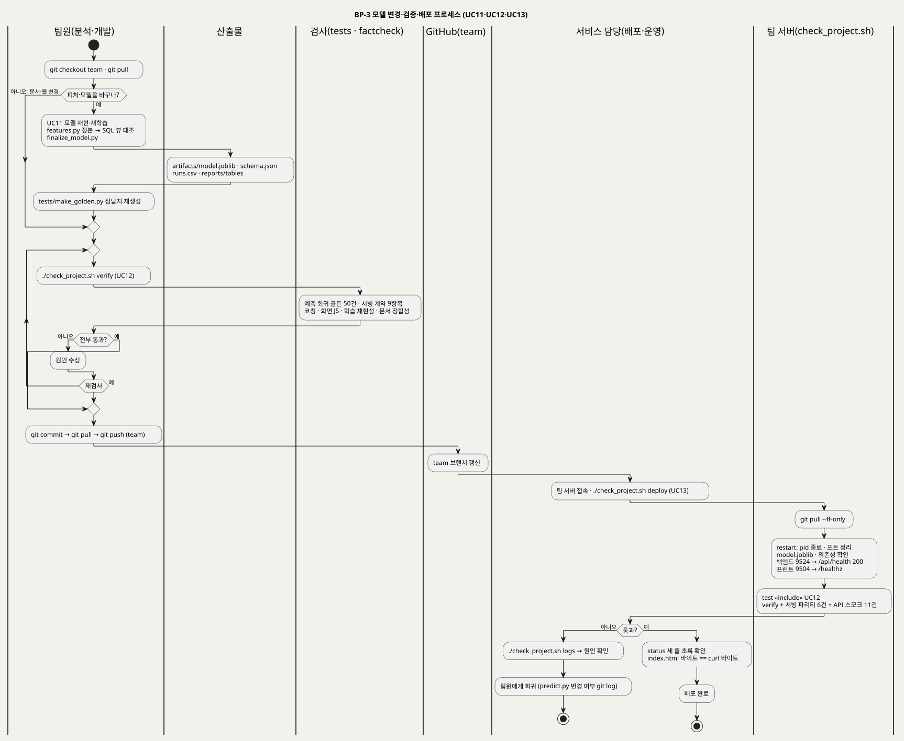

PlantUML 소스 보기

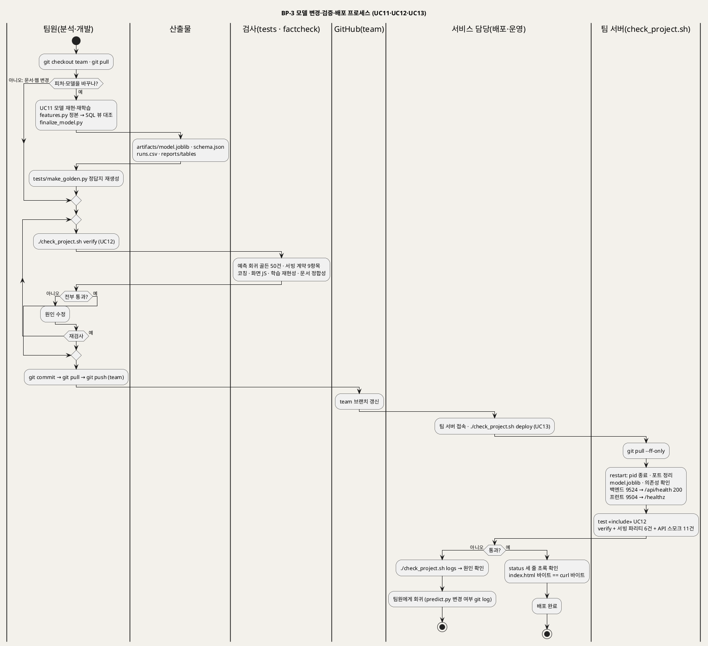
```plantuml
@startuml bp_3_release
skinparam backgroundColor #F3F1EB
skinparam shadowing false
skinparam activityFontSize 12
skinparam noteFontSize 11
title BP-3 모델 변경·검증·배포 프로세스 (UC11·UC12·UC13)

|팀원(분석·개발)|
start
:git checkout team · git pull;
if (피처·모델을 바꾸나?) then (예)
  :UC11 모델 재현·재학습
  features.py 정본 → SQL 뷰 대조
  finalize_model.py;
  |산출물|
  :artifacts/model.joblib · schema.json
  runs.csv · reports/tables;
  |팀원(분석·개발)|
  :tests/make_golden.py 정답지 재생성;
else (아니오: 문서·웹 변경)
endif
repeat
  :./check_project.sh verify (UC12);
  |검사(tests · factcheck)|
  :예측 회귀 골든 50건 · 서빙 계약 9항목
  코칭 · 화면 JS · 학습 재현성 · 문서 정합성;
  |팀원(분석·개발)|
  if (전부 통과?) then (아니오)
    :원인 수정;
  else (예)
    break
  endif
repeat while (재검사) is (예)
:git commit → git pull → git push (team);
|GitHub(team)|
:team 브랜치 갱신;
|서비스 담당(배포·운영)|
:팀 서버 접속 · ./check_project.sh deploy (UC13);
|팀 서버(check_project.sh)|
:git pull --ff-only;
:restart: pid 종료 · 포트 정리
model.joblib · 의존성 확인
백엔드 9524 → /api/health 200
프런트 9504 → /healthz;
:test «include» UC12
verify + 서빙 파리티 6건 + API 스모크 11건;
|서비스 담당(배포·운영)|
if (통과?) then (아니오)
  :./check_project.sh logs → 원인 확인;
  :팀원에게 회귀 (predict.py 변경 여부 git log);
  stop
else (예)
  :status 세 줄 초록 확인
  index.html 바이트 == curl 바이트;
  :배포 완료;
  stop
endif
@enduml
```

소스를 직접 렌더하려면 **[「BP-3 모델 변경·검증·배포 프로세스」 PlantUML 뷰어로 열기](https://plantuml.sumzip.com/plantuml/svg/eNqNVV1vGkcUfd9fcaW-gCJjA3UlY0VNE9X9UB9SWX1GCwywZtld7Q5OHfFA3K1lGaK4DcgQg2taK41TIq0xNqDafeCn9JGZ_Q-9Mwu1E6VRX3a1M_feOfecc2fvOVS1aamoQ8pKxpM20YnqEMUpaIal2moRUmq6kLPNkpF5YOqmDR-txdein9-_FeHk1Yz5SDNykFX1t3LVNNU2Nbq1Zhp0XXtMIBq7tWuYlNzsRBWqUZ3A_YcLcWCvX7GnI2DnlWn_ejKc9iv8ZWcyZJ7nP-uBX3dZt83dEd87gdB3D6LRyRCfMfmMhxWl7Ncq_HA_xC5d7mLe1Gszrx0uK7JZJZHTKKTzJF0wSxQoQSyTIYhFq6Trq4qWhZBfv-L9Jh4pkfCOC8yrT_8ase3mp2GgeWJAiDd3wwpAQiCYQ-ZHPb_pTobi3WjxvQsMyBKVlmziRKwt4McNdj6Cv3d-hvVvvwE29IAh2K4n4jRD1ZGMZNHMEB2jV3GxzLc9ftlmvauyOAvxa1nk1VkMgjbMlK6lBH4HOyqqkQ3HNDDQLhlOJO1sih2bWKaNGVRN6cSRRf-LIDyBEkdUVwskmTP1DDHmsKsX_PeKaJD_0OHu2apCUG1koeGy6i5vniSA9UbcbWPzh-OZdmGFGBktqyAEJEGUjyxK5pOWbW6QNI04edgktpbdkkrGwhKeEHy7F5JQRAeiY5kWQETi-agL_ovadFiB6fkr9vwYlpemZwMRjBDYuIXLLm9cw4rfeMNen2Iav67z8RsR4bfq7HQAX6_LDynTTDjsS6wFjYiu_cap7PWDnAnD8GOXXVbA37mYnl_dWGROjjCKQH64zzvokt0m1hZVZxwGTgJI2UQtiOVbrMGjvKaLoKNewEsYNGeWE1jZLBbxJTw1N_GtDyQ4JDyOzJa_0OiXpVTwWVYS0vpsVGNHbT5uwtQ749VjDJMMumK6WHXAquNQMHgo7IsBbz4RqUiGJLrvIks_8Z2ngrb3aJshlm4G2sYFgpu80Luxouy_-BcWstkF09BxBhI4OmJuE2BpGeC__sh-q0nhnvX8vZG05sue8u448E6TdwdCT7_VQM4Vht0d1NnzNqwsxz6WBC2qlraYJ6pO8xBbWlLExfKLJ4quLC_NQoLtx6uKHAyY_KEZab2UIZM_QfhVmZn3ztx2fq2GcPyqB58IP96Bzx5-BUgl3g_-kx7ec7j6vyiWt9AH3PS-SdLNnCNhz3wWtC58lgjcyw_2p_3afHJClk0yGqbihAfzCvygJ2wsdMBichodalrKWz5NoB605GDLSP8JOmCwy7qdOdE4D0aGfB_JU_yr4K3JOwNB6d27kC7Zt1YkrNmVzlsuqnpzmrT_PXzhn0n5ByrUH2Q=)** (사내 서버, SSO 로그인 필요) 또는 [로컬 Kroki 로 열기](http://192.168.0.91:8889/plantuml/svg/eNqNVV1vGkcUfd9fcaW-gCJjA3UlY0VNE9X9UB9SWX1GCwywZtld7Q5OHfFA3K1lGaK4DcgQg2taK41TIq0xNqDafeCn9JGZ_Q-9Mwu1E6VRX3a1M_feOfecc2fvOVS1aamoQ8pKxpM20YnqEMUpaIal2moRUmq6kLPNkpF5YOqmDR-txdein9-_FeHk1Yz5SDNykFX1t3LVNNU2Nbq1Zhp0XXtMIBq7tWuYlNzsRBWqUZ3A_YcLcWCvX7GnI2DnlWn_ejKc9iv8ZWcyZJ7nP-uBX3dZt83dEd87gdB3D6LRyRCfMfmMhxWl7Ncq_HA_xC5d7mLe1Gszrx0uK7JZJZHTKKTzJF0wSxQoQSyTIYhFq6Trq4qWhZBfv-L9Jh4pkfCOC8yrT_8ase3mp2GgeWJAiDd3wwpAQiCYQ-ZHPb_pTobi3WjxvQsMyBKVlmziRKwt4McNdj6Cv3d-hvVvvwE29IAh2K4n4jRD1ZGMZNHMEB2jV3GxzLc9ftlmvauyOAvxa1nk1VkMgjbMlK6lBH4HOyqqkQ3HNDDQLhlOJO1sih2bWKaNGVRN6cSRRf-LIDyBEkdUVwskmTP1DDHmsKsX_PeKaJD_0OHu2apCUG1koeGy6i5vniSA9UbcbWPzh-OZdmGFGBktqyAEJEGUjyxK5pOWbW6QNI04edgktpbdkkrGwhKeEHy7F5JQRAeiY5kWQETi-agL_ovadFiB6fkr9vwYlpemZwMRjBDYuIXLLm9cw4rfeMNen2Iav67z8RsR4bfq7HQAX6_LDynTTDjsS6wFjYiu_cap7PWDnAnD8GOXXVbA37mYnl_dWGROjjCKQH64zzvokt0m1hZVZxwGTgJI2UQtiOVbrMGjvKaLoKNewEsYNGeWE1jZLBbxJTw1N_GtDyQ4JDyOzJa_0OiXpVTwWVYS0vpsVGNHbT5uwtQ749VjDJMMumK6WHXAquNQMHgo7IsBbz4RqUiGJLrvIks_8Z2ngrb3aJshlm4G2sYFgpu80Luxouy_-BcWstkF09BxBhI4OmJuE2BpGeC__sh-q0nhnvX8vZG05sue8u448E6TdwdCT7_VQM4Vht0d1NnzNqwsxz6WBC2qlraYJ6pO8xBbWlLExfKLJ4quLC_NQoLtx6uKHAyY_KEZab2UIZM_QfhVmZn3ztx2fq2GcPyqB58IP96Bzx5-BUgl3g_-kx7ec7j6vyiWt9AH3PS-SdLNnCNhz3wWtC58lgjcyw_2p_3afHJClk0yGqbihAfzCvygJ2wsdMBichodalrKWz5NoB605GDLSP8JOmCwy7qdOdE4D0aGfB_JU_yr4K3JOwNB6d27kC7Zt1YkrNmVzlsuqnpzmrT_PXzhn0n5ByrUH2Q=) (내부망 전용). 위 그림 파일은 로그인 없이 보인다.

| 구간 | 대응 UC | 관문(통과 못 하면) | 근거 |
|---|:--:|---|---|
| 재학습 → 정답지 재생성 | UC11 | 복원 assert 실패 시 산출물 무효 (E4) | `lolwin/artifacts.py`, `tests/make_golden.py` |
| verify | UC12 | 골든·계약·코칭·JS·재현성·factcheck 중 하나라도 실패 시 커밋 금지 | `CLAUDE.md` "무엇을 고치든 통과해야 하는 것" |
| push → deploy | UC13 | `git pull --ff-only` 실패 시 재시작으로 넘어가지 않음 (E1) | `check_project.sh` |
| test (서버 위) | UC12 «include» | 파리티 6건 · 스모크 11건 실패 시 logs → 회귀 (E6) | `docs/deploy.md` |
| 배포 확인 | UC13 | status 세 줄 초록 + 바이트 비교 (E7·E8) | `docs/deploy.md`, `docs/troubleshooting.md` 3번 |

### 3.4 BP-4 일일 운영 루틴 (UC14·UC13·UC9·UC10)

`docs/deploy.md` 의 "매일 / 누가 push 한 뒤 / 발표 당일" 절을 하나의 하루로 이어 붙였다. 첫 일은 열쇠다. 개발용 키는 24시간마다 죽으므로 아침에 갈아 끼우지 않으면 소환사 검색이 꺼진다.

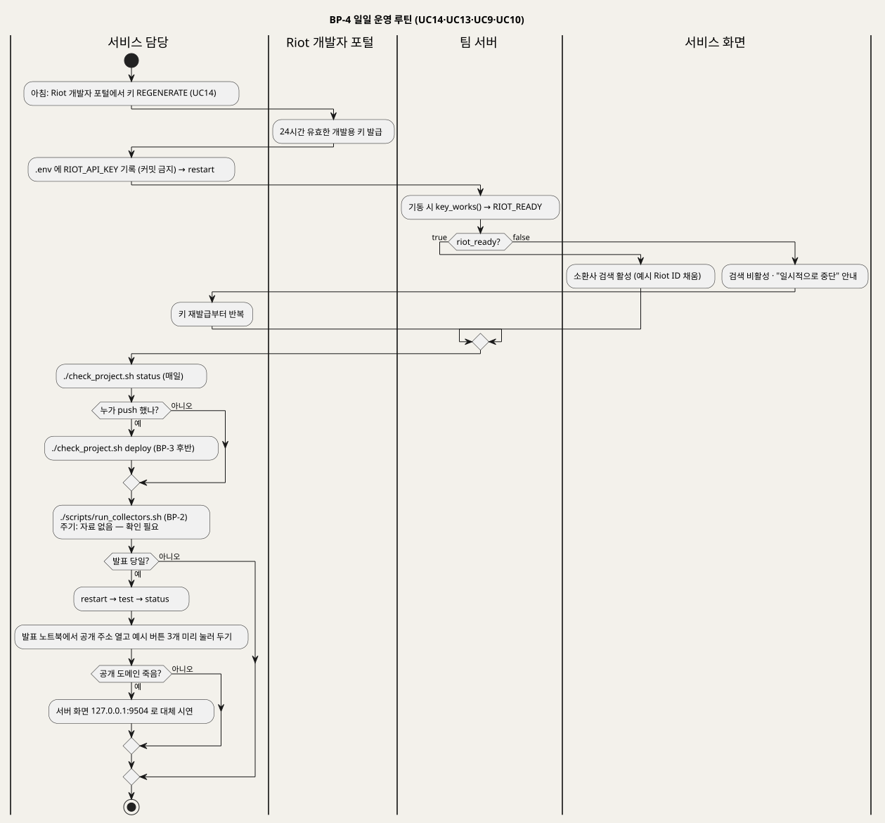

PlantUML 소스 보기

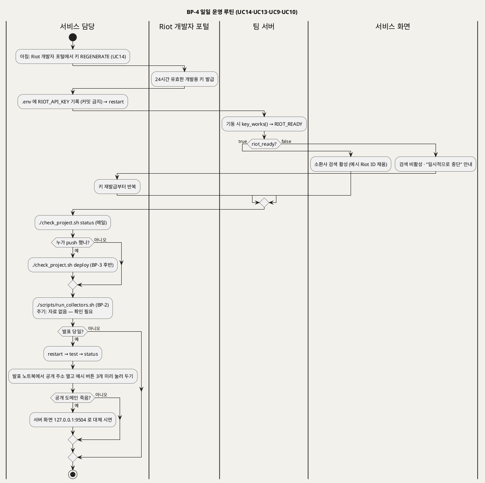
```plantuml
@startuml bp_4_daily
skinparam backgroundColor #F3F1EB
skinparam shadowing false
skinparam activityFontSize 12
skinparam noteFontSize 11
title BP-4 일일 운영 루틴 (UC14·UC13·UC9·UC10)

|서비스 담당|
start
:아침: Riot 개발자 포털에서 키 REGENERATE (UC14);
|Riot 개발자 포털|
:24시간 유효한 개발용 키 발급;
|서비스 담당|
:.env 에 RIOT_API_KEY 기록 (커밋 금지) → restart;
|팀 서버|
:기동 시 key_works() → RIOT_READY;
if (riot_ready?) then (true)
  |서비스 화면|
  :소환사 검색 활성 (예시 Riot ID 채움);
else (false)
  :검색 비활성 · "일시적으로 중단" 안내;
  |서비스 담당|
  :키 재발급부터 반복;
endif
|서비스 담당|
:./check_project.sh status (매일);
if (누가 push 했나?) then (예)
  :./check_project.sh deploy (BP-3 후반);
else (아니오)
endif
:./scripts/run_collectors.sh (BP-2)
주기: 자료 없음 — 확인 필요;
if (발표 당일?) then (예)
  :restart → test → status;
  :발표 노트북에서 공개 주소 열고 예시 버튼 3개 미리 눌러 두기;
  if (공개 도메인 죽음?) then (예)
    :서버 화면 127.0.0.1:9504 로 대체 시연;
  else (아니오)
  endif
else (아니오)
endif
stop
@enduml
```

소스를 직접 렌더하려면 **[「BP-4 일일 운영 루틴」 PlantUML 뷰어로 열기](https://plantuml.sumzip.com/plantuml/svg/eNp1VN9P2lAYfe9f8WV7oQ9TUZbF8jB_4WKWbIa5B59Ihaod2JK2aFh4QNcZFBJxgYlYnEYyMSEZKipm7MU_xUfu7f-w75bq2HSBlI_e-517zvlOO6IbomYklmIwFw_5QhFRjiU5PSorcVETl2BODEcXNDWhRMbVmKrB08mhSW9grGeHvihG1BVZWYB5MaZLPSti2JCXZSM5qSrGO_mjBN7BnlVFNaQ_K17OkI2YBGPTz3xAK238Ai03aWkVyFHNzjbB837c67u5wusQuw475QDPcSlqWuTapJtVINkmyV6nOEcTJ9CiSa9rAgRl1YBOwyINi-7nwd6q22aL7uSxEey1KgQDrwJvAsHRmUD3FN7PpR7tSXHCoI9mrU7DBGod2OWaXbTudpVPHDAsO60N_2O0hD5JWQY8GIJTb2dCo9NTodeBWei0GuSwAh76s0oaWfybocdpHm7Xv4AmOVIQzc6lgSGemYjDOrZ2AZlAVEqGVlQtqnu6HQ5yMDA6Mevn5HnwaKgjpEliJPmSB2NRUsBjaAmJ5wB6GNq7BXLSTOFNga7n7N0SXatD5yxNP23gmkXNU6RXyrADHWOmJoCemnQvjVZJOHXwOMNnqILbhshu580VPGEjzVr0YJVabXJoAa1uk2ztCdBihqw1_X-zufMLwZijdL_eNZVcpm2zgQ6XyPkFHqxE5PnHfe4PL0rhaCiuqR-ksNGnLwL6aCR08JDjKnLhu-aQjNlppCGewA32V2RSujcJ1TpqHoGKSPGYmgQPZnUI7D0T-dzbgJEj2QwtVXmXHgLoYU2OG3q_llBCYTUWQxhV0xkSgxjkOXrUxokKKDRPjnIYkHVaycFtuoDeF2mlBTYGuVxwOTcse9tCrdeo4wFdNzBOFAysnaKrnZks3HV_btmbLXK56j4FnfMLTDEgERw_Emh2zg_AHThGzt5swxDbQH60yPc6kEyOfMOf7TzyZriMmItBtkxyUmCs6dEv1PEvRRYxJ8du6PCt8KJvAD9eYfj5gA9YOkguTc-aLN90x8F_YC7ecuz9j-u6oca5Eazxxcb9BtBeVDM=)** (사내 서버, SSO 로그인 필요) 또는 [로컬 Kroki 로 열기](http://192.168.0.91:8889/plantuml/svg/eNp1VN9P2lAYfe9f8WV7oQ9TUZbF8jB_4WKWbIa5B59Ihaod2JK2aFh4QNcZFBJxgYlYnEYyMSEZKipm7MU_xUfu7f-w75bq2HSBlI_e-517zvlOO6IbomYklmIwFw_5QhFRjiU5PSorcVETl2BODEcXNDWhRMbVmKrB08mhSW9grGeHvihG1BVZWYB5MaZLPSti2JCXZSM5qSrGO_mjBN7BnlVFNaQ_K17OkI2YBGPTz3xAK238Ai03aWkVyFHNzjbB837c67u5wusQuw475QDPcSlqWuTapJtVINkmyV6nOEcTJ9CiSa9rAgRl1YBOwyINi-7nwd6q22aL7uSxEey1KgQDrwJvAsHRmUD3FN7PpR7tSXHCoI9mrU7DBGod2OWaXbTudpVPHDAsO60N_2O0hD5JWQY8GIJTb2dCo9NTodeBWei0GuSwAh76s0oaWfybocdpHm7Xv4AmOVIQzc6lgSGemYjDOrZ2AZlAVEqGVlQtqnu6HQ5yMDA6Mevn5HnwaKgjpEliJPmSB2NRUsBjaAmJ5wB6GNq7BXLSTOFNga7n7N0SXatD5yxNP23gmkXNU6RXyrADHWOmJoCemnQvjVZJOHXwOMNnqILbhshu580VPGEjzVr0YJVabXJoAa1uk2ztCdBihqw1_X-zufMLwZijdL_eNZVcpm2zgQ6XyPkFHqxE5PnHfe4PL0rhaCiuqR-ksNGnLwL6aCR08JDjKnLhu-aQjNlppCGewA32V2RSujcJ1TpqHoGKSPGYmgQPZnUI7D0T-dzbgJEj2QwtVXmXHgLoYU2OG3q_llBCYTUWQxhV0xkSgxjkOXrUxokKKDRPjnIYkHVaycFtuoDeF2mlBTYGuVxwOTcse9tCrdeo4wFdNzBOFAysnaKrnZks3HV_btmbLXK56j4FnfMLTDEgERw_Emh2zg_AHThGzt5swxDbQH60yPc6kEyOfMOf7TzyZriMmItBtkxyUmCs6dEv1PEvRRYxJ8du6PCt8KJvAD9eYfj5gA9YOkguTc-aLN90x8F_YC7ecuz9j-u6oca5Eazxxcb9BtBeVDM=) (내부망 전용). 위 그림 파일은 로그인 없이 보인다.

| 시점 | 활동 | 대응 UC | 근거 |
|---|---|:--:|---|
| 아침 | 키 REGENERATE → `.env` → restart → `riot_ready` 확인 | UC14 | `docs/deploy.md` "Riot API 키" |
| 매일 | `status` 세 줄 확인 | UC13 A1 | `docs/deploy.md` "매일" |
| push 가 있을 때 | `deploy` | UC13 | `docs/TEAM_WORKFLOW.md` "팀 서버에 반영하기" |
| 주기 미정 | `run_collectors.sh` | UC9 · UC10 | 자료 없음 — 확인 필요 |
| 발표 당일 | restart → test → status → 예시 버튼 미리 누르기 · 도메인 죽으면 로컬 시연 | UC13 A4·A6 | `docs/deploy.md` "발표 당일" |

---

## 4. 상세 액티비티 다이어그램 (UC1~UC14)

각 다이어그램은 해당 UC 문서의 **기본흐름 단계를 활동으로, 예외흐름을 결정 가지로** 옮긴 것이다. 가지에 붙은 `(E·A 번호)` 로 UC 문서의 해당 항목을 찾는다.

### 4.1 AD-1 경기 상태 직접 입력으로 승패 예측·승리요인 확인 — [UC_01](UC_01_경기상태입력승패예측.md)

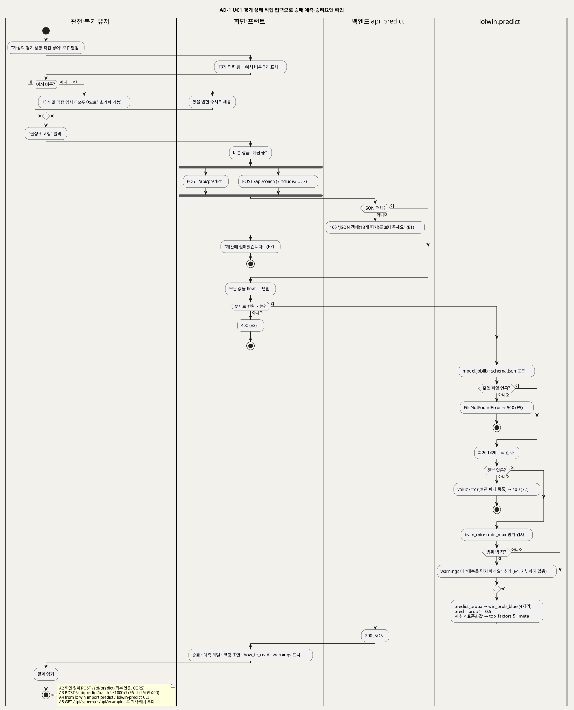

PlantUML 소스 보기

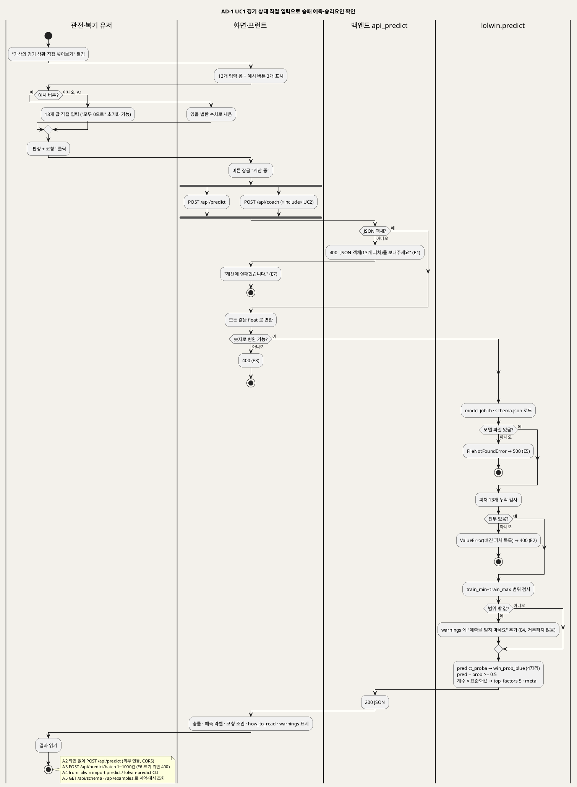
```plantuml
@startuml ad_uc01
skinparam backgroundColor #F3F1EB
skinparam shadowing false
skinparam activityFontSize 12
skinparam noteFontSize 11
title AD-1 UC1 경기 상태 직접 입력으로 승패 예측·승리요인 확인

|관전·복기 유저|
start
:"가상의 경기 상황 직접 넣어보기" 펼침;
|화면·프런트|
:13개 입력 폼 + 예시 버튼 3개 표시;
|관전·복기 유저|
if (예시 버튼?) then (예)
  |화면·프런트|
  :있을 법한 수치로 채움;
else (아니오, A1)
  |관전·복기 유저|
  :13개 값 직접 입력 ("모두 0으로" 초기화 가능);
endif
|관전·복기 유저|
:"판정 + 코칭" 클릭;
|화면·프런트|
:버튼 잠금 "계산 중";
fork
  :POST /api/predict;
fork again
  :POST /api/coach («include» UC2);
end fork
|백엔드 api_predict|
if (JSON 객체?) then (아니오)
  :400 "JSON 객체(13개 피처)를 보내주세요" (E1);
  |화면·프런트|
  :"계산에 실패했습니다." (E7);
  stop
else (예)
endif
:모든 값을 float 로 변환;
if (숫자로 변환 가능?) then (아니오)
  :400 (E3);
  stop
else (예)
endif
|lolwin.predict|
:model.joblib · schema.json 로드;
if (모델 파일 있음?) then (아니오)
  :FileNotFoundError → 500 (E5);
  stop
else (예)
endif
:피처 13개 누락 검사;
if (전부 있음?) then (아니오)
  :ValueError(빠진 피처 목록) → 400 (E2);
  stop
else (예)
endif
:train_min~train_max 범위 검사;
if (범위 밖 값?) then (예)
  :warnings 에 "예측을 믿지 마세요" 추가 (E4, 거부하지 않음);
else (아니오)
endif
:predict_proba → win_prob_blue (4자리)
pred = prob >= 0.5
계수 × 표준화값 → top_factors 5 · meta;
|백엔드 api_predict|
:200 JSON;
|화면·프런트|
:승률 · 예측 라벨 · 코칭 조언 · how_to_read · warnings 표시;
|관전·복기 유저|
:결과 읽기;
stop
note right
  A2 화면 없이 POST /api/predict (외부 연동, CORS)
  A3 POST /api/predict/batch 1~1000건 (E6 크기 위반 400)
  A4 from lolwin import predict / lolwin-predict CLI
  A5 GET /api/schema · /api/examples 로 계약·예시 조회
end note
@enduml
```

소스를 직접 렌더하려면 **[「AD-1 경기 상태 직접 입력으로 승패 예측·승리요인 확인」 PlantUML 뷰어로 열기](https://plantuml.sumzip.com/plantuml/svg/eNqFVttuGlcUfZ-v2KIvoDo2-NJKoLRxXbtqVcVV3fYVDTCYiYcZNIzrtEIRdqYRwrSxE7AhBRcrviaOOsYkxipWJfonfZxz5h-6z5nBl7q4T2bOba-91jrr-F7WEHVjMa2AmIguxoMhIbsgqxlRF9MQE-ML87q2qCamNEXT4b2ZsZnQ9CdXVmRTYkJbktV5SIpKVroyI8YN-XvZ-GFGU405-UcJQqNXZlXNkC5nQoIhG4oEk5_eCcG3UyGwW-d2xwL6eNl5XAe6v0yb60C3fiLNXVrvkm0cK545pQOg1QLtbPdO8ZPsHdEXZdrogFOr4B9ByNntPG2avVNy8pYfV2_SZj4n8I6FsM-28liBNqpX69UO-_WI-ZJutMlJG6d84PzSpWcHESHn1MrksN07dcom-c1yip2cEA6N2VbdAwjO0y68z5Gt1oG0TKfYBT7vrNdxKDIQl5wE_7VtHwfASEkqHw0IAP9VGyBMtwq0YeKeilNBFIUqPatyjo5N-ms-IkioDJ5RMclqgVZ3hmAyxE8bAANPdPuxrWfXuQe_j7w6IOtrEHRl8AFtF3Av4sLVeVLcDWA5NSEnBzYZ9jmlNdqsMIrOy_TsDVK73CZ7bwZQ6xFIt5p2pwA--8SkK3jazrovIiQ1fYHB_Wp27hsYETPySEaXEnLccKdAnBdl9fqCuCbGU-DvvZbVuLKYkHp_oOFGXdTAz8sR65hulsnzOuCGqHeiq84Xc7P3sdEGbbUvtenzyjgNjweD4LuyzO9S6ZS7tFUNkN0uoKHISpu-7FKzg4b1gX86hPUHquu1TDfXgK7uoOmdjQItvsWaZHVnmG3_kG_PGlqmLzWziytDmAn2vMm0ZB5JKppoADMHOck7tWrENV3hNd1auxz1tLylRf_02C1Fc4qmYCgMX3AXTmsJSRl-oMUUOQa9U8jGU1JaHH6Q1VSGBsl2kTC0P-MNLpVog4mOxi4NgDEjK9J9zZhh8TSt6xhPfz95BhMc3MRtjLhagCsMKZikcY4BkKcrRx4bTZO8y99e_DtRWZR4VT85a9J901MYyKtDst0IcCwuUaO3YTF0dGg0LauPvF_iQ7zHZVo3r0Hyhoi1wYT8dyyEl0RdxQzOAjOJz81Engi__0n380D2C32v0Xdl1BZRjQ-BfWxhn06lytbQShG7DdwIiwuknpZ4H7SYyNtDhflXNIZcgH-cWWjvKCCwlXAX2BR8dBeCwxMCs3ChCn9t8gzcQY-VWbiwU5CXaBIfC03PwgSzRloyxMjAWxgeRVLZ_RoQF-wh2G2yc1wagDS6pHXAB3jcAN226EaHDaS0paihRXVJTLDPCxb_L6fDdsuyT9CeDfZqRASuLXvRQJfnUwYqMjkKLjhU5AlttOFGQiHFtQ632aZFntaGYGr26zkm5uTYzcUjMdHA1Ao9CgWDQfu4jfp9gKl55IIyiVVlXuO7xyGpa2lwLyDI6YymG9CvOeKN3-kPTH35Ods0AZ9NexXdi8no4J_SQzGdUaQsjwymYuUcH1v3jUIinRclHpyseeEe_sL_I4R_AF_ZAME=)** (사내 서버, SSO 로그인 필요) 또는 [로컬 Kroki 로 열기](http://192.168.0.91:8889/plantuml/svg/eNqFVttuGlcUfZ-v2KIvoDo2-NJKoLRxXbtqVcVV3fYVDTCYiYcZNIzrtEIRdqYRwrSxE7AhBRcrviaOOsYkxipWJfonfZxz5h-6z5nBl7q4T2bOba-91jrr-F7WEHVjMa2AmIguxoMhIbsgqxlRF9MQE-ML87q2qCamNEXT4b2ZsZnQ9CdXVmRTYkJbktV5SIpKVroyI8YN-XvZ-GFGU405-UcJQqNXZlXNkC5nQoIhG4oEk5_eCcG3UyGwW-d2xwL6eNl5XAe6v0yb60C3fiLNXVrvkm0cK545pQOg1QLtbPdO8ZPsHdEXZdrogFOr4B9ByNntPG2avVNy8pYfV2_SZj4n8I6FsM-28liBNqpX69UO-_WI-ZJutMlJG6d84PzSpWcHESHn1MrksN07dcom-c1yip2cEA6N2VbdAwjO0y68z5Gt1oG0TKfYBT7vrNdxKDIQl5wE_7VtHwfASEkqHw0IAP9VGyBMtwq0YeKeilNBFIUqPatyjo5N-ms-IkioDJ5RMclqgVZ3hmAyxE8bAANPdPuxrWfXuQe_j7w6IOtrEHRl8AFtF3Av4sLVeVLcDWA5NSEnBzYZ9jmlNdqsMIrOy_TsDVK73CZ7bwZQ6xFIt5p2pwA--8SkK3jazrovIiQ1fYHB_Wp27hsYETPySEaXEnLccKdAnBdl9fqCuCbGU-DvvZbVuLKYkHp_oOFGXdTAz8sR65hulsnzOuCGqHeiq84Xc7P3sdEGbbUvtenzyjgNjweD4LuyzO9S6ZS7tFUNkN0uoKHISpu-7FKzg4b1gX86hPUHquu1TDfXgK7uoOmdjQItvsWaZHVnmG3_kG_PGlqmLzWziytDmAn2vMm0ZB5JKppoADMHOck7tWrENV3hNd1auxz1tLylRf_02C1Fc4qmYCgMX3AXTmsJSRl-oMUUOQa9U8jGU1JaHH6Q1VSGBsl2kTC0P-MNLpVog4mOxi4NgDEjK9J9zZhh8TSt6xhPfz95BhMc3MRtjLhagCsMKZikcY4BkKcrRx4bTZO8y99e_DtRWZR4VT85a9J901MYyKtDst0IcCwuUaO3YTF0dGg0LauPvF_iQ7zHZVo3r0Hyhoi1wYT8dyyEl0RdxQzOAjOJz81Engi__0n380D2C32v0Xdl1BZRjQ-BfWxhn06lytbQShG7DdwIiwuknpZ4H7SYyNtDhflXNIZcgH-cWWjvKCCwlXAX2BR8dBeCwxMCs3ChCn9t8gzcQY-VWbiwU5CXaBIfC03PwgSzRloyxMjAWxgeRVLZ_RoQF-wh2G2yc1wagDS6pHXAB3jcAN226EaHDaS0paihRXVJTLDPCxb_L6fDdsuyT9CeDfZqRASuLXvRQJfnUwYqMjkKLjhU5AlttOFGQiHFtQ632aZFntaGYGr26zkm5uTYzcUjMdHA1Ao9CgWDQfu4jfp9gKl55IIyiVVlXuO7xyGpa2lwLyDI6YymG9CvOeKN3-kPTH35Ods0AZ9NexXdi8no4J_SQzGdUaQsjwymYuUcH1v3jUIinRclHpyseeEe_sL_I4R_AF_ZAME=) (내부망 전용). 위 그림 파일은 로그인 없이 보인다.

핵심 결정은 네 개다. JSON 객체인가(E1) · 숫자인가(E3) · 13개가 다 있는가(E2) · 학습 범위 안인가(E4). 앞 셋은 거부(400)이고 넷째만 **거부하지 않고 경고**한다. 이례적인 경기를 아예 못 보게 되기 때문이다.

### 4.2 AD-2 반사실 코칭 받기 — [UC_02](UC_02_반사실코칭.md)

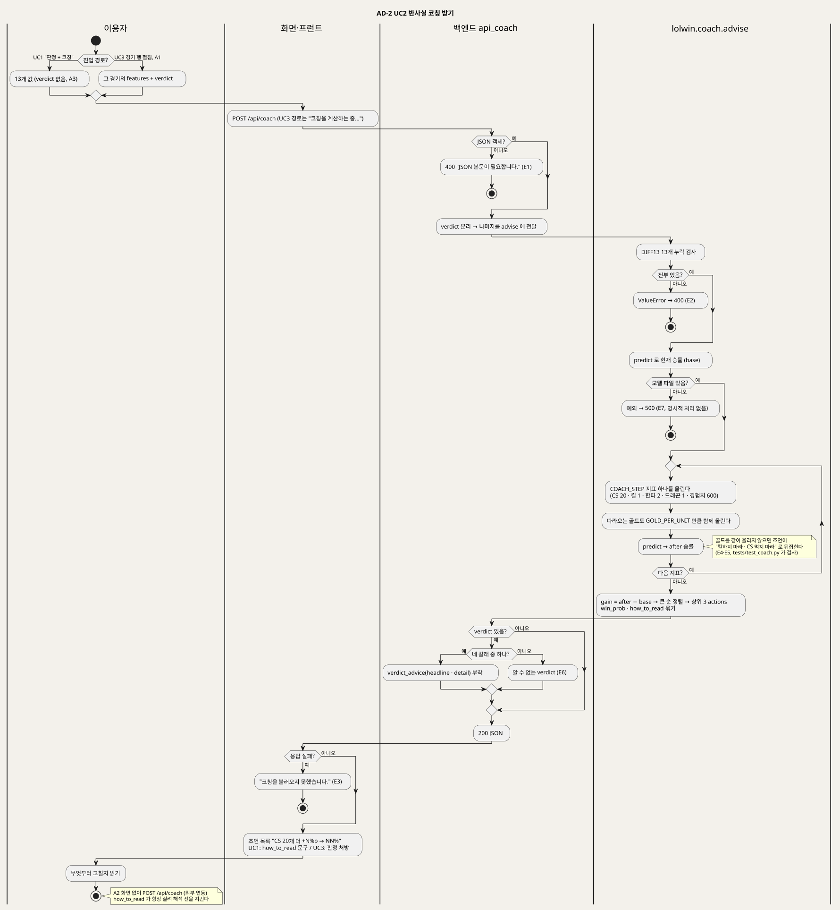

PlantUML 소스 보기

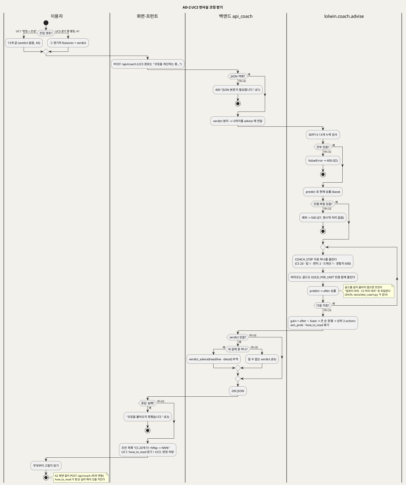
```plantuml
@startuml ad_uc02
skinparam backgroundColor #F3F1EB
skinparam shadowing false
skinparam activityFontSize 12
skinparam noteFontSize 11
title AD-2 UC2 반사실 코칭 받기

|이용자|
start
if (진입 경로?) then (UC1 "판정 + 코칭")
  :13개 값 (verdict 없음, A3);
else (UC3 경기 행 펼침, A1)
  :그 경기의 features + verdict;
endif
|화면·프런트|
:POST /api/coach (UC3 경로는 "코칭을 계산하는 중…");
|백엔드 api_coach|
if (JSON 객체?) then (아니오)
  :400 "JSON 본문이 필요합니다." (E1);
  stop
else (예)
endif
:verdict 분리 → 나머지를 advise 에 전달;
|lolwin.coach.advise|
:DIFF13 13개 누락 검사;
if (전부 있음?) then (아니오)
  :ValueError → 400 (E2);
  stop
else (예)
endif
:predict 로 현재 승률 (base);
if (모델 파일 있음?) then (아니오)
  :예외 → 500 (E7, 명시적 처리 없음);
  stop
else (예)
endif
repeat
  :COACH_STEP 지표 하나를 올린다
  (CS 20 · 킬 1 · 한타 2 · 드래곤 1 · 경험치 600);
  :따라오는 골드도 GOLD_PER_UNIT 만큼 함께 올린다;
  :predict → after 승률;
repeat while (다음 지표?) is (예) not (아니오)
note right
  골드를 같이 올리지 않으면 조언이
  "킬하지 마라 · CS 먹지 마라" 로 뒤집힌다
  (E4·E5, tests/test_coach.py 가 검사)
end note
:gain = after − base → 큰 순 정렬 → 상위 3 actions
win_prob · how_to_read 묶기;
|백엔드 api_coach|
if (verdict 있음?) then (예)
  if (네 갈래 중 하나?) then (예)
    :verdict_advice(headline · detail) 부착;
  else (아니오)
    :알 수 없는 verdict (E6);
  endif
else (아니오)
endif
:200 JSON;
|화면·프런트|
if (응답 실패?) then (예)
  :"코칭을 불러오지 못했습니다." (E3);
  stop
else (아니오)
endif
:조언 목록 "CS 20개 더 +N%p → NN%"
UC1: how_to_read 문구 / UC3: 판정 처방;
|이용자|
:무엇부터 고칠지 읽기;
stop
note right
  A2 화면 없이 POST /api/coach (외부 연동)
  how_to_read 가 항상 실려 해석 선을 지킨다
end note
@enduml
```

소스를 직접 렌더하려면 **[「AD-2 반사실 코칭 받기」 PlantUML 뷰어로 열기](https://plantuml.sumzip.com/plantuml/svg/eNp9Vl1PG1cQfd9fMXIVySgU_JGkklHVUDBtqgpQgb5ai73gVRyvtV5AqXgwZJO64DRAbbykNjGSAwY50pZPo8ALP4VH39n_0Ll3F3Cg5QUtu3Nnzpw5c66fZg1ZN2ZepEBOxGbigZCUfa6mM7Iuv4BJOf58Wtdm0okBLaXp8NVQeCgY_b4jIpuUE9qcmp6GKTmVVTq-yHFDnVWNl0Na2hhTf1Mg2Jk5rRnKzZegZKhGSoH-wa9DMDEQAmZbuNjE5TrgeRFPP9GLv9stW5LmsXqI73dxc2VeEsAldQr8uGPi5mto75-zrcp3XWAklTT4JwaC4HMKK1grwUMvka9LAogEw227Am17Dfyzip5Q4wZg-Q1WC93QH-7qkxRqhZ8P85RUF5z1P8D58wxPGxQRFDnaJy3vK1YtmFJkY0ZXslTIy0hZ0gl1Spp3Nops9_DixCma7IPtLLXmpcjoyNg49MoZtTeuyfHkdS2Cz5aK4HPBYtWE9oGJi7ZTsvh7rK9e5rZ9hHCe2f9gucj-qgBliYks84KLn8ZGhqm1Ku4fXjOBJZMt59GqC-SPAgHwiTB20GLNFlEKTsnE90WntEtxbLne4wN_NEh1ALKGlvEIQSvf5XUVueKNHZtsuwmXb9aALVqs0cKdHPt4RmKaVekMllcAa1S9SZhTWoqk0iPA9rgBxMXgs6GhYBjcmbC8yarnREWO5t_nDpeOH-cAN_M0oP9p6Vc5NaNEdZ00ypHwDv3R0H34M7ri4t-qgGORfJqAS6fsYw38k3JW6XJrs70Ge9sCp1DA6tn9ECg5brRE-cei_DfdwPZe43IFawuA-xanyVXZPbh0JUNK4vkGRvoHfoyNjUdHgSh1VgkmiYAoJnLRarJtm-ZEgf6BMQgF4OIEnMUmBMVDqeK8ykGIP5NC2KbVPqi7n0hjTtnCUwueBAICR4QVbVY9oza4wtoHDX7inQk_jPw8GBuN_hKbGH42Dmyn4CycUeZG-7N1U18kuKKSty5PGYruMdnndQNzSZWW20_x1LzXDbGoZt3WuRl8wSY3B9DV6SQnwkNEXbftDS5VUbxJWQBLS1g5o-UC3LJxnQuZDviIB6KKB7CdPLXG-yaSWOP05p1PDJ6t1XFn1dkseFRGH12cRB93g6FkjWwv_-tuVk_mJVXPebIUsxIOJkWmZTUN33ptX-bXgItHMOEs2ID5Cqm_xGruguCrBayYEBbeqKWzEm1DLKNrkxxhUpuLGVpMV-QEsOYx-cp9W35tW7ckyZUEIKRr1glznobPbcMTz-1Amp6XKcb3Ma74k1Q_paYVDimhGLKa6qIdz6G9y2ft6bVT-Fz6JZpq3uLq5hq6wuaPPhEKc5V956i3iCFaFm5Gff_plMIAqqts-QjoNnAKjdsdRDq8kh3n2YcmJRdz3vvsrOdx6ajD0cJ3Nu8OHFdJdHqXbVXBJ5ZLGNPbIjwcfpARgxwefuCT6HqJ3Jpaq33UhF66wcIR8C4evvicu86LK8Kah1j-nWh1TJsEXsPTmtBz9VyMXQD8Ygn6Q-CS4zrIIdy5QMh7hEuWbfZugxPTiYxr1yl9Iv1xFlmtTv8dolkFNGucOL6Siw2-BNfKfkpP9KNA-hepLsyP)** (사내 서버, SSO 로그인 필요) 또는 [로컬 Kroki 로 열기](http://192.168.0.91:8889/plantuml/svg/eNp9Vl1PG1cQfd9fMXIVySgU_JGkklHVUDBtqgpQgb5ai73gVRyvtV5AqXgwZJO64DRAbbykNjGSAwY50pZPo8ALP4VH39n_0Ll3F3Cg5QUtu3Nnzpw5c66fZg1ZN2ZepEBOxGbigZCUfa6mM7Iuv4BJOf58Wtdm0okBLaXp8NVQeCgY_b4jIpuUE9qcmp6GKTmVVTq-yHFDnVWNl0Na2hhTf1Mg2Jk5rRnKzZegZKhGSoH-wa9DMDEQAmZbuNjE5TrgeRFPP9GLv9stW5LmsXqI73dxc2VeEsAldQr8uGPi5mto75-zrcp3XWAklTT4JwaC4HMKK1grwUMvka9LAogEw227Am17Dfyzip5Q4wZg-Q1WC93QH-7qkxRqhZ8P85RUF5z1P8D58wxPGxQRFDnaJy3vK1YtmFJkY0ZXslTIy0hZ0gl1Spp3Nops9_DixCma7IPtLLXmpcjoyNg49MoZtTeuyfHkdS2Cz5aK4HPBYtWE9oGJi7ZTsvh7rK9e5rZ9hHCe2f9gucj-qgBliYks84KLn8ZGhqm1Ku4fXjOBJZMt59GqC-SPAgHwiTB20GLNFlEKTsnE90WntEtxbLne4wN_NEh1ALKGlvEIQSvf5XUVueKNHZtsuwmXb9aALVqs0cKdHPt4RmKaVekMllcAa1S9SZhTWoqk0iPA9rgBxMXgs6GhYBjcmbC8yarnREWO5t_nDpeOH-cAN_M0oP9p6Vc5NaNEdZ00ypHwDv3R0H34M7ri4t-qgGORfJqAS6fsYw38k3JW6XJrs70Ge9sCp1DA6tn9ECg5brRE-cei_DfdwPZe43IFawuA-xanyVXZPbh0JUNK4vkGRvoHfoyNjUdHgSh1VgkmiYAoJnLRarJtm-ZEgf6BMQgF4OIEnMUmBMVDqeK8ykGIP5NC2KbVPqi7n0hjTtnCUwueBAICR4QVbVY9oza4wtoHDX7inQk_jPw8GBuN_hKbGH42Dmyn4CycUeZG-7N1U18kuKKSty5PGYruMdnndQNzSZWW20_x1LzXDbGoZt3WuRl8wSY3B9DV6SQnwkNEXbftDS5VUbxJWQBLS1g5o-UC3LJxnQuZDviIB6KKB7CdPLXG-yaSWOP05p1PDJ6t1XFn1dkseFRGH12cRB93g6FkjWwv_-tuVk_mJVXPebIUsxIOJkWmZTUN33ptX-bXgItHMOEs2ID5Cqm_xGruguCrBayYEBbeqKWzEm1DLKNrkxxhUpuLGVpMV-QEsOYx-cp9W35tW7ckyZUEIKRr1glznobPbcMTz-1Amp6XKcb3Ma74k1Q_paYVDimhGLKa6qIdz6G9y2ft6bVT-Fz6JZpq3uLq5hq6wuaPPhEKc5V956i3iCFaFm5Gff_plMIAqqts-QjoNnAKjdsdRDq8kh3n2YcmJRdz3vvsrOdx6ajD0cJ3Nu8OHFdJdHqXbVXBJ5ZLGNPbIjwcfpARgxwefuCT6HqJ3Jpaq33UhF66wcIR8C4evvicu86LK8Kah1j-nWh1TJsEXsPTmtBz9VyMXQD8Ygn6Q-CS4zrIIdy5QMh7hEuWbfZugxPTiYxr1yl9Iv1xFlmtTv8dolkFNGucOL6Siw2-BNfKfkpP9KNA-hepLsyP) (내부망 전용). 위 그림 파일은 로그인 없이 보인다.

반복 구간이 이 UC 의 핵심이다. 다섯 지표마다 "그 지표를 올리고 **따라오는 골드도 같이 올린** 상태"를 만들어 다시 예측한다. 골드를 같이 올리지 않으면 조언이 뒤집히므로(E4·E5) 이 반복은 생략할 수 없다.

### 4.3 AD-3 소환사 최근 경기 복기·판정 — [UC_03](UC_03_소환사최근경기복기판정.md)

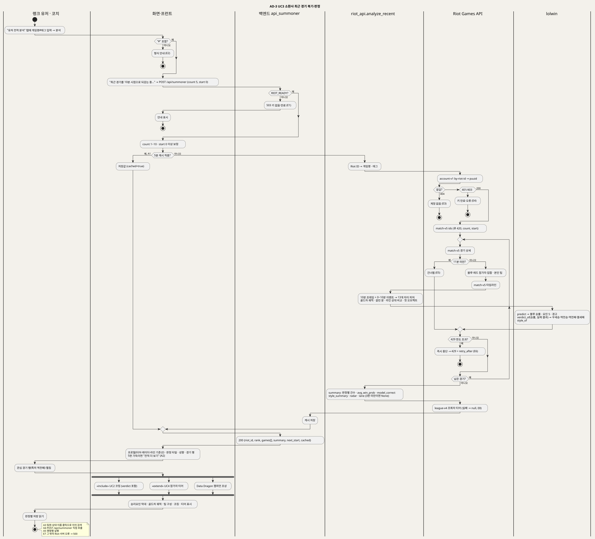

PlantUML 소스 보기

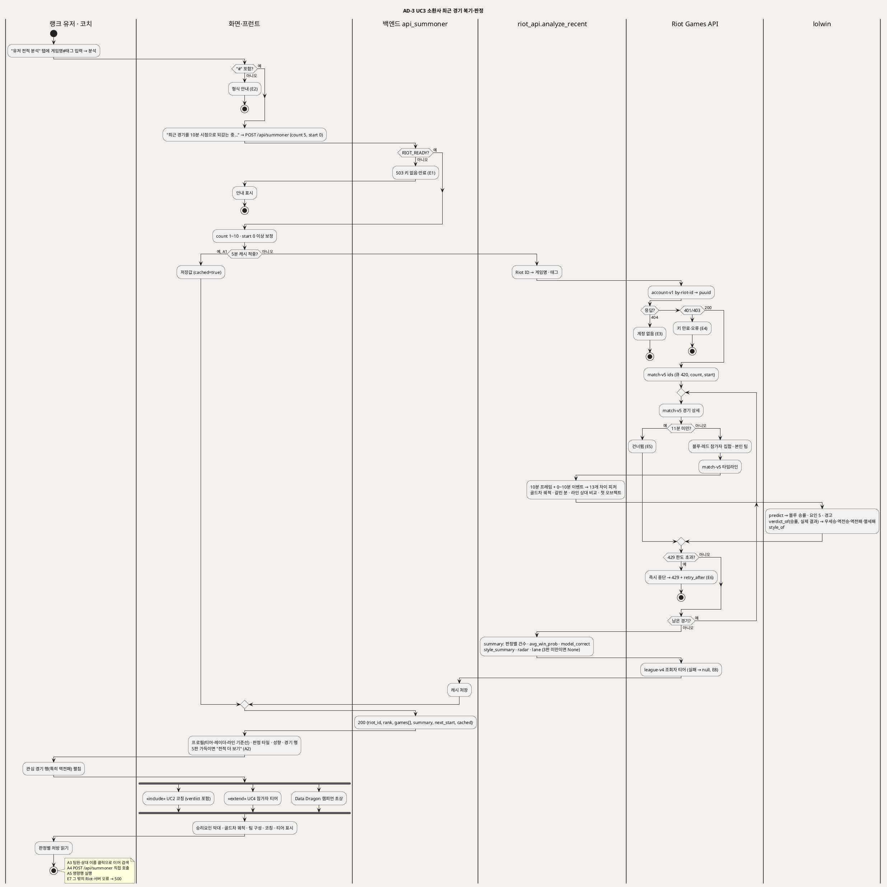
```plantuml
@startuml ad_uc03
skinparam backgroundColor #F3F1EB
skinparam shadowing false
skinparam activityFontSize 12
skinparam noteFontSize 11
title AD-3 UC3 소환사 최근 경기 복기·판정

|랭크 유저 · 코치|
start
:"유저 전적 분석" 탭에 게임명#태그 입력 → 분석;
|화면·프런트|
if ("#" 포함?) then (아니오)
  :형식 안내 (E2);
  stop
else (예)
endif
:"최근 경기를 10분 시점으로 되감는 중…" → POST /api/summoner (count 5, start 0);
|백엔드 api_summoner|
if (RIOT_READY?) then (아니오)
  :503 키 없음·만료 (E1);
  |화면·프런트|
  :안내 표시;
  stop
else (예)
endif
:count 1~10 · start 0 이상 보정;
if (5분 캐시 적중?) then (예, A1)
  :저장값 (cached=true);
else (아니오)
  |riot_api.analyze_recent|
  :Riot ID → 게임명 · 태그;
  |Riot Games API|
  :account-v1 by-riot-id → puuid;
  if (응답?) then (404)
    :계정 없음 (E3);
    stop
  elseif (401/403) then
    :키 만료·오류 (E4);
    stop
  else (200)
  endif
  :match-v5 ids (큐 420, count, start);
  repeat
    :match-v5 경기 상세;
    if (11분 미만?) then (예)
      :건너뜀 (E5);
    else (아니오)
      :블루·레드 참가자 집합 · 본인 팀;
      :match-v5 타임라인;
      |riot_api.analyze_recent|
      :10분 프레임 + 0~10분 이벤트 → 13개 차이 피처
      골드차 궤적 · 갈린 분 · 라인 상대 비교 · 첫 오브젝트;
      |lolwin|
      :predict → 블루 승률 · 요인 5 · 경고
      verdict_of(승률, 실제 결과) → 우세승·역전승·역전패·열세패
      style_of;
    endif
    |Riot Games API|
    if (429 한도 초과?) then (예)
      :즉시 중단 → 429 + retry_after (E6);
      stop
    else (아니오)
    endif
  repeat while (남은 경기?) is (예) not (아니오)
  |riot_api.analyze_recent|
  :summary: 판정별 건수 · avg_win_prob · model_correct
  style_summary · radar · lane (3판 미만이면 None);
  |Riot Games API|
  :league-v4 조회자 티어 (실패 → null, E8);
  |백엔드 api_summoner|
  :캐시 저장;
endif
:200 {riot_id, rank, games[], summary, next_start, cached};
|화면·프런트|
:프로필(티어·레이더·라인 기준선) · 판정 타일 · 성향 · 경기 행
5판 가득이면 "전적 더 보기" (A2);
|랭크 유저 · 코치|
:관심 경기 행(특히 역전패) 펼침;
|화면·프런트|
fork
  :«include» UC2 코칭 (verdict 포함);
fork again
  :«extend» UC4 참가자 티어;
fork again
  :Data Dragon 챔피언 초상;
end fork
:승리요인 막대 · 골드차 궤적 · 팀 구성 · 코칭 · 티어 표시;
|랭크 유저 · 코치|
:판정별 처방 읽기;
stop
note right
  A3 팀원·상대 이름 클릭으로 이어 검색
  A4 POST /api/summoner 직접 호출
  A5 명령행 실행
  E7 그 밖의 Riot·서버 오류 → 500
end note
@enduml
```

소스를 직접 렌더하려면 **[「AD-3 소환사 최근 경기 복기·판정」 PlantUML 뷰어로 열기](https://plantuml.sumzip.com/plantuml/svg/eNqVVltPG1cQft9fMSIvtmIaG9u9gKqGBlLlpYmS9KGqKmtjL2aF2UXrNSkpjQw4kQGnMYkNTmpTR-HagLrBJpjWeeGn5HHP2f_QmbNrY7UmUp84eOfyzXwz3zlX06ZsmJnpFMiJWCYeDEvpKVWbkQ15Gu7J8amkoWe0xDU9pRtw6Xr4emj86x6L9KSc0O-rWhIm5FRa6fkix011VjXnruuaeUd9oEBoqOerppvK-ZeQZKpmSoHRscEwfHctDPxxwXlR4YsHwI-r9kkb7KP3dssC1jjGP2cnTqHI62VJmmebh84CWlXrvJ6FsxPg70v8tDIviaqk4QHvC6_neH0B2Lscz9UGwFk65BtFjFrgmzn2x6NLzhKmaQHffMTq2_Dh8TPPdESad16U2H4Tc5Zy7HfLWWnNS-oE-AYuYZinB0557ys_mJOKBj5ezrHVPK9s-SWAYadS5qs14OU8W2yCb3zIP4I_p019RlKwVWheyfslRUuoE4Szt0623YZQEBEAX63yepFX2-xVFVixYltFtlICvrX2IbszIIDeunnnLlyRZ9Qr6cz0tK4pBvjiyJkJ0QCINkAQU88z6y3fKLHnVUDbWMfWLeb2jZt3Y7fHR8e-v6CYaDAMzuIW8I3HvFY4O2G7Bfa6gFWFRFX9moReXu3OWhXr-Ej1LtzQw1CQKPQwA681-RJy1mgi1yMCZ1T05K8ihkNKF7AN53gr-QCMhgRaZJxvbtvWM-yEHJ9UEl-aRkZBpF7q3tLmDVU3Y9iST2RNTs09UGKGElc0UxRwG7_BjTHR5-6wEEZ3XkTpwuYbeVpJw-itG8JNjouKBmdDcG9ukBIMqgkRZCaTURPkRtXw2hpbPe5WEAlGCBD62w2c1rLXbGxyWDTZax8AVUH-kWDoSiQYdv1dT-LI5ebsBAtk2xV0j_zXHXxDwSBlcxlAz2nZjE8OzkZBTaTB5ywUITIUDIAoxJsjEcZQZhTZdLN1fbz1RLp4ruUmI4ChEPHF_mwhpF6i3DKp0LdNlsuzahZRRj2UfTgStqxVYq_3cPTqeRpibrVsC2kuAt9dc8r7xAprtHitBU4hO9Lx6kJ0lrJEX62NFp2vH-NeeLtLSENdz6M3XIbgQ28xa012tIWDLmgNhW2LIO3hz2je5kcVL4Td2EO0-AXsd1skQQjTtvJsxyKFEaAFJOodK2SBnebs46JQsqM3QBS2Crxew0Rd0Ck9hYrbxThjKAk1brqiJXoEfOWUbddFkJclCh4VaZGkRt1zm1UM8orpEz7XOoBagwCraGbZjbZfxOMvLSQUDXCaNg5JRM-PTmGPjk00wKMXNm3OpRQM6lHpDVffLXFHJDL0BTjlKnuKLW3mMXHfOeE7y2Llt3Bh9gQy8ruMw2gaczF5wiTRG__UP9KFISb9gmHqwHJHGe5Pqnj3-Ngispf1RhlRqGkXA91V_0czSFllY24Y3EuKNXKAY87zFeJAnk3GkLzYjKHfo_-n9YSSisV1AwOYUqd_XggyMOSEbNAhJWsIMoxBvYWiCdxvwreo4v6LhCilyMmMMjgbAf7Kcl4WaF2cVYuv44WEdCNvoplaJpUKwPjnbpyLLgrioSO9pK8jHflGKYGfRUvURAARa1MBSBKOH35E5XBrCYCm_GTGhI6gqghV_qX_7TpM51dVp5zzuVjFzlO5T0p4dNcFOeJbWZ6r-4Uci1aLHa-1xdzn3jrr252pR2ly1pelKDUPRYM9r3nNG-i8C56U6J5BwwHwjQ6J6_Kil8Ww3czy1YOewD5n5dTZzEN3L_zg_Nrmp3v965vQjSlq5tkbVYunMgnl7G989Ay5CQ7B562m97pALOQAclJWNdcNG4mdF16RHh10m_Vv8zHZlGHMkJO6BvxticRpvUW7hoIjGASBZ5hUYOfA0wu2u0xiRO3ro1-or2AfH2CPu305FL-7k9W57j_SwvPVQKVk1j7KKTVzRBKLS49DMNTkJG3EaJjy8d-KKDauRBJ3O6jKC_jn0Hsa0VsBU9tHWb60TF6Rfu8ivrvA62vgVFr8XZWsooD3OaufIokkfzQkAOOfAb0FmbXOaxWgrcLUuSo7yoF3pdLORINB0T0CK13FEz6hpX8ATbZNjw==)** (사내 서버, SSO 로그인 필요) 또는 [로컬 Kroki 로 열기](http://192.168.0.91:8889/plantuml/svg/eNqVVltPG1cQft9fMSIvtmIaG9u9gKqGBlLlpYmS9KGqKmtjL2aF2UXrNSkpjQw4kQGnMYkNTmpTR-HagLrBJpjWeeGn5HHP2f_QmbNrY7UmUp84eOfyzXwz3zlX06ZsmJnpFMiJWCYeDEvpKVWbkQ15Gu7J8amkoWe0xDU9pRtw6Xr4emj86x6L9KSc0O-rWhIm5FRa6fkix011VjXnruuaeUd9oEBoqOerppvK-ZeQZKpmSoHRscEwfHctDPxxwXlR4YsHwI-r9kkb7KP3dssC1jjGP2cnTqHI62VJmmebh84CWlXrvJ6FsxPg70v8tDIviaqk4QHvC6_neH0B2Lscz9UGwFk65BtFjFrgmzn2x6NLzhKmaQHffMTq2_Dh8TPPdESad16U2H4Tc5Zy7HfLWWnNS-oE-AYuYZinB0557ys_mJOKBj5ezrHVPK9s-SWAYadS5qs14OU8W2yCb3zIP4I_p019RlKwVWheyfslRUuoE4Szt0623YZQEBEAX63yepFX2-xVFVixYltFtlICvrX2IbszIIDeunnnLlyRZ9Qr6cz0tK4pBvjiyJkJ0QCINkAQU88z6y3fKLHnVUDbWMfWLeb2jZt3Y7fHR8e-v6CYaDAMzuIW8I3HvFY4O2G7Bfa6gFWFRFX9moReXu3OWhXr-Ej1LtzQw1CQKPQwA681-RJy1mgi1yMCZ1T05K8ihkNKF7AN53gr-QCMhgRaZJxvbtvWM-yEHJ9UEl-aRkZBpF7q3tLmDVU3Y9iST2RNTs09UGKGElc0UxRwG7_BjTHR5-6wEEZ3XkTpwuYbeVpJw-itG8JNjouKBmdDcG9ukBIMqgkRZCaTURPkRtXw2hpbPe5WEAlGCBD62w2c1rLXbGxyWDTZax8AVUH-kWDoSiQYdv1dT-LI5ebsBAtk2xV0j_zXHXxDwSBlcxlAz2nZjE8OzkZBTaTB5ywUITIUDIAoxJsjEcZQZhTZdLN1fbz1RLp4ruUmI4ChEPHF_mwhpF6i3DKp0LdNlsuzahZRRj2UfTgStqxVYq_3cPTqeRpibrVsC2kuAt9dc8r7xAprtHitBU4hO9Lx6kJ0lrJEX62NFp2vH-NeeLtLSENdz6M3XIbgQ28xa012tIWDLmgNhW2LIO3hz2je5kcVL4Td2EO0-AXsd1skQQjTtvJsxyKFEaAFJOodK2SBnebs46JQsqM3QBS2Crxew0Rd0Ck9hYrbxThjKAk1brqiJXoEfOWUbddFkJclCh4VaZGkRt1zm1UM8orpEz7XOoBagwCraGbZjbZfxOMvLSQUDXCaNg5JRM-PTmGPjk00wKMXNm3OpRQM6lHpDVffLXFHJDL0BTjlKnuKLW3mMXHfOeE7y2Llt3Bh9gQy8ruMw2gaczF5wiTRG__UP9KFISb9gmHqwHJHGe5Pqnj3-Ngispf1RhlRqGkXA91V_0czSFllY24Y3EuKNXKAY87zFeJAnk3GkLzYjKHfo_-n9YSSisV1AwOYUqd_XggyMOSEbNAhJWsIMoxBvYWiCdxvwreo4v6LhCilyMmMMjgbAf7Kcl4WaF2cVYuv44WEdCNvoplaJpUKwPjnbpyLLgrioSO9pK8jHflGKYGfRUvURAARa1MBSBKOH35E5XBrCYCm_GTGhI6gqghV_qX_7TpM51dVp5zzuVjFzlO5T0p4dNcFOeJbWZ6r-4Uci1aLHa-1xdzn3jrr252pR2ly1pelKDUPRYM9r3nNG-i8C56U6J5BwwHwjQ6J6_Kil8Ww3czy1YOewD5n5dTZzEN3L_zg_Nrmp3v965vQjSlq5tkbVYunMgnl7G989Ay5CQ7B562m97pALOQAclJWNdcNG4mdF16RHh10m_Vv8zHZlGHMkJO6BvxticRpvUW7hoIjGASBZ5hUYOfA0wu2u0xiRO3ro1-or2AfH2CPu305FL-7k9W57j_SwvPVQKVk1j7KKTVzRBKLS49DMNTkJG3EaJjy8d-KKDauRBJ3O6jKC_jn0Hsa0VsBU9tHWb60TF6Rfu8ivrvA62vgVFr8XZWsooD3OaufIokkfzQkAOOfAb0FmbXOaxWgrcLUuSo7yoF3pdLORINB0T0CK13FEz6hpX8ATbZNjw==) (내부망 전용). 위 그림 파일은 로그인 없이 보인다.

가장 긴 흐름이다. 캐시 적중(A1)이면 Riot 호출이 0회, 아니면 경기마다 상세·타임라인을 받는 반복이 돈다. 429 는 반복 안 어디서든 즉시 중단(E6)이다. 끝나면 경기 행을 펼치는 순간 UC2·UC4 가 포크로 붙는다.

### 4.4 AD-4 참가자 솔로랭크 티어 조회 — [UC_04](UC_04_참가자티어조회.md)

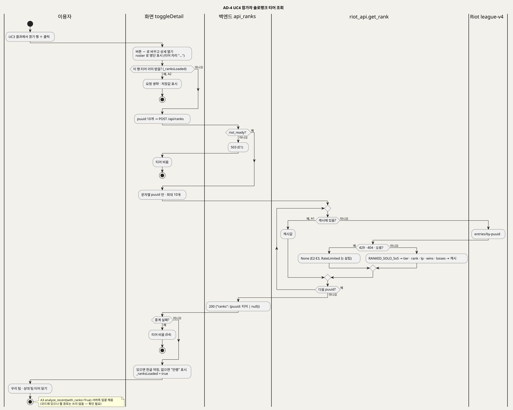

PlantUML 소스 보기

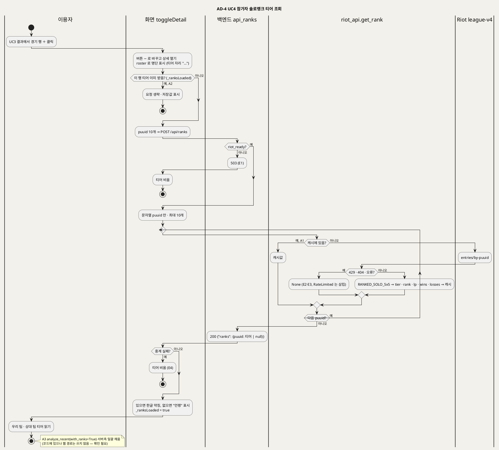
```plantuml
@startuml ad_uc04
skinparam backgroundColor #F3F1EB
skinparam shadowing false
skinparam activityFontSize 12
skinparam noteFontSize 11
title AD-4 UC4 참가자 솔로랭크 티어 조회

|이용자|
start
:UC3 결과에서 경기 행 ＋ 클릭;
|화면 toggleDetail|
:버튼 − 로 바꾸고 상세 열기
roster 로 명단 표시 (티어 자리 "…");
if (이 행 티어 이미 받음? (_ranksLoaded)) then (예, A2)
  :요청 생략 · 저장값 표시;
  stop
else (아니오)
endif
:puuid 10개 → POST /api/ranks;
|백엔드 api_ranks|
if (riot_ready?) then (아니오)
  :503 (E1);
  |화면 toggleDetail|
  :티어 비움;
  stop
else (예)
endif
:문자열 puuid 만 · 최대 10개;
repeat
  |riot_api.get_rank|
  if (캐시에 있음?) then (예, A1)
    :캐시값;
  else (아니오)
    |Riot league-v4|
    :entries/by-puuid;
    |riot_api.get_rank|
    if (429 · 404 · 오류?) then (예)
      :None (E2·E3, RateLimited 는 삼킴);
    else (아니오)
      :RANKED_SOLO_5x5 → tier · rank · lp · wins · losses → 캐시;
    endif
  endif
repeat while (다음 puuid?) is (예) not (아니오)
|백엔드 api_ranks|
:200 {"ranks": {puuid: 티어 | null}};
|화면 toggleDetail|
if (중계 실패?) then (예)
  :티어 비움 (E4);
  stop
else (아니오)
endif
:있으면 한글 약칭, 없으면 "언랭" 표시
_ranksLoaded = true;
|이용자|
:우리 팀 · 상대 팀 티어 읽기;
stop
note right
  A3 analyze_recent(with_ranks=True) 서버측 일괄 채움
  (코드에 있으나 웹 경로는 쓰지 않음 — 확인 필요)
end note
@enduml
```

소스를 직접 렌더하려면 **[「AD-4 참가자 솔로랭크 티어 조회」 PlantUML 뷰어로 열기](https://plantuml.sumzip.com/plantuml/svg/eNqFlc9PG0cUx-_7Vzy5F1uC4l8cYitKKJhLUaggOVsbPNgjll1rdxxK4kiGOMjFPhBiwAEbBckhSQXqBhzFVKaH_Ckcd2fVf6FvZm1iUqpednc8b-Z93vf98H2LqSYrLGugZtKFhXBcsZaonldNdRkeqwtLWdMo6JlJQzNM-GE6Nh1J_TRkYeXUjLFC9SwsqppFhnbUBUafULY6behsnj4lEIkO7eoGI992IgqjTCMwMTUah0eTceB217FL_HAL-EbdPWq6h6fe2gl4VZvvdoAf2d5-TVGKvNXh-x_RrKjIKJTEo8kYOGe2c97je1u83MTFpdO1wdv9Df7uVcFb67jHp0ml6L2pux87wIxsViNThKlUKyoJ96zsbfbgqrIN6BVcu-781XXO3wJ_scbLXeB7HbxNMQ2LEdM3-f2lW_0A3qsmrzYhOCA83HKPTyBwVToOhJIKXYQgskqKgUWr4_7RRQ8HvFW7B8G0qepL1oyhZkgmFAKWIzqeaVRGYCIaUgASfL_Oz04RpOUefoavX4C_RYHeOfZ233kSrSxm5BWCicCzO2W3WuGNdkgheoYuKol8oUAzEAk7dhOuNrbhl9n5hzCm5umY9I2iuPYnvld3XzcBf_WJihLepAZLm0TNrN67Zvt2P9KNh2MQTEVCAuJ2bdGoH7p7UeYHpe9xG5VrUPekiwKi1uAju-9rMuDPTbdW8gNIKibJE5UJdxIOgX_MEiahhTMp-Z9bqAsWAuajImS-qWtEkAtlpRkKKZD-JZ4wKc6hC9CImi2Q0Sfxon-O6MykxBp7vDoqOZO-7a04PlA8ekcEEg_HZTyNtvuuMQzle8OrHxg6UqSiX7-kYiMwpzIyQ5cpI6jFZh34es9b74R8f7cC4xVzEw9-Tk2l52dnZtPjv47LjDOKVYueBZV4a3nxxPa15MqwLGJJQ1-SvgOZlMHblx1WchT7NehW26irnyYMhFp-GKK9bzDdXlmJaDgMzwJyFUjAM3lNYtAhRdALmvb8-X81q8xw-5VzXgZebXu1D98rebPeUM546H97RBRKsyeceTtNp1sCvnPJL05HsPM3-hsBvtvFeRTot50y3LlwF5hZIMkbowlb1xbTwMPiFWl_sSbKWKyuZ4GYUUlFkonJCCbN5kRtT8RA1VVt9SnB7lvAgguuUJbzPd59iJ5CgEMOpxbvHuE1PaeDYnwS4eLhIL8Uig_qH-nXG8APLsRMFDNVVNJrm78XQW6KNF6V6uC92eGtLkZfxoEjZZGzWrmPX_gnofwDonzNHA==)** (사내 서버, SSO 로그인 필요) 또는 [로컬 Kroki 로 열기](http://192.168.0.91:8889/plantuml/svg/eNqFlc9PG0cUx-_7Vzy5F1uC4l8cYitKKJhLUaggOVsbPNgjll1rdxxK4kiGOMjFPhBiwAEbBckhSQXqBhzFVKaH_Ckcd2fVf6FvZm1iUqpednc8b-Z93vf98H2LqSYrLGugZtKFhXBcsZaonldNdRkeqwtLWdMo6JlJQzNM-GE6Nh1J_TRkYeXUjLFC9SwsqppFhnbUBUafULY6behsnj4lEIkO7eoGI992IgqjTCMwMTUah0eTceB217FL_HAL-EbdPWq6h6fe2gl4VZvvdoAf2d5-TVGKvNXh-x_RrKjIKJTEo8kYOGe2c97je1u83MTFpdO1wdv9Df7uVcFb67jHp0ml6L2pux87wIxsViNThKlUKyoJ96zsbfbgqrIN6BVcu-781XXO3wJ_scbLXeB7HbxNMQ2LEdM3-f2lW_0A3qsmrzYhOCA83HKPTyBwVToOhJIKXYQgskqKgUWr4_7RRQ8HvFW7B8G0qepL1oyhZkgmFAKWIzqeaVRGYCIaUgASfL_Oz04RpOUefoavX4C_RYHeOfZ233kSrSxm5BWCicCzO2W3WuGNdkgheoYuKol8oUAzEAk7dhOuNrbhl9n5hzCm5umY9I2iuPYnvld3XzcBf_WJihLepAZLm0TNrN67Zvt2P9KNh2MQTEVCAuJ2bdGoH7p7UeYHpe9xG5VrUPekiwKi1uAju-9rMuDPTbdW8gNIKibJE5UJdxIOgX_MEiahhTMp-Z9bqAsWAuajImS-qWtEkAtlpRkKKZD-JZ4wKc6hC9CImi2Q0Sfxon-O6MykxBp7vDoqOZO-7a04PlA8ekcEEg_HZTyNtvuuMQzle8OrHxg6UqSiX7-kYiMwpzIyQ5cpI6jFZh34es9b74R8f7cC4xVzEw9-Tk2l52dnZtPjv47LjDOKVYueBZV4a3nxxPa15MqwLGJJQ1-SvgOZlMHblx1WchT7NehW26irnyYMhFp-GKK9bzDdXlmJaDgMzwJyFUjAM3lNYtAhRdALmvb8-X81q8xw-5VzXgZebXu1D98rebPeUM546H97RBRKsyeceTtNp1sCvnPJL05HsPM3-hsBvtvFeRTot50y3LlwF5hZIMkbowlb1xbTwMPiFWl_sSbKWKyuZ4GYUUlFkonJCCbN5kRtT8RA1VVt9SnB7lvAgguuUJbzPd59iJ5CgEMOpxbvHuE1PaeDYnwS4eLhIL8Uig_qH-nXG8APLsRMFDNVVNJrm78XQW6KNF6V6uC92eGtLkZfxoEjZZGzWrmPX_gnofwDonzNHA==) (내부망 전용). 위 그림 파일은 로그인 없이 보인다.

UC3 의 확장이다. 같은 행을 다시 펼쳐도 요청을 반복하지 않고(A2), puuid 마다 캐시를 먼저 본다(A1). 429·404 는 `None` 으로 삼켜 화면에 "언랭"으로 보인다.

### 4.5 AD-5 예측 신뢰도·분석 리포트 열람 — [UC_05](UC_05_신뢰도리포트열람.md)

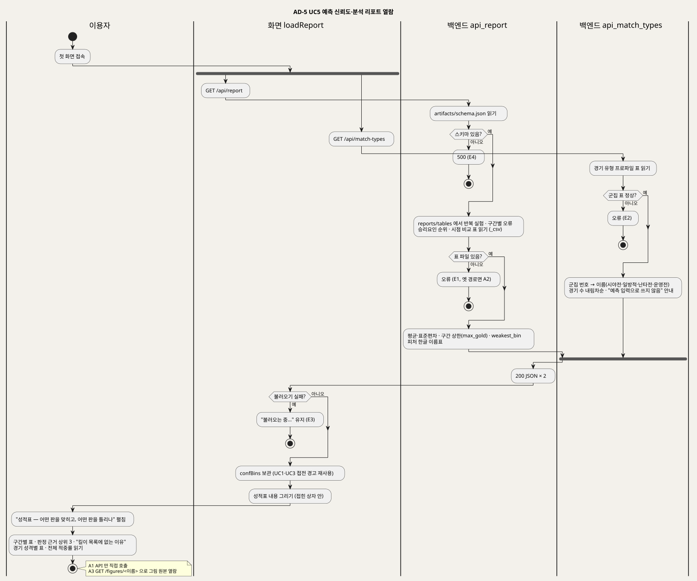

PlantUML 소스 보기

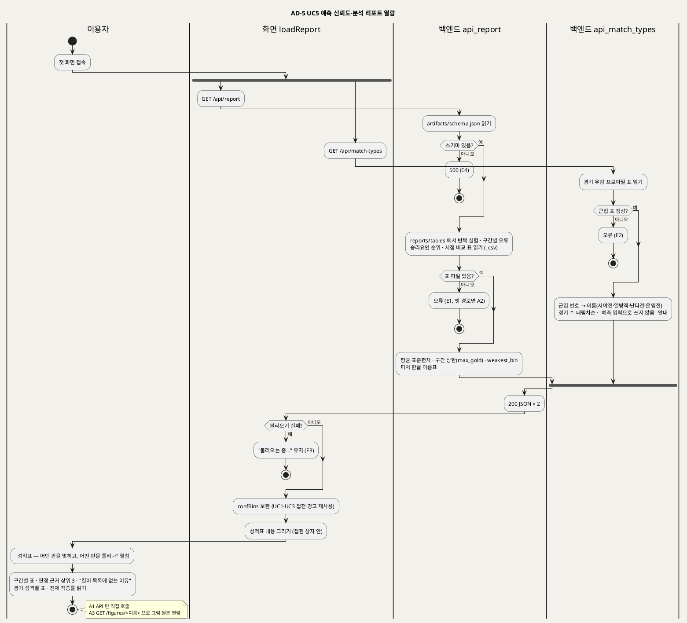
```plantuml
@startuml ad_uc05
skinparam backgroundColor #F3F1EB
skinparam shadowing false
skinparam activityFontSize 12
skinparam noteFontSize 11
title AD-5 UC5 예측 신뢰도·분석 리포트 열람

|이용자|
start
:첫 화면 접속;
|화면 loadReport|
fork
  :GET /api/report;
  |백엔드 api_report|
  :artifacts/schema.json 읽기;
  if (스키마 있음?) then (아니오)
    :500 (E4);
    stop
  else (예)
  endif
  :reports/tables 에서 반복 실험 · 구간별 오류
  승리요인 순위 · 시점 비교 표 읽기 (_csv);
  if (표 파일 있음?) then (아니오)
    :오류 (E1, 옛 경로면 A2);
    stop
  else (예)
  endif
  :평균·표준편차 · 구간 상한(max_gold) · weakest_bin
  피처 한글 이름표;
fork again
  |화면 loadReport|
  :GET /api/match-types;
  |백엔드 api_match_types|
  :경기 유형 프로파일 표 읽기;
  if (군집 표 정상?) then (아니오)
    :오류 (E2);
    stop
  else (예)
  endif
  :군집 번호 → 이름(시야전·일방적·난타전·운영전)
  경기 수 내림차순 · "예측 입력으로 쓰지 않음" 안내;
end fork
|백엔드 api_report|
:200 JSON × 2;
|화면 loadReport|
if (불러오기 실패?) then (예)
  :"불러오는 중…" 유지 (E3);
  stop
else (아니오)
endif
:confBins 보관 (UC1·UC3 접전 경고 재사용);
:성적표 내용 그리기 (접힌 상자 안);
|이용자|
:"성적표 — 어떤 판을 맞히고, 어떤 판을 틀리나" 펼침;
:구간별 표 · 판정 근거 상위 3 · "킬이 목록에 없는 이유"
경기 성격별 표 · 전체 적중률 읽기;
stop
note right
  A1 API 만 직접 호출
  A3 GET /figures/<이름> 으로 그림 원본 열람
end note
@enduml
```

소스를 직접 렌더하려면 **[「AD-5 예측 신뢰도·분석 리포트 열람」 PlantUML 뷰어로 열기](https://plantuml.sumzip.com/plantuml/svg/eNqNlc9TIlcQx-_zV3SRC1TtRtF4wVSyrtFUckhS2XimRhhwIsxQzLibTXFAd2JNlKyYlXXiDmRM4Q8SDogoWMVezH_icV7P_7D9HihUytTuiZnp7tf9_bzu5pFhynlzLZsBORlfS0zOSMaqquXkvJyFZTmxms7ra1pyXs_oefhocXoxuvB4zMNYkZP6M1VLQ0rOGMqYRU6Y6lPVfL6oa-YT9WcFolNjVk03lZElKpmqmVFg7ouHM7A0PwPo2Ng7BNz22F8ttmNdd9mlhVYV2HEz2GkGWz3A_Q6rlSSpgNUOHjSwVi5IQooUw_Y_EPyxxxodQG8XN3-blQrD94wuJ79XcnreLEgpPb8qAcS-XPgBJuScOpEXhln6VmCtM9zfY69cIEM8P4wgZ0qgpkibMWEkVpSs_PGPhq4BVt_6vRaPVFMQxq16sFFnJzZgzcZq6fMImCuKRoaKxbZtdOoR8qTDZiYnIbzwSWRWvBqmnqMHhTiSq2NzJ0VLqimed1CCMWHKyxnFIPVltFxgLYedXxCnerDvwHUX_Ium37LYuUUI6-zIoVDcuiJqeLCHVaJmu-ha3BO3XfTKwK4s_6IMwa47FAHheMJ4GrnVwg1BqYTV_vvEDBKSnugDSv4G_PZbduhy6HNTH6Iw2PnV73rXXcqI9WLwsoet05EkwBfrQcUNZ-Wf4mk9k4xw0zNFXlUMM76sanRCsNfHtgPk5feKpKbDji06bFZcNMhpWXjd1wnjTZCVzcTKQ_N5TjHu6QRhjQurCCORnBm6XuBUqAKLJA9xjZDesvQvWniyOzB4FRL0fpYfRG54LmvbgdODm83fh-LD_I4rffRofqgi1mqgt06jtOEGL4qDrwcddNbpkZ93q8V2gG1QfJ8ugPqFgw7dDmTtF-YdodsnmYCvKC2BrmxRW4To16awWYnKAjFa_zNEsSnq-q-ffPsN_LsPU_ePJqfFLm32Z5NIiKKow0unI14DArHQnRPb2gOs794Uj0P8Nnhh4YVpQU-wG5IbcR7QiyV0LfVY1Qxg5x2_Q0FL89Hr7tL8tFgdniWonHukvIkbNEUNOjKG1hmR5PdIiukb-N0ezZiYHgoLaiXerrSSOBQKGN9RsdAo-qZIRb_usNd1mrEyVi1gJ7WgZlPCB_8xBNtFysA2nBAEL_t4dUpljIadH0bXxH29ClXT989aogSa9WlxgQEVX-0A-7vBDqu0PWiDbApmVJnrhaTby7fO_HZj7EhCgG2-R9eJLjvy7lpaUOVrHPJqesUkznNRmPvuK5JA6k-oqajTnR5eutw0DWLAUmp6La8YE58OGvQzGLaS4Ecb5k2Znd-tdt5IPIH0iJ7oD0p6B8EZTIg=)** (사내 서버, SSO 로그인 필요) 또는 [로컬 Kroki 로 열기](http://192.168.0.91:8889/plantuml/svg/eNqNlc9TIlcQx-_zV3SRC1TtRtF4wVSyrtFUckhS2XimRhhwIsxQzLibTXFAd2JNlKyYlXXiDmRM4Q8SDogoWMVezH_icV7P_7D9HihUytTuiZnp7tf9_bzu5pFhynlzLZsBORlfS0zOSMaqquXkvJyFZTmxms7ra1pyXs_oefhocXoxuvB4zMNYkZP6M1VLQ0rOGMqYRU6Y6lPVfL6oa-YT9WcFolNjVk03lZElKpmqmVFg7ouHM7A0PwPo2Ng7BNz22F8ttmNdd9mlhVYV2HEz2GkGWz3A_Q6rlSSpgNUOHjSwVi5IQooUw_Y_EPyxxxodQG8XN3-blQrD94wuJ79XcnreLEgpPb8qAcS-XPgBJuScOpEXhln6VmCtM9zfY69cIEM8P4wgZ0qgpkibMWEkVpSs_PGPhq4BVt_6vRaPVFMQxq16sFFnJzZgzcZq6fMImCuKRoaKxbZtdOoR8qTDZiYnIbzwSWRWvBqmnqMHhTiSq2NzJ0VLqimed1CCMWHKyxnFIPVltFxgLYedXxCnerDvwHUX_Ium37LYuUUI6-zIoVDcuiJqeLCHVaJmu-ha3BO3XfTKwK4s_6IMwa47FAHheMJ4GrnVwg1BqYTV_vvEDBKSnugDSv4G_PZbduhy6HNTH6Iw2PnV73rXXcqI9WLwsoet05EkwBfrQcUNZ-Wf4mk9k4xw0zNFXlUMM76sanRCsNfHtgPk5feKpKbDji06bFZcNMhpWXjd1wnjTZCVzcTKQ_N5TjHu6QRhjQurCCORnBm6XuBUqAKLJA9xjZDesvQvWniyOzB4FRL0fpYfRG54LmvbgdODm83fh-LD_I4rffRofqgi1mqgt06jtOEGL4qDrwcddNbpkZ93q8V2gG1QfJ8ugPqFgw7dDmTtF-YdodsnmYCvKC2BrmxRW4To16awWYnKAjFa_zNEsSnq-q-ffPsN_LsPU_ePJqfFLm32Z5NIiKKow0unI14DArHQnRPb2gOs794Uj0P8Nnhh4YVpQU-wG5IbcR7QiyV0LfVY1Qxg5x2_Q0FL89Hr7tL8tFgdniWonHukvIkbNEUNOjKG1hmR5PdIiukb-N0ezZiYHgoLaiXerrSSOBQKGN9RsdAo-qZIRb_usNd1mrEyVi1gJ7WgZlPCB_8xBNtFysA2nBAEL_t4dUpljIadH0bXxH29ClXT989aogSa9WlxgQEVX-0A-7vBDqu0PWiDbApmVJnrhaTby7fO_HZj7EhCgG2-R9eJLjvy7lpaUOVrHPJqesUkznNRmPvuK5JA6k-oqajTnR5eutw0DWLAUmp6La8YE58OGvQzGLaS4Ecb5k2Znd-tdt5IPIH0iJ7oD0p6B8EZTIg=) (내부망 전용). 위 그림 파일은 로그인 없이 보인다.

첫 화면이 뜰 때 두 요청이 포크로 나간다. 성적표는 미리 그려 두고, 이용자가 접힌 상자를 펼칠 때 보인다. `confBins` 는 이 UC 의 부산물이지만 UC1·UC3 의 접전 경고가 재사용한다.

### 4.6 AD-6 챔피언·라인별 승률 조회 — [UC_06](UC_06_챔피언라인별승률조회.md)

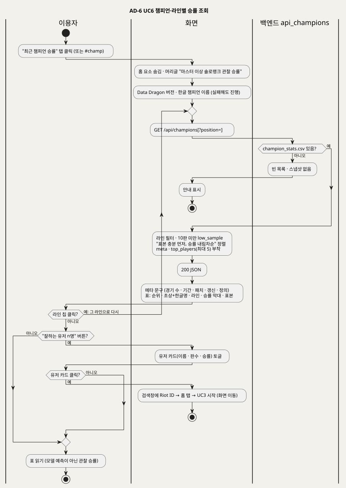

PlantUML 소스 보기

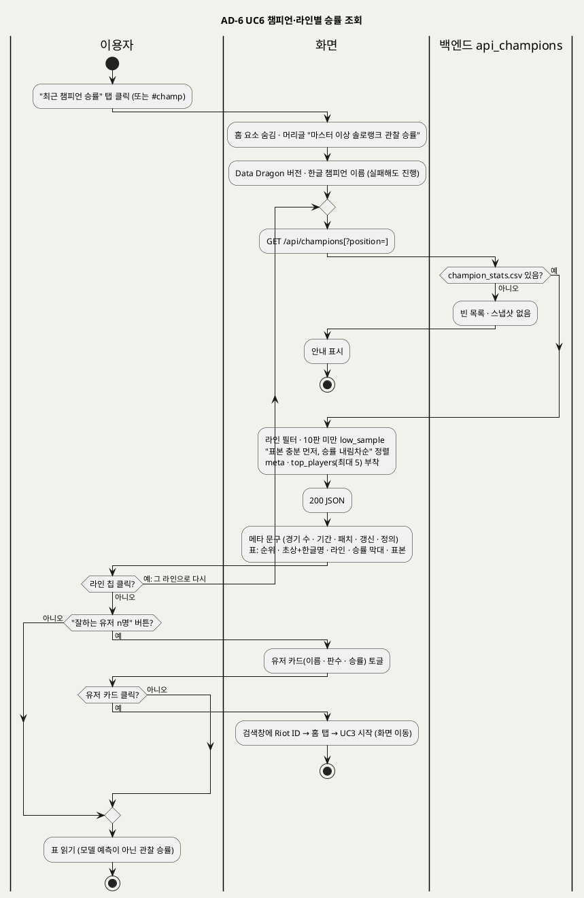
```plantuml
@startuml ad_uc06
skinparam backgroundColor #F3F1EB
skinparam shadowing false
skinparam activityFontSize 12
skinparam noteFontSize 11
title AD-6 UC6 챔피언·라인별 승률 조회

|이용자|
start
:"최근 챔피언 승률" 탭 클릭 (또는 #champ);
|화면|
:홈 요소 숨김 · 머리글 "마스터 이상 솔로랭크 관찰 승률";
:Data Dragon 버전 · 한글 챔피언 이름 (실패해도 진행);
repeat
  :GET /api/champions[?position=];
  |백엔드 api_champions|
  if (champion_stats.csv 있음?) then (아니오)
    :빈 목록 · 스냅샷 없음;
    |화면|
    :안내 표시;
    stop
  else (예)
  endif
  :라인 필터 · 10판 미만 low_sample
  "표본 충분 먼저, 승률 내림차순" 정렬
  meta · top_players(최대 5) 부착;
  :200 JSON;
  |화면|
  :메타 문구 (경기 수 · 기간 · 패치 · 갱신 · 정의)
  표: 순위 · 초상+한글명 · 라인 · 승률 막대 · 표본;
  |이용자|
repeat while (라인 칩 클릭?) is (예: 그 라인으로 다시) not (아니오)
if ("잘하는 유저 n명" 버튼?) then (예)
  |화면|
  :유저 카드(이름 · 판수 · 승률) 토글;
  |이용자|
  if (유저 카드 클릭?) then (예)
    |화면|
    :검색창에 Riot ID → 홈 탭 → UC3 시작 (화면 이동);
    stop
  else (아니오)
  endif
else (아니오)
endif
|이용자|
:표 읽기 (모델 예측이 아닌 관찰 승률);
stop
@enduml
```

소스를 직접 렌더하려면 **[「AD-6 챔피언·라인별 승률 조회」 PlantUML 뷰어로 열기](https://plantuml.sumzip.com/plantuml/svg/eNptVF1P22YUvvevOEpvHO2j0GpcGE3tBmXaLjppXa-mKfKCAavBjmJT1CkXYXEjQzw13ZISkBMFiUGCgpbSFBwpvelP2aXP8X_Yee3QhG53r_yej-fr9X3LVgv21mYO1NXMVnZuQbKe6EZeLaib8IuafbJeMLeM1SUzZxbg1srdlfkHX89UWBvqqrmtG-uwpuYsbeZGzdr6U91-tmIa9iP9Vw3m78zcGqatTW_mJVu3cxp8tfzZAjxeWgB6XY_qY3oVvL_C1phaAb5xgPZG-FcH6GgQHXqSVKTWkA571K4VpZiDpKTorR9ejaftk54UROVziHaGeHIOMjZruFeHW9kNdTOfXpSK0UEde8OipEQHLtBhnSoekNsNRyV4fwXYDfCkHwYlSOGpS3vHkTMAsbu8A1Sp45GP7fNopw_hsESDwfXKRUlZVm0VlgvqumkAXjjUccS8qOGLYTMYW4zLAZmqx5HXjRpDfMFkT53o1S6jK2h5TbUlAOWbBz_CbTWv346B66Zh_XQvb1q6zccvf17kkiIOXtN-Hf_0gesyH-qKfKevgXz9IcN62dbnWespUNullncvDfaGZjCGhoNVl5rHaW7hnThyAc96eNQS0Jk8lp9TmU_7FW5bjIs-6Bd3UMPF34YQvfSp6icFlm3m-aBxQHhD0xWzNWNVXxOsEn9ZFUfoykvm5yKvBvh3gKce5MztjMWgcxrXpngovmHBLnt46bAxY-qUPr3OBW_FkzENuuT6KaBOAzt9btrU2AQeyxgy-Zz6TCtYMscEvRJ8kQa8ZM96AqZyZ24Ovnv0_cNYyCklBXv1qFwC7Afh2z7I4cW7MGCX3aaYysdwkNjqdWmUfGMTqp1Yr06DWk1Bl5Er3OOTHxfT0OX4fJJEAc-exzlLhIhlTgid7gqUYnbMOwY2E_okGbC9ofPTkSftNOpNgs6e6lastwLhVTCZT_6YEwtYPWZ70uId3jBdpCRF7WbUaIo3Qn6HJQaDIaZEhKO98TQqiZGzUk3KaTTkCMqTXMfa1CZ6JdTSEFU6zPxjRklKb0yZkrmx9ePUhRclKu_S4B3t1-AHnVl9uwz_VP4A8aTF4xfnx0t3gVlT-yXISXf89l4cpP8vp7MvIUnrfy6Sz7MMFLaKh8YRkfGsi7-zJU2XgiMugrjVu_mj4N3x3vs8jP_C0r9N5Mpw)** (사내 서버, SSO 로그인 필요) 또는 [로컬 Kroki 로 열기](http://192.168.0.91:8889/plantuml/svg/eNptVF1P22YUvvevOEpvHO2j0GpcGE3tBmXaLjppXa-mKfKCAavBjmJT1CkXYXEjQzw13ZISkBMFiUGCgpbSFBwpvelP2aXP8X_Yee3QhG53r_yej-fr9X3LVgv21mYO1NXMVnZuQbKe6EZeLaib8IuafbJeMLeM1SUzZxbg1srdlfkHX89UWBvqqrmtG-uwpuYsbeZGzdr6U91-tmIa9iP9Vw3m78zcGqatTW_mJVu3cxp8tfzZAjxeWgB6XY_qY3oVvL_C1phaAb5xgPZG-FcH6GgQHXqSVKTWkA571K4VpZiDpKTorR9ejaftk54UROVziHaGeHIOMjZruFeHW9kNdTOfXpSK0UEde8OipEQHLtBhnSoekNsNRyV4fwXYDfCkHwYlSOGpS3vHkTMAsbu8A1Sp45GP7fNopw_hsESDwfXKRUlZVm0VlgvqumkAXjjUccS8qOGLYTMYW4zLAZmqx5HXjRpDfMFkT53o1S6jK2h5TbUlAOWbBz_CbTWv346B66Zh_XQvb1q6zccvf17kkiIOXtN-Hf_0gesyH-qKfKevgXz9IcN62dbnWespUNullncvDfaGZjCGhoNVl5rHaW7hnThyAc96eNQS0Jk8lp9TmU_7FW5bjIs-6Bd3UMPF34YQvfSp6icFlm3m-aBxQHhD0xWzNWNVXxOsEn9ZFUfoykvm5yKvBvh3gKce5MztjMWgcxrXpngovmHBLnt46bAxY-qUPr3OBW_FkzENuuT6KaBOAzt9btrU2AQeyxgy-Zz6TCtYMscEvRJ8kQa8ZM96AqZyZ24Ovnv0_cNYyCklBXv1qFwC7Afh2z7I4cW7MGCX3aaYysdwkNjqdWmUfGMTqp1Yr06DWk1Bl5Er3OOTHxfT0OX4fJJEAc-exzlLhIhlTgid7gqUYnbMOwY2E_okGbC9ofPTkSftNOpNgs6e6lastwLhVTCZT_6YEwtYPWZ70uId3jBdpCRF7WbUaIo3Qn6HJQaDIaZEhKO98TQqiZGzUk3KaTTkCMqTXMfa1CZ6JdTSEFU6zPxjRklKb0yZkrmx9ePUhRclKu_S4B3t1-AHnVl9uwz_VP4A8aTF4xfnx0t3gVlT-yXISXf89l4cpP8vp7MvIUnrfy6Sz7MMFLaKh8YRkfGsi7-zJU2XgiMugrjVu_mj4N3x3vs8jP_C0r9N5Mpw) (내부망 전용). 위 그림 파일은 로그인 없이 보인다.

라인 칩을 누를 때마다 조회가 반복된다. "잘하는 유저" 이름 클릭은 관계(«extend»)가 아니라 **UC3 를 새로 시작하는 화면 이동**이다.

### 4.7 AD-7 솔로랭크 상위 랭킹 조회 — [UC_07](UC_07_상위랭킹조회.md)

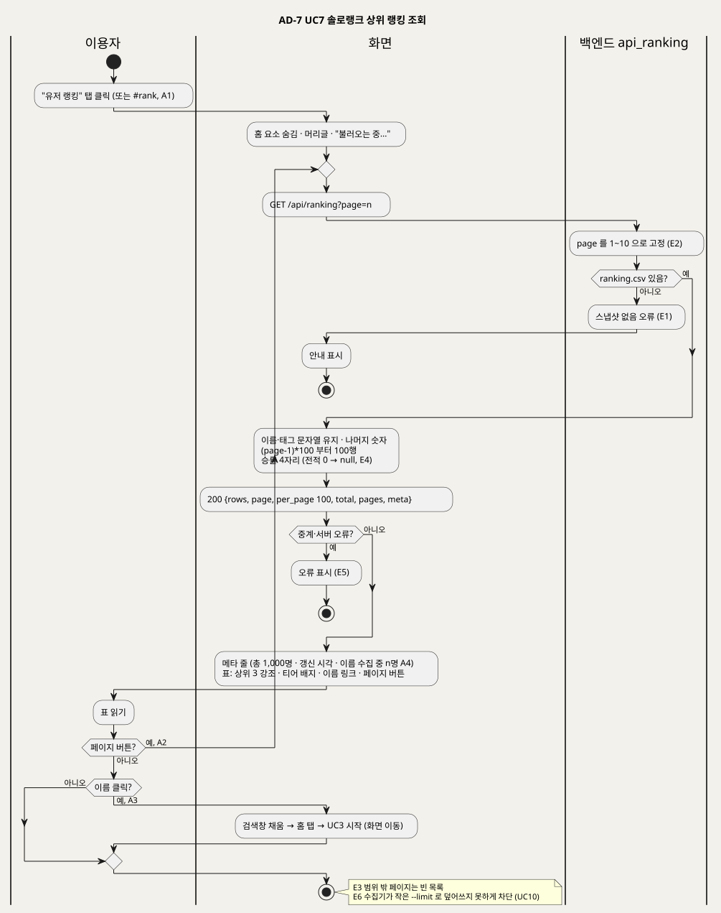

PlantUML 소스 보기

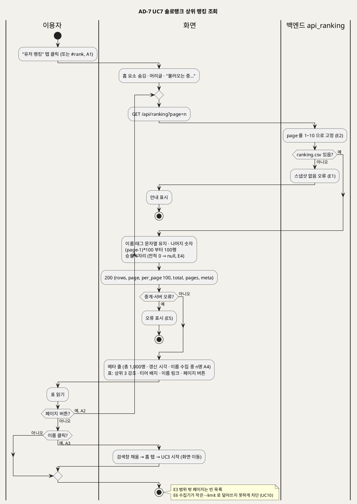
```plantuml
@startuml ad_uc07
skinparam backgroundColor #F3F1EB
skinparam shadowing false
skinparam activityFontSize 12
skinparam noteFontSize 11
title AD-7 UC7 솔로랭크 상위 랭킹 조회

|이용자|
start
:"유저 랭킹" 탭 클릭 (또는 #rank, A1);
|화면|
:홈 요소 숨김 · 머리글 · "불러오는 중…";
repeat
  :GET /api/ranking?page=n;
  |백엔드 api_ranking|
  :page 를 1~10 으로 고정 (E2);
  if (ranking.csv 있음?) then (아니오)
    :스냅샷 없음 오류 (E1);
    |화면|
    :안내 표시;
    stop
  else (예)
  endif
  :이름·태그 문자열 유지 · 나머지 숫자
  (page-1)*100 부터 100행
  승률 4자리 (전적 0 → null, E4);
  :200 {rows, page, per_page 100, total, pages, meta};
  |화면|
  if (중계·서버 오류?) then (예)
    :오류 표시 (E5);
    stop
  else (아니오)
  endif
  :메타 줄 (총 1,000명 · 갱신 시각 · 이름 수집 중 n명 A4)
  표: 상위 3 강조 · 티어 배지 · 이름 링크 · 페이지 버튼;
  |이용자|
  :표 읽기;
repeat while (페이지 버튼?) is (예, A2) not (아니오)
if (이름 클릭?) then (예, A3)
  |화면|
  :검색창 채움 → 홈 탭 → UC3 시작 (화면 이동);
else (아니오)
endif
stop
note right
  E3 범위 밖 페이지는 빈 목록
  E6 수집기가 작은 --limit 로 덮어쓰지 못하게 차단 (UC10)
end note
@enduml
```

소스를 직접 렌더하려면 **[「AD-7 솔로랭크 상위 랭킹 조회」 PlantUML 뷰어로 열기](https://plantuml.sumzip.com/plantuml/svg/eNptlF9P22YUxu_9KY7oTVKF1SZ0SEFTS1noB9i4Rh4YsAh25JiitemUEBe5hG7NmkBgThYk_g8ql0YlqPSmH6WXfo-_w86xw0i33USvc55zfM7v-HkfFmzVsleWc6DOzazMymNSYUk38qqlLsNP6uzSgmWuGHOTZs604M5UekrJPhpQFBbVOXNVNxZgXs0VtIGIOmvrT3T75ynTsH_Qn2qgjAxEDdPWbiOKZOt2ToOJ74fHYHpyDHC9LvY80T4Py2eAlTJ6DvDT2hXgnh_ubkpSEVtd3D3B9uuiFI0gZYbQ62Cn1FcOQVg5h7DcFYfnkBDN12KjDncs1VhKwYSSHJeK4U5dnHSLUibccQF367i-CegeB1cl-HwJ4rgnDs-CXvQwJD644s8zbO5zFdyvfSkdDo1LlpbXVFsCyDzO_gj31Lx-j19APB7k1QXtO2OcYkXhv8PtunjjAQlm-oIiZ7EIxME1KL8oMqB3TVND8J6maEAiO5LkdH0eEv2cb2YLTwDbLrY2HyTBXtQMSGDDEVWXGkuSlkrixr6ovMDKJeD2OgmBez5oUjklKkf93Mwd6xuuWOtCWPOw6sWCgm3m6aDRQql-0-XKmjGnz3PLhF0cOp8vw4oXXPZAnPVoBbjdBYZ_FJNbaxI8fkD3L4pSWoInHVaSdxVZBvGhFDo-0DHceklB3LgSBx0YJSkRp1d2HOyUQYYv67-DsZLLpSA7GjWfGaH0Z5a5WkgBV6RfzZqJKFK1FNimrebiECmWNVt9Hm3gdmKmSesL3tMI6HjiwukDugUaD8yjxuRiNATwfvL_-Azy_4eSOKmHFZp_3yFFtwVKSpZlcfqC8QT0OVQ7QDUDv8x_xEgJVhOPavxxgcHSiVEuSW_P3FggTbkNMgAnhVUft7ogfL9PvV9FHJXZNKz4tckeoShNGW5cRyQGXENtUnHK-xT0_JtvGVYXdXJi4t_JhEcvRHDIPSNJNvBXs0dc4w5iyw3ypJR08us9ZIKLElZeov8J8J2Df5SiZbMR2bV8np5MMyNs16ibKC8a8bcd2sJ_0Mfgo8Xw1QKWvrDIvsymqf96dH34W7dE2MTiygVxeiL2Wqz7to-fUAQ-La5dw1YJhodz-rJuA9tSvHpLwPFNxFucfgwbzeCC7OUfi-oxJKYnFTnqI7rbpId0oktV-htV3oZL)** (사내 서버, SSO 로그인 필요) 또는 [로컬 Kroki 로 열기](http://192.168.0.91:8889/plantuml/svg/eNptlF9P22YUxu_9KY7oTVKF1SZ0SEFTS1noB9i4Rh4YsAh25JiitemUEBe5hG7NmkBgThYk_g8ql0YlqPSmH6WXfo-_w86xw0i33USvc55zfM7v-HkfFmzVsleWc6DOzazMymNSYUk38qqlLsNP6uzSgmWuGHOTZs604M5UekrJPhpQFBbVOXNVNxZgXs0VtIGIOmvrT3T75ynTsH_Qn2qgjAxEDdPWbiOKZOt2ToOJ74fHYHpyDHC9LvY80T4Py2eAlTJ6DvDT2hXgnh_ubkpSEVtd3D3B9uuiFI0gZYbQ62Cn1FcOQVg5h7DcFYfnkBDN12KjDncs1VhKwYSSHJeK4U5dnHSLUibccQF367i-CegeB1cl-HwJ4rgnDs-CXvQwJD644s8zbO5zFdyvfSkdDo1LlpbXVFsCyDzO_gj31Lx-j19APB7k1QXtO2OcYkXhv8PtunjjAQlm-oIiZ7EIxME1KL8oMqB3TVND8J6maEAiO5LkdH0eEv2cb2YLTwDbLrY2HyTBXtQMSGDDEVWXGkuSlkrixr6ovMDKJeD2OgmBez5oUjklKkf93Mwd6xuuWOtCWPOw6sWCgm3m6aDRQql-0-XKmjGnz3PLhF0cOp8vw4oXXPZAnPVoBbjdBYZ_FJNbaxI8fkD3L4pSWoInHVaSdxVZBvGhFDo-0DHceklB3LgSBx0YJSkRp1d2HOyUQYYv67-DsZLLpSA7GjWfGaH0Z5a5WkgBV6RfzZqJKFK1FNimrebiECmWNVt9Hm3gdmKmSesL3tMI6HjiwukDugUaD8yjxuRiNATwfvL_-Azy_4eSOKmHFZp_3yFFtwVKSpZlcfqC8QT0OVQ7QDUDv8x_xEgJVhOPavxxgcHSiVEuSW_P3FggTbkNMgAnhVUft7ogfL9PvV9FHJXZNKz4tckeoShNGW5cRyQGXENtUnHK-xT0_JtvGVYXdXJi4t_JhEcvRHDIPSNJNvBXs0dc4w5iyw3ypJR08us9ZIKLElZeov8J8J2Df5SiZbMR2bV8np5MMyNs16ibKC8a8bcd2sJ_0Mfgo8Xw1QKWvrDIvsymqf96dH34W7dE2MTiygVxeiL2Wqz7to-fUAQ-La5dw1YJhodz-rJuA9tSvHpLwPFNxFucfgwbzeCC7OUfi-oxJKYnFTnqI7rbpId0oktV-htV3oZL) (내부망 전용). 위 그림 파일은 로그인 없이 보인다.

페이지 버튼이 반복을 만든다. 표는 스냅샷이라 갱신 시각이 함께 보이고, 이름 클릭은 UC6 과 같은 화면 이동이다.

### 4.8 AD-8 프로 경기 승부예측 투표 — [UC_08](UC_08_승부예측투표.md)

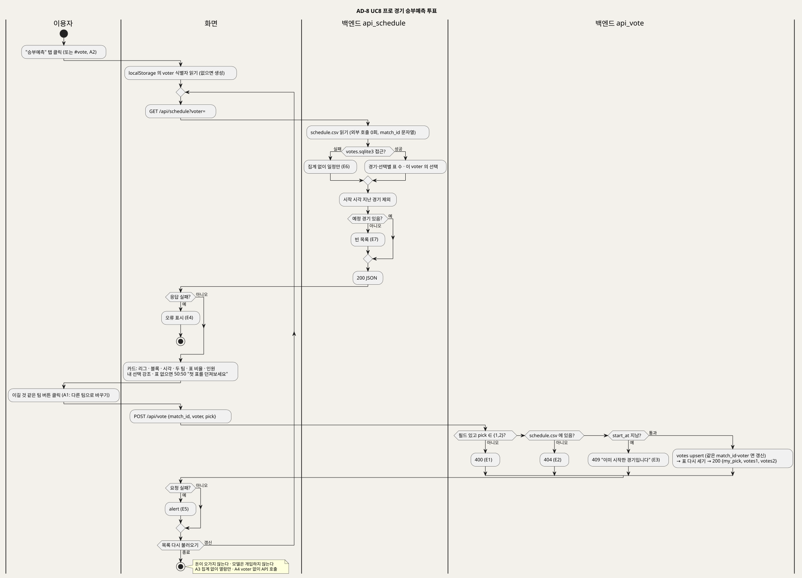

PlantUML 소스 보기

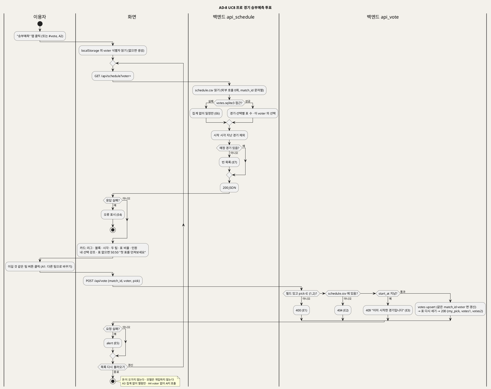
```plantuml
@startuml ad_uc08
skinparam backgroundColor #F3F1EB
skinparam shadowing false
skinparam activityFontSize 12
skinparam noteFontSize 11
title AD-8 UC8 프로 경기 승부예측 투표

|이용자|
start
:"승부예측" 탭 클릭 (또는 #vote, A2);
|화면|
:localStorage 의 voter 식별자 읽기 (없으면 생성);
repeat
  :GET /api/schedule?voter=;
  |백엔드 api_schedule|
  :schedule.csv 읽기 (외부 호출 0회, match_id 문자열);
  if (votes.sqlite3 접근?) then (실패)
    :집계 없이 일정만 (E6);
  else (성공)
    :경기·선택별 표 수 · 이 voter 의 선택;
  endif
  :시작 시각 지난 경기 제외;
  if (예정 경기 있음?) then (아니오)
    :빈 목록 (E7);
  else (예)
  endif
  :200 JSON;
  |화면|
  if (응답 실패?) then (예)
    :오류 표시 (E4);
    stop
  else (아니오)
  endif
  :카드: 리그 · 블록 · 시각 · 두 팀 · 표 비율 · 인원
  내 선택 강조 · 표 없으면 50:50 "첫 표를 던져보세요";
  |이용자|
  :이길 것 같은 팀 버튼 클릭 (A1: 다른 팀으로 바꾸기);
  |화면|
  :POST /api/vote {match_id, voter, pick};
  |백엔드 api_vote|
  if (필드 있고 pick ∈ {1,2}?) then (아니오)
    :400 (E1);
  elseif (schedule.csv 에 있음?) then (아니오)
    :404 (E2);
  elseif (start_at 지남?) then (예)
    :409 "이미 시작한 경기입니다" (E3);
  else (통과)
    :votes upsert (같은 match_id·voter 면 갱신)
    → 표 다시 세기 → 200 {my_pick, votes1, votes2};
  endif
  |화면|
  if (요청 실패?) then (예)
    :alert (E5);
  else (아니오)
  endif
repeat while (목록 다시 불러오기) is (갱신) not (종료)
stop
note right
  돈이 오가지 않는다 · 모델은 개입하지 않는다
  A3 집계 없이 열람만 · A4 voter 없이 API 호출
end note
@enduml
```

소스를 직접 렌더하려면 **[「AD-8 프로 경기 승부예측 투표」 PlantUML 뷰어로 열기](https://plantuml.sumzip.com/plantuml/svg/eNqFVV1vGlcQfd9fMXJeQKIJYNy6RFVCU1y1D00kt89oC2uzMgbKLo5SY4nE2FoZokILYu2yFLdObKe2is3arCXaB_-UPO69-x86dz_MOk3UJ5Y7c8_MnDMz96Ek8yW5vJoDPpMqp8PznLQi5ot8iV-F7_n0ynKpUM5nHhVyhRLcWZhdiCQ_93lIWT5TeCrml2GJz0mCz8KnZXFNlJ8tFPLyovijAJGoz5ovyMLUEuFkUc4JkPjio3n47tE8WO0a2e-Bef63aQyB7lyRyypVFWrsg6WcWK0ex1WoptO9Y9pvVji7BC4-43ecAWvzFKznOnl9CgGiNslOG-6sYdwQJKLB-1zF2m2TY73CxXOFNJ9blAslflkAqqnAvEpA6xoZ1TAAntl5BGh3m_YmeAnopkZrZ4hSEooCL3MA8S-T38I9vijek9JZIVPOCQ9smM_uo7FChme02ya_9AA9Up5Hhd3z_txNS2vTSLsGVgKWatDLHoStvUYIVnk5nU2JGSAnBmZFu3qQYYtLEGCRpLvSDzlRFmaBDlrmePIgCHJWyCNW_cBqHAXRFaPRw5Y5qgGrRMMytAkddMhhAwLJj200AVXEK7Uzc3ThXnFUuB7T2sDaZJQACgBUUeF6DAzFpQuJc1xsnHxGXGLl0XqP9ltIZs8cPgd6WCUvpsIOelioVwTTbdC5sfUVqjWmRXRqpK5Q9cBNilwpQN4ck30NU__En7qqBP3xo-EwfL34-BtbBk9yN6DWIvULcPiZRnIAWOrqAXmlsmoxewwTs8MASHKhOI3nT2xa9ZWOYseBvD4xxwYjihhtliyjzKGCnbWaYDWq7JNRSq5qtHfksGrQX5sIRF7oLqlgDjt0f-j5TltxLhyfC8MMPf-TGcirCZCXKh0YZKTTmkH32jN26b5xYflpumkYyPUm4u5SrWrnQc5r1s7kZmgSESygjhwYzMrC4UySYdv8x0CFgu8wGn_yeNGdANYQsO71a8hpkBAUxfTKxnvGgZk9TSykE49RfXM0sG_AW0WB9UgouvHBZoihxoFk5KYLGNDtseo2_6-hYuEYYkRvY7C9kuJlp23f1yKx8KdIvaaTvwxwOt3qeO1N-1sYAQmcQeBZX4ta2xfmaOIi2KML5aIklGQIuGJ41F2PndliOpvIWX3g3Hq7_bPTMfUD1pqoMxsZdsrafX31WYox5xAvRdzf6IZ_MN-dhb02PT_98CzwOTu_5Jx_1P7b-s46hKdZEdd5wB1QN0tyqZDfTtCdNQ-IEqvWLom9Boj2-xb5oxHk7Oli7wOUxOUsW63kJ8VeVnhzWEUpgHZ2cJsjrD1Eb47IS4OxZg5RgC2ro97yQYAE7sTbe6-rk36D7T0ESMS8DeYYE0--chcvh0XZTxX3EL_wjeT-BdpdV3g=)** (사내 서버, SSO 로그인 필요) 또는 [로컬 Kroki 로 열기](http://192.168.0.91:8889/plantuml/svg/eNqFVV1vGlcQfd9fMXJeQKIJYNy6RFVCU1y1D00kt89oC2uzMgbKLo5SY4nE2FoZokILYu2yFLdObKe2is3arCXaB_-UPO69-x86dz_MOk3UJ5Y7c8_MnDMz96Ek8yW5vJoDPpMqp8PznLQi5ot8iV-F7_n0ynKpUM5nHhVyhRLcWZhdiCQ_93lIWT5TeCrml2GJz0mCz8KnZXFNlJ8tFPLyovijAJGoz5ovyMLUEuFkUc4JkPjio3n47tE8WO0a2e-Bef63aQyB7lyRyypVFWrsg6WcWK0ex1WoptO9Y9pvVji7BC4-43ecAWvzFKznOnl9CgGiNslOG-6sYdwQJKLB-1zF2m2TY73CxXOFNJ9blAslflkAqqnAvEpA6xoZ1TAAntl5BGh3m_YmeAnopkZrZ4hSEooCL3MA8S-T38I9vijek9JZIVPOCQ9smM_uo7FChme02ya_9AA9Up5Hhd3z_txNS2vTSLsGVgKWatDLHoStvUYIVnk5nU2JGSAnBmZFu3qQYYtLEGCRpLvSDzlRFmaBDlrmePIgCHJWyCNW_cBqHAXRFaPRw5Y5qgGrRMMytAkddMhhAwLJj200AVXEK7Uzc3ThXnFUuB7T2sDaZJQACgBUUeF6DAzFpQuJc1xsnHxGXGLl0XqP9ltIZs8cPgd6WCUvpsIOelioVwTTbdC5sfUVqjWmRXRqpK5Q9cBNilwpQN4ck30NU__En7qqBP3xo-EwfL34-BtbBk9yN6DWIvULcPiZRnIAWOrqAXmlsmoxewwTs8MASHKhOI3nT2xa9ZWOYseBvD4xxwYjihhtliyjzKGCnbWaYDWq7JNRSq5qtHfksGrQX5sIRF7oLqlgDjt0f-j5TltxLhyfC8MMPf-TGcirCZCXKh0YZKTTmkH32jN26b5xYflpumkYyPUm4u5SrWrnQc5r1s7kZmgSESygjhwYzMrC4UySYdv8x0CFgu8wGn_yeNGdANYQsO71a8hpkBAUxfTKxnvGgZk9TSykE49RfXM0sG_AW0WB9UgouvHBZoihxoFk5KYLGNDtseo2_6-hYuEYYkRvY7C9kuJlp23f1yKx8KdIvaaTvwxwOt3qeO1N-1sYAQmcQeBZX4ta2xfmaOIi2KML5aIklGQIuGJ41F2PndliOpvIWX3g3Hq7_bPTMfUD1pqoMxsZdsrafX31WYox5xAvRdzf6IZ_MN-dhb02PT_98CzwOTu_5Jx_1P7b-s46hKdZEdd5wB1QN0tyqZDfTtCdNQ-IEqvWLom9Boj2-xb5oxHk7Oli7wOUxOUsW63kJ8VeVnhzWEUpgHZ2cJsjrD1Eb47IS4OxZg5RgC2ro97yQYAE7sTbe6-rk36D7T0ESMS8DeYYE0--chcvh0XZTxX3EL_wjeT-BdpdV3g=) (내부망 전용). 위 그림 파일은 로그인 없이 보인다.

투표 한 번이 곧 목록 재조회다. 서버 관문은 세 개(E1 형식 · E2 목록에 없음 · E3 이미 시작)이고 통과하면 같은 사람의 표는 **갱신**된다. 모델은 이 흐름 어디에도 없다.

### 4.9 AD-9 프로 경기 일정 스냅샷 수집 — [UC_09](UC_09_경기일정스냅샷수집.md)

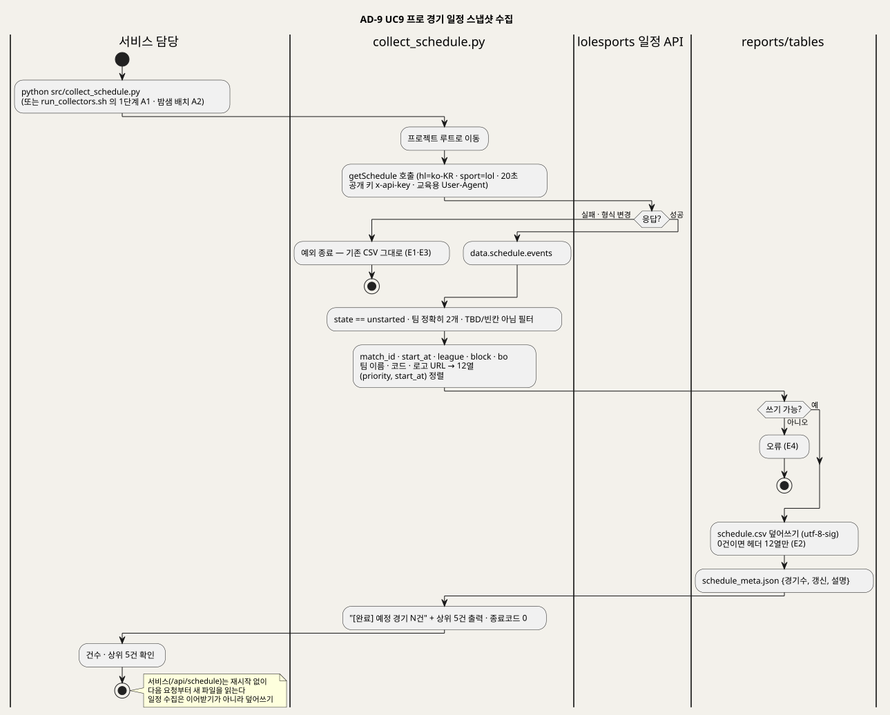

PlantUML 소스 보기

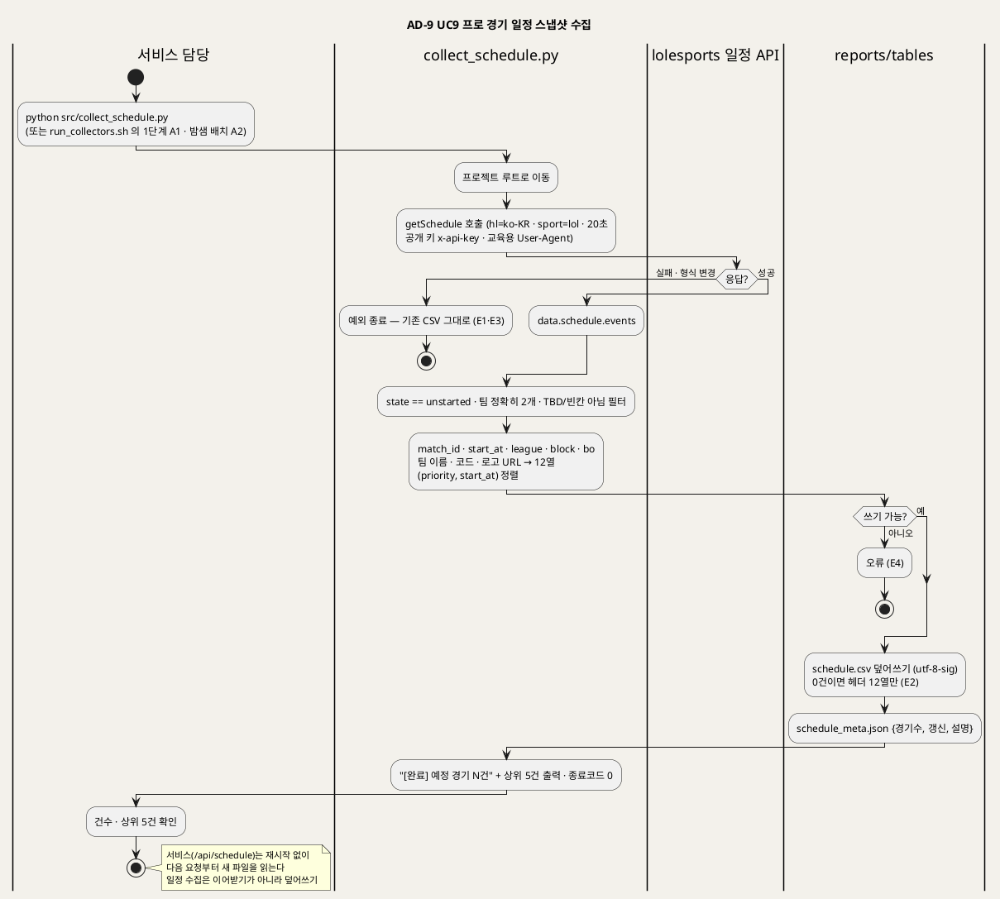
```plantuml
@startuml ad_uc09
skinparam backgroundColor #F3F1EB
skinparam shadowing false
skinparam activityFontSize 12
skinparam noteFontSize 11
title AD-9 UC9 프로 경기 일정 스냅샷 수집

|서비스 담당|
start
:python src/collect_schedule.py
(또는 run_collectors.sh 의 1단계 A1 · 밤샘 배치 A2);
|collect_schedule.py|
:프로젝트 루트로 이동;
:getSchedule 호출 (hl=ko-KR · sport=lol · 20초
공개 키 x-api-key · 교육용 User-Agent);
|lolesports 일정 API|
if (응답?) then (실패 · 형식 변경)
  |collect_schedule.py|
  :예외 종료 — 기존 CSV 그대로 (E1·E3);
  stop
else (성공)
  :data.schedule.events;
endif
|collect_schedule.py|
:state == unstarted · 팀 정확히 2개 · TBD/빈칸 아님 필터;
:match_id · start_at · league · block · bo
팀 이름 · 코드 · 로고 URL → 12열
(priority, start_at) 정렬;
|reports/tables|
if (쓰기 가능?) then (아니오)
  :오류 (E4);
  stop
else (예)
endif
:schedule.csv 덮어쓰기 (utf-8-sig)
0건이면 헤더 12열만 (E2);
:schedule_meta.json {경기수, 갱신, 설명};
|collect_schedule.py|
:"[완료] 예정 경기 N건" + 상위 5건 출력 · 종료코드 0;
|서비스 담당|
:건수 · 상위 5건 확인;
stop
note right
  서비스(/api/schedule)는 재시작 없이
  다음 요청부터 새 파일을 읽는다
  일정 수집은 이어받기가 아니라 덮어쓰기
end note
@enduml
```

소스를 직접 렌더하려면 **[「AD-9 프로 경기 일정 스냅샷 수집」 PlantUML 뷰어로 열기](https://plantuml.sumzip.com/plantuml/svg/eNp1VNFOG0cUfZ-vuEpfbBVjTFKp2EKNQ0CqWlVVKH2pKmtZD_bWy661OyYldSW3LNGKddTQ2GVJvcg0piFVWplggi2Fl3xKHj2z_9A7a8ehKnnamb0z5957zrlz02aKxSrrOij5XEWdmSN2STPKiqWsw6qilgqWWTHyC6ZuWvDB0vWl1OKtSyfsopI372pGAdYU3aaXIorKtA2NbS6ZBlvW7lFIzV6KGiaj7yIpwjSmU8jeTszBysIchA2HH7Zg-OJi2O-CCF6JdhPETodvbYutcxCuL57uElIVTosPHAwA93rcG1RJ1A1JlzdZ0TTAttSkauo6VVnOVos0X9HpdHmTxLj_kO80wKoYuXHctOxpu4i5fEhx73h46kA2Ba_PgXc7YsvHT1cMfMjOxjOkegVmlaRHVYt2EO70gT85xo_sQgQ9_st-hqQLlC2PL0Do98XLFsSK-nzJTHx2R2ayy6bF5nVTl5vZGdFzyfD0bNhtQfhzB75PKGUtUaKbMjo8eyhah-LxM1ixqZXIFqjBZGF4mUYw9lvWsl9-WiXaGsREsMu9s0_iwIrUwK3XCevHEiv0m8ILgJ_WkO84Abi6PYC08F2x3wfxxzZ_Uoc3tQagPOKwBwvLX8PwvM_rNdlwbDH1-nzxOtYDYDOzTChaAzM6J9iOTJDOK0yZnqDTDazezhBq5LW195GLwjIK8_NQMSKNaT6qvV4D7DLcb4YHLsxKrvDvV7duJ_nAFQOstelwz4ew6YROFzVYV5hazGnR5QgnpzC51qlSqFC5WtVNtRQtTBLBo3x_OvKHuGjwR1EC7HJ42oaVO5_Dm_u_orXFXo_EypZmWmj5qQlyXBbH289RGYtGsiSZsooSjSV51JX-HnZrfOfonTKyZFf4nfiI8w4_8pHTG__j03fjY87SE65UewP4g3_Eb70xeKzC1hIfJ2ytECczw5OebOdZD8K9Dn_QGFXOn9YRXxp7gpNbp6jQdzbO0A-jKcSZm8JKT4TXngLhdPhf2z--dxKufSP2HfTItyAtgy4cT_IXWMA1-BDE1k-i5cBHuAUcA94-iviNfDVmeSZz1XinZQeuH52-hIH6i6CfIRE78m0BSysUGfI1gYglcXySb8uMy-kXB8-F1xIHuyD27iMveJx7HRHUQTxuiBd_85c1NA0mctFndTlPgYN2uMC7eE6Cjx-m6DkSQeQVZJ53f8dmUdWR-1wevPqPJlK06AUkN3GFTy_5F0dFo0E=)** (사내 서버, SSO 로그인 필요) 또는 [로컬 Kroki 로 열기](http://192.168.0.91:8889/plantuml/svg/eNp1VNFOG0cUfZ-vuEpfbBVjTFKp2EKNQ0CqWlVVKH2pKmtZD_bWy661OyYldSW3LNGKddTQ2GVJvcg0piFVWplggi2Fl3xKHj2z_9A7a8ehKnnamb0z5957zrlz02aKxSrrOij5XEWdmSN2STPKiqWsw6qilgqWWTHyC6ZuWvDB0vWl1OKtSyfsopI372pGAdYU3aaXIorKtA2NbS6ZBlvW7lFIzV6KGiaj7yIpwjSmU8jeTszBysIchA2HH7Zg-OJi2O-CCF6JdhPETodvbYutcxCuL57uElIVTosPHAwA93rcG1RJ1A1JlzdZ0TTAttSkauo6VVnOVos0X9HpdHmTxLj_kO80wKoYuXHctOxpu4i5fEhx73h46kA2Ba_PgXc7YsvHT1cMfMjOxjOkegVmlaRHVYt2EO70gT85xo_sQgQ9_st-hqQLlC2PL0Do98XLFsSK-nzJTHx2R2ayy6bF5nVTl5vZGdFzyfD0bNhtQfhzB75PKGUtUaKbMjo8eyhah-LxM1ixqZXIFqjBZGF4mUYw9lvWsl9-WiXaGsREsMu9s0_iwIrUwK3XCevHEiv0m8ILgJ_WkO84Abi6PYC08F2x3wfxxzZ_Uoc3tQagPOKwBwvLX8PwvM_rNdlwbDH1-nzxOtYDYDOzTChaAzM6J9iOTJDOK0yZnqDTDazezhBq5LW195GLwjIK8_NQMSKNaT6qvV4D7DLcb4YHLsxKrvDvV7duJ_nAFQOstelwz4ew6YROFzVYV5hazGnR5QgnpzC51qlSqFC5WtVNtRQtTBLBo3x_OvKHuGjwR1EC7HJ42oaVO5_Dm_u_orXFXo_EypZmWmj5qQlyXBbH289RGYtGsiSZsooSjSV51JX-HnZrfOfonTKyZFf4nfiI8w4_8pHTG__j03fjY87SE65UewP4g3_Eb70xeKzC1hIfJ2ytECczw5OebOdZD8K9Dn_QGFXOn9YRXxp7gpNbp6jQdzbO0A-jKcSZm8JKT4TXngLhdPhf2z--dxKufSP2HfTItyAtgy4cT_IXWMA1-BDE1k-i5cBHuAUcA94-iviNfDVmeSZz1XinZQeuH52-hIH6i6CfIRE78m0BSysUGfI1gYglcXySb8uMy-kXB8-F1xIHuyD27iMveJx7HRHUQTxuiBd_85c1NA0mctFndTlPgYN2uMC7eE6Cjx-m6DkSQeQVZJ53f8dmUdWR-1wevPqPJlK06AUkN3GFTy_5F0dFo0E=) (내부망 전용). 위 그림 파일은 로그인 없이 보인다.

외부 호출이 딱 한 번이고 결과는 **덮어쓰기**다. 이어받기가 없는 유일한 수집기이며, 실패하면 기존 CSV 가 그대로 남아 서비스는 멈추지 않는다.

### 4.10 AD-10 Riot 표본 스냅샷 수집 (챔피언·랭킹) — [UC_10](UC_10_Riot표본스냅샷수집.md)

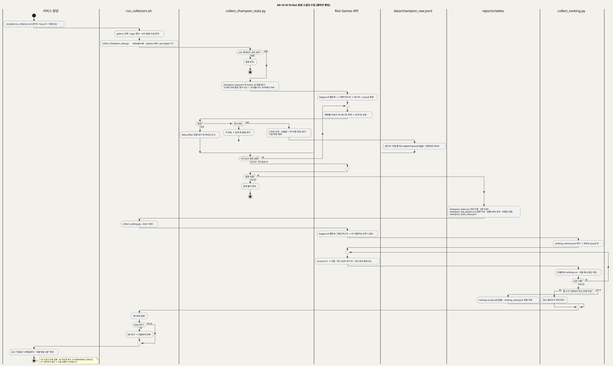

PlantUML 소스 보기

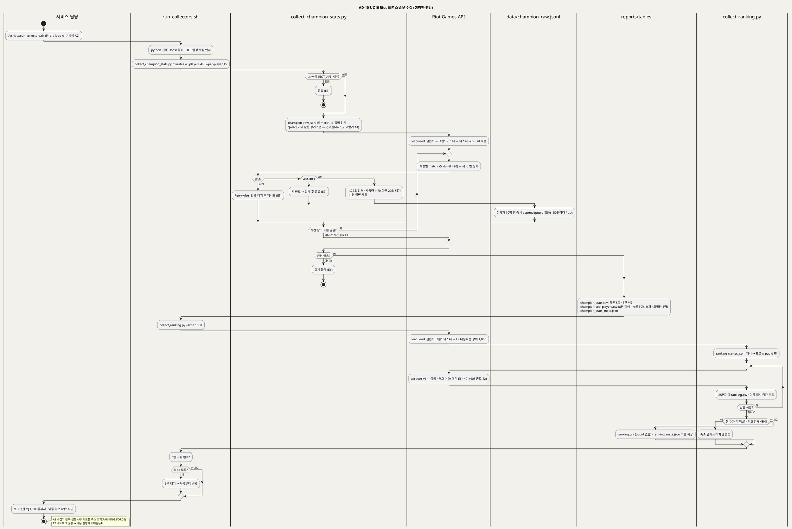
```plantuml
@startuml ad_uc10
skinparam backgroundColor #F3F1EB
skinparam shadowing false
skinparam activityFontSize 12
skinparam noteFontSize 11
title AD-10 UC10 Riot 표본 스냅샷 수집 (챔피언·랭킹)

|서비스 담당|
start
:./scripts/run_collectors.sh (한 번 / loop A1 / 밤샘 A2);
|run_collectors.sh|
:python 선택 · logs/ 준비 · UC9 일정 수집 먼저;
:collect_champion_stats.py --minutes 40 --players 400 --per-player 15;
|collect_champion_stats.py|
if (.env 에 RIOT_API_KEY?) then (없음)
  :종료 (E3);
  stop
else (있음)
endif
:champion_raw.jsonl 의 match_id 집합 읽기
"[시작] 이미 받은 경기 n건 — 건너뜁니다" (이어받기 A4);
|Riot Games API|
:league-v4 챌린저 → 그랜드마스터 → 마스터 → puuid 표본;
repeat
  :계정별 match-v5 ids (큐 420) → 새 id 만 상세;
  |collect_champion_stats.py|
  if (응답?) then (429)
    :Retry-After 만큼 대기 후 재시도 (E1);
  elseif (401/403) then
    :키 만료 → 집계 후 종료 (E2);
    break
  else (200)
    :1.25초 간격 · 사용량 > 70 이면 20초 대기
    11분 미만 제외;
    |data/champion_raw.jsonl|
    :참가자 10명 행 즉시 append (puuid 없음) · 50판마다 flush;
  endif
  |collect_champion_stats.py|
repeat while (시간 남고 표본 남음?) is (예) not (아니오: 시간 종료 E4)
if (원본 있음?) then (아니오)
  :집계 불가 (E6);
  stop
else (예)
endif
|reports/tables|
:champion_stats.csv (라인 5종 · 5판 이상)
champion_top_players.csv (8판 이상 · 승률 50% 초과 · 조합당 5명)
champion_stats_meta.json;
|run_collectors.sh|
:collect_ranking.py --limit 1000;
|collect_ranking.py|
|Riot Games API|
:league-v4 챌린저·그랜드마스터 → LP 내림차순 상위 1,000;
|collect_ranking.py|
:ranking_names.jsonl 캐시 → 모르는 puuid 만;
repeat
  |Riot Games API|
  :account-v1 → 이름 · 태그 (429 대기 E1 · 401/403 종료 E2);
  |collect_ranking.py|
  :25명마다 ranking.csv · 이름 캐시 중간 저장;
repeat while (남은 사람?) is (예) not (아니오)
if (행 수가 기존보다 적고 강제 아님?) then (예)
  :축소 덮어쓰기 차단 (E5);
else (아니오)
  |reports/tables|
  :ranking.csv (puuid 없음) · ranking_meta.json 최종 저장;
endif
|run_collectors.sh|
:"한 바퀴 완료";
if (loop 모드?) then (예)
  :5분 대기 → 처음부터 반복;
else (아니오)
endif
|서비스 담당|
:로그 "[완료] 1,000등까지 · 이름 확보 n명" 확인;
stop
note right
  A3 수집기 단독 실행 · A5 의도한 축소 쓰기(RANKING_FORCE)
  E7 네트워크 끊김 → 다음 실행이 이어받는다
end note
@enduml
```

소스를 직접 렌더하려면 **[「AD-10 Riot 표본 스냅샷 수집 (챔피언·랭킹)」 PlantUML 뷰어로 열기](https://plantuml.sumzip.com/plantuml/svg/eNqNVl1v2lYYvveveJVpEkgjsQmsK5G2soxUVae2ytaLaaqQC07wamxkm1SZuCCJW9HA1GRJWroAoxvNR9VtJNCEVNlNf0ovOcf_Ye85NgkbTbUb8Pl6v57nec-5YtmyaeezGsjpZD4liYJ1T9Vzsiln4a6cujdvGnk9PW1ohgkfzUzOSIkvh3ZYGTlt3Ff1eZiTNUsZWpFTtrqg2oszhm5_o_6ogBQeWtUNWzlfkQRbtTUF4l-FJBFuT-PPrGrY4K7XSKcHdLVFVh7QlWOgpSrdXYcAPdh0N0_pk97bY9L4w10-CQpCgTo1cuLgZiDlLimfFASemhAbn7BSppqzrQkzrydThqYpKdswrXErAwF3qwbksAQToBlGDuISfpF2i65UIR4OTgmFkTMFIZZbtDOGDtRpuit1eHuMZ-etCaCtIkbAxrenLwOtn9Lm1iBmsoej4pQQ820lUxk5m1MNPYlR2tZ4bhFCoayq523FgoiIg5wmLyomG_CRYvozIEUxrAvNFAR1DgLjir4A9OkazF67-W0yfuta8nriuy-CYGcUHev39CGtV4ICQIz-9oD8XoFAYhKTBbBsIycoCCVuapT4JkVPq3MY98CRKd8f_8EydA0zrEJWtlOZpJoGTNLd2se5v_u9tjD2PS3XaGP9Dk50yV89rOk2rRehf8iWQe8fdOFdcRPwnzglUlsi5RIpt8bQbb1Ln3RxO9sXjzAIOBmuylmsDGaC9dcUeT6vhBYiQA8qZKeNlYV3D3-G_nGPNGpko0Z2S0gE12nz6X-Pcvk8hutxa0owlZwi26wS_Y6DeJGO4-UUWoiCmraQIUtrEAmLQX6YrpRwFi1W8HOJOj1WtA-BAcDgoPV1Un59Vv9I-DIrPjqdVWxzMRSfsxFXNOounQKpFFnq7rYDtPEKy0geO4iPxPFh0DCDEVGaiIiTnkHPlLvcYiYYmjzS3XXMyDMzwDjMbQDcNRX5nm8NAmFR9KORxsNR2i1Bv-30D_cZkenyK_rLPvn1EXwOl0QO5n4XwiLb5QXKT0oSOXIAceaFadbos57nqZCWbXlilDsFzyFt9_rtIm2sgSSSlw_AffII6M4jTBrkXA6ZBwEPLp-xLKSo6FbWEFKkC8xpeSvD68JJ-mEoPKjhfkbVGL3LNUwTyPJev9MctBocoRvESUXgabUUZJ0Kv7Yc5CettmLgH_NLmogEudzo9hrvVFwy5zIbHPOU5gFCjkqYMoLx6Yjg0J-vtgLGapjYsWz5rqZYhSH5efmkrAUIEOww9R5EMRheGKwLQwiJGRTO9qP9pN9KvFOfnW_jCK-ekBdNrOrHgKD2O6d88nkbxYxNFKIIy5A17j2ZVWyZ43hBfxyAYMo6tvx5r7lpala1EWdRHGpf5zsK_0_nb48vEPnXtxC9Ltk5pe09WqpxedYckD652GHMHyR15nPQ1N6sMfrxvvFyj7zoktVNv2cguYcaxki4iLGcSuF1aYcWJE-DKJcdfiG4KzWMmyt_IPCExBZ8IZ8RypPoe8NF-2EGh8_9wRIDlUHm-fLDp611TtMmiuvF1H-oz1leZNomjQ-Q3aM2l2SpyjiLUdPnXdLpMve0ucSE029vod6BH6qeM59RmXH-aIs-rAD56U_s6XSjzfJGfEh5DwUQxVR95g8LZYT7aGc419GOMIDxjJZAX9eYKAbpD0T1HqqO8QdAe9MtdoE-cxCDsSmeN38OMAZs1EbSivJu58HIcT6sYizkqMjISNpV0nn9ntT8KEbfKTHynLMDL00ewR2PtWTjoH9SobvFIXjdZ3hDdUFHGoyxAep_SuA9hD2pwFTnM4yb8Un_3cEixGqTx1iMcothibbiUXZ147XCcvch8sAJzMZvXL9242py5ubsdILlmrgExGm5qz26jbfTKyBLq_0T77ZFFmDWvl2MD86ubpQMLrKE-UtPuIJf-MQU_gEdvcfo)** (사내 서버, SSO 로그인 필요) 또는 [로컬 Kroki 로 열기](http://192.168.0.91:8889/plantuml/svg/eNqNVl1v2lYYvveveJVpEkgjsQmsK5G2soxUVae2ytaLaaqQC07wamxkm1SZuCCJW9HA1GRJWroAoxvNR9VtJNCEVNlNf0ovOcf_Ye85NgkbTbUb8Pl6v57nec-5YtmyaeezGsjpZD4liYJ1T9Vzsiln4a6cujdvGnk9PW1ohgkfzUzOSIkvh3ZYGTlt3Ff1eZiTNUsZWpFTtrqg2oszhm5_o_6ogBQeWtUNWzlfkQRbtTUF4l-FJBFuT-PPrGrY4K7XSKcHdLVFVh7QlWOgpSrdXYcAPdh0N0_pk97bY9L4w10-CQpCgTo1cuLgZiDlLimfFASemhAbn7BSppqzrQkzrydThqYpKdswrXErAwF3qwbksAQToBlGDuISfpF2i65UIR4OTgmFkTMFIZZbtDOGDtRpuit1eHuMZ-etCaCtIkbAxrenLwOtn9Lm1iBmsoej4pQQ820lUxk5m1MNPYlR2tZ4bhFCoayq523FgoiIg5wmLyomG_CRYvozIEUxrAvNFAR1DgLjir4A9OkazF67-W0yfuta8nriuy-CYGcUHev39CGtV4ICQIz-9oD8XoFAYhKTBbBsIycoCCVuapT4JkVPq3MY98CRKd8f_8EydA0zrEJWtlOZpJoGTNLd2se5v_u9tjD2PS3XaGP9Dk50yV89rOk2rRehf8iWQe8fdOFdcRPwnzglUlsi5RIpt8bQbb1Ln3RxO9sXjzAIOBmuylmsDGaC9dcUeT6vhBYiQA8qZKeNlYV3D3-G_nGPNGpko0Z2S0gE12nz6X-Pcvk8hutxa0owlZwi26wS_Y6DeJGO4-UUWoiCmraQIUtrEAmLQX6YrpRwFi1W8HOJOj1WtA-BAcDgoPV1Un59Vv9I-DIrPjqdVWxzMRSfsxFXNOounQKpFFnq7rYDtPEKy0geO4iPxPFh0DCDEVGaiIiTnkHPlLvcYiYYmjzS3XXMyDMzwDjMbQDcNRX5nm8NAmFR9KORxsNR2i1Bv-30D_cZkenyK_rLPvn1EXwOl0QO5n4XwiLb5QXKT0oSOXIAceaFadbos57nqZCWbXlilDsFzyFt9_rtIm2sgSSSlw_AffII6M4jTBrkXA6ZBwEPLp-xLKSo6FbWEFKkC8xpeSvD68JJ-mEoPKjhfkbVGL3LNUwTyPJev9MctBocoRvESUXgabUUZJ0Kv7Yc5CettmLgH_NLmogEudzo9hrvVFwy5zIbHPOU5gFCjkqYMoLx6Yjg0J-vtgLGapjYsWz5rqZYhSH5efmkrAUIEOww9R5EMRheGKwLQwiJGRTO9qP9pN9KvFOfnW_jCK-ekBdNrOrHgKD2O6d88nkbxYxNFKIIy5A17j2ZVWyZ43hBfxyAYMo6tvx5r7lpala1EWdRHGpf5zsK_0_nb48vEPnXtxC9Ltk5pe09WqpxedYckD652GHMHyR15nPQ1N6sMfrxvvFyj7zoktVNv2cguYcaxki4iLGcSuF1aYcWJE-DKJcdfiG4KzWMmyt_IPCExBZ8IZ8RypPoe8NF-2EGh8_9wRIDlUHm-fLDp611TtMmiuvF1H-oz1leZNomjQ-Q3aM2l2SpyjiLUdPnXdLpMve0ucSE029vod6BH6qeM59RmXH-aIs-rAD56U_s6XSjzfJGfEh5DwUQxVR95g8LZYT7aGc419GOMIDxjJZAX9eYKAbpD0T1HqqO8QdAe9MtdoE-cxCDsSmeN38OMAZs1EbSivJu58HIcT6sYizkqMjISNpV0nn9ntT8KEbfKTHynLMDL00ewR2PtWTjoH9SobvFIXjdZ3hDdUFHGoyxAep_SuA9hD2pwFTnM4yb8Un_3cEixGqTx1iMcothibbiUXZ147XCcvch8sAJzMZvXL9242py5ubsdILlmrgExGm5qz26jbfTKyBLq_0T77ZFFmDWvl2MD86ubpQMLrKE-UtPuIJf-MQU_gEdvcfo) (내부망 전용). 위 그림 파일은 로그인 없이 보인다.

두 반복(챔피언 경기 · 랭킹 이름)이 차례로 돈다. 둘 다 받은 것을 즉시 파일에 붙이고 다음 실행이 이어받는다. 사용량 70 초과 시 20초 대기가 라이브 사용자 몫을 남기는 장치이고, 랭킹은 기존보다 적은 행으로 덮어쓰지 못하게 막는다(E5).

### 4.11 AD-11 모델 재현·재학습 — [UC_11](UC_11_모델재현재학습.md)

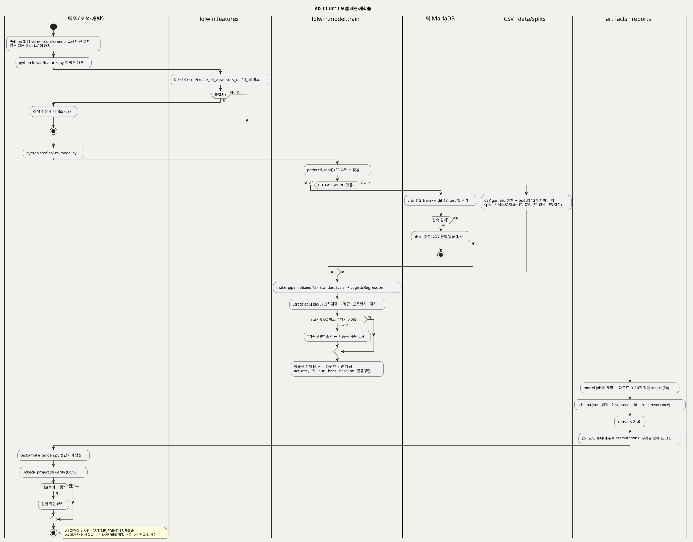

PlantUML 소스 보기

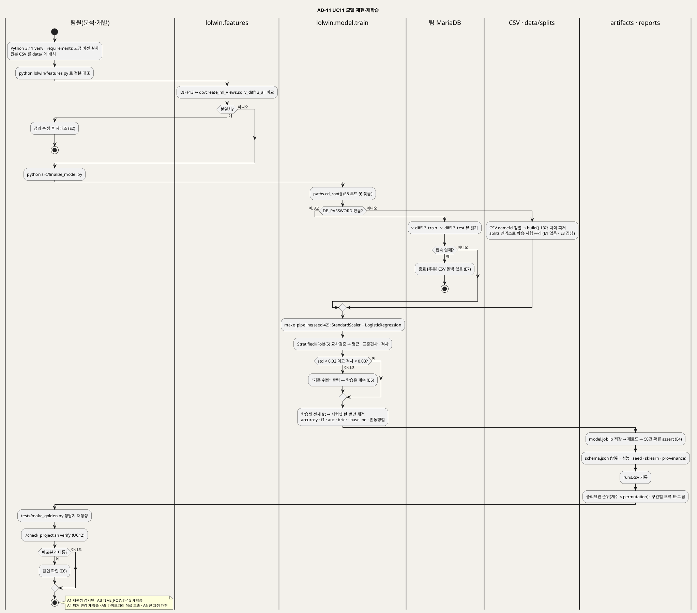
```plantuml
@startuml ad_uc11
skinparam backgroundColor #F3F1EB
skinparam shadowing false
skinparam activityFontSize 12
skinparam noteFontSize 11
title AD-11 UC11 모델 재현·재학습

|팀원(분석·개발)|
start
:Python 3.11 venv · requirements 고정 버전 설치
원본 CSV 를 data/ 에 배치;
:python lolwin/features.py 로 정본 대조;
|lolwin.features|
:DIFF13 ↔ db/create_ml_views.sql v_diff13_all 비교;
if (불일치?) then (예)
  |팀원(분석·개발)|
  :정의 수정 후 재대조 (E2);
  stop
else (아니오)
endif
|팀원(분석·개발)|
:python src/finalize_model.py;
|lolwin.model.train|
:paths.cd_root() (E8 루트 못 찾음);
if (DB_PASSWORD 있음?) then (예, A2)
  |팀 MariaDB|
  :v_diff13_train · v_diff13_test 뷰 읽기;
  if (접속 실패?) then (예)
    :종료 [추론] CSV 폴백 없음 (E7);
    stop
  else (아니오)
  endif
else (아니오)
  |CSV · data/splits|
  :CSV gameId 정렬 → build() 13개 차이 피처
  splits 인덱스로 학습·시험 분리 (E1 없음 · E3 겹침);
endif
|lolwin.model.train|
:make_pipeline(seed 42): StandardScaler + LogisticRegression;
:StratifiedKFold(5) 교차검증 → 평균 · 표준편차 · 격차;
if (std < 0.02 이고 격차 < 0.03?) then (아니오)
  :"기준 위반" 출력 — 학습은 계속 (E5);
else (예)
endif
:학습셋 전체 fit → 시험셋 한 번만 채점
accuracy · f1 · auc · brier · baseline · 혼동행렬;
|artifacts · reports|
:model.joblib 저장 → 재로드 → 50건 확률 assert (E4);
:schema.json (범위 · 성능 · seed · sklearn · provenance);
:runs.csv 기록;
:승리요인 순위(계수 × permutation) · 구간별 오류 표·그림;
|팀원(분석·개발)|
:tests/make_golden.py 정답지 재생성;
:./check_project.sh verify (UC12);
if (배포본과 다름?) then (예)
  :원인 확인 (E6);
else (아니오)
endif
stop
note right
  A1 재현성 검사만 · A3 TIME_POINT=15 재학습
  A4 피처 변경 재학습 · A5 라이브러리 직접 호출 · A6 전 과정 재현
end note
@enduml
```

소스를 직접 렌더하려면 **[「AD-11 모델 재현·재학습」 PlantUML 뷰어로 열기](https://plantuml.sumzip.com/plantuml/svg/eNp9Vd9TG1UYfd-_4pv6kowauqRUJ-hYWmCG0dpOU_XBcTKX3Zvkls1uuntDB4eHqFuGQhCqYFOb1GADxU4eQoASxtSH-p_0Mffu_-B3d4NhautLdnN_7TnnO9-5lzxOXF4qWEDMTMnQdc2bY3aRuKQAs8SYy7lOyTavOJbjwjvTyWl96vKZFV6emM4dZucgSyyPnpkhBmfzjC9MOzZPs28p6KNnZm2H0-GMrnHGLQoTk-_rOnxxBX_Esz2x1gX5uBVU_ZfH6rn1UK4cadpiUCnLRxsx8dyXfv3lcb9dE-1afFELiWip6ws879iQTOAp89Seh5fH4NLbJebSArW5B_2Dhmxsgej4suGD9JvypKrhieKgC1fSX4LY6YFJOBkB-WADRLuN8-NaqhidazkW8h3JUsJLLvUSxQUQ2zXAE9V-gdi22-PaYrQscbpsUUtNzkxP60l4tbQJ5uyI4eIMzRSszDyjd7yEd9uC-YzJslk9mSGWBeLE7x9tjGssC0h1WdZ7COOTOPA8tSEmq8txDeCtWgCkEJGsV0EuVxXb4JGvxIzwQWxqND6OizzuFDWKhcMTt3yxuiyrzbhGbcTxdp1PlfBcYyTLbGJhDTMFx6QWijGkHo1wlzBb7SE87yUMM-M6Do_FEcGHIJ7sBSuo2bM_Qbb_kvVKPKI7eTlzfSKd_urajUnEjNQrZ3m_BxOjp9zhKnEZmbwcEv5XvvCbquzDEepxEMdtkPUX_W5bUVcfko37cmkN5GozqOy9rq2S8Pe74kkFvpbPN8V245vQHcH6oWjvozWWEBfS-CAUciAlwH_ExKFQzjdMLKrzEGZoNq9oMe6FRNRwjhTojBnaqtFC0_wEsyVmmaicnsRKoGB7sn4IwWZPdqqqkuF25NcVa_typak8GXUMNs9qLXhQBSyk2G0hZP0UPX57Kgn9zok82UMag7q_sX4FMkczRVakFrNpzKPUhAuj8RSkObFN4pppg1jUhXfhMyfHPM6MGzSHvveYY2PvpPEYzrKMmp9OO8hiLA5obuTQ75Tlbj3kF6zf6x83FKbgfk02y8GPXVyg_vc7f-Bb5A2Pm_ARnE-cH0Wuh9jKg9loMDks4lmhU-ew6HgkyJov2tVzIJ_XRGMHXpU3ByLJehlzwVduiE2NKS2icikrRLKkBgvvrmJRfNk5hCzjIfBIXjURbNUwVpbF0wrIfUyXDY0YRsklxoKikdXVLykZ6jHrMpRLvRAv1DQkXu2J9YfBL_ew5thIGGcsiznqRRFWdFxlkFRUmFvOrMVmEUtZPt6JcGB7b9fEz7Xw39j5_j764-GW2GkA8TzqcqR2AamlPCNPCyRxy8MmjonOJqqiviD9fbGyo97C8qrnnEWJG7ZS0XUwTIltUHWCW7Kxmb15QF3Fdh1H5MoJmkv-uokOxMyp4ZkxJehyFf5-AEXqFkocLeDY8bCiR61-2xcHmEnVptipqpJjwhx3xW5v_H-SR_WxNxJ6MYc-oraKX9Ujq0fyaVkpIH-oIw8ElBhBlsZcBoHfogZPeHm8DVyWXYAYXjCjg6jBdA_WW5jc_YMeiNWm2PVfz4EUQlGkUEr1iE1dHNrj9cwMQ0DdbeCyXJ7j7gl9cIchKlBu_76l7IEaTCTh5szVqcz1azOf3_xYH4PhHYfbLgxaG8RBud95MZwMt46BwPugfii6FfFbS3W1fPodphk6qIveDtdcVD5FU_dU_EcYFMrw6tUu4Rve-do_xp65lA==)** (사내 서버, SSO 로그인 필요) 또는 [로컬 Kroki 로 열기](http://192.168.0.91:8889/plantuml/svg/eNp9Vd9TG1UYfd-_4pv6kowauqRUJ-hYWmCG0dpOU_XBcTKX3Zvkls1uuntDB4eHqFuGQhCqYFOb1GADxU4eQoASxtSH-p_0Mffu_-B3d4NhautLdnN_7TnnO9-5lzxOXF4qWEDMTMnQdc2bY3aRuKQAs8SYy7lOyTavOJbjwjvTyWl96vKZFV6emM4dZucgSyyPnpkhBmfzjC9MOzZPs28p6KNnZm2H0-GMrnHGLQoTk-_rOnxxBX_Esz2x1gX5uBVU_ZfH6rn1UK4cadpiUCnLRxsx8dyXfv3lcb9dE-1afFELiWip6ws879iQTOAp89Seh5fH4NLbJebSArW5B_2Dhmxsgej4suGD9JvypKrhieKgC1fSX4LY6YFJOBkB-WADRLuN8-NaqhidazkW8h3JUsJLLvUSxQUQ2zXAE9V-gdi22-PaYrQscbpsUUtNzkxP60l4tbQJ5uyI4eIMzRSszDyjd7yEd9uC-YzJslk9mSGWBeLE7x9tjGssC0h1WdZ7COOTOPA8tSEmq8txDeCtWgCkEJGsV0EuVxXb4JGvxIzwQWxqND6OizzuFDWKhcMTt3yxuiyrzbhGbcTxdp1PlfBcYyTLbGJhDTMFx6QWijGkHo1wlzBb7SE87yUMM-M6Do_FEcGHIJ7sBSuo2bM_Qbb_kvVKPKI7eTlzfSKd_urajUnEjNQrZ3m_BxOjp9zhKnEZmbwcEv5XvvCbquzDEepxEMdtkPUX_W5bUVcfko37cmkN5GozqOy9rq2S8Pe74kkFvpbPN8V245vQHcH6oWjvozWWEBfS-CAUciAlwH_ExKFQzjdMLKrzEGZoNq9oMe6FRNRwjhTojBnaqtFC0_wEsyVmmaicnsRKoGB7sn4IwWZPdqqqkuF25NcVa_typak8GXUMNs9qLXhQBSyk2G0hZP0UPX57Kgn9zok82UMag7q_sX4FMkczRVakFrNpzKPUhAuj8RSkObFN4pppg1jUhXfhMyfHPM6MGzSHvveYY2PvpPEYzrKMmp9OO8hiLA5obuTQ75Tlbj3kF6zf6x83FKbgfk02y8GPXVyg_vc7f-Bb5A2Pm_ARnE-cH0Wuh9jKg9loMDks4lmhU-ew6HgkyJov2tVzIJ_XRGMHXpU3ByLJehlzwVduiE2NKS2icikrRLKkBgvvrmJRfNk5hCzjIfBIXjURbNUwVpbF0wrIfUyXDY0YRsklxoKikdXVLykZ6jHrMpRLvRAv1DQkXu2J9YfBL_ew5thIGGcsiznqRRFWdFxlkFRUmFvOrMVmEUtZPt6JcGB7b9fEz7Xw39j5_j764-GW2GkA8TzqcqR2AamlPCNPCyRxy8MmjonOJqqiviD9fbGyo97C8qrnnEWJG7ZS0XUwTIltUHWCW7Kxmb15QF3Fdh1H5MoJmkv-uokOxMyp4ZkxJehyFf5-AEXqFkocLeDY8bCiR61-2xcHmEnVptipqpJjwhx3xW5v_H-SR_WxNxJ6MYc-oraKX9Ujq0fyaVkpIH-oIw8ElBhBlsZcBoHfogZPeHm8DVyWXYAYXjCjg6jBdA_WW5jc_YMeiNWm2PVfz4EUQlGkUEr1iE1dHNrj9cwMQ0DdbeCyXJ7j7gl9cIchKlBu_76l7IEaTCTh5szVqcz1azOf3_xYH4PhHYfbLgxaG8RBud95MZwMt46BwPugfii6FfFbS3W1fPodphk6qIveDtdcVD5FU_dU_EcYFMrw6tUu4Rve-do_xp65lA==) (내부망 전용). 위 그림 파일은 로그인 없이 보인다.

원천 선택(DB 또는 CSV) 뒤로는 한 길이다. 교차검증 기준 위반은 경고만 내고 진행하며(E5), 저장 후 재로드 assert(E4)가 산출물의 유효성을 가른다. 끝나면 정답지를 다시 만들고 UC12 로 넘어간다.

### 4.12 AD-12 서빙 계약·파리티 검증 — [UC_12](UC_12_서빙계약파리티검증.md)

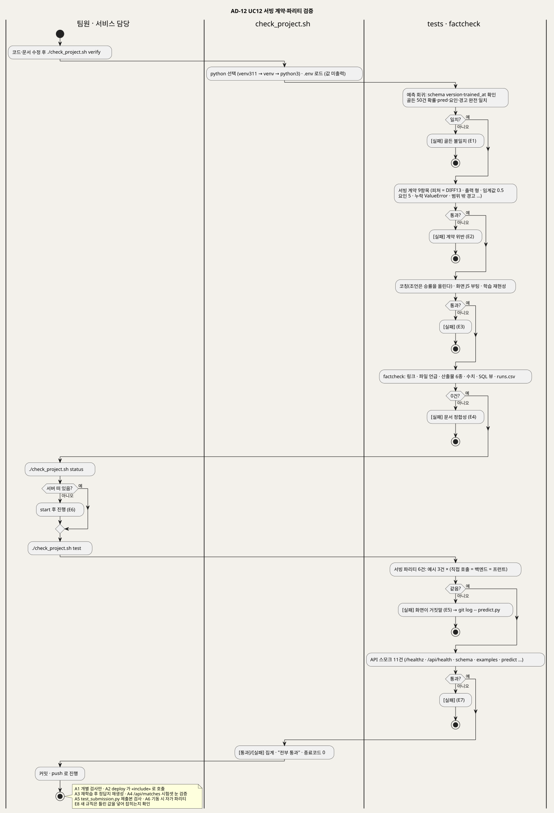

PlantUML 소스 보기

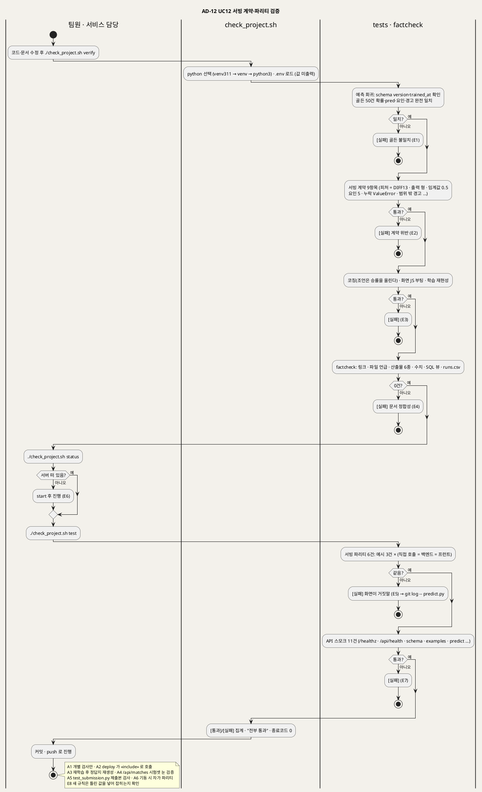
```plantuml
@startuml ad_uc12
skinparam backgroundColor #F3F1EB
skinparam shadowing false
skinparam activityFontSize 12
skinparam noteFontSize 11
title AD-12 UC12 서빙 계약·파리티 검증

|팀원 · 서비스 담당|
start
:코드·문서 수정 후 ./check_project.sh verify;
|check_project.sh|
:python 선택 (venv311 → venv → python3) · .env 로드 (값 미출력);
|tests · factcheck|
:예측 회귀: schema version·trained_at 확인
골든 50건 확률·pred·요인·경고 완전 일치;
if (일치?) then (아니오)
  :[실패] 골든 불일치 (E1);
  stop
else (예)
endif
:서빙 계약 9항목 (피처 = DIFF13 · 출력 형 · 임계값 0.5
요인 5 · 누락 ValueError · 범위 밖 경고 …);
if (통과?) then (아니오)
  :[실패] 계약 위반 (E2);
  stop
else (예)
endif
:코칭(조언은 승률을 올린다) · 화면 JS 부팅 · 학습 재현성;
if (통과?) then (아니오)
  :[실패] (E3);
  stop
else (예)
endif
:factcheck: 링크 · 파일 언급 · 산출물 6종 · 수치 · SQL 뷰 · runs.csv;
if (0건?) then (아니오)
  :[실패] 문서 정합성 (E4);
  stop
else (예)
endif
|팀원 · 서비스 담당|
:./check_project.sh status;
if (서버 떠 있음?) then (아니오)
  :start 후 진행 (E6);
else (예)
endif
:./check_project.sh test;
|tests · factcheck|
:서빙 파리티 6건: 예시 3건 × (직접 호출 = 백엔드 = 프런트);
if (같음?) then (아니오)
  :[실패] 화면이 거짓말 (E5) → git log -- predict.py;
  stop
else (예)
endif
:API 스모크 11건 (/healthz · /api/health · schema · examples · predict …);
if (통과?) then (아니오)
  :[실패] (E7);
  stop
else (예)
endif
|check_project.sh|
:[통과]/[실패] 집계 · "전부 통과" · 종료코드 0;
|팀원 · 서비스 담당|
:커밋 · push 로 진행;
stop
note right
  A1 개별 검사만 · A2 deploy 가 «include» 로 호출
  A3 재학습 후 정답지 재생성 · A4 /api/matches 시험셋 눈 검증
  A5 test_submission.py 제출본 검사 · A6 기동 시 자가 파리티
  E8 새 규칙은 틀린 값을 넣어 잡히는지 확인
end note
@enduml
```

소스를 직접 렌더하려면 **[「AD-12 서빙 계약·파리티 검증」 PlantUML 뷰어로 열기](https://plantuml.sumzip.com/plantuml/svg/eNqVVktPG1cU3s-vOEo39oLH4EBbo6qhiZFSddEKtZsoQhN7wFPsGWtmTEPEwoQhcrClErDBTmxqEgdD6qjDK7YV2Lj_JMu59_6HnnvHIbQFo2ysM_dxznfO-b5zfcuyFdNOJxOgxKbTUXlEsuY0PaWYShIeKNG5WdNI67HbRsIw4YvJ0KQc-e7CCSuuxIzfNH0WZpSEpV7YUaK2Nq_ZC5OGbk9pj1T4l2fdsNVPO7Jka3ZChYk7A_II_Hwbf6hTIZ0yeEcOLZ51WyyfJ7tNlnPBO8zQ3aokLbJ8hr5Yg27LP-vQ1TqQ3DHJdRYlkZMUpmcFslHptkizjWeAZku0VgT2woHBoWhcjc5Np0zjVzVqD1pxmFdNbWZhXFr8786iFE4t2HFDx0A1tlyFwLyqz4dkGT48WQduC8M_EwpyRIN8kexUMDoEPHcdyF9t-q5Caq-DGMBWLdvix2awSCIahqClLG3vAHue91qZMFi4nlQ4KEsz9G7LNhVNV2PTig2sXKTVtuQd7ZGNGowOewfHfI28rnVbKVONdVv0eQFPdFve4Zl3VANadmjNAVo9pZ3SuKTNQMC3vw2CHVd1_Cw6JJelpXpQAgjfo7k6y-_dh14I8i7rn4dARMYEACzbSEkqNhyvlrJBSdVj2gzmcLFp8DUrviVv9iHACqf0sATfwJ27k5NySLRMFANYqSi-th28w-s0PDgq-ehhlO-QrEOqZ_CLkkirEdNEDvLFwwKtOEDcTehl-CGzG_QTY09OvKPT6xMTCNELcXlWI32zOivQztsA3XHpZptWM0BXO1hsWsWSlppk1yW5uug6KxfI_jF8P4UVy7D8ilgrlunqCWbYZCWHOgefgzIQCfXDdc6eMJDGEltqinj5PPYKEKnXfipq-9jlxW6ewhh9KSBxGWAv0Zr66QcgLZebZlq3BqPWvI-Pc-o6dB9FVSuy4j5mhnBv9oHbV6_hS_SIGrbTVo-ueOMQO76JZN5GMuavACd0LwROGw7bfIqYxhDT_2t3STyuyivF6RP70xQawwKFgWs2V4EQV-DfWxihsURrz5DVXOzId-Ie0C0-gtBmBYf84bLVdo-onlu-Oo_zIvuUotVj8A5c2tggjTXMaTQoJs6sZkPCmIWBAeC61zCP1EIfwkz8eBe5Wydv9jhZZJnDDgzFVSVhxx_xlIeUlNb75p-9GYSW-lBJphKqqEsv1GdrLhD5sh89Lpm693zH94fOfdDGM5QuR3EDJxqqDPwjNwStXq6QV3l_5sPw-DWMo-_rxM2JhNLYfRzWPc6MSwIhf6HA1GbjNmKekMFzKwRD8-fncZM08vzmxAjE1FTCWMDdDHT_1PRoIh1Tu--FO58G_HZI6N-fBIKctSLJndBGhq_T5SpXD3d30-9AUuHEswC5xbZKdCWHYzD78eFDd6OCq9NW-kFSs_jzgG1HnxWu86N2D6JwOAZe2yW_l7krjLXGYZ6TGF1FvgK6jK5bFdop89HGchkcaJjOOh9vxHlFN4_x4g7bzpLVAkfce32wa-IRl26hhf8epH8A38wBpQ==)** (사내 서버, SSO 로그인 필요) 또는 [로컬 Kroki 로 열기](http://192.168.0.91:8889/plantuml/svg/eNqVVktPG1cU3s-vOEo39oLH4EBbo6qhiZFSddEKtZsoQhN7wFPsGWtmTEPEwoQhcrClErDBTmxqEgdD6qjDK7YV2Lj_JMu59_6HnnvHIbQFo2ysM_dxznfO-b5zfcuyFdNOJxOgxKbTUXlEsuY0PaWYShIeKNG5WdNI67HbRsIw4YvJ0KQc-e7CCSuuxIzfNH0WZpSEpV7YUaK2Nq_ZC5OGbk9pj1T4l2fdsNVPO7Jka3ZChYk7A_II_Hwbf6hTIZ0yeEcOLZ51WyyfJ7tNlnPBO8zQ3aokLbJ8hr5Yg27LP-vQ1TqQ3DHJdRYlkZMUpmcFslHptkizjWeAZku0VgT2woHBoWhcjc5Np0zjVzVqD1pxmFdNbWZhXFr8786iFE4t2HFDx0A1tlyFwLyqz4dkGT48WQduC8M_EwpyRIN8kexUMDoEPHcdyF9t-q5Caq-DGMBWLdvix2awSCIahqClLG3vAHue91qZMFi4nlQ4KEsz9G7LNhVNV2PTig2sXKTVtuQd7ZGNGowOewfHfI28rnVbKVONdVv0eQFPdFve4Zl3VANadmjNAVo9pZ3SuKTNQMC3vw2CHVd1_Cw6JJelpXpQAgjfo7k6y-_dh14I8i7rn4dARMYEACzbSEkqNhyvlrJBSdVj2gzmcLFp8DUrviVv9iHACqf0sATfwJ27k5NySLRMFANYqSi-th28w-s0PDgq-ehhlO-QrEOqZ_CLkkirEdNEDvLFwwKtOEDcTehl-CGzG_QTY09OvKPT6xMTCNELcXlWI32zOivQztsA3XHpZptWM0BXO1hsWsWSlppk1yW5uug6KxfI_jF8P4UVy7D8ilgrlunqCWbYZCWHOgefgzIQCfXDdc6eMJDGEltqinj5PPYKEKnXfipq-9jlxW6ewhh9KSBxGWAv0Zr66QcgLZebZlq3BqPWvI-Pc-o6dB9FVSuy4j5mhnBv9oHbV6_hS_SIGrbTVo-ueOMQO76JZN5GMuavACd0LwROGw7bfIqYxhDT_2t3STyuyivF6RP70xQawwKFgWs2V4EQV-DfWxihsURrz5DVXOzId-Ie0C0-gtBmBYf84bLVdo-onlu-Oo_zIvuUotVj8A5c2tggjTXMaTQoJs6sZkPCmIWBAeC61zCP1EIfwkz8eBe5Wydv9jhZZJnDDgzFVSVhxx_xlIeUlNb75p-9GYSW-lBJphKqqEsv1GdrLhD5sh89Lpm693zH94fOfdDGM5QuR3EDJxqqDPwjNwStXq6QV3l_5sPw-DWMo-_rxM2JhNLYfRzWPc6MSwIhf6HA1GbjNmKekMFzKwRD8-fncZM08vzmxAjE1FTCWMDdDHT_1PRoIh1Tu--FO58G_HZI6N-fBIKctSLJndBGhq_T5SpXD3d30-9AUuHEswC5xbZKdCWHYzD78eFDd6OCq9NW-kFSs_jzgG1HnxWu86N2D6JwOAZe2yW_l7krjLXGYZ6TGF1FvgK6jK5bFdop89HGchkcaJjOOh9vxHlFN4_x4g7bzpLVAkfce32wa-IRl26hhf8epH8A38wBpQ==) (내부망 전용). 위 그림 파일은 로그인 없이 보인다.

관문이 여섯 개 직렬로 서 있다. 앞의 넷(`verify`)은 서버 없이 돌고, 뒤의 둘(`test`)은 서버가 떠 있어야 돈다. 어느 하나라도 실패하면 커밋으로 넘어가지 않는다.

### 4.13 AD-13 팀 서버 배포·상태 확인 — [UC_13](UC_13_팀서버배포상태확인.md)

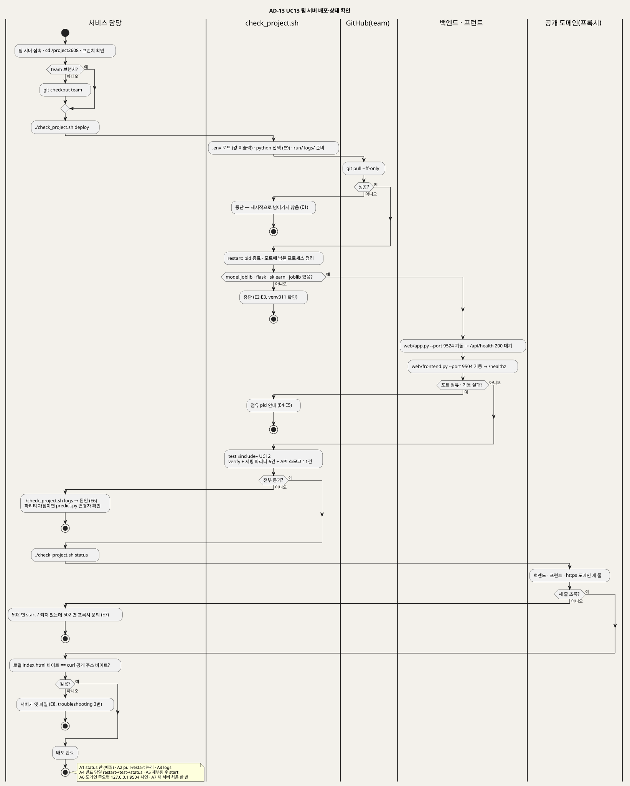

PlantUML 소스 보기

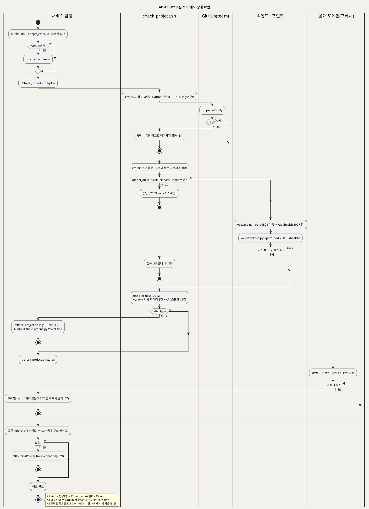
```plantuml
@startuml ad_uc13
skinparam backgroundColor #F3F1EB
skinparam shadowing false
skinparam activityFontSize 12
skinparam noteFontSize 11
title AD-13 UC13 팀 서버 배포·상태 확인

|서비스 담당|
start
:팀 서버 접속 · cd ~/project2608 · 브랜치 확인;
if (team 브랜치?) then (아니오)
  :git checkout team;
else (예)
endif
:./check_project.sh deploy;
|check_project.sh|
:.env 로드 (값 미출력) · python 선택 (E9) · run/ logs/ 준비;
|GitHub(team)|
:git pull --ff-only;
if (성공?) then (아니오)
  |check_project.sh|
  :중단 — 재시작으로 넘어가지 않음 (E1);
  stop
else (예)
endif
|check_project.sh|
:restart: pid 종료 · 포트에 남은 프로세스 정리;
if (model.joblib · flask · sklearn · joblib 있음?) then (아니오)
  :중단 (E2·E3, venv311 확인);
  stop
else (예)
endif
|백엔드 · 프런트|
:web/app.py --port 9524 기동 → /api/health 200 대기;
:web/frontend.py --port 9504 기동 → /healthz;
if (포트 점유 · 기동 실패?) then (예)
  |check_project.sh|
  :점유 pid 안내 (E4·E5);
  stop
else (아니오)
endif
|check_project.sh|
:test «include» UC12
verify + 서빙 파리티 6건 + API 스모크 11건;
if (전부 통과?) then (아니오)
  |서비스 담당|
  :./check_project.sh logs → 원인 (E6)
  파리티 깨짐이면 predict.py 변경자 확인;
  stop
else (예)
endif
|서비스 담당|
:./check_project.sh status;
|공개 도메인(프록시)|
:백엔드 · 프런트 · https 도메인 세 줄;
if (세 줄 초록?) then (아니오)
  |서비스 담당|
  :502 면 start / 켜져 있는데 502 면 프록시 문의 (E7);
  stop
else (예)
endif
|서비스 담당|
:로컬 index.html 바이트 == curl 공개 주소 바이트?;
if (같음?) then (아니오)
  :서버가 옛 파일 (E8, troubleshooting 3번);
  stop
else (예)
endif
:배포 완료;
stop
note right
  A1 status 만 (매일) · A2 pull·restart 분리 · A3 logs
  A4 발표 당일 restart→test→status · A5 재부팅 후 start
  A6 도메인 죽으면 127.0.0.1:9504 시연 · A7 새 서버 처음 한 번
end note
@enduml
```

소스를 직접 렌더하려면 **[「AD-13 팀 서버 배포·상태 확인」 PlantUML 뷰어로 열기](https://plantuml.sumzip.com/plantuml/svg/eNqVVt9v2lYUfvdfcaS9gNYAhvxoQVWbdcm2t0nTnisDJrhxbMu-pKOKJtq4EQpUSbqwEMVkbGFLuiHNSWgCavrCn9JH7vX_sHONG9KFRKoQYHzuuf6-853vXB5aRDJJYUkFKfu4kBETgrWoaIZkSkuQljKLC6Ze0LKPdFU34Yv5xLw499WVFVZeyupPFW0BcpJqyVciUoYoywopzusa-UF5JoMYvxLVdCKPIqJAFKLKMPv1hJiAHx_hh1ctAbMdemIDdV1vo90_Z6vPvVUHvN0aa3QFYYWHezZbbwGtdGiltyL4VITklVzW3GJrr6B_Dpks_Bw1TP2JnCHx6dhdfo92q3TfYb16sGlKUHIQIjICvAw9CAPJyxqEWM2mlTKrt8ICQHJBIZDJy5lFvUCAZ6QEGQuAy-rlsCBrWSUnJCNRf8nj4LERKw9Z2VD1YkpY-X9kBZfL2jLQ3x36iwOhgfsa6L9ddubQ5p9hjtYokryuIbOmt9qA0Nw9_65Z0KKg6gtWFFirhAXBvb9RyLeFtE8kjPtyrEZBVWFiIpeb0DW1OCTK7OPB6dvxBMfgQ9astUUrR_ChtA1sv80qDtvfYs4FYgZq19mvnYFbYodY_do6a1QRoxhOYZ5FdON6ecaVwJR9DZNgKFlgf7ykB1VOEvX31rtsZxPoiyPWKIG3beNDmd3l8rNmjf7VHnJa0rOyGnmip1UlzTNzqmQt8gtrUZUlU-OXQZTtlxHkDfoGTENz8f75XOIOLKM2CVEMGuU2VtQ9ZjvbXEMOHHH-5iJ25PZUTkclw4gYRRTC0E0C96bikzDounRjFz6svQYMK9G8LKkkD_FYDGi1hNHUMDVnol_wGZ_kxz7NH-Y-G5ZiWDSsziZzmhxMsJJVWl71aMSbY79R8GGyr0atTF90sCKTWJGpaxUYVe9mdQmqC_1_FC2jFrJy_x23elxYlk0lV4Qvfc_2dtH6VZTTq7gwPTju4P3Z778D1Jn-feQ9b-O0wLtBAzdteobNsPZ2cHpxQx9fnxJIa4wxuYX8IrK9TVQYeU7z_BGYQe-IHWKoQ990wDDlrIKJqAU9LQ1O3rP9zcshcmNrXMcyDgk6gBQstDGac-CiszZs-mYbdw75Xd9A23FXj-8z_iNPiGGN0rCu-G7ZH03v_wDWKeNen1O0qVgcOHffoYDj5sJhzS63EV3fpq9c-LjgEibQdpc16ljLmfDnlYWb-10bFC0r_xTJEzydqItcOpzh_fuQKZgqBOVhBxdsrTqKPxjyHLi7t7jbPx1wWAGr73GNWeMCUd69AwSPu7QqW3ldJ_xYS9CT8i3Yk8PDCdiujaMqJfir-OEGprKQJ5g3KwaCAj3EiUgPW_gsf3LPxv2p3D8Phh7QMxt7zQ8l_H7k6ZPIzPG2sJaVHkcZLMZO5W7Cr2B3njXFpzI6wqu-BG_PHirFN5m-2g0H7_nIRp3E-Ewkhi8x6Q8SPs53XH-jGWCr5csz9KTOh7lXQwwnZU7cP76Fh3iF_xuE_wBCvdJK)** (사내 서버, SSO 로그인 필요) 또는 [로컬 Kroki 로 열기](http://192.168.0.91:8889/plantuml/svg/eNqVVt9v2lYUfvdfcaS9gNYAhvxoQVWbdcm2t0nTnisDJrhxbMu-pKOKJtq4EQpUSbqwEMVkbGFLuiHNSWgCavrCn9JH7vX_sHONG9KFRKoQYHzuuf6-853vXB5aRDJJYUkFKfu4kBETgrWoaIZkSkuQljKLC6Ze0LKPdFU34Yv5xLw499WVFVZeyupPFW0BcpJqyVciUoYoywopzusa-UF5JoMYvxLVdCKPIqJAFKLKMPv1hJiAHx_hh1ctAbMdemIDdV1vo90_Z6vPvVUHvN0aa3QFYYWHezZbbwGtdGiltyL4VITklVzW3GJrr6B_Dpks_Bw1TP2JnCHx6dhdfo92q3TfYb16sGlKUHIQIjICvAw9CAPJyxqEWM2mlTKrt8ICQHJBIZDJy5lFvUCAZ6QEGQuAy-rlsCBrWSUnJCNRf8nj4LERKw9Z2VD1YkpY-X9kBZfL2jLQ3x36iwOhgfsa6L9ddubQ5p9hjtYokryuIbOmt9qA0Nw9_65Z0KKg6gtWFFirhAXBvb9RyLeFtE8kjPtyrEZBVWFiIpeb0DW1OCTK7OPB6dvxBMfgQ9astUUrR_ChtA1sv80qDtvfYs4FYgZq19mvnYFbYodY_do6a1QRoxhOYZ5FdON6ecaVwJR9DZNgKFlgf7ykB1VOEvX31rtsZxPoiyPWKIG3beNDmd3l8rNmjf7VHnJa0rOyGnmip1UlzTNzqmQt8gtrUZUlU-OXQZTtlxHkDfoGTENz8f75XOIOLKM2CVEMGuU2VtQ9ZjvbXEMOHHH-5iJ25PZUTkclw4gYRRTC0E0C96bikzDounRjFz6svQYMK9G8LKkkD_FYDGi1hNHUMDVnol_wGZ_kxz7NH-Y-G5ZiWDSsziZzmhxMsJJVWl71aMSbY79R8GGyr0atTF90sCKTWJGpaxUYVe9mdQmqC_1_FC2jFrJy_x23elxYlk0lV4Qvfc_2dtH6VZTTq7gwPTju4P3Z778D1Jn-feQ9b-O0wLtBAzdteobNsPZ2cHpxQx9fnxJIa4wxuYX8IrK9TVQYeU7z_BGYQe-IHWKoQ990wDDlrIKJqAU9LQ1O3rP9zcshcmNrXMcyDgk6gBQstDGac-CiszZs-mYbdw75Xd9A23FXj-8z_iNPiGGN0rCu-G7ZH03v_wDWKeNen1O0qVgcOHffoYDj5sJhzS63EV3fpq9c-LjgEibQdpc16ljLmfDnlYWb-10bFC0r_xTJEzydqItcOpzh_fuQKZgqBOVhBxdsrTqKPxjyHLi7t7jbPx1wWAGr73GNWeMCUd69AwSPu7QqW3ldJ_xYS9CT8i3Yk8PDCdiujaMqJfir-OEGprKQJ5g3KwaCAj3EiUgPW_gsf3LPxv2p3D8Phh7QMxt7zQ8l_H7k6ZPIzPG2sJaVHkcZLMZO5W7Cr2B3njXFpzI6wqu-BG_PHirFN5m-2g0H7_nIRp3E-Ewkhi8x6Q8SPs53XH-jGWCr5csz9KTOh7lXQwwnZU7cP76Fh3iF_xuE_wBCvdJK) (내부망 전용). 위 그림 파일은 로그인 없이 보인다.

`deploy` 는 pull → restart → test 의 직렬이고, 각 단계가 실패하면 다음으로 넘어가지 않는다. 배포 확인은 눈이 아니라 바이트 수 비교로 끝난다(E8).

### 4.14 AD-14 Riot API 키 갱신·검증 — [UC_14](UC_14_RiotAPI키갱신검증.md)

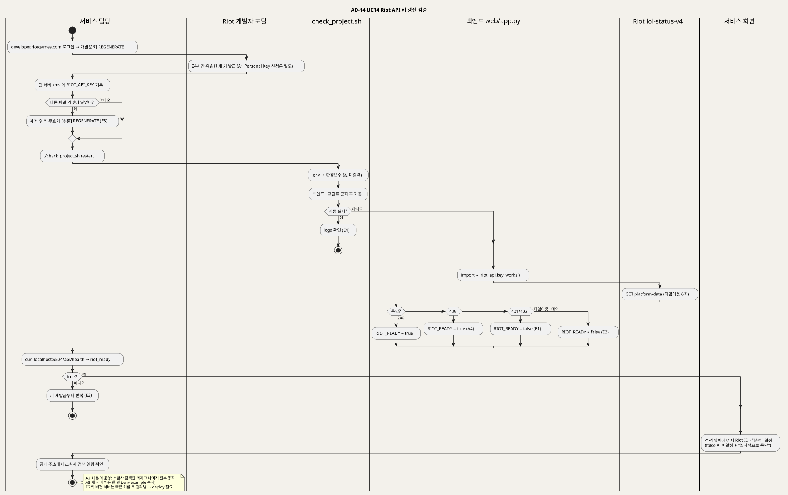

PlantUML 소스 보기

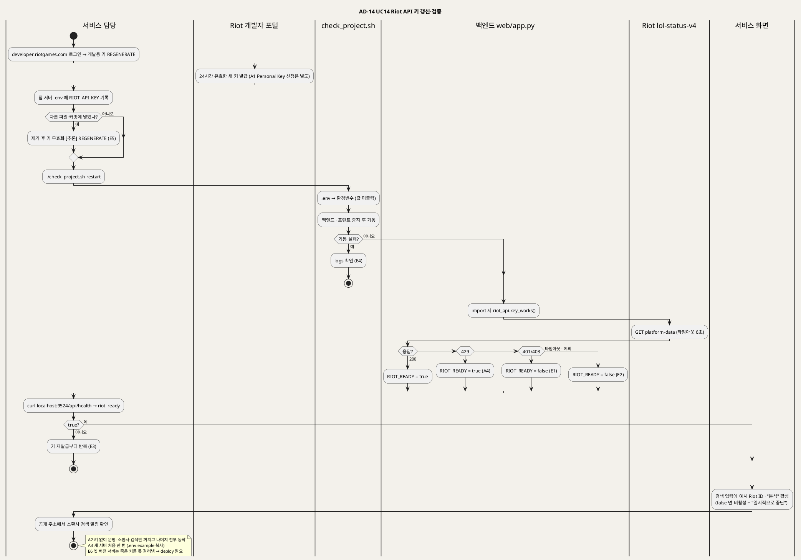
```plantuml
@startuml ad_uc14
skinparam backgroundColor #F3F1EB
skinparam shadowing false
skinparam activityFontSize 12
skinparam noteFontSize 11
title AD-14 UC14 Riot API 키 갱신·검증

|서비스 담당|
start
:developer.riotgames.com 로그인 → 개발용 키 REGENERATE;
|Riot 개발자 포털|
:24시간 유효한 새 키 발급 (A1 Personal Key 신청은 별도);
|서비스 담당|
:팀 서버 .env 에 RIOT_API_KEY 기록;
if (다른 파일·커밋에 넣었나?) then (예)
  :제거 후 키 무효화 [추론] REGENERATE (E5);
else (아니오)
endif
:./check_project.sh restart;
|check_project.sh|
:.env → 환경변수 (값 미출력);
:백엔드 · 프런트 중지 후 기동;
if (기동 실패?) then (예)
  :logs 확인 (E4);
  stop
else (아니오)
endif
|백엔드 web/app.py|
:import 시 riot_api.key_works();
|Riot lol-status-v4|
:GET platform-data (타임아웃 6초);
|백엔드 web/app.py|
if (응답?) then (200)
  :RIOT_READY = true;
elseif (429) then
  :RIOT_READY = true (A4);
elseif (401/403) then
  :RIOT_READY = false (E1);
else (타임아웃 · 예외)
  :RIOT_READY = false (E2);
endif
|서비스 담당|
:curl localhost:9524/api/health → riot_ready;
if (true?) then (아니오)
  :키 재발급부터 반복 (E3);
  stop
else (예)
endif
|서비스 화면|
:검색 입력에 예시 Riot ID · "분석" 활성
(false 면 비활성 + "일시적으로 중단");
|서비스 담당|
:공개 주소에서 소환사 검색 열림 확인;
stop
note right
  A2 키 없이 운영: 소환사 검색만 꺼지고 나머지 전부 동작
  A3 새 서버 처음 한 번 (.env.example 복사)
  E6 옛 버전 서버는 죽은 키를 못 걸러냄 → deploy 필요
end note
@enduml
```

소스를 직접 렌더하려면 **[「AD-14 Riot API 키 갱신·검증」 PlantUML 뷰어로 열기](https://plantuml.sumzip.com/plantuml/svg/eNp1VV9P21YUf_enOGIviSYCCWmlBk1rVkKFKm0VYw_VNEVuciEeTmzZDixTHlLwUEoiUbogAjg0qKGlE9NCCJCu6QsfZY--x99h5zq0sAEvluV7zzm_P-cc3zct2bDyWRXkdDKfCkclc17J6bIhZ-GpnJqfM7R8Lv1AUzUDvpgcmwwnvrlyw8zIaW1Ryc3BrKya7MqJnLKUBcUqTGo563vlVwbhyJXTnGaxy5OwZCmWyiA-MRyOwg8P6DGtaBbEH0-Bt9QCt32Eleb5mdsp4ZuGJBXRdvh7G1dbwCtdXnlflHwWUizNFpiq6cwIGZRgTs4yM5TSssD3HPesh40e_LPykvI5vO3g9js_-3TiYeLbxHR8JjEuFf26F-e7L8BbO_TsXlGKRaJYcdy2Deg0ve0Db8MBXC778XTV7T2HQDwMj5lhajlZhUesAAQZO39iowT82OZrdnD8JuAxr1oC8bljQ4jlFgA3X8D01HczSWKffJR4Am6vzfca45IyCwFeafH9HnjVKjb652f4ocXbFRHB7de4WeZL9a-DYGVYDgJYLwclgBg2HfeoDd6OPUB72BX4t2rwI57W-F7zpysCQCBxh2AyspISbNi8UsZ6KyixXFqZlWKhkVSGpeaTuqH9zFJWyMyAwXzlidr_j4iaz0cI7m3V3c5HflzCch0Cbvsl8L96eOrw5j6Vi3Hyd7PGf3fg_Ay8ms1ftb3VHmBrHd-WfORCg7WtgQaDd5K35VUPrtFVtTmT6m0IrwOJKKUHMC1Nv41U8bL4Ins6Iut6SC8QdiWra4ZFVRwQrZSUdSU0zwrJRc2YNwPBT62iauowKWDlzeGFKIU9TMyArsrWrGZkh9OyJUPAWy7hrk2FcWcZ7mK3LIJvriroYWOdV04-84qMjvq8_JaYTsQnnsBXYBl5NrBJREQj9wa3b7xHjRkNXrk8Gh6Jjo7dEuBPMekW_twF_0FP9pDOuNUL3hoZEZEDZW9o9lTeUEmzlKxmNNOK3bsTiRJ5ZSTDZNXK-L3iq20wOV0Y2C04XLp8aR8BEP2Mu4eDAeSnJc9u0zTW-fEJARm7Zr3okGvQaBL4uy5BE8tl-Tnl-426UoyUYEru-zZPTQjuQ_zURrsxREEO2kdSYECa4oGyDT7ClzBEs0mR2HyGTp82j2hkXjkYumUBuMcntHAAX_dxpUqF6QrQG80MLh3CJ1ibXf6mf9HY45JPSyxRkmsuYxHReMQfb9xcwUYXcLuL9Wexa3n42yq4f_dprNzjJtC64Ac9MWPYtEk_oLnC3XWRbcxfbxd7CTt1bFRBLD3eKUNAzHWI_SJndVrapDblF34k7pJmO3TFpnQXsXy1Rsw-ii1I8Ph-H_gfH8A96vFXh3zZ9h1PM13VCpTexu2acMj_PUj36Y3-S9K_6-wYwQ==)** (사내 서버, SSO 로그인 필요) 또는 [로컬 Kroki 로 열기](http://192.168.0.91:8889/plantuml/svg/eNp1VV9P21YUf_enOGIviSYCCWmlBk1rVkKFKm0VYw_VNEVuciEeTmzZDixTHlLwUEoiUbogAjg0qKGlE9NCCJCu6QsfZY--x99h5zq0sAEvluV7zzm_P-cc3zct2bDyWRXkdDKfCkclc17J6bIhZ-GpnJqfM7R8Lv1AUzUDvpgcmwwnvrlyw8zIaW1Ryc3BrKya7MqJnLKUBcUqTGo563vlVwbhyJXTnGaxy5OwZCmWyiA-MRyOwg8P6DGtaBbEH0-Bt9QCt32Eleb5mdsp4ZuGJBXRdvh7G1dbwCtdXnlflHwWUizNFpiq6cwIGZRgTs4yM5TSssD3HPesh40e_LPykvI5vO3g9js_-3TiYeLbxHR8JjEuFf26F-e7L8BbO_TsXlGKRaJYcdy2Deg0ve0Db8MBXC778XTV7T2HQDwMj5lhajlZhUesAAQZO39iowT82OZrdnD8JuAxr1oC8bljQ4jlFgA3X8D01HczSWKffJR4Am6vzfca45IyCwFeafH9HnjVKjb652f4ocXbFRHB7de4WeZL9a-DYGVYDgJYLwclgBg2HfeoDd6OPUB72BX4t2rwI57W-F7zpysCQCBxh2AyspISbNi8UsZ6KyixXFqZlWKhkVSGpeaTuqH9zFJWyMyAwXzlidr_j4iaz0cI7m3V3c5HflzCch0Cbvsl8L96eOrw5j6Vi3Hyd7PGf3fg_Ay8ms1ftb3VHmBrHd-WfORCg7WtgQaDd5K35VUPrtFVtTmT6m0IrwOJKKUHMC1Nv41U8bL4Ins6Iut6SC8QdiWra4ZFVRwQrZSUdSU0zwrJRc2YNwPBT62iauowKWDlzeGFKIU9TMyArsrWrGZkh9OyJUPAWy7hrk2FcWcZ7mK3LIJvriroYWOdV04-84qMjvq8_JaYTsQnnsBXYBl5NrBJREQj9wa3b7xHjRkNXrk8Gh6Jjo7dEuBPMekW_twF_0FP9pDOuNUL3hoZEZEDZW9o9lTeUEmzlKxmNNOK3bsTiRJ5ZSTDZNXK-L3iq20wOV0Y2C04XLp8aR8BEP2Mu4eDAeSnJc9u0zTW-fEJARm7Zr3okGvQaBL4uy5BE8tl-Tnl-426UoyUYEru-zZPTQjuQ_zURrsxREEO2kdSYECa4oGyDT7ClzBEs0mR2HyGTp82j2hkXjkYumUBuMcntHAAX_dxpUqF6QrQG80MLh3CJ1ibXf6mf9HY45JPSyxRkmsuYxHReMQfb9xcwUYXcLuL9Wexa3n42yq4f_dprNzjJtC64Ac9MWPYtEk_oLnC3XWRbcxfbxd7CTt1bFRBLD3eKUNAzHWI_SJndVrapDblF34k7pJmO3TFpnQXsXy1Rsw-ii1I8Ph-H_gfH8A96vFXh3zZ9h1PM13VCpTexu2acMj_PUj36Y3-S9K_6-wYwQ==) (내부망 전용). 위 그림 파일은 로그인 없이 보인다.

열쇠가 통하는지는 서버가 기동할 때 실제로 눌러 보고(`key_works`) 결정한다. 네 가지 응답(200 · 429 · 401/403 · 예외)이 `RIOT_READY` 를 가르고, 그 값이 화면의 검색창을 켜고 끈다.

---

## 5. 프로세스 간 핸드오프 (산출물·소비)

프로세스가 서로 넘겨주는 것은 전부 **파일 또는 환경변수**다. 메시지 큐나 DB 트리거는 없다.

| 산출물 | 만드는 곳 | 읽는 곳 | 갱신 방식 | 근거 |
|---|---|---|---|---|
| `artifacts/model.joblib` · `schema.json` | P3 UC11 | P1 UC1·UC2·UC3 (`lolwin.predict`), P3 UC12 | 재학습 시에만. 바꾸면 골든 재생성 | `CLAUDE.md` "손대면 안 되는 것" |
| `tests/golden_predictions.json` | P3 UC11 (`make_golden`) | P3 UC12, P4 UC13 (`test`) | 재학습 직후 | `tests/make_golden.py` |
| `reports/tables/schedule.csv` (+meta) | P2 UC9 | P1 UC8 | 매번 덮어쓰기 | `src/collect_schedule.py` |
| `reports/tables/champion_stats.csv` · `champion_top_players.csv` (+meta) | P2 UC10 | P1 UC6 | 원본 jsonl 전체 재집계 | `src/collect_champion_stats.py` |
| `reports/tables/ranking.csv` (+meta) | P2 UC10 | P1 UC7 | 25명마다 중간 저장, 축소 덮어쓰기 차단 | `src/collect_ranking.py` |
| `reports/tables/*.csv` (반복 실험·구간별 오류·승리요인·시점 비교·유형 프로파일) | P3 UC11 (`finalize_model.py` 등) | P1 UC5 | 재학습·재분석 시 | `web/app.py` `api_report` |
| `db/votes.sqlite3` | P1 UC8 | P1 UC8 | 투표마다 upsert | `web/app.py` `_vote_db` |
| `.env` 의 `RIOT_API_KEY` → `RIOT_READY` | P4 UC14 | P1 UC3·UC4, P2 UC10 | 매일 (24시간 만료) | `docs/deploy.md` |
| GitHub `team` 브랜치 | P3 (push) | P4 UC13 (`git pull --ff-only`) | push 때마다 | `docs/TEAM_WORKFLOW.md` |
| 5분 캐시 (`_cached_summoner`) | P1 UC3 | P1 UC3 | 요청마다 | `web/app.py` |

서비스(P1)가 P2 의 새 CSV 를 **재시작 없이** 읽는지는 `[추론]` 이다. `web/app.py` 의 `_csv` 가 요청마다 파일을 여는 것으로 보이나 확인이 필요하다(개요 §8).

---

## 6. 표기 규칙과 표준 준수 노트

| 이 문서의 기호 | UML 2.5.1 Activity | BPMN 2.0 대응 | 뜻 |
|---|---|---|---|
| `\|레인\|` 세로 구획 | ActivityPartition (swimlane) | Pool / Lane | 누가 하는 일인가 |
| 검은 점 → / → 테두리 점 | InitialNode / ActivityFinalNode | Start Event / End Event | 시작·종료 |
| 마름모 + 가지 라벨 | DecisionNode / MergeNode | Exclusive Gateway (XOR) | 조건 분기. 가지 라벨의 `(E·A 번호)` 는 UC 문서의 흐름 번호 |
| 굵은 가로선 (fork / end fork) | ForkNode / JoinNode | Parallel Gateway (AND) | 동시에 일어나는 일 |
| repeat … repeat while | Loop (DecisionNode + 되돌아가는 ControlFlow) | Loop Activity | 반복 |
| 접힌 종이 (note) | Comment | Text Annotation | 대체흐름·주의 |
| «include» / «extend» 표기 | UseCase 관계를 활동 라벨로 옮김 | Call Activity | 다른 UC 의 흐름을 호출 |
| detach | 흐름 종료 없이 끊김 | — | 외부 시스템 레인은 흐름의 끝이 아님을 표시 |

- 액티비티 다이어그램의 활동 순서는 각 UC 문서의 **기본흐름 단계 순서**와 같고, 결정 가지는 **예외흐름·대체흐름**에서만 가져왔다. 원천에 없는 활동·분기는 만들지 않았다.
- BPMN 전용 요소(메시지 이벤트, 타이머 이벤트, 데이터 객체 기호)는 PlantUML Activity 로 직접 그릴 수 없어 활동 라벨과 §5 표로 대신했다. 타이머에 해당하는 것은 "24시간 만료"(UC14)·"5분 대기"(UC10 loop)·"5분 캐시"(UC3) 셋이다.
- 미확정 사항은 다이어그램 안에 `자료 없음 — 확인 필요` 또는 `[추론]` 으로 그대로 적었다(P2 실행 주기, DB 접속 실패 시 종료, CSV 즉시 반영).

---

*표기 표준: UML 2.5.1 (OMG) Activity Diagram. 원천: [UC_00_개요_LoL승패예측및핵심승리요인분석.md](UC_00_개요_LoL승패예측및핵심승리요인분석.md) 와 `UC_01`~`UC_14`. 개별 UC 의 14속성·업무규칙은 각 UC 문서를 따른다.*
