<!-- ─────────────────────────────────────────────
  BPMN 2.0 비즈니스 프로세스 다이어그램 (조감 1 · 프로세스 4 · UC별 14).
  왜 필요한가: BP_00 은 UML 액티비티 표기로 "누가 언제 무엇을 넘겨주는가"를 그렸다. 이 문서는 같은 흐름을
  BPMN 2.0(OMG 표준, ISO/IEC 19510)으로 다시 그려 풀·레인·이벤트·게이트웨이·메시지 흐름·데이터 저장소를
  표준 기호로 보이게 하고, 모델러(Camunda · bpmn.io)에서 그대로 열리는 XML 을 함께 둔다.
  주로 보는 사람: 팀원(구현·운영) · 발표 준비 · Claude(검수)
  ───────────────────────────────────────────── -->

# LoL 인게임 시점별 경기 데이터 기반 승패 예측 및 핵심 승리요인 분석 비즈니스 프로세스 다이어그램 (BPMN 2.0)
**UC_00~UC_14 의 Sequence Diagram 과 업무흐름을 통합한 프로세스 모델 · BPMN 2.0 (OMG) Collaboration Diagram 표기**

---

> **문서 식별**: `docs/usecases/BP_01_비즈니스프로세스_BPMN.md`
> **작성일**: 2026-09-07 · **표준**: BPMN 2.0 (OMG formal/2013-12-09, ISO/IEC 19510:2013) — Collaboration(풀·레인·메시지 흐름) + Process(이벤트·게이트웨이·활동·데이터). 다이어그램 교환(DI)까지 포함한 정식 XML 이다.
> **원천(SoT)**: [UC_00_개요_LoL승패예측및핵심승리요인분석.md](UC_00_개요_LoL승패예측및핵심승리요인분석.md) §3·§5 와 `UC_01`~`UC_14` 의 기본흐름·대체흐름·예외흐름·Sequence Diagram, 그리고 [BP_00_비즈니스프로세스_액티비티다이어그램.md](BP_00_비즈니스프로세스_액티비티다이어그램.md) 의 프로세스 구획(P1~P4)·핸드오프 표. 여기에 없는 활동은 그리지 않았다.
> **다이어그램**: 19장 (프로세스 조감 1 · 비즈니스 프로세스 4 · UC별 14). 모두 BPMN 2.0 XML 로 작성해 bpmn-js(bpmn.io) 로컬 렌더에서 **경고 0건**으로 import 되는 것을 확인한 뒤 `diagrams/bpmn_*.svg` 로 저장했다. 원본 XML 은 `diagrams/bpmn_*.bpmn` 으로 동봉했고 각 그림 아래 접힌 상자에도 그대로 실었다.
> **읽기 전에**: 처음이면 [유스케이스_쉬운설명.md](유스케이스_쉬운설명.md) → [BP_00](BP_00_비즈니스프로세스_액티비티다이어그램.md) §2 순으로 본다. 이 문서는 같은 내용을 표준 기호로 더 엄밀하게 그린 것이다.

---

## 목차

1. [목적·범위·표기](#1-목적범위표기)
2. [비즈니스 프로세스 조감 (L0)](#2-비즈니스-프로세스-조감-l0)
3. [비즈니스 프로세스 다이어그램 (P1~P4)](#3-비즈니스-프로세스-다이어그램-p1p4)
4. [UC별 상세 프로세스 다이어그램 (UC1~UC14)](#4-uc별-상세-프로세스-다이어그램-uc1uc14)
5. [프로세스 간 핸드오프 (산출물·소비)](#5-프로세스-간-핸드오프-산출물소비)
6. [BPMN 2.0 준수 노트와 UML 대응](#6-bpmn-20-준수-노트와-uml-대응)
7. [생성 결과·검증·미확정 사항](#7-생성-결과검증미확정-사항)

---

## 1. 목적·범위·표기

유스케이스 문서는 액터의 **목표 하나**를 한 장씩 적고, BP_00 은 그것을 UML 액티비티로 이어 붙였다. 이 문서는 같은 흐름을 **BPMN 2.0** 으로 그린다. BPMN 이 UML 액티비티와 다른 점은 셋이다.

1. **풀(Pool)과 메시지 흐름** — 우리가 만든 시스템·담당자는 하나의 풀 안 레인들이고, Riot Games API · GitHub · 팀 MariaDB · lolesports · Riot 개발자 포털처럼 **우리가 만들지 않은 것은 접힌(black-box) 풀**이다. 풀 사이는 순서 흐름(실선)이 아니라 **메시지 흐름(파선)** 으로만 잇는다. 그래서 "외부에 몇 번 물어보는가"가 파선 개수로 보인다.
2. **이벤트의 종류** — 24시간 만료·5분 대기 같은 **타이머**, 사이트 방문 같은 **메시지**, 400·429·503 같은 **오류**를 시작·중간·종료·경계 이벤트로 구분해 그린다. 활동 테두리에 붙은 **경계 이벤트**는 "이 일을 하다가 그것이 나면 여기서 끊고 옆길로 간다"는 뜻이라 예외흐름(E)을 활동 단위로 붙일 수 있다.
3. **데이터 저장소** — CSV · joblib · sqlite · `.env` 처럼 프로세스가 서로 넘겨주는 파일을 원통 기호와 점선 연관으로 그려 §5 핸드오프 표가 그림 안에 보인다.

| 구분 | 무엇을 보이나 | 장수 | 원천 |
|---|---|:--:|---|
| 프로세스 조감 (L0) | 세 담당 레인과 다섯 외부 풀. 네 프로세스 P1~P4 가 서로 무엇을 넘겨주는가 | 1 | UC_00 §3·§5, BP_00 §2·§5 |
| 비즈니스 프로세스 (P1~P4) | 프로세스마다 레인(담당)별 활동·게이트웨이·이벤트·외부 메시지·데이터 저장소, UC 경계는 호출 활동 | 4 | UC_01~UC_14 기본흐름·Sequence |
| UC별 프로세스 (UC1~UC14) | UC 하나의 활동 순서, 게이트웨이(E·A 번호), 경계 이벤트, 외부 메시지, 종료 이벤트 | 14 | 각 UC 문서 §5 |

### 표기 범례 (이 문서에서 쓴 BPMN 2.0 요소)

| 기호 | BPMN 2.0 요소 | 이 문서에서의 뜻 |
|---|---|---|
| 큰 가로 상자 (세로 이름) | Pool (Participant, 펼침) | 우리 시스템과 담당자 전체. 문서 전체에서 하나 |
| 얇은 가로 상자 (위·아래) | Pool (Participant, 접힘 = black-box) | 외부 참여자 — Riot Games API · Data Dragon · GitHub · 팀 MariaDB · lolesports · Riot 개발자 포털. 속은 우리 책임이 아니라 그리지 않는다 |
| 풀 안의 가로 띠 | Lane | 누가 하는 일인가 — 사람(이용자·팀원·서비스 담당), 프로그램(화면·백엔드·lolwin·수집기·check_project.sh), 파일 |
| 얇은 원 | Start Event (없음 · ⏱ 타이머 · ✉ 메시지) | 시작. 타이머는 "24시간 만료"·"매일 아침", 메시지는 "사이트 방문" |
| 굵은 원 | End Event | 정상 종료 |
| 굵은 원 + 번개 | Error End Event | 예외흐름(E번호)으로 끝남 — 400 · 404 · 409 · 429 · 500 · 503 · 스크립트 [실패] |
| 얇은 이중 원 + ⏱ | Intermediate Timer Event | "5분 대기" (수집기 loop) |
| 활동 테두리에 붙은 이중 원 | Boundary Event (⚡오류 · ⏱타이머) | 그 활동 중 그것이 나면 활동을 끊고 옆길로 — E번호를 활동 단위로 붙였다 |
| 마름모 (빈 것 또는 ×) | Exclusive Gateway (XOR) | 조건 분기·합류. 가지 이름의 `(E·A 번호)` 는 UC 문서의 흐름 번호 |
| 마름모 + | Parallel Gateway (AND) | 동시에 나가고 모두 돌아와야 열림 — predict+coach, 코칭+티어+초상, report+match-types |
| 둥근 상자 | Task (👤 User · ⚙ Service · 📜 Script · ✉ Send) | 활동. 사람이 하면 User, 외부에 묻거나 계산하면 Service, 셸이면 Script, HTTP 요청을 보내면 Send |
| 굵은 테두리 상자 + ⊞ | Call Activity | 다른 UC 를 통째로 부른다 — «include» · «extend» 와 P1~P4 안의 UC 경계 |
| 상자 + ⊞ + ≡ | Collapsed Sub-Process, Sequential Multi-Instance | 반복 하위 프로세스 — "경기마다" · "puuid 마다" · "계정마다" · "사람마다" · "지표마다" |
| 원통 | Data Store | 파일·DB — `reports/tables/*.csv` · `artifacts/` · `db/votes.sqlite3` · `.env` · `data/*.jsonl` |
| 점선 (화살표) | Data Association | 활동이 저장소를 읽음(→활동) / 씀(활동→) |
| 파선 + 빈 원 시작 + 빈 삼각 끝 | Message Flow | 풀 사이 통신 — HTTP 호출 · git push/pull · SQL 뷰 읽기 |
| 꺾쇠 + 글 | Text Annotation | 대체흐름(A)·주의·`자료 없음 — 확인 필요` |

**표기 약속**

- 레인 이름은 UC 문서의 lifeline 이름을 그대로 쓴다(이용자 · 화면·프런트 · 백엔드 · lolwin · collect_*.py 등). 괄호 안은 포트·파일·함수다.
- 게이트웨이 가지와 이벤트 이름의 `(E3)` 는 그 UC 문서의 **예외흐름 번호**, `(A1)` 은 **대체흐름 번호**다. 다이어그램에서 UC 문서로 바로 찾아갈 수 있다.
- «include» · «extend» 는 UC 다이어그램의 관계를 그대로 옮긴 것이며 BPMN 에서는 **호출 활동(Call Activity)** 이다. «extend» 는 조건 게이트웨이 뒤에 온다.
- 접힌 풀은 메시지가 오가는 쪽(위 또는 아래)에 두었다. 위는 저장소·DB·포털(사람이 먼저 여는 것), 아래는 실시간 API 다.
- 미확정 사항은 다이어그램 안에 `자료 없음 — 확인 필요` 또는 `[추론]` 으로 그대로 적었다.

---

## 2. 비즈니스 프로세스 조감 (L0)

네 프로세스는 독립적이지 않다. P3 가 만든 모델을 P4 가 사이트에 올리고, P2 가 만든 표를 P1 이 읽고, P4 가 갱신한 열쇠가 P1 의 소환사 검색을 켠다. 그 넘겨주는 것이 전부 **데이터 저장소(원통)** 로 그려져 있다.

| 프로세스 | 이름 | 포함 UC | 레인(주체) | 시작 이벤트 | 산출물 → 소비처 |
|:--:|---|---|---|---|---|
| P1 | 복기·판정 이용 | UC1~UC8 | 이용자 | ✉ 공개 주소 방문 | 화면 결과(저장 없음) |
| P2 | 데이터 스냅샷 수집 | UC9 · UC10 | 서비스 담당 | P4 루틴 안에서 호출. 주기: 자료 없음 — 확인 필요 | `reports/tables/*.csv` (+meta) → P1 |
| P3 | 모델 변경·검증 | UC11 · UC12 | 팀원(분석·개발) | 피처·모델·문서 변경 | `artifacts/model.joblib` · `schema.json` · `tests/golden_predictions.json` → P1 · P4 |
| P4 | 운영 (키·배포·수집) | UC14 · UC13 (+UC12 포함) · UC9 · UC10 | 서비스 담당 | ⏱ 매일 아침 (개발용 키 24시간 만료) | 살아 있는 서비스 · `.env` → `RIOT_READY` → P1 |

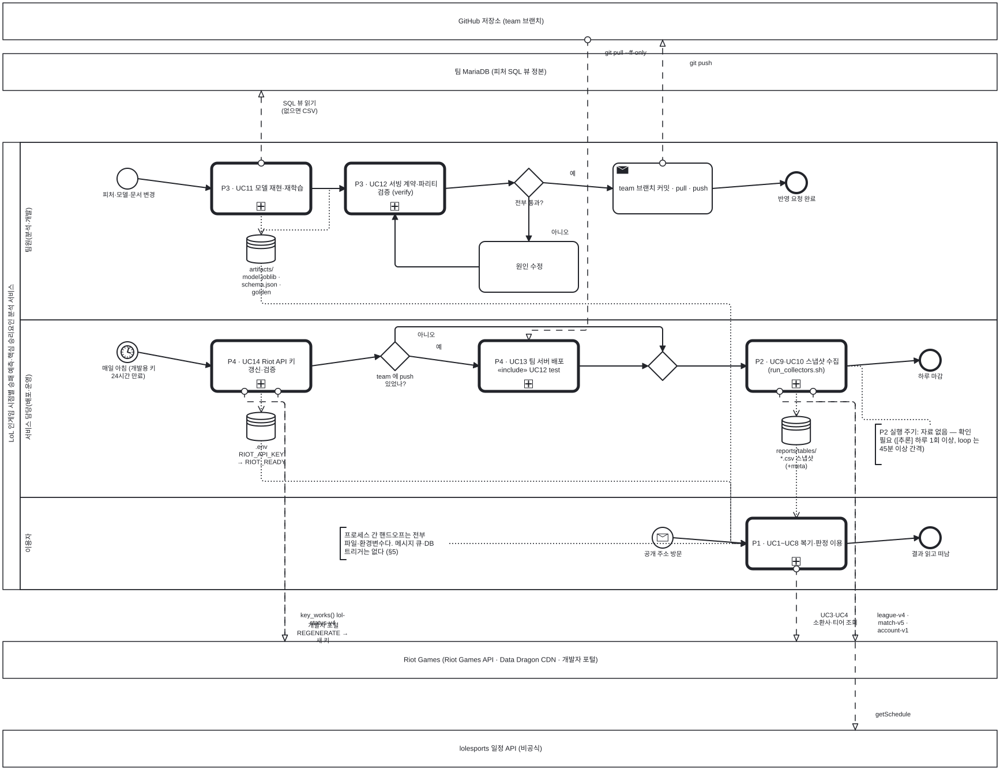

<details><summary>BPMN 2.0 XML 소스 보기 (`diagrams/bpmn_L0.bpmn` 과 동일 — Camunda Modeler · bpmn.io 에서 열림)</summary>

```xml
<?xml version="1.0" encoding="UTF-8"?>
<bpmn:definitions xmlns:bpmn="http://www.omg.org/spec/BPMN/20100524/MODEL" xmlns:bpmndi="http://www.omg.org/spec/BPMN/20100524/DI" xmlns:dc="http://www.omg.org/spec/DD/20100524/DC" xmlns:di="http://www.omg.org/spec/DD/20100524/DI" id="Definitions_bpmn_L0" name="비즈니스 프로세스 조감 (L0) — P1 이용 · P2 수집 · P3 모델 변경 · P4 운영" targetNamespace="https://p4.sumzip.com/bpmn" exporter="bpmn_gen.py" exporterVersion="1.0">
  <bpmn:collaboration id="Collab_bpmn_L0">
    <bpmn:participant id="Pool_bpmn_L0" name="LoL 인게임 시점별 승패 예측·핵심 승리요인 분석 서비스" processRef="Process_bpmn_L0" />
    <bpmn:participant id="BB_github" name="GitHub 저장소 (team 브랜치)" />
    <bpmn:participant id="BB_maria" name="팀 MariaDB (피처 SQL 뷰 정본)" />
    <bpmn:participant id="BB_riot" name="Riot Games (Riot Games API · Data Dragon CDN · 개발자 포털)" />
    <bpmn:participant id="BB_esports" name="lolesports 일정 API (비공식)" />
    <bpmn:messageFlow id="Msg_bpmn_L0_0" sourceRef="uc11" targetRef="BB_maria" name="SQL 뷰 읽기 (없으면 CSV)" />
    <bpmn:messageFlow id="Msg_bpmn_L0_1" sourceRef="push" targetRef="BB_github" name="git push" />
    <bpmn:messageFlow id="Msg_bpmn_L0_2" sourceRef="uc14" targetRef="BB_riot" name="개발자 포털 REGENERATE → 새 키" />
    <bpmn:messageFlow id="Msg_bpmn_L0_3" sourceRef="uc14" targetRef="BB_riot" name="key_works() lol-status-v4" />
    <bpmn:messageFlow id="Msg_bpmn_L0_4" sourceRef="BB_github" targetRef="uc13" name="git pull --ff-only" />
    <bpmn:messageFlow id="Msg_bpmn_L0_5" sourceRef="uc910" targetRef="BB_riot" name="league-v4 · match-v5 · account-v1" />
    <bpmn:messageFlow id="Msg_bpmn_L0_6" sourceRef="uc910" targetRef="BB_esports" name="getSchedule" />
    <bpmn:messageFlow id="Msg_bpmn_L0_7" sourceRef="uc18" targetRef="BB_riot" name="UC3·UC4 소환사·티어 조회" />
  </bpmn:collaboration>
  <bpmn:process id="Process_bpmn_L0" name="비즈니스 프로세스 조감 (L0) — P1 이용 · P2 수집 · P3 모델 변경 · P4 운영" isExecutable="false">
    <bpmn:laneSet id="LaneSet_bpmn_L0">
      <bpmn:lane id="Lane_bpmn_L0_0" name="팀원(분석·개발)">
        <bpmn:flowNodeRef>s1</bpmn:flowNodeRef>
        <bpmn:flowNodeRef>uc11</bpmn:flowNodeRef>
        <bpmn:flowNodeRef>uc12</bpmn:flowNodeRef>
        <bpmn:flowNodeRef>g_ok</bpmn:flowNodeRef>
        <bpmn:flowNodeRef>fix</bpmn:flowNodeRef>
        <bpmn:flowNodeRef>push</bpmn:flowNodeRef>
        <bpmn:flowNodeRef>e1</bpmn:flowNodeRef>
      </bpmn:lane>
      <bpmn:lane id="Lane_bpmn_L0_1" name="서비스 담당(배포·운영)">
        <bpmn:flowNodeRef>s2</bpmn:flowNodeRef>
        <bpmn:flowNodeRef>uc14</bpmn:flowNodeRef>
        <bpmn:flowNodeRef>g_push</bpmn:flowNodeRef>
        <bpmn:flowNodeRef>uc13</bpmn:flowNodeRef>
        <bpmn:flowNodeRef>g_m</bpmn:flowNodeRef>
        <bpmn:flowNodeRef>uc910</bpmn:flowNodeRef>
        <bpmn:flowNodeRef>e2</bpmn:flowNodeRef>
      </bpmn:lane>
      <bpmn:lane id="Lane_bpmn_L0_2" name="이용자">
        <bpmn:flowNodeRef>s3</bpmn:flowNodeRef>
        <bpmn:flowNodeRef>uc18</bpmn:flowNodeRef>
        <bpmn:flowNodeRef>e3</bpmn:flowNodeRef>
      </bpmn:lane>
    </bpmn:laneSet>
    <bpmn:startEvent id="s1" name="피처·모델·문서 변경">
      <bpmn:outgoing>Flow_bpmn_L0_0</bpmn:outgoing>
    </bpmn:startEvent>
    <bpmn:callActivity id="uc11" name="P3 · UC11 모델 재현·재학습">
      <bpmn:incoming>Flow_bpmn_L0_0</bpmn:incoming>
      <bpmn:outgoing>Flow_bpmn_L0_1</bpmn:outgoing>
      <bpmn:dataOutputAssociation id="DOA_uc11_ds_art"><bpmn:targetRef>ds_art</bpmn:targetRef></bpmn:dataOutputAssociation>
    </bpmn:callActivity>
    <bpmn:dataStoreReference id="ds_art" name="artifacts/ model.joblib · schema.json · golden" />
    <bpmn:callActivity id="uc12" name="P3 · UC12 서빙 계약·파리티 검증 (verify)">
      <bpmn:incoming>Flow_bpmn_L0_1</bpmn:incoming>
      <bpmn:incoming>Flow_bpmn_L0_4</bpmn:incoming>
      <bpmn:outgoing>Flow_bpmn_L0_2</bpmn:outgoing>
      <bpmn:dataInputAssociation id="DIA_ds_art_uc12"><bpmn:sourceRef>ds_art</bpmn:sourceRef></bpmn:dataInputAssociation>
    </bpmn:callActivity>
    <bpmn:exclusiveGateway id="g_ok" name="전부 통과?">
      <bpmn:incoming>Flow_bpmn_L0_2</bpmn:incoming>
      <bpmn:outgoing>Flow_bpmn_L0_3</bpmn:outgoing>
      <bpmn:outgoing>Flow_bpmn_L0_5</bpmn:outgoing>
    </bpmn:exclusiveGateway>
    <bpmn:task id="fix" name="원인 수정">
      <bpmn:incoming>Flow_bpmn_L0_3</bpmn:incoming>
      <bpmn:outgoing>Flow_bpmn_L0_4</bpmn:outgoing>
    </bpmn:task>
    <bpmn:sendTask id="push" name="team 브랜치 커밋 · pull · push">
      <bpmn:incoming>Flow_bpmn_L0_5</bpmn:incoming>
      <bpmn:outgoing>Flow_bpmn_L0_6</bpmn:outgoing>
    </bpmn:sendTask>
    <bpmn:endEvent id="e1" name="반영 요청 완료">
      <bpmn:incoming>Flow_bpmn_L0_6</bpmn:incoming>
    </bpmn:endEvent>
    <bpmn:startEvent id="s2" name="매일 아침 (개발용 키 24시간 만료)">
      <bpmn:outgoing>Flow_bpmn_L0_7</bpmn:outgoing>
      <bpmn:timerEventDefinition id="EvDef_s2" />
    </bpmn:startEvent>
    <bpmn:callActivity id="uc14" name="P4 · UC14 Riot API 키 갱신·검증">
      <bpmn:incoming>Flow_bpmn_L0_7</bpmn:incoming>
      <bpmn:outgoing>Flow_bpmn_L0_8</bpmn:outgoing>
      <bpmn:dataOutputAssociation id="DOA_uc14_ds_env"><bpmn:targetRef>ds_env</bpmn:targetRef></bpmn:dataOutputAssociation>
    </bpmn:callActivity>
    <bpmn:dataStoreReference id="ds_env" name=".env RIOT_API_KEY → RIOT_READY" />
    <bpmn:exclusiveGateway id="g_push" name="team 에 push 있었나?">
      <bpmn:incoming>Flow_bpmn_L0_8</bpmn:incoming>
      <bpmn:outgoing>Flow_bpmn_L0_9</bpmn:outgoing>
      <bpmn:outgoing>Flow_bpmn_L0_10</bpmn:outgoing>
    </bpmn:exclusiveGateway>
    <bpmn:callActivity id="uc13" name="P4 · UC13 팀 서버 배포 «include» UC12 test">
      <bpmn:incoming>Flow_bpmn_L0_9</bpmn:incoming>
      <bpmn:outgoing>Flow_bpmn_L0_11</bpmn:outgoing>
    </bpmn:callActivity>
    <bpmn:exclusiveGateway id="g_m">
      <bpmn:incoming>Flow_bpmn_L0_10</bpmn:incoming>
      <bpmn:incoming>Flow_bpmn_L0_11</bpmn:incoming>
      <bpmn:outgoing>Flow_bpmn_L0_12</bpmn:outgoing>
    </bpmn:exclusiveGateway>
    <bpmn:callActivity id="uc910" name="P2 · UC9·UC10 스냅샷 수집 (run_collectors.sh)">
      <bpmn:incoming>Flow_bpmn_L0_12</bpmn:incoming>
      <bpmn:outgoing>Flow_bpmn_L0_13</bpmn:outgoing>
      <bpmn:dataOutputAssociation id="DOA_uc910_ds_csv"><bpmn:targetRef>ds_csv</bpmn:targetRef></bpmn:dataOutputAssociation>
    </bpmn:callActivity>
    <bpmn:dataStoreReference id="ds_csv" name="reports/tables/ *.csv 스냅샷 (+meta)" />
    <bpmn:endEvent id="e2" name="하루 마감">
      <bpmn:incoming>Flow_bpmn_L0_13</bpmn:incoming>
    </bpmn:endEvent>
    <bpmn:textAnnotation id="n_period"><bpmn:text>P2 실행 주기: 자료 없음 — 확인 필요 ([추론] 하루 1회 이상, loop 는 45분 이상 간격)</bpmn:text></bpmn:textAnnotation>
    <bpmn:startEvent id="s3" name="공개 주소 방문">
      <bpmn:outgoing>Flow_bpmn_L0_14</bpmn:outgoing>
      <bpmn:messageEventDefinition id="EvDef_s3" />
    </bpmn:startEvent>
    <bpmn:callActivity id="uc18" name="P1 · UC1~UC8 복기·판정 이용">
      <bpmn:incoming>Flow_bpmn_L0_14</bpmn:incoming>
      <bpmn:outgoing>Flow_bpmn_L0_15</bpmn:outgoing>
      <bpmn:dataInputAssociation id="DIA_ds_csv_uc18"><bpmn:sourceRef>ds_csv</bpmn:sourceRef></bpmn:dataInputAssociation>
      <bpmn:dataInputAssociation id="DIA_ds_env_uc18"><bpmn:sourceRef>ds_env</bpmn:sourceRef></bpmn:dataInputAssociation>
      <bpmn:dataInputAssociation id="DIA_ds_art_uc18"><bpmn:sourceRef>ds_art</bpmn:sourceRef></bpmn:dataInputAssociation>
    </bpmn:callActivity>
    <bpmn:endEvent id="e3" name="결과 읽고 떠남">
      <bpmn:incoming>Flow_bpmn_L0_15</bpmn:incoming>
    </bpmn:endEvent>
    <bpmn:textAnnotation id="n_hand"><bpmn:text>프로세스 간 핸드오프는 전부 파일·환경변수다. 메시지 큐·DB 트리거는 없다 (§5)</bpmn:text></bpmn:textAnnotation>
    <bpmn:sequenceFlow id="Flow_bpmn_L0_0" sourceRef="s1" targetRef="uc11" />
    <bpmn:sequenceFlow id="Flow_bpmn_L0_1" sourceRef="uc11" targetRef="uc12" />
    <bpmn:sequenceFlow id="Flow_bpmn_L0_2" sourceRef="uc12" targetRef="g_ok" />
    <bpmn:sequenceFlow id="Flow_bpmn_L0_3" sourceRef="g_ok" targetRef="fix" name="아니오" />
    <bpmn:sequenceFlow id="Flow_bpmn_L0_4" sourceRef="fix" targetRef="uc12" />
    <bpmn:sequenceFlow id="Flow_bpmn_L0_5" sourceRef="g_ok" targetRef="push" name="예" />
    <bpmn:sequenceFlow id="Flow_bpmn_L0_6" sourceRef="push" targetRef="e1" />
    <bpmn:sequenceFlow id="Flow_bpmn_L0_7" sourceRef="s2" targetRef="uc14" />
    <bpmn:sequenceFlow id="Flow_bpmn_L0_8" sourceRef="uc14" targetRef="g_push" />
    <bpmn:sequenceFlow id="Flow_bpmn_L0_9" sourceRef="g_push" targetRef="uc13" name="예" />
    <bpmn:sequenceFlow id="Flow_bpmn_L0_10" sourceRef="g_push" targetRef="g_m" name="아니오" />
    <bpmn:sequenceFlow id="Flow_bpmn_L0_11" sourceRef="uc13" targetRef="g_m" />
    <bpmn:sequenceFlow id="Flow_bpmn_L0_12" sourceRef="g_m" targetRef="uc910" />
    <bpmn:sequenceFlow id="Flow_bpmn_L0_13" sourceRef="uc910" targetRef="e2" />
    <bpmn:sequenceFlow id="Flow_bpmn_L0_14" sourceRef="s3" targetRef="uc18" />
    <bpmn:sequenceFlow id="Flow_bpmn_L0_15" sourceRef="uc18" targetRef="e3" />
    <bpmn:association id="Assoc_bpmn_L0_4" sourceRef="n_period" targetRef="uc910" />
    <bpmn:association id="Assoc_bpmn_L0_8" sourceRef="n_hand" targetRef="uc18" />
  </bpmn:process>
  <bpmndi:BPMNDiagram id="Diagram_bpmn_L0">
    <bpmndi:BPMNPlane id="Plane_bpmn_L0" bpmnElement="Collab_bpmn_L0">
      <bpmndi:BPMNShape id="Pool_bpmn_L0_di" bpmnElement="Pool_bpmn_L0" isHorizontal="true"><dc:Bounds x="40" y="262" width="1724" height="776" /></bpmndi:BPMNShape>
      <bpmndi:BPMNShape id="Lane_bpmn_L0_0_di" bpmnElement="Lane_bpmn_L0_0" isHorizontal="true"><dc:Bounds x="70" y="262" width="1694" height="308" /></bpmndi:BPMNShape>
      <bpmndi:BPMNShape id="Lane_bpmn_L0_1_di" bpmnElement="Lane_bpmn_L0_1" isHorizontal="true"><dc:Bounds x="70" y="570" width="1694" height="308" /></bpmndi:BPMNShape>
      <bpmndi:BPMNShape id="Lane_bpmn_L0_2_di" bpmnElement="Lane_bpmn_L0_2" isHorizontal="true"><dc:Bounds x="70" y="878" width="1694" height="160" /></bpmndi:BPMNShape>
      <bpmndi:BPMNShape id="BB_github_di" bpmnElement="BB_github" isHorizontal="true"><dc:Bounds x="40" y="20" width="1724" height="64" /></bpmndi:BPMNShape>
      <bpmndi:BPMNShape id="BB_maria_di" bpmnElement="BB_maria" isHorizontal="true"><dc:Bounds x="40" y="108" width="1724" height="64" /></bpmndi:BPMNShape>
      <bpmndi:BPMNShape id="BB_riot_di" bpmnElement="BB_riot" isHorizontal="true"><dc:Bounds x="40" y="1128" width="1724" height="64" /></bpmndi:BPMNShape>
      <bpmndi:BPMNShape id="BB_esports_di" bpmnElement="BB_esports" isHorizontal="true"><dc:Bounds x="40" y="1282" width="1724" height="64" /></bpmndi:BPMNShape>
      <bpmndi:BPMNShape id="s1_di" bpmnElement="s1"><dc:Bounds x="238" y="307" width="36" height="36" />
        <bpmndi:BPMNLabel><dc:Bounds x="196" y="347" width="120" height="28" /></bpmndi:BPMNLabel>
      </bpmndi:BPMNShape>
      <bpmndi:BPMNShape id="uc11_di" bpmnElement="uc11"><dc:Bounds x="402" y="298" width="172" height="88" />
      </bpmndi:BPMNShape>
      <bpmndi:BPMNShape id="ds_art_di" bpmnElement="ds_art"><dc:Bounds x="463" y="422" width="50" height="50" />
        <bpmndi:BPMNLabel><dc:Bounds x="428" y="476" width="120" height="28" /></bpmndi:BPMNLabel>
      </bpmndi:BPMNShape>
      <bpmndi:BPMNShape id="uc12_di" bpmnElement="uc12"><dc:Bounds x="634" y="298" width="172" height="88" />
      </bpmndi:BPMNShape>
      <bpmndi:BPMNShape id="g_ok_di" bpmnElement="g_ok"><dc:Bounds x="927" y="307" width="50" height="50" />
        <bpmndi:BPMNLabel><dc:Bounds x="892" y="361" width="120" height="28" /></bpmndi:BPMNLabel>
      </bpmndi:BPMNShape>
      <bpmndi:BPMNShape id="fix_di" bpmnElement="fix"><dc:Bounds x="866" y="434" width="172" height="88" />
      </bpmndi:BPMNShape>
      <bpmndi:BPMNShape id="push_di" bpmnElement="push"><dc:Bounds x="1098" y="298" width="172" height="88" />
      </bpmndi:BPMNShape>
      <bpmndi:BPMNShape id="e1_di" bpmnElement="e1"><dc:Bounds x="1398" y="314" width="36" height="36" />
        <bpmndi:BPMNLabel><dc:Bounds x="1356" y="354" width="120" height="28" /></bpmndi:BPMNLabel>
      </bpmndi:BPMNShape>
      <bpmndi:BPMNShape id="s2_di" bpmnElement="s2"><dc:Bounds x="238" y="608" width="36" height="36" />
        <bpmndi:BPMNLabel><dc:Bounds x="196" y="648" width="120" height="28" /></bpmndi:BPMNLabel>
      </bpmndi:BPMNShape>
      <bpmndi:BPMNShape id="uc14_di" bpmnElement="uc14"><dc:Bounds x="402" y="606" width="172" height="88" />
      </bpmndi:BPMNShape>
      <bpmndi:BPMNShape id="ds_env_di" bpmnElement="ds_env"><dc:Bounds x="463" y="730" width="50" height="50" />
        <bpmndi:BPMNLabel><dc:Bounds x="428" y="784" width="120" height="28" /></bpmndi:BPMNLabel>
      </bpmndi:BPMNShape>
      <bpmndi:BPMNShape id="g_push_di" bpmnElement="g_push"><dc:Bounds x="695" y="608" width="50" height="50" />
        <bpmndi:BPMNLabel><dc:Bounds x="660" y="662" width="120" height="28" /></bpmndi:BPMNLabel>
      </bpmndi:BPMNShape>
      <bpmndi:BPMNShape id="uc13_di" bpmnElement="uc13"><dc:Bounds x="866" y="606" width="172" height="88" />
      </bpmndi:BPMNShape>
      <bpmndi:BPMNShape id="g_m_di" bpmnElement="g_m"><dc:Bounds x="1159" y="625" width="50" height="50" />
      </bpmndi:BPMNShape>
      <bpmndi:BPMNShape id="uc910_di" bpmnElement="uc910"><dc:Bounds x="1330" y="606" width="172" height="88" />
      </bpmndi:BPMNShape>
      <bpmndi:BPMNShape id="ds_csv_di" bpmnElement="ds_csv"><dc:Bounds x="1391" y="737" width="50" height="50" />
        <bpmndi:BPMNLabel><dc:Bounds x="1356" y="791" width="120" height="28" /></bpmndi:BPMNLabel>
      </bpmndi:BPMNShape>
      <bpmndi:BPMNShape id="e2_di" bpmnElement="e2"><dc:Bounds x="1630" y="622" width="36" height="36" />
        <bpmndi:BPMNLabel><dc:Bounds x="1588" y="662" width="120" height="28" /></bpmndi:BPMNLabel>
      </bpmndi:BPMNShape>
      <bpmndi:BPMNShape id="n_period_di" bpmnElement="n_period"><dc:Bounds x="1553" y="751" width="190" height="70.0" />
      </bpmndi:BPMNShape>
      <bpmndi:BPMNShape id="s3_di" bpmnElement="s3"><dc:Bounds x="1166" y="930" width="36" height="36" />
        <bpmndi:BPMNLabel><dc:Bounds x="1124" y="970" width="120" height="28" /></bpmndi:BPMNLabel>
      </bpmndi:BPMNShape>
      <bpmndi:BPMNShape id="uc18_di" bpmnElement="uc18"><dc:Bounds x="1330" y="914" width="172" height="88" />
      </bpmndi:BPMNShape>
      <bpmndi:BPMNShape id="e3_di" bpmnElement="e3"><dc:Bounds x="1630" y="930" width="36" height="36" />
        <bpmndi:BPMNLabel><dc:Bounds x="1588" y="970" width="120" height="28" /></bpmndi:BPMNLabel>
      </bpmndi:BPMNShape>
      <bpmndi:BPMNShape id="n_hand_di" bpmnElement="n_hand"><dc:Bounds x="625" y="930" width="190" height="55.5" />
      </bpmndi:BPMNShape>
      <bpmndi:BPMNEdge id="Flow_bpmn_L0_0_di" bpmnElement="Flow_bpmn_L0_0">
        <di:waypoint x="274" y="325" />
        <di:waypoint x="402" y="342" />
      </bpmndi:BPMNEdge>
      <bpmndi:BPMNEdge id="Flow_bpmn_L0_1_di" bpmnElement="Flow_bpmn_L0_1">
        <di:waypoint x="574" y="342" />
        <di:waypoint x="634" y="342" />
      </bpmndi:BPMNEdge>
      <bpmndi:BPMNEdge id="Flow_bpmn_L0_2_di" bpmnElement="Flow_bpmn_L0_2">
        <di:waypoint x="806" y="342" />
        <di:waypoint x="927" y="332" />
      </bpmndi:BPMNEdge>
      <bpmndi:BPMNEdge id="Flow_bpmn_L0_3_di" bpmnElement="Flow_bpmn_L0_3">
        <di:waypoint x="952" y="357" />
        <di:waypoint x="952" y="434" />
        <bpmndi:BPMNLabel><dc:Bounds x="960" y="412" width="90" height="18" /></bpmndi:BPMNLabel>
      </bpmndi:BPMNEdge>
      <bpmndi:BPMNEdge id="Flow_bpmn_L0_4_di" bpmnElement="Flow_bpmn_L0_4">
        <di:waypoint x="866" y="478" />
        <di:waypoint x="720" y="478" />
        <di:waypoint x="720" y="386" />
      </bpmndi:BPMNEdge>
      <bpmndi:BPMNEdge id="Flow_bpmn_L0_5_di" bpmnElement="Flow_bpmn_L0_5">
        <di:waypoint x="977" y="332" />
        <di:waypoint x="1098" y="342" />
        <bpmndi:BPMNLabel><dc:Bounds x="983" y="310" width="90" height="18" /></bpmndi:BPMNLabel>
      </bpmndi:BPMNEdge>
      <bpmndi:BPMNEdge id="Flow_bpmn_L0_6_di" bpmnElement="Flow_bpmn_L0_6">
        <di:waypoint x="1270" y="342" />
        <di:waypoint x="1398" y="332" />
      </bpmndi:BPMNEdge>
      <bpmndi:BPMNEdge id="Flow_bpmn_L0_7_di" bpmnElement="Flow_bpmn_L0_7">
        <di:waypoint x="274" y="626" />
        <di:waypoint x="402" y="650" />
      </bpmndi:BPMNEdge>
      <bpmndi:BPMNEdge id="Flow_bpmn_L0_8_di" bpmnElement="Flow_bpmn_L0_8">
        <di:waypoint x="574" y="650" />
        <di:waypoint x="695" y="633" />
      </bpmndi:BPMNEdge>
      <bpmndi:BPMNEdge id="Flow_bpmn_L0_9_di" bpmnElement="Flow_bpmn_L0_9">
        <di:waypoint x="745" y="633" />
        <di:waypoint x="866" y="650" />
        <bpmndi:BPMNLabel><dc:Bounds x="751" y="611" width="90" height="18" /></bpmndi:BPMNLabel>
      </bpmndi:BPMNEdge>
      <bpmndi:BPMNEdge id="Flow_bpmn_L0_10_di" bpmnElement="Flow_bpmn_L0_10">
        <di:waypoint x="720" y="608" />
        <di:waypoint x="720" y="582" />
        <di:waypoint x="1184" y="582" />
        <di:waypoint x="1184" y="625" />
        <bpmndi:BPMNLabel><dc:Bounds x="728" y="590" width="90" height="18" /></bpmndi:BPMNLabel>
      </bpmndi:BPMNEdge>
      <bpmndi:BPMNEdge id="Flow_bpmn_L0_11_di" bpmnElement="Flow_bpmn_L0_11">
        <di:waypoint x="1038" y="650" />
        <di:waypoint x="1159" y="650" />
      </bpmndi:BPMNEdge>
      <bpmndi:BPMNEdge id="Flow_bpmn_L0_12_di" bpmnElement="Flow_bpmn_L0_12">
        <di:waypoint x="1209" y="650" />
        <di:waypoint x="1330" y="650" />
      </bpmndi:BPMNEdge>
      <bpmndi:BPMNEdge id="Flow_bpmn_L0_13_di" bpmnElement="Flow_bpmn_L0_13">
        <di:waypoint x="1502" y="650" />
        <di:waypoint x="1630" y="640" />
      </bpmndi:BPMNEdge>
      <bpmndi:BPMNEdge id="Flow_bpmn_L0_14_di" bpmnElement="Flow_bpmn_L0_14">
        <di:waypoint x="1202" y="948" />
        <di:waypoint x="1330" y="958" />
      </bpmndi:BPMNEdge>
      <bpmndi:BPMNEdge id="Flow_bpmn_L0_15_di" bpmnElement="Flow_bpmn_L0_15">
        <di:waypoint x="1502" y="958" />
        <di:waypoint x="1630" y="948" />
      </bpmndi:BPMNEdge>
      <bpmndi:BPMNEdge id="Msg_bpmn_L0_0_di" bpmnElement="Msg_bpmn_L0_0">
        <di:waypoint x="488" y="298" />
        <di:waypoint x="488" y="172" />
        <bpmndi:BPMNLabel><dc:Bounds x="494" y="188" width="120" height="18" /></bpmndi:BPMNLabel>
      </bpmndi:BPMNEdge>
      <bpmndi:BPMNEdge id="Msg_bpmn_L0_1_di" bpmnElement="Msg_bpmn_L0_1">
        <di:waypoint x="1184" y="298" />
        <di:waypoint x="1184" y="84" />
        <bpmndi:BPMNLabel><dc:Bounds x="1190" y="118" width="120" height="18" /></bpmndi:BPMNLabel>
      </bpmndi:BPMNEdge>
      <bpmndi:BPMNEdge id="Msg_bpmn_L0_2_di" bpmnElement="Msg_bpmn_L0_2">
        <di:waypoint x="459" y="694" />
        <di:waypoint x="459" y="712" />
        <di:waypoint x="529" y="712" />
        <di:waypoint x="529" y="1128" />
        <bpmndi:BPMNLabel><dc:Bounds x="535" y="1094" width="120" height="18" /></bpmndi:BPMNLabel>
      </bpmndi:BPMNEdge>
      <bpmndi:BPMNEdge id="Msg_bpmn_L0_3_di" bpmnElement="Msg_bpmn_L0_3">
        <di:waypoint x="517" y="694" />
        <di:waypoint x="517" y="712" />
        <di:waypoint x="529" y="712" />
        <di:waypoint x="529" y="1128" />
        <bpmndi:BPMNLabel><dc:Bounds x="535" y="1076" width="120" height="18" /></bpmndi:BPMNLabel>
      </bpmndi:BPMNEdge>
      <bpmndi:BPMNEdge id="Msg_bpmn_L0_4_di" bpmnElement="Msg_bpmn_L0_4">
        <di:waypoint x="1054" y="84" />
        <di:waypoint x="1054" y="588" />
        <di:waypoint x="952" y="588" />
        <di:waypoint x="952" y="606" />
        <bpmndi:BPMNLabel><dc:Bounds x="1060" y="100" width="120" height="18" /></bpmndi:BPMNLabel>
      </bpmndi:BPMNEdge>
      <bpmndi:BPMNEdge id="Msg_bpmn_L0_5_di" bpmnElement="Msg_bpmn_L0_5">
        <di:waypoint x="1387" y="694" />
        <di:waypoint x="1387" y="712" />
        <di:waypoint x="1518" y="712" />
        <di:waypoint x="1518" y="1128" />
        <bpmndi:BPMNLabel><dc:Bounds x="1524" y="1076" width="120" height="18" /></bpmndi:BPMNLabel>
      </bpmndi:BPMNEdge>
      <bpmndi:BPMNEdge id="Msg_bpmn_L0_6_di" bpmnElement="Msg_bpmn_L0_6">
        <di:waypoint x="1445" y="694" />
        <di:waypoint x="1445" y="712" />
        <di:waypoint x="1518" y="712" />
        <di:waypoint x="1518" y="1282" />
        <bpmndi:BPMNLabel><dc:Bounds x="1524" y="1248" width="120" height="18" /></bpmndi:BPMNLabel>
      </bpmndi:BPMNEdge>
      <bpmndi:BPMNEdge id="Msg_bpmn_L0_7_di" bpmnElement="Msg_bpmn_L0_7">
        <di:waypoint x="1416" y="1002" />
        <di:waypoint x="1416" y="1128" />
        <bpmndi:BPMNLabel><dc:Bounds x="1422" y="1076" width="120" height="18" /></bpmndi:BPMNLabel>
      </bpmndi:BPMNEdge>
      <bpmndi:BPMNEdge id="DOA_uc11_ds_art_di" bpmnElement="DOA_uc11_ds_art">
        <di:waypoint x="488" y="386" />
        <di:waypoint x="488" y="422" />
      </bpmndi:BPMNEdge>
      <bpmndi:BPMNEdge id="DIA_ds_art_uc12_di" bpmnElement="DIA_ds_art_uc12">
        <di:waypoint x="488" y="422" />
        <di:waypoint x="488" y="414" />
        <di:waypoint x="606" y="414" />
        <di:waypoint x="606" y="342" />
        <di:waypoint x="634" y="342" />
      </bpmndi:BPMNEdge>
      <bpmndi:BPMNEdge id="DOA_uc14_ds_env_di" bpmnElement="DOA_uc14_ds_env">
        <di:waypoint x="488" y="694" />
        <di:waypoint x="488" y="730" />
      </bpmndi:BPMNEdge>
      <bpmndi:BPMNEdge id="DOA_uc910_ds_csv_di" bpmnElement="DOA_uc910_ds_csv">
        <di:waypoint x="1416" y="694" />
        <di:waypoint x="1416" y="737" />
      </bpmndi:BPMNEdge>
      <bpmndi:BPMNEdge id="Assoc_bpmn_L0_4_di" bpmnElement="Assoc_bpmn_L0_4">
        <di:waypoint x="1648" y="751" />
        <di:waypoint x="1648" y="743" />
        <di:waypoint x="1530" y="743" />
        <di:waypoint x="1530" y="650" />
        <di:waypoint x="1502" y="650" />
      </bpmndi:BPMNEdge>
      <bpmndi:BPMNEdge id="DIA_ds_csv_uc18_di" bpmnElement="DIA_ds_csv_uc18">
        <di:waypoint x="1416" y="787" />
        <di:waypoint x="1416" y="914" />
      </bpmndi:BPMNEdge>
      <bpmndi:BPMNEdge id="DIA_ds_env_uc18_di" bpmnElement="DIA_ds_env_uc18">
        <di:waypoint x="488" y="780" />
        <di:waypoint x="488" y="850" />
        <di:waypoint x="1302" y="850" />
        <di:waypoint x="1302" y="958" />
        <di:waypoint x="1330" y="958" />
      </bpmndi:BPMNEdge>
      <bpmndi:BPMNEdge id="DIA_ds_art_uc18_di" bpmnElement="DIA_ds_art_uc18">
        <di:waypoint x="488" y="472" />
        <di:waypoint x="488" y="542" />
        <di:waypoint x="1302" y="542" />
        <di:waypoint x="1302" y="958" />
        <di:waypoint x="1330" y="958" />
      </bpmndi:BPMNEdge>
      <bpmndi:BPMNEdge id="Assoc_bpmn_L0_8_di" bpmnElement="Assoc_bpmn_L0_8">
        <di:waypoint x="815" y="958" />
        <di:waypoint x="1330" y="958" />
      </bpmndi:BPMNEdge>
    </bpmndi:BPMNPlane>
  </bpmndi:BPMNDiagram>
</bpmn:definitions>
```

</details>


#### 다이어그램 쉽게 읽기

1. **가운데 큰 상자**가 우리 팀과 서비스이고, 안의 **세 띠(레인)** 가 "누가 하는 일인가"다. 위아래 **얇은 상자**는 우리가 만들지 않은 바깥 시스템이다. 바깥과는 **파선(메시지)** 으로만 통한다.
2. **팀원 띠**: 무언가를 바꾸면 모델을 다시 공부시키고(UC11, 팀 MariaDB 에 SQL 뷰를 묻는다) → 검사하고(UC12) → 통과해야(마름모) GitHub 에 올린다(✉ push). 통과 못 하면 "원인 수정"으로 돌아간다.
3. **서비스 담당 띠**: **시계(⏱)** 로 시작한다 — 개발용 키가 24시간마다 죽기 때문이다. 키를 갈아 끼우고(UC14, Riot 에 실제로 물어본다) → push 가 있었으면 배포(UC13, GitHub 에서 pull) → 스냅샷 수집(UC9·UC10, lolesports 와 Riot 에 묻는다).
4. **이용자 띠**: **편지(✉)** 로 시작한다 — 사이트 방문이 곧 메시지다. P1 호출 활동이 **원통 셋**(모델 · CSV · `.env`)을 점선으로 읽고 있다. 그것이 세 프로세스가 이용자에게 넘겨주는 전부다.
5. **원통(저장소)** 을 따라가면 핸드오프가 보인다. 메시지 큐도 DB 트리거도 없다 — 파일과 환경변수뿐이다(§5).

---

## 3. 비즈니스 프로세스 다이어그램 (P1~P4)

### 3.1 P1 복기·판정 이용 프로세스 (UC1~UC8)

이용자가 사이트에 들어와서 나가기까지의 한 번의 방문이다. 첫 화면이 뜰 때 성적표(UC5)와 검색창 상태가 **병렬 게이트웨이**로 동시에 준비되고, 이용자는 "무엇을 하나?" 게이트웨이에서 세 갈래 중 하나로 간다. 소환사 검색 갈래가 가장 길고 Riot 풀과 메시지를 주고받으며, 경기 행을 펼치는 순간 코칭(UC2)·티어(UC4)·챔피언 초상이 **두 번째 병렬 게이트웨이**로 동시에 불린다. 탭 갈래 셋은 파선(외부 메시지)이 하나도 없다 — 스냅샷 CSV 만 읽는다.

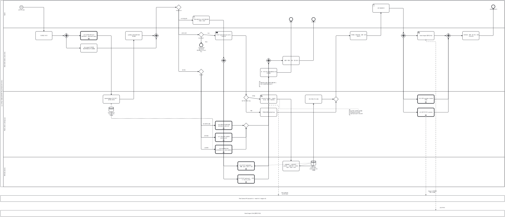

<details><summary>BPMN 2.0 XML 소스 보기 (`diagrams/bpmn_p1_service.bpmn` 과 동일 — Camunda Modeler · bpmn.io 에서 열림)</summary>

```xml
<?xml version="1.0" encoding="UTF-8"?>
<bpmn:definitions xmlns:bpmn="http://www.omg.org/spec/BPMN/20100524/MODEL" xmlns:bpmndi="http://www.omg.org/spec/BPMN/20100524/DI" xmlns:dc="http://www.omg.org/spec/DD/20100524/DC" xmlns:di="http://www.omg.org/spec/DD/20100524/DI" id="Definitions_bpmn_p1_service" name="P1 복기·판정 이용 프로세스 (UC1~UC8)" targetNamespace="https://p4.sumzip.com/bpmn" exporter="bpmn_gen.py" exporterVersion="1.0">
  <bpmn:collaboration id="Collab_bpmn_p1_service">
    <bpmn:participant id="Pool_bpmn_p1_service" name="LoL 인게임 시점별 승패 예측·핵심 승리요인 분석 서비스" processRef="Process_bpmn_p1_service" />
    <bpmn:participant id="BB_riot" name="Riot Games API (account-v1 · match-v5 · league-v4)" />
    <bpmn:participant id="BB_dd" name="Data Dragon CDN (챔피언 초상)" />
    <bpmn:messageFlow id="Msg_bpmn_p1_service_0" sourceRef="riot" targetRef="BB_riot" name="최대 12콜/요청 · 429 즉시 중단" />
    <bpmn:messageFlow id="Msg_bpmn_p1_service_1" sourceRef="uc4" targetRef="BB_riot" name="league-v4 (행 펼칠 때만, ≤10콜)" />
    <bpmn:messageFlow id="Msg_bpmn_p1_service_2" sourceRef="dd" targetRef="BB_dd" name="초상 이미지" />
  </bpmn:collaboration>
  <bpmn:process id="Process_bpmn_p1_service" name="P1 복기·판정 이용 프로세스 (UC1~UC8)" isExecutable="false">
    <bpmn:laneSet id="LaneSet_bpmn_p1_service">
      <bpmn:lane id="Lane_bpmn_p1_service_0" name="이용자">
        <bpmn:flowNodeRef>s</bpmn:flowNodeRef>
        <bpmn:flowNodeRef>what</bpmn:flowNodeRef>
        <bpmn:flowNodeRef>expand</bpmn:flowNodeRef>
        <bpmn:flowNodeRef>e_a</bpmn:flowNodeRef>
        <bpmn:flowNodeRef>manual</bpmn:flowNodeRef>
        <bpmn:flowNodeRef>e_b</bpmn:flowNodeRef>
        <bpmn:flowNodeRef>e_c</bpmn:flowNodeRef>
      </bpmn:lane>
      <bpmn:lane id="Lane_bpmn_p1_service_1" name="화면·프런트 (9504, index.html)">
        <bpmn:flowNodeRef>draw</bpmn:flowNodeRef>
        <bpmn:flowNodeRef>p0</bpmn:flowNodeRef>
        <bpmn:flowNodeRef>uc5</bpmn:flowNodeRef>
        <bpmn:flowNodeRef>conf</bpmn:flowNodeRef>
        <bpmn:flowNodeRef>ready</bpmn:flowNodeRef>
        <bpmn:flowNodeRef>p1</bpmn:flowNodeRef>
        <bpmn:flowNodeRef>g_ready</bpmn:flowNodeRef>
        <bpmn:flowNodeRef>e_off</bpmn:flowNodeRef>
        <bpmn:flowNodeRef>post_sum</bpmn:flowNodeRef>
        <bpmn:flowNodeRef>show1</bpmn:flowNodeRef>
        <bpmn:flowNodeRef>p2</bpmn:flowNodeRef>
        <bpmn:flowNodeRef>dd</bpmn:flowNodeRef>
        <bpmn:flowNodeRef>p3</bpmn:flowNodeRef>
        <bpmn:flowNodeRef>show2</bpmn:flowNodeRef>
        <bpmn:flowNodeRef>p4</bpmn:flowNodeRef>
        <bpmn:flowNodeRef>p5</bpmn:flowNodeRef>
        <bpmn:flowNodeRef>show3</bpmn:flowNodeRef>
        <bpmn:flowNodeRef>g_tab</bpmn:flowNodeRef>
        <bpmn:flowNodeRef>show4</bpmn:flowNodeRef>
      </bpmn:lane>
      <bpmn:lane id="Lane_bpmn_p1_service_2" name="백엔드 (9524, web/app.py)">
        <bpmn:flowNodeRef>rep</bpmn:flowNodeRef>
        <bpmn:flowNodeRef>g_cache</bpmn:flowNodeRef>
        <bpmn:flowNodeRef>cached</bpmn:flowNodeRef>
        <bpmn:flowNodeRef>riot</bpmn:flowNodeRef>
        <bpmn:flowNodeRef>save</bpmn:flowNodeRef>
        <bpmn:flowNodeRef>g_m1</bpmn:flowNodeRef>
        <bpmn:flowNodeRef>uc2a</bpmn:flowNodeRef>
        <bpmn:flowNodeRef>uc4</bpmn:flowNodeRef>
        <bpmn:flowNodeRef>uc6</bpmn:flowNodeRef>
        <bpmn:flowNodeRef>uc7</bpmn:flowNodeRef>
        <bpmn:flowNodeRef>uc8</bpmn:flowNodeRef>
        <bpmn:flowNodeRef>g_m2</bpmn:flowNodeRef>
      </bpmn:lane>
      <bpmn:lane id="Lane_bpmn_p1_service_3" name="예측 엔진 (lolwin)">
        <bpmn:flowNodeRef>feat</bpmn:flowNodeRef>
        <bpmn:flowNodeRef>uc1</bpmn:flowNodeRef>
        <bpmn:flowNodeRef>uc2b</bpmn:flowNodeRef>
      </bpmn:lane>
    </bpmn:laneSet>
    <bpmn:startEvent id="s" name="공개 주소 접속">
      <bpmn:outgoing>Flow_bpmn_p1_service_0</bpmn:outgoing>
      <bpmn:messageEventDefinition id="EvDef_s" />
    </bpmn:startEvent>
    <bpmn:task id="draw" name="첫 화면 그리기">
      <bpmn:incoming>Flow_bpmn_p1_service_0</bpmn:incoming>
      <bpmn:outgoing>Flow_bpmn_p1_service_1</bpmn:outgoing>
    </bpmn:task>
    <bpmn:parallelGateway id="p0">
      <bpmn:incoming>Flow_bpmn_p1_service_1</bpmn:incoming>
      <bpmn:outgoing>Flow_bpmn_p1_service_2</bpmn:outgoing>
      <bpmn:outgoing>Flow_bpmn_p1_service_3</bpmn:outgoing>
    </bpmn:parallelGateway>
    <bpmn:callActivity id="uc5" name="UC5 성적표 준비 GET /api/report · /api/match-types">
      <bpmn:incoming>Flow_bpmn_p1_service_2</bpmn:incoming>
      <bpmn:outgoing>Flow_bpmn_p1_service_4</bpmn:outgoing>
    </bpmn:callActivity>
    <bpmn:task id="rep" name="reports/tables CSV 읽기 → 성적표 JSON">
      <bpmn:incoming>Flow_bpmn_p1_service_4</bpmn:incoming>
      <bpmn:outgoing>Flow_bpmn_p1_service_5</bpmn:outgoing>
      <bpmn:dataInputAssociation id="DIA_ds_tables_rep"><bpmn:sourceRef>ds_tables</bpmn:sourceRef></bpmn:dataInputAssociation>
    </bpmn:task>
    <bpmn:dataStoreReference id="ds_tables" name="reports/tables/ *.csv (P2·P3 산출물)" />
    <bpmn:task id="conf" name="confBins 보관 (접전 경고 재사용)">
      <bpmn:incoming>Flow_bpmn_p1_service_5</bpmn:incoming>
      <bpmn:outgoing>Flow_bpmn_p1_service_6</bpmn:outgoing>
    </bpmn:task>
    <bpmn:task id="ready" name="riot_ready 로 검색창 활성/비활성 (P4 산출물)">
      <bpmn:incoming>Flow_bpmn_p1_service_3</bpmn:incoming>
      <bpmn:outgoing>Flow_bpmn_p1_service_7</bpmn:outgoing>
    </bpmn:task>
    <bpmn:parallelGateway id="p1">
      <bpmn:incoming>Flow_bpmn_p1_service_6</bpmn:incoming>
      <bpmn:incoming>Flow_bpmn_p1_service_7</bpmn:incoming>
      <bpmn:outgoing>Flow_bpmn_p1_service_8</bpmn:outgoing>
    </bpmn:parallelGateway>
    <bpmn:exclusiveGateway id="what" name="무엇을 하나?">
      <bpmn:incoming>Flow_bpmn_p1_service_8</bpmn:incoming>
      <bpmn:outgoing>Flow_bpmn_p1_service_9</bpmn:outgoing>
      <bpmn:outgoing>Flow_bpmn_p1_service_30</bpmn:outgoing>
      <bpmn:outgoing>Flow_bpmn_p1_service_38</bpmn:outgoing>
    </bpmn:exclusiveGateway>
    <bpmn:exclusiveGateway id="g_ready" name="riot_ready?">
      <bpmn:incoming>Flow_bpmn_p1_service_9</bpmn:incoming>
      <bpmn:outgoing>Flow_bpmn_p1_service_10</bpmn:outgoing>
      <bpmn:outgoing>Flow_bpmn_p1_service_11</bpmn:outgoing>
    </bpmn:exclusiveGateway>
    <bpmn:endEvent id="e_off" name="&quot;소환사 검색이 일시적으로 중단됐습니다&quot; (UC3 E1)">
      <bpmn:incoming>Flow_bpmn_p1_service_10</bpmn:incoming>
    </bpmn:endEvent>
    <bpmn:sendTask id="post_sum" name="POST /api/summoner (UC3, count 5)">
      <bpmn:incoming>Flow_bpmn_p1_service_11</bpmn:incoming>
      <bpmn:outgoing>Flow_bpmn_p1_service_12</bpmn:outgoing>
    </bpmn:sendTask>
    <bpmn:exclusiveGateway id="g_cache" name="5분 캐시 적중? (A1)">
      <bpmn:incoming>Flow_bpmn_p1_service_12</bpmn:incoming>
      <bpmn:outgoing>Flow_bpmn_p1_service_13</bpmn:outgoing>
      <bpmn:outgoing>Flow_bpmn_p1_service_14</bpmn:outgoing>
    </bpmn:exclusiveGateway>
    <bpmn:task id="cached" name="저장값 반환 cached=true">
      <bpmn:incoming>Flow_bpmn_p1_service_13</bpmn:incoming>
      <bpmn:outgoing>Flow_bpmn_p1_service_18</bpmn:outgoing>
    </bpmn:task>
    <bpmn:serviceTask id="riot" name="account-v1 puuid → match-v5 ids · 상세 · 타임라인">
      <bpmn:incoming>Flow_bpmn_p1_service_14</bpmn:incoming>
      <bpmn:outgoing>Flow_bpmn_p1_service_15</bpmn:outgoing>
    </bpmn:serviceTask>
    <bpmn:task id="feat" name="타임라인 → 13개 피처 → predict → 승률·요인 · verdict · style · radar · lane">
      <bpmn:incoming>Flow_bpmn_p1_service_15</bpmn:incoming>
      <bpmn:outgoing>Flow_bpmn_p1_service_16</bpmn:outgoing>
      <bpmn:dataInputAssociation id="DIA_ds_model_feat"><bpmn:sourceRef>ds_model</bpmn:sourceRef></bpmn:dataInputAssociation>
    </bpmn:task>
    <bpmn:dataStoreReference id="ds_model" name="artifacts/ model.joblib · schema.json (P3 산출물)" />
    <bpmn:task id="save" name="캐시 저장 (TTL 5분)">
      <bpmn:incoming>Flow_bpmn_p1_service_16</bpmn:incoming>
      <bpmn:outgoing>Flow_bpmn_p1_service_17</bpmn:outgoing>
    </bpmn:task>
    <bpmn:exclusiveGateway id="g_m1">
      <bpmn:incoming>Flow_bpmn_p1_service_17</bpmn:incoming>
      <bpmn:incoming>Flow_bpmn_p1_service_18</bpmn:incoming>
      <bpmn:outgoing>Flow_bpmn_p1_service_19</bpmn:outgoing>
    </bpmn:exclusiveGateway>
    <bpmn:task id="show1" name="프로필 · 판정 타일 · 성향 · 경기 행 표시">
      <bpmn:incoming>Flow_bpmn_p1_service_19</bpmn:incoming>
      <bpmn:outgoing>Flow_bpmn_p1_service_20</bpmn:outgoing>
    </bpmn:task>
    <bpmn:userTask id="expand" name="경기 행 펼치기">
      <bpmn:incoming>Flow_bpmn_p1_service_20</bpmn:incoming>
      <bpmn:outgoing>Flow_bpmn_p1_service_21</bpmn:outgoing>
    </bpmn:userTask>
    <bpmn:parallelGateway id="p2">
      <bpmn:incoming>Flow_bpmn_p1_service_21</bpmn:incoming>
      <bpmn:outgoing>Flow_bpmn_p1_service_22</bpmn:outgoing>
      <bpmn:outgoing>Flow_bpmn_p1_service_23</bpmn:outgoing>
      <bpmn:outgoing>Flow_bpmn_p1_service_24</bpmn:outgoing>
    </bpmn:parallelGateway>
    <bpmn:callActivity id="uc2a" name="UC2 코칭 «include» (verdict 포함)">
      <bpmn:incoming>Flow_bpmn_p1_service_22</bpmn:incoming>
      <bpmn:outgoing>Flow_bpmn_p1_service_25</bpmn:outgoing>
    </bpmn:callActivity>
    <bpmn:callActivity id="uc4" name="UC4 참가자 티어 «extend»">
      <bpmn:incoming>Flow_bpmn_p1_service_23</bpmn:incoming>
      <bpmn:outgoing>Flow_bpmn_p1_service_26</bpmn:outgoing>
    </bpmn:callActivity>
    <bpmn:serviceTask id="dd" name="Data Dragon 챔피언 초상">
      <bpmn:incoming>Flow_bpmn_p1_service_24</bpmn:incoming>
      <bpmn:outgoing>Flow_bpmn_p1_service_27</bpmn:outgoing>
    </bpmn:serviceTask>
    <bpmn:parallelGateway id="p3">
      <bpmn:incoming>Flow_bpmn_p1_service_25</bpmn:incoming>
      <bpmn:incoming>Flow_bpmn_p1_service_26</bpmn:incoming>
      <bpmn:incoming>Flow_bpmn_p1_service_27</bpmn:incoming>
      <bpmn:outgoing>Flow_bpmn_p1_service_28</bpmn:outgoing>
    </bpmn:parallelGateway>
    <bpmn:task id="show2" name="승리요인 · 궤적 · 팀 구성 · 코칭 · 티어 표시">
      <bpmn:incoming>Flow_bpmn_p1_service_28</bpmn:incoming>
      <bpmn:outgoing>Flow_bpmn_p1_service_29</bpmn:outgoing>
    </bpmn:task>
    <bpmn:endEvent id="e_a" name="판정별 처방 읽기">
      <bpmn:incoming>Flow_bpmn_p1_service_29</bpmn:incoming>
    </bpmn:endEvent>
    <bpmn:userTask id="manual" name="예시 버튼 또는 13개 직접 입력 → &quot;판정 + 코칭&quot;">
      <bpmn:incoming>Flow_bpmn_p1_service_30</bpmn:incoming>
      <bpmn:outgoing>Flow_bpmn_p1_service_31</bpmn:outgoing>
    </bpmn:userTask>
    <bpmn:parallelGateway id="p4">
      <bpmn:incoming>Flow_bpmn_p1_service_31</bpmn:incoming>
      <bpmn:outgoing>Flow_bpmn_p1_service_32</bpmn:outgoing>
      <bpmn:outgoing>Flow_bpmn_p1_service_33</bpmn:outgoing>
    </bpmn:parallelGateway>
    <bpmn:callActivity id="uc1" name="UC1 POST /api/predict → 확률 · pred · 요인 5 · 경고">
      <bpmn:incoming>Flow_bpmn_p1_service_32</bpmn:incoming>
      <bpmn:outgoing>Flow_bpmn_p1_service_34</bpmn:outgoing>
      <bpmn:dataInputAssociation id="DIA_ds_model_uc1"><bpmn:sourceRef>ds_model</bpmn:sourceRef></bpmn:dataInputAssociation>
    </bpmn:callActivity>
    <bpmn:callActivity id="uc2b" name="UC2 POST /api/coach → 조언 3 · how_to_read">
      <bpmn:incoming>Flow_bpmn_p1_service_33</bpmn:incoming>
      <bpmn:outgoing>Flow_bpmn_p1_service_35</bpmn:outgoing>
    </bpmn:callActivity>
    <bpmn:parallelGateway id="p5">
      <bpmn:incoming>Flow_bpmn_p1_service_34</bpmn:incoming>
      <bpmn:incoming>Flow_bpmn_p1_service_35</bpmn:incoming>
      <bpmn:outgoing>Flow_bpmn_p1_service_36</bpmn:outgoing>
    </bpmn:parallelGateway>
    <bpmn:task id="show3" name="승률 · 라벨 · 코칭 · 경고 표시">
      <bpmn:incoming>Flow_bpmn_p1_service_36</bpmn:incoming>
      <bpmn:outgoing>Flow_bpmn_p1_service_37</bpmn:outgoing>
    </bpmn:task>
    <bpmn:endEvent id="e_b" name="결과 읽기">
      <bpmn:incoming>Flow_bpmn_p1_service_37</bpmn:incoming>
    </bpmn:endEvent>
    <bpmn:exclusiveGateway id="g_tab" name="어느 탭?">
      <bpmn:incoming>Flow_bpmn_p1_service_38</bpmn:incoming>
      <bpmn:outgoing>Flow_bpmn_p1_service_39</bpmn:outgoing>
      <bpmn:outgoing>Flow_bpmn_p1_service_40</bpmn:outgoing>
      <bpmn:outgoing>Flow_bpmn_p1_service_41</bpmn:outgoing>
    </bpmn:exclusiveGateway>
    <bpmn:callActivity id="uc6" name="UC6 챔피언·라인별 승률 (champion_stats.csv)">
      <bpmn:incoming>Flow_bpmn_p1_service_39</bpmn:incoming>
      <bpmn:outgoing>Flow_bpmn_p1_service_42</bpmn:outgoing>
      <bpmn:dataInputAssociation id="DIA_ds_tables_uc6"><bpmn:sourceRef>ds_tables</bpmn:sourceRef></bpmn:dataInputAssociation>
    </bpmn:callActivity>
    <bpmn:callActivity id="uc7" name="UC7 상위 랭킹 100명씩 (ranking.csv)">
      <bpmn:incoming>Flow_bpmn_p1_service_40</bpmn:incoming>
      <bpmn:outgoing>Flow_bpmn_p1_service_43</bpmn:outgoing>
      <bpmn:dataInputAssociation id="DIA_ds_tables_uc7"><bpmn:sourceRef>ds_tables</bpmn:sourceRef></bpmn:dataInputAssociation>
    </bpmn:callActivity>
    <bpmn:callActivity id="uc8" name="UC8 승부예측 투표 (schedule.csv + votes.sqlite3)">
      <bpmn:incoming>Flow_bpmn_p1_service_41</bpmn:incoming>
      <bpmn:outgoing>Flow_bpmn_p1_service_44</bpmn:outgoing>
      <bpmn:dataInputAssociation id="DIA_ds_tables_uc8"><bpmn:sourceRef>ds_tables</bpmn:sourceRef></bpmn:dataInputAssociation>
    </bpmn:callActivity>
    <bpmn:exclusiveGateway id="g_m2">
      <bpmn:incoming>Flow_bpmn_p1_service_42</bpmn:incoming>
      <bpmn:incoming>Flow_bpmn_p1_service_43</bpmn:incoming>
      <bpmn:incoming>Flow_bpmn_p1_service_44</bpmn:incoming>
      <bpmn:outgoing>Flow_bpmn_p1_service_45</bpmn:outgoing>
    </bpmn:exclusiveGateway>
    <bpmn:task id="show4" name="표 · 카드 표시 (이름 클릭은 UC3 로 이동)">
      <bpmn:incoming>Flow_bpmn_p1_service_45</bpmn:incoming>
      <bpmn:outgoing>Flow_bpmn_p1_service_46</bpmn:outgoing>
    </bpmn:task>
    <bpmn:endEvent id="e_c" name="탭 읽기">
      <bpmn:incoming>Flow_bpmn_p1_service_46</bpmn:incoming>
    </bpmn:endEvent>
    <bpmn:textAnnotation id="n_tab"><bpmn:text>세 탭 모두 요청 시 외부 호출 0회 — 수집 스냅샷(P2)만 읽는다</bpmn:text></bpmn:textAnnotation>
    <bpmn:textAnnotation id="n_riot"><bpmn:text>Riot 예산 100회/120초를 라이브(UC3·UC4)와 수집기(UC10)가 나눠 쓴다</bpmn:text></bpmn:textAnnotation>
    <bpmn:sequenceFlow id="Flow_bpmn_p1_service_0" sourceRef="s" targetRef="draw" />
    <bpmn:sequenceFlow id="Flow_bpmn_p1_service_1" sourceRef="draw" targetRef="p0" />
    <bpmn:sequenceFlow id="Flow_bpmn_p1_service_2" sourceRef="p0" targetRef="uc5" />
    <bpmn:sequenceFlow id="Flow_bpmn_p1_service_3" sourceRef="p0" targetRef="ready" />
    <bpmn:sequenceFlow id="Flow_bpmn_p1_service_4" sourceRef="uc5" targetRef="rep" />
    <bpmn:sequenceFlow id="Flow_bpmn_p1_service_5" sourceRef="rep" targetRef="conf" />
    <bpmn:sequenceFlow id="Flow_bpmn_p1_service_6" sourceRef="conf" targetRef="p1" />
    <bpmn:sequenceFlow id="Flow_bpmn_p1_service_7" sourceRef="ready" targetRef="p1" />
    <bpmn:sequenceFlow id="Flow_bpmn_p1_service_8" sourceRef="p1" targetRef="what" />
    <bpmn:sequenceFlow id="Flow_bpmn_p1_service_9" sourceRef="what" targetRef="g_ready" name="소환사 검색" />
    <bpmn:sequenceFlow id="Flow_bpmn_p1_service_10" sourceRef="g_ready" targetRef="e_off" name="false" />
    <bpmn:sequenceFlow id="Flow_bpmn_p1_service_11" sourceRef="g_ready" targetRef="post_sum" name="true" />
    <bpmn:sequenceFlow id="Flow_bpmn_p1_service_12" sourceRef="post_sum" targetRef="g_cache" />
    <bpmn:sequenceFlow id="Flow_bpmn_p1_service_13" sourceRef="g_cache" targetRef="cached" name="적중" />
    <bpmn:sequenceFlow id="Flow_bpmn_p1_service_14" sourceRef="g_cache" targetRef="riot" name="미적중" />
    <bpmn:sequenceFlow id="Flow_bpmn_p1_service_15" sourceRef="riot" targetRef="feat" />
    <bpmn:sequenceFlow id="Flow_bpmn_p1_service_16" sourceRef="feat" targetRef="save" />
    <bpmn:sequenceFlow id="Flow_bpmn_p1_service_17" sourceRef="save" targetRef="g_m1" />
    <bpmn:sequenceFlow id="Flow_bpmn_p1_service_18" sourceRef="cached" targetRef="g_m1" />
    <bpmn:sequenceFlow id="Flow_bpmn_p1_service_19" sourceRef="g_m1" targetRef="show1" />
    <bpmn:sequenceFlow id="Flow_bpmn_p1_service_20" sourceRef="show1" targetRef="expand" />
    <bpmn:sequenceFlow id="Flow_bpmn_p1_service_21" sourceRef="expand" targetRef="p2" />
    <bpmn:sequenceFlow id="Flow_bpmn_p1_service_22" sourceRef="p2" targetRef="uc2a" />
    <bpmn:sequenceFlow id="Flow_bpmn_p1_service_23" sourceRef="p2" targetRef="uc4" />
    <bpmn:sequenceFlow id="Flow_bpmn_p1_service_24" sourceRef="p2" targetRef="dd" />
    <bpmn:sequenceFlow id="Flow_bpmn_p1_service_25" sourceRef="uc2a" targetRef="p3" />
    <bpmn:sequenceFlow id="Flow_bpmn_p1_service_26" sourceRef="uc4" targetRef="p3" />
    <bpmn:sequenceFlow id="Flow_bpmn_p1_service_27" sourceRef="dd" targetRef="p3" />
    <bpmn:sequenceFlow id="Flow_bpmn_p1_service_28" sourceRef="p3" targetRef="show2" />
    <bpmn:sequenceFlow id="Flow_bpmn_p1_service_29" sourceRef="show2" targetRef="e_a" />
    <bpmn:sequenceFlow id="Flow_bpmn_p1_service_30" sourceRef="what" targetRef="manual" name="수치 직접 입력" />
    <bpmn:sequenceFlow id="Flow_bpmn_p1_service_31" sourceRef="manual" targetRef="p4" />
    <bpmn:sequenceFlow id="Flow_bpmn_p1_service_32" sourceRef="p4" targetRef="uc1" />
    <bpmn:sequenceFlow id="Flow_bpmn_p1_service_33" sourceRef="p4" targetRef="uc2b" />
    <bpmn:sequenceFlow id="Flow_bpmn_p1_service_34" sourceRef="uc1" targetRef="p5" />
    <bpmn:sequenceFlow id="Flow_bpmn_p1_service_35" sourceRef="uc2b" targetRef="p5" />
    <bpmn:sequenceFlow id="Flow_bpmn_p1_service_36" sourceRef="p5" targetRef="show3" />
    <bpmn:sequenceFlow id="Flow_bpmn_p1_service_37" sourceRef="show3" targetRef="e_b" />
    <bpmn:sequenceFlow id="Flow_bpmn_p1_service_38" sourceRef="what" targetRef="g_tab" name="탭 이동" />
    <bpmn:sequenceFlow id="Flow_bpmn_p1_service_39" sourceRef="g_tab" targetRef="uc6" name="최근 챔피언 승률" />
    <bpmn:sequenceFlow id="Flow_bpmn_p1_service_40" sourceRef="g_tab" targetRef="uc7" name="유저 랭킹" />
    <bpmn:sequenceFlow id="Flow_bpmn_p1_service_41" sourceRef="g_tab" targetRef="uc8" name="승부예측" />
    <bpmn:sequenceFlow id="Flow_bpmn_p1_service_42" sourceRef="uc6" targetRef="g_m2" />
    <bpmn:sequenceFlow id="Flow_bpmn_p1_service_43" sourceRef="uc7" targetRef="g_m2" />
    <bpmn:sequenceFlow id="Flow_bpmn_p1_service_44" sourceRef="uc8" targetRef="g_m2" />
    <bpmn:sequenceFlow id="Flow_bpmn_p1_service_45" sourceRef="g_m2" targetRef="show4" />
    <bpmn:sequenceFlow id="Flow_bpmn_p1_service_46" sourceRef="show4" targetRef="e_c" />
    <bpmn:association id="Assoc_bpmn_p1_service_6" sourceRef="n_tab" targetRef="show4" />
    <bpmn:association id="Assoc_bpmn_p1_service_7" sourceRef="n_riot" targetRef="riot" />
  </bpmn:process>
  <bpmndi:BPMNDiagram id="Diagram_bpmn_p1_service">
    <bpmndi:BPMNPlane id="Plane_bpmn_p1_service" bpmnElement="Collab_bpmn_p1_service">
      <bpmndi:BPMNShape id="Pool_bpmn_p1_service_di" bpmnElement="Pool_bpmn_p1_service" isHorizontal="true"><dc:Bounds x="40" y="20" width="5204" height="1930" /></bpmndi:BPMNShape>
      <bpmndi:BPMNShape id="Lane_bpmn_p1_service_0_di" bpmnElement="Lane_bpmn_p1_service_0" isHorizontal="true"><dc:Bounds x="70" y="20" width="5174" height="284" /></bpmndi:BPMNShape>
      <bpmndi:BPMNShape id="Lane_bpmn_p1_service_1_di" bpmnElement="Lane_bpmn_p1_service_1" isHorizontal="true"><dc:Bounds x="70" y="304" width="5174" height="658" /></bpmndi:BPMNShape>
      <bpmndi:BPMNShape id="Lane_bpmn_p1_service_2_di" bpmnElement="Lane_bpmn_p1_service_2" isHorizontal="true"><dc:Bounds x="70" y="962" width="5174" height="680" /></bpmndi:BPMNShape>
      <bpmndi:BPMNShape id="Lane_bpmn_p1_service_3_di" bpmnElement="Lane_bpmn_p1_service_3" isHorizontal="true"><dc:Bounds x="70" y="1642" width="5174" height="308" /></bpmndi:BPMNShape>
      <bpmndi:BPMNShape id="BB_riot_di" bpmnElement="BB_riot" isHorizontal="true"><dc:Bounds x="40" y="2040" width="5204" height="64" /></bpmndi:BPMNShape>
      <bpmndi:BPMNShape id="BB_dd_di" bpmnElement="BB_dd" isHorizontal="true"><dc:Bounds x="40" y="2194" width="5204" height="64" /></bpmndi:BPMNShape>
      <bpmndi:BPMNShape id="s_di" bpmnElement="s"><dc:Bounds x="238" y="72" width="36" height="36" />
        <bpmndi:BPMNLabel><dc:Bounds x="196" y="112" width="120" height="28" /></bpmndi:BPMNLabel>
      </bpmndi:BPMNShape>
      <bpmndi:BPMNShape id="draw_di" bpmnElement="draw"><dc:Bounds x="402" y="340" width="172" height="88" />
      </bpmndi:BPMNShape>
      <bpmndi:BPMNShape id="p0_di" bpmnElement="p0"><dc:Bounds x="695" y="359" width="50" height="50" />
      </bpmndi:BPMNShape>
      <bpmndi:BPMNShape id="uc5_di" bpmnElement="uc5"><dc:Bounds x="866" y="340" width="172" height="88" />
      </bpmndi:BPMNShape>
      <bpmndi:BPMNShape id="rep_di" bpmnElement="rep"><dc:Bounds x="1098" y="998" width="172" height="88" />
      </bpmndi:BPMNShape>
      <bpmndi:BPMNShape id="ds_tables_di" bpmnElement="ds_tables"><dc:Bounds x="1159" y="1122" width="50" height="50" />
        <bpmndi:BPMNLabel><dc:Bounds x="1124" y="1176" width="120" height="28" /></bpmndi:BPMNLabel>
      </bpmndi:BPMNShape>
      <bpmndi:BPMNShape id="conf_di" bpmnElement="conf"><dc:Bounds x="1330" y="340" width="172" height="88" />
      </bpmndi:BPMNShape>
      <bpmndi:BPMNShape id="ready_di" bpmnElement="ready"><dc:Bounds x="866" y="469" width="172" height="88" />
      </bpmndi:BPMNShape>
      <bpmndi:BPMNShape id="p1_di" bpmnElement="p1"><dc:Bounds x="1623" y="359" width="50" height="50" />
      </bpmndi:BPMNShape>
      <bpmndi:BPMNShape id="what_di" bpmnElement="what"><dc:Bounds x="1855" y="65" width="50" height="50" />
        <bpmndi:BPMNLabel><dc:Bounds x="1820" y="119" width="120" height="28" /></bpmndi:BPMNLabel>
      </bpmndi:BPMNShape>
      <bpmndi:BPMNShape id="g_ready_di" bpmnElement="g_ready"><dc:Bounds x="2087" y="349" width="50" height="50" />
        <bpmndi:BPMNLabel><dc:Bounds x="2052" y="403" width="120" height="28" /></bpmndi:BPMNLabel>
      </bpmndi:BPMNShape>
      <bpmndi:BPMNShape id="e_off_di" bpmnElement="e_off"><dc:Bounds x="2094" y="464" width="36" height="36" />
        <bpmndi:BPMNLabel><dc:Bounds x="2052" y="504" width="120" height="28" /></bpmndi:BPMNLabel>
      </bpmndi:BPMNShape>
      <bpmndi:BPMNShape id="post_sum_di" bpmnElement="post_sum"><dc:Bounds x="2258" y="340" width="172" height="88" />
      </bpmndi:BPMNShape>
      <bpmndi:BPMNShape id="g_cache_di" bpmnElement="g_cache"><dc:Bounds x="2551" y="1000" width="50" height="50" />
        <bpmndi:BPMNLabel><dc:Bounds x="2516" y="1054" width="120" height="28" /></bpmndi:BPMNLabel>
      </bpmndi:BPMNShape>
      <bpmndi:BPMNShape id="cached_di" bpmnElement="cached"><dc:Bounds x="2722" y="1134" width="172" height="88" />
      </bpmndi:BPMNShape>
      <bpmndi:BPMNShape id="riot_di" bpmnElement="riot"><dc:Bounds x="2722" y="998" width="172" height="88" />
      </bpmndi:BPMNShape>
      <bpmndi:BPMNShape id="feat_di" bpmnElement="feat"><dc:Bounds x="2954" y="1683" width="172" height="102.5" />
      </bpmndi:BPMNShape>
      <bpmndi:BPMNShape id="ds_model_di" bpmnElement="ds_model"><dc:Bounds x="3247" y="1678" width="50" height="50" />
        <bpmndi:BPMNLabel><dc:Bounds x="3212" y="1732" width="120" height="28" /></bpmndi:BPMNLabel>
      </bpmndi:BPMNShape>
      <bpmndi:BPMNShape id="save_di" bpmnElement="save"><dc:Bounds x="3186" y="998" width="172" height="88" />
      </bpmndi:BPMNShape>
      <bpmndi:BPMNShape id="g_m1_di" bpmnElement="g_m1"><dc:Bounds x="3479" y="1017" width="50" height="50" />
      </bpmndi:BPMNShape>
      <bpmndi:BPMNShape id="show1_di" bpmnElement="show1"><dc:Bounds x="3650" y="340" width="172" height="88" />
      </bpmndi:BPMNShape>
      <bpmndi:BPMNShape id="expand_di" bpmnElement="expand"><dc:Bounds x="3882" y="56" width="172" height="88" />
      </bpmndi:BPMNShape>
      <bpmndi:BPMNShape id="p2_di" bpmnElement="p2"><dc:Bounds x="4175" y="359" width="50" height="50" />
      </bpmndi:BPMNShape>
      <bpmndi:BPMNShape id="uc2a_di" bpmnElement="uc2a"><dc:Bounds x="4346" y="998" width="172" height="88" />
      </bpmndi:BPMNShape>
      <bpmndi:BPMNShape id="uc4_di" bpmnElement="uc4"><dc:Bounds x="4346" y="1134" width="172" height="88" />
      </bpmndi:BPMNShape>
      <bpmndi:BPMNShape id="dd_di" bpmnElement="dd"><dc:Bounds x="4346" y="340" width="172" height="88" />
      </bpmndi:BPMNShape>
      <bpmndi:BPMNShape id="p3_di" bpmnElement="p3"><dc:Bounds x="4639" y="359" width="50" height="50" />
      </bpmndi:BPMNShape>
      <bpmndi:BPMNShape id="show2_di" bpmnElement="show2"><dc:Bounds x="4810" y="340" width="172" height="88" />
      </bpmndi:BPMNShape>
      <bpmndi:BPMNShape id="e_a_di" bpmnElement="e_a"><dc:Bounds x="5110" y="65" width="36" height="36" />
        <bpmndi:BPMNLabel><dc:Bounds x="5068" y="105" width="120" height="28" /></bpmndi:BPMNLabel>
      </bpmndi:BPMNShape>
      <bpmndi:BPMNShape id="manual_di" bpmnElement="manual"><dc:Bounds x="2026" y="180" width="172" height="88" />
      </bpmndi:BPMNShape>
      <bpmndi:BPMNShape id="p4_di" bpmnElement="p4"><dc:Bounds x="2319" y="617" width="50" height="50" />
      </bpmndi:BPMNShape>
      <bpmndi:BPMNShape id="uc1_di" bpmnElement="uc1"><dc:Bounds x="2490" y="1690" width="172" height="88" />
      </bpmndi:BPMNShape>
      <bpmndi:BPMNShape id="uc2b_di" bpmnElement="uc2b"><dc:Bounds x="2490" y="1826" width="172" height="88" />
      </bpmndi:BPMNShape>
      <bpmndi:BPMNShape id="p5_di" bpmnElement="p5"><dc:Bounds x="2783" y="617" width="50" height="50" />
      </bpmndi:BPMNShape>
      <bpmndi:BPMNShape id="show3_di" bpmnElement="show3"><dc:Bounds x="2954" y="598" width="172" height="88" />
      </bpmndi:BPMNShape>
      <bpmndi:BPMNShape id="e_b_di" bpmnElement="e_b"><dc:Bounds x="3254" y="196" width="36" height="36" />
        <bpmndi:BPMNLabel><dc:Bounds x="3212" y="236" width="120" height="28" /></bpmndi:BPMNLabel>
      </bpmndi:BPMNShape>
      <bpmndi:BPMNShape id="g_tab_di" bpmnElement="g_tab"><dc:Bounds x="2087" y="731" width="50" height="50" />
        <bpmndi:BPMNLabel><dc:Bounds x="2052" y="785" width="120" height="28" /></bpmndi:BPMNLabel>
      </bpmndi:BPMNShape>
      <bpmndi:BPMNShape id="uc6_di" bpmnElement="uc6"><dc:Bounds x="2258" y="1270" width="172" height="88" />
      </bpmndi:BPMNShape>
      <bpmndi:BPMNShape id="uc7_di" bpmnElement="uc7"><dc:Bounds x="2258" y="1394" width="172" height="88" />
      </bpmndi:BPMNShape>
      <bpmndi:BPMNShape id="uc8_di" bpmnElement="uc8"><dc:Bounds x="2258" y="1518" width="172" height="88" />
      </bpmndi:BPMNShape>
      <bpmndi:BPMNShape id="g_m2_di" bpmnElement="g_m2"><dc:Bounds x="2551" y="1289" width="50" height="50" />
      </bpmndi:BPMNShape>
      <bpmndi:BPMNShape id="show4_di" bpmnElement="show4"><dc:Bounds x="2722" y="722" width="172" height="88" />
      </bpmndi:BPMNShape>
      <bpmndi:BPMNShape id="e_c_di" bpmnElement="e_c"><dc:Bounds x="3022" y="196" width="36" height="36" />
        <bpmndi:BPMNLabel><dc:Bounds x="2980" y="236" width="120" height="28" /></bpmndi:BPMNLabel>
      </bpmndi:BPMNShape>
      <bpmndi:BPMNShape id="n_tab_di" bpmnElement="n_tab"><dc:Bounds x="2713" y="858" width="190" height="55.5" />
      </bpmndi:BPMNShape>
      <bpmndi:BPMNShape id="n_riot_di" bpmnElement="n_riot"><dc:Bounds x="3641" y="1150" width="190" height="55.5" />
      </bpmndi:BPMNShape>
      <bpmndi:BPMNEdge id="Flow_bpmn_p1_service_0_di" bpmnElement="Flow_bpmn_p1_service_0">
        <di:waypoint x="274" y="90" />
        <di:waypoint x="488" y="90" />
        <di:waypoint x="488" y="340" />
      </bpmndi:BPMNEdge>
      <bpmndi:BPMNEdge id="Flow_bpmn_p1_service_1_di" bpmnElement="Flow_bpmn_p1_service_1">
        <di:waypoint x="574" y="384" />
        <di:waypoint x="695" y="384" />
      </bpmndi:BPMNEdge>
      <bpmndi:BPMNEdge id="Flow_bpmn_p1_service_2_di" bpmnElement="Flow_bpmn_p1_service_2">
        <di:waypoint x="745" y="384" />
        <di:waypoint x="866" y="384" />
      </bpmndi:BPMNEdge>
      <bpmndi:BPMNEdge id="Flow_bpmn_p1_service_3_di" bpmnElement="Flow_bpmn_p1_service_3">
        <di:waypoint x="720" y="409" />
        <di:waypoint x="720" y="513" />
        <di:waypoint x="866" y="513" />
      </bpmndi:BPMNEdge>
      <bpmndi:BPMNEdge id="Flow_bpmn_p1_service_4_di" bpmnElement="Flow_bpmn_p1_service_4">
        <di:waypoint x="1038" y="384" />
        <di:waypoint x="1184" y="384" />
        <di:waypoint x="1184" y="998" />
      </bpmndi:BPMNEdge>
      <bpmndi:BPMNEdge id="Flow_bpmn_p1_service_5_di" bpmnElement="Flow_bpmn_p1_service_5">
        <di:waypoint x="1270" y="1042" />
        <di:waypoint x="1416" y="1042" />
        <di:waypoint x="1416" y="428" />
      </bpmndi:BPMNEdge>
      <bpmndi:BPMNEdge id="Flow_bpmn_p1_service_6_di" bpmnElement="Flow_bpmn_p1_service_6">
        <di:waypoint x="1502" y="384" />
        <di:waypoint x="1623" y="384" />
      </bpmndi:BPMNEdge>
      <bpmndi:BPMNEdge id="Flow_bpmn_p1_service_7_di" bpmnElement="Flow_bpmn_p1_service_7">
        <di:waypoint x="1038" y="513" />
        <di:waypoint x="1648" y="513" />
        <di:waypoint x="1648" y="409" />
      </bpmndi:BPMNEdge>
      <bpmndi:BPMNEdge id="Flow_bpmn_p1_service_8_di" bpmnElement="Flow_bpmn_p1_service_8">
        <di:waypoint x="1648" y="359" />
        <di:waypoint x="1648" y="90" />
        <di:waypoint x="1855" y="90" />
      </bpmndi:BPMNEdge>
      <bpmndi:BPMNEdge id="Flow_bpmn_p1_service_9_di" bpmnElement="Flow_bpmn_p1_service_9">
        <di:waypoint x="1880" y="115" />
        <di:waypoint x="1880" y="374" />
        <di:waypoint x="2087" y="374" />
        <bpmndi:BPMNLabel><dc:Bounds x="1888" y="352" width="90" height="18" /></bpmndi:BPMNLabel>
      </bpmndi:BPMNEdge>
      <bpmndi:BPMNEdge id="Flow_bpmn_p1_service_10_di" bpmnElement="Flow_bpmn_p1_service_10">
        <di:waypoint x="2112" y="399" />
        <di:waypoint x="2112" y="464" />
        <bpmndi:BPMNLabel><dc:Bounds x="2120" y="442" width="90" height="18" /></bpmndi:BPMNLabel>
      </bpmndi:BPMNEdge>
      <bpmndi:BPMNEdge id="Flow_bpmn_p1_service_11_di" bpmnElement="Flow_bpmn_p1_service_11">
        <di:waypoint x="2137" y="374" />
        <di:waypoint x="2258" y="384" />
        <bpmndi:BPMNLabel><dc:Bounds x="2143" y="352" width="90" height="18" /></bpmndi:BPMNLabel>
      </bpmndi:BPMNEdge>
      <bpmndi:BPMNEdge id="Flow_bpmn_p1_service_12_di" bpmnElement="Flow_bpmn_p1_service_12">
        <di:waypoint x="2430" y="384" />
        <di:waypoint x="2576" y="384" />
        <di:waypoint x="2576" y="1000" />
      </bpmndi:BPMNEdge>
      <bpmndi:BPMNEdge id="Flow_bpmn_p1_service_13_di" bpmnElement="Flow_bpmn_p1_service_13">
        <di:waypoint x="2576" y="1050" />
        <di:waypoint x="2576" y="1178" />
        <di:waypoint x="2722" y="1178" />
        <bpmndi:BPMNLabel><dc:Bounds x="2584" y="1156" width="90" height="18" /></bpmndi:BPMNLabel>
      </bpmndi:BPMNEdge>
      <bpmndi:BPMNEdge id="Flow_bpmn_p1_service_14_di" bpmnElement="Flow_bpmn_p1_service_14">
        <di:waypoint x="2601" y="1025" />
        <di:waypoint x="2722" y="1042" />
        <bpmndi:BPMNLabel><dc:Bounds x="2607" y="1003" width="90" height="18" /></bpmndi:BPMNLabel>
      </bpmndi:BPMNEdge>
      <bpmndi:BPMNEdge id="Flow_bpmn_p1_service_15_di" bpmnElement="Flow_bpmn_p1_service_15">
        <di:waypoint x="2894" y="1042" />
        <di:waypoint x="3040" y="1042" />
        <di:waypoint x="3040" y="1683" />
      </bpmndi:BPMNEdge>
      <bpmndi:BPMNEdge id="Flow_bpmn_p1_service_16_di" bpmnElement="Flow_bpmn_p1_service_16">
        <di:waypoint x="3126" y="1734" />
        <di:waypoint x="3272" y="1734" />
        <di:waypoint x="3272" y="1086" />
      </bpmndi:BPMNEdge>
      <bpmndi:BPMNEdge id="Flow_bpmn_p1_service_17_di" bpmnElement="Flow_bpmn_p1_service_17">
        <di:waypoint x="3358" y="1042" />
        <di:waypoint x="3479" y="1042" />
      </bpmndi:BPMNEdge>
      <bpmndi:BPMNEdge id="Flow_bpmn_p1_service_18_di" bpmnElement="Flow_bpmn_p1_service_18">
        <di:waypoint x="2894" y="1178" />
        <di:waypoint x="3504" y="1178" />
        <di:waypoint x="3504" y="1067" />
      </bpmndi:BPMNEdge>
      <bpmndi:BPMNEdge id="Flow_bpmn_p1_service_19_di" bpmnElement="Flow_bpmn_p1_service_19">
        <di:waypoint x="3504" y="1017" />
        <di:waypoint x="3504" y="384" />
        <di:waypoint x="3650" y="384" />
      </bpmndi:BPMNEdge>
      <bpmndi:BPMNEdge id="Flow_bpmn_p1_service_20_di" bpmnElement="Flow_bpmn_p1_service_20">
        <di:waypoint x="3822" y="384" />
        <di:waypoint x="3968" y="384" />
        <di:waypoint x="3968" y="144" />
      </bpmndi:BPMNEdge>
      <bpmndi:BPMNEdge id="Flow_bpmn_p1_service_21_di" bpmnElement="Flow_bpmn_p1_service_21">
        <di:waypoint x="4054" y="100" />
        <di:waypoint x="4200" y="100" />
        <di:waypoint x="4200" y="359" />
      </bpmndi:BPMNEdge>
      <bpmndi:BPMNEdge id="Flow_bpmn_p1_service_22_di" bpmnElement="Flow_bpmn_p1_service_22">
        <di:waypoint x="4200" y="409" />
        <di:waypoint x="4200" y="1042" />
        <di:waypoint x="4346" y="1042" />
      </bpmndi:BPMNEdge>
      <bpmndi:BPMNEdge id="Flow_bpmn_p1_service_23_di" bpmnElement="Flow_bpmn_p1_service_23">
        <di:waypoint x="4200" y="409" />
        <di:waypoint x="4200" y="1178" />
        <di:waypoint x="4346" y="1178" />
      </bpmndi:BPMNEdge>
      <bpmndi:BPMNEdge id="Flow_bpmn_p1_service_24_di" bpmnElement="Flow_bpmn_p1_service_24">
        <di:waypoint x="4225" y="384" />
        <di:waypoint x="4346" y="384" />
      </bpmndi:BPMNEdge>
      <bpmndi:BPMNEdge id="Flow_bpmn_p1_service_25_di" bpmnElement="Flow_bpmn_p1_service_25">
        <di:waypoint x="4518" y="1042" />
        <di:waypoint x="4664" y="1042" />
        <di:waypoint x="4664" y="409" />
      </bpmndi:BPMNEdge>
      <bpmndi:BPMNEdge id="Flow_bpmn_p1_service_26_di" bpmnElement="Flow_bpmn_p1_service_26">
        <di:waypoint x="4518" y="1178" />
        <di:waypoint x="4664" y="1178" />
        <di:waypoint x="4664" y="409" />
      </bpmndi:BPMNEdge>
      <bpmndi:BPMNEdge id="Flow_bpmn_p1_service_27_di" bpmnElement="Flow_bpmn_p1_service_27">
        <di:waypoint x="4518" y="384" />
        <di:waypoint x="4639" y="384" />
      </bpmndi:BPMNEdge>
      <bpmndi:BPMNEdge id="Flow_bpmn_p1_service_28_di" bpmnElement="Flow_bpmn_p1_service_28">
        <di:waypoint x="4689" y="384" />
        <di:waypoint x="4810" y="384" />
      </bpmndi:BPMNEdge>
      <bpmndi:BPMNEdge id="Flow_bpmn_p1_service_29_di" bpmnElement="Flow_bpmn_p1_service_29">
        <di:waypoint x="4982" y="384" />
        <di:waypoint x="5128" y="384" />
        <di:waypoint x="5128" y="101" />
      </bpmndi:BPMNEdge>
      <bpmndi:BPMNEdge id="Flow_bpmn_p1_service_30_di" bpmnElement="Flow_bpmn_p1_service_30">
        <di:waypoint x="1880" y="115" />
        <di:waypoint x="1880" y="224" />
        <di:waypoint x="2026" y="224" />
        <bpmndi:BPMNLabel><dc:Bounds x="1888" y="202" width="90" height="18" /></bpmndi:BPMNLabel>
      </bpmndi:BPMNEdge>
      <bpmndi:BPMNEdge id="Flow_bpmn_p1_service_31_di" bpmnElement="Flow_bpmn_p1_service_31">
        <di:waypoint x="2198" y="224" />
        <di:waypoint x="2344" y="224" />
        <di:waypoint x="2344" y="617" />
      </bpmndi:BPMNEdge>
      <bpmndi:BPMNEdge id="Flow_bpmn_p1_service_32_di" bpmnElement="Flow_bpmn_p1_service_32">
        <di:waypoint x="2344" y="667" />
        <di:waypoint x="2344" y="1734" />
        <di:waypoint x="2490" y="1734" />
      </bpmndi:BPMNEdge>
      <bpmndi:BPMNEdge id="Flow_bpmn_p1_service_33_di" bpmnElement="Flow_bpmn_p1_service_33">
        <di:waypoint x="2344" y="667" />
        <di:waypoint x="2344" y="1870" />
        <di:waypoint x="2490" y="1870" />
      </bpmndi:BPMNEdge>
      <bpmndi:BPMNEdge id="Flow_bpmn_p1_service_34_di" bpmnElement="Flow_bpmn_p1_service_34">
        <di:waypoint x="2662" y="1734" />
        <di:waypoint x="2808" y="1734" />
        <di:waypoint x="2808" y="667" />
      </bpmndi:BPMNEdge>
      <bpmndi:BPMNEdge id="Flow_bpmn_p1_service_35_di" bpmnElement="Flow_bpmn_p1_service_35">
        <di:waypoint x="2662" y="1870" />
        <di:waypoint x="2808" y="1870" />
        <di:waypoint x="2808" y="667" />
      </bpmndi:BPMNEdge>
      <bpmndi:BPMNEdge id="Flow_bpmn_p1_service_36_di" bpmnElement="Flow_bpmn_p1_service_36">
        <di:waypoint x="2833" y="642" />
        <di:waypoint x="2954" y="642" />
      </bpmndi:BPMNEdge>
      <bpmndi:BPMNEdge id="Flow_bpmn_p1_service_37_di" bpmnElement="Flow_bpmn_p1_service_37">
        <di:waypoint x="3126" y="642" />
        <di:waypoint x="3272" y="642" />
        <di:waypoint x="3272" y="232" />
      </bpmndi:BPMNEdge>
      <bpmndi:BPMNEdge id="Flow_bpmn_p1_service_38_di" bpmnElement="Flow_bpmn_p1_service_38">
        <di:waypoint x="1880" y="115" />
        <di:waypoint x="1880" y="756" />
        <di:waypoint x="2087" y="756" />
        <bpmndi:BPMNLabel><dc:Bounds x="1888" y="734" width="90" height="18" /></bpmndi:BPMNLabel>
      </bpmndi:BPMNEdge>
      <bpmndi:BPMNEdge id="Flow_bpmn_p1_service_39_di" bpmnElement="Flow_bpmn_p1_service_39">
        <di:waypoint x="2112" y="781" />
        <di:waypoint x="2112" y="1314" />
        <di:waypoint x="2258" y="1314" />
        <bpmndi:BPMNLabel><dc:Bounds x="2120" y="1292" width="90" height="18" /></bpmndi:BPMNLabel>
      </bpmndi:BPMNEdge>
      <bpmndi:BPMNEdge id="Flow_bpmn_p1_service_40_di" bpmnElement="Flow_bpmn_p1_service_40">
        <di:waypoint x="2112" y="781" />
        <di:waypoint x="2112" y="1438" />
        <di:waypoint x="2258" y="1438" />
        <bpmndi:BPMNLabel><dc:Bounds x="2120" y="1416" width="90" height="18" /></bpmndi:BPMNLabel>
      </bpmndi:BPMNEdge>
      <bpmndi:BPMNEdge id="Flow_bpmn_p1_service_41_di" bpmnElement="Flow_bpmn_p1_service_41">
        <di:waypoint x="2112" y="781" />
        <di:waypoint x="2112" y="1562" />
        <di:waypoint x="2258" y="1562" />
        <bpmndi:BPMNLabel><dc:Bounds x="2120" y="1540" width="90" height="18" /></bpmndi:BPMNLabel>
      </bpmndi:BPMNEdge>
      <bpmndi:BPMNEdge id="Flow_bpmn_p1_service_42_di" bpmnElement="Flow_bpmn_p1_service_42">
        <di:waypoint x="2430" y="1314" />
        <di:waypoint x="2551" y="1314" />
      </bpmndi:BPMNEdge>
      <bpmndi:BPMNEdge id="Flow_bpmn_p1_service_43_di" bpmnElement="Flow_bpmn_p1_service_43">
        <di:waypoint x="2430" y="1438" />
        <di:waypoint x="2576" y="1438" />
        <di:waypoint x="2576" y="1339" />
      </bpmndi:BPMNEdge>
      <bpmndi:BPMNEdge id="Flow_bpmn_p1_service_44_di" bpmnElement="Flow_bpmn_p1_service_44">
        <di:waypoint x="2430" y="1562" />
        <di:waypoint x="2576" y="1562" />
        <di:waypoint x="2576" y="1339" />
      </bpmndi:BPMNEdge>
      <bpmndi:BPMNEdge id="Flow_bpmn_p1_service_45_di" bpmnElement="Flow_bpmn_p1_service_45">
        <di:waypoint x="2601" y="1314" />
        <di:waypoint x="2808" y="1314" />
        <di:waypoint x="2808" y="810" />
      </bpmndi:BPMNEdge>
      <bpmndi:BPMNEdge id="Flow_bpmn_p1_service_46_di" bpmnElement="Flow_bpmn_p1_service_46">
        <di:waypoint x="2894" y="766" />
        <di:waypoint x="3040" y="766" />
        <di:waypoint x="3040" y="232" />
      </bpmndi:BPMNEdge>
      <bpmndi:BPMNEdge id="Msg_bpmn_p1_service_0_di" bpmnElement="Msg_bpmn_p1_service_0">
        <di:waypoint x="2808" y="1086" />
        <di:waypoint x="2808" y="1104" />
        <di:waypoint x="2910" y="1104" />
        <di:waypoint x="2910" y="2040" />
        <bpmndi:BPMNLabel><dc:Bounds x="2916" y="2006" width="120" height="18" /></bpmndi:BPMNLabel>
      </bpmndi:BPMNEdge>
      <bpmndi:BPMNEdge id="Msg_bpmn_p1_service_1_di" bpmnElement="Msg_bpmn_p1_service_1">
        <di:waypoint x="4432" y="1222" />
        <di:waypoint x="4432" y="2040" />
        <bpmndi:BPMNLabel><dc:Bounds x="4438" y="1988" width="120" height="18" /></bpmndi:BPMNLabel>
      </bpmndi:BPMNEdge>
      <bpmndi:BPMNEdge id="Msg_bpmn_p1_service_2_di" bpmnElement="Msg_bpmn_p1_service_2">
        <di:waypoint x="4432" y="428" />
        <di:waypoint x="4432" y="446" />
        <di:waypoint x="4534" y="446" />
        <di:waypoint x="4534" y="2194" />
        <bpmndi:BPMNLabel><dc:Bounds x="4540" y="2160" width="120" height="18" /></bpmndi:BPMNLabel>
      </bpmndi:BPMNEdge>
      <bpmndi:BPMNEdge id="DIA_ds_tables_rep_di" bpmnElement="DIA_ds_tables_rep">
        <di:waypoint x="1184" y="1122" />
        <di:waypoint x="1184" y="1086" />
      </bpmndi:BPMNEdge>
      <bpmndi:BPMNEdge id="DIA_ds_model_feat_di" bpmnElement="DIA_ds_model_feat">
        <di:waypoint x="3247" y="1703" />
        <di:waypoint x="3126" y="1734" />
      </bpmndi:BPMNEdge>
      <bpmndi:BPMNEdge id="DIA_ds_model_uc1_di" bpmnElement="DIA_ds_model_uc1">
        <di:waypoint x="3247" y="1703" />
        <di:waypoint x="2662" y="1734" />
      </bpmndi:BPMNEdge>
      <bpmndi:BPMNEdge id="DIA_ds_tables_uc6_di" bpmnElement="DIA_ds_tables_uc6">
        <di:waypoint x="1184" y="1172" />
        <di:waypoint x="1184" y="1242" />
        <di:waypoint x="2230" y="1242" />
        <di:waypoint x="2230" y="1314" />
        <di:waypoint x="2258" y="1314" />
      </bpmndi:BPMNEdge>
      <bpmndi:BPMNEdge id="DIA_ds_tables_uc7_di" bpmnElement="DIA_ds_tables_uc7">
        <di:waypoint x="1184" y="1172" />
        <di:waypoint x="1184" y="1242" />
        <di:waypoint x="2230" y="1242" />
        <di:waypoint x="2230" y="1438" />
        <di:waypoint x="2258" y="1438" />
      </bpmndi:BPMNEdge>
      <bpmndi:BPMNEdge id="DIA_ds_tables_uc8_di" bpmnElement="DIA_ds_tables_uc8">
        <di:waypoint x="1184" y="1172" />
        <di:waypoint x="1184" y="1242" />
        <di:waypoint x="2230" y="1242" />
        <di:waypoint x="2230" y="1562" />
        <di:waypoint x="2258" y="1562" />
      </bpmndi:BPMNEdge>
      <bpmndi:BPMNEdge id="Assoc_bpmn_p1_service_6_di" bpmnElement="Assoc_bpmn_p1_service_6">
        <di:waypoint x="2808" y="858" />
        <di:waypoint x="2808" y="810" />
      </bpmndi:BPMNEdge>
      <bpmndi:BPMNEdge id="Assoc_bpmn_p1_service_7_di" bpmnElement="Assoc_bpmn_p1_service_7">
        <di:waypoint x="3736" y="1150" />
        <di:waypoint x="3736" y="1142" />
        <di:waypoint x="2922" y="1142" />
        <di:waypoint x="2922" y="1042" />
        <di:waypoint x="2894" y="1042" />
      </bpmndi:BPMNEdge>
    </bpmndi:BPMNPlane>
  </bpmndi:BPMNDiagram>
</bpmn:definitions>
```

</details>


| 구간 | 대응 UC | 대응 Sequence 메시지 | BPMN 요소 |
|---|:--:|---|---|
| 첫 화면 → 성적표 준비 · 검색창 활성 | UC5 · UC14 | UC5 시퀀스 1~6, UC14 시퀀스 7 | 병렬 게이트웨이 · 데이터 저장소 `reports/tables` |
| 소환사 검색 → 경기 목록 | UC3 | UC3 시퀀스 1~9 | 배타 게이트웨이 "riot_ready?" (E1 종료) · "5분 캐시?" (A1) · Riot 메시지 흐름 · 모델 저장소 |
| 경기 행 펼침 → 코칭·티어·초상 | UC2 · UC4 | UC3 시퀀스 10, UC2 A1, UC4 1~8 | 병렬 게이트웨이 · 호출 활동 «include»·«extend» · Riot·Data Dragon 메시지 |
| 수치 직접 입력 | UC1 · UC2 | UC1 시퀀스 3~8 | 병렬 게이트웨이 · 호출 활동 UC1·UC2 · 모델 저장소 |
| 탭 이동 | UC6 · UC7 · UC8 | 각 시퀀스 1~7 | 배타 게이트웨이 "어느 탭?" · 호출 활동 셋 · 저장소 읽기만 (외부 메시지 0) |

### 3.2 P2 데이터 스냅샷 수집 프로세스 (UC9 · UC10)

`run_collectors.sh` 한 바퀴다. 일정 → 챔피언 → 랭킹 순서로 세 수집기가 차례로 돌고, loop 모드면 **타이머 중간 이벤트(5분 대기)** 뒤에 다시 돈다. 챔피언 표본 수집 활동에는 **타이머 경계(40분)** 와 **오류 경계(401/403)** 가 함께 붙어 있어, 어느 쪽으로 끊겨도 받은 원본을 재집계하고 넘어간다. 서비스는 파일 레인의 원통만 읽는다.

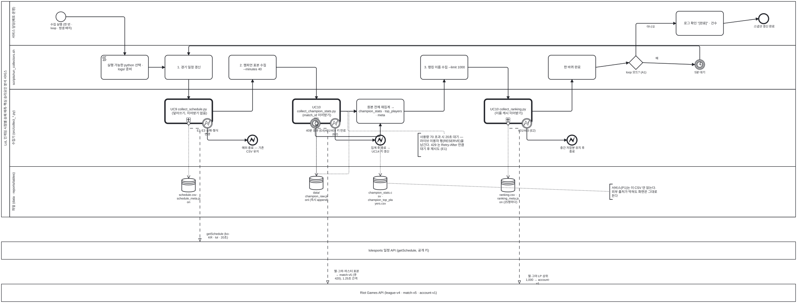

<details><summary>BPMN 2.0 XML 소스 보기 (`diagrams/bpmn_p2_collect.bpmn` 과 동일 — Camunda Modeler · bpmn.io 에서 열림)</summary>

```xml
<?xml version="1.0" encoding="UTF-8"?>
<bpmn:definitions xmlns:bpmn="http://www.omg.org/spec/BPMN/20100524/MODEL" xmlns:bpmndi="http://www.omg.org/spec/BPMN/20100524/DI" xmlns:dc="http://www.omg.org/spec/DD/20100524/DC" xmlns:di="http://www.omg.org/spec/DD/20100524/DI" id="Definitions_bpmn_p2_collect" name="P2 데이터 스냅샷 수집 프로세스 (UC9 · UC10)" targetNamespace="https://p4.sumzip.com/bpmn" exporter="bpmn_gen.py" exporterVersion="1.0">
  <bpmn:collaboration id="Collab_bpmn_p2_collect">
    <bpmn:participant id="Pool_bpmn_p2_collect" name="LoL 인게임 시점별 승패 예측·핵심 승리요인 분석 서비스" processRef="Process_bpmn_p2_collect" />
    <bpmn:participant id="BB_esports" name="lolesports 일정 API (getSchedule, 공개 키)" />
    <bpmn:participant id="BB_riot" name="Riot Games API (league-v4 · match-v5 · account-v1)" />
    <bpmn:messageFlow id="Msg_bpmn_p2_collect_0" sourceRef="uc9" targetRef="BB_esports" name="getSchedule (ko-KR · lol · 20초)" />
    <bpmn:messageFlow id="Msg_bpmn_p2_collect_1" sourceRef="uc10a" targetRef="BB_riot" name="챌·그마·마스터 표본 → match-v5 (큐 420), 1.25초 간격" />
    <bpmn:messageFlow id="Msg_bpmn_p2_collect_2" sourceRef="uc10b" targetRef="BB_riot" name="챌·그마 LP 상위 1,000 → account-v1" />
  </bpmn:collaboration>
  <bpmn:process id="Process_bpmn_p2_collect" name="P2 데이터 스냅샷 수집 프로세스 (UC9 · UC10)" isExecutable="false">
    <bpmn:laneSet id="LaneSet_bpmn_p2_collect">
      <bpmn:lane id="Lane_bpmn_p2_collect_0" name="서비스 담당(배포·운영)">
        <bpmn:flowNodeRef>s</bpmn:flowNodeRef>
        <bpmn:flowNodeRef>log</bpmn:flowNodeRef>
        <bpmn:flowNodeRef>e</bpmn:flowNodeRef>
      </bpmn:lane>
      <bpmn:lane id="Lane_bpmn_p2_collect_1" name="scripts/run_collectors.sh">
        <bpmn:flowNodeRef>prep</bpmn:flowNodeRef>
        <bpmn:flowNodeRef>st1</bpmn:flowNodeRef>
        <bpmn:flowNodeRef>st2</bpmn:flowNodeRef>
        <bpmn:flowNodeRef>st3</bpmn:flowNodeRef>
        <bpmn:flowNodeRef>done</bpmn:flowNodeRef>
        <bpmn:flowNodeRef>g_loop</bpmn:flowNodeRef>
        <bpmn:flowNodeRef>wait</bpmn:flowNodeRef>
      </bpmn:lane>
      <bpmn:lane id="Lane_bpmn_p2_collect_2" name="수집기 (src/collect_*.py)">
        <bpmn:flowNodeRef>uc9</bpmn:flowNodeRef>
        <bpmn:flowNodeRef>b9</bpmn:flowNodeRef>
        <bpmn:flowNodeRef>e9</bpmn:flowNodeRef>
        <bpmn:flowNodeRef>uc10a</bpmn:flowNodeRef>
        <bpmn:flowNodeRef>b10t</bpmn:flowNodeRef>
        <bpmn:flowNodeRef>b10e</bpmn:flowNodeRef>
        <bpmn:flowNodeRef>agg</bpmn:flowNodeRef>
        <bpmn:flowNodeRef>e10</bpmn:flowNodeRef>
        <bpmn:flowNodeRef>uc10b</bpmn:flowNodeRef>
        <bpmn:flowNodeRef>b10b</bpmn:flowNodeRef>
        <bpmn:flowNodeRef>e10b</bpmn:flowNodeRef>
      </bpmn:lane>
      <bpmn:lane id="Lane_bpmn_p2_collect_3" name="파일 (data · reports/tables)">
      </bpmn:lane>
    </bpmn:laneSet>
    <bpmn:startEvent id="s" name="수집 실행 (한 번 · loop · 밤샘 배치)">
      <bpmn:outgoing>Flow_bpmn_p2_collect_0</bpmn:outgoing>
    </bpmn:startEvent>
    <bpmn:scriptTask id="prep" name="실행 가능한 python 선택 · logs/ 준비">
      <bpmn:incoming>Flow_bpmn_p2_collect_0</bpmn:incoming>
      <bpmn:outgoing>Flow_bpmn_p2_collect_1</bpmn:outgoing>
    </bpmn:scriptTask>
    <bpmn:task id="st1" name="1. 경기 일정 갱신">
      <bpmn:incoming>Flow_bpmn_p2_collect_1</bpmn:incoming>
      <bpmn:incoming>Flow_bpmn_p2_collect_15</bpmn:incoming>
      <bpmn:outgoing>Flow_bpmn_p2_collect_2</bpmn:outgoing>
    </bpmn:task>
    <bpmn:callActivity id="uc9" name="UC9 collect_schedule.py (덮어쓰기, 이어받기 없음)">
      <bpmn:incoming>Flow_bpmn_p2_collect_2</bpmn:incoming>
      <bpmn:outgoing>Flow_bpmn_p2_collect_4</bpmn:outgoing>
      <bpmn:dataOutputAssociation id="DOA_uc9_ds_sched"><bpmn:targetRef>ds_sched</bpmn:targetRef></bpmn:dataOutputAssociation>
    </bpmn:callActivity>
    <bpmn:boundaryEvent id="b9" name="E1·E3 실패·형식 변경" attachedToRef="uc9" cancelActivity="true">
      <bpmn:outgoing>Flow_bpmn_p2_collect_3</bpmn:outgoing>
      <bpmn:errorEventDefinition id="EvDef_b9" />
    </bpmn:boundaryEvent>
    <bpmn:endEvent id="e9" name="예외 종료 — 기존 CSV 유지">
      <bpmn:incoming>Flow_bpmn_p2_collect_3</bpmn:incoming>
      <bpmn:errorEventDefinition id="EvDef_e9" />
    </bpmn:endEvent>
    <bpmn:dataStoreReference id="ds_sched" name="schedule.csv · schedule_meta.json" />
    <bpmn:task id="st2" name="2. 챔피언 표본 수집 --minutes 40">
      <bpmn:incoming>Flow_bpmn_p2_collect_4</bpmn:incoming>
      <bpmn:outgoing>Flow_bpmn_p2_collect_5</bpmn:outgoing>
    </bpmn:task>
    <bpmn:callActivity id="uc10a" name="UC10 collect_champion_stats.py (match_id 이어받기)">
      <bpmn:incoming>Flow_bpmn_p2_collect_5</bpmn:incoming>
      <bpmn:outgoing>Flow_bpmn_p2_collect_8</bpmn:outgoing>
      <bpmn:dataOutputAssociation id="DOA_uc10a_ds_raw"><bpmn:targetRef>ds_raw</bpmn:targetRef></bpmn:dataOutputAssociation>
      <bpmn:dataInputAssociation id="DIA_ds_raw_uc10a"><bpmn:sourceRef>ds_raw</bpmn:sourceRef></bpmn:dataInputAssociation>
    </bpmn:callActivity>
    <bpmn:boundaryEvent id="b10t" name="40분 경과 (E4)" attachedToRef="uc10a" cancelActivity="true">
      <bpmn:outgoing>Flow_bpmn_p2_collect_6</bpmn:outgoing>
      <bpmn:timerEventDefinition id="EvDef_b10t" />
    </bpmn:boundaryEvent>
    <bpmn:boundaryEvent id="b10e" name="401/403 키 만료 (E2)" attachedToRef="uc10a" cancelActivity="true">
      <bpmn:outgoing>Flow_bpmn_p2_collect_7</bpmn:outgoing>
      <bpmn:errorEventDefinition id="EvDef_b10e" />
    </bpmn:boundaryEvent>
    <bpmn:dataStoreReference id="ds_raw" name="data/ champion_raw.jsonl (즉시 append)" />
    <bpmn:task id="agg" name="원본 전체 재집계 → champion_stats · top_players · meta">
      <bpmn:incoming>Flow_bpmn_p2_collect_6</bpmn:incoming>
      <bpmn:incoming>Flow_bpmn_p2_collect_8</bpmn:incoming>
      <bpmn:outgoing>Flow_bpmn_p2_collect_9</bpmn:outgoing>
      <bpmn:dataInputAssociation id="DIA_ds_raw_agg"><bpmn:sourceRef>ds_raw</bpmn:sourceRef></bpmn:dataInputAssociation>
      <bpmn:dataOutputAssociation id="DOA_agg_ds_champ"><bpmn:targetRef>ds_champ</bpmn:targetRef></bpmn:dataOutputAssociation>
    </bpmn:task>
    <bpmn:dataStoreReference id="ds_champ" name="champion_stats.csv · champion_top_players.csv" />
    <bpmn:endEvent id="e10" name="집계 후 종료 → UC14 키 갱신">
      <bpmn:incoming>Flow_bpmn_p2_collect_7</bpmn:incoming>
      <bpmn:errorEventDefinition id="EvDef_e10" />
    </bpmn:endEvent>
    <bpmn:task id="st3" name="3. 랭킹 이름 수집 --limit 1000">
      <bpmn:incoming>Flow_bpmn_p2_collect_9</bpmn:incoming>
      <bpmn:outgoing>Flow_bpmn_p2_collect_10</bpmn:outgoing>
    </bpmn:task>
    <bpmn:callActivity id="uc10b" name="UC10 collect_ranking.py (이름 캐시 이어받기)">
      <bpmn:incoming>Flow_bpmn_p2_collect_10</bpmn:incoming>
      <bpmn:outgoing>Flow_bpmn_p2_collect_12</bpmn:outgoing>
      <bpmn:dataOutputAssociation id="DOA_uc10b_ds_rank"><bpmn:targetRef>ds_rank</bpmn:targetRef></bpmn:dataOutputAssociation>
    </bpmn:callActivity>
    <bpmn:boundaryEvent id="b10b" name="401/403 (E2)" attachedToRef="uc10b" cancelActivity="true">
      <bpmn:outgoing>Flow_bpmn_p2_collect_11</bpmn:outgoing>
      <bpmn:errorEventDefinition id="EvDef_b10b" />
    </bpmn:boundaryEvent>
    <bpmn:endEvent id="e10b" name="중간 저장분 유지 후 종료">
      <bpmn:incoming>Flow_bpmn_p2_collect_11</bpmn:incoming>
      <bpmn:errorEventDefinition id="EvDef_e10b" />
    </bpmn:endEvent>
    <bpmn:dataStoreReference id="ds_rank" name="ranking.csv · ranking_meta.json (25명마다)" />
    <bpmn:task id="done" name="한 바퀴 완료">
      <bpmn:incoming>Flow_bpmn_p2_collect_12</bpmn:incoming>
      <bpmn:outgoing>Flow_bpmn_p2_collect_13</bpmn:outgoing>
    </bpmn:task>
    <bpmn:exclusiveGateway id="g_loop" name="loop 모드? (A1)">
      <bpmn:incoming>Flow_bpmn_p2_collect_13</bpmn:incoming>
      <bpmn:outgoing>Flow_bpmn_p2_collect_14</bpmn:outgoing>
      <bpmn:outgoing>Flow_bpmn_p2_collect_16</bpmn:outgoing>
    </bpmn:exclusiveGateway>
    <bpmn:intermediateCatchEvent id="wait" name="5분 대기">
      <bpmn:incoming>Flow_bpmn_p2_collect_14</bpmn:incoming>
      <bpmn:outgoing>Flow_bpmn_p2_collect_15</bpmn:outgoing>
      <bpmn:timerEventDefinition id="EvDef_wait" />
    </bpmn:intermediateCatchEvent>
    <bpmn:task id="log" name="로그 확인 &quot;[완료]&quot; · 건수">
      <bpmn:incoming>Flow_bpmn_p2_collect_16</bpmn:incoming>
      <bpmn:outgoing>Flow_bpmn_p2_collect_17</bpmn:outgoing>
    </bpmn:task>
    <bpmn:endEvent id="e" name="스냅샷 갱신 완료">
      <bpmn:incoming>Flow_bpmn_p2_collect_17</bpmn:incoming>
    </bpmn:endEvent>
    <bpmn:textAnnotation id="n_budget"><bpmn:text>사용량 70 초과 시 20초 대기 — 라이브 이용자 몫(RESERVE)을 남긴다. 429 는 Retry-After 만큼 대기 후 재시도 (E1)</bpmn:text></bpmn:textAnnotation>
    <bpmn:textAnnotation id="n_read"><bpmn:text>서비스(P1)는 이 CSV 만 읽는다. 외부 출처가 막혀도 화면은 그대로 돈다</bpmn:text></bpmn:textAnnotation>
    <bpmn:sequenceFlow id="Flow_bpmn_p2_collect_0" sourceRef="s" targetRef="prep" />
    <bpmn:sequenceFlow id="Flow_bpmn_p2_collect_1" sourceRef="prep" targetRef="st1" />
    <bpmn:sequenceFlow id="Flow_bpmn_p2_collect_2" sourceRef="st1" targetRef="uc9" />
    <bpmn:sequenceFlow id="Flow_bpmn_p2_collect_3" sourceRef="b9" targetRef="e9" />
    <bpmn:sequenceFlow id="Flow_bpmn_p2_collect_4" sourceRef="uc9" targetRef="st2" />
    <bpmn:sequenceFlow id="Flow_bpmn_p2_collect_5" sourceRef="st2" targetRef="uc10a" />
    <bpmn:sequenceFlow id="Flow_bpmn_p2_collect_6" sourceRef="b10t" targetRef="agg" />
    <bpmn:sequenceFlow id="Flow_bpmn_p2_collect_7" sourceRef="b10e" targetRef="e10" />
    <bpmn:sequenceFlow id="Flow_bpmn_p2_collect_8" sourceRef="uc10a" targetRef="agg" />
    <bpmn:sequenceFlow id="Flow_bpmn_p2_collect_9" sourceRef="agg" targetRef="st3" />
    <bpmn:sequenceFlow id="Flow_bpmn_p2_collect_10" sourceRef="st3" targetRef="uc10b" />
    <bpmn:sequenceFlow id="Flow_bpmn_p2_collect_11" sourceRef="b10b" targetRef="e10b" />
    <bpmn:sequenceFlow id="Flow_bpmn_p2_collect_12" sourceRef="uc10b" targetRef="done" />
    <bpmn:sequenceFlow id="Flow_bpmn_p2_collect_13" sourceRef="done" targetRef="g_loop" />
    <bpmn:sequenceFlow id="Flow_bpmn_p2_collect_14" sourceRef="g_loop" targetRef="wait" name="예" />
    <bpmn:sequenceFlow id="Flow_bpmn_p2_collect_15" sourceRef="wait" targetRef="st1" />
    <bpmn:sequenceFlow id="Flow_bpmn_p2_collect_16" sourceRef="g_loop" targetRef="log" name="아니오" />
    <bpmn:sequenceFlow id="Flow_bpmn_p2_collect_17" sourceRef="log" targetRef="e" />
    <bpmn:association id="Assoc_bpmn_p2_collect_6" sourceRef="n_budget" targetRef="uc10a" />
    <bpmn:association id="Assoc_bpmn_p2_collect_7" sourceRef="n_read" targetRef="ds_champ" />
  </bpmn:process>
  <bpmndi:BPMNDiagram id="Diagram_bpmn_p2_collect">
    <bpmndi:BPMNPlane id="Plane_bpmn_p2_collect" bpmnElement="Collab_bpmn_p2_collect">
      <bpmndi:BPMNShape id="Pool_bpmn_p2_collect_di" bpmnElement="Pool_bpmn_p2_collect" isHorizontal="true"><dc:Bounds x="40" y="20" width="2884" height="784.5" /></bpmndi:BPMNShape>
      <bpmndi:BPMNShape id="Lane_bpmn_p2_collect_0_di" bpmnElement="Lane_bpmn_p2_collect_0" isHorizontal="true"><dc:Bounds x="70" y="20" width="2854" height="160" /></bpmndi:BPMNShape>
      <bpmndi:BPMNShape id="Lane_bpmn_p2_collect_1_di" bpmnElement="Lane_bpmn_p2_collect_1" isHorizontal="true"><dc:Bounds x="70" y="180" width="2854" height="160" /></bpmndi:BPMNShape>
      <bpmndi:BPMNShape id="Lane_bpmn_p2_collect_2_di" bpmnElement="Lane_bpmn_p2_collect_2" isHorizontal="true"><dc:Bounds x="70" y="340" width="2854" height="280.5" /></bpmndi:BPMNShape>
      <bpmndi:BPMNShape id="Lane_bpmn_p2_collect_3_di" bpmnElement="Lane_bpmn_p2_collect_3" isHorizontal="true"><dc:Bounds x="70" y="620.5" width="2854" height="184" /></bpmndi:BPMNShape>
      <bpmndi:BPMNShape id="BB_esports_di" bpmnElement="BB_esports" isHorizontal="true"><dc:Bounds x="40" y="894.5" width="2884" height="64" /></bpmndi:BPMNShape>
      <bpmndi:BPMNShape id="BB_riot_di" bpmnElement="BB_riot" isHorizontal="true"><dc:Bounds x="40" y="1048.5" width="2884" height="64" /></bpmndi:BPMNShape>
      <bpmndi:BPMNShape id="s_di" bpmnElement="s"><dc:Bounds x="238" y="58" width="36" height="36" />
        <bpmndi:BPMNLabel><dc:Bounds x="196" y="98" width="120" height="28" /></bpmndi:BPMNLabel>
      </bpmndi:BPMNShape>
      <bpmndi:BPMNShape id="prep_di" bpmnElement="prep"><dc:Bounds x="402" y="216" width="172" height="88" />
      </bpmndi:BPMNShape>
      <bpmndi:BPMNShape id="st1_di" bpmnElement="st1"><dc:Bounds x="634" y="216" width="172" height="88" />
      </bpmndi:BPMNShape>
      <bpmndi:BPMNShape id="uc9_di" bpmnElement="uc9"><dc:Bounds x="634" y="376" width="172" height="88" />
      </bpmndi:BPMNShape>
      <bpmndi:BPMNShape id="b9_di" bpmnElement="b9"><dc:Bounds x="770" y="446" width="36" height="36" />
        <bpmndi:BPMNLabel><dc:Bounds x="746" y="484" width="84" height="28" /></bpmndi:BPMNLabel>
      </bpmndi:BPMNShape>
      <bpmndi:BPMNShape id="e9_di" bpmnElement="e9"><dc:Bounds x="934" y="507" width="36" height="36" />
        <bpmndi:BPMNLabel><dc:Bounds x="892" y="547" width="120" height="28" /></bpmndi:BPMNLabel>
      </bpmndi:BPMNShape>
      <bpmndi:BPMNShape id="ds_sched_di" bpmnElement="ds_sched"><dc:Bounds x="695" y="664" width="50" height="50" />
        <bpmndi:BPMNLabel><dc:Bounds x="660" y="718" width="120" height="28" /></bpmndi:BPMNLabel>
      </bpmndi:BPMNShape>
      <bpmndi:BPMNShape id="st2_di" bpmnElement="st2"><dc:Bounds x="866" y="216" width="172" height="88" />
      </bpmndi:BPMNShape>
      <bpmndi:BPMNShape id="uc10a_di" bpmnElement="uc10a"><dc:Bounds x="1098" y="376" width="172" height="88" />
      </bpmndi:BPMNShape>
      <bpmndi:BPMNShape id="b10t_di" bpmnElement="b10t"><dc:Bounds x="1162" y="446" width="36" height="36" />
        <bpmndi:BPMNLabel><dc:Bounds x="1138" y="484" width="84" height="28" /></bpmndi:BPMNLabel>
      </bpmndi:BPMNShape>
      <bpmndi:BPMNShape id="b10e_di" bpmnElement="b10e"><dc:Bounds x="1234" y="446" width="36" height="36" />
        <bpmndi:BPMNLabel><dc:Bounds x="1210" y="484" width="84" height="28" /></bpmndi:BPMNLabel>
      </bpmndi:BPMNShape>
      <bpmndi:BPMNShape id="ds_raw_di" bpmnElement="ds_raw"><dc:Bounds x="1159" y="656" width="50" height="50" />
        <bpmndi:BPMNLabel><dc:Bounds x="1124" y="710" width="120" height="28" /></bpmndi:BPMNLabel>
      </bpmndi:BPMNShape>
      <bpmndi:BPMNShape id="agg_di" bpmnElement="agg"><dc:Bounds x="1330" y="376" width="172" height="88" />
      </bpmndi:BPMNShape>
      <bpmndi:BPMNShape id="ds_champ_di" bpmnElement="ds_champ"><dc:Bounds x="1391" y="656" width="50" height="50" />
        <bpmndi:BPMNLabel><dc:Bounds x="1356" y="710" width="120" height="28" /></bpmndi:BPMNLabel>
      </bpmndi:BPMNShape>
      <bpmndi:BPMNShape id="e10_di" bpmnElement="e10"><dc:Bounds x="1398" y="507" width="36" height="36" />
        <bpmndi:BPMNLabel><dc:Bounds x="1356" y="547" width="120" height="28" /></bpmndi:BPMNLabel>
      </bpmndi:BPMNShape>
      <bpmndi:BPMNShape id="st3_di" bpmnElement="st3"><dc:Bounds x="1562" y="216" width="172" height="88" />
      </bpmndi:BPMNShape>
      <bpmndi:BPMNShape id="uc10b_di" bpmnElement="uc10b"><dc:Bounds x="1794" y="376" width="172" height="88" />
      </bpmndi:BPMNShape>
      <bpmndi:BPMNShape id="b10b_di" bpmnElement="b10b"><dc:Bounds x="1930" y="446" width="36" height="36" />
        <bpmndi:BPMNLabel><dc:Bounds x="1906" y="484" width="84" height="28" /></bpmndi:BPMNLabel>
      </bpmndi:BPMNShape>
      <bpmndi:BPMNShape id="e10b_di" bpmnElement="e10b"><dc:Bounds x="2094" y="507" width="36" height="36" />
        <bpmndi:BPMNLabel><dc:Bounds x="2052" y="547" width="120" height="28" /></bpmndi:BPMNLabel>
      </bpmndi:BPMNShape>
      <bpmndi:BPMNShape id="ds_rank_di" bpmnElement="ds_rank"><dc:Bounds x="1855" y="664" width="50" height="50" />
        <bpmndi:BPMNLabel><dc:Bounds x="1820" y="718" width="120" height="28" /></bpmndi:BPMNLabel>
      </bpmndi:BPMNShape>
      <bpmndi:BPMNShape id="done_di" bpmnElement="done"><dc:Bounds x="2026" y="216" width="172" height="88" />
      </bpmndi:BPMNShape>
      <bpmndi:BPMNShape id="g_loop_di" bpmnElement="g_loop"><dc:Bounds x="2319" y="218" width="50" height="50" />
        <bpmndi:BPMNLabel><dc:Bounds x="2284" y="272" width="120" height="28" /></bpmndi:BPMNLabel>
      </bpmndi:BPMNShape>
      <bpmndi:BPMNShape id="wait_di" bpmnElement="wait"><dc:Bounds x="2558" y="232" width="36" height="36" />
        <bpmndi:BPMNLabel><dc:Bounds x="2516" y="272" width="120" height="28" /></bpmndi:BPMNLabel>
      </bpmndi:BPMNShape>
      <bpmndi:BPMNShape id="log_di" bpmnElement="log"><dc:Bounds x="2490" y="56" width="172" height="88" />
      </bpmndi:BPMNShape>
      <bpmndi:BPMNShape id="e_di" bpmnElement="e"><dc:Bounds x="2790" y="65" width="36" height="36" />
        <bpmndi:BPMNLabel><dc:Bounds x="2748" y="105" width="120" height="28" /></bpmndi:BPMNLabel>
      </bpmndi:BPMNShape>
      <bpmndi:BPMNShape id="n_budget_di" bpmnElement="n_budget"><dc:Bounds x="1553" y="500" width="190" height="84.5" />
      </bpmndi:BPMNShape>
      <bpmndi:BPMNShape id="n_read_di" bpmnElement="n_read"><dc:Bounds x="2249" y="685" width="190" height="55.5" />
      </bpmndi:BPMNShape>
      <bpmndi:BPMNEdge id="Flow_bpmn_p2_collect_0_di" bpmnElement="Flow_bpmn_p2_collect_0">
        <di:waypoint x="274" y="76" />
        <di:waypoint x="488" y="76" />
        <di:waypoint x="488" y="216" />
      </bpmndi:BPMNEdge>
      <bpmndi:BPMNEdge id="Flow_bpmn_p2_collect_1_di" bpmnElement="Flow_bpmn_p2_collect_1">
        <di:waypoint x="574" y="260" />
        <di:waypoint x="634" y="260" />
      </bpmndi:BPMNEdge>
      <bpmndi:BPMNEdge id="Flow_bpmn_p2_collect_2_di" bpmnElement="Flow_bpmn_p2_collect_2">
        <di:waypoint x="720" y="304" />
        <di:waypoint x="720" y="376" />
      </bpmndi:BPMNEdge>
      <bpmndi:BPMNEdge id="Flow_bpmn_p2_collect_3_di" bpmnElement="Flow_bpmn_p2_collect_3">
        <di:waypoint x="788" y="482" />
        <di:waypoint x="788" y="525" />
        <di:waypoint x="934" y="525" />
      </bpmndi:BPMNEdge>
      <bpmndi:BPMNEdge id="Flow_bpmn_p2_collect_4_di" bpmnElement="Flow_bpmn_p2_collect_4">
        <di:waypoint x="806" y="420" />
        <di:waypoint x="952" y="420" />
        <di:waypoint x="952" y="304" />
      </bpmndi:BPMNEdge>
      <bpmndi:BPMNEdge id="Flow_bpmn_p2_collect_5_di" bpmnElement="Flow_bpmn_p2_collect_5">
        <di:waypoint x="1038" y="260" />
        <di:waypoint x="1184" y="260" />
        <di:waypoint x="1184" y="376" />
      </bpmndi:BPMNEdge>
      <bpmndi:BPMNEdge id="Flow_bpmn_p2_collect_6_di" bpmnElement="Flow_bpmn_p2_collect_6">
        <di:waypoint x="1180" y="482" />
        <di:waypoint x="1180" y="512" />
        <di:waypoint x="1416" y="512" />
        <di:waypoint x="1416" y="464" />
      </bpmndi:BPMNEdge>
      <bpmndi:BPMNEdge id="Flow_bpmn_p2_collect_7_di" bpmnElement="Flow_bpmn_p2_collect_7">
        <di:waypoint x="1252" y="482" />
        <di:waypoint x="1252" y="525" />
        <di:waypoint x="1398" y="525" />
      </bpmndi:BPMNEdge>
      <bpmndi:BPMNEdge id="Flow_bpmn_p2_collect_8_di" bpmnElement="Flow_bpmn_p2_collect_8">
        <di:waypoint x="1270" y="420" />
        <di:waypoint x="1330" y="420" />
      </bpmndi:BPMNEdge>
      <bpmndi:BPMNEdge id="Flow_bpmn_p2_collect_9_di" bpmnElement="Flow_bpmn_p2_collect_9">
        <di:waypoint x="1502" y="420" />
        <di:waypoint x="1648" y="420" />
        <di:waypoint x="1648" y="304" />
      </bpmndi:BPMNEdge>
      <bpmndi:BPMNEdge id="Flow_bpmn_p2_collect_10_di" bpmnElement="Flow_bpmn_p2_collect_10">
        <di:waypoint x="1734" y="260" />
        <di:waypoint x="1880" y="260" />
        <di:waypoint x="1880" y="376" />
      </bpmndi:BPMNEdge>
      <bpmndi:BPMNEdge id="Flow_bpmn_p2_collect_11_di" bpmnElement="Flow_bpmn_p2_collect_11">
        <di:waypoint x="1948" y="482" />
        <di:waypoint x="1948" y="525" />
        <di:waypoint x="2094" y="525" />
      </bpmndi:BPMNEdge>
      <bpmndi:BPMNEdge id="Flow_bpmn_p2_collect_12_di" bpmnElement="Flow_bpmn_p2_collect_12">
        <di:waypoint x="1966" y="420" />
        <di:waypoint x="2112" y="420" />
        <di:waypoint x="2112" y="304" />
      </bpmndi:BPMNEdge>
      <bpmndi:BPMNEdge id="Flow_bpmn_p2_collect_13_di" bpmnElement="Flow_bpmn_p2_collect_13">
        <di:waypoint x="2198" y="260" />
        <di:waypoint x="2319" y="243" />
      </bpmndi:BPMNEdge>
      <bpmndi:BPMNEdge id="Flow_bpmn_p2_collect_14_di" bpmnElement="Flow_bpmn_p2_collect_14">
        <di:waypoint x="2369" y="243" />
        <di:waypoint x="2558" y="250" />
        <bpmndi:BPMNLabel><dc:Bounds x="2375" y="221" width="90" height="18" /></bpmndi:BPMNLabel>
      </bpmndi:BPMNEdge>
      <bpmndi:BPMNEdge id="Flow_bpmn_p2_collect_15_di" bpmnElement="Flow_bpmn_p2_collect_15">
        <di:waypoint x="2576" y="232" />
        <di:waypoint x="2576" y="182" />
        <di:waypoint x="720" y="182" />
        <di:waypoint x="720" y="216" />
      </bpmndi:BPMNEdge>
      <bpmndi:BPMNEdge id="Flow_bpmn_p2_collect_16_di" bpmnElement="Flow_bpmn_p2_collect_16">
        <di:waypoint x="2344" y="218" />
        <di:waypoint x="2344" y="100" />
        <di:waypoint x="2490" y="100" />
        <bpmndi:BPMNLabel><dc:Bounds x="2352" y="106" width="90" height="18" /></bpmndi:BPMNLabel>
      </bpmndi:BPMNEdge>
      <bpmndi:BPMNEdge id="Flow_bpmn_p2_collect_17_di" bpmnElement="Flow_bpmn_p2_collect_17">
        <di:waypoint x="2662" y="100" />
        <di:waypoint x="2790" y="83" />
      </bpmndi:BPMNEdge>
      <bpmndi:BPMNEdge id="Msg_bpmn_p2_collect_0_di" bpmnElement="Msg_bpmn_p2_collect_0">
        <di:waypoint x="720" y="464" />
        <di:waypoint x="720" y="482" />
        <di:waypoint x="761" y="482" />
        <di:waypoint x="761" y="894" />
        <bpmndi:BPMNLabel><dc:Bounds x="767" y="860" width="120" height="18" /></bpmndi:BPMNLabel>
      </bpmndi:BPMNEdge>
      <bpmndi:BPMNEdge id="Msg_bpmn_p2_collect_1_di" bpmnElement="Msg_bpmn_p2_collect_1">
        <di:waypoint x="1184" y="464" />
        <di:waypoint x="1184" y="482" />
        <di:waypoint x="1225" y="482" />
        <di:waypoint x="1225" y="1048" />
        <bpmndi:BPMNLabel><dc:Bounds x="1231" y="996" width="120" height="18" /></bpmndi:BPMNLabel>
      </bpmndi:BPMNEdge>
      <bpmndi:BPMNEdge id="Msg_bpmn_p2_collect_2_di" bpmnElement="Msg_bpmn_p2_collect_2">
        <di:waypoint x="1880" y="464" />
        <di:waypoint x="1880" y="482" />
        <di:waypoint x="1921" y="482" />
        <di:waypoint x="1921" y="1048" />
        <bpmndi:BPMNLabel><dc:Bounds x="1927" y="1014" width="120" height="18" /></bpmndi:BPMNLabel>
      </bpmndi:BPMNEdge>
      <bpmndi:BPMNEdge id="DOA_uc9_ds_sched_di" bpmnElement="DOA_uc9_ds_sched">
        <di:waypoint x="720" y="464" />
        <di:waypoint x="720" y="664" />
      </bpmndi:BPMNEdge>
      <bpmndi:BPMNEdge id="DOA_uc10a_ds_raw_di" bpmnElement="DOA_uc10a_ds_raw">
        <di:waypoint x="1184" y="464" />
        <di:waypoint x="1184" y="656" />
      </bpmndi:BPMNEdge>
      <bpmndi:BPMNEdge id="DIA_ds_raw_uc10a_di" bpmnElement="DIA_ds_raw_uc10a">
        <di:waypoint x="1184" y="656" />
        <di:waypoint x="1184" y="464" />
      </bpmndi:BPMNEdge>
      <bpmndi:BPMNEdge id="DIA_ds_raw_agg_di" bpmnElement="DIA_ds_raw_agg">
        <di:waypoint x="1184" y="656" />
        <di:waypoint x="1184" y="648" />
        <di:waypoint x="1302" y="648" />
        <di:waypoint x="1302" y="420" />
        <di:waypoint x="1330" y="420" />
      </bpmndi:BPMNEdge>
      <bpmndi:BPMNEdge id="DOA_agg_ds_champ_di" bpmnElement="DOA_agg_ds_champ">
        <di:waypoint x="1416" y="464" />
        <di:waypoint x="1416" y="656" />
      </bpmndi:BPMNEdge>
      <bpmndi:BPMNEdge id="DOA_uc10b_ds_rank_di" bpmnElement="DOA_uc10b_ds_rank">
        <di:waypoint x="1880" y="464" />
        <di:waypoint x="1880" y="664" />
      </bpmndi:BPMNEdge>
      <bpmndi:BPMNEdge id="Assoc_bpmn_p2_collect_6_di" bpmnElement="Assoc_bpmn_p2_collect_6">
        <di:waypoint x="1648" y="500" />
        <di:waypoint x="1648" y="492" />
        <di:waypoint x="1298" y="492" />
        <di:waypoint x="1298" y="420" />
        <di:waypoint x="1270" y="420" />
      </bpmndi:BPMNEdge>
      <bpmndi:BPMNEdge id="Assoc_bpmn_p2_collect_7_di" bpmnElement="Assoc_bpmn_p2_collect_7">
        <di:waypoint x="2249" y="712" />
        <di:waypoint x="1441" y="682" />
      </bpmndi:BPMNEdge>
    </bpmndi:BPMNPlane>
  </bpmndi:BPMNDiagram>
</bpmn:definitions>
```

</details>


| 구간 | 대응 UC | 이어받기 | 외부 메시지 (풀) | 산출물 (데이터 저장소) |
|---|:--:|:--:|---|---|
| 1. 경기 일정 갱신 | UC9 | 아니오 (덮어쓰기) | lolesports 1회 · 오류 경계 E1·E3 → 기존 CSV 유지 | `schedule.csv` · `schedule_meta.json` |
| 2. 챔피언 표본 수집 (40분) | UC10 | 예 (`champion_raw.jsonl` 의 match_id) | Riot league-v4 · match-v5, 1.25초 간격 · 타이머 경계 40분(E4) · 오류 경계 401/403(E2) | `champion_raw.jsonl` → `champion_stats.csv` · `champion_top_players.csv` (+meta) |
| 3. 랭킹 이름 수집 | UC10 | 예 (`ranking_names.jsonl` 캐시) | Riot league-v4 · account-v1 · 오류 경계 401/403 → 중간 저장분 유지 | `ranking.csv` (+meta), 25명마다 |
| loop | UC10 A1 | — | — | 타이머 중간 이벤트 5분 → 1 로 |

### 3.3 P3 모델 변경·검증·배포 프로세스 (UC11 · UC12 · UC13)

팀원이 무언가를 바꾼 순간부터 그것이 공개 주소에서 보일 때까지다. 검증(UC12)이 **호출 활동으로 두 번** 나온다. 팀원 PC 레인에서 `verify` 로 한 번, 팀 서버 레인에서 `deploy` 가 `test` 로 한 번 더. GitHub 풀과는 push(✉ Send Task) 와 pull(메시지 흐름) 두 번 통하고, 팀 MariaDB 풀은 재학습 가지에서만 쓰인다.

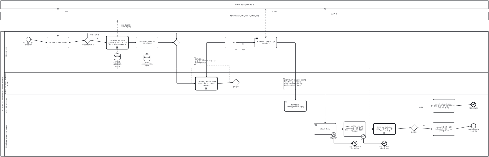

<details><summary>BPMN 2.0 XML 소스 보기 (`diagrams/bpmn_p3_release.bpmn` 과 동일 — Camunda Modeler · bpmn.io 에서 열림)</summary>

```xml
<?xml version="1.0" encoding="UTF-8"?>
<bpmn:definitions xmlns:bpmn="http://www.omg.org/spec/BPMN/20100524/MODEL" xmlns:bpmndi="http://www.omg.org/spec/BPMN/20100524/DI" xmlns:dc="http://www.omg.org/spec/DD/20100524/DC" xmlns:di="http://www.omg.org/spec/DD/20100524/DI" id="Definitions_bpmn_p3_release" name="P3 모델 변경·검증·배포 프로세스 (UC11 · UC12 · UC13)" targetNamespace="https://p4.sumzip.com/bpmn" exporter="bpmn_gen.py" exporterVersion="1.0">
  <bpmn:collaboration id="Collab_bpmn_p3_release">
    <bpmn:participant id="Pool_bpmn_p3_release" name="LoL 인게임 시점별 승패 예측·핵심 승리요인 분석 서비스" processRef="Process_bpmn_p3_release" />
    <bpmn:participant id="BB_github" name="GitHub 저장소 (team 브랜치)" />
    <bpmn:participant id="BB_maria" name="팀 MariaDB (v_diff13_train · v_diff13_test)" />
    <bpmn:messageFlow id="Msg_bpmn_p3_release_0" sourceRef="BB_github" targetRef="pull" name="fetch" />
    <bpmn:messageFlow id="Msg_bpmn_p3_release_1" sourceRef="uc11" targetRef="BB_maria" name="SQL 뷰 (없으면 CSV 폴백 [추론])" />
    <bpmn:messageFlow id="Msg_bpmn_p3_release_2" sourceRef="push" targetRef="BB_github" name="git push" />
    <bpmn:messageFlow id="Msg_bpmn_p3_release_3" sourceRef="BB_github" targetRef="gpull" name="team 최신" />
  </bpmn:collaboration>
  <bpmn:process id="Process_bpmn_p3_release" name="P3 모델 변경·검증·배포 프로세스 (UC11 · UC12 · UC13)" isExecutable="false">
    <bpmn:laneSet id="LaneSet_bpmn_p3_release">
      <bpmn:lane id="Lane_bpmn_p3_release_0" name="팀원(분석·개발)">
        <bpmn:flowNodeRef>s</bpmn:flowNodeRef>
        <bpmn:flowNodeRef>pull</bpmn:flowNodeRef>
        <bpmn:flowNodeRef>g_model</bpmn:flowNodeRef>
        <bpmn:flowNodeRef>uc11</bpmn:flowNodeRef>
        <bpmn:flowNodeRef>golden</bpmn:flowNodeRef>
        <bpmn:flowNodeRef>g_m1</bpmn:flowNodeRef>
        <bpmn:flowNodeRef>fix</bpmn:flowNodeRef>
        <bpmn:flowNodeRef>push</bpmn:flowNodeRef>
      </bpmn:lane>
      <bpmn:lane id="Lane_bpmn_p3_release_1" name="팀원 PC 검사 (check_project.sh verify)">
        <bpmn:flowNodeRef>uc12</bpmn:flowNodeRef>
        <bpmn:flowNodeRef>g_ok</bpmn:flowNodeRef>
      </bpmn:lane>
      <bpmn:lane id="Lane_bpmn_p3_release_2" name="서비스 담당(배포·운영)">
        <bpmn:flowNodeRef>deploy</bpmn:flowNodeRef>
        <bpmn:flowNodeRef>logs</bpmn:flowNodeRef>
        <bpmn:flowNodeRef>e_fail</bpmn:flowNodeRef>
      </bpmn:lane>
      <bpmn:lane id="Lane_bpmn_p3_release_3" name="팀 서버 (check_project.sh deploy)">
        <bpmn:flowNodeRef>gpull</bpmn:flowNodeRef>
        <bpmn:flowNodeRef>b1</bpmn:flowNodeRef>
        <bpmn:flowNodeRef>e1</bpmn:flowNodeRef>
        <bpmn:flowNodeRef>restart</bpmn:flowNodeRef>
        <bpmn:flowNodeRef>b2</bpmn:flowNodeRef>
        <bpmn:flowNodeRef>e2</bpmn:flowNodeRef>
        <bpmn:flowNodeRef>test</bpmn:flowNodeRef>
        <bpmn:flowNodeRef>g_test</bpmn:flowNodeRef>
        <bpmn:flowNodeRef>status</bpmn:flowNodeRef>
        <bpmn:flowNodeRef>e_done</bpmn:flowNodeRef>
      </bpmn:lane>
    </bpmn:laneSet>
    <bpmn:startEvent id="s" name="피처 · 모델 · 문서 · 웹 변경 필요">
      <bpmn:outgoing>Flow_bpmn_p3_release_0</bpmn:outgoing>
    </bpmn:startEvent>
    <bpmn:task id="pull" name="git checkout team · git pull">
      <bpmn:incoming>Flow_bpmn_p3_release_0</bpmn:incoming>
      <bpmn:outgoing>Flow_bpmn_p3_release_1</bpmn:outgoing>
    </bpmn:task>
    <bpmn:exclusiveGateway id="g_model" name="피처·모델을 바꾸나?">
      <bpmn:incoming>Flow_bpmn_p3_release_1</bpmn:incoming>
      <bpmn:outgoing>Flow_bpmn_p3_release_2</bpmn:outgoing>
      <bpmn:outgoing>Flow_bpmn_p3_release_5</bpmn:outgoing>
    </bpmn:exclusiveGateway>
    <bpmn:callActivity id="uc11" name="UC11 모델 재현·재학습 (features.py 정본 → SQL 뷰 대조 → finalize_model.py)">
      <bpmn:incoming>Flow_bpmn_p3_release_2</bpmn:incoming>
      <bpmn:outgoing>Flow_bpmn_p3_release_3</bpmn:outgoing>
      <bpmn:dataOutputAssociation id="DOA_uc11_ds_art"><bpmn:targetRef>ds_art</bpmn:targetRef></bpmn:dataOutputAssociation>
    </bpmn:callActivity>
    <bpmn:dataStoreReference id="ds_art" name="artifacts/ model.joblib · schema.json · runs.csv" />
    <bpmn:task id="golden" name="tests/make_golden.py 정답지 재생성">
      <bpmn:incoming>Flow_bpmn_p3_release_3</bpmn:incoming>
      <bpmn:outgoing>Flow_bpmn_p3_release_4</bpmn:outgoing>
      <bpmn:dataOutputAssociation id="DOA_golden_ds_gold"><bpmn:targetRef>ds_gold</bpmn:targetRef></bpmn:dataOutputAssociation>
    </bpmn:task>
    <bpmn:dataStoreReference id="ds_gold" name="tests/ golden_predictions.json" />
    <bpmn:exclusiveGateway id="g_m1">
      <bpmn:incoming>Flow_bpmn_p3_release_4</bpmn:incoming>
      <bpmn:incoming>Flow_bpmn_p3_release_5</bpmn:incoming>
      <bpmn:outgoing>Flow_bpmn_p3_release_6</bpmn:outgoing>
    </bpmn:exclusiveGateway>
    <bpmn:callActivity id="uc12" name="UC12 verify: 골든 50 · 계약 9 · 코칭 · 화면 JS · 재현성 · factcheck">
      <bpmn:incoming>Flow_bpmn_p3_release_6</bpmn:incoming>
      <bpmn:incoming>Flow_bpmn_p3_release_9</bpmn:incoming>
      <bpmn:outgoing>Flow_bpmn_p3_release_7</bpmn:outgoing>
      <bpmn:dataInputAssociation id="DIA_ds_gold_uc12"><bpmn:sourceRef>ds_gold</bpmn:sourceRef></bpmn:dataInputAssociation>
      <bpmn:dataInputAssociation id="DIA_ds_art_uc12"><bpmn:sourceRef>ds_art</bpmn:sourceRef></bpmn:dataInputAssociation>
    </bpmn:callActivity>
    <bpmn:exclusiveGateway id="g_ok" name="전부 통과?">
      <bpmn:incoming>Flow_bpmn_p3_release_7</bpmn:incoming>
      <bpmn:outgoing>Flow_bpmn_p3_release_8</bpmn:outgoing>
      <bpmn:outgoing>Flow_bpmn_p3_release_10</bpmn:outgoing>
    </bpmn:exclusiveGateway>
    <bpmn:task id="fix" name="원인 수정">
      <bpmn:incoming>Flow_bpmn_p3_release_8</bpmn:incoming>
      <bpmn:outgoing>Flow_bpmn_p3_release_9</bpmn:outgoing>
    </bpmn:task>
    <bpmn:sendTask id="push" name="git commit → git pull → git push (team)">
      <bpmn:incoming>Flow_bpmn_p3_release_10</bpmn:incoming>
      <bpmn:outgoing>Flow_bpmn_p3_release_11</bpmn:outgoing>
    </bpmn:sendTask>
    <bpmn:userTask id="deploy" name="팀 서버 접속 · ./check_project.sh deploy">
      <bpmn:incoming>Flow_bpmn_p3_release_11</bpmn:incoming>
      <bpmn:outgoing>Flow_bpmn_p3_release_12</bpmn:outgoing>
    </bpmn:userTask>
    <bpmn:serviceTask id="gpull" name="git pull --ff-only">
      <bpmn:incoming>Flow_bpmn_p3_release_12</bpmn:incoming>
      <bpmn:outgoing>Flow_bpmn_p3_release_14</bpmn:outgoing>
    </bpmn:serviceTask>
    <bpmn:boundaryEvent id="b1" name="E1 pull 실패" attachedToRef="gpull" cancelActivity="true">
      <bpmn:outgoing>Flow_bpmn_p3_release_13</bpmn:outgoing>
      <bpmn:errorEventDefinition id="EvDef_b1" />
    </bpmn:boundaryEvent>
    <bpmn:endEvent id="e1" name="중단 — 재시작으로 넘어가지 않음">
      <bpmn:incoming>Flow_bpmn_p3_release_13</bpmn:incoming>
      <bpmn:errorEventDefinition id="EvDef_e1" />
    </bpmn:endEvent>
    <bpmn:task id="restart" name="restart: pid 종료 · 포트 정리 · model.joblib · 의존성 확인 · 9524 → /api/health · 9504 → /healthz">
      <bpmn:incoming>Flow_bpmn_p3_release_14</bpmn:incoming>
      <bpmn:outgoing>Flow_bpmn_p3_release_16</bpmn:outgoing>
    </bpmn:task>
    <bpmn:boundaryEvent id="b2" name="E2~E5" attachedToRef="restart" cancelActivity="true">
      <bpmn:outgoing>Flow_bpmn_p3_release_15</bpmn:outgoing>
      <bpmn:errorEventDefinition id="EvDef_b2" />
    </bpmn:boundaryEvent>
    <bpmn:endEvent id="e2" name="중단 — 점유 pid · venv311 안내">
      <bpmn:incoming>Flow_bpmn_p3_release_15</bpmn:incoming>
      <bpmn:errorEventDefinition id="EvDef_e2" />
    </bpmn:endEvent>
    <bpmn:callActivity id="test" name="UC12 test «include»: verify + 서빙 파리티 6건 + API 스모크 11건">
      <bpmn:incoming>Flow_bpmn_p3_release_16</bpmn:incoming>
      <bpmn:outgoing>Flow_bpmn_p3_release_17</bpmn:outgoing>
      <bpmn:dataInputAssociation id="DIA_ds_gold_test"><bpmn:sourceRef>ds_gold</bpmn:sourceRef></bpmn:dataInputAssociation>
    </bpmn:callActivity>
    <bpmn:exclusiveGateway id="g_test" name="전부 통과?">
      <bpmn:incoming>Flow_bpmn_p3_release_17</bpmn:incoming>
      <bpmn:outgoing>Flow_bpmn_p3_release_18</bpmn:outgoing>
      <bpmn:outgoing>Flow_bpmn_p3_release_20</bpmn:outgoing>
    </bpmn:exclusiveGateway>
    <bpmn:task id="logs" name="./check_project.sh logs → 원인 · 팀원에게 회귀 (predict.py 변경 여부 git log)">
      <bpmn:incoming>Flow_bpmn_p3_release_18</bpmn:incoming>
      <bpmn:outgoing>Flow_bpmn_p3_release_19</bpmn:outgoing>
    </bpmn:task>
    <bpmn:endEvent id="e_fail" name="배포 실패 (E6)">
      <bpmn:incoming>Flow_bpmn_p3_release_19</bpmn:incoming>
      <bpmn:errorEventDefinition id="EvDef_e_fail" />
    </bpmn:endEvent>
    <bpmn:task id="status" name="status 세 줄 초록 · 로컬 index.html 바이트 == curl 바이트 (E7 · E8)">
      <bpmn:incoming>Flow_bpmn_p3_release_20</bpmn:incoming>
      <bpmn:outgoing>Flow_bpmn_p3_release_21</bpmn:outgoing>
    </bpmn:task>
    <bpmn:endEvent id="e_done" name="배포 완료 — 공개 주소에 반영">
      <bpmn:incoming>Flow_bpmn_p3_release_21</bpmn:incoming>
    </bpmn:endEvent>
    <bpmn:textAnnotation id="n_gate"><bpmn:text>검증(UC12)이 두 번 선다. 팀원 PC 의 verify 와 팀 서버의 test. 둘째는 서버가 떠 있어야 도는 파리티·스모크가 추가된다</bpmn:text></bpmn:textAnnotation>
    <bpmn:textAnnotation id="n_rule"><bpmn:text>CLAUDE.md: 골든·계약·factcheck 가 하나라도 실패하면 커밋 금지</bpmn:text></bpmn:textAnnotation>
    <bpmn:sequenceFlow id="Flow_bpmn_p3_release_0" sourceRef="s" targetRef="pull" />
    <bpmn:sequenceFlow id="Flow_bpmn_p3_release_1" sourceRef="pull" targetRef="g_model" />
    <bpmn:sequenceFlow id="Flow_bpmn_p3_release_2" sourceRef="g_model" targetRef="uc11" name="예" />
    <bpmn:sequenceFlow id="Flow_bpmn_p3_release_3" sourceRef="uc11" targetRef="golden" />
    <bpmn:sequenceFlow id="Flow_bpmn_p3_release_4" sourceRef="golden" targetRef="g_m1" />
    <bpmn:sequenceFlow id="Flow_bpmn_p3_release_5" sourceRef="g_model" targetRef="g_m1" name="아니오: 문서·웹" />
    <bpmn:sequenceFlow id="Flow_bpmn_p3_release_6" sourceRef="g_m1" targetRef="uc12" />
    <bpmn:sequenceFlow id="Flow_bpmn_p3_release_7" sourceRef="uc12" targetRef="g_ok" />
    <bpmn:sequenceFlow id="Flow_bpmn_p3_release_8" sourceRef="g_ok" targetRef="fix" name="아니오" />
    <bpmn:sequenceFlow id="Flow_bpmn_p3_release_9" sourceRef="fix" targetRef="uc12" />
    <bpmn:sequenceFlow id="Flow_bpmn_p3_release_10" sourceRef="g_ok" targetRef="push" name="예" />
    <bpmn:sequenceFlow id="Flow_bpmn_p3_release_11" sourceRef="push" targetRef="deploy" />
    <bpmn:sequenceFlow id="Flow_bpmn_p3_release_12" sourceRef="deploy" targetRef="gpull" />
    <bpmn:sequenceFlow id="Flow_bpmn_p3_release_13" sourceRef="b1" targetRef="e1" />
    <bpmn:sequenceFlow id="Flow_bpmn_p3_release_14" sourceRef="gpull" targetRef="restart" />
    <bpmn:sequenceFlow id="Flow_bpmn_p3_release_15" sourceRef="b2" targetRef="e2" />
    <bpmn:sequenceFlow id="Flow_bpmn_p3_release_16" sourceRef="restart" targetRef="test" />
    <bpmn:sequenceFlow id="Flow_bpmn_p3_release_17" sourceRef="test" targetRef="g_test" />
    <bpmn:sequenceFlow id="Flow_bpmn_p3_release_18" sourceRef="g_test" targetRef="logs" name="아니오" />
    <bpmn:sequenceFlow id="Flow_bpmn_p3_release_19" sourceRef="logs" targetRef="e_fail" />
    <bpmn:sequenceFlow id="Flow_bpmn_p3_release_20" sourceRef="g_test" targetRef="status" name="예" />
    <bpmn:sequenceFlow id="Flow_bpmn_p3_release_21" sourceRef="status" targetRef="e_done" />
    <bpmn:association id="Assoc_bpmn_p3_release_5" sourceRef="n_gate" targetRef="test" />
    <bpmn:association id="Assoc_bpmn_p3_release_6" sourceRef="n_rule" targetRef="g_ok" />
  </bpmn:process>
  <bpmndi:BPMNDiagram id="Diagram_bpmn_p3_release">
    <bpmndi:BPMNPlane id="Plane_bpmn_p3_release" bpmnElement="Collab_bpmn_p3_release">
      <bpmndi:BPMNShape id="Pool_bpmn_p3_release_di" bpmnElement="Pool_bpmn_p3_release" isHorizontal="true"><dc:Bounds x="40" y="262" width="3812" height="980.5" /></bpmndi:BPMNShape>
      <bpmndi:BPMNShape id="Lane_bpmn_p3_release_0_di" bpmnElement="Lane_bpmn_p3_release_0" isHorizontal="true"><dc:Bounds x="70" y="262" width="3782" height="322.5" /></bpmndi:BPMNShape>
      <bpmndi:BPMNShape id="Lane_bpmn_p3_release_1_di" bpmnElement="Lane_bpmn_p3_release_1" isHorizontal="true"><dc:Bounds x="70" y="584.5" width="3782" height="174.5" /></bpmndi:BPMNShape>
      <bpmndi:BPMNShape id="Lane_bpmn_p3_release_2_di" bpmnElement="Lane_bpmn_p3_release_2" isHorizontal="true"><dc:Bounds x="70" y="759.0" width="3782" height="174.5" /></bpmndi:BPMNShape>
      <bpmndi:BPMNShape id="Lane_bpmn_p3_release_3_di" bpmnElement="Lane_bpmn_p3_release_3" isHorizontal="true"><dc:Bounds x="70" y="933.5" width="3782" height="309.0" /></bpmndi:BPMNShape>
      <bpmndi:BPMNShape id="BB_github_di" bpmnElement="BB_github" isHorizontal="true"><dc:Bounds x="40" y="20" width="3812" height="64" /></bpmndi:BPMNShape>
      <bpmndi:BPMNShape id="BB_maria_di" bpmnElement="BB_maria" isHorizontal="true"><dc:Bounds x="40" y="108" width="3812" height="64" /></bpmndi:BPMNShape>
      <bpmndi:BPMNShape id="s_di" bpmnElement="s"><dc:Bounds x="238" y="307" width="36" height="36" />
        <bpmndi:BPMNLabel><dc:Bounds x="196" y="347" width="120" height="28" /></bpmndi:BPMNLabel>
      </bpmndi:BPMNShape>
      <bpmndi:BPMNShape id="pull_di" bpmnElement="pull"><dc:Bounds x="402" y="305" width="172" height="88" />
      </bpmndi:BPMNShape>
      <bpmndi:BPMNShape id="g_model_di" bpmnElement="g_model"><dc:Bounds x="695" y="307" width="50" height="50" />
        <bpmndi:BPMNLabel><dc:Bounds x="660" y="361" width="120" height="28" /></bpmndi:BPMNLabel>
      </bpmndi:BPMNShape>
      <bpmndi:BPMNShape id="uc11_di" bpmnElement="uc11"><dc:Bounds x="866" y="298" width="172" height="102.5" />
      </bpmndi:BPMNShape>
      <bpmndi:BPMNShape id="ds_art_di" bpmnElement="ds_art"><dc:Bounds x="927" y="436" width="50" height="50" />
        <bpmndi:BPMNLabel><dc:Bounds x="892" y="490" width="120" height="28" /></bpmndi:BPMNLabel>
      </bpmndi:BPMNShape>
      <bpmndi:BPMNShape id="golden_di" bpmnElement="golden"><dc:Bounds x="1098" y="305" width="172" height="88" />
      </bpmndi:BPMNShape>
      <bpmndi:BPMNShape id="ds_gold_di" bpmnElement="ds_gold"><dc:Bounds x="1159" y="444" width="50" height="50" />
        <bpmndi:BPMNLabel><dc:Bounds x="1124" y="498" width="120" height="28" /></bpmndi:BPMNLabel>
      </bpmndi:BPMNShape>
      <bpmndi:BPMNShape id="g_m1_di" bpmnElement="g_m1"><dc:Bounds x="1391" y="324" width="50" height="50" />
      </bpmndi:BPMNShape>
      <bpmndi:BPMNShape id="uc12_di" bpmnElement="uc12"><dc:Bounds x="1562" y="620" width="172" height="102.5" />
      </bpmndi:BPMNShape>
      <bpmndi:BPMNShape id="g_ok_di" bpmnElement="g_ok"><dc:Bounds x="1855" y="637" width="50" height="50" />
        <bpmndi:BPMNLabel><dc:Bounds x="1820" y="691" width="120" height="28" /></bpmndi:BPMNLabel>
      </bpmndi:BPMNShape>
      <bpmndi:BPMNShape id="fix_di" bpmnElement="fix"><dc:Bounds x="1794" y="305" width="172" height="88" />
      </bpmndi:BPMNShape>
      <bpmndi:BPMNShape id="push_di" bpmnElement="push"><dc:Bounds x="2026" y="305" width="172" height="88" />
      </bpmndi:BPMNShape>
      <bpmndi:BPMNShape id="deploy_di" bpmnElement="deploy"><dc:Bounds x="2258" y="802" width="172" height="88" />
      </bpmndi:BPMNShape>
      <bpmndi:BPMNShape id="gpull_di" bpmnElement="gpull"><dc:Bounds x="2490" y="984" width="172" height="88" />
      </bpmndi:BPMNShape>
      <bpmndi:BPMNShape id="b1_di" bpmnElement="b1"><dc:Bounds x="2626" y="1054" width="36" height="36" />
        <bpmndi:BPMNLabel><dc:Bounds x="2602" y="1092" width="84" height="28" /></bpmndi:BPMNLabel>
      </bpmndi:BPMNShape>
      <bpmndi:BPMNShape id="e1_di" bpmnElement="e1"><dc:Bounds x="2790" y="1122" width="36" height="36" />
        <bpmndi:BPMNLabel><dc:Bounds x="2748" y="1162" width="120" height="28" /></bpmndi:BPMNLabel>
      </bpmndi:BPMNShape>
      <bpmndi:BPMNShape id="restart_di" bpmnElement="restart"><dc:Bounds x="2722" y="970" width="172" height="117.0" />
      </bpmndi:BPMNShape>
      <bpmndi:BPMNShape id="b2_di" bpmnElement="b2"><dc:Bounds x="2858" y="1068" width="36" height="36" />
        <bpmndi:BPMNLabel><dc:Bounds x="2834" y="1106" width="84" height="28" /></bpmndi:BPMNLabel>
      </bpmndi:BPMNShape>
      <bpmndi:BPMNShape id="e2_di" bpmnElement="e2"><dc:Bounds x="3022" y="1122" width="36" height="36" />
        <bpmndi:BPMNLabel><dc:Bounds x="2980" y="1162" width="120" height="28" /></bpmndi:BPMNLabel>
      </bpmndi:BPMNShape>
      <bpmndi:BPMNShape id="test_di" bpmnElement="test"><dc:Bounds x="2954" y="984" width="172" height="88" />
      </bpmndi:BPMNShape>
      <bpmndi:BPMNShape id="g_test_di" bpmnElement="g_test"><dc:Bounds x="3247" y="993" width="50" height="50" />
        <bpmndi:BPMNLabel><dc:Bounds x="3212" y="1047" width="120" height="28" /></bpmndi:BPMNLabel>
      </bpmndi:BPMNShape>
      <bpmndi:BPMNShape id="logs_di" bpmnElement="logs"><dc:Bounds x="3418" y="795" width="172" height="102.5" />
      </bpmndi:BPMNShape>
      <bpmndi:BPMNShape id="e_fail_di" bpmnElement="e_fail"><dc:Bounds x="3718" y="818" width="36" height="36" />
        <bpmndi:BPMNLabel><dc:Bounds x="3676" y="858" width="120" height="28" /></bpmndi:BPMNLabel>
      </bpmndi:BPMNShape>
      <bpmndi:BPMNShape id="status_di" bpmnElement="status"><dc:Bounds x="3418" y="977" width="172" height="102.5" />
      </bpmndi:BPMNShape>
      <bpmndi:BPMNShape id="e_done_di" bpmnElement="e_done"><dc:Bounds x="3718" y="986" width="36" height="36" />
        <bpmndi:BPMNLabel><dc:Bounds x="3676" y="1026" width="120" height="28" /></bpmndi:BPMNLabel>
      </bpmndi:BPMNShape>
      <bpmndi:BPMNShape id="n_gate_di" bpmnElement="n_gate"><dc:Bounds x="2249" y="630" width="190" height="84.5" />
      </bpmndi:BPMNShape>
      <bpmndi:BPMNShape id="n_rule_di" bpmnElement="n_rule"><dc:Bounds x="1553" y="465" width="190" height="55.5" />
      </bpmndi:BPMNShape>
      <bpmndi:BPMNEdge id="Flow_bpmn_p3_release_0_di" bpmnElement="Flow_bpmn_p3_release_0">
        <di:waypoint x="274" y="325" />
        <di:waypoint x="402" y="349" />
      </bpmndi:BPMNEdge>
      <bpmndi:BPMNEdge id="Flow_bpmn_p3_release_1_di" bpmnElement="Flow_bpmn_p3_release_1">
        <di:waypoint x="574" y="349" />
        <di:waypoint x="695" y="332" />
      </bpmndi:BPMNEdge>
      <bpmndi:BPMNEdge id="Flow_bpmn_p3_release_2_di" bpmnElement="Flow_bpmn_p3_release_2">
        <di:waypoint x="745" y="332" />
        <di:waypoint x="866" y="349" />
        <bpmndi:BPMNLabel><dc:Bounds x="751" y="310" width="90" height="18" /></bpmndi:BPMNLabel>
      </bpmndi:BPMNEdge>
      <bpmndi:BPMNEdge id="Flow_bpmn_p3_release_3_di" bpmnElement="Flow_bpmn_p3_release_3">
        <di:waypoint x="1038" y="349" />
        <di:waypoint x="1098" y="349" />
      </bpmndi:BPMNEdge>
      <bpmndi:BPMNEdge id="Flow_bpmn_p3_release_4_di" bpmnElement="Flow_bpmn_p3_release_4">
        <di:waypoint x="1270" y="349" />
        <di:waypoint x="1391" y="349" />
      </bpmndi:BPMNEdge>
      <bpmndi:BPMNEdge id="Flow_bpmn_p3_release_5_di" bpmnElement="Flow_bpmn_p3_release_5">
        <di:waypoint x="720" y="307" />
        <di:waypoint x="720" y="274" />
        <di:waypoint x="1416" y="274" />
        <di:waypoint x="1416" y="324" />
        <bpmndi:BPMNLabel><dc:Bounds x="728" y="282" width="90" height="18" /></bpmndi:BPMNLabel>
      </bpmndi:BPMNEdge>
      <bpmndi:BPMNEdge id="Flow_bpmn_p3_release_6_di" bpmnElement="Flow_bpmn_p3_release_6">
        <di:waypoint x="1416" y="374" />
        <di:waypoint x="1416" y="672" />
        <di:waypoint x="1562" y="672" />
      </bpmndi:BPMNEdge>
      <bpmndi:BPMNEdge id="Flow_bpmn_p3_release_7_di" bpmnElement="Flow_bpmn_p3_release_7">
        <di:waypoint x="1734" y="672" />
        <di:waypoint x="1855" y="662" />
      </bpmndi:BPMNEdge>
      <bpmndi:BPMNEdge id="Flow_bpmn_p3_release_8_di" bpmnElement="Flow_bpmn_p3_release_8">
        <di:waypoint x="1880" y="637" />
        <di:waypoint x="1880" y="393" />
        <bpmndi:BPMNLabel><dc:Bounds x="1888" y="399" width="90" height="18" /></bpmndi:BPMNLabel>
      </bpmndi:BPMNEdge>
      <bpmndi:BPMNEdge id="Flow_bpmn_p3_release_9_di" bpmnElement="Flow_bpmn_p3_release_9">
        <di:waypoint x="1794" y="349" />
        <di:waypoint x="1648" y="349" />
        <di:waypoint x="1648" y="620" />
      </bpmndi:BPMNEdge>
      <bpmndi:BPMNEdge id="Flow_bpmn_p3_release_10_di" bpmnElement="Flow_bpmn_p3_release_10">
        <di:waypoint x="1880" y="637" />
        <di:waypoint x="1880" y="349" />
        <di:waypoint x="2026" y="349" />
        <bpmndi:BPMNLabel><dc:Bounds x="1888" y="355" width="90" height="18" /></bpmndi:BPMNLabel>
      </bpmndi:BPMNEdge>
      <bpmndi:BPMNEdge id="Flow_bpmn_p3_release_11_di" bpmnElement="Flow_bpmn_p3_release_11">
        <di:waypoint x="2198" y="349" />
        <di:waypoint x="2344" y="349" />
        <di:waypoint x="2344" y="802" />
      </bpmndi:BPMNEdge>
      <bpmndi:BPMNEdge id="Flow_bpmn_p3_release_12_di" bpmnElement="Flow_bpmn_p3_release_12">
        <di:waypoint x="2430" y="846" />
        <di:waypoint x="2576" y="846" />
        <di:waypoint x="2576" y="984" />
      </bpmndi:BPMNEdge>
      <bpmndi:BPMNEdge id="Flow_bpmn_p3_release_13_di" bpmnElement="Flow_bpmn_p3_release_13">
        <di:waypoint x="2644" y="1090" />
        <di:waypoint x="2644" y="1140" />
        <di:waypoint x="2790" y="1140" />
      </bpmndi:BPMNEdge>
      <bpmndi:BPMNEdge id="Flow_bpmn_p3_release_14_di" bpmnElement="Flow_bpmn_p3_release_14">
        <di:waypoint x="2662" y="1028" />
        <di:waypoint x="2722" y="1028" />
      </bpmndi:BPMNEdge>
      <bpmndi:BPMNEdge id="Flow_bpmn_p3_release_15_di" bpmnElement="Flow_bpmn_p3_release_15">
        <di:waypoint x="2876" y="1104" />
        <di:waypoint x="2876" y="1140" />
        <di:waypoint x="3022" y="1140" />
      </bpmndi:BPMNEdge>
      <bpmndi:BPMNEdge id="Flow_bpmn_p3_release_16_di" bpmnElement="Flow_bpmn_p3_release_16">
        <di:waypoint x="2894" y="1028" />
        <di:waypoint x="2954" y="1028" />
      </bpmndi:BPMNEdge>
      <bpmndi:BPMNEdge id="Flow_bpmn_p3_release_17_di" bpmnElement="Flow_bpmn_p3_release_17">
        <di:waypoint x="3126" y="1028" />
        <di:waypoint x="3247" y="1018" />
      </bpmndi:BPMNEdge>
      <bpmndi:BPMNEdge id="Flow_bpmn_p3_release_18_di" bpmnElement="Flow_bpmn_p3_release_18">
        <di:waypoint x="3272" y="993" />
        <di:waypoint x="3272" y="846" />
        <di:waypoint x="3418" y="846" />
        <bpmndi:BPMNLabel><dc:Bounds x="3280" y="852" width="90" height="18" /></bpmndi:BPMNLabel>
      </bpmndi:BPMNEdge>
      <bpmndi:BPMNEdge id="Flow_bpmn_p3_release_19_di" bpmnElement="Flow_bpmn_p3_release_19">
        <di:waypoint x="3590" y="846" />
        <di:waypoint x="3718" y="836" />
      </bpmndi:BPMNEdge>
      <bpmndi:BPMNEdge id="Flow_bpmn_p3_release_20_di" bpmnElement="Flow_bpmn_p3_release_20">
        <di:waypoint x="3297" y="1018" />
        <di:waypoint x="3418" y="1028" />
        <bpmndi:BPMNLabel><dc:Bounds x="3303" y="996" width="90" height="18" /></bpmndi:BPMNLabel>
      </bpmndi:BPMNEdge>
      <bpmndi:BPMNEdge id="Flow_bpmn_p3_release_21_di" bpmnElement="Flow_bpmn_p3_release_21">
        <di:waypoint x="3590" y="1028" />
        <di:waypoint x="3718" y="1004" />
      </bpmndi:BPMNEdge>
      <bpmndi:BPMNEdge id="Msg_bpmn_p3_release_0_di" bpmnElement="Msg_bpmn_p3_release_0">
        <di:waypoint x="488" y="84" />
        <di:waypoint x="488" y="305" />
        <bpmndi:BPMNLabel><dc:Bounds x="494" y="100" width="120" height="18" /></bpmndi:BPMNLabel>
      </bpmndi:BPMNEdge>
      <bpmndi:BPMNEdge id="Msg_bpmn_p3_release_1_di" bpmnElement="Msg_bpmn_p3_release_1">
        <di:waypoint x="952" y="298" />
        <di:waypoint x="952" y="172" />
        <bpmndi:BPMNLabel><dc:Bounds x="958" y="206" width="120" height="18" /></bpmndi:BPMNLabel>
      </bpmndi:BPMNEdge>
      <bpmndi:BPMNEdge id="Msg_bpmn_p3_release_2_di" bpmnElement="Msg_bpmn_p3_release_2">
        <di:waypoint x="2112" y="305" />
        <di:waypoint x="2112" y="84" />
        <bpmndi:BPMNLabel><dc:Bounds x="2118" y="100" width="120" height="18" /></bpmndi:BPMNLabel>
      </bpmndi:BPMNEdge>
      <bpmndi:BPMNEdge id="Msg_bpmn_p3_release_3_di" bpmnElement="Msg_bpmn_p3_release_3">
        <di:waypoint x="2576" y="84" />
        <di:waypoint x="2576" y="984" />
        <bpmndi:BPMNLabel><dc:Bounds x="2582" y="118" width="120" height="18" /></bpmndi:BPMNLabel>
      </bpmndi:BPMNEdge>
      <bpmndi:BPMNEdge id="DOA_uc11_ds_art_di" bpmnElement="DOA_uc11_ds_art">
        <di:waypoint x="952" y="400" />
        <di:waypoint x="952" y="436" />
      </bpmndi:BPMNEdge>
      <bpmndi:BPMNEdge id="DOA_golden_ds_gold_di" bpmnElement="DOA_golden_ds_gold">
        <di:waypoint x="1184" y="393" />
        <di:waypoint x="1184" y="444" />
      </bpmndi:BPMNEdge>
      <bpmndi:BPMNEdge id="DIA_ds_gold_uc12_di" bpmnElement="DIA_ds_gold_uc12">
        <di:waypoint x="1184" y="494" />
        <di:waypoint x="1184" y="550" />
        <di:waypoint x="1534" y="550" />
        <di:waypoint x="1534" y="672" />
        <di:waypoint x="1562" y="672" />
      </bpmndi:BPMNEdge>
      <bpmndi:BPMNEdge id="DIA_ds_art_uc12_di" bpmnElement="DIA_ds_art_uc12">
        <di:waypoint x="952" y="486" />
        <di:waypoint x="952" y="556" />
        <di:waypoint x="1534" y="556" />
        <di:waypoint x="1534" y="672" />
        <di:waypoint x="1562" y="672" />
      </bpmndi:BPMNEdge>
      <bpmndi:BPMNEdge id="DIA_ds_gold_test_di" bpmnElement="DIA_ds_gold_test">
        <di:waypoint x="1184" y="494" />
        <di:waypoint x="1184" y="550" />
        <di:waypoint x="2926" y="550" />
        <di:waypoint x="2926" y="1028" />
        <di:waypoint x="2954" y="1028" />
      </bpmndi:BPMNEdge>
      <bpmndi:BPMNEdge id="Assoc_bpmn_p3_release_5_di" bpmnElement="Assoc_bpmn_p3_release_5">
        <di:waypoint x="2344" y="714" />
        <di:waypoint x="2344" y="722" />
        <di:waypoint x="2926" y="722" />
        <di:waypoint x="2926" y="1028" />
        <di:waypoint x="2954" y="1028" />
      </bpmndi:BPMNEdge>
      <bpmndi:BPMNEdge id="Assoc_bpmn_p3_release_6_di" bpmnElement="Assoc_bpmn_p3_release_6">
        <di:waypoint x="1648" y="520" />
        <di:waypoint x="1648" y="528" />
        <di:waypoint x="1827" y="528" />
        <di:waypoint x="1827" y="662" />
        <di:waypoint x="1855" y="662" />
      </bpmndi:BPMNEdge>
    </bpmndi:BPMNPlane>
  </bpmndi:BPMNDiagram>
</bpmn:definitions>
```

</details>


| 구간 | 대응 UC | 관문 (통과 못 하면) | BPMN 요소 |
|---|:--:|---|---|
| 재학습 → 정답지 재생성 | UC11 | 복원 assert 실패 시 산출물 무효 (E4) | 배타 게이트웨이 "피처·모델을 바꾸나?" · 호출 활동 · 저장소 `artifacts/` · `tests/golden_predictions.json` · MariaDB 메시지 |
| verify | UC12 | 골든·계약·코칭·JS·재현성·factcheck 중 하나라도 실패 시 커밋 금지 | 호출 활동 · 배타 게이트웨이 "전부 통과?" → "원인 수정" 반복 |
| push → deploy | UC13 | `git pull --ff-only` 실패 시 재시작으로 넘어가지 않음 (E1) | Send Task push · 메시지 흐름 pull · 오류 경계 E1 |
| restart | UC13 | model.joblib · 의존성 · 포트 (E2~E5) | 오류 경계 E2~E5 |
| test (서버 위) | UC12 «include» | 파리티 6건 · 스모크 11건 실패 시 logs → 회귀 (E6) | 호출 활동 · 배타 게이트웨이 "전부 통과?" · 오류 종료 |
| 배포 확인 | UC13 | status 세 줄 초록 + 바이트 비교 (E7·E8) | 활동 → 정상 종료 "배포 완료" |

### 3.4 P4 일일 운영 루틴 (UC14 · UC13 · UC9 · UC10)

`docs/deploy.md` 의 "매일 / 누가 push 한 뒤 / 발표 당일" 절을 하나의 하루로 이어 붙였다. **타이머 시작 이벤트(매일 아침)** 가 첫 일이고, 첫 일은 열쇠다. 개발자 포털(위 풀)에서 키를 받아 `.env` 저장소에 쓰고, 서버가 기동하며 Riot API(아래 풀)에 실제로 물어본 결과가 `RIOT_READY` 를 가른다. false 면 화면 레인의 "검색 비활성" 활동에서 키 재발급으로 **되돌아가는 순서 흐름**(E3)이 있다.

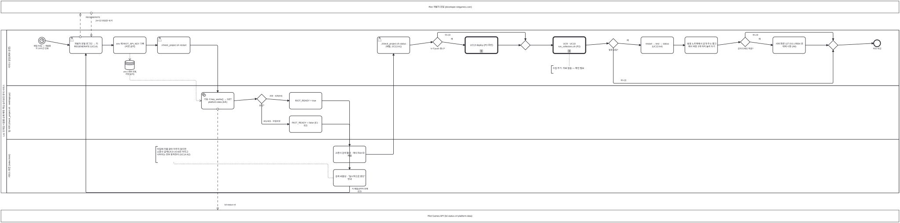

<details><summary>BPMN 2.0 XML 소스 보기 (`diagrams/bpmn_p4_daily.bpmn` 과 동일 — Camunda Modeler · bpmn.io 에서 열림)</summary>

```xml
<?xml version="1.0" encoding="UTF-8"?>
<bpmn:definitions xmlns:bpmn="http://www.omg.org/spec/BPMN/20100524/MODEL" xmlns:bpmndi="http://www.omg.org/spec/BPMN/20100524/DI" xmlns:dc="http://www.omg.org/spec/DD/20100524/DC" xmlns:di="http://www.omg.org/spec/DD/20100524/DI" id="Definitions_bpmn_p4_daily" name="P4 일일 운영 루틴 (UC14 · UC13 · UC9 · UC10)" targetNamespace="https://p4.sumzip.com/bpmn" exporter="bpmn_gen.py" exporterVersion="1.0">
  <bpmn:collaboration id="Collab_bpmn_p4_daily">
    <bpmn:participant id="Pool_bpmn_p4_daily" name="LoL 인게임 시점별 승패 예측·핵심 승리요인 분석 서비스" processRef="Process_bpmn_p4_daily" />
    <bpmn:participant id="BB_portal" name="Riot 개발자 포털 (developer.riotgames.com)" />
    <bpmn:participant id="BB_riot" name="Riot Games API (lol-status-v4 platform-data)" />
    <bpmn:messageFlow id="Msg_bpmn_p4_daily_0" sourceRef="regen" targetRef="BB_portal" name="REGENERATE" />
    <bpmn:messageFlow id="Msg_bpmn_p4_daily_1" sourceRef="BB_portal" targetRef="regen" name="24시간 유효한 새 키" />
    <bpmn:messageFlow id="Msg_bpmn_p4_daily_2" sourceRef="kw" targetRef="BB_riot" name="lol-status-v4" />
  </bpmn:collaboration>
  <bpmn:process id="Process_bpmn_p4_daily" name="P4 일일 운영 루틴 (UC14 · UC13 · UC9 · UC10)" isExecutable="false">
    <bpmn:laneSet id="LaneSet_bpmn_p4_daily">
      <bpmn:lane id="Lane_bpmn_p4_daily_0" name="서비스 담당(배포·운영)">
        <bpmn:flowNodeRef>s</bpmn:flowNodeRef>
        <bpmn:flowNodeRef>regen</bpmn:flowNodeRef>
        <bpmn:flowNodeRef>env</bpmn:flowNodeRef>
        <bpmn:flowNodeRef>restart</bpmn:flowNodeRef>
        <bpmn:flowNodeRef>status</bpmn:flowNodeRef>
        <bpmn:flowNodeRef>g_push</bpmn:flowNodeRef>
        <bpmn:flowNodeRef>uc13</bpmn:flowNodeRef>
        <bpmn:flowNodeRef>g_m1</bpmn:flowNodeRef>
        <bpmn:flowNodeRef>col</bpmn:flowNodeRef>
        <bpmn:flowNodeRef>g_day</bpmn:flowNodeRef>
        <bpmn:flowNodeRef>rts</bpmn:flowNodeRef>
        <bpmn:flowNodeRef>warm</bpmn:flowNodeRef>
        <bpmn:flowNodeRef>g_dom</bpmn:flowNodeRef>
        <bpmn:flowNodeRef>local</bpmn:flowNodeRef>
        <bpmn:flowNodeRef>g_m2</bpmn:flowNodeRef>
        <bpmn:flowNodeRef>e</bpmn:flowNodeRef>
      </bpmn:lane>
      <bpmn:lane id="Lane_bpmn_p4_daily_1" name="팀 서버 (check_project.sh · web/app.py)">
        <bpmn:flowNodeRef>kw</bpmn:flowNodeRef>
        <bpmn:flowNodeRef>g_kw</bpmn:flowNodeRef>
        <bpmn:flowNodeRef>t</bpmn:flowNodeRef>
        <bpmn:flowNodeRef>f</bpmn:flowNodeRef>
      </bpmn:lane>
      <bpmn:lane id="Lane_bpmn_p4_daily_2" name="서비스 화면 (index.html)">
        <bpmn:flowNodeRef>on</bpmn:flowNodeRef>
        <bpmn:flowNodeRef>off</bpmn:flowNodeRef>
      </bpmn:lane>
    </bpmn:laneSet>
    <bpmn:startEvent id="s" name="매일 아침 — 개발용 키 24시간 만료">
      <bpmn:outgoing>Flow_bpmn_p4_daily_0</bpmn:outgoing>
      <bpmn:timerEventDefinition id="EvDef_s" />
    </bpmn:startEvent>
    <bpmn:userTask id="regen" name="개발자 포털 로그인 → 키 REGENERATE (UC14)">
      <bpmn:incoming>Flow_bpmn_p4_daily_0</bpmn:incoming>
      <bpmn:incoming>Flow_bpmn_p4_daily_9</bpmn:incoming>
      <bpmn:outgoing>Flow_bpmn_p4_daily_1</bpmn:outgoing>
    </bpmn:userTask>
    <bpmn:task id="env" name=".env 에 RIOT_API_KEY 기록 (커밋 금지)">
      <bpmn:incoming>Flow_bpmn_p4_daily_1</bpmn:incoming>
      <bpmn:outgoing>Flow_bpmn_p4_daily_2</bpmn:outgoing>
      <bpmn:dataOutputAssociation id="DOA_env_ds_env"><bpmn:targetRef>ds_env</bpmn:targetRef></bpmn:dataOutputAssociation>
    </bpmn:task>
    <bpmn:dataStoreReference id="ds_env" name=".env (서버 전용, 커밋 금지)" />
    <bpmn:userTask id="restart" name="./check_project.sh restart">
      <bpmn:incoming>Flow_bpmn_p4_daily_2</bpmn:incoming>
      <bpmn:outgoing>Flow_bpmn_p4_daily_3</bpmn:outgoing>
    </bpmn:userTask>
    <bpmn:serviceTask id="kw" name="기동 시 key_works() → GET platform-data (6초)">
      <bpmn:incoming>Flow_bpmn_p4_daily_3</bpmn:incoming>
      <bpmn:outgoing>Flow_bpmn_p4_daily_4</bpmn:outgoing>
      <bpmn:dataInputAssociation id="DIA_ds_env_kw"><bpmn:sourceRef>ds_env</bpmn:sourceRef></bpmn:dataInputAssociation>
    </bpmn:serviceTask>
    <bpmn:exclusiveGateway id="g_kw" name="응답?">
      <bpmn:incoming>Flow_bpmn_p4_daily_4</bpmn:incoming>
      <bpmn:outgoing>Flow_bpmn_p4_daily_5</bpmn:outgoing>
      <bpmn:outgoing>Flow_bpmn_p4_daily_6</bpmn:outgoing>
    </bpmn:exclusiveGateway>
    <bpmn:task id="t" name="RIOT_READY = true">
      <bpmn:incoming>Flow_bpmn_p4_daily_5</bpmn:incoming>
      <bpmn:outgoing>Flow_bpmn_p4_daily_7</bpmn:outgoing>
    </bpmn:task>
    <bpmn:task id="f" name="RIOT_READY = false (E1 · E2)">
      <bpmn:incoming>Flow_bpmn_p4_daily_6</bpmn:incoming>
      <bpmn:outgoing>Flow_bpmn_p4_daily_8</bpmn:outgoing>
    </bpmn:task>
    <bpmn:task id="on" name="소환사 검색 활성 · 예시 Riot ID 채움">
      <bpmn:incoming>Flow_bpmn_p4_daily_7</bpmn:incoming>
      <bpmn:outgoing>Flow_bpmn_p4_daily_10</bpmn:outgoing>
    </bpmn:task>
    <bpmn:task id="off" name="검색 비활성 · &quot;일시적으로 중단&quot; 안내">
      <bpmn:incoming>Flow_bpmn_p4_daily_8</bpmn:incoming>
      <bpmn:outgoing>Flow_bpmn_p4_daily_9</bpmn:outgoing>
    </bpmn:task>
    <bpmn:userTask id="status" name="./check_project.sh status (매일, UC13 A1)">
      <bpmn:incoming>Flow_bpmn_p4_daily_10</bpmn:incoming>
      <bpmn:outgoing>Flow_bpmn_p4_daily_11</bpmn:outgoing>
    </bpmn:userTask>
    <bpmn:exclusiveGateway id="g_push" name="누가 push 했나?">
      <bpmn:incoming>Flow_bpmn_p4_daily_11</bpmn:incoming>
      <bpmn:outgoing>Flow_bpmn_p4_daily_12</bpmn:outgoing>
      <bpmn:outgoing>Flow_bpmn_p4_daily_13</bpmn:outgoing>
    </bpmn:exclusiveGateway>
    <bpmn:callActivity id="uc13" name="UC13 deploy (P3 후반)">
      <bpmn:incoming>Flow_bpmn_p4_daily_12</bpmn:incoming>
      <bpmn:outgoing>Flow_bpmn_p4_daily_14</bpmn:outgoing>
    </bpmn:callActivity>
    <bpmn:exclusiveGateway id="g_m1">
      <bpmn:incoming>Flow_bpmn_p4_daily_13</bpmn:incoming>
      <bpmn:incoming>Flow_bpmn_p4_daily_14</bpmn:incoming>
      <bpmn:outgoing>Flow_bpmn_p4_daily_15</bpmn:outgoing>
    </bpmn:exclusiveGateway>
    <bpmn:callActivity id="col" name="UC9 · UC10 run_collectors.sh (P2)">
      <bpmn:incoming>Flow_bpmn_p4_daily_15</bpmn:incoming>
      <bpmn:outgoing>Flow_bpmn_p4_daily_16</bpmn:outgoing>
    </bpmn:callActivity>
    <bpmn:exclusiveGateway id="g_day" name="발표 당일?">
      <bpmn:incoming>Flow_bpmn_p4_daily_16</bpmn:incoming>
      <bpmn:outgoing>Flow_bpmn_p4_daily_17</bpmn:outgoing>
      <bpmn:outgoing>Flow_bpmn_p4_daily_23</bpmn:outgoing>
    </bpmn:exclusiveGateway>
    <bpmn:task id="rts" name="restart → test → status (UC13 A4)">
      <bpmn:incoming>Flow_bpmn_p4_daily_17</bpmn:incoming>
      <bpmn:outgoing>Flow_bpmn_p4_daily_18</bpmn:outgoing>
    </bpmn:task>
    <bpmn:task id="warm" name="발표 노트북에서 공개 주소 열고 예시 버튼 3개 미리 눌러 두기">
      <bpmn:incoming>Flow_bpmn_p4_daily_18</bpmn:incoming>
      <bpmn:outgoing>Flow_bpmn_p4_daily_19</bpmn:outgoing>
    </bpmn:task>
    <bpmn:exclusiveGateway id="g_dom" name="공개 도메인 죽음?">
      <bpmn:incoming>Flow_bpmn_p4_daily_19</bpmn:incoming>
      <bpmn:outgoing>Flow_bpmn_p4_daily_20</bpmn:outgoing>
      <bpmn:outgoing>Flow_bpmn_p4_daily_22</bpmn:outgoing>
    </bpmn:exclusiveGateway>
    <bpmn:task id="local" name="서버 화면 127.0.0.1:9504 로 대체 시연 (A6)">
      <bpmn:incoming>Flow_bpmn_p4_daily_20</bpmn:incoming>
      <bpmn:outgoing>Flow_bpmn_p4_daily_21</bpmn:outgoing>
    </bpmn:task>
    <bpmn:exclusiveGateway id="g_m2">
      <bpmn:incoming>Flow_bpmn_p4_daily_21</bpmn:incoming>
      <bpmn:incoming>Flow_bpmn_p4_daily_22</bpmn:incoming>
      <bpmn:incoming>Flow_bpmn_p4_daily_23</bpmn:incoming>
      <bpmn:outgoing>Flow_bpmn_p4_daily_24</bpmn:outgoing>
    </bpmn:exclusiveGateway>
    <bpmn:endEvent id="e" name="하루 마감">
      <bpmn:incoming>Flow_bpmn_p4_daily_24</bpmn:incoming>
    </bpmn:endEvent>
    <bpmn:textAnnotation id="n_col"><bpmn:text>수집 주기: 자료 없음 — 확인 필요</bpmn:text></bpmn:textAnnotation>
    <bpmn:textAnnotation id="n_key"><bpmn:text>아침에 키를 갈아 끼우지 않으면 소환사 검색(UC3·UC4)만 꺼지고 나머지는 전부 동작한다 (UC14 A2)</bpmn:text></bpmn:textAnnotation>
    <bpmn:sequenceFlow id="Flow_bpmn_p4_daily_0" sourceRef="s" targetRef="regen" />
    <bpmn:sequenceFlow id="Flow_bpmn_p4_daily_1" sourceRef="regen" targetRef="env" />
    <bpmn:sequenceFlow id="Flow_bpmn_p4_daily_2" sourceRef="env" targetRef="restart" />
    <bpmn:sequenceFlow id="Flow_bpmn_p4_daily_3" sourceRef="restart" targetRef="kw" />
    <bpmn:sequenceFlow id="Flow_bpmn_p4_daily_4" sourceRef="kw" targetRef="g_kw" />
    <bpmn:sequenceFlow id="Flow_bpmn_p4_daily_5" sourceRef="g_kw" targetRef="t" name="200 · 429(A4)" />
    <bpmn:sequenceFlow id="Flow_bpmn_p4_daily_6" sourceRef="g_kw" targetRef="f" name="401/403 · 타임아웃" />
    <bpmn:sequenceFlow id="Flow_bpmn_p4_daily_7" sourceRef="t" targetRef="on" />
    <bpmn:sequenceFlow id="Flow_bpmn_p4_daily_8" sourceRef="f" targetRef="off" />
    <bpmn:sequenceFlow id="Flow_bpmn_p4_daily_9" sourceRef="off" targetRef="regen" name="키 재발급부터 반복 (E3)" />
    <bpmn:sequenceFlow id="Flow_bpmn_p4_daily_10" sourceRef="on" targetRef="status" />
    <bpmn:sequenceFlow id="Flow_bpmn_p4_daily_11" sourceRef="status" targetRef="g_push" />
    <bpmn:sequenceFlow id="Flow_bpmn_p4_daily_12" sourceRef="g_push" targetRef="uc13" name="예" />
    <bpmn:sequenceFlow id="Flow_bpmn_p4_daily_13" sourceRef="g_push" targetRef="g_m1" name="아니오" />
    <bpmn:sequenceFlow id="Flow_bpmn_p4_daily_14" sourceRef="uc13" targetRef="g_m1" />
    <bpmn:sequenceFlow id="Flow_bpmn_p4_daily_15" sourceRef="g_m1" targetRef="col" />
    <bpmn:sequenceFlow id="Flow_bpmn_p4_daily_16" sourceRef="col" targetRef="g_day" />
    <bpmn:sequenceFlow id="Flow_bpmn_p4_daily_17" sourceRef="g_day" targetRef="rts" name="예" />
    <bpmn:sequenceFlow id="Flow_bpmn_p4_daily_18" sourceRef="rts" targetRef="warm" />
    <bpmn:sequenceFlow id="Flow_bpmn_p4_daily_19" sourceRef="warm" targetRef="g_dom" />
    <bpmn:sequenceFlow id="Flow_bpmn_p4_daily_20" sourceRef="g_dom" targetRef="local" name="예" />
    <bpmn:sequenceFlow id="Flow_bpmn_p4_daily_21" sourceRef="local" targetRef="g_m2" />
    <bpmn:sequenceFlow id="Flow_bpmn_p4_daily_22" sourceRef="g_dom" targetRef="g_m2" name="아니오" />
    <bpmn:sequenceFlow id="Flow_bpmn_p4_daily_23" sourceRef="g_day" targetRef="g_m2" name="아니오" />
    <bpmn:sequenceFlow id="Flow_bpmn_p4_daily_24" sourceRef="g_m2" targetRef="e" />
    <bpmn:association id="Assoc_bpmn_p4_daily_2" sourceRef="n_col" targetRef="col" />
    <bpmn:association id="Assoc_bpmn_p4_daily_3" sourceRef="n_key" targetRef="off" />
  </bpmn:process>
  <bpmndi:BPMNDiagram id="Diagram_bpmn_p4_daily">
    <bpmndi:BPMNPlane id="Plane_bpmn_p4_daily" bpmnElement="Collab_bpmn_p4_daily">
      <bpmndi:BPMNShape id="Pool_bpmn_p4_daily_di" bpmnElement="Pool_bpmn_p4_daily" isHorizontal="true"><dc:Bounds x="40" y="174" width="4740" height="862" /></bpmndi:BPMNShape>
      <bpmndi:BPMNShape id="Lane_bpmn_p4_daily_0_di" bpmnElement="Lane_bpmn_p4_daily_0" isHorizontal="true"><dc:Bounds x="70" y="174" width="4710" height="294" /></bpmndi:BPMNShape>
      <bpmndi:BPMNShape id="Lane_bpmn_p4_daily_1_di" bpmnElement="Lane_bpmn_p4_daily_1" isHorizontal="true"><dc:Bounds x="70" y="468" width="4710" height="284" /></bpmndi:BPMNShape>
      <bpmndi:BPMNShape id="Lane_bpmn_p4_daily_2_di" bpmnElement="Lane_bpmn_p4_daily_2" isHorizontal="true"><dc:Bounds x="70" y="752" width="4710" height="284" /></bpmndi:BPMNShape>
      <bpmndi:BPMNShape id="BB_portal_di" bpmnElement="BB_portal" isHorizontal="true"><dc:Bounds x="40" y="20" width="4740" height="64" /></bpmndi:BPMNShape>
      <bpmndi:BPMNShape id="BB_riot_di" bpmnElement="BB_riot" isHorizontal="true"><dc:Bounds x="40" y="1126" width="4740" height="64" /></bpmndi:BPMNShape>
      <bpmndi:BPMNShape id="s_di" bpmnElement="s"><dc:Bounds x="238" y="212" width="36" height="36" />
        <bpmndi:BPMNLabel><dc:Bounds x="196" y="252" width="120" height="28" /></bpmndi:BPMNLabel>
      </bpmndi:BPMNShape>
      <bpmndi:BPMNShape id="regen_di" bpmnElement="regen"><dc:Bounds x="402" y="210" width="172" height="88" />
      </bpmndi:BPMNShape>
      <bpmndi:BPMNShape id="env_di" bpmnElement="env"><dc:Bounds x="634" y="210" width="172" height="88" />
      </bpmndi:BPMNShape>
      <bpmndi:BPMNShape id="ds_env_di" bpmnElement="ds_env"><dc:Bounds x="695" y="334" width="50" height="50" />
        <bpmndi:BPMNLabel><dc:Bounds x="660" y="388" width="120" height="28" /></bpmndi:BPMNLabel>
      </bpmndi:BPMNShape>
      <bpmndi:BPMNShape id="restart_di" bpmnElement="restart"><dc:Bounds x="866" y="210" width="172" height="88" />
      </bpmndi:BPMNShape>
      <bpmndi:BPMNShape id="kw_di" bpmnElement="kw"><dc:Bounds x="1098" y="504" width="172" height="88" />
      </bpmndi:BPMNShape>
      <bpmndi:BPMNShape id="g_kw_di" bpmnElement="g_kw"><dc:Bounds x="1391" y="513" width="50" height="50" />
        <bpmndi:BPMNLabel><dc:Bounds x="1356" y="567" width="120" height="28" /></bpmndi:BPMNLabel>
      </bpmndi:BPMNShape>
      <bpmndi:BPMNShape id="t_di" bpmnElement="t"><dc:Bounds x="1562" y="504" width="172" height="88" />
      </bpmndi:BPMNShape>
      <bpmndi:BPMNShape id="f_di" bpmnElement="f"><dc:Bounds x="1562" y="628" width="172" height="88" />
      </bpmndi:BPMNShape>
      <bpmndi:BPMNShape id="on_di" bpmnElement="on"><dc:Bounds x="1794" y="788" width="172" height="88" />
      </bpmndi:BPMNShape>
      <bpmndi:BPMNShape id="off_di" bpmnElement="off"><dc:Bounds x="1794" y="912" width="172" height="88" />
      </bpmndi:BPMNShape>
      <bpmndi:BPMNShape id="status_di" bpmnElement="status"><dc:Bounds x="2026" y="210" width="172" height="88" />
      </bpmndi:BPMNShape>
      <bpmndi:BPMNShape id="g_push_di" bpmnElement="g_push"><dc:Bounds x="2319" y="212" width="50" height="50" />
        <bpmndi:BPMNLabel><dc:Bounds x="2284" y="266" width="120" height="28" /></bpmndi:BPMNLabel>
      </bpmndi:BPMNShape>
      <bpmndi:BPMNShape id="uc13_di" bpmnElement="uc13"><dc:Bounds x="2490" y="210" width="172" height="88" />
      </bpmndi:BPMNShape>
      <bpmndi:BPMNShape id="g_m1_di" bpmnElement="g_m1"><dc:Bounds x="2783" y="229" width="50" height="50" />
      </bpmndi:BPMNShape>
      <bpmndi:BPMNShape id="col_di" bpmnElement="col"><dc:Bounds x="2954" y="210" width="172" height="88" />
      </bpmndi:BPMNShape>
      <bpmndi:BPMNShape id="g_day_di" bpmnElement="g_day"><dc:Bounds x="3247" y="219" width="50" height="50" />
        <bpmndi:BPMNLabel><dc:Bounds x="3212" y="273" width="120" height="28" /></bpmndi:BPMNLabel>
      </bpmndi:BPMNShape>
      <bpmndi:BPMNShape id="rts_di" bpmnElement="rts"><dc:Bounds x="3418" y="210" width="172" height="88" />
      </bpmndi:BPMNShape>
      <bpmndi:BPMNShape id="warm_di" bpmnElement="warm"><dc:Bounds x="3650" y="210" width="172" height="88" />
      </bpmndi:BPMNShape>
      <bpmndi:BPMNShape id="g_dom_di" bpmnElement="g_dom"><dc:Bounds x="3943" y="212" width="50" height="50" />
        <bpmndi:BPMNLabel><dc:Bounds x="3908" y="266" width="120" height="28" /></bpmndi:BPMNLabel>
      </bpmndi:BPMNShape>
      <bpmndi:BPMNShape id="local_di" bpmnElement="local"><dc:Bounds x="4114" y="210" width="172" height="88" />
      </bpmndi:BPMNShape>
      <bpmndi:BPMNShape id="g_m2_di" bpmnElement="g_m2"><dc:Bounds x="4407" y="229" width="50" height="50" />
      </bpmndi:BPMNShape>
      <bpmndi:BPMNShape id="e_di" bpmnElement="e"><dc:Bounds x="4646" y="226" width="36" height="36" />
        <bpmndi:BPMNLabel><dc:Bounds x="4604" y="266" width="120" height="28" /></bpmndi:BPMNLabel>
      </bpmndi:BPMNShape>
      <bpmndi:BPMNShape id="n_col_di" bpmnElement="n_col"><dc:Bounds x="2945" y="362" width="190" height="41.0" />
      </bpmndi:BPMNShape>
      <bpmndi:BPMNShape id="n_key_di" bpmnElement="n_key"><dc:Bounds x="857" y="790" width="190" height="84.5" />
      </bpmndi:BPMNShape>
      <bpmndi:BPMNEdge id="Flow_bpmn_p4_daily_0_di" bpmnElement="Flow_bpmn_p4_daily_0">
        <di:waypoint x="274" y="230" />
        <di:waypoint x="402" y="254" />
      </bpmndi:BPMNEdge>
      <bpmndi:BPMNEdge id="Flow_bpmn_p4_daily_1_di" bpmnElement="Flow_bpmn_p4_daily_1">
        <di:waypoint x="574" y="254" />
        <di:waypoint x="634" y="254" />
      </bpmndi:BPMNEdge>
      <bpmndi:BPMNEdge id="Flow_bpmn_p4_daily_2_di" bpmnElement="Flow_bpmn_p4_daily_2">
        <di:waypoint x="806" y="254" />
        <di:waypoint x="866" y="254" />
      </bpmndi:BPMNEdge>
      <bpmndi:BPMNEdge id="Flow_bpmn_p4_daily_3_di" bpmnElement="Flow_bpmn_p4_daily_3">
        <di:waypoint x="1038" y="254" />
        <di:waypoint x="1184" y="254" />
        <di:waypoint x="1184" y="504" />
      </bpmndi:BPMNEdge>
      <bpmndi:BPMNEdge id="Flow_bpmn_p4_daily_4_di" bpmnElement="Flow_bpmn_p4_daily_4">
        <di:waypoint x="1270" y="548" />
        <di:waypoint x="1391" y="538" />
      </bpmndi:BPMNEdge>
      <bpmndi:BPMNEdge id="Flow_bpmn_p4_daily_5_di" bpmnElement="Flow_bpmn_p4_daily_5">
        <di:waypoint x="1441" y="538" />
        <di:waypoint x="1562" y="548" />
        <bpmndi:BPMNLabel><dc:Bounds x="1447" y="516" width="90" height="18" /></bpmndi:BPMNLabel>
      </bpmndi:BPMNEdge>
      <bpmndi:BPMNEdge id="Flow_bpmn_p4_daily_6_di" bpmnElement="Flow_bpmn_p4_daily_6">
        <di:waypoint x="1416" y="563" />
        <di:waypoint x="1416" y="672" />
        <di:waypoint x="1562" y="672" />
        <bpmndi:BPMNLabel><dc:Bounds x="1424" y="650" width="90" height="18" /></bpmndi:BPMNLabel>
      </bpmndi:BPMNEdge>
      <bpmndi:BPMNEdge id="Flow_bpmn_p4_daily_7_di" bpmnElement="Flow_bpmn_p4_daily_7">
        <di:waypoint x="1734" y="548" />
        <di:waypoint x="1880" y="548" />
        <di:waypoint x="1880" y="788" />
      </bpmndi:BPMNEdge>
      <bpmndi:BPMNEdge id="Flow_bpmn_p4_daily_8_di" bpmnElement="Flow_bpmn_p4_daily_8">
        <di:waypoint x="1734" y="672" />
        <di:waypoint x="1880" y="672" />
        <di:waypoint x="1880" y="912" />
      </bpmndi:BPMNEdge>
      <bpmndi:BPMNEdge id="Flow_bpmn_p4_daily_9_di" bpmnElement="Flow_bpmn_p4_daily_9">
        <di:waypoint x="1880" y="1000" />
        <di:waypoint x="1880" y="1034" />
        <di:waypoint x="488" y="1034" />
        <di:waypoint x="488" y="298" />
        <bpmndi:BPMNLabel><dc:Bounds x="1888" y="1008" width="90" height="18" /></bpmndi:BPMNLabel>
      </bpmndi:BPMNEdge>
      <bpmndi:BPMNEdge id="Flow_bpmn_p4_daily_10_di" bpmnElement="Flow_bpmn_p4_daily_10">
        <di:waypoint x="1966" y="832" />
        <di:waypoint x="2112" y="832" />
        <di:waypoint x="2112" y="298" />
      </bpmndi:BPMNEdge>
      <bpmndi:BPMNEdge id="Flow_bpmn_p4_daily_11_di" bpmnElement="Flow_bpmn_p4_daily_11">
        <di:waypoint x="2198" y="254" />
        <di:waypoint x="2319" y="237" />
      </bpmndi:BPMNEdge>
      <bpmndi:BPMNEdge id="Flow_bpmn_p4_daily_12_di" bpmnElement="Flow_bpmn_p4_daily_12">
        <di:waypoint x="2369" y="237" />
        <di:waypoint x="2490" y="254" />
        <bpmndi:BPMNLabel><dc:Bounds x="2375" y="215" width="90" height="18" /></bpmndi:BPMNLabel>
      </bpmndi:BPMNEdge>
      <bpmndi:BPMNEdge id="Flow_bpmn_p4_daily_13_di" bpmnElement="Flow_bpmn_p4_daily_13">
        <di:waypoint x="2344" y="212" />
        <di:waypoint x="2344" y="186" />
        <di:waypoint x="2808" y="186" />
        <di:waypoint x="2808" y="229" />
        <bpmndi:BPMNLabel><dc:Bounds x="2352" y="194" width="90" height="18" /></bpmndi:BPMNLabel>
      </bpmndi:BPMNEdge>
      <bpmndi:BPMNEdge id="Flow_bpmn_p4_daily_14_di" bpmnElement="Flow_bpmn_p4_daily_14">
        <di:waypoint x="2662" y="254" />
        <di:waypoint x="2783" y="254" />
      </bpmndi:BPMNEdge>
      <bpmndi:BPMNEdge id="Flow_bpmn_p4_daily_15_di" bpmnElement="Flow_bpmn_p4_daily_15">
        <di:waypoint x="2833" y="254" />
        <di:waypoint x="2954" y="254" />
      </bpmndi:BPMNEdge>
      <bpmndi:BPMNEdge id="Flow_bpmn_p4_daily_16_di" bpmnElement="Flow_bpmn_p4_daily_16">
        <di:waypoint x="3126" y="254" />
        <di:waypoint x="3247" y="244" />
      </bpmndi:BPMNEdge>
      <bpmndi:BPMNEdge id="Flow_bpmn_p4_daily_17_di" bpmnElement="Flow_bpmn_p4_daily_17">
        <di:waypoint x="3297" y="244" />
        <di:waypoint x="3418" y="254" />
        <bpmndi:BPMNLabel><dc:Bounds x="3303" y="222" width="90" height="18" /></bpmndi:BPMNLabel>
      </bpmndi:BPMNEdge>
      <bpmndi:BPMNEdge id="Flow_bpmn_p4_daily_18_di" bpmnElement="Flow_bpmn_p4_daily_18">
        <di:waypoint x="3590" y="254" />
        <di:waypoint x="3650" y="254" />
      </bpmndi:BPMNEdge>
      <bpmndi:BPMNEdge id="Flow_bpmn_p4_daily_19_di" bpmnElement="Flow_bpmn_p4_daily_19">
        <di:waypoint x="3822" y="254" />
        <di:waypoint x="3943" y="237" />
      </bpmndi:BPMNEdge>
      <bpmndi:BPMNEdge id="Flow_bpmn_p4_daily_20_di" bpmnElement="Flow_bpmn_p4_daily_20">
        <di:waypoint x="3993" y="237" />
        <di:waypoint x="4114" y="254" />
        <bpmndi:BPMNLabel><dc:Bounds x="3999" y="215" width="90" height="18" /></bpmndi:BPMNLabel>
      </bpmndi:BPMNEdge>
      <bpmndi:BPMNEdge id="Flow_bpmn_p4_daily_21_di" bpmnElement="Flow_bpmn_p4_daily_21">
        <di:waypoint x="4286" y="254" />
        <di:waypoint x="4407" y="254" />
      </bpmndi:BPMNEdge>
      <bpmndi:BPMNEdge id="Flow_bpmn_p4_daily_22_di" bpmnElement="Flow_bpmn_p4_daily_22">
        <di:waypoint x="3968" y="212" />
        <di:waypoint x="3968" y="186" />
        <di:waypoint x="4432" y="186" />
        <di:waypoint x="4432" y="229" />
        <bpmndi:BPMNLabel><dc:Bounds x="3976" y="194" width="90" height="18" /></bpmndi:BPMNLabel>
      </bpmndi:BPMNEdge>
      <bpmndi:BPMNEdge id="Flow_bpmn_p4_daily_23_di" bpmnElement="Flow_bpmn_p4_daily_23">
        <di:waypoint x="3272" y="269" />
        <di:waypoint x="3272" y="456" />
        <di:waypoint x="4432" y="456" />
        <di:waypoint x="4432" y="279" />
        <bpmndi:BPMNLabel><dc:Bounds x="3280" y="434" width="90" height="18" /></bpmndi:BPMNLabel>
      </bpmndi:BPMNEdge>
      <bpmndi:BPMNEdge id="Flow_bpmn_p4_daily_24_di" bpmnElement="Flow_bpmn_p4_daily_24">
        <di:waypoint x="4457" y="254" />
        <di:waypoint x="4646" y="244" />
      </bpmndi:BPMNEdge>
      <bpmndi:BPMNEdge id="Msg_bpmn_p4_daily_0_di" bpmnElement="Msg_bpmn_p4_daily_0">
        <di:waypoint x="459" y="210" />
        <di:waypoint x="459" y="84" />
        <bpmndi:BPMNLabel><dc:Bounds x="465" y="100" width="120" height="18" /></bpmndi:BPMNLabel>
      </bpmndi:BPMNEdge>
      <bpmndi:BPMNEdge id="Msg_bpmn_p4_daily_1_di" bpmnElement="Msg_bpmn_p4_daily_1">
        <di:waypoint x="517" y="84" />
        <di:waypoint x="517" y="210" />
        <bpmndi:BPMNLabel><dc:Bounds x="523" y="118" width="120" height="18" /></bpmndi:BPMNLabel>
      </bpmndi:BPMNEdge>
      <bpmndi:BPMNEdge id="Msg_bpmn_p4_daily_2_di" bpmnElement="Msg_bpmn_p4_daily_2">
        <di:waypoint x="1184" y="592" />
        <di:waypoint x="1184" y="1126" />
        <bpmndi:BPMNLabel><dc:Bounds x="1190" y="1092" width="120" height="18" /></bpmndi:BPMNLabel>
      </bpmndi:BPMNEdge>
      <bpmndi:BPMNEdge id="DOA_env_ds_env_di" bpmnElement="DOA_env_ds_env">
        <di:waypoint x="720" y="298" />
        <di:waypoint x="720" y="334" />
      </bpmndi:BPMNEdge>
      <bpmndi:BPMNEdge id="DIA_ds_env_kw_di" bpmnElement="DIA_ds_env_kw">
        <di:waypoint x="720" y="384" />
        <di:waypoint x="720" y="440" />
        <di:waypoint x="1070" y="440" />
        <di:waypoint x="1070" y="548" />
        <di:waypoint x="1098" y="548" />
      </bpmndi:BPMNEdge>
      <bpmndi:BPMNEdge id="Assoc_bpmn_p4_daily_2_di" bpmnElement="Assoc_bpmn_p4_daily_2">
        <di:waypoint x="3040" y="362" />
        <di:waypoint x="3040" y="298" />
      </bpmndi:BPMNEdge>
      <bpmndi:BPMNEdge id="Assoc_bpmn_p4_daily_3_di" bpmnElement="Assoc_bpmn_p4_daily_3">
        <di:waypoint x="952" y="874" />
        <di:waypoint x="952" y="882" />
        <di:waypoint x="1766" y="882" />
        <di:waypoint x="1766" y="956" />
        <di:waypoint x="1794" y="956" />
      </bpmndi:BPMNEdge>
    </bpmndi:BPMNPlane>
  </bpmndi:BPMNDiagram>
</bpmn:definitions>
```

</details>


| 시점 | 활동 | 대응 UC | BPMN 요소 |
|---|---|:--:|---|
| 아침 | 키 REGENERATE → `.env` → restart → `key_works()` → `riot_ready` | UC14 | 타이머 시작 · 포털 메시지 왕복 · 저장소 `.env` · Service Task · 배타 게이트웨이 "응답?" · 되돌아가는 흐름 (E3) |
| 매일 | `status` 세 줄 확인 | UC13 A1 | User Task |
| push 가 있을 때 | `deploy` | UC13 | 배타 게이트웨이 "누가 push 했나?" · 호출 활동 UC13 |
| 주기 미정 | `run_collectors.sh` | UC9 · UC10 | 호출 활동 · 주석 `자료 없음 — 확인 필요` |
| 발표 당일 | restart → test → status → 예시 버튼 미리 누르기 · 도메인 죽으면 로컬 시연 | UC13 A4 · A6 | 배타 게이트웨이 "발표 당일?" · "공개 도메인 죽음?" |

---

## 4. UC별 상세 프로세스 다이어그램 (UC1~UC14)

각 다이어그램은 해당 UC 문서의 **기본흐름 단계를 활동으로, 예외흐름을 게이트웨이 가지 또는 경계 이벤트로, 외부 액터를 접힌 풀과 메시지 흐름으로** 옮긴 것이다. 가지·이벤트에 붙은 `(E·A 번호)` 로 UC 문서의 해당 항목을 찾는다.

### 4.1 UC1 경기 상태 직접 입력으로 승패 예측·승리요인 확인 — [UC_01](UC_01_경기상태입력승패예측.md)

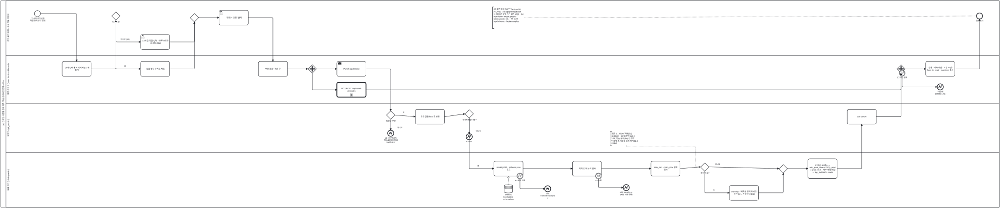

<details><summary>BPMN 2.0 XML 소스 보기 (`diagrams/bpmn_uc01.bpmn` 과 동일 — Camunda Modeler · bpmn.io 에서 열림)</summary>

```xml
<?xml version="1.0" encoding="UTF-8"?>
<bpmn:definitions xmlns:bpmn="http://www.omg.org/spec/BPMN/20100524/MODEL" xmlns:bpmndi="http://www.omg.org/spec/BPMN/20100524/DI" xmlns:dc="http://www.omg.org/spec/DD/20100524/DC" xmlns:di="http://www.omg.org/spec/DD/20100524/DI" id="Definitions_bpmn_uc01" name="UC1 경기 상태 직접 입력으로 승패 예측·승리요인 확인" targetNamespace="https://p4.sumzip.com/bpmn" exporter="bpmn_gen.py" exporterVersion="1.0">
  <bpmn:collaboration id="Collab_bpmn_uc01">
    <bpmn:participant id="Pool_bpmn_uc01" name="LoL 인게임 시점별 승패 예측·핵심 승리요인 분석 서비스" processRef="Process_bpmn_uc01" />
  </bpmn:collaboration>
  <bpmn:process id="Process_bpmn_uc01" name="UC1 경기 상태 직접 입력으로 승패 예측·승리요인 확인" isExecutable="false">
    <bpmn:laneSet id="LaneSet_bpmn_uc01">
      <bpmn:lane id="Lane_bpmn_uc01_0" name="관전·복기 유저 · 외부 연동 개발자">
        <bpmn:flowNodeRef>s</bpmn:flowNodeRef>
        <bpmn:flowNodeRef>g_ex</bpmn:flowNodeRef>
        <bpmn:flowNodeRef>manual</bpmn:flowNodeRef>
        <bpmn:flowNodeRef>g_m0</bpmn:flowNodeRef>
        <bpmn:flowNodeRef>click</bpmn:flowNodeRef>
        <bpmn:flowNodeRef>e</bpmn:flowNodeRef>
      </bpmn:lane>
      <bpmn:lane id="Lane_bpmn_uc01_1" name="화면·프런트 (index.html runManual)">
        <bpmn:flowNodeRef>form</bpmn:flowNodeRef>
        <bpmn:flowNodeRef>fill</bpmn:flowNodeRef>
        <bpmn:flowNodeRef>lock</bpmn:flowNodeRef>
        <bpmn:flowNodeRef>p0</bpmn:flowNodeRef>
        <bpmn:flowNodeRef>post</bpmn:flowNodeRef>
        <bpmn:flowNodeRef>uc2</bpmn:flowNodeRef>
        <bpmn:flowNodeRef>p1</bpmn:flowNodeRef>
        <bpmn:flowNodeRef>show</bpmn:flowNodeRef>
        <bpmn:flowNodeRef>b7</bpmn:flowNodeRef>
        <bpmn:flowNodeRef>e7</bpmn:flowNodeRef>
      </bpmn:lane>
      <bpmn:lane id="Lane_bpmn_uc01_2" name="백엔드 (api_predict)">
        <bpmn:flowNodeRef>g_json</bpmn:flowNodeRef>
        <bpmn:flowNodeRef>e1</bpmn:flowNodeRef>
        <bpmn:flowNodeRef>flt</bpmn:flowNodeRef>
        <bpmn:flowNodeRef>g_num</bpmn:flowNodeRef>
        <bpmn:flowNodeRef>e3</bpmn:flowNodeRef>
        <bpmn:flowNodeRef>ok</bpmn:flowNodeRef>
      </bpmn:lane>
      <bpmn:lane id="Lane_bpmn_uc01_3" name="예측 엔진 (lolwin.predict)">
        <bpmn:flowNodeRef>load</bpmn:flowNodeRef>
        <bpmn:flowNodeRef>b5</bpmn:flowNodeRef>
        <bpmn:flowNodeRef>e5</bpmn:flowNodeRef>
        <bpmn:flowNodeRef>miss</bpmn:flowNodeRef>
        <bpmn:flowNodeRef>b2</bpmn:flowNodeRef>
        <bpmn:flowNodeRef>e2</bpmn:flowNodeRef>
        <bpmn:flowNodeRef>rng</bpmn:flowNodeRef>
        <bpmn:flowNodeRef>g_rng</bpmn:flowNodeRef>
        <bpmn:flowNodeRef>warn</bpmn:flowNodeRef>
        <bpmn:flowNodeRef>g_m1</bpmn:flowNodeRef>
        <bpmn:flowNodeRef>pred</bpmn:flowNodeRef>
      </bpmn:lane>
    </bpmn:laneSet>
    <bpmn:startEvent id="s" name="&quot;가상의 경기 상황 직접 넣어보기&quot; 펼침">
      <bpmn:outgoing>Flow_bpmn_uc01_0</bpmn:outgoing>
    </bpmn:startEvent>
    <bpmn:task id="form" name="13개 입력 폼 + 예시 버튼 3개 표시">
      <bpmn:incoming>Flow_bpmn_uc01_0</bpmn:incoming>
      <bpmn:outgoing>Flow_bpmn_uc01_1</bpmn:outgoing>
    </bpmn:task>
    <bpmn:exclusiveGateway id="g_ex" name="예시 버튼?">
      <bpmn:incoming>Flow_bpmn_uc01_1</bpmn:incoming>
      <bpmn:outgoing>Flow_bpmn_uc01_2</bpmn:outgoing>
      <bpmn:outgoing>Flow_bpmn_uc01_3</bpmn:outgoing>
    </bpmn:exclusiveGateway>
    <bpmn:task id="fill" name="있을 법한 수치로 채움">
      <bpmn:incoming>Flow_bpmn_uc01_2</bpmn:incoming>
      <bpmn:outgoing>Flow_bpmn_uc01_4</bpmn:outgoing>
    </bpmn:task>
    <bpmn:userTask id="manual" name="13개 값 직접 입력 (&quot;모두 0으로&quot; 초기화 가능)">
      <bpmn:incoming>Flow_bpmn_uc01_3</bpmn:incoming>
      <bpmn:outgoing>Flow_bpmn_uc01_5</bpmn:outgoing>
    </bpmn:userTask>
    <bpmn:exclusiveGateway id="g_m0">
      <bpmn:incoming>Flow_bpmn_uc01_4</bpmn:incoming>
      <bpmn:incoming>Flow_bpmn_uc01_5</bpmn:incoming>
      <bpmn:outgoing>Flow_bpmn_uc01_6</bpmn:outgoing>
    </bpmn:exclusiveGateway>
    <bpmn:userTask id="click" name="&quot;판정 + 코칭&quot; 클릭">
      <bpmn:incoming>Flow_bpmn_uc01_6</bpmn:incoming>
      <bpmn:outgoing>Flow_bpmn_uc01_7</bpmn:outgoing>
    </bpmn:userTask>
    <bpmn:task id="lock" name="버튼 잠금 &quot;계산 중&quot;">
      <bpmn:incoming>Flow_bpmn_uc01_7</bpmn:incoming>
      <bpmn:outgoing>Flow_bpmn_uc01_8</bpmn:outgoing>
    </bpmn:task>
    <bpmn:parallelGateway id="p0">
      <bpmn:incoming>Flow_bpmn_uc01_8</bpmn:incoming>
      <bpmn:outgoing>Flow_bpmn_uc01_9</bpmn:outgoing>
      <bpmn:outgoing>Flow_bpmn_uc01_10</bpmn:outgoing>
    </bpmn:parallelGateway>
    <bpmn:sendTask id="post" name="POST /api/predict">
      <bpmn:incoming>Flow_bpmn_uc01_9</bpmn:incoming>
      <bpmn:outgoing>Flow_bpmn_uc01_11</bpmn:outgoing>
    </bpmn:sendTask>
    <bpmn:callActivity id="uc2" name="UC2 POST /api/coach «include»">
      <bpmn:incoming>Flow_bpmn_uc01_10</bpmn:incoming>
      <bpmn:outgoing>Flow_bpmn_uc01_28</bpmn:outgoing>
    </bpmn:callActivity>
    <bpmn:exclusiveGateway id="g_json" name="JSON 객체?">
      <bpmn:incoming>Flow_bpmn_uc01_11</bpmn:incoming>
      <bpmn:outgoing>Flow_bpmn_uc01_12</bpmn:outgoing>
      <bpmn:outgoing>Flow_bpmn_uc01_13</bpmn:outgoing>
    </bpmn:exclusiveGateway>
    <bpmn:endEvent id="e1" name="E1 400 &quot;JSON 객체(13개 피처)를 보내주세요&quot;">
      <bpmn:incoming>Flow_bpmn_uc01_12</bpmn:incoming>
      <bpmn:errorEventDefinition id="EvDef_e1" />
    </bpmn:endEvent>
    <bpmn:task id="flt" name="모든 값을 float 로 변환">
      <bpmn:incoming>Flow_bpmn_uc01_13</bpmn:incoming>
      <bpmn:outgoing>Flow_bpmn_uc01_14</bpmn:outgoing>
    </bpmn:task>
    <bpmn:exclusiveGateway id="g_num" name="숫자로 변환 가능?">
      <bpmn:incoming>Flow_bpmn_uc01_14</bpmn:incoming>
      <bpmn:outgoing>Flow_bpmn_uc01_15</bpmn:outgoing>
      <bpmn:outgoing>Flow_bpmn_uc01_16</bpmn:outgoing>
    </bpmn:exclusiveGateway>
    <bpmn:endEvent id="e3" name="E3 400">
      <bpmn:incoming>Flow_bpmn_uc01_15</bpmn:incoming>
      <bpmn:errorEventDefinition id="EvDef_e3" />
    </bpmn:endEvent>
    <bpmn:task id="load" name="model.joblib · schema.json 로드">
      <bpmn:incoming>Flow_bpmn_uc01_16</bpmn:incoming>
      <bpmn:outgoing>Flow_bpmn_uc01_18</bpmn:outgoing>
      <bpmn:dataInputAssociation id="DIA_ds_model_load"><bpmn:sourceRef>ds_model</bpmn:sourceRef></bpmn:dataInputAssociation>
    </bpmn:task>
    <bpmn:boundaryEvent id="b5" name="E5 파일 없음" attachedToRef="load" cancelActivity="true">
      <bpmn:outgoing>Flow_bpmn_uc01_17</bpmn:outgoing>
      <bpmn:errorEventDefinition id="EvDef_b5" />
    </bpmn:boundaryEvent>
    <bpmn:endEvent id="e5" name="500 FileNotFoundError">
      <bpmn:incoming>Flow_bpmn_uc01_17</bpmn:incoming>
      <bpmn:errorEventDefinition id="EvDef_e5" />
    </bpmn:endEvent>
    <bpmn:dataStoreReference id="ds_model" name="artifacts/ model.joblib · schema.json" />
    <bpmn:task id="miss" name="피처 13개 누락 검사">
      <bpmn:incoming>Flow_bpmn_uc01_18</bpmn:incoming>
      <bpmn:outgoing>Flow_bpmn_uc01_20</bpmn:outgoing>
    </bpmn:task>
    <bpmn:boundaryEvent id="b2" name="E2 누락" attachedToRef="miss" cancelActivity="true">
      <bpmn:outgoing>Flow_bpmn_uc01_19</bpmn:outgoing>
      <bpmn:errorEventDefinition id="EvDef_b2" />
    </bpmn:boundaryEvent>
    <bpmn:endEvent id="e2" name="400 ValueError (빠진 피처 목록)">
      <bpmn:incoming>Flow_bpmn_uc01_19</bpmn:incoming>
      <bpmn:errorEventDefinition id="EvDef_e2" />
    </bpmn:endEvent>
    <bpmn:task id="rng" name="train_min ~ train_max 범위 검사">
      <bpmn:incoming>Flow_bpmn_uc01_20</bpmn:incoming>
      <bpmn:outgoing>Flow_bpmn_uc01_21</bpmn:outgoing>
    </bpmn:task>
    <bpmn:exclusiveGateway id="g_rng" name="범위 밖 값?">
      <bpmn:incoming>Flow_bpmn_uc01_21</bpmn:incoming>
      <bpmn:outgoing>Flow_bpmn_uc01_22</bpmn:outgoing>
      <bpmn:outgoing>Flow_bpmn_uc01_24</bpmn:outgoing>
    </bpmn:exclusiveGateway>
    <bpmn:task id="warn" name="warnings &quot;예측을 믿지 마세요&quot; 추가 (E4, 거부하지 않음)">
      <bpmn:incoming>Flow_bpmn_uc01_22</bpmn:incoming>
      <bpmn:outgoing>Flow_bpmn_uc01_23</bpmn:outgoing>
    </bpmn:task>
    <bpmn:exclusiveGateway id="g_m1">
      <bpmn:incoming>Flow_bpmn_uc01_23</bpmn:incoming>
      <bpmn:incoming>Flow_bpmn_uc01_24</bpmn:incoming>
      <bpmn:outgoing>Flow_bpmn_uc01_25</bpmn:outgoing>
    </bpmn:exclusiveGateway>
    <bpmn:task id="pred" name="predict_proba → win_prob_blue (4자리) · pred = prob ≥ 0.5 · 계수×표준화값 → top_factors 5 · meta">
      <bpmn:incoming>Flow_bpmn_uc01_25</bpmn:incoming>
      <bpmn:outgoing>Flow_bpmn_uc01_26</bpmn:outgoing>
    </bpmn:task>
    <bpmn:task id="ok" name="200 JSON">
      <bpmn:incoming>Flow_bpmn_uc01_26</bpmn:incoming>
      <bpmn:outgoing>Flow_bpmn_uc01_27</bpmn:outgoing>
    </bpmn:task>
    <bpmn:parallelGateway id="p1">
      <bpmn:incoming>Flow_bpmn_uc01_27</bpmn:incoming>
      <bpmn:incoming>Flow_bpmn_uc01_28</bpmn:incoming>
      <bpmn:outgoing>Flow_bpmn_uc01_29</bpmn:outgoing>
    </bpmn:parallelGateway>
    <bpmn:task id="show" name="승률 · 예측 라벨 · 코칭 조언 · how_to_read · warnings 표시">
      <bpmn:incoming>Flow_bpmn_uc01_29</bpmn:incoming>
      <bpmn:outgoing>Flow_bpmn_uc01_31</bpmn:outgoing>
    </bpmn:task>
    <bpmn:boundaryEvent id="b7" name="E7 계산 실패" attachedToRef="p1" cancelActivity="true">
      <bpmn:outgoing>Flow_bpmn_uc01_30</bpmn:outgoing>
      <bpmn:errorEventDefinition id="EvDef_b7" />
    </bpmn:boundaryEvent>
    <bpmn:endEvent id="e7" name="&quot;계산에 실패했습니다.&quot;">
      <bpmn:incoming>Flow_bpmn_uc01_30</bpmn:incoming>
      <bpmn:errorEventDefinition id="EvDef_e7" />
    </bpmn:endEvent>
    <bpmn:endEvent id="e" name="결과 읽기">
      <bpmn:incoming>Flow_bpmn_uc01_31</bpmn:incoming>
    </bpmn:endEvent>
    <bpmn:textAnnotation id="n_alt"><bpmn:text>A2 화면 없이 POST /api/predict (CORS) · A3 /api/predict/batch 1~1000건 (E6 크기 위반 400) · A4 from lolwin import predict / lolwin-predict CLI · A5 GET /api/schema · /api/examples</bpmn:text></bpmn:textAnnotation>
    <bpmn:textAnnotation id="n_gate"><bpmn:text>관문 넷: JSON 객체(E1) · 숫자(E3) · 13개 전부(E2) 는 거부, 학습 범위(E4) 만 경고. 이례적 경기를 못 보게 하지 않기 위해서</bpmn:text></bpmn:textAnnotation>
    <bpmn:sequenceFlow id="Flow_bpmn_uc01_0" sourceRef="s" targetRef="form" />
    <bpmn:sequenceFlow id="Flow_bpmn_uc01_1" sourceRef="form" targetRef="g_ex" />
    <bpmn:sequenceFlow id="Flow_bpmn_uc01_2" sourceRef="g_ex" targetRef="fill" name="예" />
    <bpmn:sequenceFlow id="Flow_bpmn_uc01_3" sourceRef="g_ex" targetRef="manual" name="아니오 (A1)" />
    <bpmn:sequenceFlow id="Flow_bpmn_uc01_4" sourceRef="fill" targetRef="g_m0" />
    <bpmn:sequenceFlow id="Flow_bpmn_uc01_5" sourceRef="manual" targetRef="g_m0" />
    <bpmn:sequenceFlow id="Flow_bpmn_uc01_6" sourceRef="g_m0" targetRef="click" />
    <bpmn:sequenceFlow id="Flow_bpmn_uc01_7" sourceRef="click" targetRef="lock" />
    <bpmn:sequenceFlow id="Flow_bpmn_uc01_8" sourceRef="lock" targetRef="p0" />
    <bpmn:sequenceFlow id="Flow_bpmn_uc01_9" sourceRef="p0" targetRef="post" />
    <bpmn:sequenceFlow id="Flow_bpmn_uc01_10" sourceRef="p0" targetRef="uc2" />
    <bpmn:sequenceFlow id="Flow_bpmn_uc01_11" sourceRef="post" targetRef="g_json" />
    <bpmn:sequenceFlow id="Flow_bpmn_uc01_12" sourceRef="g_json" targetRef="e1" name="아니오" />
    <bpmn:sequenceFlow id="Flow_bpmn_uc01_13" sourceRef="g_json" targetRef="flt" name="예" />
    <bpmn:sequenceFlow id="Flow_bpmn_uc01_14" sourceRef="flt" targetRef="g_num" />
    <bpmn:sequenceFlow id="Flow_bpmn_uc01_15" sourceRef="g_num" targetRef="e3" name="아니오" />
    <bpmn:sequenceFlow id="Flow_bpmn_uc01_16" sourceRef="g_num" targetRef="load" name="예" />
    <bpmn:sequenceFlow id="Flow_bpmn_uc01_17" sourceRef="b5" targetRef="e5" />
    <bpmn:sequenceFlow id="Flow_bpmn_uc01_18" sourceRef="load" targetRef="miss" />
    <bpmn:sequenceFlow id="Flow_bpmn_uc01_19" sourceRef="b2" targetRef="e2" />
    <bpmn:sequenceFlow id="Flow_bpmn_uc01_20" sourceRef="miss" targetRef="rng" />
    <bpmn:sequenceFlow id="Flow_bpmn_uc01_21" sourceRef="rng" targetRef="g_rng" />
    <bpmn:sequenceFlow id="Flow_bpmn_uc01_22" sourceRef="g_rng" targetRef="warn" name="예" />
    <bpmn:sequenceFlow id="Flow_bpmn_uc01_23" sourceRef="warn" targetRef="g_m1" />
    <bpmn:sequenceFlow id="Flow_bpmn_uc01_24" sourceRef="g_rng" targetRef="g_m1" name="아니오" />
    <bpmn:sequenceFlow id="Flow_bpmn_uc01_25" sourceRef="g_m1" targetRef="pred" />
    <bpmn:sequenceFlow id="Flow_bpmn_uc01_26" sourceRef="pred" targetRef="ok" />
    <bpmn:sequenceFlow id="Flow_bpmn_uc01_27" sourceRef="ok" targetRef="p1" />
    <bpmn:sequenceFlow id="Flow_bpmn_uc01_28" sourceRef="uc2" targetRef="p1" />
    <bpmn:sequenceFlow id="Flow_bpmn_uc01_29" sourceRef="p1" targetRef="show" />
    <bpmn:sequenceFlow id="Flow_bpmn_uc01_30" sourceRef="b7" targetRef="e7" />
    <bpmn:sequenceFlow id="Flow_bpmn_uc01_31" sourceRef="show" targetRef="e" />
    <bpmn:association id="Assoc_bpmn_uc01_1" sourceRef="n_alt" targetRef="e" />
    <bpmn:association id="Assoc_bpmn_uc01_2" sourceRef="n_gate" targetRef="g_rng" />
  </bpmn:process>
  <bpmndi:BPMNDiagram id="Diagram_bpmn_uc01">
    <bpmndi:BPMNPlane id="Plane_bpmn_uc01" bpmnElement="Collab_bpmn_uc01">
      <bpmndi:BPMNShape id="Pool_bpmn_uc01_di" bpmnElement="Pool_bpmn_uc01" isHorizontal="true"><dc:Bounds x="40" y="20" width="5900" height="1225.0" /></bpmndi:BPMNShape>
      <bpmndi:BPMNShape id="Lane_bpmn_uc01_0_di" bpmnElement="Lane_bpmn_uc01_0" isHorizontal="true"><dc:Bounds x="70" y="20" width="5870" height="324.0" /></bpmndi:BPMNShape>
      <bpmndi:BPMNShape id="Lane_bpmn_uc01_1_di" bpmnElement="Lane_bpmn_uc01_1" isHorizontal="true"><dc:Bounds x="70" y="344.0" width="5870" height="284" /></bpmndi:BPMNShape>
      <bpmndi:BPMNShape id="Lane_bpmn_uc01_2_di" bpmnElement="Lane_bpmn_uc01_2" isHorizontal="true"><dc:Bounds x="70" y="628.0" width="5870" height="294" /></bpmndi:BPMNShape>
      <bpmndi:BPMNShape id="Lane_bpmn_uc01_3_di" bpmnElement="Lane_bpmn_uc01_3" isHorizontal="true"><dc:Bounds x="70" y="922.0" width="5870" height="323.0" /></bpmndi:BPMNShape>
      <bpmndi:BPMNShape id="s_di" bpmnElement="s"><dc:Bounds x="238" y="78" width="36" height="36" />
        <bpmndi:BPMNLabel><dc:Bounds x="196" y="118" width="120" height="28" /></bpmndi:BPMNLabel>
      </bpmndi:BPMNShape>
      <bpmndi:BPMNShape id="form_di" bpmnElement="form"><dc:Bounds x="402" y="380" width="172" height="88" />
      </bpmndi:BPMNShape>
      <bpmndi:BPMNShape id="g_ex_di" bpmnElement="g_ex"><dc:Bounds x="695" y="85" width="50" height="50" />
        <bpmndi:BPMNLabel><dc:Bounds x="660" y="139" width="120" height="28" /></bpmndi:BPMNLabel>
      </bpmndi:BPMNShape>
      <bpmndi:BPMNShape id="fill_di" bpmnElement="fill"><dc:Bounds x="866" y="380" width="172" height="88" />
      </bpmndi:BPMNShape>
      <bpmndi:BPMNShape id="manual_di" bpmnElement="manual"><dc:Bounds x="866" y="220" width="172" height="88" />
      </bpmndi:BPMNShape>
      <bpmndi:BPMNShape id="g_m0_di" bpmnElement="g_m0"><dc:Bounds x="1159" y="95" width="50" height="50" />
      </bpmndi:BPMNShape>
      <bpmndi:BPMNShape id="click_di" bpmnElement="click"><dc:Bounds x="1330" y="76" width="172" height="88" />
      </bpmndi:BPMNShape>
      <bpmndi:BPMNShape id="lock_di" bpmnElement="lock"><dc:Bounds x="1562" y="380" width="172" height="88" />
      </bpmndi:BPMNShape>
      <bpmndi:BPMNShape id="p0_di" bpmnElement="p0"><dc:Bounds x="1855" y="399" width="50" height="50" />
      </bpmndi:BPMNShape>
      <bpmndi:BPMNShape id="post_di" bpmnElement="post"><dc:Bounds x="2026" y="380" width="172" height="88" />
      </bpmndi:BPMNShape>
      <bpmndi:BPMNShape id="uc2_di" bpmnElement="uc2"><dc:Bounds x="2026" y="504" width="172" height="88" />
      </bpmndi:BPMNShape>
      <bpmndi:BPMNShape id="g_json_di" bpmnElement="g_json"><dc:Bounds x="2319" y="673" width="50" height="50" />
        <bpmndi:BPMNLabel><dc:Bounds x="2284" y="727" width="120" height="28" /></bpmndi:BPMNLabel>
      </bpmndi:BPMNShape>
      <bpmndi:BPMNShape id="e1_di" bpmnElement="e1"><dc:Bounds x="2326" y="788" width="36" height="36" />
        <bpmndi:BPMNLabel><dc:Bounds x="2284" y="828" width="120" height="28" /></bpmndi:BPMNLabel>
      </bpmndi:BPMNShape>
      <bpmndi:BPMNShape id="flt_di" bpmnElement="flt"><dc:Bounds x="2490" y="664" width="172" height="88" />
      </bpmndi:BPMNShape>
      <bpmndi:BPMNShape id="g_num_di" bpmnElement="g_num"><dc:Bounds x="2783" y="666" width="50" height="50" />
        <bpmndi:BPMNLabel><dc:Bounds x="2748" y="720" width="120" height="28" /></bpmndi:BPMNLabel>
      </bpmndi:BPMNShape>
      <bpmndi:BPMNShape id="e3_di" bpmnElement="e3"><dc:Bounds x="2790" y="809" width="36" height="36" />
        <bpmndi:BPMNLabel><dc:Bounds x="2748" y="849" width="120" height="28" /></bpmndi:BPMNLabel>
      </bpmndi:BPMNShape>
      <bpmndi:BPMNShape id="load_di" bpmnElement="load"><dc:Bounds x="2954" y="972" width="172" height="88" />
      </bpmndi:BPMNShape>
      <bpmndi:BPMNShape id="b5_di" bpmnElement="b5"><dc:Bounds x="3090" y="1042" width="36" height="36" />
        <bpmndi:BPMNLabel><dc:Bounds x="3066" y="1080" width="84" height="28" /></bpmndi:BPMNLabel>
      </bpmndi:BPMNShape>
      <bpmndi:BPMNShape id="e5_di" bpmnElement="e5"><dc:Bounds x="3254" y="1118" width="36" height="36" />
        <bpmndi:BPMNLabel><dc:Bounds x="3212" y="1158" width="120" height="28" /></bpmndi:BPMNLabel>
      </bpmndi:BPMNShape>
      <bpmndi:BPMNShape id="ds_model_di" bpmnElement="ds_model"><dc:Bounds x="3015" y="1111" width="50" height="50" />
        <bpmndi:BPMNLabel><dc:Bounds x="2980" y="1165" width="120" height="28" /></bpmndi:BPMNLabel>
      </bpmndi:BPMNShape>
      <bpmndi:BPMNShape id="miss_di" bpmnElement="miss"><dc:Bounds x="3418" y="972" width="172" height="88" />
      </bpmndi:BPMNShape>
      <bpmndi:BPMNShape id="b2_di" bpmnElement="b2"><dc:Bounds x="3554" y="1042" width="36" height="36" />
        <bpmndi:BPMNLabel><dc:Bounds x="3530" y="1080" width="84" height="28" /></bpmndi:BPMNLabel>
      </bpmndi:BPMNShape>
      <bpmndi:BPMNShape id="e2_di" bpmnElement="e2"><dc:Bounds x="3718" y="1111" width="36" height="36" />
        <bpmndi:BPMNLabel><dc:Bounds x="3676" y="1151" width="120" height="28" /></bpmndi:BPMNLabel>
      </bpmndi:BPMNShape>
      <bpmndi:BPMNShape id="rng_di" bpmnElement="rng"><dc:Bounds x="3882" y="972" width="172" height="88" />
      </bpmndi:BPMNShape>
      <bpmndi:BPMNShape id="g_rng_di" bpmnElement="g_rng"><dc:Bounds x="4175" y="982" width="50" height="50" />
        <bpmndi:BPMNLabel><dc:Bounds x="4140" y="1036" width="120" height="28" /></bpmndi:BPMNLabel>
      </bpmndi:BPMNShape>
      <bpmndi:BPMNShape id="warn_di" bpmnElement="warn"><dc:Bounds x="4346" y="1116" width="172" height="88" />
      </bpmndi:BPMNShape>
      <bpmndi:BPMNShape id="g_m1_di" bpmnElement="g_m1"><dc:Bounds x="4639" y="992" width="50" height="50" />
      </bpmndi:BPMNShape>
      <bpmndi:BPMNShape id="pred_di" bpmnElement="pred"><dc:Bounds x="4810" y="958" width="172" height="117.0" />
      </bpmndi:BPMNShape>
      <bpmndi:BPMNShape id="ok_di" bpmnElement="ok"><dc:Bounds x="5042" y="664" width="172" height="88" />
      </bpmndi:BPMNShape>
      <bpmndi:BPMNShape id="p1_di" bpmnElement="p1"><dc:Bounds x="5335" y="399" width="50" height="50" />
      </bpmndi:BPMNShape>
      <bpmndi:BPMNShape id="show_di" bpmnElement="show"><dc:Bounds x="5506" y="380" width="172" height="88" />
      </bpmndi:BPMNShape>
      <bpmndi:BPMNShape id="b7_di" bpmnElement="b7"><dc:Bounds x="5349" y="431" width="36" height="36" />
        <bpmndi:BPMNLabel><dc:Bounds x="5325" y="469" width="84" height="28" /></bpmndi:BPMNLabel>
      </bpmndi:BPMNShape>
      <bpmndi:BPMNShape id="e7_di" bpmnElement="e7"><dc:Bounds x="5574" y="513" width="36" height="36" />
        <bpmndi:BPMNLabel><dc:Bounds x="5532" y="553" width="120" height="28" /></bpmndi:BPMNLabel>
      </bpmndi:BPMNShape>
      <bpmndi:BPMNShape id="e_di" bpmnElement="e"><dc:Bounds x="5806" y="92" width="36" height="36" />
        <bpmndi:BPMNLabel><dc:Bounds x="5764" y="132" width="120" height="28" /></bpmndi:BPMNLabel>
      </bpmndi:BPMNShape>
      <bpmndi:BPMNShape id="n_alt_di" bpmnElement="n_alt"><dc:Bounds x="2945" y="56" width="190" height="128.0" />
      </bpmndi:BPMNShape>
      <bpmndi:BPMNShape id="n_gate_di" bpmnElement="n_gate"><dc:Bounds x="3641" y="795" width="190" height="84.5" />
      </bpmndi:BPMNShape>
      <bpmndi:BPMNEdge id="Flow_bpmn_uc01_0_di" bpmnElement="Flow_bpmn_uc01_0">
        <di:waypoint x="274" y="96" />
        <di:waypoint x="488" y="96" />
        <di:waypoint x="488" y="380" />
      </bpmndi:BPMNEdge>
      <bpmndi:BPMNEdge id="Flow_bpmn_uc01_1_di" bpmnElement="Flow_bpmn_uc01_1">
        <di:waypoint x="574" y="424" />
        <di:waypoint x="720" y="424" />
        <di:waypoint x="720" y="135" />
      </bpmndi:BPMNEdge>
      <bpmndi:BPMNEdge id="Flow_bpmn_uc01_2_di" bpmnElement="Flow_bpmn_uc01_2">
        <di:waypoint x="720" y="135" />
        <di:waypoint x="720" y="424" />
        <di:waypoint x="866" y="424" />
        <bpmndi:BPMNLabel><dc:Bounds x="728" y="402" width="90" height="18" /></bpmndi:BPMNLabel>
      </bpmndi:BPMNEdge>
      <bpmndi:BPMNEdge id="Flow_bpmn_uc01_3_di" bpmnElement="Flow_bpmn_uc01_3">
        <di:waypoint x="720" y="135" />
        <di:waypoint x="720" y="264" />
        <di:waypoint x="866" y="264" />
        <bpmndi:BPMNLabel><dc:Bounds x="728" y="242" width="90" height="18" /></bpmndi:BPMNLabel>
      </bpmndi:BPMNEdge>
      <bpmndi:BPMNEdge id="Flow_bpmn_uc01_4_di" bpmnElement="Flow_bpmn_uc01_4">
        <di:waypoint x="1038" y="424" />
        <di:waypoint x="1184" y="424" />
        <di:waypoint x="1184" y="145" />
      </bpmndi:BPMNEdge>
      <bpmndi:BPMNEdge id="Flow_bpmn_uc01_5_di" bpmnElement="Flow_bpmn_uc01_5">
        <di:waypoint x="1038" y="264" />
        <di:waypoint x="1184" y="264" />
        <di:waypoint x="1184" y="145" />
      </bpmndi:BPMNEdge>
      <bpmndi:BPMNEdge id="Flow_bpmn_uc01_6_di" bpmnElement="Flow_bpmn_uc01_6">
        <di:waypoint x="1209" y="120" />
        <di:waypoint x="1330" y="120" />
      </bpmndi:BPMNEdge>
      <bpmndi:BPMNEdge id="Flow_bpmn_uc01_7_di" bpmnElement="Flow_bpmn_uc01_7">
        <di:waypoint x="1502" y="120" />
        <di:waypoint x="1648" y="120" />
        <di:waypoint x="1648" y="380" />
      </bpmndi:BPMNEdge>
      <bpmndi:BPMNEdge id="Flow_bpmn_uc01_8_di" bpmnElement="Flow_bpmn_uc01_8">
        <di:waypoint x="1734" y="424" />
        <di:waypoint x="1855" y="424" />
      </bpmndi:BPMNEdge>
      <bpmndi:BPMNEdge id="Flow_bpmn_uc01_9_di" bpmnElement="Flow_bpmn_uc01_9">
        <di:waypoint x="1905" y="424" />
        <di:waypoint x="2026" y="424" />
      </bpmndi:BPMNEdge>
      <bpmndi:BPMNEdge id="Flow_bpmn_uc01_10_di" bpmnElement="Flow_bpmn_uc01_10">
        <di:waypoint x="1880" y="449" />
        <di:waypoint x="1880" y="548" />
        <di:waypoint x="2026" y="548" />
      </bpmndi:BPMNEdge>
      <bpmndi:BPMNEdge id="Flow_bpmn_uc01_11_di" bpmnElement="Flow_bpmn_uc01_11">
        <di:waypoint x="2198" y="424" />
        <di:waypoint x="2344" y="424" />
        <di:waypoint x="2344" y="673" />
      </bpmndi:BPMNEdge>
      <bpmndi:BPMNEdge id="Flow_bpmn_uc01_12_di" bpmnElement="Flow_bpmn_uc01_12">
        <di:waypoint x="2344" y="723" />
        <di:waypoint x="2344" y="788" />
        <bpmndi:BPMNLabel><dc:Bounds x="2352" y="766" width="90" height="18" /></bpmndi:BPMNLabel>
      </bpmndi:BPMNEdge>
      <bpmndi:BPMNEdge id="Flow_bpmn_uc01_13_di" bpmnElement="Flow_bpmn_uc01_13">
        <di:waypoint x="2369" y="698" />
        <di:waypoint x="2490" y="708" />
        <bpmndi:BPMNLabel><dc:Bounds x="2375" y="676" width="90" height="18" /></bpmndi:BPMNLabel>
      </bpmndi:BPMNEdge>
      <bpmndi:BPMNEdge id="Flow_bpmn_uc01_14_di" bpmnElement="Flow_bpmn_uc01_14">
        <di:waypoint x="2662" y="708" />
        <di:waypoint x="2783" y="691" />
      </bpmndi:BPMNEdge>
      <bpmndi:BPMNEdge id="Flow_bpmn_uc01_15_di" bpmnElement="Flow_bpmn_uc01_15">
        <di:waypoint x="2808" y="716" />
        <di:waypoint x="2808" y="809" />
        <bpmndi:BPMNLabel><dc:Bounds x="2816" y="787" width="90" height="18" /></bpmndi:BPMNLabel>
      </bpmndi:BPMNEdge>
      <bpmndi:BPMNEdge id="Flow_bpmn_uc01_16_di" bpmnElement="Flow_bpmn_uc01_16">
        <di:waypoint x="2808" y="716" />
        <di:waypoint x="2808" y="1016" />
        <di:waypoint x="2954" y="1016" />
        <bpmndi:BPMNLabel><dc:Bounds x="2816" y="994" width="90" height="18" /></bpmndi:BPMNLabel>
      </bpmndi:BPMNEdge>
      <bpmndi:BPMNEdge id="Flow_bpmn_uc01_17_di" bpmnElement="Flow_bpmn_uc01_17">
        <di:waypoint x="3108" y="1078" />
        <di:waypoint x="3108" y="1136" />
        <di:waypoint x="3254" y="1136" />
      </bpmndi:BPMNEdge>
      <bpmndi:BPMNEdge id="Flow_bpmn_uc01_18_di" bpmnElement="Flow_bpmn_uc01_18">
        <di:waypoint x="3126" y="1016" />
        <di:waypoint x="3418" y="1016" />
      </bpmndi:BPMNEdge>
      <bpmndi:BPMNEdge id="Flow_bpmn_uc01_19_di" bpmnElement="Flow_bpmn_uc01_19">
        <di:waypoint x="3572" y="1078" />
        <di:waypoint x="3572" y="1129" />
        <di:waypoint x="3718" y="1129" />
      </bpmndi:BPMNEdge>
      <bpmndi:BPMNEdge id="Flow_bpmn_uc01_20_di" bpmnElement="Flow_bpmn_uc01_20">
        <di:waypoint x="3590" y="1016" />
        <di:waypoint x="3882" y="1016" />
      </bpmndi:BPMNEdge>
      <bpmndi:BPMNEdge id="Flow_bpmn_uc01_21_di" bpmnElement="Flow_bpmn_uc01_21">
        <di:waypoint x="4054" y="1016" />
        <di:waypoint x="4175" y="1006" />
      </bpmndi:BPMNEdge>
      <bpmndi:BPMNEdge id="Flow_bpmn_uc01_22_di" bpmnElement="Flow_bpmn_uc01_22">
        <di:waypoint x="4200" y="1032" />
        <di:waypoint x="4200" y="1160" />
        <di:waypoint x="4346" y="1160" />
        <bpmndi:BPMNLabel><dc:Bounds x="4208" y="1138" width="90" height="18" /></bpmndi:BPMNLabel>
      </bpmndi:BPMNEdge>
      <bpmndi:BPMNEdge id="Flow_bpmn_uc01_23_di" bpmnElement="Flow_bpmn_uc01_23">
        <di:waypoint x="4518" y="1160" />
        <di:waypoint x="4664" y="1160" />
        <di:waypoint x="4664" y="1042" />
      </bpmndi:BPMNEdge>
      <bpmndi:BPMNEdge id="Flow_bpmn_uc01_24_di" bpmnElement="Flow_bpmn_uc01_24">
        <di:waypoint x="4225" y="1006" />
        <di:waypoint x="4639" y="1016" />
        <bpmndi:BPMNLabel><dc:Bounds x="4231" y="984" width="90" height="18" /></bpmndi:BPMNLabel>
      </bpmndi:BPMNEdge>
      <bpmndi:BPMNEdge id="Flow_bpmn_uc01_25_di" bpmnElement="Flow_bpmn_uc01_25">
        <di:waypoint x="4689" y="1016" />
        <di:waypoint x="4810" y="1016" />
      </bpmndi:BPMNEdge>
      <bpmndi:BPMNEdge id="Flow_bpmn_uc01_26_di" bpmnElement="Flow_bpmn_uc01_26">
        <di:waypoint x="4982" y="1016" />
        <di:waypoint x="5128" y="1016" />
        <di:waypoint x="5128" y="752" />
      </bpmndi:BPMNEdge>
      <bpmndi:BPMNEdge id="Flow_bpmn_uc01_27_di" bpmnElement="Flow_bpmn_uc01_27">
        <di:waypoint x="5214" y="708" />
        <di:waypoint x="5360" y="708" />
        <di:waypoint x="5360" y="449" />
      </bpmndi:BPMNEdge>
      <bpmndi:BPMNEdge id="Flow_bpmn_uc01_28_di" bpmnElement="Flow_bpmn_uc01_28">
        <di:waypoint x="2198" y="548" />
        <di:waypoint x="5360" y="548" />
        <di:waypoint x="5360" y="449" />
      </bpmndi:BPMNEdge>
      <bpmndi:BPMNEdge id="Flow_bpmn_uc01_29_di" bpmnElement="Flow_bpmn_uc01_29">
        <di:waypoint x="5385" y="424" />
        <di:waypoint x="5506" y="424" />
      </bpmndi:BPMNEdge>
      <bpmndi:BPMNEdge id="Flow_bpmn_uc01_30_di" bpmnElement="Flow_bpmn_uc01_30">
        <di:waypoint x="5367" y="467" />
        <di:waypoint x="5367" y="531" />
        <di:waypoint x="5574" y="531" />
      </bpmndi:BPMNEdge>
      <bpmndi:BPMNEdge id="Flow_bpmn_uc01_31_di" bpmnElement="Flow_bpmn_uc01_31">
        <di:waypoint x="5678" y="424" />
        <di:waypoint x="5824" y="424" />
        <di:waypoint x="5824" y="128" />
      </bpmndi:BPMNEdge>
      <bpmndi:BPMNEdge id="DIA_ds_model_load_di" bpmnElement="DIA_ds_model_load">
        <di:waypoint x="3040" y="1111" />
        <di:waypoint x="3040" y="1060" />
      </bpmndi:BPMNEdge>
      <bpmndi:BPMNEdge id="Assoc_bpmn_uc01_1_di" bpmnElement="Assoc_bpmn_uc01_1">
        <di:waypoint x="3135" y="120" />
        <di:waypoint x="5806" y="110" />
      </bpmndi:BPMNEdge>
      <bpmndi:BPMNEdge id="Assoc_bpmn_uc01_2_di" bpmnElement="Assoc_bpmn_uc01_2">
        <di:waypoint x="3736" y="879" />
        <di:waypoint x="3736" y="887" />
        <di:waypoint x="4147" y="887" />
        <di:waypoint x="4147" y="1006" />
        <di:waypoint x="4175" y="1006" />
      </bpmndi:BPMNEdge>
    </bpmndi:BPMNPlane>
  </bpmndi:BPMNDiagram>
</bpmn:definitions>
```

</details>

**BPMN 으로 보이는 것.** 화면이 "판정 + 코칭"을 누르는 순간 **병렬 게이트웨이(+)** 로 `/api/predict` 와 UC2 호출 활동(«include»)이 동시에 나가고, 둘 다 돌아와야 두 번째 병렬 게이트웨이가 열려 결과를 그린다.
백엔드·예측 엔진 레인의 관문은 넷이다. JSON 객체(E1)·숫자(E3)는 **배타 게이트웨이**의 아니오 가지가 오류 종료 이벤트로 가고, 13개 누락(E2)·모델 파일 없음(E5)은 활동에 붙은 **오류 경계 이벤트**다. 학습 범위 밖(E4)만 오류가 아니라 `warnings` 를 붙이는 활동으로 이어져 흐름이 계속된다.

| BPMN 요소 | UC1 원천 | 뜻 |
|---|---|---|
| 병렬 게이트웨이 | 기본흐름 3~4, 시퀀스 3·4 | predict 와 coach 를 항상 함께 부른다 (`runManual`) |
| 배타 게이트웨이 "JSON 객체?" · "숫자?" | E1 · E3 | 400 거부 |
| 오류 경계 이벤트 "E5 파일 없음" · "E2 누락" | E5 · E2 | 500 · 400 |
| 배타 게이트웨이 "범위 밖 값?" | E4 | 거부하지 않고 경고 |
| 데이터 저장소 `artifacts/` | 시퀀스 5 | P3 산출물을 읽는다 |
| 텍스트 주석 A2~A5 | 대체흐름 | 화면 없는 경로 (API · batch · CLI · schema) |

### 4.2 UC2 반사실 코칭 받기 — [UC_02](UC_02_반사실코칭.md)

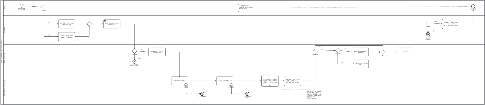

<details><summary>BPMN 2.0 XML 소스 보기 (`diagrams/bpmn_uc02.bpmn` 과 동일 — Camunda Modeler · bpmn.io 에서 열림)</summary>

```xml
<?xml version="1.0" encoding="UTF-8"?>
<bpmn:definitions xmlns:bpmn="http://www.omg.org/spec/BPMN/20100524/MODEL" xmlns:bpmndi="http://www.omg.org/spec/BPMN/20100524/DI" xmlns:dc="http://www.omg.org/spec/DD/20100524/DC" xmlns:di="http://www.omg.org/spec/DD/20100524/DI" id="Definitions_bpmn_uc02" name="UC2 반사실 코칭 받기 (UC1 · UC3 «include»)" targetNamespace="https://p4.sumzip.com/bpmn" exporter="bpmn_gen.py" exporterVersion="1.0">
  <bpmn:collaboration id="Collab_bpmn_uc02">
    <bpmn:participant id="Pool_bpmn_uc02" name="LoL 인게임 시점별 승패 예측·핵심 승리요인 분석 서비스" processRef="Process_bpmn_uc02" />
  </bpmn:collaboration>
  <bpmn:process id="Process_bpmn_uc02" name="UC2 반사실 코칭 받기 (UC1 · UC3 «include»)" isExecutable="false">
    <bpmn:laneSet id="LaneSet_bpmn_uc02">
      <bpmn:lane id="Lane_bpmn_uc02_0" name="이용자">
        <bpmn:flowNodeRef>s</bpmn:flowNodeRef>
        <bpmn:flowNodeRef>g_in</bpmn:flowNodeRef>
        <bpmn:flowNodeRef>e</bpmn:flowNodeRef>
      </bpmn:lane>
      <bpmn:lane id="Lane_bpmn_uc02_1" name="화면·프런트">
        <bpmn:flowNodeRef>in1</bpmn:flowNodeRef>
        <bpmn:flowNodeRef>in3</bpmn:flowNodeRef>
        <bpmn:flowNodeRef>g_m0</bpmn:flowNodeRef>
        <bpmn:flowNodeRef>post</bpmn:flowNodeRef>
        <bpmn:flowNodeRef>g_fail</bpmn:flowNodeRef>
        <bpmn:flowNodeRef>e3</bpmn:flowNodeRef>
        <bpmn:flowNodeRef>show</bpmn:flowNodeRef>
      </bpmn:lane>
      <bpmn:lane id="Lane_bpmn_uc02_2" name="백엔드 (api_coach)">
        <bpmn:flowNodeRef>g_json</bpmn:flowNodeRef>
        <bpmn:flowNodeRef>e1</bpmn:flowNodeRef>
        <bpmn:flowNodeRef>split</bpmn:flowNodeRef>
        <bpmn:flowNodeRef>g_v</bpmn:flowNodeRef>
        <bpmn:flowNodeRef>g_v4</bpmn:flowNodeRef>
        <bpmn:flowNodeRef>adv</bpmn:flowNodeRef>
        <bpmn:flowNodeRef>unk</bpmn:flowNodeRef>
        <bpmn:flowNodeRef>g_m1</bpmn:flowNodeRef>
        <bpmn:flowNodeRef>ok</bpmn:flowNodeRef>
      </bpmn:lane>
      <bpmn:lane id="Lane_bpmn_uc02_3" name="코칭 엔진 (lolwin.coach.advise)">
        <bpmn:flowNodeRef>miss</bpmn:flowNodeRef>
        <bpmn:flowNodeRef>b2</bpmn:flowNodeRef>
        <bpmn:flowNodeRef>e2</bpmn:flowNodeRef>
        <bpmn:flowNodeRef>base</bpmn:flowNodeRef>
        <bpmn:flowNodeRef>b7</bpmn:flowNodeRef>
        <bpmn:flowNodeRef>e7</bpmn:flowNodeRef>
        <bpmn:flowNodeRef>loop</bpmn:flowNodeRef>
        <bpmn:flowNodeRef>rank</bpmn:flowNodeRef>
      </bpmn:lane>
    </bpmn:laneSet>
    <bpmn:startEvent id="s" name="코칭 요청 (UC1 · UC3 에서 호출)">
      <bpmn:outgoing>Flow_bpmn_uc02_0</bpmn:outgoing>
    </bpmn:startEvent>
    <bpmn:exclusiveGateway id="g_in" name="진입 경로?">
      <bpmn:incoming>Flow_bpmn_uc02_0</bpmn:incoming>
      <bpmn:outgoing>Flow_bpmn_uc02_1</bpmn:outgoing>
      <bpmn:outgoing>Flow_bpmn_uc02_2</bpmn:outgoing>
    </bpmn:exclusiveGateway>
    <bpmn:task id="in1" name="UC1 &quot;판정 + 코칭&quot;: 13개 값, verdict 없음 (A3)">
      <bpmn:incoming>Flow_bpmn_uc02_1</bpmn:incoming>
      <bpmn:outgoing>Flow_bpmn_uc02_3</bpmn:outgoing>
    </bpmn:task>
    <bpmn:task id="in3" name="UC3 경기 행 펼침: 그 경기 features + verdict (A1)">
      <bpmn:incoming>Flow_bpmn_uc02_2</bpmn:incoming>
      <bpmn:outgoing>Flow_bpmn_uc02_4</bpmn:outgoing>
    </bpmn:task>
    <bpmn:exclusiveGateway id="g_m0">
      <bpmn:incoming>Flow_bpmn_uc02_3</bpmn:incoming>
      <bpmn:incoming>Flow_bpmn_uc02_4</bpmn:incoming>
      <bpmn:outgoing>Flow_bpmn_uc02_5</bpmn:outgoing>
    </bpmn:exclusiveGateway>
    <bpmn:sendTask id="post" name="POST /api/coach (&quot;코칭을 계산하는 중…&quot;)">
      <bpmn:incoming>Flow_bpmn_uc02_5</bpmn:incoming>
      <bpmn:outgoing>Flow_bpmn_uc02_6</bpmn:outgoing>
    </bpmn:sendTask>
    <bpmn:exclusiveGateway id="g_json" name="JSON 객체?">
      <bpmn:incoming>Flow_bpmn_uc02_6</bpmn:incoming>
      <bpmn:outgoing>Flow_bpmn_uc02_7</bpmn:outgoing>
      <bpmn:outgoing>Flow_bpmn_uc02_8</bpmn:outgoing>
    </bpmn:exclusiveGateway>
    <bpmn:endEvent id="e1" name="E1 400 &quot;JSON 본문이 필요합니다.&quot;">
      <bpmn:incoming>Flow_bpmn_uc02_7</bpmn:incoming>
      <bpmn:errorEventDefinition id="EvDef_e1" />
    </bpmn:endEvent>
    <bpmn:task id="split" name="verdict 분리 → 나머지를 advise 에 전달">
      <bpmn:incoming>Flow_bpmn_uc02_8</bpmn:incoming>
      <bpmn:outgoing>Flow_bpmn_uc02_9</bpmn:outgoing>
    </bpmn:task>
    <bpmn:task id="miss" name="DIFF13 13개 누락 검사">
      <bpmn:incoming>Flow_bpmn_uc02_9</bpmn:incoming>
      <bpmn:outgoing>Flow_bpmn_uc02_11</bpmn:outgoing>
    </bpmn:task>
    <bpmn:boundaryEvent id="b2" name="E2 누락" attachedToRef="miss" cancelActivity="true">
      <bpmn:outgoing>Flow_bpmn_uc02_10</bpmn:outgoing>
      <bpmn:errorEventDefinition id="EvDef_b2" />
    </bpmn:boundaryEvent>
    <bpmn:endEvent id="e2" name="400 ValueError">
      <bpmn:incoming>Flow_bpmn_uc02_10</bpmn:incoming>
      <bpmn:errorEventDefinition id="EvDef_e2" />
    </bpmn:endEvent>
    <bpmn:task id="base" name="predict → 현재 승률 (base)">
      <bpmn:incoming>Flow_bpmn_uc02_11</bpmn:incoming>
      <bpmn:outgoing>Flow_bpmn_uc02_13</bpmn:outgoing>
    </bpmn:task>
    <bpmn:boundaryEvent id="b7" name="E7 모델 없음" attachedToRef="base" cancelActivity="true">
      <bpmn:outgoing>Flow_bpmn_uc02_12</bpmn:outgoing>
      <bpmn:errorEventDefinition id="EvDef_b7" />
    </bpmn:boundaryEvent>
    <bpmn:endEvent id="e7" name="500 (명시적 처리 없음)">
      <bpmn:incoming>Flow_bpmn_uc02_12</bpmn:incoming>
      <bpmn:errorEventDefinition id="EvDef_e7" />
    </bpmn:endEvent>
    <bpmn:task id="loop" name="지표 하나 올리기 + 따라오는 골드 GOLD_PER_UNIT 만큼 함께 올리기 → predict → after">
      <bpmn:incoming>Flow_bpmn_uc02_13</bpmn:incoming>
      <bpmn:outgoing>Flow_bpmn_uc02_14</bpmn:outgoing>
      <bpmn:multiInstanceLoopCharacteristics isSequential="true" />
    </bpmn:task>
    <bpmn:task id="rank" name="gain = after − base → 큰 순 정렬 → 상위 3 actions · win_prob · how_to_read">
      <bpmn:incoming>Flow_bpmn_uc02_14</bpmn:incoming>
      <bpmn:outgoing>Flow_bpmn_uc02_15</bpmn:outgoing>
    </bpmn:task>
    <bpmn:exclusiveGateway id="g_v" name="verdict 있음?">
      <bpmn:incoming>Flow_bpmn_uc02_15</bpmn:incoming>
      <bpmn:outgoing>Flow_bpmn_uc02_16</bpmn:outgoing>
      <bpmn:outgoing>Flow_bpmn_uc02_21</bpmn:outgoing>
    </bpmn:exclusiveGateway>
    <bpmn:exclusiveGateway id="g_v4" name="네 갈래 중 하나?">
      <bpmn:incoming>Flow_bpmn_uc02_16</bpmn:incoming>
      <bpmn:outgoing>Flow_bpmn_uc02_17</bpmn:outgoing>
      <bpmn:outgoing>Flow_bpmn_uc02_18</bpmn:outgoing>
    </bpmn:exclusiveGateway>
    <bpmn:task id="adv" name="verdict_advice (headline · detail) 부착">
      <bpmn:incoming>Flow_bpmn_uc02_17</bpmn:incoming>
      <bpmn:outgoing>Flow_bpmn_uc02_19</bpmn:outgoing>
    </bpmn:task>
    <bpmn:task id="unk" name="알 수 없는 verdict — 처방 없이 (E6)">
      <bpmn:incoming>Flow_bpmn_uc02_18</bpmn:incoming>
      <bpmn:outgoing>Flow_bpmn_uc02_20</bpmn:outgoing>
    </bpmn:task>
    <bpmn:exclusiveGateway id="g_m1">
      <bpmn:incoming>Flow_bpmn_uc02_19</bpmn:incoming>
      <bpmn:incoming>Flow_bpmn_uc02_20</bpmn:incoming>
      <bpmn:incoming>Flow_bpmn_uc02_21</bpmn:incoming>
      <bpmn:outgoing>Flow_bpmn_uc02_22</bpmn:outgoing>
    </bpmn:exclusiveGateway>
    <bpmn:task id="ok" name="200 JSON">
      <bpmn:incoming>Flow_bpmn_uc02_22</bpmn:incoming>
      <bpmn:outgoing>Flow_bpmn_uc02_23</bpmn:outgoing>
    </bpmn:task>
    <bpmn:exclusiveGateway id="g_fail" name="응답 실패?">
      <bpmn:incoming>Flow_bpmn_uc02_23</bpmn:incoming>
      <bpmn:outgoing>Flow_bpmn_uc02_24</bpmn:outgoing>
      <bpmn:outgoing>Flow_bpmn_uc02_25</bpmn:outgoing>
    </bpmn:exclusiveGateway>
    <bpmn:endEvent id="e3" name="E3 &quot;코칭을 불러오지 못했습니다.&quot;">
      <bpmn:incoming>Flow_bpmn_uc02_24</bpmn:incoming>
      <bpmn:errorEventDefinition id="EvDef_e3" />
    </bpmn:endEvent>
    <bpmn:task id="show" name="조언 목록 &quot;CS 20개 더 +N%p → NN%&quot; · UC1: how_to_read / UC3: 판정 처방">
      <bpmn:incoming>Flow_bpmn_uc02_25</bpmn:incoming>
      <bpmn:outgoing>Flow_bpmn_uc02_26</bpmn:outgoing>
    </bpmn:task>
    <bpmn:endEvent id="e" name="무엇부터 고칠지 읽기">
      <bpmn:incoming>Flow_bpmn_uc02_26</bpmn:incoming>
    </bpmn:endEvent>
    <bpmn:textAnnotation id="n_loop"><bpmn:text>COACH_STEP 5개를 차례로: CS 20 · 킬 1 · 한타 2 · 드래곤 1 · 경험치 600. 골드를 같이 올리지 않으면 조언이 &quot;킬하지 마라&quot;로 뒤집힌다 (E4·E5, tests/test_coach.py)</bpmn:text></bpmn:textAnnotation>
    <bpmn:textAnnotation id="n_alt"><bpmn:text>A2 화면 없이 POST /api/coach — how_to_read 가 항상 실려 해석 선을 지킨다</bpmn:text></bpmn:textAnnotation>
    <bpmn:sequenceFlow id="Flow_bpmn_uc02_0" sourceRef="s" targetRef="g_in" />
    <bpmn:sequenceFlow id="Flow_bpmn_uc02_1" sourceRef="g_in" targetRef="in1" name="UC1" />
    <bpmn:sequenceFlow id="Flow_bpmn_uc02_2" sourceRef="g_in" targetRef="in3" name="UC3" />
    <bpmn:sequenceFlow id="Flow_bpmn_uc02_3" sourceRef="in1" targetRef="g_m0" />
    <bpmn:sequenceFlow id="Flow_bpmn_uc02_4" sourceRef="in3" targetRef="g_m0" />
    <bpmn:sequenceFlow id="Flow_bpmn_uc02_5" sourceRef="g_m0" targetRef="post" />
    <bpmn:sequenceFlow id="Flow_bpmn_uc02_6" sourceRef="post" targetRef="g_json" />
    <bpmn:sequenceFlow id="Flow_bpmn_uc02_7" sourceRef="g_json" targetRef="e1" name="아니오" />
    <bpmn:sequenceFlow id="Flow_bpmn_uc02_8" sourceRef="g_json" targetRef="split" name="예" />
    <bpmn:sequenceFlow id="Flow_bpmn_uc02_9" sourceRef="split" targetRef="miss" />
    <bpmn:sequenceFlow id="Flow_bpmn_uc02_10" sourceRef="b2" targetRef="e2" />
    <bpmn:sequenceFlow id="Flow_bpmn_uc02_11" sourceRef="miss" targetRef="base" />
    <bpmn:sequenceFlow id="Flow_bpmn_uc02_12" sourceRef="b7" targetRef="e7" />
    <bpmn:sequenceFlow id="Flow_bpmn_uc02_13" sourceRef="base" targetRef="loop" />
    <bpmn:sequenceFlow id="Flow_bpmn_uc02_14" sourceRef="loop" targetRef="rank" />
    <bpmn:sequenceFlow id="Flow_bpmn_uc02_15" sourceRef="rank" targetRef="g_v" />
    <bpmn:sequenceFlow id="Flow_bpmn_uc02_16" sourceRef="g_v" targetRef="g_v4" name="예" />
    <bpmn:sequenceFlow id="Flow_bpmn_uc02_17" sourceRef="g_v4" targetRef="adv" name="예" />
    <bpmn:sequenceFlow id="Flow_bpmn_uc02_18" sourceRef="g_v4" targetRef="unk" name="아니오" />
    <bpmn:sequenceFlow id="Flow_bpmn_uc02_19" sourceRef="adv" targetRef="g_m1" />
    <bpmn:sequenceFlow id="Flow_bpmn_uc02_20" sourceRef="unk" targetRef="g_m1" />
    <bpmn:sequenceFlow id="Flow_bpmn_uc02_21" sourceRef="g_v" targetRef="g_m1" name="아니오" />
    <bpmn:sequenceFlow id="Flow_bpmn_uc02_22" sourceRef="g_m1" targetRef="ok" />
    <bpmn:sequenceFlow id="Flow_bpmn_uc02_23" sourceRef="ok" targetRef="g_fail" />
    <bpmn:sequenceFlow id="Flow_bpmn_uc02_24" sourceRef="g_fail" targetRef="e3" name="예" />
    <bpmn:sequenceFlow id="Flow_bpmn_uc02_25" sourceRef="g_fail" targetRef="show" name="아니오" />
    <bpmn:sequenceFlow id="Flow_bpmn_uc02_26" sourceRef="show" targetRef="e" />
    <bpmn:association id="Assoc_bpmn_uc02_0" sourceRef="n_loop" targetRef="loop" />
    <bpmn:association id="Assoc_bpmn_uc02_1" sourceRef="n_alt" targetRef="e" />
  </bpmn:process>
  <bpmndi:BPMNDiagram id="Diagram_bpmn_uc02">
    <bpmndi:BPMNPlane id="Plane_bpmn_uc02" bpmnElement="Collab_bpmn_uc02">
      <bpmndi:BPMNShape id="Pool_bpmn_uc02_di" bpmnElement="Pool_bpmn_uc02" isHorizontal="true"><dc:Bounds x="40" y="20" width="4972" height="1077.0" /></bpmndi:BPMNShape>
      <bpmndi:BPMNShape id="Lane_bpmn_uc02_0_di" bpmnElement="Lane_bpmn_uc02_0" isHorizontal="true"><dc:Bounds x="70" y="20" width="4942" height="156" /></bpmndi:BPMNShape>
      <bpmndi:BPMNShape id="Lane_bpmn_uc02_1_di" bpmnElement="Lane_bpmn_uc02_1" isHorizontal="true"><dc:Bounds x="70" y="176" width="4942" height="298.5" /></bpmndi:BPMNShape>
      <bpmndi:BPMNShape id="Lane_bpmn_uc02_2_di" bpmnElement="Lane_bpmn_uc02_2" isHorizontal="true"><dc:Bounds x="70" y="474.5" width="4942" height="284" /></bpmndi:BPMNShape>
      <bpmndi:BPMNShape id="Lane_bpmn_uc02_3_di" bpmnElement="Lane_bpmn_uc02_3" isHorizontal="true"><dc:Bounds x="70" y="758.5" width="4942" height="338.5" /></bpmndi:BPMNShape>
      <bpmndi:BPMNShape id="s_di" bpmnElement="s"><dc:Bounds x="238" y="56" width="36" height="36" />
        <bpmndi:BPMNLabel><dc:Bounds x="196" y="96" width="120" height="28" /></bpmndi:BPMNLabel>
      </bpmndi:BPMNShape>
      <bpmndi:BPMNShape id="g_in_di" bpmnElement="g_in"><dc:Bounds x="463" y="63" width="50" height="50" />
        <bpmndi:BPMNLabel><dc:Bounds x="428" y="117" width="120" height="28" /></bpmndi:BPMNLabel>
      </bpmndi:BPMNShape>
      <bpmndi:BPMNShape id="in1_di" bpmnElement="in1"><dc:Bounds x="634" y="219" width="172" height="88" />
      </bpmndi:BPMNShape>
      <bpmndi:BPMNShape id="in3_di" bpmnElement="in3"><dc:Bounds x="634" y="350" width="172" height="88" />
      </bpmndi:BPMNShape>
      <bpmndi:BPMNShape id="g_m0_di" bpmnElement="g_m0"><dc:Bounds x="927" y="238" width="50" height="50" />
      </bpmndi:BPMNShape>
      <bpmndi:BPMNShape id="post_di" bpmnElement="post"><dc:Bounds x="1098" y="219" width="172" height="88" />
      </bpmndi:BPMNShape>
      <bpmndi:BPMNShape id="g_json_di" bpmnElement="g_json"><dc:Bounds x="1391" y="520" width="50" height="50" />
        <bpmndi:BPMNLabel><dc:Bounds x="1356" y="574" width="120" height="28" /></bpmndi:BPMNLabel>
      </bpmndi:BPMNShape>
      <bpmndi:BPMNShape id="e1_di" bpmnElement="e1"><dc:Bounds x="1398" y="636" width="36" height="36" />
        <bpmndi:BPMNLabel><dc:Bounds x="1356" y="676" width="120" height="28" /></bpmndi:BPMNLabel>
      </bpmndi:BPMNShape>
      <bpmndi:BPMNShape id="split_di" bpmnElement="split"><dc:Bounds x="1562" y="510" width="172" height="88" />
      </bpmndi:BPMNShape>
      <bpmndi:BPMNShape id="miss_di" bpmnElement="miss"><dc:Bounds x="1794" y="809" width="172" height="88" />
      </bpmndi:BPMNShape>
      <bpmndi:BPMNShape id="b2_di" bpmnElement="b2"><dc:Bounds x="1930" y="879" width="36" height="36" />
        <bpmndi:BPMNLabel><dc:Bounds x="1906" y="917" width="84" height="28" /></bpmndi:BPMNLabel>
      </bpmndi:BPMNShape>
      <bpmndi:BPMNShape id="e2_di" bpmnElement="e2"><dc:Bounds x="2094" y="969" width="36" height="36" />
        <bpmndi:BPMNLabel><dc:Bounds x="2052" y="1009" width="120" height="28" /></bpmndi:BPMNLabel>
      </bpmndi:BPMNShape>
      <bpmndi:BPMNShape id="base_di" bpmnElement="base"><dc:Bounds x="2258" y="809" width="172" height="88" />
      </bpmndi:BPMNShape>
      <bpmndi:BPMNShape id="b7_di" bpmnElement="b7"><dc:Bounds x="2394" y="879" width="36" height="36" />
        <bpmndi:BPMNLabel><dc:Bounds x="2370" y="917" width="84" height="28" /></bpmndi:BPMNLabel>
      </bpmndi:BPMNShape>
      <bpmndi:BPMNShape id="e7_di" bpmnElement="e7"><dc:Bounds x="2558" y="969" width="36" height="36" />
        <bpmndi:BPMNLabel><dc:Bounds x="2516" y="1009" width="120" height="28" /></bpmndi:BPMNLabel>
      </bpmndi:BPMNShape>
      <bpmndi:BPMNShape id="loop_di" bpmnElement="loop"><dc:Bounds x="2722" y="794" width="172" height="117.0" />
      </bpmndi:BPMNShape>
      <bpmndi:BPMNShape id="rank_di" bpmnElement="rank"><dc:Bounds x="2954" y="802" width="172" height="102.5" />
      </bpmndi:BPMNShape>
      <bpmndi:BPMNShape id="g_v_di" bpmnElement="g_v"><dc:Bounds x="3247" y="520" width="50" height="50" />
        <bpmndi:BPMNLabel><dc:Bounds x="3212" y="574" width="120" height="28" /></bpmndi:BPMNLabel>
      </bpmndi:BPMNShape>
      <bpmndi:BPMNShape id="g_v4_di" bpmnElement="g_v4"><dc:Bounds x="3479" y="512" width="50" height="50" />
        <bpmndi:BPMNLabel><dc:Bounds x="3444" y="566" width="120" height="28" /></bpmndi:BPMNLabel>
      </bpmndi:BPMNShape>
      <bpmndi:BPMNShape id="adv_di" bpmnElement="adv"><dc:Bounds x="3650" y="510" width="172" height="88" />
      </bpmndi:BPMNShape>
      <bpmndi:BPMNShape id="unk_di" bpmnElement="unk"><dc:Bounds x="3650" y="634" width="172" height="88" />
      </bpmndi:BPMNShape>
      <bpmndi:BPMNShape id="g_m1_di" bpmnElement="g_m1"><dc:Bounds x="3943" y="530" width="50" height="50" />
      </bpmndi:BPMNShape>
      <bpmndi:BPMNShape id="ok_di" bpmnElement="ok"><dc:Bounds x="4114" y="510" width="172" height="88" />
      </bpmndi:BPMNShape>
      <bpmndi:BPMNShape id="g_fail_di" bpmnElement="g_fail"><dc:Bounds x="4407" y="228" width="50" height="50" />
        <bpmndi:BPMNLabel><dc:Bounds x="4372" y="282" width="120" height="28" /></bpmndi:BPMNLabel>
      </bpmndi:BPMNShape>
      <bpmndi:BPMNShape id="e3_di" bpmnElement="e3"><dc:Bounds x="4414" y="352" width="36" height="36" />
        <bpmndi:BPMNLabel><dc:Bounds x="4372" y="392" width="120" height="28" /></bpmndi:BPMNLabel>
      </bpmndi:BPMNShape>
      <bpmndi:BPMNShape id="show_di" bpmnElement="show"><dc:Bounds x="4578" y="212" width="172" height="102.5" />
      </bpmndi:BPMNShape>
      <bpmndi:BPMNShape id="e_di" bpmnElement="e"><dc:Bounds x="4878" y="63" width="36" height="36" />
        <bpmndi:BPMNLabel><dc:Bounds x="4836" y="103" width="120" height="28" /></bpmndi:BPMNLabel>
      </bpmndi:BPMNShape>
      <bpmndi:BPMNShape id="n_loop_di" bpmnElement="n_loop"><dc:Bounds x="3177" y="948" width="190" height="113.5" />
      </bpmndi:BPMNShape>
      <bpmndi:BPMNShape id="n_alt_di" bpmnElement="n_alt"><dc:Bounds x="2481" y="63" width="190" height="70.0" />
      </bpmndi:BPMNShape>
      <bpmndi:BPMNEdge id="Flow_bpmn_uc02_0_di" bpmnElement="Flow_bpmn_uc02_0">
        <di:waypoint x="274" y="74" />
        <di:waypoint x="463" y="88" />
      </bpmndi:BPMNEdge>
      <bpmndi:BPMNEdge id="Flow_bpmn_uc02_1_di" bpmnElement="Flow_bpmn_uc02_1">
        <di:waypoint x="488" y="113" />
        <di:waypoint x="488" y="263" />
        <di:waypoint x="634" y="263" />
        <bpmndi:BPMNLabel><dc:Bounds x="496" y="241" width="90" height="18" /></bpmndi:BPMNLabel>
      </bpmndi:BPMNEdge>
      <bpmndi:BPMNEdge id="Flow_bpmn_uc02_2_di" bpmnElement="Flow_bpmn_uc02_2">
        <di:waypoint x="488" y="113" />
        <di:waypoint x="488" y="394" />
        <di:waypoint x="634" y="394" />
        <bpmndi:BPMNLabel><dc:Bounds x="496" y="372" width="90" height="18" /></bpmndi:BPMNLabel>
      </bpmndi:BPMNEdge>
      <bpmndi:BPMNEdge id="Flow_bpmn_uc02_3_di" bpmnElement="Flow_bpmn_uc02_3">
        <di:waypoint x="806" y="263" />
        <di:waypoint x="927" y="263" />
      </bpmndi:BPMNEdge>
      <bpmndi:BPMNEdge id="Flow_bpmn_uc02_4_di" bpmnElement="Flow_bpmn_uc02_4">
        <di:waypoint x="806" y="394" />
        <di:waypoint x="952" y="394" />
        <di:waypoint x="952" y="288" />
      </bpmndi:BPMNEdge>
      <bpmndi:BPMNEdge id="Flow_bpmn_uc02_5_di" bpmnElement="Flow_bpmn_uc02_5">
        <di:waypoint x="977" y="263" />
        <di:waypoint x="1098" y="263" />
      </bpmndi:BPMNEdge>
      <bpmndi:BPMNEdge id="Flow_bpmn_uc02_6_di" bpmnElement="Flow_bpmn_uc02_6">
        <di:waypoint x="1270" y="263" />
        <di:waypoint x="1416" y="263" />
        <di:waypoint x="1416" y="520" />
      </bpmndi:BPMNEdge>
      <bpmndi:BPMNEdge id="Flow_bpmn_uc02_7_di" bpmnElement="Flow_bpmn_uc02_7">
        <di:waypoint x="1416" y="570" />
        <di:waypoint x="1416" y="636" />
        <bpmndi:BPMNLabel><dc:Bounds x="1424" y="614" width="90" height="18" /></bpmndi:BPMNLabel>
      </bpmndi:BPMNEdge>
      <bpmndi:BPMNEdge id="Flow_bpmn_uc02_8_di" bpmnElement="Flow_bpmn_uc02_8">
        <di:waypoint x="1441" y="544" />
        <di:waypoint x="1562" y="554" />
        <bpmndi:BPMNLabel><dc:Bounds x="1447" y="522" width="90" height="18" /></bpmndi:BPMNLabel>
      </bpmndi:BPMNEdge>
      <bpmndi:BPMNEdge id="Flow_bpmn_uc02_9_di" bpmnElement="Flow_bpmn_uc02_9">
        <di:waypoint x="1734" y="554" />
        <di:waypoint x="1880" y="554" />
        <di:waypoint x="1880" y="809" />
      </bpmndi:BPMNEdge>
      <bpmndi:BPMNEdge id="Flow_bpmn_uc02_10_di" bpmnElement="Flow_bpmn_uc02_10">
        <di:waypoint x="1948" y="915" />
        <di:waypoint x="1948" y="987" />
        <di:waypoint x="2094" y="987" />
      </bpmndi:BPMNEdge>
      <bpmndi:BPMNEdge id="Flow_bpmn_uc02_11_di" bpmnElement="Flow_bpmn_uc02_11">
        <di:waypoint x="1966" y="853" />
        <di:waypoint x="2258" y="853" />
      </bpmndi:BPMNEdge>
      <bpmndi:BPMNEdge id="Flow_bpmn_uc02_12_di" bpmnElement="Flow_bpmn_uc02_12">
        <di:waypoint x="2412" y="915" />
        <di:waypoint x="2412" y="987" />
        <di:waypoint x="2558" y="987" />
      </bpmndi:BPMNEdge>
      <bpmndi:BPMNEdge id="Flow_bpmn_uc02_13_di" bpmnElement="Flow_bpmn_uc02_13">
        <di:waypoint x="2430" y="853" />
        <di:waypoint x="2722" y="853" />
      </bpmndi:BPMNEdge>
      <bpmndi:BPMNEdge id="Flow_bpmn_uc02_14_di" bpmnElement="Flow_bpmn_uc02_14">
        <di:waypoint x="2894" y="853" />
        <di:waypoint x="2954" y="853" />
      </bpmndi:BPMNEdge>
      <bpmndi:BPMNEdge id="Flow_bpmn_uc02_15_di" bpmnElement="Flow_bpmn_uc02_15">
        <di:waypoint x="3126" y="853" />
        <di:waypoint x="3272" y="853" />
        <di:waypoint x="3272" y="570" />
      </bpmndi:BPMNEdge>
      <bpmndi:BPMNEdge id="Flow_bpmn_uc02_16_di" bpmnElement="Flow_bpmn_uc02_16">
        <di:waypoint x="3297" y="544" />
        <di:waypoint x="3479" y="538" />
        <bpmndi:BPMNLabel><dc:Bounds x="3303" y="522" width="90" height="18" /></bpmndi:BPMNLabel>
      </bpmndi:BPMNEdge>
      <bpmndi:BPMNEdge id="Flow_bpmn_uc02_17_di" bpmnElement="Flow_bpmn_uc02_17">
        <di:waypoint x="3529" y="538" />
        <di:waypoint x="3650" y="554" />
        <bpmndi:BPMNLabel><dc:Bounds x="3535" y="516" width="90" height="18" /></bpmndi:BPMNLabel>
      </bpmndi:BPMNEdge>
      <bpmndi:BPMNEdge id="Flow_bpmn_uc02_18_di" bpmnElement="Flow_bpmn_uc02_18">
        <di:waypoint x="3504" y="562" />
        <di:waypoint x="3504" y="678" />
        <di:waypoint x="3650" y="678" />
        <bpmndi:BPMNLabel><dc:Bounds x="3512" y="656" width="90" height="18" /></bpmndi:BPMNLabel>
      </bpmndi:BPMNEdge>
      <bpmndi:BPMNEdge id="Flow_bpmn_uc02_19_di" bpmnElement="Flow_bpmn_uc02_19">
        <di:waypoint x="3822" y="554" />
        <di:waypoint x="3943" y="554" />
      </bpmndi:BPMNEdge>
      <bpmndi:BPMNEdge id="Flow_bpmn_uc02_20_di" bpmnElement="Flow_bpmn_uc02_20">
        <di:waypoint x="3822" y="678" />
        <di:waypoint x="3968" y="678" />
        <di:waypoint x="3968" y="580" />
      </bpmndi:BPMNEdge>
      <bpmndi:BPMNEdge id="Flow_bpmn_uc02_21_di" bpmnElement="Flow_bpmn_uc02_21">
        <di:waypoint x="3272" y="520" />
        <di:waypoint x="3272" y="486" />
        <di:waypoint x="3968" y="486" />
        <di:waypoint x="3968" y="530" />
        <bpmndi:BPMNLabel><dc:Bounds x="3280" y="494" width="90" height="18" /></bpmndi:BPMNLabel>
      </bpmndi:BPMNEdge>
      <bpmndi:BPMNEdge id="Flow_bpmn_uc02_22_di" bpmnElement="Flow_bpmn_uc02_22">
        <di:waypoint x="3993" y="554" />
        <di:waypoint x="4114" y="554" />
      </bpmndi:BPMNEdge>
      <bpmndi:BPMNEdge id="Flow_bpmn_uc02_23_di" bpmnElement="Flow_bpmn_uc02_23">
        <di:waypoint x="4286" y="554" />
        <di:waypoint x="4432" y="554" />
        <di:waypoint x="4432" y="278" />
      </bpmndi:BPMNEdge>
      <bpmndi:BPMNEdge id="Flow_bpmn_uc02_24_di" bpmnElement="Flow_bpmn_uc02_24">
        <di:waypoint x="4432" y="278" />
        <di:waypoint x="4432" y="352" />
        <bpmndi:BPMNLabel><dc:Bounds x="4440" y="330" width="90" height="18" /></bpmndi:BPMNLabel>
      </bpmndi:BPMNEdge>
      <bpmndi:BPMNEdge id="Flow_bpmn_uc02_25_di" bpmnElement="Flow_bpmn_uc02_25">
        <di:waypoint x="4457" y="253" />
        <di:waypoint x="4578" y="263" />
        <bpmndi:BPMNLabel><dc:Bounds x="4463" y="231" width="90" height="18" /></bpmndi:BPMNLabel>
      </bpmndi:BPMNEdge>
      <bpmndi:BPMNEdge id="Flow_bpmn_uc02_26_di" bpmnElement="Flow_bpmn_uc02_26">
        <di:waypoint x="4750" y="263" />
        <di:waypoint x="4896" y="263" />
        <di:waypoint x="4896" y="99" />
      </bpmndi:BPMNEdge>
      <bpmndi:BPMNEdge id="Assoc_bpmn_uc02_0_di" bpmnElement="Assoc_bpmn_uc02_0">
        <di:waypoint x="3272" y="948" />
        <di:waypoint x="3272" y="940" />
        <di:waypoint x="2922" y="940" />
        <di:waypoint x="2922" y="853" />
        <di:waypoint x="2894" y="853" />
      </bpmndi:BPMNEdge>
      <bpmndi:BPMNEdge id="Assoc_bpmn_uc02_1_di" bpmnElement="Assoc_bpmn_uc02_1">
        <di:waypoint x="2671" y="98" />
        <di:waypoint x="4878" y="81" />
      </bpmndi:BPMNEdge>
    </bpmndi:BPMNPlane>
  </bpmndi:BPMNDiagram>
</bpmn:definitions>
```

</details>

**BPMN 으로 보이는 것.** 진입 경로 둘(UC1 은 verdict 없이, UC3 는 verdict 포함)이 배타 게이트웨이로 갈라졌다가 하나의 `POST /api/coach` 로 합쳐진다.
코칭 엔진 레인의 핵심은 **순차 다중 인스턴스(≡) 활동** "지표 하나 올리기 + 따라오는 골드 올리기 → predict" 다. 다섯 지표를 차례로 돌며 골드를 함께 올려야 조언이 뒤집히지 않는다(E4·E5). verdict 가 있으면 두 번째 배타 게이트웨이가 네 갈래 판정 여부를 가려 처방을 붙인다(E6).

| BPMN 요소 | UC2 원천 | 뜻 |
|---|---|---|
| 배타 게이트웨이 "진입 경로?" | A1 · A3 | UC3 행 펼침 / UC1 직접 입력 |
| 오류 경계 이벤트 E2 · E7 | 예외흐름 | 누락 400 · 모델 없음 500 |
| 순차 다중 인스턴스 활동 | 기본흐름 5~6, `COACH_STEP` · `GOLD_PER_UNIT` | 5개 지표 반복 |
| 배타 게이트웨이 "verdict 있음?" · "네 갈래?" | 기본흐름 8, E6 | 판정 처방 부착 |

### 4.3 UC3 소환사 최근 경기 복기·판정 — [UC_03](UC_03_소환사최근경기복기판정.md)

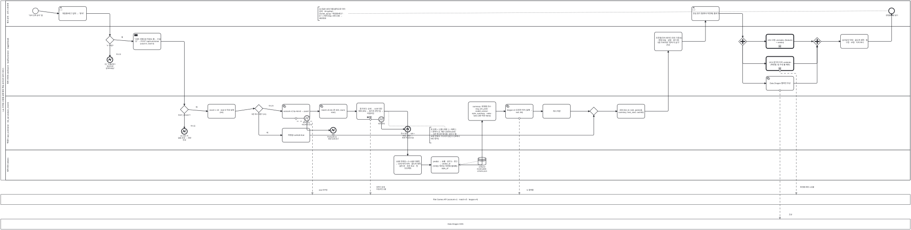

<details><summary>BPMN 2.0 XML 소스 보기 (`diagrams/bpmn_uc03.bpmn` 과 동일 — Camunda Modeler · bpmn.io 에서 열림)</summary>

```xml
<?xml version="1.0" encoding="UTF-8"?>
<bpmn:definitions xmlns:bpmn="http://www.omg.org/spec/BPMN/20100524/MODEL" xmlns:bpmndi="http://www.omg.org/spec/BPMN/20100524/DI" xmlns:dc="http://www.omg.org/spec/DD/20100524/DC" xmlns:di="http://www.omg.org/spec/DD/20100524/DI" id="Definitions_bpmn_uc03" name="UC3 소환사 최근 경기 복기·판정" targetNamespace="https://p4.sumzip.com/bpmn" exporter="bpmn_gen.py" exporterVersion="1.0">
  <bpmn:collaboration id="Collab_bpmn_uc03">
    <bpmn:participant id="Pool_bpmn_uc03" name="LoL 인게임 시점별 승패 예측·핵심 승리요인 분석 서비스" processRef="Process_bpmn_uc03" />
    <bpmn:participant id="BB_riot" name="Riot Games API (account-v1 · match-v5 · league-v4)" />
    <bpmn:participant id="BB_dd" name="Data Dragon CDN" />
    <bpmn:messageFlow id="Msg_bpmn_uc03_0" sourceRef="acct" targetRef="BB_riot" name="asia 라우팅" />
    <bpmn:messageFlow id="Msg_bpmn_uc03_1" sourceRef="per" targetRef="BB_riot" name="판마다 상세 · 타임라인 2콜" />
    <bpmn:messageFlow id="Msg_bpmn_uc03_2" sourceRef="rank" targetRef="BB_riot" name="kr 플랫폼" />
    <bpmn:messageFlow id="Msg_bpmn_uc03_3" sourceRef="uc4" targetRef="BB_riot" name="행 펼칠 때만 ≤10콜" />
    <bpmn:messageFlow id="Msg_bpmn_uc03_4" sourceRef="dd" targetRef="BB_dd" name="초상" />
  </bpmn:collaboration>
  <bpmn:process id="Process_bpmn_uc03" name="UC3 소환사 최근 경기 복기·판정" isExecutable="false">
    <bpmn:laneSet id="LaneSet_bpmn_uc03">
      <bpmn:lane id="Lane_bpmn_uc03_0" name="랭크 유저 · 코치·스트리머">
        <bpmn:flowNodeRef>s</bpmn:flowNodeRef>
        <bpmn:flowNodeRef>inp</bpmn:flowNodeRef>
        <bpmn:flowNodeRef>expand</bpmn:flowNodeRef>
        <bpmn:flowNodeRef>e</bpmn:flowNodeRef>
      </bpmn:lane>
      <bpmn:lane id="Lane_bpmn_uc03_1" name="화면·프런트 (doSearch · loadSummoner · toggleDetail)">
        <bpmn:flowNodeRef>g_hash</bpmn:flowNodeRef>
        <bpmn:flowNodeRef>e2</bpmn:flowNodeRef>
        <bpmn:flowNodeRef>post</bpmn:flowNodeRef>
        <bpmn:flowNodeRef>show1</bpmn:flowNodeRef>
        <bpmn:flowNodeRef>p0</bpmn:flowNodeRef>
        <bpmn:flowNodeRef>uc2</bpmn:flowNodeRef>
        <bpmn:flowNodeRef>uc4</bpmn:flowNodeRef>
        <bpmn:flowNodeRef>dd</bpmn:flowNodeRef>
        <bpmn:flowNodeRef>p1</bpmn:flowNodeRef>
        <bpmn:flowNodeRef>show2</bpmn:flowNodeRef>
      </bpmn:lane>
      <bpmn:lane id="Lane_bpmn_uc03_2" name="백엔드 (api_summoner · riot_api.analyze_recent)">
        <bpmn:flowNodeRef>g_ready</bpmn:flowNodeRef>
        <bpmn:flowNodeRef>e1</bpmn:flowNodeRef>
        <bpmn:flowNodeRef>clamp</bpmn:flowNodeRef>
        <bpmn:flowNodeRef>g_cache</bpmn:flowNodeRef>
        <bpmn:flowNodeRef>cached</bpmn:flowNodeRef>
        <bpmn:flowNodeRef>acct</bpmn:flowNodeRef>
        <bpmn:flowNodeRef>b34</bpmn:flowNodeRef>
        <bpmn:flowNodeRef>e34</bpmn:flowNodeRef>
        <bpmn:flowNodeRef>ids</bpmn:flowNodeRef>
        <bpmn:flowNodeRef>per</bpmn:flowNodeRef>
        <bpmn:flowNodeRef>b6</bpmn:flowNodeRef>
        <bpmn:flowNodeRef>e6</bpmn:flowNodeRef>
        <bpmn:flowNodeRef>sum</bpmn:flowNodeRef>
        <bpmn:flowNodeRef>rank</bpmn:flowNodeRef>
        <bpmn:flowNodeRef>save</bpmn:flowNodeRef>
        <bpmn:flowNodeRef>g_m1</bpmn:flowNodeRef>
        <bpmn:flowNodeRef>ok</bpmn:flowNodeRef>
      </bpmn:lane>
      <bpmn:lane id="Lane_bpmn_uc03_3" name="예측 엔진 (lolwin)">
        <bpmn:flowNodeRef>feat</bpmn:flowNodeRef>
        <bpmn:flowNodeRef>pred</bpmn:flowNodeRef>
      </bpmn:lane>
    </bpmn:laneSet>
    <bpmn:startEvent id="s" name="&quot;유저 전적 분석&quot; 탭">
      <bpmn:outgoing>Flow_bpmn_uc03_0</bpmn:outgoing>
    </bpmn:startEvent>
    <bpmn:userTask id="inp" name="게임명#태그 입력 → &quot;분석&quot;">
      <bpmn:incoming>Flow_bpmn_uc03_0</bpmn:incoming>
      <bpmn:outgoing>Flow_bpmn_uc03_1</bpmn:outgoing>
    </bpmn:userTask>
    <bpmn:exclusiveGateway id="g_hash" name="&quot;#&quot; 포함?">
      <bpmn:incoming>Flow_bpmn_uc03_1</bpmn:incoming>
      <bpmn:outgoing>Flow_bpmn_uc03_2</bpmn:outgoing>
      <bpmn:outgoing>Flow_bpmn_uc03_3</bpmn:outgoing>
    </bpmn:exclusiveGateway>
    <bpmn:endEvent id="e2" name="E2 &quot;이름#태그 형식으로 입력하세요&quot;">
      <bpmn:incoming>Flow_bpmn_uc03_2</bpmn:incoming>
      <bpmn:errorEventDefinition id="EvDef_e2" />
    </bpmn:endEvent>
    <bpmn:sendTask id="post" name="&quot;10분 시점으로 되감는 중… 수십 초&quot; → POST /api/summoner (count 5, start 0)">
      <bpmn:incoming>Flow_bpmn_uc03_3</bpmn:incoming>
      <bpmn:outgoing>Flow_bpmn_uc03_4</bpmn:outgoing>
    </bpmn:sendTask>
    <bpmn:exclusiveGateway id="g_ready" name="RIOT_READY?">
      <bpmn:incoming>Flow_bpmn_uc03_4</bpmn:incoming>
      <bpmn:outgoing>Flow_bpmn_uc03_5</bpmn:outgoing>
      <bpmn:outgoing>Flow_bpmn_uc03_6</bpmn:outgoing>
    </bpmn:exclusiveGateway>
    <bpmn:endEvent id="e1" name="E1 503 키 없음·만료 → 화면 안내">
      <bpmn:incoming>Flow_bpmn_uc03_5</bpmn:incoming>
      <bpmn:errorEventDefinition id="EvDef_e1" />
    </bpmn:endEvent>
    <bpmn:task id="clamp" name="count 1~10 · start 0 이상 보정 (A4)">
      <bpmn:incoming>Flow_bpmn_uc03_6</bpmn:incoming>
      <bpmn:outgoing>Flow_bpmn_uc03_7</bpmn:outgoing>
    </bpmn:task>
    <bpmn:exclusiveGateway id="g_cache" name="5분 캐시 적중? (A1)">
      <bpmn:incoming>Flow_bpmn_uc03_7</bpmn:incoming>
      <bpmn:outgoing>Flow_bpmn_uc03_8</bpmn:outgoing>
      <bpmn:outgoing>Flow_bpmn_uc03_9</bpmn:outgoing>
    </bpmn:exclusiveGateway>
    <bpmn:task id="cached" name="저장값 cached=true">
      <bpmn:incoming>Flow_bpmn_uc03_8</bpmn:incoming>
      <bpmn:outgoing>Flow_bpmn_uc03_20</bpmn:outgoing>
    </bpmn:task>
    <bpmn:serviceTask id="acct" name="account-v1 by-riot-id → puuid">
      <bpmn:incoming>Flow_bpmn_uc03_9</bpmn:incoming>
      <bpmn:outgoing>Flow_bpmn_uc03_11</bpmn:outgoing>
    </bpmn:serviceTask>
    <bpmn:boundaryEvent id="b34" name="404 (E3) · 401/403 (E4)" attachedToRef="acct" cancelActivity="true">
      <bpmn:outgoing>Flow_bpmn_uc03_10</bpmn:outgoing>
      <bpmn:errorEventDefinition id="EvDef_b34" />
    </bpmn:boundaryEvent>
    <bpmn:endEvent id="e34" name="400 RiotApiError → 화면 오류 문구">
      <bpmn:incoming>Flow_bpmn_uc03_10</bpmn:incoming>
      <bpmn:errorEventDefinition id="EvDef_e34" />
    </bpmn:endEvent>
    <bpmn:serviceTask id="ids" name="match-v5 ids (큐 420, count, start)">
      <bpmn:incoming>Flow_bpmn_uc03_11</bpmn:incoming>
      <bpmn:outgoing>Flow_bpmn_uc03_12</bpmn:outgoing>
    </bpmn:serviceTask>
    <bpmn:subProcess id="per" name="경기마다: 상세 → 11분 미만 제외 (E5) → 참가자·본인 팀 → 타임라인" triggeredByEvent="false">
      <bpmn:incoming>Flow_bpmn_uc03_12</bpmn:incoming>
      <bpmn:outgoing>Flow_bpmn_uc03_14</bpmn:outgoing>
      <bpmn:multiInstanceLoopCharacteristics isSequential="true" />
    </bpmn:subProcess>
    <bpmn:boundaryEvent id="b6" name="429 (E6)" attachedToRef="per" cancelActivity="true">
      <bpmn:outgoing>Flow_bpmn_uc03_13</bpmn:outgoing>
      <bpmn:errorEventDefinition id="EvDef_b6" />
    </bpmn:boundaryEvent>
    <bpmn:endEvent id="e6" name="즉시 중단 → 429 + retry_after → 화면 카운트다운">
      <bpmn:incoming>Flow_bpmn_uc03_13</bpmn:incoming>
      <bpmn:errorEventDefinition id="EvDef_e6" />
    </bpmn:endEvent>
    <bpmn:task id="feat" name="10분 프레임 + 0~10분 이벤트 → 13개 차이 피처 · 골드차 궤적 · 갈린 분 · 라인 비교 · 첫 오브젝트">
      <bpmn:incoming>Flow_bpmn_uc03_14</bpmn:incoming>
      <bpmn:outgoing>Flow_bpmn_uc03_15</bpmn:outgoing>
    </bpmn:task>
    <bpmn:task id="pred" name="predict → 승률 · 요인 5 · 경고 → verdict_of (우세승·역전승·역전패·열세패) · style_of">
      <bpmn:incoming>Flow_bpmn_uc03_15</bpmn:incoming>
      <bpmn:outgoing>Flow_bpmn_uc03_16</bpmn:outgoing>
      <bpmn:dataInputAssociation id="DIA_ds_model_pred"><bpmn:sourceRef>ds_model</bpmn:sourceRef></bpmn:dataInputAssociation>
    </bpmn:task>
    <bpmn:dataStoreReference id="ds_model" name="artifacts/ model.joblib · schema.json" />
    <bpmn:task id="sum" name="summary: 판정별 건수 · avg_win_prob · model_correct · style_summary · radar · lane (3판 미만 None)">
      <bpmn:incoming>Flow_bpmn_uc03_16</bpmn:incoming>
      <bpmn:outgoing>Flow_bpmn_uc03_17</bpmn:outgoing>
    </bpmn:task>
    <bpmn:serviceTask id="rank" name="league-v4 조회자 티어 (실패 → null, E8)">
      <bpmn:incoming>Flow_bpmn_uc03_17</bpmn:incoming>
      <bpmn:outgoing>Flow_bpmn_uc03_18</bpmn:outgoing>
    </bpmn:serviceTask>
    <bpmn:task id="save" name="캐시 저장">
      <bpmn:incoming>Flow_bpmn_uc03_18</bpmn:incoming>
      <bpmn:outgoing>Flow_bpmn_uc03_19</bpmn:outgoing>
    </bpmn:task>
    <bpmn:exclusiveGateway id="g_m1">
      <bpmn:incoming>Flow_bpmn_uc03_19</bpmn:incoming>
      <bpmn:incoming>Flow_bpmn_uc03_20</bpmn:incoming>
      <bpmn:outgoing>Flow_bpmn_uc03_21</bpmn:outgoing>
    </bpmn:exclusiveGateway>
    <bpmn:task id="ok" name="200 {riot_id, rank, games[], summary, next_start, cached}">
      <bpmn:incoming>Flow_bpmn_uc03_21</bpmn:incoming>
      <bpmn:outgoing>Flow_bpmn_uc03_22</bpmn:outgoing>
    </bpmn:task>
    <bpmn:task id="show1" name="프로필(티어·레이더·라인 기준선) · 판정 타일 · 성향 · 경기 행 · 5판 가득이면 &quot;전적 더 보기&quot; (A2)">
      <bpmn:incoming>Flow_bpmn_uc03_22</bpmn:incoming>
      <bpmn:outgoing>Flow_bpmn_uc03_23</bpmn:outgoing>
    </bpmn:task>
    <bpmn:userTask id="expand" name="관심 경기 행(특히 역전패) 펼치기">
      <bpmn:incoming>Flow_bpmn_uc03_23</bpmn:incoming>
      <bpmn:outgoing>Flow_bpmn_uc03_24</bpmn:outgoing>
    </bpmn:userTask>
    <bpmn:parallelGateway id="p0">
      <bpmn:incoming>Flow_bpmn_uc03_24</bpmn:incoming>
      <bpmn:outgoing>Flow_bpmn_uc03_25</bpmn:outgoing>
      <bpmn:outgoing>Flow_bpmn_uc03_26</bpmn:outgoing>
      <bpmn:outgoing>Flow_bpmn_uc03_27</bpmn:outgoing>
    </bpmn:parallelGateway>
    <bpmn:callActivity id="uc2" name="UC2 코칭 «include» (features + verdict)">
      <bpmn:incoming>Flow_bpmn_uc03_25</bpmn:incoming>
      <bpmn:outgoing>Flow_bpmn_uc03_28</bpmn:outgoing>
    </bpmn:callActivity>
    <bpmn:callActivity id="uc4" name="UC4 참가자 티어 «extend» (확장점: 팀 구성 볼 때만)">
      <bpmn:incoming>Flow_bpmn_uc03_26</bpmn:incoming>
      <bpmn:outgoing>Flow_bpmn_uc03_29</bpmn:outgoing>
    </bpmn:callActivity>
    <bpmn:serviceTask id="dd" name="Data Dragon 챔피언 초상">
      <bpmn:incoming>Flow_bpmn_uc03_27</bpmn:incoming>
      <bpmn:outgoing>Flow_bpmn_uc03_30</bpmn:outgoing>
    </bpmn:serviceTask>
    <bpmn:parallelGateway id="p1">
      <bpmn:incoming>Flow_bpmn_uc03_28</bpmn:incoming>
      <bpmn:incoming>Flow_bpmn_uc03_29</bpmn:incoming>
      <bpmn:incoming>Flow_bpmn_uc03_30</bpmn:incoming>
      <bpmn:outgoing>Flow_bpmn_uc03_31</bpmn:outgoing>
    </bpmn:parallelGateway>
    <bpmn:task id="show2" name="승리요인 막대 · 골드차 궤적 · 팀 구성 · 코칭 · 티어 표시">
      <bpmn:incoming>Flow_bpmn_uc03_31</bpmn:incoming>
      <bpmn:outgoing>Flow_bpmn_uc03_32</bpmn:outgoing>
    </bpmn:task>
    <bpmn:endEvent id="e" name="판정별 처방 읽기">
      <bpmn:incoming>Flow_bpmn_uc03_32</bpmn:incoming>
    </bpmn:endEvent>
    <bpmn:textAnnotation id="n_budget"><bpmn:text>한 요청 ≈ 12콜 (계정 1 + 목록 1 + 판마다 2). 예산 100회/120초 → 5분 캐시로 재사용. 429 는 웹 요청 안에서 기다리지 않는다 (프록시 502 방지)</bpmn:text></bpmn:textAnnotation>
    <bpmn:textAnnotation id="n_alt"><bpmn:text>A3 팀원·상대 이름 클릭으로 이어 검색 · A5 python src/riot_api.py &quot;게임명#태그&quot; · E7 그 밖의 Riot·서버 오류 → 400/500</bpmn:text></bpmn:textAnnotation>
    <bpmn:sequenceFlow id="Flow_bpmn_uc03_0" sourceRef="s" targetRef="inp" />
    <bpmn:sequenceFlow id="Flow_bpmn_uc03_1" sourceRef="inp" targetRef="g_hash" />
    <bpmn:sequenceFlow id="Flow_bpmn_uc03_2" sourceRef="g_hash" targetRef="e2" name="아니오" />
    <bpmn:sequenceFlow id="Flow_bpmn_uc03_3" sourceRef="g_hash" targetRef="post" name="예" />
    <bpmn:sequenceFlow id="Flow_bpmn_uc03_4" sourceRef="post" targetRef="g_ready" />
    <bpmn:sequenceFlow id="Flow_bpmn_uc03_5" sourceRef="g_ready" targetRef="e1" name="아니오" />
    <bpmn:sequenceFlow id="Flow_bpmn_uc03_6" sourceRef="g_ready" targetRef="clamp" name="예" />
    <bpmn:sequenceFlow id="Flow_bpmn_uc03_7" sourceRef="clamp" targetRef="g_cache" />
    <bpmn:sequenceFlow id="Flow_bpmn_uc03_8" sourceRef="g_cache" targetRef="cached" name="예" />
    <bpmn:sequenceFlow id="Flow_bpmn_uc03_9" sourceRef="g_cache" targetRef="acct" name="아니오" />
    <bpmn:sequenceFlow id="Flow_bpmn_uc03_10" sourceRef="b34" targetRef="e34" />
    <bpmn:sequenceFlow id="Flow_bpmn_uc03_11" sourceRef="acct" targetRef="ids" />
    <bpmn:sequenceFlow id="Flow_bpmn_uc03_12" sourceRef="ids" targetRef="per" />
    <bpmn:sequenceFlow id="Flow_bpmn_uc03_13" sourceRef="b6" targetRef="e6" />
    <bpmn:sequenceFlow id="Flow_bpmn_uc03_14" sourceRef="per" targetRef="feat" />
    <bpmn:sequenceFlow id="Flow_bpmn_uc03_15" sourceRef="feat" targetRef="pred" />
    <bpmn:sequenceFlow id="Flow_bpmn_uc03_16" sourceRef="pred" targetRef="sum" />
    <bpmn:sequenceFlow id="Flow_bpmn_uc03_17" sourceRef="sum" targetRef="rank" />
    <bpmn:sequenceFlow id="Flow_bpmn_uc03_18" sourceRef="rank" targetRef="save" />
    <bpmn:sequenceFlow id="Flow_bpmn_uc03_19" sourceRef="save" targetRef="g_m1" />
    <bpmn:sequenceFlow id="Flow_bpmn_uc03_20" sourceRef="cached" targetRef="g_m1" />
    <bpmn:sequenceFlow id="Flow_bpmn_uc03_21" sourceRef="g_m1" targetRef="ok" />
    <bpmn:sequenceFlow id="Flow_bpmn_uc03_22" sourceRef="ok" targetRef="show1" />
    <bpmn:sequenceFlow id="Flow_bpmn_uc03_23" sourceRef="show1" targetRef="expand" />
    <bpmn:sequenceFlow id="Flow_bpmn_uc03_24" sourceRef="expand" targetRef="p0" />
    <bpmn:sequenceFlow id="Flow_bpmn_uc03_25" sourceRef="p0" targetRef="uc2" />
    <bpmn:sequenceFlow id="Flow_bpmn_uc03_26" sourceRef="p0" targetRef="uc4" />
    <bpmn:sequenceFlow id="Flow_bpmn_uc03_27" sourceRef="p0" targetRef="dd" />
    <bpmn:sequenceFlow id="Flow_bpmn_uc03_28" sourceRef="uc2" targetRef="p1" />
    <bpmn:sequenceFlow id="Flow_bpmn_uc03_29" sourceRef="uc4" targetRef="p1" />
    <bpmn:sequenceFlow id="Flow_bpmn_uc03_30" sourceRef="dd" targetRef="p1" />
    <bpmn:sequenceFlow id="Flow_bpmn_uc03_31" sourceRef="p1" targetRef="show2" />
    <bpmn:sequenceFlow id="Flow_bpmn_uc03_32" sourceRef="show2" targetRef="e" />
    <bpmn:association id="Assoc_bpmn_uc03_1" sourceRef="n_budget" targetRef="per" />
    <bpmn:association id="Assoc_bpmn_uc03_2" sourceRef="n_alt" targetRef="e" />
  </bpmn:process>
  <bpmndi:BPMNDiagram id="Diagram_bpmn_uc03">
    <bpmndi:BPMNPlane id="Plane_bpmn_uc03" bpmnElement="Collab_bpmn_uc03">
      <bpmndi:BPMNShape id="Pool_bpmn_uc03_di" bpmnElement="Pool_bpmn_uc03" isHorizontal="true"><dc:Bounds x="40" y="20" width="5668" height="1123.0" /></bpmndi:BPMNShape>
      <bpmndi:BPMNShape id="Lane_bpmn_uc03_0_di" bpmnElement="Lane_bpmn_uc03_0" isHorizontal="true"><dc:Bounds x="70" y="20" width="5638" height="160" /></bpmndi:BPMNShape>
      <bpmndi:BPMNShape id="Lane_bpmn_uc03_1_di" bpmnElement="Lane_bpmn_uc03_1" isHorizontal="true"><dc:Bounds x="70" y="180" width="5638" height="437.0" /></bpmndi:BPMNShape>
      <bpmndi:BPMNShape id="Lane_bpmn_uc03_2_di" bpmnElement="Lane_bpmn_uc03_2" isHorizontal="true"><dc:Bounds x="70" y="617.0" width="5638" height="337.0" /></bpmndi:BPMNShape>
      <bpmndi:BPMNShape id="Lane_bpmn_uc03_3_di" bpmnElement="Lane_bpmn_uc03_3" isHorizontal="true"><dc:Bounds x="70" y="954.0" width="5638" height="189.0" /></bpmndi:BPMNShape>
      <bpmndi:BPMNShape id="BB_riot_di" bpmnElement="BB_riot" isHorizontal="true"><dc:Bounds x="40" y="1233.0" width="5668" height="64" /></bpmndi:BPMNShape>
      <bpmndi:BPMNShape id="BB_dd_di" bpmnElement="BB_dd" isHorizontal="true"><dc:Bounds x="40" y="1387.0" width="5668" height="64" /></bpmndi:BPMNShape>
      <bpmndi:BPMNShape id="s_di" bpmnElement="s"><dc:Bounds x="238" y="65" width="36" height="36" />
        <bpmndi:BPMNLabel><dc:Bounds x="196" y="105" width="120" height="28" /></bpmndi:BPMNLabel>
      </bpmndi:BPMNShape>
      <bpmndi:BPMNShape id="inp_di" bpmnElement="inp"><dc:Bounds x="402" y="56" width="172" height="88" />
      </bpmndi:BPMNShape>
      <bpmndi:BPMNShape id="g_hash_di" bpmnElement="g_hash"><dc:Bounds x="695" y="240" width="50" height="50" />
        <bpmndi:BPMNLabel><dc:Bounds x="660" y="294" width="120" height="28" /></bpmndi:BPMNLabel>
      </bpmndi:BPMNShape>
      <bpmndi:BPMNShape id="e2_di" bpmnElement="e2"><dc:Bounds x="702" y="371" width="36" height="36" />
        <bpmndi:BPMNLabel><dc:Bounds x="660" y="411" width="120" height="28" /></bpmndi:BPMNLabel>
      </bpmndi:BPMNShape>
      <bpmndi:BPMNShape id="post_di" bpmnElement="post"><dc:Bounds x="866" y="223" width="172" height="102.5" />
      </bpmndi:BPMNShape>
      <bpmndi:BPMNShape id="g_ready_di" bpmnElement="g_ready"><dc:Bounds x="1159" y="676" width="50" height="50" />
        <bpmndi:BPMNLabel><dc:Bounds x="1124" y="730" width="120" height="28" /></bpmndi:BPMNLabel>
      </bpmndi:BPMNShape>
      <bpmndi:BPMNShape id="e1_di" bpmnElement="e1"><dc:Bounds x="1166" y="820" width="36" height="36" />
        <bpmndi:BPMNLabel><dc:Bounds x="1124" y="860" width="120" height="28" /></bpmndi:BPMNLabel>
      </bpmndi:BPMNShape>
      <bpmndi:BPMNShape id="clamp_di" bpmnElement="clamp"><dc:Bounds x="1330" y="668" width="172" height="88" />
      </bpmndi:BPMNShape>
      <bpmndi:BPMNShape id="g_cache_di" bpmnElement="g_cache"><dc:Bounds x="1623" y="670" width="50" height="50" />
        <bpmndi:BPMNLabel><dc:Bounds x="1588" y="724" width="120" height="28" /></bpmndi:BPMNLabel>
      </bpmndi:BPMNShape>
      <bpmndi:BPMNShape id="cached_di" bpmnElement="cached"><dc:Bounds x="1794" y="818" width="172" height="88" />
      </bpmndi:BPMNShape>
      <bpmndi:BPMNShape id="acct_di" bpmnElement="acct"><dc:Bounds x="1794" y="668" width="172" height="88" />
      </bpmndi:BPMNShape>
      <bpmndi:BPMNShape id="b34_di" bpmnElement="b34"><dc:Bounds x="1930" y="738" width="36" height="36" />
        <bpmndi:BPMNLabel><dc:Bounds x="1906" y="776" width="84" height="28" /></bpmndi:BPMNLabel>
      </bpmndi:BPMNShape>
      <bpmndi:BPMNShape id="e34_di" bpmnElement="e34"><dc:Bounds x="2094" y="813" width="36" height="36" />
        <bpmndi:BPMNLabel><dc:Bounds x="2052" y="853" width="120" height="28" /></bpmndi:BPMNLabel>
      </bpmndi:BPMNShape>
      <bpmndi:BPMNShape id="ids_di" bpmnElement="ids"><dc:Bounds x="2026" y="668" width="172" height="88" />
      </bpmndi:BPMNShape>
      <bpmndi:BPMNShape id="per_di" bpmnElement="per" isExpanded="false"><dc:Bounds x="2258" y="660" width="172" height="102.5" />
      </bpmndi:BPMNShape>
      <bpmndi:BPMNShape id="b6_di" bpmnElement="b6"><dc:Bounds x="2394" y="745" width="36" height="36" />
        <bpmndi:BPMNLabel><dc:Bounds x="2370" y="783" width="84" height="28" /></bpmndi:BPMNLabel>
      </bpmndi:BPMNShape>
      <bpmndi:BPMNShape id="e6_di" bpmnElement="e6"><dc:Bounds x="2558" y="806" width="36" height="36" />
        <bpmndi:BPMNLabel><dc:Bounds x="2516" y="846" width="120" height="28" /></bpmndi:BPMNLabel>
      </bpmndi:BPMNShape>
      <bpmndi:BPMNShape id="feat_di" bpmnElement="feat"><dc:Bounds x="2490" y="990" width="172" height="117.0" />
      </bpmndi:BPMNShape>
      <bpmndi:BPMNShape id="pred_di" bpmnElement="pred"><dc:Bounds x="2722" y="997" width="172" height="102.5" />
      </bpmndi:BPMNShape>
      <bpmndi:BPMNShape id="ds_model_di" bpmnElement="ds_model"><dc:Bounds x="3015" y="1000" width="50" height="50" />
        <bpmndi:BPMNLabel><dc:Bounds x="2980" y="1054" width="120" height="28" /></bpmndi:BPMNLabel>
      </bpmndi:BPMNShape>
      <bpmndi:BPMNShape id="sum_di" bpmnElement="sum"><dc:Bounds x="2954" y="653" width="172" height="117.0" />
      </bpmndi:BPMNShape>
      <bpmndi:BPMNShape id="rank_di" bpmnElement="rank"><dc:Bounds x="3186" y="668" width="172" height="88" />
      </bpmndi:BPMNShape>
      <bpmndi:BPMNShape id="save_di" bpmnElement="save"><dc:Bounds x="3418" y="668" width="172" height="88" />
      </bpmndi:BPMNShape>
      <bpmndi:BPMNShape id="g_m1_di" bpmnElement="g_m1"><dc:Bounds x="3711" y="686" width="50" height="50" />
      </bpmndi:BPMNShape>
      <bpmndi:BPMNShape id="ok_di" bpmnElement="ok"><dc:Bounds x="3882" y="668" width="172" height="88" />
      </bpmndi:BPMNShape>
      <bpmndi:BPMNShape id="show1_di" bpmnElement="show1"><dc:Bounds x="4114" y="216" width="172" height="117.0" />
      </bpmndi:BPMNShape>
      <bpmndi:BPMNShape id="expand_di" bpmnElement="expand"><dc:Bounds x="4346" y="56" width="172" height="88" />
      </bpmndi:BPMNShape>
      <bpmndi:BPMNShape id="p0_di" bpmnElement="p0"><dc:Bounds x="4639" y="250" width="50" height="50" />
      </bpmndi:BPMNShape>
      <bpmndi:BPMNShape id="uc2_di" bpmnElement="uc2"><dc:Bounds x="4810" y="230" width="172" height="88" />
      </bpmndi:BPMNShape>
      <bpmndi:BPMNShape id="uc4_di" bpmnElement="uc4"><dc:Bounds x="4810" y="369" width="172" height="88" />
      </bpmndi:BPMNShape>
      <bpmndi:BPMNShape id="dd_di" bpmnElement="dd"><dc:Bounds x="4810" y="493" width="172" height="88" />
      </bpmndi:BPMNShape>
      <bpmndi:BPMNShape id="p1_di" bpmnElement="p1"><dc:Bounds x="5103" y="250" width="50" height="50" />
      </bpmndi:BPMNShape>
      <bpmndi:BPMNShape id="show2_di" bpmnElement="show2"><dc:Bounds x="5274" y="230" width="172" height="88" />
      </bpmndi:BPMNShape>
      <bpmndi:BPMNShape id="e_di" bpmnElement="e"><dc:Bounds x="5574" y="65" width="36" height="36" />
        <bpmndi:BPMNLabel><dc:Bounds x="5532" y="105" width="120" height="28" /></bpmndi:BPMNLabel>
      </bpmndi:BPMNShape>
      <bpmndi:BPMNShape id="n_budget_di" bpmnElement="n_budget"><dc:Bounds x="2713" y="812" width="190" height="99.0" />
      </bpmndi:BPMNShape>
      <bpmndi:BPMNShape id="n_alt_di" bpmnElement="n_alt"><dc:Bounds x="2017" y="58" width="190" height="84.5" />
      </bpmndi:BPMNShape>
      <bpmndi:BPMNEdge id="Flow_bpmn_uc03_0_di" bpmnElement="Flow_bpmn_uc03_0">
        <di:waypoint x="274" y="83" />
        <di:waypoint x="402" y="100" />
      </bpmndi:BPMNEdge>
      <bpmndi:BPMNEdge id="Flow_bpmn_uc03_1_di" bpmnElement="Flow_bpmn_uc03_1">
        <di:waypoint x="574" y="100" />
        <di:waypoint x="720" y="100" />
        <di:waypoint x="720" y="240" />
      </bpmndi:BPMNEdge>
      <bpmndi:BPMNEdge id="Flow_bpmn_uc03_2_di" bpmnElement="Flow_bpmn_uc03_2">
        <di:waypoint x="720" y="290" />
        <di:waypoint x="720" y="371" />
        <bpmndi:BPMNLabel><dc:Bounds x="728" y="349" width="90" height="18" /></bpmndi:BPMNLabel>
      </bpmndi:BPMNEdge>
      <bpmndi:BPMNEdge id="Flow_bpmn_uc03_3_di" bpmnElement="Flow_bpmn_uc03_3">
        <di:waypoint x="745" y="264" />
        <di:waypoint x="866" y="274" />
        <bpmndi:BPMNLabel><dc:Bounds x="751" y="242" width="90" height="18" /></bpmndi:BPMNLabel>
      </bpmndi:BPMNEdge>
      <bpmndi:BPMNEdge id="Flow_bpmn_uc03_4_di" bpmnElement="Flow_bpmn_uc03_4">
        <di:waypoint x="1038" y="274" />
        <di:waypoint x="1184" y="274" />
        <di:waypoint x="1184" y="676" />
      </bpmndi:BPMNEdge>
      <bpmndi:BPMNEdge id="Flow_bpmn_uc03_5_di" bpmnElement="Flow_bpmn_uc03_5">
        <di:waypoint x="1184" y="726" />
        <di:waypoint x="1184" y="820" />
        <bpmndi:BPMNLabel><dc:Bounds x="1192" y="798" width="90" height="18" /></bpmndi:BPMNLabel>
      </bpmndi:BPMNEdge>
      <bpmndi:BPMNEdge id="Flow_bpmn_uc03_6_di" bpmnElement="Flow_bpmn_uc03_6">
        <di:waypoint x="1209" y="702" />
        <di:waypoint x="1330" y="712" />
        <bpmndi:BPMNLabel><dc:Bounds x="1215" y="680" width="90" height="18" /></bpmndi:BPMNLabel>
      </bpmndi:BPMNEdge>
      <bpmndi:BPMNEdge id="Flow_bpmn_uc03_7_di" bpmnElement="Flow_bpmn_uc03_7">
        <di:waypoint x="1502" y="712" />
        <di:waypoint x="1623" y="694" />
      </bpmndi:BPMNEdge>
      <bpmndi:BPMNEdge id="Flow_bpmn_uc03_8_di" bpmnElement="Flow_bpmn_uc03_8">
        <di:waypoint x="1648" y="720" />
        <di:waypoint x="1648" y="862" />
        <di:waypoint x="1794" y="862" />
        <bpmndi:BPMNLabel><dc:Bounds x="1656" y="840" width="90" height="18" /></bpmndi:BPMNLabel>
      </bpmndi:BPMNEdge>
      <bpmndi:BPMNEdge id="Flow_bpmn_uc03_9_di" bpmnElement="Flow_bpmn_uc03_9">
        <di:waypoint x="1673" y="694" />
        <di:waypoint x="1794" y="712" />
        <bpmndi:BPMNLabel><dc:Bounds x="1679" y="672" width="90" height="18" /></bpmndi:BPMNLabel>
      </bpmndi:BPMNEdge>
      <bpmndi:BPMNEdge id="Flow_bpmn_uc03_10_di" bpmnElement="Flow_bpmn_uc03_10">
        <di:waypoint x="1948" y="774" />
        <di:waypoint x="1948" y="831" />
        <di:waypoint x="2094" y="831" />
      </bpmndi:BPMNEdge>
      <bpmndi:BPMNEdge id="Flow_bpmn_uc03_11_di" bpmnElement="Flow_bpmn_uc03_11">
        <di:waypoint x="1966" y="712" />
        <di:waypoint x="2026" y="712" />
      </bpmndi:BPMNEdge>
      <bpmndi:BPMNEdge id="Flow_bpmn_uc03_12_di" bpmnElement="Flow_bpmn_uc03_12">
        <di:waypoint x="2198" y="712" />
        <di:waypoint x="2258" y="712" />
      </bpmndi:BPMNEdge>
      <bpmndi:BPMNEdge id="Flow_bpmn_uc03_13_di" bpmnElement="Flow_bpmn_uc03_13">
        <di:waypoint x="2412" y="781" />
        <di:waypoint x="2412" y="824" />
        <di:waypoint x="2558" y="824" />
      </bpmndi:BPMNEdge>
      <bpmndi:BPMNEdge id="Flow_bpmn_uc03_14_di" bpmnElement="Flow_bpmn_uc03_14">
        <di:waypoint x="2430" y="712" />
        <di:waypoint x="2576" y="712" />
        <di:waypoint x="2576" y="990" />
      </bpmndi:BPMNEdge>
      <bpmndi:BPMNEdge id="Flow_bpmn_uc03_15_di" bpmnElement="Flow_bpmn_uc03_15">
        <di:waypoint x="2662" y="1048" />
        <di:waypoint x="2722" y="1048" />
      </bpmndi:BPMNEdge>
      <bpmndi:BPMNEdge id="Flow_bpmn_uc03_16_di" bpmnElement="Flow_bpmn_uc03_16">
        <di:waypoint x="2894" y="1048" />
        <di:waypoint x="3040" y="1048" />
        <di:waypoint x="3040" y="770" />
      </bpmndi:BPMNEdge>
      <bpmndi:BPMNEdge id="Flow_bpmn_uc03_17_di" bpmnElement="Flow_bpmn_uc03_17">
        <di:waypoint x="3126" y="712" />
        <di:waypoint x="3186" y="712" />
      </bpmndi:BPMNEdge>
      <bpmndi:BPMNEdge id="Flow_bpmn_uc03_18_di" bpmnElement="Flow_bpmn_uc03_18">
        <di:waypoint x="3358" y="712" />
        <di:waypoint x="3418" y="712" />
      </bpmndi:BPMNEdge>
      <bpmndi:BPMNEdge id="Flow_bpmn_uc03_19_di" bpmnElement="Flow_bpmn_uc03_19">
        <di:waypoint x="3590" y="712" />
        <di:waypoint x="3711" y="712" />
      </bpmndi:BPMNEdge>
      <bpmndi:BPMNEdge id="Flow_bpmn_uc03_20_di" bpmnElement="Flow_bpmn_uc03_20">
        <di:waypoint x="1966" y="862" />
        <di:waypoint x="3736" y="862" />
        <di:waypoint x="3736" y="736" />
      </bpmndi:BPMNEdge>
      <bpmndi:BPMNEdge id="Flow_bpmn_uc03_21_di" bpmnElement="Flow_bpmn_uc03_21">
        <di:waypoint x="3761" y="712" />
        <di:waypoint x="3882" y="712" />
      </bpmndi:BPMNEdge>
      <bpmndi:BPMNEdge id="Flow_bpmn_uc03_22_di" bpmnElement="Flow_bpmn_uc03_22">
        <di:waypoint x="4054" y="712" />
        <di:waypoint x="4200" y="712" />
        <di:waypoint x="4200" y="333" />
      </bpmndi:BPMNEdge>
      <bpmndi:BPMNEdge id="Flow_bpmn_uc03_23_di" bpmnElement="Flow_bpmn_uc03_23">
        <di:waypoint x="4286" y="274" />
        <di:waypoint x="4432" y="274" />
        <di:waypoint x="4432" y="144" />
      </bpmndi:BPMNEdge>
      <bpmndi:BPMNEdge id="Flow_bpmn_uc03_24_di" bpmnElement="Flow_bpmn_uc03_24">
        <di:waypoint x="4518" y="100" />
        <di:waypoint x="4664" y="100" />
        <di:waypoint x="4664" y="250" />
      </bpmndi:BPMNEdge>
      <bpmndi:BPMNEdge id="Flow_bpmn_uc03_25_di" bpmnElement="Flow_bpmn_uc03_25">
        <di:waypoint x="4689" y="274" />
        <di:waypoint x="4810" y="274" />
      </bpmndi:BPMNEdge>
      <bpmndi:BPMNEdge id="Flow_bpmn_uc03_26_di" bpmnElement="Flow_bpmn_uc03_26">
        <di:waypoint x="4664" y="300" />
        <di:waypoint x="4664" y="413" />
        <di:waypoint x="4810" y="413" />
      </bpmndi:BPMNEdge>
      <bpmndi:BPMNEdge id="Flow_bpmn_uc03_27_di" bpmnElement="Flow_bpmn_uc03_27">
        <di:waypoint x="4664" y="300" />
        <di:waypoint x="4664" y="537" />
        <di:waypoint x="4810" y="537" />
      </bpmndi:BPMNEdge>
      <bpmndi:BPMNEdge id="Flow_bpmn_uc03_28_di" bpmnElement="Flow_bpmn_uc03_28">
        <di:waypoint x="4982" y="274" />
        <di:waypoint x="5103" y="274" />
      </bpmndi:BPMNEdge>
      <bpmndi:BPMNEdge id="Flow_bpmn_uc03_29_di" bpmnElement="Flow_bpmn_uc03_29">
        <di:waypoint x="4982" y="413" />
        <di:waypoint x="5128" y="413" />
        <di:waypoint x="5128" y="300" />
      </bpmndi:BPMNEdge>
      <bpmndi:BPMNEdge id="Flow_bpmn_uc03_30_di" bpmnElement="Flow_bpmn_uc03_30">
        <di:waypoint x="4982" y="537" />
        <di:waypoint x="5128" y="537" />
        <di:waypoint x="5128" y="300" />
      </bpmndi:BPMNEdge>
      <bpmndi:BPMNEdge id="Flow_bpmn_uc03_31_di" bpmnElement="Flow_bpmn_uc03_31">
        <di:waypoint x="5153" y="274" />
        <di:waypoint x="5274" y="274" />
      </bpmndi:BPMNEdge>
      <bpmndi:BPMNEdge id="Flow_bpmn_uc03_32_di" bpmnElement="Flow_bpmn_uc03_32">
        <di:waypoint x="5446" y="274" />
        <di:waypoint x="5592" y="274" />
        <di:waypoint x="5592" y="101" />
      </bpmndi:BPMNEdge>
      <bpmndi:BPMNEdge id="Msg_bpmn_uc03_0_di" bpmnElement="Msg_bpmn_uc03_0">
        <di:waypoint x="1880" y="756" />
        <di:waypoint x="1880" y="774" />
        <di:waypoint x="1982" y="774" />
        <di:waypoint x="1982" y="1233" />
        <bpmndi:BPMNLabel><dc:Bounds x="1988" y="1199" width="120" height="18" /></bpmndi:BPMNLabel>
      </bpmndi:BPMNEdge>
      <bpmndi:BPMNEdge id="Msg_bpmn_uc03_1_di" bpmnElement="Msg_bpmn_uc03_1">
        <di:waypoint x="2344" y="763" />
        <di:waypoint x="2344" y="1233" />
        <bpmndi:BPMNLabel><dc:Bounds x="2350" y="1181" width="120" height="18" /></bpmndi:BPMNLabel>
      </bpmndi:BPMNEdge>
      <bpmndi:BPMNEdge id="Msg_bpmn_uc03_2_di" bpmnElement="Msg_bpmn_uc03_2">
        <di:waypoint x="3272" y="756" />
        <di:waypoint x="3272" y="1233" />
        <bpmndi:BPMNLabel><dc:Bounds x="3278" y="1199" width="120" height="18" /></bpmndi:BPMNLabel>
      </bpmndi:BPMNEdge>
      <bpmndi:BPMNEdge id="Msg_bpmn_uc03_3_di" bpmnElement="Msg_bpmn_uc03_3">
        <di:waypoint x="4896" y="457" />
        <di:waypoint x="4896" y="475" />
        <di:waypoint x="4998" y="475" />
        <di:waypoint x="4998" y="1233" />
        <bpmndi:BPMNLabel><dc:Bounds x="5004" y="1181" width="120" height="18" /></bpmndi:BPMNLabel>
      </bpmndi:BPMNEdge>
      <bpmndi:BPMNEdge id="Msg_bpmn_uc03_4_di" bpmnElement="Msg_bpmn_uc03_4">
        <di:waypoint x="4896" y="581" />
        <di:waypoint x="4896" y="1387" />
        <bpmndi:BPMNLabel><dc:Bounds x="4902" y="1353" width="120" height="18" /></bpmndi:BPMNLabel>
      </bpmndi:BPMNEdge>
      <bpmndi:BPMNEdge id="DIA_ds_model_pred_di" bpmnElement="DIA_ds_model_pred">
        <di:waypoint x="3015" y="1024" />
        <di:waypoint x="2894" y="1048" />
      </bpmndi:BPMNEdge>
      <bpmndi:BPMNEdge id="Assoc_bpmn_uc03_1_di" bpmnElement="Assoc_bpmn_uc03_1">
        <di:waypoint x="2808" y="812" />
        <di:waypoint x="2808" y="804" />
        <di:waypoint x="2458" y="804" />
        <di:waypoint x="2458" y="712" />
        <di:waypoint x="2430" y="712" />
      </bpmndi:BPMNEdge>
      <bpmndi:BPMNEdge id="Assoc_bpmn_uc03_2_di" bpmnElement="Assoc_bpmn_uc03_2">
        <di:waypoint x="2207" y="100" />
        <di:waypoint x="5574" y="83" />
      </bpmndi:BPMNEdge>
    </bpmndi:BPMNPlane>
  </bpmndi:BPMNDiagram>
</bpmn:definitions>
```

</details>

**BPMN 으로 보이는 것.** 가장 긴 흐름이다. 백엔드 레인의 "5분 캐시 적중?" 게이트웨이가 예이면 Riot 풀로 가는 **메시지 흐름이 하나도 없이** 저장값으로 곧장 응답한다(A1).
아니오이면 account-v1 → match-v5 ids → **접힌 하위 프로세스 "경기마다"**(순차 반복) 순으로 Riot 풀과 메시지를 주고받는다. 하위 프로세스에 붙은 **429 오류 경계 이벤트**가 반복 어디서든 즉시 중단해 `retry_after` 를 돌려주는 E6 이다.
결과가 그려진 뒤 이용자가 경기 행을 펼치면 병렬 게이트웨이가 UC2 호출(«include»)·UC4 호출(«extend»)·Data Dragon 초상 세 갈래를 동시에 연다.

| BPMN 요소 | UC3 원천 | 뜻 |
|---|---|---|
| 배타 게이트웨이 "\"#\" 포함?" | E2 | 화면이 서버를 부르지 않고 안내 |
| 배타 게이트웨이 "RIOT_READY?" | E1 | 503, P4(UC14) 산출물에 의존 |
| 배타 게이트웨이 "5분 캐시 적중?" | A1 | Riot 호출 0회 |
| 오류 경계 이벤트 "404 · 401/403" | E3 · E4 | 계정 없음 · 키 만료 |
| 하위 프로세스 "경기마다" + 429 경계 이벤트 | 기본흐름 4~7, E5 · E6 | 11분 미만 제외, 즉시 중단 |
| 메시지 흐름 4개 (Riot) + 1개 (Data Dragon) | 시퀀스 4·5·8, 10 | 외부 통신은 모두 풀 사이 파선 |
| 병렬 게이트웨이 (행 펼침) | 시퀀스 10, «include»·«extend» | 세 요청 동시 |

### 4.4 UC4 참가자 솔로랭크 티어 조회 — [UC_04](UC_04_참가자티어조회.md)

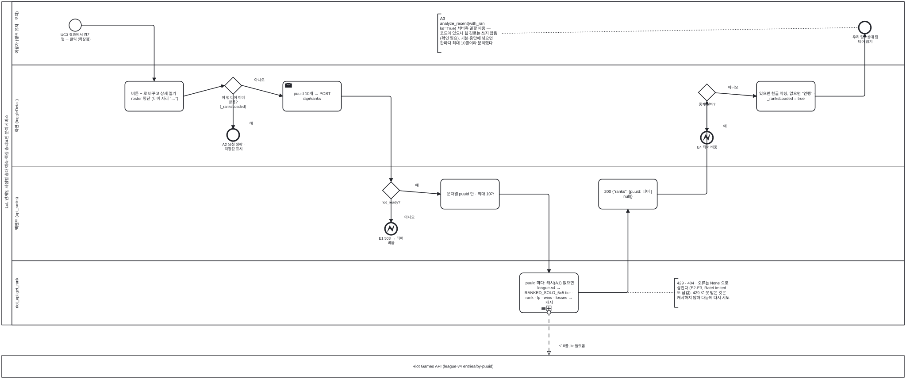

<details><summary>BPMN 2.0 XML 소스 보기 (`diagrams/bpmn_uc04.bpmn` 과 동일 — Camunda Modeler · bpmn.io 에서 열림)</summary>

```xml
<?xml version="1.0" encoding="UTF-8"?>
<bpmn:definitions xmlns:bpmn="http://www.omg.org/spec/BPMN/20100524/MODEL" xmlns:bpmndi="http://www.omg.org/spec/BPMN/20100524/DI" xmlns:dc="http://www.omg.org/spec/DD/20100524/DC" xmlns:di="http://www.omg.org/spec/DD/20100524/DI" id="Definitions_bpmn_uc04" name="UC4 참가자 솔로랭크 티어 조회 (UC3 «extend»)" targetNamespace="https://p4.sumzip.com/bpmn" exporter="bpmn_gen.py" exporterVersion="1.0">
  <bpmn:collaboration id="Collab_bpmn_uc04">
    <bpmn:participant id="Pool_bpmn_uc04" name="LoL 인게임 시점별 승패 예측·핵심 승리요인 분석 서비스" processRef="Process_bpmn_uc04" />
    <bpmn:participant id="BB_riot" name="Riot Games API (league-v4 entries/by-puuid)" />
    <bpmn:messageFlow id="Msg_bpmn_uc04_0" sourceRef="per" targetRef="BB_riot" name="≤10콜, kr 플랫폼" />
  </bpmn:collaboration>
  <bpmn:process id="Process_bpmn_uc04" name="UC4 참가자 솔로랭크 티어 조회 (UC3 «extend»)" isExecutable="false">
    <bpmn:laneSet id="LaneSet_bpmn_uc04">
      <bpmn:lane id="Lane_bpmn_uc04_0" name="이용자 (랭크 유저 · 코치)">
        <bpmn:flowNodeRef>s</bpmn:flowNodeRef>
        <bpmn:flowNodeRef>e</bpmn:flowNodeRef>
      </bpmn:lane>
      <bpmn:lane id="Lane_bpmn_uc04_1" name="화면 (toggleDetail)">
        <bpmn:flowNodeRef>open</bpmn:flowNodeRef>
        <bpmn:flowNodeRef>g_loaded</bpmn:flowNodeRef>
        <bpmn:flowNodeRef>e_a2</bpmn:flowNodeRef>
        <bpmn:flowNodeRef>post</bpmn:flowNodeRef>
        <bpmn:flowNodeRef>g_fail</bpmn:flowNodeRef>
        <bpmn:flowNodeRef>e4</bpmn:flowNodeRef>
        <bpmn:flowNodeRef>show</bpmn:flowNodeRef>
      </bpmn:lane>
      <bpmn:lane id="Lane_bpmn_uc04_2" name="백엔드 (api_ranks)">
        <bpmn:flowNodeRef>g_ready</bpmn:flowNodeRef>
        <bpmn:flowNodeRef>e1</bpmn:flowNodeRef>
        <bpmn:flowNodeRef>filt</bpmn:flowNodeRef>
        <bpmn:flowNodeRef>ok</bpmn:flowNodeRef>
      </bpmn:lane>
      <bpmn:lane id="Lane_bpmn_uc04_3" name="riot_api.get_rank">
        <bpmn:flowNodeRef>per</bpmn:flowNodeRef>
      </bpmn:lane>
    </bpmn:laneSet>
    <bpmn:startEvent id="s" name="UC3 결과에서 경기 행 ＋ 클릭 (확장점)">
      <bpmn:outgoing>Flow_bpmn_uc04_0</bpmn:outgoing>
    </bpmn:startEvent>
    <bpmn:task id="open" name="버튼 − 로 바꾸고 상세 열기 · roster 명단 (티어 자리 &quot;…&quot;)">
      <bpmn:incoming>Flow_bpmn_uc04_0</bpmn:incoming>
      <bpmn:outgoing>Flow_bpmn_uc04_1</bpmn:outgoing>
    </bpmn:task>
    <bpmn:exclusiveGateway id="g_loaded" name="이 행 티어 이미 받음? (_ranksLoaded)">
      <bpmn:incoming>Flow_bpmn_uc04_1</bpmn:incoming>
      <bpmn:outgoing>Flow_bpmn_uc04_2</bpmn:outgoing>
      <bpmn:outgoing>Flow_bpmn_uc04_3</bpmn:outgoing>
    </bpmn:exclusiveGateway>
    <bpmn:endEvent id="e_a2" name="A2 요청 생략 · 저장값 표시">
      <bpmn:incoming>Flow_bpmn_uc04_2</bpmn:incoming>
    </bpmn:endEvent>
    <bpmn:sendTask id="post" name="puuid 10개 → POST /api/ranks">
      <bpmn:incoming>Flow_bpmn_uc04_3</bpmn:incoming>
      <bpmn:outgoing>Flow_bpmn_uc04_4</bpmn:outgoing>
    </bpmn:sendTask>
    <bpmn:exclusiveGateway id="g_ready" name="riot_ready?">
      <bpmn:incoming>Flow_bpmn_uc04_4</bpmn:incoming>
      <bpmn:outgoing>Flow_bpmn_uc04_5</bpmn:outgoing>
      <bpmn:outgoing>Flow_bpmn_uc04_6</bpmn:outgoing>
    </bpmn:exclusiveGateway>
    <bpmn:endEvent id="e1" name="E1 503 → 티어 비움">
      <bpmn:incoming>Flow_bpmn_uc04_5</bpmn:incoming>
      <bpmn:errorEventDefinition id="EvDef_e1" />
    </bpmn:endEvent>
    <bpmn:task id="filt" name="문자열 puuid 만 · 최대 10개">
      <bpmn:incoming>Flow_bpmn_uc04_6</bpmn:incoming>
      <bpmn:outgoing>Flow_bpmn_uc04_7</bpmn:outgoing>
    </bpmn:task>
    <bpmn:subProcess id="per" name="puuid 마다: 캐시(A1) 없으면 league-v4 → RANKED_SOLO_5x5 tier · rank · lp · wins · losses → 캐시" triggeredByEvent="false">
      <bpmn:incoming>Flow_bpmn_uc04_7</bpmn:incoming>
      <bpmn:outgoing>Flow_bpmn_uc04_8</bpmn:outgoing>
      <bpmn:multiInstanceLoopCharacteristics isSequential="true" />
    </bpmn:subProcess>
    <bpmn:textAnnotation id="n_none"><bpmn:text>429 · 404 · 오류는 None 으로 삼킨다 (E2·E3, RateLimited 도 삼킴). 429 로 못 받은 것은 캐시하지 않아 다음에 다시 시도</bpmn:text></bpmn:textAnnotation>
    <bpmn:task id="ok" name="200 {&quot;ranks&quot;: {puuid: 티어 | null}}">
      <bpmn:incoming>Flow_bpmn_uc04_8</bpmn:incoming>
      <bpmn:outgoing>Flow_bpmn_uc04_9</bpmn:outgoing>
    </bpmn:task>
    <bpmn:exclusiveGateway id="g_fail" name="중계 실패?">
      <bpmn:incoming>Flow_bpmn_uc04_9</bpmn:incoming>
      <bpmn:outgoing>Flow_bpmn_uc04_10</bpmn:outgoing>
      <bpmn:outgoing>Flow_bpmn_uc04_11</bpmn:outgoing>
    </bpmn:exclusiveGateway>
    <bpmn:endEvent id="e4" name="E4 티어 비움">
      <bpmn:incoming>Flow_bpmn_uc04_10</bpmn:incoming>
      <bpmn:errorEventDefinition id="EvDef_e4" />
    </bpmn:endEvent>
    <bpmn:task id="show" name="있으면 한글 약칭, 없으면 &quot;언랭&quot; · _ranksLoaded = true">
      <bpmn:incoming>Flow_bpmn_uc04_11</bpmn:incoming>
      <bpmn:outgoing>Flow_bpmn_uc04_12</bpmn:outgoing>
    </bpmn:task>
    <bpmn:endEvent id="e" name="우리 팀 · 상대 팀 티어 읽기">
      <bpmn:incoming>Flow_bpmn_uc04_12</bpmn:incoming>
    </bpmn:endEvent>
    <bpmn:textAnnotation id="n_a3"><bpmn:text>A3 analyze_recent(with_ranks=True) 서버측 일괄 채움 — 코드에 있으나 웹 경로는 쓰지 않음 (확인 필요). 기본 응답에 넣으면 판마다 최대 10콜이라 분리했다</bpmn:text></bpmn:textAnnotation>
    <bpmn:sequenceFlow id="Flow_bpmn_uc04_0" sourceRef="s" targetRef="open" />
    <bpmn:sequenceFlow id="Flow_bpmn_uc04_1" sourceRef="open" targetRef="g_loaded" />
    <bpmn:sequenceFlow id="Flow_bpmn_uc04_2" sourceRef="g_loaded" targetRef="e_a2" name="예" />
    <bpmn:sequenceFlow id="Flow_bpmn_uc04_3" sourceRef="g_loaded" targetRef="post" name="아니오" />
    <bpmn:sequenceFlow id="Flow_bpmn_uc04_4" sourceRef="post" targetRef="g_ready" />
    <bpmn:sequenceFlow id="Flow_bpmn_uc04_5" sourceRef="g_ready" targetRef="e1" name="아니오" />
    <bpmn:sequenceFlow id="Flow_bpmn_uc04_6" sourceRef="g_ready" targetRef="filt" name="예" />
    <bpmn:sequenceFlow id="Flow_bpmn_uc04_7" sourceRef="filt" targetRef="per" />
    <bpmn:sequenceFlow id="Flow_bpmn_uc04_8" sourceRef="per" targetRef="ok" />
    <bpmn:sequenceFlow id="Flow_bpmn_uc04_9" sourceRef="ok" targetRef="g_fail" />
    <bpmn:sequenceFlow id="Flow_bpmn_uc04_10" sourceRef="g_fail" targetRef="e4" name="예" />
    <bpmn:sequenceFlow id="Flow_bpmn_uc04_11" sourceRef="g_fail" targetRef="show" name="아니오" />
    <bpmn:sequenceFlow id="Flow_bpmn_uc04_12" sourceRef="show" targetRef="e" />
    <bpmn:association id="Assoc_bpmn_uc04_0" sourceRef="n_none" targetRef="per" />
    <bpmn:association id="Assoc_bpmn_uc04_1" sourceRef="n_a3" targetRef="e" />
  </bpmn:process>
  <bpmndi:BPMNDiagram id="Diagram_bpmn_uc04">
    <bpmndi:BPMNPlane id="Plane_bpmn_uc04" bpmnElement="Collab_bpmn_uc04">
      <bpmndi:BPMNShape id="Pool_bpmn_uc04_di" bpmnElement="Pool_bpmn_uc04" isHorizontal="true"><dc:Bounds x="40" y="20" width="2652" height="950.5" /></bpmndi:BPMNShape>
      <bpmndi:BPMNShape id="Lane_bpmn_uc04_0_di" bpmnElement="Lane_bpmn_uc04_0" isHorizontal="true"><dc:Bounds x="70" y="20" width="2622" height="185.5" /></bpmndi:BPMNShape>
      <bpmndi:BPMNShape id="Lane_bpmn_uc04_1_di" bpmnElement="Lane_bpmn_uc04_1" isHorizontal="true"><dc:Bounds x="70" y="205.5" width="2622" height="300" /></bpmndi:BPMNShape>
      <bpmndi:BPMNShape id="Lane_bpmn_uc04_2_di" bpmnElement="Lane_bpmn_uc04_2" isHorizontal="true"><dc:Bounds x="70" y="505.5" width="2622" height="276" /></bpmndi:BPMNShape>
      <bpmndi:BPMNShape id="Lane_bpmn_uc04_3_di" bpmnElement="Lane_bpmn_uc04_3" isHorizontal="true"><dc:Bounds x="70" y="781.5" width="2622" height="189.0" /></bpmndi:BPMNShape>
      <bpmndi:BPMNShape id="BB_riot_di" bpmnElement="BB_riot" isHorizontal="true"><dc:Bounds x="40" y="1060.5" width="2652" height="64" /></bpmndi:BPMNShape>
      <bpmndi:BPMNShape id="s_di" bpmnElement="s"><dc:Bounds x="238" y="71" width="36" height="36" />
        <bpmndi:BPMNLabel><dc:Bounds x="196" y="111" width="120" height="28" /></bpmndi:BPMNLabel>
      </bpmndi:BPMNShape>
      <bpmndi:BPMNShape id="open_di" bpmnElement="open"><dc:Bounds x="402" y="254" width="172" height="88" />
      </bpmndi:BPMNShape>
      <bpmndi:BPMNShape id="g_loaded_di" bpmnElement="g_loaded"><dc:Bounds x="695" y="242" width="50" height="50" />
        <bpmndi:BPMNLabel><dc:Bounds x="660" y="296" width="120" height="28" /></bpmndi:BPMNLabel>
      </bpmndi:BPMNShape>
      <bpmndi:BPMNShape id="e_a2_di" bpmnElement="e_a2"><dc:Bounds x="702" y="394" width="36" height="36" />
        <bpmndi:BPMNLabel><dc:Bounds x="660" y="434" width="120" height="28" /></bpmndi:BPMNLabel>
      </bpmndi:BPMNShape>
      <bpmndi:BPMNShape id="post_di" bpmnElement="post"><dc:Bounds x="866" y="254" width="172" height="88" />
      </bpmndi:BPMNShape>
      <bpmndi:BPMNShape id="g_ready_di" bpmnElement="g_ready"><dc:Bounds x="1159" y="550" width="50" height="50" />
        <bpmndi:BPMNLabel><dc:Bounds x="1124" y="604" width="120" height="28" /></bpmndi:BPMNLabel>
      </bpmndi:BPMNShape>
      <bpmndi:BPMNShape id="e1_di" bpmnElement="e1"><dc:Bounds x="1166" y="670" width="36" height="36" />
        <bpmndi:BPMNLabel><dc:Bounds x="1124" y="710" width="120" height="28" /></bpmndi:BPMNLabel>
      </bpmndi:BPMNShape>
      <bpmndi:BPMNShape id="filt_di" bpmnElement="filt"><dc:Bounds x="1330" y="542" width="172" height="88" />
      </bpmndi:BPMNShape>
      <bpmndi:BPMNShape id="per_di" bpmnElement="per" isExpanded="false"><dc:Bounds x="1562" y="818" width="172" height="117.0" />
      </bpmndi:BPMNShape>
      <bpmndi:BPMNShape id="n_none_di" bpmnElement="n_none"><dc:Bounds x="2017" y="834" width="190" height="84.5" />
      </bpmndi:BPMNShape>
      <bpmndi:BPMNShape id="ok_di" bpmnElement="ok"><dc:Bounds x="1794" y="542" width="172" height="88" />
      </bpmndi:BPMNShape>
      <bpmndi:BPMNShape id="g_fail_di" bpmnElement="g_fail"><dc:Bounds x="2087" y="262" width="50" height="50" />
        <bpmndi:BPMNLabel><dc:Bounds x="2052" y="316" width="120" height="28" /></bpmndi:BPMNLabel>
      </bpmndi:BPMNShape>
      <bpmndi:BPMNShape id="e4_di" bpmnElement="e4"><dc:Bounds x="2094" y="402" width="36" height="36" />
        <bpmndi:BPMNLabel><dc:Bounds x="2052" y="442" width="120" height="28" /></bpmndi:BPMNLabel>
      </bpmndi:BPMNShape>
      <bpmndi:BPMNShape id="show_di" bpmnElement="show"><dc:Bounds x="2258" y="254" width="172" height="88" />
      </bpmndi:BPMNShape>
      <bpmndi:BPMNShape id="e_di" bpmnElement="e"><dc:Bounds x="2558" y="78" width="36" height="36" />
        <bpmndi:BPMNLabel><dc:Bounds x="2516" y="118" width="120" height="28" /></bpmndi:BPMNLabel>
      </bpmndi:BPMNShape>
      <bpmndi:BPMNShape id="n_a3_di" bpmnElement="n_a3"><dc:Bounds x="1321" y="56" width="190" height="113.5" />
      </bpmndi:BPMNShape>
      <bpmndi:BPMNEdge id="Flow_bpmn_uc04_0_di" bpmnElement="Flow_bpmn_uc04_0">
        <di:waypoint x="274" y="89" />
        <di:waypoint x="488" y="89" />
        <di:waypoint x="488" y="254" />
      </bpmndi:BPMNEdge>
      <bpmndi:BPMNEdge id="Flow_bpmn_uc04_1_di" bpmnElement="Flow_bpmn_uc04_1">
        <di:waypoint x="574" y="298" />
        <di:waypoint x="695" y="266" />
      </bpmndi:BPMNEdge>
      <bpmndi:BPMNEdge id="Flow_bpmn_uc04_2_di" bpmnElement="Flow_bpmn_uc04_2">
        <di:waypoint x="720" y="292" />
        <di:waypoint x="720" y="394" />
        <bpmndi:BPMNLabel><dc:Bounds x="728" y="372" width="90" height="18" /></bpmndi:BPMNLabel>
      </bpmndi:BPMNEdge>
      <bpmndi:BPMNEdge id="Flow_bpmn_uc04_3_di" bpmnElement="Flow_bpmn_uc04_3">
        <di:waypoint x="745" y="266" />
        <di:waypoint x="866" y="298" />
        <bpmndi:BPMNLabel><dc:Bounds x="751" y="244" width="90" height="18" /></bpmndi:BPMNLabel>
      </bpmndi:BPMNEdge>
      <bpmndi:BPMNEdge id="Flow_bpmn_uc04_4_di" bpmnElement="Flow_bpmn_uc04_4">
        <di:waypoint x="1038" y="298" />
        <di:waypoint x="1184" y="298" />
        <di:waypoint x="1184" y="550" />
      </bpmndi:BPMNEdge>
      <bpmndi:BPMNEdge id="Flow_bpmn_uc04_5_di" bpmnElement="Flow_bpmn_uc04_5">
        <di:waypoint x="1184" y="600" />
        <di:waypoint x="1184" y="670" />
        <bpmndi:BPMNLabel><dc:Bounds x="1192" y="648" width="90" height="18" /></bpmndi:BPMNLabel>
      </bpmndi:BPMNEdge>
      <bpmndi:BPMNEdge id="Flow_bpmn_uc04_6_di" bpmnElement="Flow_bpmn_uc04_6">
        <di:waypoint x="1209" y="576" />
        <di:waypoint x="1330" y="586" />
        <bpmndi:BPMNLabel><dc:Bounds x="1215" y="554" width="90" height="18" /></bpmndi:BPMNLabel>
      </bpmndi:BPMNEdge>
      <bpmndi:BPMNEdge id="Flow_bpmn_uc04_7_di" bpmnElement="Flow_bpmn_uc04_7">
        <di:waypoint x="1502" y="586" />
        <di:waypoint x="1648" y="586" />
        <di:waypoint x="1648" y="818" />
      </bpmndi:BPMNEdge>
      <bpmndi:BPMNEdge id="Flow_bpmn_uc04_8_di" bpmnElement="Flow_bpmn_uc04_8">
        <di:waypoint x="1734" y="876" />
        <di:waypoint x="1880" y="876" />
        <di:waypoint x="1880" y="630" />
      </bpmndi:BPMNEdge>
      <bpmndi:BPMNEdge id="Flow_bpmn_uc04_9_di" bpmnElement="Flow_bpmn_uc04_9">
        <di:waypoint x="1966" y="586" />
        <di:waypoint x="2112" y="586" />
        <di:waypoint x="2112" y="312" />
      </bpmndi:BPMNEdge>
      <bpmndi:BPMNEdge id="Flow_bpmn_uc04_10_di" bpmnElement="Flow_bpmn_uc04_10">
        <di:waypoint x="2112" y="312" />
        <di:waypoint x="2112" y="402" />
        <bpmndi:BPMNLabel><dc:Bounds x="2120" y="380" width="90" height="18" /></bpmndi:BPMNLabel>
      </bpmndi:BPMNEdge>
      <bpmndi:BPMNEdge id="Flow_bpmn_uc04_11_di" bpmnElement="Flow_bpmn_uc04_11">
        <di:waypoint x="2137" y="288" />
        <di:waypoint x="2258" y="298" />
        <bpmndi:BPMNLabel><dc:Bounds x="2143" y="266" width="90" height="18" /></bpmndi:BPMNLabel>
      </bpmndi:BPMNEdge>
      <bpmndi:BPMNEdge id="Flow_bpmn_uc04_12_di" bpmnElement="Flow_bpmn_uc04_12">
        <di:waypoint x="2430" y="298" />
        <di:waypoint x="2576" y="298" />
        <di:waypoint x="2576" y="114" />
      </bpmndi:BPMNEdge>
      <bpmndi:BPMNEdge id="Msg_bpmn_uc04_0_di" bpmnElement="Msg_bpmn_uc04_0">
        <di:waypoint x="1648" y="934" />
        <di:waypoint x="1648" y="1060" />
        <bpmndi:BPMNLabel><dc:Bounds x="1654" y="1026" width="120" height="18" /></bpmndi:BPMNLabel>
      </bpmndi:BPMNEdge>
      <bpmndi:BPMNEdge id="Assoc_bpmn_uc04_0_di" bpmnElement="Assoc_bpmn_uc04_0">
        <di:waypoint x="2017" y="876" />
        <di:waypoint x="1734" y="876" />
      </bpmndi:BPMNEdge>
      <bpmndi:BPMNEdge id="Assoc_bpmn_uc04_1_di" bpmnElement="Assoc_bpmn_uc04_1">
        <di:waypoint x="1511" y="113" />
        <di:waypoint x="2558" y="96" />
      </bpmndi:BPMNEdge>
    </bpmndi:BPMNPlane>
  </bpmndi:BPMNDiagram>
</bpmn:definitions>
```

</details>

**BPMN 으로 보이는 것.** UC3 의 확장점에서 시작하는 짧은 흐름이다. 화면 레인의 "_ranksLoaded?" 게이트웨이가 같은 행을 다시 펼쳐도 요청을 반복하지 않게 막고(A2), `riot_api.get_rank` 레인의 **순차 반복 하위 프로세스**가 puuid 마다 캐시를 먼저 본다(A1).
429·404 는 오류 이벤트가 아니라 `None` 으로 삼켜져 흐름이 끊기지 않는다 — 그래서 경계 이벤트 대신 텍스트 주석으로 적었다.

| BPMN 요소 | UC4 원천 | 뜻 |
|---|---|---|
| 시작 이벤트 "경기 행 ＋ 클릭" | 확장점 | 행을 펼칠 때만 |
| 배타 게이트웨이 "_ranksLoaded?" | A2 | 요청 생략 |
| 배타 게이트웨이 "riot_ready?" | E1 | 503 → 티어 비움 |
| 하위 프로세스 (순차 반복) + 메시지 흐름 | 기본흐름 4~6, A1 | ≤10콜, 캐시 우선 |

### 4.5 UC5 예측 신뢰도·분석 리포트 열람 — [UC_05](UC_05_신뢰도리포트열람.md)

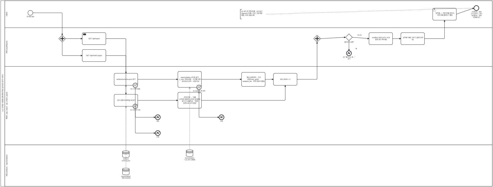

<details><summary>BPMN 2.0 XML 소스 보기 (`diagrams/bpmn_uc05.bpmn` 과 동일 — Camunda Modeler · bpmn.io 에서 열림)</summary>

```xml
<?xml version="1.0" encoding="UTF-8"?>
<bpmn:definitions xmlns:bpmn="http://www.omg.org/spec/BPMN/20100524/MODEL" xmlns:bpmndi="http://www.omg.org/spec/BPMN/20100524/DI" xmlns:dc="http://www.omg.org/spec/DD/20100524/DC" xmlns:di="http://www.omg.org/spec/DD/20100524/DI" id="Definitions_bpmn_uc05" name="UC5 예측 신뢰도·분석 리포트 열람" targetNamespace="https://p4.sumzip.com/bpmn" exporter="bpmn_gen.py" exporterVersion="1.0">
  <bpmn:collaboration id="Collab_bpmn_uc05">
    <bpmn:participant id="Pool_bpmn_uc05" name="LoL 인게임 시점별 승패 예측·핵심 승리요인 분석 서비스" processRef="Process_bpmn_uc05" />
  </bpmn:collaboration>
  <bpmn:process id="Process_bpmn_uc05" name="UC5 예측 신뢰도·분석 리포트 열람" isExecutable="false">
    <bpmn:laneSet id="LaneSet_bpmn_uc05">
      <bpmn:lane id="Lane_bpmn_uc05_0" name="이용자">
        <bpmn:flowNodeRef>s</bpmn:flowNodeRef>
        <bpmn:flowNodeRef>open</bpmn:flowNodeRef>
        <bpmn:flowNodeRef>e</bpmn:flowNodeRef>
      </bpmn:lane>
      <bpmn:lane id="Lane_bpmn_uc05_1" name="화면 (loadReport)">
        <bpmn:flowNodeRef>p0</bpmn:flowNodeRef>
        <bpmn:flowNodeRef>g1</bpmn:flowNodeRef>
        <bpmn:flowNodeRef>g2</bpmn:flowNodeRef>
        <bpmn:flowNodeRef>p1</bpmn:flowNodeRef>
        <bpmn:flowNodeRef>g_fail</bpmn:flowNodeRef>
        <bpmn:flowNodeRef>e3</bpmn:flowNodeRef>
        <bpmn:flowNodeRef>conf</bpmn:flowNodeRef>
        <bpmn:flowNodeRef>draw</bpmn:flowNodeRef>
      </bpmn:lane>
      <bpmn:lane id="Lane_bpmn_uc05_2" name="백엔드 (api_report · api_match_types)">
        <bpmn:flowNodeRef>schema</bpmn:flowNodeRef>
        <bpmn:flowNodeRef>b4</bpmn:flowNodeRef>
        <bpmn:flowNodeRef>e4</bpmn:flowNodeRef>
        <bpmn:flowNodeRef>csv</bpmn:flowNodeRef>
        <bpmn:flowNodeRef>b1</bpmn:flowNodeRef>
        <bpmn:flowNodeRef>e1</bpmn:flowNodeRef>
        <bpmn:flowNodeRef>calc</bpmn:flowNodeRef>
        <bpmn:flowNodeRef>prof</bpmn:flowNodeRef>
        <bpmn:flowNodeRef>b2</bpmn:flowNodeRef>
        <bpmn:flowNodeRef>e2</bpmn:flowNodeRef>
        <bpmn:flowNodeRef>name</bpmn:flowNodeRef>
        <bpmn:flowNodeRef>ok</bpmn:flowNodeRef>
      </bpmn:lane>
      <bpmn:lane id="Lane_bpmn_uc05_3" name="파일 (artifacts · reports/tables)">
      </bpmn:lane>
    </bpmn:laneSet>
    <bpmn:startEvent id="s" name="첫 화면 접속">
      <bpmn:outgoing>Flow_bpmn_uc05_0</bpmn:outgoing>
    </bpmn:startEvent>
    <bpmn:parallelGateway id="p0">
      <bpmn:incoming>Flow_bpmn_uc05_0</bpmn:incoming>
      <bpmn:outgoing>Flow_bpmn_uc05_1</bpmn:outgoing>
      <bpmn:outgoing>Flow_bpmn_uc05_2</bpmn:outgoing>
    </bpmn:parallelGateway>
    <bpmn:sendTask id="g1" name="GET /api/report">
      <bpmn:incoming>Flow_bpmn_uc05_1</bpmn:incoming>
      <bpmn:outgoing>Flow_bpmn_uc05_3</bpmn:outgoing>
    </bpmn:sendTask>
    <bpmn:task id="schema" name="artifacts/schema.json 읽기">
      <bpmn:incoming>Flow_bpmn_uc05_3</bpmn:incoming>
      <bpmn:outgoing>Flow_bpmn_uc05_5</bpmn:outgoing>
      <bpmn:dataInputAssociation id="DIA_ds_schema_schema"><bpmn:sourceRef>ds_schema</bpmn:sourceRef></bpmn:dataInputAssociation>
    </bpmn:task>
    <bpmn:boundaryEvent id="b4" name="E4 스키마 없음" attachedToRef="schema" cancelActivity="true">
      <bpmn:outgoing>Flow_bpmn_uc05_4</bpmn:outgoing>
      <bpmn:errorEventDefinition id="EvDef_b4" />
    </bpmn:boundaryEvent>
    <bpmn:endEvent id="e4" name="500">
      <bpmn:incoming>Flow_bpmn_uc05_4</bpmn:incoming>
      <bpmn:errorEventDefinition id="EvDef_e4" />
    </bpmn:endEvent>
    <bpmn:dataStoreReference id="ds_schema" name="artifacts/ schema.json" />
    <bpmn:task id="csv" name="reports/tables 4개 표 읽기 (_csv): 반복 실험 · 구간별 오류 · 승리요인 순위 · 시점 비교">
      <bpmn:incoming>Flow_bpmn_uc05_5</bpmn:incoming>
      <bpmn:outgoing>Flow_bpmn_uc05_7</bpmn:outgoing>
      <bpmn:dataInputAssociation id="DIA_ds_tables_csv"><bpmn:sourceRef>ds_tables</bpmn:sourceRef></bpmn:dataInputAssociation>
    </bpmn:task>
    <bpmn:boundaryEvent id="b1" name="E1 표 없음 (옛 경로 A2)" attachedToRef="csv" cancelActivity="true">
      <bpmn:outgoing>Flow_bpmn_uc05_6</bpmn:outgoing>
      <bpmn:errorEventDefinition id="EvDef_b1" />
    </bpmn:boundaryEvent>
    <bpmn:endEvent id="e1" name="오류">
      <bpmn:incoming>Flow_bpmn_uc05_6</bpmn:incoming>
      <bpmn:errorEventDefinition id="EvDef_e1" />
    </bpmn:endEvent>
    <bpmn:dataStoreReference id="ds_tables" name="reports/tables/ *.csv (P3 산출물)" />
    <bpmn:task id="calc" name="평균·표준편차 · 구간 상한(max_gold) · weakest_bin · 피처 한글 이름표">
      <bpmn:incoming>Flow_bpmn_uc05_7</bpmn:incoming>
      <bpmn:outgoing>Flow_bpmn_uc05_8</bpmn:outgoing>
    </bpmn:task>
    <bpmn:task id="g2" name="GET /api/match-types">
      <bpmn:incoming>Flow_bpmn_uc05_2</bpmn:incoming>
      <bpmn:outgoing>Flow_bpmn_uc05_9</bpmn:outgoing>
    </bpmn:task>
    <bpmn:task id="prof" name="경기 유형 프로파일 표 읽기">
      <bpmn:incoming>Flow_bpmn_uc05_9</bpmn:incoming>
      <bpmn:outgoing>Flow_bpmn_uc05_11</bpmn:outgoing>
      <bpmn:dataInputAssociation id="DIA_ds_prof_prof"><bpmn:sourceRef>ds_prof</bpmn:sourceRef></bpmn:dataInputAssociation>
    </bpmn:task>
    <bpmn:boundaryEvent id="b2" name="E2 군집 표 이상" attachedToRef="prof" cancelActivity="true">
      <bpmn:outgoing>Flow_bpmn_uc05_10</bpmn:outgoing>
      <bpmn:errorEventDefinition id="EvDef_b2" />
    </bpmn:boundaryEvent>
    <bpmn:endEvent id="e2" name="오류">
      <bpmn:incoming>Flow_bpmn_uc05_10</bpmn:incoming>
      <bpmn:errorEventDefinition id="EvDef_e2" />
    </bpmn:endEvent>
    <bpmn:dataStoreReference id="ds_prof" name="reports/tables/ 유형 프로파일" />
    <bpmn:task id="name" name="군집 번호 → 이름 (시야전·일방적·난타전·운영전) · 경기 수 내림차순 · &quot;예측 입력으로 쓰지 않음&quot;">
      <bpmn:incoming>Flow_bpmn_uc05_11</bpmn:incoming>
      <bpmn:outgoing>Flow_bpmn_uc05_12</bpmn:outgoing>
    </bpmn:task>
    <bpmn:task id="ok" name="200 JSON × 2">
      <bpmn:incoming>Flow_bpmn_uc05_8</bpmn:incoming>
      <bpmn:incoming>Flow_bpmn_uc05_12</bpmn:incoming>
      <bpmn:outgoing>Flow_bpmn_uc05_13</bpmn:outgoing>
    </bpmn:task>
    <bpmn:parallelGateway id="p1">
      <bpmn:incoming>Flow_bpmn_uc05_13</bpmn:incoming>
      <bpmn:outgoing>Flow_bpmn_uc05_14</bpmn:outgoing>
    </bpmn:parallelGateway>
    <bpmn:exclusiveGateway id="g_fail" name="불러오기 실패?">
      <bpmn:incoming>Flow_bpmn_uc05_14</bpmn:incoming>
      <bpmn:outgoing>Flow_bpmn_uc05_15</bpmn:outgoing>
      <bpmn:outgoing>Flow_bpmn_uc05_16</bpmn:outgoing>
    </bpmn:exclusiveGateway>
    <bpmn:endEvent id="e3" name="E3 &quot;불러오는 중…&quot; 유지">
      <bpmn:incoming>Flow_bpmn_uc05_15</bpmn:incoming>
      <bpmn:errorEventDefinition id="EvDef_e3" />
    </bpmn:endEvent>
    <bpmn:task id="conf" name="confBins 보관 (UC1·UC3 접전 경고 재사용)">
      <bpmn:incoming>Flow_bpmn_uc05_16</bpmn:incoming>
      <bpmn:outgoing>Flow_bpmn_uc05_17</bpmn:outgoing>
    </bpmn:task>
    <bpmn:task id="draw" name="성적표 내용 그리기 (접힌 상자 안)">
      <bpmn:incoming>Flow_bpmn_uc05_17</bpmn:incoming>
      <bpmn:outgoing>Flow_bpmn_uc05_18</bpmn:outgoing>
    </bpmn:task>
    <bpmn:userTask id="open" name="&quot;성적표 — 어떤 판을 맞히고, 어떤 판을 틀리나&quot; 펼침">
      <bpmn:incoming>Flow_bpmn_uc05_18</bpmn:incoming>
      <bpmn:outgoing>Flow_bpmn_uc05_19</bpmn:outgoing>
    </bpmn:userTask>
    <bpmn:endEvent id="e" name="구간별 표 · 판정 근거 상위 3 · 경기 성격별 표 · 전체 적중률 읽기">
      <bpmn:incoming>Flow_bpmn_uc05_19</bpmn:incoming>
    </bpmn:endEvent>
    <bpmn:textAnnotation id="n_alt"><bpmn:text>A1 API 만 직접 호출 · A3 GET /figures/&lt;이름&gt; 으로 그림 원본 열람. 외부 호출 0회</bpmn:text></bpmn:textAnnotation>
    <bpmn:sequenceFlow id="Flow_bpmn_uc05_0" sourceRef="s" targetRef="p0" />
    <bpmn:sequenceFlow id="Flow_bpmn_uc05_1" sourceRef="p0" targetRef="g1" />
    <bpmn:sequenceFlow id="Flow_bpmn_uc05_2" sourceRef="p0" targetRef="g2" />
    <bpmn:sequenceFlow id="Flow_bpmn_uc05_3" sourceRef="g1" targetRef="schema" />
    <bpmn:sequenceFlow id="Flow_bpmn_uc05_4" sourceRef="b4" targetRef="e4" />
    <bpmn:sequenceFlow id="Flow_bpmn_uc05_5" sourceRef="schema" targetRef="csv" />
    <bpmn:sequenceFlow id="Flow_bpmn_uc05_6" sourceRef="b1" targetRef="e1" />
    <bpmn:sequenceFlow id="Flow_bpmn_uc05_7" sourceRef="csv" targetRef="calc" />
    <bpmn:sequenceFlow id="Flow_bpmn_uc05_8" sourceRef="calc" targetRef="ok" />
    <bpmn:sequenceFlow id="Flow_bpmn_uc05_9" sourceRef="g2" targetRef="prof" />
    <bpmn:sequenceFlow id="Flow_bpmn_uc05_10" sourceRef="b2" targetRef="e2" />
    <bpmn:sequenceFlow id="Flow_bpmn_uc05_11" sourceRef="prof" targetRef="name" />
    <bpmn:sequenceFlow id="Flow_bpmn_uc05_12" sourceRef="name" targetRef="ok" />
    <bpmn:sequenceFlow id="Flow_bpmn_uc05_13" sourceRef="ok" targetRef="p1" />
    <bpmn:sequenceFlow id="Flow_bpmn_uc05_14" sourceRef="p1" targetRef="g_fail" />
    <bpmn:sequenceFlow id="Flow_bpmn_uc05_15" sourceRef="g_fail" targetRef="e3" name="예" />
    <bpmn:sequenceFlow id="Flow_bpmn_uc05_16" sourceRef="g_fail" targetRef="conf" name="아니오" />
    <bpmn:sequenceFlow id="Flow_bpmn_uc05_17" sourceRef="conf" targetRef="draw" />
    <bpmn:sequenceFlow id="Flow_bpmn_uc05_18" sourceRef="draw" targetRef="open" />
    <bpmn:sequenceFlow id="Flow_bpmn_uc05_19" sourceRef="open" targetRef="e" />
    <bpmn:association id="Assoc_bpmn_uc05_3" sourceRef="n_alt" targetRef="e" />
  </bpmn:process>
  <bpmndi:BPMNDiagram id="Diagram_bpmn_uc05">
    <bpmndi:BPMNPlane id="Plane_bpmn_uc05" bpmnElement="Collab_bpmn_uc05">
      <bpmndi:BPMNShape id="Pool_bpmn_uc05_di" bpmnElement="Pool_bpmn_uc05" isHorizontal="true"><dc:Bounds x="40" y="20" width="3580" height="1360.0" /></bpmndi:BPMNShape>
      <bpmndi:BPMNShape id="Lane_bpmn_uc05_0_di" bpmnElement="Lane_bpmn_uc05_0" isHorizontal="true"><dc:Bounds x="70" y="20" width="3550" height="198" /></bpmndi:BPMNShape>
      <bpmndi:BPMNShape id="Lane_bpmn_uc05_1_di" bpmnElement="Lane_bpmn_uc05_1" isHorizontal="true"><dc:Bounds x="70" y="218" width="3550" height="284" /></bpmndi:BPMNShape>
      <bpmndi:BPMNShape id="Lane_bpmn_uc05_2_di" bpmnElement="Lane_bpmn_uc05_2" isHorizontal="true"><dc:Bounds x="70" y="502" width="3550" height="574.0" /></bpmndi:BPMNShape>
      <bpmndi:BPMNShape id="Lane_bpmn_uc05_3_di" bpmnElement="Lane_bpmn_uc05_3" isHorizontal="true"><dc:Bounds x="70" y="1076.0" width="3550" height="304" /></bpmndi:BPMNShape>
      <bpmndi:BPMNShape id="s_di" bpmnElement="s"><dc:Bounds x="238" y="91" width="36" height="36" />
        <bpmndi:BPMNLabel><dc:Bounds x="196" y="131" width="120" height="28" /></bpmndi:BPMNLabel>
      </bpmndi:BPMNShape>
      <bpmndi:BPMNShape id="p0_di" bpmnElement="p0"><dc:Bounds x="463" y="273" width="50" height="50" />
      </bpmndi:BPMNShape>
      <bpmndi:BPMNShape id="g1_di" bpmnElement="g1"><dc:Bounds x="634" y="254" width="172" height="88" />
      </bpmndi:BPMNShape>
      <bpmndi:BPMNShape id="schema_di" bpmnElement="schema"><dc:Bounds x="866" y="552" width="172" height="88" />
      </bpmndi:BPMNShape>
      <bpmndi:BPMNShape id="b4_di" bpmnElement="b4"><dc:Bounds x="1002" y="622" width="36" height="36" />
        <bpmndi:BPMNLabel><dc:Bounds x="978" y="660" width="84" height="28" /></bpmndi:BPMNLabel>
      </bpmndi:BPMNShape>
      <bpmndi:BPMNShape id="e4_di" bpmnElement="e4"><dc:Bounds x="1166" y="856" width="36" height="36" />
        <bpmndi:BPMNLabel><dc:Bounds x="1124" y="896" width="120" height="28" /></bpmndi:BPMNLabel>
      </bpmndi:BPMNShape>
      <bpmndi:BPMNShape id="ds_schema_di" bpmnElement="ds_schema"><dc:Bounds x="927" y="1119" width="50" height="50" />
        <bpmndi:BPMNLabel><dc:Bounds x="892" y="1173" width="120" height="28" /></bpmndi:BPMNLabel>
      </bpmndi:BPMNShape>
      <bpmndi:BPMNShape id="csv_di" bpmnElement="csv"><dc:Bounds x="1330" y="538" width="172" height="117.0" />
      </bpmndi:BPMNShape>
      <bpmndi:BPMNShape id="b1_di" bpmnElement="b1"><dc:Bounds x="1466" y="637" width="36" height="36" />
        <bpmndi:BPMNLabel><dc:Bounds x="1442" y="675" width="84" height="28" /></bpmndi:BPMNLabel>
      </bpmndi:BPMNShape>
      <bpmndi:BPMNShape id="e1_di" bpmnElement="e1"><dc:Bounds x="1630" y="856" width="36" height="36" />
        <bpmndi:BPMNLabel><dc:Bounds x="1588" y="896" width="120" height="28" /></bpmndi:BPMNLabel>
      </bpmndi:BPMNShape>
      <bpmndi:BPMNShape id="ds_tables_di" bpmnElement="ds_tables"><dc:Bounds x="1391" y="1112" width="50" height="50" />
        <bpmndi:BPMNLabel><dc:Bounds x="1356" y="1166" width="120" height="28" /></bpmndi:BPMNLabel>
      </bpmndi:BPMNShape>
      <bpmndi:BPMNShape id="calc_di" bpmnElement="calc"><dc:Bounds x="1794" y="545" width="172" height="102.5" />
      </bpmndi:BPMNShape>
      <bpmndi:BPMNShape id="g2_di" bpmnElement="g2"><dc:Bounds x="634" y="378" width="172" height="88" />
      </bpmndi:BPMNShape>
      <bpmndi:BPMNShape id="prof_di" bpmnElement="prof"><dc:Bounds x="866" y="706" width="172" height="88" />
      </bpmndi:BPMNShape>
      <bpmndi:BPMNShape id="b2_di" bpmnElement="b2"><dc:Bounds x="1002" y="776" width="36" height="36" />
        <bpmndi:BPMNLabel><dc:Bounds x="978" y="814" width="84" height="28" /></bpmndi:BPMNLabel>
      </bpmndi:BPMNShape>
      <bpmndi:BPMNShape id="e2_di" bpmnElement="e2"><dc:Bounds x="1166" y="972" width="36" height="36" />
        <bpmndi:BPMNLabel><dc:Bounds x="1124" y="1012" width="120" height="28" /></bpmndi:BPMNLabel>
      </bpmndi:BPMNShape>
      <bpmndi:BPMNShape id="ds_prof_di" bpmnElement="ds_prof"><dc:Bounds x="927" y="1246" width="50" height="50" />
        <bpmndi:BPMNLabel><dc:Bounds x="892" y="1300" width="120" height="28" /></bpmndi:BPMNLabel>
      </bpmndi:BPMNShape>
      <bpmndi:BPMNShape id="name_di" bpmnElement="name"><dc:Bounds x="1330" y="691" width="172" height="117.0" />
      </bpmndi:BPMNShape>
      <bpmndi:BPMNShape id="ok_di" bpmnElement="ok"><dc:Bounds x="2026" y="552" width="172" height="88" />
      </bpmndi:BPMNShape>
      <bpmndi:BPMNShape id="p1_di" bpmnElement="p1"><dc:Bounds x="2319" y="273" width="50" height="50" />
      </bpmndi:BPMNShape>
      <bpmndi:BPMNShape id="g_fail_di" bpmnElement="g_fail"><dc:Bounds x="2551" y="263" width="50" height="50" />
        <bpmndi:BPMNLabel><dc:Bounds x="2516" y="317" width="120" height="28" /></bpmndi:BPMNLabel>
      </bpmndi:BPMNShape>
      <bpmndi:BPMNShape id="e3_di" bpmnElement="e3"><dc:Bounds x="2558" y="387" width="36" height="36" />
        <bpmndi:BPMNLabel><dc:Bounds x="2516" y="427" width="120" height="28" /></bpmndi:BPMNLabel>
      </bpmndi:BPMNShape>
      <bpmndi:BPMNShape id="conf_di" bpmnElement="conf"><dc:Bounds x="2722" y="254" width="172" height="88" />
      </bpmndi:BPMNShape>
      <bpmndi:BPMNShape id="draw_di" bpmnElement="draw"><dc:Bounds x="2954" y="254" width="172" height="88" />
      </bpmndi:BPMNShape>
      <bpmndi:BPMNShape id="open_di" bpmnElement="open"><dc:Bounds x="3186" y="75" width="172" height="88" />
      </bpmndi:BPMNShape>
      <bpmndi:BPMNShape id="e_di" bpmnElement="e"><dc:Bounds x="3486" y="56" width="36" height="36" />
        <bpmndi:BPMNLabel><dc:Bounds x="3444" y="96" width="120" height="28" /></bpmndi:BPMNLabel>
      </bpmndi:BPMNShape>
      <bpmndi:BPMNShape id="n_alt_di" bpmnElement="n_alt"><dc:Bounds x="1785" y="84" width="190" height="70.0" />
      </bpmndi:BPMNShape>
      <bpmndi:BPMNEdge id="Flow_bpmn_uc05_0_di" bpmnElement="Flow_bpmn_uc05_0">
        <di:waypoint x="274" y="109" />
        <di:waypoint x="488" y="109" />
        <di:waypoint x="488" y="273" />
      </bpmndi:BPMNEdge>
      <bpmndi:BPMNEdge id="Flow_bpmn_uc05_1_di" bpmnElement="Flow_bpmn_uc05_1">
        <di:waypoint x="513" y="298" />
        <di:waypoint x="634" y="298" />
      </bpmndi:BPMNEdge>
      <bpmndi:BPMNEdge id="Flow_bpmn_uc05_2_di" bpmnElement="Flow_bpmn_uc05_2">
        <di:waypoint x="488" y="323" />
        <di:waypoint x="488" y="422" />
        <di:waypoint x="634" y="422" />
      </bpmndi:BPMNEdge>
      <bpmndi:BPMNEdge id="Flow_bpmn_uc05_3_di" bpmnElement="Flow_bpmn_uc05_3">
        <di:waypoint x="806" y="298" />
        <di:waypoint x="952" y="298" />
        <di:waypoint x="952" y="552" />
      </bpmndi:BPMNEdge>
      <bpmndi:BPMNEdge id="Flow_bpmn_uc05_4_di" bpmnElement="Flow_bpmn_uc05_4">
        <di:waypoint x="1020" y="658" />
        <di:waypoint x="1020" y="874" />
        <di:waypoint x="1166" y="874" />
      </bpmndi:BPMNEdge>
      <bpmndi:BPMNEdge id="Flow_bpmn_uc05_5_di" bpmnElement="Flow_bpmn_uc05_5">
        <di:waypoint x="1038" y="596" />
        <di:waypoint x="1330" y="596" />
      </bpmndi:BPMNEdge>
      <bpmndi:BPMNEdge id="Flow_bpmn_uc05_6_di" bpmnElement="Flow_bpmn_uc05_6">
        <di:waypoint x="1484" y="673" />
        <di:waypoint x="1484" y="874" />
        <di:waypoint x="1630" y="874" />
      </bpmndi:BPMNEdge>
      <bpmndi:BPMNEdge id="Flow_bpmn_uc05_7_di" bpmnElement="Flow_bpmn_uc05_7">
        <di:waypoint x="1502" y="596" />
        <di:waypoint x="1794" y="596" />
      </bpmndi:BPMNEdge>
      <bpmndi:BPMNEdge id="Flow_bpmn_uc05_8_di" bpmnElement="Flow_bpmn_uc05_8">
        <di:waypoint x="1966" y="596" />
        <di:waypoint x="2026" y="596" />
      </bpmndi:BPMNEdge>
      <bpmndi:BPMNEdge id="Flow_bpmn_uc05_9_di" bpmnElement="Flow_bpmn_uc05_9">
        <di:waypoint x="806" y="422" />
        <di:waypoint x="952" y="422" />
        <di:waypoint x="952" y="706" />
      </bpmndi:BPMNEdge>
      <bpmndi:BPMNEdge id="Flow_bpmn_uc05_10_di" bpmnElement="Flow_bpmn_uc05_10">
        <di:waypoint x="1020" y="812" />
        <di:waypoint x="1020" y="990" />
        <di:waypoint x="1166" y="990" />
      </bpmndi:BPMNEdge>
      <bpmndi:BPMNEdge id="Flow_bpmn_uc05_11_di" bpmnElement="Flow_bpmn_uc05_11">
        <di:waypoint x="1038" y="750" />
        <di:waypoint x="1330" y="750" />
      </bpmndi:BPMNEdge>
      <bpmndi:BPMNEdge id="Flow_bpmn_uc05_12_di" bpmnElement="Flow_bpmn_uc05_12">
        <di:waypoint x="1502" y="750" />
        <di:waypoint x="2112" y="750" />
        <di:waypoint x="2112" y="640" />
      </bpmndi:BPMNEdge>
      <bpmndi:BPMNEdge id="Flow_bpmn_uc05_13_di" bpmnElement="Flow_bpmn_uc05_13">
        <di:waypoint x="2198" y="596" />
        <di:waypoint x="2344" y="596" />
        <di:waypoint x="2344" y="323" />
      </bpmndi:BPMNEdge>
      <bpmndi:BPMNEdge id="Flow_bpmn_uc05_14_di" bpmnElement="Flow_bpmn_uc05_14">
        <di:waypoint x="2369" y="298" />
        <di:waypoint x="2551" y="288" />
      </bpmndi:BPMNEdge>
      <bpmndi:BPMNEdge id="Flow_bpmn_uc05_15_di" bpmnElement="Flow_bpmn_uc05_15">
        <di:waypoint x="2576" y="313" />
        <di:waypoint x="2576" y="387" />
        <bpmndi:BPMNLabel><dc:Bounds x="2584" y="365" width="90" height="18" /></bpmndi:BPMNLabel>
      </bpmndi:BPMNEdge>
      <bpmndi:BPMNEdge id="Flow_bpmn_uc05_16_di" bpmnElement="Flow_bpmn_uc05_16">
        <di:waypoint x="2601" y="288" />
        <di:waypoint x="2722" y="298" />
        <bpmndi:BPMNLabel><dc:Bounds x="2607" y="266" width="90" height="18" /></bpmndi:BPMNLabel>
      </bpmndi:BPMNEdge>
      <bpmndi:BPMNEdge id="Flow_bpmn_uc05_17_di" bpmnElement="Flow_bpmn_uc05_17">
        <di:waypoint x="2894" y="298" />
        <di:waypoint x="2954" y="298" />
      </bpmndi:BPMNEdge>
      <bpmndi:BPMNEdge id="Flow_bpmn_uc05_18_di" bpmnElement="Flow_bpmn_uc05_18">
        <di:waypoint x="3126" y="298" />
        <di:waypoint x="3272" y="298" />
        <di:waypoint x="3272" y="163" />
      </bpmndi:BPMNEdge>
      <bpmndi:BPMNEdge id="Flow_bpmn_uc05_19_di" bpmnElement="Flow_bpmn_uc05_19">
        <di:waypoint x="3358" y="119" />
        <di:waypoint x="3486" y="74" />
      </bpmndi:BPMNEdge>
      <bpmndi:BPMNEdge id="DIA_ds_schema_schema_di" bpmnElement="DIA_ds_schema_schema">
        <di:waypoint x="952" y="1119" />
        <di:waypoint x="952" y="640" />
      </bpmndi:BPMNEdge>
      <bpmndi:BPMNEdge id="DIA_ds_tables_csv_di" bpmnElement="DIA_ds_tables_csv">
        <di:waypoint x="1416" y="1112" />
        <di:waypoint x="1416" y="655" />
      </bpmndi:BPMNEdge>
      <bpmndi:BPMNEdge id="DIA_ds_prof_prof_di" bpmnElement="DIA_ds_prof_prof">
        <di:waypoint x="952" y="1246" />
        <di:waypoint x="952" y="794" />
      </bpmndi:BPMNEdge>
      <bpmndi:BPMNEdge id="Assoc_bpmn_uc05_3_di" bpmnElement="Assoc_bpmn_uc05_3">
        <di:waypoint x="1975" y="119" />
        <di:waypoint x="3486" y="74" />
      </bpmndi:BPMNEdge>
    </bpmndi:BPMNPlane>
  </bpmndi:BPMNDiagram>
</bpmn:definitions>
```

</details>

**BPMN 으로 보이는 것.** 첫 화면이 뜰 때 병렬 게이트웨이가 `/api/report` 와 `/api/match-types` 두 요청을 동시에 내보내고, 백엔드는 각각 파일 레인의 저장소(schema.json · reports/tables)를 읽는다. 파일이 없거나 이상하면 활동에 붙은 오류 경계 이벤트(E1·E2·E4)로 빠진다.
두 응답이 합쳐진 뒤 `confBins` 를 보관하는 활동이 UC1·UC3 의 접전 경고가 재사용하는 부산물이다. 요청 시 외부 통신이 없으므로 이 다이어그램에는 접힌 풀(외부 참여자)이 없다.

### 4.6 UC6 챔피언·라인별 승률 조회 — [UC_06](UC_06_챔피언라인별승률조회.md)

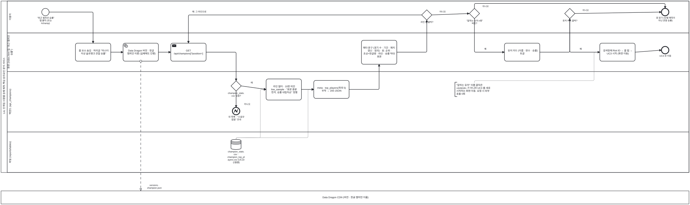

<details><summary>BPMN 2.0 XML 소스 보기 (`diagrams/bpmn_uc06.bpmn` 과 동일 — Camunda Modeler · bpmn.io 에서 열림)</summary>

```xml
<?xml version="1.0" encoding="UTF-8"?>
<bpmn:definitions xmlns:bpmn="http://www.omg.org/spec/BPMN/20100524/MODEL" xmlns:bpmndi="http://www.omg.org/spec/BPMN/20100524/DI" xmlns:dc="http://www.omg.org/spec/DD/20100524/DC" xmlns:di="http://www.omg.org/spec/DD/20100524/DI" id="Definitions_bpmn_uc06" name="UC6 챔피언·라인별 승률 조회" targetNamespace="https://p4.sumzip.com/bpmn" exporter="bpmn_gen.py" exporterVersion="1.0">
  <bpmn:collaboration id="Collab_bpmn_uc06">
    <bpmn:participant id="Pool_bpmn_uc06" name="LoL 인게임 시점별 승패 예측·핵심 승리요인 분석 서비스" processRef="Process_bpmn_uc06" />
    <bpmn:participant id="BB_dd" name="Data Dragon CDN (버전 · 한글 챔피언 이름)" />
    <bpmn:messageFlow id="Msg_bpmn_uc06_0" sourceRef="dd" targetRef="BB_dd" name="versions · champion.json" />
  </bpmn:collaboration>
  <bpmn:process id="Process_bpmn_uc06" name="UC6 챔피언·라인별 승률 조회" isExecutable="false">
    <bpmn:laneSet id="LaneSet_bpmn_uc06">
      <bpmn:lane id="Lane_bpmn_uc06_0" name="이용자">
        <bpmn:flowNodeRef>s</bpmn:flowNodeRef>
        <bpmn:flowNodeRef>g_chip</bpmn:flowNodeRef>
        <bpmn:flowNodeRef>g_btn</bpmn:flowNodeRef>
        <bpmn:flowNodeRef>g_card</bpmn:flowNodeRef>
        <bpmn:flowNodeRef>e</bpmn:flowNodeRef>
      </bpmn:lane>
      <bpmn:lane id="Lane_bpmn_uc06_1" name="화면 (index.html 탭 &quot;최근 챔피언 승률&quot;)">
        <bpmn:flowNodeRef>hdr</bpmn:flowNodeRef>
        <bpmn:flowNodeRef>dd</bpmn:flowNodeRef>
        <bpmn:flowNodeRef>get</bpmn:flowNodeRef>
        <bpmn:flowNodeRef>table</bpmn:flowNodeRef>
        <bpmn:flowNodeRef>cards</bpmn:flowNodeRef>
        <bpmn:flowNodeRef>jump</bpmn:flowNodeRef>
        <bpmn:flowNodeRef>e_uc3</bpmn:flowNodeRef>
      </bpmn:lane>
      <bpmn:lane id="Lane_bpmn_uc06_2" name="백엔드 (api_champions)">
        <bpmn:flowNodeRef>g_csv</bpmn:flowNodeRef>
        <bpmn:flowNodeRef>e_none</bpmn:flowNodeRef>
        <bpmn:flowNodeRef>filt</bpmn:flowNodeRef>
        <bpmn:flowNodeRef>meta</bpmn:flowNodeRef>
      </bpmn:lane>
      <bpmn:lane id="Lane_bpmn_uc06_3" name="파일 (reports/tables)">
      </bpmn:lane>
    </bpmn:laneSet>
    <bpmn:startEvent id="s" name="&quot;최근 챔피언 승률&quot; 탭 클릭 (또는 #champ)">
      <bpmn:outgoing>Flow_bpmn_uc06_0</bpmn:outgoing>
    </bpmn:startEvent>
    <bpmn:task id="hdr" name="홈 요소 숨김 · 머리글 &quot;마스터 이상 솔로랭크 관찰 승률&quot;">
      <bpmn:incoming>Flow_bpmn_uc06_0</bpmn:incoming>
      <bpmn:outgoing>Flow_bpmn_uc06_1</bpmn:outgoing>
    </bpmn:task>
    <bpmn:serviceTask id="dd" name="Data Dragon 버전 · 한글 챔피언 이름 (실패해도 진행)">
      <bpmn:incoming>Flow_bpmn_uc06_1</bpmn:incoming>
      <bpmn:outgoing>Flow_bpmn_uc06_2</bpmn:outgoing>
    </bpmn:serviceTask>
    <bpmn:sendTask id="get" name="GET /api/champions[?position=]">
      <bpmn:incoming>Flow_bpmn_uc06_2</bpmn:incoming>
      <bpmn:incoming>Flow_bpmn_uc06_9</bpmn:incoming>
      <bpmn:outgoing>Flow_bpmn_uc06_3</bpmn:outgoing>
    </bpmn:sendTask>
    <bpmn:exclusiveGateway id="g_csv" name="champion_stats.csv 있음?">
      <bpmn:incoming>Flow_bpmn_uc06_3</bpmn:incoming>
      <bpmn:outgoing>Flow_bpmn_uc06_4</bpmn:outgoing>
      <bpmn:outgoing>Flow_bpmn_uc06_5</bpmn:outgoing>
    </bpmn:exclusiveGateway>
    <bpmn:endEvent id="e_none" name="빈 목록 · &quot;스냅샷 없음&quot; 안내">
      <bpmn:incoming>Flow_bpmn_uc06_4</bpmn:incoming>
      <bpmn:errorEventDefinition id="EvDef_e_none" />
    </bpmn:endEvent>
    <bpmn:dataStoreReference id="ds_champ" name="champion_stats.csv · champion_top_players.csv (UC10 산출물)" />
    <bpmn:task id="filt" name="라인 필터 · 10판 미만 low_sample · &quot;표본 충분 먼저, 승률 내림차순&quot; 정렬">
      <bpmn:incoming>Flow_bpmn_uc06_5</bpmn:incoming>
      <bpmn:outgoing>Flow_bpmn_uc06_6</bpmn:outgoing>
      <bpmn:dataInputAssociation id="DIA_ds_champ_filt"><bpmn:sourceRef>ds_champ</bpmn:sourceRef></bpmn:dataInputAssociation>
    </bpmn:task>
    <bpmn:task id="meta" name="meta · top_players(최대 5) 부착 → 200 JSON">
      <bpmn:incoming>Flow_bpmn_uc06_6</bpmn:incoming>
      <bpmn:outgoing>Flow_bpmn_uc06_7</bpmn:outgoing>
      <bpmn:dataInputAssociation id="DIA_ds_champ_meta"><bpmn:sourceRef>ds_champ</bpmn:sourceRef></bpmn:dataInputAssociation>
    </bpmn:task>
    <bpmn:task id="table" name="메타 문구 (경기 수 · 기간 · 패치 · 갱신 · 정의) · 표: 순위 · 초상+한글명 · 라인 · 승률 막대 · 표본">
      <bpmn:incoming>Flow_bpmn_uc06_7</bpmn:incoming>
      <bpmn:outgoing>Flow_bpmn_uc06_8</bpmn:outgoing>
    </bpmn:task>
    <bpmn:exclusiveGateway id="g_chip" name="라인 칩 클릭?">
      <bpmn:incoming>Flow_bpmn_uc06_8</bpmn:incoming>
      <bpmn:outgoing>Flow_bpmn_uc06_9</bpmn:outgoing>
      <bpmn:outgoing>Flow_bpmn_uc06_10</bpmn:outgoing>
    </bpmn:exclusiveGateway>
    <bpmn:exclusiveGateway id="g_btn" name="&quot;잘하는 유저 n명&quot; 버튼?">
      <bpmn:incoming>Flow_bpmn_uc06_10</bpmn:incoming>
      <bpmn:outgoing>Flow_bpmn_uc06_11</bpmn:outgoing>
      <bpmn:outgoing>Flow_bpmn_uc06_16</bpmn:outgoing>
    </bpmn:exclusiveGateway>
    <bpmn:task id="cards" name="유저 카드 (이름 · 판수 · 승률) 토글">
      <bpmn:incoming>Flow_bpmn_uc06_11</bpmn:incoming>
      <bpmn:outgoing>Flow_bpmn_uc06_12</bpmn:outgoing>
    </bpmn:task>
    <bpmn:exclusiveGateway id="g_card" name="유저 카드 클릭?">
      <bpmn:incoming>Flow_bpmn_uc06_12</bpmn:incoming>
      <bpmn:outgoing>Flow_bpmn_uc06_13</bpmn:outgoing>
      <bpmn:outgoing>Flow_bpmn_uc06_15</bpmn:outgoing>
    </bpmn:exclusiveGateway>
    <bpmn:task id="jump" name="검색창에 Riot ID → 홈 탭 → UC3 시작 (화면 이동)">
      <bpmn:incoming>Flow_bpmn_uc06_13</bpmn:incoming>
      <bpmn:outgoing>Flow_bpmn_uc06_14</bpmn:outgoing>
    </bpmn:task>
    <bpmn:endEvent id="e_uc3" name="UC3 로 이동">
      <bpmn:incoming>Flow_bpmn_uc06_14</bpmn:incoming>
    </bpmn:endEvent>
    <bpmn:endEvent id="e" name="표 읽기 (모델 예측이 아닌 관찰 승률)">
      <bpmn:incoming>Flow_bpmn_uc06_15</bpmn:incoming>
      <bpmn:incoming>Flow_bpmn_uc06_16</bpmn:incoming>
    </bpmn:endEvent>
    <bpmn:textAnnotation id="n_ext"><bpmn:text>&quot;잘하는 유저&quot; 이름 클릭은 «extend» 가 아니라 UC3 를 새로 시작하는 화면 이동. 요청 시 외부 호출 0회</bpmn:text></bpmn:textAnnotation>
    <bpmn:sequenceFlow id="Flow_bpmn_uc06_0" sourceRef="s" targetRef="hdr" />
    <bpmn:sequenceFlow id="Flow_bpmn_uc06_1" sourceRef="hdr" targetRef="dd" />
    <bpmn:sequenceFlow id="Flow_bpmn_uc06_2" sourceRef="dd" targetRef="get" />
    <bpmn:sequenceFlow id="Flow_bpmn_uc06_3" sourceRef="get" targetRef="g_csv" />
    <bpmn:sequenceFlow id="Flow_bpmn_uc06_4" sourceRef="g_csv" targetRef="e_none" name="아니오" />
    <bpmn:sequenceFlow id="Flow_bpmn_uc06_5" sourceRef="g_csv" targetRef="filt" name="예" />
    <bpmn:sequenceFlow id="Flow_bpmn_uc06_6" sourceRef="filt" targetRef="meta" />
    <bpmn:sequenceFlow id="Flow_bpmn_uc06_7" sourceRef="meta" targetRef="table" />
    <bpmn:sequenceFlow id="Flow_bpmn_uc06_8" sourceRef="table" targetRef="g_chip" />
    <bpmn:sequenceFlow id="Flow_bpmn_uc06_9" sourceRef="g_chip" targetRef="get" name="예: 그 라인으로" />
    <bpmn:sequenceFlow id="Flow_bpmn_uc06_10" sourceRef="g_chip" targetRef="g_btn" name="아니오" />
    <bpmn:sequenceFlow id="Flow_bpmn_uc06_11" sourceRef="g_btn" targetRef="cards" name="예" />
    <bpmn:sequenceFlow id="Flow_bpmn_uc06_12" sourceRef="cards" targetRef="g_card" />
    <bpmn:sequenceFlow id="Flow_bpmn_uc06_13" sourceRef="g_card" targetRef="jump" name="예" />
    <bpmn:sequenceFlow id="Flow_bpmn_uc06_14" sourceRef="jump" targetRef="e_uc3" />
    <bpmn:sequenceFlow id="Flow_bpmn_uc06_15" sourceRef="g_card" targetRef="e" name="아니오" />
    <bpmn:sequenceFlow id="Flow_bpmn_uc06_16" sourceRef="g_btn" targetRef="e" name="아니오" />
    <bpmn:association id="Assoc_bpmn_uc06_2" sourceRef="n_ext" targetRef="jump" />
  </bpmn:process>
  <bpmndi:BPMNDiagram id="Diagram_bpmn_uc06">
    <bpmndi:BPMNPlane id="Plane_bpmn_uc06" bpmnElement="Collab_bpmn_uc06">
      <bpmndi:BPMNShape id="Pool_bpmn_uc06_di" bpmnElement="Pool_bpmn_uc06" isHorizontal="true"><dc:Bounds x="40" y="20" width="3348" height="837.5" /></bpmndi:BPMNShape>
      <bpmndi:BPMNShape id="Lane_bpmn_uc06_0_di" bpmnElement="Lane_bpmn_uc06_0" isHorizontal="true"><dc:Bounds x="70" y="20" width="3318" height="156" /></bpmndi:BPMNShape>
      <bpmndi:BPMNShape id="Lane_bpmn_uc06_1_di" bpmnElement="Lane_bpmn_uc06_1" isHorizontal="true"><dc:Bounds x="70" y="176" width="3318" height="189.0" /></bpmndi:BPMNShape>
      <bpmndi:BPMNShape id="Lane_bpmn_uc06_2_di" bpmnElement="Lane_bpmn_uc06_2" isHorizontal="true"><dc:Bounds x="70" y="365.0" width="3318" height="294.5" /></bpmndi:BPMNShape>
      <bpmndi:BPMNShape id="Lane_bpmn_uc06_3_di" bpmnElement="Lane_bpmn_uc06_3" isHorizontal="true"><dc:Bounds x="70" y="659.5" width="3318" height="198" /></bpmndi:BPMNShape>
      <bpmndi:BPMNShape id="BB_dd_di" bpmnElement="BB_dd" isHorizontal="true"><dc:Bounds x="40" y="947.5" width="3348" height="64" /></bpmndi:BPMNShape>
      <bpmndi:BPMNShape id="s_di" bpmnElement="s"><dc:Bounds x="238" y="56" width="36" height="36" />
        <bpmndi:BPMNLabel><dc:Bounds x="196" y="96" width="120" height="28" /></bpmndi:BPMNLabel>
      </bpmndi:BPMNShape>
      <bpmndi:BPMNShape id="hdr_di" bpmnElement="hdr"><dc:Bounds x="402" y="226" width="172" height="88" />
      </bpmndi:BPMNShape>
      <bpmndi:BPMNShape id="dd_di" bpmnElement="dd"><dc:Bounds x="634" y="226" width="172" height="88" />
      </bpmndi:BPMNShape>
      <bpmndi:BPMNShape id="get_di" bpmnElement="get"><dc:Bounds x="866" y="226" width="172" height="88" />
      </bpmndi:BPMNShape>
      <bpmndi:BPMNShape id="g_csv_di" bpmnElement="g_csv"><dc:Bounds x="1159" y="410" width="50" height="50" />
        <bpmndi:BPMNLabel><dc:Bounds x="1124" y="464" width="120" height="28" /></bpmndi:BPMNLabel>
      </bpmndi:BPMNShape>
      <bpmndi:BPMNShape id="e_none_di" bpmnElement="e_none"><dc:Bounds x="1166" y="540" width="36" height="36" />
        <bpmndi:BPMNLabel><dc:Bounds x="1124" y="580" width="120" height="28" /></bpmndi:BPMNLabel>
      </bpmndi:BPMNShape>
      <bpmndi:BPMNShape id="ds_champ_di" bpmnElement="ds_champ"><dc:Bounds x="1159" y="696" width="50" height="50" />
        <bpmndi:BPMNLabel><dc:Bounds x="1124" y="750" width="120" height="28" /></bpmndi:BPMNLabel>
      </bpmndi:BPMNShape>
      <bpmndi:BPMNShape id="filt_di" bpmnElement="filt"><dc:Bounds x="1330" y="401" width="172" height="102.5" />
      </bpmndi:BPMNShape>
      <bpmndi:BPMNShape id="meta_di" bpmnElement="meta"><dc:Bounds x="1562" y="408" width="172" height="88" />
      </bpmndi:BPMNShape>
      <bpmndi:BPMNShape id="table_di" bpmnElement="table"><dc:Bounds x="1794" y="212" width="172" height="117.0" />
      </bpmndi:BPMNShape>
      <bpmndi:BPMNShape id="g_chip_di" bpmnElement="g_chip"><dc:Bounds x="2087" y="63" width="50" height="50" />
        <bpmndi:BPMNLabel><dc:Bounds x="2052" y="117" width="120" height="28" /></bpmndi:BPMNLabel>
      </bpmndi:BPMNShape>
      <bpmndi:BPMNShape id="g_btn_di" bpmnElement="g_btn"><dc:Bounds x="2319" y="56" width="50" height="50" />
        <bpmndi:BPMNLabel><dc:Bounds x="2284" y="110" width="120" height="28" /></bpmndi:BPMNLabel>
      </bpmndi:BPMNShape>
      <bpmndi:BPMNShape id="cards_di" bpmnElement="cards"><dc:Bounds x="2490" y="226" width="172" height="88" />
      </bpmndi:BPMNShape>
      <bpmndi:BPMNShape id="g_card_di" bpmnElement="g_card"><dc:Bounds x="2783" y="56" width="50" height="50" />
        <bpmndi:BPMNLabel><dc:Bounds x="2748" y="110" width="120" height="28" /></bpmndi:BPMNLabel>
      </bpmndi:BPMNShape>
      <bpmndi:BPMNShape id="jump_di" bpmnElement="jump"><dc:Bounds x="2954" y="226" width="172" height="88" />
      </bpmndi:BPMNShape>
      <bpmndi:BPMNShape id="e_uc3_di" bpmnElement="e_uc3"><dc:Bounds x="3254" y="242" width="36" height="36" />
        <bpmndi:BPMNLabel><dc:Bounds x="3212" y="282" width="120" height="28" /></bpmndi:BPMNLabel>
      </bpmndi:BPMNShape>
      <bpmndi:BPMNShape id="e_di" bpmnElement="e"><dc:Bounds x="3254" y="56" width="36" height="36" />
        <bpmndi:BPMNLabel><dc:Bounds x="3212" y="96" width="120" height="28" /></bpmndi:BPMNLabel>
      </bpmndi:BPMNShape>
      <bpmndi:BPMNShape id="n_ext_di" bpmnElement="n_ext"><dc:Bounds x="2249" y="417" width="190" height="70.0" />
      </bpmndi:BPMNShape>
      <bpmndi:BPMNEdge id="Flow_bpmn_uc06_0_di" bpmnElement="Flow_bpmn_uc06_0">
        <di:waypoint x="274" y="74" />
        <di:waypoint x="488" y="74" />
        <di:waypoint x="488" y="226" />
      </bpmndi:BPMNEdge>
      <bpmndi:BPMNEdge id="Flow_bpmn_uc06_1_di" bpmnElement="Flow_bpmn_uc06_1">
        <di:waypoint x="574" y="270" />
        <di:waypoint x="634" y="270" />
      </bpmndi:BPMNEdge>
      <bpmndi:BPMNEdge id="Flow_bpmn_uc06_2_di" bpmnElement="Flow_bpmn_uc06_2">
        <di:waypoint x="806" y="270" />
        <di:waypoint x="866" y="270" />
      </bpmndi:BPMNEdge>
      <bpmndi:BPMNEdge id="Flow_bpmn_uc06_3_di" bpmnElement="Flow_bpmn_uc06_3">
        <di:waypoint x="1038" y="270" />
        <di:waypoint x="1184" y="270" />
        <di:waypoint x="1184" y="410" />
      </bpmndi:BPMNEdge>
      <bpmndi:BPMNEdge id="Flow_bpmn_uc06_4_di" bpmnElement="Flow_bpmn_uc06_4">
        <di:waypoint x="1184" y="460" />
        <di:waypoint x="1184" y="540" />
        <bpmndi:BPMNLabel><dc:Bounds x="1192" y="518" width="90" height="18" /></bpmndi:BPMNLabel>
      </bpmndi:BPMNEdge>
      <bpmndi:BPMNEdge id="Flow_bpmn_uc06_5_di" bpmnElement="Flow_bpmn_uc06_5">
        <di:waypoint x="1209" y="435" />
        <di:waypoint x="1330" y="452" />
        <bpmndi:BPMNLabel><dc:Bounds x="1215" y="413" width="90" height="18" /></bpmndi:BPMNLabel>
      </bpmndi:BPMNEdge>
      <bpmndi:BPMNEdge id="Flow_bpmn_uc06_6_di" bpmnElement="Flow_bpmn_uc06_6">
        <di:waypoint x="1502" y="452" />
        <di:waypoint x="1562" y="452" />
      </bpmndi:BPMNEdge>
      <bpmndi:BPMNEdge id="Flow_bpmn_uc06_7_di" bpmnElement="Flow_bpmn_uc06_7">
        <di:waypoint x="1734" y="452" />
        <di:waypoint x="1880" y="452" />
        <di:waypoint x="1880" y="329" />
      </bpmndi:BPMNEdge>
      <bpmndi:BPMNEdge id="Flow_bpmn_uc06_8_di" bpmnElement="Flow_bpmn_uc06_8">
        <di:waypoint x="1966" y="270" />
        <di:waypoint x="2112" y="270" />
        <di:waypoint x="2112" y="113" />
      </bpmndi:BPMNEdge>
      <bpmndi:BPMNEdge id="Flow_bpmn_uc06_9_di" bpmnElement="Flow_bpmn_uc06_9">
        <di:waypoint x="2087" y="88" />
        <di:waypoint x="952" y="88" />
        <di:waypoint x="952" y="226" />
        <bpmndi:BPMNLabel><dc:Bounds x="958" y="66" width="90" height="18" /></bpmndi:BPMNLabel>
      </bpmndi:BPMNEdge>
      <bpmndi:BPMNEdge id="Flow_bpmn_uc06_10_di" bpmnElement="Flow_bpmn_uc06_10">
        <di:waypoint x="2137" y="88" />
        <di:waypoint x="2319" y="81" />
        <bpmndi:BPMNLabel><dc:Bounds x="2143" y="66" width="90" height="18" /></bpmndi:BPMNLabel>
      </bpmndi:BPMNEdge>
      <bpmndi:BPMNEdge id="Flow_bpmn_uc06_11_di" bpmnElement="Flow_bpmn_uc06_11">
        <di:waypoint x="2344" y="106" />
        <di:waypoint x="2344" y="270" />
        <di:waypoint x="2490" y="270" />
        <bpmndi:BPMNLabel><dc:Bounds x="2352" y="248" width="90" height="18" /></bpmndi:BPMNLabel>
      </bpmndi:BPMNEdge>
      <bpmndi:BPMNEdge id="Flow_bpmn_uc06_12_di" bpmnElement="Flow_bpmn_uc06_12">
        <di:waypoint x="2662" y="270" />
        <di:waypoint x="2808" y="270" />
        <di:waypoint x="2808" y="106" />
      </bpmndi:BPMNEdge>
      <bpmndi:BPMNEdge id="Flow_bpmn_uc06_13_di" bpmnElement="Flow_bpmn_uc06_13">
        <di:waypoint x="2808" y="106" />
        <di:waypoint x="2808" y="270" />
        <di:waypoint x="2954" y="270" />
        <bpmndi:BPMNLabel><dc:Bounds x="2816" y="248" width="90" height="18" /></bpmndi:BPMNLabel>
      </bpmndi:BPMNEdge>
      <bpmndi:BPMNEdge id="Flow_bpmn_uc06_14_di" bpmnElement="Flow_bpmn_uc06_14">
        <di:waypoint x="3126" y="270" />
        <di:waypoint x="3254" y="260" />
      </bpmndi:BPMNEdge>
      <bpmndi:BPMNEdge id="Flow_bpmn_uc06_15_di" bpmnElement="Flow_bpmn_uc06_15">
        <di:waypoint x="2833" y="81" />
        <di:waypoint x="3254" y="74" />
        <bpmndi:BPMNLabel><dc:Bounds x="2839" y="59" width="90" height="18" /></bpmndi:BPMNLabel>
      </bpmndi:BPMNEdge>
      <bpmndi:BPMNEdge id="Flow_bpmn_uc06_16_di" bpmnElement="Flow_bpmn_uc06_16">
        <di:waypoint x="2344" y="56" />
        <di:waypoint x="2344" y="32" />
        <di:waypoint x="3272" y="32" />
        <di:waypoint x="3272" y="56" />
        <bpmndi:BPMNLabel><dc:Bounds x="2352" y="40" width="90" height="18" /></bpmndi:BPMNLabel>
      </bpmndi:BPMNEdge>
      <bpmndi:BPMNEdge id="Msg_bpmn_uc06_0_di" bpmnElement="Msg_bpmn_uc06_0">
        <di:waypoint x="720" y="314" />
        <di:waypoint x="720" y="948" />
        <bpmndi:BPMNLabel><dc:Bounds x="726" y="914" width="120" height="18" /></bpmndi:BPMNLabel>
      </bpmndi:BPMNEdge>
      <bpmndi:BPMNEdge id="DIA_ds_champ_filt_di" bpmnElement="DIA_ds_champ_filt">
        <di:waypoint x="1184" y="696" />
        <di:waypoint x="1184" y="688" />
        <di:waypoint x="1302" y="688" />
        <di:waypoint x="1302" y="452" />
        <di:waypoint x="1330" y="452" />
      </bpmndi:BPMNEdge>
      <bpmndi:BPMNEdge id="DIA_ds_champ_meta_di" bpmnElement="DIA_ds_champ_meta">
        <di:waypoint x="1184" y="696" />
        <di:waypoint x="1184" y="688" />
        <di:waypoint x="1534" y="688" />
        <di:waypoint x="1534" y="452" />
        <di:waypoint x="1562" y="452" />
      </bpmndi:BPMNEdge>
      <bpmndi:BPMNEdge id="Assoc_bpmn_uc06_2_di" bpmnElement="Assoc_bpmn_uc06_2">
        <di:waypoint x="2344" y="417" />
        <di:waypoint x="2344" y="409" />
        <di:waypoint x="2926" y="409" />
        <di:waypoint x="2926" y="270" />
        <di:waypoint x="2954" y="270" />
      </bpmndi:BPMNEdge>
    </bpmndi:BPMNPlane>
  </bpmndi:BPMNDiagram>
</bpmn:definitions>
```

</details>

**BPMN 으로 보이는 것.** Data Dragon 풀과의 메시지 흐름은 챔피언 이름·초상 때문이고, 실패해도 흐름은 계속된다. 승률 표 자체는 파일 레인의 `champion_stats.csv`(UC10 산출물)만 읽는다.
"라인 칩 클릭?" 게이트웨이의 예 가지가 `GET /api/champions` 로 되돌아가는 **반복**이고, "유저 카드 클릭?" 의 예 가지는 관계(«extend»)가 아니라 **UC3 를 새로 시작하는 화면 이동**이라 별도 종료 이벤트 "UC3 로 이동"으로 끝냈다.

### 4.7 UC7 솔로랭크 상위 랭킹 조회 — [UC_07](UC_07_상위랭킹조회.md)

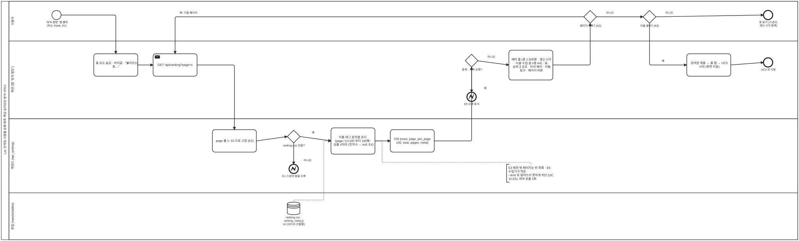

<details><summary>BPMN 2.0 XML 소스 보기 (`diagrams/bpmn_uc07.bpmn` 과 동일 — Camunda Modeler · bpmn.io 에서 열림)</summary>

```xml
<?xml version="1.0" encoding="UTF-8"?>
<bpmn:definitions xmlns:bpmn="http://www.omg.org/spec/BPMN/20100524/MODEL" xmlns:bpmndi="http://www.omg.org/spec/BPMN/20100524/DI" xmlns:dc="http://www.omg.org/spec/DD/20100524/DC" xmlns:di="http://www.omg.org/spec/DD/20100524/DI" id="Definitions_bpmn_uc07" name="UC7 솔로랭크 상위 랭킹 조회" targetNamespace="https://p4.sumzip.com/bpmn" exporter="bpmn_gen.py" exporterVersion="1.0">
  <bpmn:collaboration id="Collab_bpmn_uc07">
    <bpmn:participant id="Pool_bpmn_uc07" name="LoL 인게임 시점별 승패 예측·핵심 승리요인 분석 서비스" processRef="Process_bpmn_uc07" />
  </bpmn:collaboration>
  <bpmn:process id="Process_bpmn_uc07" name="UC7 솔로랭크 상위 랭킹 조회" isExecutable="false">
    <bpmn:laneSet id="LaneSet_bpmn_uc07">
      <bpmn:lane id="Lane_bpmn_uc07_0" name="이용자">
        <bpmn:flowNodeRef>s</bpmn:flowNodeRef>
        <bpmn:flowNodeRef>g_page</bpmn:flowNodeRef>
        <bpmn:flowNodeRef>g_name</bpmn:flowNodeRef>
        <bpmn:flowNodeRef>e</bpmn:flowNodeRef>
      </bpmn:lane>
      <bpmn:lane id="Lane_bpmn_uc07_1" name="화면 (탭 &quot;유저 랭킹&quot;)">
        <bpmn:flowNodeRef>hdr</bpmn:flowNodeRef>
        <bpmn:flowNodeRef>get</bpmn:flowNodeRef>
        <bpmn:flowNodeRef>g_fail</bpmn:flowNodeRef>
        <bpmn:flowNodeRef>e5</bpmn:flowNodeRef>
        <bpmn:flowNodeRef>table</bpmn:flowNodeRef>
        <bpmn:flowNodeRef>jump</bpmn:flowNodeRef>
        <bpmn:flowNodeRef>e_uc3</bpmn:flowNodeRef>
      </bpmn:lane>
      <bpmn:lane id="Lane_bpmn_uc07_2" name="백엔드 (api_ranking)">
        <bpmn:flowNodeRef>clamp</bpmn:flowNodeRef>
        <bpmn:flowNodeRef>g_csv</bpmn:flowNodeRef>
        <bpmn:flowNodeRef>e1</bpmn:flowNodeRef>
        <bpmn:flowNodeRef>page</bpmn:flowNodeRef>
        <bpmn:flowNodeRef>ok</bpmn:flowNodeRef>
      </bpmn:lane>
      <bpmn:lane id="Lane_bpmn_uc07_3" name="파일 (reports/tables)">
      </bpmn:lane>
    </bpmn:laneSet>
    <bpmn:startEvent id="s" name="&quot;유저 랭킹&quot; 탭 클릭 (또는 #rank, A1)">
      <bpmn:outgoing>Flow_bpmn_uc07_0</bpmn:outgoing>
    </bpmn:startEvent>
    <bpmn:task id="hdr" name="홈 요소 숨김 · 머리글 · &quot;불러오는 중…&quot;">
      <bpmn:incoming>Flow_bpmn_uc07_0</bpmn:incoming>
      <bpmn:outgoing>Flow_bpmn_uc07_1</bpmn:outgoing>
    </bpmn:task>
    <bpmn:sendTask id="get" name="GET /api/ranking?page=n">
      <bpmn:incoming>Flow_bpmn_uc07_1</bpmn:incoming>
      <bpmn:incoming>Flow_bpmn_uc07_11</bpmn:incoming>
      <bpmn:outgoing>Flow_bpmn_uc07_2</bpmn:outgoing>
    </bpmn:sendTask>
    <bpmn:task id="clamp" name="page 를 1~10 으로 고정 (E2)">
      <bpmn:incoming>Flow_bpmn_uc07_2</bpmn:incoming>
      <bpmn:outgoing>Flow_bpmn_uc07_3</bpmn:outgoing>
    </bpmn:task>
    <bpmn:exclusiveGateway id="g_csv" name="ranking.csv 있음?">
      <bpmn:incoming>Flow_bpmn_uc07_3</bpmn:incoming>
      <bpmn:outgoing>Flow_bpmn_uc07_4</bpmn:outgoing>
      <bpmn:outgoing>Flow_bpmn_uc07_5</bpmn:outgoing>
    </bpmn:exclusiveGateway>
    <bpmn:endEvent id="e1" name="E1 스냅샷 없음 오류">
      <bpmn:incoming>Flow_bpmn_uc07_4</bpmn:incoming>
      <bpmn:errorEventDefinition id="EvDef_e1" />
    </bpmn:endEvent>
    <bpmn:dataStoreReference id="ds_rank" name="ranking.csv · ranking_meta.json (UC10 산출물)" />
    <bpmn:task id="page" name="이름·태그 문자열 유지 · (page−1)×100 부터 100행 · 승률 4자리 (전적 0 → null, E4)">
      <bpmn:incoming>Flow_bpmn_uc07_5</bpmn:incoming>
      <bpmn:outgoing>Flow_bpmn_uc07_6</bpmn:outgoing>
      <bpmn:dataInputAssociation id="DIA_ds_rank_page"><bpmn:sourceRef>ds_rank</bpmn:sourceRef></bpmn:dataInputAssociation>
    </bpmn:task>
    <bpmn:task id="ok" name="200 {rows, page, per_page 100, total, pages, meta}">
      <bpmn:incoming>Flow_bpmn_uc07_6</bpmn:incoming>
      <bpmn:outgoing>Flow_bpmn_uc07_7</bpmn:outgoing>
    </bpmn:task>
    <bpmn:exclusiveGateway id="g_fail" name="중계 · 서버 오류?">
      <bpmn:incoming>Flow_bpmn_uc07_7</bpmn:incoming>
      <bpmn:outgoing>Flow_bpmn_uc07_8</bpmn:outgoing>
      <bpmn:outgoing>Flow_bpmn_uc07_9</bpmn:outgoing>
    </bpmn:exclusiveGateway>
    <bpmn:endEvent id="e5" name="E5 오류 표시">
      <bpmn:incoming>Flow_bpmn_uc07_8</bpmn:incoming>
      <bpmn:errorEventDefinition id="EvDef_e5" />
    </bpmn:endEvent>
    <bpmn:task id="table" name="메타 줄 (총 1,000명 · 갱신 시각 · 이름 수집 중 n명 A4) · 표: 상위 3 강조 · 티어 배지 · 이름 링크 · 페이지 버튼">
      <bpmn:incoming>Flow_bpmn_uc07_9</bpmn:incoming>
      <bpmn:outgoing>Flow_bpmn_uc07_10</bpmn:outgoing>
    </bpmn:task>
    <bpmn:exclusiveGateway id="g_page" name="페이지 버튼? (A2)">
      <bpmn:incoming>Flow_bpmn_uc07_10</bpmn:incoming>
      <bpmn:outgoing>Flow_bpmn_uc07_11</bpmn:outgoing>
      <bpmn:outgoing>Flow_bpmn_uc07_12</bpmn:outgoing>
    </bpmn:exclusiveGateway>
    <bpmn:exclusiveGateway id="g_name" name="이름 클릭? (A3)">
      <bpmn:incoming>Flow_bpmn_uc07_12</bpmn:incoming>
      <bpmn:outgoing>Flow_bpmn_uc07_13</bpmn:outgoing>
      <bpmn:outgoing>Flow_bpmn_uc07_15</bpmn:outgoing>
    </bpmn:exclusiveGateway>
    <bpmn:task id="jump" name="검색창 채움 → 홈 탭 → UC3 시작 (화면 이동)">
      <bpmn:incoming>Flow_bpmn_uc07_13</bpmn:incoming>
      <bpmn:outgoing>Flow_bpmn_uc07_14</bpmn:outgoing>
    </bpmn:task>
    <bpmn:endEvent id="e_uc3" name="UC3 로 이동">
      <bpmn:incoming>Flow_bpmn_uc07_14</bpmn:incoming>
    </bpmn:endEvent>
    <bpmn:endEvent id="e" name="표 읽기 (스냅샷, 갱신 시각 함께)">
      <bpmn:incoming>Flow_bpmn_uc07_15</bpmn:incoming>
    </bpmn:endEvent>
    <bpmn:textAnnotation id="n_e"><bpmn:text>E3 범위 밖 페이지는 빈 목록 · E6 수집기가 작은 --limit 로 덮어쓰지 못하게 차단 (UC10 E5). 외부 호출 0회</bpmn:text></bpmn:textAnnotation>
    <bpmn:sequenceFlow id="Flow_bpmn_uc07_0" sourceRef="s" targetRef="hdr" />
    <bpmn:sequenceFlow id="Flow_bpmn_uc07_1" sourceRef="hdr" targetRef="get" />
    <bpmn:sequenceFlow id="Flow_bpmn_uc07_2" sourceRef="get" targetRef="clamp" />
    <bpmn:sequenceFlow id="Flow_bpmn_uc07_3" sourceRef="clamp" targetRef="g_csv" />
    <bpmn:sequenceFlow id="Flow_bpmn_uc07_4" sourceRef="g_csv" targetRef="e1" name="아니오" />
    <bpmn:sequenceFlow id="Flow_bpmn_uc07_5" sourceRef="g_csv" targetRef="page" name="예" />
    <bpmn:sequenceFlow id="Flow_bpmn_uc07_6" sourceRef="page" targetRef="ok" />
    <bpmn:sequenceFlow id="Flow_bpmn_uc07_7" sourceRef="ok" targetRef="g_fail" />
    <bpmn:sequenceFlow id="Flow_bpmn_uc07_8" sourceRef="g_fail" targetRef="e5" name="예" />
    <bpmn:sequenceFlow id="Flow_bpmn_uc07_9" sourceRef="g_fail" targetRef="table" name="아니오" />
    <bpmn:sequenceFlow id="Flow_bpmn_uc07_10" sourceRef="table" targetRef="g_page" />
    <bpmn:sequenceFlow id="Flow_bpmn_uc07_11" sourceRef="g_page" targetRef="get" name="예: 다음 페이지" />
    <bpmn:sequenceFlow id="Flow_bpmn_uc07_12" sourceRef="g_page" targetRef="g_name" name="아니오" />
    <bpmn:sequenceFlow id="Flow_bpmn_uc07_13" sourceRef="g_name" targetRef="jump" name="예" />
    <bpmn:sequenceFlow id="Flow_bpmn_uc07_14" sourceRef="jump" targetRef="e_uc3" />
    <bpmn:sequenceFlow id="Flow_bpmn_uc07_15" sourceRef="g_name" targetRef="e" name="아니오" />
    <bpmn:association id="Assoc_bpmn_uc07_1" sourceRef="n_e" targetRef="page" />
  </bpmn:process>
  <bpmndi:BPMNDiagram id="Diagram_bpmn_uc07">
    <bpmndi:BPMNPlane id="Plane_bpmn_uc07" bpmnElement="Collab_bpmn_uc07">
      <bpmndi:BPMNShape id="Pool_bpmn_uc07_di" bpmnElement="Pool_bpmn_uc07" isHorizontal="true"><dc:Bounds x="40" y="20" width="3116" height="935.5" /></bpmndi:BPMNShape>
      <bpmndi:BPMNShape id="Lane_bpmn_uc07_0_di" bpmnElement="Lane_bpmn_uc07_0" isHorizontal="true"><dc:Bounds x="70" y="20" width="3086" height="156" /></bpmndi:BPMNShape>
      <bpmndi:BPMNShape id="Lane_bpmn_uc07_1_di" bpmnElement="Lane_bpmn_uc07_1" isHorizontal="true"><dc:Bounds x="70" y="176" width="3086" height="305.0" /></bpmndi:BPMNShape>
      <bpmndi:BPMNShape id="Lane_bpmn_uc07_2_di" bpmnElement="Lane_bpmn_uc07_2" isHorizontal="true"><dc:Bounds x="70" y="481.0" width="3086" height="290.5" /></bpmndi:BPMNShape>
      <bpmndi:BPMNShape id="Lane_bpmn_uc07_3_di" bpmnElement="Lane_bpmn_uc07_3" isHorizontal="true"><dc:Bounds x="70" y="771.5" width="3086" height="184" /></bpmndi:BPMNShape>
      <bpmndi:BPMNShape id="s_di" bpmnElement="s"><dc:Bounds x="238" y="56" width="36" height="36" />
        <bpmndi:BPMNLabel><dc:Bounds x="196" y="96" width="120" height="28" /></bpmndi:BPMNLabel>
      </bpmndi:BPMNShape>
      <bpmndi:BPMNShape id="hdr_di" bpmnElement="hdr"><dc:Bounds x="402" y="226" width="172" height="88" />
      </bpmndi:BPMNShape>
      <bpmndi:BPMNShape id="get_di" bpmnElement="get"><dc:Bounds x="634" y="226" width="172" height="88" />
      </bpmndi:BPMNShape>
      <bpmndi:BPMNShape id="clamp_di" bpmnElement="clamp"><dc:Bounds x="866" y="524" width="172" height="88" />
      </bpmndi:BPMNShape>
      <bpmndi:BPMNShape id="g_csv_di" bpmnElement="g_csv"><dc:Bounds x="1159" y="526" width="50" height="50" />
        <bpmndi:BPMNLabel><dc:Bounds x="1124" y="580" width="120" height="28" /></bpmndi:BPMNLabel>
      </bpmndi:BPMNShape>
      <bpmndi:BPMNShape id="e1_di" bpmnElement="e1"><dc:Bounds x="1166" y="660" width="36" height="36" />
        <bpmndi:BPMNLabel><dc:Bounds x="1124" y="700" width="120" height="28" /></bpmndi:BPMNLabel>
      </bpmndi:BPMNShape>
      <bpmndi:BPMNShape id="ds_rank_di" bpmnElement="ds_rank"><dc:Bounds x="1159" y="808" width="50" height="50" />
        <bpmndi:BPMNLabel><dc:Bounds x="1124" y="862" width="120" height="28" /></bpmndi:BPMNLabel>
      </bpmndi:BPMNShape>
      <bpmndi:BPMNShape id="page_di" bpmnElement="page"><dc:Bounds x="1330" y="517" width="172" height="102.5" />
      </bpmndi:BPMNShape>
      <bpmndi:BPMNShape id="ok_di" bpmnElement="ok"><dc:Bounds x="1562" y="524" width="172" height="88" />
      </bpmndi:BPMNShape>
      <bpmndi:BPMNShape id="g_fail_di" bpmnElement="g_fail"><dc:Bounds x="1855" y="228" width="50" height="50" />
        <bpmndi:BPMNLabel><dc:Bounds x="1820" y="282" width="120" height="28" /></bpmndi:BPMNLabel>
      </bpmndi:BPMNShape>
      <bpmndi:BPMNShape id="e5_di" bpmnElement="e5"><dc:Bounds x="1862" y="377" width="36" height="36" />
        <bpmndi:BPMNLabel><dc:Bounds x="1820" y="417" width="120" height="28" /></bpmndi:BPMNLabel>
      </bpmndi:BPMNShape>
      <bpmndi:BPMNShape id="table_di" bpmnElement="table"><dc:Bounds x="2026" y="212" width="172" height="117.0" />
      </bpmndi:BPMNShape>
      <bpmndi:BPMNShape id="g_page_di" bpmnElement="g_page"><dc:Bounds x="2319" y="56" width="50" height="50" />
        <bpmndi:BPMNLabel><dc:Bounds x="2284" y="110" width="120" height="28" /></bpmndi:BPMNLabel>
      </bpmndi:BPMNShape>
      <bpmndi:BPMNShape id="g_name_di" bpmnElement="g_name"><dc:Bounds x="2551" y="56" width="50" height="50" />
        <bpmndi:BPMNLabel><dc:Bounds x="2516" y="110" width="120" height="28" /></bpmndi:BPMNLabel>
      </bpmndi:BPMNShape>
      <bpmndi:BPMNShape id="jump_di" bpmnElement="jump"><dc:Bounds x="2722" y="226" width="172" height="88" />
      </bpmndi:BPMNShape>
      <bpmndi:BPMNShape id="e_uc3_di" bpmnElement="e_uc3"><dc:Bounds x="3022" y="242" width="36" height="36" />
        <bpmndi:BPMNLabel><dc:Bounds x="2980" y="282" width="120" height="28" /></bpmndi:BPMNLabel>
      </bpmndi:BPMNShape>
      <bpmndi:BPMNShape id="e_di" bpmnElement="e"><dc:Bounds x="3022" y="56" width="36" height="36" />
        <bpmndi:BPMNLabel><dc:Bounds x="2980" y="96" width="120" height="28" /></bpmndi:BPMNLabel>
      </bpmndi:BPMNShape>
      <bpmndi:BPMNShape id="n_e_di" bpmnElement="n_e"><dc:Bounds x="2017" y="660" width="190" height="70.0" />
      </bpmndi:BPMNShape>
      <bpmndi:BPMNEdge id="Flow_bpmn_uc07_0_di" bpmnElement="Flow_bpmn_uc07_0">
        <di:waypoint x="274" y="74" />
        <di:waypoint x="488" y="74" />
        <di:waypoint x="488" y="226" />
      </bpmndi:BPMNEdge>
      <bpmndi:BPMNEdge id="Flow_bpmn_uc07_1_di" bpmnElement="Flow_bpmn_uc07_1">
        <di:waypoint x="574" y="270" />
        <di:waypoint x="634" y="270" />
      </bpmndi:BPMNEdge>
      <bpmndi:BPMNEdge id="Flow_bpmn_uc07_2_di" bpmnElement="Flow_bpmn_uc07_2">
        <di:waypoint x="806" y="270" />
        <di:waypoint x="952" y="270" />
        <di:waypoint x="952" y="524" />
      </bpmndi:BPMNEdge>
      <bpmndi:BPMNEdge id="Flow_bpmn_uc07_3_di" bpmnElement="Flow_bpmn_uc07_3">
        <di:waypoint x="1038" y="568" />
        <di:waypoint x="1159" y="551" />
      </bpmndi:BPMNEdge>
      <bpmndi:BPMNEdge id="Flow_bpmn_uc07_4_di" bpmnElement="Flow_bpmn_uc07_4">
        <di:waypoint x="1184" y="576" />
        <di:waypoint x="1184" y="660" />
        <bpmndi:BPMNLabel><dc:Bounds x="1192" y="638" width="90" height="18" /></bpmndi:BPMNLabel>
      </bpmndi:BPMNEdge>
      <bpmndi:BPMNEdge id="Flow_bpmn_uc07_5_di" bpmnElement="Flow_bpmn_uc07_5">
        <di:waypoint x="1209" y="551" />
        <di:waypoint x="1330" y="568" />
        <bpmndi:BPMNLabel><dc:Bounds x="1215" y="529" width="90" height="18" /></bpmndi:BPMNLabel>
      </bpmndi:BPMNEdge>
      <bpmndi:BPMNEdge id="Flow_bpmn_uc07_6_di" bpmnElement="Flow_bpmn_uc07_6">
        <di:waypoint x="1502" y="568" />
        <di:waypoint x="1562" y="568" />
      </bpmndi:BPMNEdge>
      <bpmndi:BPMNEdge id="Flow_bpmn_uc07_7_di" bpmnElement="Flow_bpmn_uc07_7">
        <di:waypoint x="1734" y="568" />
        <di:waypoint x="1880" y="568" />
        <di:waypoint x="1880" y="278" />
      </bpmndi:BPMNEdge>
      <bpmndi:BPMNEdge id="Flow_bpmn_uc07_8_di" bpmnElement="Flow_bpmn_uc07_8">
        <di:waypoint x="1880" y="278" />
        <di:waypoint x="1880" y="377" />
        <bpmndi:BPMNLabel><dc:Bounds x="1888" y="355" width="90" height="18" /></bpmndi:BPMNLabel>
      </bpmndi:BPMNEdge>
      <bpmndi:BPMNEdge id="Flow_bpmn_uc07_9_di" bpmnElement="Flow_bpmn_uc07_9">
        <di:waypoint x="1905" y="254" />
        <di:waypoint x="2026" y="270" />
        <bpmndi:BPMNLabel><dc:Bounds x="1911" y="232" width="90" height="18" /></bpmndi:BPMNLabel>
      </bpmndi:BPMNEdge>
      <bpmndi:BPMNEdge id="Flow_bpmn_uc07_10_di" bpmnElement="Flow_bpmn_uc07_10">
        <di:waypoint x="2198" y="270" />
        <di:waypoint x="2344" y="270" />
        <di:waypoint x="2344" y="106" />
      </bpmndi:BPMNEdge>
      <bpmndi:BPMNEdge id="Flow_bpmn_uc07_11_di" bpmnElement="Flow_bpmn_uc07_11">
        <di:waypoint x="2319" y="81" />
        <di:waypoint x="720" y="81" />
        <di:waypoint x="720" y="226" />
        <bpmndi:BPMNLabel><dc:Bounds x="726" y="59" width="90" height="18" /></bpmndi:BPMNLabel>
      </bpmndi:BPMNEdge>
      <bpmndi:BPMNEdge id="Flow_bpmn_uc07_12_di" bpmnElement="Flow_bpmn_uc07_12">
        <di:waypoint x="2369" y="81" />
        <di:waypoint x="2551" y="81" />
        <bpmndi:BPMNLabel><dc:Bounds x="2375" y="59" width="90" height="18" /></bpmndi:BPMNLabel>
      </bpmndi:BPMNEdge>
      <bpmndi:BPMNEdge id="Flow_bpmn_uc07_13_di" bpmnElement="Flow_bpmn_uc07_13">
        <di:waypoint x="2576" y="106" />
        <di:waypoint x="2576" y="270" />
        <di:waypoint x="2722" y="270" />
        <bpmndi:BPMNLabel><dc:Bounds x="2584" y="248" width="90" height="18" /></bpmndi:BPMNLabel>
      </bpmndi:BPMNEdge>
      <bpmndi:BPMNEdge id="Flow_bpmn_uc07_14_di" bpmnElement="Flow_bpmn_uc07_14">
        <di:waypoint x="2894" y="270" />
        <di:waypoint x="3022" y="260" />
      </bpmndi:BPMNEdge>
      <bpmndi:BPMNEdge id="Flow_bpmn_uc07_15_di" bpmnElement="Flow_bpmn_uc07_15">
        <di:waypoint x="2601" y="81" />
        <di:waypoint x="3022" y="74" />
        <bpmndi:BPMNLabel><dc:Bounds x="2607" y="59" width="90" height="18" /></bpmndi:BPMNLabel>
      </bpmndi:BPMNEdge>
      <bpmndi:BPMNEdge id="DIA_ds_rank_page_di" bpmnElement="DIA_ds_rank_page">
        <di:waypoint x="1184" y="808" />
        <di:waypoint x="1184" y="800" />
        <di:waypoint x="1302" y="800" />
        <di:waypoint x="1302" y="568" />
        <di:waypoint x="1330" y="568" />
      </bpmndi:BPMNEdge>
      <bpmndi:BPMNEdge id="Assoc_bpmn_uc07_1_di" bpmnElement="Assoc_bpmn_uc07_1">
        <di:waypoint x="2112" y="660" />
        <di:waypoint x="2112" y="652" />
        <di:waypoint x="1530" y="652" />
        <di:waypoint x="1530" y="568" />
        <di:waypoint x="1502" y="568" />
      </bpmndi:BPMNEdge>
    </bpmndi:BPMNPlane>
  </bpmndi:BPMNDiagram>
</bpmn:definitions>
```

</details>

**BPMN 으로 보이는 것.** UC6 과 같은 골격이다. 백엔드가 `page` 를 1~10 으로 고정하고(E2) `ranking.csv` 에서 100행씩 잘라 준다. "페이지 버튼?" 의 예 가지가 요청으로 되돌아가는 반복이고, 이름 클릭은 UC3 로 가는 화면 이동이다. 외부 통신이 없어 접힌 풀이 없다.

### 4.8 UC8 프로 경기 승부예측 투표 — [UC_08](UC_08_승부예측투표.md)

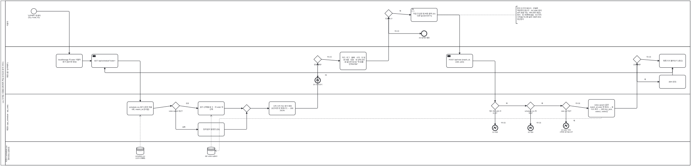

<details><summary>BPMN 2.0 XML 소스 보기 (`diagrams/bpmn_uc08.bpmn` 과 동일 — Camunda Modeler · bpmn.io 에서 열림)</summary>

```xml
<?xml version="1.0" encoding="UTF-8"?>
<bpmn:definitions xmlns:bpmn="http://www.omg.org/spec/BPMN/20100524/MODEL" xmlns:bpmndi="http://www.omg.org/spec/BPMN/20100524/DI" xmlns:dc="http://www.omg.org/spec/DD/20100524/DC" xmlns:di="http://www.omg.org/spec/DD/20100524/DI" id="Definitions_bpmn_uc08" name="UC8 프로 경기 승부예측 투표" targetNamespace="https://p4.sumzip.com/bpmn" exporter="bpmn_gen.py" exporterVersion="1.0">
  <bpmn:collaboration id="Collab_bpmn_uc08">
    <bpmn:participant id="Pool_bpmn_uc08" name="LoL 인게임 시점별 승패 예측·핵심 승리요인 분석 서비스" processRef="Process_bpmn_uc08" />
  </bpmn:collaboration>
  <bpmn:process id="Process_bpmn_uc08" name="UC8 프로 경기 승부예측 투표" isExecutable="false">
    <bpmn:laneSet id="LaneSet_bpmn_uc08">
      <bpmn:lane id="Lane_bpmn_uc08_0" name="이용자">
        <bpmn:flowNodeRef>s</bpmn:flowNodeRef>
        <bpmn:flowNodeRef>g_vote</bpmn:flowNodeRef>
        <bpmn:flowNodeRef>e_view</bpmn:flowNodeRef>
        <bpmn:flowNodeRef>pick</bpmn:flowNodeRef>
      </bpmn:lane>
      <bpmn:lane id="Lane_bpmn_uc08_1" name="화면 (탭 &quot;승부예측&quot;)">
        <bpmn:flowNodeRef>voter</bpmn:flowNodeRef>
        <bpmn:flowNodeRef>get</bpmn:flowNodeRef>
        <bpmn:flowNodeRef>g_fail</bpmn:flowNodeRef>
        <bpmn:flowNodeRef>e4</bpmn:flowNodeRef>
        <bpmn:flowNodeRef>cards</bpmn:flowNodeRef>
        <bpmn:flowNodeRef>post</bpmn:flowNodeRef>
        <bpmn:flowNodeRef>g_pf</bpmn:flowNodeRef>
        <bpmn:flowNodeRef>alert</bpmn:flowNodeRef>
        <bpmn:flowNodeRef>reload</bpmn:flowNodeRef>
      </bpmn:lane>
      <bpmn:lane id="Lane_bpmn_uc08_2" name="백엔드 (api_schedule · api_vote)">
        <bpmn:flowNodeRef>csv</bpmn:flowNodeRef>
        <bpmn:flowNodeRef>g_db</bpmn:flowNodeRef>
        <bpmn:flowNodeRef>nodb</bpmn:flowNodeRef>
        <bpmn:flowNodeRef>cnt</bpmn:flowNodeRef>
        <bpmn:flowNodeRef>g_m0</bpmn:flowNodeRef>
        <bpmn:flowNodeRef>filt</bpmn:flowNodeRef>
        <bpmn:flowNodeRef>g_f</bpmn:flowNodeRef>
        <bpmn:flowNodeRef>e1</bpmn:flowNodeRef>
        <bpmn:flowNodeRef>g_in</bpmn:flowNodeRef>
        <bpmn:flowNodeRef>e2</bpmn:flowNodeRef>
        <bpmn:flowNodeRef>g_start</bpmn:flowNodeRef>
        <bpmn:flowNodeRef>e3</bpmn:flowNodeRef>
        <bpmn:flowNodeRef>upsert</bpmn:flowNodeRef>
      </bpmn:lane>
      <bpmn:lane id="Lane_bpmn_uc08_3" name="저장소 (schedule.csv · db/votes.sqlite3)">
      </bpmn:lane>
    </bpmn:laneSet>
    <bpmn:startEvent id="s" name="&quot;승부예측&quot; 탭 클릭 (또는 #vote, A2)">
      <bpmn:outgoing>Flow_bpmn_uc08_0</bpmn:outgoing>
    </bpmn:startEvent>
    <bpmn:task id="voter" name="localStorage 의 voter 식별자 읽기 (없으면 생성)">
      <bpmn:incoming>Flow_bpmn_uc08_0</bpmn:incoming>
      <bpmn:outgoing>Flow_bpmn_uc08_1</bpmn:outgoing>
    </bpmn:task>
    <bpmn:sendTask id="get" name="GET /api/schedule?voter=">
      <bpmn:incoming>Flow_bpmn_uc08_1</bpmn:incoming>
      <bpmn:incoming>Flow_bpmn_uc08_27</bpmn:incoming>
      <bpmn:outgoing>Flow_bpmn_uc08_2</bpmn:outgoing>
    </bpmn:sendTask>
    <bpmn:task id="csv" name="schedule.csv 읽기 (외부 호출 0회, match_id 문자열)">
      <bpmn:incoming>Flow_bpmn_uc08_2</bpmn:incoming>
      <bpmn:outgoing>Flow_bpmn_uc08_3</bpmn:outgoing>
      <bpmn:dataInputAssociation id="DIA_ds_sched_csv"><bpmn:sourceRef>ds_sched</bpmn:sourceRef></bpmn:dataInputAssociation>
    </bpmn:task>
    <bpmn:dataStoreReference id="ds_sched" name="schedule.csv (UC9 산출물)" />
    <bpmn:exclusiveGateway id="g_db" name="votes.sqlite3 접근?">
      <bpmn:incoming>Flow_bpmn_uc08_3</bpmn:incoming>
      <bpmn:outgoing>Flow_bpmn_uc08_4</bpmn:outgoing>
      <bpmn:outgoing>Flow_bpmn_uc08_5</bpmn:outgoing>
    </bpmn:exclusiveGateway>
    <bpmn:task id="nodb" name="집계 없이 일정만 (E6)">
      <bpmn:incoming>Flow_bpmn_uc08_4</bpmn:incoming>
      <bpmn:outgoing>Flow_bpmn_uc08_7</bpmn:outgoing>
    </bpmn:task>
    <bpmn:task id="cnt" name="경기·선택별 표 수 · 이 voter 의 선택">
      <bpmn:incoming>Flow_bpmn_uc08_5</bpmn:incoming>
      <bpmn:outgoing>Flow_bpmn_uc08_6</bpmn:outgoing>
      <bpmn:dataInputAssociation id="DIA_ds_votes_cnt"><bpmn:sourceRef>ds_votes</bpmn:sourceRef></bpmn:dataInputAssociation>
    </bpmn:task>
    <bpmn:dataStoreReference id="ds_votes" name="db/ votes.sqlite3" />
    <bpmn:exclusiveGateway id="g_m0">
      <bpmn:incoming>Flow_bpmn_uc08_6</bpmn:incoming>
      <bpmn:incoming>Flow_bpmn_uc08_7</bpmn:incoming>
      <bpmn:outgoing>Flow_bpmn_uc08_8</bpmn:outgoing>
    </bpmn:exclusiveGateway>
    <bpmn:task id="filt" name="시작 시각 지난 경기 제외 (0건이면 빈 목록 E7) → 200 JSON">
      <bpmn:incoming>Flow_bpmn_uc08_8</bpmn:incoming>
      <bpmn:outgoing>Flow_bpmn_uc08_9</bpmn:outgoing>
    </bpmn:task>
    <bpmn:exclusiveGateway id="g_fail" name="응답 실패?">
      <bpmn:incoming>Flow_bpmn_uc08_9</bpmn:incoming>
      <bpmn:outgoing>Flow_bpmn_uc08_10</bpmn:outgoing>
      <bpmn:outgoing>Flow_bpmn_uc08_11</bpmn:outgoing>
    </bpmn:exclusiveGateway>
    <bpmn:endEvent id="e4" name="E4 오류 표시">
      <bpmn:incoming>Flow_bpmn_uc08_10</bpmn:incoming>
      <bpmn:errorEventDefinition id="EvDef_e4" />
    </bpmn:endEvent>
    <bpmn:task id="cards" name="카드: 리그 · 블록 · 시각 · 두 팀 · 표 비율 · 인원 · 내 선택 강조 · 표 없으면 50:50 &quot;첫 표를 던져보세요&quot;">
      <bpmn:incoming>Flow_bpmn_uc08_11</bpmn:incoming>
      <bpmn:outgoing>Flow_bpmn_uc08_12</bpmn:outgoing>
    </bpmn:task>
    <bpmn:exclusiveGateway id="g_vote" name="투표하나?">
      <bpmn:incoming>Flow_bpmn_uc08_12</bpmn:incoming>
      <bpmn:outgoing>Flow_bpmn_uc08_13</bpmn:outgoing>
      <bpmn:outgoing>Flow_bpmn_uc08_14</bpmn:outgoing>
    </bpmn:exclusiveGateway>
    <bpmn:endEvent id="e_view" name="A3 집계만 열람">
      <bpmn:incoming>Flow_bpmn_uc08_13</bpmn:incoming>
    </bpmn:endEvent>
    <bpmn:userTask id="pick" name="이길 것 같은 팀 버튼 클릭 (A1 다른 팀으로 바꾸기)">
      <bpmn:incoming>Flow_bpmn_uc08_14</bpmn:incoming>
      <bpmn:outgoing>Flow_bpmn_uc08_15</bpmn:outgoing>
    </bpmn:userTask>
    <bpmn:sendTask id="post" name="POST /api/vote {match_id, voter, pick}">
      <bpmn:incoming>Flow_bpmn_uc08_15</bpmn:incoming>
      <bpmn:outgoing>Flow_bpmn_uc08_16</bpmn:outgoing>
    </bpmn:sendTask>
    <bpmn:exclusiveGateway id="g_f" name="필드 있고 pick ∈ {1,2}?">
      <bpmn:incoming>Flow_bpmn_uc08_16</bpmn:incoming>
      <bpmn:outgoing>Flow_bpmn_uc08_17</bpmn:outgoing>
      <bpmn:outgoing>Flow_bpmn_uc08_18</bpmn:outgoing>
    </bpmn:exclusiveGateway>
    <bpmn:endEvent id="e1" name="E1 400">
      <bpmn:incoming>Flow_bpmn_uc08_17</bpmn:incoming>
      <bpmn:errorEventDefinition id="EvDef_e1" />
    </bpmn:endEvent>
    <bpmn:exclusiveGateway id="g_in" name="schedule.csv 에 있음?">
      <bpmn:incoming>Flow_bpmn_uc08_18</bpmn:incoming>
      <bpmn:outgoing>Flow_bpmn_uc08_19</bpmn:outgoing>
      <bpmn:outgoing>Flow_bpmn_uc08_20</bpmn:outgoing>
    </bpmn:exclusiveGateway>
    <bpmn:endEvent id="e2" name="E2 404">
      <bpmn:incoming>Flow_bpmn_uc08_19</bpmn:incoming>
      <bpmn:errorEventDefinition id="EvDef_e2" />
    </bpmn:endEvent>
    <bpmn:exclusiveGateway id="g_start" name="start_at 지남?">
      <bpmn:incoming>Flow_bpmn_uc08_20</bpmn:incoming>
      <bpmn:outgoing>Flow_bpmn_uc08_21</bpmn:outgoing>
      <bpmn:outgoing>Flow_bpmn_uc08_22</bpmn:outgoing>
    </bpmn:exclusiveGateway>
    <bpmn:endEvent id="e3" name="E3 409 &quot;이미 시작한 경기입니다&quot;">
      <bpmn:incoming>Flow_bpmn_uc08_21</bpmn:incoming>
      <bpmn:errorEventDefinition id="EvDef_e3" />
    </bpmn:endEvent>
    <bpmn:task id="upsert" name="votes upsert (같은 match_id·voter 면 갱신) → 표 다시 세기 → 200 {my_pick, votes1, votes2}">
      <bpmn:incoming>Flow_bpmn_uc08_22</bpmn:incoming>
      <bpmn:outgoing>Flow_bpmn_uc08_23</bpmn:outgoing>
      <bpmn:dataOutputAssociation id="DOA_upsert_ds_votes"><bpmn:targetRef>ds_votes</bpmn:targetRef></bpmn:dataOutputAssociation>
    </bpmn:task>
    <bpmn:exclusiveGateway id="g_pf" name="요청 실패?">
      <bpmn:incoming>Flow_bpmn_uc08_23</bpmn:incoming>
      <bpmn:outgoing>Flow_bpmn_uc08_24</bpmn:outgoing>
      <bpmn:outgoing>Flow_bpmn_uc08_25</bpmn:outgoing>
    </bpmn:exclusiveGateway>
    <bpmn:task id="alert" name="alert (E5)">
      <bpmn:incoming>Flow_bpmn_uc08_24</bpmn:incoming>
      <bpmn:outgoing>Flow_bpmn_uc08_26</bpmn:outgoing>
    </bpmn:task>
    <bpmn:task id="reload" name="목록 다시 불러오기 (갱신)">
      <bpmn:incoming>Flow_bpmn_uc08_25</bpmn:incoming>
      <bpmn:incoming>Flow_bpmn_uc08_26</bpmn:incoming>
      <bpmn:outgoing>Flow_bpmn_uc08_27</bpmn:outgoing>
    </bpmn:task>
    <bpmn:textAnnotation id="n_rule"><bpmn:text>돈이 오가지 않는다 · 모델은 개입하지 않는다 · A4 voter 없이 API 호출 가능. 서버 관문 셋(E1 형식 · E2 목록에 없음 · E3 이미 시작)을 지나면 같은 사람의 표는 갱신된다</bpmn:text></bpmn:textAnnotation>
    <bpmn:sequenceFlow id="Flow_bpmn_uc08_0" sourceRef="s" targetRef="voter" />
    <bpmn:sequenceFlow id="Flow_bpmn_uc08_1" sourceRef="voter" targetRef="get" />
    <bpmn:sequenceFlow id="Flow_bpmn_uc08_2" sourceRef="get" targetRef="csv" />
    <bpmn:sequenceFlow id="Flow_bpmn_uc08_3" sourceRef="csv" targetRef="g_db" />
    <bpmn:sequenceFlow id="Flow_bpmn_uc08_4" sourceRef="g_db" targetRef="nodb" name="실패" />
    <bpmn:sequenceFlow id="Flow_bpmn_uc08_5" sourceRef="g_db" targetRef="cnt" name="성공" />
    <bpmn:sequenceFlow id="Flow_bpmn_uc08_6" sourceRef="cnt" targetRef="g_m0" />
    <bpmn:sequenceFlow id="Flow_bpmn_uc08_7" sourceRef="nodb" targetRef="g_m0" />
    <bpmn:sequenceFlow id="Flow_bpmn_uc08_8" sourceRef="g_m0" targetRef="filt" />
    <bpmn:sequenceFlow id="Flow_bpmn_uc08_9" sourceRef="filt" targetRef="g_fail" />
    <bpmn:sequenceFlow id="Flow_bpmn_uc08_10" sourceRef="g_fail" targetRef="e4" name="예" />
    <bpmn:sequenceFlow id="Flow_bpmn_uc08_11" sourceRef="g_fail" targetRef="cards" name="아니오" />
    <bpmn:sequenceFlow id="Flow_bpmn_uc08_12" sourceRef="cards" targetRef="g_vote" />
    <bpmn:sequenceFlow id="Flow_bpmn_uc08_13" sourceRef="g_vote" targetRef="e_view" name="아니오" />
    <bpmn:sequenceFlow id="Flow_bpmn_uc08_14" sourceRef="g_vote" targetRef="pick" name="예" />
    <bpmn:sequenceFlow id="Flow_bpmn_uc08_15" sourceRef="pick" targetRef="post" />
    <bpmn:sequenceFlow id="Flow_bpmn_uc08_16" sourceRef="post" targetRef="g_f" />
    <bpmn:sequenceFlow id="Flow_bpmn_uc08_17" sourceRef="g_f" targetRef="e1" name="아니오" />
    <bpmn:sequenceFlow id="Flow_bpmn_uc08_18" sourceRef="g_f" targetRef="g_in" name="예" />
    <bpmn:sequenceFlow id="Flow_bpmn_uc08_19" sourceRef="g_in" targetRef="e2" name="아니오" />
    <bpmn:sequenceFlow id="Flow_bpmn_uc08_20" sourceRef="g_in" targetRef="g_start" name="예" />
    <bpmn:sequenceFlow id="Flow_bpmn_uc08_21" sourceRef="g_start" targetRef="e3" name="예" />
    <bpmn:sequenceFlow id="Flow_bpmn_uc08_22" sourceRef="g_start" targetRef="upsert" name="아니오" />
    <bpmn:sequenceFlow id="Flow_bpmn_uc08_23" sourceRef="upsert" targetRef="g_pf" />
    <bpmn:sequenceFlow id="Flow_bpmn_uc08_24" sourceRef="g_pf" targetRef="alert" name="예" />
    <bpmn:sequenceFlow id="Flow_bpmn_uc08_25" sourceRef="g_pf" targetRef="reload" name="아니오" />
    <bpmn:sequenceFlow id="Flow_bpmn_uc08_26" sourceRef="alert" targetRef="reload" />
    <bpmn:sequenceFlow id="Flow_bpmn_uc08_27" sourceRef="reload" targetRef="get" />
    <bpmn:association id="Assoc_bpmn_uc08_3" sourceRef="n_rule" targetRef="pick" />
  </bpmn:process>
  <bpmndi:BPMNDiagram id="Diagram_bpmn_uc08">
    <bpmndi:BPMNPlane id="Plane_bpmn_uc08" bpmnElement="Collab_bpmn_uc08">
      <bpmndi:BPMNShape id="Pool_bpmn_uc08_di" bpmnElement="Pool_bpmn_uc08" isHorizontal="true"><dc:Bounds x="40" y="20" width="4508" height="1083.5" /></bpmndi:BPMNShape>
      <bpmndi:BPMNShape id="Lane_bpmn_uc08_0_di" bpmnElement="Lane_bpmn_uc08_0" isHorizontal="true"><dc:Bounds x="70" y="20" width="4478" height="301.5" /></bpmndi:BPMNShape>
      <bpmndi:BPMNShape id="Lane_bpmn_uc08_1_di" bpmnElement="Lane_bpmn_uc08_1" isHorizontal="true"><dc:Bounds x="70" y="321.5" width="4478" height="313.0" /></bpmndi:BPMNShape>
      <bpmndi:BPMNShape id="Lane_bpmn_uc08_2_di" bpmnElement="Lane_bpmn_uc08_2" isHorizontal="true"><dc:Bounds x="70" y="634.5" width="4478" height="313.0" /></bpmndi:BPMNShape>
      <bpmndi:BPMNShape id="Lane_bpmn_uc08_3_di" bpmnElement="Lane_bpmn_uc08_3" isHorizontal="true"><dc:Bounds x="70" y="947.5" width="4478" height="156" /></bpmndi:BPMNShape>
      <bpmndi:BPMNShape id="s_di" bpmnElement="s"><dc:Bounds x="238" y="71" width="36" height="36" />
        <bpmndi:BPMNLabel><dc:Bounds x="196" y="111" width="120" height="28" /></bpmndi:BPMNLabel>
      </bpmndi:BPMNShape>
      <bpmndi:BPMNShape id="voter_di" bpmnElement="voter"><dc:Bounds x="402" y="372" width="172" height="88" />
      </bpmndi:BPMNShape>
      <bpmndi:BPMNShape id="get_di" bpmnElement="get"><dc:Bounds x="634" y="372" width="172" height="88" />
      </bpmndi:BPMNShape>
      <bpmndi:BPMNShape id="csv_di" bpmnElement="csv"><dc:Bounds x="866" y="685" width="172" height="88" />
      </bpmndi:BPMNShape>
      <bpmndi:BPMNShape id="ds_sched_di" bpmnElement="ds_sched"><dc:Bounds x="927" y="984" width="50" height="50" />
        <bpmndi:BPMNLabel><dc:Bounds x="892" y="1038" width="120" height="28" /></bpmndi:BPMNLabel>
      </bpmndi:BPMNShape>
      <bpmndi:BPMNShape id="g_db_di" bpmnElement="g_db"><dc:Bounds x="1159" y="687" width="50" height="50" />
        <bpmndi:BPMNLabel><dc:Bounds x="1124" y="741" width="120" height="28" /></bpmndi:BPMNLabel>
      </bpmndi:BPMNShape>
      <bpmndi:BPMNShape id="nodb_di" bpmnElement="nodb"><dc:Bounds x="1330" y="824" width="172" height="88" />
      </bpmndi:BPMNShape>
      <bpmndi:BPMNShape id="cnt_di" bpmnElement="cnt"><dc:Bounds x="1330" y="685" width="172" height="88" />
      </bpmndi:BPMNShape>
      <bpmndi:BPMNShape id="ds_votes_di" bpmnElement="ds_votes"><dc:Bounds x="1391" y="984" width="50" height="50" />
        <bpmndi:BPMNLabel><dc:Bounds x="1356" y="1038" width="120" height="28" /></bpmndi:BPMNLabel>
      </bpmndi:BPMNShape>
      <bpmndi:BPMNShape id="g_m0_di" bpmnElement="g_m0"><dc:Bounds x="1623" y="704" width="50" height="50" />
      </bpmndi:BPMNShape>
      <bpmndi:BPMNShape id="filt_di" bpmnElement="filt"><dc:Bounds x="1794" y="685" width="172" height="88" />
      </bpmndi:BPMNShape>
      <bpmndi:BPMNShape id="g_fail_di" bpmnElement="g_fail"><dc:Bounds x="2087" y="381" width="50" height="50" />
        <bpmndi:BPMNLabel><dc:Bounds x="2052" y="435" width="120" height="28" /></bpmndi:BPMNLabel>
      </bpmndi:BPMNShape>
      <bpmndi:BPMNShape id="e4_di" bpmnElement="e4"><dc:Bounds x="2094" y="526" width="36" height="36" />
        <bpmndi:BPMNLabel><dc:Bounds x="2052" y="566" width="120" height="28" /></bpmndi:BPMNLabel>
      </bpmndi:BPMNShape>
      <bpmndi:BPMNShape id="cards_di" bpmnElement="cards"><dc:Bounds x="2258" y="358" width="172" height="117.0" />
      </bpmndi:BPMNShape>
      <bpmndi:BPMNShape id="g_vote_di" bpmnElement="g_vote"><dc:Bounds x="2551" y="78" width="50" height="50" />
        <bpmndi:BPMNLabel><dc:Bounds x="2516" y="132" width="120" height="28" /></bpmndi:BPMNLabel>
      </bpmndi:BPMNShape>
      <bpmndi:BPMNShape id="e_view_di" bpmnElement="e_view"><dc:Bounds x="2790" y="218" width="36" height="36" />
        <bpmndi:BPMNLabel><dc:Bounds x="2748" y="258" width="120" height="28" /></bpmndi:BPMNLabel>
      </bpmndi:BPMNShape>
      <bpmndi:BPMNShape id="pick_di" bpmnElement="pick"><dc:Bounds x="2722" y="69" width="172" height="88" />
      </bpmndi:BPMNShape>
      <bpmndi:BPMNShape id="post_di" bpmnElement="post"><dc:Bounds x="2954" y="372" width="172" height="88" />
      </bpmndi:BPMNShape>
      <bpmndi:BPMNShape id="g_f_di" bpmnElement="g_f"><dc:Bounds x="3247" y="687" width="50" height="50" />
        <bpmndi:BPMNLabel><dc:Bounds x="3212" y="741" width="120" height="28" /></bpmndi:BPMNLabel>
      </bpmndi:BPMNShape>
      <bpmndi:BPMNShape id="e1_di" bpmnElement="e1"><dc:Bounds x="3254" y="840" width="36" height="36" />
        <bpmndi:BPMNLabel><dc:Bounds x="3212" y="880" width="120" height="28" /></bpmndi:BPMNLabel>
      </bpmndi:BPMNShape>
      <bpmndi:BPMNShape id="g_in_di" bpmnElement="g_in"><dc:Bounds x="3479" y="687" width="50" height="50" />
        <bpmndi:BPMNLabel><dc:Bounds x="3444" y="741" width="120" height="28" /></bpmndi:BPMNLabel>
      </bpmndi:BPMNShape>
      <bpmndi:BPMNShape id="e2_di" bpmnElement="e2"><dc:Bounds x="3486" y="840" width="36" height="36" />
        <bpmndi:BPMNLabel><dc:Bounds x="3444" y="880" width="120" height="28" /></bpmndi:BPMNLabel>
      </bpmndi:BPMNShape>
      <bpmndi:BPMNShape id="g_start_di" bpmnElement="g_start"><dc:Bounds x="3711" y="687" width="50" height="50" />
        <bpmndi:BPMNLabel><dc:Bounds x="3676" y="741" width="120" height="28" /></bpmndi:BPMNLabel>
      </bpmndi:BPMNShape>
      <bpmndi:BPMNShape id="e3_di" bpmnElement="e3"><dc:Bounds x="3718" y="826" width="36" height="36" />
        <bpmndi:BPMNLabel><dc:Bounds x="3676" y="866" width="120" height="28" /></bpmndi:BPMNLabel>
      </bpmndi:BPMNShape>
      <bpmndi:BPMNShape id="upsert_di" bpmnElement="upsert"><dc:Bounds x="3882" y="670" width="172" height="117.0" />
      </bpmndi:BPMNShape>
      <bpmndi:BPMNShape id="g_pf_di" bpmnElement="g_pf"><dc:Bounds x="4175" y="381" width="50" height="50" />
        <bpmndi:BPMNLabel><dc:Bounds x="4140" y="435" width="120" height="28" /></bpmndi:BPMNLabel>
      </bpmndi:BPMNShape>
      <bpmndi:BPMNShape id="alert_di" bpmnElement="alert"><dc:Bounds x="4346" y="510" width="172" height="88" />
      </bpmndi:BPMNShape>
      <bpmndi:BPMNShape id="reload_di" bpmnElement="reload"><dc:Bounds x="4346" y="372" width="172" height="88" />
      </bpmndi:BPMNShape>
      <bpmndi:BPMNShape id="n_rule_di" bpmnElement="n_rule"><dc:Bounds x="3409" y="56" width="190" height="113.5" />
      </bpmndi:BPMNShape>
      <bpmndi:BPMNEdge id="Flow_bpmn_uc08_0_di" bpmnElement="Flow_bpmn_uc08_0">
        <di:waypoint x="274" y="89" />
        <di:waypoint x="488" y="89" />
        <di:waypoint x="488" y="372" />
      </bpmndi:BPMNEdge>
      <bpmndi:BPMNEdge id="Flow_bpmn_uc08_1_di" bpmnElement="Flow_bpmn_uc08_1">
        <di:waypoint x="574" y="416" />
        <di:waypoint x="634" y="416" />
      </bpmndi:BPMNEdge>
      <bpmndi:BPMNEdge id="Flow_bpmn_uc08_2_di" bpmnElement="Flow_bpmn_uc08_2">
        <di:waypoint x="806" y="416" />
        <di:waypoint x="952" y="416" />
        <di:waypoint x="952" y="685" />
      </bpmndi:BPMNEdge>
      <bpmndi:BPMNEdge id="Flow_bpmn_uc08_3_di" bpmnElement="Flow_bpmn_uc08_3">
        <di:waypoint x="1038" y="729" />
        <di:waypoint x="1159" y="712" />
      </bpmndi:BPMNEdge>
      <bpmndi:BPMNEdge id="Flow_bpmn_uc08_4_di" bpmnElement="Flow_bpmn_uc08_4">
        <di:waypoint x="1184" y="737" />
        <di:waypoint x="1184" y="868" />
        <di:waypoint x="1330" y="868" />
        <bpmndi:BPMNLabel><dc:Bounds x="1192" y="846" width="90" height="18" /></bpmndi:BPMNLabel>
      </bpmndi:BPMNEdge>
      <bpmndi:BPMNEdge id="Flow_bpmn_uc08_5_di" bpmnElement="Flow_bpmn_uc08_5">
        <di:waypoint x="1209" y="712" />
        <di:waypoint x="1330" y="729" />
        <bpmndi:BPMNLabel><dc:Bounds x="1215" y="690" width="90" height="18" /></bpmndi:BPMNLabel>
      </bpmndi:BPMNEdge>
      <bpmndi:BPMNEdge id="Flow_bpmn_uc08_6_di" bpmnElement="Flow_bpmn_uc08_6">
        <di:waypoint x="1502" y="729" />
        <di:waypoint x="1623" y="729" />
      </bpmndi:BPMNEdge>
      <bpmndi:BPMNEdge id="Flow_bpmn_uc08_7_di" bpmnElement="Flow_bpmn_uc08_7">
        <di:waypoint x="1502" y="868" />
        <di:waypoint x="1648" y="868" />
        <di:waypoint x="1648" y="754" />
      </bpmndi:BPMNEdge>
      <bpmndi:BPMNEdge id="Flow_bpmn_uc08_8_di" bpmnElement="Flow_bpmn_uc08_8">
        <di:waypoint x="1673" y="729" />
        <di:waypoint x="1794" y="729" />
      </bpmndi:BPMNEdge>
      <bpmndi:BPMNEdge id="Flow_bpmn_uc08_9_di" bpmnElement="Flow_bpmn_uc08_9">
        <di:waypoint x="1966" y="729" />
        <di:waypoint x="2112" y="729" />
        <di:waypoint x="2112" y="431" />
      </bpmndi:BPMNEdge>
      <bpmndi:BPMNEdge id="Flow_bpmn_uc08_10_di" bpmnElement="Flow_bpmn_uc08_10">
        <di:waypoint x="2112" y="431" />
        <di:waypoint x="2112" y="526" />
        <bpmndi:BPMNLabel><dc:Bounds x="2120" y="504" width="90" height="18" /></bpmndi:BPMNLabel>
      </bpmndi:BPMNEdge>
      <bpmndi:BPMNEdge id="Flow_bpmn_uc08_11_di" bpmnElement="Flow_bpmn_uc08_11">
        <di:waypoint x="2137" y="406" />
        <di:waypoint x="2258" y="416" />
        <bpmndi:BPMNLabel><dc:Bounds x="2143" y="384" width="90" height="18" /></bpmndi:BPMNLabel>
      </bpmndi:BPMNEdge>
      <bpmndi:BPMNEdge id="Flow_bpmn_uc08_12_di" bpmnElement="Flow_bpmn_uc08_12">
        <di:waypoint x="2430" y="416" />
        <di:waypoint x="2576" y="416" />
        <di:waypoint x="2576" y="128" />
      </bpmndi:BPMNEdge>
      <bpmndi:BPMNEdge id="Flow_bpmn_uc08_13_di" bpmnElement="Flow_bpmn_uc08_13">
        <di:waypoint x="2576" y="128" />
        <di:waypoint x="2576" y="236" />
        <di:waypoint x="2790" y="236" />
        <bpmndi:BPMNLabel><dc:Bounds x="2584" y="214" width="90" height="18" /></bpmndi:BPMNLabel>
      </bpmndi:BPMNEdge>
      <bpmndi:BPMNEdge id="Flow_bpmn_uc08_14_di" bpmnElement="Flow_bpmn_uc08_14">
        <di:waypoint x="2601" y="103" />
        <di:waypoint x="2722" y="113" />
        <bpmndi:BPMNLabel><dc:Bounds x="2607" y="81" width="90" height="18" /></bpmndi:BPMNLabel>
      </bpmndi:BPMNEdge>
      <bpmndi:BPMNEdge id="Flow_bpmn_uc08_15_di" bpmnElement="Flow_bpmn_uc08_15">
        <di:waypoint x="2894" y="113" />
        <di:waypoint x="3040" y="113" />
        <di:waypoint x="3040" y="372" />
      </bpmndi:BPMNEdge>
      <bpmndi:BPMNEdge id="Flow_bpmn_uc08_16_di" bpmnElement="Flow_bpmn_uc08_16">
        <di:waypoint x="3126" y="416" />
        <di:waypoint x="3272" y="416" />
        <di:waypoint x="3272" y="687" />
      </bpmndi:BPMNEdge>
      <bpmndi:BPMNEdge id="Flow_bpmn_uc08_17_di" bpmnElement="Flow_bpmn_uc08_17">
        <di:waypoint x="3272" y="737" />
        <di:waypoint x="3272" y="840" />
        <bpmndi:BPMNLabel><dc:Bounds x="3280" y="818" width="90" height="18" /></bpmndi:BPMNLabel>
      </bpmndi:BPMNEdge>
      <bpmndi:BPMNEdge id="Flow_bpmn_uc08_18_di" bpmnElement="Flow_bpmn_uc08_18">
        <di:waypoint x="3297" y="712" />
        <di:waypoint x="3479" y="712" />
        <bpmndi:BPMNLabel><dc:Bounds x="3303" y="690" width="90" height="18" /></bpmndi:BPMNLabel>
      </bpmndi:BPMNEdge>
      <bpmndi:BPMNEdge id="Flow_bpmn_uc08_19_di" bpmnElement="Flow_bpmn_uc08_19">
        <di:waypoint x="3504" y="737" />
        <di:waypoint x="3504" y="840" />
        <bpmndi:BPMNLabel><dc:Bounds x="3512" y="818" width="90" height="18" /></bpmndi:BPMNLabel>
      </bpmndi:BPMNEdge>
      <bpmndi:BPMNEdge id="Flow_bpmn_uc08_20_di" bpmnElement="Flow_bpmn_uc08_20">
        <di:waypoint x="3529" y="712" />
        <di:waypoint x="3711" y="712" />
        <bpmndi:BPMNLabel><dc:Bounds x="3535" y="690" width="90" height="18" /></bpmndi:BPMNLabel>
      </bpmndi:BPMNEdge>
      <bpmndi:BPMNEdge id="Flow_bpmn_uc08_21_di" bpmnElement="Flow_bpmn_uc08_21">
        <di:waypoint x="3736" y="737" />
        <di:waypoint x="3736" y="826" />
        <bpmndi:BPMNLabel><dc:Bounds x="3744" y="804" width="90" height="18" /></bpmndi:BPMNLabel>
      </bpmndi:BPMNEdge>
      <bpmndi:BPMNEdge id="Flow_bpmn_uc08_22_di" bpmnElement="Flow_bpmn_uc08_22">
        <di:waypoint x="3761" y="712" />
        <di:waypoint x="3882" y="729" />
        <bpmndi:BPMNLabel><dc:Bounds x="3767" y="690" width="90" height="18" /></bpmndi:BPMNLabel>
      </bpmndi:BPMNEdge>
      <bpmndi:BPMNEdge id="Flow_bpmn_uc08_23_di" bpmnElement="Flow_bpmn_uc08_23">
        <di:waypoint x="4054" y="729" />
        <di:waypoint x="4200" y="729" />
        <di:waypoint x="4200" y="431" />
      </bpmndi:BPMNEdge>
      <bpmndi:BPMNEdge id="Flow_bpmn_uc08_24_di" bpmnElement="Flow_bpmn_uc08_24">
        <di:waypoint x="4200" y="431" />
        <di:waypoint x="4200" y="554" />
        <di:waypoint x="4346" y="554" />
        <bpmndi:BPMNLabel><dc:Bounds x="4208" y="532" width="90" height="18" /></bpmndi:BPMNLabel>
      </bpmndi:BPMNEdge>
      <bpmndi:BPMNEdge id="Flow_bpmn_uc08_25_di" bpmnElement="Flow_bpmn_uc08_25">
        <di:waypoint x="4225" y="406" />
        <di:waypoint x="4346" y="416" />
        <bpmndi:BPMNLabel><dc:Bounds x="4231" y="384" width="90" height="18" /></bpmndi:BPMNLabel>
      </bpmndi:BPMNEdge>
      <bpmndi:BPMNEdge id="Flow_bpmn_uc08_26_di" bpmnElement="Flow_bpmn_uc08_26">
        <di:waypoint x="4432" y="510" />
        <di:waypoint x="4432" y="460" />
      </bpmndi:BPMNEdge>
      <bpmndi:BPMNEdge id="Flow_bpmn_uc08_27_di" bpmnElement="Flow_bpmn_uc08_27">
        <di:waypoint x="4432" y="460" />
        <di:waypoint x="4432" y="494" />
        <di:waypoint x="720" y="494" />
        <di:waypoint x="720" y="460" />
      </bpmndi:BPMNEdge>
      <bpmndi:BPMNEdge id="DIA_ds_sched_csv_di" bpmnElement="DIA_ds_sched_csv">
        <di:waypoint x="952" y="984" />
        <di:waypoint x="952" y="773" />
      </bpmndi:BPMNEdge>
      <bpmndi:BPMNEdge id="DIA_ds_votes_cnt_di" bpmnElement="DIA_ds_votes_cnt">
        <di:waypoint x="1416" y="984" />
        <di:waypoint x="1416" y="773" />
      </bpmndi:BPMNEdge>
      <bpmndi:BPMNEdge id="DOA_upsert_ds_votes_di" bpmnElement="DOA_upsert_ds_votes">
        <di:waypoint x="3968" y="788" />
        <di:waypoint x="3968" y="796" />
        <di:waypoint x="1469" y="796" />
        <di:waypoint x="1469" y="1008" />
        <di:waypoint x="1441" y="1008" />
      </bpmndi:BPMNEdge>
      <bpmndi:BPMNEdge id="Assoc_bpmn_uc08_3_di" bpmnElement="Assoc_bpmn_uc08_3">
        <di:waypoint x="3409" y="113" />
        <di:waypoint x="2894" y="113" />
      </bpmndi:BPMNEdge>
    </bpmndi:BPMNPlane>
  </bpmndi:BPMNDiagram>
</bpmn:definitions>
```

</details>

**BPMN 으로 보이는 것.** 두 요청이 한 흐름 안에 있다. 목록 조회(`GET /api/schedule`)는 저장소 레인의 `schedule.csv`(UC9 산출물)와 `votes.sqlite3` 를 읽고, DB 접근에 실패해도 집계 없이 일정만 주는 가지(E6)로 흐름이 이어진다.
투표(`POST /api/vote`)는 백엔드 레인에 **배타 게이트웨이 셋이 직렬**로 서 있다 — 형식(E1 400) · 목록에 있음(E2 404) · 시작 전(E3 409). 통과하면 upsert 로 같은 사람의 표가 갱신되고, 화면은 목록 재조회로 되돌아간다(반복). 이 다이어그램 어디에도 예측 엔진 레인이 없다 — 모델은 개입하지 않는다.

### 4.9 UC9 프로 경기 일정 스냅샷 수집 — [UC_09](UC_09_경기일정스냅샷수집.md)

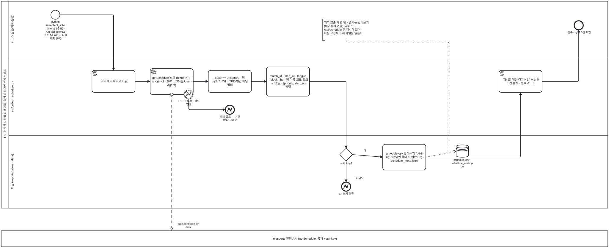

<details><summary>BPMN 2.0 XML 소스 보기 (`diagrams/bpmn_uc09.bpmn` 과 동일 — Camunda Modeler · bpmn.io 에서 열림)</summary>

```xml
<?xml version="1.0" encoding="UTF-8"?>
<bpmn:definitions xmlns:bpmn="http://www.omg.org/spec/BPMN/20100524/MODEL" xmlns:bpmndi="http://www.omg.org/spec/BPMN/20100524/DI" xmlns:dc="http://www.omg.org/spec/DD/20100524/DC" xmlns:di="http://www.omg.org/spec/DD/20100524/DI" id="Definitions_bpmn_uc09" name="UC9 프로 경기 일정 스냅샷 수집" targetNamespace="https://p4.sumzip.com/bpmn" exporter="bpmn_gen.py" exporterVersion="1.0">
  <bpmn:collaboration id="Collab_bpmn_uc09">
    <bpmn:participant id="Pool_bpmn_uc09" name="LoL 인게임 시점별 승패 예측·핵심 승리요인 분석 서비스" processRef="Process_bpmn_uc09" />
    <bpmn:participant id="BB_esports" name="lolesports 일정 API (getSchedule, 공개 x-api-key)" />
    <bpmn:messageFlow id="Msg_bpmn_uc09_0" sourceRef="get" targetRef="BB_esports" name="data.schedule.events" />
  </bpmn:collaboration>
  <bpmn:process id="Process_bpmn_uc09" name="UC9 프로 경기 일정 스냅샷 수집" isExecutable="false">
    <bpmn:laneSet id="LaneSet_bpmn_uc09">
      <bpmn:lane id="Lane_bpmn_uc09_0" name="서비스 담당(배포·운영)">
        <bpmn:flowNodeRef>s</bpmn:flowNodeRef>
        <bpmn:flowNodeRef>e</bpmn:flowNodeRef>
      </bpmn:lane>
      <bpmn:lane id="Lane_bpmn_uc09_1" name="src/collect_schedule.py">
        <bpmn:flowNodeRef>cd</bpmn:flowNodeRef>
        <bpmn:flowNodeRef>get</bpmn:flowNodeRef>
        <bpmn:flowNodeRef>b13</bpmn:flowNodeRef>
        <bpmn:flowNodeRef>e13</bpmn:flowNodeRef>
        <bpmn:flowNodeRef>filt</bpmn:flowNodeRef>
        <bpmn:flowNodeRef>cols</bpmn:flowNodeRef>
        <bpmn:flowNodeRef>done</bpmn:flowNodeRef>
      </bpmn:lane>
      <bpmn:lane id="Lane_bpmn_uc09_2" name="파일 (reports/tables · data)">
        <bpmn:flowNodeRef>g_w</bpmn:flowNodeRef>
        <bpmn:flowNodeRef>e4</bpmn:flowNodeRef>
        <bpmn:flowNodeRef>write</bpmn:flowNodeRef>
      </bpmn:lane>
    </bpmn:laneSet>
    <bpmn:startEvent id="s" name="python src/collect_schedule.py (수동) · run_collectors.sh 1단계 (A1) · 밤샘 배치 (A2)">
      <bpmn:outgoing>Flow_bpmn_uc09_0</bpmn:outgoing>
    </bpmn:startEvent>
    <bpmn:scriptTask id="cd" name="프로젝트 루트로 이동">
      <bpmn:incoming>Flow_bpmn_uc09_0</bpmn:incoming>
      <bpmn:outgoing>Flow_bpmn_uc09_1</bpmn:outgoing>
    </bpmn:scriptTask>
    <bpmn:serviceTask id="get" name="getSchedule 호출 (hl=ko-KR · sport=lol · 20초 · 교육용 User-Agent)">
      <bpmn:incoming>Flow_bpmn_uc09_1</bpmn:incoming>
      <bpmn:outgoing>Flow_bpmn_uc09_3</bpmn:outgoing>
    </bpmn:serviceTask>
    <bpmn:boundaryEvent id="b13" name="E1·E3 실패 · 형식 변경" attachedToRef="get" cancelActivity="true">
      <bpmn:outgoing>Flow_bpmn_uc09_2</bpmn:outgoing>
      <bpmn:errorEventDefinition id="EvDef_b13" />
    </bpmn:boundaryEvent>
    <bpmn:endEvent id="e13" name="예외 종료 — 기존 CSV 그대로">
      <bpmn:incoming>Flow_bpmn_uc09_2</bpmn:incoming>
      <bpmn:errorEventDefinition id="EvDef_e13" />
    </bpmn:endEvent>
    <bpmn:task id="filt" name="state == unstarted · 팀 정확히 2개 · TBD/빈칸 아님 필터">
      <bpmn:incoming>Flow_bpmn_uc09_3</bpmn:incoming>
      <bpmn:outgoing>Flow_bpmn_uc09_4</bpmn:outgoing>
    </bpmn:task>
    <bpmn:task id="cols" name="match_id · start_at · league · block · bo · 팀 이름·코드·로고 → 12열 · (priority, start_at) 정렬">
      <bpmn:incoming>Flow_bpmn_uc09_4</bpmn:incoming>
      <bpmn:outgoing>Flow_bpmn_uc09_5</bpmn:outgoing>
    </bpmn:task>
    <bpmn:exclusiveGateway id="g_w" name="쓰기 가능?">
      <bpmn:incoming>Flow_bpmn_uc09_5</bpmn:incoming>
      <bpmn:outgoing>Flow_bpmn_uc09_6</bpmn:outgoing>
      <bpmn:outgoing>Flow_bpmn_uc09_7</bpmn:outgoing>
    </bpmn:exclusiveGateway>
    <bpmn:endEvent id="e4" name="E4 쓰기 오류">
      <bpmn:incoming>Flow_bpmn_uc09_6</bpmn:incoming>
      <bpmn:errorEventDefinition id="EvDef_e4" />
    </bpmn:endEvent>
    <bpmn:task id="write" name="schedule.csv 덮어쓰기 (utf-8-sig, 0건이면 헤더 12열만 E2) · schedule_meta.json">
      <bpmn:incoming>Flow_bpmn_uc09_7</bpmn:incoming>
      <bpmn:outgoing>Flow_bpmn_uc09_8</bpmn:outgoing>
      <bpmn:dataOutputAssociation id="DOA_write_ds_sched"><bpmn:targetRef>ds_sched</bpmn:targetRef></bpmn:dataOutputAssociation>
    </bpmn:task>
    <bpmn:dataStoreReference id="ds_sched" name="schedule.csv · schedule_meta.json" />
    <bpmn:scriptTask id="done" name="&quot;[완료] 예정 경기 N건&quot; + 상위 5건 출력 · 종료코드 0">
      <bpmn:incoming>Flow_bpmn_uc09_8</bpmn:incoming>
      <bpmn:outgoing>Flow_bpmn_uc09_9</bpmn:outgoing>
    </bpmn:scriptTask>
    <bpmn:endEvent id="e" name="건수 · 상위 5건 확인">
      <bpmn:incoming>Flow_bpmn_uc09_9</bpmn:incoming>
    </bpmn:endEvent>
    <bpmn:textAnnotation id="n"><bpmn:text>외부 호출 딱 한 번 · 결과는 덮어쓰기 (이어받기 없음). 서비스 /api/schedule 은 재시작 없이 다음 요청부터 새 파일을 읽는다</bpmn:text></bpmn:textAnnotation>
    <bpmn:sequenceFlow id="Flow_bpmn_uc09_0" sourceRef="s" targetRef="cd" />
    <bpmn:sequenceFlow id="Flow_bpmn_uc09_1" sourceRef="cd" targetRef="get" />
    <bpmn:sequenceFlow id="Flow_bpmn_uc09_2" sourceRef="b13" targetRef="e13" />
    <bpmn:sequenceFlow id="Flow_bpmn_uc09_3" sourceRef="get" targetRef="filt" />
    <bpmn:sequenceFlow id="Flow_bpmn_uc09_4" sourceRef="filt" targetRef="cols" />
    <bpmn:sequenceFlow id="Flow_bpmn_uc09_5" sourceRef="cols" targetRef="g_w" />
    <bpmn:sequenceFlow id="Flow_bpmn_uc09_6" sourceRef="g_w" targetRef="e4" name="아니오" />
    <bpmn:sequenceFlow id="Flow_bpmn_uc09_7" sourceRef="g_w" targetRef="write" name="예" />
    <bpmn:sequenceFlow id="Flow_bpmn_uc09_8" sourceRef="write" targetRef="done" />
    <bpmn:sequenceFlow id="Flow_bpmn_uc09_9" sourceRef="done" targetRef="e" />
    <bpmn:association id="Assoc_bpmn_uc09_1" sourceRef="n" targetRef="ds_sched" />
  </bpmn:process>
  <bpmndi:BPMNDiagram id="Diagram_bpmn_uc09">
    <bpmndi:BPMNPlane id="Plane_bpmn_uc09" bpmnElement="Collab_bpmn_uc09">
      <bpmndi:BPMNShape id="Pool_bpmn_uc09_di" bpmnElement="Pool_bpmn_uc09" isHorizontal="true"><dc:Bounds x="40" y="20" width="2420" height="825.5" /></bpmndi:BPMNShape>
      <bpmndi:BPMNShape id="Lane_bpmn_uc09_0_di" bpmnElement="Lane_bpmn_uc09_0" isHorizontal="true"><dc:Bounds x="70" y="20" width="2390" height="226" /></bpmndi:BPMNShape>
      <bpmndi:BPMNShape id="Lane_bpmn_uc09_1_di" bpmnElement="Lane_bpmn_uc09_1" isHorizontal="true"><dc:Bounds x="70" y="246" width="2390" height="309.0" /></bpmndi:BPMNShape>
      <bpmndi:BPMNShape id="Lane_bpmn_uc09_2_di" bpmnElement="Lane_bpmn_uc09_2" isHorizontal="true"><dc:Bounds x="70" y="555.0" width="2390" height="290.5" /></bpmndi:BPMNShape>
      <bpmndi:BPMNShape id="BB_esports_di" bpmnElement="BB_esports" isHorizontal="true"><dc:Bounds x="40" y="935.5" width="2420" height="64" /></bpmndi:BPMNShape>
      <bpmndi:BPMNShape id="s_di" bpmnElement="s"><dc:Bounds x="238" y="56" width="36" height="36" />
        <bpmndi:BPMNLabel><dc:Bounds x="196" y="96" width="120" height="28" /></bpmndi:BPMNLabel>
      </bpmndi:BPMNShape>
      <bpmndi:BPMNShape id="cd_di" bpmnElement="cd"><dc:Bounds x="402" y="296" width="172" height="88" />
      </bpmndi:BPMNShape>
      <bpmndi:BPMNShape id="get_di" bpmnElement="get"><dc:Bounds x="634" y="289" width="172" height="102.5" />
      </bpmndi:BPMNShape>
      <bpmndi:BPMNShape id="b13_di" bpmnElement="b13"><dc:Bounds x="770" y="374" width="36" height="36" />
        <bpmndi:BPMNLabel><dc:Bounds x="746" y="412" width="84" height="28" /></bpmndi:BPMNLabel>
      </bpmndi:BPMNShape>
      <bpmndi:BPMNShape id="e13_di" bpmnElement="e13"><dc:Bounds x="934" y="435" width="36" height="36" />
        <bpmndi:BPMNLabel><dc:Bounds x="892" y="475" width="120" height="28" /></bpmndi:BPMNLabel>
      </bpmndi:BPMNShape>
      <bpmndi:BPMNShape id="filt_di" bpmnElement="filt"><dc:Bounds x="866" y="296" width="172" height="88" />
      </bpmndi:BPMNShape>
      <bpmndi:BPMNShape id="cols_di" bpmnElement="cols"><dc:Bounds x="1098" y="282" width="172" height="117.0" />
      </bpmndi:BPMNShape>
      <bpmndi:BPMNShape id="g_w_di" bpmnElement="g_w"><dc:Bounds x="1391" y="607" width="50" height="50" />
        <bpmndi:BPMNLabel><dc:Bounds x="1356" y="661" width="120" height="28" /></bpmndi:BPMNLabel>
      </bpmndi:BPMNShape>
      <bpmndi:BPMNShape id="e4_di" bpmnElement="e4"><dc:Bounds x="1398" y="742" width="36" height="36" />
        <bpmndi:BPMNLabel><dc:Bounds x="1356" y="782" width="120" height="28" /></bpmndi:BPMNLabel>
      </bpmndi:BPMNShape>
      <bpmndi:BPMNShape id="write_di" bpmnElement="write"><dc:Bounds x="1562" y="591" width="172" height="102.5" />
      </bpmndi:BPMNShape>
      <bpmndi:BPMNShape id="ds_sched_di" bpmnElement="ds_sched"><dc:Bounds x="1855" y="593" width="50" height="50" />
        <bpmndi:BPMNLabel><dc:Bounds x="1820" y="647" width="120" height="28" /></bpmndi:BPMNLabel>
      </bpmndi:BPMNShape>
      <bpmndi:BPMNShape id="done_di" bpmnElement="done"><dc:Bounds x="2026" y="296" width="172" height="88" />
      </bpmndi:BPMNShape>
      <bpmndi:BPMNShape id="e_di" bpmnElement="e"><dc:Bounds x="2326" y="98" width="36" height="36" />
        <bpmndi:BPMNLabel><dc:Bounds x="2284" y="138" width="120" height="28" /></bpmndi:BPMNLabel>
      </bpmndi:BPMNShape>
      <bpmndi:BPMNShape id="n_di" bpmnElement="n"><dc:Bounds x="1321" y="91" width="190" height="84.5" />
      </bpmndi:BPMNShape>
      <bpmndi:BPMNEdge id="Flow_bpmn_uc09_0_di" bpmnElement="Flow_bpmn_uc09_0">
        <di:waypoint x="274" y="74" />
        <di:waypoint x="488" y="74" />
        <di:waypoint x="488" y="296" />
      </bpmndi:BPMNEdge>
      <bpmndi:BPMNEdge id="Flow_bpmn_uc09_1_di" bpmnElement="Flow_bpmn_uc09_1">
        <di:waypoint x="574" y="340" />
        <di:waypoint x="634" y="340" />
      </bpmndi:BPMNEdge>
      <bpmndi:BPMNEdge id="Flow_bpmn_uc09_2_di" bpmnElement="Flow_bpmn_uc09_2">
        <di:waypoint x="788" y="410" />
        <di:waypoint x="788" y="453" />
        <di:waypoint x="934" y="453" />
      </bpmndi:BPMNEdge>
      <bpmndi:BPMNEdge id="Flow_bpmn_uc09_3_di" bpmnElement="Flow_bpmn_uc09_3">
        <di:waypoint x="806" y="340" />
        <di:waypoint x="866" y="340" />
      </bpmndi:BPMNEdge>
      <bpmndi:BPMNEdge id="Flow_bpmn_uc09_4_di" bpmnElement="Flow_bpmn_uc09_4">
        <di:waypoint x="1038" y="340" />
        <di:waypoint x="1098" y="340" />
      </bpmndi:BPMNEdge>
      <bpmndi:BPMNEdge id="Flow_bpmn_uc09_5_di" bpmnElement="Flow_bpmn_uc09_5">
        <di:waypoint x="1270" y="340" />
        <di:waypoint x="1416" y="340" />
        <di:waypoint x="1416" y="607" />
      </bpmndi:BPMNEdge>
      <bpmndi:BPMNEdge id="Flow_bpmn_uc09_6_di" bpmnElement="Flow_bpmn_uc09_6">
        <di:waypoint x="1416" y="657" />
        <di:waypoint x="1416" y="742" />
        <bpmndi:BPMNLabel><dc:Bounds x="1424" y="720" width="90" height="18" /></bpmndi:BPMNLabel>
      </bpmndi:BPMNEdge>
      <bpmndi:BPMNEdge id="Flow_bpmn_uc09_7_di" bpmnElement="Flow_bpmn_uc09_7">
        <di:waypoint x="1441" y="632" />
        <di:waypoint x="1562" y="642" />
        <bpmndi:BPMNLabel><dc:Bounds x="1447" y="610" width="90" height="18" /></bpmndi:BPMNLabel>
      </bpmndi:BPMNEdge>
      <bpmndi:BPMNEdge id="Flow_bpmn_uc09_8_di" bpmnElement="Flow_bpmn_uc09_8">
        <di:waypoint x="1734" y="642" />
        <di:waypoint x="2112" y="642" />
        <di:waypoint x="2112" y="384" />
      </bpmndi:BPMNEdge>
      <bpmndi:BPMNEdge id="Flow_bpmn_uc09_9_di" bpmnElement="Flow_bpmn_uc09_9">
        <di:waypoint x="2198" y="340" />
        <di:waypoint x="2344" y="340" />
        <di:waypoint x="2344" y="134" />
      </bpmndi:BPMNEdge>
      <bpmndi:BPMNEdge id="Msg_bpmn_uc09_0_di" bpmnElement="Msg_bpmn_uc09_0">
        <di:waypoint x="720" y="392" />
        <di:waypoint x="720" y="936" />
        <bpmndi:BPMNLabel><dc:Bounds x="726" y="902" width="120" height="18" /></bpmndi:BPMNLabel>
      </bpmndi:BPMNEdge>
      <bpmndi:BPMNEdge id="DOA_write_ds_sched_di" bpmnElement="DOA_write_ds_sched">
        <di:waypoint x="1734" y="642" />
        <di:waypoint x="1855" y="618" />
      </bpmndi:BPMNEdge>
      <bpmndi:BPMNEdge id="Assoc_bpmn_uc09_1_di" bpmnElement="Assoc_bpmn_uc09_1">
        <di:waypoint x="1416" y="175" />
        <di:waypoint x="1416" y="183" />
        <di:waypoint x="1827" y="183" />
        <di:waypoint x="1827" y="618" />
        <di:waypoint x="1855" y="618" />
      </bpmndi:BPMNEdge>
    </bpmndi:BPMNPlane>
  </bpmndi:BPMNDiagram>
</bpmn:definitions>
```

</details>

**BPMN 으로 보이는 것.** lolesports 풀과의 메시지 흐름이 **딱 한 번**이고, 실패·형식 변경은 그 활동의 오류 경계 이벤트(E1·E3)로 빠져 기존 CSV 가 그대로 남는다. 파일 레인의 "쓰기 가능?" 게이트웨이(E4)를 지나면 `schedule.csv` 를 **덮어쓴다** — 이어받기가 없는 유일한 수집기다.

### 4.10 UC10 Riot 표본 스냅샷 수집 (챔피언·랭킹) — [UC_10](UC_10_Riot표본스냅샷수집.md)

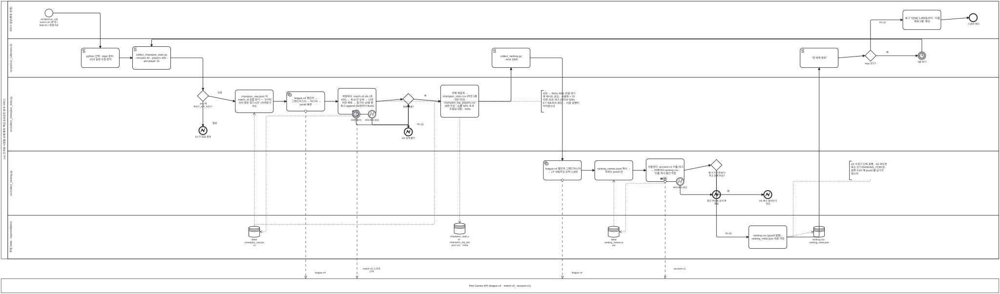

<details><summary>BPMN 2.0 XML 소스 보기 (`diagrams/bpmn_uc10.bpmn` 과 동일 — Camunda Modeler · bpmn.io 에서 열림)</summary>

```xml
<?xml version="1.0" encoding="UTF-8"?>
<bpmn:definitions xmlns:bpmn="http://www.omg.org/spec/BPMN/20100524/MODEL" xmlns:bpmndi="http://www.omg.org/spec/BPMN/20100524/DI" xmlns:dc="http://www.omg.org/spec/DD/20100524/DC" xmlns:di="http://www.omg.org/spec/DD/20100524/DI" id="Definitions_bpmn_uc10" name="UC10 Riot 표본 스냅샷 수집 (챔피언 · 랭킹)" targetNamespace="https://p4.sumzip.com/bpmn" exporter="bpmn_gen.py" exporterVersion="1.0">
  <bpmn:collaboration id="Collab_bpmn_uc10">
    <bpmn:participant id="Pool_bpmn_uc10" name="LoL 인게임 시점별 승패 예측·핵심 승리요인 분석 서비스" processRef="Process_bpmn_uc10" />
    <bpmn:participant id="BB_riot" name="Riot Games API (league-v4 · match-v5 · account-v1)" />
    <bpmn:messageFlow id="Msg_bpmn_uc10_0" sourceRef="sample" targetRef="BB_riot" name="league-v4" />
    <bpmn:messageFlow id="Msg_bpmn_uc10_1" sourceRef="loop" targetRef="BB_riot" name="match-v5 1.25초 간격" />
    <bpmn:messageFlow id="Msg_bpmn_uc10_2" sourceRef="top" targetRef="BB_riot" name="league-v4" />
    <bpmn:messageFlow id="Msg_bpmn_uc10_3" sourceRef="loop2" targetRef="BB_riot" name="account-v1" />
  </bpmn:collaboration>
  <bpmn:process id="Process_bpmn_uc10" name="UC10 Riot 표본 스냅샷 수집 (챔피언 · 랭킹)" isExecutable="false">
    <bpmn:laneSet id="LaneSet_bpmn_uc10">
      <bpmn:lane id="Lane_bpmn_uc10_0" name="서비스 담당(배포·운영)">
        <bpmn:flowNodeRef>s</bpmn:flowNodeRef>
        <bpmn:flowNodeRef>log</bpmn:flowNodeRef>
        <bpmn:flowNodeRef>e</bpmn:flowNodeRef>
      </bpmn:lane>
      <bpmn:lane id="Lane_bpmn_uc10_1" name="scripts/run_collectors.sh">
        <bpmn:flowNodeRef>prep</bpmn:flowNodeRef>
        <bpmn:flowNodeRef>run1</bpmn:flowNodeRef>
        <bpmn:flowNodeRef>run2</bpmn:flowNodeRef>
        <bpmn:flowNodeRef>done</bpmn:flowNodeRef>
        <bpmn:flowNodeRef>g_loop</bpmn:flowNodeRef>
        <bpmn:flowNodeRef>wait</bpmn:flowNodeRef>
      </bpmn:lane>
      <bpmn:lane id="Lane_bpmn_uc10_2" name="src/collect_champion_stats.py">
        <bpmn:flowNodeRef>g_key</bpmn:flowNodeRef>
        <bpmn:flowNodeRef>e3</bpmn:flowNodeRef>
        <bpmn:flowNodeRef>resume</bpmn:flowNodeRef>
        <bpmn:flowNodeRef>sample</bpmn:flowNodeRef>
        <bpmn:flowNodeRef>loop</bpmn:flowNodeRef>
        <bpmn:flowNodeRef>bt</bpmn:flowNodeRef>
        <bpmn:flowNodeRef>be</bpmn:flowNodeRef>
        <bpmn:flowNodeRef>g_raw</bpmn:flowNodeRef>
        <bpmn:flowNodeRef>e6</bpmn:flowNodeRef>
        <bpmn:flowNodeRef>agg</bpmn:flowNodeRef>
      </bpmn:lane>
      <bpmn:lane id="Lane_bpmn_uc10_3" name="src/collect_ranking.py">
        <bpmn:flowNodeRef>top</bpmn:flowNodeRef>
        <bpmn:flowNodeRef>cache</bpmn:flowNodeRef>
        <bpmn:flowNodeRef>loop2</bpmn:flowNodeRef>
        <bpmn:flowNodeRef>be2</bpmn:flowNodeRef>
        <bpmn:flowNodeRef>e2b</bpmn:flowNodeRef>
        <bpmn:flowNodeRef>g_shrink</bpmn:flowNodeRef>
        <bpmn:flowNodeRef>e5</bpmn:flowNodeRef>
      </bpmn:lane>
      <bpmn:lane id="Lane_bpmn_uc10_4" name="파일 (data · reports/tables)">
        <bpmn:flowNodeRef>final</bpmn:flowNodeRef>
      </bpmn:lane>
    </bpmn:laneSet>
    <bpmn:startEvent id="s" name="./scripts/run_collectors.sh (한 번 / loop A1 / 밤샘 A2)">
      <bpmn:outgoing>Flow_bpmn_uc10_0</bpmn:outgoing>
    </bpmn:startEvent>
    <bpmn:scriptTask id="prep" name="python 선택 · logs/ 준비 · UC9 일정 수집 먼저">
      <bpmn:incoming>Flow_bpmn_uc10_0</bpmn:incoming>
      <bpmn:outgoing>Flow_bpmn_uc10_1</bpmn:outgoing>
    </bpmn:scriptTask>
    <bpmn:scriptTask id="run1" name="collect_champion_stats.py --minutes 40 --players 400 --per-player 15">
      <bpmn:incoming>Flow_bpmn_uc10_1</bpmn:incoming>
      <bpmn:incoming>Flow_bpmn_uc10_23</bpmn:incoming>
      <bpmn:outgoing>Flow_bpmn_uc10_2</bpmn:outgoing>
    </bpmn:scriptTask>
    <bpmn:exclusiveGateway id="g_key" name=".env 에 RIOT_API_KEY?">
      <bpmn:incoming>Flow_bpmn_uc10_2</bpmn:incoming>
      <bpmn:outgoing>Flow_bpmn_uc10_3</bpmn:outgoing>
      <bpmn:outgoing>Flow_bpmn_uc10_4</bpmn:outgoing>
    </bpmn:exclusiveGateway>
    <bpmn:endEvent id="e3" name="E3 키 없음 종료">
      <bpmn:incoming>Flow_bpmn_uc10_3</bpmn:incoming>
      <bpmn:errorEventDefinition id="EvDef_e3" />
    </bpmn:endEvent>
    <bpmn:task id="resume" name="champion_raw.jsonl 의 match_id 집합 읽기 — &quot;[시작] 이미 받은 경기 n건&quot; (이어받기 A4)">
      <bpmn:incoming>Flow_bpmn_uc10_4</bpmn:incoming>
      <bpmn:outgoing>Flow_bpmn_uc10_5</bpmn:outgoing>
      <bpmn:dataInputAssociation id="DIA_ds_raw_resume"><bpmn:sourceRef>ds_raw</bpmn:sourceRef></bpmn:dataInputAssociation>
    </bpmn:task>
    <bpmn:dataStoreReference id="ds_raw" name="data/ champion_raw.jsonl" />
    <bpmn:serviceTask id="sample" name="league-v4 챌린저 → 그랜드마스터 → 마스터 → puuid 표본">
      <bpmn:incoming>Flow_bpmn_uc10_5</bpmn:incoming>
      <bpmn:outgoing>Flow_bpmn_uc10_6</bpmn:outgoing>
    </bpmn:serviceTask>
    <bpmn:subProcess id="loop" name="계정마다: match-v5 ids (큐 420) → 새 id 만 상세 → 11분 미만 제외 → 참가자 10명 행 즉시 append (50판마다 flush)" triggeredByEvent="false">
      <bpmn:incoming>Flow_bpmn_uc10_6</bpmn:incoming>
      <bpmn:outgoing>Flow_bpmn_uc10_9</bpmn:outgoing>
      <bpmn:multiInstanceLoopCharacteristics isSequential="true" />
      <bpmn:dataOutputAssociation id="DOA_loop_ds_raw"><bpmn:targetRef>ds_raw</bpmn:targetRef></bpmn:dataOutputAssociation>
    </bpmn:subProcess>
    <bpmn:boundaryEvent id="bt" name="40분 (E4)" attachedToRef="loop" cancelActivity="true">
      <bpmn:outgoing>Flow_bpmn_uc10_7</bpmn:outgoing>
      <bpmn:timerEventDefinition id="EvDef_bt" />
    </bpmn:boundaryEvent>
    <bpmn:boundaryEvent id="be" name="401/403 (E2)" attachedToRef="loop" cancelActivity="true">
      <bpmn:outgoing>Flow_bpmn_uc10_8</bpmn:outgoing>
      <bpmn:errorEventDefinition id="EvDef_be" />
    </bpmn:boundaryEvent>
    <bpmn:exclusiveGateway id="g_raw" name="원본 있음?">
      <bpmn:incoming>Flow_bpmn_uc10_7</bpmn:incoming>
      <bpmn:incoming>Flow_bpmn_uc10_8</bpmn:incoming>
      <bpmn:incoming>Flow_bpmn_uc10_9</bpmn:incoming>
      <bpmn:outgoing>Flow_bpmn_uc10_10</bpmn:outgoing>
      <bpmn:outgoing>Flow_bpmn_uc10_11</bpmn:outgoing>
    </bpmn:exclusiveGateway>
    <bpmn:endEvent id="e6" name="E6 집계 불가">
      <bpmn:incoming>Flow_bpmn_uc10_10</bpmn:incoming>
      <bpmn:errorEventDefinition id="EvDef_e6" />
    </bpmn:endEvent>
    <bpmn:task id="agg" name="전체 재집계 → champion_stats.csv (라인 5종 · 5판 이상) · champion_top_players.csv (8판 이상 · 승률 50% 초과 · 조합당 5명) · meta">
      <bpmn:incoming>Flow_bpmn_uc10_11</bpmn:incoming>
      <bpmn:outgoing>Flow_bpmn_uc10_12</bpmn:outgoing>
      <bpmn:dataInputAssociation id="DIA_ds_raw_agg"><bpmn:sourceRef>ds_raw</bpmn:sourceRef></bpmn:dataInputAssociation>
      <bpmn:dataOutputAssociation id="DOA_agg_ds_champ"><bpmn:targetRef>ds_champ</bpmn:targetRef></bpmn:dataOutputAssociation>
    </bpmn:task>
    <bpmn:dataStoreReference id="ds_champ" name="champion_stats.csv · champion_top_players.csv · meta" />
    <bpmn:scriptTask id="run2" name="collect_ranking.py --limit 1000">
      <bpmn:incoming>Flow_bpmn_uc10_12</bpmn:incoming>
      <bpmn:outgoing>Flow_bpmn_uc10_13</bpmn:outgoing>
    </bpmn:scriptTask>
    <bpmn:serviceTask id="top" name="league-v4 챌린저·그랜드마스터 → LP 내림차순 상위 1,000">
      <bpmn:incoming>Flow_bpmn_uc10_13</bpmn:incoming>
      <bpmn:outgoing>Flow_bpmn_uc10_14</bpmn:outgoing>
    </bpmn:serviceTask>
    <bpmn:task id="cache" name="ranking_names.jsonl 캐시 → 모르는 puuid 만">
      <bpmn:incoming>Flow_bpmn_uc10_14</bpmn:incoming>
      <bpmn:outgoing>Flow_bpmn_uc10_15</bpmn:outgoing>
      <bpmn:dataInputAssociation id="DIA_ds_names_cache"><bpmn:sourceRef>ds_names</bpmn:sourceRef></bpmn:dataInputAssociation>
    </bpmn:task>
    <bpmn:dataStoreReference id="ds_names" name="data/ ranking_names.jsonl" />
    <bpmn:subProcess id="loop2" name="사람마다: account-v1 이름·태그 → 25명마다 ranking.csv · 이름 캐시 중간 저장" triggeredByEvent="false">
      <bpmn:incoming>Flow_bpmn_uc10_15</bpmn:incoming>
      <bpmn:outgoing>Flow_bpmn_uc10_17</bpmn:outgoing>
      <bpmn:multiInstanceLoopCharacteristics isSequential="true" />
      <bpmn:dataOutputAssociation id="DOA_loop2_ds_names"><bpmn:targetRef>ds_names</bpmn:targetRef></bpmn:dataOutputAssociation>
    </bpmn:subProcess>
    <bpmn:boundaryEvent id="be2" name="401/403 (E2)" attachedToRef="loop2" cancelActivity="true">
      <bpmn:outgoing>Flow_bpmn_uc10_16</bpmn:outgoing>
      <bpmn:errorEventDefinition id="EvDef_be2" />
    </bpmn:boundaryEvent>
    <bpmn:endEvent id="e2b" name="중간 저장분 유지 후 종료">
      <bpmn:incoming>Flow_bpmn_uc10_16</bpmn:incoming>
      <bpmn:errorEventDefinition id="EvDef_e2b" />
    </bpmn:endEvent>
    <bpmn:exclusiveGateway id="g_shrink" name="행 수가 기존보다 적고 강제 아님?">
      <bpmn:incoming>Flow_bpmn_uc10_17</bpmn:incoming>
      <bpmn:outgoing>Flow_bpmn_uc10_18</bpmn:outgoing>
      <bpmn:outgoing>Flow_bpmn_uc10_19</bpmn:outgoing>
    </bpmn:exclusiveGateway>
    <bpmn:endEvent id="e5" name="E5 축소 덮어쓰기 차단">
      <bpmn:incoming>Flow_bpmn_uc10_18</bpmn:incoming>
      <bpmn:errorEventDefinition id="EvDef_e5" />
    </bpmn:endEvent>
    <bpmn:task id="final" name="ranking.csv (puuid 없음) · ranking_meta.json 최종 저장">
      <bpmn:incoming>Flow_bpmn_uc10_19</bpmn:incoming>
      <bpmn:outgoing>Flow_bpmn_uc10_20</bpmn:outgoing>
      <bpmn:dataOutputAssociation id="DOA_final_ds_rank"><bpmn:targetRef>ds_rank</bpmn:targetRef></bpmn:dataOutputAssociation>
    </bpmn:task>
    <bpmn:dataStoreReference id="ds_rank" name="ranking.csv · ranking_meta.json" />
    <bpmn:scriptTask id="done" name="&quot;한 바퀴 완료&quot;">
      <bpmn:incoming>Flow_bpmn_uc10_20</bpmn:incoming>
      <bpmn:outgoing>Flow_bpmn_uc10_21</bpmn:outgoing>
    </bpmn:scriptTask>
    <bpmn:exclusiveGateway id="g_loop" name="loop 모드?">
      <bpmn:incoming>Flow_bpmn_uc10_21</bpmn:incoming>
      <bpmn:outgoing>Flow_bpmn_uc10_22</bpmn:outgoing>
      <bpmn:outgoing>Flow_bpmn_uc10_24</bpmn:outgoing>
    </bpmn:exclusiveGateway>
    <bpmn:intermediateCatchEvent id="wait" name="5분 대기">
      <bpmn:incoming>Flow_bpmn_uc10_22</bpmn:incoming>
      <bpmn:outgoing>Flow_bpmn_uc10_23</bpmn:outgoing>
      <bpmn:timerEventDefinition id="EvDef_wait" />
    </bpmn:intermediateCatchEvent>
    <bpmn:task id="log" name="로그 &quot;[완료] 1,000등까지 · 이름 확보 n명&quot; 확인">
      <bpmn:incoming>Flow_bpmn_uc10_24</bpmn:incoming>
      <bpmn:outgoing>Flow_bpmn_uc10_25</bpmn:outgoing>
    </bpmn:task>
    <bpmn:endEvent id="e" name="스냅샷 갱신">
      <bpmn:incoming>Flow_bpmn_uc10_25</bpmn:incoming>
    </bpmn:endEvent>
    <bpmn:textAnnotation id="n_429"><bpmn:text>429 → Retry-After 만큼 대기 후 재시도 (E1) · 사용량 &gt; 70 이면 20초 대기 (라이브 양보) · E7 네트워크 끊김 → 다음 실행이 이어받는다</bpmn:text></bpmn:textAnnotation>
    <bpmn:textAnnotation id="n_alt"><bpmn:text>A3 수집기 단독 실행 · A5 의도한 축소 쓰기 RANKING_FORCE · 원본·CSV 에 puuid 를 남기지 않는다</bpmn:text></bpmn:textAnnotation>
    <bpmn:sequenceFlow id="Flow_bpmn_uc10_0" sourceRef="s" targetRef="prep" />
    <bpmn:sequenceFlow id="Flow_bpmn_uc10_1" sourceRef="prep" targetRef="run1" />
    <bpmn:sequenceFlow id="Flow_bpmn_uc10_2" sourceRef="run1" targetRef="g_key" />
    <bpmn:sequenceFlow id="Flow_bpmn_uc10_3" sourceRef="g_key" targetRef="e3" name="없음" />
    <bpmn:sequenceFlow id="Flow_bpmn_uc10_4" sourceRef="g_key" targetRef="resume" name="있음" />
    <bpmn:sequenceFlow id="Flow_bpmn_uc10_5" sourceRef="resume" targetRef="sample" />
    <bpmn:sequenceFlow id="Flow_bpmn_uc10_6" sourceRef="sample" targetRef="loop" />
    <bpmn:sequenceFlow id="Flow_bpmn_uc10_7" sourceRef="bt" targetRef="g_raw" />
    <bpmn:sequenceFlow id="Flow_bpmn_uc10_8" sourceRef="be" targetRef="g_raw" />
    <bpmn:sequenceFlow id="Flow_bpmn_uc10_9" sourceRef="loop" targetRef="g_raw" />
    <bpmn:sequenceFlow id="Flow_bpmn_uc10_10" sourceRef="g_raw" targetRef="e6" name="아니오" />
    <bpmn:sequenceFlow id="Flow_bpmn_uc10_11" sourceRef="g_raw" targetRef="agg" name="예" />
    <bpmn:sequenceFlow id="Flow_bpmn_uc10_12" sourceRef="agg" targetRef="run2" />
    <bpmn:sequenceFlow id="Flow_bpmn_uc10_13" sourceRef="run2" targetRef="top" />
    <bpmn:sequenceFlow id="Flow_bpmn_uc10_14" sourceRef="top" targetRef="cache" />
    <bpmn:sequenceFlow id="Flow_bpmn_uc10_15" sourceRef="cache" targetRef="loop2" />
    <bpmn:sequenceFlow id="Flow_bpmn_uc10_16" sourceRef="be2" targetRef="e2b" />
    <bpmn:sequenceFlow id="Flow_bpmn_uc10_17" sourceRef="loop2" targetRef="g_shrink" />
    <bpmn:sequenceFlow id="Flow_bpmn_uc10_18" sourceRef="g_shrink" targetRef="e5" name="예" />
    <bpmn:sequenceFlow id="Flow_bpmn_uc10_19" sourceRef="g_shrink" targetRef="final" name="아니오" />
    <bpmn:sequenceFlow id="Flow_bpmn_uc10_20" sourceRef="final" targetRef="done" />
    <bpmn:sequenceFlow id="Flow_bpmn_uc10_21" sourceRef="done" targetRef="g_loop" />
    <bpmn:sequenceFlow id="Flow_bpmn_uc10_22" sourceRef="g_loop" targetRef="wait" name="예" />
    <bpmn:sequenceFlow id="Flow_bpmn_uc10_23" sourceRef="wait" targetRef="run1" />
    <bpmn:sequenceFlow id="Flow_bpmn_uc10_24" sourceRef="g_loop" targetRef="log" name="아니오" />
    <bpmn:sequenceFlow id="Flow_bpmn_uc10_25" sourceRef="log" targetRef="e" />
    <bpmn:association id="Assoc_bpmn_uc10_7" sourceRef="n_429" targetRef="loop" />
    <bpmn:association id="Assoc_bpmn_uc10_8" sourceRef="n_alt" targetRef="final" />
  </bpmn:process>
  <bpmndi:BPMNDiagram id="Diagram_bpmn_uc10">
    <bpmndi:BPMNPlane id="Plane_bpmn_uc10" bpmnElement="Collab_bpmn_uc10">
      <bpmndi:BPMNShape id="Pool_bpmn_uc10_di" bpmnElement="Pool_bpmn_uc10" isHorizontal="true"><dc:Bounds x="40" y="20" width="4508" height="1167.0" /></bpmndi:BPMNShape>
      <bpmndi:BPMNShape id="Lane_bpmn_uc10_0_di" bpmnElement="Lane_bpmn_uc10_0" isHorizontal="true"><dc:Bounds x="70" y="20" width="4478" height="170" /></bpmndi:BPMNShape>
      <bpmndi:BPMNShape id="Lane_bpmn_uc10_1_di" bpmnElement="Lane_bpmn_uc10_1" isHorizontal="true"><dc:Bounds x="70" y="190" width="4478" height="174.5" /></bpmndi:BPMNShape>
      <bpmndi:BPMNShape id="Lane_bpmn_uc10_2_di" bpmnElement="Lane_bpmn_uc10_2" isHorizontal="true"><dc:Bounds x="70" y="364.5" width="4478" height="334.0" /></bpmndi:BPMNShape>
      <bpmndi:BPMNShape id="Lane_bpmn_uc10_3_di" bpmnElement="Lane_bpmn_uc10_3" isHorizontal="true"><dc:Bounds x="70" y="698.5" width="4478" height="290.5" /></bpmndi:BPMNShape>
      <bpmndi:BPMNShape id="Lane_bpmn_uc10_4_di" bpmnElement="Lane_bpmn_uc10_4" isHorizontal="true"><dc:Bounds x="70" y="989.0" width="4478" height="198" /></bpmndi:BPMNShape>
      <bpmndi:BPMNShape id="BB_riot_di" bpmnElement="BB_riot" isHorizontal="true"><dc:Bounds x="40" y="1277.0" width="4508" height="64" /></bpmndi:BPMNShape>
      <bpmndi:BPMNShape id="s_di" bpmnElement="s"><dc:Bounds x="238" y="56" width="36" height="36" />
        <bpmndi:BPMNLabel><dc:Bounds x="196" y="96" width="120" height="28" /></bpmndi:BPMNLabel>
      </bpmndi:BPMNShape>
      <bpmndi:BPMNShape id="prep_di" bpmnElement="prep"><dc:Bounds x="402" y="233" width="172" height="88" />
      </bpmndi:BPMNShape>
      <bpmndi:BPMNShape id="run1_di" bpmnElement="run1"><dc:Bounds x="634" y="226" width="172" height="102.5" />
      </bpmndi:BPMNShape>
      <bpmndi:BPMNShape id="g_key_di" bpmnElement="g_key"><dc:Bounds x="927" y="424" width="50" height="50" />
        <bpmndi:BPMNLabel><dc:Bounds x="892" y="478" width="120" height="28" /></bpmndi:BPMNLabel>
      </bpmndi:BPMNShape>
      <bpmndi:BPMNShape id="e3_di" bpmnElement="e3"><dc:Bounds x="934" y="588" width="36" height="36" />
        <bpmndi:BPMNLabel><dc:Bounds x="892" y="628" width="120" height="28" /></bpmndi:BPMNLabel>
      </bpmndi:BPMNShape>
      <bpmndi:BPMNShape id="resume_di" bpmnElement="resume"><dc:Bounds x="1098" y="422" width="172" height="102.5" />
      </bpmndi:BPMNShape>
      <bpmndi:BPMNShape id="ds_raw_di" bpmnElement="ds_raw"><dc:Bounds x="1159" y="1039" width="50" height="50" />
        <bpmndi:BPMNLabel><dc:Bounds x="1124" y="1093" width="120" height="28" /></bpmndi:BPMNLabel>
      </bpmndi:BPMNShape>
      <bpmndi:BPMNShape id="sample_di" bpmnElement="sample"><dc:Bounds x="1330" y="430" width="172" height="88" />
      </bpmndi:BPMNShape>
      <bpmndi:BPMNShape id="loop_di" bpmnElement="loop" isExpanded="false"><dc:Bounds x="1562" y="415" width="172" height="117.0" />
      </bpmndi:BPMNShape>
      <bpmndi:BPMNShape id="bt_di" bpmnElement="bt"><dc:Bounds x="1626" y="514" width="36" height="36" />
        <bpmndi:BPMNLabel><dc:Bounds x="1602" y="552" width="84" height="28" /></bpmndi:BPMNLabel>
      </bpmndi:BPMNShape>
      <bpmndi:BPMNShape id="be_di" bpmnElement="be"><dc:Bounds x="1698" y="514" width="36" height="36" />
        <bpmndi:BPMNLabel><dc:Bounds x="1674" y="552" width="84" height="28" /></bpmndi:BPMNLabel>
      </bpmndi:BPMNShape>
      <bpmndi:BPMNShape id="g_raw_di" bpmnElement="g_raw"><dc:Bounds x="1855" y="438" width="50" height="50" />
        <bpmndi:BPMNLabel><dc:Bounds x="1820" y="492" width="120" height="28" /></bpmndi:BPMNLabel>
      </bpmndi:BPMNShape>
      <bpmndi:BPMNShape id="e6_di" bpmnElement="e6"><dc:Bounds x="1862" y="594" width="36" height="36" />
        <bpmndi:BPMNLabel><dc:Bounds x="1820" y="634" width="120" height="28" /></bpmndi:BPMNLabel>
      </bpmndi:BPMNShape>
      <bpmndi:BPMNShape id="agg_di" bpmnElement="agg"><dc:Bounds x="2026" y="400" width="172" height="146.0" />
      </bpmndi:BPMNShape>
      <bpmndi:BPMNShape id="ds_champ_di" bpmnElement="ds_champ"><dc:Bounds x="2087" y="1025" width="50" height="50" />
        <bpmndi:BPMNLabel><dc:Bounds x="2052" y="1079" width="120" height="28" /></bpmndi:BPMNLabel>
      </bpmndi:BPMNShape>
      <bpmndi:BPMNShape id="run2_di" bpmnElement="run2"><dc:Bounds x="2258" y="233" width="172" height="88" />
      </bpmndi:BPMNShape>
      <bpmndi:BPMNShape id="top_di" bpmnElement="top"><dc:Bounds x="2490" y="742" width="172" height="88" />
      </bpmndi:BPMNShape>
      <bpmndi:BPMNShape id="cache_di" bpmnElement="cache"><dc:Bounds x="2722" y="742" width="172" height="88" />
      </bpmndi:BPMNShape>
      <bpmndi:BPMNShape id="ds_names_di" bpmnElement="ds_names"><dc:Bounds x="2783" y="1039" width="50" height="50" />
        <bpmndi:BPMNLabel><dc:Bounds x="2748" y="1093" width="120" height="28" /></bpmndi:BPMNLabel>
      </bpmndi:BPMNShape>
      <bpmndi:BPMNShape id="loop2_di" bpmnElement="loop2" isExpanded="false"><dc:Bounds x="2954" y="734" width="172" height="102.5" />
      </bpmndi:BPMNShape>
      <bpmndi:BPMNShape id="be2_di" bpmnElement="be2"><dc:Bounds x="3090" y="819" width="36" height="36" />
        <bpmndi:BPMNLabel><dc:Bounds x="3066" y="857" width="84" height="28" /></bpmndi:BPMNLabel>
      </bpmndi:BPMNShape>
      <bpmndi:BPMNShape id="e2b_di" bpmnElement="e2b"><dc:Bounds x="3254" y="878" width="36" height="36" />
        <bpmndi:BPMNLabel><dc:Bounds x="3212" y="918" width="120" height="28" /></bpmndi:BPMNLabel>
      </bpmndi:BPMNShape>
      <bpmndi:BPMNShape id="g_shrink_di" bpmnElement="g_shrink"><dc:Bounds x="3247" y="737" width="50" height="50" />
        <bpmndi:BPMNLabel><dc:Bounds x="3212" y="791" width="120" height="28" /></bpmndi:BPMNLabel>
      </bpmndi:BPMNShape>
      <bpmndi:BPMNShape id="e5_di" bpmnElement="e5"><dc:Bounds x="3486" y="878" width="36" height="36" />
        <bpmndi:BPMNLabel><dc:Bounds x="3444" y="918" width="120" height="28" /></bpmndi:BPMNLabel>
      </bpmndi:BPMNShape>
      <bpmndi:BPMNShape id="final_di" bpmnElement="final"><dc:Bounds x="3418" y="1037" width="172" height="102.5" />
      </bpmndi:BPMNShape>
      <bpmndi:BPMNShape id="ds_rank_di" bpmnElement="ds_rank"><dc:Bounds x="3711" y="1039" width="50" height="50" />
        <bpmndi:BPMNLabel><dc:Bounds x="3676" y="1093" width="120" height="28" /></bpmndi:BPMNLabel>
      </bpmndi:BPMNShape>
      <bpmndi:BPMNShape id="done_di" bpmnElement="done"><dc:Bounds x="3650" y="233" width="172" height="88" />
      </bpmndi:BPMNShape>
      <bpmndi:BPMNShape id="g_loop_di" bpmnElement="g_loop"><dc:Bounds x="3943" y="242" width="50" height="50" />
        <bpmndi:BPMNLabel><dc:Bounds x="3908" y="296" width="120" height="28" /></bpmndi:BPMNLabel>
      </bpmndi:BPMNShape>
      <bpmndi:BPMNShape id="wait_di" bpmnElement="wait"><dc:Bounds x="4182" y="249" width="36" height="36" />
        <bpmndi:BPMNLabel><dc:Bounds x="4140" y="289" width="120" height="28" /></bpmndi:BPMNLabel>
      </bpmndi:BPMNShape>
      <bpmndi:BPMNShape id="log_di" bpmnElement="log"><dc:Bounds x="4114" y="61" width="172" height="88" />
      </bpmndi:BPMNShape>
      <bpmndi:BPMNShape id="e_di" bpmnElement="e"><dc:Bounds x="4414" y="77" width="36" height="36" />
        <bpmndi:BPMNLabel><dc:Bounds x="4372" y="117" width="120" height="28" /></bpmndi:BPMNLabel>
      </bpmndi:BPMNShape>
      <bpmndi:BPMNShape id="n_429_di" bpmnElement="n_429"><dc:Bounds x="2481" y="424" width="190" height="99.0" />
      </bpmndi:BPMNShape>
      <bpmndi:BPMNShape id="n_alt_di" bpmnElement="n_alt"><dc:Bounds x="3873" y="744" width="190" height="84.5" />
      </bpmndi:BPMNShape>
      <bpmndi:BPMNEdge id="Flow_bpmn_uc10_0_di" bpmnElement="Flow_bpmn_uc10_0">
        <di:waypoint x="274" y="74" />
        <di:waypoint x="488" y="74" />
        <di:waypoint x="488" y="233" />
      </bpmndi:BPMNEdge>
      <bpmndi:BPMNEdge id="Flow_bpmn_uc10_1_di" bpmnElement="Flow_bpmn_uc10_1">
        <di:waypoint x="574" y="277" />
        <di:waypoint x="634" y="277" />
      </bpmndi:BPMNEdge>
      <bpmndi:BPMNEdge id="Flow_bpmn_uc10_2_di" bpmnElement="Flow_bpmn_uc10_2">
        <di:waypoint x="806" y="277" />
        <di:waypoint x="952" y="277" />
        <di:waypoint x="952" y="424" />
      </bpmndi:BPMNEdge>
      <bpmndi:BPMNEdge id="Flow_bpmn_uc10_3_di" bpmnElement="Flow_bpmn_uc10_3">
        <di:waypoint x="952" y="474" />
        <di:waypoint x="952" y="588" />
        <bpmndi:BPMNLabel><dc:Bounds x="960" y="566" width="90" height="18" /></bpmndi:BPMNLabel>
      </bpmndi:BPMNEdge>
      <bpmndi:BPMNEdge id="Flow_bpmn_uc10_4_di" bpmnElement="Flow_bpmn_uc10_4">
        <di:waypoint x="977" y="450" />
        <di:waypoint x="1098" y="474" />
        <bpmndi:BPMNLabel><dc:Bounds x="983" y="428" width="90" height="18" /></bpmndi:BPMNLabel>
      </bpmndi:BPMNEdge>
      <bpmndi:BPMNEdge id="Flow_bpmn_uc10_5_di" bpmnElement="Flow_bpmn_uc10_5">
        <di:waypoint x="1270" y="474" />
        <di:waypoint x="1330" y="474" />
      </bpmndi:BPMNEdge>
      <bpmndi:BPMNEdge id="Flow_bpmn_uc10_6_di" bpmnElement="Flow_bpmn_uc10_6">
        <di:waypoint x="1502" y="474" />
        <di:waypoint x="1562" y="474" />
      </bpmndi:BPMNEdge>
      <bpmndi:BPMNEdge id="Flow_bpmn_uc10_7_di" bpmnElement="Flow_bpmn_uc10_7">
        <di:waypoint x="1644" y="550" />
        <di:waypoint x="1644" y="580" />
        <di:waypoint x="1880" y="580" />
        <di:waypoint x="1880" y="488" />
      </bpmndi:BPMNEdge>
      <bpmndi:BPMNEdge id="Flow_bpmn_uc10_8_di" bpmnElement="Flow_bpmn_uc10_8">
        <di:waypoint x="1716" y="550" />
        <di:waypoint x="1716" y="580" />
        <di:waypoint x="1880" y="580" />
        <di:waypoint x="1880" y="488" />
      </bpmndi:BPMNEdge>
      <bpmndi:BPMNEdge id="Flow_bpmn_uc10_9_di" bpmnElement="Flow_bpmn_uc10_9">
        <di:waypoint x="1734" y="474" />
        <di:waypoint x="1855" y="464" />
      </bpmndi:BPMNEdge>
      <bpmndi:BPMNEdge id="Flow_bpmn_uc10_10_di" bpmnElement="Flow_bpmn_uc10_10">
        <di:waypoint x="1880" y="488" />
        <di:waypoint x="1880" y="594" />
        <bpmndi:BPMNLabel><dc:Bounds x="1888" y="572" width="90" height="18" /></bpmndi:BPMNLabel>
      </bpmndi:BPMNEdge>
      <bpmndi:BPMNEdge id="Flow_bpmn_uc10_11_di" bpmnElement="Flow_bpmn_uc10_11">
        <di:waypoint x="1905" y="464" />
        <di:waypoint x="2026" y="474" />
        <bpmndi:BPMNLabel><dc:Bounds x="1911" y="442" width="90" height="18" /></bpmndi:BPMNLabel>
      </bpmndi:BPMNEdge>
      <bpmndi:BPMNEdge id="Flow_bpmn_uc10_12_di" bpmnElement="Flow_bpmn_uc10_12">
        <di:waypoint x="2198" y="474" />
        <di:waypoint x="2344" y="474" />
        <di:waypoint x="2344" y="321" />
      </bpmndi:BPMNEdge>
      <bpmndi:BPMNEdge id="Flow_bpmn_uc10_13_di" bpmnElement="Flow_bpmn_uc10_13">
        <di:waypoint x="2430" y="277" />
        <di:waypoint x="2576" y="277" />
        <di:waypoint x="2576" y="742" />
      </bpmndi:BPMNEdge>
      <bpmndi:BPMNEdge id="Flow_bpmn_uc10_14_di" bpmnElement="Flow_bpmn_uc10_14">
        <di:waypoint x="2662" y="786" />
        <di:waypoint x="2722" y="786" />
      </bpmndi:BPMNEdge>
      <bpmndi:BPMNEdge id="Flow_bpmn_uc10_15_di" bpmnElement="Flow_bpmn_uc10_15">
        <di:waypoint x="2894" y="786" />
        <di:waypoint x="2954" y="786" />
      </bpmndi:BPMNEdge>
      <bpmndi:BPMNEdge id="Flow_bpmn_uc10_16_di" bpmnElement="Flow_bpmn_uc10_16">
        <di:waypoint x="3108" y="855" />
        <di:waypoint x="3108" y="896" />
        <di:waypoint x="3254" y="896" />
      </bpmndi:BPMNEdge>
      <bpmndi:BPMNEdge id="Flow_bpmn_uc10_17_di" bpmnElement="Flow_bpmn_uc10_17">
        <di:waypoint x="3126" y="786" />
        <di:waypoint x="3247" y="762" />
      </bpmndi:BPMNEdge>
      <bpmndi:BPMNEdge id="Flow_bpmn_uc10_18_di" bpmnElement="Flow_bpmn_uc10_18">
        <di:waypoint x="3272" y="787" />
        <di:waypoint x="3272" y="896" />
        <di:waypoint x="3486" y="896" />
        <bpmndi:BPMNLabel><dc:Bounds x="3280" y="874" width="90" height="18" /></bpmndi:BPMNLabel>
      </bpmndi:BPMNEdge>
      <bpmndi:BPMNEdge id="Flow_bpmn_uc10_19_di" bpmnElement="Flow_bpmn_uc10_19">
        <di:waypoint x="3272" y="787" />
        <di:waypoint x="3272" y="1088" />
        <di:waypoint x="3418" y="1088" />
        <bpmndi:BPMNLabel><dc:Bounds x="3280" y="1066" width="90" height="18" /></bpmndi:BPMNLabel>
      </bpmndi:BPMNEdge>
      <bpmndi:BPMNEdge id="Flow_bpmn_uc10_20_di" bpmnElement="Flow_bpmn_uc10_20">
        <di:waypoint x="3590" y="1088" />
        <di:waypoint x="3736" y="1088" />
        <di:waypoint x="3736" y="321" />
      </bpmndi:BPMNEdge>
      <bpmndi:BPMNEdge id="Flow_bpmn_uc10_21_di" bpmnElement="Flow_bpmn_uc10_21">
        <di:waypoint x="3822" y="277" />
        <di:waypoint x="3943" y="267" />
      </bpmndi:BPMNEdge>
      <bpmndi:BPMNEdge id="Flow_bpmn_uc10_22_di" bpmnElement="Flow_bpmn_uc10_22">
        <di:waypoint x="3993" y="267" />
        <di:waypoint x="4182" y="267" />
        <bpmndi:BPMNLabel><dc:Bounds x="3999" y="245" width="90" height="18" /></bpmndi:BPMNLabel>
      </bpmndi:BPMNEdge>
      <bpmndi:BPMNEdge id="Flow_bpmn_uc10_23_di" bpmnElement="Flow_bpmn_uc10_23">
        <di:waypoint x="4200" y="249" />
        <di:waypoint x="4200" y="192" />
        <di:waypoint x="720" y="192" />
        <di:waypoint x="720" y="226" />
      </bpmndi:BPMNEdge>
      <bpmndi:BPMNEdge id="Flow_bpmn_uc10_24_di" bpmnElement="Flow_bpmn_uc10_24">
        <di:waypoint x="3968" y="242" />
        <di:waypoint x="3968" y="105" />
        <di:waypoint x="4114" y="105" />
        <bpmndi:BPMNLabel><dc:Bounds x="3976" y="111" width="90" height="18" /></bpmndi:BPMNLabel>
      </bpmndi:BPMNEdge>
      <bpmndi:BPMNEdge id="Flow_bpmn_uc10_25_di" bpmnElement="Flow_bpmn_uc10_25">
        <di:waypoint x="4286" y="105" />
        <di:waypoint x="4414" y="95" />
      </bpmndi:BPMNEdge>
      <bpmndi:BPMNEdge id="Msg_bpmn_uc10_0_di" bpmnElement="Msg_bpmn_uc10_0">
        <di:waypoint x="1416" y="518" />
        <di:waypoint x="1416" y="1277" />
        <bpmndi:BPMNLabel><dc:Bounds x="1422" y="1243" width="120" height="18" /></bpmndi:BPMNLabel>
      </bpmndi:BPMNEdge>
      <bpmndi:BPMNEdge id="Msg_bpmn_uc10_1_di" bpmnElement="Msg_bpmn_uc10_1">
        <di:waypoint x="1648" y="532" />
        <di:waypoint x="1648" y="1277" />
        <bpmndi:BPMNLabel><dc:Bounds x="1654" y="1225" width="120" height="18" /></bpmndi:BPMNLabel>
      </bpmndi:BPMNEdge>
      <bpmndi:BPMNEdge id="Msg_bpmn_uc10_2_di" bpmnElement="Msg_bpmn_uc10_2">
        <di:waypoint x="2576" y="830" />
        <di:waypoint x="2576" y="1277" />
        <bpmndi:BPMNLabel><dc:Bounds x="2582" y="1243" width="120" height="18" /></bpmndi:BPMNLabel>
      </bpmndi:BPMNEdge>
      <bpmndi:BPMNEdge id="Msg_bpmn_uc10_3_di" bpmnElement="Msg_bpmn_uc10_3">
        <di:waypoint x="3040" y="837" />
        <di:waypoint x="3040" y="1277" />
        <bpmndi:BPMNLabel><dc:Bounds x="3046" y="1225" width="120" height="18" /></bpmndi:BPMNLabel>
      </bpmndi:BPMNEdge>
      <bpmndi:BPMNEdge id="DIA_ds_raw_resume_di" bpmnElement="DIA_ds_raw_resume">
        <di:waypoint x="1184" y="1039" />
        <di:waypoint x="1184" y="525" />
      </bpmndi:BPMNEdge>
      <bpmndi:BPMNEdge id="DOA_loop_ds_raw_di" bpmnElement="DOA_loop_ds_raw">
        <di:waypoint x="1648" y="532" />
        <di:waypoint x="1648" y="540" />
        <di:waypoint x="1237" y="540" />
        <di:waypoint x="1237" y="1064" />
        <di:waypoint x="1209" y="1064" />
      </bpmndi:BPMNEdge>
      <bpmndi:BPMNEdge id="DIA_ds_raw_agg_di" bpmnElement="DIA_ds_raw_agg">
        <di:waypoint x="1184" y="1039" />
        <di:waypoint x="1184" y="1031" />
        <di:waypoint x="1998" y="1031" />
        <di:waypoint x="1998" y="474" />
        <di:waypoint x="2026" y="474" />
      </bpmndi:BPMNEdge>
      <bpmndi:BPMNEdge id="DOA_agg_ds_champ_di" bpmnElement="DOA_agg_ds_champ">
        <di:waypoint x="2112" y="546" />
        <di:waypoint x="2112" y="1025" />
      </bpmndi:BPMNEdge>
      <bpmndi:BPMNEdge id="DIA_ds_names_cache_di" bpmnElement="DIA_ds_names_cache">
        <di:waypoint x="2808" y="1039" />
        <di:waypoint x="2808" y="830" />
      </bpmndi:BPMNEdge>
      <bpmndi:BPMNEdge id="DOA_loop2_ds_names_di" bpmnElement="DOA_loop2_ds_names">
        <di:waypoint x="3040" y="837" />
        <di:waypoint x="3040" y="845" />
        <di:waypoint x="2861" y="845" />
        <di:waypoint x="2861" y="1064" />
        <di:waypoint x="2833" y="1064" />
      </bpmndi:BPMNEdge>
      <bpmndi:BPMNEdge id="DOA_final_ds_rank_di" bpmnElement="DOA_final_ds_rank">
        <di:waypoint x="3590" y="1088" />
        <di:waypoint x="3711" y="1064" />
      </bpmndi:BPMNEdge>
      <bpmndi:BPMNEdge id="Assoc_bpmn_uc10_7_di" bpmnElement="Assoc_bpmn_uc10_7">
        <di:waypoint x="2481" y="474" />
        <di:waypoint x="1734" y="474" />
      </bpmndi:BPMNEdge>
      <bpmndi:BPMNEdge id="Assoc_bpmn_uc10_8_di" bpmnElement="Assoc_bpmn_uc10_8">
        <di:waypoint x="3968" y="828" />
        <di:waypoint x="3968" y="836" />
        <di:waypoint x="3618" y="836" />
        <di:waypoint x="3618" y="1088" />
        <di:waypoint x="3590" y="1088" />
      </bpmndi:BPMNEdge>
    </bpmndi:BPMNPlane>
  </bpmndi:BPMNDiagram>
</bpmn:definitions>
```

</details>

**BPMN 으로 보이는 것.** 두 수집기가 각자 레인에서 차례로 돈다. 챔피언 표본 수집은 **접힌 하위 프로세스 "계정마다"** 에 **타이머 경계 이벤트(40분, E4)** 와 **오류 경계 이벤트(401/403, E2)** 가 함께 붙어 있다. 어느 쪽으로 끊겨도 "원본 있음?" 게이트웨이를 거쳐 전체 재집계로 간다 — 받은 것을 `champion_raw.jsonl` 에 즉시 붙여 두기 때문이다(이어받기 A4).
랭킹 수집은 이름 캐시를 먼저 읽고 25명마다 중간 저장하며, 마지막 "행 수가 기존보다 적고 강제 아님?" 게이트웨이가 축소 덮어쓰기를 막는다(E5). loop 모드면 **타이머 중간 이벤트(5분 대기)** 뒤에 처음으로 되돌아간다.

| BPMN 요소 | UC10 원천 | 뜻 |
|---|---|---|
| 배타 게이트웨이 ".env 에 RIOT_API_KEY?" | E3 | 키 없으면 종료 |
| 하위 프로세스 "계정마다" + 타이머 경계 40분 + 오류 경계 401/403 | 기본흐름 3~5, E2 · E4 | 시간 종료·키 만료 모두 집계로 |
| 데이터 저장소 `champion_raw.jsonl` (읽고 씀) | A4 | 이어받기의 근거 |
| 하위 프로세스 "사람마다" + 오류 경계 | 기본흐름 8~9, E2 | 중간 저장분 유지 |
| 배타 게이트웨이 "행 수 < 기존?" | E5 · A5 | `RANKING_FORCE` 로만 축소 허용 |
| 타이머 중간 이벤트 "5분 대기" | A1 loop | 반복 |

### 4.11 UC11 모델 재현·재학습 — [UC_11](UC_11_모델재현재학습.md)

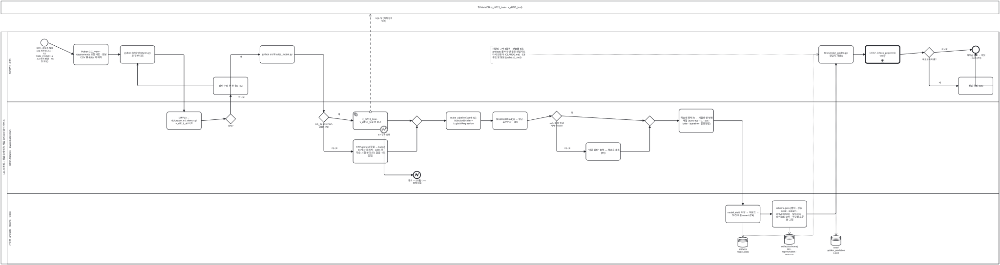

<details><summary>BPMN 2.0 XML 소스 보기 (`diagrams/bpmn_uc11.bpmn` 과 동일 — Camunda Modeler · bpmn.io 에서 열림)</summary>

```xml
<?xml version="1.0" encoding="UTF-8"?>
<bpmn:definitions xmlns:bpmn="http://www.omg.org/spec/BPMN/20100524/MODEL" xmlns:bpmndi="http://www.omg.org/spec/BPMN/20100524/DI" xmlns:dc="http://www.omg.org/spec/DD/20100524/DC" xmlns:di="http://www.omg.org/spec/DD/20100524/DI" id="Definitions_bpmn_uc11" name="UC11 모델 재현·재학습" targetNamespace="https://p4.sumzip.com/bpmn" exporter="bpmn_gen.py" exporterVersion="1.0">
  <bpmn:collaboration id="Collab_bpmn_uc11">
    <bpmn:participant id="Pool_bpmn_uc11" name="LoL 인게임 시점별 승패 예측·핵심 승리요인 분석 서비스" processRef="Process_bpmn_uc11" />
    <bpmn:participant id="BB_maria" name="팀 MariaDB (v_diff13_train · v_diff13_test)" />
    <bpmn:messageFlow id="Msg_bpmn_uc11_0" sourceRef="db" targetRef="BB_maria" name="SQL 뷰 (피처 정의 정본)" />
  </bpmn:collaboration>
  <bpmn:process id="Process_bpmn_uc11" name="UC11 모델 재현·재학습" isExecutable="false">
    <bpmn:laneSet id="LaneSet_bpmn_uc11">
      <bpmn:lane id="Lane_bpmn_uc11_0" name="팀원(분석·개발)">
        <bpmn:flowNodeRef>s</bpmn:flowNodeRef>
        <bpmn:flowNodeRef>env</bpmn:flowNodeRef>
        <bpmn:flowNodeRef>feat</bpmn:flowNodeRef>
        <bpmn:flowNodeRef>fixdef</bpmn:flowNodeRef>
        <bpmn:flowNodeRef>fin</bpmn:flowNodeRef>
        <bpmn:flowNodeRef>golden</bpmn:flowNodeRef>
        <bpmn:flowNodeRef>uc12</bpmn:flowNodeRef>
        <bpmn:flowNodeRef>g_diff</bpmn:flowNodeRef>
        <bpmn:flowNodeRef>why</bpmn:flowNodeRef>
        <bpmn:flowNodeRef>e</bpmn:flowNodeRef>
      </bpmn:lane>
      <bpmn:lane id="Lane_bpmn_uc11_1" name="lolwin.features · lolwin.model.train">
        <bpmn:flowNodeRef>cmp</bpmn:flowNodeRef>
        <bpmn:flowNodeRef>g_eq</bpmn:flowNodeRef>
        <bpmn:flowNodeRef>g_db</bpmn:flowNodeRef>
        <bpmn:flowNodeRef>db</bpmn:flowNodeRef>
        <bpmn:flowNodeRef>b7</bpmn:flowNodeRef>
        <bpmn:flowNodeRef>e7</bpmn:flowNodeRef>
        <bpmn:flowNodeRef>csv</bpmn:flowNodeRef>
        <bpmn:flowNodeRef>g_m0</bpmn:flowNodeRef>
        <bpmn:flowNodeRef>pipe</bpmn:flowNodeRef>
        <bpmn:flowNodeRef>cv</bpmn:flowNodeRef>
        <bpmn:flowNodeRef>g_cv</bpmn:flowNodeRef>
        <bpmn:flowNodeRef>viol</bpmn:flowNodeRef>
        <bpmn:flowNodeRef>g_m1</bpmn:flowNodeRef>
        <bpmn:flowNodeRef>fit</bpmn:flowNodeRef>
      </bpmn:lane>
      <bpmn:lane id="Lane_bpmn_uc11_2" name="산출물 (artifacts · reports · tests)">
        <bpmn:flowNodeRef>save</bpmn:flowNodeRef>
        <bpmn:flowNodeRef>meta</bpmn:flowNodeRef>
      </bpmn:lane>
    </bpmn:laneSet>
    <bpmn:startEvent id="s" name="재현 · 재학습 필요 (A1 재현성 검사 · A3 TIME_POINT=15 · A4 피처 변경 · A6 전 과정)">
      <bpmn:outgoing>Flow_bpmn_uc11_0</bpmn:outgoing>
    </bpmn:startEvent>
    <bpmn:task id="env" name="Python 3.11 venv · requirements 고정 버전 · 원본 CSV 를 data/ 에 배치">
      <bpmn:incoming>Flow_bpmn_uc11_0</bpmn:incoming>
      <bpmn:outgoing>Flow_bpmn_uc11_1</bpmn:outgoing>
    </bpmn:task>
    <bpmn:task id="feat" name="python lolwin/features.py 로 정본 대조">
      <bpmn:incoming>Flow_bpmn_uc11_1</bpmn:incoming>
      <bpmn:incoming>Flow_bpmn_uc11_5</bpmn:incoming>
      <bpmn:outgoing>Flow_bpmn_uc11_2</bpmn:outgoing>
    </bpmn:task>
    <bpmn:task id="cmp" name="DIFF13 ↔ db/create_ml_views.sql v_diff13_all 비교">
      <bpmn:incoming>Flow_bpmn_uc11_2</bpmn:incoming>
      <bpmn:outgoing>Flow_bpmn_uc11_3</bpmn:outgoing>
    </bpmn:task>
    <bpmn:exclusiveGateway id="g_eq" name="일치?">
      <bpmn:incoming>Flow_bpmn_uc11_3</bpmn:incoming>
      <bpmn:outgoing>Flow_bpmn_uc11_4</bpmn:outgoing>
      <bpmn:outgoing>Flow_bpmn_uc11_6</bpmn:outgoing>
    </bpmn:exclusiveGateway>
    <bpmn:task id="fixdef" name="정의 수정 후 재대조 (E2)">
      <bpmn:incoming>Flow_bpmn_uc11_4</bpmn:incoming>
      <bpmn:outgoing>Flow_bpmn_uc11_5</bpmn:outgoing>
    </bpmn:task>
    <bpmn:task id="fin" name="python src/finalize_model.py">
      <bpmn:incoming>Flow_bpmn_uc11_6</bpmn:incoming>
      <bpmn:outgoing>Flow_bpmn_uc11_7</bpmn:outgoing>
    </bpmn:task>
    <bpmn:exclusiveGateway id="g_db" name="DB_PASSWORD 있음? (A2)">
      <bpmn:incoming>Flow_bpmn_uc11_7</bpmn:incoming>
      <bpmn:outgoing>Flow_bpmn_uc11_8</bpmn:outgoing>
      <bpmn:outgoing>Flow_bpmn_uc11_10</bpmn:outgoing>
    </bpmn:exclusiveGateway>
    <bpmn:serviceTask id="db" name="v_diff13_train · v_diff13_test 뷰 읽기">
      <bpmn:incoming>Flow_bpmn_uc11_8</bpmn:incoming>
      <bpmn:outgoing>Flow_bpmn_uc11_11</bpmn:outgoing>
    </bpmn:serviceTask>
    <bpmn:boundaryEvent id="b7" name="E7 접속 실패" attachedToRef="db" cancelActivity="true">
      <bpmn:outgoing>Flow_bpmn_uc11_9</bpmn:outgoing>
      <bpmn:errorEventDefinition id="EvDef_b7" />
    </bpmn:boundaryEvent>
    <bpmn:endEvent id="e7" name="종료 — [추론] CSV 폴백 없음">
      <bpmn:incoming>Flow_bpmn_uc11_9</bpmn:incoming>
      <bpmn:errorEventDefinition id="EvDef_e7" />
    </bpmn:endEvent>
    <bpmn:task id="csv" name="CSV gameId 정렬 → build() 13개 차이 피처 · splits 로 학습·시험 분리 (E1 없음 · E3 겹침)">
      <bpmn:incoming>Flow_bpmn_uc11_10</bpmn:incoming>
      <bpmn:outgoing>Flow_bpmn_uc11_12</bpmn:outgoing>
    </bpmn:task>
    <bpmn:exclusiveGateway id="g_m0">
      <bpmn:incoming>Flow_bpmn_uc11_11</bpmn:incoming>
      <bpmn:incoming>Flow_bpmn_uc11_12</bpmn:incoming>
      <bpmn:outgoing>Flow_bpmn_uc11_13</bpmn:outgoing>
    </bpmn:exclusiveGateway>
    <bpmn:task id="pipe" name="make_pipeline(seed 42): StandardScaler + LogisticRegression">
      <bpmn:incoming>Flow_bpmn_uc11_13</bpmn:incoming>
      <bpmn:outgoing>Flow_bpmn_uc11_14</bpmn:outgoing>
    </bpmn:task>
    <bpmn:task id="cv" name="StratifiedKFold(5) → 평균 · 표준편차 · 격차">
      <bpmn:incoming>Flow_bpmn_uc11_14</bpmn:incoming>
      <bpmn:outgoing>Flow_bpmn_uc11_15</bpmn:outgoing>
    </bpmn:task>
    <bpmn:exclusiveGateway id="g_cv" name="std &lt; 0.02 이고 격차 &lt; 0.03?">
      <bpmn:incoming>Flow_bpmn_uc11_15</bpmn:incoming>
      <bpmn:outgoing>Flow_bpmn_uc11_16</bpmn:outgoing>
      <bpmn:outgoing>Flow_bpmn_uc11_18</bpmn:outgoing>
    </bpmn:exclusiveGateway>
    <bpmn:task id="viol" name="&quot;기준 위반&quot; 출력 — 학습은 계속 (E5)">
      <bpmn:incoming>Flow_bpmn_uc11_16</bpmn:incoming>
      <bpmn:outgoing>Flow_bpmn_uc11_17</bpmn:outgoing>
    </bpmn:task>
    <bpmn:exclusiveGateway id="g_m1">
      <bpmn:incoming>Flow_bpmn_uc11_17</bpmn:incoming>
      <bpmn:incoming>Flow_bpmn_uc11_18</bpmn:incoming>
      <bpmn:outgoing>Flow_bpmn_uc11_19</bpmn:outgoing>
    </bpmn:exclusiveGateway>
    <bpmn:task id="fit" name="학습셋 전체 fit → 시험셋 한 번만 채점 (accuracy · f1 · auc · brier · baseline · 혼동행렬)">
      <bpmn:incoming>Flow_bpmn_uc11_19</bpmn:incoming>
      <bpmn:outgoing>Flow_bpmn_uc11_20</bpmn:outgoing>
    </bpmn:task>
    <bpmn:task id="save" name="model.joblib 저장 → 재로드 → 50건 확률 assert (E4)">
      <bpmn:incoming>Flow_bpmn_uc11_20</bpmn:incoming>
      <bpmn:outgoing>Flow_bpmn_uc11_21</bpmn:outgoing>
      <bpmn:dataOutputAssociation id="DOA_save_ds_model"><bpmn:targetRef>ds_model</bpmn:targetRef></bpmn:dataOutputAssociation>
    </bpmn:task>
    <bpmn:dataStoreReference id="ds_model" name="artifacts/ model.joblib" />
    <bpmn:task id="meta" name="schema.json (범위 · 성능 · seed · sklearn · provenance) · runs.csv · 승리요인 순위 · 구간별 오류 표·그림">
      <bpmn:incoming>Flow_bpmn_uc11_21</bpmn:incoming>
      <bpmn:outgoing>Flow_bpmn_uc11_22</bpmn:outgoing>
      <bpmn:dataOutputAssociation id="DOA_meta_ds_rep"><bpmn:targetRef>ds_rep</bpmn:targetRef></bpmn:dataOutputAssociation>
    </bpmn:task>
    <bpmn:dataStoreReference id="ds_rep" name="artifacts/schema.json · reports/tables · runs.csv" />
    <bpmn:task id="golden" name="tests/make_golden.py 정답지 재생성">
      <bpmn:incoming>Flow_bpmn_uc11_22</bpmn:incoming>
      <bpmn:outgoing>Flow_bpmn_uc11_23</bpmn:outgoing>
      <bpmn:dataOutputAssociation id="DOA_golden_ds_gold"><bpmn:targetRef>ds_gold</bpmn:targetRef></bpmn:dataOutputAssociation>
      <bpmn:dataInputAssociation id="DIA_ds_model_golden"><bpmn:sourceRef>ds_model</bpmn:sourceRef></bpmn:dataInputAssociation>
    </bpmn:task>
    <bpmn:dataStoreReference id="ds_gold" name="tests/ golden_predictions.json" />
    <bpmn:callActivity id="uc12" name="UC12 ./check_project.sh verify">
      <bpmn:incoming>Flow_bpmn_uc11_23</bpmn:incoming>
      <bpmn:outgoing>Flow_bpmn_uc11_24</bpmn:outgoing>
    </bpmn:callActivity>
    <bpmn:exclusiveGateway id="g_diff" name="배포본과 다름?">
      <bpmn:incoming>Flow_bpmn_uc11_24</bpmn:incoming>
      <bpmn:outgoing>Flow_bpmn_uc11_25</bpmn:outgoing>
      <bpmn:outgoing>Flow_bpmn_uc11_27</bpmn:outgoing>
    </bpmn:exclusiveGateway>
    <bpmn:task id="why" name="원인 확인 (E6)">
      <bpmn:incoming>Flow_bpmn_uc11_25</bpmn:incoming>
      <bpmn:outgoing>Flow_bpmn_uc11_26</bpmn:outgoing>
    </bpmn:task>
    <bpmn:endEvent id="e" name="재학습 완료 → 커밋 · push (P3)">
      <bpmn:incoming>Flow_bpmn_uc11_26</bpmn:incoming>
      <bpmn:incoming>Flow_bpmn_uc11_27</bpmn:incoming>
    </bpmn:endEvent>
    <bpmn:textAnnotation id="n_rule"><bpmn:text>재현성 규약 8항목 · 산출물 6종. artifacts 를 바꾸면 골든 정답지도 다시 만든다 (CLAUDE.md) · E8 루트 못 찾음 (paths.cd_root)</bpmn:text></bpmn:textAnnotation>
    <bpmn:sequenceFlow id="Flow_bpmn_uc11_0" sourceRef="s" targetRef="env" />
    <bpmn:sequenceFlow id="Flow_bpmn_uc11_1" sourceRef="env" targetRef="feat" />
    <bpmn:sequenceFlow id="Flow_bpmn_uc11_2" sourceRef="feat" targetRef="cmp" />
    <bpmn:sequenceFlow id="Flow_bpmn_uc11_3" sourceRef="cmp" targetRef="g_eq" />
    <bpmn:sequenceFlow id="Flow_bpmn_uc11_4" sourceRef="g_eq" targetRef="fixdef" name="아니오" />
    <bpmn:sequenceFlow id="Flow_bpmn_uc11_5" sourceRef="fixdef" targetRef="feat" />
    <bpmn:sequenceFlow id="Flow_bpmn_uc11_6" sourceRef="g_eq" targetRef="fin" name="예" />
    <bpmn:sequenceFlow id="Flow_bpmn_uc11_7" sourceRef="fin" targetRef="g_db" />
    <bpmn:sequenceFlow id="Flow_bpmn_uc11_8" sourceRef="g_db" targetRef="db" name="예" />
    <bpmn:sequenceFlow id="Flow_bpmn_uc11_9" sourceRef="b7" targetRef="e7" />
    <bpmn:sequenceFlow id="Flow_bpmn_uc11_10" sourceRef="g_db" targetRef="csv" name="아니오" />
    <bpmn:sequenceFlow id="Flow_bpmn_uc11_11" sourceRef="db" targetRef="g_m0" />
    <bpmn:sequenceFlow id="Flow_bpmn_uc11_12" sourceRef="csv" targetRef="g_m0" />
    <bpmn:sequenceFlow id="Flow_bpmn_uc11_13" sourceRef="g_m0" targetRef="pipe" />
    <bpmn:sequenceFlow id="Flow_bpmn_uc11_14" sourceRef="pipe" targetRef="cv" />
    <bpmn:sequenceFlow id="Flow_bpmn_uc11_15" sourceRef="cv" targetRef="g_cv" />
    <bpmn:sequenceFlow id="Flow_bpmn_uc11_16" sourceRef="g_cv" targetRef="viol" name="아니오" />
    <bpmn:sequenceFlow id="Flow_bpmn_uc11_17" sourceRef="viol" targetRef="g_m1" />
    <bpmn:sequenceFlow id="Flow_bpmn_uc11_18" sourceRef="g_cv" targetRef="g_m1" name="예" />
    <bpmn:sequenceFlow id="Flow_bpmn_uc11_19" sourceRef="g_m1" targetRef="fit" />
    <bpmn:sequenceFlow id="Flow_bpmn_uc11_20" sourceRef="fit" targetRef="save" />
    <bpmn:sequenceFlow id="Flow_bpmn_uc11_21" sourceRef="save" targetRef="meta" />
    <bpmn:sequenceFlow id="Flow_bpmn_uc11_22" sourceRef="meta" targetRef="golden" />
    <bpmn:sequenceFlow id="Flow_bpmn_uc11_23" sourceRef="golden" targetRef="uc12" />
    <bpmn:sequenceFlow id="Flow_bpmn_uc11_24" sourceRef="uc12" targetRef="g_diff" />
    <bpmn:sequenceFlow id="Flow_bpmn_uc11_25" sourceRef="g_diff" targetRef="why" name="예" />
    <bpmn:sequenceFlow id="Flow_bpmn_uc11_26" sourceRef="why" targetRef="e" />
    <bpmn:sequenceFlow id="Flow_bpmn_uc11_27" sourceRef="g_diff" targetRef="e" name="아니오" />
    <bpmn:association id="Assoc_bpmn_uc11_4" sourceRef="n_rule" targetRef="golden" />
  </bpmn:process>
  <bpmndi:BPMNDiagram id="Diagram_bpmn_uc11">
    <bpmndi:BPMNPlane id="Plane_bpmn_uc11" bpmnElement="Collab_bpmn_uc11">
      <bpmndi:BPMNShape id="Pool_bpmn_uc11_di" bpmnElement="Pool_bpmn_uc11" isHorizontal="true"><dc:Bounds x="40" y="174" width="4972" height="1159.5" /></bpmndi:BPMNShape>
      <bpmndi:BPMNShape id="Lane_bpmn_uc11_0_di" bpmnElement="Lane_bpmn_uc11_0" isHorizontal="true"><dc:Bounds x="70" y="174" width="4942" height="350" /></bpmndi:BPMNShape>
      <bpmndi:BPMNShape id="Lane_bpmn_uc11_1_di" bpmnElement="Lane_bpmn_uc11_1" isHorizontal="true"><dc:Bounds x="70" y="524" width="4942" height="458.0" /></bpmndi:BPMNShape>
      <bpmndi:BPMNShape id="Lane_bpmn_uc11_2_di" bpmnElement="Lane_bpmn_uc11_2" isHorizontal="true"><dc:Bounds x="70" y="982.0" width="4942" height="351.5" /></bpmndi:BPMNShape>
      <bpmndi:BPMNShape id="BB_maria_di" bpmnElement="BB_maria" isHorizontal="true"><dc:Bounds x="40" y="20" width="4972" height="64" /></bpmndi:BPMNShape>
      <bpmndi:BPMNShape id="s_di" bpmnElement="s"><dc:Bounds x="238" y="210" width="36" height="36" />
        <bpmndi:BPMNLabel><dc:Bounds x="196" y="250" width="120" height="28" /></bpmndi:BPMNLabel>
      </bpmndi:BPMNShape>
      <bpmndi:BPMNShape id="env_di" bpmnElement="env"><dc:Bounds x="402" y="236" width="172" height="102.5" />
      </bpmndi:BPMNShape>
      <bpmndi:BPMNShape id="feat_di" bpmnElement="feat"><dc:Bounds x="634" y="243" width="172" height="88" />
      </bpmndi:BPMNShape>
      <bpmndi:BPMNShape id="cmp_di" bpmnElement="cmp"><dc:Bounds x="866" y="574" width="172" height="88" />
      </bpmndi:BPMNShape>
      <bpmndi:BPMNShape id="g_eq_di" bpmnElement="g_eq"><dc:Bounds x="1159" y="584" width="50" height="50" />
        <bpmndi:BPMNLabel><dc:Bounds x="1124" y="638" width="120" height="28" /></bpmndi:BPMNLabel>
      </bpmndi:BPMNShape>
      <bpmndi:BPMNShape id="fixdef_di" bpmnElement="fixdef"><dc:Bounds x="1098" y="400" width="172" height="88" />
      </bpmndi:BPMNShape>
      <bpmndi:BPMNShape id="fin_di" bpmnElement="fin"><dc:Bounds x="1330" y="243" width="172" height="88" />
      </bpmndi:BPMNShape>
      <bpmndi:BPMNShape id="g_db_di" bpmnElement="g_db"><dc:Bounds x="1623" y="576" width="50" height="50" />
        <bpmndi:BPMNLabel><dc:Bounds x="1588" y="630" width="120" height="28" /></bpmndi:BPMNLabel>
      </bpmndi:BPMNShape>
      <bpmndi:BPMNShape id="db_di" bpmnElement="db"><dc:Bounds x="1794" y="574" width="172" height="88" />
      </bpmndi:BPMNShape>
      <bpmndi:BPMNShape id="b7_di" bpmnElement="b7"><dc:Bounds x="1930" y="644" width="36" height="36" />
        <bpmndi:BPMNLabel><dc:Bounds x="1906" y="682" width="84" height="28" /></bpmndi:BPMNLabel>
      </bpmndi:BPMNShape>
      <bpmndi:BPMNShape id="e7_di" bpmnElement="e7"><dc:Bounds x="2094" y="871" width="36" height="36" />
        <bpmndi:BPMNLabel><dc:Bounds x="2052" y="911" width="120" height="28" /></bpmndi:BPMNLabel>
      </bpmndi:BPMNShape>
      <bpmndi:BPMNShape id="csv_di" bpmnElement="csv"><dc:Bounds x="1794" y="713" width="172" height="117.0" />
      </bpmndi:BPMNShape>
      <bpmndi:BPMNShape id="g_m0_di" bpmnElement="g_m0"><dc:Bounds x="2087" y="594" width="50" height="50" />
      </bpmndi:BPMNShape>
      <bpmndi:BPMNShape id="pipe_di" bpmnElement="pipe"><dc:Bounds x="2258" y="574" width="172" height="88" />
      </bpmndi:BPMNShape>
      <bpmndi:BPMNShape id="cv_di" bpmnElement="cv"><dc:Bounds x="2490" y="574" width="172" height="88" />
      </bpmndi:BPMNShape>
      <bpmndi:BPMNShape id="g_cv_di" bpmnElement="g_cv"><dc:Bounds x="2783" y="570" width="50" height="50" />
        <bpmndi:BPMNLabel><dc:Bounds x="2748" y="624" width="120" height="28" /></bpmndi:BPMNLabel>
      </bpmndi:BPMNShape>
      <bpmndi:BPMNShape id="viol_di" bpmnElement="viol"><dc:Bounds x="2954" y="728" width="172" height="88" />
      </bpmndi:BPMNShape>
      <bpmndi:BPMNShape id="g_m1_di" bpmnElement="g_m1"><dc:Bounds x="3247" y="594" width="50" height="50" />
      </bpmndi:BPMNShape>
      <bpmndi:BPMNShape id="fit_di" bpmnElement="fit"><dc:Bounds x="3418" y="560" width="172" height="117.0" />
      </bpmndi:BPMNShape>
      <bpmndi:BPMNShape id="save_di" bpmnElement="save"><dc:Bounds x="3650" y="1040" width="172" height="88" />
      </bpmndi:BPMNShape>
      <bpmndi:BPMNShape id="ds_model_di" bpmnElement="ds_model"><dc:Bounds x="3711" y="1200" width="50" height="50" />
        <bpmndi:BPMNLabel><dc:Bounds x="3676" y="1254" width="120" height="28" /></bpmndi:BPMNLabel>
      </bpmndi:BPMNShape>
      <bpmndi:BPMNShape id="meta_di" bpmnElement="meta"><dc:Bounds x="3882" y="1018" width="172" height="131.5" />
      </bpmndi:BPMNShape>
      <bpmndi:BPMNShape id="ds_rep_di" bpmnElement="ds_rep"><dc:Bounds x="3943" y="1186" width="50" height="50" />
        <bpmndi:BPMNLabel><dc:Bounds x="3908" y="1240" width="120" height="28" /></bpmndi:BPMNLabel>
      </bpmndi:BPMNShape>
      <bpmndi:BPMNShape id="golden_di" bpmnElement="golden"><dc:Bounds x="4114" y="243" width="172" height="88" />
      </bpmndi:BPMNShape>
      <bpmndi:BPMNShape id="ds_gold_di" bpmnElement="ds_gold"><dc:Bounds x="4175" y="1192" width="50" height="50" />
        <bpmndi:BPMNLabel><dc:Bounds x="4140" y="1246" width="120" height="28" /></bpmndi:BPMNLabel>
      </bpmndi:BPMNShape>
      <bpmndi:BPMNShape id="uc12_di" bpmnElement="uc12"><dc:Bounds x="4346" y="243" width="172" height="88" />
      </bpmndi:BPMNShape>
      <bpmndi:BPMNShape id="g_diff_di" bpmnElement="g_diff"><dc:Bounds x="4639" y="252" width="50" height="50" />
        <bpmndi:BPMNLabel><dc:Bounds x="4604" y="306" width="120" height="28" /></bpmndi:BPMNLabel>
      </bpmndi:BPMNShape>
      <bpmndi:BPMNShape id="why_di" bpmnElement="why"><dc:Bounds x="4810" y="400" width="172" height="88" />
      </bpmndi:BPMNShape>
      <bpmndi:BPMNShape id="e_di" bpmnElement="e"><dc:Bounds x="4878" y="245" width="36" height="36" />
        <bpmndi:BPMNLabel><dc:Bounds x="4836" y="285" width="120" height="28" /></bpmndi:BPMNLabel>
      </bpmndi:BPMNShape>
      <bpmndi:BPMNShape id="n_rule_di" bpmnElement="n_rule"><dc:Bounds x="2481" y="245" width="190" height="84.5" />
      </bpmndi:BPMNShape>
      <bpmndi:BPMNEdge id="Flow_bpmn_uc11_0_di" bpmnElement="Flow_bpmn_uc11_0">
        <di:waypoint x="274" y="228" />
        <di:waypoint x="402" y="287" />
      </bpmndi:BPMNEdge>
      <bpmndi:BPMNEdge id="Flow_bpmn_uc11_1_di" bpmnElement="Flow_bpmn_uc11_1">
        <di:waypoint x="574" y="287" />
        <di:waypoint x="634" y="287" />
      </bpmndi:BPMNEdge>
      <bpmndi:BPMNEdge id="Flow_bpmn_uc11_2_di" bpmnElement="Flow_bpmn_uc11_2">
        <di:waypoint x="806" y="287" />
        <di:waypoint x="952" y="287" />
        <di:waypoint x="952" y="574" />
      </bpmndi:BPMNEdge>
      <bpmndi:BPMNEdge id="Flow_bpmn_uc11_3_di" bpmnElement="Flow_bpmn_uc11_3">
        <di:waypoint x="1038" y="618" />
        <di:waypoint x="1159" y="608" />
      </bpmndi:BPMNEdge>
      <bpmndi:BPMNEdge id="Flow_bpmn_uc11_4_di" bpmnElement="Flow_bpmn_uc11_4">
        <di:waypoint x="1184" y="584" />
        <di:waypoint x="1184" y="488" />
        <bpmndi:BPMNLabel><dc:Bounds x="1192" y="494" width="90" height="18" /></bpmndi:BPMNLabel>
      </bpmndi:BPMNEdge>
      <bpmndi:BPMNEdge id="Flow_bpmn_uc11_5_di" bpmnElement="Flow_bpmn_uc11_5">
        <di:waypoint x="1098" y="444" />
        <di:waypoint x="720" y="444" />
        <di:waypoint x="720" y="331" />
      </bpmndi:BPMNEdge>
      <bpmndi:BPMNEdge id="Flow_bpmn_uc11_6_di" bpmnElement="Flow_bpmn_uc11_6">
        <di:waypoint x="1184" y="584" />
        <di:waypoint x="1184" y="287" />
        <di:waypoint x="1330" y="287" />
        <bpmndi:BPMNLabel><dc:Bounds x="1192" y="293" width="90" height="18" /></bpmndi:BPMNLabel>
      </bpmndi:BPMNEdge>
      <bpmndi:BPMNEdge id="Flow_bpmn_uc11_7_di" bpmnElement="Flow_bpmn_uc11_7">
        <di:waypoint x="1502" y="287" />
        <di:waypoint x="1648" y="287" />
        <di:waypoint x="1648" y="576" />
      </bpmndi:BPMNEdge>
      <bpmndi:BPMNEdge id="Flow_bpmn_uc11_8_di" bpmnElement="Flow_bpmn_uc11_8">
        <di:waypoint x="1673" y="602" />
        <di:waypoint x="1794" y="618" />
        <bpmndi:BPMNLabel><dc:Bounds x="1679" y="580" width="90" height="18" /></bpmndi:BPMNLabel>
      </bpmndi:BPMNEdge>
      <bpmndi:BPMNEdge id="Flow_bpmn_uc11_9_di" bpmnElement="Flow_bpmn_uc11_9">
        <di:waypoint x="1948" y="680" />
        <di:waypoint x="1948" y="889" />
        <di:waypoint x="2094" y="889" />
      </bpmndi:BPMNEdge>
      <bpmndi:BPMNEdge id="Flow_bpmn_uc11_10_di" bpmnElement="Flow_bpmn_uc11_10">
        <di:waypoint x="1648" y="626" />
        <di:waypoint x="1648" y="772" />
        <di:waypoint x="1794" y="772" />
        <bpmndi:BPMNLabel><dc:Bounds x="1656" y="750" width="90" height="18" /></bpmndi:BPMNLabel>
      </bpmndi:BPMNEdge>
      <bpmndi:BPMNEdge id="Flow_bpmn_uc11_11_di" bpmnElement="Flow_bpmn_uc11_11">
        <di:waypoint x="1966" y="618" />
        <di:waypoint x="2087" y="618" />
      </bpmndi:BPMNEdge>
      <bpmndi:BPMNEdge id="Flow_bpmn_uc11_12_di" bpmnElement="Flow_bpmn_uc11_12">
        <di:waypoint x="1966" y="772" />
        <di:waypoint x="2112" y="772" />
        <di:waypoint x="2112" y="644" />
      </bpmndi:BPMNEdge>
      <bpmndi:BPMNEdge id="Flow_bpmn_uc11_13_di" bpmnElement="Flow_bpmn_uc11_13">
        <di:waypoint x="2137" y="618" />
        <di:waypoint x="2258" y="618" />
      </bpmndi:BPMNEdge>
      <bpmndi:BPMNEdge id="Flow_bpmn_uc11_14_di" bpmnElement="Flow_bpmn_uc11_14">
        <di:waypoint x="2430" y="618" />
        <di:waypoint x="2490" y="618" />
      </bpmndi:BPMNEdge>
      <bpmndi:BPMNEdge id="Flow_bpmn_uc11_15_di" bpmnElement="Flow_bpmn_uc11_15">
        <di:waypoint x="2662" y="618" />
        <di:waypoint x="2783" y="594" />
      </bpmndi:BPMNEdge>
      <bpmndi:BPMNEdge id="Flow_bpmn_uc11_16_di" bpmnElement="Flow_bpmn_uc11_16">
        <di:waypoint x="2808" y="620" />
        <di:waypoint x="2808" y="772" />
        <di:waypoint x="2954" y="772" />
        <bpmndi:BPMNLabel><dc:Bounds x="2816" y="750" width="90" height="18" /></bpmndi:BPMNLabel>
      </bpmndi:BPMNEdge>
      <bpmndi:BPMNEdge id="Flow_bpmn_uc11_17_di" bpmnElement="Flow_bpmn_uc11_17">
        <di:waypoint x="3126" y="772" />
        <di:waypoint x="3272" y="772" />
        <di:waypoint x="3272" y="644" />
      </bpmndi:BPMNEdge>
      <bpmndi:BPMNEdge id="Flow_bpmn_uc11_18_di" bpmnElement="Flow_bpmn_uc11_18">
        <di:waypoint x="2833" y="594" />
        <di:waypoint x="3247" y="618" />
        <bpmndi:BPMNLabel><dc:Bounds x="2839" y="572" width="90" height="18" /></bpmndi:BPMNLabel>
      </bpmndi:BPMNEdge>
      <bpmndi:BPMNEdge id="Flow_bpmn_uc11_19_di" bpmnElement="Flow_bpmn_uc11_19">
        <di:waypoint x="3297" y="618" />
        <di:waypoint x="3418" y="618" />
      </bpmndi:BPMNEdge>
      <bpmndi:BPMNEdge id="Flow_bpmn_uc11_20_di" bpmnElement="Flow_bpmn_uc11_20">
        <di:waypoint x="3590" y="618" />
        <di:waypoint x="3736" y="618" />
        <di:waypoint x="3736" y="1040" />
      </bpmndi:BPMNEdge>
      <bpmndi:BPMNEdge id="Flow_bpmn_uc11_21_di" bpmnElement="Flow_bpmn_uc11_21">
        <di:waypoint x="3822" y="1084" />
        <di:waypoint x="3882" y="1084" />
      </bpmndi:BPMNEdge>
      <bpmndi:BPMNEdge id="Flow_bpmn_uc11_22_di" bpmnElement="Flow_bpmn_uc11_22">
        <di:waypoint x="4054" y="1084" />
        <di:waypoint x="4200" y="1084" />
        <di:waypoint x="4200" y="331" />
      </bpmndi:BPMNEdge>
      <bpmndi:BPMNEdge id="Flow_bpmn_uc11_23_di" bpmnElement="Flow_bpmn_uc11_23">
        <di:waypoint x="4286" y="287" />
        <di:waypoint x="4346" y="287" />
      </bpmndi:BPMNEdge>
      <bpmndi:BPMNEdge id="Flow_bpmn_uc11_24_di" bpmnElement="Flow_bpmn_uc11_24">
        <di:waypoint x="4518" y="287" />
        <di:waypoint x="4639" y="277" />
      </bpmndi:BPMNEdge>
      <bpmndi:BPMNEdge id="Flow_bpmn_uc11_25_di" bpmnElement="Flow_bpmn_uc11_25">
        <di:waypoint x="4664" y="302" />
        <di:waypoint x="4664" y="444" />
        <di:waypoint x="4810" y="444" />
        <bpmndi:BPMNLabel><dc:Bounds x="4672" y="422" width="90" height="18" /></bpmndi:BPMNLabel>
      </bpmndi:BPMNEdge>
      <bpmndi:BPMNEdge id="Flow_bpmn_uc11_26_di" bpmnElement="Flow_bpmn_uc11_26">
        <di:waypoint x="4982" y="444" />
        <di:waypoint x="4896" y="444" />
        <di:waypoint x="4896" y="281" />
      </bpmndi:BPMNEdge>
      <bpmndi:BPMNEdge id="Flow_bpmn_uc11_27_di" bpmnElement="Flow_bpmn_uc11_27">
        <di:waypoint x="4689" y="277" />
        <di:waypoint x="4878" y="263" />
        <bpmndi:BPMNLabel><dc:Bounds x="4695" y="255" width="90" height="18" /></bpmndi:BPMNLabel>
      </bpmndi:BPMNEdge>
      <bpmndi:BPMNEdge id="Msg_bpmn_uc11_0_di" bpmnElement="Msg_bpmn_uc11_0">
        <di:waypoint x="1880" y="574" />
        <di:waypoint x="1880" y="84" />
        <bpmndi:BPMNLabel><dc:Bounds x="1886" y="100" width="120" height="18" /></bpmndi:BPMNLabel>
      </bpmndi:BPMNEdge>
      <bpmndi:BPMNEdge id="DOA_save_ds_model_di" bpmnElement="DOA_save_ds_model">
        <di:waypoint x="3736" y="1128" />
        <di:waypoint x="3736" y="1200" />
      </bpmndi:BPMNEdge>
      <bpmndi:BPMNEdge id="DOA_meta_ds_rep_di" bpmnElement="DOA_meta_ds_rep">
        <di:waypoint x="3968" y="1150" />
        <di:waypoint x="3968" y="1186" />
      </bpmndi:BPMNEdge>
      <bpmndi:BPMNEdge id="DOA_golden_ds_gold_di" bpmnElement="DOA_golden_ds_gold">
        <di:waypoint x="4200" y="331" />
        <di:waypoint x="4200" y="1192" />
      </bpmndi:BPMNEdge>
      <bpmndi:BPMNEdge id="DIA_ds_model_golden_di" bpmnElement="DIA_ds_model_golden">
        <di:waypoint x="3736" y="1200" />
        <di:waypoint x="3736" y="1192" />
        <di:waypoint x="4086" y="1192" />
        <di:waypoint x="4086" y="287" />
        <di:waypoint x="4114" y="287" />
      </bpmndi:BPMNEdge>
      <bpmndi:BPMNEdge id="Assoc_bpmn_uc11_4_di" bpmnElement="Assoc_bpmn_uc11_4">
        <di:waypoint x="2671" y="287" />
        <di:waypoint x="4114" y="287" />
      </bpmndi:BPMNEdge>
    </bpmndi:BPMNPlane>
  </bpmndi:BPMNDiagram>
</bpmn:definitions>
```

</details>

**BPMN 으로 보이는 것.** 팀 MariaDB 는 접힌 풀이고, "DB_PASSWORD 있음?" 게이트웨이의 예 가지에서만 메시지 흐름이 생긴다(A2). 아니오 가지는 CSV 경로다. DB 접속 실패는 오류 경계 이벤트로 종료하며 CSV 폴백이 없다는 것은 `[추론]` 으로 남겼다(E7).
교차검증 기준 위반(E5)은 오류 이벤트가 아니라 "출력 후 계속" 활동이다 — 학습을 멈추지 않기 때문이다. 산출물 레인의 세 저장소(`model.joblib` · `schema.json`·표 · `golden_predictions.json`)가 P3 의 다음 단계(UC12)와 P1 이 읽는 것이다.

### 4.12 UC12 서빙 계약·파리티 검증 — [UC_12](UC_12_서빙계약파리티검증.md)

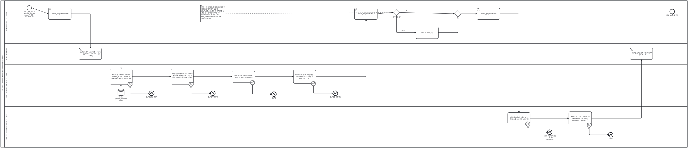

<details><summary>BPMN 2.0 XML 소스 보기 (`diagrams/bpmn_uc12.bpmn` 과 동일 — Camunda Modeler · bpmn.io 에서 열림)</summary>

```xml
<?xml version="1.0" encoding="UTF-8"?>
<bpmn:definitions xmlns:bpmn="http://www.omg.org/spec/BPMN/20100524/MODEL" xmlns:bpmndi="http://www.omg.org/spec/BPMN/20100524/DI" xmlns:dc="http://www.omg.org/spec/DD/20100524/DC" xmlns:di="http://www.omg.org/spec/DD/20100524/DI" id="Definitions_bpmn_uc12" name="UC12 서빙 계약·파리티 검증 (UC13 «include»)" targetNamespace="https://p4.sumzip.com/bpmn" exporter="bpmn_gen.py" exporterVersion="1.0">
  <bpmn:collaboration id="Collab_bpmn_uc12">
    <bpmn:participant id="Pool_bpmn_uc12" name="LoL 인게임 시점별 승패 예측·핵심 승리요인 분석 서비스" processRef="Process_bpmn_uc12" />
  </bpmn:collaboration>
  <bpmn:process id="Process_bpmn_uc12" name="UC12 서빙 계약·파리티 검증 (UC13 «include»)" isExecutable="false">
    <bpmn:laneSet id="LaneSet_bpmn_uc12">
      <bpmn:lane id="Lane_bpmn_uc12_0" name="팀원(분석·개발) · 서비스 담당">
        <bpmn:flowNodeRef>s</bpmn:flowNodeRef>
        <bpmn:flowNodeRef>verify</bpmn:flowNodeRef>
        <bpmn:flowNodeRef>status</bpmn:flowNodeRef>
        <bpmn:flowNodeRef>g_up</bpmn:flowNodeRef>
        <bpmn:flowNodeRef>start</bpmn:flowNodeRef>
        <bpmn:flowNodeRef>g_m0</bpmn:flowNodeRef>
        <bpmn:flowNodeRef>test</bpmn:flowNodeRef>
        <bpmn:flowNodeRef>e</bpmn:flowNodeRef>
      </bpmn:lane>
      <bpmn:lane id="Lane_bpmn_uc12_1" name="check_project.sh">
        <bpmn:flowNodeRef>py</bpmn:flowNodeRef>
        <bpmn:flowNodeRef>sum</bpmn:flowNodeRef>
      </bpmn:lane>
      <bpmn:lane id="Lane_bpmn_uc12_2" name="tests · factcheck (verify — 서버 없이)">
        <bpmn:flowNodeRef>reg</bpmn:flowNodeRef>
        <bpmn:flowNodeRef>b1</bpmn:flowNodeRef>
        <bpmn:flowNodeRef>e1</bpmn:flowNodeRef>
        <bpmn:flowNodeRef>con</bpmn:flowNodeRef>
        <bpmn:flowNodeRef>b2</bpmn:flowNodeRef>
        <bpmn:flowNodeRef>e2</bpmn:flowNodeRef>
        <bpmn:flowNodeRef>etc</bpmn:flowNodeRef>
        <bpmn:flowNodeRef>b3</bpmn:flowNodeRef>
        <bpmn:flowNodeRef>e3</bpmn:flowNodeRef>
        <bpmn:flowNodeRef>fc</bpmn:flowNodeRef>
        <bpmn:flowNodeRef>b4</bpmn:flowNodeRef>
        <bpmn:flowNodeRef>e4</bpmn:flowNodeRef>
      </bpmn:lane>
      <bpmn:lane id="Lane_bpmn_uc12_3" name="서빙 파리티 · 스모크 (test — 서버 필요)">
        <bpmn:flowNodeRef>par</bpmn:flowNodeRef>
        <bpmn:flowNodeRef>b5</bpmn:flowNodeRef>
        <bpmn:flowNodeRef>e5</bpmn:flowNodeRef>
        <bpmn:flowNodeRef>smoke</bpmn:flowNodeRef>
        <bpmn:flowNodeRef>b7</bpmn:flowNodeRef>
        <bpmn:flowNodeRef>e7</bpmn:flowNodeRef>
      </bpmn:lane>
    </bpmn:laneSet>
    <bpmn:startEvent id="s" name="코드 · 문서 수정 후 (A1 개별 검사 · A2 deploy 가 호출 · A3 재학습 후)">
      <bpmn:outgoing>Flow_bpmn_uc12_0</bpmn:outgoing>
    </bpmn:startEvent>
    <bpmn:userTask id="verify" name="./check_project.sh verify">
      <bpmn:incoming>Flow_bpmn_uc12_0</bpmn:incoming>
      <bpmn:outgoing>Flow_bpmn_uc12_1</bpmn:outgoing>
    </bpmn:userTask>
    <bpmn:scriptTask id="py" name="python 선택 (venv311 → venv → python3) · .env 로드 (값 미출력)">
      <bpmn:incoming>Flow_bpmn_uc12_1</bpmn:incoming>
      <bpmn:outgoing>Flow_bpmn_uc12_2</bpmn:outgoing>
    </bpmn:scriptTask>
    <bpmn:task id="reg" name="예측 회귀: schema version · trained_at 확인 · 골든 50건 확률·pred·요인·경고 완전 일치">
      <bpmn:incoming>Flow_bpmn_uc12_2</bpmn:incoming>
      <bpmn:outgoing>Flow_bpmn_uc12_4</bpmn:outgoing>
      <bpmn:dataInputAssociation id="DIA_ds_gold_reg"><bpmn:sourceRef>ds_gold</bpmn:sourceRef></bpmn:dataInputAssociation>
    </bpmn:task>
    <bpmn:boundaryEvent id="b1" name="E1" attachedToRef="reg" cancelActivity="true">
      <bpmn:outgoing>Flow_bpmn_uc12_3</bpmn:outgoing>
      <bpmn:errorEventDefinition id="EvDef_b1" />
    </bpmn:boundaryEvent>
    <bpmn:endEvent id="e1" name="[실패] 골든 불일치">
      <bpmn:incoming>Flow_bpmn_uc12_3</bpmn:incoming>
      <bpmn:errorEventDefinition id="EvDef_e1" />
    </bpmn:endEvent>
    <bpmn:dataStoreReference id="ds_gold" name="tests/ golden_predictions.json" />
    <bpmn:task id="con" name="서빙 계약 9항목: 피처 = DIFF13 · 출력 형 · 임계값 0.5 · 요인 5 · 누락 ValueError · 범위 밖 경고 …">
      <bpmn:incoming>Flow_bpmn_uc12_4</bpmn:incoming>
      <bpmn:outgoing>Flow_bpmn_uc12_6</bpmn:outgoing>
    </bpmn:task>
    <bpmn:boundaryEvent id="b2" name="E2" attachedToRef="con" cancelActivity="true">
      <bpmn:outgoing>Flow_bpmn_uc12_5</bpmn:outgoing>
      <bpmn:errorEventDefinition id="EvDef_b2" />
    </bpmn:boundaryEvent>
    <bpmn:endEvent id="e2" name="[실패] 계약 위반">
      <bpmn:incoming>Flow_bpmn_uc12_5</bpmn:incoming>
      <bpmn:errorEventDefinition id="EvDef_e2" />
    </bpmn:endEvent>
    <bpmn:task id="etc" name="코칭(조언은 승률을 올린다) · 화면 JS 부팅 · 학습 재현성">
      <bpmn:incoming>Flow_bpmn_uc12_6</bpmn:incoming>
      <bpmn:outgoing>Flow_bpmn_uc12_8</bpmn:outgoing>
    </bpmn:task>
    <bpmn:boundaryEvent id="b3" name="E3" attachedToRef="etc" cancelActivity="true">
      <bpmn:outgoing>Flow_bpmn_uc12_7</bpmn:outgoing>
      <bpmn:errorEventDefinition id="EvDef_b3" />
    </bpmn:boundaryEvent>
    <bpmn:endEvent id="e3" name="[실패]">
      <bpmn:incoming>Flow_bpmn_uc12_7</bpmn:incoming>
      <bpmn:errorEventDefinition id="EvDef_e3" />
    </bpmn:endEvent>
    <bpmn:task id="fc" name="factcheck: 링크 · 파일 언급 · 산출물 6종 · 수치 · SQL 뷰 · runs.csv → 0건">
      <bpmn:incoming>Flow_bpmn_uc12_8</bpmn:incoming>
      <bpmn:outgoing>Flow_bpmn_uc12_10</bpmn:outgoing>
    </bpmn:task>
    <bpmn:boundaryEvent id="b4" name="E4" attachedToRef="fc" cancelActivity="true">
      <bpmn:outgoing>Flow_bpmn_uc12_9</bpmn:outgoing>
      <bpmn:errorEventDefinition id="EvDef_b4" />
    </bpmn:boundaryEvent>
    <bpmn:endEvent id="e4" name="[실패] 문서 정합성">
      <bpmn:incoming>Flow_bpmn_uc12_9</bpmn:incoming>
      <bpmn:errorEventDefinition id="EvDef_e4" />
    </bpmn:endEvent>
    <bpmn:userTask id="status" name="./check_project.sh status">
      <bpmn:incoming>Flow_bpmn_uc12_10</bpmn:incoming>
      <bpmn:outgoing>Flow_bpmn_uc12_11</bpmn:outgoing>
    </bpmn:userTask>
    <bpmn:exclusiveGateway id="g_up" name="서버 떠 있음?">
      <bpmn:incoming>Flow_bpmn_uc12_11</bpmn:incoming>
      <bpmn:outgoing>Flow_bpmn_uc12_12</bpmn:outgoing>
      <bpmn:outgoing>Flow_bpmn_uc12_14</bpmn:outgoing>
    </bpmn:exclusiveGateway>
    <bpmn:task id="start" name="start 후 진행 (E6)">
      <bpmn:incoming>Flow_bpmn_uc12_12</bpmn:incoming>
      <bpmn:outgoing>Flow_bpmn_uc12_13</bpmn:outgoing>
    </bpmn:task>
    <bpmn:exclusiveGateway id="g_m0">
      <bpmn:incoming>Flow_bpmn_uc12_13</bpmn:incoming>
      <bpmn:incoming>Flow_bpmn_uc12_14</bpmn:incoming>
      <bpmn:outgoing>Flow_bpmn_uc12_15</bpmn:outgoing>
    </bpmn:exclusiveGateway>
    <bpmn:userTask id="test" name="./check_project.sh test">
      <bpmn:incoming>Flow_bpmn_uc12_15</bpmn:incoming>
      <bpmn:outgoing>Flow_bpmn_uc12_16</bpmn:outgoing>
    </bpmn:userTask>
    <bpmn:task id="par" name="서빙 파리티 6건: 예시 3건 × (직접 호출 = 백엔드 = 프런트)">
      <bpmn:incoming>Flow_bpmn_uc12_16</bpmn:incoming>
      <bpmn:outgoing>Flow_bpmn_uc12_18</bpmn:outgoing>
    </bpmn:task>
    <bpmn:boundaryEvent id="b5" name="E5" attachedToRef="par" cancelActivity="true">
      <bpmn:outgoing>Flow_bpmn_uc12_17</bpmn:outgoing>
      <bpmn:errorEventDefinition id="EvDef_b5" />
    </bpmn:boundaryEvent>
    <bpmn:endEvent id="e5" name="[실패] 화면이 거짓말 → git log -- predict.py">
      <bpmn:incoming>Flow_bpmn_uc12_17</bpmn:incoming>
      <bpmn:errorEventDefinition id="EvDef_e5" />
    </bpmn:endEvent>
    <bpmn:task id="smoke" name="API 스모크 11건 (/healthz · /api/health · schema · examples · predict …)">
      <bpmn:incoming>Flow_bpmn_uc12_18</bpmn:incoming>
      <bpmn:outgoing>Flow_bpmn_uc12_20</bpmn:outgoing>
    </bpmn:task>
    <bpmn:boundaryEvent id="b7" name="E7" attachedToRef="smoke" cancelActivity="true">
      <bpmn:outgoing>Flow_bpmn_uc12_19</bpmn:outgoing>
      <bpmn:errorEventDefinition id="EvDef_b7" />
    </bpmn:boundaryEvent>
    <bpmn:endEvent id="e7" name="[실패]">
      <bpmn:incoming>Flow_bpmn_uc12_19</bpmn:incoming>
      <bpmn:errorEventDefinition id="EvDef_e7" />
    </bpmn:endEvent>
    <bpmn:scriptTask id="sum" name="[통과]/[실패] 집계 · &quot;전부 통과&quot; · 종료코드 0">
      <bpmn:incoming>Flow_bpmn_uc12_20</bpmn:incoming>
      <bpmn:outgoing>Flow_bpmn_uc12_21</bpmn:outgoing>
    </bpmn:scriptTask>
    <bpmn:endEvent id="e" name="커밋 · push 로 진행">
      <bpmn:incoming>Flow_bpmn_uc12_21</bpmn:incoming>
    </bpmn:endEvent>
    <bpmn:textAnnotation id="n_rule"><bpmn:text>관문 여섯이 직렬. 하나라도 실패하면 커밋으로 넘어가지 않는다 (CLAUDE.md). E8 새 규칙은 틀린 값을 넣어 잡히는지 확인 · A4 /api/matches 눈 검증 · A5 test_submission.py · A6 기동 시 자가 파리티</bpmn:text></bpmn:textAnnotation>
    <bpmn:sequenceFlow id="Flow_bpmn_uc12_0" sourceRef="s" targetRef="verify" />
    <bpmn:sequenceFlow id="Flow_bpmn_uc12_1" sourceRef="verify" targetRef="py" />
    <bpmn:sequenceFlow id="Flow_bpmn_uc12_2" sourceRef="py" targetRef="reg" />
    <bpmn:sequenceFlow id="Flow_bpmn_uc12_3" sourceRef="b1" targetRef="e1" />
    <bpmn:sequenceFlow id="Flow_bpmn_uc12_4" sourceRef="reg" targetRef="con" />
    <bpmn:sequenceFlow id="Flow_bpmn_uc12_5" sourceRef="b2" targetRef="e2" />
    <bpmn:sequenceFlow id="Flow_bpmn_uc12_6" sourceRef="con" targetRef="etc" />
    <bpmn:sequenceFlow id="Flow_bpmn_uc12_7" sourceRef="b3" targetRef="e3" />
    <bpmn:sequenceFlow id="Flow_bpmn_uc12_8" sourceRef="etc" targetRef="fc" />
    <bpmn:sequenceFlow id="Flow_bpmn_uc12_9" sourceRef="b4" targetRef="e4" />
    <bpmn:sequenceFlow id="Flow_bpmn_uc12_10" sourceRef="fc" targetRef="status" />
    <bpmn:sequenceFlow id="Flow_bpmn_uc12_11" sourceRef="status" targetRef="g_up" />
    <bpmn:sequenceFlow id="Flow_bpmn_uc12_12" sourceRef="g_up" targetRef="start" name="아니오" />
    <bpmn:sequenceFlow id="Flow_bpmn_uc12_13" sourceRef="start" targetRef="g_m0" />
    <bpmn:sequenceFlow id="Flow_bpmn_uc12_14" sourceRef="g_up" targetRef="g_m0" name="예" />
    <bpmn:sequenceFlow id="Flow_bpmn_uc12_15" sourceRef="g_m0" targetRef="test" />
    <bpmn:sequenceFlow id="Flow_bpmn_uc12_16" sourceRef="test" targetRef="par" />
    <bpmn:sequenceFlow id="Flow_bpmn_uc12_17" sourceRef="b5" targetRef="e5" />
    <bpmn:sequenceFlow id="Flow_bpmn_uc12_18" sourceRef="par" targetRef="smoke" />
    <bpmn:sequenceFlow id="Flow_bpmn_uc12_19" sourceRef="b7" targetRef="e7" />
    <bpmn:sequenceFlow id="Flow_bpmn_uc12_20" sourceRef="smoke" targetRef="sum" />
    <bpmn:sequenceFlow id="Flow_bpmn_uc12_21" sourceRef="sum" targetRef="e" />
    <bpmn:association id="Assoc_bpmn_uc12_1" sourceRef="n_rule" targetRef="g_up" />
  </bpmn:process>
  <bpmndi:BPMNDiagram id="Diagram_bpmn_uc12">
    <bpmndi:BPMNPlane id="Plane_bpmn_uc12" bpmnElement="Collab_bpmn_uc12">
      <bpmndi:BPMNShape id="Pool_bpmn_uc12_di" bpmnElement="Pool_bpmn_uc12" isHorizontal="true"><dc:Bounds x="40" y="20" width="5204" height="1115.5" /></bpmndi:BPMNShape>
      <bpmndi:BPMNShape id="Lane_bpmn_uc12_0_di" bpmnElement="Lane_bpmn_uc12_0" isHorizontal="true"><dc:Bounds x="70" y="20" width="5174" height="324.0" /></bpmndi:BPMNShape>
      <bpmndi:BPMNShape id="Lane_bpmn_uc12_1_di" bpmnElement="Lane_bpmn_uc12_1" isHorizontal="true"><dc:Bounds x="70" y="344.0" width="5174" height="160" /></bpmndi:BPMNShape>
      <bpmndi:BPMNShape id="Lane_bpmn_uc12_2_di" bpmnElement="Lane_bpmn_uc12_2" isHorizontal="true"><dc:Bounds x="70" y="504.0" width="5174" height="323.0" /></bpmndi:BPMNShape>
      <bpmndi:BPMNShape id="Lane_bpmn_uc12_3_di" bpmnElement="Lane_bpmn_uc12_3" isHorizontal="true"><dc:Bounds x="70" y="827.0" width="5174" height="308.5" /></bpmndi:BPMNShape>
      <bpmndi:BPMNShape id="s_di" bpmnElement="s"><dc:Bounds x="238" y="57" width="36" height="36" />
        <bpmndi:BPMNLabel><dc:Bounds x="196" y="97" width="120" height="28" /></bpmndi:BPMNLabel>
      </bpmndi:BPMNShape>
      <bpmndi:BPMNShape id="verify_di" bpmnElement="verify"><dc:Bounds x="402" y="76" width="172" height="88" />
      </bpmndi:BPMNShape>
      <bpmndi:BPMNShape id="py_di" bpmnElement="py"><dc:Bounds x="634" y="380" width="172" height="88" />
      </bpmndi:BPMNShape>
      <bpmndi:BPMNShape id="reg_di" bpmnElement="reg"><dc:Bounds x="866" y="540" width="172" height="117.0" />
      </bpmndi:BPMNShape>
      <bpmndi:BPMNShape id="b1_di" bpmnElement="b1"><dc:Bounds x="1002" y="639" width="36" height="36" />
        <bpmndi:BPMNLabel><dc:Bounds x="978" y="677" width="84" height="28" /></bpmndi:BPMNLabel>
      </bpmndi:BPMNShape>
      <bpmndi:BPMNShape id="e1_di" bpmnElement="e1"><dc:Bounds x="1166" y="707" width="36" height="36" />
        <bpmndi:BPMNLabel><dc:Bounds x="1124" y="747" width="120" height="28" /></bpmndi:BPMNLabel>
      </bpmndi:BPMNShape>
      <bpmndi:BPMNShape id="ds_gold_di" bpmnElement="ds_gold"><dc:Bounds x="927" y="693" width="50" height="50" />
        <bpmndi:BPMNLabel><dc:Bounds x="892" y="747" width="120" height="28" /></bpmndi:BPMNLabel>
      </bpmndi:BPMNShape>
      <bpmndi:BPMNShape id="con_di" bpmnElement="con"><dc:Bounds x="1330" y="540" width="172" height="117.0" />
      </bpmndi:BPMNShape>
      <bpmndi:BPMNShape id="b2_di" bpmnElement="b2"><dc:Bounds x="1466" y="639" width="36" height="36" />
        <bpmndi:BPMNLabel><dc:Bounds x="1442" y="677" width="84" height="28" /></bpmndi:BPMNLabel>
      </bpmndi:BPMNShape>
      <bpmndi:BPMNShape id="e2_di" bpmnElement="e2"><dc:Bounds x="1630" y="707" width="36" height="36" />
        <bpmndi:BPMNLabel><dc:Bounds x="1588" y="747" width="120" height="28" /></bpmndi:BPMNLabel>
      </bpmndi:BPMNShape>
      <bpmndi:BPMNShape id="etc_di" bpmnElement="etc"><dc:Bounds x="1794" y="554" width="172" height="88" />
      </bpmndi:BPMNShape>
      <bpmndi:BPMNShape id="b3_di" bpmnElement="b3"><dc:Bounds x="1930" y="624" width="36" height="36" />
        <bpmndi:BPMNLabel><dc:Bounds x="1906" y="662" width="84" height="28" /></bpmndi:BPMNLabel>
      </bpmndi:BPMNShape>
      <bpmndi:BPMNShape id="e3_di" bpmnElement="e3"><dc:Bounds x="2094" y="714" width="36" height="36" />
        <bpmndi:BPMNLabel><dc:Bounds x="2052" y="754" width="120" height="28" /></bpmndi:BPMNLabel>
      </bpmndi:BPMNShape>
      <bpmndi:BPMNShape id="fc_di" bpmnElement="fc"><dc:Bounds x="2258" y="547" width="172" height="102.5" />
      </bpmndi:BPMNShape>
      <bpmndi:BPMNShape id="b4_di" bpmnElement="b4"><dc:Bounds x="2394" y="632" width="36" height="36" />
        <bpmndi:BPMNLabel><dc:Bounds x="2370" y="670" width="84" height="28" /></bpmndi:BPMNLabel>
      </bpmndi:BPMNShape>
      <bpmndi:BPMNShape id="e4_di" bpmnElement="e4"><dc:Bounds x="2558" y="707" width="36" height="36" />
        <bpmndi:BPMNLabel><dc:Bounds x="2516" y="747" width="120" height="28" /></bpmndi:BPMNLabel>
      </bpmndi:BPMNShape>
      <bpmndi:BPMNShape id="status_di" bpmnElement="status"><dc:Bounds x="2722" y="76" width="172" height="88" />
      </bpmndi:BPMNShape>
      <bpmndi:BPMNShape id="g_up_di" bpmnElement="g_up"><dc:Bounds x="3015" y="85" width="50" height="50" />
        <bpmndi:BPMNLabel><dc:Bounds x="2980" y="139" width="120" height="28" /></bpmndi:BPMNLabel>
      </bpmndi:BPMNShape>
      <bpmndi:BPMNShape id="start_di" bpmnElement="start"><dc:Bounds x="3186" y="220" width="172" height="88" />
      </bpmndi:BPMNShape>
      <bpmndi:BPMNShape id="g_m0_di" bpmnElement="g_m0"><dc:Bounds x="3479" y="95" width="50" height="50" />
      </bpmndi:BPMNShape>
      <bpmndi:BPMNShape id="test_di" bpmnElement="test"><dc:Bounds x="3650" y="76" width="172" height="88" />
      </bpmndi:BPMNShape>
      <bpmndi:BPMNShape id="par_di" bpmnElement="par"><dc:Bounds x="3882" y="870" width="172" height="88" />
      </bpmndi:BPMNShape>
      <bpmndi:BPMNShape id="b5_di" bpmnElement="b5"><dc:Bounds x="4018" y="940" width="36" height="36" />
        <bpmndi:BPMNLabel><dc:Bounds x="3994" y="978" width="84" height="28" /></bpmndi:BPMNLabel>
      </bpmndi:BPMNShape>
      <bpmndi:BPMNShape id="e5_di" bpmnElement="e5"><dc:Bounds x="4182" y="1002" width="36" height="36" />
        <bpmndi:BPMNLabel><dc:Bounds x="4140" y="1042" width="120" height="28" /></bpmndi:BPMNLabel>
      </bpmndi:BPMNShape>
      <bpmndi:BPMNShape id="smoke_di" bpmnElement="smoke"><dc:Bounds x="4346" y="863" width="172" height="102.5" />
      </bpmndi:BPMNShape>
      <bpmndi:BPMNShape id="b7_di" bpmnElement="b7"><dc:Bounds x="4482" y="948" width="36" height="36" />
        <bpmndi:BPMNLabel><dc:Bounds x="4458" y="986" width="84" height="28" /></bpmndi:BPMNLabel>
      </bpmndi:BPMNShape>
      <bpmndi:BPMNShape id="e7_di" bpmnElement="e7"><dc:Bounds x="4646" y="1022" width="36" height="36" />
        <bpmndi:BPMNLabel><dc:Bounds x="4604" y="1062" width="120" height="28" /></bpmndi:BPMNLabel>
      </bpmndi:BPMNShape>
      <bpmndi:BPMNShape id="sum_di" bpmnElement="sum"><dc:Bounds x="4810" y="380" width="172" height="88" />
      </bpmndi:BPMNShape>
      <bpmndi:BPMNShape id="e_di" bpmnElement="e"><dc:Bounds x="5110" y="85" width="36" height="36" />
        <bpmndi:BPMNLabel><dc:Bounds x="5068" y="125" width="120" height="28" /></bpmndi:BPMNLabel>
      </bpmndi:BPMNShape>
      <bpmndi:BPMNShape id="n_rule_di" bpmnElement="n_rule"><dc:Bounds x="1553" y="56" width="190" height="128.0" />
      </bpmndi:BPMNShape>
      <bpmndi:BPMNEdge id="Flow_bpmn_uc12_0_di" bpmnElement="Flow_bpmn_uc12_0">
        <di:waypoint x="274" y="75" />
        <di:waypoint x="402" y="120" />
      </bpmndi:BPMNEdge>
      <bpmndi:BPMNEdge id="Flow_bpmn_uc12_1_di" bpmnElement="Flow_bpmn_uc12_1">
        <di:waypoint x="574" y="120" />
        <di:waypoint x="720" y="120" />
        <di:waypoint x="720" y="380" />
      </bpmndi:BPMNEdge>
      <bpmndi:BPMNEdge id="Flow_bpmn_uc12_2_di" bpmnElement="Flow_bpmn_uc12_2">
        <di:waypoint x="806" y="424" />
        <di:waypoint x="952" y="424" />
        <di:waypoint x="952" y="540" />
      </bpmndi:BPMNEdge>
      <bpmndi:BPMNEdge id="Flow_bpmn_uc12_3_di" bpmnElement="Flow_bpmn_uc12_3">
        <di:waypoint x="1020" y="675" />
        <di:waypoint x="1020" y="725" />
        <di:waypoint x="1166" y="725" />
      </bpmndi:BPMNEdge>
      <bpmndi:BPMNEdge id="Flow_bpmn_uc12_4_di" bpmnElement="Flow_bpmn_uc12_4">
        <di:waypoint x="1038" y="598" />
        <di:waypoint x="1330" y="598" />
      </bpmndi:BPMNEdge>
      <bpmndi:BPMNEdge id="Flow_bpmn_uc12_5_di" bpmnElement="Flow_bpmn_uc12_5">
        <di:waypoint x="1484" y="675" />
        <di:waypoint x="1484" y="725" />
        <di:waypoint x="1630" y="725" />
      </bpmndi:BPMNEdge>
      <bpmndi:BPMNEdge id="Flow_bpmn_uc12_6_di" bpmnElement="Flow_bpmn_uc12_6">
        <di:waypoint x="1502" y="598" />
        <di:waypoint x="1794" y="598" />
      </bpmndi:BPMNEdge>
      <bpmndi:BPMNEdge id="Flow_bpmn_uc12_7_di" bpmnElement="Flow_bpmn_uc12_7">
        <di:waypoint x="1948" y="660" />
        <di:waypoint x="1948" y="732" />
        <di:waypoint x="2094" y="732" />
      </bpmndi:BPMNEdge>
      <bpmndi:BPMNEdge id="Flow_bpmn_uc12_8_di" bpmnElement="Flow_bpmn_uc12_8">
        <di:waypoint x="1966" y="598" />
        <di:waypoint x="2258" y="598" />
      </bpmndi:BPMNEdge>
      <bpmndi:BPMNEdge id="Flow_bpmn_uc12_9_di" bpmnElement="Flow_bpmn_uc12_9">
        <di:waypoint x="2412" y="668" />
        <di:waypoint x="2412" y="725" />
        <di:waypoint x="2558" y="725" />
      </bpmndi:BPMNEdge>
      <bpmndi:BPMNEdge id="Flow_bpmn_uc12_10_di" bpmnElement="Flow_bpmn_uc12_10">
        <di:waypoint x="2430" y="598" />
        <di:waypoint x="2808" y="598" />
        <di:waypoint x="2808" y="164" />
      </bpmndi:BPMNEdge>
      <bpmndi:BPMNEdge id="Flow_bpmn_uc12_11_di" bpmnElement="Flow_bpmn_uc12_11">
        <di:waypoint x="2894" y="120" />
        <di:waypoint x="3015" y="110" />
      </bpmndi:BPMNEdge>
      <bpmndi:BPMNEdge id="Flow_bpmn_uc12_12_di" bpmnElement="Flow_bpmn_uc12_12">
        <di:waypoint x="3040" y="135" />
        <di:waypoint x="3040" y="264" />
        <di:waypoint x="3186" y="264" />
        <bpmndi:BPMNLabel><dc:Bounds x="3048" y="242" width="90" height="18" /></bpmndi:BPMNLabel>
      </bpmndi:BPMNEdge>
      <bpmndi:BPMNEdge id="Flow_bpmn_uc12_13_di" bpmnElement="Flow_bpmn_uc12_13">
        <di:waypoint x="3358" y="264" />
        <di:waypoint x="3504" y="264" />
        <di:waypoint x="3504" y="145" />
      </bpmndi:BPMNEdge>
      <bpmndi:BPMNEdge id="Flow_bpmn_uc12_14_di" bpmnElement="Flow_bpmn_uc12_14">
        <di:waypoint x="3065" y="110" />
        <di:waypoint x="3479" y="120" />
        <bpmndi:BPMNLabel><dc:Bounds x="3071" y="88" width="90" height="18" /></bpmndi:BPMNLabel>
      </bpmndi:BPMNEdge>
      <bpmndi:BPMNEdge id="Flow_bpmn_uc12_15_di" bpmnElement="Flow_bpmn_uc12_15">
        <di:waypoint x="3529" y="120" />
        <di:waypoint x="3650" y="120" />
      </bpmndi:BPMNEdge>
      <bpmndi:BPMNEdge id="Flow_bpmn_uc12_16_di" bpmnElement="Flow_bpmn_uc12_16">
        <di:waypoint x="3822" y="120" />
        <di:waypoint x="3968" y="120" />
        <di:waypoint x="3968" y="870" />
      </bpmndi:BPMNEdge>
      <bpmndi:BPMNEdge id="Flow_bpmn_uc12_17_di" bpmnElement="Flow_bpmn_uc12_17">
        <di:waypoint x="4036" y="976" />
        <di:waypoint x="4036" y="1020" />
        <di:waypoint x="4182" y="1020" />
      </bpmndi:BPMNEdge>
      <bpmndi:BPMNEdge id="Flow_bpmn_uc12_18_di" bpmnElement="Flow_bpmn_uc12_18">
        <di:waypoint x="4054" y="914" />
        <di:waypoint x="4346" y="914" />
      </bpmndi:BPMNEdge>
      <bpmndi:BPMNEdge id="Flow_bpmn_uc12_19_di" bpmnElement="Flow_bpmn_uc12_19">
        <di:waypoint x="4500" y="984" />
        <di:waypoint x="4500" y="1040" />
        <di:waypoint x="4646" y="1040" />
      </bpmndi:BPMNEdge>
      <bpmndi:BPMNEdge id="Flow_bpmn_uc12_20_di" bpmnElement="Flow_bpmn_uc12_20">
        <di:waypoint x="4518" y="914" />
        <di:waypoint x="4896" y="914" />
        <di:waypoint x="4896" y="468" />
      </bpmndi:BPMNEdge>
      <bpmndi:BPMNEdge id="Flow_bpmn_uc12_21_di" bpmnElement="Flow_bpmn_uc12_21">
        <di:waypoint x="4982" y="424" />
        <di:waypoint x="5128" y="424" />
        <di:waypoint x="5128" y="121" />
      </bpmndi:BPMNEdge>
      <bpmndi:BPMNEdge id="DIA_ds_gold_reg_di" bpmnElement="DIA_ds_gold_reg">
        <di:waypoint x="952" y="693" />
        <di:waypoint x="952" y="657" />
      </bpmndi:BPMNEdge>
      <bpmndi:BPMNEdge id="Assoc_bpmn_uc12_1_di" bpmnElement="Assoc_bpmn_uc12_1">
        <di:waypoint x="1743" y="120" />
        <di:waypoint x="3015" y="110" />
      </bpmndi:BPMNEdge>
    </bpmndi:BPMNPlane>
  </bpmndi:BPMNDiagram>
</bpmn:definitions>
```

</details>

**BPMN 으로 보이는 것.** 관문 여섯이 **직렬 활동 + 각각의 오류 경계 이벤트**로 서 있다. 앞의 넷(골든 50건 · 계약 9항목 · 코칭/JS/재현성 · factcheck)은 `verify` 로 서버 없이 돌고, 뒤의 둘(파리티 6건 · 스모크 11건)은 `test` 로 서버가 떠 있어야 돈다 — 그래서 사이에 "서버 떠 있음?" 게이트웨이와 `start` 활동(E6)이 있다. 어느 경계 이벤트로 빠지든 종료이며 커밋으로 가는 정상 종료 이벤트에 닿지 못한다.

### 4.13 UC13 팀 서버 배포·상태 확인 — [UC_13](UC_13_팀서버배포상태확인.md)

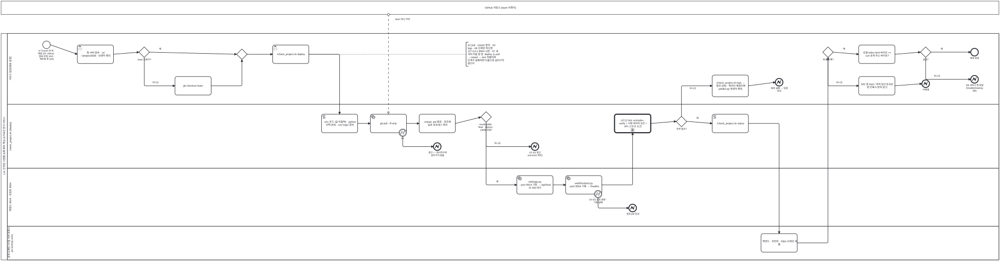

<details><summary>BPMN 2.0 XML 소스 보기 (`diagrams/bpmn_uc13.bpmn` 과 동일 — Camunda Modeler · bpmn.io 에서 열림)</summary>

```xml
<?xml version="1.0" encoding="UTF-8"?>
<bpmn:definitions xmlns:bpmn="http://www.omg.org/spec/BPMN/20100524/MODEL" xmlns:bpmndi="http://www.omg.org/spec/BPMN/20100524/DI" xmlns:dc="http://www.omg.org/spec/DD/20100524/DC" xmlns:di="http://www.omg.org/spec/DD/20100524/DI" id="Definitions_bpmn_uc13" name="UC13 팀 서버 배포·상태 확인" targetNamespace="https://p4.sumzip.com/bpmn" exporter="bpmn_gen.py" exporterVersion="1.0">
  <bpmn:collaboration id="Collab_bpmn_uc13">
    <bpmn:participant id="Pool_bpmn_uc13" name="LoL 인게임 시점별 승패 예측·핵심 승리요인 분석 서비스" processRef="Process_bpmn_uc13" />
    <bpmn:participant id="BB_github" name="GitHub 저장소 (team 브랜치)" />
    <bpmn:messageFlow id="Msg_bpmn_uc13_0" sourceRef="BB_github" targetRef="pull" name="team 최신 커밋" />
  </bpmn:collaboration>
  <bpmn:process id="Process_bpmn_uc13" name="UC13 팀 서버 배포·상태 확인" isExecutable="false">
    <bpmn:laneSet id="LaneSet_bpmn_uc13">
      <bpmn:lane id="Lane_bpmn_uc13_0" name="서비스 담당(배포·운영)">
        <bpmn:flowNodeRef>s</bpmn:flowNodeRef>
        <bpmn:flowNodeRef>ssh</bpmn:flowNodeRef>
        <bpmn:flowNodeRef>g_br</bpmn:flowNodeRef>
        <bpmn:flowNodeRef>co</bpmn:flowNodeRef>
        <bpmn:flowNodeRef>g_m0</bpmn:flowNodeRef>
        <bpmn:flowNodeRef>dep</bpmn:flowNodeRef>
        <bpmn:flowNodeRef>logs</bpmn:flowNodeRef>
        <bpmn:flowNodeRef>e6</bpmn:flowNodeRef>
        <bpmn:flowNodeRef>g_green</bpmn:flowNodeRef>
        <bpmn:flowNodeRef>p502</bpmn:flowNodeRef>
        <bpmn:flowNodeRef>e7</bpmn:flowNodeRef>
        <bpmn:flowNodeRef>bytes</bpmn:flowNodeRef>
        <bpmn:flowNodeRef>g_b</bpmn:flowNodeRef>
        <bpmn:flowNodeRef>e8</bpmn:flowNodeRef>
        <bpmn:flowNodeRef>e</bpmn:flowNodeRef>
      </bpmn:lane>
      <bpmn:lane id="Lane_bpmn_uc13_1" name="check_project.sh (deploy)">
        <bpmn:flowNodeRef>env</bpmn:flowNodeRef>
        <bpmn:flowNodeRef>pull</bpmn:flowNodeRef>
        <bpmn:flowNodeRef>b1</bpmn:flowNodeRef>
        <bpmn:flowNodeRef>e1</bpmn:flowNodeRef>
        <bpmn:flowNodeRef>kill</bpmn:flowNodeRef>
        <bpmn:flowNodeRef>g_dep</bpmn:flowNodeRef>
        <bpmn:flowNodeRef>e23</bpmn:flowNodeRef>
        <bpmn:flowNodeRef>test</bpmn:flowNodeRef>
        <bpmn:flowNodeRef>g_t</bpmn:flowNodeRef>
        <bpmn:flowNodeRef>st</bpmn:flowNodeRef>
      </bpmn:lane>
      <bpmn:lane id="Lane_bpmn_uc13_2" name="백엔드 9524 · 프런트 9504">
        <bpmn:flowNodeRef>be</bpmn:flowNodeRef>
        <bpmn:flowNodeRef>fe</bpmn:flowNodeRef>
        <bpmn:flowNodeRef>b45</bpmn:flowNodeRef>
        <bpmn:flowNodeRef>e45</bpmn:flowNodeRef>
      </bpmn:lane>
      <bpmn:lane id="Lane_bpmn_uc13_3" name="공개 도메인 (수업 서버 프록시 p4.sumzip.com)">
        <bpmn:flowNodeRef>three</bpmn:flowNodeRef>
      </bpmn:lane>
    </bpmn:laneSet>
    <bpmn:startEvent id="s" name="누가 push 한 뒤 · 매일 (A1 status) · 발표 당일 (A4) · 재부팅 후 (A5)">
      <bpmn:outgoing>Flow_bpmn_uc13_0</bpmn:outgoing>
    </bpmn:startEvent>
    <bpmn:userTask id="ssh" name="팀 서버 접속 · cd ~/project2608 · 브랜치 확인">
      <bpmn:incoming>Flow_bpmn_uc13_0</bpmn:incoming>
      <bpmn:outgoing>Flow_bpmn_uc13_1</bpmn:outgoing>
    </bpmn:userTask>
    <bpmn:exclusiveGateway id="g_br" name="team 브랜치?">
      <bpmn:incoming>Flow_bpmn_uc13_1</bpmn:incoming>
      <bpmn:outgoing>Flow_bpmn_uc13_2</bpmn:outgoing>
      <bpmn:outgoing>Flow_bpmn_uc13_4</bpmn:outgoing>
    </bpmn:exclusiveGateway>
    <bpmn:task id="co" name="git checkout team">
      <bpmn:incoming>Flow_bpmn_uc13_2</bpmn:incoming>
      <bpmn:outgoing>Flow_bpmn_uc13_3</bpmn:outgoing>
    </bpmn:task>
    <bpmn:exclusiveGateway id="g_m0">
      <bpmn:incoming>Flow_bpmn_uc13_3</bpmn:incoming>
      <bpmn:incoming>Flow_bpmn_uc13_4</bpmn:incoming>
      <bpmn:outgoing>Flow_bpmn_uc13_5</bpmn:outgoing>
    </bpmn:exclusiveGateway>
    <bpmn:userTask id="dep" name="./check_project.sh deploy">
      <bpmn:incoming>Flow_bpmn_uc13_5</bpmn:incoming>
      <bpmn:outgoing>Flow_bpmn_uc13_6</bpmn:outgoing>
    </bpmn:userTask>
    <bpmn:scriptTask id="env" name=".env 로드 (값 미출력) · python 선택 (E9) · run/ logs/ 준비">
      <bpmn:incoming>Flow_bpmn_uc13_6</bpmn:incoming>
      <bpmn:outgoing>Flow_bpmn_uc13_7</bpmn:outgoing>
    </bpmn:scriptTask>
    <bpmn:serviceTask id="pull" name="git pull --ff-only">
      <bpmn:incoming>Flow_bpmn_uc13_7</bpmn:incoming>
      <bpmn:outgoing>Flow_bpmn_uc13_9</bpmn:outgoing>
    </bpmn:serviceTask>
    <bpmn:boundaryEvent id="b1" name="E1" attachedToRef="pull" cancelActivity="true">
      <bpmn:outgoing>Flow_bpmn_uc13_8</bpmn:outgoing>
      <bpmn:errorEventDefinition id="EvDef_b1" />
    </bpmn:boundaryEvent>
    <bpmn:endEvent id="e1" name="중단 — 재시작으로 넘어가지 않음">
      <bpmn:incoming>Flow_bpmn_uc13_8</bpmn:incoming>
      <bpmn:errorEventDefinition id="EvDef_e1" />
    </bpmn:endEvent>
    <bpmn:task id="kill" name="restart: pid 종료 · 포트에 남은 프로세스 정리">
      <bpmn:incoming>Flow_bpmn_uc13_9</bpmn:incoming>
      <bpmn:outgoing>Flow_bpmn_uc13_10</bpmn:outgoing>
    </bpmn:task>
    <bpmn:exclusiveGateway id="g_dep" name="model.joblib · flask · sklearn · joblib 있음?">
      <bpmn:incoming>Flow_bpmn_uc13_10</bpmn:incoming>
      <bpmn:outgoing>Flow_bpmn_uc13_11</bpmn:outgoing>
      <bpmn:outgoing>Flow_bpmn_uc13_12</bpmn:outgoing>
    </bpmn:exclusiveGateway>
    <bpmn:endEvent id="e23" name="E2·E3 중단 (venv311 확인)">
      <bpmn:incoming>Flow_bpmn_uc13_11</bpmn:incoming>
      <bpmn:errorEventDefinition id="EvDef_e23" />
    </bpmn:endEvent>
    <bpmn:serviceTask id="be" name="web/app.py --port 9524 기동 → /api/health 200 대기">
      <bpmn:incoming>Flow_bpmn_uc13_12</bpmn:incoming>
      <bpmn:outgoing>Flow_bpmn_uc13_13</bpmn:outgoing>
    </bpmn:serviceTask>
    <bpmn:serviceTask id="fe" name="web/frontend.py --port 9504 기동 → /healthz">
      <bpmn:incoming>Flow_bpmn_uc13_13</bpmn:incoming>
      <bpmn:outgoing>Flow_bpmn_uc13_15</bpmn:outgoing>
    </bpmn:serviceTask>
    <bpmn:boundaryEvent id="b45" name="E4·E5 포트 점유 · 기동 실패" attachedToRef="fe" cancelActivity="true">
      <bpmn:outgoing>Flow_bpmn_uc13_14</bpmn:outgoing>
      <bpmn:errorEventDefinition id="EvDef_b45" />
    </bpmn:boundaryEvent>
    <bpmn:endEvent id="e45" name="점유 pid 안내">
      <bpmn:incoming>Flow_bpmn_uc13_14</bpmn:incoming>
      <bpmn:errorEventDefinition id="EvDef_e45" />
    </bpmn:endEvent>
    <bpmn:callActivity id="test" name="UC12 test «include»: verify + 서빙 파리티 6건 + API 스모크 11건">
      <bpmn:incoming>Flow_bpmn_uc13_15</bpmn:incoming>
      <bpmn:outgoing>Flow_bpmn_uc13_16</bpmn:outgoing>
    </bpmn:callActivity>
    <bpmn:exclusiveGateway id="g_t" name="전부 통과?">
      <bpmn:incoming>Flow_bpmn_uc13_16</bpmn:incoming>
      <bpmn:outgoing>Flow_bpmn_uc13_17</bpmn:outgoing>
      <bpmn:outgoing>Flow_bpmn_uc13_19</bpmn:outgoing>
    </bpmn:exclusiveGateway>
    <bpmn:task id="logs" name="./check_project.sh logs → 원인 (E6) · 파리티 깨짐이면 predict.py 변경자 확인">
      <bpmn:incoming>Flow_bpmn_uc13_17</bpmn:incoming>
      <bpmn:outgoing>Flow_bpmn_uc13_18</bpmn:outgoing>
    </bpmn:task>
    <bpmn:endEvent id="e6" name="배포 실패 → 팀원 회귀">
      <bpmn:incoming>Flow_bpmn_uc13_18</bpmn:incoming>
      <bpmn:errorEventDefinition id="EvDef_e6" />
    </bpmn:endEvent>
    <bpmn:scriptTask id="st" name="./check_project.sh status">
      <bpmn:incoming>Flow_bpmn_uc13_19</bpmn:incoming>
      <bpmn:outgoing>Flow_bpmn_uc13_20</bpmn:outgoing>
    </bpmn:scriptTask>
    <bpmn:task id="three" name="백엔드 · 프런트 · https 도메인 세 줄">
      <bpmn:incoming>Flow_bpmn_uc13_20</bpmn:incoming>
      <bpmn:outgoing>Flow_bpmn_uc13_21</bpmn:outgoing>
    </bpmn:task>
    <bpmn:exclusiveGateway id="g_green" name="세 줄 초록?">
      <bpmn:incoming>Flow_bpmn_uc13_21</bpmn:incoming>
      <bpmn:outgoing>Flow_bpmn_uc13_22</bpmn:outgoing>
      <bpmn:outgoing>Flow_bpmn_uc13_24</bpmn:outgoing>
    </bpmn:exclusiveGateway>
    <bpmn:task id="p502" name="502 면 start / 켜져 있는데 502 면 프록시 문의 (E7)">
      <bpmn:incoming>Flow_bpmn_uc13_22</bpmn:incoming>
      <bpmn:outgoing>Flow_bpmn_uc13_23</bpmn:outgoing>
    </bpmn:task>
    <bpmn:endEvent id="e7" name="미해결">
      <bpmn:incoming>Flow_bpmn_uc13_23</bpmn:incoming>
      <bpmn:errorEventDefinition id="EvDef_e7" />
    </bpmn:endEvent>
    <bpmn:task id="bytes" name="로컬 index.html 바이트 == curl 공개 주소 바이트?">
      <bpmn:incoming>Flow_bpmn_uc13_24</bpmn:incoming>
      <bpmn:outgoing>Flow_bpmn_uc13_25</bpmn:outgoing>
    </bpmn:task>
    <bpmn:exclusiveGateway id="g_b" name="같음?">
      <bpmn:incoming>Flow_bpmn_uc13_25</bpmn:incoming>
      <bpmn:outgoing>Flow_bpmn_uc13_26</bpmn:outgoing>
      <bpmn:outgoing>Flow_bpmn_uc13_27</bpmn:outgoing>
    </bpmn:exclusiveGateway>
    <bpmn:endEvent id="e8" name="E8 서버가 옛 파일 (troubleshooting 3번)">
      <bpmn:incoming>Flow_bpmn_uc13_26</bpmn:incoming>
      <bpmn:errorEventDefinition id="EvDef_e8" />
    </bpmn:endEvent>
    <bpmn:endEvent id="e" name="배포 완료">
      <bpmn:incoming>Flow_bpmn_uc13_27</bpmn:incoming>
    </bpmn:endEvent>
    <bpmn:textAnnotation id="n_alt"><bpmn:text>A2 pull · restart 분리 · A3 logs · A6 도메인 죽으면 127.0.0.1:9504 시연 · A7 새 서버 처음 한 번. deploy 는 pull → restart → test 직렬이며 단계가 실패하면 다음으로 넘어가지 않는다</bpmn:text></bpmn:textAnnotation>
    <bpmn:sequenceFlow id="Flow_bpmn_uc13_0" sourceRef="s" targetRef="ssh" />
    <bpmn:sequenceFlow id="Flow_bpmn_uc13_1" sourceRef="ssh" targetRef="g_br" />
    <bpmn:sequenceFlow id="Flow_bpmn_uc13_2" sourceRef="g_br" targetRef="co" name="아니오" />
    <bpmn:sequenceFlow id="Flow_bpmn_uc13_3" sourceRef="co" targetRef="g_m0" />
    <bpmn:sequenceFlow id="Flow_bpmn_uc13_4" sourceRef="g_br" targetRef="g_m0" name="예" />
    <bpmn:sequenceFlow id="Flow_bpmn_uc13_5" sourceRef="g_m0" targetRef="dep" />
    <bpmn:sequenceFlow id="Flow_bpmn_uc13_6" sourceRef="dep" targetRef="env" />
    <bpmn:sequenceFlow id="Flow_bpmn_uc13_7" sourceRef="env" targetRef="pull" />
    <bpmn:sequenceFlow id="Flow_bpmn_uc13_8" sourceRef="b1" targetRef="e1" />
    <bpmn:sequenceFlow id="Flow_bpmn_uc13_9" sourceRef="pull" targetRef="kill" />
    <bpmn:sequenceFlow id="Flow_bpmn_uc13_10" sourceRef="kill" targetRef="g_dep" />
    <bpmn:sequenceFlow id="Flow_bpmn_uc13_11" sourceRef="g_dep" targetRef="e23" name="아니오" />
    <bpmn:sequenceFlow id="Flow_bpmn_uc13_12" sourceRef="g_dep" targetRef="be" name="예" />
    <bpmn:sequenceFlow id="Flow_bpmn_uc13_13" sourceRef="be" targetRef="fe" />
    <bpmn:sequenceFlow id="Flow_bpmn_uc13_14" sourceRef="b45" targetRef="e45" />
    <bpmn:sequenceFlow id="Flow_bpmn_uc13_15" sourceRef="fe" targetRef="test" />
    <bpmn:sequenceFlow id="Flow_bpmn_uc13_16" sourceRef="test" targetRef="g_t" />
    <bpmn:sequenceFlow id="Flow_bpmn_uc13_17" sourceRef="g_t" targetRef="logs" name="아니오" />
    <bpmn:sequenceFlow id="Flow_bpmn_uc13_18" sourceRef="logs" targetRef="e6" />
    <bpmn:sequenceFlow id="Flow_bpmn_uc13_19" sourceRef="g_t" targetRef="st" name="예" />
    <bpmn:sequenceFlow id="Flow_bpmn_uc13_20" sourceRef="st" targetRef="three" />
    <bpmn:sequenceFlow id="Flow_bpmn_uc13_21" sourceRef="three" targetRef="g_green" />
    <bpmn:sequenceFlow id="Flow_bpmn_uc13_22" sourceRef="g_green" targetRef="p502" name="아니오" />
    <bpmn:sequenceFlow id="Flow_bpmn_uc13_23" sourceRef="p502" targetRef="e7" />
    <bpmn:sequenceFlow id="Flow_bpmn_uc13_24" sourceRef="g_green" targetRef="bytes" name="예" />
    <bpmn:sequenceFlow id="Flow_bpmn_uc13_25" sourceRef="bytes" targetRef="g_b" />
    <bpmn:sequenceFlow id="Flow_bpmn_uc13_26" sourceRef="g_b" targetRef="e8" name="아니오" />
    <bpmn:sequenceFlow id="Flow_bpmn_uc13_27" sourceRef="g_b" targetRef="e" name="예" />
    <bpmn:association id="Assoc_bpmn_uc13_0" sourceRef="n_alt" targetRef="dep" />
  </bpmn:process>
  <bpmndi:BPMNDiagram id="Diagram_bpmn_uc13">
    <bpmndi:BPMNPlane id="Plane_bpmn_uc13" bpmnElement="Collab_bpmn_uc13">
      <bpmndi:BPMNShape id="Pool_bpmn_uc13_di" bpmnElement="Pool_bpmn_uc13" isHorizontal="true"><dc:Bounds x="40" y="174" width="4740" height="1076.5" /></bpmndi:BPMNShape>
      <bpmndi:BPMNShape id="Lane_bpmn_uc13_0_di" bpmnElement="Lane_bpmn_uc13_0" isHorizontal="true"><dc:Bounds x="70" y="174" width="4710" height="336.5" /></bpmndi:BPMNShape>
      <bpmndi:BPMNShape id="Lane_bpmn_uc13_1_di" bpmnElement="Lane_bpmn_uc13_1" isHorizontal="true"><dc:Bounds x="70" y="510.5" width="4710" height="304" /></bpmndi:BPMNShape>
      <bpmndi:BPMNShape id="Lane_bpmn_uc13_2_di" bpmnElement="Lane_bpmn_uc13_2" isHorizontal="true"><dc:Bounds x="70" y="814.5" width="4710" height="276" /></bpmndi:BPMNShape>
      <bpmndi:BPMNShape id="Lane_bpmn_uc13_3_di" bpmnElement="Lane_bpmn_uc13_3" isHorizontal="true"><dc:Bounds x="70" y="1090.5" width="4710" height="160" /></bpmndi:BPMNShape>
      <bpmndi:BPMNShape id="BB_github_di" bpmnElement="BB_github" isHorizontal="true"><dc:Bounds x="40" y="20" width="4740" height="64" /></bpmndi:BPMNShape>
      <bpmndi:BPMNShape id="s_di" bpmnElement="s"><dc:Bounds x="238" y="210" width="36" height="36" />
        <bpmndi:BPMNLabel><dc:Bounds x="196" y="250" width="120" height="28" /></bpmndi:BPMNLabel>
      </bpmndi:BPMNShape>
      <bpmndi:BPMNShape id="ssh_di" bpmnElement="ssh"><dc:Bounds x="402" y="229" width="172" height="88" />
      </bpmndi:BPMNShape>
      <bpmndi:BPMNShape id="g_br_di" bpmnElement="g_br"><dc:Bounds x="695" y="238" width="50" height="50" />
        <bpmndi:BPMNLabel><dc:Bounds x="660" y="292" width="120" height="28" /></bpmndi:BPMNLabel>
      </bpmndi:BPMNShape>
      <bpmndi:BPMNShape id="co_di" bpmnElement="co"><dc:Bounds x="866" y="379" width="172" height="88" />
      </bpmndi:BPMNShape>
      <bpmndi:BPMNShape id="g_m0_di" bpmnElement="g_m0"><dc:Bounds x="1159" y="248" width="50" height="50" />
      </bpmndi:BPMNShape>
      <bpmndi:BPMNShape id="dep_di" bpmnElement="dep"><dc:Bounds x="1330" y="229" width="172" height="88" />
      </bpmndi:BPMNShape>
      <bpmndi:BPMNShape id="env_di" bpmnElement="env"><dc:Bounds x="1562" y="558" width="172" height="88" />
      </bpmndi:BPMNShape>
      <bpmndi:BPMNShape id="pull_di" bpmnElement="pull"><dc:Bounds x="1794" y="558" width="172" height="88" />
      </bpmndi:BPMNShape>
      <bpmndi:BPMNShape id="b1_di" bpmnElement="b1"><dc:Bounds x="1930" y="628" width="36" height="36" />
        <bpmndi:BPMNLabel><dc:Bounds x="1906" y="666" width="84" height="28" /></bpmndi:BPMNLabel>
      </bpmndi:BPMNShape>
      <bpmndi:BPMNShape id="e1_di" bpmnElement="e1"><dc:Bounds x="2094" y="694" width="36" height="36" />
        <bpmndi:BPMNLabel><dc:Bounds x="2052" y="734" width="120" height="28" /></bpmndi:BPMNLabel>
      </bpmndi:BPMNShape>
      <bpmndi:BPMNShape id="kill_di" bpmnElement="kill"><dc:Bounds x="2026" y="558" width="172" height="88" />
      </bpmndi:BPMNShape>
      <bpmndi:BPMNShape id="g_dep_di" bpmnElement="g_dep"><dc:Bounds x="2319" y="546" width="50" height="50" />
        <bpmndi:BPMNLabel><dc:Bounds x="2284" y="600" width="120" height="28" /></bpmndi:BPMNLabel>
      </bpmndi:BPMNShape>
      <bpmndi:BPMNShape id="e23_di" bpmnElement="e23"><dc:Bounds x="2558" y="694" width="36" height="36" />
        <bpmndi:BPMNLabel><dc:Bounds x="2516" y="734" width="120" height="28" /></bpmndi:BPMNLabel>
      </bpmndi:BPMNShape>
      <bpmndi:BPMNShape id="be_di" bpmnElement="be"><dc:Bounds x="2490" y="850" width="172" height="88" />
      </bpmndi:BPMNShape>
      <bpmndi:BPMNShape id="fe_di" bpmnElement="fe"><dc:Bounds x="2722" y="850" width="172" height="88" />
      </bpmndi:BPMNShape>
      <bpmndi:BPMNShape id="b45_di" bpmnElement="b45"><dc:Bounds x="2858" y="920" width="36" height="36" />
        <bpmndi:BPMNLabel><dc:Bounds x="2834" y="958" width="84" height="28" /></bpmndi:BPMNLabel>
      </bpmndi:BPMNShape>
      <bpmndi:BPMNShape id="e45_di" bpmnElement="e45"><dc:Bounds x="3022" y="986" width="36" height="36" />
        <bpmndi:BPMNLabel><dc:Bounds x="2980" y="1026" width="120" height="28" /></bpmndi:BPMNLabel>
      </bpmndi:BPMNShape>
      <bpmndi:BPMNShape id="test_di" bpmnElement="test"><dc:Bounds x="2954" y="558" width="172" height="88" />
      </bpmndi:BPMNShape>
      <bpmndi:BPMNShape id="g_t_di" bpmnElement="g_t"><dc:Bounds x="3247" y="568" width="50" height="50" />
        <bpmndi:BPMNLabel><dc:Bounds x="3212" y="622" width="120" height="28" /></bpmndi:BPMNLabel>
      </bpmndi:BPMNShape>
      <bpmndi:BPMNShape id="logs_di" bpmnElement="logs"><dc:Bounds x="3418" y="372" width="172" height="102.5" />
      </bpmndi:BPMNShape>
      <bpmndi:BPMNShape id="e6_di" bpmnElement="e6"><dc:Bounds x="3718" y="388" width="36" height="36" />
        <bpmndi:BPMNLabel><dc:Bounds x="3676" y="428" width="120" height="28" /></bpmndi:BPMNLabel>
      </bpmndi:BPMNShape>
      <bpmndi:BPMNShape id="st_di" bpmnElement="st"><dc:Bounds x="3418" y="558" width="172" height="88" />
      </bpmndi:BPMNShape>
      <bpmndi:BPMNShape id="three_di" bpmnElement="three"><dc:Bounds x="3650" y="1126" width="172" height="88" />
      </bpmndi:BPMNShape>
      <bpmndi:BPMNShape id="g_green_di" bpmnElement="g_green"><dc:Bounds x="3943" y="238" width="50" height="50" />
        <bpmndi:BPMNLabel><dc:Bounds x="3908" y="292" width="120" height="28" /></bpmndi:BPMNLabel>
      </bpmndi:BPMNShape>
      <bpmndi:BPMNShape id="p502_di" bpmnElement="p502"><dc:Bounds x="4114" y="379" width="172" height="88" />
      </bpmndi:BPMNShape>
      <bpmndi:BPMNShape id="e7_di" bpmnElement="e7"><dc:Bounds x="4414" y="395" width="36" height="36" />
        <bpmndi:BPMNLabel><dc:Bounds x="4372" y="435" width="120" height="28" /></bpmndi:BPMNLabel>
      </bpmndi:BPMNShape>
      <bpmndi:BPMNShape id="bytes_di" bpmnElement="bytes"><dc:Bounds x="4114" y="229" width="172" height="88" />
      </bpmndi:BPMNShape>
      <bpmndi:BPMNShape id="g_b_di" bpmnElement="g_b"><dc:Bounds x="4407" y="238" width="50" height="50" />
        <bpmndi:BPMNLabel><dc:Bounds x="4372" y="292" width="120" height="28" /></bpmndi:BPMNLabel>
      </bpmndi:BPMNShape>
      <bpmndi:BPMNShape id="e8_di" bpmnElement="e8"><dc:Bounds x="4646" y="374" width="36" height="36" />
        <bpmndi:BPMNLabel><dc:Bounds x="4604" y="414" width="120" height="28" /></bpmndi:BPMNLabel>
      </bpmndi:BPMNShape>
      <bpmndi:BPMNShape id="e_di" bpmnElement="e"><dc:Bounds x="4646" y="245" width="36" height="36" />
        <bpmndi:BPMNLabel><dc:Bounds x="4604" y="285" width="120" height="28" /></bpmndi:BPMNLabel>
      </bpmndi:BPMNShape>
      <bpmndi:BPMNShape id="n_alt_di" bpmnElement="n_alt"><dc:Bounds x="2249" y="216" width="190" height="113.5" />
      </bpmndi:BPMNShape>
      <bpmndi:BPMNEdge id="Flow_bpmn_uc13_0_di" bpmnElement="Flow_bpmn_uc13_0">
        <di:waypoint x="274" y="228" />
        <di:waypoint x="402" y="273" />
      </bpmndi:BPMNEdge>
      <bpmndi:BPMNEdge id="Flow_bpmn_uc13_1_di" bpmnElement="Flow_bpmn_uc13_1">
        <di:waypoint x="574" y="273" />
        <di:waypoint x="695" y="263" />
      </bpmndi:BPMNEdge>
      <bpmndi:BPMNEdge id="Flow_bpmn_uc13_2_di" bpmnElement="Flow_bpmn_uc13_2">
        <di:waypoint x="720" y="288" />
        <di:waypoint x="720" y="423" />
        <di:waypoint x="866" y="423" />
        <bpmndi:BPMNLabel><dc:Bounds x="728" y="401" width="90" height="18" /></bpmndi:BPMNLabel>
      </bpmndi:BPMNEdge>
      <bpmndi:BPMNEdge id="Flow_bpmn_uc13_3_di" bpmnElement="Flow_bpmn_uc13_3">
        <di:waypoint x="1038" y="423" />
        <di:waypoint x="1184" y="423" />
        <di:waypoint x="1184" y="298" />
      </bpmndi:BPMNEdge>
      <bpmndi:BPMNEdge id="Flow_bpmn_uc13_4_di" bpmnElement="Flow_bpmn_uc13_4">
        <di:waypoint x="745" y="263" />
        <di:waypoint x="1159" y="273" />
        <bpmndi:BPMNLabel><dc:Bounds x="751" y="241" width="90" height="18" /></bpmndi:BPMNLabel>
      </bpmndi:BPMNEdge>
      <bpmndi:BPMNEdge id="Flow_bpmn_uc13_5_di" bpmnElement="Flow_bpmn_uc13_5">
        <di:waypoint x="1209" y="273" />
        <di:waypoint x="1330" y="273" />
      </bpmndi:BPMNEdge>
      <bpmndi:BPMNEdge id="Flow_bpmn_uc13_6_di" bpmnElement="Flow_bpmn_uc13_6">
        <di:waypoint x="1502" y="273" />
        <di:waypoint x="1648" y="273" />
        <di:waypoint x="1648" y="558" />
      </bpmndi:BPMNEdge>
      <bpmndi:BPMNEdge id="Flow_bpmn_uc13_7_di" bpmnElement="Flow_bpmn_uc13_7">
        <di:waypoint x="1734" y="602" />
        <di:waypoint x="1794" y="602" />
      </bpmndi:BPMNEdge>
      <bpmndi:BPMNEdge id="Flow_bpmn_uc13_8_di" bpmnElement="Flow_bpmn_uc13_8">
        <di:waypoint x="1948" y="664" />
        <di:waypoint x="1948" y="712" />
        <di:waypoint x="2094" y="712" />
      </bpmndi:BPMNEdge>
      <bpmndi:BPMNEdge id="Flow_bpmn_uc13_9_di" bpmnElement="Flow_bpmn_uc13_9">
        <di:waypoint x="1966" y="602" />
        <di:waypoint x="2026" y="602" />
      </bpmndi:BPMNEdge>
      <bpmndi:BPMNEdge id="Flow_bpmn_uc13_10_di" bpmnElement="Flow_bpmn_uc13_10">
        <di:waypoint x="2198" y="602" />
        <di:waypoint x="2319" y="572" />
      </bpmndi:BPMNEdge>
      <bpmndi:BPMNEdge id="Flow_bpmn_uc13_11_di" bpmnElement="Flow_bpmn_uc13_11">
        <di:waypoint x="2344" y="596" />
        <di:waypoint x="2344" y="712" />
        <di:waypoint x="2558" y="712" />
        <bpmndi:BPMNLabel><dc:Bounds x="2352" y="690" width="90" height="18" /></bpmndi:BPMNLabel>
      </bpmndi:BPMNEdge>
      <bpmndi:BPMNEdge id="Flow_bpmn_uc13_12_di" bpmnElement="Flow_bpmn_uc13_12">
        <di:waypoint x="2344" y="596" />
        <di:waypoint x="2344" y="894" />
        <di:waypoint x="2490" y="894" />
        <bpmndi:BPMNLabel><dc:Bounds x="2352" y="872" width="90" height="18" /></bpmndi:BPMNLabel>
      </bpmndi:BPMNEdge>
      <bpmndi:BPMNEdge id="Flow_bpmn_uc13_13_di" bpmnElement="Flow_bpmn_uc13_13">
        <di:waypoint x="2662" y="894" />
        <di:waypoint x="2722" y="894" />
      </bpmndi:BPMNEdge>
      <bpmndi:BPMNEdge id="Flow_bpmn_uc13_14_di" bpmnElement="Flow_bpmn_uc13_14">
        <di:waypoint x="2876" y="956" />
        <di:waypoint x="2876" y="1004" />
        <di:waypoint x="3022" y="1004" />
      </bpmndi:BPMNEdge>
      <bpmndi:BPMNEdge id="Flow_bpmn_uc13_15_di" bpmnElement="Flow_bpmn_uc13_15">
        <di:waypoint x="2894" y="894" />
        <di:waypoint x="3040" y="894" />
        <di:waypoint x="3040" y="646" />
      </bpmndi:BPMNEdge>
      <bpmndi:BPMNEdge id="Flow_bpmn_uc13_16_di" bpmnElement="Flow_bpmn_uc13_16">
        <di:waypoint x="3126" y="602" />
        <di:waypoint x="3247" y="592" />
      </bpmndi:BPMNEdge>
      <bpmndi:BPMNEdge id="Flow_bpmn_uc13_17_di" bpmnElement="Flow_bpmn_uc13_17">
        <di:waypoint x="3272" y="568" />
        <di:waypoint x="3272" y="423" />
        <di:waypoint x="3418" y="423" />
        <bpmndi:BPMNLabel><dc:Bounds x="3280" y="429" width="90" height="18" /></bpmndi:BPMNLabel>
      </bpmndi:BPMNEdge>
      <bpmndi:BPMNEdge id="Flow_bpmn_uc13_18_di" bpmnElement="Flow_bpmn_uc13_18">
        <di:waypoint x="3590" y="423" />
        <di:waypoint x="3718" y="406" />
      </bpmndi:BPMNEdge>
      <bpmndi:BPMNEdge id="Flow_bpmn_uc13_19_di" bpmnElement="Flow_bpmn_uc13_19">
        <di:waypoint x="3297" y="592" />
        <di:waypoint x="3418" y="602" />
        <bpmndi:BPMNLabel><dc:Bounds x="3303" y="570" width="90" height="18" /></bpmndi:BPMNLabel>
      </bpmndi:BPMNEdge>
      <bpmndi:BPMNEdge id="Flow_bpmn_uc13_20_di" bpmnElement="Flow_bpmn_uc13_20">
        <di:waypoint x="3590" y="602" />
        <di:waypoint x="3736" y="602" />
        <di:waypoint x="3736" y="1126" />
      </bpmndi:BPMNEdge>
      <bpmndi:BPMNEdge id="Flow_bpmn_uc13_21_di" bpmnElement="Flow_bpmn_uc13_21">
        <di:waypoint x="3822" y="1170" />
        <di:waypoint x="3968" y="1170" />
        <di:waypoint x="3968" y="288" />
      </bpmndi:BPMNEdge>
      <bpmndi:BPMNEdge id="Flow_bpmn_uc13_22_di" bpmnElement="Flow_bpmn_uc13_22">
        <di:waypoint x="3968" y="288" />
        <di:waypoint x="3968" y="423" />
        <di:waypoint x="4114" y="423" />
        <bpmndi:BPMNLabel><dc:Bounds x="3976" y="401" width="90" height="18" /></bpmndi:BPMNLabel>
      </bpmndi:BPMNEdge>
      <bpmndi:BPMNEdge id="Flow_bpmn_uc13_23_di" bpmnElement="Flow_bpmn_uc13_23">
        <di:waypoint x="4286" y="423" />
        <di:waypoint x="4414" y="413" />
      </bpmndi:BPMNEdge>
      <bpmndi:BPMNEdge id="Flow_bpmn_uc13_24_di" bpmnElement="Flow_bpmn_uc13_24">
        <di:waypoint x="3993" y="263" />
        <di:waypoint x="4114" y="273" />
        <bpmndi:BPMNLabel><dc:Bounds x="3999" y="241" width="90" height="18" /></bpmndi:BPMNLabel>
      </bpmndi:BPMNEdge>
      <bpmndi:BPMNEdge id="Flow_bpmn_uc13_25_di" bpmnElement="Flow_bpmn_uc13_25">
        <di:waypoint x="4286" y="273" />
        <di:waypoint x="4407" y="263" />
      </bpmndi:BPMNEdge>
      <bpmndi:BPMNEdge id="Flow_bpmn_uc13_26_di" bpmnElement="Flow_bpmn_uc13_26">
        <di:waypoint x="4432" y="288" />
        <di:waypoint x="4432" y="392" />
        <di:waypoint x="4646" y="392" />
        <bpmndi:BPMNLabel><dc:Bounds x="4440" y="370" width="90" height="18" /></bpmndi:BPMNLabel>
      </bpmndi:BPMNEdge>
      <bpmndi:BPMNEdge id="Flow_bpmn_uc13_27_di" bpmnElement="Flow_bpmn_uc13_27">
        <di:waypoint x="4457" y="263" />
        <di:waypoint x="4646" y="263" />
        <bpmndi:BPMNLabel><dc:Bounds x="4463" y="241" width="90" height="18" /></bpmndi:BPMNLabel>
      </bpmndi:BPMNEdge>
      <bpmndi:BPMNEdge id="Msg_bpmn_uc13_0_di" bpmnElement="Msg_bpmn_uc13_0">
        <di:waypoint x="1880" y="84" />
        <di:waypoint x="1880" y="558" />
        <bpmndi:BPMNLabel><dc:Bounds x="1886" y="100" width="120" height="18" /></bpmndi:BPMNLabel>
      </bpmndi:BPMNEdge>
      <bpmndi:BPMNEdge id="Assoc_bpmn_uc13_0_di" bpmnElement="Assoc_bpmn_uc13_0">
        <di:waypoint x="2249" y="273" />
        <di:waypoint x="1502" y="273" />
      </bpmndi:BPMNEdge>
    </bpmndi:BPMNPlane>
  </bpmndi:BPMNDiagram>
</bpmn:definitions>
```

</details>

**BPMN 으로 보이는 것.** `deploy` 는 pull → restart → test 의 직렬이고, 각 단계의 실패가 오류 경계 이벤트 또는 배타 게이트웨이의 아니오 가지로 **다음 단계로 넘어가지 않는다**(E1~E6). GitHub 풀에서 오는 메시지 흐름은 `git pull --ff-only` 한 곳이다. UC12 test 는 호출 활동(«include»)이다.
배포 확인은 눈이 아니라 두 게이트웨이다 — status 세 줄 초록(E7) 과 `index.html` 바이트 비교(E8).

### 4.14 UC14 Riot API 키 갱신·검증 — [UC_14](UC_14_RiotAPI키갱신검증.md)

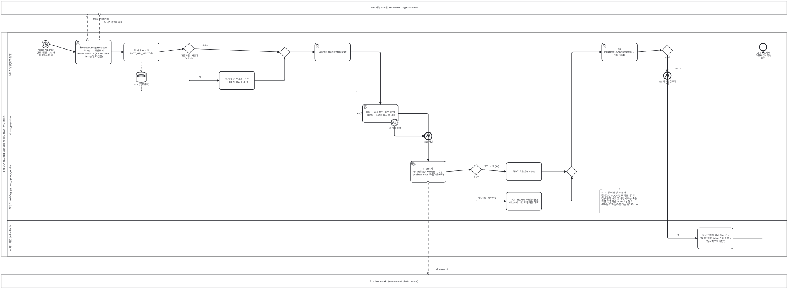

<details><summary>BPMN 2.0 XML 소스 보기 (`diagrams/bpmn_uc14.bpmn` 과 동일 — Camunda Modeler · bpmn.io 에서 열림)</summary>

```xml
<?xml version="1.0" encoding="UTF-8"?>
<bpmn:definitions xmlns:bpmn="http://www.omg.org/spec/BPMN/20100524/MODEL" xmlns:bpmndi="http://www.omg.org/spec/BPMN/20100524/DI" xmlns:dc="http://www.omg.org/spec/DD/20100524/DC" xmlns:di="http://www.omg.org/spec/DD/20100524/DI" id="Definitions_bpmn_uc14" name="UC14 Riot API 키 갱신·검증" targetNamespace="https://p4.sumzip.com/bpmn" exporter="bpmn_gen.py" exporterVersion="1.0">
  <bpmn:collaboration id="Collab_bpmn_uc14">
    <bpmn:participant id="Pool_bpmn_uc14" name="LoL 인게임 시점별 승패 예측·핵심 승리요인 분석 서비스" processRef="Process_bpmn_uc14" />
    <bpmn:participant id="BB_portal" name="Riot 개발자 포털 (developer.riotgames.com)" />
    <bpmn:participant id="BB_riot" name="Riot Games API (lol-status-v4 platform-data)" />
    <bpmn:messageFlow id="Msg_bpmn_uc14_0" sourceRef="regen" targetRef="BB_portal" name="REGENERATE" />
    <bpmn:messageFlow id="Msg_bpmn_uc14_1" sourceRef="BB_portal" targetRef="regen" name="24시간 유효한 새 키" />
    <bpmn:messageFlow id="Msg_bpmn_uc14_2" sourceRef="kw" targetRef="BB_riot" name="lol-status-v4" />
  </bpmn:collaboration>
  <bpmn:process id="Process_bpmn_uc14" name="UC14 Riot API 키 갱신·검증" isExecutable="false">
    <bpmn:laneSet id="LaneSet_bpmn_uc14">
      <bpmn:lane id="Lane_bpmn_uc14_0" name="서비스 담당(배포·운영)">
        <bpmn:flowNodeRef>s</bpmn:flowNodeRef>
        <bpmn:flowNodeRef>regen</bpmn:flowNodeRef>
        <bpmn:flowNodeRef>env</bpmn:flowNodeRef>
        <bpmn:flowNodeRef>g_leak</bpmn:flowNodeRef>
        <bpmn:flowNodeRef>revoke</bpmn:flowNodeRef>
        <bpmn:flowNodeRef>g_m0</bpmn:flowNodeRef>
        <bpmn:flowNodeRef>restart</bpmn:flowNodeRef>
        <bpmn:flowNodeRef>curl</bpmn:flowNodeRef>
        <bpmn:flowNodeRef>g_ok</bpmn:flowNodeRef>
        <bpmn:flowNodeRef>e3</bpmn:flowNodeRef>
        <bpmn:flowNodeRef>e</bpmn:flowNodeRef>
      </bpmn:lane>
      <bpmn:lane id="Lane_bpmn_uc14_1" name="check_project.sh">
        <bpmn:flowNodeRef>load</bpmn:flowNodeRef>
        <bpmn:flowNodeRef>b4</bpmn:flowNodeRef>
        <bpmn:flowNodeRef>e4</bpmn:flowNodeRef>
      </bpmn:lane>
      <bpmn:lane id="Lane_bpmn_uc14_2" name="백엔드 (web/app.py · riot_api.key_works)">
        <bpmn:flowNodeRef>kw</bpmn:flowNodeRef>
        <bpmn:flowNodeRef>g_resp</bpmn:flowNodeRef>
        <bpmn:flowNodeRef>t</bpmn:flowNodeRef>
        <bpmn:flowNodeRef>f</bpmn:flowNodeRef>
        <bpmn:flowNodeRef>g_m1</bpmn:flowNodeRef>
      </bpmn:lane>
      <bpmn:lane id="Lane_bpmn_uc14_3" name="서비스 화면 (index.html)">
        <bpmn:flowNodeRef>on</bpmn:flowNodeRef>
      </bpmn:lane>
    </bpmn:laneSet>
    <bpmn:startEvent id="s" name="개발용 키 24시간 만료 (매일) · A3 새 서버 처음 한 번">
      <bpmn:outgoing>Flow_bpmn_uc14_0</bpmn:outgoing>
      <bpmn:timerEventDefinition id="EvDef_s" />
    </bpmn:startEvent>
    <bpmn:userTask id="regen" name="developer.riotgames.com 로그인 → 개발용 키 REGENERATE (A1 Personal Key 는 별도 신청)">
      <bpmn:incoming>Flow_bpmn_uc14_0</bpmn:incoming>
      <bpmn:outgoing>Flow_bpmn_uc14_1</bpmn:outgoing>
    </bpmn:userTask>
    <bpmn:task id="env" name="팀 서버 .env 에 RIOT_API_KEY 기록">
      <bpmn:incoming>Flow_bpmn_uc14_1</bpmn:incoming>
      <bpmn:outgoing>Flow_bpmn_uc14_2</bpmn:outgoing>
      <bpmn:dataOutputAssociation id="DOA_env_ds_env"><bpmn:targetRef>ds_env</bpmn:targetRef></bpmn:dataOutputAssociation>
    </bpmn:task>
    <bpmn:dataStoreReference id="ds_env" name=".env (커밋 금지)" />
    <bpmn:exclusiveGateway id="g_leak" name="다른 파일 · 커밋에 넣었나?">
      <bpmn:incoming>Flow_bpmn_uc14_2</bpmn:incoming>
      <bpmn:outgoing>Flow_bpmn_uc14_3</bpmn:outgoing>
      <bpmn:outgoing>Flow_bpmn_uc14_5</bpmn:outgoing>
    </bpmn:exclusiveGateway>
    <bpmn:task id="revoke" name="제거 후 키 무효화 [추론] REGENERATE (E5)">
      <bpmn:incoming>Flow_bpmn_uc14_3</bpmn:incoming>
      <bpmn:outgoing>Flow_bpmn_uc14_4</bpmn:outgoing>
    </bpmn:task>
    <bpmn:exclusiveGateway id="g_m0">
      <bpmn:incoming>Flow_bpmn_uc14_4</bpmn:incoming>
      <bpmn:incoming>Flow_bpmn_uc14_5</bpmn:incoming>
      <bpmn:outgoing>Flow_bpmn_uc14_6</bpmn:outgoing>
    </bpmn:exclusiveGateway>
    <bpmn:userTask id="restart" name="./check_project.sh restart">
      <bpmn:incoming>Flow_bpmn_uc14_6</bpmn:incoming>
      <bpmn:outgoing>Flow_bpmn_uc14_7</bpmn:outgoing>
    </bpmn:userTask>
    <bpmn:scriptTask id="load" name=".env → 환경변수 (값 미출력) · 백엔드 · 프런트 중지 후 기동">
      <bpmn:incoming>Flow_bpmn_uc14_7</bpmn:incoming>
      <bpmn:outgoing>Flow_bpmn_uc14_9</bpmn:outgoing>
      <bpmn:dataInputAssociation id="DIA_ds_env_load"><bpmn:sourceRef>ds_env</bpmn:sourceRef></bpmn:dataInputAssociation>
    </bpmn:scriptTask>
    <bpmn:boundaryEvent id="b4" name="E4 기동 실패" attachedToRef="load" cancelActivity="true">
      <bpmn:outgoing>Flow_bpmn_uc14_8</bpmn:outgoing>
      <bpmn:errorEventDefinition id="EvDef_b4" />
    </bpmn:boundaryEvent>
    <bpmn:endEvent id="e4" name="logs 확인">
      <bpmn:incoming>Flow_bpmn_uc14_8</bpmn:incoming>
      <bpmn:errorEventDefinition id="EvDef_e4" />
    </bpmn:endEvent>
    <bpmn:serviceTask id="kw" name="import 시 riot_api.key_works() → GET platform-data (타임아웃 6초)">
      <bpmn:incoming>Flow_bpmn_uc14_9</bpmn:incoming>
      <bpmn:outgoing>Flow_bpmn_uc14_10</bpmn:outgoing>
    </bpmn:serviceTask>
    <bpmn:exclusiveGateway id="g_resp" name="응답?">
      <bpmn:incoming>Flow_bpmn_uc14_10</bpmn:incoming>
      <bpmn:outgoing>Flow_bpmn_uc14_11</bpmn:outgoing>
      <bpmn:outgoing>Flow_bpmn_uc14_12</bpmn:outgoing>
    </bpmn:exclusiveGateway>
    <bpmn:task id="t" name="RIOT_READY = true">
      <bpmn:incoming>Flow_bpmn_uc14_11</bpmn:incoming>
      <bpmn:outgoing>Flow_bpmn_uc14_13</bpmn:outgoing>
    </bpmn:task>
    <bpmn:task id="f" name="RIOT_READY = false (E1 401/403 · E2 타임아웃·예외)">
      <bpmn:incoming>Flow_bpmn_uc14_12</bpmn:incoming>
      <bpmn:outgoing>Flow_bpmn_uc14_14</bpmn:outgoing>
    </bpmn:task>
    <bpmn:exclusiveGateway id="g_m1">
      <bpmn:incoming>Flow_bpmn_uc14_13</bpmn:incoming>
      <bpmn:incoming>Flow_bpmn_uc14_14</bpmn:incoming>
      <bpmn:outgoing>Flow_bpmn_uc14_15</bpmn:outgoing>
    </bpmn:exclusiveGateway>
    <bpmn:userTask id="curl" name="curl localhost:9524/api/health → riot_ready">
      <bpmn:incoming>Flow_bpmn_uc14_15</bpmn:incoming>
      <bpmn:outgoing>Flow_bpmn_uc14_16</bpmn:outgoing>
    </bpmn:userTask>
    <bpmn:exclusiveGateway id="g_ok" name="true?">
      <bpmn:incoming>Flow_bpmn_uc14_16</bpmn:incoming>
      <bpmn:outgoing>Flow_bpmn_uc14_17</bpmn:outgoing>
      <bpmn:outgoing>Flow_bpmn_uc14_18</bpmn:outgoing>
    </bpmn:exclusiveGateway>
    <bpmn:endEvent id="e3" name="E3 키 재발급부터 반복">
      <bpmn:incoming>Flow_bpmn_uc14_17</bpmn:incoming>
      <bpmn:errorEventDefinition id="EvDef_e3" />
    </bpmn:endEvent>
    <bpmn:task id="on" name="검색 입력에 예시 Riot ID · &quot;분석&quot; 활성 (false 면 비활성 + &quot;일시적으로 중단&quot;)">
      <bpmn:incoming>Flow_bpmn_uc14_18</bpmn:incoming>
      <bpmn:outgoing>Flow_bpmn_uc14_19</bpmn:outgoing>
    </bpmn:task>
    <bpmn:endEvent id="e" name="공개 주소에서 소환사 검색 열림 확인">
      <bpmn:incoming>Flow_bpmn_uc14_19</bpmn:incoming>
    </bpmn:endEvent>
    <bpmn:textAnnotation id="n_alt"><bpmn:text>A2 키 없이 운영: 소환사 검색(UC3·UC4)만 꺼지고 나머지 전부 동작 · E6 옛 버전 서버는 죽은 키를 못 걸러냄 → deploy 필요. 429 는 키가 살아 있다는 뜻이라 true</bpmn:text></bpmn:textAnnotation>
    <bpmn:sequenceFlow id="Flow_bpmn_uc14_0" sourceRef="s" targetRef="regen" />
    <bpmn:sequenceFlow id="Flow_bpmn_uc14_1" sourceRef="regen" targetRef="env" />
    <bpmn:sequenceFlow id="Flow_bpmn_uc14_2" sourceRef="env" targetRef="g_leak" />
    <bpmn:sequenceFlow id="Flow_bpmn_uc14_3" sourceRef="g_leak" targetRef="revoke" name="예" />
    <bpmn:sequenceFlow id="Flow_bpmn_uc14_4" sourceRef="revoke" targetRef="g_m0" />
    <bpmn:sequenceFlow id="Flow_bpmn_uc14_5" sourceRef="g_leak" targetRef="g_m0" name="아니오" />
    <bpmn:sequenceFlow id="Flow_bpmn_uc14_6" sourceRef="g_m0" targetRef="restart" />
    <bpmn:sequenceFlow id="Flow_bpmn_uc14_7" sourceRef="restart" targetRef="load" />
    <bpmn:sequenceFlow id="Flow_bpmn_uc14_8" sourceRef="b4" targetRef="e4" />
    <bpmn:sequenceFlow id="Flow_bpmn_uc14_9" sourceRef="load" targetRef="kw" />
    <bpmn:sequenceFlow id="Flow_bpmn_uc14_10" sourceRef="kw" targetRef="g_resp" />
    <bpmn:sequenceFlow id="Flow_bpmn_uc14_11" sourceRef="g_resp" targetRef="t" name="200 · 429 (A4)" />
    <bpmn:sequenceFlow id="Flow_bpmn_uc14_12" sourceRef="g_resp" targetRef="f" name="401/403 · 타임아웃" />
    <bpmn:sequenceFlow id="Flow_bpmn_uc14_13" sourceRef="t" targetRef="g_m1" />
    <bpmn:sequenceFlow id="Flow_bpmn_uc14_14" sourceRef="f" targetRef="g_m1" />
    <bpmn:sequenceFlow id="Flow_bpmn_uc14_15" sourceRef="g_m1" targetRef="curl" />
    <bpmn:sequenceFlow id="Flow_bpmn_uc14_16" sourceRef="curl" targetRef="g_ok" />
    <bpmn:sequenceFlow id="Flow_bpmn_uc14_17" sourceRef="g_ok" targetRef="e3" name="아니오" />
    <bpmn:sequenceFlow id="Flow_bpmn_uc14_18" sourceRef="g_ok" targetRef="on" name="예" />
    <bpmn:sequenceFlow id="Flow_bpmn_uc14_19" sourceRef="on" targetRef="e" />
    <bpmn:association id="Assoc_bpmn_uc14_2" sourceRef="n_alt" targetRef="g_resp" />
  </bpmn:process>
  <bpmndi:BPMNDiagram id="Diagram_bpmn_uc14">
    <bpmndi:BPMNPlane id="Plane_bpmn_uc14" bpmnElement="Collab_bpmn_uc14">
      <bpmndi:BPMNShape id="Pool_bpmn_uc14_di" bpmnElement="Pool_bpmn_uc14" isHorizontal="true"><dc:Bounds x="40" y="174" width="3812" height="1087.5" /></bpmndi:BPMNShape>
      <bpmndi:BPMNShape id="Lane_bpmn_uc14_0_di" bpmnElement="Lane_bpmn_uc14_0" isHorizontal="true"><dc:Bounds x="70" y="174" width="3782" height="313.0" /></bpmndi:BPMNShape>
      <bpmndi:BPMNShape id="Lane_bpmn_uc14_1_di" bpmnElement="Lane_bpmn_uc14_1" isHorizontal="true"><dc:Bounds x="70" y="487.0" width="3782" height="276" /></bpmndi:BPMNShape>
      <bpmndi:BPMNShape id="Lane_bpmn_uc14_2_di" bpmnElement="Lane_bpmn_uc14_2" isHorizontal="true"><dc:Bounds x="70" y="763.0" width="3782" height="324.0" /></bpmndi:BPMNShape>
      <bpmndi:BPMNShape id="Lane_bpmn_uc14_3_di" bpmnElement="Lane_bpmn_uc14_3" isHorizontal="true"><dc:Bounds x="70" y="1087.0" width="3782" height="174.5" /></bpmndi:BPMNShape>
      <bpmndi:BPMNShape id="BB_portal_di" bpmnElement="BB_portal" isHorizontal="true"><dc:Bounds x="40" y="20" width="3812" height="64" /></bpmndi:BPMNShape>
      <bpmndi:BPMNShape id="BB_riot_di" bpmnElement="BB_riot" isHorizontal="true"><dc:Bounds x="40" y="1351.5" width="3812" height="64" /></bpmndi:BPMNShape>
      <bpmndi:BPMNShape id="s_di" bpmnElement="s"><dc:Bounds x="238" y="212" width="36" height="36" />
        <bpmndi:BPMNLabel><dc:Bounds x="196" y="252" width="120" height="28" /></bpmndi:BPMNLabel>
      </bpmndi:BPMNShape>
      <bpmndi:BPMNShape id="regen_di" bpmnElement="regen"><dc:Bounds x="402" y="210" width="172" height="117.0" />
      </bpmndi:BPMNShape>
      <bpmndi:BPMNShape id="env_di" bpmnElement="env"><dc:Bounds x="634" y="224" width="172" height="88" />
      </bpmndi:BPMNShape>
      <bpmndi:BPMNShape id="ds_env_di" bpmnElement="ds_env"><dc:Bounds x="695" y="365" width="50" height="50" />
        <bpmndi:BPMNLabel><dc:Bounds x="660" y="419" width="120" height="28" /></bpmndi:BPMNLabel>
      </bpmndi:BPMNShape>
      <bpmndi:BPMNShape id="g_leak_di" bpmnElement="g_leak"><dc:Bounds x="927" y="226" width="50" height="50" />
        <bpmndi:BPMNLabel><dc:Bounds x="892" y="280" width="120" height="28" /></bpmndi:BPMNLabel>
      </bpmndi:BPMNShape>
      <bpmndi:BPMNShape id="revoke_di" bpmnElement="revoke"><dc:Bounds x="1098" y="363" width="172" height="88" />
      </bpmndi:BPMNShape>
      <bpmndi:BPMNShape id="g_m0_di" bpmnElement="g_m0"><dc:Bounds x="1391" y="244" width="50" height="50" />
      </bpmndi:BPMNShape>
      <bpmndi:BPMNShape id="restart_di" bpmnElement="restart"><dc:Bounds x="1562" y="224" width="172" height="88" />
      </bpmndi:BPMNShape>
      <bpmndi:BPMNShape id="load_di" bpmnElement="load"><dc:Bounds x="1794" y="523" width="172" height="88" />
      </bpmndi:BPMNShape>
      <bpmndi:BPMNShape id="b4_di" bpmnElement="b4"><dc:Bounds x="1930" y="593" width="36" height="36" />
        <bpmndi:BPMNLabel><dc:Bounds x="1906" y="631" width="84" height="28" /></bpmndi:BPMNLabel>
      </bpmndi:BPMNShape>
      <bpmndi:BPMNShape id="e4_di" bpmnElement="e4"><dc:Bounds x="2094" y="659" width="36" height="36" />
        <bpmndi:BPMNLabel><dc:Bounds x="2052" y="699" width="120" height="28" /></bpmndi:BPMNLabel>
      </bpmndi:BPMNShape>
      <bpmndi:BPMNShape id="kw_di" bpmnElement="kw"><dc:Bounds x="2026" y="799" width="172" height="102.5" />
      </bpmndi:BPMNShape>
      <bpmndi:BPMNShape id="g_resp_di" bpmnElement="g_resp"><dc:Bounds x="2319" y="815" width="50" height="50" />
        <bpmndi:BPMNLabel><dc:Bounds x="2284" y="869" width="120" height="28" /></bpmndi:BPMNLabel>
      </bpmndi:BPMNShape>
      <bpmndi:BPMNShape id="t_di" bpmnElement="t"><dc:Bounds x="2490" y="806" width="172" height="88" />
      </bpmndi:BPMNShape>
      <bpmndi:BPMNShape id="f_di" bpmnElement="f"><dc:Bounds x="2490" y="950" width="172" height="88" />
      </bpmndi:BPMNShape>
      <bpmndi:BPMNShape id="g_m1_di" bpmnElement="g_m1"><dc:Bounds x="2783" y="825" width="50" height="50" />
      </bpmndi:BPMNShape>
      <bpmndi:BPMNShape id="curl_di" bpmnElement="curl"><dc:Bounds x="2954" y="224" width="172" height="88" />
      </bpmndi:BPMNShape>
      <bpmndi:BPMNShape id="g_ok_di" bpmnElement="g_ok"><dc:Bounds x="3247" y="234" width="50" height="50" />
        <bpmndi:BPMNLabel><dc:Bounds x="3212" y="288" width="120" height="28" /></bpmndi:BPMNLabel>
      </bpmndi:BPMNShape>
      <bpmndi:BPMNShape id="e3_di" bpmnElement="e3"><dc:Bounds x="3254" y="365" width="36" height="36" />
        <bpmndi:BPMNLabel><dc:Bounds x="3212" y="405" width="120" height="28" /></bpmndi:BPMNLabel>
      </bpmndi:BPMNShape>
      <bpmndi:BPMNShape id="on_di" bpmnElement="on"><dc:Bounds x="3418" y="1123" width="172" height="102.5" />
      </bpmndi:BPMNShape>
      <bpmndi:BPMNShape id="e_di" bpmnElement="e"><dc:Bounds x="3718" y="226" width="36" height="36" />
        <bpmndi:BPMNLabel><dc:Bounds x="3676" y="266" width="120" height="28" /></bpmndi:BPMNLabel>
      </bpmndi:BPMNShape>
      <bpmndi:BPMNShape id="n_alt_di" bpmnElement="n_alt"><dc:Bounds x="2945" y="938" width="190" height="113.5" />
      </bpmndi:BPMNShape>
      <bpmndi:BPMNEdge id="Flow_bpmn_uc14_0_di" bpmnElement="Flow_bpmn_uc14_0">
        <di:waypoint x="274" y="230" />
        <di:waypoint x="402" y="268" />
      </bpmndi:BPMNEdge>
      <bpmndi:BPMNEdge id="Flow_bpmn_uc14_1_di" bpmnElement="Flow_bpmn_uc14_1">
        <di:waypoint x="574" y="268" />
        <di:waypoint x="634" y="268" />
      </bpmndi:BPMNEdge>
      <bpmndi:BPMNEdge id="Flow_bpmn_uc14_2_di" bpmnElement="Flow_bpmn_uc14_2">
        <di:waypoint x="806" y="268" />
        <di:waypoint x="927" y="252" />
      </bpmndi:BPMNEdge>
      <bpmndi:BPMNEdge id="Flow_bpmn_uc14_3_di" bpmnElement="Flow_bpmn_uc14_3">
        <di:waypoint x="952" y="276" />
        <di:waypoint x="952" y="407" />
        <di:waypoint x="1098" y="407" />
        <bpmndi:BPMNLabel><dc:Bounds x="960" y="385" width="90" height="18" /></bpmndi:BPMNLabel>
      </bpmndi:BPMNEdge>
      <bpmndi:BPMNEdge id="Flow_bpmn_uc14_4_di" bpmnElement="Flow_bpmn_uc14_4">
        <di:waypoint x="1270" y="407" />
        <di:waypoint x="1416" y="407" />
        <di:waypoint x="1416" y="294" />
      </bpmndi:BPMNEdge>
      <bpmndi:BPMNEdge id="Flow_bpmn_uc14_5_di" bpmnElement="Flow_bpmn_uc14_5">
        <di:waypoint x="977" y="252" />
        <di:waypoint x="1391" y="268" />
        <bpmndi:BPMNLabel><dc:Bounds x="983" y="230" width="90" height="18" /></bpmndi:BPMNLabel>
      </bpmndi:BPMNEdge>
      <bpmndi:BPMNEdge id="Flow_bpmn_uc14_6_di" bpmnElement="Flow_bpmn_uc14_6">
        <di:waypoint x="1441" y="268" />
        <di:waypoint x="1562" y="268" />
      </bpmndi:BPMNEdge>
      <bpmndi:BPMNEdge id="Flow_bpmn_uc14_7_di" bpmnElement="Flow_bpmn_uc14_7">
        <di:waypoint x="1734" y="268" />
        <di:waypoint x="1880" y="268" />
        <di:waypoint x="1880" y="523" />
      </bpmndi:BPMNEdge>
      <bpmndi:BPMNEdge id="Flow_bpmn_uc14_8_di" bpmnElement="Flow_bpmn_uc14_8">
        <di:waypoint x="1948" y="629" />
        <di:waypoint x="1948" y="677" />
        <di:waypoint x="2094" y="677" />
      </bpmndi:BPMNEdge>
      <bpmndi:BPMNEdge id="Flow_bpmn_uc14_9_di" bpmnElement="Flow_bpmn_uc14_9">
        <di:waypoint x="1966" y="567" />
        <di:waypoint x="2112" y="567" />
        <di:waypoint x="2112" y="799" />
      </bpmndi:BPMNEdge>
      <bpmndi:BPMNEdge id="Flow_bpmn_uc14_10_di" bpmnElement="Flow_bpmn_uc14_10">
        <di:waypoint x="2198" y="850" />
        <di:waypoint x="2319" y="840" />
      </bpmndi:BPMNEdge>
      <bpmndi:BPMNEdge id="Flow_bpmn_uc14_11_di" bpmnElement="Flow_bpmn_uc14_11">
        <di:waypoint x="2369" y="840" />
        <di:waypoint x="2490" y="850" />
        <bpmndi:BPMNLabel><dc:Bounds x="2375" y="818" width="90" height="18" /></bpmndi:BPMNLabel>
      </bpmndi:BPMNEdge>
      <bpmndi:BPMNEdge id="Flow_bpmn_uc14_12_di" bpmnElement="Flow_bpmn_uc14_12">
        <di:waypoint x="2344" y="865" />
        <di:waypoint x="2344" y="994" />
        <di:waypoint x="2490" y="994" />
        <bpmndi:BPMNLabel><dc:Bounds x="2352" y="972" width="90" height="18" /></bpmndi:BPMNLabel>
      </bpmndi:BPMNEdge>
      <bpmndi:BPMNEdge id="Flow_bpmn_uc14_13_di" bpmnElement="Flow_bpmn_uc14_13">
        <di:waypoint x="2662" y="850" />
        <di:waypoint x="2783" y="850" />
      </bpmndi:BPMNEdge>
      <bpmndi:BPMNEdge id="Flow_bpmn_uc14_14_di" bpmnElement="Flow_bpmn_uc14_14">
        <di:waypoint x="2662" y="994" />
        <di:waypoint x="2808" y="994" />
        <di:waypoint x="2808" y="875" />
      </bpmndi:BPMNEdge>
      <bpmndi:BPMNEdge id="Flow_bpmn_uc14_15_di" bpmnElement="Flow_bpmn_uc14_15">
        <di:waypoint x="2808" y="825" />
        <di:waypoint x="2808" y="268" />
        <di:waypoint x="2954" y="268" />
      </bpmndi:BPMNEdge>
      <bpmndi:BPMNEdge id="Flow_bpmn_uc14_16_di" bpmnElement="Flow_bpmn_uc14_16">
        <di:waypoint x="3126" y="268" />
        <di:waypoint x="3247" y="258" />
      </bpmndi:BPMNEdge>
      <bpmndi:BPMNEdge id="Flow_bpmn_uc14_17_di" bpmnElement="Flow_bpmn_uc14_17">
        <di:waypoint x="3272" y="284" />
        <di:waypoint x="3272" y="365" />
        <bpmndi:BPMNLabel><dc:Bounds x="3280" y="343" width="90" height="18" /></bpmndi:BPMNLabel>
      </bpmndi:BPMNEdge>
      <bpmndi:BPMNEdge id="Flow_bpmn_uc14_18_di" bpmnElement="Flow_bpmn_uc14_18">
        <di:waypoint x="3272" y="284" />
        <di:waypoint x="3272" y="1174" />
        <di:waypoint x="3418" y="1174" />
        <bpmndi:BPMNLabel><dc:Bounds x="3280" y="1152" width="90" height="18" /></bpmndi:BPMNLabel>
      </bpmndi:BPMNEdge>
      <bpmndi:BPMNEdge id="Flow_bpmn_uc14_19_di" bpmnElement="Flow_bpmn_uc14_19">
        <di:waypoint x="3590" y="1174" />
        <di:waypoint x="3736" y="1174" />
        <di:waypoint x="3736" y="262" />
      </bpmndi:BPMNEdge>
      <bpmndi:BPMNEdge id="Msg_bpmn_uc14_0_di" bpmnElement="Msg_bpmn_uc14_0">
        <di:waypoint x="459" y="210" />
        <di:waypoint x="459" y="84" />
        <bpmndi:BPMNLabel><dc:Bounds x="465" y="100" width="120" height="18" /></bpmndi:BPMNLabel>
      </bpmndi:BPMNEdge>
      <bpmndi:BPMNEdge id="Msg_bpmn_uc14_1_di" bpmnElement="Msg_bpmn_uc14_1">
        <di:waypoint x="517" y="84" />
        <di:waypoint x="517" y="210" />
        <bpmndi:BPMNLabel><dc:Bounds x="523" y="118" width="120" height="18" /></bpmndi:BPMNLabel>
      </bpmndi:BPMNEdge>
      <bpmndi:BPMNEdge id="Msg_bpmn_uc14_2_di" bpmnElement="Msg_bpmn_uc14_2">
        <di:waypoint x="2112" y="902" />
        <di:waypoint x="2112" y="1352" />
        <bpmndi:BPMNLabel><dc:Bounds x="2118" y="1318" width="120" height="18" /></bpmndi:BPMNLabel>
      </bpmndi:BPMNEdge>
      <bpmndi:BPMNEdge id="DOA_env_ds_env_di" bpmnElement="DOA_env_ds_env">
        <di:waypoint x="720" y="312" />
        <di:waypoint x="720" y="365" />
      </bpmndi:BPMNEdge>
      <bpmndi:BPMNEdge id="DIA_ds_env_load_di" bpmnElement="DIA_ds_env_load">
        <di:waypoint x="720" y="415" />
        <di:waypoint x="720" y="457" />
        <di:waypoint x="1766" y="457" />
        <di:waypoint x="1766" y="567" />
        <di:waypoint x="1794" y="567" />
      </bpmndi:BPMNEdge>
      <bpmndi:BPMNEdge id="Assoc_bpmn_uc14_2_di" bpmnElement="Assoc_bpmn_uc14_2">
        <di:waypoint x="3040" y="938" />
        <di:waypoint x="3040" y="930" />
        <di:waypoint x="2397" y="930" />
        <di:waypoint x="2397" y="840" />
        <di:waypoint x="2369" y="840" />
      </bpmndi:BPMNEdge>
    </bpmndi:BPMNPlane>
  </bpmndi:BPMNDiagram>
</bpmn:definitions>
```

</details>

**BPMN 으로 보이는 것.** **타이머 시작 이벤트**(24시간 만료)로 시작해 개발자 포털(접힌 풀, 위)과 REGENERATE 메시지를 주고받고, 서버 기동 시 `key_works()` 가 Riot API(접힌 풀, 아래)에 실제로 물어본다. 응답 게이트웨이의 네 갈래(200 · 429 · 401/403 · 타임아웃)가 `RIOT_READY` 를 가르고, 그 값이 화면 레인의 검색창을 켜고 끈다.
키를 다른 파일·커밋에 넣었으면 무효화 가지(E5)로 돌아가고, `riot_ready` 가 false 면 오류 종료 "키 재발급부터 반복"(E3) 으로 끝나 P4 의 다음 아침 루틴이 다시 돈다.

---

## 5. 프로세스 간 핸드오프 (산출물·소비)

프로세스가 서로 넘겨주는 것은 전부 **파일 또는 환경변수**다. 메시지 큐나 DB 트리거는 없다. BPMN 에서는 이것이 **데이터 저장소(원통)** 와 **데이터 연관(점선)** 으로 그려져 있고, 사람·프로그램 사이의 순서 흐름만 실선이다.

| 산출물 (데이터 저장소) | 쓰는 곳 (→원통) | 읽는 곳 (원통→) | 갱신 방식 | 근거 |
|---|---|---|---|---|
| `artifacts/model.joblib` · `schema.json` | P3 UC11 | P1 UC1·UC2·UC3 (`lolwin.predict`), P3 UC12 | 재학습 시에만. 바꾸면 골든 재생성 | `CLAUDE.md` "손대면 안 되는 것" |
| `tests/golden_predictions.json` | P3 UC11 (`make_golden`) | P3 UC12, P4 UC13 (`test`) | 재학습 직후 | `tests/make_golden.py` |
| `reports/tables/schedule.csv` (+meta) | P2 UC9 | P1 UC8 | 매번 덮어쓰기 | `src/collect_schedule.py` |
| `reports/tables/champion_stats.csv` · `champion_top_players.csv` (+meta) | P2 UC10 | P1 UC6 | 원본 `champion_raw.jsonl` 전체 재집계 | `src/collect_champion_stats.py` |
| `reports/tables/ranking.csv` (+meta) | P2 UC10 | P1 UC7 | 25명마다 중간 저장, 축소 덮어쓰기 차단 | `src/collect_ranking.py` |
| `reports/tables/*.csv` (반복 실험·구간별 오류·승리요인·시점 비교·유형 프로파일) | P3 UC11 | P1 UC5 | 재학습·재분석 시 | `web/app.py` `api_report` |
| `db/votes.sqlite3` | P1 UC8 | P1 UC8 | 투표마다 upsert | `web/app.py` `_vote_db` |
| `.env` 의 `RIOT_API_KEY` → `RIOT_READY` | P4 UC14 | P1 UC3·UC4, P2 UC10 | 매일 (24시간 만료) | `docs/deploy.md` |
| GitHub `team` 브랜치 (접힌 풀) | P3 push (✉) | P4 UC13 (`git pull --ff-only`, 메시지 흐름) | push 때마다 | `docs/TEAM_WORKFLOW.md` |
| 5분 캐시 (`_cached_summoner`, 메모리) | P1 UC3 | P1 UC3 | 요청마다 | `web/app.py` |

서비스(P1)가 P2 의 새 CSV 를 **재시작 없이** 읽는지는 `[추론]` 이다. `web/app.py` 의 `_csv` 가 요청마다 파일을 여는 것으로 보이나 확인이 필요하다(개요 §8).

### 외부 참여자(접힌 풀)별 메시지 흐름

| 접힌 풀 | 어느 다이어그램에서 | 메시지 | 예산·주의 |
|---|---|---|---|
| Riot Games API | L0 · P1 · P2 · P4 · UC3 · UC4 · UC10 · UC14 | account-v1 · match-v5 · league-v4 · lol-status-v4 | 100회/120초를 라이브(UC3·UC4)와 수집기(UC10)가 나눠 쓴다. 웹 요청은 429 에 기다리지 않는다 |
| Data Dragon CDN | P1 · UC3 · UC6 | 챔피언 초상 · 버전 · 한글 이름 | 실패해도 흐름 계속 |
| lolesports 일정 API | L0 · P2 · UC9 | getSchedule | 비공식 경로라 서비스가 직접 부르지 않고 수집기만 부른다 |
| GitHub 저장소 (team) | L0 · P3 · UC13 | git push · git pull --ff-only | 브랜치 정책은 `docs/TEAM_WORKFLOW.md` |
| 팀 MariaDB | L0 · P3 · UC11 | 피처 SQL 뷰 읽기 | `DB_PASSWORD` 있을 때만 (A2), 없으면 CSV |
| Riot 개발자 포털 | L0 · P4 · UC14 | REGENERATE → 새 키 | 사람이 브라우저로 한다 (User Task) |

---

## 6. BPMN 2.0 준수 노트와 UML 대응

| BP_00 (UML 2.5.1 Activity) | 이 문서 (BPMN 2.0) | 비고 |
|---|---|---|
| ActivityPartition (swimlane) | Lane (한 Pool 안) | 담당 |
| — (UML 에는 없음) | Collapsed Pool + Message Flow | 외부 액터를 UML 은 레인으로, BPMN 은 접힌 풀로 그린다. 순서 흐름은 풀을 넘지 못한다 |
| InitialNode / ActivityFinalNode | Start Event / End Event (+ Timer · Message · Error 정의) | 시작 조건과 실패 종료가 구분된다 |
| DecisionNode / MergeNode | Exclusive Gateway (분기·합류) | 가지 이름 `(E·A)` |
| ForkNode / JoinNode | Parallel Gateway | 동시 호출 |
| repeat … repeat while | Sequential Multi-Instance Sub-Process 또는 되돌아가는 Sequence Flow | 반복 |
| DecisionNode 가지 (예외) | Boundary Event (Error · Timer) | 활동 단위로 예외를 붙인다 |
| Comment | Text Annotation | 대체흐름·주의 |
| «include» / «extend» 활동 라벨 | Call Activity | «extend» 는 조건 게이트웨이 뒤 |
| 활동 라벨 속 파일명 | Data Store + Data Association | 핸드오프가 그림에 보인다 |
| detach (외부 레인) | Message Flow 의 끝 | 외부는 흐름의 끝이 아니라 상대방 |

**준수 사항**

- 파일마다 `bpmn:definitions` 아래 `bpmn:collaboration`(참여자·메시지 흐름) + `bpmn:process`(laneSet · 흐름 노드 · 순서 흐름 · 데이터) + `bpmndi:BPMNDiagram`(모든 도형·연결선의 DI 좌표)을 갖춘 **완전한 BPMN 2.0 XML** 이다. 네임스페이스는 OMG 표준(`http://www.omg.org/spec/BPMN/20100524/MODEL` · `DI` · `DD/DC`)이다.
- 순서 흐름(Sequence Flow)은 한 풀 안에서만, 메시지 흐름(Message Flow)은 풀 사이에서만 쓴다. 시작 이벤트에는 들어오는 순서 흐름이 없고 종료 이벤트에는 나가는 순서 흐름이 없다.
- 게이트웨이에는 데이터 연관을 붙이지 않는다(활동에만). 경계 이벤트는 `attachedToRef` 로 활동에 붙고 `cancelActivity="true"`(끊는 이벤트)다.
- 접힌 풀은 `processRef` 없는 `bpmn:participant` 다. 속을 모르는 외부 참여자라는 뜻이며, 표준이 허용한다.
- UC 관계·활동 순서는 각 UC 문서의 **기본흐름 단계 순서**와 같고, 게이트웨이·경계 이벤트는 **예외흐름·대체흐름**에서만 가져왔다. 원천에 없는 활동·분기는 만들지 않았다.
- 미확정 사항은 다이어그램 안에 `자료 없음 — 확인 필요` 또는 `[추론]` 으로 그대로 적었다(P2 실행 주기, DB 접속 실패 시 종료, CSV 즉시 반영, UC4 A3 서버측 채움).

---

## 7. 생성 결과·검증·미확정 사항

### 생성 결과

| 파일 (`diagrams/`) | 접힌 풀 포함 참여자 | 레인 | 활동 (Task · Call · Sub-Process) | 게이트웨이 | 이벤트 (시작·종료·중간·경계) | 메시지 흐름 | 데이터 저장소 |
|---|:--:|:--:|:--:|:--:|:--:|:--:|:--:|
| `bpmn_L0` | 5 | 3 | 8 | 3 | 6 | 8 | 3 |
| `bpmn_p1_service` | 3 | 4 | 24 | 12 | 5 | 3 | 2 |
| `bpmn_p2_collect` | 3 | 4 | 10 | 1 | 10 | 3 | 4 |
| `bpmn_p3_release` | 3 | 4 | 12 | 4 | 7 | 4 | 2 |
| `bpmn_p4_daily` | 3 | 3 | 14 | 6 | 2 | 3 | 1 |
| `bpmn_uc01` | 1 | 4 | 15 | 8 | 10 | 0 | 1 |
| `bpmn_uc02` | 1 | 4 | 12 | 7 | 8 | 0 | 0 |
| `bpmn_uc03` | 3 | 4 | 19 | 6 | 8 | 5 | 1 |
| `bpmn_uc04` | 2 | 4 | 6 | 3 | 5 | 1 | 0 |
| `bpmn_uc05` | 1 | 4 | 11 | 3 | 9 | 0 | 3 |
| `bpmn_uc06` | 2 | 4 | 8 | 4 | 4 | 1 | 1 |
| `bpmn_uc07` | 1 | 4 | 7 | 4 | 5 | 0 | 1 |
| `bpmn_uc08` | 1 | 4 | 12 | 8 | 6 | 0 | 2 |
| `bpmn_uc09` | 2 | 3 | 6 | 1 | 5 | 1 | 1 |
| `bpmn_uc10` | 2 | 5 | 13 | 4 | 10 | 4 | 4 |
| `bpmn_uc11` | 2 | 3 | 16 | 6 | 4 | 1 | 3 |
| `bpmn_uc12` | 1 | 4 | 12 | 2 | 14 | 0 | 1 |
| `bpmn_uc13` | 2 | 4 | 14 | 6 | 10 | 1 | 0 |
| `bpmn_uc14` | 3 | 4 | 10 | 5 | 5 | 3 | 1 |
| **합계 (19장)** | 41 | 73 | 229 | 93 | 133 | 38 | 31 |

### 검증

- 19개 `.bpmn` 을 bpmn-js(bpmn.io 의 표준 BPMN 2.0 파서·렌더러) 에 import 해 **경고 0건**을 확인하고, 그 렌더 결과를 `diagrams/bpmn_*.svg` 로 저장했다. 렌더는 로컬 headless Chrome 에서 했으며 외부 서비스에 보내지 않았다.
- 같은 XML 을 [bpmn.io 데모](https://demo.bpmn.io/) 나 Camunda Modeler 에 끌어다 놓으면 그대로 열린다. 좌표(DI)까지 들어 있어 배치가 유지된다.
- 이 문서는 `python src/factcheck.py` 의 점검 대상(`docs/**/*.md`)이다. 문서 안의 파일 언급은 전부 실재하는 경로다.

### 미확정 사항 (원천에 없어 그림 안에 표시만 한 것)

| 항목 | 어디에 | 상태 |
|---|---|---|
| P2 수집 실행 주기·주체 | L0 · P4 주석 | 자료 없음 — 확인 필요 ([추론] 하루 1회 이상, loop 는 45분 이상 간격) |
| DB 접속 실패 시 CSV 폴백 없음 | UC11 오류 종료 | [추론] |
| 서비스가 새 CSV 를 재시작 없이 읽는가 | §5 | [추론] (`_csv` 가 요청마다 파일을 여는 것으로 보임) |
| UC4 A3 서버측 일괄 채움 경로 | UC4 주석 | 코드에 있으나 웹 경로는 쓰지 않음 — 확인 필요 |

---

*표기 표준: BPMN 2.0 (OMG). 원천: [UC_00_개요_LoL승패예측및핵심승리요인분석.md](UC_00_개요_LoL승패예측및핵심승리요인분석.md) 와 `UC_01`~`UC_14`, [BP_00_비즈니스프로세스_액티비티다이어그램.md](BP_00_비즈니스프로세스_액티비티다이어그램.md). 개별 UC 의 14속성·업무규칙은 각 UC 문서를 따른다.*
