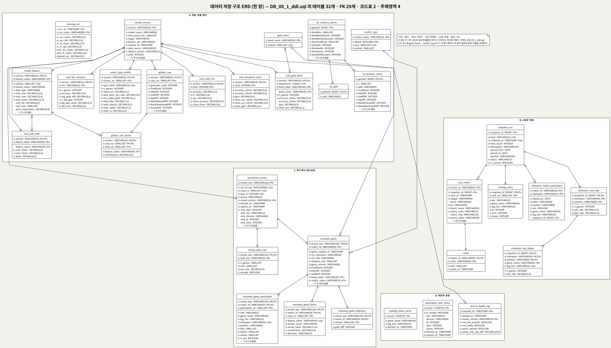
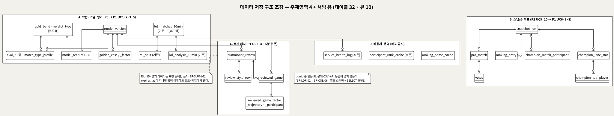
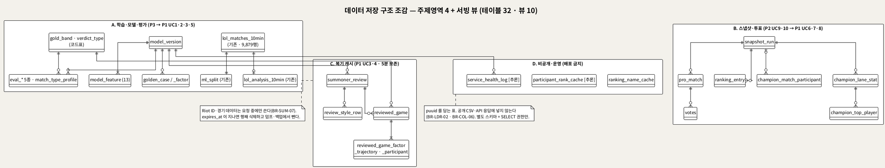
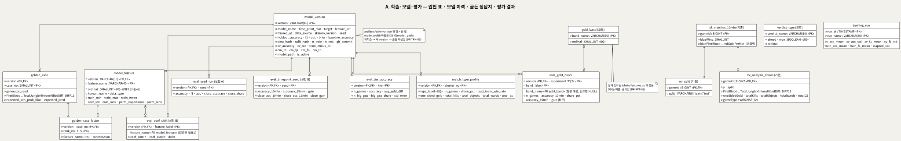
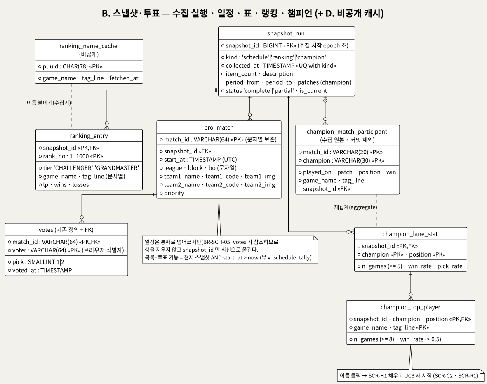
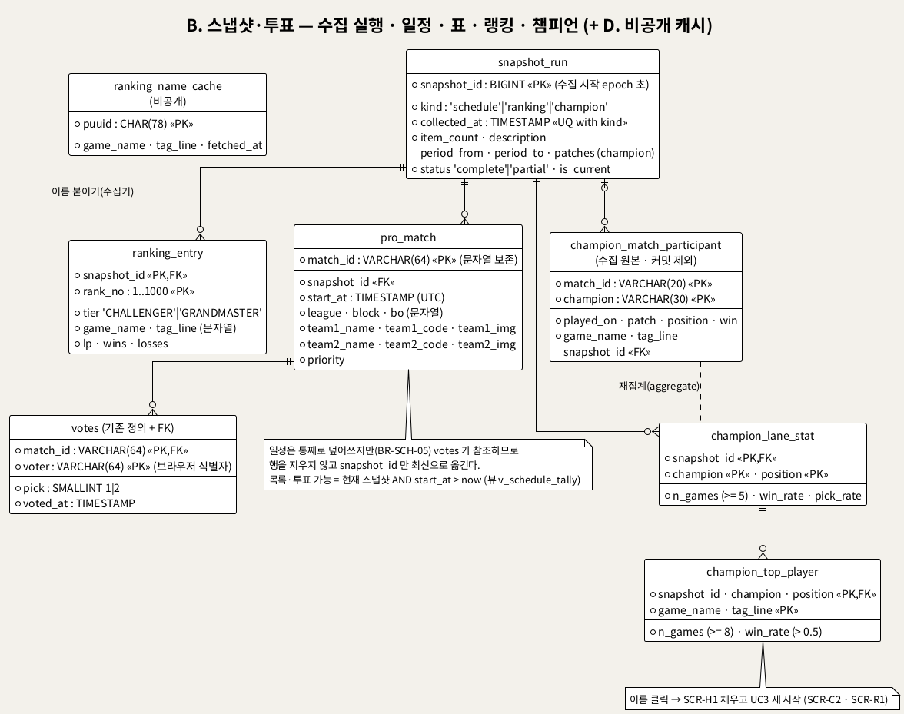
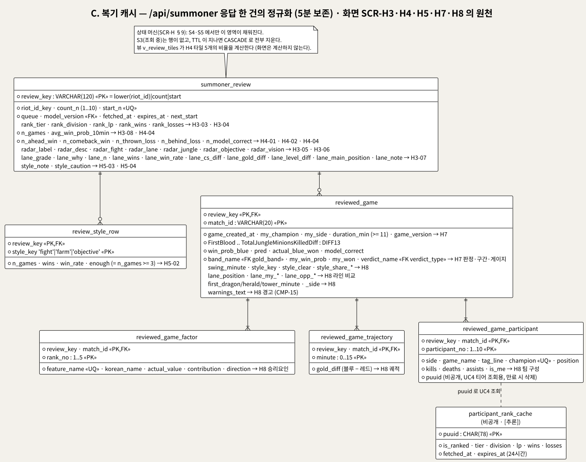
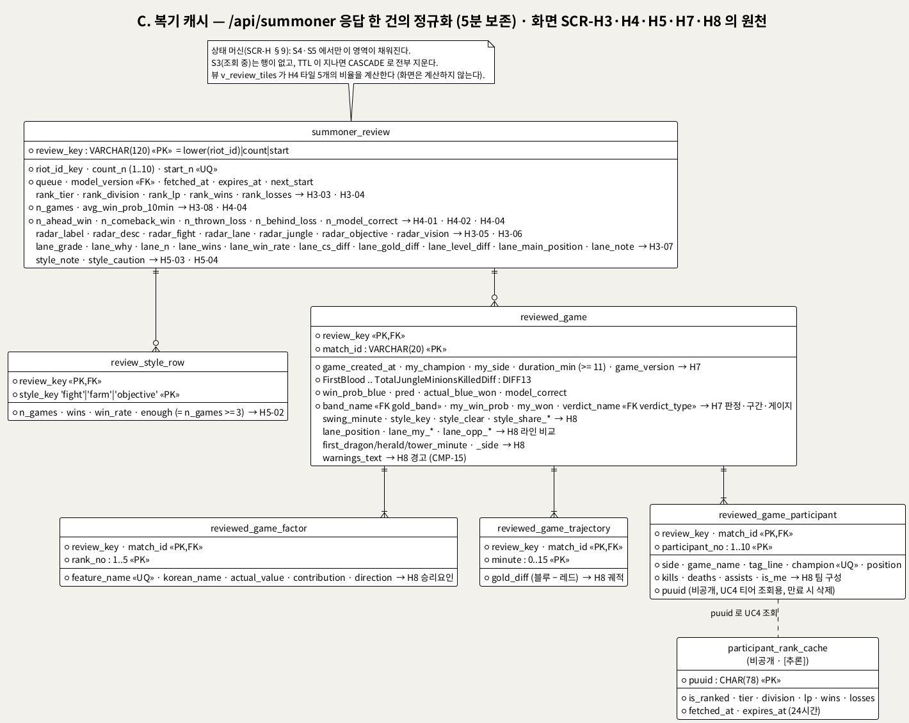

<!-- ─────────────────────────────────────────────
  데이터베이스 구조 설계 — ERD + 표준 SQL DDL.
  왜 필요한가: UC·BP·화면 설계는 "무엇을 보여주고 넘겨주는가"를 적었다. 이 문서는 그 값들이
  어디에 어떤 이름·형·제약으로 놓이는지를 못 박아, 수집기·서버·화면·검증이 같은 표를 보게 한다.
  주로 보는 사람: 팀원(구현·운영) · DB 담당 · Claude(검수)
  ───────────────────────────────────────────── -->

# LoL 인게임 시점별 경기 데이터 기반 승패 예측 및 핵심 승리요인 분석 데이터베이스 구조 설계
**UC_00~UC_14 · BP_00/BP_01 · UI_00 · SCR-00 · SCR-H1~H5 를 일관되게 검토해 도출한 ERD 와 표준 SQL DDL**

---

> **문서 식별**: `docs/usecases/DB_00_데이터베이스구조설계.md`
> **작성일**: 2026-09-07 · **표준**: ERD 는 IE(Information Engineering, 까마귀발) 표기 · DDL 은 ISO/IEC 9075 SQL:2016 의 벤더 중립 부분집합(IDENTITY·JSON 형·벤더 절 미사용)
> **원천(SoT)**: [UC_00 개요](UC_00_개요_LoL승패예측및핵심승리요인분석.md) §2·§3 와 `UC_01`~`UC_14` 업무규칙 · [BP_00](BP_00_비즈니스프로세스_액티비티다이어그램.md) §5 핸드오프 · [BP_01](BP_01_비즈니스프로세스_BPMN.md) 데이터 저장소 · [UI_00 화면목록](UI_00_화면목록.md) §3~§8 · [SCR-00 공통화면](../ui/SCR-00_공통화면.html) · [SCR-H1~H5 유저 전적 분석](../ui/SCR-H1-H5_유저전적분석_화면설계.html) · `docs/serving.md` · `db/create_ml_views.sql` · `db/load_mysql.py` · `db/build_analysis_table.py` · `web/app.py` · `src/collect_*.py` · `src/riot_api.py` `analyze_recent` · `artifacts/schema.json` · `tests/golden_predictions.json` · `docs/riot-api-application.md` "DATA HANDLING". 원천에 없는 저장소는 만들지 않았고, 설계 판단은 `[추론]` 으로 표시했다.
> **산출물**: ERD 5장 — 한 장짜리 전체 ERD 1 + 조감 1 + 영역별 3 (`diagrams/erd_*.svg`, PlantUML 소스 `diagrams/erd_*.puml`, 로컬 Kroki HTTP 200 렌더) · 실행 가능한 SQL 5개 — [`sql/DB_00_1_ddl.sql`](sql/DB_00_1_ddl.sql)(구조 DDL 단일 파일: 테이블 32 · 인덱스 6) · [`sql/DB_00_2_seed.sql`](sql/DB_00_2_seed.sql)(코드표 8행) · [`sql/DB_00_3_views.sql`](sql/DB_00_3_views.sql)(뷰 10) · [`sql/DB_00_4_grants.sql`](sql/DB_00_4_grants.sql)(역할 4 · 권한) · [`sql/DB_00_5_queries.sql`](sql/DB_00_5_queries.sql)(화면·API·수집기·정리 조회 40여 문) — SQLite 3.51 로 1→2→3 순서 실행·실제 산출물 적재·부정 테스트·조회 스모크 통과 (§8)
> **읽기 전에**: 처음이면 [유스케이스_쉬운설명.md](유스케이스_쉬운설명.md) → [BP_00](BP_00_비즈니스프로세스_액티비티다이어그램.md) §5 → 이 문서 §2 순으로 본다.

---

## 목차

1. [목적·범위·설계 원칙](#1-목적범위설계-원칙)
2. [현행 저장소 조사와 설계 대응](#2-현행-저장소-조사와-설계-대응)
3. [조감 ERD와 주제영역](#3-조감-erd와-주제영역)
4. [주제영역별 ERD와 테이블 정의](#4-주제영역별-erd와-테이블-정의)
5. [서빙 뷰 — 화면이 계산하지 않도록](#5-서빙-뷰--화면이-계산하지-않도록)
6. [화면 요소 ↔ 테이블·컬럼 추적](#6-화면-요소--테이블컬럼-추적)
7. [업무규칙 ↔ 제약 매핑](#7-업무규칙--제약-매핑)
8. [표준 SQL DDL · 검증 · 이식성 · 적용 절차](#8-표준-sql-ddl--검증--이식성--적용-절차)
9. [일관성 검토에서 드러난 불일치 · 설계 판단 · 미해결](#9-일관성-검토에서-드러난-불일치--설계-판단--미해결)

---

## 1. 목적·범위·설계 원칙

지금 서비스가 저장하는 것은 **파일 다섯 종류**다 — MariaDB 의 학습 원천 표 하나와 SQL 뷰, `reports/tables/` 의 스냅샷 CSV 와 `*_meta.json`, `db/votes.sqlite3` 의 투표 표 하나, `artifacts/` 의 모델·스키마 파일, 그리고 프로세스 메모리의 5분 캐시(`_cached_summoner` · `_RANK_CACHE`). BP_00 §5 가 말하듯 프로세스 사이를 오가는 것은 전부 파일 또는 환경변수이고 DB 트리거·메시지 큐는 없다.

이 문서는 그 저장물을 **한 시스템의 데이터 저장 구조**로 다시 그린다. 화면 설계(SCR-00 · SCR-H1~H5)가 "응답 하나로 영역 다섯을 그린다(I-01)", "화면은 나누기만 한다(I-04)" 고 못 박았으므로, DB 도 같은 원칙으로 — 화면이 쓰는 값은 컬럼이나 뷰로 존재하고, 화면이 다시 계산할 필요가 없어야 한다.

| 범위 | 포함 | 제외 |
|---|---|---|
| 저장 대상 | 학습 원천·분할·분석 표(기존) · 모델 이력·골든 정답지·평가 결과 · 스냅샷 3종(일정·랭킹·챔피언) · 투표 · 소환사 복기 결과(캐시) · 비공개 캐시 · 운영 기록 | `model.joblib` 파일 자체(경로만 저장) · 그림 파일(`reports/figures`) · 로그 파일 · 환경변수(`.env`) |
| 프로세스 | P1 서비스 이용(UC1~UC8) · P2 수집(UC9·UC10) · P3 모델(UC11·UC12) · P4 운영(UC13·UC14) | GitHub 저장소·배포 스크립트 |

**설계 원칙** (근거를 함께 적었다)

| # | 원칙 | 근거 |
|---|---|---|
| P-1 | **계산 정본은 코드에 둔다.** 판정(`verdict_of`)·구간 경계(`GOLD_BINS`)·피처 계산식(`features.py`)·레이더 분위수는 DB 에 복제하지 않는다. DB 에는 이름·순서·결과값만 둔다 | SCR-00 R-04 · BR-RPT-02 · BR-TRN-04 · CLAUDE.md "피처를 바꿀 때" |
| P-2 | **기존 표·뷰는 그대로 둔다.** `lol_matches_10min` · `ml_split` · `lol_analysis_10min` · `v_*` 뷰는 동결 대상이라 이름·컬럼을 바꾸지 않고 제약만 표준 문법으로 적었다 | CLAUDE.md "손대면 안 되는 것" · BR-TRN-05 |
| P-3 | **puuid 와 Riot ID 는 공개 영역에 두지 않는다.** puuid 를 담는 표는 비공개 영역(D)에 격리하고, Riot ID 를 담는 복기 캐시(C)는 5분 뒤 반드시 지운다 | `riot-api-application.md` DATA HANDLING · BR-SUM-07 · BR-LDR-02 · BR-COL-06 |
| P-4 | **스냅샷은 실행 단위로 남기고 갱신 시각을 함께 준다.** `*_meta.json` 한 개가 `snapshot_run` 한 행이고, 화면 메타 줄(CMP-23)은 여기서 나온다 | BR-LDR-06 · BR-COL-09 · UI_00 §8 |
| P-5 | **화면이 세지 않게 DB 가 준다.** 판정별 건수·비율·승률·표본 부족 표시·표 집계는 컬럼 또는 뷰다 | SCR-H I-04 · BR-SUM-08 · BR-LDR-07 · BR-CHMP-02 |
| P-6 | **표준 SQL 이식성.** IDENTITY/AUTO_INCREMENT · JSON 형 · ENGINE/COMMENT · `ON DUPLICATE KEY` 를 쓰지 않는다. 대리키는 응용이 발급 규칙대로 넣고, 갱신은 표준 `INSERT` 실패 시 `UPDATE` 로 한다 | 팀 MariaDB · 로컬 SQLite · 후보 PostgreSQL 이 문법이 다르다 (`docs/plan.md` Storage) |
| P-7 | **트리거 대신 정리 규칙.** TTL 삭제는 응용 또는 스케줄러가 `DELETE … WHERE expires_at <= CURRENT_TIMESTAMP` 로 한다 | BP_00 §5 "DB 트리거는 없다" |

---

## 2. 현행 저장소 조사와 설계 대응

원천 문서·코드에서 저장소를 전부 찾아 무엇이 무엇으로 바뀌는지 적었다. "설계 대응" 열의 표 이름이 §4 의 정의와 같다.

| 현행 저장소 | 형태 · 위치 | 만드는 곳 | 읽는 곳 · 화면 | 갱신 | 설계 대응 (TO-BE) |
|---|---|---|---|---|---|
| `lol_matches_10min` | MariaDB 표 9,879행 × 40컬럼 | `db/load_mysql.py` | `lolwin.data`(학습) · `/api/matches` | 재적재 시 DROP 후 재생성 | 그대로 (§4.1) + 거울 관계 CHECK 2건 |
| `ml_split` | MariaDB 표 | `db/load_split.py` | `v_base` | upsert | 그대로 + FK |
| `lol_analysis_10min` | MariaDB 표 | `db/build_analysis_table.py` | 분석(`docs/data_analysis.md`) | upsert | 그대로 + FK · CHECK |
| `v_base` · `v_diff13_*` · `v_clean27_*` · `v_gold2_*` · `v_cluster5_*` | SQL 뷰 | `db/create_ml_views.sql` (정본 `lolwin/features.py`) | `src/load_from_db.py` | 피처 바뀔 때 | `v_base` · `v_diff13_*` 를 §5.1 에 그대로 실음. 나머지 대조군 뷰는 기존 파일 참조 |
| `artifacts/schema.json` | JSON 파일 | `lolwin/model.py train` (UC11) | `/api/health` · `/api/schema` · `/api/report` · 화면 입력 폼 | 재학습 시 | `model_version` + `model_feature` (§4.1) |
| `artifacts/model.joblib` | 바이너리 2.2KB | UC11 | `lolwin.predict` | 재학습 시 | 파일 유지, `model_version.model_path` 로 참조 |
| `runs.csv` | CSV | 실험 스크립트 | 문서 | 실험마다 append | `training_run` |
| `tests/golden_predictions.json` | JSON 50건 | `tests/make_golden.py` | `test_regression.py` (UC12) | 재학습 직후 | `golden_case` + `golden_case_factor` |
| `reports/tables/repeat_experimentA.csv` · `day4_error_analysis.csv` · `win_factor_ranking.csv` · `expB_*.csv` · `repeat_experimentB.csv` · `tier_accuracy.csv` · `day2b_game_type_profile.csv` | CSV | P3 (`finalize_model.py` 등) | `/api/report` · `/api/match-types` → SCR-T1 | 재학습·재분석 시 | `eval_seed_run` · `eval_gold_band` · `model_feature`(승리요인 열) · `eval_coef_shift` · `eval_timepoint_seed` · `eval_tier_accuracy` · `match_type_profile` |
| `reports/tables/schedule.csv` + `schedule_meta.json` | CSV 30경기 + JSON | `src/collect_schedule.py` (UC9) | `/api/schedule` → SCR-V1 | 통째로 덮어쓰기 | `snapshot_run(kind='schedule')` + `pro_match` |
| `db/votes.sqlite3` `votes` | SQLite 표 33행 | `web/app.py _vote_db` (UC8) | `/api/schedule` · `/api/vote` → SCR-V1 | 투표마다 upsert | `votes` (같은 정의 + `pro_match` FK) |
| `reports/tables/ranking.csv` + `ranking_meta.json` | CSV 1,000행 | `src/collect_ranking.py` (UC10) | `/api/ranking` → SCR-R1 | 25명마다 중간 저장 · 축소 덮어쓰기 차단 | `snapshot_run(kind='ranking')` + `ranking_entry` |
| `ranking_names.jsonl` (`data/` 아래, gitignore) | JSONL (gitignore, puuid 포함) | UC10 이어받기 | UC10 | append | `ranking_name_cache` (비공개 영역 D) |
| `champion_raw.jsonl` (`data/` 아래, gitignore) | JSONL (gitignore) | UC10 | UC10 재집계 | 경기마다 append | `champion_match_participant` |
| `reports/tables/champion_stats.csv` · `champion_top_players.csv` + `champion_stats_meta.json` | CSV 428 · 605행 | UC10 `aggregate` | `/api/champions` → SCR-C1 · C2 | 원본 전체 재집계 | `snapshot_run(kind='champion')` + `champion_lane_stat` + `champion_top_player` |
| `_SUMMONER_CACHE` (5분) | 프로세스 메모리 dict | `web/app.py _cached_summoner` (UC3) | `/api/summoner` → SCR-H2~H8 | 요청마다 | `summoner_review` + `review_style_row` + `reviewed_game` + `_factor` + `_trajectory` + `_participant` (§4.3, TTL 5분) |
| `_RANK_CACHE` | 프로세스 메모리 dict (puuid) | `src/riot_api.py get_rank` (UC4) | `/api/ranks` → SCR-H8 티어 | 프로세스 생존 동안 | `participant_rank_cache` `[추론]` (비공개, TTL 24시간) |
| `/api/health` 응답 (`riot_ready` · 파리티) | 기동 시 계산, 저장 없음 | `web/app.py` (UC12~UC14) | 운영 확인 | 기동마다 | `service_health_log` `[추론]` |
| `.env` (`RIOT_API_KEY` · `DB_*`) | 파일 | UC14 | 서버 · 수집기 | 매일 | DB 밖 (비밀은 저장하지 않는다) |

---

## 3. 조감 ERD와 주제영역

### 3.1 한 장짜리 전체 ERD (테이블 32 · FK 29)

`sql/DB_00_1_ddl.sql` 을 파싱해 만든 그림이라 DDL 과 어긋날 수 없다(표·키·FK·필수 여부를 DDL 에서 그대로 읽는다). 긴 표는 키·FK·UQ 와 앞 8개 컬럼만 보이고 나머지는 개수로 적었다. 인쇄는 가로(A3) 한 장이다.

```plantuml
@startuml erd_all_in_one
!theme plain
skinparam backgroundColor #F3F1EB
skinparam shadowing false
skinparam linetype polyline
skinparam nodesep 30
skinparam ranksep 40
skinparam defaultFontName "Noto Sans CJK KR"
skinparam packageStyle rectangle
skinparam defaultFontSize 11
hide circle
hide empty methods
title 데이터 저장 구조 ERD (한 장) — DB_00_1_ddl.sql 의 테이블 32개 · FK 29개 · 코드표 2 · 주제영역 4
package "A. 학습·모델·평가" as PA {
entity "lol_matches_10min" as lol_matches_10min {
  * gameId : BIGINT <<PK>>
  --
  * blueWins : SMALLINT
  * blueWardsPlaced : INTEGER
  * blueWardsDestroyed : INTEGER
  * blueFirstBlood : SMALLINT
  * blueKills : INTEGER
  * blueDeaths : INTEGER
  * blueAssists : INTEGER
  * blueEliteMonsters : INTEGER
  … 그 외 31개 컬럼
}
entity "ml_split" as ml_split {
  * gameId : BIGINT <<PK,FK>>
  --
  * split : VARCHAR(5)
}
entity "lol_analysis_10min" as lol_analysis_10min {
  * gameId : BIGINT <<PK,FK>>
  --
  * y : SMALLINT
  * split : VARCHAR(5)
  * FirstBlood : INTEGER
  * KillsDiff : INTEGER
  * GoldDiff : INTEGER
  * ExpDiff : INTEGER
  * WardsPlacedDiff : INTEGER
  * WardsDestroyedDiff : INTEGER
  … 그 외 13개 컬럼
}
entity "gold_band" as gold_band {
  * band_name : VARCHAR(30) <<PK>>
  --
  * ordinal : SMALLINT <<UQ>>
}
entity "verdict_type" as verdict_type {
  * verdict_name : VARCHAR(10) <<PK>>
  --
  * ahead : BOOLEAN <<UQ>>
  * won : BOOLEAN <<UQ>>
  * ordinal : SMALLINT
}
entity "model_version" as model_version {
  * version : VARCHAR(16) <<PK>>
  --
  * model_name : VARCHAR(80)
  * time_point_min : SMALLINT
  * target : VARCHAR(60)
  * feature_set : VARCHAR(60)
  * trained_at : TIMESTAMP
  * data_source : VARCHAR(20)
  * sklearn_version : VARCHAR(12)
  * seed : INTEGER
  … 그 외 19개 컬럼
}
entity "model_feature" as model_feature {
  * version : VARCHAR(16) <<PK,FK>>
  * feature_name : VARCHAR(40) <<PK>>
  --
  * ordinal : SMALLINT <<UQ>>
  * korean_name : VARCHAR(40)
  * data_type : VARCHAR(8)
  * train_min : DECIMAL(12,4)
  * train_max : DECIMAL(12,4)
  * train_mean : DECIMAL(12,4)
    coef_std : DECIMAL(8,4)
    coef_rank : SMALLINT
    perm_importance : DECIMAL(8,4)
  … 그 외 1개 컬럼
}
entity "training_run" as training_run {
  * run_at : TIMESTAMP <<PK>>
  * run_name : VARCHAR(80) <<PK>>
  --
    cv_acc_mean : DECIMAL(5,4)
    cv_acc_std : DECIMAL(5,4)
    cv_f1_mean : DECIMAL(5,4)
    cv_f1_std : DECIMAL(5,4)
    train_acc_mean : DECIMAL(5,4)
    train_f1_mean : DECIMAL(5,4)
    elapsed_sec : DECIMAL(8,2)
}
entity "golden_case" as golden_case {
  * version : VARCHAR(16) <<PK,FK>>
  * case_no : SMALLINT <<PK>>
  --
  * generator_seed : INTEGER
  * FirstBlood : INTEGER
  * KillsDiff : INTEGER
  * GoldDiff : INTEGER
  * ExpDiff : INTEGER
  * WardsPlacedDiff : INTEGER
  * WardsDestroyedDiff : INTEGER
  * AssistsDiff : INTEGER
  … 그 외 8개 컬럼
}
entity "golden_case_factor" as golden_case_factor {
  * version : VARCHAR(16) <<PK,FK>>
  * case_no : SMALLINT <<PK,FK>>
  * rank_no : SMALLINT <<PK>>
  --
  * feature_name : VARCHAR(40) <<FK>>
  * contribution : DECIMAL(9,4)
}
entity "eval_seed_run" as eval_seed_run {
  * version : VARCHAR(16) <<PK,FK>>
  * seed : INTEGER <<PK>>
  --
  * accuracy : DECIMAL(5,4)
  * f1 : DECIMAL(5,4)
  * auc : DECIMAL(5,4)
  * close_accuracy : DECIMAL(5,4)
  * close_share : DECIMAL(5,4)
}
entity "eval_timepoint_seed" as eval_timepoint_seed {
  * version : VARCHAR(16) <<PK,FK>>
  * seed : INTEGER <<PK>>
  --
  * accuracy_10min : DECIMAL(5,4)
  * accuracy_15min : DECIMAL(5,4)
  * gain : DECIMAL(6,4)
  * close_acc_10min : DECIMAL(5,4)
  * close_acc_15min : DECIMAL(5,4)
  * close_gain : DECIMAL(6,4)
}
entity "eval_gold_band" as eval_gold_band {
  * version : VARCHAR(16) <<PK,FK>>
  * experiment : CHAR(1) <<PK>>
  * band_label : VARCHAR(30) <<PK>>
  --
    band_name : VARCHAR(30) <<FK>>
  * n_games : INTEGER
  * accuracy_10min : DECIMAL(5,4)
    accuracy_15min : DECIMAL(5,4)
    gain : DECIMAL(6,4)
  * share_pct : DECIMAL(5,1)
}
entity "eval_coef_shift" as eval_coef_shift {
  * version : VARCHAR(16) <<PK,FK>>
  * feature_label : VARCHAR(40) <<PK>>
  --
    feature_name : VARCHAR(40) <<FK>>
  * coef_10min : DECIMAL(8,4)
  * coef_15min : DECIMAL(8,4)
  * delta : DECIMAL(8,4)
}
entity "eval_tier_accuracy" as eval_tier_accuracy {
  * version : VARCHAR(16) <<PK,FK>>
  * tier : VARCHAR(12) <<PK>>
  --
  * n_games : INTEGER
  * accuracy : DECIMAL(5,4)
  * avg_gold_diff : DECIMAL(8,1)
  * n_big_gap : INTEGER
  * big_gap_share : DECIMAL(5,4)
  * std_error : DECIMAL(6,4)
}
entity "match_type_profile" as match_type_profile {
  * version : VARCHAR(16) <<PK,FK>>
  * cluster_no : SMALLINT <<PK>>
  --
  * type_label : VARCHAR(12) <<UQ>>
  * n_games : INTEGER
  * share_pct : DECIMAL(5,1)
  * lead_team_win_rate : DECIMAL(5,4)
  * one_sided_gold : DECIMAL(9,2)
  * total_kills : DECIMAL(7,2)
  * total_objects : DECIMAL(6,2)
  * total_wards : DECIMAL(7,2)
  * total_cs : DECIMAL(8,2)
}
}
package "B. 스냅샷·투표" as PB {
entity "snapshot_run" as snapshot_run {
  * snapshot_id : BIGINT <<PK>>
  --
  * kind : VARCHAR(10) <<UQ>>
  * collected_at : TIMESTAMP <<UQ>>
  * item_count : INTEGER
  * description : VARCHAR(200)
    period_from : DATE
    period_to : DATE
    patches : VARCHAR(100)
  * status : VARCHAR(10)
  * is_current : BOOLEAN
}
entity "pro_match" as pro_match {
  * match_id : VARCHAR(64) <<PK>>
  --
  * snapshot_id : BIGINT <<FK>>
  * start_at : TIMESTAMP
  * league : VARCHAR(40)
    block : VARCHAR(40)
  * bo : VARCHAR(4)
  * team1_name : VARCHAR(60)
  * team1_code : VARCHAR(10)
    team1_img : VARCHAR(255)
  * team2_name : VARCHAR(60)
  … 그 외 3개 컬럼
}
entity "votes" as votes {
  * match_id : VARCHAR(64) <<PK,FK>>
  * voter : VARCHAR(64) <<PK>>
  --
  * pick : SMALLINT
  * voted_at : TIMESTAMP
}
entity "ranking_entry" as ranking_entry {
  * snapshot_id : BIGINT <<PK,FK>>
  * rank_no : SMALLINT <<PK>>
  --
  * tier : VARCHAR(12)
  * game_name : VARCHAR(40)
  * tag_line : VARCHAR(10)
  * lp : INTEGER
  * wins : INTEGER
  * losses : INTEGER
}
entity "champion_match_participant" as champion_match_participant {
  * match_id : VARCHAR(20) <<PK>>
  * champion : VARCHAR(30) <<PK>>
  --
  * played_on : DATE
  * patch : VARCHAR(8)
  * position : VARCHAR(8)
  * win : BOOLEAN
  * game_name : VARCHAR(40)
  * tag_line : VARCHAR(10)
    snapshot_id : BIGINT <<FK>>
}
entity "champion_lane_stat" as champion_lane_stat {
  * snapshot_id : BIGINT <<PK,FK>>
  * champion : VARCHAR(30) <<PK>>
  * position : VARCHAR(8) <<PK>>
  --
  * n_games : INTEGER
  * win_rate : DECIMAL(5,4)
  * pick_rate : DECIMAL(6,4)
}
entity "champion_top_player" as champion_top_player {
  * snapshot_id : BIGINT <<PK,FK>>
  * champion : VARCHAR(30) <<PK,FK>>
  * position : VARCHAR(8) <<PK,FK>>
  * game_name : VARCHAR(40) <<PK>>
  * tag_line : VARCHAR(10) <<PK>>
  --
  * n_games : INTEGER
  * win_rate : DECIMAL(5,4)
}
}
package "C. 복기 캐시 (5분 보존)" as PC {
entity "summoner_review" as summoner_review {
  * review_key : VARCHAR(120) <<PK>>
  --
  * riot_id_key : VARCHAR(80) <<UQ>>
  * count_n : SMALLINT <<UQ>>
  * start_n : INTEGER <<UQ>>
  * queue : VARCHAR(10)
  * model_version : VARCHAR(16) <<FK>>
  * fetched_at : TIMESTAMP
  * expires_at : TIMESTAMP
  * next_start : INTEGER
    rank_tier : VARCHAR(12)
    rank_division : VARCHAR(4)
    rank_lp : INTEGER
    rank_wins : INTEGER
  … 그 외 27개 컬럼
}
entity "review_style_row" as review_style_row {
  * review_key : VARCHAR(120) <<PK,FK>>
  * style_key : VARCHAR(10) <<PK>>
  --
  * n_games : SMALLINT
  * wins : SMALLINT
  * win_rate : DECIMAL(5,4)
  * enough : BOOLEAN
}
entity "reviewed_game" as reviewed_game {
  * review_key : VARCHAR(120) <<PK,FK>>
  * match_id : VARCHAR(20) <<PK>>
  --
  * game_created_at : TIMESTAMP
  * my_champion : VARCHAR(30)
  * my_side : VARCHAR(4)
  * duration_min : SMALLINT
  * game_version : VARCHAR(8)
  * FirstBlood : INTEGER
  * KillsDiff : INTEGER
  * GoldDiff : INTEGER
  * band_name : VARCHAR(30) <<FK>>
  * verdict_name : VARCHAR(10) <<FK>>
  … 그 외 38개 컬럼
}
entity "reviewed_game_factor" as reviewed_game_factor {
  * review_key : VARCHAR(120) <<PK,FK>>
  * match_id : VARCHAR(20) <<PK,FK>>
  * rank_no : SMALLINT <<PK>>
  --
  * feature_name : VARCHAR(40) <<UQ>>
  * korean_name : VARCHAR(40)
  * actual_value : DECIMAL(12,4)
  * contribution : DECIMAL(9,4)
  * direction : VARCHAR(10)
}
entity "reviewed_game_trajectory" as reviewed_game_trajectory {
  * review_key : VARCHAR(120) <<PK,FK>>
  * match_id : VARCHAR(20) <<PK,FK>>
  * minute : SMALLINT <<PK>>
  --
  * gold_diff : INTEGER
}
entity "reviewed_game_participant" as reviewed_game_participant {
  * review_key : VARCHAR(120) <<PK,FK>>
  * match_id : VARCHAR(20) <<PK,FK>>
  * participant_no : SMALLINT <<PK>>
  --
  * side : VARCHAR(4)
  * game_name : VARCHAR(40)
  * tag_line : VARCHAR(10)
  * champion : VARCHAR(30) <<UQ>>
  * position : VARCHAR(8)
  * kills : SMALLINT
  * deaths : SMALLINT
  * assists : SMALLINT
  * is_me : BOOLEAN
  … 그 외 1개 컬럼
}
}
package "D. 비공개·운영" as PD {
entity "ranking_name_cache" as ranking_name_cache {
  * puuid : CHAR(78) <<PK>>
  --
  * game_name : VARCHAR(40)
  * tag_line : VARCHAR(10)
  * fetched_at : TIMESTAMP
}
entity "participant_rank_cache" as participant_rank_cache {
  * puuid : CHAR(78) <<PK>>
  --
  * is_ranked : BOOLEAN
    tier : VARCHAR(12)
    division : VARCHAR(4)
    lp : INTEGER
    wins : INTEGER
    losses : INTEGER
  * fetched_at : TIMESTAMP
  * expires_at : TIMESTAMP
}
entity "service_health_log" as service_health_log {
  * checked_at : TIMESTAMP <<PK>>
  --
  * started_at : TIMESTAMP
  * model_version : VARCHAR(16) <<FK>>
  * riot_key_present : BOOLEAN
  * riot_ready : BOOLEAN
  * parity_passed : BOOLEAN
  * parity_max_abs_diff : DECIMAL(10,8)
}
}
lol_matches_10min ||--|{ ml_split
lol_matches_10min ||--|{ lol_analysis_10min
model_version ||--|{ model_feature
model_version ||--|{ golden_case
golden_case ||--|{ golden_case_factor
model_feature ||--o{ golden_case_factor
model_version ||--|{ eval_seed_run
model_version ||--|{ eval_timepoint_seed
model_version ||--|{ eval_gold_band
gold_band |o--o{ eval_gold_band
model_version ||--|{ eval_coef_shift
model_feature |o--o{ eval_coef_shift
model_version ||--|{ eval_tier_accuracy
model_version ||--|{ match_type_profile
snapshot_run ||--o{ pro_match
pro_match ||--|{ votes
snapshot_run ||--|{ ranking_entry
snapshot_run |o--o{ champion_match_participant
snapshot_run ||--|{ champion_lane_stat
champion_lane_stat ||--|{ champion_top_player
model_version ||--o{ summoner_review
summoner_review ||--|{ review_style_row
summoner_review ||--|{ reviewed_game
gold_band ||--o{ reviewed_game
verdict_type ||--o{ reviewed_game
reviewed_game ||--|{ reviewed_game_factor
reviewed_game ||--|{ reviewed_game_trajectory
reviewed_game ||--|{ reviewed_game_participant
model_version ||--o{ service_health_log
lol_matches_10min -[hidden]right- snapshot_run
eval_coef_shift -[hidden]down- summoner_review
champion_top_player -[hidden]down- service_health_log
reviewed_game_participant -[hidden]right- ranking_name_cache
note as N1
  기호: * 필수 · <<PK>> 기본키 · <<FK>> 외래키 · <<UQ>> 유일 · 실선 = FK.
  긴 표는 키·FK·UQ 와 앞 8개 컬럼만 보이고 나머지는 개수로 적었다. 전체는 DB_00_1_ddl.sql.
  A 의 코드표(gold_band · verdict_type)가 C 의 경기 행과 A 의 평가 결과에 같은 이름을 강제한다.
end note
@enduml
```



<details><summary>PlantUML 소스 보기 (DDL 에서 자동 생성)</summary>



소스를 직접 렌더하려면 **[「전체 ERD」 PlantUML 뷰어로 열기](https://plantuml.sumzip.com/plantuml/svg/eNrNWt1v3MYRf7-_Yuu-WIYl6PRhy0YaRJ-uK9txbKd9KApiRa7utuJxGXJP8jUOICcK4NgJGqNWLRcnV0bdJChcQIiVSm2dF_0pedTx_ofOkjxyd7m8kxwH6NvdzOxy9jez80W-E3Ic8GbDRSRwLOy6FvUs5pHKz3idNAjyXUy9SrhCPR8HuIGWsL1SC1jTc2aZywL084Xxher8jCQR1rHD1qhXQ8vYDYnEcalHeMuHTZnbEn8knsccEhIfjY9KxAB7K4I4IRMdsoybLl9gHr-GQcNT1xhn6Cb2QjT7q0W0eOOUJOyDurhGbvKWS1BAbI69mkvMu92kfyCoWq3UqUOQTQMbBOPfpOHzFmoQXmdOWOGUw16dL3aj7b3uxi6Kdtajp39HR9-9iJ7tovkbc-h0d7ONgDaEflh_hOZmrNFRq2o5jjsSfuCiaHsLdT_9HFZ3Dh6h8bGj3TY63EcLi2jsQvo7-v5R50_t7sM2Gov__u1VtNOOtu5Gj_-JJirpmdCp6RHU3XwS3f_ucL_zj286Xxwc7nf_-NnR7vophEN0fRp9WCEeqNtCp1zmWg3M7ToJrepog3qxSIEKKxA6g2qA62UHXUQzly9dvnYLvfXW9cW33wbW8HDMX3Kb5DcUAL-Ibl6dvnIFZHI6DpzwuottIjYAzvyl-Rsqd46EPGAto8ACDUI-4zLmmDZfpK4bGlbNEczrJsZ0GNKQmzjzLuXkKvNCTgKV_8P6V-ho_wBFTw7QeFWYJPrvi85fX1U-yuBsuFbowwYxir0_fcA7u6Dgl4hfRL-evjH7y-kbpyeHpL2FUbCH3RZortlKJR__eS0dS4MCgqyALwMW4z5Hl5c1-iXmOgby_G3fQJU8o4ybeUZBQDZKddxolBooYy1hz4nxyv6lMImflicCRn7s8dGhgm-zwKEAs4QYiLz_HojkT1qFWEltbolgFj9MJqTP65G0R1YNj8R1gmMDvvvulfnpa73nCdYa88yMopqye0IwdS3QIKQs8R6FkmsY_5OUO1dULlmpnWJqNHEYThvE8hn1uCUcUvMyyCw1IrvZuXTZMlzXZkCs0MjlAaQcAslIMG9dvjp_89b01esxy8EcWyFrBraszVi6MFxxCQ48y3CwsVSCaEFHcasL5rseA5CqLIGZUgaC2buL-bE1MCdO5IWCu8ICgj3DPjlIsSdKBpOgTU01Nz97GfYGbM5OKFx8ux8XHmxgI2QzsmyF3JGYUwpPJHPVQxDySdCwaMNnASTm2KbaWsU-RvPEakG1YQXNxNVlQmoc-KV5Uw54wi36t2YSOMSqhW1bB2AyO2PCVhGQucvVfmuBW7I0wb3foxOJPvsTF_sh3KiQ2ArEY0Na-CSeZeOQZAE0_X8CHxfilsdUx1V9u0Y8EmDOAqtwHf-vU9AZlFYTfZPTVGluSsG0lrENh9cxTsk_HupcQNy4AbboG5LyJ0F1HNClJk9U6jnQBeFf-RnJKnZjk2ZXUaGc4GSqXxTzpW03A2y3iq4OB6qaqLhpm8i2ywDCftslEtDSBERnawcXqTDJhEL7_Pgq_c2DkNaCpkNnEpMlEjWs0M8VcCnfXBKZ7CtieoYGnVq4qaQTAEZuQzoBtD0R6ROZITnOxxWgi5eI27cERH1KxexZniXKbr2vGGQTNNAmqNQmsQ9avs2VRdUCmEkertNlnqOZ016jWtERmzAgdtwwAmro0Exl7hJzJ0u4UHFxrDMKV5AE2W2Wb6BEPgEAYp1aQxYuYX83MF7K1Vri3E6SRPLzVIfSLZcoiGBf71kTqjkWxQ7CHYsEAQvKb1vc68eloeUHbJm6aT1bIJ8kC7lN0UIPyDPx5ronJYhmVa0ZzFK_F0yo9x2LE9yw1qACgqLCiAzzIIRTB9KQQF5JYGlfwBkHR1lJpws99nmVzZZ-T2weKvAqAmuifihfb4fF4uujfJozM4Ki-887n3wafbJ_uN-996L7sJ0McmakQU7oQSlXZzzLsTIhNVtGon1mOCvUcwp9aWYLm7kuHLbQhckylJMGhJZmHG9lkzkktAPqc9V1xkZHh3pFP2WOtRywhgBk-ta8TOZMISbTKUXRXrfHIeaonIRBQwvuX5DkgbR1li4BuHgy9Irhy_6l2CV3gcrQnJsoXvwSiPPkLaaqpg4WPLbWLHZtkHRcZq8YurklJhNTfwKPr-rBNmufY6YNPWoBG5QyaaMmG2ZyMl85Zt5WmYkZK9xVxkmYDEPEr8Fw5iFELAgGAO5Te0WfL4h1hTFBrpEof0UfCP-DJB0olEGX5UR1dDFXZLO5sjad45olhuAGD3b14L-WDFtlEhRXoRIs84Pbddzw4fIljm354IrUpj72kpKgnF1utLFRpZTqbTFglua7GBopK2kakit9JrnSxdGEz0KqRYyUs0alGdjrw4r6XloDei4WeQOijIpaRj6-Aw2Cq-T0xyw3-qU-cW10plYUZAfjzLdiiwXqgXP6GzlxLlR-6FymxNQydmaL_0jwlNQ8O4I6L787OthF0X--jB600enJzr82gLYXPdsbSpL0rJykm40GFB2BFZBVStaSPK3SepOp-I-1QlpK9DCoD8lRAK6JTulpG7Kx5ZWMDZOk5ClNZcb8oEmaplikTo71SlDqFkSiNg5toS-jAQlNLI_c5laslmIWlIRcY1BNeQ5dpZpGExJbi6AptRBG5bQ2dt6Y11ILheINohWwxJg68VjWlFr7eJ0m1tdllby3Znj11i8IEI81a3VjMZRoLCpjeJB0tJRywnMNShy9AaC403YAPaPZYRotyxw_elxRzBerIgeaLh7nteKriPiRRSeeerPvvY4xOOj7WiiVUoqtqT5emVpJniiaGG_Oim9utnjMdxmgfxNaJ2jjm8T4VqLfaDJ2Cire-muha3SoFEoeYNHlsV7FWML8KSAFt23GF7h8ci4NDopln6qrXvWVcn-Ko0jbD3AS81V-zbq5tOrIvK28yuw1_0rYcHrfFShUnH1UoJCh74wVzivV8rdXUnExB8XFvzeOoL7YbR_uR3_Zi7buJiXFnFRS9FoXL46dGHKt0tHk5NScfrMZ2yg-4vmpkiB8cohL8rzUXkumj4NErqyZdVyFAV6xiDgKxAiVVAnlBUKhNiiUBajYXb1ejZPDEpJgldrEqhPs8rrlslpSFRbIKRzwIHvFNH7Rro-onUqy6PEKt7iuhFtv-aC_OjPJ2BChnZbGAGPCwSCQAFCOmdfAty28FOqjzuro2amkwC5-f3TnzvDwnQ-zT2rKJYqfw1TUA_d2kt_Vm0Wkl3AV-aVnkZ3m04r6AYCQY33ktMcpL8X6iKgvjvoIZu9KKvlbkzss1knjl--RvyHQDydtVBAyqy1N20tsUpg3V5QpZgpoNpqr5EO6dId4xFRcBBxlxKNJJEcpH38YNyz2_RXDKEAXzntmAwSghNYNVvTusHcarc_oL5cmd9kNkqepbOVjJaOE2gOYntHz8GNI5kXTcaRlc5iRK0RMQ5AY_m2dOnAbfxfQWp0PK0Pyiv5KLBN22Jo3XDCNaQ6iLynqVF5u6boVU3jFA_cW2eFaFcLp0cFud-vgIoTV7uZGdG9LfBGapAHB6rw86H78PKGJmC5qjc7TrYwmKh8UtXei7Vfxp6QPnkcbO-gXaGFxJN57D3Uftjv3HyFYcbi_sHi4__57sMc6ijafyt8ydL7-PJ53bO8dvdxBnY-3Ot8cRF-vi5UgBGp1noHozt3o8b3Og-cj8HMj-nZPsLXvX8Vjp-OPYLOvXE_nDgsqyu45dLS7jmZj6aNvvxcDmO6fPzt6-SrdIfnaFVi7QIsefwmqPIm2Qfftvc5XG9H2BhA2o512d7MtlIJk7CCBbeUd-NVsuJX_AYx1NF8=)** (사내 서버, SSO 로그인 필요) 또는 [로컬 Kroki 로 열기](http://192.168.0.91:8889/plantuml/svg/eNrNWt1v3MYRf7-_Yuu-WIYl6PRhy0YaRJ-uK9txbKd9KApiRa7utuJxGXJP8jUOICcK4NgJGqNWLRcnV0bdJChcQIiVSm2dF_0pedTx_ofOkjxyd7m8kxwH6NvdzOxy9jez80W-E3Ic8GbDRSRwLOy6FvUs5pHKz3idNAjyXUy9SrhCPR8HuIGWsL1SC1jTc2aZywL084Xxher8jCQR1rHD1qhXQ8vYDYnEcalHeMuHTZnbEn8knsccEhIfjY9KxAB7K4I4IRMdsoybLl9gHr-GQcNT1xhn6Cb2QjT7q0W0eOOUJOyDurhGbvKWS1BAbI69mkvMu92kfyCoWq3UqUOQTQMbBOPfpOHzFmoQXmdOWOGUw16dL3aj7b3uxi6Kdtajp39HR9-9iJ7tovkbc-h0d7ONgDaEflh_hOZmrNFRq2o5jjsSfuCiaHsLdT_9HFZ3Dh6h8bGj3TY63EcLi2jsQvo7-v5R50_t7sM2Gov__u1VtNOOtu5Gj_-JJirpmdCp6RHU3XwS3f_ucL_zj286Xxwc7nf_-NnR7vophEN0fRp9WCEeqNtCp1zmWg3M7ToJrepog3qxSIEKKxA6g2qA62UHXUQzly9dvnYLvfXW9cW33wbW8HDMX3Kb5DcUAL-Ibl6dvnIFZHI6DpzwuottIjYAzvyl-Rsqd46EPGAto8ACDUI-4zLmmDZfpK4bGlbNEczrJsZ0GNKQmzjzLuXkKvNCTgKV_8P6V-ho_wBFTw7QeFWYJPrvi85fX1U-yuBsuFbowwYxir0_fcA7u6Dgl4hfRL-evjH7y-kbpyeHpL2FUbCH3RZortlKJR__eS0dS4MCgqyALwMW4z5Hl5c1-iXmOgby_G3fQJU8o4ybeUZBQDZKddxolBooYy1hz4nxyv6lMImflicCRn7s8dGhgm-zwKEAs4QYiLz_HojkT1qFWEltbolgFj9MJqTP65G0R1YNj8R1gmMDvvvulfnpa73nCdYa88yMopqye0IwdS3QIKQs8R6FkmsY_5OUO1dULlmpnWJqNHEYThvE8hn1uCUcUvMyyCw1IrvZuXTZMlzXZkCs0MjlAaQcAslIMG9dvjp_89b01esxy8EcWyFrBraszVi6MFxxCQ48y3CwsVSCaEFHcasL5rseA5CqLIGZUgaC2buL-bE1MCdO5IWCu8ICgj3DPjlIsSdKBpOgTU01Nz97GfYGbM5OKFx8ux8XHmxgI2QzsmyF3JGYUwpPJHPVQxDySdCwaMNnASTm2KbaWsU-RvPEakG1YQXNxNVlQmoc-KV5Uw54wi36t2YSOMSqhW1bB2AyO2PCVhGQucvVfmuBW7I0wb3foxOJPvsTF_sh3KiQ2ArEY0Na-CSeZeOQZAE0_X8CHxfilsdUx1V9u0Y8EmDOAqtwHf-vU9AZlFYTfZPTVGluSsG0lrENh9cxTsk_HupcQNy4AbboG5LyJ0F1HNClJk9U6jnQBeFf-RnJKnZjk2ZXUaGc4GSqXxTzpW03A2y3iq4OB6qaqLhpm8i2ywDCftslEtDSBERnawcXqTDJhEL7_Pgq_c2DkNaCpkNnEpMlEjWs0M8VcCnfXBKZ7CtieoYGnVq4qaQTAEZuQzoBtD0R6ROZITnOxxWgi5eI27cERH1KxexZniXKbr2vGGQTNNAmqNQmsQ9avs2VRdUCmEkertNlnqOZ016jWtERmzAgdtwwAmro0Exl7hJzJ0u4UHFxrDMKV5AE2W2Wb6BEPgEAYp1aQxYuYX83MF7K1Vri3E6SRPLzVIfSLZcoiGBf71kTqjkWxQ7CHYsEAQvKb1vc68eloeUHbJm6aT1bIJ8kC7lN0UIPyDPx5ronJYhmVa0ZzFK_F0yo9x2LE9yw1qACgqLCiAzzIIRTB9KQQF5JYGlfwBkHR1lJpws99nmVzZZ-T2weKvAqAmuifihfb4fF4uujfJozM4Ki-887n3wafbJ_uN-996L7sJ0McmakQU7oQSlXZzzLsTIhNVtGon1mOCvUcwp9aWYLm7kuHLbQhckylJMGhJZmHG9lkzkktAPqc9V1xkZHh3pFP2WOtRywhgBk-ta8TOZMISbTKUXRXrfHIeaonIRBQwvuX5DkgbR1li4BuHgy9Irhy_6l2CV3gcrQnJsoXvwSiPPkLaaqpg4WPLbWLHZtkHRcZq8YurklJhNTfwKPr-rBNmufY6YNPWoBG5QyaaMmG2ZyMl85Zt5WmYkZK9xVxkmYDEPEr8Fw5iFELAgGAO5Te0WfL4h1hTFBrpEof0UfCP-DJB0olEGX5UR1dDFXZLO5sjad45olhuAGD3b14L-WDFtlEhRXoRIs84Pbddzw4fIljm354IrUpj72kpKgnF1utLFRpZTqbTFglua7GBopK2kakit9JrnSxdGEz0KqRYyUs0alGdjrw4r6XloDei4WeQOijIpaRj6-Aw2Cq-T0xyw3-qU-cW10plYUZAfjzLdiiwXqgXP6GzlxLlR-6FymxNQydmaL_0jwlNQ8O4I6L787OthF0X--jB600enJzr82gLYXPdsbSpL0rJykm40GFB2BFZBVStaSPK3SepOp-I-1QlpK9DCoD8lRAK6JTulpG7Kx5ZWMDZOk5ClNZcb8oEmaplikTo71SlDqFkSiNg5toS-jAQlNLI_c5laslmIWlIRcY1BNeQ5dpZpGExJbi6AptRBG5bQ2dt6Y11ILheINohWwxJg68VjWlFr7eJ0m1tdllby3Znj11i8IEI81a3VjMZRoLCpjeJB0tJRywnMNShy9AaC403YAPaPZYRotyxw_elxRzBerIgeaLh7nteKriPiRRSeeerPvvY4xOOj7WiiVUoqtqT5emVpJniiaGG_Oim9utnjMdxmgfxNaJ2jjm8T4VqLfaDJ2Cire-muha3SoFEoeYNHlsV7FWML8KSAFt23GF7h8ci4NDopln6qrXvWVcn-Ko0jbD3AS81V-zbq5tOrIvK28yuw1_0rYcHrfFShUnH1UoJCh74wVzivV8rdXUnExB8XFvzeOoL7YbR_uR3_Zi7buJiXFnFRS9FoXL46dGHKt0tHk5NScfrMZ2yg-4vmpkiB8cohL8rzUXkumj4NErqyZdVyFAV6xiDgKxAiVVAnlBUKhNiiUBajYXb1ejZPDEpJgldrEqhPs8rrlslpSFRbIKRzwIHvFNH7Rro-onUqy6PEKt7iuhFtv-aC_OjPJ2BChnZbGAGPCwSCQAFCOmdfAty28FOqjzuro2amkwC5-f3TnzvDwnQ-zT2rKJYqfw1TUA_d2kt_Vm0Wkl3AV-aVnkZ3m04r6AYCQY33ktMcpL8X6iKgvjvoIZu9KKvlbkzss1knjl--RvyHQDydtVBAyqy1N20tsUpg3V5QpZgpoNpqr5EO6dId4xFRcBBxlxKNJJEcpH38YNyz2_RXDKEAXzntmAwSghNYNVvTusHcarc_oL5cmd9kNkqepbOVjJaOE2gOYntHz8GNI5kXTcaRlc5iRK0RMQ5AY_m2dOnAbfxfQWp0PK0Pyiv5KLBN22Jo3XDCNaQ6iLynqVF5u6boVU3jFA_cW2eFaFcLp0cFud-vgIoTV7uZGdG9LfBGapAHB6rw86H78PKGJmC5qjc7TrYwmKh8UtXei7Vfxp6QPnkcbO-gXaGFxJN57D3Uftjv3HyFYcbi_sHi4__57sMc6ijafyt8ydL7-PJ53bO8dvdxBnY-3Ot8cRF-vi5UgBGp1noHozt3o8b3Og-cj8HMj-nZPsLXvX8Vjp-OPYLOvXE_nDgsqyu45dLS7jmZj6aNvvxcDmO6fPzt6-SrdIfnaFVi7QIsefwmqPIm2Qfftvc5XG9H2BhA2o512d7MtlIJk7CCBbeUd-NVsuJX_AYx1NF8=) (내부망 전용). 위 그림 파일은 로그인 없이 보인다.
</details>

### 3.2 주제영역 조감



<details><summary>PlantUML 소스 보기</summary>



소스를 직접 렌더하려면 **[「조감 ERD」 PlantUML 뷰어로 열기](https://plantuml.sumzip.com/plantuml/svg/eNp1VU9PG0cUv_tTvNKLaWvXhhDCLWCIlIamCJpemmo1rMfrbXZ3VrNjJxZUosRUBIiAxhQSuRU0RLQVSG5iWBIll_0oOXrH36FvvAYvJD2sNG_f7735vb9z3ROEi5JtAeV5LZPRWJnysknvJz4RRWpTcC1iOgnvnum4hBMbZol-z-Cs5ORzzGIcPr0xeCM7MRZDeEWSZ_dNx4ACsTwa01imQ0XFpcC4KLKYIk8LpGSJG8wRtwle2nebCQYzxPEg99UtuDXdFwO7yIAYdEZULAqc6oI4hkUTRTNPQTe5fnamtisqYFO8Ku8lhCkQHj5uyN-b7WoD5O6C_OMFtI4P5R5Ke41WYwPeL9RAPn8rd-ty52e5fQRX4HOQ1Xr4-imEfgOS7aU1tA9PazA4AIHf-ZnN9Ce6nKBvNA3trady5Tjww3_-Ch-fBn57_VGrsQDJqUF4_8uvMJWFO7ls4A8E_mDgD_X3AfFgFOYSANRBlhXos5il2UToRepp2YxtOnedZOu0Ifea6s6RL64Nj7R_exRZ2jE729I81zIFdNERwnMvuSYOsSqe2fV9EUycuD-Wp5aGDeGZzIluK3-gLlAiSpxCMjvYZVSIYQxm5amj6cSj8CVoBaILxjswQ4_BaJlY2mcwJP9cUiF2gtdUq2guZwXToh0TWr7kWZslTl4ZIMe8qYuOCSZLvquFT-rtzXrESEeiiZ96RRpLg1zZDx8uyYc-1mf5EJFYnwEszEjgZzO9Ol0N_OHAvxa5GbtQJM8hrldkQuOlKDcej2mRdlTCjsqNV6nMBPU6v8si9psTB1vc0FDmlY6a05haLxLbxTJEXjUcBWHqpkscEYVoux8DW8ShGo54F2R5HwMJ5mo45hUaFUYXbjxZuTSEr46xR0C-2ZCrKlEqM9i7V1Tmh8KTKgKa5x2Uu5ilkm0zh3KNU7VVuomK1zFSIEkcZ42zCMIvJDOC0Lxm4HKI9Mb_qbstdhfD4uRHqs4VxfODjHHjQTzMcQzzdbWFkTbqgS-fNXEDQDJsNNrrh9A6XZYHC1F84-6FAM_K5qi7dYIzG3l34u0du1tTBhEQvpcntXBv94eoR3jcwlNbWKdakRJLFDWLGRfRXtFC9jbMz6dS8_NqxqMzm1cjbJcjxZwaxq7A5tTI9QQcJo-fCdigrn0mYFv2NNiEPUE1EH7nInaKUrJIwhbsuVdFxu_cDRY0LhoJbpxxVJVQIxpTxkUkGnOLcTs4QDDLhGA2sALkMG3TJhNwczzwWy_fqVY93_PhCm70ZzX58gjk_qbc3ggP1kA-aYar-8mx6dTMna9TmeH-tMr8A9fkuHCJADQFrHe4uBP-3QRctfLgFOTiEb4L7a2d1qtd9L_frlVxxzf-ldtL6BYfCQjfLKDbdILiTlIcLxMdVyPqlkpmHsIXbyFcbSp2uHvSEPUd5Ga-C_zRqZvIYDNcPUa_EFafIxWQWysIRvfoQhGfHJ9OZTpPEAq5byZTmav9alCr4XpVLbf24n54sIyv18zE5ETuW2idrLW36hh8jF7iOh7x6U_8B8-hOFU=)** (사내 서버, SSO 로그인 필요) 또는 [로컬 Kroki 로 열기](http://192.168.0.91:8889/plantuml/svg/eNp1VU9PG0cUv_tTvNKLaWvXhhDCLWCIlIamCJpemmo1rMfrbXZ3VrNjJxZUosRUBIiAxhQSuRU0RLQVSG5iWBIll_0oOXrH36FvvAYvJD2sNG_f7735vb9z3ROEi5JtAeV5LZPRWJnysknvJz4RRWpTcC1iOgnvnum4hBMbZol-z-Cs5ORzzGIcPr0xeCM7MRZDeEWSZ_dNx4ACsTwa01imQ0XFpcC4KLKYIk8LpGSJG8wRtwle2nebCQYzxPEg99UtuDXdFwO7yIAYdEZULAqc6oI4hkUTRTNPQTe5fnamtisqYFO8Ku8lhCkQHj5uyN-b7WoD5O6C_OMFtI4P5R5Ke41WYwPeL9RAPn8rd-ty52e5fQRX4HOQ1Xr4-imEfgOS7aU1tA9PazA4AIHf-ZnN9Ce6nKBvNA3trady5Tjww3_-Ch-fBn57_VGrsQDJqUF4_8uvMJWFO7ls4A8E_mDgD_X3AfFgFOYSANRBlhXos5il2UToRepp2YxtOnedZOu0Ifea6s6RL64Nj7R_exRZ2jE729I81zIFdNERwnMvuSYOsSqe2fV9EUycuD-Wp5aGDeGZzIluK3-gLlAiSpxCMjvYZVSIYQxm5amj6cSj8CVoBaILxjswQ4_BaJlY2mcwJP9cUiF2gtdUq2guZwXToh0TWr7kWZslTl4ZIMe8qYuOCSZLvquFT-rtzXrESEeiiZ96RRpLg1zZDx8uyYc-1mf5EJFYnwEszEjgZzO9Ol0N_OHAvxa5GbtQJM8hrldkQuOlKDcej2mRdlTCjsqNV6nMBPU6v8si9psTB1vc0FDmlY6a05haLxLbxTJEXjUcBWHqpkscEYVoux8DW8ShGo54F2R5HwMJ5mo45hUaFUYXbjxZuTSEr46xR0C-2ZCrKlEqM9i7V1Tmh8KTKgKa5x2Uu5ilkm0zh3KNU7VVuomK1zFSIEkcZ42zCMIvJDOC0Lxm4HKI9Mb_qbstdhfD4uRHqs4VxfODjHHjQTzMcQzzdbWFkTbqgS-fNXEDQDJsNNrrh9A6XZYHC1F84-6FAM_K5qi7dYIzG3l34u0du1tTBhEQvpcntXBv94eoR3jcwlNbWKdakRJLFDWLGRfRXtFC9jbMz6dS8_NqxqMzm1cjbJcjxZwaxq7A5tTI9QQcJo-fCdigrn0mYFv2NNiEPUE1EH7nInaKUrJIwhbsuVdFxu_cDRY0LhoJbpxxVJVQIxpTxkUkGnOLcTs4QDDLhGA2sALkMG3TJhNwczzwWy_fqVY93_PhCm70ZzX58gjk_qbc3ggP1kA-aYar-8mx6dTMna9TmeH-tMr8A9fkuHCJADQFrHe4uBP-3QRctfLgFOTiEb4L7a2d1qtd9L_frlVxxzf-ldtL6BYfCQjfLKDbdILiTlIcLxMdVyPqlkpmHsIXbyFcbSp2uHvSEPUd5Ga-C_zRqZvIYDNcPUa_EFafIxWQWysIRvfoQhGfHJ9OZTpPEAq5byZTmav9alCr4XpVLbf24n54sIyv18zE5ETuW2idrLW36hh8jF7iOh7x6U_8B8-hOFU=) (내부망 전용). 위 그림 파일은 로그인 없이 보인다.
</details>

| 영역 | 표 | 프로세스 · UC | 보존 | 공개 여부 |
|---|---|---|---|---|
| **A. 학습·모델·평가** | `lol_matches_10min` · `ml_split` · `lol_analysis_10min` · `gold_band` · `verdict_type` · `model_version` · `model_feature` · `training_run` · `golden_case` · `golden_case_factor` · `eval_seed_run` · `eval_timepoint_seed` · `eval_gold_band` · `eval_coef_shift` · `eval_tier_accuracy` · `match_type_profile` (16) | P3 UC11·UC12 → P1 UC1·UC2·UC3·UC5 | 영구 (버전별 누적) | 공개 |
| **B. 스냅샷·투표** | `snapshot_run` · `pro_match` · `votes` · `ranking_entry` · `champion_match_participant` · `champion_lane_stat` · `champion_top_player` (7) | P2 UC9·UC10 → P1 UC6·UC7·UC8 | 실행별 누적, 현재 스냅샷 하나 | 공개 (`champion_match_participant` 는 커밋 제외) |
| **C. 복기 캐시** | `summoner_review` · `review_style_row` · `reviewed_game` · `reviewed_game_factor` · `reviewed_game_trajectory` · `reviewed_game_participant` (6) | P1 UC3·UC4 | **5분** 뒤 삭제 | 비공개 (덤프·백업 제외) |
| **D. 비공개·운영** | `ranking_name_cache` · `participant_rank_cache` `[추론]` · `service_health_log` `[추론]` (3) | P2 UC10 · P1 UC4 · P4 UC13·UC14 | 캐시는 TTL, 기록은 영구 | 비공개 (별도 스키마) |
| **V. 서빙 뷰** | `v_base` · `v_diff13_all/train/test` · `v_current_snapshot` · `v_schedule_tally` · `v_ranking_page` · `v_champion_lane_serving` · `v_review_tiles` · `v_reviewed_game_row` (10) | 각 API → 화면 | — | 뷰 |

영역 사이의 관계는 셋뿐이다. A 의 `model_version` 이 C 의 복기 결과와 D 의 운영 기록에 "어느 모델로 계산했나"를 남기고, A 의 코드표(`gold_band` · `verdict_type`)가 C 의 경기 행과 A 의 평가 결과에 같은 이름을 강제한다. B 와 C 사이에는 FK 가 없다 — 챔피언·랭킹 표의 이름 클릭은 관계가 아니라 **UC3 를 새로 시작하는 화면 이동**이기 때문이다(UI_00 §8).

---

## 4. 주제영역별 ERD와 테이블 정의

컬럼 전체·형·제약은 [`sql/DB_00_1_ddl.sql`](sql/DB_00_1_ddl.sql) 이 정본이다(코드표 행은 `DB_00_2_seed.sql`). 여기서는 표마다 **역할 · 키 · 핵심 제약 · 근거 · 쓰는 화면**만 적는다.

### 4.1 A. 학습·모델·평가

```plantuml
@startuml erd_01_train_model
!theme plain
skinparam backgroundColor #F3F1EB
skinparam shadowing false
skinparam linetype ortho
skinparam defaultFontName "Noto Sans CJK KR"
skinparam packageStyle rectangle
hide circle
hide empty methods
title A. 학습·모델·평가 — 원천 표 · 모델 이력 · 골든 정답지 · 평가 결과
entity "lol_matches_10min (기존)" as m {
  * gameId : BIGINT <<PK>>
  --
  * blueWins : SMALLINT
  * blueFirstBlood .. redGoldPerMin : 38컬럼
}
entity "ml_split (기존)" as sp {
  * gameId : BIGINT <<PK,FK>>
  --
  * split : VARCHAR(5) 'train'|'test'
}
entity "lol_analysis_10min (기존)" as an {
  * gameId : BIGINT <<PK,FK>>
  --
  * y · split
  * FirstBlood .. TotalJungleMinionsKilledDiff : DIFF13
  * oneSidedGold · totalKills · totalObjects · totalWards · totalCS
  * gameType : VARCHAR(12)
}
entity "gold_band (코드)" as gb {
  * band_name : VARCHAR(30) <<PK>>
  --
  * ordinal : SMALLINT <<UQ>>
}
entity "verdict_type (코드)" as vt {
  * verdict_name : VARCHAR(10) <<PK>>
  --
  * ahead · won : BOOLEAN <<UQ>>
  * ordinal
}
entity "model_version" as mv {
  * version : VARCHAR(16) <<PK>>
  --
  * model_name · time_point_min · target · feature_set
  * trained_at · data_source · sklearn_version · seed
  * holdout_accuracy · f1 · auc · brier · baseline_accuracy
  * data_hash · split_hash · n_train · n_test · git_commit
  * cv_accuracy · cv_std · train_minus_cv
  * cm_tn · cm_fp · cm_fn · cm_tp
  * model_path · is_active
}
entity "model_feature" as mf {
  * version : VARCHAR(16) <<PK,FK>>
  * feature_name : VARCHAR(40) <<PK>>
  --
  * ordinal : SMALLINT <<UQ>> (DIFF13 순서)
  * korean_name · data_type
  * train_min · train_max · train_mean
  coef_std · coef_rank · perm_importance · perm_rank
}
entity "training_run" as tr {
  * run_at : TIMESTAMP <<PK>>
  * run_name : VARCHAR(80) <<PK>>
  --
  cv_acc_mean · cv_acc_std · cv_f1_mean · cv_f1_std
  train_acc_mean · train_f1_mean · elapsed_sec
}
entity "golden_case" as gc {
  * version <<PK,FK>>
  * case_no : SMALLINT <<PK>>
  --
  * generator_seed
  * FirstBlood .. TotalJungleMinionsKilledDiff : DIFF13
  * expected_win_prob_blue · expected_pred
}
entity "golden_case_factor" as gcf {
  * version · case_no <<PK,FK>>
  * rank_no : 1..5 <<PK>>
  --
  * feature_name <<FK>> · contribution
}
entity "eval_seed_run (실험 A)" as esr {
  * version <<PK,FK>> · seed <<PK>>
  --
  * accuracy · f1 · auc · close_accuracy · close_share
}
entity "eval_timepoint_seed (실험 B)" as ets {
  * version <<PK,FK>> · seed <<PK>>
  --
  * accuracy_10min · accuracy_15min · gain
  * close_acc_10min · close_acc_15min · close_gain
}
entity "eval_gold_band" as egb {
  * version <<PK,FK>> · experiment 'A'|'B' <<PK>>
  * band_label <<PK>>
  --
  band_name <<FK gold_band>> (정본 대응, 없으면 NULL)
  * n_games · accuracy_10min · share_pct
  accuracy_15min · gain (B 만)
}
entity "eval_coef_shift (실험 B)" as ecs {
  * version <<PK,FK>> · feature_label <<PK>>
  --
  feature_name <<FK model_feature>> (없으면 NULL)
  * coef_10min · coef_15min · delta
}
entity "eval_tier_accuracy" as eta {
  * version <<PK,FK>> · tier <<PK>>
  --
  * n_games · accuracy · avg_gold_diff
  * n_big_gap · big_gap_share · std_error
}
entity "match_type_profile" as mtp {
  * version <<PK,FK>> · cluster_no <<PK>>
  --
  * type_label <<UQ>> · n_games · share_pct · lead_team_win_rate
  * one_sided_gold · total_kills · total_objects · total_wards · total_cs
}
m ||--|| sp
m ||--o| an
mv ||--|{ mf
mv ||--o{ gc
gc ||--|{ gcf
mf ||--o{ gcf
mv ||--o{ esr
mv ||--o{ ets
mv ||--o{ egb
gb |o--o{ egb
mv ||--o{ ecs
mf |o--o{ ecs
mv ||--o{ eta
mv ||--o{ mtp
note right of mv
  artifacts/schema.json 한 장 = 한 행.
  model.joblib 파일은 DB 밖(model_path).
  재학습 → 새 version → 골든 재생성 (BR-TRN-05)
end note
note bottom of gb
  경계 숫자는 lolwin/features.py 가 정본.
  DB 는 이름·순서만 (BR-RPT-02)
end note

@enduml
```



<details><summary>PlantUML 소스 보기</summary>



소스를 직접 렌더하려면 **[「A. 학습·모델·평가 ERD」 PlantUML 뷰어로 열기](https://plantuml.sumzip.com/plantuml/svg/eNqdV1tvE0cUfvevmKYPiRExMWkqFKUIJ2AaciFNQnkcjXfH9pLdndXM2BCRSpGIEJdUhXJr1SSlUim05SEloCA1vOSn8Bhv_kPPzOyud22TtrzYc86cmXP75pyzZ4QkXDY8F1Fu46Eilpw4PvaYTd3cJ7JOPYoCF1g5seT4AeHEQxViLdU4a_j2BHMZR5-Wh8vFc-MpCVEnNrvq-DVUJa6gqR3X8alcDihiXNZZasOmVdJwZZn5cpaA0r5ZJhlaIL5AExem0NR8X0o4AAtIjS7IZZciTi1J_JpLc3XHpshyuBWvqRfIZeRRUGWLnHQkiJcK6PDRj-GdN_u7rT9etL59u797-N3tg-1V9H71IQp_uhe-2kCH9zfQ_i4yAijcfN16-kwxDnZetB48ReHTR627b8Lnq4oXnT54tX2ws5ejPqhZRn0uc7FHpFWnAheHPMdHAwdvt8NfXuf7EBHIQ9dzCB1DNfB10kajaHzy_OTsIhobm5s6fRq2Bgf1fsVt0MsOBGEULcyUpqdBJuGXHS7kuMuYjQoFCIN9nrn2HOUzoGwUDZ8K_37Z-nkv901ik-diEbiOzJoigiNsOV7OmGOOj6KvS_MTX5bmB0byqF8jpn-lX1Ih-1PaVASIT9xl4fQMAfH_u95lFWitXJNZzxeZJO6FhoIAuO4wX0w5rkvts061CreenSyXi8P6HPPpAuBCB0rdKNVJJSwS6mLlCuCpTV8m3G5TEwuJxYsKxe1IFE_mU77XQAGuEN9GA-G7h60HG8blWiVyWW1hX-G8fcPwUL4r_YzbDoQwlX0QufQViLR1NeHlOpbE-lll1DVlpC4W6dBY7KGR1CnRsbnKFIrGL16cPleajbWmbErjSlULDEoEBN_Au9nWrJhppZ93KzUXaOtUpB2P4oA5vsQKNIpDeI1KtapSIhucYkENEjT4qI2J3rWJJFiwBrf0RWLJpYT7sWWaRamtD9YhQ6whMbGsBieWBli1qH5Jw1J_Fe5QrhdEUFW2ElF9XquqE1FPkJlQvimi0RJehVrVQMBinhch2GpmNAMppIGkqb-O3xDYahpZD0t9GyyqQbyIOTJIhTAgUpsAL45Y0mnSrixFATRZqv5rluJ3eCyJfAeGPvs_qEUD5jGi8NZGuLaR19JLjFPiJ9nXgVVYbuc3gYEhyLUUAUdB0GK0GkdQrznxlxQRUO5hxwug3RDfoEKz1H4qNvoy6FeYNwyAJY9CAwwFrlG0ODlzbmGxNDPXdtfsdgTkVFdATK61qVGuFRlb28TVYnoPKNiCY8bB9EnDSYlTlwQC0C-o1VF8qI8twK2pOlZHmrOJVXLYZ9lsZRNaoz7lRDKOk_fzsSWYXgugvoLNMB7ggLMKVq1MOxPvBNDKeruDq4BqxiOvOtGr4hf5kvVQJdt4WCwURrq8yyB7bEwdMzjyJXcqDQl3p8yhTeLqMCisQL29--vhkx9QyVRcKviHYh1Xn-6K-6EKZLlM0GyZ0ByYrjjttEgVTVMztZLYrvHILuhoH2tX1LuVXQlnJOLU1GSoQRTb2pZOsUYyLH2ow_ykYRpzk0bZ01yFFA7--hL1l2DyGO9Pv0ndW11SoW6HS-2mq5KMEpWqLqmJbuctaq2vhpv3j6Pwyc1wY6_1-2s0e2l62tQpH6u2L7KBiJ3VOcGBpap77zChgXHUer6e7_TclK66U5VdSbOOTFoM216udkEaZaq_9riHi9qWdgI1FfsAxyXpRh3lCUIjpJGjjFYHupDWI7J63awZXNhQRSLBigM8optgtDTPQedA2phyzni66akRXLcTVWyqjht1PhkcZaXlNoQEz6JKkrZVXxWHXPc03eYTBxIgKALGDxsmAOLpagcVlMZjKBZqDtXuJcMlXspMoph1jKL4amYWxZYARz20sjI4uLICM0i0ZiswWudgAtMb16HLxwS7DlUzB-0g2oESmoMZINlKC0IlS1NSpKlaJQcvdIUlVGoPrFJ3sjaVuoWkKMhBzmcSPuCcWl0iVoWpUb0eLh1V5sUJAR9PHilcEZCew0cbKNx6hr7Qq8PHtwsgqjFduMIqrlNBh-vr4eZeuLmKzsJD23480J6I8ko43HppvvvQ-5vfo_DGrST1io4_7LZehjc2w7W_4LXODy7Ozw4OjeQBTDZSlhpzK0xK5il7wXEE333vDnbWYKL5M9y617rzEMF3D2T7RPTURCFYRur70FQYZYmyD-TUV-Vva_u7ZhaC0qB1zs8tDg6dTOnMnYElfKDn_gFlZpVH)** (사내 서버, SSO 로그인 필요) 또는 [로컬 Kroki 로 열기](http://192.168.0.91:8889/plantuml/svg/eNqdV1tvE0cUfvevmKYPiRExMWkqFKUIJ2AaciFNQnkcjXfH9pLdndXM2BCRSpGIEJdUhXJr1SSlUim05SEloCA1vOSn8Bhv_kPPzOyud22TtrzYc86cmXP75pyzZ4QkXDY8F1Fu46Eilpw4PvaYTd3cJ7JOPYoCF1g5seT4AeHEQxViLdU4a_j2BHMZR5-Wh8vFc-MpCVEnNrvq-DVUJa6gqR3X8alcDihiXNZZasOmVdJwZZn5cpaA0r5ZJhlaIL5AExem0NR8X0o4AAtIjS7IZZciTi1J_JpLc3XHpshyuBWvqRfIZeRRUGWLnHQkiJcK6PDRj-GdN_u7rT9etL59u797-N3tg-1V9H71IQp_uhe-2kCH9zfQ_i4yAijcfN16-kwxDnZetB48ReHTR627b8Lnq4oXnT54tX2ws5ejPqhZRn0uc7FHpFWnAheHPMdHAwdvt8NfXuf7EBHIQ9dzCB1DNfB10kajaHzy_OTsIhobm5s6fRq2Bgf1fsVt0MsOBGEULcyUpqdBJuGXHS7kuMuYjQoFCIN9nrn2HOUzoGwUDZ8K_37Z-nkv901ik-diEbiOzJoigiNsOV7OmGOOj6KvS_MTX5bmB0byqF8jpn-lX1Ih-1PaVASIT9xl4fQMAfH_u95lFWitXJNZzxeZJO6FhoIAuO4wX0w5rkvts061CreenSyXi8P6HPPpAuBCB0rdKNVJJSwS6mLlCuCpTV8m3G5TEwuJxYsKxe1IFE_mU77XQAGuEN9GA-G7h60HG8blWiVyWW1hX-G8fcPwUL4r_YzbDoQwlX0QufQViLR1NeHlOpbE-lll1DVlpC4W6dBY7KGR1CnRsbnKFIrGL16cPleajbWmbErjSlULDEoEBN_Au9nWrJhppZ93KzUXaOtUpB2P4oA5vsQKNIpDeI1KtapSIhucYkENEjT4qI2J3rWJJFiwBrf0RWLJpYT7sWWaRamtD9YhQ6whMbGsBieWBli1qH5Jw1J_Fe5QrhdEUFW2ElF9XquqE1FPkJlQvimi0RJehVrVQMBinhch2GpmNAMppIGkqb-O3xDYahpZD0t9GyyqQbyIOTJIhTAgUpsAL45Y0mnSrixFATRZqv5rluJ3eCyJfAeGPvs_qEUD5jGi8NZGuLaR19JLjFPiJ9nXgVVYbuc3gYEhyLUUAUdB0GK0GkdQrznxlxQRUO5hxwug3RDfoEKz1H4qNvoy6FeYNwyAJY9CAwwFrlG0ODlzbmGxNDPXdtfsdgTkVFdATK61qVGuFRlb28TVYnoPKNiCY8bB9EnDSYlTlwQC0C-o1VF8qI8twK2pOlZHmrOJVXLYZ9lsZRNaoz7lRDKOk_fzsSWYXgugvoLNMB7ggLMKVq1MOxPvBNDKeruDq4BqxiOvOtGr4hf5kvVQJdt4WCwURrq8yyB7bEwdMzjyJXcqDQl3p8yhTeLqMCisQL29--vhkx9QyVRcKviHYh1Xn-6K-6EKZLlM0GyZ0ByYrjjttEgVTVMztZLYrvHILuhoH2tX1LuVXQlnJOLU1GSoQRTb2pZOsUYyLH2ow_ykYRpzk0bZ01yFFA7--hL1l2DyGO9Pv0ndW11SoW6HS-2mq5KMEpWqLqmJbuctaq2vhpv3j6Pwyc1wY6_1-2s0e2l62tQpH6u2L7KBiJ3VOcGBpap77zChgXHUer6e7_TclK66U5VdSbOOTFoM216udkEaZaq_9riHi9qWdgI1FfsAxyXpRh3lCUIjpJGjjFYHupDWI7J63awZXNhQRSLBigM8optgtDTPQedA2phyzni66akRXLcTVWyqjht1PhkcZaXlNoQEz6JKkrZVXxWHXPc03eYTBxIgKALGDxsmAOLpagcVlMZjKBZqDtXuJcMlXspMoph1jKL4amYWxZYARz20sjI4uLICM0i0ZiswWudgAtMb16HLxwS7DlUzB-0g2oESmoMZINlKC0IlS1NSpKlaJQcvdIUlVGoPrFJ3sjaVuoWkKMhBzmcSPuCcWl0iVoWpUb0eLh1V5sUJAR9PHilcEZCew0cbKNx6hr7Qq8PHtwsgqjFduMIqrlNBh-vr4eZeuLmKzsJD23480J6I8ko43HppvvvQ-5vfo_DGrST1io4_7LZehjc2w7W_4LXODy7Ozw4OjeQBTDZSlhpzK0xK5il7wXEE333vDnbWYKL5M9y617rzEMF3D2T7RPTURCFYRur70FQYZYmyD-TUV-Vva_u7ZhaC0qB1zs8tDg6dTOnMnYElfKDn_gFlZpVH) (내부망 전용). 위 그림 파일은 로그인 없이 보인다.
</details>

| 표 | 역할 | 키 | 핵심 제약 | 근거 | 화면·API |
|---|---|---|---|---|---|
| `lol_matches_10min` | 학습 원천 (기존) | PK `gameId` | `blueWins`·`FirstBlood` ∈ {0,1} · 거울 관계 `redFirstBlood = 1 − blueFirstBlood`, `redGoldDiff = −blueGoldDiff` | `db/load_mysql.py` · `create_ml_views.sql` 머리말 | `/api/matches` (검증용) |
| `ml_split` | 층화 분할 라벨 (기존) | PK·FK `gameId` | `split` ∈ {train,test} | `db/load_split.py` · BR-TRN-02 | — |
| `lol_analysis_10min` | 분석 스냅샷 (기존) | PK·FK `gameId` | DIFF13 + 중립 5 + `gameType` 4종 | `db/build_analysis_table.py` · BR-RPT-05 | 분석 문서 |
| `gold_band` | 골드차 구간 **이름·순서** 코드표 | PK `band_name`, UQ `ordinal` | 4행 고정. 경계 숫자는 넣지 않는다 | `lolwin/features.py GOLD_BIN_LABELS` · BR-RPT-02 | SCR-H7 · T1 |
| `verdict_type` | 네 갈래 판정 코드표 | PK `verdict_name`, UQ (`ahead`,`won`) | 4행 고정 = `verdict_of` 규칙 | BR-SUM-01 · `docs/product.md` §1 | SCR-H4 · H7 (CMP-17) |
| `model_version` | `schema.json` 한 장 = 한 행. 성능·이력(provenance) 포함 | PK `version` | `cm_tn+fp+fn+tp = n_test` · `is_active` 하나(응용) | `artifacts/schema.json` · BR-TRN-07 | `/api/health` · `/api/report` → SCR-T1 |
| `model_feature` | 피처 13개의 형·학습 범위·승리요인 순위 | PK (`version`,`feature_name`), UQ (`version`,`ordinal`) | `ordinal` 1..13 = DIFF13 순서 · `train_min ≤ train_max` | `schema.json features` · `win_factor_ranking.csv` · BR-TRN-04 | `/api/schema` → SCR-T2 폼 · SCR-T1 승리요인 |
| `training_run` | 실험 기록 | PK (`run_at`,`run_name`) | — | `runs.csv` · BR-TRN-01 | — |
| `golden_case` · `golden_case_factor` | 골든 정답지 50건 + 상위 요인 5 | PK (`version`,`case_no`) / (+`rank_no` 1..5) | `expected_pred = (win_prob ≥ 0.5)` · 요인 FK → `model_feature` | `tests/golden_predictions.json` · serving.md §3 | UC12 회귀 검사 |
| `eval_seed_run` | 실험 A 시드별 성능 | PK (`version`,`seed`) | — | `repeat_experimentA.csv` · BR-RPT-03 | SCR-T1 |
| `eval_timepoint_seed` | 실험 B 10분 vs 15분 | PK (`version`,`seed`) | — | `repeat_experimentB.csv` · BR-TRN-11 | SCR-T1 |
| `eval_gold_band` | 구간별 정확도 (A·B) | PK (`version`,`experiment`,`band_label`) | `band_name` FK 는 정본 대응 시만 · A 에는 15분 값 없음 | `day4_error_analysis.csv` · `expB_close_games.csv` · BR-RPT-04 | SCR-T1 · H7 접전 경고 |
| `eval_coef_shift` | 실험 B 계수 변화 | PK (`version`,`feature_label`) | `feature_name` FK 는 DIFF13 대응 시만 | `expB_coef_shift.csv` | SCR-T1 |
| `eval_tier_accuracy` | 티어 일반화 | PK (`version`,`tier`) | 티어 10종 | `tier_accuracy.csv` · model_card 금지 2 | SCR-T1 |
| `match_type_profile` | 경기 유형 4 프로파일 | PK (`version`,`cluster_no`), UQ `type_label` | 유형명 4종 (표시용) | `day2b_game_type_profile.csv` · `/api/match-types` | SCR-T1 |

### 4.2 B. 스냅샷·투표 (+ D 의 랭킹 이름 캐시)



<details><summary>PlantUML 소스 보기</summary>



소스를 직접 렌더하려면 **[「B. 스냅샷·투표 ERD」 PlantUML 뷰어로 열기](https://plantuml.sumzip.com/plantuml/svg/eNqFVt9vE0cQfr-_Ypo-2C61ZZvSIhQsEpMAzQ9RO_Sp0mm529gn7m5Pe-sgi1RKS4pSQqWkBRpaO0qktFGrQF3FNKbliT-FR9_6f2D2bF8uwZSn272dnfnmm29n95IvCBc1xwbKTT2b132XeH6VCX2JCap9IKrUoeDZxHI1_5bleoQTB24S41aFs5prFpnNOHw4fXY6NzUZs_CrxGS3LbcCi8T2aWzFtlwq6h4FxkWVxRZMukhqtphmrpgnGHRsngkGZeL6UPx8BmZKYzFjDxGQCi2Luk2BU0MQt2JTrWqZFAyLG8MxdTxRB4diKNPXhCXQfDID8v5ecPc7effo1VFv7aC32YDXKw9Brm3J_U2Q63u9x9_DqyOQzZdy55EaKRP8BNtPe9--CJf-fth7-FI-7kDyDFzOQPBitXv4vNtqgPx3Q643Uhp1MVwdxiJGec0dA-KDz-GOBvARRCuWCRdg8tqVa_MLMD5-faZQgGQEpiG3N4F6zKiCbK-lcGc6HW5HMtS-hG9UqVmzaWI5wYmLfys4MqrE8SzmJkJTg9k2kkRNnQjcsnBtbqq8MDF3HaPd-AJuW6IaeisUQmtLUEc3sLxCZWpS3-CWJ9AZrnqUW8zUFzlz1OJgioVSEyIQig_JYfBUP01BRM2HhMEcz6ZC4cQiCovYCbXL8nWjxjnSpX0dkeZxpjvKXciY5wwYC3_16fpyolS8OlFKfvpJKuIsOOjI7Q35cxuCw7bcbcfIinM9Pj49M0g1lP9pUpI3Fop96DYllRpVKG_azLgVDlgsTt9KUOLkdFeJFg36M4OZsZnlVCLL_AnL_AnLfGTpIa8cqYhxok4kktvttDA1QGHK5hacgemZVEjSkng_SR9HiStn_F00dh4EqPxfWnJnBQXYDA5XMd0YmZ6FXFyA8tzE7KzSbG45Hzk9LbFYAgN16jjn9RAzpyOOwkmgapPuMnSZy2Ry2Wx2APMYjbAwkwRmMTs7NX9lqoT6ulKamL88N1FewFloU0HKj3knFV21obcKaXtqGduWr742833qx_APZd1Xph6K2LA84oqv3Oi8_roRHHbCDvHfXtBaxzo15JNOv0SG4727Rvls6jg1PLKDYDGLs3GLYSlsUkfO0W54AMMB8y11YAfpvJsCXBlxMkakbBOX6uok9xOx_fcWLkpgIKs4rNNZuLpCh-IuXIRzqQFqnRMRglVyCyejgAnm6SEJvI9MeCOQoZMIzmkcx4hHi-T_sJ4_iTVZgGzmXGqE5JVX3SDYHlEq0V3RVwV3jQFkr1YLJRFW-7Pzb1d7NEIcL1LVetXZw-B4wSwvp9PsDjZODXvnYLIkYiucxiZYTk2VdDgVXrjI-jPH05RwM5mw7BdAbh-g0ruHq0lSqXBawcxTmkoCLfBAo0GzHfy-CsE_T3CE7WpwNnCU0lxsEdhDhcD7gy0qgDC4ZmVzBXr3nsv9TrDbgOCHZ_JxW_7Ukvsrwf6D5GQpXS5eTWdRHf0-2G1hb2p15G6r92gr-GsFN6ErvLhlcxVwk2pf-2jy6H73cOeEGNAdyOcNub4jGy9VLLn1rNtpB-t7GfQQ_PlHsNuM3gUYJrj_G1yE3hY2wYPjlwNghzm-PgrgstvYT45asKQPL2RdENuuq5eACSrv08krnmHIVu8b_DyF1_d-hHKxlL6awyfGKiah0N8ongV5d234GEgqg2Je1V2NSrlYCO0SDvE9p70Bci6-AA==)** (사내 서버, SSO 로그인 필요) 또는 [로컬 Kroki 로 열기](http://192.168.0.91:8889/plantuml/svg/eNqFVt9vE0cQfr-_Ypo-2C61ZZvSIhQsEpMAzQ9RO_Sp0mm529gn7m5Pe-sgi1RKS4pSQqWkBRpaO0qktFGrQF3FNKbliT-FR9_6f2D2bF8uwZSn272dnfnmm29n95IvCBc1xwbKTT2b132XeH6VCX2JCap9IKrUoeDZxHI1_5bleoQTB24S41aFs5prFpnNOHw4fXY6NzUZs_CrxGS3LbcCi8T2aWzFtlwq6h4FxkWVxRZMukhqtphmrpgnGHRsngkGZeL6UPx8BmZKYzFjDxGQCi2Luk2BU0MQt2JTrWqZFAyLG8MxdTxRB4diKNPXhCXQfDID8v5ecPc7effo1VFv7aC32YDXKw9Brm3J_U2Q63u9x9_DqyOQzZdy55EaKRP8BNtPe9--CJf-fth7-FI-7kDyDFzOQPBitXv4vNtqgPx3Q643Uhp1MVwdxiJGec0dA-KDz-GOBvARRCuWCRdg8tqVa_MLMD5-faZQgGQEpiG3N4F6zKiCbK-lcGc6HW5HMtS-hG9UqVmzaWI5wYmLfys4MqrE8SzmJkJTg9k2kkRNnQjcsnBtbqq8MDF3HaPd-AJuW6IaeisUQmtLUEc3sLxCZWpS3-CWJ9AZrnqUW8zUFzlz1OJgioVSEyIQig_JYfBUP01BRM2HhMEcz6ZC4cQiCovYCbXL8nWjxjnSpX0dkeZxpjvKXciY5wwYC3_16fpyolS8OlFKfvpJKuIsOOjI7Q35cxuCw7bcbcfIinM9Pj49M0g1lP9pUpI3Fop96DYllRpVKG_azLgVDlgsTt9KUOLkdFeJFg36M4OZsZnlVCLL_AnL_AnLfGTpIa8cqYhxok4kktvttDA1QGHK5hacgemZVEjSkng_SR9HiStn_F00dh4EqPxfWnJnBQXYDA5XMd0YmZ6FXFyA8tzE7KzSbG45Hzk9LbFYAgN16jjn9RAzpyOOwkmgapPuMnSZy2Ry2Wx2APMYjbAwkwRmMTs7NX9lqoT6ulKamL88N1FewFloU0HKj3knFV21obcKaXtqGduWr742833qx_APZd1Xph6K2LA84oqv3Oi8_roRHHbCDvHfXtBaxzo15JNOv0SG4727Rvls6jg1PLKDYDGLs3GLYSlsUkfO0W54AMMB8y11YAfpvJsCXBlxMkakbBOX6uok9xOx_fcWLkpgIKs4rNNZuLpCh-IuXIRzqQFqnRMRglVyCyejgAnm6SEJvI9MeCOQoZMIzmkcx4hHi-T_sJ4_iTVZgGzmXGqE5JVX3SDYHlEq0V3RVwV3jQFkr1YLJRFW-7Pzb1d7NEIcL1LVetXZw-B4wSwvp9PsDjZODXvnYLIkYiucxiZYTk2VdDgVXrjI-jPH05RwM5mw7BdAbh-g0ruHq0lSqXBawcxTmkoCLfBAo0GzHfy-CsE_T3CE7WpwNnCU0lxsEdhDhcD7gy0qgDC4ZmVzBXr3nsv9TrDbgOCHZ_JxW_7Ukvsrwf6D5GQpXS5eTWdRHf0-2G1hb2p15G6r92gr-GsFN6ErvLhlcxVwk2pf-2jy6H73cOeEGNAdyOcNub4jGy9VLLn1rNtpB-t7GfQQ_PlHsNuM3gUYJrj_G1yE3hY2wYPjlwNghzm-PgrgstvYT45asKQPL2RdENuuq5eACSrv08krnmHIVu8b_DyF1_d-hHKxlL6awyfGKiah0N8ongV5d234GEgqg2Je1V2NSrlYCO0SDvE9p70Bci6-AA==) (내부망 전용). 위 그림 파일은 로그인 없이 보인다.
</details>

| 표 | 역할 | 키 | 핵심 제약 | 근거 | 화면·API |
|---|---|---|---|---|---|
| `snapshot_run` | 수집 실행 = `*_meta.json` 한 개. `is_current` 가 화면이 보는 스냅샷 | PK `snapshot_id` (수집 시작 UTC epoch 초), UQ (`kind`,`collected_at`) | `kind` 3종 · `status` complete/partial | `collect_*.py` meta · BR-COL-09 · BR-LDR-06 | 메타 줄 CMP-23 (SCR-C1 · R1 · V1) |
| `pro_match` | 예정 프로 경기 | PK `match_id` (문자열) | 두 팀 코드 상이 · `start_at` UTC | `schedule.csv` · BR-SCH-02 · BR-SCH-07 · BR-VOT-07 | `/api/schedule` → SCR-V1 |
| `votes` | 승부예측 표 (기존 정의 유지) | PK (`match_id`,`voter`), FK → `pro_match` | `pick` ∈ {1,2} · 재투표는 UPDATE | `web/app.py _vote_db` · BR-VOT-04 · BR-VOT-08 | `/api/vote` → SCR-V1 |
| `ranking_entry` | 상위 1,000명 | PK (`snapshot_id`,`rank_no` 1..1000) | 티어 챌린저·그랜드마스터 · 이름·태그 문자열 | `ranking.csv` · BR-LDR-04 · BR-LDR-05 · BR-COL-10 | `/api/ranking` → SCR-R1 |
| `champion_match_participant` | 챔피언 수집 원본 (커밋 제외) | PK (`match_id`,`champion`) | 라인 5종 + 빈값 · puuid 없음 | `champion_raw.jsonl` · BR-COL-01 · BR-CHMP-07 | UC10 재집계 |
| `champion_lane_stat` | 챔피언 × 라인 관찰 승률 | PK (`snapshot_id`,`champion`,`position`) | `n_games ≥ 5` · 라인 5종 | `champion_stats.csv` · BR-COL-08 | `/api/champions` → SCR-C1 |
| `champion_top_player` | 조합별 잘하는 유저 | PK (+`game_name`,`tag_line`), FK → `champion_lane_stat` | `n_games ≥ 8` · `win_rate > 0.5` | `champion_top_players.csv` · BR-CHMP-03 | SCR-C2 → 이름 클릭 → UC3 |
| `ranking_name_cache` (D) | puuid → 공개 Riot ID, 이어받기 전용 | PK `puuid` | 비공개 스키마 | `ranking_names.jsonl` · BR-LDR-02 · BR-COL-06 | — |

일정 덮어쓰기(BR-SCH-05)와 투표 FK 의 충돌은 이렇게 푼다 — `pro_match` 행은 지우지 않고 새 실행의 `snapshot_id` 로 옮기며, 목록에 나오는 경기는 뷰 `v_schedule_tally` 가 "현재 스냅샷에 속하고 아직 시작하지 않은 것"으로 고른다. 사라진 경기의 표는 남지만 목록에는 나오지 않는다(BR-VOT-03 "죽은 경기가 쌓이지 않게").

### 4.3 C. 복기 캐시 (+ D 의 티어 캐시)



<details><summary>PlantUML 소스 보기</summary>



소스를 직접 렌더하려면 **[「C. 복기 캐시 ERD」 PlantUML 뷰어로 열기](https://plantuml.sumzip.com/plantuml/svg/eNqVV19PFFcUf99PcUof3DWArLCFEiXiKrFSjQXtS9tMLjN3d6_Mzp3eubtIpAnqxljhAS3-qS4JRlM00QQVRJv2hY_i487lO_TcOzM7QwhpfNgw59x7_v_OuYdTgSRCNuouUOFYA4OWoE1G5yyb2DWa-0rWaJ2C7xLm5YJZ5vlEkDrMEHu2KnjDc8rc5QK-nhicKJ49nbkR1IjD55hXhQpxA5o5cZlH5bxPgQtZ45kDh1ZIw5UT3JMXCRrtucglh2niBVA-PwmTUz2Zyz56QKp0Ws67FAS1JfGqLs3VmEPBZsJOvmndl_NQp2jKCXKSSbxe7ofw_Xbn4yaov1fUUhs-L67CMeKzY0GjXuceFaDW7oVL27D3oA2dt1tq7TGo9Qednfben6uQL4UfWqhhSz3bKsDuDiAzfLUF0-WpvnODuzvnhvBXwt8w_kbACD9dUe_aOeqhA_PQk5iJc90DJIBANOF6DuAoxAWYpfMwCj-OT5XPjU_li8cHCnDixKXJsTGAk-DyOSrygnFpMaewYGMp5IKpJKro64v0RKdGEXpp7lge5Iv9_cUB47gRQNaJE1d-GBszQr82aIPqszp3qGs1qQgY1zcmtGXkV6hEYDgWkZqi13wmaBBTHr0mrcQLQbxZSzJMJp4YwmFNZrQlDNfvfiJUgpTPg4AGAJ9v34dzg30Dg_pEfwwZHz2rivgw10mzqkUtX_AZqzhQZ14qNWKkhlIpUqPE0deNr5bN61QDOeXImuBznjEfMWZojXlOhhFlxeZCQy42hRaKianjWZuCOERYLpmhbhSaJh0a2ClVYdWaTEmXeDSlrjY0plOaz1xFq6yZYcUJ7cZcSjL1DdrX2qwqXjQChpqrzXe_vZQbJz8hLEFkKmMHWLlKpUtXuevs57i0iVnZx6oTXRUeMBkXPDLJUW_X2WH0MdANHPENIDVlk4ZMoyol9S_prP7WbaK4TSIRrJvpIhGIg12k26ZX49ccRAKaf8Rk_8jCkQoRdfzTze-RuNPSXspALklWNk_U441qDfInuxfHTsJgIY3g-AHHsYX0zcjr6v85XSfYddjMmYmQDoTUTa3RsgVFt5IOrc9bdo3U_bgMSAYsAoTTQPeRbemuyaPDxaKZCkZJ0vhRBMNG-wQTgTztcu5Afz9c5pK45w1ELzAP7waTzHWpc0bDYBTOfDcxURw0ct0GnXGj2eIL6pjutWWDuIZtzcX-ZRvMSM8Q7EBPPwh6CIFBn-ZF4wjjSdQnZKQIA3CYLTOSCUc_PnqKRpHB3vIKzvbdnc72685mC_--W1ZrW2pjUaNTv2A6P40sPuOBGoPVpUSkJL57glpHY-0jSRce6AR09GiX4L6fikC49o9a-wjhp1ZnewUVVHTaLUeQKveO1aggrnNM6vmfcSwqamp0jggPXQ8siSO5q7nz7t_O-3XIly9c6iuWCodh0qpgYbiIoVk5iE2d6ASQ-3FqxrfHsf74ypQO4LOCyGxgfuKi6FdHK5vlCFkv4qawaJIYLjZuBILNNJIEOkyDI0UnvrF3P4V_vVZPVjFxh0YlBdH9zcV8HJn8ksjiXI_CAD6fByNLh2I-_LgaPn8Jn-_ch3D9TvhHu5AW4MMLtX7jUA9xtZHMZj7xZOyi_yUuZsS7NSgOHHA16X9jMsm5JFVLb2Ym38m8SCuU4NcomMU-NyPQwXLWonc4CFggzScLrHoXithdi4CdpVpvIxcbDXQ7r7GNG9hmuxeulIdgb2lTPdwC9Wxz78myevKqF8KN5fD5MujlTN18o9bbWbBm4zSAM7vqz16qVvvxk_qwGj5b_6VgUukLO05l5MIomCE6PHJwiGIAWms0opIFJru7RGtL99E0y0oM70N2o_zxIQwFx4sOQ296Cwt9ffy6fq72kdUcPgWaWNBEZR8l91F-ToMDx7AObDQOKnzWNvmMEpkzr6rkPvCKXi_RRXXrxt6tNoQvP6ql9bxZWGF349vCKEzj0jpdAvVoRbXamH1cW7Egj2-oR2_M19uWerqsNlrh0ot-VDQ9mI-MgHpxrxDeXYW9h7-bi49u44jphcuXv49UbCyGNx_r9bg8Pl0eP3PWOKnWW-GHRX2onmzFKsOdTWgm_31I5uIj2tlcxGUK9m4tqrV_oISF1cs0Vlm1X6q1FnTet9TNTVzSUQXkozVcrS12-Y_RAKgHd9E_vFHoRwQ5oLOSy53CT_ynJ_cfOfcUpg==)** (사내 서버, SSO 로그인 필요) 또는 [로컬 Kroki 로 열기](http://192.168.0.91:8889/plantuml/svg/eNqVV19PFFcUf99PcUof3DWArLCFEiXiKrFSjQXtS9tMLjN3d6_Mzp3eubtIpAnqxljhAS3-qS4JRlM00QQVRJv2hY_i487lO_TcOzM7QwhpfNgw59x7_v_OuYdTgSRCNuouUOFYA4OWoE1G5yyb2DWa-0rWaJ2C7xLm5YJZ5vlEkDrMEHu2KnjDc8rc5QK-nhicKJ49nbkR1IjD55hXhQpxA5o5cZlH5bxPgQtZ45kDh1ZIw5UT3JMXCRrtucglh2niBVA-PwmTUz2Zyz56QKp0Ws67FAS1JfGqLs3VmEPBZsJOvmndl_NQp2jKCXKSSbxe7ofw_Xbn4yaov1fUUhs-L67CMeKzY0GjXuceFaDW7oVL27D3oA2dt1tq7TGo9Qednfben6uQL4UfWqhhSz3bKsDuDiAzfLUF0-WpvnODuzvnhvBXwt8w_kbACD9dUe_aOeqhA_PQk5iJc90DJIBANOF6DuAoxAWYpfMwCj-OT5XPjU_li8cHCnDixKXJsTGAk-DyOSrygnFpMaewYGMp5IKpJKro64v0RKdGEXpp7lge5Iv9_cUB47gRQNaJE1d-GBszQr82aIPqszp3qGs1qQgY1zcmtGXkV6hEYDgWkZqi13wmaBBTHr0mrcQLQbxZSzJMJp4YwmFNZrQlDNfvfiJUgpTPg4AGAJ9v34dzg30Dg_pEfwwZHz2rivgw10mzqkUtX_AZqzhQZ14qNWKkhlIpUqPE0deNr5bN61QDOeXImuBznjEfMWZojXlOhhFlxeZCQy42hRaKianjWZuCOERYLpmhbhSaJh0a2ClVYdWaTEmXeDSlrjY0plOaz1xFq6yZYcUJ7cZcSjL1DdrX2qwqXjQChpqrzXe_vZQbJz8hLEFkKmMHWLlKpUtXuevs57i0iVnZx6oTXRUeMBkXPDLJUW_X2WH0MdANHPENIDVlk4ZMoyol9S_prP7WbaK4TSIRrJvpIhGIg12k26ZX49ccRAKaf8Rk_8jCkQoRdfzTze-RuNPSXspALklWNk_U441qDfInuxfHTsJgIY3g-AHHsYX0zcjr6v85XSfYddjMmYmQDoTUTa3RsgVFt5IOrc9bdo3U_bgMSAYsAoTTQPeRbemuyaPDxaKZCkZJ0vhRBMNG-wQTgTztcu5Afz9c5pK45w1ELzAP7waTzHWpc0bDYBTOfDcxURw0ct0GnXGj2eIL6pjutWWDuIZtzcX-ZRvMSM8Q7EBPPwh6CIFBn-ZF4wjjSdQnZKQIA3CYLTOSCUc_PnqKRpHB3vIKzvbdnc72685mC_--W1ZrW2pjUaNTv2A6P40sPuOBGoPVpUSkJL57glpHY-0jSRce6AR09GiX4L6fikC49o9a-wjhp1ZnewUVVHTaLUeQKveO1aggrnNM6vmfcSwqamp0jggPXQ8siSO5q7nz7t_O-3XIly9c6iuWCodh0qpgYbiIoVk5iE2d6ASQ-3FqxrfHsf74ypQO4LOCyGxgfuKi6FdHK5vlCFkv4qawaJIYLjZuBILNNJIEOkyDI0UnvrF3P4V_vVZPVjFxh0YlBdH9zcV8HJn8ksjiXI_CAD6fByNLh2I-_LgaPn8Jn-_ch3D9TvhHu5AW4MMLtX7jUA9xtZHMZj7xZOyi_yUuZsS7NSgOHHA16X9jMsm5JFVLb2Ym38m8SCuU4NcomMU-NyPQwXLWonc4CFggzScLrHoXithdi4CdpVpvIxcbDXQ7r7GNG9hmuxeulIdgb2lTPdwC9Wxz78myevKqF8KN5fD5MujlTN18o9bbWbBm4zSAM7vqz16qVvvxk_qwGj5b_6VgUukLO05l5MIomCE6PHJwiGIAWms0opIFJru7RGtL99E0y0oM70N2o_zxIQwFx4sOQ296Cwt9ffy6fq72kdUcPgWaWNBEZR8l91F-ToMDx7AObDQOKnzWNvmMEpkzr6rkPvCKXi_RRXXrxt6tNoQvP6ql9bxZWGF349vCKEzj0jpdAvVoRbXamH1cW7Egj2-oR2_M19uWerqsNlrh0ot-VDQ9mI-MgHpxrxDeXYW9h7-bi49u44jphcuXv49UbCyGNx_r9bg8Pl0eP3PWOKnWW-GHRX2onmzFKsOdTWgm_31I5uIj2tlcxGUK9m4tqrV_oISF1cs0Vlm1X6q1FnTet9TNTVzSUQXkozVcrS12-Y_RAKgHd9E_vFHoRwQ5oLOSy53CT_ynJ_cfOfcUpg==) (내부망 전용). 위 그림 파일은 로그인 없이 보인다.
</details>

| 표 | 역할 | 키 | 핵심 제약 | 근거 | 화면 요소 |
|---|---|---|---|---|---|
| `summoner_review` | 조회 한 건의 머리 + `rank` + `summary`(건수·레이더·라인 기준선·성향 문장) | PK `review_key` = `lower(riot_id)|count|start`, UQ (`riot_id_key`,`count_n`,`start_n`) | `count_n` 1..10 · `expires_at > fetched_at` · 판정 4종 합 = `n_games` · `next_start = start + count` · 레이더 0..100 · 라인 등급 4종 | `analyze_recent` summary · BR-SUM-04 · 05 · 09 · `web/app.py` 캐시 키 | H3-03 · 04 · 05 · 06 · 07 · 08 · H4-01 · 02 · 03 · 04 · H5-03 · 04 |
| `review_style_row` | 유형별 판수·승률 | PK (`review_key`,`style_key`) | `enough = (n_games ≥ 3)` · `wins ≤ n_games` | `style_summary` · BR-SUM-09 · 10 | H5-02 |
| `reviewed_game` | `games[]` 한 판 — DIFF13 · 확률 · 판정 · 구간 · 성향 · 라인 비교 · 첫 오브젝트 · 경고 | PK (`review_key`,`match_id`), FK → `gold_band` · `verdict_type` | `duration_min ≥ 11` · `pred` 규칙 · 내 팀 기준 뒤집기(`my_win_prob`·`my_won`) · 적중 정의 · **판정 4갈래 규칙** · `swing_minute` 0..15 | `analyze_recent` games · BR-SUM-01 · 03 · 08 · serving.md §3·§6 | H7 행 · H8 상세 · H4-02 접전 판수(`band_name`) |
| `reviewed_game_factor` | 승리요인 5 (실제 격차 포함) | PK (+`rank_no` 1..5), UQ `feature_name` | 방향 2종 | serving.md §3 `top_factors` · BR-PRD-07 | H8 승리요인 (CMP-15 설명 동반) |
| `reviewed_game_trajectory` | 분 단위 골드차 0..15 | PK (+`minute`) | — | `timeline_trajectory` | H8 궤적 그래프 |
| `reviewed_game_participant` | 참가자 10명 (puuid 포함, 만료 시 삭제) | PK (+`participant_no` 1..10), UQ `champion` | 진영 2종 · KDA ≥ 0 | `roster` · UC4 `/api/ranks` | H8 팀 구성 · 이름 클릭 → UC3 |
| `participant_rank_cache` (D) `[추론]` | UC4 티어 조회 캐시 24시간. 429 는 저장하지 않는다 | PK `puuid` | `is_ranked` 와 `tier` NULL 여부 일치 | `get_rank` `_RANK_CACHE` 주석 | H8 티어 배지 (CMP-21) |
| `service_health_log` (D) `[추론]` | `/api/health` 기록 — `riot_ready` · 파리티 | PK `checked_at`, FK → `model_version` | — | `web/app.py api_health` · UI_00 §7 | 운영 확인 (화면 없음) |

이 영역은 SCR-H §9 의 상태 머신과 짝을 이룬다 — S4·S5(정상)에서만 행이 있고, S3(조회 중)은 아직 행이 없으며, 5분이 지나면 `summoner_review` 삭제가 CASCADE 로 자식 다섯 표를 함께 비운다. 3판 미만(S5)이면 레이더·라인 기준선 컬럼이 NULL 이고 `review_style_row` 가 없다 — 화면은 그 영역을 비운다(SCR-H I-08).

---

## 5. 서빙 뷰 — 화면이 계산하지 않도록

| 뷰 | 주는 것 | 대응 API · 화면 | 대신하는 계산 |
|---|---|---|---|
| `v_base` · `v_diff13_all/train/test` | 학습 피처 (기존, 정본 `features.py`) | `src/load_from_db.py` | 피처 계산식 |
| `v_current_snapshot` | kind 별 현재 스냅샷의 갱신 시각·건수·설명 | 메타 줄 CMP-23 | `*_meta.json` 읽기 |
| `v_schedule_tally` | 현재 스냅샷의 경기 + `votes1` · `votes2` | `/api/schedule` → SCR-V1 | `GROUP BY match_id, pick` 집계 |
| `v_ranking_page` | 승률(전적 0 이면 NULL) + `page_no` | `/api/ranking` → SCR-R1 | BR-LDR-07 승률 · 100명 페이지 |
| `v_champion_lane_serving` | `low_sample`(10판 미만) + 잘하는 유저 수 | `/api/champions` → SCR-C1 | BR-CHMP-02 표본 부족 표시 |
| `v_review_tiles` | 앞선 판·밀린 판·`lead_rate`·`close_rate`·`save_rate`·`hit_rate` | SCR-H4 타일 5 | SCR-H H4-05 파생 규칙 |
| `v_reviewed_game_row` | `actual` 문자열 · 구간·판정 순서 | SCR-H7 경기 행 | serving.md "actual 은 문자열" |

---

## 6. 화면 요소 ↔ 테이블·컬럼 추적

SCR-H1~H5 설계서의 요소 ID(§8 매트릭스)와 SCR-00 공통화면의 슬롯을 저장 구조에 잇는다. "없음" 은 저장하지 않고 요청 중에만 쓰는 값이다.

| 화면 요소 | 무엇 | 테이블.컬럼 | 비고 |
|---|---|---|---|
| H1-01 · H1-02 | Riot ID 입력 · 분석 버튼 (`riot_ready`) | 없음 (`.env` → 런타임) · `service_health_log.riot_ready` `[추론]` | 입력값은 `summoner_review.riot_id_key` 로만 5분 존재 |
| H2-01 | 조회 진행 문장 | 없음 (S3 에는 행이 없다) | |
| H3-01 · 02 · 03 · 04 | 엠블럼 · 이름 · 티어 줄 · 보조 줄 | `summoner_review.riot_id_key` · `rank_tier` · `rank_division` · `rank_lp` · `rank_wins` · `rank_losses` | 전부 NULL 이면 "언랭" |
| H3-05 · 06 | 레이더 오각형 · 라벨 | `summoner_review.radar_fight … radar_vision` · `radar_label` · `radar_desc` | 3판 미만 NULL |
| H3-07 | 라인 기준선 | `summoner_review.lane_grade … lane_note` | UI_00 대로 H3 에 둠 |
| H3-08 | 통계 3 | `summoner_review.n_games` · `avg_win_prob_10min` · `n_model_correct` | 적중률은 `v_review_tiles.hit_rate` |
| H4-01 · 02 · 03 | COACH 요약 · 자기평가 · 조회 범위 | `summoner_review.n_*` 5개 + `v_review_tiles` · 접전 판수 = `reviewed_game.band_name = '접전(<1k)'` 건수 · 기간 = `MIN/MAX(reviewed_game.game_created_at)` | 문장 갈래는 화면 규칙(H4-01) |
| H4-04 · 05 | 타일 5 · 파생 규칙 | `v_review_tiles.lead_rate` · `close_rate` · `save_rate` · `n_thrown` · `avg_win_prob_10min` | 화면은 나누지 않는다 |
| H5-01 ~ 04 | 성향 상자 · 유형 행 · 강조 · 주의 | `review_style_row.*` · `summoner_review.style_note` · `style_caution` | 행 없으면 영역 비움 |
| H5-05 | 여러 페이지 합산 | `reviewed_game.style_key` · `my_won` 을 `riot_id_key` 로 묶어 재집계 | 서버 규칙 `style_summary` 와 같아야 함 |
| SCR-H7 | 경기 행 + 통계 줄 | `v_reviewed_game_row` · `summoner_review.n_games` · `n_model_correct` | 게이지 CMP-20 = `my_win_prob` |
| SCR-H8 | 승리요인 · 궤적 · 팀 구성 · 코칭 · 티어 | `reviewed_game_factor` · `reviewed_game_trajectory` · `reviewed_game_participant` · 코칭은 저장하지 않음(`/api/coach` 즉시 계산) · `participant_rank_cache` | 코칭은 계산 결과라 저장 대상 아님 (BR-COA) |
| SCR-H9 · H10 | 더 보기 · 상태 문구 | `summoner_review.next_start` · 문구는 UI_00 §6 고정 | |
| SCR-T1 | 성적표 | `model_version` · `eval_*` · `match_type_profile` · `model_feature.coef_std` | `/api/report` · `/api/match-types` |
| SCR-T2 · T3 | 직접 입력 · 결과 | `model_feature`(폼 범위) · 결과는 저장하지 않음 | `/api/predict` · `/api/coach` |
| SCR-C1 · C2 · C3 | 승률 표 · 잘하는 유저 · 상태 | `v_champion_lane_serving` · `champion_top_player` · `v_current_snapshot(kind='champion')` | 스냅샷 없음 = 현재 행 없음 |
| SCR-R1 · R2 | 랭킹 표 · 상태 | `v_ranking_page` · `v_current_snapshot(kind='ranking')` · `status='partial'` = "이름 수집 중" | |
| SCR-V1 · V2 | 경기 카드 · 투표 · 상태 | `v_schedule_tally` · `votes` · `v_current_snapshot(kind='schedule')` | 모델 예측 컬럼 없음 (BR-VOT-02) |
| SCR-00 CMP-23 | 갱신 시각 메타 줄 | `v_current_snapshot.collected_at` · `item_count` | |

---

## 7. 업무규칙 ↔ 제약 매핑

UC 문서의 업무규칙 중 **DB 가 막을 수 있는 것**은 제약으로, 응용이 지켜야 하는 것은 "정책"으로 적었다. 제약 이름은 DDL 의 `CONSTRAINT` 이름이다.

| 규칙 | 표현 | 종류 |
|---|---|---|
| BR-SUM-01 네 갈래 판정 | `verdict_type` 코드표 UQ (`ahead`,`won`) + `reviewed_game.ck_reviewed_verdict_rule` | CHECK · 코드표 |
| BR-SUM-03 11분 미만 제외 | `reviewed_game.duration_min ≥ 11` | CHECK |
| BR-SUM-04 최대 10판 | `summoner_review.count_n BETWEEN 1 AND 10` · `ck_review_next_start` | CHECK |
| BR-SUM-05 5분 캐시 | `expires_at` + 정리 규칙 (`DELETE … expires_at <= CURRENT_TIMESTAMP`) | 정책 |
| BR-SUM-07 Riot ID·puuid 미저장 | 영역 C 는 TTL 삭제 · 덤프 제외, 영역 D 는 별도 스키마 | 정책 |
| BR-SUM-08 내 팀 기준 | `ck_reviewed_my_prob` · `ck_reviewed_my_won` · `ck_reviewed_correct` | CHECK |
| BR-SUM-09 3판 미만 | `review_style_row.ck_review_style_enough` · 레이더·라인 컬럼 NULL 허용 | CHECK · NULL |
| serving.md §3 `pred` 규칙 · 요인 5개 | `ck_golden_pred_rule` · `ck_reviewed_pred_rule` · `rank_no BETWEEN 1 AND 5` | CHECK |
| BR-VOT-04 한 경기 한 표 | `votes` PK (`match_id`,`voter`) — 충돌 시 UPDATE | PK |
| BR-VOT-08 pick 1|2, 64자 | `pick IN (1,2)` · `VARCHAR(64)` | CHECK · 길이 |
| BR-VOT-03 시작한 경기 | 뷰 `v_schedule_tally` 는 `start_at` 을 그대로 주고 소비 측이 `> now` 판정 | 정책 (시각 비교는 응용) |
| BR-SCH-02 두 팀 확정 | `pro_match.ck_pro_match_two_teams` · `team*_name NOT NULL` | CHECK |
| BR-SCH-07 · BR-VOT-07 문자열 보존 | `match_id` · `bo` · `team*_code` · `tag_line` 을 VARCHAR 로 | 형 |
| BR-LDR-04 · BR-COL-10 상위 1,000 | `rank_no BETWEEN 1 AND 1000` · 티어 2종 · 축소 덮어쓰기 금지는 정책 | CHECK · 정책 |
| BR-LDR-07 승률 | `v_ranking_page.win_rate` (전적 0 → NULL) | 뷰 |
| BR-COL-08 · BR-CHMP-02 · 03 표본 기준 | `champion_lane_stat.n_games ≥ 5` · `champion_top_player.n_games ≥ 8 AND win_rate > 0.5` · 뷰 `low_sample` | CHECK · 뷰 |
| BR-COL-06 · BR-LDR-02 puuid 비공개 | `ranking_entry` · `champion_*` 에 puuid 컬럼 없음 | 스키마 |
| BR-RPT-02 구간 경계 정본 | `gold_band` 에 숫자 없음 (이름·순서만) | 스키마 |
| BR-TRN-04 DIFF13 순서 | `model_feature.ordinal` UQ 1..13 | UQ · CHECK |
| BR-TRN-05 · 07 재학습 이력 | `model_version` 이 버전별 누적, 골든은 버전 FK | FK |
| BR-TRN-11 실험 A·B 분리 | `eval_gold_band.experiment` · `ck_eval_gold_band_b` · 표 분리(`eval_seed_run` vs `eval_timepoint_seed`) | CHECK · 스키마 |

---

## 8. 표준 SQL DDL · 검증 · 이식성 · 적용 절차

### 8.1 SQL 파일 구성

구조를 만드는 DDL 은 **한 파일**에, 그 밖의 것은 종류별로 나눴다. 실행 순서는 번호 순이다.

| 파일 | 내용 | 실행 |
|---|---|---|
| [`sql/DB_00_1_ddl.sql`](sql/DB_00_1_ddl.sql) | `CREATE TABLE` 32 · `CREATE INDEX` 6 — 구조 전체 (영역 A~D) | 1회. 팀 MariaDB 에 이미 있는 §1.1~1.3 은 건너뜀 |
| [`sql/DB_00_2_seed.sql`](sql/DB_00_2_seed.sql) | 코드표 초기 데이터 — `gold_band` 4행 · `verdict_type` 4행 | DDL 직후 1회 |
| [`sql/DB_00_3_views.sql`](sql/DB_00_3_views.sql) | 서빙 뷰 10 (§5) | 코드표 뒤 |
| [`sql/DB_00_4_grants.sql`](sql/DB_00_4_grants.sql) | 역할 4개(`lolex_service` · `lolex_collector` · `lolex_trainer` · `lolex_analyst`)와 표·뷰별 `GRANT`. puuid·Riot ID 표는 분석 역할에 주지 않는다 | MariaDB · PostgreSQL 만 (SQLite 는 `GRANT` 없음) |
| [`sql/DB_00_5_queries.sql`](sql/DB_00_5_queries.sql) | 화면·API 조회(Q-1~Q-6) · 수집기 등록·전환·재집계(Q-7) · 정리·점검(Q-8) — 호스트 변수 `:이름` 표기 | 필요할 때 |

아래는 서비스의 존재 이유인 판정을 담는 표 하나를 발췌한 것이다 — 제약이 서빙 계약(§3 `pred`, §6 내 팀 기준)과 BR-SUM-01 을 그대로 말한다.

```sql
CREATE TABLE reviewed_game (
  review_key      VARCHAR(120)  NOT NULL,
  match_id        VARCHAR(20)   NOT NULL,
  my_side         VARCHAR(4)    NOT NULL CHECK (my_side IN ('블루', '레드')),
  duration_min    SMALLINT      NOT NULL CHECK (duration_min >= 11),          -- BR-SUM-03
  -- FirstBlood .. TotalJungleMinionsKilledDiff : DIFF13 (생략)
  win_prob_blue   DECIMAL(5,4)  NOT NULL CHECK (win_prob_blue BETWEEN 0 AND 1),
  pred            SMALLINT      NOT NULL CHECK (pred IN (0, 1)),
  actual_blue_won BOOLEAN       NOT NULL,
  model_correct   BOOLEAN       NOT NULL,
  band_name       VARCHAR(30)   NOT NULL,
  my_win_prob     DECIMAL(5,4)  NOT NULL,
  my_won          BOOLEAN       NOT NULL,
  verdict_name    VARCHAR(10)   NOT NULL,
  CONSTRAINT pk_reviewed_game PRIMARY KEY (review_key, match_id),
  CONSTRAINT fk_reviewed_game_review  FOREIGN KEY (review_key)   REFERENCES summoner_review (review_key) ON DELETE CASCADE,
  CONSTRAINT fk_reviewed_game_band    FOREIGN KEY (band_name)    REFERENCES gold_band (band_name),
  CONSTRAINT fk_reviewed_game_verdict FOREIGN KEY (verdict_name) REFERENCES verdict_type (verdict_name),
  CONSTRAINT ck_reviewed_pred_rule CHECK (pred = CASE WHEN win_prob_blue >= 0.5 THEN 1 ELSE 0 END),
  CONSTRAINT ck_reviewed_my_prob CHECK (
      (my_side = '블루' AND ABS(my_win_prob - win_prob_blue) < 0.0001) OR
      (my_side = '레드' AND ABS(my_win_prob - (1 - win_prob_blue)) < 0.0001)),
  CONSTRAINT ck_reviewed_verdict_rule CHECK (
      (my_win_prob >= 0.5 AND my_won = TRUE  AND verdict_name = '우세승') OR
      (my_win_prob >= 0.5 AND my_won = FALSE AND verdict_name = '역전패') OR
      (my_win_prob <  0.5 AND my_won = TRUE  AND verdict_name = '역전승') OR
      (my_win_prob <  0.5 AND my_won = FALSE AND verdict_name = '열세패'))
);
```

### 8.2 검증 결과 (SQLite 3.51, `PRAGMA foreign_keys = ON`)

`DB_00_1_ddl.sql` → `2_seed` → `3_views` 를 순서대로 실행한 뒤 **실제 산출물**을 그대로 적재하고, 규칙을 어기는 값을 넣어 거부되는지 확인했다(CLAUDE.md "규칙을 새로 만들면 반드시 틀린 값을 넣어 잡히는지 확인한다").

| 적재 원천 | 표 | 행 | 비고 |
|---|---|---|---|
| `artifacts/schema.json` + `win_factor_ranking.csv` | `model_version` · `model_feature` | 1 · 13 | 혼동행렬 합 = `n_test` 1,976 통과 |
| `runs.csv` | `training_run` | 25 | 같은 (시각, 이름) 중복 1건 제거 |
| `tests/golden_predictions.json` | `golden_case` · `golden_case_factor` | 50 · 250 | `pred` 규칙 50건 전부 통과 |
| `repeat_experimentA/B.csv` · `day4_error_analysis.csv` · `expB_close_games.csv` · `expB_coef_shift.csv` · `tier_accuracy.csv` · `day2b_game_type_profile.csv` | `eval_*` 5종 · `match_type_profile` | 10 · 10 · 7 · 5 · 7 · 4 | 실험 B 구간 1건·피처 1건이 정본과 대응되지 않아 NULL (§9-1) |
| `schedule.csv` + meta | `snapshot_run` · `pro_match` | 1 · 30 | |
| `db/votes.sqlite3` | `votes` | 33 | FK 위반 0건 (33표 전부 현재 일정에 있음) |
| `ranking.csv` + meta | `ranking_entry` | 1,000 | |
| `champion_stats.csv` · `champion_top_players.csv` + meta | `champion_lane_stat` · `champion_top_player` | 428 · 605 | 표본 기준 CHECK 위반 0건 |
| `champion_raw.jsonl` (`data/` 아래, gitignore) | `champion_match_participant` | 0 | 로컬에 원본 없음 (gitignore) — 서버에서 재검증 필요 |
| SCR-H1~H5 표본 (Hide on bush#KR1, 5판) | 영역 C 6표 | 1 · 2 · 5 · 25 · 80 · 50 | |

| 검사 | 결과 |
|---|---|
| 뷰 `v_schedule_tally` | 30경기 · 표 33 |
| 뷰 `v_ranking_page` 1페이지 | 100행 · 평균 승률 0.5463 |
| 뷰 `v_champion_lane_serving` | 428행 · `low_sample` 61 · 잘하는 유저 605 |
| 뷰 `v_review_tiles` (표본) | n=5 · 앞선 3 · 밀린 2 · `lead_rate` 0.60 · `close_rate` 0.67 · `save_rate` 0.50 · `hit_rate` 0.60 |
| `DB_00_5_queries.sql` 스모크 — 표본 파라미터로 전 문장 실행 | 실행 41 · SQLite 미지원 구문(`FETCH FIRST` · `information_schema`) 4 건너뜀 · 실패 0 |
| 부정 테스트 9건 — `pick=3` · 없는 경기 투표 · `pred` 규칙 위반 · 11분 미만 경기 · 잘하는 유저 7판 · `count=11` · 3판인데 `enough=false` · 구간 이름 오타 · 실험 A 에 15분 값 | 9건 전부 거부 |
| 같은 `voter` 재투표 | PK 충돌 → UPDATE 로 바꿈 |
| TTL 정리 `DELETE FROM summoner_review WHERE expires_at <= …` | 자식 5표 CASCADE 로 0행 |
| `PRAGMA foreign_key_check` | 위반 0건 |

### 8.3 이식성 (벤더 매핑)

| 표준 표기 (DDL) | MariaDB (팀 DB) | SQLite (로컬·투표) | PostgreSQL (후보) |
|---|---|---|---|
| `BOOLEAN` · `TRUE/FALSE` | `TINYINT(1)` 별칭, 그대로 동작 | 3.23+ 키워드 지원 | 그대로 |
| `DECIMAL(p,s)` | 정확 소수 | NUMERIC 친화도 (비율은 뷰에서 `DOUBLE PRECISION` 캐스팅) | 그대로 |
| `TIMESTAMP` | 2038 한계 → `DATETIME` 권장 | 문자열 저장 (ISO 8601 로 통일) | 그대로 |
| `DOUBLE PRECISION` · `CHAR(78)` · `VARCHAR(n)` | 그대로 | 그대로 | 그대로 |
| `CHECK` · 복합 `FOREIGN KEY` · `ON DELETE CASCADE` · `CREATE VIEW` | 10.2+ · InnoDB | `PRAGMA foreign_keys=ON` 필요 | 그대로 |
| 대리키 없음 (응용 발급) | `AUTO_INCREMENT` 불필요 | `AUTOINCREMENT` 불필요 | `IDENTITY` 불필요 |
| 갱신(upsert) | 표준: `INSERT` 실패 시 `UPDATE` (기존 `ON DUPLICATE KEY` 는 벤더 절) | 〃 | 〃 |
| 비공개 영역 D | 별도 데이터베이스 + 서비스 계정 SELECT 만 | 별도 파일 | 별도 스키마 |

### 8.4 적용 절차 (제안)

1. **팀 MariaDB**: 기존 `lol_matches_10min` · `ml_split` · `lol_analysis_10min` · `v_*` 는 손대지 않는다(P-2). `DB_00_1_ddl.sql` 에서 §1.1~1.3 을, `DB_00_3_views.sql` 에서 §5.1 을 뺀 나머지를 실행하고 `2_seed` · `4_grants` 를 적용한다 — `DROP` 금지(`docs/plan.md`).
2. **수집기**(UC9·UC10): CSV 굳히기는 유지하고, 같은 실행에서 `snapshot_run` 한 행 + 표 행들을 넣은 뒤 `is_current` 를 옮긴다. 실패하면 이전 스냅샷이 그대로 현재다(BR-SCH-04).
3. **서버**(`web/app.py`): `_csv()` 대신 뷰를 읽는다. 투표는 `db/votes.sqlite3` 에서 `votes` + `pro_match` 로 옮기되, 옮기기 전에 현재 일정에 없는 `match_id` 를 확인한다(§8.2 에서는 0건).
4. **복기 캐시**(영역 C): 채택 여부는 팀 결정이다(§9-2). 채택하면 `_cached_summoner` 가 표에 쓰고 요청마다 만료 행을 지운다.
5. **검증**: `tests/test_contract.py` 의 `test_ranking_has_no_puuid` 처럼 "공개 표에 puuid 컬럼이 없다"를 스키마 검사로 추가한다.

---

## 9. 일관성 검토에서 드러난 불일치 · 설계 판단 · 미해결

첨부 설계(UC · BP · UI_00 · SCR-00 · SCR-H1~H5)와 코드·산출물을 맞춰 보며 발견한 것이다. 제약이 실제로 잡아낸 것은 그렇게 적었다.

| # | 발견 | 처리 | 남은 일 |
|---|---|---|---|
| 1 | **실험 B 의 구간·피처 이름이 정본과 다르다.** `expB_close_games.csv` 는 구간 3개(셋째 `'크게 우세(2.5k+)'`), `expB_coef_shift.csv` 는 `CSDiff` 를 쓴다. `features.py` 의 4구간·DIFF13 과 어긋나 FK 가 적재를 거부했다 | `eval_gold_band.band_label` · `eval_coef_shift.feature_label` 에 CSV 이름을 두고, 정본 대응이 있는 행만 FK 를 채웠다 | 실험 B 재집계 시 정본 이름으로 통일하거나 UC_05 에 "실험 B 는 별도 구간" 을 명시 |
| 2 | **DATA HANDLING("Riot ID 를 저장하지 않는다") vs 5분 캐시.** 메모리 캐시를 DB 로 옮기면 디스크에 남는다 | 영역 C 를 정의하되 TTL 삭제·덤프 제외·비공개를 조건으로 붙였다 `[설계 판단]` | 채택 여부 팀 결정. 미채택 시 영역 C 는 메모리 구조 명세로만 쓴다 |
| 3 | **일정 덮어쓰기(BR-SCH-05) vs 투표 FK.** CSV 시절에는 사라진 경기의 표가 고아가 됐다 | `pro_match` 행을 지우지 않고 `snapshot_id` 만 옮기며, 목록은 뷰가 고른다 | 오래된 `pro_match` 정리 주기(예: 시작 후 30일) 결정 |
| 4 | **챔피언 수집 원본에 팀(진영) 정보가 없다.** `champion_raw.jsonl` 은 `teamId` 를 담지 않아 자연키를 (`match_id`,`champion`) 으로 잡았다 | 한 경기에 같은 챔피언은 한 번뿐이라 성립한다 | 수집기에 `team_id` 추가 권고 (라인별 상대 분석 여지) |
| 5 | **라인 기준선의 화면 위치** — UI_00 은 H3, 구현은 H5 (SCR-H §9 미해결 1) | DB 는 `summoner_review.lane_*` 로 두어 위치와 무관하게 한 곳 | UI_00 §4 정정 시 §6 표의 H3-07 만 갱신 |
| 6 | **스냅샷 갱신 시각에 시간대가 없다.** `*_meta.json` 의 `갱신` 은 로컬 시각 문자열 | `snapshot_run.collected_at` 은 UTC 로 정의 | 수집기 `time.strftime` 을 UTC 로 바꿀 때 화면 표기(KST) 변환은 서버가 |
| 7 | **BP_00 §5 "메시지 큐·DB 트리거 없음"** | 트리거 없이 정리 규칙만 두었다(P-7) | 스케줄러(cron) 또는 요청 시 정리 중 택일 |
| 8 | **랭킹 이름 수집 중(`status='partial'`)** 은 현재 `ranking_meta.json` 에 없는 상태 | `snapshot_run.status` 로 표현 (UC7 A4 "이름 n명 수집 중") | 수집기가 중간 저장 시 `partial` 을 쓰도록 |
| 9 | `[추론]` 표 2개 — `participant_rank_cache` · `service_health_log` | 원천에 저장소가 없어 추론으로 표시 | 채택하지 않으면 DDL 에서 §4.2·4.3 만 빼면 된다 (참조하는 표 없음) |
| 10 | `champion_match_participant` 는 로컬에 원본이 없어 **적재 검증을 못 했다** | 형·제약은 `collect_champion_stats.py` 의 레코드 구조에서 그대로 옮겼다 | 서버의 `champion_raw.jsonl` (`data/` 아래, gitignore) 로 재검증 |

원천: UI_00_화면목록.md · SCR-00_공통화면.html · SCR-H1-H5_유저전적분석_화면설계.html · BP_00 · BP_01 · UC_00~UC_14 · docs/serving.md · db/*.py · db/create_ml_views.sql · web/app.py · src/collect_*.py · src/riot_api.py · lolwin/coach.py · lolwin/features.py · artifacts/schema.json · reports/tables/*.csv · tests/golden_predictions.json. 원천에 없는 저장소는 만들지 않았다.
