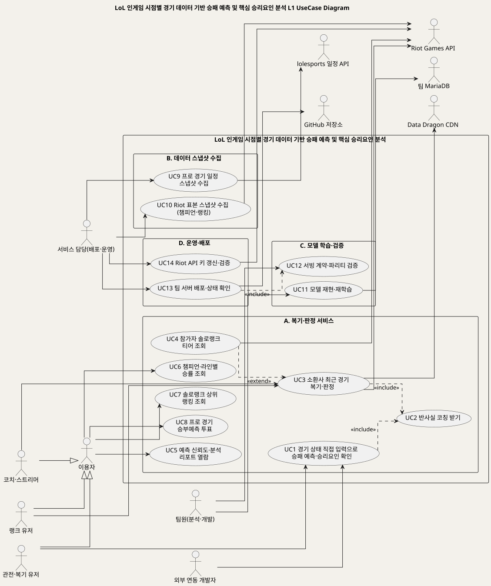
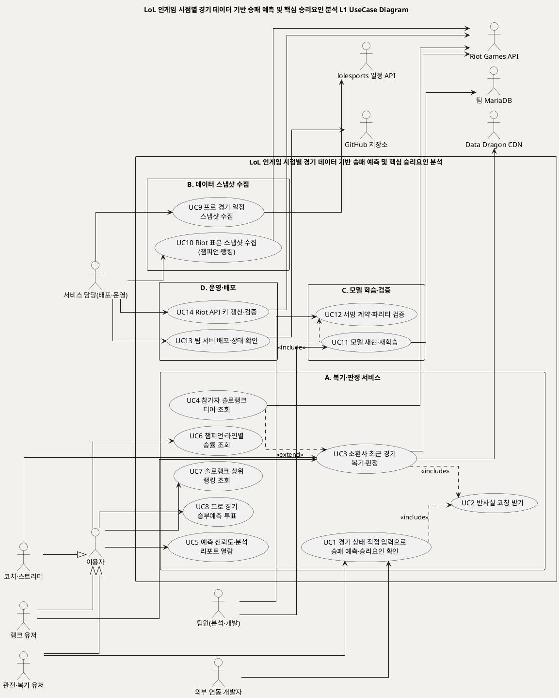
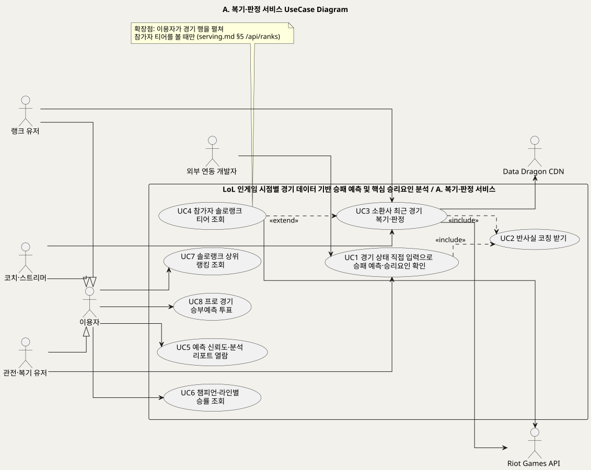
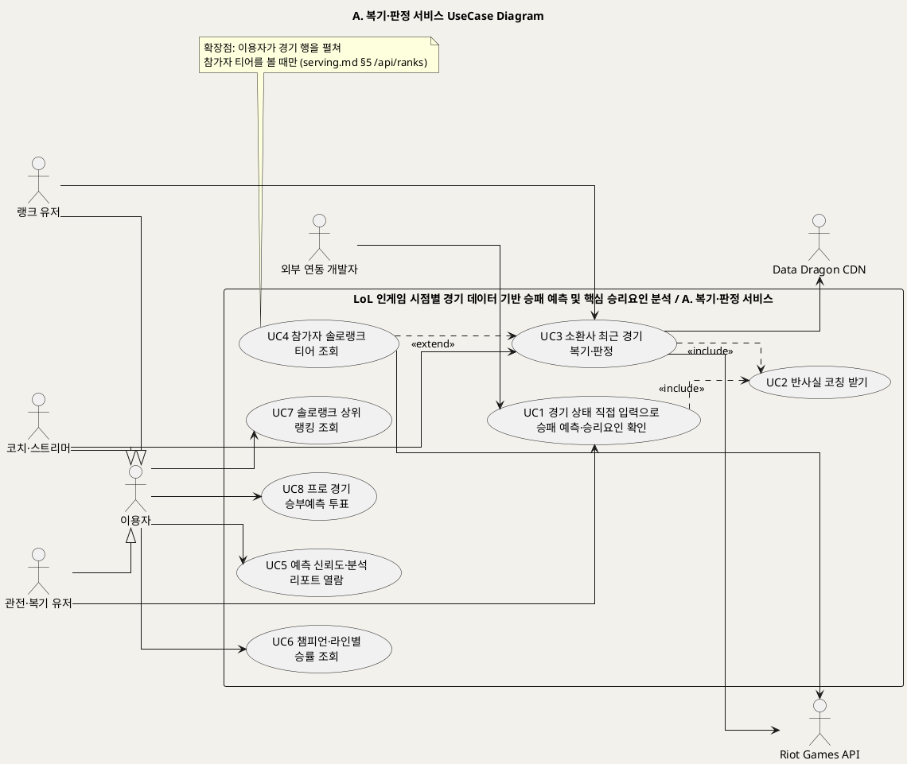
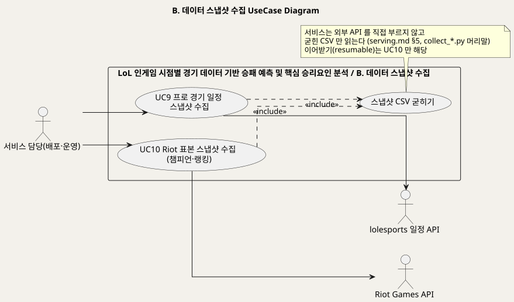
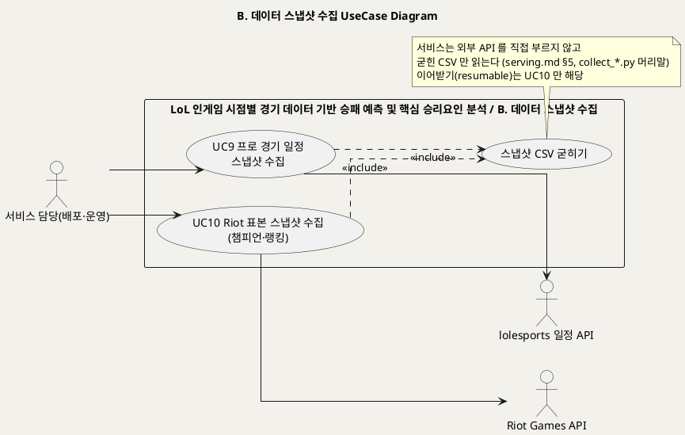
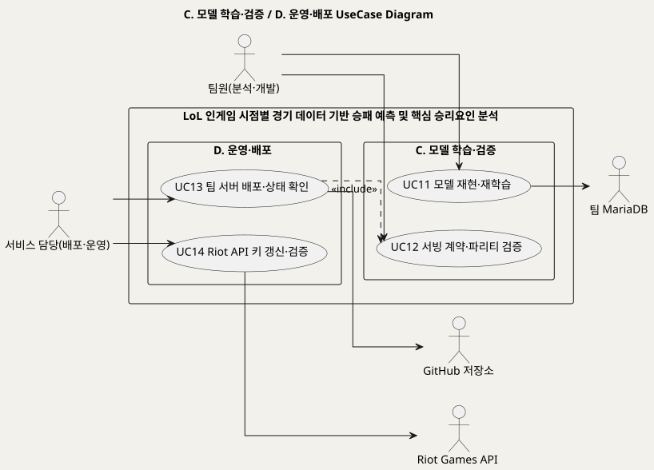
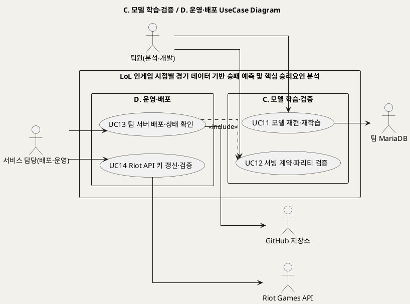

<!-- ─────────────────────────────────────────────
  유스케이스 개요 — 시스템 전체를 액터의 목표 단위로 조감한다.
  왜 필요한가: 개별 UC 명세(UC_01~UC_14)를 전개하기 전 목록·액터·경계를 먼저 합의하기 위한 작업 지시서.
  주로 보는 사람: 팀원(설계·구현) · Claude(검수)
  ───────────────────────────────────────────── -->

# LoL 인게임 시점별 경기 데이터 기반 승패 예측 및 핵심 승리요인 분석 UseCase 개요
**LoL 인게임 시점별 경기 데이터 기반 승패 예측 및 핵심 승리요인 분석 · UC_00 · UML 2.5.1 표준 (L1 UseCase Diagram + 유스케이스 목록 + Actor 카탈로그)**

---

> **문서 식별**: `docs/usecases/UC_00_개요_LoL승패예측및핵심승리요인분석.md`
> **작성일**: 2026-09-07 · **표준**: UML 2.5.1 (OMG)
> **원천(SoT)**: `docs/spec.md` · `docs/plan.md` · `docs/product.md` · `docs/serving.md` · `docs/deploy.md` · `docs/TEAM_WORKFLOW.md` · `docs/riot-api-application.md` · `model_card.md` · `web/app.py` · `web/frontend.py` · `web/templates/index.html` · `src/riot_api.py` · `src/collect_*.py` · `scripts/run_collectors.sh` · `CLAUDE.md` — 구현 완료 상태의 저장소 문서·코드
> **다이어그램**: 모든 PlantUML 소스는 로컬 Kroki 에서 렌더 검증 완료(HTTP 200). 렌더 결과는 `diagrams/*.svg` 로 저장소에 함께 두어 GitHub·에디터에서 로그인 없이 보인다. 뷰어 링크는 사내 서버라 SSO 로그인이 필요하다.
> **단계**: 3단계 완료 — 개요(본 문서) + 개별 UC 문서 14건. 처음 읽는 사람은 [유스케이스_쉬운설명.md](유스케이스_쉬운설명.md) 부터 본다.
> **프로세스 모델**: UC 를 가로지르는 업무 순서와 UC별 액티비티는 [BP_00_비즈니스프로세스_액티비티다이어그램.md](BP_00_비즈니스프로세스_액티비티다이어그램.md) 에 있고, 같은 흐름을 BPMN 2.0 으로 그린 것은 [BP_01_비즈니스프로세스_BPMN.md](BP_01_비즈니스프로세스_BPMN.md) 에 있다.
> **데이터 저장 구조**: 위 프로세스·화면이 쓰는 값이 어느 표·컬럼에 놓이는지(ERD 4장 · 표준 SQL DDL)는 [DB_00_데이터베이스구조설계.md](DB_00_데이터베이스구조설계.md) 에 있다.
> **화면목록**: UI/UX 설계 기준 화면 ID·상태·규칙은 [UI_00_화면목록.md](UI_00_화면목록.md) 에 있다.

---

## 목차

1. [시스템 목적·개요](#1-시스템-목적개요)
2. [주요 기능](#2-주요-기능)
3. [유스케이스 목록](#3-유스케이스-목록)
4. [Actor 카탈로그](#4-actor-카탈로그)
5. [L1 UseCase Diagram](#5-l1-usecase-diagram)
6. [시스템 경계 (하지 않는 것)](#6-시스템-경계-하지-않는-것)
7. [생성 결과](#7-생성-결과)
8. [결론](#8-결론)

---

## 1. 시스템 목적·개요

LoL 인게임 시점별 경기 데이터 기반 승패 예측 및 핵심 승리요인 분석 는 리그 오브 레전드 경기의 **10분 시점 상태(블루−레드 차이 피처 13개)** 만으로 최종 승패를 예측하고,
**왜 그렇게 판단했는지**(승리요인)와 **믿어도 되는지**(구간별 신뢰도), **그래서 무엇을 했어야 했는지**(반사실 코칭)까지
돌려주는 경기 후 복기 서비스다. (근거: `docs/spec.md` §1, `README.md` "무엇을 만들었나")

기존 전적 사이트가 "무슨 일이 있었나"를 보여준다면, 이 서비스는 10분 시점 모델을 근거로 **"언제 갈렸나"** 를 말한다.
10분 유불리와 실제 결과를 교차한 네 가지 판정(우세승·역전승·열세패·역전패)이 서비스의 존재 이유이며,
모든 기능은 이 "10분 시점 판정"에서 파생돼야 한다는 원칙을 둔다. (근거: `docs/product.md` §1·§3, `docs/serving.md` §6)

| 항목 | 값 | 근거 |
|---|---|---|
| 대상 시스템 | LoL 인게임 시점별 경기 데이터 기반 승패 예측 및 핵심 승리요인 분석 (공개 서비스 https://p4.sumzip.com) | `docs/deploy.md` |
| 문제 유형 | 지도학습 이진분류 (무승부 없음), 로지스틱 회귀 Pipeline | `docs/spec.md` §1, `docs/plan.md` §1 |
| 입력 | 10분 시점 차이 피처 13개 (수동 입력 또는 Riot 타임라인에서 변환) | `docs/serving.md` §2, `src/riot_api.py` `timeline_to_diff13` |
| 출력 | 승리 확률 · 예측 클래스 · 승리요인 상위 5개 · 경고 · 판정 · 코칭 | `docs/serving.md` §3·§5 |
| 구현 구조 | 브라우저 → 프런트(9504, 화면·중계) → 백엔드(9524, 예측 API) → `lolwin.predict` → `artifacts/model.joblib` | `docs/serving.md` §6 |
| 프로젝트 성격 | 4인 학생 팀 · 비영리 교육 프로젝트 | `docs/riot-api-application.md`, `docs/TEAM_WORKFLOW.md` |

### 원천 구조 선판정

원천은 단일 캔버스가 아니라 **구현 완료된 저장소의 문서·코드 묶음**이다. 한 시스템 안에 주체와 시기가 다른 네 갈래 업무가 함께 있어
하나로 뭉개지 않고 **패키지 A~D 로 분리**하고, 유스케이스 목록에 **단계(패키지) 열**을 두었다.

| 패키지 | 업무 | 주체 | 근거 |
|---|---|---|---|
| A. 복기·판정 서비스 | 웹 화면과 API 로 이용자가 쓰는 기능 | 이용자 · 외부 연동 개발자 | `web/app.py`, `web/templates/index.html`, `docs/serving.md` |
| B. 데이터 스냅샷 수집 | 외부 API 를 배치로 받아 CSV 로 굳히는 수집기 | 서비스 담당 | `scripts/run_collectors.sh`, `src/collect_*.py` |
| C. 모델 학습·검증 | 모델 재현·재학습과 서빙 계약 검증 | 팀원(분석·개발) | `docs/spec.md` §2·§4, `docs/plan.md` §3, `CLAUDE.md` |
| D. 운영·배포 | 팀 서버 배포·상태 확인·API 키 갱신 | 서비스 담당 | `docs/deploy.md` |

---

## 2. 주요 기능

| 기능 | 내용 | 상태 | 근거 |
|---|---|---|---|
| 승패 예측·승리요인 | 13개 피처 입력 → 승리 확률 + 예측 클래스 + 승리요인 5개(방향·크기). 학습 범위 밖 값은 막지 않고 `warnings` 로 알린다 | 구현 완료 | `docs/spec.md` FR-1·FR-2·FR-9, `docs/serving.md` §2~§4 |
| 반사실 코칭 | 모델을 거꾸로 돌려 "무엇을 했다면 승률이 얼마" 를 상승폭 큰 순으로 제시. 지표를 올릴 때 따라오는 골드도 함께 올린다 | 구현 완료 | `docs/product.md` §0 ③, `docs/serving.md` §6 `/api/coach`, `lolwin/coach.py` |
| 소환사 최근 경기 복기·판정 | Riot ID 로 최근 솔로랭크 경기를 10분 시점에서 복기. 경기마다 판정(우세승·역전승·역전패·열세패)·구간·승리요인·골드차 궤적·플레이 성향, 전체 요약(판정별 건수·레이더·라인 기준선) | 구현 완료 (Riot API 키 필요) | `docs/serving.md` §5·§6 `/api/summoner`, `src/riot_api.py` `analyze_recent`, `docs/product.md` F5·F6 |
| 참가자 티어 조회 | 경기 행을 펼칠 때만 참가자 puuid 의 솔로랭크 티어를 조회 | 구현 완료 | `docs/serving.md` §5 `/api/ranks` |
| 예측 신뢰도·분석 리포트 | 골드차 구간별 정확도·승리요인·10분 vs 15분 비교·경기 유형 프로파일 | 구현 완료 | `docs/spec.md` FR-4·FR-5·FR-7, `docs/serving.md` §5 `/api/report`·`/api/match-types` |
| 챔피언·라인별 승률 | 마스터 이상 솔로랭크 관찰 승률표 + 챔피언별 잘하는 유저. 모델 예측이 아님 | 구현 완료 (수집 스냅샷 기반) | `docs/serving.md` §5 `/api/champions`, `src/collect_champion_stats.py` |
| 유저 랭킹 | 솔로랭크 상위 1,000명, 페이지 조회 | 구현 완료 (수집 스냅샷 기반) | `docs/serving.md` §5 `/api/ranking`, `src/collect_ranking.py` |
| 프로 경기 승부예측 투표 | 예정 프로 경기 목록 + 투표 집계. 돈이 오가지 않고 모델은 개입하지 않는다 | 구현 완료 | `docs/serving.md` §5 `/api/schedule`·`/api/vote`, "승부예측 투표의 경계" |
| 스냅샷 수집기 | 일정·챔피언·랭킹을 배치로 받아 CSV 로 굳힘. 이어받기(resumable)·라이브 예산 양보 | 구현 완료 | `scripts/run_collectors.sh`, `src/collect_*.py` |
| 모델 재현·재학습 | 재현성 규약 8항목 아래 학습·산출물 6종 생성. 관측 시점을 인자(`TIME_POINT`)로 받는다 | 구현 완료 | `docs/spec.md` FR-6·§4, `docs/plan.md` §3, `docs/REPRODUCE.md` |
| 서빙 계약·파리티 검증 | 직접 호출·백엔드·프런트 세 경로의 확률 일치, 출력 형식·에러 규약, 골든 정답지, 문서 수치 대조 | 구현 완료 | `docs/serving.md` §7, `CLAUDE.md`, `tests/` |
| 팀 서버 배포·운영 | `check_project.sh` 로 pull → 재시작 → 파리티·스모크, 상태·로그 확인 | 구현 완료 | `docs/deploy.md` |
| Riot API 키 갱신·검증 | 개발용 키는 24시간마다 만료. 기동 시 `key_works()` 로 실제 통하는지 확인해 `riot_ready` 로 화면을 가른다 | 구현 완료 | `docs/deploy.md`, `src/riot_api.py` `key_works`, `web/templates/index.html` |
| 챔피언별 리드 전환율 (F7) | 판정을 챔피언별로 집계 — 스노우볼형·후반 캐리형 | 미착수 (검토만) | `docs/product.md` §5 |
| 분 단위 시점 조건부 승률 곡선 | 10분·15분 두 점 비교를 분 단위 곡선으로 일반화 | 구상만 (미확정) | `docs/spec.md` §7, `docs/plan.md` §7 |

---

## 3. 유스케이스 목록

액터의 **목표** 단위로 도출했다. 화면·버튼·엔드포인트는 UC 의 기본흐름·시퀀스로 내린다.
미착수·구상 단계 기능(F7, 시점 곡선)은 원천이 "확정 요구사항이 아니다"라고 명시하므로 **목록에서 제외**하고 §8 미해결 사항에 둔다.

| UC ID | 단계 | 유스케이스명 | 주액터 | 보조액터 | 우선순위 | 원천 근거 | 문서 | 상태 |
|:--:|:--:|---|---|---|:--:|---|---|:--:|
| UC1 | A | 경기 상태 직접 입력으로 승패 예측·승리요인 확인 | 관전·복기 유저 · 외부 연동 개발자 | — | High | `docs/spec.md` FR-1·FR-2·FR-8·FR-9 · `docs/serving.md` §1~§4 · `index.html` `runManual` · `/api/predict`·`/api/predict/batch`·`/api/schema`·`/api/examples` | `UC_01_경기상태입력승패예측.md` | 완료 |
| UC2 | A | 반사실 코칭 받기 (UC1·UC3 «include») | 이용자 | — | High | `docs/product.md` §0 ③·§1 "지시" · `docs/serving.md` §5·§6 `/api/coach` · `lolwin/coach.py` · `tests/test_coach.py` · `model_card.md` 금지 7 | `UC_02_반사실코칭.md` | 완료 |
| UC3 | A | 소환사 최근 경기 복기·판정 | 랭크 유저 · 코치·스트리머 | Riot Games API · Data Dragon CDN | High | `docs/product.md` §1·§2·§3 F5·F6 · `docs/serving.md` §5·§6 `/api/summoner` · `src/riot_api.py` `analyze_recent`·`verdict_of` · `docs/riot-api-application.md` "WHICH APIS WE USE" | `UC_03_소환사최근경기복기판정.md` | 완료 |
| UC4 | A | 참가자 솔로랭크 티어 조회 (UC3 «extend») | 랭크 유저 · 코치·스트리머 | Riot Games API | Low | `docs/serving.md` §5 `/api/ranks` "행을 펼칠 때만" · `web/app.py` `api_ranks` · `src/riot_api.py` `get_rank` | `UC_04_참가자티어조회.md` | 완료 |
| UC5 | A | 예측 신뢰도·분석 리포트 열람 | 이용자 | — | Medium | `docs/spec.md` FR-4·FR-5·FR-7·SC-4 · `docs/product.md` F2 · `docs/serving.md` §5 `/api/report`·`/api/match-types` · `index.html` "이 판정을 믿어도 되나" | `UC_05_신뢰도리포트열람.md` | 완료 |
| UC6 | A | 챔피언·라인별 승률 조회 | 이용자 | — | Medium | `docs/serving.md` §5 `/api/champions` · `src/collect_champion_stats.py` · `index.html` 탭 "최근 챔피언 승률" | `UC_06_챔피언라인별승률조회.md` | 완료 |
| UC7 | A | 솔로랭크 상위 랭킹 조회 | 이용자 | — | Low | `docs/serving.md` §5 `/api/ranking` · `src/collect_ranking.py` · `index.html` 탭 "유저 랭킹" | `UC_07_상위랭킹조회.md` | 완료 |
| UC8 | A | 프로 경기 승부예측 투표 | 이용자 | — | Medium | `docs/serving.md` §5 `/api/schedule`·`/api/vote` · "승부예측 투표의 경계" · `web/app.py` `api_vote`(시작한 경기 409) · `index.html` 탭 "승부예측" | `UC_08_승부예측투표.md` | 완료 |
| UC9 | B | 프로 경기 일정 스냅샷 수집 | 서비스 담당(배포·운영) | lolesports 일정 API | Medium | `src/collect_schedule.py` 머리말 · `scripts/run_collectors.sh` · `docs/serving.md` "일정 출처" | `UC_09_경기일정스냅샷수집.md` | 완료 |
| UC10 | B | Riot 표본 스냅샷 수집 (챔피언·랭킹) | 서비스 담당(배포·운영) | Riot Games API | Medium | `src/collect_champion_stats.py`·`src/collect_ranking.py` 머리말 · `scripts/run_collectors.sh` (예산 양보 RESERVE) · `docs/product.md` §5 "이어서 받는 수집기" | `UC_10_Riot표본스냅샷수집.md` | 완료 |
| UC11 | C | 모델 재현·재학습 | 팀원(분석·개발) | 팀 MariaDB | Medium | `docs/spec.md` §2 "팀원" · FR-6 · §4 재현성 규약 · `docs/plan.md` §2·§3 · `docs/REPRODUCE.md` · `CLAUDE.md` "피처를 바꿀 때" | `UC_11_모델재현재학습.md` | 완료 |
| UC12 | C | 서빙 계약·파리티 검증 (UC13 «include») | 팀원(분석·개발) · 서비스 담당 | — | High | `docs/spec.md` §4 "서빙 파리티" · `docs/serving.md` §7 · `CLAUDE.md` "무엇을 고치든 통과해야 하는 것" · `tests/test_contract.py`·`test_regression.py`·`web/test_parity.py`·`src/factcheck.py` | `UC_12_서빙계약파리티검증.md` | 완료 |
| UC13 | D | 팀 서버 배포·상태 확인 | 서비스 담당(배포·운영) | GitHub 저장소 | High | `docs/deploy.md` "매일 / 누가 push 한 뒤"·"안 될 때" · `docs/TEAM_WORKFLOW.md` "팀 서버에 반영하기" · `check_project.sh` | `UC_13_팀서버배포상태확인.md` | 완료 |
| UC14 | D | Riot API 키 갱신·검증 | 서비스 담당(배포·운영) | Riot Games API | High | `docs/deploy.md` "Riot API 키" · `src/riot_api.py` `key_works` · `docs/riot-api-application.md` "기다리는 동안" · `index.html` `riot_ready` | `UC_14_RiotAPI키갱신검증.md` | 완료 |

### 포함·확장 판정

| 관계 | 기준 UC | 대상 UC | 근거 |
|---|---|---|---|
| «include» | UC1 | UC2 | 수동 입력 실행 시 `/api/predict` 와 `/api/coach` 를 **항상 함께** 호출한다 (`index.html` `runManual`, 버튼 "판정 + 코칭") |
| «include» | UC3 | UC2 | 소환사 복기 결과에서 경기 행을 펼치면 그 판의 `verdict` 를 붙여 `/api/coach` 를 **항상** 부른다 (`index.html` `toggleDetail`). 펼치기 전에는 호출하지 않는다 |
| «extend» | UC4 → UC3 | | 티어 조회는 **경기 행을 펼칠 때만** 발생한다. 기본 응답에 넣으면 판마다 최대 10콜이라 분리했다 (`docs/serving.md` §5 `/api/ranks`) |
| «include» | UC13 | UC12 | `check_project.sh deploy` 가 재시작 뒤 **항상** 파리티·스모크를 돌린다 (`docs/deploy.md`) |
| «include» | UC9·UC10 | 스냅샷 CSV 굳히기 | 수집기는 결과를 `reports/tables/*.csv` 로 굳히고 서비스는 그 파일만 읽는다 (`src/collect_*.py` 머리말). 이어받기(resumable)는 챔피언·랭킹 수집(UC10)만 해당하고, 일정 수집(UC9)은 매번 통째로 덮어쓴다 (`collect_schedule.py`) |

### 우선순위 근거

- **High** — 서비스의 존재 이유(판정·코칭·예측)와 그것이 발표 순간까지 살아 있게 하는 것(파리티 검증·배포·키). `docs/product.md` §0·§1, `docs/TEAM_WORKFLOW.md` "남은 일".
- **Medium** — 뿌리(10분 판정)를 보강하거나 탭으로 제공되는 부가 기능. `docs/product.md` §3 표.
- **Low** — 조건부 확장(UC4)과 스냅샷만 읽는 조회(UC7).

---

## 4. Actor 카탈로그

### Primary Actor (사람 — 시스템을 써서 목표를 달성한다)

| 액터 | 설명 | 관련 UC | 근거 |
|---|---|---|---|
| 이용자 (추상) | 공개 서비스를 쓰는 모든 사람의 일반화. 아래 세 액터의 공통 목표(신뢰도·챔피언·랭킹·투표)를 담는다 | UC5~UC8 | [추론] 세 이용자 유형이 같은 탭을 공유하므로 일반화로 묶음 |
| 랭크 유저 | 1차 타겟. "왜 지는지 모르겠다" — 자기 최근 판의 판정(역전패 n판 등)으로 원인을 가린다 | UC3, UC4 | `docs/product.md` §2 "1차" |
| 관전·복기 유저 | 중계를 보며 "어느 팀이 왜 유리한지" 알고 싶거나, 진 경기에서 무엇부터 고칠지 우선순위를 원한다. 13개 수치를 직접 넣는다 | UC1 | `docs/spec.md` §2 "관전 입문자"·"복기하는 유저" |
| 코치·스트리머 | 2차 타겟. 제자·시청자의 최근 판을 넣어 약점 유형을 한 줄로 본다 | UC3, UC4 | `docs/product.md` §2 "2차" |
| 외부 연동 개발자 | 화면 없이 `POST /api/predict` 등 API 만 쓰는 쪽. 응답의 `how_to_read` 로 같은 해석 선을 지킨다 | UC1 | `docs/serving.md` §1 "외부 연동", §6 "화면 없이 API 만 쓰는 쪽" |
| 팀원(분석·개발) | 모델을 이어받아 재현·확장하고, 무엇을 고치든 검증을 통과시킨다 | UC11, UC12 | `docs/spec.md` §2 "팀원(개발자)", `docs/TEAM_WORKFLOW.md` 역할 배치, `CLAUDE.md` |
| 서비스 담당(배포·운영) | 팀 서버에 올리고 상태를 보고, 키를 갱신하고, 수집기를 돌린다 | UC9, UC10, UC12, UC13, UC14 | `docs/deploy.md`, `docs/TEAM_WORKFLOW.md` "웹·서버·배포". [추론] 수집기 실행 주체는 원천에 명시되지 않아 서비스 담당으로 둠 — 확인 필요 |

### Secondary Actor (외부 시스템 — 시스템이 목표를 위해 호출한다)

| 액터 | 설명 | 관련 UC | 근거 |
|---|---|---|---|
| Riot Games API | account-v1(Riot ID → puuid) · match-v5(경기 목록·상세·타임라인) · league-v4(티어) · lol-status-v4(키 확인). 100회/120초 예산을 라이브와 수집기가 나눠 쓴다 | UC3, UC4, UC10, UC14 | `docs/riot-api-application.md` "WHICH APIS WE USE", `src/riot_api.py`, `src/collect_ranking.py` 머리말 |
| Data Dragon CDN | 챔피언 이미지 출처 (공식 CDN) | UC3 | `docs/riot-api-application.md` "DATA HANDLING" |
| lolesports 일정 API | 프로 경기 일정. 공식 개발자 API 가 아닌 비공식 경로라 서비스가 직접 부르지 않고 수집기만 부른다 | UC9 | `src/collect_schedule.py` 머리말, `docs/serving.md` "승부예측 투표의 경계" |
| 팀 MariaDB | 피처셋 4종(diff13·clean27·gold2·cluster5)을 정의한 SQL 뷰가 피처 정의의 정본. 학습 시 사용, 접속 정보가 없으면 CSV 폴백 | UC11 | `docs/plan.md` §2 Storage, `CLAUDE.md` "피처를 바꿀 때" |
| GitHub 저장소 (`team` 브랜치) | 배포 시 `git pull` 원천 | UC13 | `docs/deploy.md`, `docs/TEAM_WORKFLOW.md` 브랜치 규칙 |

### 환경 요소 (액터가 아님 — 시스템 경계 안 또는 전달 경로)

| 요소 | 설명 | 근거 |
|---|---|---|
| 수업 서버 프록시 (p4.sumzip.com) | 외부 요청을 팀 서버 프런트 9504 로 넘긴다. 목표를 갖지 않으므로 액터로 두지 않는다 | `docs/deploy.md` |
| `artifacts/model.joblib` · `schema.json` | 학습된 Pipeline 과 허용 범위. 시스템 내부 자산 | `docs/serving.md` §6 |
| `db/votes.sqlite3` · `reports/tables/*.csv` | 투표 저장소와 수집 스냅샷. 시스템 내부 저장소 | `web/app.py` `_vote_db`·`_csv` |

---

## 5. L1 UseCase Diagram

전체 조감도 한 장과, 읽기 쉽도록 패키지별 상세 세 장을 둔다. 다섯 장 모두 같은 UC·액터 집합이다.

### 5.1 전체 조감 (L1)

PlantUML 소스 보기

소스를 직접 렌더하려면 **[「LoL 인게임 시점별 경기 데이터 기반 승패 예측 및 핵심 승리요인 분석 L1 UseCase Diagram」 PlantUML 뷰어로 열기](https://plantuml.sumzip.com/plantuml/svg/eNq1Vt9PG0cQfr-_YuQ-FB5KsTG_qggl2CStRNsoUfqEFF3sizlh7tDdQUBtJANOhbAjQDKpTWzLVEBo5EgXMNhI5oU_xzv3P3R2786cDX0sL77ZmW_m29lvZ3loWrJhLS-mYTnxUl9RjBVVefMyraeVVclcULUl2ZAX4ZWcWEgZ-rKWjOlp3YBvHo88Ds9MByLMeTmpv1G1FLyW06YS8CwRVk4pz621tAKGkrBkLZUOBqRVTbHWlhTQDWteDzg0PamYyhKEI4FFQ9YW-GJ0WEorry2wdDDU1LwFSZUnV3VNslSLSs3qs4CVVucsj9UsYK6MtV12noXO2XWnZQN7b2Ol4WRtIIvZRcDtKyd_CljcwtYhMHsHnP0LzNW5g53U8aBA2YBdZjFbgdkwvDCVmGwqEFflFBGTpG_hO_qDp4a6KBtrICcs3TBhAEtt_Hw9KJySWIRQp5HBWvamyc4vOBcs17CWCYFswm_UfsXw41j1i7NeD_qf0fZv_XhdwKviTRO3j5ztFrFkpy0RFtPlxHw3qtLAg3-wuitcxPsWX2qxywzgXzbbKUHHLjO77MfNrFpxZaUbmS2zqyzVAZZrsNzVALNtZ6dOpQ8aWFwfFJBfl0w_3sln8OPugNuum6ab2o3iWaWuECD0fx5UCH6XwJcghB4Ngdvym6aT38XaPnT35UYCLJtKgh9r6EUs7FPAzXVnswz4aR1re4DVd6x2jOU2OyzPaT1s-EkEODilffpxux4L96ePEPcibtQxdwTiIL_Qwkeq5wEi_YARwD_zToljAC_KnWbbIzin9e7KSzDSnyAKaLc6doaOmFIViL8rsDnNydn4oQF4aDsHeQ8e7YeP-j3HXI39TZLhChZtJgIndZIDiZDE1GBVP8dof44xwK8Fp9DGDy0CV9rUHzpr0UZ2XOslMNYPHu9hzY8Fy4Tl5sZVL3a8HzsBTiFL2G7LeMXLjLcjZ6vu7JU97ARh3wZlMz0UUCFphW2-w80m4FYRP-3dI5zJ3lqk7jadCi_ZDxX1Ju8IbxieqboFRImdt-5UnNMGgk0Uux_0VTbcTz5G5D-fsvckx_0Sbl_QZTzL4EnlPsGH_VCs1p0iHS__FSg__R0VhyPuHaLxcZ7F_WuuwTxXQ44urFfIhUb6mcWHwJ0etAkxTe6jNAI0SkSJsyx0h457IXvv1x25h6NuGx89_QmcjSOab19Jubf7d2FRQettd34_VxK6luyZ4MUjdty6M8RF7ifyomLyCu50piXfHZctGeKGnNI1iMV_cUefa_sh_Jk1l-jZMz2JdBPNuMuBaQo_y4Yqx6eF2_v23U9U68flV0BvBFaPaUaIGHeRbwv3D4VwK20aOE6pILmPCG3mjyn3OXBfncCCeD8CNmXx3zV6LDpn9i1kSsw297Xomt0KU2IO-elci2f0jNGgMRY0xoPGhERPi_c9GfgmtQeMkaARlQJ8wkEjwnejaon0clKB70FZtRQtKfFxPzTEAyLwAzx44AVMTUl88P6XJ-p5RoTHTSUcYR8T7gdR8VuJec3kCTg7oR_f8MXCqwScNByCVo9vUhi-eMSF5gu-XAQtvuBp4yGxpX_9pH8BaOBT2Q==)** (사내 서버, SSO 로그인 필요) 또는 [로컬 Kroki 로 열기](http://192.168.0.91:8889/plantuml/svg/eNq1Vt9PG0cQfr-_YuQ-FB5KsTG_qggl2CStRNsoUfqEFF3sizlh7tDdQUBtJANOhbAjQDKpTWzLVEBo5EgXMNhI5oU_xzv3P3R2786cDX0sL77ZmW_m29lvZ3loWrJhLS-mYTnxUl9RjBVVefMyraeVVclcULUl2ZAX4ZWcWEgZ-rKWjOlp3YBvHo88Ds9MByLMeTmpv1G1FLyW06YS8CwRVk4pz621tAKGkrBkLZUOBqRVTbHWlhTQDWteDzg0PamYyhKEI4FFQ9YW-GJ0WEorry2wdDDU1LwFSZUnV3VNslSLSs3qs4CVVucsj9UsYK6MtV12noXO2XWnZQN7b2Ol4WRtIIvZRcDtKyd_CljcwtYhMHsHnP0LzNW5g53U8aBA2YBdZjFbgdkwvDCVmGwqEFflFBGTpG_hO_qDp4a6KBtrICcs3TBhAEtt_Hw9KJySWIRQp5HBWvamyc4vOBcs17CWCYFswm_UfsXw41j1i7NeD_qf0fZv_XhdwKviTRO3j5ztFrFkpy0RFtPlxHw3qtLAg3-wuitcxPsWX2qxywzgXzbbKUHHLjO77MfNrFpxZaUbmS2zqyzVAZZrsNzVALNtZ6dOpQ8aWFwfFJBfl0w_3sln8OPugNuum6ab2o3iWaWuECD0fx5UCH6XwJcghB4Ngdvym6aT38XaPnT35UYCLJtKgh9r6EUs7FPAzXVnswz4aR1re4DVd6x2jOU2OyzPaT1s-EkEODilffpxux4L96ePEPcibtQxdwTiIL_Qwkeq5wEi_YARwD_zToljAC_KnWbbIzin9e7KSzDSnyAKaLc6doaOmFIViL8rsDnNydn4oQF4aDsHeQ8e7YeP-j3HXI39TZLhChZtJgIndZIDiZDE1GBVP8dof44xwK8Fp9DGDy0CV9rUHzpr0UZ2XOslMNYPHu9hzY8Fy4Tl5sZVL3a8HzsBTiFL2G7LeMXLjLcjZ6vu7JU97ARh3wZlMz0UUCFphW2-w80m4FYRP-3dI5zJ3lqk7jadCi_ZDxX1Ju8IbxieqboFRImdt-5UnNMGgk0Uux_0VTbcTz5G5D-fsvckx_0Sbl_QZTzL4EnlPsGH_VCs1p0iHS__FSg__R0VhyPuHaLxcZ7F_WuuwTxXQ44urFfIhUb6mcWHwJ0etAkxTe6jNAI0SkSJsyx0h457IXvv1x25h6NuGx89_QmcjSOab19Jubf7d2FRQettd34_VxK6luyZ4MUjdty6M8RF7ifyomLyCu50piXfHZctGeKGnNI1iMV_cUefa_sh_Jk1l-jZMz2JdBPNuMuBaQo_y4Yqx6eF2_v23U9U68flV0BvBFaPaUaIGHeRbwv3D4VwK20aOE6pILmPCG3mjyn3OXBfncCCeD8CNmXx3zV6LDpn9i1kSsw297Xomt0KU2IO-elci2f0jNGgMRY0xoPGhERPi_c9GfgmtQeMkaARlQJ8wkEjwnejaon0clKB70FZtRQtKfFxPzTEAyLwAzx44AVMTUl88P6XJ-p5RoTHTSUcYR8T7gdR8VuJec3kCTg7oR_f8MXCqwScNByCVo9vUhi-eMSF5gu-XAQtvuBp4yGxpX_9pH8BaOBT2Q==) (내부망 전용). 위 그림 파일은 로그인 없이 보인다.

#### 다이어그램 쉽게 읽기 (유저 관점)

1. **누가 쓰나** — 왼쪽의 사람 모양이 이 시스템을 쓰는 사람이다. 게임을 하는 사람, 경기를 구경하는 사람, 남을 가르치는 사람은 모두 "이용자"의 한 종류라서 속이 빈 화살표로 이용자에 묶여 있다. 팀원과 서비스 담당은 시스템을 만들고 돌보는 사람이다.
2. **무슨 순서로** — 이용자가 자기 게임 이름을 넣으면 시스템이 Riot 회사 창구에서 최근 경기를 받아 와, 10분 시점으로 되감아 "이기고 있었나, 결국 이겼나"를 판정한다(UC3). 경기 하나를 펼치면 "그때 이렇게 했으면 얼마나 유리했을까"라는 코칭(UC2)이 붙는다. 숫자를 직접 넣는 쪽(UC1)도 결과와 코칭이 함께 나온다.
3. **«include» = 항상 함께** — 점선 화살표에 include 가 붙어 있으면 "이 일을 하면 저 일도 반드시 같이 된다"는 뜻이다. 결과 보기(UC1·UC3) 뒤에는 코칭(UC2)이 따라오고, 새 버전 올리기(UC13)는 반드시 검사(UC12)를 거친다.
4. **«extend» = 특별한 때만** — 점선 화살표에 extend 가 붙어 있으면 "특별한 때만 덧붙는다"는 뜻이다. 같이 한 사람들의 등급 보기(UC4)는 이용자가 경기 한 판을 펼쳤을 때만 일어난다. 매번 다 물어보면 Riot 창구가 "너무 많이 묻는다"고 하기 때문이다.
5. **Generalization(속이 빈 세모 화살표)** — "게임을 하는 사람도 이용자다"처럼 종류 관계다. 이용자에 연결된 일(UC5~UC8)은 세 종류 사람이 모두 할 수 있다.
6. **오른쪽 사람 모양(바깥 친구들)** — 시스템 밖에서 자료를 주는 곳이다. Riot 회사 창구는 경기 조회(UC3·UC4), 밤에 자료 모으기(UC10), 열쇠 확인(UC14) 세 군데서 쓰이므로 한 번에 물어볼 수 있는 양을 나눠 쓴다.

#### 표준 기호 범례

| 기호 | 의미 | UML 2.5.1 |
|---|---|---|
| 사람 모양 (actor) | 시스템 밖에서 상호작용하는 역할. 사람·외부 시스템 모두 | Actor |
| 타원 (usecase) | 액터가 달성하는 목표 단위 행위 | UseCase |
| 큰 사각형 (rectangle) | 시스템 책임 경계. 안은 우리가 만든 것, 밖은 남의 것 | Subject (System Boundary) |
| 안쪽 사각형 (package) | 업무 갈래. 같은 시스템 안의 분류이지 별도 시스템이 아니다 | Package |
| 실선 화살표 | 액터가 UC 에 참여함(왼쪽 → 시작하는 쪽, UC → 오른쪽은 시스템이 부르는 쪽) | Association |
| 점선 화살표 «include» | 기준 UC 가 항상 포함하는 필수 하위행위 | Include |
| 점선 화살표 «extend» | 조건부로만 일어나는 확장 행위. 확장점 조건을 note 로 표기 | Extend |
| 속 빈 삼각 화살표 ◁ | 일반화. 자식은 부모의 연결을 모두 물려받는다 | Generalization |

### 5.2 A. 복기·판정 서비스

PlantUML 소스 보기

소스를 직접 렌더하려면 **[「A. 복기·판정 서비스」 PlantUML 뷰어로 열기](https://plantuml.sumzip.com/plantuml/svg/eNp9VFtrG1cQft9fMagv7UNsfDchiKRSUgqhlJT0yRBOpGN5sbQrdo9yoS3IyTYkllo7ILu2uxLrEscpKLCNbzIoL_45OnP-Q-fsauXdh_ZhWb4z883M-Wbm3HYFc0SjVoVG6VF9vfKIGe66adWZw2rwmJXWK47dsMoFu2o78MW9uXszd79OebhrrGw_Na0KrLKqy1OWOnFZhf8gnlc5OLwkmFWpph2qpsXF8zoH2xFrtlHlqwKEDY5ZWRNQNjXFtC1DmIIC3JkCeXI2GoRXF6q9jcEOoOfLSw8338FDlxeYy6FosgoFNgxWElRsbnTaxMC7uoiJgH6AQTMHzIUfTf6UO4mf7H1UG_20_QGz1q_t-LmDl3tXF5RLbQ7k-778MIjcCjYrrU28uqd48Df2tiMT1XTN3x_I8ybgH6Hc2odR6MvQT_zuPhNF_sQwJgJB7r59H7A7GH1qY88DbPkYbMsTD0afPutryN9CSqW8EAjJcA9w81K1PwDuvcbBIchwC9TOGbb62kDF4kGHooE899DrwvT_KZmDnwyAhstLWs7cw8JMkhRfbqiXPuDxBgZvAXu_yuAI_aE89FesTH6tUiqr2t-hX6xIYSYbfJZq3cMXfWy9g0jij3TwJ2Ubu89m3ecAX7XVvmYAnvmji-G4uBUre58xfS5LnwcMB6OwScJToA5VHrd9xVKtEHdPAQ9DddAek-ez5IVEXWwF8i9qo56qSFBK_r6vtvo0GNTgU9lLIixkIywC_tNRnSHuDojaHZIq1NNIPHkUZJMvZqlLmXp1K9AnpoYvLrPMpSxzGVTHI-ZEKJ3tvDm-i3rdV2_9MXPZ-GWyNw9MW8A3rMZduPP9t_FC0FFiLjLBoOiwim1BofhdZC_G2DDizYEbN37OxzsQr1rqIFqaFL72yEczEm_EBE4C5qOeJuwY6QBjsJAGi2mwlAbLhqHHempKg1m4CbdumVap2ijzfN7QQ_ZflvmxZS6y8GeCW2UyWLbg8NgWwq6BvTqeHD31vSNa25sweRVo9JJlUrtvsOuB-n2IJ9vkfj2Y8SjKoyGtKH07bXnchi-p-if0wk7VynB1vADTrG5OOySL-5VBRYAuwYhq11eMOpWApC26_InxNpHovTf-BZT2ro0=)** (사내 서버, SSO 로그인 필요) 또는 [로컬 Kroki 로 열기](http://192.168.0.91:8889/plantuml/svg/eNp9VFtrG1cQft9fMagv7UNsfDchiKRSUgqhlJT0yRBOpGN5sbQrdo9yoS3IyTYkllo7ILu2uxLrEscpKLCNbzIoL_45OnP-Q-fsauXdh_ZhWb4z883M-Wbm3HYFc0SjVoVG6VF9vfKIGe66adWZw2rwmJXWK47dsMoFu2o78MW9uXszd79OebhrrGw_Na0KrLKqy1OWOnFZhf8gnlc5OLwkmFWpph2qpsXF8zoH2xFrtlHlqwKEDY5ZWRNQNjXFtC1DmIIC3JkCeXI2GoRXF6q9jcEOoOfLSw8338FDlxeYy6FosgoFNgxWElRsbnTaxMC7uoiJgH6AQTMHzIUfTf6UO4mf7H1UG_20_QGz1q_t-LmDl3tXF5RLbQ7k-778MIjcCjYrrU28uqd48Df2tiMT1XTN3x_I8ybgH6Hc2odR6MvQT_zuPhNF_sQwJgJB7r59H7A7GH1qY88DbPkYbMsTD0afPutryN9CSqW8EAjJcA9w81K1PwDuvcbBIchwC9TOGbb62kDF4kGHooE899DrwvT_KZmDnwyAhstLWs7cw8JMkhRfbqiXPuDxBgZvAXu_yuAI_aE89FesTH6tUiqr2t-hX6xIYSYbfJZq3cMXfWy9g0jij3TwJ2Ubu89m3ecAX7XVvmYAnvmji-G4uBUre58xfS5LnwcMB6OwScJToA5VHrd9xVKtEHdPAQ9DddAek-ez5IVEXWwF8i9qo56qSFBK_r6vtvo0GNTgU9lLIixkIywC_tNRnSHuDojaHZIq1NNIPHkUZJMvZqlLmXp1K9AnpoYvLrPMpSxzGVTHI-ZEKJ3tvDm-i3rdV2_9MXPZ-GWyNw9MW8A3rMZduPP9t_FC0FFiLjLBoOiwim1BofhdZC_G2DDizYEbN37OxzsQr1rqIFqaFL72yEczEm_EBE4C5qOeJuwY6QBjsJAGi2mwlAbLhqHHempKg1m4CbdumVap2ijzfN7QQ_ZflvmxZS6y8GeCW2UyWLbg8NgWwq6BvTqeHD31vSNa25sweRVo9JJlUrtvsOuB-n2IJ9vkfj2Y8SjKoyGtKH07bXnchi-p-if0wk7VynB1vADTrG5OOySL-5VBRYAuwYhq11eMOpWApC26_InxNpHovTf-BZT2ro0=) (내부망 전용). 위 그림 파일은 로그인 없이 보인다.

### 5.3 B. 데이터 스냅샷 수집

PlantUML 소스 보기

소스를 직접 렌더하려면 **[「B. 데이터 스냅샷 수집」 PlantUML 뷰어로 열기](https://plantuml.sumzip.com/plantuml/svg/eNp9U11LG0EUfZ9fcUlfklJTpfTBIsGaahGkLRX7JMhkM66Lk51lZ9IipaB1C2JSVEgktYlE0MYHC1sTdQP64s_JzP6Hzm41pkj7Nh_nnHvOnTvjXGBXFAsUisaCs2wu5BBftmwHu7gAOWwsmy4r2vkso8yFB1NPpkYmJwYQfAnn2QfLNmERU04GbhzNxSaZFSuUgEsMgW2TDgKoZROx4hBgrlhiiJJFAYKBa5lLAvJWRLGYjYQltMBEGuRXXzU6oeeD2jyU61_U-gWojZpq7cAcJ1nMCbywsKmlEcKG0HYTyqvLrqfhIEsdWeompe-HWyfXF2qvo2prqQRgDq8djlDfICRm2AyoRtA7Lat9D1Sprprbsu1B7_SqF_gDNvRO-jXtphuWj0HVNlRwANLfgrB6pkon0YX8caL2KloN5LmnvAY8_n-SBHxEAEVOjChOYi47CmHFkwf12-qqcama1Xn7PlEn0fC_2SPD8NZiAsKdumwH96rN20n1qxJWLtVucH0h93-Gn7upG6WR4UGpO2Z29h30ztrh_oa2E2OnX2XRp37LKaOEO_pJ-Y1XeP5mOsZN_jm-BcbGXuIC4X1EdISQfg8YGsrEae7W2k_UjXQ6ExWEZzA2ZtkGLeZJJoPipP-6Go0VbqvH0OggLmYzQSDHhGAFYItxFID-1MjNCqhvgTxfjSyCPLoE1VpTzR39mqvyqKNaq6Cqm712U7PippTj_shWWYe_0nRZOoQkJ-57_UPShTxct54-AoNRqsdt4WHaWQF5HOghka3tVFS50VG7Hel_171NuoQXCzhHSSryEfuOhMNqNMmI2HmI3KNxvdLfF_0GGQy0Hg==)** (사내 서버, SSO 로그인 필요) 또는 [로컬 Kroki 로 열기](http://192.168.0.91:8889/plantuml/svg/eNp9U11LG0EUfZ9fcUlfklJTpfTBIsGaahGkLRX7JMhkM66Lk51lZ9IipaB1C2JSVEgktYlE0MYHC1sTdQP64s_JzP6Hzm41pkj7Nh_nnHvOnTvjXGBXFAsUisaCs2wu5BBftmwHu7gAOWwsmy4r2vkso8yFB1NPpkYmJwYQfAnn2QfLNmERU04GbhzNxSaZFSuUgEsMgW2TDgKoZROx4hBgrlhiiJJFAYKBa5lLAvJWRLGYjYQltMBEGuRXXzU6oeeD2jyU61_U-gWojZpq7cAcJ1nMCbywsKmlEcKG0HYTyqvLrqfhIEsdWeompe-HWyfXF2qvo2prqQRgDq8djlDfICRm2AyoRtA7Lat9D1Sprprbsu1B7_SqF_gDNvRO-jXtphuWj0HVNlRwANLfgrB6pkon0YX8caL2KloN5LmnvAY8_n-SBHxEAEVOjChOYi47CmHFkwf12-qqcama1Xn7PlEn0fC_2SPD8NZiAsKdumwH96rN20n1qxJWLtVucH0h93-Gn7upG6WR4UGpO2Z29h30ztrh_oa2E2OnX2XRp37LKaOEO_pJ-Y1XeP5mOsZN_jm-BcbGXuIC4X1EdISQfg8YGsrEae7W2k_UjXQ6ExWEZzA2ZtkGLeZJJoPipP-6Go0VbqvH0OggLmYzQSDHhGAFYItxFID-1MjNCqhvgTxfjSyCPLoE1VpTzR39mqvyqKNaq6Cqm712U7PippTj_shWWYe_0nRZOoQkJ-57_UPShTxct54-AoNRqsdt4WHaWQF5HOghka3tVFS50VG7Hel_171NuoQXCzhHSSryEfuOhMNqNMmI2HmI3KNxvdLfF_0GGQy0Hg==) (내부망 전용). 위 그림 파일은 로그인 없이 보인다.

### 5.4 C. 모델 학습·검증 / D. 운영·배포

PlantUML 소스 보기

소스를 직접 렌더하려면 **[「C. 모델 학습·검증 / D. 운영·배포」 PlantUML 뷰어로 열기](https://plantuml.sumzip.com/plantuml/svg/eNp1U01r20AUvO-veLiX9BAXf5xKMGnsJi2ktLTkHDbyRhaWJSOtW0IJOI0oxXJIDjXYqW1cSEMoPqiOU9uHXPxzvKv_0NXKSgVuT9LbnXkzb560aVNs0VpFh5qyXy2r-0oR2WXNqGILV-AAK2XVMmtGMW_qpgWPtjPbqedbMYRdwkXzg2aocIh1m8RuqoKLVfKOHukELKJQbKh6HKBrBqFHVQKmRUsm0skhBWqCpaklCkUtoGimgahGRYN8EtjPG3Y2Bb_V4Y27-WQxqvPrHjyBQhL45Zi3T-YT5nn--RD2bJLHNoGChlWhhBBWqHCf8Jt1_u1ijf12uNMTHbwu87qPE4BtKJD3EYo7XTZzeOMKmDtm7mwt7DqfhCoh_nXVRuhhKkjsmrvAe9PFqMn7DnC3ywcX7NaBxeh-MfWAnXm8N_YdD0TFvDbwxsxv3gBvf-HT78C8czHXHXeHwQW7HvLLr6IbhE4T8BFBlCck_hdFCAOo2UQJpk_s5VOpCMr7Q7_tiBnEU7LkFAFihZMGmUAHFrcOb93PJ36zKSz5rjC_FAqpaUE9jjtb2cS_LGVArEFKjBx4iPb0xD_tgt9pibGj_pkVbhbeaiaFZ29egv_pChbeL-4O_s4f0rLS1nF86_AKWxoubEnI8j263tHoi9oB8EGd93_wz02JCQ8jiBTdwRViB9ISEBwhJL4aWF_PhTnGijQS30dUZOJFFskIkskQB09hY0MzFL1WJLkckhsLkJFHCQ4OloZkBkEt9TeJURS_LvoDfyuajg==)** (사내 서버, SSO 로그인 필요) 또는 [로컬 Kroki 로 열기](http://192.168.0.91:8889/plantuml/svg/eNp1U01r20AUvO-veLiX9BAXf5xKMGnsJi2ktLTkHDbyRhaWJSOtW0IJOI0oxXJIDjXYqW1cSEMoPqiOU9uHXPxzvKv_0NXKSgVuT9LbnXkzb560aVNs0VpFh5qyXy2r-0oR2WXNqGILV-AAK2XVMmtGMW_qpgWPtjPbqedbMYRdwkXzg2aocIh1m8RuqoKLVfKOHukELKJQbKh6HKBrBqFHVQKmRUsm0skhBWqCpaklCkUtoGimgahGRYN8EtjPG3Y2Bb_V4Y27-WQxqvPrHjyBQhL45Zi3T-YT5nn--RD2bJLHNoGChlWhhBBWqHCf8Jt1_u1ijf12uNMTHbwu87qPE4BtKJD3EYo7XTZzeOMKmDtm7mwt7DqfhCoh_nXVRuhhKkjsmrvAe9PFqMn7DnC3ywcX7NaBxeh-MfWAnXm8N_YdD0TFvDbwxsxv3gBvf-HT78C8czHXHXeHwQW7HvLLr6IbhE4T8BFBlCck_hdFCAOo2UQJpk_s5VOpCMr7Q7_tiBnEU7LkFAFihZMGmUAHFrcOb93PJ36zKSz5rjC_FAqpaUE9jjtb2cS_LGVArEFKjBx4iPb0xD_tgt9pibGj_pkVbhbeaiaFZ29egv_pChbeL-4O_s4f0rLS1nF86_AKWxoubEnI8j263tHoi9oB8EGd93_wz02JCQ8jiBTdwRViB9ISEBwhJL4aWF_PhTnGijQS30dUZOJFFskIkskQB09hY0MzFL1WJLkckhsLkJFHCQ4OloZkBkEt9TeJURS_LvoDfyuajg==) (내부망 전용). 위 그림 파일은 로그인 없이 보인다.

---

## 6. 시스템 경계 (하지 않는 것)

원천의 "범위 제외"·"대상이 아닌 것"·"사용 금지 상황"을 그대로 옮긴다.

| 하지 않는 것 | 이유 | 근거 |
|---|---|---|
| 진행 중 경기의 실시간 승률 | 공개 API 로 불가능. `spectator-v5` 는 실시간 수치를 주지 않고, `match-v5` 타임라인은 경기가 끝난 뒤에만 열린다. 실시간은 본인 PC 오버레이여야 한다 | `docs/spec.md` §6, `docs/product.md` §4, `docs/serving.md` §6 |
| 베팅·배당·도박 | 모델 확률로 배당률을 만들거나 도박에 활용하는 것을 금지. 승부예측 투표는 돈이 오가지 않고 모델이 개입하지 않는다 | `model_card.md` 금지 6, `docs/serving.md` "승부예측 투표의 경계", `docs/riot-api-application.md` "WHAT WE DO NOT DO" |
| 개인 실력 평가 · 챔피언 밸런스 판단 | 범위 제외 | `docs/spec.md` §6 |
| 아이템·룬 빌드 추천 (그 자체로는) | 데이터에 아이템이 없어 모델이 근거를 대지 못한다. 판정과 교차할 때만 우리 것이 된다 | `docs/product.md` §2 "대상이 아닌 것" |
| 규칙 하드코딩·확률 수동 보정·외부 승률 API | ML 전용 구현 원칙 | `docs/spec.md` §4, `docs/plan.md` §3 Constitution 4 |
| 10분 이외 시점 입력에 대한 예측 보증 | 10분 시점 모델. 다른 시점은 `TIME_POINT` 로 재학습해야 한다 | `model_card.md` 금지 5 |
| 프로 경기 ↔ 일반 랭크 교차 적용 | 학습 데이터는 다이아 솔로랭크뿐 | `model_card.md` 금지 2 |
| 코칭 출력을 인과로 해석 | 관찰 데이터의 동반 변화로 계산한 가정 계산이지 개입 효과가 아니다 | `model_card.md` 금지 7, `docs/serving.md` §6 |
| 계정 생성 · 개인정보 저장 · 데이터 재배포 | Riot ID 는 요청 중에만 쓰고 저장하지 않는다. puuid 를 담은 파일은 공개하지 않는다 | `docs/riot-api-application.md` "DATA HANDLING", `src/collect_ranking.py` 머리말 |
| 입문자 효과 검증 | 후속 과제 | `docs/spec.md` §6 |
| 웹 계층에서의 계산 | `web/` 에는 `sklearn`·`joblib` import 가 없다. 계산은 `lolwin.predict` 한 곳 | `docs/serving.md` §6, `docs/plan.md` §3 Constitution 5 |

---

## 7. 생성 결과

2단계 산출물을 실제로 열어 확인한 결과다. 분량은 문자 수(`wc -m`) 실측값이며, 14속성·예외흐름·다이어그램은 서식 검사기(`validate_usecase.py`)와 육안 확인으로 판정했다.

| UC ID | 유스케이스명 | 문서 | 분량 | 14속성 | 기본흐름 | 대체/예외 | 업무규칙 | 다이어그램 |
|:--:|---|---|:--:|:--:|:--:|:--:|:--:|:--:|
| UC1 | 경기 상태 직접 입력으로 승패 예측·승리요인 확인 | `UC_01_경기상태입력승패예측.md` | 20,756 | 충족 | 8단계 | A5 / E7 | BR-PRD 10 | 2 (SVG 동봉) |
| UC2 | 반사실 코칭 받기 | `UC_02_반사실코칭.md` | 21,441 | 충족 | 7단계 | A3 / E7 | BR-COA 9 | 2 |
| UC3 | 소환사 최근 경기 복기·판정 | `UC_03_소환사최근경기복기판정.md` | 28,640 | 충족 | 10단계 | A5 / E8 | BR-SUM 12 | 2 |
| UC4 | 참가자 솔로랭크 티어 조회 | `UC_04_참가자티어조회.md` | 18,412 | 충족 | 8단계 | A3 / E4 | BR-RNK 6 | 2 |
| UC5 | 예측 신뢰도·분석 리포트 열람 | `UC_05_신뢰도리포트열람.md` | 20,116 | 충족 | 8단계 | A3 / E4 | BR-RPT 7 | 2 |
| UC6 | 챔피언·라인별 승률 조회 | `UC_06_챔피언라인별승률조회.md` | 24,455 | 충족 | 8단계 | A5 / E5 | BR-CHP 8 | 2 |
| UC7 | 솔로랭크 상위 랭킹 조회 | `UC_07_상위랭킹조회.md` | 19,466 | 충족 | 7단계 | A5 / E6 | BR-LDR 7 | 2 |
| UC8 | 프로 경기 승부예측 투표 | `UC_08_승부예측투표.md` | 21,376 | 충족 | 7단계 | A4 / E7 | BR-VOT 9 | 2 |
| UC9 | 프로 경기 일정 스냅샷 수집 | `UC_09_경기일정스냅샷수집.md` | 20,705 | 충족 | 8단계 | A3 / E4 | BR-SCH 7 | 2 |
| UC10 | Riot 표본 스냅샷 수집 (챔피언·랭킹) | `UC_10_Riot표본스냅샷수집.md` | 27,931 | 충족 | 10단계 | A5 / E7 | BR-COL 10 | 2 |
| UC11 | 모델 재현·재학습 | `UC_11_모델재현재학습.md` | 28,234 | 충족 | 9단계 | A6 / E8 | BR-TRN 12 | 2 |
| UC12 | 서빙 계약·파리티 검증 | `UC_12_서빙계약파리티검증.md` | 26,404 | 충족 | 8단계 | A6 / E8 | BR-VER 10 | 2 |
| UC13 | 팀 서버 배포·상태 확인 | `UC_13_팀서버배포상태확인.md` | 26,735 | 충족 | 7단계 | A9 / E9 | BR-DEP 10 | 2 |
| UC14 | Riot API 키 갱신·검증 | `UC_14_RiotAPI키갱신검증.md` | 22,085 | 충족 | 7단계 | A4 / E6 | BR-KEY 8 | 2 |

- 개요 문서(본 문서) 다이어그램 4장 + 개별 UC 28장 = 32장. 모두 로컬 Kroki 렌더 검증(HTTP 200) 뒤 `diagrams/*.svg` 로 저장했다.
- 서식 검사기: 15개 문서 오류 0건. 프로젝트 `factcheck`: 문서·코드 불일치 0건.
- 쉬운 설명서 `유스케이스_쉬운설명.md` 1건을 별도로 두었다(서식 검사 대상 아님).

---

## 8. 결론

### 도출 결과

| 항목 | 실측 |
|---|:--:|
| 유스케이스 | 14개 (A 8 · B 2 · C 2 · D 2) |
| 액터 | Primary 7 (추상 "이용자" 포함) · Secondary 5 |
| 업무규칙 | 125건 (UC별 6~12건, 도메인 접두어 14종) |
| 다이어그램 | 32장 (UseCase 18 · Sequence 14) |
| 총 분량 | 개요 약 3만 자 + 개별 UC 약 32만 자 |

### 원천 커버리지

§2 주요 기능 15항목 가운데 구현 완료 13항목은 전부 UC 로 전환됐다(수집기 1항목이 UC9·UC10 두 건으로 갈라짐). 미전환 2항목은 원천이 "미착수·미확정"으로 못박은 것이라 의도적으로 제외했다.

| 미전환 항목 | 사유 | 근거 |
|---|---|---|
| F7 챔피언별 리드 전환율 | 미착수 (검토만). 수집기부터 새로 짜야 함 | `docs/product.md` §5 |
| 분 단위 시점 조건부 승률 곡선 | 구상만 (확정 요구사항 아님) | `docs/spec.md` §7, `docs/plan.md` §7 |

원천에는 있으나 UC 로 만들지 않고 흐름 안에 흡수한 것: `/api/matches` 시험셋 복기(UC12 대체흐름 A4), `/api/predict/batch` 일괄 예측(UC1 A3), `/api/schema`·`/api/examples`(UC1 A5), 랭킹·챔피언 표의 이름 클릭(UC6·UC7 대체흐름, 화면 이동).

### 미해결 사항

2단계에서 `자료 없음 — 확인 필요` 또는 `[추론]` 으로 남긴 항목 전체다. 구현 전에 사람이 확정해야 한다.

| 구분 | 항목 | 관련 UC | 내용 |
|---|---|:--:|---|
| 운영 | 수집기 실행 주체·주기 | UC7·UC9·UC10 | `run_collectors.sh` 를 누가 언제 돌리는지 원천에 없음. [추론] 서비스 담당. 실행 로그도 저장소에 없음 |
| 운영 | Riot Personal API Key 승인 | UC3·UC4·UC10·UC14 | 신청서는 준비됐으나 승인 여부 자료 없음. 그때까지 24시간 만료 키에 의존 |
| 운영 | 키 유출 시 절차 · 네트워크 요건 | UC14 | 키가 push 된 경우의 무효화 절차, 팀 서버→Riot 호스트 네트워크 요건이 원천에 없음 |
| 운영 | 라이브 서버 버전 | UC14 | 2026-09-02 실측 당시 라이브가 `key_works()` 이전 버전이었음. 최신 배포 여부 확인 |
| 운영 | 가용성·자동 재기동·모니터링 | UC13 | 원천에 목표치 없음. 서버 재부팅 시 자동 기동 없음만 명시 |
| 문서·코드 불일치 | `check_project.sh` 안내문 | UC12·UC13 | 스크립트 주석은 "main" 이라 적혀 있으나 실제는 현재 브랜치 pull 이고 문서는 `team` 기준 |
| 문서·코드 불일치 | 429 규약 | UC4 | `docs/serving.md` §4 의 429+`retry_after` 분기가 `api_ranks` 에 있으나 `get_rank` 가 `RateLimited` 를 삼켜 `None` 을 돌려주므로 도달하지 않음 |
| 문서·코드 불일치 | `verdict_of` 위치 | UC3 | `docs/product.md` 는 `src/riot_api.py` 라 적었으나 실제 코드는 `lolwin/coach.py` |
| 문서·코드 불일치 | 표본 티어 표기 | UC6 | `collect_champion_stats.py` 머리말은 "다이아 이상", 화면·API 상수는 마스터 이상 |
| 문서·코드 불일치 | LEAGUE-V4 문단 | UC10 | `docs/riot-api-application.md` 는 "planned, not yet implemented" 이나 코드는 이미 league-v4 호출 |
| 코드 | `api/versions` | — | `index.html` 이 호출하지만 `web/app.py` 에 라우트 없음. UC 로 만들지 않음 |
| 코드 | 예외 미처리 | UC2·UC8 | `api_coach` 는 `ValueError` 만 잡아 모델 파일 없음이 기본 500 으로 떨어짐. `api_vote` 저장 실패도 명시적 처리 없음 |
| 코드 | 미사용 경로 | UC4·UC2 | `analyze_recent(with_ranks=True)` 서버측 일괄 채움과 `advise(top_n)` 이 API 로 노출되지 않음. 의도 확인 |
| 코드 | 화면 미노출 | UC5 | `/api/report` 의 `experiment_b`·`metrics_cv`·`baseline` 과 `/figures` 라우트를 화면이 쓰지 않음 |
| 코드 | 학습 실패 처리 | UC11 | `DB_PASSWORD` 설정 상태에서 접속 실패 시 CSV 폴백 없이 종료로 보임. 교차검증 기준 위반 시 경고만 내고 계속 진행 |
| 코드 | 검사 누락 | UC12 | `tests/test_submission.py` 가 `check_project.sh test` 에 포함되지 않음 |
| 코드 | 페이지 범위 | UC3 | 서버 `summary.style` 은 현재 페이지만 집계해 화면이 전체 페이지로 다시 계산함 |
| 자료 없음 | 사용빈도·성능·접근성·규제 | 전 UC | 실측 사용량, 응답 시간 목표, 접근성 기준, 규제 요구가 원천에 없음. 각 UC 의 사용빈도는 [추론] 으로만 적음 |

### 다음 단계 권고

1. 위 "문서·코드 불일치" 5건은 문서 쪽을 고치면 끝나는 것이 대부분이다. `docs/product.md`·`docs/riot-api-application.md`·`check_project.sh` 주석·`collect_champion_stats.py` 머리말을 코드에 맞춘다.
2. "코드" 항목 가운데 예외 미처리(UC2·UC8)와 429 도달 불가(UC4)는 서빙 계약(`docs/serving.md`)과 어긋나므로, 계약을 고칠지 코드를 고칠지 정한 뒤 `tests/test_contract.py` 를 함께 바꾼다.
3. 수집기 실행 주체·주기를 `docs/TEAM_WORKFLOW.md` 역할 배치에 한 줄 추가한다.
4. Personal API Key 승인이 나면 UC14 대체흐름 A1 을 기본흐름으로 승격하고, UC3·UC10 의 사전조건에서 "24시간 만료" 제약을 뺀다.
5. F7·시점 곡선이 확정되면 개요 §3 에 UC15 이후로 추가하고 같은 서식으로 전개한다.

---

*표기 표준: UML 2.5.1 (OMG). 서식 정본: usecase 스킬 `references/format-spec.md`. 원천에 없는 액터·수치·외부시스템은 만들지 않았으며, 설계 판단은 `[추론]` 으로 표시했다.*
