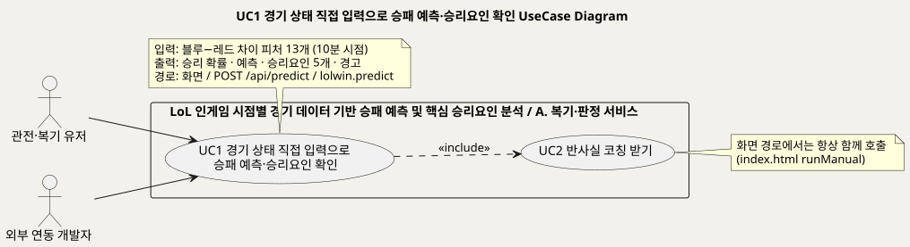
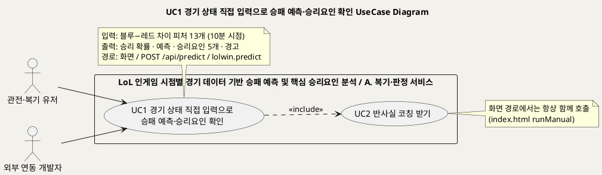
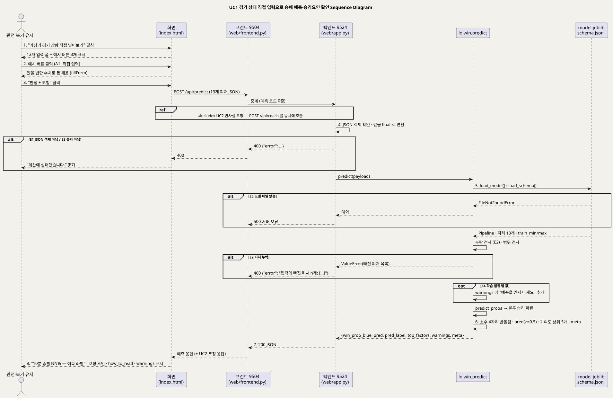
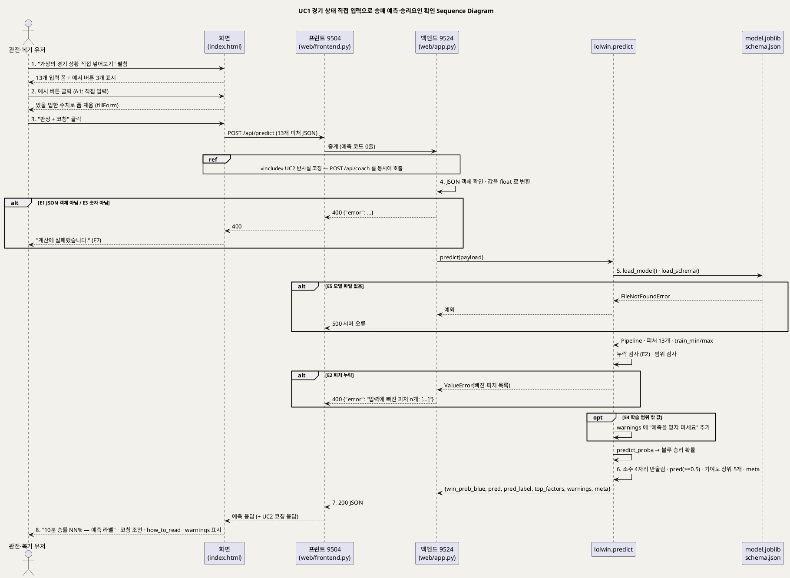

<!-- ─────────────────────────────────────────────
  UC1 상세 명세 — 경기 상태를 직접 넣어 승패 예측·승리요인을 확인하는 흐름.
  왜 필요한가: 개요(UC_00)의 목록을 구현 가능한 수준(사전·사후조건·흐름·예외·업무규칙·시퀀스)으로 내린다.
  주로 보는 사람: 팀원(구현·검수) · Claude(검수)
  ───────────────────────────────────────────── -->

# UseCase 명세 #1 경기 상태 직접 입력으로 승패 예측·승리요인 확인 (A. 복기·판정 서비스)
**LoL 인게임 시점별 경기 데이터 기반 승패 예측 및 핵심 승리요인 분석 · UC1 · UML 2.5.1 표준 (UseCase Diagram + UseCase 기술 + Sequence Diagram)**

---

> **문서 식별**: `docs/usecases/UC_01_경기상태입력승패예측.md`
> **작성일**: 2026-09-07 · **표준**: UML 2.5.1 (OMG)
> **원천(SoT)**: `docs/serving.md` §1~§4·§6·§7 · `docs/spec.md` FR-1·FR-2·FR-8·FR-9·§4 · `model_card.md` "유효 입력 범위"·"사용 금지 상황" · `web/app.py` `api_predict`·`api_predict_batch`·`api_schema`·`api_examples` · `web/frontend.py` `proxy` · `web/templates/index.html` "가상의 경기 상황 직접 넣어보기"·`runManual` · `lolwin/predict.py` `predict` · `tests/test_contract.py` · `web/test_parity.py`
> **개요 문서**: [UC_00_개요_LoL승패예측및핵심승리요인분석.md](UC_00_개요_LoL승패예측및핵심승리요인분석.md) §3 UC1 행
> **다이어그램**: 모든 PlantUML 소스는 로컬 Kroki 에서 렌더 검증 완료(HTTP 200). 렌더 결과는 `diagrams/*.svg` 로 함께 두어 로그인 없이 보인다. 뷰어 링크는 사내 서버라 SSO 로그인이 필요하다.

---

## 목차

1. [범위·개요](#1-범위개요)
2. [UseCase Diagram](#2-usecase-diagram)
3. [Actor 카탈로그](#3-actor-카탈로그)
4. [UseCase 목록 (원천 매핑)](#4-usecase-목록-원천-매핑)
5. [UseCase 기술 + Sequence Diagram](#5-usecase-기술--sequence-diagram)
6. [업무규칙(Business Rules) 종합](#6-업무규칙business-rules-종합)
7. [UML 표준 준수 노트](#7-uml-표준-준수-노트)

---

## 1. 범위·개요

이 유스케이스는 이용자가 **10분 시점 경기 상태(블루−레드 차이 피처 13개)** 를 직접 넣고, 시스템이 학습된 로지스틱 회귀 Pipeline 으로
**승리 확률 · 예측 클래스 · 승리요인 상위 5개 · 경고** 를 돌려주는 흐름이다. 화면에서는 "가상의 경기 상황 직접 넣어보기"에서 예시 버튼 3개로
있을 법한 수치를 채우거나 직접 고쳐 "판정 + 코칭"을 누르며, 화면 없이 `POST /api/predict` 를 부르는 외부 연동도 같은 함수를 탄다.
(근거: `docs/serving.md` §1 "부르는 방법 세 가지", `index.html` "가상의 경기 상황 직접 넣어보기")

예측 계산은 `lolwin.predict` 한 곳에서만 일어나고 웹 계층은 중계와 표시만 한다. 그래서 직접 호출·백엔드·프런트 세 경로의 확률이 갈릴 수 없고,
갈리지 않는지를 파리티 테스트가 확인한다. (근거: `docs/serving.md` §6·§7, `docs/plan.md` §3 Constitution 5)
수동 입력 실행 시 코칭(UC2)이 항상 함께 호출되므로 UC2 를 «include» 한다. (근거: `index.html` `runManual` — `/api/predict` 와 `/api/coach` 를 `Promise.all` 로 동시 호출)

| 항목 | 값 |
|---|---|
| 대상 시스템 | LoL 인게임 시점별 경기 데이터 기반 승패 예측 및 핵심 승리요인 분석 — 패키지 A. 복기·판정 서비스 |
| 상위 프로세스 | 경기 후 복기 — ① 예측(지금 이기고 있나) → ② 원인(왜) → ③ 지시(그래서 뭘 하라). 이 UC 는 ①·② 를 담당한다 (`docs/product.md` §0) |
| 원천 근거 | `docs/serving.md` §1~§4·§6·§7 · `docs/spec.md` FR-1·FR-2·FR-8·FR-9 · `web/app.py` `api_predict` · `index.html` `runManual` · `lolwin/predict.py` |
| 핵심 UseCase | 1개 (UC1) + 포함 UC 1개 (UC2 반사실 코칭) |
| 주요 액터 | 관전·복기 유저(주) · 외부 연동 개발자(주) |

---

## 2. UseCase Diagram

PlantUML 소스 보기

소스를 직접 렌더하려면 **[「UC1 UseCase Diagram」 PlantUML 뷰어로 열기](https://plantuml.sumzip.com/plantuml/svg/eNqNU89PE0EUvs9f8VIvcKClJV4IIWiBE0YTxZOJGXaHdsOyS3ZnhcSYgKwJAQxVS2h1IUsErQkkG361RLj0T_HYefs_-LZbFE56mjcv733v-743M-ZK7khv3gRPG8y_9FyhcVcwd86wFrjD52GGa3Mlx_YsvWibtgP3Jocm8xMPb1W4Za7bi4ZVglluUq8pZiVIGxyjVJagG47QpGFbTBrSFDBdzEPn5LrTigBXV-LVAPD7CoYfAPfeqfAQgyu1T7n1y3izAVhbw9Z-u0lX9e0IP1dxtwVxfTs5pl1RJKowbvAS0WCMa5L4ZTpnyxj67aY6Pe8OCUIMlzPAXXhuiEXh3NRhvaUulgF3IrVVh04UqCjAvUq3cmJJjotXjCXUuVUi2pkpewpobOdkE_d8wI0Aw4o69W-0qPcR7p7FfgR0U1HtrgJQ0RbE2-e4cQR3tKgLH_1dyMGDLKSE2814s4LhNqAfqEsf1w8y8JoB9DYDmf8y8IX1bwe7SgntLniBuNbw7RFuHABeV_HymBJfaFqvvMDeMJY6CQMDo12A1K4_14RhNpvEBRiGkRHD0kxPF6OjzLKlgBlbSnse7Nne8JT3MKhWVX1t_Fr7qMI19YlkRQ2yFOLqFZ7UID9EK4K-_CBZ1rO_P2m-CLrNqb5EmToMod28MT6Jbku_n6BQMnHwNCQACsivYeqsqh9ntIknj58-gxxfMHILjtANTVLOtE164NlegglLh0RKqid95105BQLsAaW4uFNJ9rhepe0f07roaHR-1iCutYg5VfcZli6WsmVJP9DxrEfc8rjZ_3fCGEX0O9lvbwDNTg==)** (사내 서버, SSO 로그인 필요) 또는 [로컬 Kroki 로 열기](http://192.168.0.91:8889/plantuml/svg/eNqNU89PE0EUvs9f8VIvcKClJV4IIWiBE0YTxZOJGXaHdsOyS3ZnhcSYgKwJAQxVS2h1IUsErQkkG361RLj0T_HYefs_-LZbFE56mjcv733v-743M-ZK7khv3gRPG8y_9FyhcVcwd86wFrjD52GGa3Mlx_YsvWibtgP3Jocm8xMPb1W4Za7bi4ZVglluUq8pZiVIGxyjVJagG47QpGFbTBrSFDBdzEPn5LrTigBXV-LVAPD7CoYfAPfeqfAQgyu1T7n1y3izAVhbw9Z-u0lX9e0IP1dxtwVxfTs5pl1RJKowbvAS0WCMa5L4ZTpnyxj67aY6Pe8OCUIMlzPAXXhuiEXh3NRhvaUulgF3IrVVh04UqCjAvUq3cmJJjotXjCXUuVUi2pkpewpobOdkE_d8wI0Aw4o69W-0qPcR7p7FfgR0U1HtrgJQ0RbE2-e4cQR3tKgLH_1dyMGDLKSE2814s4LhNqAfqEsf1w8y8JoB9DYDmf8y8IX1bwe7SgntLniBuNbw7RFuHABeV_HymBJfaFqvvMDeMJY6CQMDo12A1K4_14RhNpvEBRiGkRHD0kxPF6OjzLKlgBlbSnse7Nne8JT3MKhWVX1t_Fr7qMI19YlkRQ2yFOLqFZ7UID9EK4K-_CBZ1rO_P2m-CLrNqb5EmToMod28MT6Jbku_n6BQMnHwNCQACsivYeqsqh9ntIknj58-gxxfMHILjtANTVLOtE164NlegglLh0RKqid95105BQLsAaW4uFNJ9rhepe0f07roaHR-1iCutYg5VfcZli6WsmVJP9DxrEfc8rjZ_3fCGEX0O9lvbwDNTg==) (내부망 전용). 위 그림 파일은 로그인 없이 보인다.

#### 다이어그램 쉽게 읽기 (유저 관점)

1. **누가 쓰나** — 왼쪽에 두 사람이 있다. 한 사람은 화면에서 숫자를 직접 적어 넣는 사람(관전·복기 유저)이고, 다른 사람은 화면 없이 자기 프로그램으로 물어보는 사람(외부 연동 개발자)이다. 둘 다 같은 일(UC1)을 한다.
2. **무슨 순서로** — 숫자 13개를 넣고 "판정 + 코칭" 버튼을 누르면, 시스템이 "파란 팀이 이길 확률", "왜 그런지", "믿어도 되는지"를 돌려준다. 그리고 바로 이어서 "그때 뭘 했어야 했나"(UC2 코칭)도 같이 온다.
3. **«include» = 항상 함께** — 화면에서 결과를 물어보면 코칭(UC2)이 반드시 따라온다. 화면 없이 프로그램으로 묻는 사람은 코칭을 따로 물어볼지 스스로 정한다.
4. **«extend» = 특별한 때만** — 이 그림에는 없다. 경기 여러 판을 한꺼번에 물어보는 것도 같은 일을 여러 번 하는 것이라 따로 나누지 않았다.
5. **Generalization(◁)** — "이 사람은 저 사람의 한 종류"라는 표시인데, 이 그림에는 나오지 않는다.
6. **그림에 없는 것** — 공부를 마친 예측 모델(문제집을 많이 푼 선배 같은 것)과 "숫자가 이 범위 안이어야 정상"이라는 기준표는 시스템 안에 들어 있어서 사람 모양으로 그리지 않는다.

#### 표준 기호 범례

| 기호 | 의미 | UML 2.5.1 |
|---|---|---|
| 사람 모양 (actor) | 이 시스템을 쓰는 사람, 또는 바깥에서 자료를 주고받는 다른 시스템. 울타리 밖에 그린다 | Actor |
| 타원 (usecase) | 그 사람이 이 시스템으로 이루고 싶은 일 하나. 버튼이나 화면이 아니라 "목표" 단위다 | UseCase |
| 큰 사각형 (rectangle) | 우리가 만든 것의 울타리. 안쪽은 우리 책임, 바깥은 남의 것 | Subject (System Boundary) |
| 실선 화살표 | 그 사람이 그 일을 시작한다는 뜻 | Association |
| 점선 화살표 «include» | 이 일을 하면 저 일도 항상 같이 일어난다 | Include |

---

## 3. Actor 카탈로그

| 액터 | 구분 | 설명 | 근거 |
|---|---|---|---|
| 관전·복기 유저 | Primary | 중계를 보며 "어느 팀이 왜 유리한지" 알고 싶거나, 진 경기에서 무엇부터 고칠지 우선순위를 원하는 사람. 화면에서 13개 수치를 넣는다 | `docs/spec.md` §2 "관전 입문자"·"복기하는 유저" |
| 외부 연동 개발자 | Primary | 화면 없이 `POST /api/predict` 를 부르는 쪽. 응답의 `warnings` 를 보고 믿을지 스스로 정한다 | `docs/serving.md` §1 "외부 연동", §4 "믿을지 말지는 `warnings` 를 보고 쓰는 쪽이 정한다" |
| (내부) `lolwin.predict` | 시스템 구성요소 | 확률·승리요인을 계산하는 유일한 곳. 액터가 아니라 시퀀스의 lifeline 으로만 그린다 | `docs/serving.md` §6 |
| (내부) `artifacts/model.joblib` · `schema.json` | 시스템 자산 | StandardScaler + LogisticRegression Pipeline, 피처 13개와 허용 범위 | `docs/serving.md` §2·§6 |

이 UC 에는 Secondary Actor(외부 시스템)가 없다. 예측은 외부 API 를 부르지 않는다. (근거: `docs/spec.md` §4 "외부 승률 API 금지")

---

## 4. UseCase 목록 (원천 매핑)

| UC ID | 유스케이스명 | 주액터 | 관계 | 원천 근거 |
|:--:|---|---|---|---|
| UC1 | 경기 상태 직접 입력으로 승패 예측·승리요인 확인 | 관전·복기 유저 · 외부 연동 개발자 | 기준 UC | `docs/serving.md` §1~§4 · `docs/spec.md` FR-1·FR-2·FR-8·FR-9 · `web/app.py` `api_predict` · `index.html` `runManual` |
| UC2 | 반사실 코칭 받기 | 이용자 | UC1 이 «include» | `index.html` `runManual` (`/api/coach` 동시 호출) · `docs/serving.md` §5 `/api/coach` — 상세는 `UC_02_반사실코칭.md` |

---

## 5. UseCase 기술 + Sequence Diagram

### 5.1 UC1 경기 상태 직접 입력으로 승패 예측·승리요인 확인

> **쉽게 말하면** — 축구 전반전이 끝났을 때 점수판만 보고 "누가 이길까" 짐작하는 것과 같다. 여기서는 게임 10분 시점의 숫자 13개(돈 차이, 경험치 차이, 상대를 쓰러뜨린 수 차이 등)를 넣으면
> "파란 팀이 이길 확률 73%"와 "돈 차이 때문에 유리하고, 그다음은 경험치 때문"이라는 이유까지 돌려준다.
> 공부할 때 본 적 없는 이상한 숫자를 넣으면 막지는 않지만, "이 예측은 믿지 마세요"라는 경고를 붙여 준다.

#### 유스케이스 기술

| 속성 | 내용 |
|---|---|
| **ID** | UC1 — 원천 식별자: `docs/spec.md` FR-1·FR-2·FR-9 · `docs/serving.md` §1~§4 · `web/app.py` `api_predict` |
| **유스케이스명** | 경기 상태 직접 입력으로 승패 예측·승리요인 확인 |
| **액터** | 주액터: 관전·복기 유저 · 외부 연동 개발자. 보조액터: 없음 (외부 API 호출 없음 — `docs/spec.md` §4) |
| **사전조건** | (1) 백엔드(9524)가 기동돼 있고 `artifacts/model.joblib` · `schema.json` 이 열린다 — 기동 시 파리티를 실측한다 (`web/app.py` `_parity`). (2) 화면 경로는 프런트(9504)가 `/api/*` 를 백엔드로 중계한다 (`docs/deploy.md`). (3) 이용자가 13개 피처의 값을 알고 있다 — 모르면 예시 버튼 3개로 채운다 (`index.html`). (4) 로그인·계정은 없다 — 서비스는 계정을 만들지 않는다 (`docs/riot-api-application.md` "DATA HANDLING") |
| **사후조건** | (1) `win_prob_blue`(0~1, 소수 4자리) · `pred` · `pred_label` · `top_factors` 5개 · `warnings` · `meta` 가 JSON 으로 반환됐다 (`docs/serving.md` §3). (2) 같은 입력이면 직접 호출·백엔드·프런트 세 경로의 확률이 같다 (`docs/serving.md` §7). (3) 화면 경로에서는 코칭(UC2) 결과가 함께 표시됐다. (4) 서버에 입력·결과를 저장하지 않는다 — 원천에 저장 로직이 없다 |
| **기본흐름** | ↓ 별도 기본흐름표 |
| **대체흐름** | A1. **수치 직접 입력** — 3단계에서 예시 버튼 대신(또는 버튼으로 채운 뒤 고쳐서) 13개 값을 직접 넣는다. "모두 0으로" 버튼으로 초기화할 수 있다 (`index.html`). 이후 흐름 동일. A2. **화면 없이 API 호출** — 외부 연동 개발자가 `POST /api/predict` 에 JSON 객체(13개 피처)를 보낸다. 프런트 중계 없이 백엔드 포트를 직접 불러도 CORS 로 허용된다 (`web/app.py` `cors`). 코칭은 포함되지 않으며 필요하면 `/api/coach` 를 따로 부른다. 4단계부터 동일하고 8단계(화면 표시)는 없다. A3. **일괄 예측** — `POST /api/predict/batch` 에 1~1000개 경기의 JSON 배열을 보낸다. 단건 경로 `predict` 를 그대로 재사용해 같은 입력엔 같은 결과가 나온다 (`web/app.py` `api_predict_batch`). 응답은 결과 배열. A4. **파이썬·터미널 경로** — `from lolwin import predict` 또는 `lolwin-predict '{...}'` 로 같은 함수를 부른다 (`docs/serving.md` §1). 5단계만 수행된다. A5. **입력 계약·예시 조회** — 호출 전 `GET /api/schema` 로 피처 13개와 허용 범위를, `GET /api/examples` 로 예시 입력 3건을 받는다 (`docs/serving.md` §5) |
| **예외흐름** | E1. **JSON 객체가 아님** — 4단계에서 본문이 JSON 객체가 아니면 HTTP 400 "JSON 객체(13개 피처)를 보내주세요" (`web/app.py` `api_predict`, `docs/serving.md` §4 "JSON 형식 오류"). E2. **피처 누락** — 5단계에서 13개 중 하나라도 없으면 `ValueError` → HTTP 400 + 빠진 피처 목록 (`lolwin/predict.py`, `docs/serving.md` §4, `tests/test_contract.py` `test_missing_feature_raises`). E3. **숫자로 변환 불가** — 4단계에서 값이 숫자가 아니면 `TypeError`/`ValueError` → HTTP 400 (`web/app.py`). E4. **학습 범위 밖 값** — 5단계에서 `schema.json` 의 `train_min`~`train_max` 를 벗어나면 **거부하지 않고** HTTP 200 으로 정상 반환하되 `warnings` 에 "예측을 믿지 마세요"를 담는다. 막으면 프로 경기처럼 이례적인 판을 아예 볼 수 없기 때문이다 (`docs/serving.md` §2·§4, `model_card.md` 금지 1, `tests/test_contract.py` `test_out_of_range_warns_but_returns`). E5. **모델 파일 없음** — 5단계에서 `FileNotFoundError` → HTTP 500 (`docs/serving.md` §4). E6. **일괄 크기 위반** — A3 에서 배열이 아니거나 비었거나 1000개를 넘으면 HTTP 400; 배열 안 한 건이 잘못되면 HTTP 400 + 그 `index` (`web/app.py` `api_predict_batch`). E7. **화면 경로 계산 실패** — 3~7단계 중 중계·서버 오류로 응답을 못 받으면 화면에 "계산에 실패했습니다."를 표시하고 버튼을 되살린다 (`index.html` `runManual` catch/finally) |
| **포함/확장** | «include» UC2 반사실 코칭 받기 — 화면 경로에서 항상 함께 호출 (`index.html` `runManual`). «extend» 없음 |
| **우선순위** | High — 서비스의 뿌리인 "10분 시점 판정"을 이용자가 직접 확인하는 유일한 입구이며, FR-1·FR-2·FR-9 로 v1 필수 요구사항이다 (`docs/spec.md` §3, `docs/product.md` §3 원칙) |
| **사용빈도** | 자료 없음 — 확인 필요. [추론] 발표 시연에서 예시 버튼 3개를 눌러 보이는 것이 기본 사용이며(`docs/deploy.md` "발표 당일"), 일반 이용자는 소환사 검색(UC3)이 1순위라 이 UC 는 보조 입구다 (`index.html` "감이 안 오시면 아래 버튼을 누르세요") |
| **업무규칙** | BR-PRD-01 ~ BR-PRD-10 (§6) |
| **특별 요구사항** | (1) **서빙 파리티** — 세 경로 확률 일치를 자동 테스트로 검증 (`web/test_parity.py`, `docs/spec.md` §4). (2) **출력 계약** — 형식·에러 규약이 바뀌면 버전을 올리고 `tests/test_contract.py` 를 함께 고친다 (`docs/serving.md` 머리말). (3) **ML 전용** — 규칙 하드코딩·확률 수동 보정·외부 승률 API 금지 (`docs/spec.md` §4). (4) **플랫폼** — 1코어(`n_jobs=1`), Python 3.11 + scikit-learn 저장본 (`docs/plan.md` §2). (5) **CORS** — 백엔드 포트 직접 호출 허용 (`web/app.py` `cors`). (6) **응답 해석 안내** — `contribution` 은 다른 지표를 통제한 뒤 남은 몫이라 화면에 그대로 띄우지 말고 설명을 붙인다 (`docs/serving.md` §3). (7) 성능 목표·접근성·규제: 자료 없음 — 확인 필요 |
| **비고** | 원천 추적성 — `docs/serving.md` §1(부르는 방법)·§2(입력 13개·허용 범위)·§3(출력 보장)·§4(에러 규약)·§6(구현 구조)·§7(계약 확인) · `docs/spec.md` FR-1·FR-2·FR-8·FR-9·§4 · `model_card.md` "유효 입력 범위"·"사용 금지 상황" 1·2·5 · `web/app.py` `api_predict`(579~593행)·`api_predict_batch`(595~608행)·`api_schema`·`api_examples`·`cors` · `web/frontend.py` `proxy` · `web/templates/index.html` "가상의 경기 상황 직접 넣어보기"(502~520행)·`runManual`(1107~1131행) · `lolwin/predict.py` `predict`(20~87행) · `tests/test_contract.py`. FR-8(기준선 대비 개선 폭 병기)은 `meta.holdout_accuracy` 로 응답에 실리고 화면 "이 판정을 믿어도 되나"(UC5)에서 보인다 |

#### 기본흐름 (Basic Flow)

| 단계 | 액터 행위 | 시스템 행위 |
|:--:|---|---|
| 1 | 관전·복기 유저가 화면의 "이 판정을 믿어도 되나" 아래 "가상의 경기 상황 직접 넣어보기"를 펼친다 | 화면이 블루−레드 차이 피처 13개의 입력 폼과 예시 버튼 3개("팽팽한 초반"·"블루가 크게 유리"·"레드가 유리"), "판정 + 코칭"·"모두 0으로" 버튼을 보여준다 |
| 2 | 예시 버튼 하나를 누른다 (또는 A1 로 직접 입력) | 실제 있을 법한 수치로 13개 입력칸을 채운다 (`fillForm`) |
| 3 | "판정 + 코칭"을 누른다 | 화면이 버튼을 잠그고("계산 중") 13개 값을 JSON 으로 만들어 `POST /api/predict` 와 `POST /api/coach` 를 동시에 보낸다. 프런트(9504)는 두 요청을 백엔드(9524)로 중계만 한다 |
| 4 | — (기다린다) | 백엔드 `api_predict` 가 본문이 JSON 객체인지 확인하고(E1) 모든 값을 실수로 바꿔(E3) `lolwin.predict` 에 넘긴다 |
| 5 | — | `predict` 가 `schema.json` 의 피처 13개로 누락을 검사하고(E2), 각 값이 `train_min`~`train_max` 안인지 확인해 벗어난 것을 `warnings` 에 담는다(E4). 모델 `Pipeline`(StandardScaler → LogisticRegression) 으로 블루 승리 확률을 계산한다(E5) |
| 6 | — | `predict` 가 확률을 소수 4자리로 반올림하고, 0.5 이상이면 `pred`=1(블루 승리 예측) 아니면 0 으로 판정하며, 계수 × 표준화값으로 기여도를 구해 절대값 내림차순 상위 5개를 `top_factors`(피처·이름·값·기여도·방향) 로 만든다. `meta`(모델·버전·시점·홀드아웃 정확도) 를 붙여 돌려준다 |
| 7 | — | 백엔드가 결과를 JSON(HTTP 200) 으로 응답하고, 프런트가 화면으로 중계한다. 같은 시점에 «include» UC2 의 코칭 응답(`actions` · `how_to_read`)도 도착한다 |
| 8 | 결과를 읽는다 — 승률·예측 라벨·코칭 조언과 경고를 확인한다 | 화면이 "10분 승률 NN% — 블루/레드 승리 예측", 코칭 조언 목록과 `how_to_read` 문구, `warnings` 가 있으면 경고 상자를 표시하고 버튼을 되살린다 |

#### Sequence Diagram

PlantUML 소스 보기

소스를 직접 렌더하려면 **[「UC1 Sequence Diagram」 PlantUML 뷰어로 열기](https://plantuml.sumzip.com/plantuml/svg/eNp9Vd9P21YUfvdfceRpUqKCSYCsG9JQS0ek7oEiKHtZp8hJDLh17MxxRqsKKbQeikg2oEsg2RIWVH62VEtDgKAFTeJP6SP3-n_YudcOS_Kwl0S-Pt853_nOuZ_vpSzZtNIJDdKxQDCSUn5MK3pMEVLPVD0pm3IConLs2YJppPX4A0MzTPgsPBIOTk50RaQW5bixpOoLMC9rKUWwVEtTYO5BEG4aVzetOtDXK87rCtDDFVrbBLrzM6nt00qb7OLZ2qWTPwJaytLW7vUFPpKDE_p7gVZb4JSL7G_W4wTfqPIC1hMEOWYhEfGmmaE1-_qCnJ7xKpUarWVEkFMwl1JMAclZakxNyroFolMukOPmE92n6nHlubRoJTS_G_qwL7Bgkz_rzloLvgoFRhGwpESH5k1DtxQ9LiVfuKjwZC-K1D_S7QL5rYKo4Q5KTiZvARN9AM3QUDEpaSpxNWbxkOmZ3pCEEVc06akR1dToEz0VW1QSsvQ0Zeg8-v7MY0FgfcLgODYBYxCUUJJ6BsWm1VK39OXjjvTEfku3muS0ia9EcH5t08sjAcGDLAfLhVlGbuoVb0bgrLfhDh9OrgKkYTtrbeDvnc0KHvXWH5b6Ip2VJjn4AL77wbHe2fv7atKdLK3aCCs6RaydLdHLElsOVp5-tOkfGfDNq5oWNsyEv7foCDbt5DdorciIXhXo5QfRK8yLjOOoMGz60exjwIGoQ57i4HMbdQpt2ijBt7OPpvwChiJgggHo3ubNqQ0-dzFZZjbcAN2z_YKpzIPxE5KYeziA6QdcxPV7VY9p6bhy_Tfu_jCQeom-OqG5PY8WfMoUunjEDDm2CGS_DWS9jKLR7Q1wSi16XhEm_qMxKnFqcFOv0kazcyOuL_DgDZNsXjNkC5hW5DTjlEuCrFkwGewB0aJNciUYgskR1PY93dnwjgRgRQY7Go0GAvBSVEzTMMUxkCRpGQPCbgDXGgPwpHd0IqpEX9UZe2wVr7KzlaVrZySXJbk9SQTf5F2_gDfHa2p6BjHeCHxJ-QXSj_sFPMV3uNH4MiQBO4zw7ff5Wa_82d1_n9_tMATk3RH5BT0in6dV3JLtVVrNIzuWZLBTKKxqypRhhZl5TbK-MIDVuh0yDrfc6pMhhDJQu4I7jO_3yH6J0-_JO60mFU3VFUbOWyB3m_DZMmVVjyRUfSghP_c64yCStUn1Cu9lBtcCdRnmvZFGgVZs79TtbbiT00X0cf5O1tIKb8ZHLmv00L6NfndMdqv-_x2q6HkvTqsXrCP7Mfgeh_6DuMwbNpJIZRScYhnH2aFJ6lts8zxKXmNLsqmj-aeApRXdC8Ov81__0MMMkMMstVto6SLQ8wIaFE_fhffWIZI0jagMn1bfAGkVyNsjcD8GbOnJfq0b8QU6zWoefQJGcZtZDLtspRNy0GaasoS-8a8DUohLjF5Ht0_Ius3MkHUR8kaVUCxZ6Nb2JVoypxGJosgDPJH7G9HkqKINgGUkI_P885MauG18gGdaFrp1vyvBMErP7qHQfYc6flLdJLkz8N3hVuEZhHvYb45fosMFA-Tc5nrs12Bq6nPuJV4qUm2TxpHIGurk2a3TLe4Si8ZSxDIipiLH2ePtpDz7voeTwE-_8C8O13XM)** (사내 서버, SSO 로그인 필요) 또는 [로컬 Kroki 로 열기](http://192.168.0.91:8889/plantuml/svg/eNp9Vd9P21YUfvdfceRpUqKCSYCsG9JQS0ek7oEiKHtZp8hJDLh17MxxRqsKKbQeikg2oEsg2RIWVH62VEtDgKAFTeJP6SP3-n_YudcOS_Kwl0S-Pt853_nOuZ_vpSzZtNIJDdKxQDCSUn5MK3pMEVLPVD0pm3IConLs2YJppPX4A0MzTPgsPBIOTk50RaQW5bixpOoLMC9rKUWwVEtTYO5BEG4aVzetOtDXK87rCtDDFVrbBLrzM6nt00qb7OLZ2qWTPwJaytLW7vUFPpKDE_p7gVZb4JSL7G_W4wTfqPIC1hMEOWYhEfGmmaE1-_qCnJ7xKpUarWVEkFMwl1JMAclZakxNyroFolMukOPmE92n6nHlubRoJTS_G_qwL7Bgkz_rzloLvgoFRhGwpESH5k1DtxQ9LiVfuKjwZC-K1D_S7QL5rYKo4Q5KTiZvARN9AM3QUDEpaSpxNWbxkOmZ3pCEEVc06akR1dToEz0VW1QSsvQ0Zeg8-v7MY0FgfcLgODYBYxCUUJJ6BsWm1VK39OXjjvTEfku3muS0ia9EcH5t08sjAcGDLAfLhVlGbuoVb0bgrLfhDh9OrgKkYTtrbeDvnc0KHvXWH5b6Ip2VJjn4AL77wbHe2fv7atKdLK3aCCs6RaydLdHLElsOVp5-tOkfGfDNq5oWNsyEv7foCDbt5DdorciIXhXo5QfRK8yLjOOoMGz60exjwIGoQ57i4HMbdQpt2ijBt7OPpvwChiJgggHo3ubNqQ0-dzFZZjbcAN2z_YKpzIPxE5KYeziA6QdcxPV7VY9p6bhy_Tfu_jCQeom-OqG5PY8WfMoUunjEDDm2CGS_DWS9jKLR7Q1wSi16XhEm_qMxKnFqcFOv0kazcyOuL_DgDZNsXjNkC5hW5DTjlEuCrFkwGewB0aJNciUYgskR1PY93dnwjgRgRQY7Go0GAvBSVEzTMMUxkCRpGQPCbgDXGgPwpHd0IqpEX9UZe2wVr7KzlaVrZySXJbk9SQTf5F2_gDfHa2p6BjHeCHxJ-QXSj_sFPMV3uNH4MiQBO4zw7ff5Wa_82d1_n9_tMATk3RH5BT0in6dV3JLtVVrNIzuWZLBTKKxqypRhhZl5TbK-MIDVuh0yDrfc6pMhhDJQu4I7jO_3yH6J0-_JO60mFU3VFUbOWyB3m_DZMmVVjyRUfSghP_c64yCStUn1Cu9lBtcCdRnmvZFGgVZs79TtbbiT00X0cf5O1tIKb8ZHLmv00L6NfndMdqv-_x2q6HkvTqsXrCP7Mfgeh_6DuMwbNpJIZRScYhnH2aFJ6lts8zxKXmNLsqmj-aeApRXdC8Ov81__0MMMkMMstVto6SLQ8wIaFE_fhffWIZI0jagMn1bfAGkVyNsjcD8GbOnJfq0b8QU6zWoefQJGcZtZDLtspRNy0GaasoS-8a8DUohLjF5Ht0_Ius3MkHUR8kaVUCxZ6Nb2JVoypxGJosgDPJH7G9HkqKINgGUkI_P885MauG18gGdaFrp1vyvBMErP7qHQfYc6flLdJLkz8N3hVuEZhHvYb45fosMFA-Tc5nrs12Bq6nPuJV4qUm2TxpHIGurk2a3TLe4Si8ZSxDIipiLH2ePtpDz7voeTwE-_8C8O13XM) (내부망 전용). 위 그림 파일은 로그인 없이 보인다.

기본흐름 8단계와 시퀀스의 번호 메시지가 1:1 로 대응한다. 대체흐름 A2·A3·A4 는 4단계(백엔드) 또는 5단계(`predict`) 에서 진입하는 같은 경로이며, 시퀀스에는 기본(화면) 경로만 그렸다.

---

## 6. 업무규칙(Business Rules) 종합

| BR ID | 규칙 | 적용 UC | 근거 |
|---|---|---|---|
| BR-PRD-01 | 입력은 13개 피처가 **전부** 있어야 한다. 하나라도 빠지면 거부한다(400 + 빠진 피처 목록). 전부 블루−레드 차이값이고 양수면 블루 우세 | UC1 | `docs/serving.md` §2·§4, `lolwin/predict.py`, `tests/test_contract.py` |
| BR-PRD-02 | 학습 범위(`schema.json` `train_min`~`train_max`) 밖의 값은 **막지 않고** `warnings` 로 알린다. 믿을지는 쓰는 쪽이 정한다 | UC1 | `docs/serving.md` §2·§4, `model_card.md` 금지 1 |
| BR-PRD-03 | `pred` 는 `win_prob_blue >= 0.5` 이면 1, 아니면 0 | UC1 | `docs/serving.md` §3, `tests/test_contract.py` `test_pred_matches_threshold` |
| BR-PRD-04 | `top_factors` 는 **정확히 5개**, 기여도 절대값 내림차순. `contribution` = 계수 × 표준화값, 양수 = 블루에 유리 | UC1 | `docs/serving.md` §3, `tests/test_contract.py` `test_top_factors` |
| BR-PRD-05 | `win_prob_blue` 는 0~1 실수, 소수 **4자리 반올림** | UC1 | `docs/serving.md` §3 |
| BR-PRD-06 | 예측 계산은 `lolwin.predict` 한 곳에서만 한다. `web/` 에는 `sklearn`·`joblib` import 가 없고, 세 경로(직접 호출·백엔드·프런트)의 확률은 같아야 한다 | UC1 | `docs/serving.md` §6·§7, `docs/plan.md` §3 Constitution 5, `docs/spec.md` §4 "서빙 파리티" |
| BR-PRD-07 | `contribution` 을 화면에 그대로 띄우지 않고 설명을 붙인다 — 킬은 골드와 상관이 높아 음수로 나올 수 있으나 "킬을 하면 진다"는 뜻이 아니다 | UC1 | `docs/serving.md` §3 "해석 주의", `lolwin/predict.py` 주석 |
| BR-PRD-08 | 10분 시점 입력만 유효하다. 다른 시점은 `TIME_POINT` 로 재학습해야 하며, 프로 경기와 일반 랭크를 교차 적용하지 않는다 | UC1 | `model_card.md` 금지 2·5, `docs/spec.md` FR-6 |
| BR-PRD-09 | 일괄 예측은 1~1000개 경기의 JSON 배열만 받고, 단건 경로를 그대로 재사용한다 | UC1 (A3) | `web/app.py` `api_predict_batch` |
| BR-PRD-10 | ML 전용 구현 — 규칙 하드코딩·확률 수동 보정·외부 승률 API 를 쓰지 않는다. 예측 시점 이후 정보를 입력하지 않는다 | UC1 | `docs/spec.md` §4, `docs/plan.md` §3 Constitution 1·4 |

---

## 7. UML 표준 준수 노트

| 항목 | 적용 |
|---|---|
| UseCase Diagram | Subject(시스템 경계)를 `rectangle` 로, 주액터를 경계 밖 왼쪽에 두었다. UC1 → UC2 는 항상 발생하므로 «include» 로 표기했다 (UML 2.5.1 §18.1.3 Include) |
| UseCase 기술 | 14속성 세로형 표. 사전·사후조건은 "참이어야 할 상태 / 보장되는 상태"로 적었고 대체(A)·예외(E) 흐름을 번호로 분리했다 |
| Sequence Diagram | 기본흐름 8단계와 메시지 1:1. 예외 E1·E2·E3·E5 는 `alt`, E4 경고는 `opt`, 포함 UC2 는 `ref` 결합 프래그먼트로 표현했다 (UML 2.5.1 §17.6 CombinedFragment·InteractionUse) |
| 내부 구성요소 | `lolwin.predict` 와 모델 파일은 액터가 아니므로 UseCase Diagram 에서는 경계 안에 두지 않고 Sequence Diagram 의 lifeline 으로만 그렸다 |
| 추적성 | 모든 흐름·규칙에 원천(문서 절·파일·함수)을 붙였고, 원천에 없는 판단은 `[추론]`, 없는 자료는 `자료 없음 — 확인 필요` 로 남겼다 |

---

*표기 표준: UML 2.5.1 (OMG). 서식 정본: usecase 스킬 `references/format-spec.md`. 개요 문서: [UC_00_개요_LoL승패예측및핵심승리요인분석.md](UC_00_개요_LoL승패예측및핵심승리요인분석.md). 다음 문서: `UC_02_반사실코칭.md`.*
