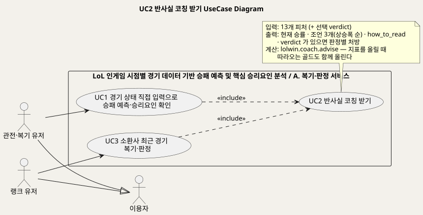
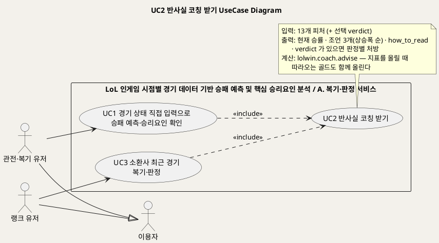
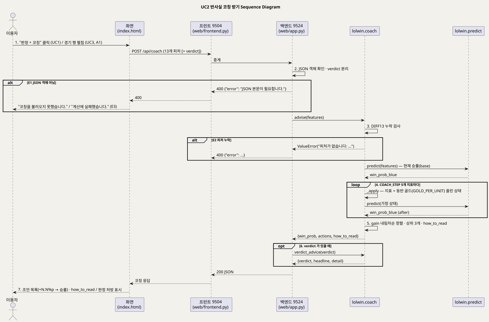
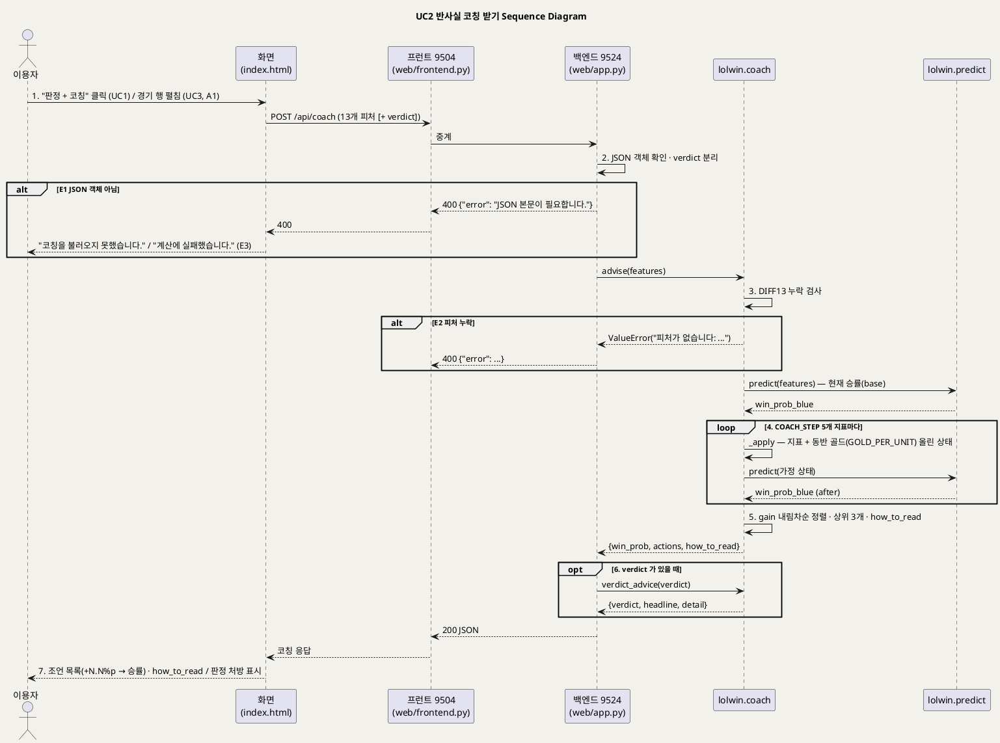

<!-- ─────────────────────────────────────────────
  UC2 상세 명세 — 지금 상태에서 무엇을 했다면 승률이 얼마나 올랐는지 조언하는 흐름(반사실 코칭).
  왜 필요한가: 개요(UC_00)의 목록을 구현 가능한 수준(사전·사후조건·흐름·예외·업무규칙·시퀀스)으로 내린다.
  주로 보는 사람: 팀원(구현·검수) · Claude(검수)
  ───────────────────────────────────────────── -->

# UseCase 명세 #2 반사실 코칭 받기 (A. 복기·판정 서비스)
**LoL 인게임 시점별 경기 데이터 기반 승패 예측 및 핵심 승리요인 분석 · UC2 · UML 2.5.1 표준 (UseCase Diagram + UseCase 기술 + Sequence Diagram)**

---

> **문서 식별**: `docs/usecases/UC_02_반사실코칭.md`
> **작성일**: 2026-09-07 · **표준**: UML 2.5.1 (OMG)
> **원천(SoT)**: `lolwin/coach.py` `advise`·`_apply`·`verdict_advice`·`GOLD_PER_UNIT`·`COACH_STEP`·`VERDICT_ADVICE` · `web/app.py` `api_coach` · `tests/test_coach.py` · `docs/product.md` §0 ③·§1 "지시 — 그래서 뭘 하라"·"함정 하나" · `docs/serving.md` §5 `/api/coach`·§6 "/api/coach — 조언이 뒤집히지 않게 하는 장치"·"해석 한계" · `model_card.md` 사용 금지 상황 7 · `STUDY.md` 17 · `web/templates/index.html` `runManual`·`toggleDetail`
> **개요 문서**: [UC_00_개요_LoL승패예측및핵심승리요인분석.md](UC_00_개요_LoL승패예측및핵심승리요인분석.md) §3 UC2 행
> **다이어그램**: 모든 PlantUML 소스는 로컬 Kroki 에서 렌더 검증 완료(HTTP 200). 렌더 결과는 `diagrams/*.svg` 로 함께 두어 로그인 없이 보인다. 뷰어 링크는 사내 서버라 SSO 로그인이 필요하다.

---

## 목차

1. [범위·개요](#1-범위개요)
2. [UseCase Diagram](#2-usecase-diagram)
3. [Actor 카탈로그](#3-actor-카탈로그)
4. [UseCase 목록 (원천 매핑)](#4-usecase-목록-원천-매핑)
5. [UseCase 기술 + Sequence Diagram](#5-usecase-기술--sequence-diagram)
6. [업무규칙(Business Rules) 종합](#6-업무규칙business-rules-종합)
7. [UML 표준 준수 노트](#7-uml-표준-준수-노트)

---

## 1. 범위·개요

이 유스케이스는 10분 시점 경기 상태(13개 피처)를 받아 **"무엇을 했다면 승률이 얼마나 올랐나"** 를 상승폭이 큰 순으로 돌려주는 흐름이다.
판정(어디서 졌나)이 진단이라면 코칭은 처방이다. 모델을 거꾸로 돌려 계산하며, 확률이 계수 × 표준화값의 합인 로지스틱 회귀라서 가능하다 —
모델 선택의 근거(설명 가능성)가 서비스 기능으로 그대로 이어진다. (근거: `docs/product.md` §0 ③·§1 "지시", `lolwin/coach.py` 머리말)

핵심 장치는 **지표를 올릴 때 따라오는 골드도 함께 올리는 것**이다. 킬·CS 의 가치는 이미 골드에 들어 있어(다중공선성) 계수를 그대로 쓰면
"킬하지 마라 · CS 먹지 마라"가 나온다. 골드를 고정한 채 CS 만 올리는 것은 현실에 없는 상황이므로 `GOLD_PER_UNIT`(학습셋 실측 동반 변화)만큼
골드도 함께 올려 계산한다. `tests/test_coach.py` 가 모든 조언이 승률을 올리는지, 그리고 순진한 계산은 실제로 뒤집히는지까지 검사한다.
(근거: `docs/serving.md` §6, `docs/product.md` "함정 하나", `lolwin/coach.py` `_apply`)

이 UC 는 단독으로 시작되지 않는다. 수동 입력(UC1)에서는 "판정 + 코칭" 실행 시 `/api/predict` 와 함께 항상 호출되고, 소환사 복기(UC3)에서는
경기 행을 펼칠 때 그 경기의 피처와 판정(`verdict`)을 붙여 호출된다. 그래서 UC1·UC3 이 UC2 를 «include» 한다.
(근거: `index.html` `runManual`·`toggleDetail`)

| 항목 | 값 |
|---|---|
| 대상 시스템 | LoL 인게임 시점별 경기 데이터 기반 승패 예측 및 핵심 승리요인 분석 — 패키지 A. 복기·판정 서비스 |
| 상위 프로세스 | 경기 후 복기 — ① 예측 → ② 원인 → ③ 지시(그래서 뭘 하라). 이 UC 는 ③ 을 담당한다. "③이 있어야 감독이다" (`docs/product.md` §0) |
| 원천 근거 | `lolwin/coach.py` `advise`·`verdict_advice` · `web/app.py` `api_coach` · `tests/test_coach.py` · `docs/product.md` §0·§1 · `docs/serving.md` §5·§6 · `model_card.md` 금지 7 · `STUDY.md` 17 |
| 핵심 UseCase | 1개 (UC2) — UC1·UC3 의 포함 UC |
| 주요 액터 | 이용자(주, UC1·UC3 를 통해). 보조액터 없음 |

---

## 2. UseCase Diagram

PlantUML 소스 보기

소스를 직접 렌더하려면 **[「UC2 UseCase Diagram」 PlantUML 뷰어로 열기](https://plantuml.sumzip.com/plantuml/svg/eNp1U01P20AQvftXjNILqCJtyA2hiDYtJ06V6AkJLbZJLIy3sjdwaCsFcCtEUgXUpArUiYwUKEhBsiCQoIZLfkqP3vF_6G4cPiK1vtieefPezJvdOYcRmxXWTSioL6eXC46uEkdXnDXD-kBssg4rRF3L2bRgaVlqUhuezafnU29fP0E4eaLRTcPKwSoxRa2przJgFGwjl2egGbauMoNaCjOYqcNidhp4UMftNpZagHdVvL0QgZ9hL4BFR88KdXhjkJxgVhSiMiGZwEYHj86xuZ8A4kiUfZ8JO0X03UGXX11LAvR89ItD1HtD33zE8eZFtNV-mn9HrDWRj2EwNfUpExPH8ScBRfZPrJzoPbFAFwAbvfCyjE0XsOShv8-vXAgv76Q8_xaIViM3APEnhgTcu43KZ4D1XewdiykrENWusdSWCX7axqOqYAN-46LbgBfwKgnxIINuVN5HvwboevzWxb1WAj4qAKP1QGIxm7oXxZ2taMcD_LWF_gFg8wv3T9Dr82NvyRrTH3THVKPDmnjFjmZT4-RpwK_l6FBuCfDaC7v9kdqSNd7gqDw9Xv7fDY_g08pn5dH5zFD_wffMkE8OmExmhsdlBmZnDUs1C5qeySiyu39nLMp0WKGM0XWgq0MdGBkyA6l0GHgQVft4WYeJ58JZP9ppwIZua4bKJiXyxhsio7qLzXhFJz4MuoDHAf7ogSSYEG5LUysXgLvepMzm6eYyo8u2TjRBEj8iPCKGMCiKHnblRs47ELsmj4xogwfnoiK8cnE7mAGTmuISJVVK1HySaBuG8PJPsSoWW4wOPH7SF2ts89MO8Fr5QYhXA97oY73F96qC6Yx_93jFFafsLPxdjwsCXmopuqWBtEeZE1_itit_AbDj440=)** (사내 서버, SSO 로그인 필요) 또는 [로컬 Kroki 로 열기](http://192.168.0.91:8889/plantuml/svg/eNp1U01P20AQvftXjNILqCJtyA2hiDYtJ06V6AkJLbZJLIy3sjdwaCsFcCtEUgXUpArUiYwUKEhBsiCQoIZLfkqP3vF_6G4cPiK1vtieefPezJvdOYcRmxXWTSioL6eXC46uEkdXnDXD-kBssg4rRF3L2bRgaVlqUhuezafnU29fP0E4eaLRTcPKwSoxRa2przJgFGwjl2egGbauMoNaCjOYqcNidhp4UMftNpZagHdVvL0QgZ9hL4BFR88KdXhjkJxgVhSiMiGZwEYHj86xuZ8A4kiUfZ8JO0X03UGXX11LAvR89ItD1HtD33zE8eZFtNV-mn9HrDWRj2EwNfUpExPH8ScBRfZPrJzoPbFAFwAbvfCyjE0XsOShv8-vXAgv76Q8_xaIViM3APEnhgTcu43KZ4D1XewdiykrENWusdSWCX7axqOqYAN-46LbgBfwKgnxIINuVN5HvwboevzWxb1WAj4qAKP1QGIxm7oXxZ2taMcD_LWF_gFg8wv3T9Dr82NvyRrTH3THVKPDmnjFjmZT4-RpwK_l6FBuCfDaC7v9kdqSNd7gqDw9Xv7fDY_g08pn5dH5zFD_wffMkE8OmExmhsdlBmZnDUs1C5qeySiyu39nLMp0WKGM0XWgq0MdGBkyA6l0GHgQVft4WYeJ58JZP9ppwIZua4bKJiXyxhsio7qLzXhFJz4MuoDHAf7ogSSYEG5LUysXgLvepMzm6eYyo8u2TjRBEj8iPCKGMCiKHnblRs47ELsmj4xogwfnoiK8cnE7mAGTmuISJVVK1HySaBuG8PJPsSoWW4wOPH7SF2ts89MO8Fr5QYhXA97oY73F96qC6Yx_93jFFafsLPxdjwsCXmopuqWBtEeZE1_itit_AbDj440=) (내부망 전용). 위 그림 파일은 로그인 없이 보인다.

#### 다이어그램 쉽게 읽기 (유저 관점)

1. **누가 쓰나** — "코칭만 해 주세요"라고 따로 누르는 버튼은 없다. 숫자를 넣어 결과를 물어본 사람(UC1)과 자기 최근 경기를 되돌아본 사람(UC3)이, 그 과정에서 자동으로 코칭을 받는다.
2. **무슨 순서로** — 시스템이 먼저 지금 상태의 이길 확률을 잰다. 그다음 "미니언(돈을 주는 작은 몬스터)을 20마리 더 잡았다면", "드래곤을 하나 더 잡았다면"처럼 다섯 가지 가정을 하나씩 넣어 다시 잰다. 확률이 많이 오른 순서로 세 가지를 골라 알려 준다.
3. **«include» = 항상 함께** — 결과 물어보기(UC1)는 버튼 하나로 예측과 코칭을 동시에 부른다. 내 경기 되돌아보기(UC3)는 경기 한 판을 펼치면 그 판의 코칭을 부른다. 두 경우 모두 코칭만 빼고 볼 수는 없다.
4. **«extend» = 특별한 때만** — 없다. "역전패였다면 이렇게 해 보세요" 같은 도장별 한마디는 도장 정보가 함께 왔을 때만 붙지만, 같은 답 안의 한 줄이라 따로 나누지 않았다.
5. **Generalization(◁)** — 관전·복기 유저와 랭크 유저는 모두 "이용자"의 한 종류다. 전체 지도(개요 문서)에서 정한 대로다.
6. **그림에 없는 것** — 계산은 시스템 안에서 예측 모델을 여러 번 불러서 한다. 바깥의 다른 시스템에는 아무것도 묻지 않는다.

#### 표준 기호 범례

| 기호 | 의미 | UML 2.5.1 |
|---|---|---|
| 사람 모양 (actor) | 이 시스템을 쓰는 사람, 또는 바깥에서 자료를 주고받는 다른 시스템. 울타리 밖에 그린다 | Actor |
| 타원 (usecase) | 그 사람이 이 시스템으로 이루고 싶은 일 하나. 버튼이나 화면이 아니라 "목표" 단위다 | UseCase |
| 큰 사각형 (rectangle) | 우리가 만든 것의 울타리. 안쪽은 우리 책임, 바깥은 남의 것 | Subject (System Boundary) |
| 실선 화살표 | 그 사람이 그 일을 시작한다는 뜻 | Association |
| 점선 화살표 «include» | 이 일을 하면 저 일도 항상 같이 일어난다 | Include |
| 속 빈 삼각 화살표 ◁ | "이 사람은 저 사람의 한 종류다"라는 뜻. 부모에게 이어진 선은 자식도 그대로 쓴다 | Generalization |

---

## 3. Actor 카탈로그

| 액터 | 구분 | 설명 | 근거 |
|---|---|---|---|
| 이용자 (추상) | Primary | 공개 서비스를 쓰는 사람의 일반화. UC1 또는 UC3 을 수행하는 중에 코칭을 받는다 | `UC_00_개요_LoL승패예측및핵심승리요인분석.md` §4, `docs/product.md` §0 "사용자가 원하는 것은 이기는 것" |
| 관전·복기 유저 | Primary (이용자의 특수화) | 수치 13개를 직접 넣고 "판정 + 코칭"을 누른다 | `docs/spec.md` §2, `index.html` `runManual` |
| 랭크 유저 | Primary (이용자의 특수화) | 1차 타겟. 자기 최근 경기 행을 펼쳐 그 판의 코칭과 판정별 처방을 본다 | `docs/product.md` §2 "1차", `index.html` `toggleDetail` |
| 외부 연동 개발자 | Primary (대체흐름 A2) | 화면 없이 `POST /api/coach` 를 부른다. 응답의 `how_to_read` 로 같은 해석 선을 지킨다 | `docs/serving.md` §6 "화면 없이 API 만 쓰는 쪽도 같은 선을 지키게" |
| (내부) `lolwin.coach` | 시스템 구성요소 | 조언을 계산하는 유일한 곳. 화면은 문장만 만든다 | `web/app.py` `api_coach` docstring |
| (내부) `lolwin.predict` | 시스템 구성요소 | 현재 승률과 가정 상태의 승률을 계산한다. 코칭은 이 함수를 여러 번 부른다 | `lolwin/coach.py` `advise` |

이 UC 에는 Secondary Actor(외부 시스템)가 없다. 코칭은 학습된 모델만 거꾸로 돌리며 외부 API 를 부르지 않는다. (근거: `lolwin/coach.py` import 목록, `docs/spec.md` §4 "외부 승률 API 금지")

---

## 4. UseCase 목록 (원천 매핑)

| UC ID | 유스케이스명 | 주액터 | 관계 | 원천 근거 |
|:--:|---|---|---|---|
| UC2 | 반사실 코칭 받기 | 이용자 | 기준 UC (UC1·UC3 의 포함 UC) | `lolwin/coach.py` `advise`·`verdict_advice` · `web/app.py` `api_coach` · `docs/product.md` §0 ③ · `docs/serving.md` §5·§6 |
| UC1 | 경기 상태 직접 입력으로 승패 예측·승리요인 확인 | 관전·복기 유저 · 외부 연동 개발자 | UC2 를 «include» | `index.html` `runManual` — 상세는 [UC_01_경기상태입력승패예측.md](UC_01_경기상태입력승패예측.md) |
| UC3 | 소환사 최근 경기 복기·판정 | 랭크 유저 · 코치·스트리머 | UC2 를 «include» (경기 행을 펼칠 때) | `index.html` `toggleDetail`, `src/riot_api.py` `analyze_recent`(`features`·`verdict` 포함) — 상세는 `UC_03_소환사최근경기복기판정.md` |

---

## 5. UseCase 기술 + Sequence Diagram

### 5.1 UC2 반사실 코칭 받기

> **쉽게 말하면** — 경기가 끝난 뒤 감독님이 "그때 이렇게 했으면 어땠을까"를 짚어 주는 것과 같다.
> "지금 이길 확률이 43%인데, 미니언을 20마리 더 잡았다면 53%, 드래곤을 하나 더 잡았다면 60%였다"처럼, 무엇을 고치면 효과가 가장 큰지 순서대로 알려 준다.
> 다만 이것은 "그런 상태였던 경기들은 그만큼 이겼더라"는 관찰이지, "당신이 그렇게 하면 반드시 이긴다"는 약속은 아니다.

#### 유스케이스 기술

| 속성 | 내용 |
|---|---|
| **ID** | UC2 — 원천 식별자: `docs/product.md` §0 ③ "지시" · `docs/serving.md` §5 `/api/coach` · `lolwin/coach.py` `advise` · `web/app.py` `api_coach` |
| **유스케이스명** | 반사실 코칭 받기 |
| **액터** | 주액터: 이용자 (관전·복기 유저는 UC1 을 통해, 랭크 유저·코치·스트리머는 UC3 을 통해) · 외부 연동 개발자(A2). 보조액터: 없음 |
| **사전조건** | (1) 백엔드(9524)가 기동돼 있고 `lolwin.predict` 가 쓰는 `artifacts/model.joblib` · `schema.json` 이 열린다 (`docs/serving.md` §6). (2) 호출하는 쪽이 13개 피처 값을 모두 갖고 있다 — UC1 은 입력 폼에서, UC3 은 서버가 타임라인에서 변환한 `features` 에서 (`src/riot_api.py` `analyze_recent`). (3) UC3 경로에서는 그 경기의 `verdict`(우세승·역전승·역전패·열세패)가 이미 계산돼 있다 (`lolwin/coach.py` `verdict_of`). (4) 로그인·계정은 없다 (`docs/riot-api-application.md` "DATA HANDLING") |
| **사후조건** | (1) `win_prob`(현재 승률) · `actions`(상승폭 큰 순 최대 3개, 각각 `feature`·`name`·`action`·`win_prob_after`·`gain`) · `how_to_read` 가 JSON 으로 반환됐다 (`lolwin/coach.py` `advise`). (2) 모든 `gain` 은 양수다 — 더 잘하면 승률이 오른다는 성질이 지켜졌다 (`tests/test_coach.py` `test_advice_never_says_do_worse`). (3) `verdict` 가 함께 왔으면 `verdict_advice`(`headline`·`detail`)가 붙었다 (`web/app.py` `api_coach`). (4) 서버에 입력·결과를 저장하지 않는다 — 원천에 저장 로직이 없다 |
| **기본흐름** | ↓ 별도 기본흐름표 |
| **대체흐름** | A1. **소환사 복기 경로(UC3)** — 1단계에서 이용자가 최근 경기 목록의 한 행을 펼친다. 화면이 "코칭을 계산하는 중…"을 띄우고 그 경기의 `features` 에 `verdict` 를 붙여 `POST /api/coach` 를 보낸다. 6단계에서 `verdict_advice` 가 붙고, 7단계에서 조언 목록 아래에 판정 처방(`headline` 굵게 + `detail`)이 표시된다. 화면은 `how_to_read` 대신 판정 처방을 보인다 (`index.html` `toggleDetail`). A2. **화면 없이 API 호출** — 외부 연동 개발자가 `POST /api/coach` 에 13개 피처(+선택 `verdict`) JSON 을 보낸다. 응답에 `how_to_read` 가 항상 실려 있어 화면 없이도 같은 해석 선을 지킬 수 있다 (`docs/serving.md` §6 "해석 한계"). 7단계(화면 표시)는 없다. A3. **verdict 없이 호출** — 본문에 `verdict` 가 없으면 6단계를 건너뛰고 `verdict_advice` 없이 응답한다 (`web/app.py` `api_coach` `if data.get("verdict")`). UC1 경로가 이 경우다 |
| **예외흐름** | E1. **JSON 객체가 아님** — 2단계에서 본문이 JSON 객체가 아니면 HTTP 400 "JSON 본문이 필요합니다." (`web/app.py` `api_coach`). E2. **피처 누락** — 3단계에서 `DIFF13` 중 하나라도 없으면 `advise` 가 `ValueError("피처가 없습니다: …")` 를 던지고 HTTP 400 + 빠진 피처 이름 (`lolwin/coach.py` `advise`). E3. **화면 경로 코칭 실패** — 응답을 못 받거나 오류가 오면 UC3 경로는 "코칭을 불러오지 못했습니다."를 그 자리에 표시하고 나머지(승리요인·팀 구성)는 그대로 보인다 (`index.html` `toggleDetail` 기본 `coachHTML`). UC1 경로는 예측과 함께 실패해 "계산에 실패했습니다."가 뜬다 (`index.html` `runManual` catch). E4. **조언이 승률을 내리는 방향으로 뒤집힘** — 4단계에서 동반 골드를 반영하지 않으면 킬·CS 의 계수가 음수라 "킬하지 마라 · CS 먹지 마라"가 나온다. 시스템은 `_apply` 가 `GOLD_PER_UNIT` 만큼 골드를 함께 올려 이를 막고, `tests/test_coach.py` 가 모든 `gain` 이 양수인지와 순진한 계산이 실제로 뒤집히는지를 검사한다. 이 검사가 실패하면 계수가 바뀐 것이므로 코칭을 내보내면 안 된다 (`docs/serving.md` §6, `tests/test_coach.py` 머리말). E5. **`GOLD_PER_UNIT` 이 학습 데이터와 어긋남** — 코드 상수가 근거와 다르면 조언의 크기가 조용히 틀어진다. `tests/test_coach.py` `test_gold_per_unit_matches_training_data` 가 원본 CSV 로 다시 재서 대조한다(데이터가 없는 환경에서는 건너뜀). E6. **알 수 없는 verdict** — 6단계에서 네 갈래 밖의 값이면 `verdict_advice` 가 빈 `headline`·`detail` 을 돌려주고, 화면은 `headline` 이 없으면 처방을 그리지 않는다 (`lolwin/coach.py` `VERDICT_ADVICE.get`, `index.html` `toggleDetail`). E7. **모델 파일 없음** — 3·4단계에서 `lolwin.predict` 가 `FileNotFoundError` 를 던지면 `api_coach` 는 `ValueError` 만 잡으므로 Flask 기본 500 이 된다. [추론] `docs/serving.md` §4 의 "모델 파일 없음 → 500" 규약과 같은 결과이나, `api_coach` 에는 명시적 처리가 없다 — 확인 필요 |
| **포함/확장** | UC1 이 «include» (화면 "판정 + 코칭" 시 `/api/predict` 와 동시 호출 — `index.html` `runManual`). UC3 이 «include» (경기 행을 펼칠 때 `verdict` 를 붙여 호출 — `index.html` `toggleDetail`). «extend» 없음 |
| **우선순위** | High — "②까지만 하면 '역전패 6판입니다'로 끝난다. ③이 있어야 감독이다." 서비스가 진단서만 주고 끝내지 않게 하는 기능이며, 제품 방향 문서의 F4 로 구현 완료 상태다 (`docs/product.md` §0·§3) |
| **사용빈도** | 자료 없음 — 확인 필요. [추론] UC1 실행 1회당 1회, UC3 에서 경기 행을 펼칠 때마다 1회 호출된다. 호출 1회는 `predict` 를 6회(현재 1 + 가정 5) 부른다 (`lolwin/coach.py` `advise`·`COACH_STEP`) |
| **업무규칙** | BR-COA-01 ~ BR-COA-09 (§6) |
| **특별 요구사항** | (1) **해석 한계 고지** — 응답에 `how_to_read` 를 항상 싣고, 화면 문구는 "그랬던 경기들은 이랬다" 수준을 넘지 않는다. 인과(개입 효과)로 말하지 않는다 (`docs/serving.md` §6 "해석 한계", `model_card.md` 금지 7, `STUDY.md` 17). (2) **검증 게이트** — `python tests/test_coach.py` 5개 검사 통과 (`tests/test_coach.py` `main`). (3) **단일 계산 지점** — 계산은 `lolwin.coach` 한 곳, 화면은 문장만 만든다 (`web/app.py` `api_coach` docstring). (4) **지표는 팀 단위** — 조언의 지표는 개인이 아니라 팀 차이값이다 (`lolwin/coach.py` `how_to_read`). (5) 성능 목표·접근성·규제: 자료 없음 — 확인 필요 |
| **비고** | 원천 추적성 — `lolwin/coach.py` 머리말(가능한 이유·함정)·`GOLD_PER_UNIT`(학습셋 실측 동반 변화)·`COACH_STEP`(현실적 크기 5종)·`VERDICT_ADVICE`(네 갈래 처방)·`_apply`·`advise`·`verdict_advice` · `web/app.py` `api_coach`(232~250행) · `tests/test_coach.py`(검사 5개) · `docs/product.md` §0 ③·§1 "지시 — 그래서 뭘 하라"·"함정 하나" · `docs/serving.md` §5 `/api/coach` 행·§6 "/api/coach — 조언이 뒤집히지 않게 하는 장치"·"해석 한계" · `model_card.md` 사용 금지 상황 7 · `STUDY.md` 17 "상관과 인과" · `web/templates/index.html` `runManual`(1107~1131행)·`toggleDetail`(691행~). 개요 문서 §3 은 UC3→UC2 를 "경기 카드마다" 로 적었으나 코드는 **경기 행을 펼칠 때** 호출한다(`toggleDetail`) — 3단계에서 개요 표현을 맞출 것. `advise` 의 `top_n` 인자는 API 에서 노출되지 않아 항상 3개다 |

#### 기본흐름 (Basic Flow)

| 단계 | 액터 행위 | 시스템 행위 |
|:--:|---|---|
| 1 | 이용자가 UC1 에서 13개 값을 채우고 "판정 + 코칭"을 누른다 (또는 A1: UC3 의 경기 행을 펼친다) | 화면이 13개 피처(UC3 경로는 `verdict` 포함)를 JSON 으로 `POST /api/coach` 에 보내고, 프런트(9504)가 백엔드(9524)로 중계한다 |
| 2 | — (기다린다) | 백엔드 `api_coach` 가 본문이 JSON 객체인지 확인하고(E1), `verdict` 를 떼어낸 나머지를 `lolwin.coach.advise` 에 넘긴다 |
| 3 | — | `advise` 가 `DIFF13` 13개 피처가 모두 있는지 검사하고(E2), `lolwin.predict` 로 **현재 승률**(`base`)을 계산한다 |
| 4 | — | `COACH_STEP` 의 다섯 지표(CS 20개 · 킬 1개 · 한타 참여 2회 · 드래곤 1마리 · 경험치 600)마다 `_apply` 로 그 지표를 올리고 **따라오는 골드도 `GOLD_PER_UNIT` 만큼 함께 올린 상태**를 만들어 `predict` 로 승률을 다시 계산한다(E4) |
| 5 | — | 각 가정의 `gain`(after − base)을 구해 큰 순으로 정렬하고 상위 3개를 `actions` 로, 현재 승률을 `win_prob` 로, 읽는 법을 `how_to_read` 로 묶는다 |
| 6 | — | `verdict` 가 함께 왔으면 `verdict_advice` 로 네 갈래 판정에 맞는 처방(`headline`·`detail`)을 붙이고(E6), HTTP 200 JSON 으로 응답한다. 프런트가 화면으로 중계한다 |
| 7 | 조언을 읽는다 — 무엇부터 고치면 승률이 얼마나 오르는지, 그리고 그 숫자를 어떻게 읽어야 하는지 확인한다 | 화면이 조언 목록("10분까지 CS 20개 더 +N.N%p → NN%")을 표시한다. UC1 경로는 아래에 `how_to_read` 문구를, UC3 경로는 판정 처방(`headline` 굵게 + `detail`)을 덧붙인다 |

#### Sequence Diagram

PlantUML 소스 보기

소스를 직접 렌더하려면 **[「UC2 Sequence Diagram」 PlantUML 뷰어로 열기](https://plantuml.sumzip.com/plantuml/svg/eNp9VV1PG0cUfZ9fcbVVpV0BC7ahVXmoEozdUFWA-OhLW1mDPcAqy667uw6NEBIhVuRi1EJrg0ltQiRKoHKkLZDWqPDSn5JHz-x_6N0vAijp486cc-fcM-fO3rMdajmlJR1K-YFkzmbfl5iRZ8R-qBlFatElmKP5hwuWWTIKaVM3Lfgom8omMiM3EPYiLZjLmrEA81S3GXE0R2cwm04CdxtivS2qhyCuauLiNS781u24MB0dA6MaXcAShNC8g7Ul0ToXz0_E_pYE1IZZm1kEz3C0vFakhgOSt1fjJ-ffGrJmFNgP6qKzpCshdOwOsFbmL1xvowOfDQ0MImGZzfXPW6bhMKOgFh-HrGzmNou7f4rdGv-1iaxkzKLF4jVh5A5BN3VsXM2bNL8YANIT7wUULVbQ8k4AmZwixO8M-j5H2TAMCRX1bm6Jgzr0REZJ4D0550evQZ5NJxToh-7plW-ct_MjeD9diotjfyfVC_cTCsEiWCqbwVKTE9MzgIq1_kASyIlU122CV7sUpw34pgceMcsX8p1CEI-sEZ8lDre7Z2Uy8m4lqcKX0xPj0HVb4vQcvL26aHXg379jPvC_yvyoTajuQCZxCyvqZV5tEPAL9cW6BgcGYEVilmVa0jBIAZ6fdXi7gzcOXr0snte8-gmvVnj1UJVWkZ4N6YFDSMcVv09_xfcOi4ROiVYZxVT4i7ZoHIpXa8D_-MfbqYiNN3ExdE_C9sS6K3a3AMPobR7fQciZlEIwGJEF6QmsTwuPNJvJ84w6JYvZCsHVeC-lwuhYNptIAa-UeesKr2cNgx7akYztDvdQuM-Mnf2a6iWW8Y2QpRDXdddA7D671jMMqqpKyv86iIjVQHAoanIKEVHG3imGt2s18Bplsd8GsXHBfz-Q56jNFILwvrgVTGeuaJlzuTnURXTTLMKgilv30w9y0zOZSRjyA4TGettN_srXFzUU8XM4Hvrj4KgQhBnmP-_h5EP37BhHSf5i4qvR3GRmKjc7PjajgGi0-ZEL4ukT72nzutatDtARfxhCiG_EBwWDTOcdZik3vAhAQyosUM0Avo5TdCncY1HBJg7q_KDtpxgri2YZgtnAz0VzOeeYOYvRsEh8VyvxWb2A75NmGnbvTewqMYsOfKJeD0Vwk_uVIJL1zegCI0URJufHKs_k6FO5k46VaB3PwQN0zWC9UGAO1fTV63zGiUhiIvxBIjcnJXpnRWubV9-Q2xPzqQripSt2OjgjJ_xlS-4ZV8c_LsLbZ79E-VDuuIGjEz1MmFPungDer6g2yT3Ugv8M8h9I0X-S)** (사내 서버, SSO 로그인 필요) 또는 [로컬 Kroki 로 열기](http://192.168.0.91:8889/plantuml/svg/eNp9VV1PG0cUfZ9fcbVVpV0BC7ahVXmoEozdUFWA-OhLW1mDPcAqy667uw6NEBIhVuRi1EJrg0ltQiRKoHKkLZDWqPDSn5JHz-x_6N0vAijp486cc-fcM-fO3rMdajmlJR1K-YFkzmbfl5iRZ8R-qBlFatElmKP5hwuWWTIKaVM3Lfgom8omMiM3EPYiLZjLmrEA81S3GXE0R2cwm04CdxtivS2qhyCuauLiNS781u24MB0dA6MaXcAShNC8g7Ul0ToXz0_E_pYE1IZZm1kEz3C0vFakhgOSt1fjJ-ffGrJmFNgP6qKzpCshdOwOsFbmL1xvowOfDQ0MImGZzfXPW6bhMKOgFh-HrGzmNou7f4rdGv-1iaxkzKLF4jVh5A5BN3VsXM2bNL8YANIT7wUULVbQ8k4AmZwixO8M-j5H2TAMCRX1bm6Jgzr0REZJ4D0550evQZ5NJxToh-7plW-ct_MjeD9diotjfyfVC_cTCsEiWCqbwVKTE9MzgIq1_kASyIlU122CV7sUpw34pgceMcsX8p1CEI-sEZ8lDre7Z2Uy8m4lqcKX0xPj0HVb4vQcvL26aHXg379jPvC_yvyoTajuQCZxCyvqZV5tEPAL9cW6BgcGYEVilmVa0jBIAZ6fdXi7gzcOXr0snte8-gmvVnj1UJVWkZ4N6YFDSMcVv09_xfcOi4ROiVYZxVT4i7ZoHIpXa8D_-MfbqYiNN3ExdE_C9sS6K3a3AMPobR7fQciZlEIwGJEF6QmsTwuPNJvJ84w6JYvZCsHVeC-lwuhYNptIAa-UeesKr2cNgx7akYztDvdQuM-Mnf2a6iWW8Y2QpRDXdddA7D671jMMqqpKyv86iIjVQHAoanIKEVHG3imGt2s18Bplsd8GsXHBfz-Q56jNFILwvrgVTGeuaJlzuTnURXTTLMKgilv30w9y0zOZSRjyA4TGettN_srXFzUU8XM4Hvrj4KgQhBnmP-_h5EP37BhHSf5i4qvR3GRmKjc7PjajgGi0-ZEL4ukT72nzutatDtARfxhCiG_EBwWDTOcdZik3vAhAQyosUM0Avo5TdCncY1HBJg7q_KDtpxgri2YZgtnAz0VzOeeYOYvRsEh8VyvxWb2A75NmGnbvTewqMYsOfKJeD0Vwk_uVIJL1zegCI0URJufHKs_k6FO5k46VaB3PwQN0zWC9UGAO1fTV63zGiUhiIvxBIjcnJXpnRWubV9-Q2xPzqQripSt2OjgjJ_xlS-4ZV8c_LsLbZ79E-VDuuIGjEz1MmFPungDer6g2yT3Ugv8M8h9I0X-S) (내부망 전용). 위 그림 파일은 로그인 없이 보인다.

기본흐름 7단계와 시퀀스의 번호 메시지가 1:1 로 대응한다. 4단계의 다섯 가정은 `loop` 로, 6단계의 판정 처방은 `opt` 로 그렸다. 대체흐름 A1(UC3 경로)은 1단계 진입점만 다르고 이후 같은 경로다.

---

## 6. 업무규칙(Business Rules) 종합

| BR ID | 규칙 | 적용 UC | 근거 |
|---|---|---|---|
| BR-COA-01 | 지표를 올릴 때 **따라오는 골드도 함께** 올린다(`GOLD_PER_UNIT`). 골드를 고정한 채 킬·CS 만 올리는 계산은 현실에 없는 상황이라 쓰지 않는다 | UC2 | `lolwin/coach.py` `_apply`·머리말, `docs/serving.md` §6, `docs/product.md` "함정 하나" |
| BR-COA-02 | 모든 조언은 승률을 **올려야** 한다(`gain` > 0). "더 잘하면 승률이 내려간다"는 조언이 나오면 코칭을 내보내지 않는다 | UC2 | `tests/test_coach.py` `test_advice_never_says_do_worse` |
| BR-COA-03 | 조언은 상승폭(`gain`)이 큰 순으로 정렬하고 상위 3개만 돌려준다 — 감독은 가장 효과적인 것부터 말한다 | UC2 | `lolwin/coach.py` `advise`(`top_n=3`), `tests/test_coach.py` `test_actions_sorted_by_gain` |
| BR-COA-04 | 응답에 `how_to_read` 를 항상 싣는다. "이랬다면 승률 X%"는 관찰 데이터의 동반 변화로 계산한 가정 계산이지 개입 효과의 증명이 아니며, 화면·문서는 "그런 상태였던 경기들이 그만큼 이겼다" 이상을 주장하지 않는다 | UC2 | `lolwin/coach.py` `advise` `how_to_read`, `model_card.md` 금지 7, `docs/serving.md` §6 "해석 한계", `STUDY.md` 17 |
| BR-COA-05 | 계산은 `lolwin.coach` 한 곳에서만 한다. 화면은 문장만 만들고 숫자를 계산하지 않는다 | UC2 | `web/app.py` `api_coach` docstring, `docs/plan.md` §3 Constitution 5 |
| BR-COA-06 | 판정 네 갈래(우세승·역전승·역전패·열세패) 전부에 처방(`headline`·`detail`)이 있어야 한다. 처방은 판정마다 정반대다 — 열세패는 라인전, 역전패는 앞선 판을 닫는 법 | UC2 | `lolwin/coach.py` `VERDICT_ADVICE`, `tests/test_coach.py` `test_verdict_advice_covers_all_four`, `docs/product.md` §1 |
| BR-COA-07 | `GOLD_PER_UNIT` 은 학습 데이터에서 다시 재도 같은 값이어야 한다. 코드 상수가 근거와 어긋나면 조언의 크기가 틀어진다 | UC2 | `tests/test_coach.py` `test_gold_per_unit_matches_training_data`, `lolwin/coach.py` `GOLD_PER_UNIT` 주석 |
| BR-COA-08 | 입력은 13개 피처(`DIFF13`)가 전부 있어야 한다. 빠지면 400 + 빠진 피처 이름 | UC2 | `lolwin/coach.py` `advise`, `web/app.py` `api_coach` |
| BR-COA-09 | 가정의 크기(`COACH_STEP`)는 "한 판에서 현실적으로 이만큼은 더 할 수 있다"는 수준으로 둔다 — 너무 크면 조언이 공허하고 너무 작으면 승률 변화가 안 보인다 | UC2 | `lolwin/coach.py` `COACH_STEP` 주석 |

---

## 7. UML 표준 준수 노트

| 항목 | 적용 |
|---|---|
| UseCase Diagram | Subject(시스템 경계)를 `rectangle` 로 두고, UC2 는 단독 시작이 없는 포함 UC 이므로 액터를 직접 연결하지 않고 UC1·UC3 에서 «include» 로 들어오게 그렸다 (UML 2.5.1 §18.1.3 Include). 액터 일반화(◁)는 개요 문서와 같다 |
| UseCase 기술 | 14속성 세로형 표. 사전·사후조건은 "참이어야 할 상태 / 보장되는 상태"로 적었고 대체(A)·예외(E) 흐름을 번호로 분리했다 |
| Sequence Diagram | 기본흐름 7단계와 메시지 1:1. 예외 E1·E2 는 `alt`, 다섯 가정 계산은 `loop`, 판정 처방은 `opt` 결합 프래그먼트로 표현했다 (UML 2.5.1 §17.6 CombinedFragment) |
| 내부 구성요소 | `lolwin.coach` 와 `lolwin.predict` 는 액터가 아니므로 UseCase Diagram 에는 두지 않고 Sequence Diagram 의 lifeline 으로만 그렸다 |
| 추적성 | 모든 흐름·규칙에 원천(문서 절·파일·함수)을 붙였고, 원천에 없는 판단은 `[추론]`, 없는 자료는 `자료 없음 — 확인 필요` 로 남겼다 |

---

*표기 표준: UML 2.5.1 (OMG). 서식 정본: usecase 스킬 `references/format-spec.md`. 개요 문서: [UC_00_개요_LoL승패예측및핵심승리요인분석.md](UC_00_개요_LoL승패예측및핵심승리요인분석.md). 이전 문서: [UC_01_경기상태입력승패예측.md](UC_01_경기상태입력승패예측.md). 다음 문서: `UC_03_소환사최근경기복기판정.md`.*
