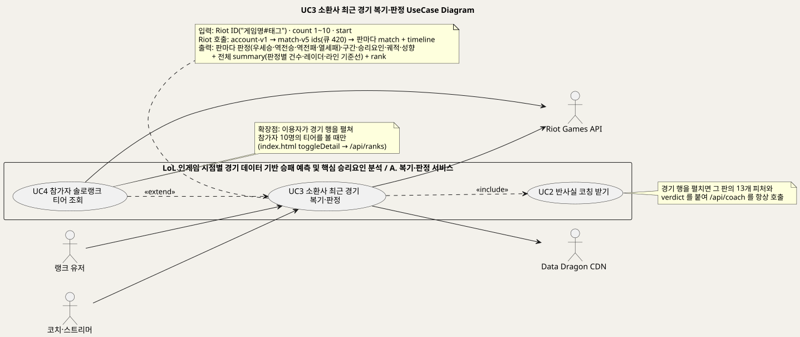
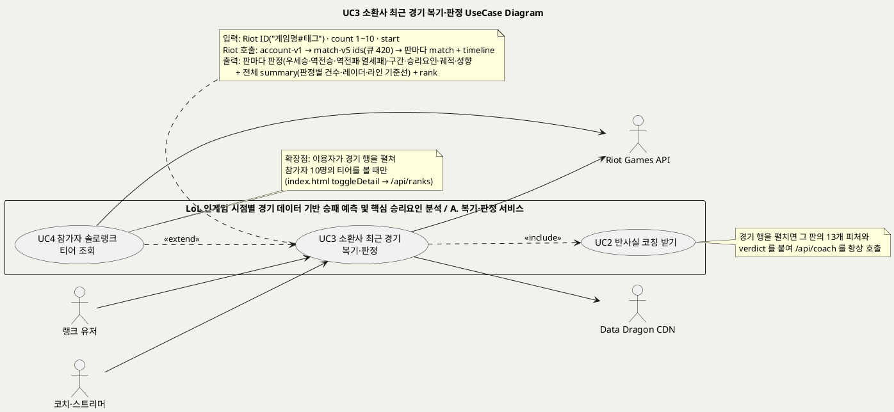
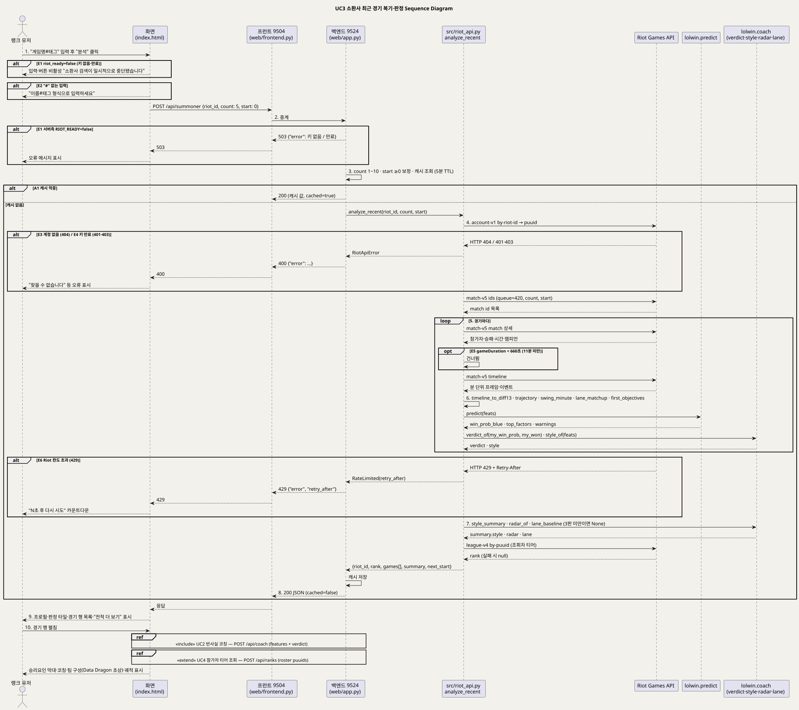
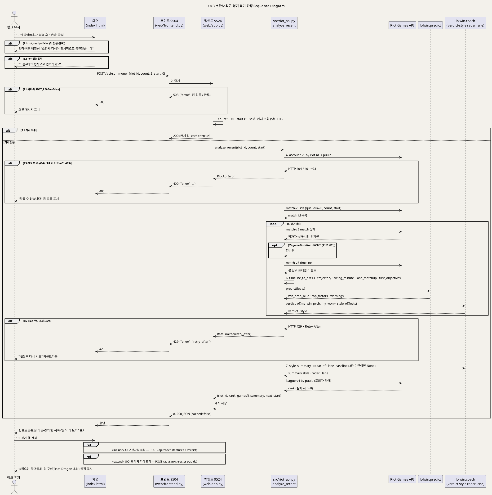

<!-- ─────────────────────────────────────────────
  UC3 상세 명세 — Riot ID 로 최근 솔로랭크 경기를 10분 시점에서 되감아 판정하는 흐름.
  왜 필요한가: 개요(UC_00)의 목록을 구현 가능한 수준(사전·사후조건·흐름·예외·업무규칙·시퀀스)으로 내린다.
  주로 보는 사람: 팀원(구현·검수) · Claude(검수)
  ───────────────────────────────────────────── -->

# UseCase 명세 #3 소환사 최근 경기 복기·판정 (A. 복기·판정 서비스)
**LoL 인게임 시점별 경기 데이터 기반 승패 예측 및 핵심 승리요인 분석 · UC3 · UML 2.5.1 표준 (UseCase Diagram + UseCase 기술 + Sequence Diagram)**

---

> **문서 식별**: `docs/usecases/UC_03_소환사최근경기복기판정.md`
> **작성일**: 2026-09-07 · **표준**: UML 2.5.1 (OMG)
> **원천(SoT)**: `src/riot_api.py` 전체(`_get`·`RateLimited`·`key_works`·`get_puuid`·`get_recent_match_ids`·`get_match`·`get_timeline`·`timeline_to_diff13`·`timeline_trajectory`·`swing_minute`·`lane_matchup`·`first_objectives`·`get_rank`·`analyze_recent`) · `web/app.py` `RIOT_READY`·`_cached_summoner`·`api_summoner` · `lolwin/coach.py` `verdict_of`·`style_of`·`style_summary`·`radar_of`·`lane_baseline` · `web/templates/index.html` 검색행·`doSearch`·`loadSummoner`·`toggleDetail` · `docs/serving.md` §4·§5·§6 · `docs/product.md` §1·§2·§3·§4 · `docs/riot-api-application.md` · `docs/deploy.md` "Riot API 키"
> **개요 문서**: [UC_00_개요_LoL승패예측및핵심승리요인분석.md](UC_00_개요_LoL승패예측및핵심승리요인분석.md) §3 UC3 행
> **다이어그램**: 모든 PlantUML 소스는 로컬 Kroki 에서 렌더 검증 완료(HTTP 200). 렌더 결과는 `diagrams/*.svg` 로 함께 두어 로그인 없이 보인다. 뷰어 링크는 사내 서버라 SSO 로그인이 필요하다.

---

## 목차

1. [범위·개요](#1-범위개요)
2. [UseCase Diagram](#2-usecase-diagram)
3. [Actor 카탈로그](#3-actor-카탈로그)
4. [UseCase 목록 (원천 매핑)](#4-usecase-목록-원천-매핑)
5. [UseCase 기술 + Sequence Diagram](#5-usecase-기술--sequence-diagram)
6. [업무규칙(Business Rules) 종합](#6-업무규칙business-rules-종합)
7. [UML 표준 준수 노트](#7-uml-표준-준수-노트)

---

## 1. 범위·개요

이 유스케이스는 이용자가 **Riot ID("게임명#태그")** 를 넣으면 시스템이 Riot Games API 에서 그 사람의 최근 솔로랭크 경기를 받아
**10분 시점 상태로 되감아** 13개 차이 피처를 만들고, 같은 예측 함수로 승률을 구한 뒤 실제 결과와 교차해 **네 갈래 판정(우세승·역전승·역전패·열세패)** 을
내리는 흐름이다. 판정과 함께 골드차 구간, 승리요인 5개, 분 단위 골드차 궤적과 "몇 분에 갈렸나", 플레이 성향, 라인 상대 비교를 경기마다 돌려주고,
여러 판을 모은 요약(판정별 건수·다섯 축 레이더·라인 기준선)과 조회자의 솔로랭크 티어를 첫 화면 타일에 채운다.
(근거: `src/riot_api.py` `analyze_recent`, `docs/serving.md` §6 "/api/summoner 응답")

이 판정이 서비스의 존재 이유다. 기존 전적 사이트는 "무슨 일이 있었나"(KDA·CS)를 보여주지만, 10분 시점 모델이 있어야 "언제 갈렸나"를 말할 수 있고,
같은 패배라도 열세패(라인전 문제)와 역전패(앞선 판을 못 끝냄)를 갈라 처방을 반대로 낼 수 있다. (근거: `docs/product.md` §1, `docs/serving.md` §6)
이 모듈은 "타임라인 → 13개 피처" 변환만 하고 예측은 언제나 `predict` 가 한다. (근거: `src/riot_api.py` 머리말)
경기 행을 펼치면 그 판의 피처와 판정을 붙여 코칭(UC2)을 항상 호출하므로 UC2 를 «include» 하고, 참가자 티어(UC4)는 행을 펼칠 때만 별도 호출되므로 UC4 가 이 UC 를 «extend» 한다.
(근거: `index.html` `toggleDetail`, `docs/serving.md` §5 `/api/ranks`)

| 항목 | 값 |
|---|---|
| 대상 시스템 | LoL 인게임 시점별 경기 데이터 기반 승패 예측 및 핵심 승리요인 분석 — 패키지 A. 복기·판정 서비스 |
| 상위 프로세스 | 경기 후 복기 — ① 예측 → ② 원인(판정) → ③ 지시(코칭). 이 UC 는 ①·② 를 "내 경기"에 적용한다 (`docs/product.md` §0·§1) |
| 원천 근거 | `src/riot_api.py` `analyze_recent` · `web/app.py` `api_summoner` · `lolwin/coach.py` `verdict_of` · `index.html` `loadSummoner`·`toggleDetail` · `docs/serving.md` §5·§6 · `docs/product.md` §1·§3 F5·F6 · `docs/riot-api-application.md` |
| 핵심 UseCase | 1개 (UC3) + 포함 UC 1개 (UC2) + 확장 UC 1개 (UC4) |
| 주요 액터 | 랭크 유저(주) · 코치·스트리머(주) · Riot Games API(보조) · Data Dragon CDN(보조) |

---

## 2. UseCase Diagram

PlantUML 소스 보기

소스를 직접 렌더하려면 **[「UC3 UseCase Diagram」 PlantUML 뷰어로 열기](https://plantuml.sumzip.com/plantuml/svg/eNp9VF1rG0cUfd9fcVFeJII_ZLkvJpikUlICoZRA3gJlslpLi6XdsDtyE0qL3WyCayutKJIju5KQwW4-kGFjy9IalBf_lDxq7vyH3pmV5LilFSyamXvP3LPnnru3fc48XimXoGIuZr6v-JbJfMvw123nKfNYGZ4wc73guRUnn3VLrgc37mXupe9-_UWGX2R59wfbKcAaKxG2ZK1x4C54dqHIIW97lslt1zG4zUsWPMpmAF9V5X4Tf-kBnrfGwxGMTz-NoxDE2Tn9XQ5ltYbdBjzyrSyRgZzNClTIMJjJiUFCdE7kFmFbXexuJoD58JA565Y3jeOnOl40L4e4cyR3IvFXT7yLdFrWZWbRMBQh5hSITOKB-wCwHY1Pq9gJAHdb2K2Js2BG6HWI7b4MQqCdCJuAOxey-g6wuY3RIYjwd5CNc9ztqQAVwoM63QZiEGDQhgW4M__Pd8KgJS4CYpaAHw2Aid6Q-B9ZHjvX79CvQvnX4UvERmFx9wi0ACd08CfBJulL19OXAcNoHG5ip0Z16-KwFav62JG7Ie71AQ9DeVCdgJeNn2bqP7RdDt-wsuXDne_ux_LT0TScY5xBzmMF14Fs7lsdz8V7w4j7BHNzq_oFdD9mOyXB_LxaL8EK3LplO2apkrdWVw1FN45kdMR6xi0nrwMZDdcEpptpNYWaBQ3H5RY8cTl3y-CuTfTDzkvRPV7RKXA_l0zERhAfXt6QL6gFUSIFl0Mwyf4c0j-nF9VOTwyBNUg2Ixy0VoCZOmluIw2fX_0BZcbN4tzGV2Dn_aTcqsHy0mJKR6iH4u22oC7pHLgJ3C5bJduxFJ9BS_O5SopbnsSDEIOITEaufnOC3eCLJRlSLfuUQMvU5XB83huHgfL_lSfpdHCE3S06DT7KvWMqFv9ugrrttA9-pVxm3vNkXFEPwcc-btMcie42TYF4Xadle6QMTrbCo00MuinCe9RUg_oBSuJY53j0tczLVEnuN7BzTKO1QsPWx4P35Dry3nTK5N6v2A5A_jbCs5pSYebM9CK1AttNiE0pjkc0T_Q0quJtlTKTtpO3ns0XOX2_uFugkc5ZnNklrfQCe2ovKHJ-6r_pqbH4N42LpnjfB-q_1p_qpzPjsAWyPsLTJu5vEmjD8vK2yUFzGuzjm15c0NSeVqeycYIvtiYOuWJwm1b0vTX-BrI4meY=)** (사내 서버, SSO 로그인 필요) 또는 [로컬 Kroki 로 열기](http://192.168.0.91:8889/plantuml/svg/eNp9VF1rG0cUfd9fcVFeJII_ZLkvJpikUlICoZRA3gJlslpLi6XdsDtyE0qL3WyCayutKJIju5KQwW4-kGFjy9IalBf_lDxq7vyH3pmV5LilFSyamXvP3LPnnru3fc48XimXoGIuZr6v-JbJfMvw123nKfNYGZ4wc73guRUnn3VLrgc37mXupe9-_UWGX2R59wfbKcAaKxG2ZK1x4C54dqHIIW97lslt1zG4zUsWPMpmAF9V5X4Tf-kBnrfGwxGMTz-NoxDE2Tn9XQ5ltYbdBjzyrSyRgZzNClTIMJjJiUFCdE7kFmFbXexuJoD58JA565Y3jeOnOl40L4e4cyR3IvFXT7yLdFrWZWbRMBQh5hSITOKB-wCwHY1Pq9gJAHdb2K2Js2BG6HWI7b4MQqCdCJuAOxey-g6wuY3RIYjwd5CNc9ztqQAVwoM63QZiEGDQhgW4M__Pd8KgJS4CYpaAHw2Aid6Q-B9ZHjvX79CvQvnX4UvERmFx9wi0ACd08CfBJulL19OXAcNoHG5ip0Z16-KwFav62JG7Ie71AQ9DeVCdgJeNn2bqP7RdDt-wsuXDne_ux_LT0TScY5xBzmMF14Fs7lsdz8V7w4j7BHNzq_oFdD9mOyXB_LxaL8EK3LplO2apkrdWVw1FN45kdMR6xi0nrwMZDdcEpptpNYWaBQ3H5RY8cTl3y-CuTfTDzkvRPV7RKXA_l0zERhAfXt6QL6gFUSIFl0Mwyf4c0j-nF9VOTwyBNUg2Ixy0VoCZOmluIw2fX_0BZcbN4tzGV2Dn_aTcqsHy0mJKR6iH4u22oC7pHLgJ3C5bJduxFJ9BS_O5SopbnsSDEIOITEaufnOC3eCLJRlSLfuUQMvU5XB83huHgfL_lSfpdHCE3S06DT7KvWMqFv9ugrrttA9-pVxm3vNkXFEPwcc-btMcie42TYF4Xadle6QMTrbCo00MuinCe9RUg_oBSuJY53j0tczLVEnuN7BzTKO1QsPWx4P35Dry3nTK5N6v2A5A_jbCs5pSYebM9CK1AttNiE0pjkc0T_Q0quJtlTKTtpO3ns0XOX2_uFugkc5ZnNklrfQCe2ovKHJ-6r_pqbH4N42LpnjfB-q_1p_qpzPjsAWyPsLTJu5vEmjD8vK2yUFzGuzjm15c0NSeVqeycYIvtiYOuWJwm1b0vTX-BrI4meY=) (내부망 전용). 위 그림 파일은 로그인 없이 보인다.

#### 다이어그램 쉽게 읽기 (유저 관점)

1. **누가 쓰나** — 왼쪽의 랭크 유저는 자기 경기를, 코치·스트리머는 제자나 시청자의 경기를 넣는 사람이다. 둘 다 같은 검색창을 쓴다.
2. **무슨 순서로** — 게임 이름(소환사명#태그)을 넣고 "분석"을 누르면, 시스템이 게임 회사(Riot) 창구에서 최근 경기 기록을 받아 온다. 각 경기를 10분 시점으로 되감아 "그때 이기고 있었나"를 재고, 실제 결과와 맞춰 "우세승·역전승·역전패·열세패" 네 가지 도장 중 하나를 찍어 목록과 요약을 보여 준다.
3. **«include» = 항상 함께** — 경기 한 판을 펼치면 그 판의 코칭(UC2)이 반드시 같이 온다. "어디서 졌나"에서 멈추지 않고 "그래서 뭘 하라"까지 가기 위해서다.
4. **«extend» = 특별한 때만** — 그 판에 있던 10명의 등급(UC4)은 판을 펼쳤을 때만 따로 물어본다. 처음부터 다 물어보면 창구에 한 번에 너무 많이 묻게 되어 "잠깐 기다려"라는 답을 받기 때문이다.
5. **Generalization(◁)** — "이 사람은 저 사람의 한 종류"라는 표시인데, 이 그림에는 나오지 않는다.
6. **오른쪽의 바깥 친구들** — Riot Games API 는 게임 회사가 경기 기록을 나눠 주는 창구이고, Data Dragon CDN 은 캐릭터 그림을 주는 창고다. 둘 다 우리가 만든 것이 아니라 울타리 밖에 있다.

#### 표준 기호 범례

| 기호 | 의미 | UML 2.5.1 |
|---|---|---|
| 사람 모양 (actor) | 이 시스템을 쓰는 사람, 또는 바깥에서 자료를 주고받는 다른 시스템. 사람이 아니어도 사람 모양으로 그린다 | Actor |
| 타원 (usecase) | 그 사람이 이 시스템으로 이루고 싶은 일 하나. 버튼이나 화면이 아니라 "목표" 단위다 | UseCase |
| 큰 사각형 (rectangle) | 우리가 만든 것의 울타리. 안쪽은 우리 책임, 바깥은 남의 것 | Subject (System Boundary) |
| 실선 화살표 | 그 사람이 그 일을 시작한다는 뜻. 타원에서 오른쪽 바깥으로 나가는 선은 시스템이 그쪽에 물어본다는 뜻 | Association |
| 점선 화살표 «include» | 이 일을 하면 저 일도 항상 같이 일어난다 | Include |
| 점선 화살표 «extend» | 특별한 때에만 덧붙는 일. 언제 그런지는 옆의 메모(note)에 적혀 있다 | Extend |

---

## 3. Actor 카탈로그

| 액터 | 구분 | 설명 | 근거 |
|---|---|---|---|
| 랭크 유저 | Primary | 1차 타겟. "왜 지는지 모르겠다" — 최근 판의 판정(역전패 n판 등)으로 원인이 라인전인지 마무리인지 가린다 | `docs/product.md` §2 "1차" |
| 코치·스트리머 | Primary | 2차 타겟. 제자·시청자의 최근 판을 넣어 약점 유형을 한 줄로 본다 | `docs/product.md` §2 "2차" |
| Riot Games API | Secondary | account-v1(Riot ID → puuid) · match-v5(최근 경기 id 목록·경기 상세·타임라인) · league-v4(솔로랭크 티어). 개발용 키는 24시간마다 만료되고 예산은 100회/120초 | `src/riot_api.py`, `docs/riot-api-application.md` "WHICH APIS WE USE", `docs/deploy.md` "Riot API 키", `src/collect_ranking.py` 머리말 |
| Data Dragon CDN | Secondary | 챔피언 초상 이미지와 버전 목록을 주는 공식 CDN. 화면이 직접 부른다 | `index.html` `DDRAGON`, `docs/riot-api-application.md` "DATA HANDLING" |
| (내부) `src/riot_api.py` | 시스템 구성요소 | Riot 호출과 "타임라인 → 13개 피처" 변환. 예측은 하지 않는다 | `src/riot_api.py` 머리말 |
| (내부) `lolwin.predict` · `lolwin.coach` | 시스템 구성요소 | 예측(단일 진실)과 판정·성향·레이더·라인 기준선 계산 정본 | `src/riot_api.py` `analyze_recent` import 문 |

---

## 4. UseCase 목록 (원천 매핑)

| UC ID | 유스케이스명 | 주액터 | 관계 | 원천 근거 |
|:--:|---|---|---|---|
| UC3 | 소환사 최근 경기 복기·판정 | 랭크 유저 · 코치·스트리머 | 기준 UC | `src/riot_api.py` `analyze_recent` · `web/app.py` `api_summoner` · `docs/serving.md` §5·§6 · `docs/product.md` §1·§3 F5·F6 |
| UC2 | 반사실 코칭 받기 | 이용자 | UC3 이 «include» | `index.html` `toggleDetail` (features + verdict 로 `/api/coach`) — 상세는 `UC_02_반사실코칭.md` |
| UC4 | 참가자 솔로랭크 티어 조회 | 랭크 유저 · 코치·스트리머 | UC3 을 «extend» (행을 펼칠 때만) | `index.html` `toggleDetail` (`/api/ranks`) · `docs/serving.md` §5 — 상세는 `UC_04_참가자티어조회.md` |

---

## 5. UseCase 기술 + Sequence Diagram

### 5.1 UC3 소환사 최근 경기 복기·판정

> **쉽게 말하면** — 게임 이름(소환사명#태그)을 넣으면 최근 경기를 한 판씩 꺼내 와서, 10분 시점으로 되감아 "그때 이기고 있었나"를 계산한다.
> 그리고 실제 결과와 맞춰 "앞서다가 이김·뒤지다가 뒤집음·앞서다가 짐·뒤지다가 짐" 네 가지 도장 중 하나를 찍는다.
> 여러 판을 모으면 "역전패 6판"처럼 무엇을 고쳐야 할지 보이고, 한 판을 펼치면 왜 그랬는지와 그때 뭘 했어야 했는지까지 나온다.

#### 유스케이스 기술

| 속성 | 내용 |
|---|---|
| **ID** | UC3 — 원천 식별자: `src/riot_api.py` `analyze_recent` · `web/app.py` `api_summoner` · `docs/serving.md` §5 `/api/summoner` · `docs/product.md` §3 F5·F6 |
| **유스케이스명** | 소환사 최근 경기 복기·판정 |
| **액터** | 주액터: 랭크 유저 · 코치·스트리머. 보조액터: Riot Games API(account-v1·match-v5·league-v4) · Data Dragon CDN(챔피언 초상) |
| **사전조건** | (1) 백엔드가 기동 시 `key_works()` 로 확인한 Riot API 키가 실제로 통해 `RIOT_READY=true` 다 — 키가 없거나 만료면 화면이 검색창·"분석" 버튼을 비활성화하고 이 UC 를 권하지 않는다 (`web/app.py` 27~36행, `index.html` 검색행, `docs/deploy.md`). (2) 키는 `.env` 의 `RIOT_API_KEY` 환경변수로만 읽는다 (`src/riot_api.py` `_get`). (3) 대상 경기가 **끝난** 솔로랭크(큐 420) 경기다 — 진행 중 경기는 불가 (`src/riot_api.py` 머리말, `docs/product.md` §4). (4) 로그인·계정은 없다 — Riot ID 는 요청 중에만 쓰고 저장하지 않는다 (`docs/riot-api-application.md` "DATA HANDLING") |
| **사후조건** | (1) 응답에 `riot_id` · `queue` · `rank`(조회 실패 시 null) · `games[]` · `summary` · `start` · `next_start` · `cached` 가 담겨 반환됐다. (2) 경기마다 `verdict`(우세승·역전승·역전패·열세패) · `band` · `my_side` · `my_win_prob` · `my_won` · `win_prob_blue` · `top_factors` 5개 · `warnings` · `trajectory` · `swing_minute` · `style` · `lane` · `first_objectives` · `roster` 10명(티어는 null) · `played_at` 이 서버에서 계산돼 화면은 계산하지 않는다 (`docs/serving.md` §6). (3) `summary` 에 `n` · `period` · `avg_win_prob_10min` · 판정별 건수 · `model_correct` · `style` · `radar` · `lane` 이 있다. (4) 같은 (riot_id, count, start) 결과가 백엔드 캐시에 5분간 남아 다음 같은 요청은 Riot 호출 없이 응답된다 (`web/app.py` `_cached_summoner`). (5) Riot ID·puuid·경기 데이터는 캐시 만료 외에 서버에 저장되지 않는다 |
| **기본흐름** | ↓ 별도 기본흐름표 |
| **대체흐름** | A1. **캐시 적중** — 3단계에서 같은 (riot_id 소문자, count, start) 가 5분 안에 조회된 적이 있으면 Riot 을 부르지 않고 저장된 결과에 `cached=true` 를 붙여 즉시 응답한다 (`web/app.py` `_cached_summoner`, `docs/serving.md` §5). 4~8단계 생략. A2. **전적 더 보기** — 9단계 뒤 이용자가 "전적 더 보기"를 누르면 화면이 `start=next_start` 로 같은 요청을 보내 다음 5판을 받아 목록 뒤에 붙이고, 요약은 지금까지 불러온 전부로 화면에서 다시 센다(성향 포함). 마지막 페이지가 5판 미만이면 버튼을 숨긴다 (`index.html` `loadSummoner` append, `src/riot_api.py` `get_recent_match_ids` start). A3. **팀원·상대 이름으로 이어 검색** — 펼친 행의 팀 구성이나 챔피언 탭의 "잘하는 유저" 이름(`data-search`)을 누르면 그 Riot ID 로 이 UC 를 다시 시작한다 (`index.html` `a.rname[data-search]`). A4. **API 직접 호출** — 외부 연동이 화면 없이 `POST /api/summoner` 에 `riot_id` · `count`(1~10, 기본 5) · `start` 를 보낸다. 범위를 벗어난 값은 1~10 · 0 이상으로 보정하고, 숫자가 아니면 기본값 5·0 으로 되돌린다 (`web/app.py` `api_summoner`). A5. **명령행 실행** — `python src/riot_api.py "게임명#태그"` 로 같은 `analyze_recent` 를 불러 터미널에 판별 결과를 찍는다 (`src/riot_api.py` `__main__`) |
| **예외흐름** | E1. **키 없음·만료 (503)** — `RIOT_READY=false` 면 화면은 검색창을 잠그고 "소환사 검색이 일시적으로 중단됐습니다"를 보이며, API 로 직접 부르면 키가 아예 없을 때와 있는데 만료됐을 때를 다른 문구로 나눠 HTTP 503 을 돌려준다 (`web/app.py` `api_summoner`, `index.html` 검색행). 기동 후 키가 죽었다면 호출 시 401·403 → `RiotApiError` "API 키가 만료됐거나 잘못됐습니다" → HTTP 400 (E4). E2. **형식 오류** — 입력에 "#" 이 없으면 화면이 서버를 부르지 않고 "이름#태그 형식으로 입력하세요"를 표시한다(`index.html` `doSearch`). API 로 직접 오면 `analyze_recent` 가 `RiotApiError` 를 올려 HTTP 400. E3. **계정 없음 (404)** — account-v1 이 404 를 주면 `RiotApiError` "찾을 수 없습니다 (소환사명/태그 확인)" → HTTP 400 → 화면에 오류 문구 (`src/riot_api.py` `_get`). E4. **키 만료·오류 (401·403)** — `RiotApiError` "API 키가 만료됐거나 잘못됐습니다" → HTTP 400. 운영자가 키를 갱신해야 한다(UC14). E5. **11분 미만 경기** — `gameDuration < 660` 초(조기 항복 등)이면 그 판을 건너뛴다. 10분 프레임이 없는 타임라인은 `timeline_to_diff13` 이 "10분 전에 끝난 경기입니다"로 거부한다 (`src/riot_api.py` `analyze_recent`·`timeline_to_diff13`). 모든 판이 걸러지면 화면은 "최근 솔로랭크 경기를 찾지 못했습니다". E6. **Riot 한도 초과 (429)** — 어느 호출이든 429 가 오면 서버는 기다리지 않고 `RateLimited(retry_after)` 를 즉시 올려 HTTP 429 + `retry_after` 초를 돌려주고, 화면은 "N초 후 다시 시도" 카운트다운을 보인다. 웹 요청 안에서 기다리면 프록시 타임아웃(502)이 나기 때문이다 (`src/riot_api.py` `RateLimited`, `web/app.py`, `index.html` `loadSummoner`, `docs/serving.md` §4). E7. **그 밖의 Riot 오류·서버 오류** — 다른 HTTP 코드는 `RiotApiError` "Riot API 오류 HTTP n" → 400, 예상 밖 예외는 "서버 오류" → 500. 화면은 "조회에 실패했습니다" (`web/app.py`, `index.html`). E8. **티어 조회 실패** — 조회자 `rank` 는 league-v4 실패 시 null 로 두고 본 기능은 계속된다. 429 로 못 받은 것은 캐시하지 않아 다음 요청에서 다시 시도한다 (`src/riot_api.py` `get_rank`) |
| **포함/확장** | «include» UC2 반사실 코칭 받기 — 경기 행을 펼칠 때 그 판의 13개 피처와 `verdict` 를 붙여 `/api/coach` 를 항상 호출 (`index.html` `toggleDetail`). «extend» UC4 참가자 솔로랭크 티어 조회 — 확장점: 행을 펼쳐 팀 구성을 볼 때만 `/api/ranks` 로 10명 티어를 받는다 (`docs/serving.md` §5) |
| **우선순위** | High — 1차 타겟(랭크 유저)의 핵심 기능이며 판정 요약 타일(F6)이 첫 화면을 채운다. "막힌 것은 코드가 아니라 Riot API 키 하나"라고 원천이 명시한다 (`docs/product.md` §2·§3 F5·F6) |
| **사용빈도** | 자료 없음 — 확인 필요. [추론] 한 요청이 최대 5판을 분석하며 약 12콜(계정 1 + 목록 1 + 판마다 상세·타임라인 2)이고, 예산이 100회/120초라 동시 이용자 다섯 명이면 한도가 끝나므로 5분 캐시로 재사용한다 (`docs/riot-api-application.md` "HOW WE RESPECT THE RATE LIMITS", `web/app.py` 525행 주석) |
| **업무규칙** | BR-SUM-01 ~ BR-SUM-12 (§6) |
| **특별 요구사항** | (1) **응답 시간** — 판마다 타임라인을 받아 계산하므로 "수십 초 걸립니다"를 화면에 미리 알린다. 그래서 한 페이지 5판, 상한 10판 (`index.html` `loadSummoner`, `web/app.py`). (2) **한도 존중** — 모든 호출은 단일 래퍼 `_get` 을 거치고 429 의 `Retry-After` 를 존중한다. 웹 경로는 기다리지 않고, 배치 전용 `get_with_wait` 만 재시도한다 (`src/riot_api.py`). (3) **개인정보** — 계정을 만들지 않고 Riot ID 를 저장하지 않으며 경기 데이터를 재배포하지 않는다. 화면마다 "Riot Games 가 보증하지 않음" 고지를 싣는다 (`docs/riot-api-application.md` "DATA HANDLING"). (4) **User-Agent 필수** — 없으면 Cloudflare 가 차단한다 (`src/riot_api.py` `_get`). (5) **라우팅** — 계정·경기는 asia 대륙, 티어는 kr 플랫폼 (`src/riot_api.py` `ROUTING`·`PLATFORM`). (6) **화면이 계산하지 않는다** — `my_win_prob` · `verdict` · `band` 등은 서버가 준다. 계산 정본은 한 곳 (`docs/serving.md` §6). (7) 접근성·규제: 자료 없음 — 확인 필요 |
| **비고** | 원천 추적성 — `src/riot_api.py` 머리말(할 수 있는 것·없는 것)·`RateLimited`(웹에서 기다리지 않는 이유)·`_get`(401/403/404/429 처리)·`key_works`(429 는 False 로 보지 않음)·`analyze_recent`(큐 420·660초·내 팀 기준 뒤집기·roster·summary) · `web/app.py` 27~36행(`RIOT_READY`)·525~578행(`_SUMMONER_CACHE`·`SUMMONER_TTL`·`api_summoner`) · `lolwin/coach.py` `verdict_of`(네 갈래)·`style_of`·`style_summary`(3판 미만 `enough:false`)·`radar_of`(3판 미만 None)·`lane_baseline`(3판 미만 None, 골드로 판정) · `index.html` 검색행(riot_ready 게이팅)·`doSearch`·`PAGE=5`·`loadSummoner`(429 카운트다운·요약 재집계·더 보기)·`toggleDetail`(`/api/coach`·`/api/ranks`·Data Dragon 초상) · `docs/serving.md` §4·§5·§6 · `docs/product.md` §1(판정 표)·§2·§3 F5·F6·§4(실시간 불가) · `docs/riot-api-application.md` · `docs/deploy.md` "Riot API 키". 기본흐름이 10단계인 것은 Riot 왕복(4·5)과 계산(6·7)을 분리해 시퀀스와 1:1 로 맞추기 위해서이며, 분할하지 않았다 |

#### 기본흐름 (Basic Flow)

| 단계 | 액터 행위 | 시스템 행위 |
|:--:|---|---|
| 1 | 랭크 유저가 "유저 전적 분석" 탭의 검색창에 "게임명#태그"(예: Hide on bush#KR1)를 넣고 "분석"을 누른다 | 화면이 "#" 포함 여부를 확인하고(E2) 안내문 "최근 경기를 10분 시점으로 되감는 중… 수십 초 걸립니다"를 띄운 뒤 `POST /api/summoner` 에 `riot_id` · `count=5` · `start=0` 을 보낸다 |
| 2 | — (기다린다) | 프런트(9504)가 요청을 백엔드(9524)로 중계한다. 백엔드는 `RIOT_READY` 를 확인한다(E1) |
| 3 | — | 백엔드가 `count` 를 1~10, `start` 를 0 이상으로 보정하고 캐시를 조회한다. 5분 안의 같은 요청이면 저장값을 돌려준다(A1) |
| 4 | — | `analyze_recent` 가 Riot ID 를 "게임명"과 "태그"로 나눠 account-v1 로 `puuid` 를 받고(E3·E4), match-v5 로 솔로랭크(큐 420) 최근 경기 id 를 `count` 개 받는다 |
| 5 | — | 경기마다 match-v5 상세를 받아 11분 미만이면 건너뛰고(E5), 블루·레드 참가자 집합과 본인 팀을 확인한 뒤 타임라인을 받는다. 어느 호출이든 429 면 즉시 중단한다(E6) |
| 6 | — | 타임라인의 10분 프레임과 0~10분 이벤트로 13개 차이 피처를 만들고, 분 단위 골드차 궤적·갈린 분·라인 상대 비교·첫 오브젝트 시각을 뽑는다. `predict(feats)` 로 블루 승률·승리요인 5개·경고를 받고, 본인이 레드면 확률·승패를 내 팀 기준으로 뒤집어 `verdict_of` 로 판정하고 `band` · `style` 을 붙인다 |
| 7 | — | 모은 경기로 `summary`(판정별 건수·`avg_win_prob_10min`·`model_correct`·`period`·`style`·`radar`·`lane`) 를 계산하고 league-v4 로 조회자 티어를 받는다(E8). 결과를 캐시에 저장한다 |
| 8 | — | 백엔드가 `{riot_id, queue, rank, games[], summary, start, next_start, cached}` 를 HTTP 200 JSON 으로 응답하고 프런트가 중계한다 |
| 9 | 결과를 읽는다 — 프로필 옆 레이더, 판정 타일(우세승·역전승·역전패·열세패 건수), 경기 행 목록을 본다 | 화면이 프로필(티어·레이더·라인 기준선)·요약 타일·성향 블록·경기 행(챔피언·판정·구간·10분 승률·갈린 분)을 그리고, 5판이 가득 찼으면 "전적 더 보기"를 보인다(A2) |
| 10 | 관심 있는 경기 행(특히 역전패)을 펼친다 | 화면이 승리요인 막대(실제 격차 + 기여도 크기)·골드차 궤적·팀 구성(Data Dragon 초상)을 그리고, «include» UC2 로 코칭을, «extend» UC4 로 참가자 티어를 그 자리에서 불러온다 |

#### Sequence Diagram

PlantUML 소스 보기

소스를 직접 렌더하려면 **[「UC3 Sequence Diagram」 PlantUML 뷰어로 열기](https://plantuml.sumzip.com/plantuml/svg/eNp1V1tvG9cRfuevGKxfSISkeZNTCbER2ZJbF4ElyMpD0QTEEXkob73cZfYiRw0cUPHGkEW2lRPKkV3SlVD5ltooJVOh1Cp94E_xI8_Z_9A5Z3cpkpKfqN2db2bON_PNHH1q2cS0nbIGTiGVzVv0K4fqBRqx7qh6hZikDEukcGfZNBy9eM3QDBMuXM9eT89eHbKwbpOicVfVl6FENItGbNXWKHx-LQv8Qd17ss2_ewP8sNnvnkD_4Nf-URvYu0P86XW9-ibf2YJbQVSYUckyeoxESMHGUAp79tZbQ3Bzh-9UFSAWfG5RM4JhbbWgVohug-I9abDXnS_0qKoX6dfJ23ZZi_mmN8YMGy77R9vbOILJiVQOAXfp0sWSaeg21YvJyqqPuj47imLtff5Tg_3YRFQmRJFKZQC4OgawzMJFUzXsPKmoaPSFTnSirf6Z5k1aoLotMQvTo5gFtIffkjK1YHr-hm-Cr0aNNENDkpMVkxbVgu9nfuFck4JBCrcx1RVqCtNe17JXNdrrmqRIzF5XIzr1c782F4kIRiFxBemCKUgnQekf1Pkzl_38_QXvPhbtSAH-7Hu28xy8v7vIxy8ud1sKeGsd9uJthGg2zKZBHtikpLh6WfYARL3v9oD_9IC36r0ue1ln_6zHIiCCJEQsEXMq8IvfD1xv4wTYses9aXJ3H5TTxukfVPn9h7zVAd464bUm31njzRO22wS-94jVXrHNTb5xyGrrrLanRLCSfkoZUC4oIgG20QjinAmvoFf2wg2OCd72Fq-1QucS4m1tc_eIP234ngX8CnYIYufnbi0C9oF60XLKZUNHh99IEtRiHAqoFnsKJuIg1TUFqXsRRCH2qsBmkiL3_js3ZI-7TaSAH-3Cwo25xfzC7PTMH3weMWeEJMKoE6ksfKNQ0zRMZQpOKYaL4HN8DwHXfYCsJwLOsr69x55vA3vdEHS-rIL3qIl_yRNePc0ym_TPAelv0ynodf2zwPuHz1Oo347QLb7k_9lELPDdtve0DtEJbA9YXPwsJo82nR58x6rtPRo7TSaVgmhg0G__gLxh29LiZdt0aCxCRRuFcHnKAH4F5YPoUVlFR8kPmBcth8YCIhQ2BbkkkIK0SKykYWk1IWAJtQjvH_wAFcdRi4iQVckCFkgcMmA4mkvlYsjzbE7y7tMt3qZ73VwqKyKBHyURZvi7xcV5QBiiQjPfalraSJYFYrqizoqSyo_DBOWQoNNyJ5PJe9JkuMBoIt-Nd3b7f7zlAl_flvkPBALsx_2wAYKyA4jCj_FUJnbhdmJlAtSiBVGczg69nMukzmF35MQShhhgP79muy38rhlGBSaSweBnL0UWAxLOhvMd8PtrKLtzGOXto367yp9t9rp849irv8LfWrPfdvF3v-E1TvhjH2ZUsIQTsIwjdcYxia0aOnwCly6leGcdoum0aFP27yOsol-4QT4iSn-_w9x11qzKTz47H0rYVstUU3V6TrIyRu0Vb7ogVs_OOk5VzBNnzsEebqHIWNRLyYGzvG3ki2qplM4Kidkm-RMV-3BVqlAs2nxZ1R2bimcxzPMyHacinkuqadl5Y0lA1BVqDYWZX8AwwfqIliixLf_w-H6QNHrPV0xjKb-kOdK_bVTyJbmOLfF4l5g6JjDs9toc4oJVkzdK0fJqPvQSB_Fg6DF_fuASEgZDoRE7CB24GJgOOlPq8ZLPrrfVZH_Dxu6s99-doPwykx9WXmYSPoIFapuriemSTc2z4iM2_UwtqzYtRk1hlyfCLnZWiOgqFGIclCFb5RxJZibPk-RN0XpihaIC5EyriZPgjjru8KcdbAjx_mlnTI-S3I-TAXli1xC_D-QuRzYHPbBELNk8EM3itSrobtFtrztwExeUONUw3YGvpPQ88Bi6Gx8IGiXLDk2s5MTQlIMSR7cc-qhG8Gpt_rhzdh6YRL-DdrU9lKo4MOiOpoVDOazC6d4U5nEpWuuPX8bDDOOg06_tvBw59wY7QEIH2wVnwvOx7fKbpFwwv781dxOiwWaROzUmN91wxXgLbxKHkdGCTSalbHeb3pY7uKl696t4Del1g3us9_hhMOp6XYXv4L5YA_aXhtiP-FkJR-zoFSsVTkMJ9_56wo9fRUxaAgMVgDZxzD_un6_3L1UvaE6R9v6L9-kMsLa4EyGfwH9t8OO38L7aGLqKyHsfSH05Jt4lPwo1Ffugf2QW2ZDuc6fjNShouNZHo4gq4VIwDQv731-aqOaxO8bGMXvxBi9OvHWEu_Ihq1dx9MmcBZdV6B--wYtedIbYBGZMsozzGfWBgz-G5P6yJ4gMyPsU88P_TyL_B7gJBdU=)** (사내 서버, SSO 로그인 필요) 또는 [로컬 Kroki 로 열기](http://192.168.0.91:8889/plantuml/svg/eNp1V1tvG9cRfuevGKxfSISkeZNTCbER2ZJbF4ElyMpD0QTEEXkob73cZfYiRw0cUPHGkEW2lRPKkV3SlVD5ltooJVOh1Cp94E_xI8_Z_9A5Z3cpkpKfqN2db2bON_PNHH1q2cS0nbIGTiGVzVv0K4fqBRqx7qh6hZikDEukcGfZNBy9eM3QDBMuXM9eT89eHbKwbpOicVfVl6FENItGbNXWKHx-LQv8Qd17ss2_ewP8sNnvnkD_4Nf-URvYu0P86XW9-ibf2YJbQVSYUckyeoxESMHGUAp79tZbQ3Bzh-9UFSAWfG5RM4JhbbWgVohug-I9abDXnS_0qKoX6dfJ23ZZi_mmN8YMGy77R9vbOILJiVQOAXfp0sWSaeg21YvJyqqPuj47imLtff5Tg_3YRFQmRJFKZQC4OgawzMJFUzXsPKmoaPSFTnSirf6Z5k1aoLotMQvTo5gFtIffkjK1YHr-hm-Cr0aNNENDkpMVkxbVgu9nfuFck4JBCrcx1RVqCtNe17JXNdrrmqRIzF5XIzr1c782F4kIRiFxBemCKUgnQekf1Pkzl_38_QXvPhbtSAH-7Hu28xy8v7vIxy8ud1sKeGsd9uJthGg2zKZBHtikpLh6WfYARL3v9oD_9IC36r0ue1ln_6zHIiCCJEQsEXMq8IvfD1xv4wTYses9aXJ3H5TTxukfVPn9h7zVAd464bUm31njzRO22wS-94jVXrHNTb5xyGrrrLanRLCSfkoZUC4oIgG20QjinAmvoFf2wg2OCd72Fq-1QucS4m1tc_eIP234ngX8CnYIYufnbi0C9oF60XLKZUNHh99IEtRiHAqoFnsKJuIg1TUFqXsRRCH2qsBmkiL3_js3ZI-7TaSAH-3Cwo25xfzC7PTMH3weMWeEJMKoE6ksfKNQ0zRMZQpOKYaL4HN8DwHXfYCsJwLOsr69x55vA3vdEHS-rIL3qIl_yRNePc0ym_TPAelv0ynodf2zwPuHz1Oo347QLb7k_9lELPDdtve0DtEJbA9YXPwsJo82nR58x6rtPRo7TSaVgmhg0G__gLxh29LiZdt0aCxCRRuFcHnKAH4F5YPoUVlFR8kPmBcth8YCIhQ2BbkkkIK0SKykYWk1IWAJtQjvH_wAFcdRi4iQVckCFkgcMmA4mkvlYsjzbE7y7tMt3qZ73VwqKyKBHyURZvi7xcV5QBiiQjPfalraSJYFYrqizoqSyo_DBOWQoNNyJ5PJe9JkuMBoIt-Nd3b7f7zlAl_flvkPBALsx_2wAYKyA4jCj_FUJnbhdmJlAtSiBVGczg69nMukzmF35MQShhhgP79muy38rhlGBSaSweBnL0UWAxLOhvMd8PtrKLtzGOXto367yp9t9rp849irv8LfWrPfdvF3v-E1TvhjH2ZUsIQTsIwjdcYxia0aOnwCly6leGcdoum0aFP27yOsol-4QT4iSn-_w9x11qzKTz47H0rYVstUU3V6TrIyRu0Vb7ogVs_OOk5VzBNnzsEebqHIWNRLyYGzvG3ki2qplM4Kidkm-RMV-3BVqlAs2nxZ1R2bimcxzPMyHacinkuqadl5Y0lA1BVqDYWZX8AwwfqIliixLf_w-H6QNHrPV0xjKb-kOdK_bVTyJbmOLfF4l5g6JjDs9toc4oJVkzdK0fJqPvQSB_Fg6DF_fuASEgZDoRE7CB24GJgOOlPq8ZLPrrfVZH_Dxu6s99-doPwykx9WXmYSPoIFapuriemSTc2z4iM2_UwtqzYtRk1hlyfCLnZWiOgqFGIclCFb5RxJZibPk-RN0XpihaIC5EyriZPgjjru8KcdbAjx_mlnTI-S3I-TAXli1xC_D-QuRzYHPbBELNk8EM3itSrobtFtrztwExeUONUw3YGvpPQ88Bi6Gx8IGiXLDk2s5MTQlIMSR7cc-qhG8Gpt_rhzdh6YRL-DdrU9lKo4MOiOpoVDOazC6d4U5nEpWuuPX8bDDOOg06_tvBw59wY7QEIH2wVnwvOx7fKbpFwwv781dxOiwWaROzUmN91wxXgLbxKHkdGCTSalbHeb3pY7uKl696t4Del1g3us9_hhMOp6XYXv4L5YA_aXhtiP-FkJR-zoFSsVTkMJ9_56wo9fRUxaAgMVgDZxzD_un6_3L1UvaE6R9v6L9-kMsLa4EyGfwH9t8OO38L7aGLqKyHsfSH05Jt4lPwo1Ffugf2QW2ZDuc6fjNShouNZHo4gq4VIwDQv731-aqOaxO8bGMXvxBi9OvHWEu_Ihq1dx9MmcBZdV6B--wYtedIbYBGZMsozzGfWBgz-G5P6yJ4gMyPsU88P_TyL_B7gJBdU=) (내부망 전용). 위 그림 파일은 로그인 없이 보인다.

기본흐름 10단계와 시퀀스의 번호 메시지가 1:1 로 대응한다. 대체흐름 A1(캐시)은 3단계의 `alt` 로, A2(더 보기)·A3(이어 검색)·A4(직접 호출)·A5(명령행)는 1~2단계에서 진입하는 같은 경로라 시퀀스에는 기본(화면) 경로만 그렸다. 10단계의 코칭·티어 조회는 `ref` 로 UC2·UC4 를 가리킨다.

---

## 6. 업무규칙(Business Rules) 종합

| BR ID | 규칙 | 적용 UC | 근거 |
|---|---|---|---|
| BR-SUM-01 | **네 갈래 판정** — 내 팀 기준 10분 승률이 0.5 이상이면 "유리". 유리+승 = 우세승, 유리+패 = 역전패, 불리+승 = 역전승, 불리+패 = 열세패. 규칙은 `verdict_of` 한 곳에만 둔다 | UC3 | `lolwin/coach.py` `verdict_of`, `docs/product.md` §1 판정 표 |
| BR-SUM-02 | **솔로랭크(큐 420)만** 분석한다 — 모델이 솔로랭크 데이터로 학습돼 다른 큐에서는 유효하지 않다 | UC3 | `src/riot_api.py` `SOLO_QUEUE`, `docs/riot-api-application.md` "MATCH-V5 ids" |
| BR-SUM-03 | **11분(660초) 미만 경기는 제외**한다 — 조기 항복 판의 10분 스냅샷은 의미가 없다. 10분 프레임이 없는 타임라인은 분석 불가로 거부 | UC3 | `src/riot_api.py` `analyze_recent`·`timeline_to_diff13`, `docs/riot-api-application.md` |
| BR-SUM-04 | **한 요청은 최대 10판**, 화면 한 페이지는 5판. 판마다 타임라인을 받아 느리기 때문이다. `count` 는 1~10 으로, `start` 는 0 이상으로 보정 | UC3 | `web/app.py` `api_summoner`, `index.html` `PAGE` |
| BR-SUM-05 | **같은 요청은 5분간 캐시**해 재사용하고 `cached` 로 알린다. 끝난 경기는 몇 분 사이에 바뀌지 않는다 | UC3 | `web/app.py` `_cached_summoner`·`SUMMONER_TTL`, `docs/serving.md` §5 |
| BR-SUM-06 | **한도 초과(429)에서 웹 요청은 기다리지 않는다** — 즉시 429 + `retry_after` 로 돌려주고 화면이 카운트다운을 안내한다. 기다렸다 재시도하는 `get_with_wait` 는 배치 전용 | UC3 | `src/riot_api.py` `RateLimited`·`get_with_wait`, `docs/serving.md` §4 |
| BR-SUM-07 | **Riot ID 와 puuid 를 저장하지 않는다** — 요청 중에만 쓰고 계정을 만들지 않으며 경기 데이터를 재배포하지 않는다. 키는 환경변수로만 읽고 코드에 넣지 않는다 | UC3 | `docs/riot-api-application.md` "DATA HANDLING", `src/riot_api.py` 머리말·`_get` |
| BR-SUM-08 | **확률·승패는 사용자 팀 기준**으로 서버가 뒤집어 준다(`my_win_prob` · `my_won` · `my_side`). 화면이 계산하지 않는다 | UC3 | `src/riot_api.py` `analyze_recent`, `docs/serving.md` §6 |
| BR-SUM-09 | **성향·레이더·라인 기준선은 3판 이상**에서만 낸다 — 유형별 승률은 3판 미만이면 `enough:false` 로 비우고, `radar` · `lane` 은 3판 미만이면 None. 한 판으로는 성향이 아니다 | UC3 | `lolwin/coach.py` `style_summary`·`radar_of`·`lane_baseline`, `docs/serving.md` "플레이 성향"·"유저 레이더"·"라인 기준선" |
| BR-SUM-10 | **`style` 은 예측에 쓰지 않는다** — 격차의 크기가 아니라 구성 비중(싸움·파밍·오브젝트)으로 "어떻게 이겼나"를 설명하는 복기 재료일 뿐이다 | UC3 | `docs/serving.md` "플레이 성향 (`style`) 의 경계", `lolwin/coach.py` `style_of` |
| BR-SUM-11 | **진행 중 경기의 실시간 승률은 제공하지 않는다** — 공개 API 가 실시간 수치를 주지 않아 끝난 경기 복기로 범위를 정했다 | UC3 | `src/riot_api.py` 머리말, `docs/product.md` §4, `docs/serving.md` §6 |
| BR-SUM-12 | **참가자 10명의 티어는 기본 응답에 넣지 않는다** — 판마다 최대 10콜이라 행을 펼칠 때만 `/api/ranks` 로 받는다. 조회자 본인 티어는 응답 최상위 `rank` 로 주되 실패하면 null | UC3 (UC4) | `src/riot_api.py` `analyze_recent` roster 주석·`get_rank`, `docs/serving.md` §5·§6 |

---

## 7. UML 표준 준수 노트

| 항목 | 적용 |
|---|---|
| UseCase Diagram | Subject(시스템 경계)를 `rectangle` 로, 주액터를 왼쪽, 외부 시스템(Riot Games API·Data Dragon CDN)을 경계 밖 오른쪽에 두었다. UC3 → UC2 는 항상 발생하므로 «include», UC4 → UC3 은 조건부이므로 «extend» 와 확장점 note 로 표기했다 (UML 2.5.1 §18.1.3 Include·Extend) |
| UseCase 기술 | 14속성 세로형 표. 사전·사후조건은 "참이어야 할 상태 / 보장되는 상태"로 적었고 대체(A1~A5)·예외(E1~E8) 흐름을 번호로 분리했다 |
| Sequence Diagram | 기본흐름 10단계와 번호 메시지 1:1. Riot Games API 를 별도 lifeline 으로 분리했고, 예외 E1~E7 은 `alt`/`opt`, 경기 반복은 `loop`, 캐시 적중(A1)은 `alt`, 포함 UC2·확장 UC4 는 `ref` 결합 프래그먼트로 표현했다 (UML 2.5.1 §17.6 CombinedFragment·InteractionUse) |
| 내부 구성요소 | `src/riot_api.py` · `lolwin.predict` · `lolwin.coach` 는 액터가 아니므로 UseCase Diagram 에는 두지 않고 Sequence Diagram 의 lifeline 으로만 그렸다 |
| 추적성 | 모든 흐름·규칙에 원천(문서 절·파일·함수)을 붙였고, 원천에 없는 판단은 `[추론]`, 없는 자료는 `자료 없음 — 확인 필요` 로 남겼다 |

---

*표기 표준: UML 2.5.1 (OMG). 서식 정본: usecase 스킬 `references/format-spec.md`. 개요 문서: [UC_00_개요_LoL승패예측및핵심승리요인분석.md](UC_00_개요_LoL승패예측및핵심승리요인분석.md). 다음 문서: `UC_04_참가자티어조회.md`.*
