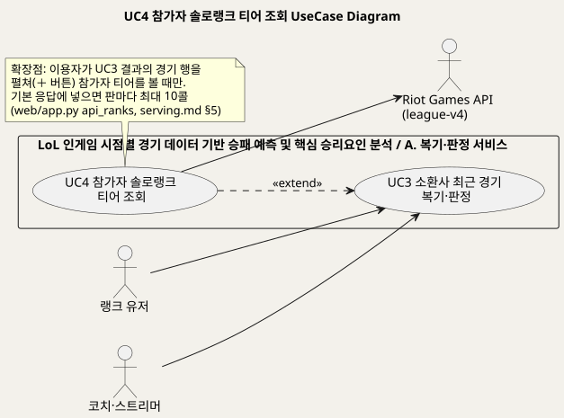
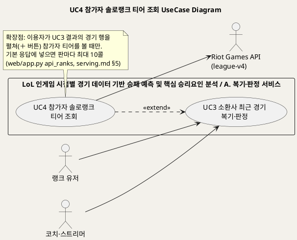
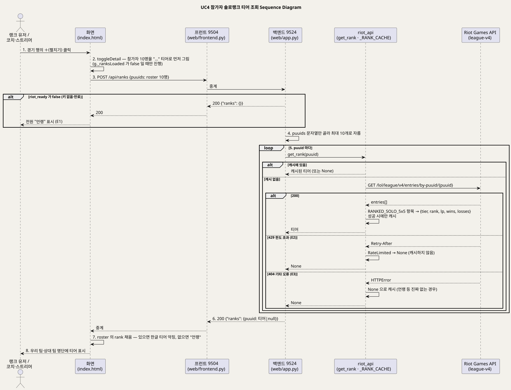
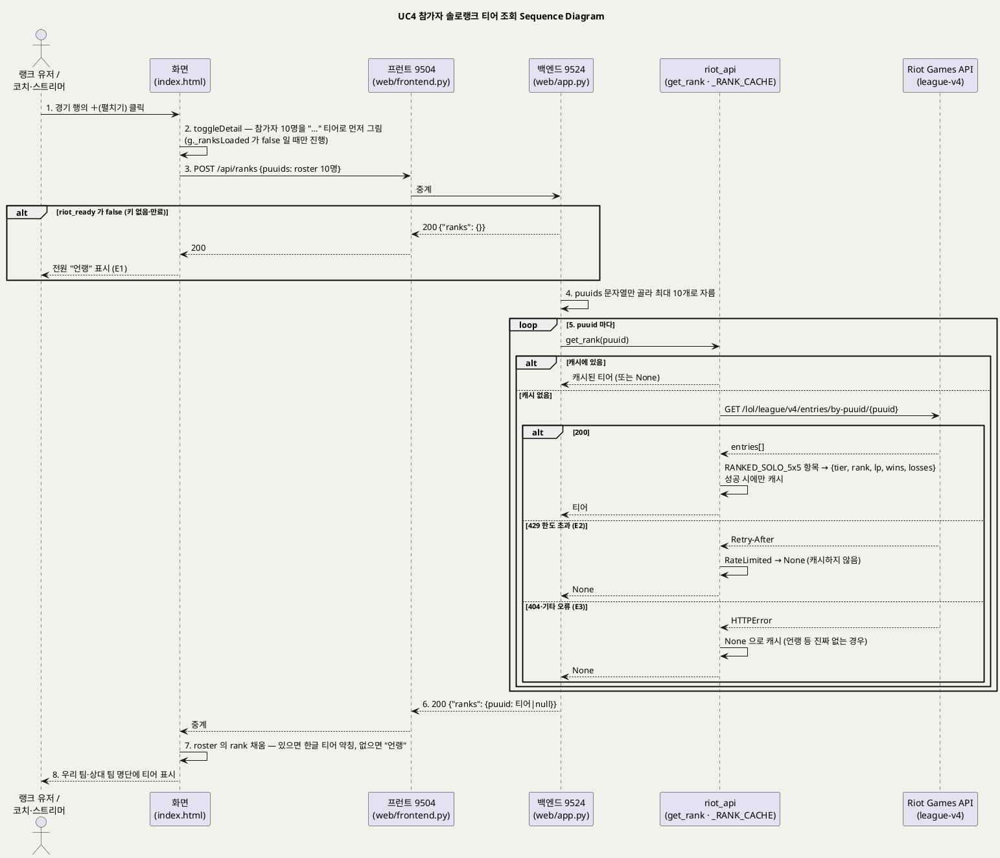

<!-- ─────────────────────────────────────────────
  UC4 상세 명세 — 소환사 복기 결과의 경기 행을 펼쳤을 때 참가자 10명의 솔로랭크 티어를 채우는 확장 흐름.
  왜 필요한가: UC3 의 조건부 확장이라 별도 문서로 두어 Riot 예산과의 관계를 명확히 한다.
  주로 보는 사람: 팀원(구현·검수) · Claude(검수)
  ───────────────────────────────────────────── -->

# UseCase 명세 #4 참가자 솔로랭크 티어 조회 (A. 복기·판정 서비스)
**LoL 인게임 시점별 경기 데이터 기반 승패 예측 및 핵심 승리요인 분석 · UC4 · UML 2.5.1 표준 (UseCase Diagram + UseCase 기술 + Sequence Diagram)**

---

> **문서 식별**: `docs/usecases/UC_04_참가자티어조회.md`
> **작성일**: 2026-09-07 · **표준**: UML 2.5.1 (OMG)
> **원천(SoT)**: `web/app.py` `api_ranks` · `src/riot_api.py` `get_rank`·`_get`·`RateLimited`·`_RANK_CACHE` · `web/templates/index.html` `toggleDetail`(참가자 명단·`/api/ranks` 호출) · `docs/serving.md` §4 에러 규약·§5 `/api/ranks`·§6 "/api/summoner 응답"(`roster`) · `docs/riot-api-application.md` "HOW WE RESPECT THE RATE LIMITS"·"DATA HANDLING"
> **개요 문서**: [UC_00_개요_LoL승패예측및핵심승리요인분석.md](UC_00_개요_LoL승패예측및핵심승리요인분석.md) §3 UC4 행
> **다이어그램**: 모든 PlantUML 소스는 로컬 Kroki 에서 렌더 검증 완료(HTTP 200). 렌더 결과는 `diagrams/*.svg` 로 함께 두어 로그인 없이 보인다. 뷰어 링크는 사내 서버라 SSO 로그인이 필요하다.

---

## 목차

1. [범위·개요](#1-범위개요)
2. [UseCase Diagram](#2-usecase-diagram)
3. [Actor 카탈로그](#3-actor-카탈로그)
4. [UseCase 목록 (원천 매핑)](#4-usecase-목록-원천-매핑)
5. [UseCase 기술 + Sequence Diagram](#5-usecase-기술--sequence-diagram)
6. [업무규칙(Business Rules) 종합](#6-업무규칙business-rules-종합)
7. [UML 표준 준수 노트](#7-uml-표준-준수-노트)

---

## 1. 범위·개요

이 유스케이스는 소환사 최근 경기 복기(UC3) 결과에서 이용자가 **경기 행을 펼쳤을 때만** 참가자 10명의 솔로랭크 티어를 Riot `league-v4` 로 받아 명단에 채우는
**조건부 확장**이다. 참가자 명단(`roster`) 자체는 UC3 의 응답에 이미 들어 있어 추가 호출이 없지만, 티어는 사람마다 한 번씩 API 를 불러야 해서
기본 응답에 넣으면 판마다 최대 10콜, 한 페이지에 22콜이 붙는다. Riot 예산으로 감당이 안 되므로 펼칠 때 한 번만 부르도록 분리했다.
(근거: `web/app.py` `api_ranks` docstring, `docs/serving.md` §5 `/api/ranks`, `index.html` "참가자 티어는 기본 응답에 없다(요청 비용 때문)")

티어는 부가 정보다. 조회가 막혀도 본 기능(UC3 의 판정·코칭)은 살아야 하므로 `get_rank` 는 실패해도 예외를 올리지 않고 `None` 을 돌려주며,
화면은 그 자리를 "언랭"으로 표시한다. 같은 사람이 여러 판에 나오므로 성공한 조회만 서버 캐시에 남긴다.
(근거: `src/riot_api.py` `get_rank` docstring·주석)

| 항목 | 값 |
|---|---|
| 대상 시스템 | LoL 인게임 시점별 경기 데이터 기반 승패 예측 및 핵심 승리요인 분석 — 패키지 A. 복기·판정 서비스 |
| 상위 프로세스 | 경기 후 복기 — UC3 소환사 최근 경기 복기·판정의 경기 행 상세 보기 |
| 원천 근거 | `web/app.py` `api_ranks` · `src/riot_api.py` `get_rank` · `index.html` `toggleDetail` · `docs/serving.md` §4·§5·§6 |
| 핵심 UseCase | 1개 (UC4, UC3 의 «extend») |
| 주요 액터 | 랭크 유저(주) · 코치·스트리머(주) · Riot Games API(보조) |

---

## 2. UseCase Diagram

PlantUML 소스 보기

소스를 직접 렌더하려면 **[「UC4 UseCase Diagram」 PlantUML 뷰어로 열기](https://plantuml.sumzip.com/plantuml/svg/eNp1k99LG0EQx9_3rxjSF4UaFdMXEdGmtRR8KAXfBFmTNR4md-Fuoy2lYMtRbHJtUzA2yiVEqlXBwpEf9YTzxT_ndo7-C507o-hDHw52mfnOzPcze3OW5KaslIpQyU1kViqWyHFLMGtD08vc5CVY5bmNgmlU9HzWKBomPFqYWph8_vRehrXO88aWphdgjRdJWxRrEqQBplZYl5DXTJGTmqEzqcmigKVsBtDzQ28b23XAT7vq0FXt39GHc4hqHu71AQ-96MCBJUtkaRR4pvECtWGM5yT1Tw2T0e1gZzsF3ILXXN8Q5m0cr3bxsnl9gdWjqOqrX-fq1E_SsgbPrTMWj8P1Ao2SWjQWAVt-2HWwbQPWXOzUVc-GsHsV-h6oLx62-pHtAd2U1wSsXkbOKWBzB_1DUN43iBoDrJ3HAWqEB7tUDdQfG-0WjMN8GlRvQNrri8ipY6cBaLvq0qbJUvCOAQxpQ2opO0UonGi_iR-p2sANL4LhFMv6wxqJFcp_KP8f02X9AdShOMPe3-F8rRkSXvCSsGD-1ctlfaQoeKEixjYzozdwKc7YDWIYG5tNeico725x-3Q6OcM0zMyIN1Lo-dnZJBAnJTV0QwpYNaQ0SmCsJVMARPsNbB8T9mlaRB8PzsgA2UhKhV0v7AXYat7uI9r7jC07Vn0NsFcf-RvUQHXtqBqM3rN_Y1gdBwSfvoajTpw0ieId9nxq813VBvijDsr-iW6gzvpAZNXJjqodxeiVsw2TE3jlkmZkS6yO83I5XX4LvKytmITBegyWMDfpvadLebg-eTLKyC3E9tgcnehfYv8AivWXeA==)** (사내 서버, SSO 로그인 필요) 또는 [로컬 Kroki 로 열기](http://192.168.0.91:8889/plantuml/svg/eNp1k99LG0EQx9_3rxjSF4UaFdMXEdGmtRR8KAXfBFmTNR4md-Fuoy2lYMtRbHJtUzA2yiVEqlXBwpEf9YTzxT_ndo7-C507o-hDHw52mfnOzPcze3OW5KaslIpQyU1kViqWyHFLMGtD08vc5CVY5bmNgmlU9HzWKBomPFqYWph8_vRehrXO88aWphdgjRdJWxRrEqQBplZYl5DXTJGTmqEzqcmigKVsBtDzQ28b23XAT7vq0FXt39GHc4hqHu71AQ-96MCBJUtkaRR4pvECtWGM5yT1Tw2T0e1gZzsF3ILXXN8Q5m0cr3bxsnl9gdWjqOqrX-fq1E_SsgbPrTMWj8P1Ao2SWjQWAVt-2HWwbQPWXOzUVc-GsHsV-h6oLx62-pHtAd2U1wSsXkbOKWBzB_1DUN43iBoDrJ3HAWqEB7tUDdQfG-0WjMN8GlRvQNrri8ipY6cBaLvq0qbJUvCOAQxpQ2opO0UonGi_iR-p2sANL4LhFMv6wxqJFcp_KP8f02X9AdShOMPe3-F8rRkSXvCSsGD-1ctlfaQoeKEixjYzozdwKc7YDWIYG5tNeico725x-3Q6OcM0zMyIN1Lo-dnZJBAnJTV0QwpYNaQ0SmCsJVMARPsNbB8T9mlaRB8PzsgA2UhKhV0v7AXYat7uI9r7jC07Vn0NsFcf-RvUQHXtqBqM3rN_Y1gdBwSfvoajTpw0ieId9nxq813VBvijDsr-iW6gzvpAZNXJjqodxeiVsw2TE3jlkmZkS6yO83I5XX4LvKytmITBegyWMDfpvadLebg-eTLKyC3E9tgcnehfYv8AivWXeA==) (내부망 전용). 위 그림 파일은 로그인 없이 보인다.

#### 다이어그램 쉽게 읽기 (유저 관점)

1. **누가 쓰나** — 왼쪽의 랭크 유저와 코치·스트리머는 이미 내 경기 되돌아보기(UC3)로 경기 목록을 본 사람이다. 따로 시작 버튼은 없고, 경기 한 판을 펼치는 동작이 곧 이 일(UC4)의 시작이다.
2. **무슨 순서로** — 판을 펼치면 그 판에 있던 10명의 이름 옆이 잠시 "…"로 보이다가, 게임 회사(Riot) 창구에서 받은 등급(아이언부터 챌린저까지)으로 바뀐다. 못 받은 사람은 "언랭(등급 없음)"으로 남는다.
3. **«include» = 항상 함께** — 이 그림에는 없다.
4. **«extend» = 특별한 때만** — 등급 보기(UC4)는 판을 펼쳤을 때만 내 경기 되돌아보기(UC3)에 덧붙는다. 펼치지 않으면 창구에 한 번도 묻지 않는다.
5. **Generalization(◁)** — "이 사람은 저 사람의 한 종류"라는 표시인데, 이 그림에는 나오지 않는다.
6. **오른쪽의 Riot Games API** — 게임 회사의 창구다. 한 사람 등급에 한 번씩 물어야 해서, "한 번에 몇 번까지 물어볼 수 있나"라는 한도가 이 일의 가장 큰 제약이다.

#### 표준 기호 범례

| 기호 | 의미 | UML 2.5.1 |
|---|---|---|
| 사람 모양 (actor) | 이 시스템을 쓰는 사람, 또는 바깥에서 자료를 주고받는 다른 시스템. 사람이 아니어도 사람 모양으로 그린다 | Actor |
| 타원 (usecase) | 그 사람이 이 시스템으로 이루고 싶은 일 하나. 버튼이나 화면이 아니라 "목표" 단위다 | UseCase |
| 큰 사각형 (rectangle) | 우리가 만든 것의 울타리. 안쪽은 우리 책임, 바깥은 남의 것 | Subject (System Boundary) |
| 실선 화살표 | 그 사람이 그 일을 시작한다는 뜻. 타원에서 오른쪽 바깥으로 나가는 선은 시스템이 그쪽에 물어본다는 뜻 | Association |
| 점선 화살표 «extend» | 특별한 때에만 덧붙는 일. 언제 그런지는 옆의 메모(note)에 적혀 있다 | Extend |

---

## 3. Actor 카탈로그

| 액터 | 구분 | 설명 | 근거 |
|---|---|---|---|
| 랭크 유저 | Primary | 자기 최근 판을 복기하다가 "상대·아군이 몇 티어였나"를 보려고 행을 펼친다 | `docs/product.md` §2 "1차", `index.html` `toggleDetail` |
| 코치·스트리머 | Primary | 제자·시청자의 판을 복기하며 같은 동작으로 참가자 티어를 본다 | `docs/product.md` §2 "2차" |
| Riot Games API (league-v4) | Secondary | `/lol/league/v4/entries/by-puuid/{puuid}` 로 솔로랭크 항목(티어·랭크·LP·승·패)을 준다. 플랫폼 라우팅 `kr`. 한도 초과 시 429 + `Retry-After` | `src/riot_api.py` `get_rank`·`PLATFORM`·`_get` |
| (내부) `_RANK_CACHE` | 시스템 구성요소 | puuid → 티어 캐시. 성공한 조회와 "진짜 없는 경우"만 담고, 한도 초과는 담지 않는다 | `src/riot_api.py` `get_rank` 주석 |

---

## 4. UseCase 목록 (원천 매핑)

| UC ID | 유스케이스명 | 주액터 | 관계 | 원천 근거 |
|:--:|---|---|---|---|
| UC3 | 소환사 최근 경기 복기·판정 | 랭크 유저 · 코치·스트리머 | 기준 UC — 상세는 `UC_03_소환사최근경기복기판정.md` | `docs/serving.md` §5 `/api/summoner` |
| UC4 | 참가자 솔로랭크 티어 조회 | 랭크 유저 · 코치·스트리머 | UC3 을 «extend» (확장점: 경기 행 펼침) | `web/app.py` `api_ranks` · `src/riot_api.py` `get_rank` · `index.html` `toggleDetail` · `docs/serving.md` §5 |

---

## 5. UseCase 기술 + Sequence Diagram

### 5.1 UC4 참가자 솔로랭크 티어 조회

> **쉽게 말하면** — 내 경기 목록에서 한 판을 펼치면, 그 판에 같이 있던 10명의 등급(아이언부터 챌린저까지)이 이름 옆에 붙는다.
> 등급은 한 사람당 게임 회사 창구에 한 번씩 물어봐야 해서, 판을 펼칠 때만 가져온다.
> 한 번에 너무 많이 물어 "잠깐 기다려"라는 답을 받거나 등급이 없는 사람은 "언랭(등급 없음)"으로 보인다.

#### 유스케이스 기술

| 속성 | 내용 |
|---|---|
| **ID** | UC4 — 원천 식별자: `web/app.py` `api_ranks` · `src/riot_api.py` `get_rank` · `docs/serving.md` §5 `/api/ranks` |
| **유스케이스명** | 참가자 솔로랭크 티어 조회 |
| **액터** | 주액터: 랭크 유저 · 코치·스트리머. 보조액터: Riot Games API (league-v4, 플랫폼 `kr`) |
| **사전조건** | (1) UC3 이 정상 종료돼 화면에 소환사 최근 경기 목록이 있고, 각 경기의 `roster`(참가자 10명, `puuid` 포함)가 응답에 들어 있다 (`src/riot_api.py` `analyze_recent` roster, `docs/serving.md` §6). (2) 백엔드가 `riot_ready` 상태다 — 기동 시 `key_works()` 로 키가 실제로 통하는지 확인 (`web/app.py`). (3) 해당 경기 행에 대해 아직 티어를 받지 않았다 (`g._ranksLoaded` 가 false) (`index.html` `toggleDetail`) |
| **사후조건** | (1) 응답 `ranks` 의 puuid 별 값이 명단에 반영됐다 — 티어가 있으면 한글 약칭(예: 다이아·그마), 없으면 "언랭" (`index.html` `TIER_SHORT`). (2) 같은 행을 다시 펼쳐도 `/api/ranks` 를 다시 부르지 않는다 (`_ranksLoaded`). (3) 성공한 조회는 서버 `_RANK_CACHE` 에 남아 같은 사람이 다른 판에 나와도 Riot 을 다시 부르지 않는다. (4) 사용자 데이터를 저장하지 않는다 — puuid 는 요청 처리 중에만 쓴다 (`docs/riot-api-application.md` "DATA HANDLING") |
| **기본흐름** | ↓ 별도 기본흐름표 |
| **대체흐름** | A1. **캐시 적중** — 5단계에서 puuid 가 `_RANK_CACHE` 에 있으면 Riot 을 부르지 않고 캐시 값(티어 또는 None)을 쓴다 (`src/riot_api.py` `get_rank`). A2. **행 접기·재펼침** — 이미 펼친 행을 접으면 상세를 지우고, 다시 펼치면 명단은 다시 그리되 `_ranksLoaded` 가 true 라 티어 요청은 보내지 않는다. [추론] 이때 이미 받은 `m.rank` 값으로 명단이 그려진다 (`index.html` `toggleDetail` 의 `m.rank` 참조). A3. **서버측 일괄 채움** — `analyze_recent(..., with_ranks=True)` 로 부르면 UC3 응답의 `roster` 에 티어가 처음부터 들어간다. 현재 웹 경로(`_cached_summoner`)는 이 인자를 쓰지 않는다 (`web/app.py`, `src/riot_api.py` `analyze_recent`) |
| **예외흐름** | E1. **키 없음·만료** — 백엔드가 `riot_ready` 가 아니면 Riot 을 부르지 않고 200 `{"ranks": {}}` 를 돌려준다. 화면은 전원을 "언랭"으로 표시한다 (`web/app.py` `api_ranks`). [추론] 이 상태에서는 UC3 자체가 열리지 않아(화면이 소환사 검색을 비활성화) 실제로는 드물다 (`docs/deploy.md`). E2. **Riot 한도 초과(429)** — `_get` 이 `RateLimited(retry_after)` 를 올리지만 `get_rank` 가 이를 받아 `None` 을 돌려주고 캐시하지 않는다. 그 사람은 이번엔 "언랭"으로 보이고 다음 요청에서 다시 시도된다 (`src/riot_api.py` `get_rank` "캐시하지 않는다 — 다음 요청에서 다시 시도"). `api_ranks` 의 429 + `retry_after` 분기(`docs/serving.md` §4)는 코드상 존재하나 `get_rank` 가 예외를 삼키므로 이 경로에서는 도달하지 않는다 — 확인 필요. E3. **랭크 없음·404·기타 오류** — 솔로랭크 항목이 없거나 HTTP 오류면 `None` 을 캐시해 "언랭"으로 굳힌다 (`src/riot_api.py` `get_rank` "진짜 없는 경우만 굳힌다"). E4. **네트워크·중계 실패** — 화면의 `fetch` 가 실패하면 조용히 무시하고 "…" 표시가 남는다 (`index.html` `.catch(() => {})`). [추론] 이때 `_ranksLoaded` 는 이미 true 라 같은 행에서는 재시도되지 않는다 |
| **포함/확장** | «extend» UC3 소환사 최근 경기 복기·판정 — 확장점: 이용자가 경기 행을 펼쳐 참가자 티어를 볼 때 (`index.html` `toggleDetail`, `docs/serving.md` §5 "행을 펼칠 때만 부른다"). «include» 없음 |
| **우선순위** | Low — 부가 정보이며 실패해도 본 기능이 살아야 한다는 것이 설계 원칙이다 (`src/riot_api.py` `get_rank` docstring). 개요 문서 §3 판정과 동일 |
| **사용빈도** | 자료 없음 — 확인 필요. [추론] 한 번 펼칠 때 최대 10콜이며, 한 페이지(경기 10건)를 전부 펼치면 22콜에 이른다는 것이 원천의 비용 추정이다 (`web/app.py` `api_ranks` docstring). 요청당 소환사 조회가 약 12콜이라는 신청서 기재(`docs/riot-api-application.md`)와 합치면 예산 100회/120초의 상당 부분을 차지한다 |
| **업무규칙** | BR-RNK-01 ~ BR-RNK-06 (§6) |
| **특별 요구사항** | (1) **웹 요청 안에서 기다리지 않는다** — 429 를 만나면 즉시 올려서 프록시 타임아웃(502)을 피한다. 기다렸다 재시도하는 `get_with_wait` 는 배치 수집 전용이다 (`src/riot_api.py` `RateLimited` docstring·`get_with_wait`). (2) **Riot 예산 공유** — 라이브 요청과 배치 수집기가 같은 키 예산(100회/120초)을 쓴다 (`src/collect_ranking.py` 머리말). (3) **User-Agent 필수** — 없으면 Cloudflare 가 차단한다 (`src/riot_api.py` `_get`). (4) **개인정보** — puuid 를 저장·배포하지 않는다 (`docs/riot-api-application.md` "DATA HANDLING"). (5) 성능 목표·접근성: 자료 없음 — 확인 필요 |
| **비고** | 원천 추적성 — `web/app.py` `api_ranks`(327~349행) · `src/riot_api.py` `RateLimited`(41~50행)·`_get`(53~87행)·`get_with_wait`(90~100행)·`PLATFORM`·`_RANK_CACHE`·`get_rank`(351~370행)·`analyze_recent` `roster`·`with_ranks` · `web/templates/index.html` `toggleDetail`(691행~)·참가자 명단·`/api/ranks` 호출(762~777행)·`TIER_SHORT`(583행) · `docs/serving.md` §4(429 + `retry_after`)·§5 `/api/ranks`·§6 `roster` · `docs/riot-api-application.md` "HOW WE RESPECT THE RATE LIMITS"·"DATA HANDLING". 확인 필요: `api_ranks` 의 429 분기가 실제로 도달 가능한지(E2 참고) |

#### 기본흐름 (Basic Flow)

| 단계 | 액터 행위 | 시스템 행위 |
|:--:|---|---|
| 1 | 랭크 유저(또는 코치·스트리머)가 UC3 결과 목록에서 한 경기 행의 ＋(펼치기) 버튼을 누른다 | 화면이 버튼을 −로 바꾸고 상세 영역을 연다 (`toggleDetail`) |
| 2 | — | 화면이 이미 받아 둔 `roster` 로 우리 팀·상대 팀 명단(챔피언 이미지·포지션·이름·KDA)을 그리고, 티어 자리는 "…"으로 둔다. 이 행에서 아직 티어를 받지 않았으면(`_ranksLoaded` false) 진행한다 |
| 3 | — | 화면이 명단의 puuid 10개를 모아 `POST /api/ranks {puuids: [...]}` 를 보내고, 프런트(9504)가 백엔드(9524)로 중계한다 |
| 4 | — | 백엔드 `api_ranks` 가 `riot_ready` 를 확인하고(E1), 본문에서 문자열 puuid 만 골라 최대 10개로 자른다 |
| 5 | — | puuid 마다 `get_rank` 를 부른다. 캐시에 없으면(A1) Riot `league-v4 entries/by-puuid` 를 호출해 `RANKED_SOLO_5x5` 항목을 `{tier, rank, lp, wins, losses}` 로 만들고 성공 시 캐시한다. 한도 초과·오류는 `None` (E2·E3) |
| 6 | — | 백엔드가 `{"ranks": {puuid: 티어 또는 null}}` 을 HTTP 200 으로 응답하고 프런트가 중계한다 |
| 7 | — | 화면이 각 참가자의 `rank` 를 채운다 — 있으면 `TIER_SHORT` 의 한글 약칭, 없으면 "언랭" |
| 8 | 명단에서 참가자 티어를 읽는다 | 화면이 우리 팀·상대 팀 명단에 티어를 표시한다. 같은 행을 다시 펼쳐도 요청을 반복하지 않는다 |

#### Sequence Diagram

PlantUML 소스 보기

소스를 직접 렌더하려면 **[「UC4 Sequence Diagram」 PlantUML 뷰어로 열기](https://plantuml.sumzip.com/plantuml/svg/eNp9VV1PG0cUfd9fceW-2BL-AEza8IBiwE6iooCAPDWVtdiDs2K96-6ukyBiyTQuomC1TmODmxpKVMpHBJIpjnAq88JP4dEzq_6F3pndpQZZfbGsnXvuPffce2YemJZsWPmsCvlUJJo0yXd5oqWIZC4pWk425CwsyKmljKHntfSEruoGfJEYTgzGx3sizOdyWn-paBlYlFWTSJZiqQSeTkSBNdvdZpHtVoCtVemHBt09tVdPwN5ssq0WsA9N-30Z5tyaMKnIGcwnSXLKwkI-N5o19theEcLPNHZZZZ_rVxdsY9_eaNODE3rU9oFswlOTGBKSsZSUkpM1C3z2r1V63Hqm-RUtTV6FnltZNeCEPr4TWC3R35uYDu6PRKIIeEkWwouGrllES4dyyw4qEb-Nos0ztl2l7xqIGvJQci53Axi_AzAU3UrKOQVDM8RKGrK2BFcXkJyNPfk6ORGbeBR3cLOx27hZxMFDOUtMiM08RrRK5EyeBF9E3Xg8lyTePwTHsDkYhcEQdP-67LabYG_9yHbq8E9n02__1EHp8GMA7NUWPTiVMNZDDIXA0jMZlUwSS1ZUuC5We0Y3GKEff2A7JfBdFw987vBwmECPOnww3QscRYc3FhJ9mVO6nCZpQLizEMB2OkBrZXpYBnZYQlYBt3oijtWHQzAzPTcPqJ8SFglgJZfPK2lzFAzdtLA1QaEgYTiCxjmI7b_tnpckWbVASGsQOb3cU9Jvf78PbHuN7ZSvLrAw_aMckIBjg17doUgEVnyioG8UVgoFPE84544qkQh-4UT5F64wlt0rsd8q4GNbbdxOFONtg202wB8fDEi4L9L4fwyjIXC6AHrSRh3ZdosL0D0_oigH-9Sg5SI21m02uJYYQA9KkqrrORhxkUAP1-nmvkt7DHcD03rb4xchvCeuAfu7gjzYNhptdx17xs_A44M3eokAWml45vPTeoVuVOGJrhGehYhBiShXt5scY2LLMMnDOE5J1dWws4ThF9Ew0SxDIWZ4YTkoCIWd0RUEmDNzVBSpeJKg14cL_OZb7zR20yL3RHwyOTc9NZ0ceTUCdu2UfjyG67VfYMVSiDEAXIABUHMDgNeOif900yRmAW-I0ln3_BM4Woh9Ex311PAEcWQQB6L16NB9LNSgP5eAtda75x0c6lCgL_VZYhnLwdgibmYf8rJFppSsYqEDOGOuL_gdGnatzg6LwGobKG-gDyke3EMpEr26QMvabxBT36d_1pHTcH9Oj-bnZ-KGofdhJBiwRkesmTNgv7O_QN-dcUeyQzFzvg54c7D3zf_nhnvu_Hob7znqXuiuqcQyeGK_1vKqWnBs7JnM9XHPZfRlyHM9v7vERcnO0HVF51rC9cZWjlt8WN128eYtqV2yz6cDYnWdc8-j0m0HfxUCbBDfDrDLRXxK3qxyH-J_wCuGbh5xD7k5HXNLD7BNfCClfwGNM-pe)** (사내 서버, SSO 로그인 필요) 또는 [로컬 Kroki 로 열기](http://192.168.0.91:8889/plantuml/svg/eNp9VV1PG0cUfd9fceW-2BL-AEza8IBiwE6iooCAPDWVtdiDs2K96-6ukyBiyTQuomC1TmODmxpKVMpHBJIpjnAq88JP4dEzq_6F3pndpQZZfbGsnXvuPffce2YemJZsWPmsCvlUJJo0yXd5oqWIZC4pWk425CwsyKmljKHntfSEruoGfJEYTgzGx3sizOdyWn-paBlYlFWTSJZiqQSeTkSBNdvdZpHtVoCtVemHBt09tVdPwN5ssq0WsA9N-30Z5tyaMKnIGcwnSXLKwkI-N5o19theEcLPNHZZZZ_rVxdsY9_eaNODE3rU9oFswlOTGBKSsZSUkpM1C3z2r1V63Hqm-RUtTV6FnltZNeCEPr4TWC3R35uYDu6PRKIIeEkWwouGrllES4dyyw4qEb-Nos0ztl2l7xqIGvJQci53Axi_AzAU3UrKOQVDM8RKGrK2BFcXkJyNPfk6ORGbeBR3cLOx27hZxMFDOUtMiM08RrRK5EyeBF9E3Xg8lyTePwTHsDkYhcEQdP-67LabYG_9yHbq8E9n02__1EHp8GMA7NUWPTiVMNZDDIXA0jMZlUwSS1ZUuC5We0Y3GKEff2A7JfBdFw987vBwmECPOnww3QscRYc3FhJ9mVO6nCZpQLizEMB2OkBrZXpYBnZYQlYBt3oijtWHQzAzPTcPqJ8SFglgJZfPK2lzFAzdtLA1QaEgYTiCxjmI7b_tnpckWbVASGsQOb3cU9Jvf78PbHuN7ZSvLrAw_aMckIBjg17doUgEVnyioG8UVgoFPE84544qkQh-4UT5F64wlt0rsd8q4GNbbdxOFONtg202wB8fDEi4L9L4fwyjIXC6AHrSRh3ZdosL0D0_oigH-9Sg5SI21m02uJYYQA9KkqrrORhxkUAP1-nmvkt7DHcD03rb4xchvCeuAfu7gjzYNhptdx17xs_A44M3eokAWml45vPTeoVuVOGJrhGehYhBiShXt5scY2LLMMnDOE5J1dWws4ThF9Ew0SxDIWZ4YTkoCIWd0RUEmDNzVBSpeJKg14cL_OZb7zR20yL3RHwyOTc9NZ0ceTUCdu2UfjyG67VfYMVSiDEAXIABUHMDgNeOif900yRmAW-I0ln3_BM4Woh9Ex311PAEcWQQB6L16NB9LNSgP5eAtda75x0c6lCgL_VZYhnLwdgibmYf8rJFppSsYqEDOGOuL_gdGnatzg6LwGobKG-gDyke3EMpEr26QMvabxBT36d_1pHTcH9Oj-bnZ-KGofdhJBiwRkesmTNgv7O_QN-dcUeyQzFzvg54c7D3zf_nhnvu_Hob7znqXuiuqcQyeGK_1vKqWnBs7JnM9XHPZfRlyHM9v7vERcnO0HVF51rC9cZWjlt8WN128eYtqV2yz6cDYnWdc8-j0m0HfxUCbBDfDrDLRXxK3qxyH-J_wCuGbh5xD7k5HXNLD7BNfCClfwGNM-pe) (내부망 전용). 위 그림 파일은 로그인 없이 보인다.

기본흐름 8단계와 시퀀스의 번호 메시지가 1:1 로 대응한다. 대체흐름 A1(캐시 적중)은 5단계의 `alt` 로, 예외 E1·E2·E3 은 각각 `alt` 분기로 그렸다.

---

## 6. 업무규칙(Business Rules) 종합

| BR ID | 규칙 | 적용 UC | 근거 |
|---|---|---|---|
| BR-RNK-01 | 참가자 티어는 기본 응답(UC3)에 넣지 않고 **행을 펼칠 때만** 조회한다. 기본 응답에 넣으면 판마다 최대 10콜이다 | UC4 | `web/app.py` `api_ranks` docstring, `docs/serving.md` §5, `index.html` 주석 |
| BR-RNK-02 | 한 번의 요청에서 puuid 는 **문자열만, 최대 10개**까지 처리한다 | UC4 | `web/app.py` `api_ranks` |
| BR-RNK-03 | 솔로랭크(`RANKED_SOLO_5x5`) 항목만 티어로 인정하고, 없으면 `None`(언랭) | UC4 | `src/riot_api.py` `get_rank` |
| BR-RNK-04 | 티어 조회 실패는 본 기능을 막지 않는다 — 예외를 올리지 않고 `None` 을 돌려주며 화면은 "언랭"으로 표시한다 | UC4 | `src/riot_api.py` `get_rank` docstring, `index.html` |
| BR-RNK-05 | **성공한 조회와 진짜 없는 경우만 캐시**한다. 한도 초과(429)로 못 받은 것은 캐시하지 않아 다음 요청에서 다시 시도한다 | UC4 | `src/riot_api.py` `get_rank` 주석 |
| BR-RNK-06 | 웹 요청 경로에서는 Riot 한도에 걸려도 **기다리지 않는다**. 재시도 대기(`get_with_wait`)는 배치 수집 전용이다 | UC4 | `src/riot_api.py` `RateLimited` docstring, `get_with_wait` docstring |

---

## 7. UML 표준 준수 노트

| 항목 | 적용 |
|---|---|
| UseCase Diagram | UC4 → UC3 를 «extend» 로 그리고 확장점 조건을 note 로 명시했다 (UML 2.5.1 §18.1.3 Extend·ExtensionPoint). 외부 시스템 Riot Games API 는 경계 밖 보조 액터 |
| UseCase 기술 | 14속성 세로형 표. 사전조건에 확장의 전제(UC3 정상 종료·`roster` 보유·미조회 상태)를 적었다 |
| Sequence Diagram | 기본흐름 8단계와 메시지 1:1. puuid 반복은 `loop`, 캐시 적중·429·404 는 `alt` 로 표현했고 Riot Games API 를 별도 lifeline 으로 분리했다 (UML 2.5.1 §17.6 CombinedFragment) |
| 내부 구성요소 | `riot_api`·`_RANK_CACHE` 는 액터가 아니라 Sequence Diagram 의 lifeline 으로만 그렸다 |
| 추적성 | 모든 흐름·규칙에 원천(파일·함수·문서 절)을 붙였고, 코드로 확인되지 않는 판단은 `[추론]`, 확인이 필요한 불일치(429 분기 도달 여부)는 `확인 필요` 로 남겼다 |

---

*표기 표준: UML 2.5.1 (OMG). 서식 정본: usecase 스킬 `references/format-spec.md`. 개요 문서: [UC_00_개요_LoL승패예측및핵심승리요인분석.md](UC_00_개요_LoL승패예측및핵심승리요인분석.md). 이전 문서: `UC_03_소환사최근경기복기판정.md` · 다음 문서: `UC_05_신뢰도리포트열람.md`.*
