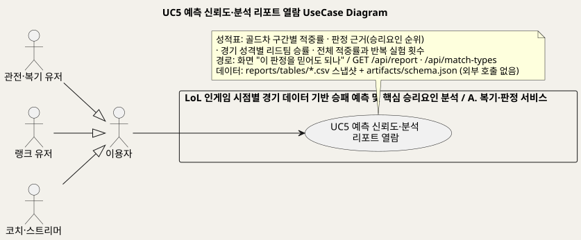
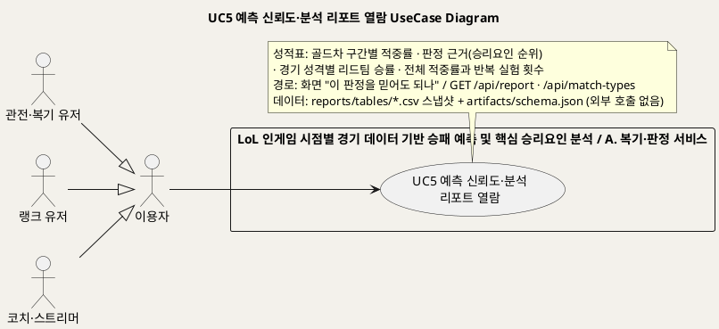
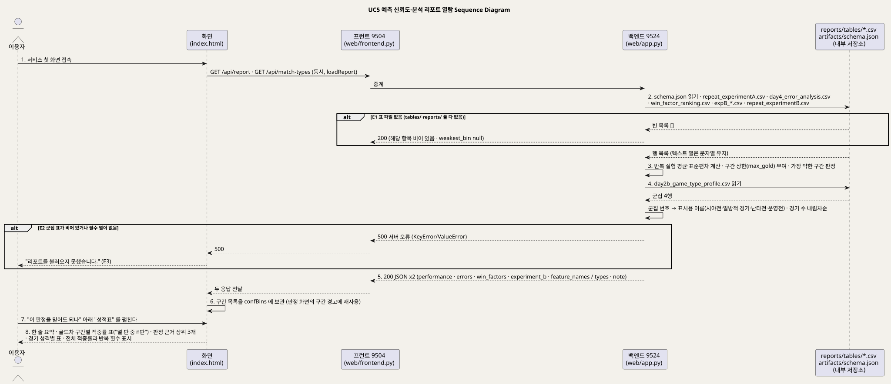
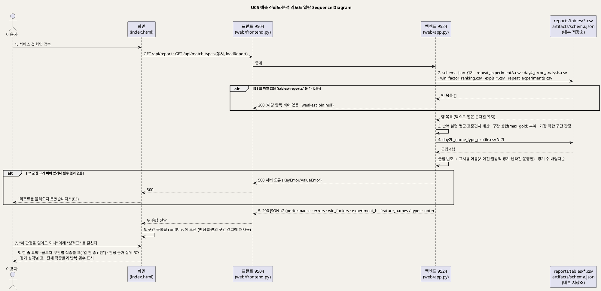

<!-- ─────────────────────────────────────────────
  UC5 상세 명세 — 예측을 믿어도 되는지 확인하는 성적표(신뢰도·분석 리포트) 열람 흐름.
  왜 필요한가: 개요(UC_00)의 목록을 구현 가능한 수준(사전·사후조건·흐름·예외·업무규칙·시퀀스)으로 내린다.
  주로 보는 사람: 팀원(구현·검수) · Claude(검수)
  ───────────────────────────────────────────── -->

# UseCase 명세 #5 예측 신뢰도·분석 리포트 열람 (A. 복기·판정 서비스)
**LoL 인게임 시점별 경기 데이터 기반 승패 예측 및 핵심 승리요인 분석 · UC5 · UML 2.5.1 표준 (UseCase Diagram + UseCase 기술 + Sequence Diagram)**

---

> **문서 식별**: `docs/usecases/UC_05_신뢰도리포트열람.md`
> **작성일**: 2026-09-07 · **표준**: UML 2.5.1 (OMG)
> **원천(SoT)**: `docs/spec.md` FR-4·FR-5·FR-7·FR-8·SC-4 · `docs/product.md` §3 F2 · `docs/serving.md` §5 `/api/report`·`/api/match-types`·`/figures/<이름>` · `model_card.md` "오류 프로파일"·"사용 금지 상황" 4 · `web/app.py` `_csv`·`api_report`·`_type_label`·`api_match_types` · `web/frontend.py` `figures`·`proxy` · `web/templates/index.html` "이 판정을 믿어도 되나"·`loadReport` · `lolwin/features.py` `gold_bin_bounds` · `reports/tables/*.csv`
> **개요 문서**: [UC_00_개요_LoL승패예측및핵심승리요인분석.md](UC_00_개요_LoL승패예측및핵심승리요인분석.md) §3 UC5 행
> **다이어그램**: 모든 PlantUML 소스는 로컬 Kroki 에서 렌더 검증 완료(HTTP 200). 렌더 결과는 `diagrams/*.svg` 로 함께 두어 로그인 없이 보인다. 뷰어 링크는 사내 서버라 SSO 로그인이 필요하다.

---

## 목차

1. [범위·개요](#1-범위개요)
2. [UseCase Diagram](#2-usecase-diagram)
3. [Actor 카탈로그](#3-actor-카탈로그)
4. [UseCase 목록 (원천 매핑)](#4-usecase-목록-원천-매핑)
5. [UseCase 기술 + Sequence Diagram](#5-usecase-기술--sequence-diagram)
6. [업무규칙(Business Rules) 종합](#6-업무규칙business-rules-종합)
7. [UML 표준 준수 노트](#7-uml-표준-준수-노트)

---

## 1. 범위·개요

이 유스케이스는 이용자가 **이 서비스의 판정을 믿어도 되는지**를 스스로 확인하는 흐름이다. 화면의 "이 판정을 믿어도 되나" 아래 "성적표"를 펼치면
**10분 골드차 구간별 적중률**(어떤 판을 맞히고 어떤 판을 틀리나), **판정 근거**(승리요인 순위 상위 3개), **경기 성격별 리드팀 승률**(경기 유형 프로파일),
**전체 적중률과 반복 실험 횟수**가 보인다. 잘 맞히는 판과 자주 틀리는 판을 숨기지 않고 그대로 보여주는 것이 이 서비스의 태도다.
(근거: `index.html` "이 판정을 믿어도 되나"·`loadReport`, `docs/spec.md` FR-4·SC-4 "이런 경기에서 틀린다를 수치로 제시")

데이터는 백엔드가 `GET /api/report` 와 `GET /api/match-types` 로 내려준다. 둘 다 `reports/tables/` 의 CSV 스냅샷과 `artifacts/schema.json` 만 읽고
외부 API 를 부르지 않으며, 화면은 숫자를 다시 적지 않고 서버가 준 값을 "열 판 중 n판"처럼 읽기 좋은 꼴로만 바꾼다.
(근거: `web/app.py` `api_report`·`api_match_types`, `index.html` `loadReport` 주석 "숫자는 전부 서버 실측")
`/api/report` 의 구간 목록은 화면이 보관해 두었다가 판정 화면의 **구간별 신뢰도 경고**(접전이면 먼저 경고)에 재사용한다. (근거: `index.html` `confBins`, `docs/product.md` §3 F2)

| 항목 | 값 |
|---|---|
| 대상 시스템 | LoL 인게임 시점별 경기 데이터 기반 승패 예측 및 핵심 승리요인 분석 — 패키지 A. 복기·판정 서비스 |
| 상위 프로세스 | 경기 후 복기 — 판정을 읽기 전에 "믿어도 되는지"를 확인하는 보조 흐름. 개요 §2 "예측 신뢰도·분석 리포트" |
| 원천 근거 | `docs/spec.md` FR-4·FR-5·FR-7·FR-8·SC-4 · `docs/product.md` F2 · `docs/serving.md` §5 · `web/app.py` `api_report`·`api_match_types` · `index.html` `loadReport` |
| 핵심 UseCase | 1개 (UC5). 포함·확장 UC 없음 |
| 주요 액터 | 이용자(주) — 관전·복기 유저·랭크 유저·코치·스트리머 공통 |

---

## 2. UseCase Diagram

PlantUML 소스 보기

소스를 직접 렌더하려면 **[「UC5 UseCase Diagram」 PlantUML 뷰어로 열기](https://plantuml.sumzip.com/plantuml/svg/eNp9U1FP01AUfu-vOJkvoIFpDC88EHSCLzwZ8cnEXLpuq2zt0t5JjJoMqWaBGUYAKaSbxUwzkhnLNlhJICb7Ob2n_8HTbsj0wbeenu9-5_u-c--8yZnBS4U8lOS7My9KpiIzU5HMVVUrMoMVYIXJq1lDL2nplJ7XDbi1eH_x3sLDMYSZY2l9TdWykGF5OptXMhy4DoaazXFIq4Yic1XXJK7yvALLqRlAu4L-MeCWK756Ytsa9MW5hVYdxPd2uN0ON33Ag55oVGHZVFKkBx6pLEuzJInJnEQksN7DoxNs1BLAzAhlXHeCXhndiLF7FvgeoOOiW45Rz1Rl7QYnGj_C9fZ4_wnTVm_6eLWHF_agj5tN0kPCRMuPYSmdyTlpSAZTU2_nhuOHp8d-xLixWopyYFqWMkgs6UuAdT_oVLFhUQ4OujXRtSDoXEWixSePDIaWB1QJzwbcvAirrevchLcN4f4ZbrWjBknDoz1ig1GISXgwDUP7g35YraG7D2g54sIiLwl4IwGM1gyJ_23jufbvOoZhp2akd5IUeSJ3c3Gt6VyBFZ1zvQB6Jv4FNPMU3fVwx5mFoNsSuw56LQjO2oFnRV6ph80d8c2FQR9GMoP-ZXDqTfzlCisOOtYkERJuFBBRB52TiCVazK4TVstxFEMy2j92ejcDgu4lZWZTJGSyGR7YEB59wYpNlMQnjklgeLgnTnrxvRppwTqR__yFn3sUCYiaLd7bCcr28cJTSLKimjSUom7waF5cFhiXc1P8dVExiffPBmdhiDOTnK3kFTN5e1o2X5HYptj4gBt9uAP0_tQM3Tozaco5pcCmX5q6BhN46IvzMoS2j-cOLeAj1quTkqKlIUpbmqcverbSb4uy3-A=)** (사내 서버, SSO 로그인 필요) 또는 [로컬 Kroki 로 열기](http://192.168.0.91:8889/plantuml/svg/eNp9U1FP01AUfu-vOJkvoIFpDC88EHSCLzwZ8cnEXLpuq2zt0t5JjJoMqWaBGUYAKaSbxUwzkhnLNlhJICb7Ob2n_8HTbsj0wbeenu9-5_u-c--8yZnBS4U8lOS7My9KpiIzU5HMVVUrMoMVYIXJq1lDL2nplJ7XDbi1eH_x3sLDMYSZY2l9TdWykGF5OptXMhy4DoaazXFIq4Yic1XXJK7yvALLqRlAu4L-MeCWK756Ytsa9MW5hVYdxPd2uN0ON33Ag55oVGHZVFKkBx6pLEuzJInJnEQksN7DoxNs1BLAzAhlXHeCXhndiLF7FvgeoOOiW45Rz1Rl7QYnGj_C9fZ4_wnTVm_6eLWHF_agj5tN0kPCRMuPYSmdyTlpSAZTU2_nhuOHp8d-xLixWopyYFqWMkgs6UuAdT_oVLFhUQ4OujXRtSDoXEWixSePDIaWB1QJzwbcvAirrevchLcN4f4ZbrWjBknDoz1ig1GISXgwDUP7g35YraG7D2g54sIiLwl4IwGM1gyJ_23jufbvOoZhp2akd5IUeSJ3c3Gt6VyBFZ1zvQB6Jv4FNPMU3fVwx5mFoNsSuw56LQjO2oFnRV6ph80d8c2FQR9GMoP-ZXDqTfzlCisOOtYkERJuFBBRB52TiCVazK4TVstxFEMy2j92ejcDgu4lZWZTJGSyGR7YEB59wYpNlMQnjklgeLgnTnrxvRppwTqR__yFn3sUCYiaLd7bCcr28cJTSLKimjSUom7waF5cFhiXc1P8dVExiffPBmdhiDOTnK3kFTN5e1o2X5HYptj4gBt9uAP0_tQM3Tozaco5pcCmX5q6BhN46IvzMoS2j-cOLeAj1quTkqKlIUpbmqcverbSb4uy3-A=) (내부망 전용). 위 그림 파일은 로그인 없이 보인다.

#### 다이어그램 쉽게 읽기 (유저 관점)

1. **누가 쓰나** — 사이트에 들어온 사람이면 누구나 본다. 그림에서 "이용자"라고 적힌 사람이다. 그 아래 세 사람(경기를 구경하거나 되돌아보는 사람, 게임을 열심히 하는 사람, 가르치거나 방송하는 사람)은 모두 이용자의 한 종류라서, 속이 빈 세모 화살표로 이용자에 묶여 있다.
2. **무슨 순서로** — 사이트 첫 화면이 열릴 때 프로그램이 성적표 자료를 미리 받아 둔다. 이용자가 "성적표"를 펼치면 그 자료가 표로 보인다.
3. **«include» = 항상 함께** — 이 그림에는 없다. 성적표를 보는 일은 다른 기능을 같이 부르지 않는다. 미리 저장해 둔 표를 읽기만 한다.
4. **«extend» = 특별한 때만** — 이 그림에는 없다. 다른 화면(내 경기 되돌아보기, 숫자 직접 넣기)이 이 성적표의 "팽팽한 구간" 기준을 빌려 써서 경고를 띄우지만, 그것은 자료를 나눠 쓰는 것이지 기능이 끼어드는 것이 아니다.
5. **속이 빈 세모 화살표** — "경기를 구경하는 사람도 이용자다"처럼 "이것은 저것의 한 종류다"라는 뜻이다. 이용자에게 이어진 기능은 세 종류 사람 모두 쓸 수 있다.
6. **바깥 상대** — 없다. 성적표 자료가 든 파일은 프로그램 안에 있는 것이라 바깥 상대(사람 모양)로 그리지 않는다.

#### 표준 기호 범례

| 기호 | 의미 | UML 2.5.1 |
|---|---|---|
| 사람 모양 (actor) | 프로그램 바깥에서 프로그램을 쓰거나 프로그램이 부르는 상대 | Actor |
| 타원 (usecase) | 그 상대가 프로그램으로 이루려는 일 하나 | UseCase |
| 큰 사각형 (rectangle) | 프로그램의 울타리. 안은 우리가 만든 것, 밖은 남의 것 | Subject (System Boundary) |
| 실선 화살표 | 이 사람이 이 일을 한다 | Association |
| 속 빈 삼각 화살표 ◁ | "이것은 저것의 한 종류다". 종류가 되는 쪽은 부모가 할 수 있는 일을 다 할 수 있다 | Generalization |

---

## 3. Actor 카탈로그

| 액터 | 구분 | 설명 | 근거 |
|---|---|---|---|
| 이용자 (추상) | Primary | 공개 서비스를 쓰는 모든 사람. 판정을 읽기 전에 "믿어도 되나"를 확인한다 | 개요 §4, `index.html` "이 판정을 믿어도 되나" |
| 관전·복기 유저 | Primary (이용자의 특수화) | 중계를 보며 "어느 팀이 왜 유리한지" 알고 싶은 사람. 접전이면 자주 틀린다는 사실을 먼저 알아야 한다 | `docs/spec.md` §2 |
| 랭크 유저 · 코치·스트리머 | Primary (이용자의 특수화) | 자기(또는 제자) 경기의 판정을 읽는 사람. 구간별 적중률로 판정의 신뢰도를 가늠한다 | `docs/product.md` §2 |
| (내부) `reports/tables/*.csv` | 시스템 자산 | 문서·화면 수치의 근거 파일. 반복 실험·구간별 오류·승리요인 순위·시점 비교·경기 유형 프로파일 | `CLAUDE.md` "숫자를 바꿀 때", `web/app.py` `_csv` |
| (내부) `artifacts/schema.json` | 시스템 자산 | 홀드아웃 성능·교차검증·기준선 지표 | `web/app.py` `api_report` |

이 UC 에는 Secondary Actor(외부 시스템)가 없다. 표 파일만 읽으며 외부 호출은 0회다. (근거: `web/app.py` `api_report`·`api_match_types` — 파일 읽기만 함)

---

## 4. UseCase 목록 (원천 매핑)

| UC ID | 유스케이스명 | 주액터 | 관계 | 원천 근거 |
|:--:|---|---|---|---|
| UC5 | 예측 신뢰도·분석 리포트 열람 | 이용자 | 단독 | `docs/spec.md` FR-4·FR-5·FR-7·FR-8·SC-4 · `docs/serving.md` §5 `/api/report`·`/api/match-types` · `web/app.py` `api_report`·`api_match_types` · `index.html` `loadReport` |

---

## 5. UseCase 기술 + Sequence Diagram

### 5.1 UC5 예측 신뢰도·분석 리포트 열람

> **쉽게 말하면** — 이 화면은 우리 프로그램의 성적표다. 프로그램이 어떤 경기는 잘 맞히고 어떤 경기는 자주 틀리는지 숨기지 않고 보여 준다.
> 10분에 두 팀의 돈 차이가 크게 벌어진 경기는 거의 다 맞히지만, 두 팀이 팽팽한 경기는 자주 틀린다.
> 프로그램이 승패를 짐작할 때 무엇을 가장 많이 보는지(첫째는 돈 차이), 경기 유형별로 10분에 앞선 팀이 얼마나 이기는지도 같이 나온다.

#### 유스케이스 기술

| 속성 | 내용 |
|---|---|
| **ID** | UC5 — 원천 식별자: `docs/spec.md` FR-4·FR-5·FR-7·FR-8·SC-4 · `docs/serving.md` §5 `/api/report`·`/api/match-types` · `web/app.py` `api_report`·`api_match_types` |
| **유스케이스명** | 예측 신뢰도·분석 리포트 열람 |
| **액터** | 주액터: 이용자(관전·복기 유저·랭크 유저·코치·스트리머 공통). 보조액터: 없음 — 외부 호출 0회 (`web/app.py`) |
| **사전조건** | (1) 백엔드(9524)가 기동돼 있고 `artifacts/schema.json` 이 열린다 (`web/app.py` `_schema`). (2) `reports/tables/` 에 표 파일이 있다 — `repeat_experimentA.csv` · `day4_error_analysis.csv` · `win_factor_ranking.csv` · `expB_close_games.csv` · `expB_coef_shift.csv` · `repeat_experimentB.csv` · `day2b_game_type_profile.csv` (`web/app.py` `api_report`·`api_match_types`). 표는 저장소에 커밋돼 있어 `git pull` 만으로 갖춰진다 (`docs/deploy.md`). (3) 프런트(9504)가 `/api/*` 를 백엔드로 중계한다 (`docs/deploy.md`). (4) 로그인·계정은 없다 (`docs/riot-api-application.md` "DATA HANDLING") |
| **사후조건** | (1) 화면에 골드차 구간별 적중률 표, 판정 근거 상위 3개, 경기 성격별 표, 전체 적중률과 반복 횟수가 표시됐다 (`index.html` `loadReport`). (2) 구간 목록(`errors.bins`, 구간별 상한 `max_gold` 포함)이 화면 변수 `confBins` 에 보관돼 이후 판정 화면의 구간 경고에 쓰인다. (3) 서버 상태는 바뀌지 않는다 — 읽기 전용이며 아무것도 저장하지 않는다 |
| **기본흐름** | ↓ 별도 기본흐름표 |
| **대체흐름** | A1. **API 만 직접 호출** — 화면 없이 `GET /api/report` 또는 `GET /api/match-types` 를 부른다. 응답 JSON 은 화면 경로와 같다 (`docs/serving.md` §5). 6~8단계 없음. A2. **표 파일 위치가 옛 경로** — 표가 `reports/tables/` 가 아니라 `reports/` 바로 아래에 있어도 찾아 읽는다. 한쪽만 보면 파일이 옮겨졌을 때 API 가 조용히 빈 배열을 돌려주기 때문이다 (`web/app.py` `_csv` 주석). A3. **그림 원본 열람** — `GET /figures/<이름>` 으로 `reports/` 의 그림 파일을 사본 없이 직접 받는다. 없는 이름은 404 (`web/frontend.py` `figures`, `docs/serving.md` §5). 현재 `index.html` 에는 `/figures` 참조가 없어 화면에서는 쓰이지 않는다 — 화면 노출 여부 `자료 없음 — 확인 필요` |
| **예외흐름** | E1. **표 파일 없음** — 2단계에서 어떤 표가 두 경로 모두에 없으면 `_csv` 가 빈 목록을 돌려주고, `api_report` 는 그 항목을 비운 채(반복 실험 평균·표준편차 `null`, `weakest_bin` `null`) HTTP 200 으로 응답한다. 화면은 빈 표를 그린다 (`web/app.py` `_csv`·`api_report`). E2. **군집 표 이상** — 4단계에서 `day2b_game_type_profile.csv` 가 비어 있거나 `cluster`·`n`·`비중_%`·`리드팀승률`·중립 피처 5개 열이 없으면 `api_match_types` 가 예외(`KeyError`·`ValueError`)로 HTTP 500 을 낸다 (`web/app.py` `api_match_types`). E3. **화면 경로 불러오기 실패** — 1~5단계 중 중계·서버 오류·JSON 파싱 실패로 두 응답 중 하나라도 못 받으면 화면은 "리포트를 불러오지 못했습니다."를 표시한다 (`index.html` `loadReport` catch). E4. **스키마 파일 없음** — 2단계에서 `artifacts/schema.json` 이 없으면 `_schema` 가 `FileNotFoundError` 로 HTTP 500 을 낸다 (`web/app.py` `_schema`; 에러 규약은 `docs/serving.md` §4 "모델 파일 없음" 과 같은 계열) |
| **포함/확장** | «include» 없음. «extend» 없음. [추론] UC1·UC3 화면의 구간 경고는 이 UC 가 받아 둔 `confBins` 를 재사용하지만 UC 관계로 두지 않았다 — 데이터 공유일 뿐 별도 목표가 아니기 때문이다 |
| **우선순위** | Medium — 서비스의 존재 이유(판정·코칭)는 아니지만 "틀린 판도 숨기지 않는다"는 태도를 구현하고, 접전 경고(F2)의 근거 데이터를 화면에 공급한다 (`docs/product.md` §3 F2, `docs/spec.md` SC-4) |
| **사용빈도** | 자료 없음 — 확인 필요. [추론] 데이터는 첫 화면이 열릴 때마다 자동으로 받으므로 API 호출은 페이지 로드당 2회이고, 사람이 "성적표"를 펼쳐 읽는 빈도는 측정된 바 없다 (`index.html` 1454행 `loadChampNames().then(loadReport)`) |
| **업무규칙** | BR-RPT-01 ~ BR-RPT-07 (§6) |
| **특별 요구사항** | (1) **수치의 단일 근거** — 문서·화면에 적힌 수치는 전부 `reports/tables/` 의 CSV 가 근거이며, `src/factcheck.py` 가 대조한다 (`CLAUDE.md` "숫자를 바꿀 때"). (2) **화면에 경계 숫자 금지** — 구간 경계 정본은 `lolwin/features.py` 이고 서버가 구간 이름과 상한을 함께 내려준다 (`web/app.py` `api_report` 주석). (3) **읽기 전용·외부 호출 0회** (`web/app.py`). (4) **그림 사본 금지** — `reports/` 원본을 `/figures` 로 직접 서빙하고 경로 탈출은 `send_from_directory` 가 막는다 (`web/frontend.py` `figures`). (5) 성능 목표·접근성·규제: 자료 없음 — 확인 필요 |
| **비고** | 원천 추적성 — `docs/spec.md` FR-4(오류 패턴 리포트)·FR-5(경기 유형 프로파일)·FR-7(10분 vs 15분)·FR-8(기준선 대비 개선 폭)·SC-4 · `docs/product.md` §3 F2 · `docs/serving.md` §5 `/api/report`·`/api/match-types`·`/figures/<이름>` · `model_card.md` "오류 프로파일"·"사용 금지 상황" 4 · `web/app.py` `_csv`(63~90행)·`api_report`(137~160행)·`_type_label`(163~169행)·`api_match_types`(172~180행) · `web/frontend.py` `figures`(62~76행) · `web/templates/index.html` "이 판정을 믿어도 되나"(496~501행)·`loadReport`(1064~1094행)·`confBins`(565행)·기동 호출(1454행) · `lolwin/features.py` `gold_bin_bounds`(60~62행) · `reports/tables/` 표 7종. `/api/report` 의 `experiment_b`(시점 비교 표 3종)와 `performance.metrics_cv`·`baseline` 은 응답에 실리지만 현재 화면 `loadReport` 는 전체 적중률·반복 횟수만 표시한다 — 시점 비교의 화면 노출은 `자료 없음 — 확인 필요` |

#### 기본흐름 (Basic Flow)

| 단계 | 액터 행위 | 시스템 행위 |
|:--:|---|---|
| 1 | 이용자가 서비스 첫 화면(https://p4.sumzip.com)에 접속한다 | 화면이 뜨면서 `loadReport` 가 `GET /api/report` 와 `GET /api/match-types` 를 동시에 보낸다. 프런트(9504)는 백엔드(9524)로 중계만 한다 |
| 2 | — (기다린다) | 백엔드 `api_report` 가 `artifacts/schema.json` 을 읽고(E4), `reports/tables/` 에서 반복 실험·구간별 오류·승리요인 순위·시점 비교 표를 `_csv` 로 읽는다(E1). 텍스트 열은 문자열로 두고 나머지는 숫자로 바꾼다 |
| 3 | — | 반복 실험 정확도의 평균·표준편차를 계산하고, 각 구간에 `lolwin/features.py` 의 경계에서 온 상한(`max_gold`)을 붙이며, 정확도가 가장 낮은 구간을 `weakest_bin` 으로 표시한다. 피처 한글 이름표(`feature_names`)를 함께 담는다 |
| 4 | — | `api_match_types` 가 경기 유형 프로파일 표를 읽어(E2) 군집 번호를 표시용 이름(시야전·일방적 경기·난타전·운영전)으로 바꾸고, 경기 수 내림차순으로 정렬한다. "예측 입력으로 쓰지 않는다"는 안내 문구를 붙인다 |
| 5 | — | 두 응답을 HTTP 200 JSON 으로 돌려주고 프런트가 화면으로 전달한다(E3) |
| 6 | — | 화면이 구간 목록을 `confBins` 에 보관한다 — 이후 판정 화면에서 접전 경고를 띄울 때 재사용한다 |
| 7 | "이 판정을 믿어도 되나" 아래 "성적표 — 어떤 판을 맞히고, 어떤 판을 틀리나"를 펼친다 | 접힌 상자를 연다(내용은 5단계에서 이미 그려져 있다) |
| 8 | 성적표를 읽는다 — 자기 경기가 어느 구간인지, 판정이 무엇을 보고 내려지는지 확인한다 | 한 줄 요약, 골드차 구간별 표(경기 수·맞힌 비율·"열 판 중 n판 적중"), 판정 근거 상위 3개와 "킬이 목록에 없는 이유", 경기 성격별 표(경기 수·비중·10분에 앞선 팀이 이긴 비율), 전체 적중률과 반복 횟수를 보여준다 |

#### Sequence Diagram

PlantUML 소스 보기

소스를 직접 렌더하려면 **[「UC5 Sequence Diagram」 PlantUML 뷰어로 열기](https://plantuml.sumzip.com/plantuml/svg/eNplVVtPG0cUft9fceS-2FFZc-0lD1Vqaqq2UiuVJi9NtRrsMWxZ77q76wbeDNkiB5OAWwwOssGpDAmtqxpsYlAdVeKn9HFn9j_0zF4aTN925tzmnO_7zt6zbGLaxbwGxcz4jGLRH4pUz1DJWlb1AjFJHhZIZnnRNIp6dtbQDBPemZuam0inbnhYSyRrPFL1RcgRzaKSrdoahfuzM8DrZX75AnilxX7tsm3nesBeO9xpAjvpeNsdb_MS-H6fHW7BfFgYPlHJIiaVJJKxsVqMN_v84JQf7sSAWHDfoqaEVW01oxaIbkPMe77LTvsP9biqZ-mKvGTntUTg-tktx12HHXVFyQ9nxqcx4BFdSOZMQ7epnpULq0HUXHo0inXP-P4u-6WBUZNRFCkU_gtI3QowacEwbStpkwWNWsk7csb68aEuPHLYkZW0Mks0T-TvLUPHbGy9z16XgLdK_PCYb2wFOWfnH0iSaBXGPsI-4C5MyMCdBrty-GYb-PnvELSNgVW-8VRCH_ScS6Pnp-lvAB-oJoOHwPXg7VWe2JmlMXu1QC2Is-3nvNJ4FzSDZL_2fRMSZsA8KZGHt6tuz5FS_g0-CK8mZbjxeuDNN-5lVxTAUpTYCl0pUFPNU93-WHQtLFmyOq1Q0zRMhehEW7VUKxgI2pAxSs5HWTGJjmxajKIwUUq5E53-lz0lLBLRbEhPgFdtgLe1xZtDpNIGb25BPBz99SDCAli1DqzSDj0SEvgdjUW9sqsysN9O2YsmfPsdGkXT0Twnx8ch7tX6rHIFXu0PdAMBwx7O_rAsyolOKFmmlq0sqDroRU1LSEgpaaSEt_ckKhH3fnqKMIbk580SsM4lEhwPwBst_rKUCMfuR07JwLp11rtAGbW9_Tp420_cQet6gJ3zdsl7dsm7rwCx4us-GO5Fx-06wB-vebVGPE9WlEVDyyYAecb3O75HV7ANeO0NekT-3tYOb9VG8J6WBX6TC8oiyVNF0EYpmEZO1agPTYD_aJvuRZe_rMI0tnuzh_CanZe9-iX8s_GzgA3Zh8rGNH124sTFqTbkLdwRiCXrnvLWGrjnogRujfWG97gUGA_6vL6Gnwm_Fd8BeBnxRSmdDHEWvNwIyDEZ1cVi2PMN3NyzLlvHSdYcEemj0A_JcQv-GYRfKO8cJ1pvs-M6xL-gq2nB6OQDohWp_ykYNRdE-XLFKLwRqhQ3Qsh3cZVEO48dDxGNMjvqYEqEG4nxl7dX5psXrFJGmsoxiKenAhKNvEX22fj5_FdfwsokxFEPOcPME7E2hWrESywYUZYVyilUjrIgzjmUU9Gkio6wWpCEYCGgQTdsGiyBqBFW3UGAqqyC7Gs5rNIJV41vfE-OyBMwmzcdyBh6LqXqFk5zB1iv7_ZLSHifW-HO4s16FCbQ67WEJz_s8PUO0iExuvfel_0_QMhOUYD9-TeCiP8SYDt1BDGGPHbYYR39nDPkDGIdAzFh79mQXzVwnNIoDh_IIGjP24jowS6KwOdR7xXueF9I_tNYD62tNVyC7Lgl-BOPCXniM8RiBB0_Yj4Bw9bcwRA5JUTHGw5Mud2Gv-Iiejpn7vmpyCm2Fd7jLPl5_20FtzeMRO4dHAlOBvqQ7iEH8Ocs_QsQEJNE)** (사내 서버, SSO 로그인 필요) 또는 [로컬 Kroki 로 열기](http://192.168.0.91:8889/plantuml/svg/eNplVVtPG0cUft9fceS-2FFZc-0lD1Vqaqq2UiuVJi9NtRrsMWxZ77q76wbeDNkiB5OAWwwOssGpDAmtqxpsYlAdVeKn9HFn9j_0zF4aTN925tzmnO_7zt6zbGLaxbwGxcz4jGLRH4pUz1DJWlb1AjFJHhZIZnnRNIp6dtbQDBPemZuam0inbnhYSyRrPFL1RcgRzaKSrdoahfuzM8DrZX75AnilxX7tsm3nesBeO9xpAjvpeNsdb_MS-H6fHW7BfFgYPlHJIiaVJJKxsVqMN_v84JQf7sSAWHDfoqaEVW01oxaIbkPMe77LTvsP9biqZ-mKvGTntUTg-tktx12HHXVFyQ9nxqcx4BFdSOZMQ7epnpULq0HUXHo0inXP-P4u-6WBUZNRFCkU_gtI3QowacEwbStpkwWNWsk7csb68aEuPHLYkZW0Mks0T-TvLUPHbGy9z16XgLdK_PCYb2wFOWfnH0iSaBXGPsI-4C5MyMCdBrty-GYb-PnvELSNgVW-8VRCH_ScS6Pnp-lvAB-oJoOHwPXg7VWe2JmlMXu1QC2Is-3nvNJ4FzSDZL_2fRMSZsA8KZGHt6tuz5FS_g0-CK8mZbjxeuDNN-5lVxTAUpTYCl0pUFPNU93-WHQtLFmyOq1Q0zRMhehEW7VUKxgI2pAxSs5HWTGJjmxajKIwUUq5E53-lz0lLBLRbEhPgFdtgLe1xZtDpNIGb25BPBz99SDCAli1DqzSDj0SEvgdjUW9sqsysN9O2YsmfPsdGkXT0Twnx8ch7tX6rHIFXu0PdAMBwx7O_rAsyolOKFmmlq0sqDroRU1LSEgpaaSEt_ckKhH3fnqKMIbk580SsM4lEhwPwBst_rKUCMfuR07JwLp11rtAGbW9_Tp420_cQet6gJ3zdsl7dsm7rwCx4us-GO5Fx-06wB-vebVGPE9WlEVDyyYAecb3O75HV7ANeO0NekT-3tYOb9VG8J6WBX6TC8oiyVNF0EYpmEZO1agPTYD_aJvuRZe_rMI0tnuzh_CanZe9-iX8s_GzgA3Zh8rGNH124sTFqTbkLdwRiCXrnvLWGrjnogRujfWG97gUGA_6vL6Gnwm_Fd8BeBnxRSmdDHEWvNwIyDEZ1cVi2PMN3NyzLlvHSdYcEemj0A_JcQv-GYRfKO8cJ1pvs-M6xL-gq2nB6OQDohWp_ykYNRdE-XLFKLwRqhQ3Qsh3cZVEO48dDxGNMjvqYEqEG4nxl7dX5psXrFJGmsoxiKenAhKNvEX22fj5_FdfwsokxFEPOcPME7E2hWrESywYUZYVyilUjrIgzjmUU9Gkio6wWpCEYCGgQTdsGiyBqBFW3UGAqqyC7Gs5rNIJV41vfE-OyBMwmzcdyBh6LqXqFk5zB1iv7_ZLSHifW-HO4s16FCbQ67WEJz_s8PUO0iExuvfel_0_QMhOUYD9-TeCiP8SYDt1BDGGPHbYYR39nDPkDGIdAzFh79mQXzVwnNIoDh_IIGjP24jowS6KwOdR7xXueF9I_tNYD62tNVyC7Lgl-BOPCXniM8RiBB0_Yj4Bw9bcwRA5JUTHGw5Mud2Gv-Iiejpn7vmpyCm2Fd7jLPl5_20FtzeMRO4dHAlOBvqQ7iEH8Ocs_QsQEJNE) (내부망 전용). 위 그림 파일은 로그인 없이 보인다.

기본흐름 8단계와 시퀀스의 번호 메시지가 1:1 로 대응한다. 대체흐름 A1 은 2~5단계만 수행하는 같은 경로이며, A3(`/figures`)은 프런트가 직접 처리하는 별도 경로라 시퀀스에 그리지 않았다.

---

## 6. 업무규칙(Business Rules) 종합

| BR ID | 규칙 | 적용 UC | 근거 |
|---|---|---|---|
| BR-RPT-01 | 화면·문서의 수치는 전부 `reports/tables/` 의 CSV 가 근거다. 화면은 숫자를 다시 적지 않고 서버가 준 값을 읽기 좋은 꼴로만 바꾼다 | UC5 | `CLAUDE.md` "숫자를 바꿀 때", `index.html` `loadReport` 주석 |
| BR-RPT-02 | 골드차 구간의 경계 정본은 `lolwin/features.py` 하나다. 서버가 구간 이름과 상한(`max_gold`)을 함께 내려주고, 화면에 경계 숫자를 적지 않는다 | UC5 | `web/app.py` `api_report` 주석, `lolwin/features.py` `gold_bin_bounds` |
| BR-RPT-03 | 성능은 기준선 대비 개선 폭과 반복 실험 평균·표준편차를 **항상 함께** 낸다 | UC5 | `web/app.py` `api_report` docstring, `docs/spec.md` FR-8, `docs/plan.md` §3 Constitution 3 |
| BR-RPT-04 | 틀린 판을 숨기지 않는다 — 구간별 적중률과 가장 약한 구간(`weakest_bin`)을 그대로 보여준다 | UC5 | `index.html` "숨기지 않고 그대로 보여드립니다", `docs/spec.md` SC-4, `model_card.md` "오류 프로파일" |
| BR-RPT-05 | 경기 유형 이름(시야전·일방적 경기·난타전·운영전)은 **표시용 규칙**이지 예측 규칙이 아니며, 유형은 예측 입력으로 쓰지 않는다 | UC5 | `web/app.py` `_type_label` docstring·`api_match_types` `note`, `docs/serving.md` "플레이 성향의 경계" |
| BR-RPT-06 | CSV 의 텍스트 열(`구간`·`유형`·`label` 등)은 숫자로 변환하지 않는다 — 앞자리 0 이 사라지거나 뜻이 달라진다 | UC5 | `web/app.py` `TEXT_COLUMNS`·`_csv` 주석 |
| BR-RPT-07 | 표는 `reports/tables/` 와 옛 경로 `reports/` 를 둘 다 찾는다. 그림은 웹 정적 폴더에 사본을 두지 않고 `reports/` 원본을 `/figures` 로 직접 서빙한다 | UC5 | `web/app.py` `_csv` 주석, `web/frontend.py` `figures` docstring, `docs/serving.md` §5 |

---

## 7. UML 표준 준수 노트

| 항목 | 적용 |
|---|---|
| UseCase Diagram | Subject(시스템 경계)를 `rectangle` 로, 이용자 일반화를 Generalization(◁)으로 표기했다. 이 UC 는 포함·확장 관계가 없어 단독 UseCase 로 그렸다 (UML 2.5.1 §18.1) |
| UseCase 기술 | 14속성 세로형 표. 사전·사후조건은 "참이어야 할 상태 / 보장되는 상태"로 적었고 대체(A)·예외(E) 흐름을 번호로 분리했다 |
| Sequence Diagram | 기본흐름 8단계와 메시지 1:1. 예외 E1·E2 는 `alt` 로, 내부 저장소(CSV·schema)는 별도 lifeline 으로 분리했다 (UML 2.5.1 §17.6 CombinedFragment) |
| 내부 구성요소 | 표 파일·스키마 파일은 액터가 아니므로 UseCase Diagram 에서는 note 로만 언급하고 Sequence Diagram 의 lifeline 으로 그렸다 |
| 추적성 | 모든 흐름·규칙에 원천(문서 절·파일·함수·행)을 붙였고, 원천에 없는 판단은 `[추론]`, 없는 자료는 `자료 없음 — 확인 필요` 로 남겼다 |

---

*표기 표준: UML 2.5.1 (OMG). 서식 정본: usecase 스킬 `references/format-spec.md`. 개요 문서: [UC_00_개요_LoL승패예측및핵심승리요인분석.md](UC_00_개요_LoL승패예측및핵심승리요인분석.md). 이전 문서: `UC_04_참가자티어조회.md` · 다음 문서: `UC_06_챔피언라인별승률조회.md`.*
