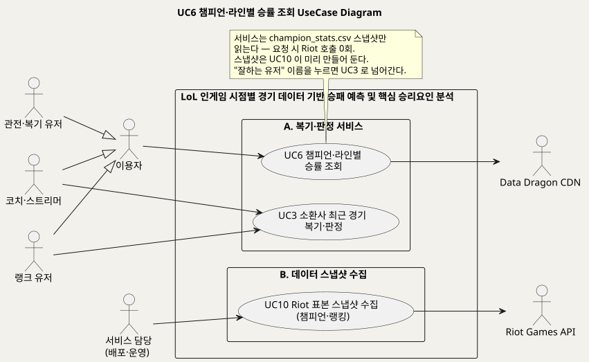
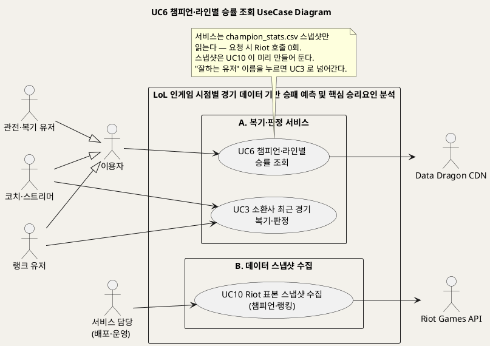
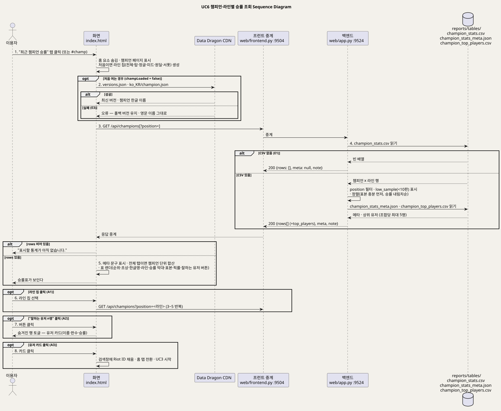
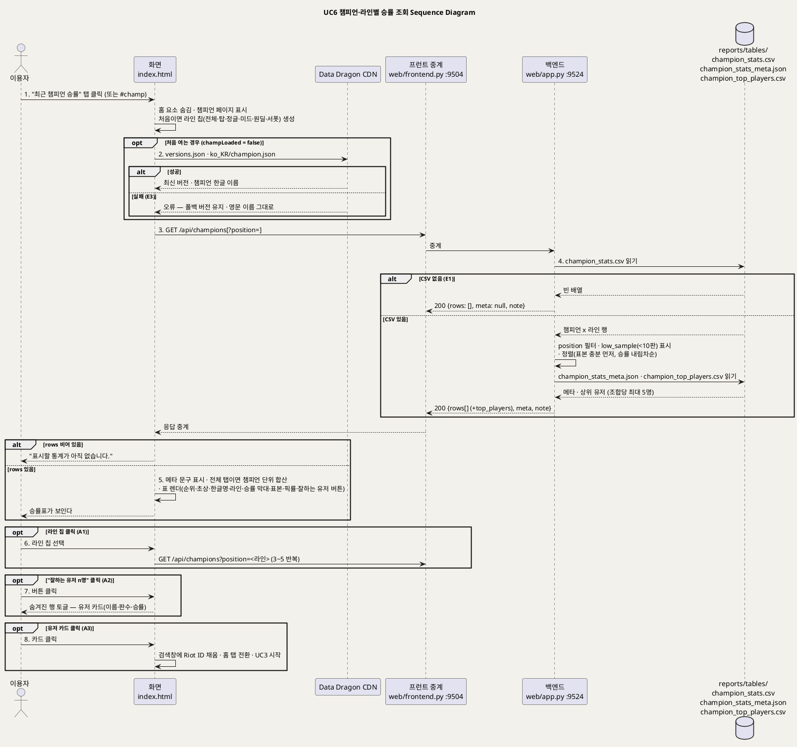

<!-- ─────────────────────────────────────────────
  UC6 챔피언·라인별 승률 조회 — 마스터 이상 솔로랭크 관찰 승률표를 스냅샷 CSV 에서 읽어 보여주는 흐름.
  왜 필요한가: "모델 예측이 아닌 관찰치" 라는 선, 표본 기준(5판·10판·8판), Riot 호출 0회 계약을 실패모드까지 근거와 함께 고정한다.
  주로 보는 사람: 팀원(설계·구현) · Claude(검수)
  ───────────────────────────────────────────── -->

# UseCase 명세 #6 챔피언·라인별 승률 조회 (A. 복기·판정 서비스)
**LoL 인게임 시점별 경기 데이터 기반 승패 예측 및 핵심 승리요인 분석 · UC6 · UML 2.5.1 표준 (UseCase Diagram + UseCase 기술 + Sequence Diagram)**

---

> **문서 식별**: `docs/usecases/UC_06_챔피언라인별승률조회.md`
> **작성일**: 2026-09-07 · **표준**: UML 2.5.1 (OMG)
> **원천(SoT)**: `docs/serving.md` §5 `/api/champions` · `web/app.py` `api_champions`·`_csv`·`TEXT_COLUMNS` · `web/frontend.py` `proxy` · `web/templates/index.html` `tabChamp`·`champPage`·`loadChampions`·`buildChampPos`·`loadChampNames`·`showTab`·클릭 위임 · `src/collect_champion_stats.py` 머리말·`aggregate` · `scripts/run_collectors.sh` · `reports/tables/champion_stats.csv`·`champion_stats_meta.json`·`champion_top_players.csv` · `docs/spec.md` §6 범위 제외 · `docs/product.md` §2 "대상이 아닌 것" · `docs/riot-api-application.md` "DATA HANDLING" — 구현 완료 상태의 저장소 문서·코드. 개요는 `UC_00_개요_LoL승패예측및핵심승리요인분석.md` §3 UC6 행.
> **다이어그램**: 모든 PlantUML 소스는 로컬 Kroki 에서 렌더 검증 완료(HTTP 200). 렌더 결과는 `diagrams/uc06_*.svg` 로 저장소에 함께 두어 로그인 없이 보인다. 뷰어 링크(plantuml.sumzip.com)는 사내 서버라 SSO 로그인이 필요하다.
> **단계**: 2단계(개별 UC) 산출물. 개요 문서의 상태 열은 3단계에서 일괄 갱신한다.

---

## 목차

1. [범위·개요](#1-범위개요)
2. [UseCase Diagram](#2-usecase-diagram)
3. [Actor 카탈로그](#3-actor-카탈로그)
4. [UseCase 목록 (원천 매핑)](#4-usecase-목록-원천-매핑)
5. [UseCase 기술 + Sequence Diagram](#5-usecase-기술--sequence-diagram)
6. [업무규칙(Business Rules) 종합](#6-업무규칙business-rules-종합)
7. [UML 표준 준수 노트](#7-uml-표준-준수-노트)

---

## 1. 범위·개요

"최근 챔피언 승률" 탭은 마스터 이상 솔로랭크에서 **최근 실제로 관찰된** 챔피언 x 라인 승률표를 보여준다. 원천은 이 값이 "우리 모델의 예측이 아니라 관찰된 승률(인과 아님)" 임을 API docstring·응답 `note`·화면 문구 세 곳에서 반복해 못 박는다 (근거: `web/app.py` `api_champions` docstring, `docs/serving.md` §5, `index.html` `showTab` heroTag).

데이터는 요청 시점에 Riot 을 부르지 않는다. 수집기(`src/collect_champion_stats.py`, UC10)가 미리 받아 `reports/tables/champion_stats.csv`·`champion_top_players.csv`·`champion_stats_meta.json` 으로 굳혀 두고, 서비스는 그 스냅샷만 읽는다. 표본이 적은 조합이 승률만으로 위에 오르지 않도록 집계 단계에서 5판 미만을 빼고, 서빙 단계에서 10판 미만을 "표본 적음" 으로 아래에 내린다 (근거: `collect_champion_stats.py` `aggregate`, `api_champions` `MIN_GAMES`).
각 행에는 "이 챔피언으로 승률이 높았던 유저" 최대 5명이 붙고, 이름을 누르면 그 유저의 10분 판정(UC3)으로 넘어간다 — 챔피언 통계를 서비스의 뿌리(10분 판정)에 되묶는 장치다 (근거: `index.html` 클릭 위임 `a.tpcard[data-search]`, `docs/product.md` §3 원칙).

| 항목 | 값 |
|---|---|
| 대상 시스템 | LoL 인게임 시점별 경기 데이터 기반 승패 예측 및 핵심 승리요인 분석 (공개 서비스 p4.sumzip.com) — 패키지 A. 복기·판정 서비스 |
| 상위 프로세스 | 탭 전환 → 라인 필터 → 승률표 열람 → (선택) 잘하는 유저 → 그 유저 복기(UC3) |
| 원천 근거 | `docs/serving.md` §5 `/api/champions` · `web/app.py` `api_champions` · `index.html` `loadChampions` · `src/collect_champion_stats.py` |
| 핵심 UseCase | 1개 (UC6). 스냅샷을 만드는 UC10 과 이름 클릭으로 이어지는 UC3 은 맥락으로만 표시 |
| 주요 액터 | 주: 이용자(랭크 유저·관전·복기 유저·코치·스트리머의 일반화) / 보조: Data Dragon CDN (챔피언 한글 이름·초상, 브라우저가 직접 호출) |

---

## 2. UseCase Diagram

PlantUML 소스 보기

소스를 직접 렌더하려면 **[「UC6 UseCase Diagram」 PlantUML 뷰어로 열기](https://plantuml.sumzip.com/plantuml/svg/eNp1VF1LG1EQfd9fMaQv7UMlIvgoaqKlILVYLH0Q5LpZk8VkN-zeVEor-LEWSVKqNMo2bCRC1ApKU41NAvriT-lj7ux_6NzdJMZ-vISde8-ZOXNmbsZtziyey6Qhpy5GRxdztqYyW1PsFd3IMotlYImpK0nLzBmJmJk2LXg0PTI9PDU5gLBTLGGu6kYSlln6ATdLXJbUXvF3aQ0sTeXMSKY1Ja0tc-AmWHoyxSGhyxvdNBSuc8LNx0YBf5T80g0etO6aonKDlZa4cgDzbXFcBTyq--Ui_FovwbytxUgtxHWWpHqKwlROEiNYaWD5DA93I8BsibJ6N-Lwwt84B_SqWF0PbueYsXJ_32msY9WhqlfXnVZ9EPda11bvcXhbwrZ718R8zc-3xMm5-NYKYDGTqSlF6TcLkZnZmak3gAVPYre9CLxXoOcMRCaGIKx11_SLu1jdB3Q80XYIHCIBujOByP-cWTAeWBM2HRv9kzwC-LHof3Vxkwy49jrNG-hc3lLpBeOhhG6CEUqwNqh1krR-qpO5vkPW5Gtiaxu3moA7Lp7u_UPtcBTmdJODv-eJq9ZfjAXj8WA3NJnN9pNu7eFoUHytP9I44wziFkuaBsTiLwJYPIz7M-kZB6LQEIU25Rf1uv_5nMZUbqC7ESafzdo9RqDuGctoNky8fB6uAx0pSrgU8PTph7FwfcLpDxwEcx6IFflL8VjgfJ8_FvjYA4cRCeh-U5eKHKqMes0EtsmDUIlhcg2WTM7NDJjL3bH2OxX5EqgplsnS81mkp8ztIdV-e--0OC1KeOWWgKJQCx4Nlkt4eSEXsjsdt4U_PYjS5gxJcI-LlfVAItEbIL7LJQfKJ77U8IAO9mRCSYjgoevvu1JK77kQQ5w4WHFA7DjiuCHOGrJzEEceCMclfqfuBHTNSIBsURmnL_obUn4DO_cMaQ==)** (사내 서버, SSO 로그인 필요) 또는 [로컬 Kroki 로 열기](http://192.168.0.91:8889/plantuml/svg/eNp1VF1LG1EQfd9fMaQv7UMlIvgoaqKlILVYLH0Q5LpZk8VkN-zeVEor-LEWSVKqNMo2bCRC1ApKU41NAvriT-lj7ux_6NzdJMZ-vISde8-ZOXNmbsZtziyey6Qhpy5GRxdztqYyW1PsFd3IMotlYImpK0nLzBmJmJk2LXg0PTI9PDU5gLBTLGGu6kYSlln6ATdLXJbUXvF3aQ0sTeXMSKY1Ja0tc-AmWHoyxSGhyxvdNBSuc8LNx0YBf5T80g0etO6aonKDlZa4cgDzbXFcBTyq--Ui_FovwbytxUgtxHWWpHqKwlROEiNYaWD5DA93I8BsibJ6N-Lwwt84B_SqWF0PbueYsXJ_32msY9WhqlfXnVZ9EPda11bvcXhbwrZ718R8zc-3xMm5-NYKYDGTqSlF6TcLkZnZmak3gAVPYre9CLxXoOcMRCaGIKx11_SLu1jdB3Q80XYIHCIBujOByP-cWTAeWBM2HRv9kzwC-LHof3Vxkwy49jrNG-hc3lLpBeOhhG6CEUqwNqh1krR-qpO5vkPW5Gtiaxu3moA7Lp7u_UPtcBTmdJODv-eJq9ZfjAXj8WA3NJnN9pNu7eFoUHytP9I44wziFkuaBsTiLwJYPIz7M-kZB6LQEIU25Rf1uv_5nMZUbqC7ESafzdo9RqDuGctoNky8fB6uAx0pSrgU8PTph7FwfcLpDxwEcx6IFflL8VjgfJ8_FvjYA4cRCeh-U5eKHKqMes0EtsmDUIlhcg2WTM7NDJjL3bH2OxX5EqgplsnS81mkp8ztIdV-e--0OC1KeOWWgKJQCx4Nlkt4eSEXsjsdt4U_PYjS5gxJcI-LlfVAItEbIL7LJQfKJ77U8IAO9mRCSYjgoevvu1JK77kQQ5w4WHFA7DjiuCHOGrJzEEceCMclfqfuBHTNSIBsURmnL_obUn4DO_cMaQ==) (내부망 전용). 위 그림 파일은 로그인 없이 보인다.

#### 다이어그램 쉽게 읽기 (유저 관점)

1. **누가 쓰나** — 왼쪽 "이용자"가 승률표(UC6)를 본다. 그 아래 세 사람은 이용자의 여러 얼굴이다. 오른쪽 아래 "서비스 담당"은 표를 보는 사람이 아니라, 표에 들어갈 자료를 미리 모아 두는 사람(UC10)이다.
2. **무슨 순서로** — 두 가지 일이 서로 다른 때에 일어난다. 먼저 서비스 담당이 자료 모으는 프로그램을 돌려 게임 회사에서 경기 기록을 받아 파일로 저장해 둔다(아래 묶음 B). 나중에 이용자가 탭을 열면 프로그램은 그 파일만 읽는다(위 묶음 A). 그래서 이용자가 표를 볼 때는 게임 회사에 물어보는 화살표가 없다.
3. **«include» = 항상 함께** — 이 그림에는 없다. 표 보기(UC6)가 자료 모으기(UC10)를 직접 시키는 것이 아니라, 모아 둔 파일을 읽기만 하므로 두 기능 사이에 선을 긋지 않았다.
4. **«extend» = 특별한 때만** — 이 그림에는 없다. "잘하는 유저" 이름을 누르면 그 사람 경기 되돌아보기(UC3)로 넘어가지만, 그것은 표 보기가 끝나고 새 화면이 시작되는 것이다. 표 보기 도중에 다른 기능이 끼어드는 것이 아니라서 쪽지에만 적었다.
5. **속이 빈 세모 화살표** — "게임을 열심히 하는 사람도 이용자다"라는 뜻이다. 이용자에게 이어진 일(UC6)은 세 종류 사람 모두 할 수 있다.
6. **오른쪽 Data Dragon CDN** — 캐릭터의 한글 이름과 얼굴 그림을 나눠 주는 게임 회사의 공개 창고다. 우리 서버가 아니라 이용자의 브라우저(인터넷 창)가 직접 받아 온다. 못 받아도 표는 영어 이름으로 그대로 나온다.

#### 표준 기호 범례

| 기호 | 의미 | UML 2.5.1 용어 |
|---|---|---|
| 사람 모양 (왼쪽) | 프로그램을 써서 무언가를 하려는 사람 | Primary Actor |
| 사람 모양 (상자 밖 오른쪽) | 프로그램이 일을 하려고 부르는 바깥 상대(다른 회사의 프로그램) | Secondary Actor |
| 타원 | 사람이 프로그램으로 이루려는 일 하나 | UseCase |
| 큰 사각형 · 안쪽 상자 | 프로그램의 울타리와 그 안의 묶음 | System Boundary (Subject) · Package |
| 실선 | 이 사람이 이 일을 한다 | Association |
| 속 빈 삼각 화살표 ◁ | "이것은 저것의 한 종류다". 종류가 되는 쪽은 부모가 할 수 있는 일을 다 할 수 있다 | Generalization |
| 쪽지 | 덧붙이는 설명 | Comment |

---

## 3. Actor 카탈로그

| 액터 | 구분 | 설명 | 이 UC 에서의 역할 | 근거 |
|---|:--:|---|---|---|
| 이용자 (추상) | Primary | 공개 서비스를 쓰는 모든 사람의 일반화 | 탭을 열어 챔피언·라인별 관찰 승률과 잘하는 유저를 본다 | `UC_00_개요_LoL승패예측및핵심승리요인분석.md` §4 [추론] 일반화, `index.html` `showTab` "특정 유저와 무관한 화면" |
| 랭크 유저 · 관전·복기 유저 · 코치·스트리머 | Primary (이용자의 자식) | 개요 §4 의 세 이용자 유형 | 이용자와 같다. 원천은 UC6 에 대해 유형별 목표를 구분하지 않는다 | `UC_00_개요_LoL승패예측및핵심승리요인분석.md` §4 |
| Data Dragon CDN | Secondary | 라이엇 공식 정적 파일 서버. `versions.json`(최신 패치 버전)과 `ko_KR/champion.json`(한글 이름), 챔피언 초상 이미지를 준다. 브라우저가 직접 호출하며 실패해도 기능이 죽지 않는다 | 표의 챔피언 한글명·초상을 채운다. 실패 시 영문 id·폴백 버전 이미지 | `index.html` `loadChampNames` 주석, `docs/riot-api-application.md` "DATA HANDLING"(챔피언 이미지 출처) |
| 서비스 담당(배포·운영) | Primary (UC10 의 액터, 이 UC 에서는 맥락) | 수집기를 돌려 스냅샷을 만든다. [추론] 실행 주체는 원천에 명시되지 않음(개요 §8 미해결) | 이 UC 의 사전조건(CSV 존재)을 만든다 | `scripts/run_collectors.sh`, `UC_00_개요_LoL승패예측및핵심승리요인분석.md` §4 |
| Riot Games API | Secondary (UC10 의 액터, 이 UC 에서는 맥락) | league-v4(마스터 이상 계정)·match-v5(경기 목록·상세)를 수집기가 부른다 | **이 UC 의 요청 경로에서는 호출되지 않는다** (0회) | `src/collect_champion_stats.py` `puuids_from_apex`·`main`, `docs/serving.md` §5 |

**액터가 아닌 환경 요소** — `reports/tables/champion_stats.csv`·`champion_top_players.csv`·`champion_stats_meta.json` 은 시스템 내부 스냅샷이다. 수집 원본 JSONL 파일은 `.gitignore` 대상이며 서비스가 읽지 않는다. 프런트 중계(9504)는 `/api/*` 를 백엔드로 넘길 뿐이다.

주의: 개요 문서 §3·§4 는 UC6 의 보조액터를 "—" 로 두고 Data Dragon CDN 을 UC3 에만 붙였다. 코드상 챔피언 탭도 Data Dragon 을 직접 부르므로 이 문서는 보조액터로 올린다. 3단계에서 개요 §4 Data Dragon 행의 관련 UC 에 UC6 을 추가할 것을 제안한다.

---

## 4. UseCase 목록 (원천 매핑)

이 문서가 명세하는 UC 는 UC6 하나다. 데이터를 만드는 UC 와 이름 클릭으로 이어지는 UC 를 맥락으로 함께 적는다.

| UC ID | 유스케이스명 | 이 문서에서 | 주액터 | 보조액터 | 우선순위 | 원천 근거 |
|:--:|---|:--:|---|---|:--:|---|
| UC6 | 챔피언·라인별 승률 조회 | **명세 대상** | 이용자 | Data Dragon CDN | Medium | `docs/serving.md` §5 `/api/champions` · `web/app.py` `api_champions` · `index.html` 탭 "최근 챔피언 승률"·`loadChampions` |
| UC10 | Riot 표본 스냅샷 수집 (챔피언·랭킹) | 맥락 (이 UC 가 읽는 CSV 를 만든다) | 서비스 담당(배포·운영) | Riot Games API | Medium | `src/collect_champion_stats.py` 머리말 · `scripts/run_collectors.sh` — 상세는 `UC_10_Riot표본스냅샷수집.md` |
| UC3 | 소환사 최근 경기 복기·판정 | 맥락 (잘하는 유저 이름 클릭 시 새로 시작) | 랭크 유저 · 코치·스트리머 | Riot Games API · Data Dragon CDN | High | `index.html` 클릭 위임 `a.tpcard[data-search]` → `loadSummoner` — 상세는 `UC_03_소환사최근경기복기판정.md` |

**응답 계약 (원천 → 화면)**

| 원천 파일 | 응답 필드 | 화면 표기 | 규칙 |
|---|---|---|---|
| `champion_stats.csv` (champion·position·경기수·승률·픽률) | `rows[]` — `champion`·`position`·`games`·`win_rate`·`pick_rate`·`low_sample` | 순위·초상+한글명·라인·승률 막대·표본("표본 적음")·픽률 | 5판 미만 제외(집계) · 10판 미만 `low_sample`(서빙) |
| `champion_stats_meta.json` (수집_경기수·정의·패치·기간·갱신) | `meta` | "마스터 이상 솔로랭크 n판 기준 · 기간 · 패치 · 갱신" + 정의 문장 | 화면에 나가는 경기 수는 이 하나로 고정 |
| `champion_top_players.csv` (champion·position·name·tag·판수·승률) | `rows[].top_players[]` (최대 5) | "잘하는 유저 n명" 버튼 → 카드(이름·판수·승률) | 8판 이상 & 승률 50% 초과, 공개 Riot ID 만 |
| (고정 문자열) | `note` | 메타가 없을 때 대신 표시 | "관찰 승률… 표본 5판 미만은 제외" |

---

## 5. UseCase 기술 + Sequence Diagram

### 5.1 UC6 챔피언·라인별 승률 조회

> **쉽게 말하면** — "최근 챔피언 승률" 탭을 누르면 표가 하나 나온다. 실력이 아주 높은 사람들이 최근에 어떤 캐릭터(챔피언)로, 어느 자리(라인)에서, 얼마나 이겼는지 세어 놓은 표다.
> 자리 버튼을 누르면 그 자리만 골라 볼 수 있고, 경기 수가 너무 적은 줄은 "표본 적음"이라고 적어 아래로 내려 둔다.
> 캐릭터 옆 "잘하는 유저"를 누르면 그 캐릭터로 많이 이긴 사람 이름이 나오고, 이름을 누르면 그 사람의 최근 경기를 되돌아보는 화면으로 넘어간다.
> 이 표는 프로그램이 짐작한 숫자가 아니라 실제 경기를 세어 본 숫자다.

#### 유스케이스 기술

| 속성 | 내용 |
|---|---|
| **ID** | UC6 — 개요 `UC_00_개요_LoL승패예측및핵심승리요인분석.md` §3 UC6 행 · 엔드포인트 `GET /api/champions` · 화면 `tabChamp`·`champPage`·`loadChampions`·`buildChampPos` · 수집기 `src/collect_champion_stats.py` |
| **유스케이스명** | 마스터 이상 솔로랭크의 챔피언 x 라인 관찰 승률과 그 챔피언을 잘 쓰는 유저를 확인한다 |
| **액터** | 주: 이용자(랭크 유저·관전·복기 유저·코치·스트리머의 일반화) / 보조: Data Dragon CDN (한글 이름·초상, 브라우저 직접 호출). Riot Games API 는 이 UC 에서 호출되지 않는다 |
| **사전조건** | (1) 백엔드·프런트가 기동돼 있다. (2) 수집기(UC10)가 `reports/tables/champion_stats.csv` 를 만들어 두었다 — 없으면 E1. `champion_stats_meta.json`·`champion_top_players.csv` 는 없어도 된다(메타 null, 유저 목록 빈 채로). (3) 이용자가 브라우저로 서비스를 열었다. 로그인·계정은 없다. (4) Riot API 키 유무와 무관하다(`RIOT_READY` 를 보지 않는다) |
| **사후조건** | (1) 챔피언 페이지에 메타 문구와 승률표가 그려져 있고, 선택한 라인 칩이 눌린 상태(`aria-pressed`)다. (2) `champLoaded` 가 true 라 탭을 오가도 다시 요청하지 않는다(라인 칩을 누를 때만 재요청). (3) 서버 상태는 바뀌지 않는다(읽기 전용). (4) 잘하는 유저 이름을 눌렀다면 검색창에 그 Riot ID 가 들어가고 홈 탭에서 UC3 가 시작돼 있다 |
| **기본흐름** | ↓ 별도 기본흐름표 (8단계, 시퀀스 메시지 1~8 과 1:1. 6~8 은 선택 단계) |
| **대체흐름** | **A1. 라인 필터** — 라인 칩(탑·정글·미드·원딜·서폿)을 누르면 `?position=` 을 붙여 다시 요청하고, 표에서 라인 열을 뺀다. "전체" 로 돌아오면 챔피언 단위로 합산해 보인다(같은 챔피언이 라인 수만큼 반복되지 않게, 라인 칸에는 판수 많은 순 상위 2개 + "외"). **A2. 잘하는 유저 펼침** — "잘하는 유저 n명" 버튼으로 숨겨진 행을 토글한다. 전체 탭에서는 라인별 목록을 합쳐 중복 이름을 빼고 승률순 5명만 보인다. **A3. 유저 카드 클릭** — 검색창에 `이름#태그` 를 넣고 맨 위로 스크롤한 뒤 홈 탭으로 전환해 UC3 를 시작한다. **A4. 주소 해시 `#champ`** — 링크로 바로 이 탭을 연다(공유용). **A5. 메타 파일 없음** — `meta` 가 null 이면 메타 문구 대신 응답 `note` 를 보인다. **A6. 상위 유저 파일 없음** — `top_players` 가 빈 목록이라 버튼이 그려지지 않는다("없으면 조용히 빈 목록") |
| **예외흐름** | **E1. 스냅샷 CSV 없음** — `_csv` 가 빈 배열을 돌려주면 백엔드가 `200 {rows: [], meta: null, note: "아직 수집된 챔피언 통계가 없습니다."}` 로 응답하고 화면은 "표시할 통계가 아직 없습니다." 를 보인다. 오류 코드가 아니라 정상 응답이다 — 수집 전 상태를 고장으로 보이지 않게 한 설계. **E2. API 요청 실패(네트워크·500)** — `loadChampions` 의 `catch` 가 "통계를 불러오지 못했습니다." 를 표에 넣는다. 재시도 버튼은 없다 — 라인 칩을 다시 누르면 재요청된다 [추론]. **E3. Data Dragon 실패** — 버전 조회가 실패하면 폴백 버전을 유지하고, 이름 조회가 실패하면 영문 id 그대로 보인다. 신규 챔피언은 폴백 버전에 없어 초상이 깨질 수 있다(`loadChampNames` 주석) — 기능은 죽지 않는다. **E4. 알 수 없는 `position` 값** — 필터 결과가 0행이면 화면은 "표시할 통계가 아직 없습니다." 를 보인다. 서버는 값을 검증하지 않는다 [추론] — 확인 필요. **E5. 태그가 숫자처럼 보임** — `tag` "0223" 을 숫자로 바꾸면 223 이 되어 유저 카드 링크가 죽는다. `_csv` 가 `TEXT_COLUMNS`(tag·name·champion·position) 을 문자열로 고정해 막는다(실제로 죽은 적 있음) |
| **포함/확장** | 없음. UC6 은 UC10 의 산출물(파일)을 읽을 뿐 UC10 을 «include» 하지 않고, 유저 카드 클릭은 UC6 종료 후 UC3 를 새로 시작하는 전이이지 «extend» 가 아니다 |
| **우선순위** | Medium — 개요 §3 "탭으로 제공되는 부가 기능". 뿌리(10분 판정)와는 "잘하는 유저 → UC3" 로만 이어진다 |
| **사용빈도** | 정량 자료 없음 — 확인 필요. [추론] 탭을 처음 열 때 1회 + 라인 칩을 누를 때마다 1회 요청. Data Dragon 은 페이지당 1회(첫 화면에서 이미 받았으면 재사용) |
| **업무규칙** | BR-CHMP-01 · BR-CHMP-02 · BR-CHMP-03 · BR-CHMP-04 · BR-CHMP-05 · BR-CHMP-06 · BR-CHMP-07 · BR-CHMP-08 (§6) |
| **특별 요구사항** | **정직성** — 표가 관찰치이며 모델 예측·인과가 아님을 화면 문구와 응답 `note` 에 항상 싣는다. **표본 규율** — 승률만으로 정렬하지 않고 표본 충분 여부를 먼저 세운다. **개인정보** — 공개 Riot ID(이름·태그)만 담고 puuid 는 저장하지 않는다. puuid 를 담은 원본은 공개하지 않는다. **성능** — 요청마다 CSV 2종 + JSON 1종을 다시 읽는다(캐시 없음) [추론] 파일이 수백 행이라 문제되지 않으나 원천에 목표치는 없다. **접근성** — 라인 칩 `aria-pressed`, 탭 `aria-selected`, 초상 `loading="lazy"`. **범위 제한** — 챔피언 밸런스 판단·아이템·룬 추천은 하지 않는다 |
| **비고** | **원천 추적성** — `docs/serving.md` §5 `GET /api/champions` 행 / `web/app.py` `TEXT_COLUMNS`(L56)·`_csv`(L63~)·`api_champions`(L482~522) / `web/frontend.py` `proxy` / `web/templates/index.html` `tabChamp`(L417)·`champPage`(L486~490)·`loadChampNames`(L570~580)·`POS_LIST`(L1321)·`loadChampions`(L1325~1405)·`buildChampPos`(L1407~1420)·`showTab`(L1425~1450)·클릭 위임(L1461~1473) / `src/collect_champion_stats.py` 머리말·`PACE_SEC`·`RESERVE`·`TIERS`·`MIN_DURATION`·`main`·`aggregate` / `scripts/run_collectors.sh` `--minutes 40 --players 400 --per-player 15` / `reports/tables/champion_stats.csv`·`champion_stats_meta.json`·`champion_top_players.csv`. **원천 간 불일치** — 수집기 머리말은 "다이아 이상 솔로랭크" 라 적었으나 `TIERS` 는 챌린저·그랜드마스터·마스터이고 화면·API 는 "마스터 이상" 이라 한다 — 머리말 오기로 보임, 확인 필요. **개요와의 차이** — 보조액터 Data Dragon CDN 추가(§3 주의). **테스트** — `tests/`·`check_project.sh` 에 `/api/champions` 스모크가 없다 — 확인 필요 |

#### 기본흐름 (Basic Flow)

| 단계 | 액터 행위 | 시스템 행위 |
|:--:|---|---|
| 1 | 이용자가 상단 탭 "최근 챔피언 승률" 을 누른다 (또는 `#champ` 주소로 들어온다) | 화면이 홈 전용 요소(검색창·프로필·전적·성적표)를 숨기고 챔피언 페이지를 보이며, 머리글을 "마스터 이상 솔로랭크에서 최근 실제로 관찰된 챔피언·라인별 승률" 로 바꾼다. 처음이면 라인 칩(전체·탑·정글·미드·원딜·서폿)을 만든다 |
| 2 | 이용자가 표가 채워지길 기다린다 | 화면이 Data Dragon 에서 최신 버전과 한글 챔피언 이름을 받는다(첫 화면에서 이미 받았으면 재사용). 실패해도 계속 진행한다 |
| 3 | — | 화면이 `GET /api/champions` 를 보내고(선택한 라인이 있으면 `?position=`), 프런트 중계가 백엔드로 넘긴다 |
| 4 | — | 백엔드가 `champion_stats.csv` 를 읽어 행을 만들고 라인으로 거른 뒤, 10판 미만에 `low_sample` 을 붙이고 "표본 충분 먼저, 승률 내림차순" 으로 정렬한다. `champion_stats_meta.json` 을 `meta` 로, `champion_top_players.csv` 에서 조합당 최대 5명을 `top_players` 로 붙여 200 으로 돌려준다 |
| 5 | — | 화면이 메타 문구(수집 경기 수·기간·패치·갱신·정의, 5판·10판 기준 안내)를 쓰고, 전체 탭이면 챔피언 단위로 합산한 뒤 표를 그린다 — 순위, 초상+한글명, 라인, 승률 막대, 표본 수("표본 적음"), 픽률, "잘하는 유저 n명" 버튼 |
| 6 | (선택) 이용자가 라인 칩을 누른다 | 화면이 칩의 눌림 상태를 바꾸고 3~5 를 그 라인으로 다시 수행한다. 라인 열은 표에서 뺀다 |
| 7 | (선택) 이용자가 "잘하는 유저 n명" 버튼을 누른다 | 화면이 그 행 아래 숨겨진 유저 카드 목록(이름·판수·승률)을 토글하고, "이름을 누르면 그 사람 전적을 10분 시점으로 분석합니다" 안내를 보인다 |
| 8 | (선택) 이용자가 유저 카드를 누른다 | 화면이 검색창에 그 Riot ID 를 넣고 맨 위로 스크롤한 뒤 홈 탭으로 전환해 소환사 복기(UC3)를 시작한다 |

#### Sequence Diagram

PlantUML 소스 보기

소스를 직접 렌더하려면 **[「UC6 Sequence Diagram」 PlantUML 뷰어로 열기](https://plantuml.sumzip.com/plantuml/svg/eNp1Vl1P21YYvveveJXeJBqYr8I21HYdJEzVpl2UsRtAkUlcyDB2GpvSatoUGg8Fkq1BSyDQwFyJFpioFkjSBAk0iZ-yy5zj_7D3HNv5IOIiCT7n_Xye533NY92QEsbqigKrkfDgWFiXnwv6ckyNSwlpBRakyPJiQltVo5OaoiXg3tTI1FBoosNCX5Ki2lpMXYRnkqLLghEzFBlmJseAnuft_BXdadzUycEVPWiQigl065K8t4C-K9v7WfgvmYdp-fmqrEZkQZAiBqbw0YMq3T-lhzkfSDrM6HJCwFRGLBKLS6oBPnsvT06rc2pMjcovxSVjRXEMn3SbBSVDgmBCWtRUmAx-z22CwVuh8ib5q2xvNYAebTcr5py6Ji8MPEtoqiGrUTH-Csa_HB28z32nQt2-pHxOd_Pkz5LjJMXjrv2wYz8REqJYwoKky-BLyHEtYegD-KzI-sCcGlmSVuIxTQ0j_IYuRvQXt8_CK7IhiT_pmtpxY2jxcFyRXskJ7uMUNi0IDCXof4QgwDgMiQhirdSsX7U5cIH3gZ36CPZ6lXz4CH5SzJGtPNzj4QMCOnsh7L000P083cgCTZ80L5NwU-8IZv9RZCwdJ8HeLtEMQkAv8CSLh0gNOHQDvTz1U8ukF9Wbup3avqlTq9BsJFEO_zQQN3x-myN59muW7Df_BoCmDqh5LmhxA5x4QHfPWIXNi2u6XwY_L_Q7TYrKUXjoCC4gADiFB4NY-LAILxAcxErn2LG6l7Xwt08HPAz5MTpJCmYxz5uVGj4A8-73ukfwaMYCcmFi-bc6L5SwBWCNfjDRUcYSgGaO7OwJ-EMjgd5YxSPyvsiVbr-pomi8sLRkMQBZ9OI6OWu4MaFZb5BskrwrsehqVGAfp8GpEMYbEeGb0A-Aeou1WtJnv4preszAPx_OC2iGxhPM2FG1MMFPpqbx5L4IvdLD1NfNRllgkExO_4iobzDw_aEh1g_69XsByWUaSLlMd6t4wcJ6ZQ0PDsLPCW1NH4fZ-T5g2h0HdVVR-kDVDPkXgQPFgx-mMfituG2AX3rqsXc23RyujdcicmDaZpkhp2hrYR27UWT_g6FBO5sLtATJcLUKxDrz4wmpILyfTsknE8jJFbWSfd4iIq8R9CtaPqHpUqCVj0N11ziyxHcNpIfkLdRO83bKoTq1TksO91YS_GwNFk5J5pJJDlmHUfL3b4G7oJ2dB_9nHQkDDs4thFEoU6EO5R1sk0zN0wDjlgVBCk26U23TwLTFXNgGGceVyPGzCxbYGzV0bJZR7QWTHq9zWWzVSCZNMkeiz2GUh-yK5WYfFb22UdvN2plLDAeB7wS2idx90WafZE4YPggKfV3mJKIbECtLfs_7kSK8xHVRTSOOuFP4LCJi3gsGr1xWjzcRTbTg1ONv_hqP8fqwaBeKbKO4DOAs2ltXgR4YnDjoztonlSp7e2WOOMRsO7UXXGuXfs1npWsPj4mdhtS07NRBCyRObe8ktwf5geP7CPwjv47i0BVJpRZoVeDraUVFIHztcoZ7yvlcdNt1jXqbxk1_cUKPTTZ7SL_FNh1bXG4GelnFte139hSCms3RdNHDvF1al3W7oJGegr4Qu426BdS8SNLUJi1f090cPI1pBjwJolJM-pZPEntDsXcZisneK7KTmckR3MQlerjNS3mMX_hvjfA_v6MY8Q==)** (사내 서버, SSO 로그인 필요) 또는 [로컬 Kroki 로 열기](http://192.168.0.91:8889/plantuml/svg/eNp1Vl1P21YYvveveJXeJBqYr8I21HYdJEzVpl2UsRtAkUlcyDB2GpvSatoUGg8Fkq1BSyDQwFyJFpioFkjSBAk0iZ-yy5zj_7D3HNv5IOIiCT7n_Xye533NY92QEsbqigKrkfDgWFiXnwv6ckyNSwlpBRakyPJiQltVo5OaoiXg3tTI1FBoosNCX5Ki2lpMXYRnkqLLghEzFBlmJseAnuft_BXdadzUycEVPWiQigl065K8t4C-K9v7WfgvmYdp-fmqrEZkQZAiBqbw0YMq3T-lhzkfSDrM6HJCwFRGLBKLS6oBPnsvT06rc2pMjcovxSVjRXEMn3SbBSVDgmBCWtRUmAx-z22CwVuh8ib5q2xvNYAebTcr5py6Ji8MPEtoqiGrUTH-Csa_HB28z32nQt2-pHxOd_Pkz5LjJMXjrv2wYz8REqJYwoKky-BLyHEtYegD-KzI-sCcGlmSVuIxTQ0j_IYuRvQXt8_CK7IhiT_pmtpxY2jxcFyRXskJ7uMUNi0IDCXof4QgwDgMiQhirdSsX7U5cIH3gZ36CPZ6lXz4CH5SzJGtPNzj4QMCOnsh7L000P083cgCTZ80L5NwU-8IZv9RZCwdJ8HeLtEMQkAv8CSLh0gNOHQDvTz1U8ukF9Wbup3avqlTq9BsJFEO_zQQN3x-myN59muW7Df_BoCmDqh5LmhxA5x4QHfPWIXNi2u6XwY_L_Q7TYrKUXjoCC4gADiFB4NY-LAILxAcxErn2LG6l7Xwt08HPAz5MTpJCmYxz5uVGj4A8-73ukfwaMYCcmFi-bc6L5SwBWCNfjDRUcYSgGaO7OwJ-EMjgd5YxSPyvsiVbr-pomi8sLRkMQBZ9OI6OWu4MaFZb5BskrwrsehqVGAfp8GpEMYbEeGb0A-Aeou1WtJnv4preszAPx_OC2iGxhPM2FG1MMFPpqbx5L4IvdLD1NfNRllgkExO_4iobzDw_aEh1g_69XsByWUaSLlMd6t4wcJ6ZQ0PDsLPCW1NH4fZ-T5g2h0HdVVR-kDVDPkXgQPFgx-mMfituG2AX3rqsXc23RyujdcicmDaZpkhp2hrYR27UWT_g6FBO5sLtATJcLUKxDrz4wmpILyfTsknE8jJFbWSfd4iIq8R9CtaPqHpUqCVj0N11ziyxHcNpIfkLdRO83bKoTq1TksO91YS_GwNFk5J5pJJDlmHUfL3b4G7oJ2dB_9nHQkDDs4thFEoU6EO5R1sk0zN0wDjlgVBCk26U23TwLTFXNgGGceVyPGzCxbYGzV0bJZR7QWTHq9zWWzVSCZNMkeiz2GUh-yK5WYfFb22UdvN2plLDAeB7wS2idx90WafZE4YPggKfV3mJKIbECtLfs_7kSK8xHVRTSOOuFP4LCJi3gsGr1xWjzcRTbTg1ONv_hqP8fqwaBeKbKO4DOAs2ltXgR4YnDjoztonlSp7e2WOOMRsO7UXXGuXfs1npWsPj4mdhtS07NRBCyRObe8ktwf5geP7CPwjv47i0BVJpRZoVeDraUVFIHztcoZ7yvlcdNt1jXqbxk1_cUKPTTZ7SL_FNh1bXG4GelnFte139hSCms3RdNHDvF1al3W7oJGegr4Qu426BdS8SNLUJi1f090cPI1pBjwJolJM-pZPEntDsXcZisneK7KTmckR3MQlerjNS3mMX_hvjfA_v6MY8Q==) (내부망 전용). 위 그림 파일은 로그인 없이 보인다.

**시퀀스 읽는 법** — 번호 1~8 이 기본흐름 8단계와 1:1 이다. Data Dragon 은 우리 서버를 거치지 않고 브라우저에서 바로 가는 별도 lifeline 이며, 그 `alt` 의 실패 갈래가 E3 이다. 백엔드 쪽 `alt` 의 "CSV 없음" 갈래가 E1 로, HTTP 200 인 채 빈 목록을 돌려준다는 점이 다른 실패와 다르다. 아래 세 `opt` 는 선택 단계 6~8(대체흐름 A1~A3)이고, 8 은 UC6 을 떠나 UC3 로 가는 전이다.

---

## 6. 업무규칙(Business Rules) 종합

| BR ID | 규칙 | 적용 UC | 근거 |
|---|---|:--:|---|
| BR-CHMP-01 | 챔피언 x 라인 승률은 마스터 이상 솔로랭크에서 **관찰된** 값이지 모델의 예측이 아니며 인과로 읽지 않는다. 이 문구를 API `note` 와 화면에 항상 싣는다 | UC6 | `web/app.py` `api_champions` docstring·`note`, `docs/serving.md` §5, `index.html` `showTab` heroTag |
| BR-CHMP-02 | 집계에서 경기 수 5판 미만 조합은 제외하고, 서빙에서 10판 미만은 `low_sample` 로 표시해 아래로 내린다. 정렬은 "표본 충분 먼저, 승률 내림차순" — "7판 85%" 가 1위가 되지 않게 | UC6 | `src/collect_champion_stats.py` `aggregate` (`경기수 >= 5`), `web/app.py` `MIN_GAMES = 10`·정렬 주석 |
| BR-CHMP-03 | "잘하는 유저" 는 그 조합 8판 이상이고 승률 50% 초과인 사람만, 조합당 최대 5명이다. 3판 100% 는 참고가 안 된다 | UC6 | `src/collect_champion_stats.py` `aggregate` 상위 플레이어 필터 주석, `web/app.py` `tops` (`< 5`) |
| BR-CHMP-04 | 서비스는 스냅샷 CSV 만 읽고 요청 시 Riot 을 부르지 않는다. 스냅샷은 수집기(UC10)가 이어받기 방식으로 만들고 라이브 예산을 양보한다 | UC6, UC10 | `web/app.py` `api_champions` docstring, `src/collect_champion_stats.py` 머리말·`RESERVE`, `scripts/run_collectors.sh` |
| BR-CHMP-05 | 화면에 나가는 수집 경기 수는 `meta` 의 하나("라인 정보가 있고 11분 이상 진행된 중복 없는 경기 수")로 고정한다. 원본 줄 수·필터 전 수·참가자 수를 섞어 말하지 않는다 | UC6 | `src/collect_champion_stats.py` `aggregate` meta 주석, `champion_stats_meta.json` `정의` |
| BR-CHMP-06 | 표본은 챌린저·그랜드마스터·마스터 계정의 솔로랭크(큐 420) 경기이며, 11분 미만(조기 항복)은 제외한다 | UC6, UC10 | `src/collect_champion_stats.py` `TIERS`·`SOLO_QUEUE`·`MIN_DURATION` |
| BR-CHMP-07 | 수집·표시는 공개 Riot ID(이름·태그)만 담고 puuid 같은 내부 식별자는 저장하지 않는다. 이름·태그·챔피언·라인은 숫자로 바꾸지 않고 문자열로 둔다 | UC6, UC10 | `src/collect_champion_stats.py` 머리말·`main` 주석, `web/app.py` `TEXT_COLUMNS` 주석, `docs/riot-api-application.md` "DATA HANDLING" |
| BR-CHMP-08 | 챔피언 밸런스 판단·아이템·룬 빌드 추천은 범위 밖이다. 이 표는 관찰치 제공에 그치고, 서비스의 뿌리(10분 판정)와는 "잘하는 유저 → UC3" 로만 이어진다 | UC6 | `docs/spec.md` §6, `docs/product.md` §2 "대상이 아닌 것"·§3 원칙 |

---

## 7. UML 표준 준수 노트

| 항목 | 적용 | 근거 (UML 2.5.1) |
|---|---|---|
| 패키지 분리 | 시점·주체가 다른 UC10(수집)을 Subject 안 별도 `package` 로 두고 UC6 과 관계선을 긋지 않았다. 파일을 매개로 한 의존은 note 로 적었다 | §12.2 Package · §18.1.3.2 — Include/Extend 는 행위 삽입에만 쓴다 |
| Actor 일반화 | 추상 액터 "이용자" 아래 세 액터를 Generalization(◁)으로 묶고 Association 은 부모에만 그렸다 | §18.1.3.1 Actor — Actor 간 Generalization 허용 |
| Secondary Actor | Data Dragon CDN 은 Subject 밖에 두고 UC6 에서 실선으로 연결. Riot Games API 는 UC10 에만 연결해 "UC6 요청 경로에서 0회" 를 그림으로 보였다 | §18.1.3.1 Subject / Actor — 외부 시스템도 Actor |
| 전이 vs Extend | 유저 카드 클릭 → UC3 는 UC6 종료 후 새 UC 시작(전이)이라 Extend 로 그리지 않았다 | §18.1.3.2 Extend — 기준 UC 안의 ExtensionPoint 에 행위가 삽입될 때만 |
| Sequence 결합 프래그먼트 | 조건부 단계는 `opt`, 성공·실패 분기는 `alt` 로 표현하고 대체·예외흐름 ID 를 병기했다. 외부 CDN 과 파일 저장소(`database`)를 별도 lifeline 으로 두었다 | §17.6 CombinedFragment — opt / alt |
| 1:1 대응 | 기본흐름 8단계 = 시퀀스 번호 메시지 1~8 (6~8 은 `opt`) | 스킬 `references/plantuml.md` Sequence 규칙 |
| 사실·추론 구분 | 원천에서 직접 확인되지 않는 판단은 `[추론]` 을 붙였다 (E2 재시도, E4 검증 부재, 성능, 사용빈도, 수집 주체) | 스킬 절대 규칙 2 |

---

*표기 표준: UML 2.5.1 (OMG). 서식 정본: usecase 스킬 `references/format-spec.md`. 원천에 없는 액터·수치·외부시스템은 만들지 않았으며, 설계 판단은 `[추론]` 으로, 원천에서 확인되지 않는 항목은 `확인 필요` 로 표시했다. 3단계에서 개요 문서 §4·§7·§8 에 반영할 사항: Data Dragon CDN 관련 UC 에 UC6 추가 · 수집기 머리말 "다이아 이상" 표기 불일치 · `position` 값 미검증(E4) · `/api/champions` 스모크 테스트 부재 · 사용빈도 정량 자료 없음.*
