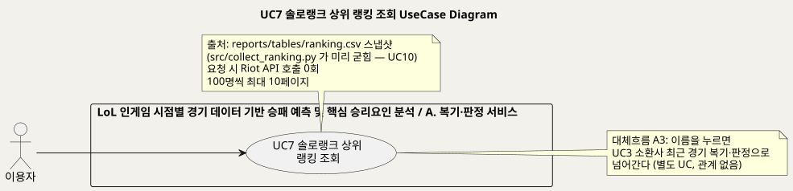
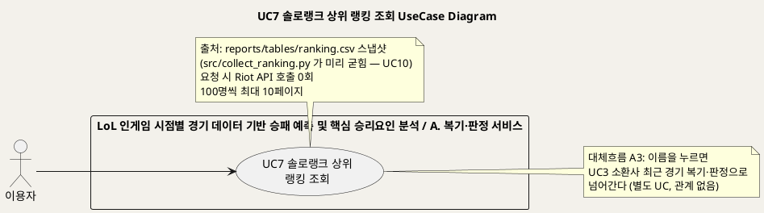
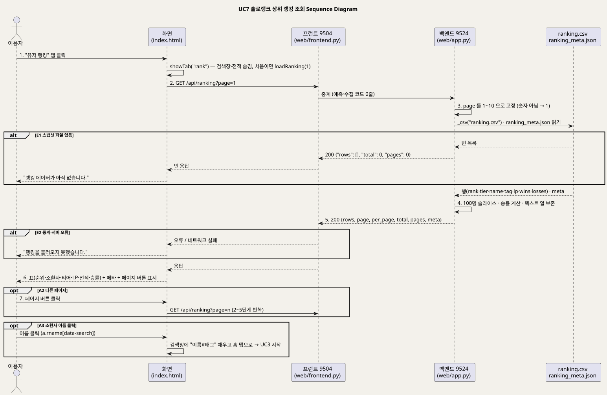
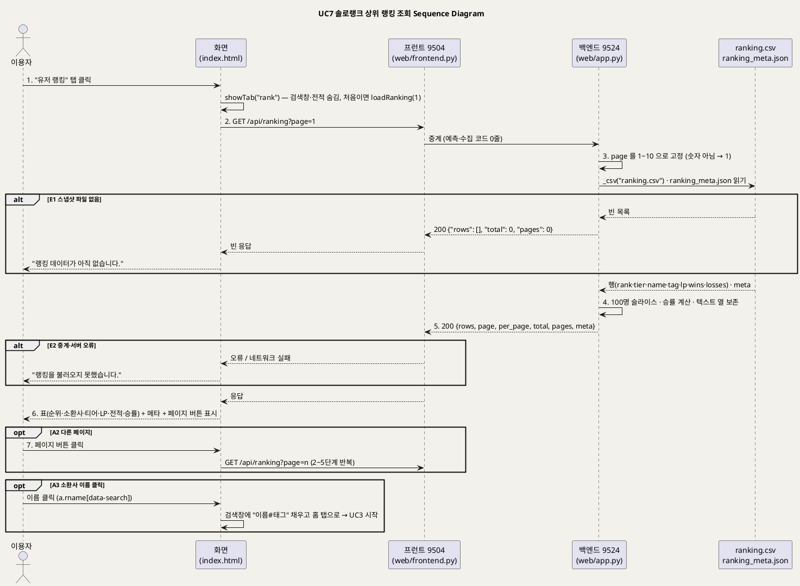

<!-- ─────────────────────────────────────────────
  UC7 상세 명세 — 솔로랭크 상위 1,000명 랭킹을 스냅샷에서 읽어 보여주는 흐름.
  왜 필요한가: 개요(UC_00)의 목록을 구현 가능한 수준(사전·사후조건·흐름·예외·업무규칙·시퀀스)으로 내린다.
  주로 보는 사람: 팀원(구현·검수) · Claude(검수)
  ───────────────────────────────────────────── -->

# UseCase 명세 #7 솔로랭크 상위 랭킹 조회 (A. 복기·판정 서비스)
**LoL 인게임 시점별 경기 데이터 기반 승패 예측 및 핵심 승리요인 분석 · UC7 · UML 2.5.1 표준 (UseCase Diagram + UseCase 기술 + Sequence Diagram)**

---

> **문서 식별**: `docs/usecases/UC_07_상위랭킹조회.md`
> **작성일**: 2026-09-07 · **표준**: UML 2.5.1 (OMG)
> **원천(SoT)**: `docs/serving.md` §5 `/api/ranking` · `web/app.py` `_csv`·`TEXT_COLUMNS`·`api_ranking` · `web/frontend.py` `proxy` · `web/templates/index.html` 탭 "유저 랭킹"·`loadRanking`·`showTab`·이름 클릭 위임 핸들러 · `src/collect_ranking.py` 머리말·`_write` · `reports/tables/ranking.csv`·`ranking_meta.json` · `tests/test_contract.py` `test_ranking_has_no_puuid`·`test_csv_keeps_text_columns_as_text`
> **개요 문서**: [UC_00_개요_LoL승패예측및핵심승리요인분석.md](UC_00_개요_LoL승패예측및핵심승리요인분석.md) §3 UC7 행
> **다이어그램**: 모든 PlantUML 소스는 로컬 Kroki 에서 렌더 검증 완료(HTTP 200). 렌더 결과는 `diagrams/*.svg` 로 함께 두어 로그인 없이 보인다. 뷰어 링크는 사내 서버라 SSO 로그인이 필요하다.

---

## 목차

1. [범위·개요](#1-범위개요)
2. [UseCase Diagram](#2-usecase-diagram)
3. [Actor 카탈로그](#3-actor-카탈로그)
4. [UseCase 목록 (원천 매핑)](#4-usecase-목록-원천-매핑)
5. [UseCase 기술 + Sequence Diagram](#5-usecase-기술--sequence-diagram)
6. [업무규칙(Business Rules) 종합](#6-업무규칙business-rules-종합)
7. [UML 표준 준수 노트](#7-uml-표준-준수-노트)

---

## 1. 범위·개요

이 유스케이스는 이용자가 "유저 랭킹" 탭에서 **솔로랭크 상위 1,000명(챌린저 + 그랜드마스터)** 을 LP 내림차순으로
100명씩 10페이지에 걸쳐 보는 흐름이다. 순위·소환사(이름#태그)·티어·LP·전적·승률이 표로 나오고,
이름을 누르면 그 유저의 최근 경기 복기(UC3)로 넘어간다. (근거: `index.html` 탭 "유저 랭킹"·`loadRanking`, `docs/serving.md` §5)

요청 시점에 Riot API 를 부르지 않는다. league-v4 는 이름을 주지 않아 1인당 account-v1 을 한 번 더 불러야 하는데,
1,000명이면 1,000회라 라이브 요청 안에서는 불가능하기 때문이다. 그래서 `src/collect_ranking.py`(UC10)가 미리 모아
`reports/tables/ranking.csv` 로 굳히고, 서비스는 그 CSV 와 `ranking_meta.json` 만 읽는다. (근거: `web/app.py` `api_ranking` docstring, `src/collect_ranking.py` 머리말)

| 항목 | 값 |
|---|---|
| 대상 시스템 | LoL 인게임 시점별 경기 데이터 기반 승패 예측 및 핵심 승리요인 분석 — 패키지 A. 복기·판정 서비스 |
| 상위 프로세스 | 첫 화면 탐색 — 상위 유저를 둘러보다 이름을 눌러 10분 판정(UC3)으로 진입하는 입구 (`index.html` `heroTag` "이름을 누르면 그 유저의 10분 판정을 볼 수 있습니다") |
| 원천 근거 | `docs/serving.md` §5 `/api/ranking` · `web/app.py` `api_ranking`·`_csv` · `index.html` `loadRanking` · `src/collect_ranking.py` · `reports/tables/ranking.csv`·`ranking_meta.json` |
| 핵심 UseCase | 1개 (UC7). 포함·확장 관계 없음 |
| 주요 액터 | 이용자(주). 보조액터 없음 — 요청 시 외부 호출 0회 |

---

## 2. UseCase Diagram

PlantUML 소스 보기

소스를 직접 렌더하려면 **[「UC7 UseCase Diagram」 PlantUML 뷰어로 열기](https://plantuml.sumzip.com/plantuml/svg/eNp1Us1K3FAY3ecpDtONQnVGXAguinZaoeCiFNwVJGbiGIy5ktxpKaUwahRx0jqLsU0lMyhYW8tIw5jREeymj9Jl7pd36BdtbV10d3_OPec759wpT-qurK3YqBmlifmaZxq6Z2resuWs6q6-ggXdWK66ouZUysIWLu7NjM-MPX74D8Jb0ivipeVUsajb_NY2FyWkgGtVlyQqlmsa0hKOJi1pm5grT4C2WuowUp3TbK0L2lijyEe-W78EHcbZfoA5zyzzHHhk6VXW0DTdkCxeoHZC-yfUaRageznK1bScX3eqzF2YFbOg9iDtBdTxQY2IDprqzEfa-54OYqi3MRNkfgzeqTgE7VxmwRdQuE2DQ6h4F9lenxrd_EIdd2m_xWxQ5z75bRQxPQp11ue3Py6yoEkHeyA_Upc-7RwV8FoDfseHwn9cPnfu2LwxUZ7Q3mha7gUjIw-u946QJhaElGIFYvH6CKDziHrhJFxzVbjSK0p9wTa9oqs7XEV11PBe8NhHamOTNi4YPuS5RtEQts3xzP8Brb5CGtehvg3YHtL-WdYJ8bPeYomx0nAuwpZ7p3l0eGYJiemnT5CFA9ZGiSdmxFippL5uUusE1I9UUOeD7F2YF_O5rplOBfnwNw5ufsCtAQZTL8naTXXsY3p8kqtKeEltbn_bV58SdZIwbK48ztkF2ceQ1ru5SHpxddvgnfgpuuKEc2Y_pPdJGvuqcYQhblzt-sxzH2lST7l_-rBF7WD473hTvOJPr_0Cxzl0Sw==)** (사내 서버, SSO 로그인 필요) 또는 [로컬 Kroki 로 열기](http://192.168.0.91:8889/plantuml/svg/eNp1Us1K3FAY3ecpDtONQnVGXAguinZaoeCiFNwVJGbiGIy5ktxpKaUwahRx0jqLsU0lMyhYW8tIw5jREeymj9Jl7pd36BdtbV10d3_OPec759wpT-qurK3YqBmlifmaZxq6Z2resuWs6q6-ggXdWK66ouZUysIWLu7NjM-MPX74D8Jb0ivipeVUsajb_NY2FyWkgGtVlyQqlmsa0hKOJi1pm5grT4C2WuowUp3TbK0L2lijyEe-W78EHcbZfoA5zyzzHHhk6VXW0DTdkCxeoHZC-yfUaRageznK1bScX3eqzF2YFbOg9iDtBdTxQY2IDprqzEfa-54OYqi3MRNkfgzeqTgE7VxmwRdQuE2DQ6h4F9lenxrd_EIdd2m_xWxQ5z75bRQxPQp11ue3Py6yoEkHeyA_Upc-7RwV8FoDfseHwn9cPnfu2LwxUZ7Q3mha7gUjIw-u946QJhaElGIFYvH6CKDziHrhJFxzVbjSK0p9wTa9oqs7XEV11PBe8NhHamOTNi4YPuS5RtEQts3xzP8Brb5CGtehvg3YHtL-WdYJ8bPeYomx0nAuwpZ7p3l0eGYJiemnT5CFA9ZGiSdmxFippL5uUusE1I9UUOeD7F2YF_O5rplOBfnwNw5ufsCtAQZTL8naTXXsY3p8kqtKeEltbn_bV58SdZIwbK48ztkF2ceQ1ru5SHpxddvgnfgpuuKEc2Y_pPdJGvuqcYQhblzt-sxzH2lST7l_-rBF7WD473hTvOJPr_0Cxzl0Sw==) (내부망 전용). 위 그림 파일은 로그인 없이 보인다.

#### 다이어그램 쉽게 읽기 (유저 관점)

1. **누가 쓰나** — 왼쪽의 "이용자"다. 사이트에 들어온 사람이면 누구나 같은 탭을 본다.
2. **무슨 순서로** — "유저 랭킹" 탭을 누르면 순위표가 나온다. 쪽 넘김 버튼으로 100명씩 넘긴다. 이름을 누르면 그 사람의 최근 경기를 되돌아보는 화면(UC3)으로 넘어간다.
3. **«include» = 항상 함께** — 없다. 순위표를 보는 일은 다른 기능을 꼭 같이 부르지 않는다.
4. **«extend» = 특별한 때만** — 없다. 이름을 누르는 것은 순위표 보기 도중에 다른 기능이 끼어드는 것이 아니라, 새 화면이 시작되는 것이다. 그래서 다른 길(대체흐름 A3)로만 적었다.
5. **속이 빈 세모 화살표** — 이 그림에는 없다. 전체 지도(개요 문서)에는 "게임을 열심히 하는 사람도 이용자다" 같은 묶음이 있지만, 이 기능에는 영향이 없어 생략했다.
6. **바깥 상대** — 없다. 게임 회사에 순위를 물어보는 일은 자료 모으기(UC10) 때 미리 해 두고, 이 기능은 저장해 둔 파일만 읽는다.

#### 표준 기호 범례

| 기호 | 의미 | UML 2.5.1 |
|---|---|---|
| 사람 모양 (actor) | 프로그램 바깥에서 프로그램을 쓰거나 프로그램이 부르는 상대 | Actor |
| 타원 (usecase) | 그 상대가 프로그램으로 이루려는 일 하나 | UseCase |
| 큰 사각형 (rectangle) | 프로그램의 울타리. 안은 우리가 만든 것, 밖은 남의 것 | Subject (System Boundary) |
| 실선 화살표 | 이 사람이 이 일을 한다 | Association |
| 메모 (note) | 덧붙이는 설명 | Comment |

---

## 3. Actor 카탈로그

| 액터 | 구분 | 설명 | 근거 |
|---|---|---|---|
| 이용자 | Primary | 공개 서비스를 쓰는 사람. 상위 유저를 둘러보고, 이름을 눌러 그 유저의 10분 판정으로 들어간다 | `index.html` 탭 "유저 랭킹"·`heroTag` 문구, `UC_00_개요_LoL승패예측및핵심승리요인분석.md` §4 |
| (내부) `reports/tables/ranking.csv` · `ranking_meta.json` | 시스템 자산 | 수집기가 굳힌 스냅샷. 열은 rank·tier·name·tag·lp·wins·losses 이고 puuid 는 없다. 메타에 총원·갱신 시각·설명 | `src/collect_ranking.py` `_write`, `tests/test_contract.py` `test_ranking_has_no_puuid` |
| (참조) 서비스 담당 · Riot Games API | 다른 UC 의 액터 | 스냅샷을 만드는 쪽. 이 UC 의 요청 시점에는 관여하지 않는다 — UC10 참조 | `src/collect_ranking.py` 머리말 |

이 UC 에는 Secondary Actor(외부 시스템)가 없다. 요청당 Riot 호출 0회. (근거: `docs/serving.md` §5 `/api/ranking`)

---

## 4. UseCase 목록 (원천 매핑)

| UC ID | 유스케이스명 | 주액터 | 관계 | 원천 근거 |
|:--:|---|---|---|---|
| UC7 | 솔로랭크 상위 랭킹 조회 | 이용자 | 기준 UC (관계 없음) | `docs/serving.md` §5 `/api/ranking` · `web/app.py` `api_ranking` · `index.html` `loadRanking` |
| UC3 | 소환사 최근 경기 복기·판정 | 랭크 유저 · 코치·스트리머 | 대체흐름 A3 에서 이름 클릭으로 시작되는 별도 UC | `index.html` 이름 클릭 위임 핸들러 (`a.rname[data-search]` → `loadSummoner`) — 상세는 `UC_03_소환사최근경기복기판정.md` |
| UC10 | Riot 표본 스냅샷 수집 (챔피언·랭킹) | 서비스 담당 | 사전조건을 만드는 UC (스냅샷 생성) | `src/collect_ranking.py` — 상세는 `UC_10_Riot표본스냅샷수집.md` |

---

## 5. UseCase 기술 + Sequence Diagram

### 5.1 UC7 솔로랭크 상위 랭킹 조회

> **쉽게 말하면** — "유저 랭킹" 탭을 누르면 한국에서 가장 잘하는 사람 1,000명의 순위표가 나온다. 점수(LP)가 높은 순서이고, 한 쪽에 100명씩 넘겨 본다.
> 이 표는 지금 이 순간의 순위가 아니라 얼마 전에 받아 저장해 둔 것이라서, 언제 받은 것인지 시각이 같이 적혀 있다.
> 이름을 누르면 그 사람의 최근 경기를 되돌아보는 화면으로 넘어간다.

#### 유스케이스 기술

| 속성 | 내용 |
|---|---|
| **ID** | UC7 — 원천 식별자: `docs/serving.md` §5 `/api/ranking` · `web/app.py` `api_ranking` · `index.html` 탭 "유저 랭킹" |
| **유스케이스명** | 솔로랭크 상위 랭킹 조회 |
| **액터** | 주액터: 이용자. 보조액터: 없음 (요청 시 Riot 호출 0회 — `docs/serving.md` §5) |
| **사전조건** | (1) 백엔드(9524)·프런트(9504)가 기동돼 있고 프런트가 `/api/*` 를 중계한다 (`docs/deploy.md`). (2) `reports/tables/ranking.csv` 가 있다 — `src/collect_ranking.py`(UC10)가 미리 굳힌 스냅샷. 없으면 빈 표가 나온다(E1). (3) `ranking_meta.json` 은 선택 — 없으면 `meta` 가 null 이고 화면은 총원만 보여준다 (`web/app.py` `api_ranking`, `index.html` `loadRanking`). (4) 로그인·계정은 없다 — 서비스는 계정을 만들지 않는다 (`docs/riot-api-application.md` "DATA HANDLING") |
| **사후조건** | (1) 요청한 페이지의 최대 100행(순위·티어·이름·태그·LP·승·패·승률)과 `page`·`per_page`·`total`·`pages`·`meta` 가 JSON 으로 반환됐다. (2) 응답과 CSV 어디에도 puuid 가 없다 (`tests/test_contract.py` `test_ranking_has_no_puuid`). (3) 이름·태그는 문자열 그대로다 — 태그 "0223" 이 223 이 되지 않는다 (`web/app.py` `TEXT_COLUMNS`). (4) 서버 상태는 바뀌지 않는다 — 읽기 전용 |
| **기본흐름** | ↓ 별도 기본흐름표 |
| **대체흐름** | A1. **탭 딥링크로 진입** — 주소의 `#rank` 로 바로 열면 1단계의 탭 클릭 없이 같은 탭이 열린다. 링크 공유용이다 (`index.html` 1478~1481행 "주소 해시로 탭을 바로 연다"). A2. **다른 페이지 보기** — 6단계 뒤 페이지 버튼(1~`pages`)을 누르면 `page=n` 으로 2~5단계를 반복하고 화면 맨 위로 스크롤한다. 오른쪽에 "n~m위" 범위가 표시된다 (`index.html` `loadRanking` 페이지 버튼). A3. **소환사 이름 클릭** — 이름(`a.rname`)을 누르면 검색창에 "이름#태그" 를 채우고 홈 탭으로 돌아가 `loadSummoner` 를 부른다 → **UC3 소환사 최근 경기 복기·판정** 시작. 이름이 아직 없는 행("불러오는 중…")은 링크가 없다 (`index.html` 클릭 위임 핸들러). A4. **이름 미수집 행** — 수집이 이름을 못 받은 행은 이름 대신 "불러오는 중…" 을 보이고, 메타 줄에 "이름 n명 수집 중" 을 덧붙인다. 등수·LP·전적은 그대로 보인다 (`index.html` `loadRanking` `pending`, `src/collect_ranking.py` "못 받아도 등수는 살린다"). A5. **API 직접 호출** — 화면 없이 `GET /api/ranking?page=n` 을 부른다. CORS 로 백엔드 직접 호출도 허용된다 (`web/app.py` `cors`). 3~5단계만 수행된다 |
| **예외흐름** | E1. **스냅샷 없음** — `ranking.csv` 가 `reports/tables/` 와 `reports/` 어디에도 없으면 `_csv` 가 빈 목록을 돌려주고, 응답은 HTTP 200 에 `rows: []`·`total: 0`·`pages: 0`. 화면은 "랭킹 데이터가 아직 없습니다." 를 띄우고 페이지 버튼을 비운다 (`web/app.py` `_csv`, `index.html` `loadRanking`). E2. **페이지 값 이상** — `page` 가 숫자가 아니면 1, 1 미만이면 1, 10 초과면 10 으로 고정한다. 오류를 내지 않는다 (`web/app.py` `api_ranking` `max(1, min(10, …))`, `except ValueError`). E3. **범위 밖 페이지가 비어 있음** — 행이 1,000 미만인 스냅샷에서 뒤쪽 페이지를 부르면 `rows` 가 비어 E1 과 같은 화면이 된다 (`web/app.py` 슬라이스; 현재 스냅샷은 1,000행 — `ranking_meta.json` 총원). E4. **전적 0 인 유저** — 승+패가 0 이면 `win_rate` 가 null 이고 화면은 "—" 를 보인다 (`web/app.py` `total else None`, `index.html`). E5. **중계·서버 오류** — 응답을 못 받거나 JSON 파싱에 실패하면 화면은 "랭킹을 불러오지 못했습니다." 를 표시한다 (`index.html` `loadRanking` catch). E6. **스냅샷 축소 사고 방지** — 작은 `--limit` 실행이 1,000행을 덮어쓴 적이 있어 수집기가 행이 줄어드는 쓰기를 막는다(`RANKING_FORCE` 로만 허용). 이 UC 에서는 100행 미만이면 계약 테스트가 실패해 알린다 (`src/collect_ranking.py` `_write`, `tests/test_contract.py` `len(rows) >= 100`) |
| **포함/확장** | «include» 없음. «extend» 없음. A3 의 이름 클릭은 UC3 를 새로 시작하는 것이라 관계로 그리지 않았다 |
| **우선순위** | Low — 뿌리(10분 시점 판정)에서 파생된 기능이 아니라 UC3 로 들어가는 입구·둘러보기 기능이며, 스냅샷만 읽어 서비스 핵심과 독립적이다 (`docs/product.md` §3 원칙 "모든 기능은 10분 시점 판정에서 파생돼야 한다"; 개요 §3 우선순위 근거) |
| **사용빈도** | 자료 없음 — 확인 필요. [추론] 탭당 첫 진입 시 1회 호출(`rankLoaded` 로 재호출 방지)이고 페이지를 넘길 때마다 1회. 스냅샷 갱신은 수집기 주기(`scripts/run_collectors.sh` 한 바퀴)에 따른다 |
| **업무규칙** | BR-LDR-01 ~ BR-LDR-07 (§6) |
| **특별 요구사항** | (1) **개인정보** — 공개 산출물(CSV·API 응답)에 puuid 를 넣지 않는다. puuid→이름 캐시는 `data/` 아래 gitignore 된 puuid→이름 캐시 파일(ranking_names.jsonl)(gitignore)에만 (`src/collect_ranking.py` 머리말, `tests/test_contract.py`). (2) **텍스트 열 보존** — 이름·태그를 숫자로 바꾸지 않는다 (`web/app.py` `TEXT_COLUMNS`, `tests/test_contract.py` `test_csv_keeps_text_columns_as_text`). (3) **경로 이중 탐색** — `reports/tables/` 와 `reports/` 둘 다 찾아 파일 이동 시 조용히 빈 배열이 되는 사고를 막는다 (`web/app.py` `_csv`). (4) **스냅샷 고지** — 화면에 "주기적으로 갱신한 스냅샷이라 실시간 순위와 다를 수 있습니다" 와 갱신 시각을 적는다 (`index.html`). (5) **CORS** — 백엔드 직접 호출 허용 (`web/app.py` `cors`). (6) 성능 목표·접근성·규제: 자료 없음 — 확인 필요 |
| **비고** | 원천 추적성 — `docs/serving.md` §5 `/api/ranking` 행 · `web/app.py` `_csv`(63~91행)·`TEXT_COLUMNS`(56~60행)·`api_ranking`(450~480행)·`cors` · `web/frontend.py` `proxy` · `web/templates/index.html` 탭 버튼(418행)·`rankPage` 섹션(447~455행)·`loadRanking`(1267~1318행)·`showTab`(1424~1449행)·이름 클릭 위임 핸들러(1461~1473행)·해시 딥링크(1478~1481행) · `src/collect_ranking.py` 머리말(1~15행)·`RESERVE`(42행)·`_write`(150~176행) · `reports/tables/ranking.csv`(헤더 rank·tier·name·tag·lp·wins·losses, 1,000행) · `reports/tables/ranking_meta.json`(총원·갱신·설명) · `tests/test_contract.py` `test_ranking_has_no_puuid`·`test_csv_keeps_text_columns_as_text`. 스냅샷 생성 자체는 UC10 에서 다룬다 |

#### 기본흐름 (Basic Flow)

| 단계 | 액터 행위 | 시스템 행위 |
|:--:|---|---|
| 1 | 이용자가 상단의 "유저 랭킹" 탭을 누른다 | 화면이 `showTab("rank")` 로 검색창·프로필·전적 영역을 숨기고 랭킹 섹션을 보이며, 머리글을 "솔로랭크 상위 1,000명입니다. 이름을 누르면 그 유저의 10분 판정을 볼 수 있습니다." 로 바꾼다. 처음 진입이면 `loadRanking(1)` 을 부른다 |
| 2 | — (기다린다) | 화면이 표에 "불러오는 중…" 을 띄우고 `GET /api/ranking?page=1` 을 보낸다. 프런트(9504)는 백엔드(9524)로 중계만 한다 |
| 3 | — | 백엔드 `api_ranking` 이 `page` 를 1~10 으로 고정하고(E2) `_csv("ranking.csv")` 로 스냅샷을 읽는다(E1). 이름·태그는 문자열로, 나머지는 숫자로 읽는다. `ranking_meta.json` 이 있으면 함께 읽는다 |
| 4 | — | 백엔드가 `(page-1)*100` 부터 100행을 잘라 각 행에 순위·티어·이름·태그·LP·승·패·승률(소수 4자리, 전적 0 이면 null — E4) 을 만든다 |
| 5 | — | 백엔드가 `{rows, page, per_page: 100, total, pages(최대 10), meta}` 를 HTTP 200 JSON 으로 응답하고 프런트가 화면으로 중계한다(E5) |
| 6 | 표를 읽는다 — 순위·소환사·티어·LP·전적·승률과 갱신 시각을 확인한다 | 화면이 메타 줄("설명 · 총 1,000명 · 갱신 시각", 이름 미수집이 있으면 "이름 n명 수집 중" — A4)과 표(상위 3위 강조, 티어 배지, 이름은 `a.rname` 링크)를 그리고, 페이지 버튼 1~`pages` 와 "n~m위" 범위를 표시한다 |
| 7 | 필요하면 페이지 버튼을 눌러 다음 100명을 본다 (A2) 또는 이름을 눌러 그 유저의 복기로 넘어간다 (A3) | 페이지 버튼이면 `page=n` 으로 2~6단계를 반복하고 맨 위로 스크롤한다. 이름이면 검색창을 채우고 홈 탭으로 돌아가 UC3 를 시작한다 |

#### Sequence Diagram

PlantUML 소스 보기

소스를 직접 렌더하려면 **[「UC7 Sequence Diagram」 PlantUML 뷰어로 열기](https://plantuml.sumzip.com/plantuml/svg/eNp1VV1PG1cQfd9fMXJebBUWG0JRkdqmUKgq5aFqQl-SCF3sjXFjdt3dpbSKEhm8IMd2qrh1wNA1wZIJHwVpA6Y2qnnxT8mj7-x_6Nxd2zE0fVnf3Zkzc-bMzPUdw2S6ubyUhOVoeGLeUH5aVtSoIhlPEmqK6WwJFlj0SVzXltXYtJbUdLg1OzYbmZka8DAWWUxbSahxeMyShiKZCTOpwNz0BOBGiVdtvnvqrp4AZlbRtkC8rV0CVh13pwD3ugnh6wSLUzBJYlGTsgSwUsedI9x9FQBmwJyh6BJlMxPRRIqpJgTc7RI_qj9Ugwk1pvwiL5pLyZDv-u0Nx5LF3zhurgmfjYdvE2BFWRh5rGuqqagxOfWrj5qduY7izjvcKvE_bEKN9lAsleoDpm4AdKaSIHE5avz8UO2-zC8pJpN_NDTVg0zf-0GSRCUw_AXRhEmIyFSovYd76a4sAXAzp-Cu1vnbU4lceo7GorZyny0EvTSBELxPl6BzlsbMC3Su2g3cs3BvFTB72LlMDwGelbFSIAVJIUhqLPa9zycYCXWDzs5Q0FEZvpm5D1RWYqTL-MsUiyufRySyk9eU8MJasXNuQRDLWWxWKVe2jAdFwCtPnTDWrJA09cF9TAYRA_h-CyLPI2FAu0UzAJ1zKvM1hcn-RU0FfG3xfBneb_wOkR6e9KEA86RgcFBOKrfdgP9ICli56jQdiSVNmIkA5mo8s46ZBrgFKr0FuLVBIkjghR3u0eOXWeDHR7xaIYtI2xcjHIanAV1bMQKT8ODREARMzWRJegnTWZQkDOFnBJv1YV5jRDysFHn-ggxCW2EQLZ6kGfInnb90qBWu5XSctKgbD1Y9crkLns_yfE0OSDSJ0jWa7uaLoKi43TATit5uqGxJoTOLtxvJVLtBy2bQSTMMxfDUEaoMduG2DJFwmB-vky4nvNIS25SrCU_MXfL9PWqHhWuO-OCuvyST2A_cqgM_r2O1Lg0qMy774ghthrzm0lPR5_2Tp5L_mayCxzO_JaPdyaGJsWx-ZgGWa3y_fEM__yOMALcEB_yz4F0V-ZpbOPw_RbFCt8jfWf7mhNB4QLtz_I-7mb0p6LU0fouuh_tUBrdo00TadC8RzY2Cu13GtZN2w807uFlvN-5-19st-vWEC8EnwI9KbiZNB_e3shBWMDiz3FxLhMO8LWkpE74aBaLC95sfvEQ9g9s_IX8kgr_6fuXdBnx8SVUIjj4f5_lDsZ3cKfPzi5BXt5d9DPrlgLgI3loDoQdJXDNCkMm6mLUHMWayYUNhenTxUahPx0P07x3ceuXd04S_5WbsTqMZAHxn4Y5Dyw7udlZcZt31F4s-N02s8jbuFj2ed-hBfzzSvyPi3o4=)** (사내 서버, SSO 로그인 필요) 또는 [로컬 Kroki 로 열기](http://192.168.0.91:8889/plantuml/svg/eNp1VV1PG1cQfd9fMXJebBUWG0JRkdqmUKgq5aFqQl-SCF3sjXFjdt3dpbSKEhm8IMd2qrh1wNA1wZIJHwVpA6Y2qnnxT8mj7-x_6Nxd2zE0fVnf3Zkzc-bMzPUdw2S6ubyUhOVoeGLeUH5aVtSoIhlPEmqK6WwJFlj0SVzXltXYtJbUdLg1OzYbmZka8DAWWUxbSahxeMyShiKZCTOpwNz0BOBGiVdtvnvqrp4AZlbRtkC8rV0CVh13pwD3ugnh6wSLUzBJYlGTsgSwUsedI9x9FQBmwJyh6BJlMxPRRIqpJgTc7RI_qj9Ugwk1pvwiL5pLyZDv-u0Nx5LF3zhurgmfjYdvE2BFWRh5rGuqqagxOfWrj5qduY7izjvcKvE_bEKN9lAsleoDpm4AdKaSIHE5avz8UO2-zC8pJpN_NDTVg0zf-0GSRCUw_AXRhEmIyFSovYd76a4sAXAzp-Cu1vnbU4lceo7GorZyny0EvTSBELxPl6BzlsbMC3Su2g3cs3BvFTB72LlMDwGelbFSIAVJIUhqLPa9zycYCXWDzs5Q0FEZvpm5D1RWYqTL-MsUiyufRySyk9eU8MJasXNuQRDLWWxWKVe2jAdFwCtPnTDWrJA09cF9TAYRA_h-CyLPI2FAu0UzAJ1zKvM1hcn-RU0FfG3xfBneb_wOkR6e9KEA86RgcFBOKrfdgP9ICli56jQdiSVNmIkA5mo8s46ZBrgFKr0FuLVBIkjghR3u0eOXWeDHR7xaIYtI2xcjHIanAV1bMQKT8ODREARMzWRJegnTWZQkDOFnBJv1YV5jRDysFHn-ggxCW2EQLZ6kGfInnb90qBWu5XSctKgbD1Y9crkLns_yfE0OSDSJ0jWa7uaLoKi43TATit5uqGxJoTOLtxvJVLtBy2bQSTMMxfDUEaoMduG2DJFwmB-vky4nvNIS25SrCU_MXfL9PWqHhWuO-OCuvyST2A_cqgM_r2O1Lg0qMy774ghthrzm0lPR5_2Tp5L_mayCxzO_JaPdyaGJsWx-ZgGWa3y_fEM__yOMALcEB_yz4F0V-ZpbOPw_RbFCt8jfWf7mhNB4QLtz_I-7mb0p6LU0fouuh_tUBrdo00TadC8RzY2Cu13GtZN2w807uFlvN-5-19st-vWEC8EnwI9KbiZNB_e3shBWMDiz3FxLhMO8LWkpE74aBaLC95sfvEQ9g9s_IX8kgr_6fuXdBnx8SVUIjj4f5_lDsZ3cKfPzi5BXt5d9DPrlgLgI3loDoQdJXDNCkMm6mLUHMWayYUNhenTxUahPx0P07x3ceuXd04S_5WbsTqMZAHxn4Y5Dyw7udlZcZt31F4s-N02s8jbuFj2ed-hBfzzSvyPi3o4=) (내부망 전용). 위 그림 파일은 로그인 없이 보인다.

기본흐름 7단계와 시퀀스의 번호 메시지가 1:1 로 대응한다. A2(다른 페이지)·A3(이름 클릭)은 `opt` 로, E1(스냅샷 없음)·E5(중계·서버 오류)는 `alt` 로 그렸다. A5(API 직접 호출)는 3~5단계에서 진입하는 같은 경로라 따로 그리지 않았다.

---

## 6. 업무규칙(Business Rules) 종합

| BR ID | 규칙 | 적용 UC | 근거 |
|---|---|---|---|
| BR-LDR-01 | 랭킹은 요청 시 Riot API 를 부르지 않고 `reports/tables/ranking.csv` 스냅샷만 읽는다. league-v4 가 이름을 주지 않아 1,000명이면 account-v1 1,000회가 필요해 라이브에서 불가능하기 때문이다 | UC7 | `docs/serving.md` §5, `web/app.py` `api_ranking` docstring, `src/collect_ranking.py` 머리말 |
| BR-LDR-02 | 공개 산출물(CSV·API 응답)에 puuid 를 넣지 않는다. puuid→이름 캐시는 gitignore 된 `data/` 아래 gitignore 된 puuid→이름 캐시 파일(ranking_names.jsonl) 에만 둔다 — 한 번 커밋되면 히스토리에 남는다 | UC7 | `src/collect_ranking.py` 머리말·`_write`, `tests/test_contract.py` `test_ranking_has_no_puuid` |
| BR-LDR-03 | 페이지는 100명씩 최대 10페이지. `page` 는 1~10 으로 고정하고 숫자가 아니면 1 로 본다 | UC7 | `web/app.py` `api_ranking` (`per = 100`, `max(1, min(10, …))`), `docs/serving.md` §5 |
| BR-LDR-04 | 순위는 LP 내림차순이다. 챌린저 + 그랜드마스터 엔트리를 LP 로 정렬한 순서가 곧 등수다 | UC7 | `src/collect_ranking.py` "LP 내림차순이 곧 등수다", `index.html` "LP 내림차순입니다", `ranking_meta.json` 설명 |
| BR-LDR-05 | 이름·태그는 문자열로 보존한다. 태그 "0223" 을 정수로 읽으면 223 이 되어 "이름#태그" 링크가 없는 계정을 가리킨다 | UC7 | `web/app.py` `TEXT_COLUMNS`·`_csv` 주석, `tests/test_contract.py` `test_csv_keeps_text_columns_as_text` |
| BR-LDR-06 | 화면은 스냅샷임을 고지한다 — "주기적으로 갱신한 스냅샷이라 실시간 순위와 다를 수 있습니다" 와 갱신 시각·총원을 함께 보인다 | UC7 | `index.html` `rankPage` 안내문·`loadRanking` 메타 줄, `ranking_meta.json` |
| BR-LDR-07 | 승률은 승/(승+패) 를 소수 4자리로 반올림하고, 전적이 0 이면 null 로 두어 화면이 "—" 를 보인다 | UC7 | `web/app.py` `api_ranking` `win_rate`, `index.html` `loadRanking` |

---

## 7. UML 표준 준수 노트

| 항목 | 적용 |
|---|---|
| UseCase Diagram | Subject(시스템 경계)를 `rectangle` 로, 주액터를 경계 밖 왼쪽에 두었다. 포함·확장 관계가 없어 UC 하나만 그리고, 이름 클릭으로 시작되는 UC3 는 관계가 아닌 `note` 로 적었다 (UML 2.5.1 §18.1 — extend 는 기준 UC 의 행위에 조건부로 삽입되는 경우에만 쓴다) |
| UseCase 기술 | 14속성 세로형 표. 사전·사후조건은 "참이어야 할 상태 / 보장되는 상태"로 적었고 대체(A)·예외(E) 흐름을 번호로 분리했다 |
| Sequence Diagram | 기본흐름 7단계와 메시지 1:1. 예외 E1·E5 는 `alt`, 대체 A2·A3 는 `opt` 결합 프래그먼트로 표현했다 (UML 2.5.1 §17.6 CombinedFragment) |
| 내부 구성요소 | 스냅샷 파일(`ranking.csv`·`ranking_meta.json`)은 액터가 아니므로 UseCase Diagram 에는 `note` 로만 적고 Sequence Diagram 의 lifeline 으로 그렸다 |
| 추적성 | 모든 흐름·규칙에 원천(문서 절·파일·함수·행 번호)을 붙였고, 원천에 없는 판단은 `[추론]`, 없는 자료는 `자료 없음 — 확인 필요` 로 남겼다 |

---

*표기 표준: UML 2.5.1 (OMG). 서식 정본: usecase 스킬 `references/format-spec.md`. 개요 문서: [UC_00_개요_LoL승패예측및핵심승리요인분석.md](UC_00_개요_LoL승패예측및핵심승리요인분석.md). 다음 문서: `UC_08_승부예측투표.md`.*
