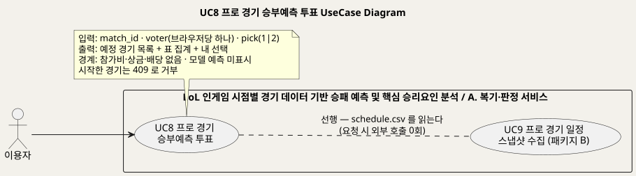
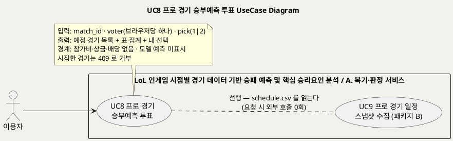
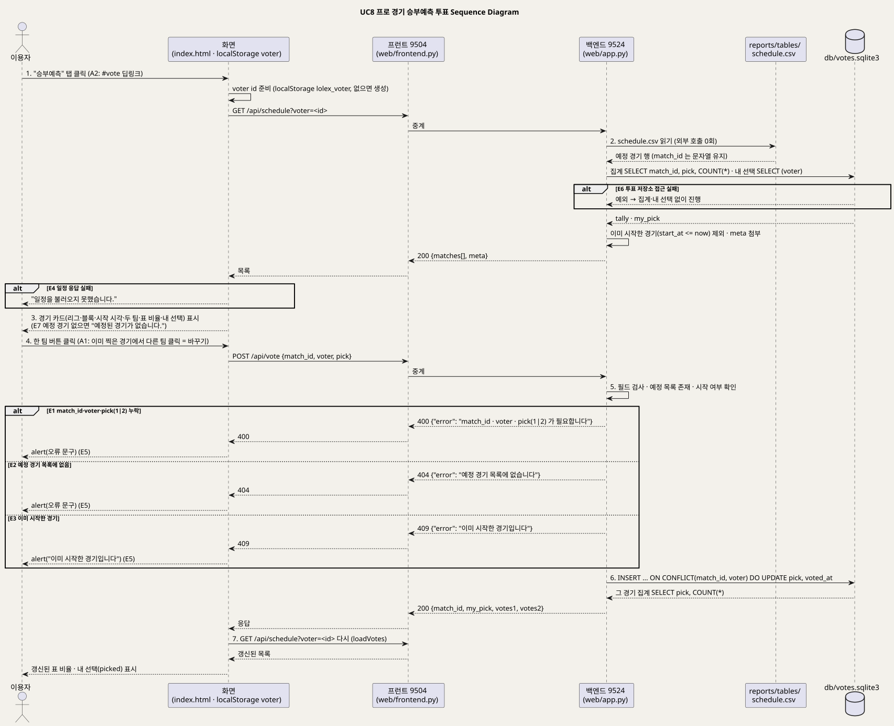
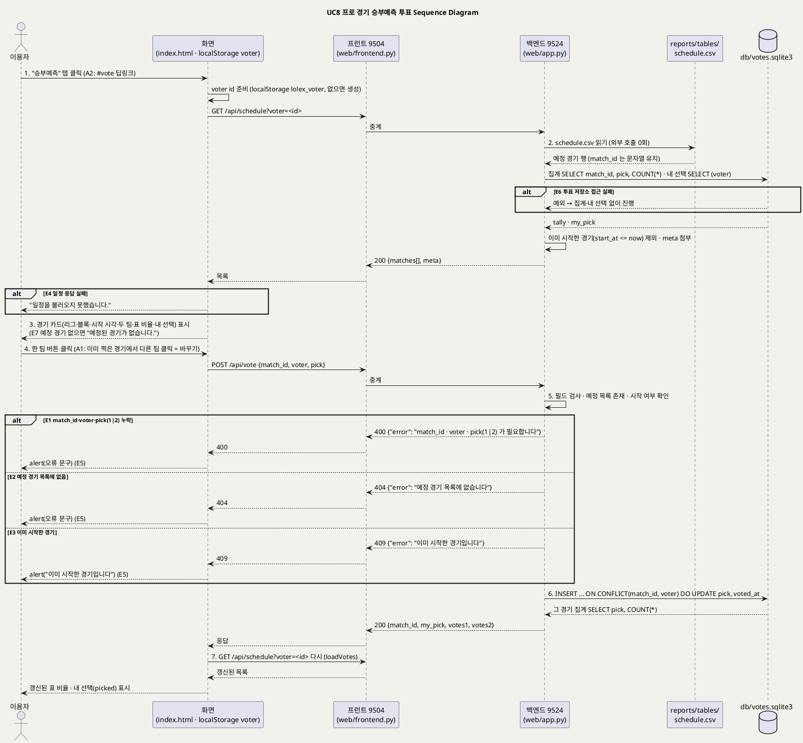

<!-- ─────────────────────────────────────────────
  UC8 상세 명세 — 예정 프로 경기에 승부예측 표를 던지고 집계를 보는 흐름.
  왜 필요한가: 개요(UC_00)의 목록을 구현 가능한 수준(사전·사후조건·흐름·예외·업무규칙·시퀀스)으로 내린다.
  주로 보는 사람: 팀원(구현·검수) · Claude(검수)
  ───────────────────────────────────────────── -->

# UseCase 명세 #8 프로 경기 승부예측 투표 (A. 복기·판정 서비스)
**LoL 인게임 시점별 경기 데이터 기반 승패 예측 및 핵심 승리요인 분석 · UC8 · UML 2.5.1 표준 (UseCase Diagram + UseCase 기술 + Sequence Diagram)**

---

> **문서 식별**: `docs/usecases/UC_08_승부예측투표.md`
> **작성일**: 2026-09-07 · **표준**: UML 2.5.1 (OMG)
> **원천(SoT)**: `docs/serving.md` §5 `/api/schedule`·`/api/vote` · "승부예측 투표의 경계" · `web/app.py` `_vote_db`·`api_schedule`·`api_vote`·`_csv`·`TEXT_COLUMNS` · `web/frontend.py` `proxy` · `web/templates/index.html` "승부예측" 탭·`VOTER`·`loadVotes`·`voteCard`·`castVote` · `src/collect_schedule.py` 머리말·열 정의 · `reports/tables/schedule.csv`·`schedule_meta.json` · `db/votes.sqlite3` · `model_card.md` 사용 금지 상황 6 · `docs/riot-api-application.md` "WHAT WE DO NOT DO"
> **개요 문서**: [UC_00_개요_LoL승패예측및핵심승리요인분석.md](UC_00_개요_LoL승패예측및핵심승리요인분석.md) §3 UC8 행
> **다이어그램**: 모든 PlantUML 소스는 로컬 Kroki 에서 렌더 검증 완료(HTTP 200). 렌더 결과는 `diagrams/*.svg` 로 함께 두어 로그인 없이 보인다. 뷰어 링크는 사내 서버라 SSO 로그인이 필요하다.

---

## 목차

1. [범위·개요](#1-범위개요)
2. [UseCase Diagram](#2-usecase-diagram)
3. [Actor 카탈로그](#3-actor-카탈로그)
4. [UseCase 목록 (원천 매핑)](#4-usecase-목록-원천-매핑)
5. [UseCase 기술 + Sequence Diagram](#5-usecase-기술--sequence-diagram)
6. [업무규칙(Business Rules) 종합](#6-업무규칙business-rules-종합)
7. [UML 표준 준수 노트](#7-uml-표준-준수-노트)

---

## 1. 범위·개요

이 유스케이스는 이용자가 **아직 시작하지 않은 프로 경기** 목록을 보고 어느 팀이 이길지 한 표를 던지며, 다른 이용자들의 표가 어떻게 갈리는지
비율로 확인하는 흐름이다. 화면의 "승부예측" 탭에서 경기 카드의 팀 버튼을 누르면 표가 저장되고, 같은 경기에서 다른 팀을 다시 누르면 바꾼 것으로 본다.
(근거: `index.html` "승부예측 — 누가 이길 것 같나요", `web/app.py` `api_vote` "한 경기에 한 번. 같은 사람이 다시 누르면 바꾼 것으로 본다")

**돈이 오가지 않는 참여형 예측**이다. 참가비도 상금도 없고 배당을 만들지 않으므로 `model_card.md` 금지 6(베팅·배당 산출)에 해당하지 않는다.
**모델은 이 투표에 개입하지 않는다.** 13개 피처가 전부 10분 시점 인게임 지표라 경기 시작 전에는 입력 자체가 없어, 화면에는 모델 예측을 표시하지 않고 사용자들의 표만 보여준다.
(근거: `docs/serving.md` "승부예측 투표의 경계")

일정 출처는 Riot 공식 개발자 API 가 아니라 비공식 lolesports 경로다. 그래서 서비스는 그 API 를 직접 부르지 않고 `src/collect_schedule.py` 가 굳힌 CSV 스냅샷만 읽는다.
요청 시 외부 호출은 0회이며, 수집은 별도 유스케이스(UC9)다. (근거: `docs/serving.md` §5 `/api/schedule`, `src/collect_schedule.py` 머리말)

| 항목 | 값 |
|---|---|
| 대상 시스템 | LoL 인게임 시점별 경기 데이터 기반 승패 예측 및 핵심 승리요인 분석 — 패키지 A. 복기·판정 서비스 |
| 상위 프로세스 | 부가 참여 기능. 서비스의 뿌리(10분 시점 판정)에서 파생되지 않으며 모델을 쓰지 않는다 (`docs/serving.md` "승부예측 투표의 경계") |
| 원천 근거 | `docs/serving.md` §5·"승부예측 투표의 경계" · `web/app.py` `api_schedule`·`api_vote`·`_vote_db` · `index.html` `loadVotes`·`voteCard`·`castVote`·`VOTER` · `src/collect_schedule.py` |
| 핵심 UseCase | 1개 (UC8). 선행 UC 1개 (UC9 프로 경기 일정 스냅샷 수집 — 패키지 B) |
| 주요 액터 | 이용자(주). 보조액터 없음 |

---

## 2. UseCase Diagram

PlantUML 소스 보기

소스를 직접 렌더하려면 **[「UC8 UseCase Diagram」 PlantUML 뷰어로 열기](https://plantuml.sumzip.com/plantuml/svg/eNptU0tPGlEU3t9fcUI3ECPFtgtx0VhpXbl1Z2LGYYAJMGNmLnbRNqEyNlQwQgItJQzBBOsjNp2iwpjohp_SJffMf-i5FJu-dndyv_O9zp1lmysWL-RzUFBji5sFW1MVW2N2Vje2FUvJw5aiZtOWWTCSCTNnWvBg9fHqwouV3xB2RkmaL3UjDSklR7M5LcWBm2Dp6QyHpG5pKtdNg3Gd5zRYTyxC0HDEUQcmg7uJ7wHu34hhEVtl9I8gKF8E9Q6s21qCfMBzXUmTBmOKykk8hO4Vts-wWwuBYkuUxZjkV4w0cYfWzDVA158Mqth1ACsd7NXEpXOvJA48IggcD-hLeC0pHVRPYaYtvEMImtdYuZh6-nyB7QaxgRg66LjwEJ5FQVxe0-x4FFRr2GsCOh1x4-B-PwSvGMCsPgj9k3LD-E_MnyESi39Oxv_ux70lKUnQF6U9LI0Ayy08qUOYvAe7fTwpwkpkxhVnbxiTvcD8_NMpt7QSjcorWCK_veDDe_hebICtZrRkIadFVXsHxPEt6dyJ_Yao9DeMsEw--CIbBPzkk28IWj4OOxAL2tUIM0yuwZbJuZkHMzWLgN090TtegrzC1cymnoTxCHYIaIWFXxUUou1hrygqN1RyS-y2IhKwravZ8MLrRxFJMOxMCWRH1O390s7PxJELcyDfBcWe0D7nQOxeTcOUXBqUyEuHBj1_4hVpIeMRlt5O_PJ4JDxPKuLHd-hWpaA4PxUH_q-Vf_WJlmJKeXou3XrQvC-eyoAnsThMV_HNoxKYZiRBZmfLdKKfhv0AyKCixQ==)** (사내 서버, SSO 로그인 필요) 또는 [로컬 Kroki 로 열기](http://192.168.0.91:8889/plantuml/svg/eNptU0tPGlEU3t9fcUI3ECPFtgtx0VhpXbl1Z2LGYYAJMGNmLnbRNqEyNlQwQgItJQzBBOsjNp2iwpjohp_SJffMf-i5FJu-dndyv_O9zp1lmysWL-RzUFBji5sFW1MVW2N2Vje2FUvJw5aiZtOWWTCSCTNnWvBg9fHqwouV3xB2RkmaL3UjDSklR7M5LcWBm2Dp6QyHpG5pKtdNg3Gd5zRYTyxC0HDEUQcmg7uJ7wHu34hhEVtl9I8gKF8E9Q6s21qCfMBzXUmTBmOKykk8hO4Vts-wWwuBYkuUxZjkV4w0cYfWzDVA158Mqth1ACsd7NXEpXOvJA48IggcD-hLeC0pHVRPYaYtvEMImtdYuZh6-nyB7QaxgRg66LjwEJ5FQVxe0-x4FFRr2GsCOh1x4-B-PwSvGMCsPgj9k3LD-E_MnyESi39Oxv_ux70lKUnQF6U9LI0Ayy08qUOYvAe7fTwpwkpkxhVnbxiTvcD8_NMpt7QSjcorWCK_veDDe_hebICtZrRkIadFVXsHxPEt6dyJ_Yao9DeMsEw--CIbBPzkk28IWj4OOxAL2tUIM0yuwZbJuZkHMzWLgN090TtegrzC1cymnoTxCHYIaIWFXxUUou1hrygqN1RyS-y2IhKwravZ8MLrRxFJMOxMCWRH1O390s7PxJELcyDfBcWe0D7nQOxeTcOUXBqUyEuHBj1_4hVpIeMRlt5O_PJ4JDxPKuLHd-hWpaA4PxUH_q-Vf_WJlmJKeXou3XrQvC-eyoAnsThMV_HNoxKYZiRBZmfLdKKfhv0AyKCixQ==) (내부망 전용). 위 그림 파일은 로그인 없이 보인다.

#### 다이어그램 쉽게 읽기 (유저 관점)

1. **누가 쓰나** — 왼쪽의 "이용자" 한 사람뿐이다. 이 사이트는 회원 가입이 없어서, 인터넷 창 하나를 한 사람으로 센다.
2. **무슨 순서로** — "승부예측" 탭을 열면 곧 열릴 경기 목록과 지금까지의 표 비율이 보인다. 팀 버튼을 누르면 표가 저장되고 비율이 새로 그려진다.
3. **«include» = 항상 함께** — 이 그림에는 없다. 투표는 코칭이나 승패 짐작 같은 다른 기능을 같이 부르지 않는다.
4. **«extend» = 특별한 때만** — 이 그림에는 없다. 대신 자료 모으기(UC9)로 가는 점선이 하나 있는데, 이것은 "먼저 해 두어야 하는 일"이라는 뜻이다. 투표 화면이 읽는 경기 일정 파일은 UC9 가 미리 받아 저장해 둔 것이고, 투표할 때는 바깥 어디에도 물어보지 않는다.
5. **속이 빈 세모 화살표** — 이 그림에는 없다. 전체 지도(개요 문서)에 있는 "이용자" 묶음은 이 기능에 영향이 없어 생략했다.
6. **프로그램 안의 것** — 경기 일정 파일과 표를 저장하는 작은 장부는 프로그램 안에 있는 것이라 바깥 상대(사람 모양)로 그리지 않는다.

#### 표준 기호 범례

| 기호 | 의미 | UML 2.5.1 |
|---|---|---|
| 사람 모양 (actor) | 프로그램 바깥에서 프로그램을 쓰거나 프로그램이 부르는 상대 | Actor |
| 타원 (usecase) | 그 상대가 프로그램으로 이루려는 일 하나 | UseCase |
| 큰 사각형 (rectangle) | 프로그램의 울타리. 안은 우리가 만든 것, 밖은 남의 것 | Subject (System Boundary) |
| 실선 화살표 | 이 사람이 이 일을 한다 | Association |
| 점선 (글자 "선행") | 다른 기능이 미리 만들어 둔 파일이 있어야 한다는 뜻. 항상 함께(«include»)도, 특별한 때만(«extend»)도 아니다 | Dependency |

---

## 3. Actor 카탈로그

| 액터 | 구분 | 설명 | 근거 |
|---|---|---|---|
| 이용자 | Primary | 예정 프로 경기의 승부를 예측해 표를 던지고 남들의 표를 보는 사람. 로그인이 없어 브라우저마다 하나씩 만든 `voter` 식별자로 구분된다 | `index.html` `VOTER` "브라우저마다 하나씩. 로그인이 없으므로 중복 투표를 이 정도로만 막는다" |
| (내부) `reports/tables/schedule.csv` · `schedule_meta.json` | 시스템 자산 | UC9 가 굳힌 예정 경기 스냅샷과 갱신 시각·설명. 서비스는 이 파일만 읽는다 | `docs/serving.md` §5, `src/collect_schedule.py` |
| (내부) `db/votes.sqlite3` | 시스템 저장소 | 표 저장. `votes(match_id, voter, pick, voted_at)` 에 `PRIMARY KEY (match_id, voter)`. 없으면 기동 중 자동 생성 | `web/app.py` `_vote_db` |
| (환경) 팀 로고 이미지 | 환경 요소 | CSV 의 `team1_img`·`team2_img` 주소를 브라우저가 직접 불러온다. 서비스 서버는 부르지 않는다 | `index.html` `voteCard`, `src/collect_schedule.py` 열 정의 |

이 UC 에는 Secondary Actor(외부 시스템)가 없다. 일정 수집 시의 lolesports 일정 API 는 UC9 의 보조액터다. (근거: `docs/serving.md` §5 "CSV 스냅샷이라 외부 호출 0회")

---

## 4. UseCase 목록 (원천 매핑)

| UC ID | 유스케이스명 | 주액터 | 관계 | 원천 근거 |
|:--:|---|---|---|---|
| UC8 | 프로 경기 승부예측 투표 | 이용자 | 기준 UC | `docs/serving.md` §5 `/api/schedule`·`/api/vote` · `web/app.py` `api_schedule`·`api_vote` · `index.html` 탭 "승부예측" |
| UC9 | 프로 경기 일정 스냅샷 수집 | 서비스 담당(배포·운영) | UC8 의 선행 (파일 의존) | `src/collect_schedule.py` — 상세는 `UC_09_경기일정스냅샷수집.md` |

---

## 5. UseCase 기술 + Sequence Diagram

### 5.1 UC8 프로 경기 승부예측 투표

> **쉽게 말하면** — "승부예측" 탭에 곧 열릴 프로 선수 경기들이 나온다. 이길 것 같은 팀을 누르면 손을 드는 것처럼 한 표가 들어간다.
> 다른 사람들은 어느 팀에 더 많이 손을 들었는지 막대로 보인다. 마음이 바뀌면 다른 팀을 다시 누르면 되고, 경기가 시작되면 더는 고를 수 없다.
> 돈은 전혀 오가지 않는다. 우리 프로그램이 짐작한 승률도 여기에는 나오지 않는다. 사람들의 표만 보인다.

#### 유스케이스 기술

| 속성 | 내용 |
|---|---|
| **ID** | UC8 — 원천 식별자: `docs/serving.md` §5 `/api/schedule`·`/api/vote` · `web/app.py` `api_schedule`·`api_vote` · `index.html` `loadVotes`·`castVote` |
| **유스케이스명** | 프로 경기 승부예측 투표 |
| **액터** | 주액터: 이용자. 보조액터: 없음 (요청 시 외부 호출 0회 — `docs/serving.md` §5) |
| **사전조건** | (1) 백엔드(9524)·프런트(9504)가 기동돼 있고 프런트가 `/api/*` 를 백엔드로 중계한다 (`docs/deploy.md`). (2) `reports/tables/schedule.csv` 가 있다 — UC9 수집기가 미리 굳혀 둔 파일이며 없으면 목록이 빈다 (`web/app.py` `_csv` 는 파일이 없으면 빈 목록). (3) 브라우저에 `localStorage` 가 있으면 `voter` 식별자가 유지된다. 막혀 있으면 요청마다 새 식별자를 만든다 (`index.html` `VOTER` catch). (4) 로그인·계정은 없다 (`index.html` `VOTER` 주석) |
| **사후조건** | (1) 정상 투표 시 `votes.sqlite3` 에 `(match_id, voter)` 한 행이 있고 `pick` 은 마지막 선택이다 (`ON CONFLICT ... DO UPDATE`). (2) 응답에 그 경기의 `votes1`·`votes2` 집계와 `my_pick` 이 담긴다. (3) 화면은 목록을 다시 불러와 갱신된 비율과 내 선택(`picked`)을 보여준다. (4) 이미 시작한 경기는 저장되지 않았다(409) |
| **기본흐름** | ↓ 별도 기본흐름표 |
| **대체흐름** | A1. **표 바꾸기** — 이미 찍은 경기에서 다른 팀 버튼을 누른다. 4~7단계가 동일하며 6단계에서 새 행이 아니라 기존 행의 `pick`·`voted_at` 이 갱신된다 (`web/app.py` `api_vote` "다시 누르면 바꾼 것으로 본다"). A2. **딥링크 진입** — 주소 `#vote` 로 바로 "승부예측" 탭이 열린다 (근거: 저장소 커밋 "탭 딥링크(#champ·#rank·#vote)"; `index.html` 탭 전환 `which === "vote"`). 이후 1단계부터 동일. A3. **집계 없이 열람만** — 표를 던지지 않고 목록과 비율만 본다. 1~3단계로 끝난다. A4. **`voter` 없이 API 호출** — `GET /api/schedule` 에 `voter` 를 주지 않으면 `my_pick` 이 모두 `null` 인 목록만 온다 (`web/app.py` `api_schedule` `if voter:`) |
| **예외흐름** | E1. **필수 필드 누락·잘못된 값** — 5단계에서 `match_id`·`voter` 가 비었거나 `pick` 이 1·2 가 아니면 HTTP 400 "match_id · voter · pick(1|2) 가 필요합니다" (`web/app.py` `api_vote`). E2. **예정 경기 목록에 없음** — 5단계에서 `match_id` 가 `schedule.csv` 에 없으면 HTTP 404 "예정 경기 목록에 없습니다" (`web/app.py` `api_vote`). E3. **이미 시작한 경기** — 5단계에서 `start_at` 이 현재 시각 이하이면 HTTP 409 "이미 시작한 경기입니다". 결과를 보고 찍는 것을 막기 위해서다 (`web/app.py` `api_vote`, `docs/serving.md` §5 "시작한 경기는 409"). E4. **일정 응답 실패** — 1~2단계에서 응답을 못 받거나 JSON 이 아니면 화면에 "일정을 불러오지 못했습니다." (`index.html` `loadVotes` catch). E5. **투표 요청 실패** — 4~6단계에서 응답이 `ok` 가 아니면 서버의 `error` 문구를, 네트워크 오류면 "투표하지 못했습니다."를 alert 로 띄우고 목록은 그대로 둔다 (`index.html` `castVote`). E6. **투표 저장소 접근 실패(목록 조회 시)** — 2단계에서 SQLite 를 열지 못하면 집계·내 선택 없이 일정만 돌려준다. "투표 저장이 안 되더라도 일정은 보여준다" (`web/app.py` `api_schedule` try/except). 투표 저장(6단계) 시의 SQLite 실패는 잡지 않으므로 HTTP 500 — 자료 없음 — 확인 필요 (원천에 명시적 처리 없음). E7. **예정 경기 없음** — 2단계에서 CSV 가 없거나 모든 경기가 이미 시작했으면 목록이 비고 화면에 "예정된 경기가 없습니다." CSV 가 낡아도 죽은 경기가 쌓이지 않도록 서버가 걸러낸다 (`web/app.py` `api_schedule` 주석, `index.html` `loadVotes`) |
| **포함/확장** | «include» 없음. «extend» 없음. 선행: UC9 프로 경기 일정 스냅샷 수집 — `schedule.csv` 를 만든다 (파일 의존, UML 관계로는 Dependency) |
| **우선순위** | Medium — 뿌리(10분 시점 판정)에서 파생되지 않는 참여형 부가 기능이며 모델을 쓰지 않는다. 개요 문서의 우선순위 기준(부가 탭 = Medium)을 따른다 (`docs/serving.md` "승부예측 투표의 경계", `UC_00_개요_LoL승패예측및핵심승리요인분석.md` §3 우선순위 근거) |
| **사용빈도** | 자료 없음 — 확인 필요. [추론] 브라우저당 경기마다 최대 1행(바꾸면 갱신)이므로 저장 행 수는 "브라우저 수 × 예정 경기 수" 를 넘지 않는다. 예정 경기 수는 `schedule_meta.json` 의 `경기수` 로 확인한다 |
| **업무규칙** | BR-VOT-01 ~ BR-VOT-09 (§6) |
| **특별 요구사항** | (1) **금전 요소 금지** — 참가비·상금·배당 없음. 화면 안내 문구로 명시한다 (`index.html` "상금도 참가비도 없는 참여형 예측입니다 — 이 서비스는 배당을 만들지 않습니다", `docs/riot-api-application.md` "WHAT WE DO NOT DO"). (2) **모델 미표시** — 투표 화면에 모델 승률을 넣지 않는다 (`docs/serving.md`). (3) **외부 호출 0회** — 요청 처리 중 lolesports·Riot 를 부르지 않는다 (`docs/serving.md` §5). (4) **식별자 처리** — `match_id` 는 18자리 문자열이라 숫자로 바꾸지 않는다(`TEXT_COLUMNS`); `match_id`·`voter` 는 64자로 자른다 (`web/app.py`). (5) **저장소 회복력** — `votes` 표는 `CREATE TABLE IF NOT EXISTS` 로 기동 중 자동 생성, 연결 `timeout=5` (`web/app.py` `_vote_db`). (6) **개인정보** — 계정·이름을 받지 않고 무작위 `voter` 문자열만 저장한다 (`index.html` `VOTER`, `docs/riot-api-application.md` "DATA HANDLING"). (7) 성능 목표·접근성·동시성 한계: 자료 없음 — 확인 필요 |
| **비고** | 원천 추적성 — `docs/serving.md` §5 표의 `/api/schedule`·`/api/vote` 행, "승부예측 투표의 경계" 절 · `web/app.py` `TEXT_COLUMNS`(56~61행)·`_csv`(63~91행)·`VOTE_DB`·`_vote_db`(355~369행)·`api_schedule`(372~412행)·`api_vote`(415~447행) · `web/templates/index.html` "승부예측" 탭 본문(439~445행)·`VOTER`(1133~1142행)·`loadVotes`·`voteCard`·`castVote`(1153~1200행)·탭 전환(1449행) · `src/collect_schedule.py` 머리말·열 정의(59~83행) · `reports/tables/schedule.csv` 열 · `reports/tables/schedule_meta.json`(`경기수`·`갱신`·`설명`) · `db/votes.sqlite3` · `model_card.md` 사용 금지 상황 6 · `docs/riot-api-application.md` "WHAT WE DO NOT DO". 화면은 표가 0이면 비율을 50:50 으로 그리고 "첫 표를 던져보세요"를 보인다 (`voteCard`) |

#### 기본흐름 (Basic Flow)

| 단계 | 액터 행위 | 시스템 행위 |
|:--:|---|---|
| 1 | 이용자가 상단 탭 "승부예측"을 누른다 | 화면이 탭을 처음 열 때만 목록을 불러온다(`voteLoaded`). `localStorage` 의 `lolex_voter` 를 읽고 없으면 무작위 식별자를 만들어 저장한 뒤 `GET /api/schedule?voter=<식별자>` 를 보낸다. 프런트(9504)는 백엔드(9524)로 중계만 한다 |
| 2 | — (기다린다) | 백엔드 `api_schedule` 이 `schedule.csv` 를 읽고(외부 호출 0회, `match_id` 는 문자열 유지), `votes.sqlite3` 에서 경기·선택별 표 수와 이 `voter` 의 선택을 조회한다(E6). `start_at` 이 현재 시각 이하인 경기는 제외하고(E7), 경기마다 `votes1`·`votes2`·`my_pick` 을 붙여 `schedule_meta.json` 과 함께 응답한다 |
| 3 | 예정 경기 카드(리그·블록·시작 시각·두 팀·현재 표 비율·참여 인원)를 훑어본다 | 화면이 `meta` 의 설명·경기 수·갱신 시각을 머리글에, 경기마다 카드를 그린다. 내 선택이 있으면 그 팀 버튼을 `picked` 로 강조하고, 표가 없으면 50:50 막대와 "첫 표를 던져보세요"를 보인다(E4) |
| 4 | 이길 것 같은 팀 버튼을 누른다 (A1: 이미 찍은 경기에서 다른 팀을 누르면 바꾸기) | 화면이 `POST /api/vote` 에 `{match_id, voter, pick}` 을 보낸다. 프런트가 백엔드로 중계한다 |
| 5 | — | 백엔드 `api_vote` 가 `match_id`·`voter` 를 64자로 자르고 `pick` 이 1 또는 2 인지 확인한다(E1). `schedule.csv` 에서 그 경기를 찾고(E2), `start_at` 이 지났으면 거부한다(E3) |
| 6 | — | `votes` 에 `(match_id, voter, pick, voted_at)` 을 넣되 같은 `(match_id, voter)` 가 있으면 `pick`·`voted_at` 을 갱신한다. 그 경기의 표 수를 다시 세어 `{match_id, my_pick, votes1, votes2}` 로 응답한다(E5) |
| 7 | 갱신된 표 비율과 내 선택 표시를 확인한다 | 화면이 `loadVotes` 로 목록을 다시 불러와(1~3단계 반복) 모든 카드의 비율·참여 인원·내 선택을 갱신한다 |

#### Sequence Diagram

PlantUML 소스 보기

소스를 직접 렌더하려면 **[「UC8 Sequence Diagram」 PlantUML 뷰어로 열기](https://plantuml.sumzip.com/plantuml/svg/eNqVVl1PG1cQfd9fMXJediuygDFJQCFNAFMhRRDVJi9NhRbvBiwW29ldQlCKZIKLXEwlaE34kE1AggCVozrU4EUlefBP6aPv3f_QuftheyGk6pPtu3dmzpw5Z9YPdUPSjNkZFWZjHffGdeXFrJKIKZw-HU-kJE2agQkpNj2pJWcT8kBSTWpwa6hrqDPc33JDn5Lk5Fw8MQnPJVVXOCNuqAqMDdwDK58h-wWon36qm2WgKxfkPE23stTcBytbstYLEHELwmBcmsRkHCfFDKwSoMUK3Tmhu2sBkHQY0xWNw2pGPBZPSQkDAtZ2npxUniX4eEJWXolTBrZQq4KajElqBDNIkwq8TBqKJjgJhq-EI7J3ZWvFhJ7ujhCmmVMm2p9ryYShJGQxNe9EDYX9UaT8kW7mye8FjAp6UVIq1QjovxKgKamkZujthjShKnr7s4Qem1LkWVURY_pLO2Ig8pSTJXwu6QoE5Il2BloX9Rdq3FC67CuD_RzHCIDbD7AP6IVOEflpITMA1tIHsBYr5P0H4B8Fe-EWywIkf0iOFq3FksBhnBdtswJxGehBmlxkgPdxpiZV5dW4facN6OYyLVwiz0CXijTz0cszFMY834WjgM3H272evrWj-u7H5Qcc3sB7_ewePViv_5Xh-u0TbBePgiK0EgG0aAuEp9smNgXWlknPC9Bh7awKHIu43ciF_e5teIKy3v4C_IxkxKbGsR2ykgdSMlEydBMBF_boUVpwyw72s-AjBgQi4cfhgSh4cW2Qisem22BgdGwkyn8jMBWRN5ggs2ctFb3bvKMlTlINCN_x1Ev30nT3kC6v4rf1evUSaO7AWj3mgBX0gd424Z_l31wItWpLAcZxEX8dZbAdDtXHtcYakqrOM0gz8-MMp9uPk7dYIX-aWLNAd9etDc9nvG3pccmA-32QSM4JCK7AALAsiiEBPT1Glu1M3iyDHR3w2mZE0X_4sc2-t2AP0VMN-eOE7Bed_kNY-pLNgRbXSe6s2TVTBwtgYu1lHma3aDED5DxL3pXo1gHOBFP9bb3N0pUzksuS3IEYsLv2x3aJja1xUUHD8eR9qV41kTkzjzhqVadr1ny9vIjH62tgraZrVTYWVDUtHLeyLACe4120bPjuFRU1RR5wHpA1j8p6OW0_bkIV_E4MicCIx8pATjPWymXThZ3NAZV_pcW0m5JurtEMQswdkEPTDnQj-oCU8_XPJt7x2ezJaMT1me3p103duiZlsli40XD2STeDmWF7q36apm9KTAouCc5cge5X6K5z7hK7WbKtuI3zM52xdzY8U6vatWtVVpvv_CkoAMlmSPETaqBVViEmq4CiaUktgHpoWBXLOFsIvzRTMLYRJt3JWxsnDuGBBczYKkPMeE1nkqpoBo_iIodbbAPUz0oC8OFugVPwdQTh4JWBOy3jIBzvrV4DHWoF_bVYTxdfgBn63zC7bjL0NXw9PnxfDqK7P9-IrecGbP-dywOMfm1ZrHdEGB6JhL-PgiiKMDqCu3Rk6PHwQJS_IlYBBkdh7Mngo2jY3brsWMZd5Vt6aPSGOX0727-pb9hgdjl3XToF9E73M-jfac76ajXbXfGrrzVmWySHvTIl-SnLKPgS1vH_QW6P7Q93XfpZbj5ubin_64ZnoBXZW1fcQ2Qa_5xx_wLOmCze)** (사내 서버, SSO 로그인 필요) 또는 [로컬 Kroki 로 열기](http://192.168.0.91:8889/plantuml/svg/eNqVVl1PG1cQfd9fMXJediuygDFJQCFNAFMhRRDVJi9NhRbvBiwW29ldQlCKZIKLXEwlaE34kE1AggCVozrU4EUlefBP6aPv3f_QuftheyGk6pPtu3dmzpw5Z9YPdUPSjNkZFWZjHffGdeXFrJKIKZw-HU-kJE2agQkpNj2pJWcT8kBSTWpwa6hrqDPc33JDn5Lk5Fw8MQnPJVVXOCNuqAqMDdwDK58h-wWon36qm2WgKxfkPE23stTcBytbstYLEHELwmBcmsRkHCfFDKwSoMUK3Tmhu2sBkHQY0xWNw2pGPBZPSQkDAtZ2npxUniX4eEJWXolTBrZQq4KajElqBDNIkwq8TBqKJjgJhq-EI7J3ZWvFhJ7ujhCmmVMm2p9ryYShJGQxNe9EDYX9UaT8kW7mye8FjAp6UVIq1QjovxKgKamkZujthjShKnr7s4Qem1LkWVURY_pLO2Ig8pSTJXwu6QoE5Il2BloX9Rdq3FC67CuD_RzHCIDbD7AP6IVOEflpITMA1tIHsBYr5P0H4B8Fe-EWywIkf0iOFq3FksBhnBdtswJxGehBmlxkgPdxpiZV5dW4facN6OYyLVwiz0CXijTz0cszFMY834WjgM3H272evrWj-u7H5Qcc3sB7_ewePViv_5Xh-u0TbBePgiK0EgG0aAuEp9smNgXWlknPC9Bh7awKHIu43ciF_e5teIKy3v4C_IxkxKbGsR2ykgdSMlEydBMBF_boUVpwyw72s-AjBgQi4cfhgSh4cW2Qisem22BgdGwkyn8jMBWRN5ggs2ctFb3bvKMlTlINCN_x1Ev30nT3kC6v4rf1evUSaO7AWj3mgBX0gd424Z_l31wItWpLAcZxEX8dZbAdDtXHtcYakqrOM0gz8-MMp9uPk7dYIX-aWLNAd9etDc9nvG3pccmA-32QSM4JCK7AALAsiiEBPT1Glu1M3iyDHR3w2mZE0X_4sc2-t2AP0VMN-eOE7Bed_kNY-pLNgRbXSe6s2TVTBwtgYu1lHma3aDED5DxL3pXo1gHOBFP9bb3N0pUzksuS3IEYsLv2x3aJja1xUUHD8eR9qV41kTkzjzhqVadr1ny9vIjH62tgraZrVTYWVDUtHLeyLACe4120bPjuFRU1RR5wHpA1j8p6OW0_bkIV_E4MicCIx8pATjPWymXThZ3NAZV_pcW0m5JurtEMQswdkEPTDnQj-oCU8_XPJt7x2ezJaMT1me3p103duiZlsli40XD2STeDmWF7q36apm9KTAouCc5cge5X6K5z7hK7WbKtuI3zM52xdzY8U6vatWtVVpvv_CkoAMlmSPETaqBVViEmq4CiaUktgHpoWBXLOFsIvzRTMLYRJt3JWxsnDuGBBczYKkPMeE1nkqpoBo_iIodbbAPUz0oC8OFugVPwdQTh4JWBOy3jIBzvrV4DHWoF_bVYTxdfgBn63zC7bjL0NXw9PnxfDqK7P9-IrecGbP-dywOMfm1ZrHdEGB6JhL-PgiiKMDqCu3Rk6PHwQJS_IlYBBkdh7Mngo2jY3brsWMZd5Vt6aPSGOX0727-pb9hgdjl3XToF9E73M-jfac76ajXbXfGrrzVmWySHvTIl-SnLKPgS1vH_QW6P7Q93XfpZbj5ubin_64ZnoBXZW1fcQ2Qa_5xx_wLOmCze) (내부망 전용). 위 그림 파일은 로그인 없이 보인다.

기본흐름 7단계와 시퀀스의 번호 메시지가 1:1 로 대응한다. 대체흐름 A1(바꾸기)은 4~7단계와 같은 경로에서 6단계의 갱신 분기로 처리되고, A3(열람만)은 3단계에서 끝난다.

---

## 6. 업무규칙(Business Rules) 종합

| BR ID | 규칙 | 적용 UC | 근거 |
|---|---|---|---|
| BR-VOT-01 | 돈이 오가지 않는 참여형 예측이다. 참가비·상금·배당을 만들지 않으며, 그래서 `model_card.md` 금지 6(베팅·배당 산출)에 해당하지 않는다 | UC8 | `docs/serving.md` "승부예측 투표의 경계", `model_card.md` 사용 금지 상황 6, `index.html` 안내 문구, `docs/riot-api-application.md` "WHAT WE DO NOT DO" |
| BR-VOT-02 | 모델은 투표에 개입하지 않는다. 경기 시작 전에는 10분 시점 입력이 존재하지 않으므로 화면에 모델 예측을 표시하지 않고 사용자들의 표만 보여준다 | UC8 | `docs/serving.md` "승부예측 투표의 경계" |
| BR-VOT-03 | 이미 시작한 경기(`start_at` <= 현재 UTC)에는 표를 받지 않는다(409). 목록에서도 제외해 죽은 경기가 쌓이지 않게 한다 | UC8 | `web/app.py` `api_vote`·`api_schedule`, `docs/serving.md` §5, `index.html` "경기 시작 전까지만 투표할 수 있습니다" |
| BR-VOT-04 | 한 경기에 한 표. 같은 `voter` 가 다시 누르면 새 표가 아니라 바꾼 것으로 본다 — `PRIMARY KEY (match_id, voter)` + `ON CONFLICT DO UPDATE` | UC8 | `web/app.py` `_vote_db`·`api_vote`, `index.html` "한 경기에 한 번이고, 다시 누르면 바꿉니다" |
| BR-VOT-05 | `voter` 는 브라우저마다 하나(`localStorage` `lolex_voter`). 로그인이 없으므로 중복 투표 방지는 이 수준까지다 | UC8 | `index.html` `VOTER` 주석 |
| BR-VOT-06 | 일정은 CSV 스냅샷만 읽는다. 요청 시 외부(lolesports·Riot) 호출은 0회이며, 비공식 출처가 막혀도 수집 스크립트만 바꾸면 서비스는 그대로 돈다 | UC8 (UC9 선행) | `docs/serving.md` §5·"승부예측 투표의 경계", `src/collect_schedule.py` 머리말 |
| BR-VOT-07 | `match_id`·`team1_code`·`team2_code`·`bo` 는 문자열로 유지한다. `match_id` 는 18자리라 숫자로 바꾸면 서버 비교가 어긋나고 브라우저의 안전 정수 한계를 넘는다 | UC8 | `web/app.py` `TEXT_COLUMNS` 주석 |
| BR-VOT-08 | `pick` 은 1 또는 2 만 허용하고, `match_id`·`voter` 는 64자로 자른다. 셋 중 하나라도 없으면 400 | UC8 | `web/app.py` `api_vote` |
| BR-VOT-09 | 투표 저장소를 열지 못해도 일정은 보여준다(집계·내 선택만 비움) | UC8 | `web/app.py` `api_schedule` "투표 저장이 안 되더라도 일정은 보여준다" |

---

## 7. UML 표준 준수 노트

| 항목 | 적용 |
|---|---|
| UseCase Diagram | Subject(시스템 경계)를 `rectangle` 로, 주액터를 경계 밖 왼쪽에 두었다. UC9 와는 포함·확장이 아닌 파일 의존이라 «include»/«extend» 를 쓰지 않고 레이블 있는 점선(Dependency)으로 표기했다 (UML 2.5.1 §18.1 UseCase 관계는 Include·Extend·Generalization 뿐이므로 그 밖의 관계는 일반 Dependency 로 둔다) |
| UseCase 기술 | 14속성 세로형 표. 사전·사후조건은 "참이어야 할 상태 / 보장되는 상태"로 적었고 대체(A)·예외(E) 흐름을 번호로 분리했다 |
| Sequence Diagram | 기본흐름 7단계와 메시지 1:1. 예외 E1·E2·E3 은 하나의 `alt` 에 `else` 로, E4·E6 은 별도 `alt` 로 표현했다. 재조회(7단계)는 1단계와 같은 메시지를 반복한다 (UML 2.5.1 §17.6 CombinedFragment) |
| 내부 구성요소 | `schedule.csv` 와 `votes.sqlite3` 는 액터가 아니므로 UseCase Diagram 에는 두지 않고 Sequence Diagram 의 participant·database lifeline 으로만 그렸다 |
| 추적성 | 모든 흐름·규칙에 원천(문서 절·파일·함수·행)을 붙였고, 원천에 없는 판단은 `[추론]`, 없는 자료는 `자료 없음 — 확인 필요` 로 남겼다 |

---

*표기 표준: UML 2.5.1 (OMG). 서식 정본: usecase 스킬 `references/format-spec.md`. 개요 문서: [UC_00_개요_LoL승패예측및핵심승리요인분석.md](UC_00_개요_LoL승패예측및핵심승리요인분석.md). 다음 문서: `UC_09_경기일정스냅샷수집.md`.*
