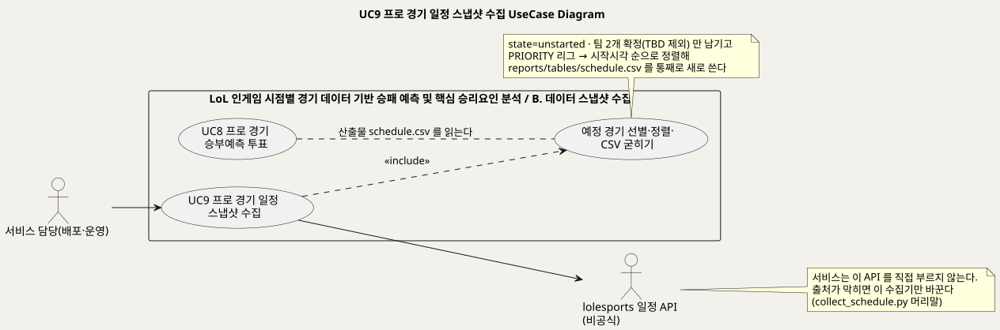
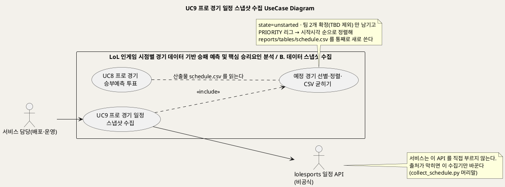
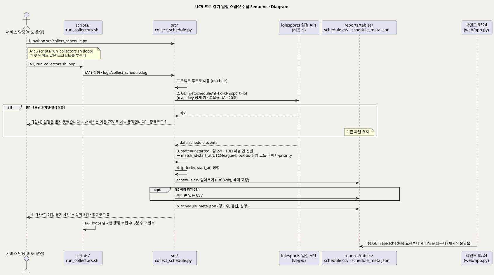
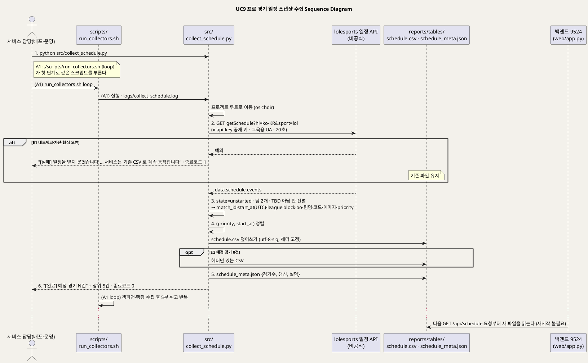

<!-- ─────────────────────────────────────────────
  UC9 상세 명세 — 비공식 lolesports 일정 API 에서 예정 프로 경기를 받아 CSV 스냅샷으로 굳히는 흐름.
  왜 필요한가: 개요(UC_00)의 목록을 구현 가능한 수준(사전·사후조건·흐름·예외·업무규칙·시퀀스)으로 내린다.
  주로 보는 사람: 팀원(구현·검수) · 서비스 담당(배포·운영) · Claude(검수)
  ───────────────────────────────────────────── -->

# UseCase 명세 #9 프로 경기 일정 스냅샷 수집 (B. 데이터 스냅샷 수집)
**LoL 인게임 시점별 경기 데이터 기반 승패 예측 및 핵심 승리요인 분석 · UC9 · UML 2.5.1 표준 (UseCase Diagram + UseCase 기술 + Sequence Diagram)**

---

> **문서 식별**: `docs/usecases/UC_09_경기일정스냅샷수집.md`
> **작성일**: 2026-09-07 · **표준**: UML 2.5.1 (OMG)
> **원천(SoT)**: `src/collect_schedule.py` 전문(머리말·`fetch`·`main`) · `scripts/run_collectors.sh` · `docs/serving.md` "승부예측 투표의 경계" 일정 출처 단락 · `web/app.py` `api_schedule`·`_csv`·`TEXT_COLUMNS` · `reports/tables/schedule_meta.json` · `docs/riot-api-application.md` "WHICH APIS WE USE"
> **개요 문서**: [UC_00_개요_LoL승패예측및핵심승리요인분석.md](UC_00_개요_LoL승패예측및핵심승리요인분석.md) §3 UC9 행 · §5.3 패키지 B
> **다이어그램**: 모든 PlantUML 소스는 로컬 Kroki 에서 렌더 검증 완료(HTTP 200). 렌더 결과는 `diagrams/*.svg` 로 함께 두어 로그인 없이 보인다. 뷰어 링크는 사내 서버라 SSO 로그인이 필요하다.

---

## 목차

1. [범위·개요](#1-범위개요)
2. [UseCase Diagram](#2-usecase-diagram)
3. [Actor 카탈로그](#3-actor-카탈로그)
4. [UseCase 목록 (원천 매핑)](#4-usecase-목록-원천-매핑)
5. [UseCase 기술 + Sequence Diagram](#5-usecase-기술--sequence-diagram)
6. [업무규칙(Business Rules) 종합](#6-업무규칙business-rules-종합)
7. [UML 표준 준수 노트](#7-uml-표준-준수-노트)

---

## 1. 범위·개요

이 유스케이스는 서비스 담당이 수집 스크립트를 돌려 **아직 시작하지 않은 프로 경기 일정**을 받아 `reports/tables/schedule.csv` 와 `schedule_meta.json` 으로 굳히는 흐름이다.
승부예측 투표(UC8)는 이 파일만 읽는다. (근거: `src/collect_schedule.py` 머리말 "승부예측 투표에 쓸 가까운 시일 내 경기", "산출물: reports/tables/schedule.csv")

출처와 한계를 먼저 밝힌다. Riot 공식 개발자 API 에는 e스포츠 일정 엔드포인트가 없다(승인받은 39개 메서드에도 없다). 여기서 쓰는 lolesports 일정 API 는 공식 문서에 없는 **비공식 경로**다.
그래서 **서비스는 이 API 를 직접 부르지 않는다.** 수집기가 CSV 로 굳히고 웹은 그 파일만 읽는다. 출처가 막히면 이 스크립트만 바꾸면 되고 서비스는 그대로 돈다.
(근거: `src/collect_schedule.py` 머리말, `docs/serving.md` "승부예측 투표의 경계" 마지막 단락)

주의: 개요 문서 §3 "포함·확장 판정" 은 세 수집기가 모두 "받은 것을 즉시 파일에 붙이고 이미 받은 id 를 건너뛰는" 이어받기(resumable) 방식이라고 적었지만,
일정 수집기는 그렇지 않다. 매 실행마다 전체 일정을 새로 받아 CSV 를 **통째로 덮어쓴다**(`open(OUT, "w")`). 이어받기가 필요 없는 이유는 호출이 한 번뿐이고 Riot 예산을 쓰지 않기 때문이다.
이 문서는 코드를 따르며, 개요 문서의 해당 표현은 3단계에서 고친다. (근거: `src/collect_schedule.py` `main` 파일 쓰기 부분, `scripts/run_collectors.sh` 주석 "두 수집기 모두 이어받기" — 챔피언·랭킹 둘만 가리킨다)

| 항목 | 값 |
|---|---|
| 대상 시스템 | LoL 인게임 시점별 경기 데이터 기반 승패 예측 및 핵심 승리요인 분석 — 패키지 B. 데이터 스냅샷 수집 |
| 상위 프로세스 | 수집기 한 바퀴(`run_collectors.sh run_once`)의 첫 단계: 일정 갱신 → 챔피언 표본 수집(UC10) → 랭킹 이름 수집(UC10) (`scripts/run_collectors.sh` `run_once`) |
| 원천 근거 | `src/collect_schedule.py` · `scripts/run_collectors.sh` · `docs/serving.md` "승부예측 투표의 경계" |
| 핵심 UseCase | 1개 (UC9) + 포함 하위행위 1개 (예정 경기 선별·정렬·CSV 굳히기) |
| 주요 액터 | 서비스 담당(배포·운영)(주) · lolesports 일정 API(보조) |

---

## 2. UseCase Diagram

PlantUML 소스 보기

소스를 직접 렌더하려면 **[「UC9 UseCase Diagram」 PlantUML 뷰어로 열기](https://plantuml.sumzip.com/plantuml/svg/eNp1lF1L22AUx-_zKQ7dTb2w7uVGhyvOqlCQKU4HA0FiGmswJiVJN8YYVJtJZzu0WwtVUomgq4NeBBv7AnUXfpRd5nnyHXaepHU62U1feM7_Of_f_5xkSjd4zchuy5AVHk-sZXVR4HWR07ckJcNr_Das88JWWlOzSiqhyqoGj-aezT2Znb5ToW_yKfW9pKRhg5dRK4sbBhgqaFJ604CUpImCIakKZ0iGLMJKYgL8iklOLfAur72uA7Tep3YV6P4ZyX-m-Q7QQo02yrCiiwn0AjMSn8Y-HMcLBhqIUNMiPRPLgRRdUuxFieP4B82bDj12aW1nJAK8DgsZneNYZ15JY9fIvDqPjbreZYmemECLFrUPScsceiBfHVp3fdMB_EecGrrp-aULoLUC7Z4CcQ7Ar17RYpMdkB9NelzB24C0TWrWYQymY3eu-JckAh85gEG0EPlfAqvKQyGSYPldNXOEaQ2Vpo0UiG5XiY0RrCqJ12_Au2r5JwU8Dy5Ivkrcbz9-vz3r2yPt3IDVLzT9sjVoPc59us1dVmVRz6iaoQ9H9nIxuapEcRheC7Oph8nPhjUchyOA0dF4AMCYY7E48wLPYXJSUgQ5mxLj8eCEVQ1lzF4sNiikuw5tW6TZB13YFFNZWYwJ-jsg5320cE32K6R4ximqIcK6ahjqNqgbA1xca0N8kVWC9RZTcNMBv5SDp55jgX9URffR5ekZoLZFj7ojQBolILsXmIbXslG-uJRcWEouvwWctdfpwu-9b8HSnJTx03N2cEAWtfosxDB6v-qiTBMDiDGDX8esxh6Y9veuaKMbqPKF4Ou7yxBEJQUMI2QJHxxEGWYCcLvzyIzoLos-jKGxQ-0yLmKOnLu0kQNa3Q9ziTFZ26KXNc_JIeAXXAny0w3U4XqxVWfcTsX71Wc2AKKCKsv41KzdWs98AHLRxRhI43Dkr9Ep_IVvDe4PSXwTDA==)** (사내 서버, SSO 로그인 필요) 또는 [로컬 Kroki 로 열기](http://192.168.0.91:8889/plantuml/svg/eNp1lF1L22AUx-_zKQ7dTb2w7uVGhyvOqlCQKU4HA0FiGmswJiVJN8YYVJtJZzu0WwtVUomgq4NeBBv7AnUXfpRd5nnyHXaepHU62U1feM7_Of_f_5xkSjd4zchuy5AVHk-sZXVR4HWR07ckJcNr_Das88JWWlOzSiqhyqoGj-aezT2Znb5ToW_yKfW9pKRhg5dRK4sbBhgqaFJ604CUpImCIakKZ0iGLMJKYgL8iklOLfAur72uA7Tep3YV6P4ZyX-m-Q7QQo02yrCiiwn0AjMSn8Y-HMcLBhqIUNMiPRPLgRRdUuxFieP4B82bDj12aW1nJAK8DgsZneNYZ15JY9fIvDqPjbreZYmemECLFrUPScsceiBfHVp3fdMB_EecGrrp-aULoLUC7Z4CcQ7Ar17RYpMdkB9NelzB24C0TWrWYQymY3eu-JckAh85gEG0EPlfAqvKQyGSYPldNXOEaQ2Vpo0UiG5XiY0RrCqJ12_Au2r5JwU8Dy5Ivkrcbz9-vz3r2yPt3IDVLzT9sjVoPc59us1dVmVRz6iaoQ9H9nIxuapEcRheC7Oph8nPhjUchyOA0dF4AMCYY7E48wLPYXJSUgQ5mxLj8eCEVQ1lzF4sNiikuw5tW6TZB13YFFNZWYwJ-jsg5320cE32K6R4ximqIcK6ahjqNqgbA1xca0N8kVWC9RZTcNMBv5SDp55jgX9URffR5ekZoLZFj7ojQBolILsXmIbXslG-uJRcWEouvwWctdfpwu-9b8HSnJTx03N2cEAWtfosxDB6v-qiTBMDiDGDX8esxh6Y9veuaKMbqPKF4Ou7yxBEJQUMI2QJHxxEGWYCcLvzyIzoLos-jKGxQ-0yLmKOnLu0kQNa3Q9ziTFZ26KXNc_JIeAXXAny0w3U4XqxVWfcTsX71Wc2AKKCKsv41KzdWs98AHLRxRhI43Dkr9Ep_IVvDe4PSXwTDA==) (내부망 전용). 위 그림 파일은 로그인 없이 보인다.

#### 다이어그램 쉽게 읽기 (유저 관점)

1. **누가 쓰나** — 왼쪽 사람 모양은 서버를 돌보는 사람이다. 이 사람이 프로그램을 돌린다. 사이트를 쓰는 손님은 이 일을 볼 수 없다. 오른쪽 사람 모양은 경기 날짜를 알려 주는 인터넷 게시판이다. 우리가 만든 것이 아니라서 큰 네모(우리 울타리) 밖에 그렸다.
2. **무슨 순서로** — 프로그램이 게시판에 한 번 묻는다. 아직 시작하지 않은 경기만 고르고, 순서를 맞춘 뒤 표 파일로 저장한다. 그 파일을 승부예측 화면(UC8)이 읽는다.
3. **«include» = 항상 함께** — "받은 일정을 고르고 순서를 맞춰 표 파일로 저장하는 일" 은 돌릴 때마다 반드시 일어난다. 그래서 점선으로 붙여 그렸다.
4. **«extend» = 특별한 때만** — 이 그림에는 없다. 어떤 때만 덧붙는 일이 없기 때문이다.
5. **Generalization(◁)** — 이 그림에는 없다. 사람 종류가 하나뿐이다.
6. **점선 연결(UC8 과 파일)** — "UC8 이 이 파일을 읽는다" 는 뜻이다. UC8 이 이 일을 시키는 것이 아니다. 파일을 사이에 두고 느슨하게 이어져 있을 뿐이다.

#### 표준 기호 범례

| 기호 | 의미 | UML 2.5.1 |
|---|---|---|
| 사람 모양 (actor) | 우리 울타리 밖에서 이 시스템과 주고받는 상대. 사람일 수도 있고 다른 프로그램일 수도 있다 | Actor |
| 타원 (usecase) | 그 상대가 하고 싶어 하는 일 하나 | UseCase |
| 큰 사각형 (rectangle) | 우리가 만든 것의 울타리. 안은 우리 것, 밖은 남의 것 | Subject (System Boundary) |
| 실선 화살표 | 사람이 그 일을 시작한다. 또는 그 일이 바깥 상대에게 물어본다 | Association |
| 점선 화살표 «include» | 이 일을 하면 저 일도 항상 같이 한다 | Include |
| 점선 (화살표 없음) | 파일을 사이에 두고 이어져 있다는 표시. 직접 부르는 것이 아니다 | Dependency (note) |

---

## 3. Actor 카탈로그

| 액터 | 구분 | 설명 | 근거 |
|---|---|---|---|
| 서비스 담당(배포·운영) | Primary | 팀 서버에서 수집기를 돌려 스냅샷을 갱신한다. [추론] 누가·언제 돌리는지 원천에 명시되지 않아 개요 문서가 서비스 담당으로 배정했다 — 확인 필요 | `UC_00_개요_LoL승패예측및핵심승리요인분석.md` §4·§8 "수집기 실행 주체", `scripts/run_collectors.sh` "사람이 붙어 있을 필요가 없다" |
| lolesports 일정 API (비공식) | Secondary | `esports-api.lolesports.com/persisted/gw/getSchedule`. lolesports.com 프런트에 공개된 키로 호출한다. 공식 개발자 API 가 아니므로 서비스가 직접 부르지 않는다 | `src/collect_schedule.py` `API`·`KEY` 주석·머리말, `docs/serving.md` "일정 출처는 Riot 공식 개발자 API 가 아니다" |
| (내부) `reports/tables/schedule.csv` · `schedule_meta.json` | 시스템 자산 | 이 UC 의 산출물. UC8 의 `api_schedule` 이 매 요청마다 읽는다 | `src/collect_schedule.py` `OUT`, `web/app.py` `api_schedule` |
| (내부) `scripts/run_collectors.sh` | 시스템 구성요소 | 무인 실행 래퍼. 일정 → 챔피언 → 랭킹 순으로 한 바퀴 돌고 `loop` 면 5분 쉬고 반복 | `scripts/run_collectors.sh` |

Riot Games API 는 이 UC 와 무관하다. `RIOT_API_KEY` 도 필요 없다. (근거: `src/collect_schedule.py` 에 Riot 호출·키 참조 없음)

---

## 4. UseCase 목록 (원천 매핑)

| UC ID | 유스케이스명 | 주액터 | 관계 | 원천 근거 |
|:--:|---|---|---|---|
| UC9 | 프로 경기 일정 스냅샷 수집 | 서비스 담당(배포·운영) | 기준 UC | `src/collect_schedule.py` 머리말 · `scripts/run_collectors.sh` · `docs/serving.md` "일정 출처" |
| (하위) | 예정 경기 선별·정렬·CSV 굳히기 | — | UC9 가 «include» | `src/collect_schedule.py` `main` (필터·정렬·쓰기). 개요 §3 의 "이어받기 수집·CSV 굳히기" 중 이 UC 에 해당하는 것은 **CSV 굳히기** 뿐이다(§1 주의) |
| UC8 | 프로 경기 승부예측 투표 | 이용자 | 산출물 의존 (호출 관계 아님) | `web/app.py` `api_schedule` 이 `schedule.csv` 를 읽는다 — 상세는 `UC_08_승부예측투표.md` |

---

## 5. UseCase 기술 + Sequence Diagram

### 5.1 UC9 프로 경기 일정 스냅샷 수집

> **쉽게 말하면** — 프로 선수 경기가 언제 열리는지 알려 주는 게시판이 인터넷에 있다. 서버를 돌보는 사람이 명령 하나를 실행하면, 작은 프로그램이 그 게시판에 한 번 가서 "앞으로 열릴 경기" 만 받아 적는다.
> 아직 시작하지 않았고 두 팀이 다 정해진 경기만 골라, 한국 리그부터 순서대로 표 파일(CSV 파일, 표를 저장한 파일) 하나에 저장한다.
> 승부예측 화면은 게시판에 직접 가지 않고 이 파일만 읽는다. 그래서 게시판이 막혀도 이미 받아 둔 파일로 화면은 그대로 돈다.

#### 유스케이스 기술

| 속성 | 내용 |
|---|---|
| **ID** | UC9 — 원천 식별자: `src/collect_schedule.py` · `scripts/run_collectors.sh` `run_once` 1단계 · `docs/serving.md` "일정 출처" |
| **유스케이스명** | 프로 경기 일정 스냅샷 수집 |
| **액터** | 주액터: 서비스 담당(배포·운영) [추론 — 실행 주체 미확인]. 보조액터: lolesports 일정 API(비공식) |
| **사전조건** | (1) 프로젝트 루트에서(또는 어디서든 — 스크립트가 `os.chdir(ROOT)` 로 이동) 실행할 수 있는 python 이 있다. `run_collectors.sh` 는 `python3` 가 Windows 스토어 스텁인지 확인해 실제로 도는 쪽을 고른다 (`src/collect_schedule.py` 20~21행, `scripts/run_collectors.sh`). (2) `esports-api.lolesports.com` 에 HTTPS 로 나갈 수 있다. (3) `reports/tables/` 에 쓸 수 있다 — 없으면 만든다 (`os.makedirs`). (4) `RIOT_API_KEY`·`.env` 는 필요 없다. 호출 키는 lolesports 프런트에 공개된 키를 코드에 둔다 (`KEY` 주석). (5) 서비스(백엔드)가 떠 있을 필요는 없다 — 파일만 바꾼다 |
| **사후조건** | (1) `reports/tables/schedule.csv` 가 **통째로 새로 쓰여** `state=unstarted` 이고 두 팀이 확정된 경기만 담는다. 열은 `match_id`·`start_at`(UTC ISO8601)·`league`·`block`·`bo`·`team1`·`team1_code`·`team1_img`·`team2`·`team2_code`·`team2_img`·`priority` 12개, 인코딩 utf-8-sig. (2) 행 순서는 `PRIORITY` 리그 순 → 시작 시각 순. (3) `schedule_meta.json` 이 `{경기수, 갱신, 설명}` 으로 갱신됐다. (4) 백엔드는 재시작 없이 다음 `GET /api/schedule` 요청부터 새 파일을 읽는다 — `_csv` 가 요청마다 파일을 연다 (`web/app.py` `api_schedule`·`_csv`). (5) 실패 시(E1) 기존 파일은 그대로다 |
| **기본흐름** | ↓ 별도 기본흐름표 |
| **대체흐름** | A1. **무인 실행** — `./scripts/run_collectors.sh` 가 `run_once` 의 첫 단계로 같은 스크립트를 부르고 출력을 `logs/collect_schedule.log` 에 쌓는다. `loop` 인자를 주면 한 바퀴(일정 → 챔피언 40분 → 랭킹) 뒤 5분 쉬고 무한 반복하며 Ctrl+C 로 멈춘다. 담당자가 붙어 있을 필요가 없다 (`scripts/run_collectors.sh`). 6단계의 화면 출력은 로그 파일로 간다. A2. **밤샘 배치의 일부** — `scripts/run_overnight.sh` 흐름에서 수집기가 함께 돈다 (`docs/REPRODUCE.md` 명령 목록). 자세한 순서는 자료 없음 — 확인 필요 |
| **예외흐름** | E1. **일정 API 실패** — 2단계에서 네트워크 오류·차단·JSON 형식 변화 등 어떤 예외든 잡아 "[실패] 일정을 받지 못했습니다: …" 와 "서비스는 기존 CSV 로 계속 동작합니다" 를 출력하고 종료코드 1 로 끝낸다. 파일은 건드리지 않는다 (`src/collect_schedule.py` `main` try/except). `run_collectors.sh` 는 종료코드를 검사하지 않고 다음 수집기로 넘어간다. E2. **예정 경기 0건** — 3단계 선별 결과가 비면 헤더 12열만 있는 CSV 를 쓰고 `경기수: 0` 메타를 남긴다. 서비스는 "예정된 경기가 없습니다" 를 보여준다 (`src/collect_schedule.py` `fieldnames` 고정, `index.html` `loadVotes`). E3. **비공식 출처 폐쇄·형식 변경** — E1 로 나타난다. 대응은 이 스크립트만 교체하는 것이며 서비스 코드는 바꾸지 않는다 (`docs/serving.md` "출처가 막혀도 스크립트만 교체하면 되고 서비스는 그대로 돈다"). E4. **`reports/tables/` 쓰기 불가** — 4단계에서 권한·디스크 문제로 열지 못하면 예외가 잡히지 않고 트레이스백으로 끝난다(종료코드 1). [추론] 코드에 별도 처리가 없다 — 확인 필요 |
| **포함/확장** | «include» 예정 경기 선별·정렬·CSV 굳히기 (3~5단계, 매 실행 필수). «extend» 없음 |
| **우선순위** | Medium — 승부예측 탭(UC8)의 유일한 데이터 공급원이지만 서비스의 뿌리(10분 판정)와는 무관하다 (`UC_00_개요_LoL승패예측및핵심승리요인분석.md` §3 UC9 Medium) |
| **사용빈도** | 자료 없음 — 확인 필요. 원천에 실행 주기가 없다. `run_collectors.sh loop` 로 돌리면 한 바퀴(챔피언 수집 40분 포함) 마다 1회 갱신된다. 실측 최신 갱신은 2026-09-04 17:50, 예정 경기 30건 (`reports/tables/schedule_meta.json`) |
| **업무규칙** | BR-SCH-01 ~ BR-SCH-07 (§6) |
| **특별 요구사항** | (1) **출처 격리** — 비공식 API 는 이 수집기만 부른다. 서비스 경로(`web/`)에 이 API 주소가 있으면 안 된다 (`src/collect_schedule.py` 머리말, `docs/serving.md`). (2) **정체 표시** — 요청 `User-Agent` 에 "team-project; LoL win-prediction; educational" 을 실어 교육용임을 밝힌다 (`fetch`). (3) **타임아웃** — 20초 (`fetch`). (4) **시각** — `start_at` 은 API 가 준 UTC ISO8601 을 그대로 둔다. 시작 여부 판정(UC8)은 UTC 로, 화면 표기만 한국 시간으로 (`web/app.py`, `index.html` `whenKo`). (5) **문자열 보존** — `match_id` 는 18자리라 소비 측(`web/app.py` `TEXT_COLUMNS`)이 문자열로 읽는다. 수집기는 API 값을 그대로 쓴다. (6) **리그 우선순위** — 한국 사용자가 아는 리그를 위로: LCK · LCK CL · LCK Academy · LPL · LEC · LCS · MSI · Worlds · EMEA Masters · LJL · PCS · VCS, 그 밖은 99 (`PRIORITY`). (7) **인코딩** — utf-8-sig 로 써서 Excel 에서도 열린다. 소비 측은 BOM 을 벗겨 읽는다 (`web/app.py` `_csv` "BOM 포함 파일 대응"). (8) 실행 주기·담당자·모니터링: 자료 없음 — 확인 필요 |
| **비고** | 원천 추적성 — `src/collect_schedule.py` 머리말(1~12행)·`OUT`·`API`·`KEY`(23~25행)·`PRIORITY`(28~29행)·`fetch`(32~37행)·`main`(40~95행: 실패 처리 42~46, 선별 49~58, 행 구성 59~73, 정렬 75, CSV 쓰기 76~83, 메타 85~88, 출력 90~93) · `scripts/run_collectors.sh` `run_once`(15~24행)·`loop`(26~29행) · `docs/serving.md` "승부예측 투표의 경계" 마지막 단락 · `web/app.py` `api_schedule`(372~413행)·`_csv`(63~92행) · `reports/tables/schedule_meta.json` · `UC_00_개요_LoL승패예측및핵심승리요인분석.md` §3 UC9 행·§4 "lolesports 일정 API"·§8 "수집기 실행 주체". 개요 §3 의 "이어받기" 표현은 이 UC 에 맞지 않는다(§1 주의) — 3단계에서 정정 |

#### 기본흐름 (Basic Flow)

| 단계 | 액터 행위 | 시스템 행위 |
|:--:|---|---|
| 1 | 서비스 담당이 프로젝트에서 `python src/collect_schedule.py` 를 실행한다 (또는 A1 `run_collectors.sh`) | 스크립트가 프로젝트 루트로 작업 폴더를 옮긴다 (`os.chdir(ROOT)`) |
| 2 | — (기다린다) | `fetch` 가 lolesports `getSchedule` API 를 한국어(`hl=ko-KR`)·LoL(`sport=lol`) 조건으로 한 번 호출한다. 공개 키를 `x-api-key` 로, 교육용 `User-Agent` 를 붙이고 20초 안에 응답을 받아 `data.schedule.events` 를 꺼낸다(E1) |
| 3 | — | `main` 이 이벤트를 훑어 `state == "unstarted"` 이고 팀이 정확히 2개이며 어느 팀도 이름이 "TBD"·빈칸이 아닌 경기만 남긴다. 각 경기에서 `match_id`·`start_at`·`league`·`block`·`bo`(세트 수)·두 팀의 이름·코드·로고 URL 을 뽑고 리그의 `PRIORITY` 순번(없으면 99)을 붙인다 |
| 4 | — | 행을 `(priority, start_at)` 순으로 정렬하고 `reports/tables/` 를 만든 뒤 `schedule.csv` 를 utf-8-sig 로 **덮어쓴다**. 행이 없어도 12열 헤더는 고정으로 쓴다(E2) |
| 5 | — | `schedule_meta.json` 에 `{"경기수": N, "갱신": "YYYY-MM-DD HH:MM", "설명": "아직 시작하지 않은 프로 경기 일정 (투표 대상)"}` 을 쓴다 |
| 6 | 출력을 확인한다 — 건수와 상위 5건(시각·리그·대진)을 본다 | "[완료] 예정 경기 N건" 과 상위 5건을 출력하고 종료코드 0 으로 끝난다. 백엔드는 재시작 없이 다음 `/api/schedule` 요청부터 새 파일을 읽는다 |

#### Sequence Diagram

PlantUML 소스 보기

소스를 직접 렌더하려면 **[「UC9 Sequence Diagram」 PlantUML 뷰어로 열기](https://plantuml.sumzip.com/plantuml/svg/eNptVV1P22YUvvevOGLSlGjEEFqmgcRWoHSdNq3TgN0UFBnnJfEwtmc7dGiaFIqpUhLUdU1ogASFNRTa0S2Q0AQNbvJTepn39X_YeZ04W0qvgs35eM7zPOf4lmVLpp1YViEhD45ELPJTgmgyEawlRTMkU1qGBUleipl6QotO6qpuwkd3btwJT038L8KKS1H9gaLFYFFSLSLYiq0SmJ0cATfr0IMCtM6uWo0KsOIlK-WAbZbp-gZbrwNL5dnRU5juNIXbihTDgoIgyTZ26mNOgV44GA80XaPpiwCtVNwnJ806262x_FqwDyQL7hmWgDhsRVYMSbOhz5JNxbCtgTnNTGgRWVdVwstZohX3EqbvvhdvyhjbiYtYcpxEEyoRjVUvevLeN73hqq4Sy9BN2_IHGv_uqzktgEhb1XOWLrZh4cvePJN4SQO2tIAFsGO3k2ytQLMO_nNkmdiS-KOla20A0z_0FqKVU_Y8S58VYGR46CZ2fkAWBiTDQMTt1hNTgoCsQOhzjh5GISyCsWrHdQ34rB-YVNB0m4CpxOI26IsepQDj4VEQB3w2r3EJ91VdN-YxsFVJAjv7E0U6blXbgld2WDHJlXbXTujLK3ezQQ8vgb5N0sMGTZcFokWB9_RxTt9FmIHxcBCu9-FtBAzojuPFsXTZ3X7MeVP1mHV9KHwr8PBuVtuLrFREMEBfHHNMCJUVa_TJDgR0S5TjUcUM-lkoIGYNifDl1AzEiD3dqfxFXB1b0kNff_-x54Ix9ANq8HNIMpTQElkFNEGrUgD3YZmDa53_xgoHbPcVzI7z56FBVksFBUm1YSoM1CkjDLaXQZrQ1ZVjpLBZd_M5tBGwfJke5rkQiCTUnYPlU2ynga89nPiaUzgKffc5I5nj-Y4rWdEBWtljR0mgr_9xt1Ns85ymU0g-vEu-hO5q0c0s4HKygxp3GnjqVR32aAuQFrb_1M29aqf1cfjsjw36IsOuPPuFEYRnHH2FmF72qF_KzWQQBrBCCQFwtYXeIaISWryrFVkhmm31ynVDBDxNNhlLaN6JIlHe380kYYjTi3_PTNwGlnNoOg_0KIMTlWjVmdPePfodliVbjkeUaLPu5UYkOzA7Mxls1lUixRKkWV9QdXkJf3RkO5OkrzeQfW8o_EVD_N1A2M26YSq6qdirvchuihDw_9MPfgN0ZClHSyfdWI-Onh2nW3-x7Rp7VuHHMJCwF0OfhSwl1g_u8zLdQhmqJawRFHQDzTHkCY3XpXM8B1unNV90v3o7zxt-P8WF5LeCk90TNSx-4LTAL-26eIL7cV1PWbrUjxSWkYpfhV5nfSpyc-04KPz8e6C-RVB98Amw9TVWcGAYH6-5ZLCzu_6Ke_uMbJ1m3ewl224063T_jfvwwv8auHtYiL51gD0-QUbQxHlaPRdEURQmpv6bCh3JihlvOfH4KQP-iMB2s-zsDZ4a18FPznqq40W-D6x4hSzxFQiw_ROWLqC_8Sil3JyDWUHhFnKHn0LhX7JuK6I=)** (사내 서버, SSO 로그인 필요) 또는 [로컬 Kroki 로 열기](http://192.168.0.91:8889/plantuml/svg/eNptVV1P22YUvvevOGLSlGjEEFqmgcRWoHSdNq3TgN0UFBnnJfEwtmc7dGiaFIqpUhLUdU1ogASFNRTa0S2Q0AQNbvJTepn39X_YeZ04W0qvgs35eM7zPOf4lmVLpp1YViEhD45ELPJTgmgyEawlRTMkU1qGBUleipl6QotO6qpuwkd3btwJT038L8KKS1H9gaLFYFFSLSLYiq0SmJ0cATfr0IMCtM6uWo0KsOIlK-WAbZbp-gZbrwNL5dnRU5juNIXbihTDgoIgyTZ26mNOgV44GA80XaPpiwCtVNwnJ806262x_FqwDyQL7hmWgDhsRVYMSbOhz5JNxbCtgTnNTGgRWVdVwstZohX3EqbvvhdvyhjbiYtYcpxEEyoRjVUvevLeN73hqq4Sy9BN2_IHGv_uqzktgEhb1XOWLrZh4cvePJN4SQO2tIAFsGO3k2ytQLMO_nNkmdiS-KOla20A0z_0FqKVU_Y8S58VYGR46CZ2fkAWBiTDQMTt1hNTgoCsQOhzjh5GISyCsWrHdQ34rB-YVNB0m4CpxOI26IsepQDj4VEQB3w2r3EJ91VdN-YxsFVJAjv7E0U6blXbgld2WDHJlXbXTujLK3ezQQ8vgb5N0sMGTZcFokWB9_RxTt9FmIHxcBCu9-FtBAzojuPFsXTZ3X7MeVP1mHV9KHwr8PBuVtuLrFREMEBfHHNMCJUVa_TJDgR0S5TjUcUM-lkoIGYNifDl1AzEiD3dqfxFXB1b0kNff_-x54Ix9ANq8HNIMpTQElkFNEGrUgD3YZmDa53_xgoHbPcVzI7z56FBVksFBUm1YSoM1CkjDLaXQZrQ1ZVjpLBZd_M5tBGwfJke5rkQiCTUnYPlU2ynga89nPiaUzgKffc5I5nj-Y4rWdEBWtljR0mgr_9xt1Ns85ymU0g-vEu-hO5q0c0s4HKygxp3GnjqVR32aAuQFrb_1M29aqf1cfjsjw36IsOuPPuFEYRnHH2FmF72qF_KzWQQBrBCCQFwtYXeIaISWryrFVkhmm31ynVDBDxNNhlLaN6JIlHe380kYYjTi3_PTNwGlnNoOg_0KIMTlWjVmdPePfodliVbjkeUaLPu5UYkOzA7Mxls1lUixRKkWV9QdXkJf3RkO5OkrzeQfW8o_EVD_N1A2M26YSq6qdirvchuihDw_9MPfgN0ZClHSyfdWI-Onh2nW3-x7Rp7VuHHMJCwF0OfhSwl1g_u8zLdQhmqJawRFHQDzTHkCY3XpXM8B1unNV90v3o7zxt-P8WF5LeCk90TNSx-4LTAL-26eIL7cV1PWbrUjxSWkYpfhV5nfSpyc-04KPz8e6C-RVB98Amw9TVWcGAYH6-5ZLCzu_6Ke_uMbJ1m3ewl224063T_jfvwwv8auHtYiL51gD0-QUbQxHlaPRdEURQmpv6bCh3JihlvOfH4KQP-iMB2s-zsDZ4a18FPznqq40W-D6x4hSzxFQiw_ROWLqC_8Sil3JyDWUHhFnKHn0LhX7JuK6I=) (내부망 전용). 위 그림 파일은 로그인 없이 보인다.

기본흐름 6단계와 시퀀스의 번호 메시지가 1:1 로 대응한다. 대체흐름 A1(무인 실행)은 `run_collectors.sh` lifeline 의 괄호 메시지로 병기했고, 마지막 백엔드 메시지는 사후조건 (4) 를 보이기 위한 것이라 단계 번호를 붙이지 않았다.

---

## 6. 업무규칙(Business Rules) 종합

| BR ID | 규칙 | 적용 UC | 근거 |
|---|---|---|---|
| BR-SCH-01 | 서비스는 lolesports 일정 API 를 직접 부르지 않는다. 수집기가 CSV 로 굳히고 웹은 그 파일만 읽는다 | UC9 (UC8 공유) | `src/collect_schedule.py` 머리말, `docs/serving.md` "승부예측 투표의 경계" |
| BR-SCH-02 | 투표 대상은 `state=unstarted` 이고 두 팀이 모두 확정된 경기뿐이다. TBD·빈 팀명·팀 수가 2 가 아닌 경기는 뺀다 | UC9 | `src/collect_schedule.py` `main` 49~58행 주석 "아직 시작 안 한 경기만 투표 대상", "대진이 아직 안 정해진 경기(TBD)는 투표할 수 없다" |
| BR-SCH-03 | 순서는 `PRIORITY` 리그(한국 사용자가 아는 리그 우선) → 시작 시각. 목록에 없는 리그는 그 아래 | UC9 | `src/collect_schedule.py` `PRIORITY` 주석, `rows.sort` |
| BR-SCH-04 | 수집이 실패하면 기존 CSV 를 건드리지 않는다. 서비스는 기존 파일로 계속 동작한다 | UC9 | `src/collect_schedule.py` `main` "[실패] … 서비스는 기존 CSV 로 계속 동작합니다" |
| BR-SCH-05 | 매 실행은 전체를 새로 받아 파일을 통째로 덮어쓴다. 이어받기(resumable)가 아니다 | UC9 | `src/collect_schedule.py` `open(OUT, "w")`. 개요 §3 "이어받기" 표현과 다름 — 3단계 정정 대상 |
| BR-SCH-06 | 출처가 막히거나 형식이 바뀌면 이 스크립트만 교체한다. 서비스 코드는 바꾸지 않는다 | UC9 | `docs/serving.md` "출처가 막혀도 스크립트만 교체하면 되고 서비스는 그대로 돈다", `src/collect_schedule.py` 머리말 |
| BR-SCH-07 | `start_at` 은 UTC ISO8601 로 저장하고, `match_id` 는 문자열로 보존한다. 소비 측 시작 여부 판정과 브라우저 안전 정수 한계 때문이다 | UC9 (UC8 공유) | `src/collect_schedule.py` 행 구성 주석 "UTC ISO8601", `web/app.py` `TEXT_COLUMNS` 주석 |

---

## 7. UML 표준 준수 노트

| 항목 | 적용 |
|---|---|
| UseCase Diagram | Subject(시스템 경계)를 `rectangle` 로, 주액터를 경계 밖 왼쪽에, 외부 시스템(비공식 일정 API)을 경계 밖 오른쪽 Secondary Actor 로 두었다. 매 실행 필수인 선별·정렬·굳히기는 «include» 로, UC8 과의 관계는 호출이 아니라 산출물 의존이므로 화살표 없는 점선과 설명으로 표기했다 (UML 2.5.1 §18.1.3 Include) |
| UseCase 기술 | 14속성 세로형 표. 사전·사후조건을 "참이어야 할 상태 / 보장되는 상태" 로 적었고 대체(A)·예외(E) 흐름을 번호로 분리했다 |
| Sequence Diagram | 기본흐름 6단계와 메시지 1:1. 예외 E1 은 `alt`, E2 는 `opt`, 무인 실행 A1 은 래퍼 스크립트 lifeline 으로, 시간 경과 뒤 백엔드가 새 파일을 읽는 사후조건은 `...` 구분선 뒤에 두었다 (UML 2.5.1 §17.6 CombinedFragment) |
| 내부 구성요소 | 산출물 CSV·메타와 래퍼 스크립트는 액터가 아니므로 UseCase Diagram 에서는 note 로만 언급하고 Sequence Diagram 의 lifeline 으로 그렸다 |
| 추적성 | 모든 흐름·규칙에 원천(파일·함수·행 범위)을 붙였고, 원천에 없는 판단은 `[추론]`, 없는 자료는 `자료 없음 — 확인 필요` 로 남겼다. 개요 문서와 코드가 어긋나는 점(이어받기)은 §1 에 명시했다 |

---

*표기 표준: UML 2.5.1 (OMG). 서식 정본: usecase 스킬 `references/format-spec.md`. 개요 문서: [UC_00_개요_LoL승패예측및핵심승리요인분석.md](UC_00_개요_LoL승패예측및핵심승리요인분석.md). 다음 문서: `UC_10_Riot표본스냅샷수집.md`.*
