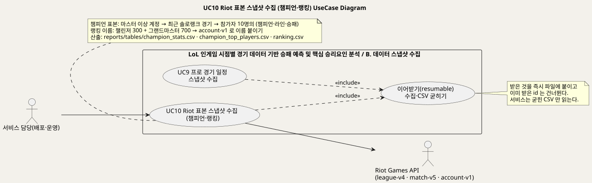
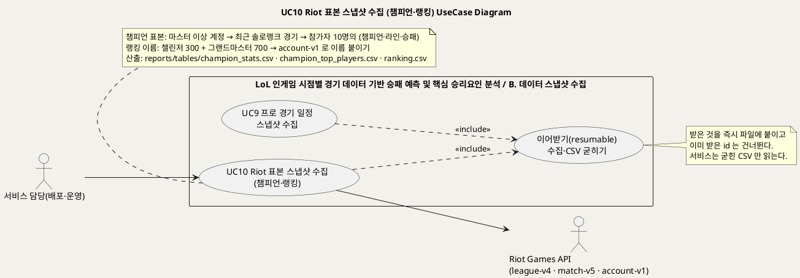
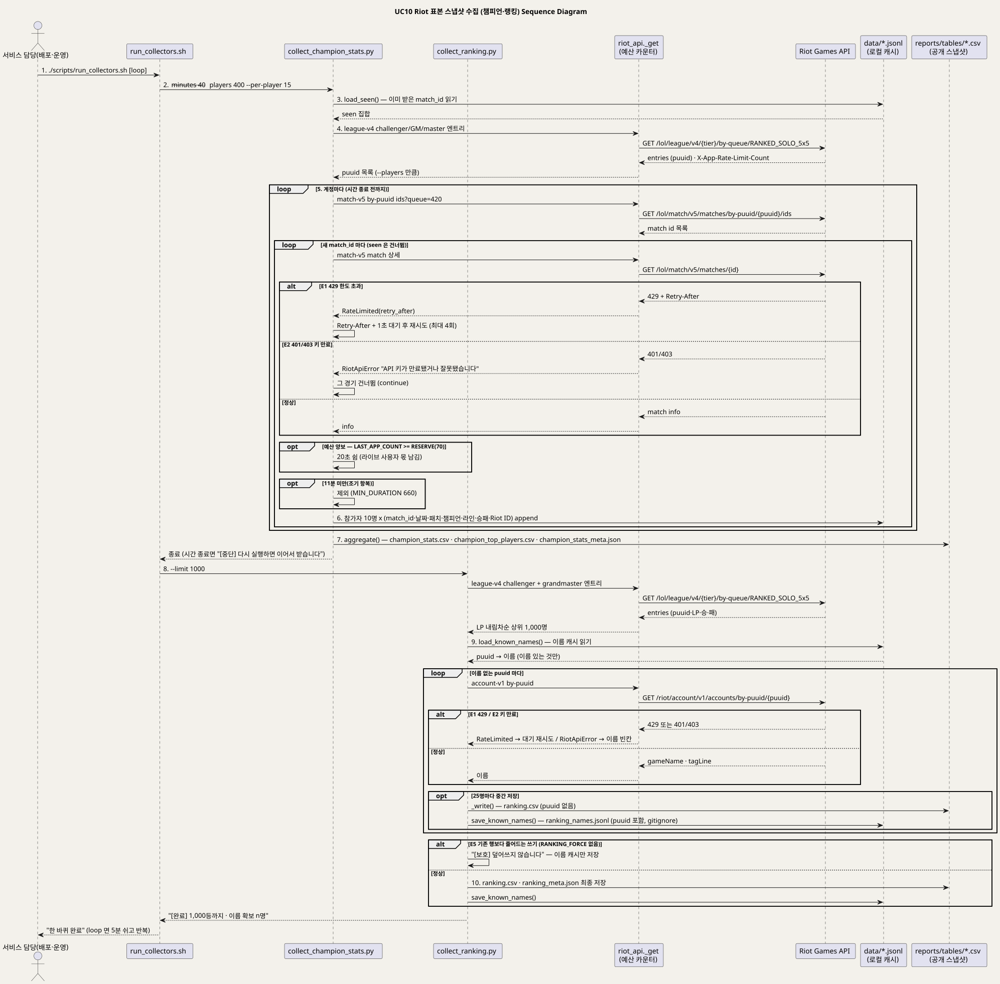
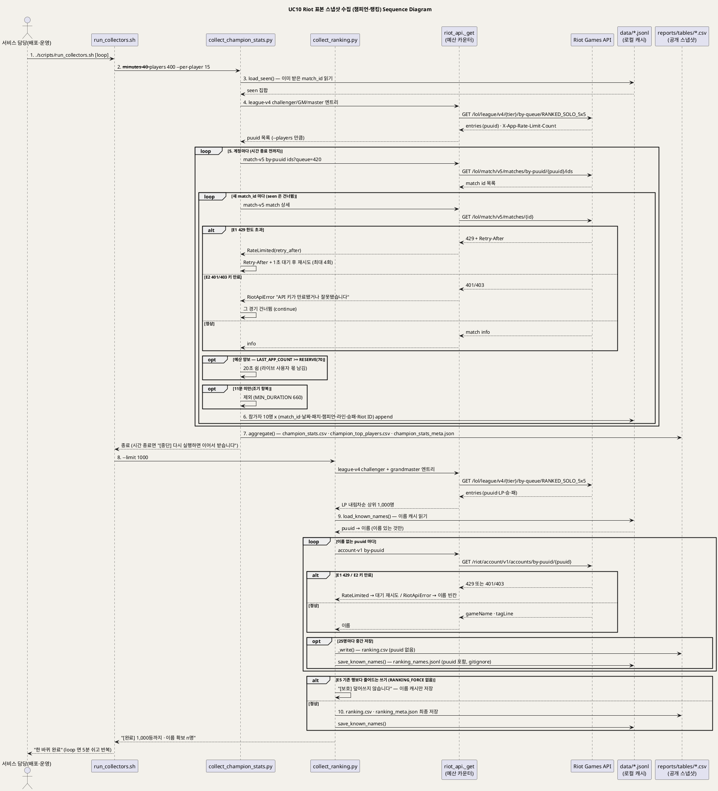

<!-- ─────────────────────────────────────────────
  UC10 상세 명세 — Riot API 에서 챔피언 표본과 랭킹 이름을 배치로 받아 CSV 로 굳히는 흐름.
  왜 필요한가: 개요(UC_00)의 목록을 구현 가능한 수준(사전·사후조건·흐름·예외·업무규칙·시퀀스)으로 내린다.
  주로 보는 사람: 팀원(구현·검수) · Claude(검수)
  ───────────────────────────────────────────── -->

# UseCase 명세 #10 Riot 표본 스냅샷 수집 (B. 데이터 스냅샷 수집)
**LoL 인게임 시점별 경기 데이터 기반 승패 예측 및 핵심 승리요인 분석 · UC10 · UML 2.5.1 표준 (UseCase Diagram + UseCase 기술 + Sequence Diagram)**

---

> **문서 식별**: `docs/usecases/UC_10_Riot표본스냅샷수집.md`
> **작성일**: 2026-09-07 · **표준**: UML 2.5.1 (OMG)
> **원천(SoT)**: `src/collect_champion_stats.py` · `src/collect_ranking.py` · `scripts/run_collectors.sh` · `scripts/run_overnight.sh` · `src/riot_api.py` `_get`·`LAST_APP_COUNT`·`RateLimited` · `reports/tables/champion_stats_meta.json`·`ranking_meta.json` · `tests/test_contract.py` `test_ranking_has_no_puuid` · `.gitignore` · `docs/product.md` §5 · `docs/riot-api-application.md` "HOW WE RESPECT THE RATE LIMITS"·"DATA HANDLING"·LEAGUE-V4 · `docs/serving.md` §5 `/api/ranking`·`/api/champions`
> **개요 문서**: [UC_00_개요_LoL승패예측및핵심승리요인분석.md](UC_00_개요_LoL승패예측및핵심승리요인분석.md) §3 UC10 행
> **다이어그램**: 모든 PlantUML 소스는 로컬 Kroki 에서 렌더 검증 완료(HTTP 200). 렌더 결과는 `diagrams/*.svg` 로 함께 두어 로그인 없이 보인다. 뷰어 링크는 사내 서버라 SSO 로그인이 필요하다.

---

## 목차

1. [범위·개요](#1-범위개요)
2. [UseCase Diagram](#2-usecase-diagram)
3. [Actor 카탈로그](#3-actor-카탈로그)
4. [UseCase 목록 (원천 매핑)](#4-usecase-목록-원천-매핑)
5. [UseCase 기술 + Sequence Diagram](#5-usecase-기술--sequence-diagram)
6. [업무규칙(Business Rules) 종합](#6-업무규칙business-rules-종합)
7. [UML 표준 준수 노트](#7-uml-표준-준수-노트)

---

## 1. 범위·개요

이 유스케이스는 서비스 담당이 **Riot Games API 를 배치로 불러** 두 가지 표본을 받아 CSV 로 굳히는 흐름이다.
하나는 **챔피언 표본** — 마스터 이상 계정의 최근 솔로랭크 경기에서 참가자 10명의 (챔피언·라인·승패·공개 Riot ID)를 모아
챔피언 x 라인 승률표와 챔피언별 상위 유저표를 만든다. 다른 하나는 **랭킹 이름** — 챌린저·그랜드마스터 엔트리 상위 1,000명에
account-v1 로 이름을 붙여 랭킹표를 만든다. (근거: `src/collect_champion_stats.py`·`src/collect_ranking.py` 머리말)

서비스(`/api/champions`·`/api/ranking`)는 Riot 을 직접 부르지 않고 **굳힌 CSV 만 읽는다.** 이름을 붙이는 데 1,000회가 들어
라이브 요청 안에서는 불가능하고, 챔피언 표본은 수천 건의 호출이라 중간에 끊기기 때문이다. 그래서 두 수집기 모두
**이어받기(resumable)** — 받은 것을 즉시 파일에 붙이고 이미 받은 것을 건너뛴다 — 와 **예산 양보** — 120초 예산 100 중
카운터가 70을 넘으면 스스로 쉰다 — 를 갖는다. 이 공통 하위행위를 «include» 로 분리했고 UC9(일정 수집)와 공유한다.
(근거: `src/collect_ranking.py` "왜 배치인가", `scripts/run_collectors.sh` 머리말, `docs/serving.md` §5)

| 항목 | 값 |
|---|---|
| 대상 시스템 | LoL 인게임 시점별 경기 데이터 기반 승패 예측 및 핵심 승리요인 분석 — 패키지 B. 데이터 스냅샷 수집 |
| 상위 프로세스 | 스냅샷 수집 배치 — 일정(UC9) → 챔피언 표본 → 랭킹 이름 순서로 한 바퀴 (`scripts/run_collectors.sh` `run_once`) |
| 원천 근거 | `src/collect_champion_stats.py` · `src/collect_ranking.py` · `scripts/run_collectors.sh` · `src/riot_api.py` `_get` · `docs/product.md` §5 · `docs/riot-api-application.md` |
| 핵심 UseCase | 1개 (UC10) + 포함 UC 1개 (이어받기 수집·CSV 굳히기, UC9 와 공유) |
| 주요 액터 | 서비스 담당(배포·운영)(주) · Riot Games API(보조) |

---

## 2. UseCase Diagram

PlantUML 소스 보기

소스를 직접 렌더하려면 **[「UC10 UseCase Diagram」 PlantUML 뷰어로 열기](https://plantuml.sumzip.com/plantuml/svg/eNqFVN9L21AUfs9fceheLKO1xY1hEXF2cwiyjQ33JMg1jTWYJiW5dYwx8EeUznaoW3WdtkVBdIyORVttBX3xT9lj7s3_sHMTW3U_2FNucu75zne-850MWZSYNJfRICfHY5M5S5GJpUjWrKpniUkyMEXk2bRp5PRU0tAME-6M9I3EHw_fuGHNkJTxWtXTME00zNWUaQrUAFNNz1BIqaYiU9XQJapSTYHxZDwGL1SDgrdRYY028NV9trTMl1rA82V-uAE9_Kjklc75VvuyxWrfvcWzMIxbShJ5wSOVpLGmJBGZIpkQtyvszEYIYIUmK5z1MMfx1uqXLb7d5OWFcAiIBc-yliQJFkRPI4PQmDEGvNp2j4u8ZgMvVPjuOmvY4B5fuG0H2AeHV5ue7QC-MaeMDM-84lfg5Txv7wFz1sDbPOGFugiwgzrfLiEasFOb21XoheHoDYjfuwvBWwngSmYI_VeNCf0vcvhdidSbUFiQbzWZs4Ose0zFymXIlKaEJ_QA6LKVfPkK3JOGV8vjDR9i9GnyNpl-8Eo226t0pODVc767iRB_dOET6JfedSfhN_GEZBQLHj4fRdqaQtI5JTJ3Dy5bkCFUnonM3RdnIstoJxqZiweNiExJwiFBJDIYtOXLEo0OCoaQgIEBVZe1XEoZHJQEyX9FMElABIC6QRWYMig1MmBMd-TqinkleALYYR7b82eFCi4tgNuwsWn4ufIR-EnFbZ0DXymhKEL8hXpHGj_stF1nntfWIR5j35Z5tXzbvKheFZ-Bf8JYPZifKMQO7ASSKbIDh-_OQ18sBnfBbbVZrcI-Va45PcCAKHUtGoj5BAjouS94Qjqis0WHn1YSYCpZw6RWLxXjt3rlGZLJ4vpN4qJTKypbc2IG3a_UyE5mNfJGMbsxk-i422nxKil6CoSQgZrBRqOYgXHQa7w6j4Is8Sru0cF7XCXwikXhms_rHXKNXUEO-f5odzLUFLDVErhHTWbn2Q4u7n5UXOossx8UTi2CMC07LCLABX71L3Y5DeEJ_1zSL43WTmM=)** (사내 서버, SSO 로그인 필요) 또는 [로컬 Kroki 로 열기](http://192.168.0.91:8889/plantuml/svg/eNqFVN9L21AUfs9fceheLKO1xY1hEXF2cwiyjQ33JMg1jTWYJiW5dYwx8EeUznaoW3WdtkVBdIyORVttBX3xT9lj7s3_sHMTW3U_2FNucu75zne-850MWZSYNJfRICfHY5M5S5GJpUjWrKpniUkyMEXk2bRp5PRU0tAME-6M9I3EHw_fuGHNkJTxWtXTME00zNWUaQrUAFNNz1BIqaYiU9XQJapSTYHxZDwGL1SDgrdRYY028NV9trTMl1rA82V-uAE9_Kjklc75VvuyxWrfvcWzMIxbShJ5wSOVpLGmJBGZIpkQtyvszEYIYIUmK5z1MMfx1uqXLb7d5OWFcAiIBc-yliQJFkRPI4PQmDEGvNp2j4u8ZgMvVPjuOmvY4B5fuG0H2AeHV5ue7QC-MaeMDM-84lfg5Txv7wFz1sDbPOGFugiwgzrfLiEasFOb21XoheHoDYjfuwvBWwngSmYI_VeNCf0vcvhdidSbUFiQbzWZs4Ose0zFymXIlKaEJ_QA6LKVfPkK3JOGV8vjDR9i9GnyNpl-8Eo226t0pODVc767iRB_dOET6JfedSfhN_GEZBQLHj4fRdqaQtI5JTJ3Dy5bkCFUnonM3RdnIstoJxqZiweNiExJwiFBJDIYtOXLEo0OCoaQgIEBVZe1XEoZHJQEyX9FMElABIC6QRWYMig1MmBMd-TqinkleALYYR7b82eFCi4tgNuwsWn4ufIR-EnFbZ0DXymhKEL8hXpHGj_stF1nntfWIR5j35Z5tXzbvKheFZ-Bf8JYPZifKMQO7ASSKbIDh-_OQ18sBnfBbbVZrcI-Va45PcCAKHUtGoj5BAjouS94Qjqis0WHn1YSYCpZw6RWLxXjt3rlGZLJ4vpN4qJTKypbc2IG3a_UyE5mNfJGMbsxk-i422nxKil6CoSQgZrBRqOYgXHQa7w6j4Is8Sru0cF7XCXwikXhms_rHXKNXUEO-f5odzLUFLDVErhHTWbn2Q4u7n5UXOossx8UTi2CMC07LCLABX71L3Y5DeEJ_1zSL43WTmM=) (내부망 전용). 위 그림 파일은 로그인 없이 보인다.

#### 다이어그램 쉽게 읽기 (유저 관점)

1. **누가 쓰나** — 왼쪽 사람 모양은 서버를 돌보는 사람이다. 이 사람이 자료 모으는 프로그램을 한 번 돌리거나, 끝나면 또 돌게 계속 돌려 둔다. 돌아가는 동안 사람이 옆에 있을 필요는 없다.
2. **무슨 순서로** — 먼저 잘하는 사람들의 명단을 받는다. 한 사람씩 최근 경기를 받아 파일 끝에 바로 붙인다. 다 받으면 캐릭터별 승률 표로 정리한다. 이어서 가장 잘하는 1,000명의 이름을 받아 순위표를 만든다.
3. **«include» = 항상 함께** — 두 가지 자료 모으기 모두 같은 방식을 쓴다. "받자마자 파일에 붙이고, 이미 받은 것은 건너뛰고, 마지막에 표 파일로 저장한다." 경기 일정 모으기(UC9)도 같은 방식이라 하나로 묶어 그렸다.
4. **«extend» = 특별한 때만** — 이 그림에는 없다.
5. **Generalization(◁)** — 이 그림에는 없다.
6. **오른쪽 Riot Games API** — 게임 회사가 경기 기록을 나눠 주는 창구다. 우리 울타리 밖에 있다. 손님이 자기 경기를 찾아볼 때(UC3)도 같은 창구, 같은 열쇠(API 키, 열쇠 역할을 하는 비밀 문자열)를 쓰기 때문에 물어볼 수 있는 횟수를 나눠 써야 한다.

#### 표준 기호 범례

| 기호 | 의미 | UML 2.5.1 |
|---|---|---|
| 사람 모양 (actor) | 우리 울타리 밖에서 이 시스템과 주고받는 상대. 사람일 수도 있고 다른 프로그램일 수도 있다 | Actor |
| 타원 (usecase) | 그 상대가 하고 싶어 하는 일 하나 | UseCase |
| 큰 사각형 (rectangle) | 우리가 만든 것의 울타리. 안은 우리 것, 밖은 남의 것 | Subject (System Boundary) |
| 실선 화살표 | 왼쪽에서 오면 사람이 그 일을 시작한다는 뜻, 오른쪽으로 가면 그 일이 바깥 상대에게 물어본다는 뜻 | Association |
| 점선 화살표 «include» | 이 일을 하면 저 일도 항상 같이 한다 | Include |

---

## 3. Actor 카탈로그

| 액터 | 구분 | 설명 | 근거 |
|---|---|---|---|
| 서비스 담당(배포·운영) | Primary | 팀 서버에서 `scripts/run_collectors.sh` 또는 `run_overnight.sh` 를 실행한다. [추론] 원천이 실행 주체를 명시하지 않아 웹·서버·배포 담당으로 둔다 — 확인 필요 | `scripts/run_collectors.sh` 머리말 "사람이 붙어 있을 필요가 없다", `docs/TEAM_WORKFLOW.md` 역할 배치 |
| Riot Games API | Secondary | league-v4(챌린저·그랜드마스터·마스터 엔트리) · match-v5(경기 id 목록·경기 상세) · account-v1(puuid → 이름). 응답 헤더 `X-App-Rate-Limit-Count` 로 120초 창 사용량을 알려 준다 | `src/collect_champion_stats.py` `puuids_from_apex`·`main`, `src/collect_ranking.py` `main`, `src/riot_api.py` `_get` |
| (내부) `riot_api._get` · `LAST_APP_COUNT` | 시스템 구성요소 | 모든 호출이 지나는 단일 래퍼. 429 는 `RateLimited(retry_after)` 로, 401/403 은 키 만료 오류로 올리고, 마지막 응답의 사용량을 카운터에 남긴다 | `src/riot_api.py` 34행·53~87행 |
| (내부) data/champion_raw.jsonl · data/ranking_names.jsonl | 로컬 캐시 | 이어받기의 근거. `.gitignore` 로 커밋되지 않는다 — 크고 재생성 가능하며, 랭킹 캐시는 puuid 를 담는다 | `.gitignore` 30·33행, `src/collect_ranking.py` `load_known_names` |
| (내부) `reports/tables/champion_stats.csv` · `champion_top_players.csv` · `ranking.csv` + `*_meta.json` | 공개 스냅샷 | 커밋되는 산출물. 서비스는 이 파일만 읽는다 | `src/collect_champion_stats.py` `aggregate`, `src/collect_ranking.py` `_write`, `docs/serving.md` §5 |

lolesports 일정 API 는 UC9 의 보조액터이며 이 UC 에서는 부르지 않는다.

---

## 4. UseCase 목록 (원천 매핑)

| UC ID | 유스케이스명 | 주액터 | 관계 | 원천 근거 |
|:--:|---|---|---|---|
| UC10 | Riot 표본 스냅샷 수집 (챔피언·랭킹) | 서비스 담당(배포·운영) | 기준 UC | `src/collect_champion_stats.py` · `src/collect_ranking.py` · `scripts/run_collectors.sh` |
| (포함) | 이어받기(resumable) 수집·CSV 굳히기 | — | UC10·UC9 가 «include» | `src/collect_champion_stats.py` `load_seen`·`aggregate` · `src/collect_ranking.py` `load_known_names`·`_write` · `docs/product.md` §5 "결정하기 전에 알아야 할 것 1" |
| UC9 | 프로 경기 일정 스냅샷 수집 | 서비스 담당(배포·운영) | 같은 바퀴의 앞 단계, 같은 포함 UC 공유 | `scripts/run_collectors.sh` `run_once` — 상세는 `UC_09_경기일정스냅샷수집.md` |

---

## 5. UseCase 기술 + Sequence Diagram

### 5.1 UC10 Riot 표본 스냅샷 수집 (챔피언·랭킹)

> **쉽게 말하면** — 게임 회사(Riot)에는 경기 기록을 나눠 주는 창구가 있다. 서버를 돌보는 사람이 프로그램 하나를 돌리면, 이 프로그램이 밤에 몰래 자료를 모아 두는 로봇처럼 그 창구에서 잘하는 사람들의 최근 경기를 조금씩 받아 온다.
> 그렇게 받은 기록으로 "이 캐릭터는 이 자리에서 얼마나 이기나" 표와 "가장 잘하는 1,000명" 표를 미리 만들어 둔다.
> 중간에 끊겨도 받은 데까지 기억해 두었다가 다시 돌리면 그 자리부터 이어서 받는다. 창구는 한 번에 물어볼 수 있는 횟수가 정해져 있어서, 사이트 손님이 쓸 몫은 남겨 두고 천천히 받는다.

#### 유스케이스 기술

| 속성 | 내용 |
|---|---|
| **ID** | UC10 — 원천 식별자: `src/collect_champion_stats.py` · `src/collect_ranking.py` · `scripts/run_collectors.sh` · `docs/product.md` §5 |
| **유스케이스명** | Riot 표본 스냅샷 수집 (챔피언·랭킹) |
| **액터** | 주액터: 서비스 담당(배포·운영) ([추론] 실행 주체 미명시). 보조액터: Riot Games API (league-v4 · match-v5 · account-v1) |
| **사전조건** | (1) `RIOT_API_KEY` 가 환경변수 또는 `.env` 에 있다 — 스크립트는 혼자 돌므로 `.env` 를 직접 읽는다 (`src/collect_champion_stats.py` 33~37행). (2) 키가 살아 있다 — 개발용 키는 24시간마다 만료된다 (`docs/product.md` §5 "알아야 할 것 1", `docs/deploy.md`). (3) 저장소 루트에서 실행 가능한 `python3`(또는 `python`)가 있고 `pandas` 가 설치돼 있다 — 집계에 쓴다 (`aggregate`). (4) `data/`·`reports/tables/`·`logs/` 폴더는 없으면 만든다. (5) 이전 실행의 data/champion_raw.jsonl·data/ranking_names.jsonl 이 있으면 이어받고, 없으면 처음부터 받는다 |
| **사후조건** | (1) data/champion_raw.jsonl 에 이번 실행에서 받은 경기의 참가자 행이 **추가**됐다(덮어쓰지 않는다). (2) `reports/tables/champion_stats.csv`(챔피언 x 라인, 5판 이상)·`champion_top_players.csv`(8판 이상·승률 50% 초과, 조합당 최대 5명)·`champion_stats_meta.json`(수집 경기수·패치·기간·갱신 시각)이 다시 써졌다. (3) `reports/tables/ranking.csv`(rank·tier·name·tag·lp·wins·losses, **puuid 없음**)·`ranking_meta.json` 이 써졌고, data/ranking_names.jsonl 에 puuid → 이름 캐시가 남았다. (4) 라이브 서비스는 재시작 없이 다음 요청부터 새 CSV 를 읽는다 — [추론] `web/app.py` `_csv` 가 요청마다 파일을 읽는다면. 확인 필요. (5) 공개 산출물에 puuid 가 없다 (`tests/test_contract.py` `test_ranking_has_no_puuid`) |
| **기본흐름** | ↓ 별도 기본흐름표 |
| **대체흐름** | A1. **반복 실행** — 1단계에서 `./scripts/run_collectors.sh loop` 로 돌리면 한 바퀴(일정 → 챔피언 40분 → 랭킹)가 끝날 때마다 5분 쉬고 다시 돈다. Ctrl+C 로 중단한다 (`scripts/run_collectors.sh`). A2. **밤샘 대량 수집** — `./scripts/run_overnight.sh` 는 순서를 바꿔 랭킹 이름 → 챔피언 표본(`--minutes 180 --players 900 --per-player 20`) → 티어 연구(`src/tier_generalization.py`, 별도 분석 스크립트) 로 돈다. 티어 연구는 이 UC 의 범위가 아니다 (`scripts/run_overnight.sh`). A3. **수집기 단독 실행** — `python src/collect_champion_stats.py [--minutes N --players N --per-player N]` 또는 `python src/collect_ranking.py [--limit N]` 를 따로 돌린다. 기본값은 챔피언 20분·400명·15판, 랭킹 1,000명. A4. **중단 후 이어받기** — 시간 종료·네트워크 끊김·키 만료로 끝났어도 다시 실행하면 챔피언은 `load_seen()` 의 match_id 를, 랭킹은 `load_known_names()` 의 이름 있는 puuid 를 건너뛰고 나머지만 받는다. 몇 번에 나눠 돌려도 결과가 같다 (`src/collect_champion_stats.py` 머리말). A5. **의도한 축소 쓰기** — 랭킹을 기존보다 적은 행으로 덮어쓰려면 `RANKING_FORCE=1` 로 실행한다 (`src/collect_ranking.py` `_write`) |
| **예외흐름** | E1. **429 한도 초과** — 호출이 429 를 받으면 `RateLimited(retry_after)` 가 올라오고, 수집기는 `Retry-After + 1` 초를 온전히 기다린 뒤 재시도한다(최대 4회). 4회 모두 실패하면 `RiotApiError("한도가 계속 걸립니다…")` 로 그 항목을 건너뛴다. 10초만 자고 넘어가면 Riot 이 요구한 시간을 안 지켜 연속 실패한다 (`get_paced` docstring). E2. **키 만료·오류(401/403)** — `RiotApiError("API 키가 만료됐거나 잘못됐습니다…")`. 챔피언 수집은 그 계정·경기를 건너뛰고 계속하며(`continue`), 랭킹은 이름을 빈칸으로 두고 등수는 살린다. 빈 이름은 캐시에서 "아는 사람"으로 치지 않아 다음 실행이 재시도한다 (`src/riot_api.py` `_get`, `src/collect_ranking.py` `load_known_names`). E3. **키 없음** — `RIOT_API_KEY` 가 환경변수에도 `.env` 에도 없으면 첫 호출에서 `RiotApiError("RIOT_API_KEY 환경변수가 없습니다…")`. 챔피언 수집은 티어 엔트리를 하나도 못 받아 표본 0명으로 끝나고 기존 원본으로 집계만 한다; 랭킹은 두 티어 모두 "[건너뜀]" 으로 0행이 된다 (`puuids_from_apex`, `collect_ranking.main`). E4. **시간 종료** — `--minutes` 가 지나면 챔피언 수집은 "[중단] 시간 종료 — 다시 실행하면 이어서 받습니다" 를 남기고 받은 만큼 집계한다 (`collect_champion_stats.main`). E5. **랭킹 축소 덮어쓰기 차단** — 새 행 수가 기존 `ranking.csv` 보다 적으면 "[보호] … 덮어쓰지 않습니다" 로 CSV 를 건드리지 않고 이름 캐시만 저장한다. 작은 `--limit` 테스트가 1,000행을 4행으로 만든 적이 있다 (`_write`). E6. **원본 없음·비어 있음** — 집계 시 data/champion_raw.jsonl 이 없거나 비면 "[집계] 원본이 없습니다/비어 있습니다" 로 CSV 를 쓰지 않는다 (`aggregate`). E7. **네트워크 끊김** — `run_overnight.sh` 는 티어 연구 전에만 연결을 확인한다(최대 30분 대기). 챔피언·랭킹 수집 중 끊김은 호출 예외로 처리돼 항목을 건너뛰며, 다음 실행이 이어받는다. [추론] 수집기 자체에는 연결 확인이 없다 |
| **포함/확장** | «include» 이어받기(resumable) 수집·CSV 굳히기 — 즉시 append · 받은 id 건너뜀 · 25명/50판 단위 중간 저장 · 서비스는 CSV 만 읽음. UC9 와 공유. «extend» 없음 |
| **우선순위** | Medium — 챔피언 승률·유저 랭킹 탭(UC6·UC7)의 데이터 원천이지만 예측·판정의 뿌리 기능은 아니다. 원천도 F7 챔피언 집계를 "F5·F6 다음" 으로 둔다 (`docs/product.md` §5 "우선순위", §3 표) |
| **사용빈도** | 한 바퀴당 챔피언 수집 40분 + 랭킹 이름 최대 1,000회 호출(페이스 1.25초 → 약 20분) + 5분 휴식, `loop` 이면 계속 반복 (`scripts/run_collectors.sh`, `src/collect_ranking.py` "20분 걸린다"). 밤샘 실행은 챔피언 180분 (`scripts/run_overnight.sh`). 실제 실행 주기·요일: 자료 없음 — 확인 필요 (`logs/collect_*.log` 는 저장소에 없다). 실측 스냅샷: 챔피언 6,684판(2026-07-27~09-04, 갱신 2026-09-04 17:23), 랭킹 1,000명(갱신 2026-09-04 09:00) (`reports/tables/*_meta.json`) |
| **업무규칙** | BR-COL-01 ~ BR-COL-10 (§6) |
| **특별 요구사항** | (1) **예산 공유** — 라이브 소환사 조회와 같은 키·같은 예산(100회/120초)을 쓰므로 페이스 1.25초(96회/120초 이하)와 예산 양보(RESERVE 70)를 반드시 지킨다. 안 지키면 사용자의 콜드 조회 12콜이 대부분 429 로 막힌다 — 실제로 그랬다 (`src/collect_ranking.py` 주석). (2) **개인정보** — puuid 는 공개 CSV·API 응답에 넣지 않고 gitignore 되는 로컬 캐시에만 둔다. 공개 Riot ID(이름·태그)만 담는다 (Riot 정책, `tests/test_contract.py`). (3) **Cloudflare 차단 회피** — 모든 호출에 User-Agent 를 붙인다 (`src/riot_api.py` `_get`). (4) **표본 명시** — 마스터 이상 표본이므로 화면에 "그마~챌 기준" 을 밝혀야 한다 (`docs/product.md` §5 "알아야 할 것 3"). (5) **Windows 호환** — `python3` 이 스토어 스텁일 수 있어 실제로 도는 쪽을 고른다 (`scripts/run_collectors.sh`). (6) 성능 목표·보안 감사·규제: 자료 없음 — 확인 필요 |
| **비고** | 원천 추적성 — `src/collect_champion_stats.py` 머리말(1~19행)·`PACE_SEC`·`RESERVE`·`_budget_wait`·`get_paced`·`MIN_DURATION`·`TIERS`·`load_seen`·`puuids_from_apex`·`main`·`aggregate` · `src/collect_ranking.py` 머리말(1~15행)·`load_known_names`·`save_known_names`·`main`·`_write` · `scripts/run_collectors.sh` `run_once`·`loop` · `scripts/run_overnight.sh` 1/3·2/3 단계 · `src/riot_api.py` `LAST_APP_COUNT`(34행)·`_get`(53~87행)·`RateLimited`(41~50행) · `reports/tables/champion_stats_meta.json`·`ranking_meta.json` · `tests/test_contract.py` `test_ranking_has_no_puuid` · `.gitignore` 30·33행 · `docs/product.md` §5 · `docs/riot-api-application.md` "HOW WE RESPECT THE RATE LIMITS"·"DATA HANDLING". 주의: 신청서의 LEAGUE-V4 문단은 "planned, not yet implemented" 로 적혀 있으나 코드는 이미 league-v4 를 호출한다 — 신청서 갱신 여부 확인 필요. `logs/collect_*.log` 는 저장소에 없어 실행 이력을 확인하지 못했다 |

#### 기본흐름 (Basic Flow)

| 단계 | 액터 행위 | 시스템 행위 |
|:--:|---|---|
| 1 | 서비스 담당이 팀 서버 저장소 루트에서 `./scripts/run_collectors.sh` 를 실행한다 (A1: `loop`) | 스크립트가 실행 가능한 파이썬을 고르고 `logs/` 를 만든 뒤, 일정 수집(UC9)을 먼저 돌린다 |
| 2 | — (기다린다) | 스크립트가 `src/collect_champion_stats.py --minutes 40 --players 400 --per-player 15` 를 시작하고 출력을 `logs/collect_champion.log` 에 붙인다 |
| 3 | — | 수집기가 `.env` 에서 키를 읽고(E3), data/champion_raw.jsonl 에서 이미 받은 match_id 집합을 읽어 "[시작] 이미 받은 경기 n건 — 건너뜁니다" 를 남긴다 |
| 4 | — | 수집기가 league-v4 로 챌린저 → 그랜드마스터 → 마스터 엔트리를 받아 `--players` 만큼의 puuid 표본을 만든다 (E1·E2) |
| 5 | — | 계정마다 match-v5 로 최근 솔로랭크(큐 420) 경기 id 를 받고, 아직 없는 id 만 경기 상세를 받는다. 호출마다 1.25초 간격을 지키고, 응답 헤더의 사용량이 70 을 넘으면 20초 쉰다. 11분 미만 경기는 제외한다 (E1·E2·E4) |
| 6 | — | 경기마다 참가자 10명의 (match_id·날짜·패치·챔피언·라인·승패·Riot ID 이름·태그)를 data/champion_raw.jsonl 에 즉시 한 줄씩 붙이고 50판마다 flush 한다. puuid 는 저장하지 않는다 |
| 7 | — | 시간이 끝나거나 표본을 다 돌면 원본 전체를 집계해 `champion_stats.csv`(라인 5종·5판 이상)·`champion_top_players.csv`(8판 이상·승률 50% 초과·조합당 5명)·`champion_stats_meta.json` 을 다시 쓴다 (E6) |
| 8 | — | 스크립트가 `src/collect_ranking.py --limit 1000` 을 시작한다. 수집기가 league-v4 챌린저·그랜드마스터 엔트리를 LP 내림차순으로 합쳐 상위 1,000명을 만든다 (E1·E2·E3) |
| 9 | — | data/ranking_names.jsonl 에서 이름을 이미 아는 puuid 를 읽고, 모르는 사람만 account-v1 로 이름·태그를 받는다. 25명마다 `ranking.csv` 와 이름 캐시를 중간 저장한다 (E1·E2) |
| 10 | 담당이 로그의 "[완료] 1,000등까지 · 이름 확보 n명" 과 "한 바퀴 완료" 를 확인한다 (A1 이면 5분 뒤 자동 반복) | `ranking.csv`(puuid 없음)·`ranking_meta.json` 을 최종 저장하고 이름 캐시를 남긴다 (E5). 서비스는 다음 요청부터 새 CSV 를 읽는다 |

#### Sequence Diagram

PlantUML 소스 보기

소스를 직접 렌더하려면 **[「UC10 Sequence Diagram」 PlantUML 뷰어로 열기](https://plantuml.sumzip.com/plantuml/svg/eNq9V91y01YQvtdT7KQ3costO8RQmIHiBkMzDUnGIdAZymiELYyKLamSHGAYZkJiGJOkQ1ISMOAwoU1JoKE1jWnskt7kUbj0OXqH7jmS_Jdk2qteOLZ0dvfsfrv77eaU7SiWU8jnoJCORWVb_b6g6mlVsK9ruqlYSh6uKOnrWcso6JlBI2dY8MmZw2diyS87JOxrSsa4oelZuKrkbFVwNCenwsRgLAopzXDAXayQrTrQ2TUyc4_ObAMtlen6Ioj03ZK7tEMf13e3yYu37nQjBOO-A3BaU7JoXBCUtIO39tFihTSKaAPIXI3MNURSrboPN3e36bMaLd8N9YFiw6hpC-iTo6U1U9Ed6LMKupw2cjmVGbEj9jUulpoY6RbzReT0NSVvaoYuIyqOHTFvcfHBrxLnxvZXsBQdYcgGkqnEyNc9DiAAsmJqETmrOt_qIi2X6HQVaKOGfrvFqud3YmyoW43jdlbJq_zMs42vuoUyiqNIn0a-sw09h6bJywr9sAn0rwU6Vwn5_lzscUc1DcuxJUe5klNtVE7bk6ja3HrfrFbaGfK0B8cvCAJCCuGTDDI4DrEIRCQ7bWkm2tiDLVzKGYZ5WWCyqMJhQ6X-CITDeU0vOBjNQBQfzJxyS7XYA39SLf8NxOKCp8VuTFxE5cMRyBlKBgtT1cUQfJxaArpSI7_XgVSf05UpyCtO-pqsZfD13816VWBq4Y7bmSJgtbnLr9u2EVM8GkDbqpItqOHJAcDUYyh6VrWks-ekvGI76A99suTO1smrTYFpMKdYXo7D2eR5kHJGTvL0pckB6bajqdYd6cqtMBYwvmKlkDwtj48Oj8rxm3GBa4Zbd6u6Y2mIh2gWClomBLvb8E04YZrhlOKo4WEtrznhQWw6x7u5IyCuAOTNa_JyBcQ2mGR93r27ExJYDiAegeZWka4uk_USmVvDVpurNKtFoD_dIz_PA10tNhvzdH0qJAD0oMIBDU_GAUPx7tIy9hc8qBMD_VFUOAALrihNxr0fWF2BAek2_7ojoSFU70GCS0MrJBTgEdCZUju3QRReMjHrzXc1UiyRCg_g4BA823TmLi3WueB_df02ussVlJwDyRgM9B8Dd7lCHiKEtVJza4cf7omFiX0GKdWxboUTV7GCfLHeHLIk8xyrGdFi0rLCpEO-eCuclnzbItqPoQtA5qew3MF9jh692MT0Mt9E-r6CBzDgPpv3jKlIyJDsx1aLSQPRw-BOr7FKwSI4IAJP7iC_UThhaknLYpTMTtFeszrlmyQLC813VTJdRpfK5M0HfKaz78kcS17fQbE1t-vQ_IP1bjurIKYN3UHKUDuiwGrGTO7vtl9E-lXjAM9bR6qe4d-G6UBAxo8XyVaNc8twYvy8nBgbkwdHJ0bOw8kTkEqOJ1MXkuLR6IHZ6Y-yhNAHOyCSlR1GT3VsselN-uw1fbGAdf0rkOmNZsMv1k4PYjHyZxGQzhBAkb6s8pQuvyVb7w-8ja5W6NM6iOeGRuTTE6nE-aHREThyJNptvIdGj0SAVuuYKeZQLEre3IObIAb9heN3epWuV3a33fkN2ijjUO2YzCwk_KazDTzd3ebID50OgWKa3m3sL_u0XR2_gHcejYCSzVpqFovdp-6e-YrDhxFf661jmLJPZ3vOuIacVx2FD7zgstZo8pmtm-jI6xr0XaJri2Ru4zIuDmt4CnRuzX38wF0us1PMFn1cw-WCz5NWsYaCIcZoHK1_zmZYjnUsoheNCvx1q_r2myLYp7i_6Jn_eZLsbg-P8VzxXIZa08OPY3gMS7FGXu3Q6gYtVTg1VooQO4RBYVG04vKq5pg_fK_rxg1d1tk60jGDXxX9XaN39Pp3ecPj4_0fA2kx0HpRIrNL2PQzWPX-wAqOntxnR_6M46zPJkYX2ko6zQZjeDLWGlH7DyW2e0m-tDQZC37uHUxCF89LjC97eHIfniflBeZqJ2H2gN3B8hwGn7LbdC11E2oHVKRRog02snqZr8eRLOZkBD-sVRwlO6zp6n6eeFaFgB4Y8_THMd_-XMUG4T2zivTwi3eNj7jXyfINS2v1cLDysgb1ao5lja74A6e7gmxlUt2nfHwb3jtvgQ1s4U7vLm8cgqzmaFndsPgECBiGZykOiCJ9WQPsYuRtL4AidjF5VGEZoY84jYrMk6GRs_KZ0dRgssPHtoccm75LaMQt15EffviNccGjKi5GQJdn23Swt-axNgK8ulPUjVwsGukCDNMUxN6iMsChjXTVhv_fIORQeEIt-kOWe1rEar3s9_Kjd96Cx270HXefLrMxp2Pe-zx6Q2223qM27jZIgEvuFDIit9MHIu9LxpFxNqPog83m1ioKlflwOoU-4H-Nwj8kiZ-N)** (사내 서버, SSO 로그인 필요) 또는 [로컬 Kroki 로 열기](http://192.168.0.91:8889/plantuml/svg/eNq9V91y01YQvtdT7KQ3costO8RQmIHiBkMzDUnGIdAZymiELYyKLamSHGAYZkJiGJOkQ1ISMOAwoU1JoKE1jWnskt7kUbj0OXqH7jmS_Jdk2qteOLZ0dvfsfrv77eaU7SiWU8jnoJCORWVb_b6g6mlVsK9ruqlYSh6uKOnrWcso6JlBI2dY8MmZw2diyS87JOxrSsa4oelZuKrkbFVwNCenwsRgLAopzXDAXayQrTrQ2TUyc4_ObAMtlen6Ioj03ZK7tEMf13e3yYu37nQjBOO-A3BaU7JoXBCUtIO39tFihTSKaAPIXI3MNURSrboPN3e36bMaLd8N9YFiw6hpC-iTo6U1U9Ed6LMKupw2cjmVGbEj9jUulpoY6RbzReT0NSVvaoYuIyqOHTFvcfHBrxLnxvZXsBQdYcgGkqnEyNc9DiAAsmJqETmrOt_qIi2X6HQVaKOGfrvFqud3YmyoW43jdlbJq_zMs42vuoUyiqNIn0a-sw09h6bJywr9sAn0rwU6Vwn5_lzscUc1DcuxJUe5klNtVE7bk6ja3HrfrFbaGfK0B8cvCAJCCuGTDDI4DrEIRCQ7bWkm2tiDLVzKGYZ5WWCyqMJhQ6X-CITDeU0vOBjNQBQfzJxyS7XYA39SLf8NxOKCp8VuTFxE5cMRyBlKBgtT1cUQfJxaArpSI7_XgVSf05UpyCtO-pqsZfD13816VWBq4Y7bmSJgtbnLr9u2EVM8GkDbqpItqOHJAcDUYyh6VrWks-ekvGI76A99suTO1smrTYFpMKdYXo7D2eR5kHJGTvL0pckB6bajqdYd6cqtMBYwvmKlkDwtj48Oj8rxm3GBa4Zbd6u6Y2mIh2gWClomBLvb8E04YZrhlOKo4WEtrznhQWw6x7u5IyCuAOTNa_JyBcQ2mGR93r27ExJYDiAegeZWka4uk_USmVvDVpurNKtFoD_dIz_PA10tNhvzdH0qJAD0oMIBDU_GAUPx7tIy9hc8qBMD_VFUOAALrihNxr0fWF2BAek2_7ojoSFU70GCS0MrJBTgEdCZUju3QRReMjHrzXc1UiyRCg_g4BA823TmLi3WueB_df02ussVlJwDyRgM9B8Dd7lCHiKEtVJza4cf7omFiX0GKdWxboUTV7GCfLHeHLIk8xyrGdFi0rLCpEO-eCuclnzbItqPoQtA5qew3MF9jh692MT0Mt9E-r6CBzDgPpv3jKlIyJDsx1aLSQPRw-BOr7FKwSI4IAJP7iC_UThhaknLYpTMTtFeszrlmyQLC813VTJdRpfK5M0HfKaz78kcS17fQbE1t-vQ_IP1bjurIKYN3UHKUDuiwGrGTO7vtl9E-lXjAM9bR6qe4d-G6UBAxo8XyVaNc8twYvy8nBgbkwdHJ0bOw8kTkEqOJ1MXkuLR6IHZ6Y-yhNAHOyCSlR1GT3VsselN-uw1fbGAdf0rkOmNZsMv1k4PYjHyZxGQzhBAkb6s8pQuvyVb7w-8ja5W6NM6iOeGRuTTE6nE-aHREThyJNptvIdGj0SAVuuYKeZQLEre3IObIAb9heN3epWuV3a33fkN2ijjUO2YzCwk_KazDTzd3ebID50OgWKa3m3sL_u0XR2_gHcejYCSzVpqFovdp-6e-YrDhxFf661jmLJPZ3vOuIacVx2FD7zgstZo8pmtm-jI6xr0XaJri2Ru4zIuDmt4CnRuzX38wF0us1PMFn1cw-WCz5NWsYaCIcZoHK1_zmZYjnUsoheNCvx1q_r2myLYp7i_6Jn_eZLsbg-P8VzxXIZa08OPY3gMS7FGXu3Q6gYtVTg1VooQO4RBYVG04vKq5pg_fK_rxg1d1tk60jGDXxX9XaN39Pp3ecPj4_0fA2kx0HpRIrNL2PQzWPX-wAqOntxnR_6M46zPJkYX2ko6zQZjeDLWGlH7DyW2e0m-tDQZC37uHUxCF89LjC97eHIfniflBeZqJ2H2gN3B8hwGn7LbdC11E2oHVKRRog02snqZr8eRLOZkBD-sVRwlO6zp6n6eeFaFgB4Y8_THMd_-XMUG4T2zivTwi3eNj7jXyfINS2v1cLDysgb1ao5lja74A6e7gmxlUt2nfHwb3jtvgQ1s4U7vLm8cgqzmaFndsPgECBiGZykOiCJ9WQPsYuRtL4AidjF5VGEZoY84jYrMk6GRs_KZ0dRgssPHtoccm75LaMQt15EffviNccGjKi5GQJdn23Swt-axNgK8ulPUjVwsGukCDNMUxN6iMsChjXTVhv_fIORQeEIt-kOWe1rEar3s9_Kjd96Cx270HXefLrMxp2Pe-zx6Q2223qM27jZIgEvuFDIit9MHIu9LxpFxNqPog83m1ioKlflwOoU-4H-Nwj8kiZ-N) (내부망 전용). 위 그림 파일은 로그인 없이 보인다.

기본흐름 10단계와 시퀀스의 번호 메시지가 1:1 로 대응한다. 대체흐름 A2(밤샘)·A3(단독 실행)은 2단계와 8단계의 진입 인자만 다르고 같은 경로이며, 시퀀스에는 기본(한 바퀴) 경로만 그렸다.

---

## 6. 업무규칙(Business Rules) 종합

| BR ID | 규칙 | 적용 UC | 근거 |
|---|---|---|---|
| BR-COL-01 | **이어받기** — 받은 경기는 즉시 파일에 한 줄씩 붙이고, 다시 실행하면 이미 받은 match_id(챔피언)·이름 있는 puuid(랭킹)를 건너뛴다. 몇 번에 나눠 돌려도 결과가 같다 | UC10, UC9 | `src/collect_champion_stats.py` 머리말·`load_seen`, `src/collect_ranking.py` `load_known_names`, `docs/product.md` §5 "알아야 할 것 1" |
| BR-COL-02 | **서비스는 CSV 만 읽는다** — 라이브 요청 안에서 Riot 을 반복 호출하지 않는다. 배치가 굳힌 `reports/tables/*.csv` 만 서비스가 읽는다 | UC10, UC9 | `src/collect_ranking.py` "왜 배치인가", `docs/serving.md` §5 `/api/ranking`·`/api/champions` "Riot 호출 0회" |
| BR-COL-03 | **페이스** — 호출 간격 1.25초(96회/120초 이하)를 지킨다. 예산 100회/120초를 몇 초에 태우면 사용자 검색이 전부 실패한다 | UC10 | `src/collect_champion_stats.py`·`src/collect_ranking.py` `PACE_SEC` |
| BR-COL-04 | **예산 양보** — 응답 헤더 `X-App-Rate-Limit-Count` 의 120초 창 사용량이 70 이상이면 20초 쉰다. 예산 100 중 30만 쓰고 나머지는 라이브 사용자 몫으로 남긴다 | UC10 | `RESERVE`·`_budget_wait`, `src/riot_api.py` `LAST_APP_COUNT`, `scripts/run_collectors.sh` 머리말 |
| BR-COL-05 | **429 는 온전히 기다린다** — 배치는 `Retry-After + 1` 초를 기다려 최대 4회 재시도한다. 웹 요청 경로와 달리 기다리는 것이 맞다 | UC10 | `get_paced` docstring, `src/riot_api.py` `RateLimited`, `docs/riot-api-application.md` "HOW WE RESPECT THE RATE LIMITS" |
| BR-COL-06 | **puuid 비공개** — 커밋되는 CSV 와 API 응답에 puuid 를 넣지 않는다. 이어받기 캐시(data/ranking_names.jsonl)와 원본(data/champion_raw*)은 `.gitignore` 로 제외한다. 공개 Riot ID(이름·태그)만 담는다 | UC10 | `tests/test_contract.py` `test_ranking_has_no_puuid`, `.gitignore` 30·33행, `src/collect_champion_stats.py` 머리말 "puuid 같은 내부 식별자는 저장하지 않는다" |
| BR-COL-07 | **표본 기준** — 챔피언 표본은 마스터 이상(챌린저·그랜드마스터·마스터) 계정의 솔로랭크(큐 420) 경기만 쓰고, 11분 미만(조기 항복) 경기는 제외한다. 화면에는 상위 티어 기준임을 밝힌다 | UC10 | `TIERS`·`SOLO_QUEUE`·`MIN_DURATION`, `docs/product.md` §5 "알아야 할 것 3", `docs/serving.md` §5 `/api/champions` "마스터 이상 솔로랭크 관찰 승률" |
| BR-COL-08 | **집계 최소 표본** — 챔피언 x 라인 승률은 5판 이상 조합만, 챔피언별 상위 유저는 8판 이상·승률 50% 초과·조합당 최대 5명만 낸다. 라인은 TOP·JUNGLE·MIDDLE·BOTTOM·UTILITY 5종만 | UC10 | `src/collect_champion_stats.py` `aggregate` |
| BR-COL-09 | **화면 경기수는 하나로 고정** — "라인 정보가 있고 11분 이상 진행된 중복 없는 경기 수" 만 `champion_stats_meta.json` 에 쓴다. 원본 줄 수·참가자 수와 섞지 않는다 | UC10 | `src/collect_champion_stats.py` `aggregate` meta 주석 |
| BR-COL-10 | **랭킹 축소 덮어쓰기 금지** — 새 행 수가 기존 `ranking.csv` 보다 적으면 덮어쓰지 않는다. 의도한 축소는 `RANKING_FORCE=1` 로만 허용한다. 상위 1,000명은 챌린저 300 + 그랜드마스터 700 이며 LP 내림차순이 등수다 | UC10 | `src/collect_ranking.py` `_write`·`main`, `tests/test_contract.py` "랭킹이 n행뿐입니다" |

---

## 7. UML 표준 준수 노트

| 항목 | 적용 |
|---|---|
| UseCase Diagram | Subject(시스템 경계)를 `rectangle` 로, 주액터를 경계 밖 왼쪽에, Riot Games API 를 경계 밖 오른쪽 Secondary Actor 로 두었다. 두 수집기가 공유하는 이어받기·CSV 굳히기는 항상 발생하므로 «include» 로 분리했다 (UML 2.5.1 §18.1.3 Include) |
| UseCase 기술 | 14속성 세로형 표. 챔피언 표본과 랭킹 이름은 한 바퀴 안에서 순서대로 실행되므로 한 UC 의 기본흐름(2~7단계 / 8~10단계)으로 두고, 단독·밤샘 실행은 대체흐름으로 분리했다 |
| Sequence Diagram | 기본흐름 10단계와 메시지 1:1. 429·키 만료는 `alt`, 예산 양보·조기 항복 제외·중간 저장은 `opt`, 계정·경기 반복은 `loop` 결합 프래그먼트로 표현했다. Riot Games API 와 로컬 캐시·공개 CSV 는 별도 lifeline 이다 (UML 2.5.1 §17.6 CombinedFragment) |
| 내부 구성요소 | `riot_api._get`·JSONL 캐시·CSV 는 액터가 아니므로 UseCase Diagram 에서는 note 로만 언급하고 Sequence Diagram 의 lifeline 으로 그렸다 |
| 추적성 | 모든 흐름·규칙에 원천(파일·함수·행)을 붙였고, 원천에 없는 판단은 `[추론]`, 없는 자료는 `자료 없음 — 확인 필요` 로 남겼다 |

---

*표기 표준: UML 2.5.1 (OMG). 서식 정본: usecase 스킬 `references/format-spec.md`. 개요 문서: [UC_00_개요_LoL승패예측및핵심승리요인분석.md](UC_00_개요_LoL승패예측및핵심승리요인분석.md). 앞 문서: `UC_09_경기일정스냅샷수집.md` · 다음 문서: `UC_11_모델재현재학습.md`.*
