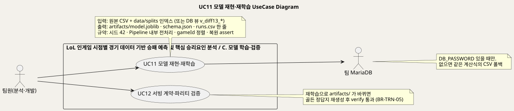
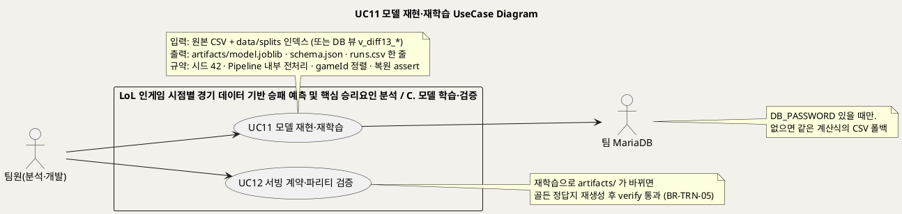
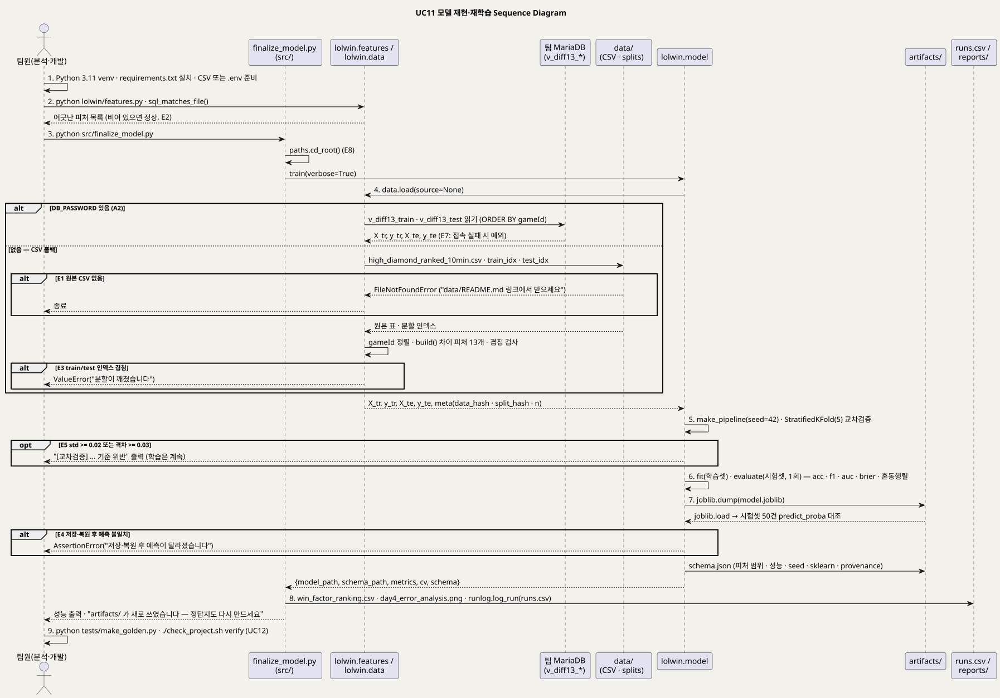
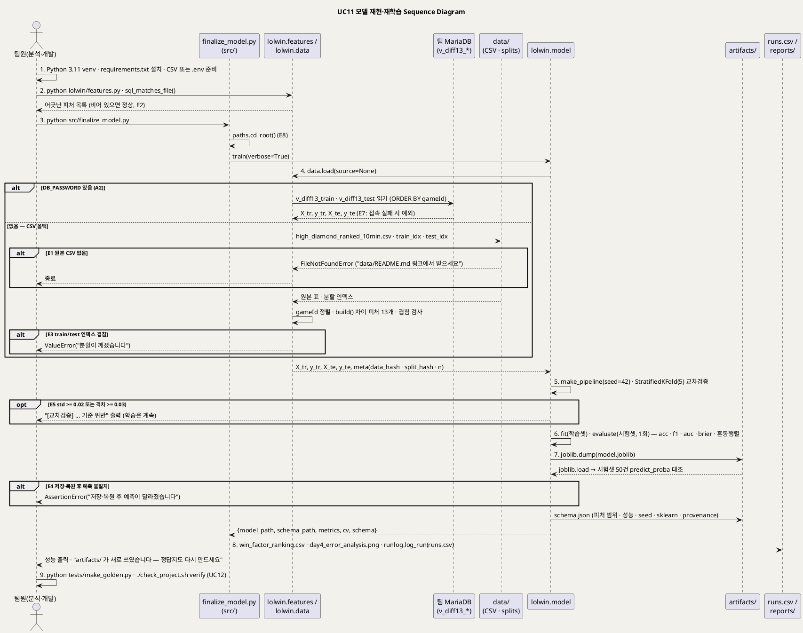

<!-- ─────────────────────────────────────────────
  UC11 상세 명세 — 학습된 모델을 그대로 다시 만들거나(재현), 시점·피처를 바꿔 다시 학습하는(재학습) 흐름.
  왜 필요한가: 개요(UC_00)의 목록을 구현 가능한 수준(사전·사후조건·흐름·예외·업무규칙·시퀀스)으로 내린다.
  주로 보는 사람: 팀원(분석·개발) · Claude(검수)
  ───────────────────────────────────────────── -->

# UseCase 명세 #11 모델 재현·재학습 (C. 모델 학습·검증)
**LoL 인게임 시점별 경기 데이터 기반 승패 예측 및 핵심 승리요인 분석 · UC11 · UML 2.5.1 표준 (UseCase Diagram + UseCase 기술 + Sequence Diagram)**

---

> **문서 식별**: `docs/usecases/UC_11_모델재현재학습.md`
> **작성일**: 2026-09-07 · **표준**: UML 2.5.1 (OMG)
> **원천(SoT)**: `docs/REPRODUCE.md` · `docs/spec.md` FR-6·§4 · `docs/plan.md` §2·§3·§4 · `CLAUDE.md` · `docs/TEAM_WORKFLOW.md` "데이터·모델 동결" · `lolwin/features.py` · `lolwin/data.py` · `lolwin/model.py` · `lolwin/artifacts.py` · `src/finalize_model.py` · `src/load_from_db.py` · `src/runlog.py` · `src/paths.py` · `tests/test_training_reproducible.py` · `tests/make_golden.py` · `data/README.md` · `artifacts/schema.json` · `runs.csv` · `.env.example` · `requirements.txt` · `pyproject.toml`
> **개요 문서**: [UC_00_개요_LoL승패예측및핵심승리요인분석.md](UC_00_개요_LoL승패예측및핵심승리요인분석.md) §3 UC11 행
> **다이어그램**: 모든 PlantUML 소스는 로컬 Kroki 에서 렌더 검증 완료(HTTP 200). 렌더 결과는 `diagrams/*.svg` 로 함께 두어 로그인 없이 보인다. 뷰어 링크는 사내 서버라 SSO 로그인이 필요하다.

---

## 목차

1. [범위·개요](#1-범위개요)
2. [UseCase Diagram](#2-usecase-diagram)
3. [Actor 카탈로그](#3-actor-카탈로그)
4. [UseCase 목록 (원천 매핑)](#4-usecase-목록-원천-매핑)
5. [UseCase 기술 + Sequence Diagram](#5-usecase-기술--sequence-diagram)
6. [업무규칙(Business Rules) 종합](#6-업무규칙business-rules-종합)
7. [UML 표준 준수 노트](#7-uml-표준-준수-노트)

---

## 1. 범위·개요

이 유스케이스는 팀원이 **서비스 중인 모델을 코드로 그대로 다시 만들거나(재현)**, 관측 시점·피처 정의를 바꿔 **새 모델을 학습해 산출물을 갱신하는(재학습)** 흐름이다.
학습 절차는 `lolwin.model.train()` 한 함수가 적재 → 교차검증 → 학습 → 평가 → 저장을 순서대로 수행하고, 산출물에 데이터 지문·시드·패키지 버전·git 커밋을 함께 남긴다.
`src/finalize_model.py` 는 그 위에서 발표용 해석(승리요인 순위·구간별 오류 분석·그림)만 만들고 `runs.csv` 에 실험을 기록한다.
(근거: `lolwin/model.py` 머리말, `src/finalize_model.py` 머리말, `docs/REPRODUCE.md`)

데이터는 팀 MariaDB 의 SQL 뷰(`v_diff13_train` · `v_diff13_test`)를 우선 읽고, 접속 정보(`DB_PASSWORD`)가 없으면 같은 계산식의 로컬 CSV 와 저장된 분할 인덱스로 폴백한다.
피처 정의는 `lolwin/features.py` 가 유일한 정본이며, SQL 뷰도 거기서 생성·대조한다. DB 뷰와 파이썬이 어긋나면 오류 없이 학습 값만 조용히 달라지므로 기계로 잡는다.
(근거: `lolwin/data.py`, `lolwin/features.py` 머리말, `CLAUDE.md` "피처를 바꿀 때")

재학습은 `artifacts/` 를 새로 쓰므로 골든 정답지(`tests/golden_predictions.json`)를 다시 만들어야 하고, 데이터·모델은 **동결** 대상이라 담당자 승인 후에만 바꾼다.
(근거: `src/finalize_model.py` 머리말, `CLAUDE.md` "손대면 안 되는 것", `docs/TEAM_WORKFLOW.md` "데이터·모델 동결")

| 항목 | 값 |
|---|---|
| 대상 시스템 | LoL 인게임 시점별 경기 데이터 기반 승패 예측 및 핵심 승리요인 분석 — 패키지 C. 모델 학습·검증 |
| 상위 프로세스 | 4일 프로젝트 Phase 1~5 (기준선 → 성능 → 신뢰 → 남기기 → 확장) 의 학습·산출물 단계와, 이후 시점·피처 변경 시의 재학습 (`docs/plan.md` §4, `docs/spec.md` FR-6) |
| 원천 근거 | `docs/REPRODUCE.md` · `docs/spec.md` §4 재현성 규약 · `docs/plan.md` §3 Constitution · `lolwin/model.py` `train` · `lolwin/data.py` `load` · `src/finalize_model.py` · `tests/test_training_reproducible.py` |
| 핵심 UseCase | 1개 (UC11). 학습 뒤 검증(UC12)은 별도 UC 이며 업무규칙으로 연결한다 |
| 주요 액터 | 팀원(분석·개발)(주) · 팀 MariaDB(보조) |

---

## 2. UseCase Diagram

PlantUML 소스 보기

소스를 직접 렌더하려면 **[「UC11 UseCase Diagram」 PlantUML 뷰어로 열기](https://plantuml.sumzip.com/plantuml/svg/eNp9U01P20AQvftXjNILtEpo0vbCoaJJilSJtghKe4w28SYYHBt5nVRVVSmiLkKJEUgQNRQbBYnyUXEw-SBBgkt-jnf9H7prgxpVai-2Z3fmvTdvxjPERIZZKatQKSSTuQrBBUSwRFYVbQ0ZqAx5VFgtGXpFkzO6qhvwYPbJbPJleiyDLCNZ_6hoJSgildequGiCqYOhlJZNkBUDF0xF1yRTMVUMS5lkEuivM7o1BHZ4EbSs0UC8m_us3oclgjOcH7IKKnFsSUIFk5PGArvGDnYm6JXFLHc08D2Hes5kDBCBLK5KkuBAWonjx-b0OWDu0O_Y7NAC1nBYe4d2LfA7t_7QA7rlMbcXWB7wiHotYPXrwD4D1tpkwyOg3jYEzT5rXIgLenLBfuxxNIiYYQoyiXv1kWQuplNjJ24MPksAd_5B7L9thrpFxl8VKWCWQ6_3we9arHk7GgS2zSUEDS72jiQqTElfxq2B18hQUDYd-ZGWJO4JxOPPI46xICWFukTE0zTdxJDXTVMvg168F8QOv9H2z2ngftPuEDKL7-ERyMhEU2RNVUwizKVbl6x-DBO0tUPrexwL6MCDak5WisXkk9zDSYFz5YQ4fL2UItdKpsq6jNXEip5XlTyMBkAKy7iMEitE10RoVDSSKJAqN9YBdmxxDH_gcB-mxRTprgNPUyJvXlnDqqJhoOs9elUD1rZYp8V9EpclVMavZH7WpO3wgHb7vBNuDMGGKWFNBtF21Hu0oVHrqbD1uwEx54YeOWPSwfdqfDf2aM2m5z2hrHtGd9shT6PPTmuiln11mXUJwYEFVWwoxU8QbPT97g1MpBfi7xbexB8_m_yXAj4O4I_c_IvFxQ9vF7Icb5O5FtCmTU_thBD3fUPIOu9xLfvMrYVLsu6xhsvcVjimYLtHvcs_DDP8i__Z0m_dKMuK)** (사내 서버, SSO 로그인 필요) 또는 [로컬 Kroki 로 열기](http://192.168.0.91:8889/plantuml/svg/eNp9U01P20AQvftXjNILtEpo0vbCoaJJilSJtghKe4w28SYYHBt5nVRVVSmiLkKJEUgQNRQbBYnyUXEw-SBBgkt-jnf9H7prgxpVai-2Z3fmvTdvxjPERIZZKatQKSSTuQrBBUSwRFYVbQ0ZqAx5VFgtGXpFkzO6qhvwYPbJbPJleiyDLCNZ_6hoJSgildequGiCqYOhlJZNkBUDF0xF1yRTMVUMS5lkEuivM7o1BHZ4EbSs0UC8m_us3oclgjOcH7IKKnFsSUIFk5PGArvGDnYm6JXFLHc08D2Hes5kDBCBLK5KkuBAWonjx-b0OWDu0O_Y7NAC1nBYe4d2LfA7t_7QA7rlMbcXWB7wiHotYPXrwD4D1tpkwyOg3jYEzT5rXIgLenLBfuxxNIiYYQoyiXv1kWQuplNjJ24MPksAd_5B7L9thrpFxl8VKWCWQ6_3we9arHk7GgS2zSUEDS72jiQqTElfxq2B18hQUDYd-ZGWJO4JxOPPI46xICWFukTE0zTdxJDXTVMvg168F8QOv9H2z2ngftPuEDKL7-ERyMhEU2RNVUwizKVbl6x-DBO0tUPrexwL6MCDak5WisXkk9zDSYFz5YQ4fL2UItdKpsq6jNXEip5XlTyMBkAKy7iMEitE10RoVDSSKJAqN9YBdmxxDH_gcB-mxRTprgNPUyJvXlnDqqJhoOs9elUD1rZYp8V9EpclVMavZH7WpO3wgHb7vBNuDMGGKWFNBtF21Hu0oVHrqbD1uwEx54YeOWPSwfdqfDf2aM2m5z2hrHtGd9shT6PPTmuiln11mXUJwYEFVWwoxU8QbPT97g1MpBfi7xbexB8_m_yXAj4O4I_c_IvFxQ9vF7Icb5O5FtCmTU_thBD3fUPIOu9xLfvMrYVLsu6xhsvcVjimYLtHvcs_DDP8i__Z0m_dKMuK) (내부망 전용). 위 그림 파일은 로그인 없이 보인다.

#### 다이어그램 쉽게 읽기 (유저 관점)

1. **누가 쓰나** — 왼쪽 사람 모양은 이 시스템을 만든 팀원이다. 모델을 이어받아 다시 만들거나 고치는 사람이다. 오른쪽 사람 모양은 공부용 경기 기록을 넣어 둔 팀의 자료 서랍(데이터베이스)이다. 우리가 만든 것이 아니라서 큰 네모 밖에 그렸다.
2. **무슨 순서로** — 팀원이 공부시키는 명령을 돌린다. 시스템이 자료 서랍에서 재료를 읽는다(서랍이 안 열리면 표 파일에서 읽는다). 그다음 나눠서 시험해 보기, 공부시키기, 점수 매기기, 저장하기를 한 번에 끝내고, 무엇을 했는지 기록을 남긴다.
3. **«include» = 항상 함께** — 이 그림 안에는 없다. 공부가 끝난 뒤 반드시 해야 하는 검사(UC12)는 따로 떼어 두었다. 대신 "다시 공부시켰으면 정답지를 다시 만들고 검사를 통과해야 한다" 는 규칙으로 묶어 두었다.
4. **«extend» = 특별한 때만** — 없다. 15분 시점 자료로 바꾸거나 보는 항목을 바꾸는 것은 특별히 덧붙는 일이 아니다. 같은 길을 다른 재료로 가는 것뿐이라 다른 길(대체흐름)로 적었다.
5. **Generalization(◁)** — 없다.
6. **울타리 안에 있는 것** — 공부시키는 프로그램 묶음, 컴퓨터 안의 표 파일과 나누기 기록, 결과물 폴더, 실험 기록은 우리 것이라서 사람 모양으로 그리지 않는다.

#### 표준 기호 범례

| 기호 | 의미 | UML 2.5.1 |
|---|---|---|
| 사람 모양 (actor) | 우리 울타리 밖에서 이 시스템과 주고받는 상대. 사람일 수도 있고 다른 프로그램일 수도 있다 | Actor |
| 타원 (usecase) | 그 상대가 하고 싶어 하는 일 하나 | UseCase |
| 큰 사각형 (rectangle) | 우리가 만든 것의 울타리. 안은 우리 것, 밖은 남의 것 | Subject (System Boundary) |
| 실선 화살표 | 왼쪽에서 오면 사람이 그 일을 시작한다는 뜻, 오른쪽으로 가면 그 일이 바깥 상대에게 물어본다는 뜻 | Association |
| note | 무엇을 넣고 무엇이 나오는지, 지켜야 할 것을 적어 둔 메모 | Comment |

---

## 3. Actor 카탈로그

| 액터 | 구분 | 설명 | 근거 |
|---|---|---|---|
| 팀원(분석·개발) | Primary | 모델을 이어받아 재현·확장하고, 데이터·모델 변경을 승인하는 담당(이제민). 무엇을 고치든 검증을 통과시킨다 | `docs/spec.md` §2 "팀원(개발자)", `docs/TEAM_WORKFLOW.md` 역할 배치·"데이터·모델 동결", `CLAUDE.md` |
| 팀 MariaDB | Secondary | 피처셋별 SQL 뷰(`v_diff13_train` · `v_diff13_test` 등, 피처셋 4종: diff13·clean27·gold2·cluster5)로 학습 재료를 준다. 접속 정보는 환경변수로만 받고, 없으면 CSV 로 폴백한다 | `src/load_from_db.py` 머리말·`FEATURE_SETS`, `lolwin/data.py` `load`, `docs/plan.md` §2 Storage, `.env.example` |
| (내부) `lolwin` 라이브러리 | 시스템 구성요소 | `features.py`(피처 정본) · `data.py`(적재) · `model.py`(학습·저장) · `artifacts.py`(경로·적재). 시퀀스의 lifeline 으로만 그린다 | `lolwin/__init__.py`, `docs/REPRODUCE.md` "무엇이 어디에 있나" |
| (내부) 로컬 CSV · 분할 인덱스 | 시스템 자산 | `data/high_diamond_ranked_10min.csv`(저장소에 없음, 직접 받는다) + `data/splits/train_idx.csv` · `data/splits/test_idx.csv`(저장소 포함, 재현성 규약의 실물) | `data/README.md`, `lolwin/data.py` |
| (내부) `artifacts/` · `runs.csv` · 골든 정답지 | 시스템 자산 | 학습 산출물(`model.joblib` · `schema.json`), 실험 기록, 회귀 정답지 | `lolwin/artifacts.py`, `src/runlog.py`, `tests/make_golden.py` |

---

## 4. UseCase 목록 (원천 매핑)

| UC ID | 유스케이스명 | 주액터 | 관계 | 원천 근거 |
|:--:|---|---|---|---|
| UC11 | 모델 재현·재학습 | 팀원(분석·개발) | 기준 UC | `docs/REPRODUCE.md` · `docs/spec.md` FR-6·§4 · `docs/plan.md` §3 · `lolwin/model.py` `train` · `src/finalize_model.py` |
| UC12 | 서빙 계약·파리티 검증 | 팀원(분석·개발) · 서비스 담당 | 별도 UC — 재학습 뒤 BR-TRN-05 로 실행을 요구 | `CLAUDE.md` "무엇을 고치든 통과해야 하는 것", `check_project.sh` `verify` — 상세는 `UC_12_서빙계약파리티검증.md` |

---

## 5. UseCase 기술 + Sequence Diagram

### 5.1 UC11 모델 재현·재학습

> **쉽게 말하면** — 승패를 맞히는 모델은 진짜 경기 기록을 문제집 삼아 공부한 프로그램이다. 이 일은 그 공부를 처음부터 다시 시키는 것이다.
> 같은 문제집을 같은 순서로 다시 풀게 하면 똑같은 답이 나와야 한다. 그래서 명령 하나로 같은 자료, 같은 시작값을 써서 같은 모델이 다시 만들어지고, 어떤 자료로 언제 만들었는지도 함께 적어 둔다.
> 10분 대신 15분 시점 자료로 공부시키거나 보는 항목을 바꿀 때도 같은 길을 간다. 다만 모델이 달라졌으니 미리 적어 둔 정답지도 다시 만들고 검사도 다시 통과해야 한다.

#### 유스케이스 기술

| 속성 | 내용 |
|---|---|
| **ID** | UC11 — 원천 식별자: `docs/spec.md` FR-6·§4 "재현성 규약 8항목" · `docs/plan.md` §3 Constitution 1·2·6 · `docs/REPRODUCE.md` · `lolwin/model.py` `train` |
| **유스케이스명** | 모델 재현·재학습 |
| **액터** | 주액터: 팀원(분석·개발). 보조액터: 팀 MariaDB (SQL 뷰, `DB_PASSWORD` 있을 때만) |
| **사전조건** | (1) Python 3.11 가상환경에 `requirements.txt` 의 고정 버전이 설치돼 있다 — 모델이 scikit-learn 1.9.0 저장본이라 다른 버전으로는 열리지 않는다 (`docs/REPRODUCE.md`, `docs/plan.md` §2). (2) 원본 CSV `data/high_diamond_ranked_10min.csv` 를 Kaggle 에서 받아 두었거나, `.env` 에 `DB_PASSWORD` 등 팀 MariaDB 접속 정보가 있다 (`data/README.md`, `.env.example`). (3) 분할 인덱스 `data/splits/train_idx.csv` · `data/splits/test_idx.csv` 가 저장소에 있다 (`data/README.md`). (4) `lolwin/features.py` 의 피처 정의와 `db/create_ml_views.sql` 의 `v_diff13_all` 뷰가 일치한다 (`lolwin/features.py` `sql_matches_file`). (5) 데이터·모델을 바꾸는 재학습이면 담당자(이제민) 승인이 있다 (`docs/TEAM_WORKFLOW.md`). (6) 프로젝트 루트(`data` 폴더와 `predict.py` 가 함께 있는 폴더) 안에서 실행한다 — 어디서 실행하든 `paths.cd_root()` 가 루트로 옮긴다 (`src/paths.py`) |
| **사후조건** | (1) `artifacts/model.joblib`(StandardScaler + LogisticRegression Pipeline) 과 `artifacts/schema.json`(피처 13개의 type·train_min·train_max·train_mean, 홀드아웃 성능, seed, sklearn 버전, provenance: data_hash·split_hash·n_train·n_test·git_commit·cv·confusion_matrix) 이 저장됐다 (`lolwin/model.py` `train`). (2) 저장한 모델을 다시 읽어 예측이 같음을 assert 로 확인했다 (`lolwin/model.py`). (3) `runs.csv` 에 교차검증 결과 한 줄이 추가됐다 (`src/runlog.py` `log_run`). (4) 승리요인 순위 `reports/tables/win_factor_ranking.csv` 와 오류 분석 그림 `reports/figures/day4_error_analysis.png` 가 갱신됐다 (`src/finalize_model.py`). (5) 재현이면 재학습 결과의 계수·절편·스케일러가 배포본과 허용 오차 안에서 같다 (`tests/test_training_reproducible.py`). (6) 재학습이면 골든 정답지를 다시 만들었고 `./check_project.sh verify` 를 통과했다 (BR-TRN-05, UC12) |
| **기본흐름** | ↓ 별도 기본흐름표 |
| **대체흐름** | A1. **재현성 검사만 수행** — 팀원이 `python tests/test_training_reproducible.py` 를 돌린다. 시스템은 배포본 `schema.json` 의 `data_source` 로 원천(db/csv)을 정하고(자동 감지 금지), 임시 폴더에 다시 학습해 계수·절편·스케일러 평균·표준편차를 배포본과 허용 오차(1e-9) 안에서 대조하고, `metrics_holdout`·피처 규격·정체성 항목(model_name·version·time_point_min·target·feature_set·seed·sklearn_version)이 같은지 본다. `artifacts/` 는 건드리지 않는다. 원본 CSV 가 없으면 건너뛴다 (`tests/test_training_reproducible.py`). A2. **DB 원천으로 학습** — `.env` 에 `DB_PASSWORD` 가 있으면 4단계에서 `src/load_from_db.py` 가 `v_diff13_train` · `v_diff13_test` 뷰를 읽는다 (`lolwin/data.py`). 뷰가 `ORDER BY gameId` 로 읽으므로 CSV 폴백도 `gameId` 로 정렬해 순서를 맞춘다. 주의: CSV 분할과 DB `ml_split` 분할은 둘 다 유효하지만 다른 분할이라 홀드아웃 수치가 다르다 (`tests/test_training_reproducible.py` `shipped_source` 주석). A3. **관측 시점을 바꿔 재학습(FR-6)** — `lolwin/features.py` 의 `TIME_POINT_MIN` 과 원천 데이터만 바꾸면 같은 코드로 15분 모델을 학습한다 (`docs/spec.md` FR-6, `lolwin/features.py`). 10분 vs 15분 통제 비교(프로 경기, 실험 B)는 `src/timepoint_compare.py` 가 수행하며, 실험 A(다이아)와 실험 B(프로)의 절대 수치를 서로 비교하지 않는다 (`docs/plan.md` §3 Constitution 7). A4. **피처를 바꿔 재학습** — 팀원이 `lolwin/features.py` 만 고친 뒤 `python lolwin/features.py --sql` 로 SQL 뷰를 다시 뽑고 `sql_matches_file()` 이 빈 목록을 돌려주는지 확인한 다음 3단계로 간다 (`CLAUDE.md` "피처를 바꿀 때"). `DIFF13` 의 순서가 곧 모델 입력 순서라 순서를 바꾸면 저장된 모델과 어긋난다 (`lolwin/features.py`). A5. **라이브러리로 직접 학습** — `lolwin.model.train(source=..., seed=42, out_dir=...)` 를 호출한다. `out_dir` 을 주면 그쪽에 쓰고(검증용), 안 주면 `artifacts/` 에 쓴다. 해석·그림·`runs.csv` 기록(8단계)은 하지 않는다 (`lolwin/model.py`). A6. **전 과정 재현** — `docs/REPRODUCE.md` 의 명령 순서대로 `src/day1_baseline.py`(분할·기준선) → `src/split_check.py`(분할 진단 4항목) → `src/day2_features_cluster.py`(차이 피처 13개·군집) → `src/finalize_model.py` → 모델 비교·페이즈 2·3 스크립트 → `src/repeat_check.py`(분할 10회 반복) → `python predict.py --demo` → `src/factcheck.py` 를 순차 실행한다 (재현성 규약 "순차 실행") |
| **예외흐름** | E1. **원본 CSV 없음** — 4단계(CSV 폴백)에서 `data/high_diamond_ranked_10min.csv` 가 없으면 `FileNotFoundError` 와 함께 `data/README.md` 의 링크에서 받으라고 안내하고 종료한다 (`lolwin/data.py`). 저작권·용량 때문에 저장소에 넣지 않는다 (`docs/REPRODUCE.md`). E2. **SQL 뷰와 파이썬 정의 불일치** — 2단계에서 `sql_matches_file()` 이 어긋난 피처 목록을 돌려준다(예: "`GoldDiff`: SQL 에 `blueGoldDiff AS GoldDiff` 이 없습니다"). 오류가 나지 않고 숫자만 조용히 바뀌는 사고이므로 목록이 비기 전에는 학습하지 않는다 (`lolwin/features.py`, `CLAUDE.md` "DB 뷰와 파이썬이 어긋나면 학습 값이 조용히 달라진다"). E3. **분할 인덱스 겹침** — 4단계에서 train/test 인덱스에 공통 행이 있으면 `ValueError("train/test 인덱스가 n건 겹칩니다 — 분할이 깨졌습니다")` 로 종료한다 (`lolwin/data.py`). E4. **저장·복원 후 예측 불일치** — 7단계에서 `joblib.dump` 한 모델을 다시 읽어 시험셋 50건의 확률이 원본과 다르면 assert 로 실패한다. 저장 형식이 바뀌면 여기서 걸린다 (`lolwin/model.py`, `docs/spec.md` §4 "아티팩트 검증"). E5. **교차검증 안정성 기준 위반** — 5단계에서 5-fold 표준편차가 0.02 이상이거나 학습−검증 격차가 0.03 이상이면 "기준 위반"을 출력한다. [사실] 코드는 출력만 하고 학습을 계속하므로, 팀원이 결과를 보고 채택 여부를 판단한다 (`lolwin/model.py` `cross_validate_stability`, `docs/spec.md` SC-2). E6. **재학습 결과가 배포본과 다름** — A1 에서 계수·절편·스케일러 차이가 허용 오차를 넘거나 schema 항목이 다르면 "학습 경로나 데이터가 바뀌었습니다"로 실패한다. 같은 코드·같은 데이터라도 BLAS·CPU 차이로 마지막 자리는 달라질 수 있어 비트 일치는 요구하지 않는다 (`tests/test_training_reproducible.py`). E7. **DB 접속 실패** — `DB_PASSWORD` 가 설정돼 있는데 팀 MariaDB 에 접속하지 못하는 경우: 자료 없음 — 확인 필요. [추론] `lolwin/data.py` 는 `DB_PASSWORD` 가 있으면 CSV 로 자동 폴백하지 않으므로 `load_from_db` 의 예외로 종료될 것으로 보인다. E8. **프로젝트 루트를 찾지 못함** — `data` 폴더와 `predict.py` 가 함께 있는 폴더를 위로 6단계까지 찾지 못하면 `FileNotFoundError` 로 안내하고 종료한다 (`src/paths.py`) |
| **포함/확장** | «include» 없음 · «extend» 없음. 재학습 뒤 골든 정답지 재생성과 `verify`(UC12)는 업무규칙 BR-TRN-05 로 요구한다 |
| **우선순위** | Medium — v1 학습은 완료돼 산출물이 저장소에 있고 서비스는 `predict.py` 를 읽기만 한다. 다만 팀원 시나리오("이어받아 재현·확장")와 FR-6·재현성 규약이 이 UC 에 걸려 있어 시점·피처 변경이나 패치 후 재학습(`model_card.md` 금지 3)이 생기면 즉시 필요하다 (`docs/spec.md` §2·FR-6, `docs/plan.md` §4) |
| **사용빈도** | 자료 없음 — 확인 필요. [추론] 4일 프로젝트 기간에 페이즈별로 수 회, 이후에는 재현성 검사(A1)가 `./check_project.sh verify` 에 포함돼 커밋 전마다 돌고, 산출물을 바꾸는 재학습은 승인 건마다 1회 |
| **업무규칙** | BR-TRN-01 ~ BR-TRN-12 (§6) |
| **특별 요구사항** | (1) **누수 차단** — 분할이 전처리보다 먼저, 시험셋은 모델·피처 선택에 쓰지 않고 홀드아웃 1회만 채점한다 (`docs/spec.md` §4, `docs/plan.md` §3 Constitution 1, `lolwin/model.py` `evaluate` "봉인 해제"). (2) **플랫폼** — Windows 네이티브·macOS 공통, 1코어(`n_jobs=1`), Docker 미사용 (`docs/plan.md` §2, `docs/TEAM_WORKFLOW.md`). (3) **이력 기록** — 산출물에 data_hash·split_hash·git_commit 을 남겨 "이 모델이 어디서 나왔나"를 파일만 보고 알 수 있게 한다 (`lolwin/model.py`). (4) **비밀 관리** — DB 비밀번호는 코드에 넣지 않고 환경변수 `DB_PASSWORD` 로만 전달하며 `.env` 는 커밋하지 않는다 (`src/load_from_db.py`, `.env.example`, `docs/TEAM_WORKFLOW.md`). (5) **import 부작용 없음** — `lolwin` 은 import 만으로 작업 디렉터리를 바꾸거나 모델을 읽지 않는다 (`lolwin/__init__.py`). (6) 학습 소요 시간 목표·자원 상한: 자료 없음 — 확인 필요 (`runs.csv` 의 `sec` 열에 실측만 기록됨) |
| **비고** | 원천 추적성 — `docs/REPRODUCE.md`(명령 순서·규약 8항목·산출물 6종) · `docs/spec.md` FR-6·§4(재현성 규약·누수 차단·아티팩트 검증)·SC-2 · `docs/plan.md` §2(Technical Context)·§3(Constitution 1·2·6·7)·§4(Phases) · `CLAUDE.md` "손대면 안 되는 것"(artifacts 동결)·"무엇을 고치든 통과해야 하는 것"·"숫자를 바꿀 때"·"피처를 바꿀 때" · `docs/TEAM_WORKFLOW.md` "데이터·모델 동결" · `lolwin/features.py`(`TIME_POINT_MIN`·`DIFF13`·`to_sql`·`sql_matches_file`) · `lolwin/data.py` `load`(DB 우선·CSV 폴백·gameId 정렬·겹침 검사) · `lolwin/model.py`(`SEED`·`make_pipeline`·`cross_validate_stability`·`train`·복원 assert·schema provenance) · `lolwin/artifacts.py`(경로 단일화) · `src/finalize_model.py`(해석·그림·`runs.csv`·정답지 재생성 안내) · `src/load_from_db.py`(`FEATURE_SETS` 4종·`EXPECTED_ROWS`) · `src/runlog.py`(`COLUMNS`) · `src/paths.py`(`cd_root`) · `tests/test_training_reproducible.py`(허용 오차·정체성 항목) · `tests/make_golden.py`(시드 고정 50건) · `data/README.md` · `artifacts/schema.json`(구조) · `runs.csv`(열 구조). "SQL 뷰 4종"은 피처셋 4종(diff13·clean27·gold2·cluster5)을 뜻하며 각 피처셋마다 all/train/test 뷰가 있다 (`db/create_ml_views.sql`, `src/load_from_db.py`) |

#### 기본흐름 (Basic Flow)

| 단계 | 액터 행위 | 시스템 행위 |
|:--:|---|---|
| 1 | 팀원이 Python 3.11 가상환경에서 `pip install -r requirements.txt` 를 실행하고, 원본 CSV 를 `data/` 에 두거나 `.env` 에 팀 MariaDB 접속 정보를 채운다 | 고정 버전(scikit-learn 1.9.0 등)을 설치한다. `.env` 가 비어 있어도 되며 그때는 CSV 를 쓴다 (`.env.example`) |
| 2 | 피처 정의가 정본과 같은지 확인한다 — `python lolwin/features.py` 로 피처 13개·시점을 출력하고, `sql_matches_file()` 을 호출한다 | `features.py` 의 `DIFF13` 과 `db/create_ml_views.sql` 의 `v_diff13_all` 을 대조해 어긋난 항목 목록을 돌려준다. 비어 있으면 정상(E2) |
| 3 | `python src/finalize_model.py` 를 실행한다 | `paths.cd_root()` 로 프로젝트 루트로 이동한 뒤(E8) `lolwin.model.train(verbose=True)` 를 부른다 |
| 4 | — (기다린다) | `lolwin.data.load()` 가 원천을 정한다. `DB_PASSWORD` 가 있으면 팀 MariaDB 의 `v_diff13_train` · `v_diff13_test` 뷰를 읽고(A2, E7), 없으면 CSV 를 `gameId` 로 정렬해 `build()` 로 차이 피처 13개를 만들고 `data/splits/` 의 인덱스로 학습/시험을 나누며 겹침을 검사한다(E1, E3). 데이터 지문(`data_hash` · `split_hash`)과 행 수를 meta 에 담고 원천·건수를 출력한다 |
| 5 | — | `make_pipeline(seed=42)` 로 StandardScaler + LogisticRegression Pipeline 을 만들고, 학습셋에서 `StratifiedKFold(5, shuffle, random_state=42)` 교차검증을 돌려 정확도 평균·표준편차·학습−검증 격차와 안정성 판정(std < 0.02, 격차 < 0.03)을 출력한다(E5) |
| 6 | — | 학습셋 전체로 `fit` 한 뒤 시험셋으로 **한 번만** 채점한다 — accuracy · f1 · auc · brier · baseline_accuracy · 혼동행렬 |
| 7 | — | `artifacts/model.joblib` 로 저장하고 다시 읽어 시험셋 50건의 확률이 같은지 assert 로 확인한다(E4). 피처별 type·train_min·train_max·train_mean, 홀드아웃 성능, seed, sklearn 버전, provenance(data_hash·split_hash·n_train·n_test·git_commit·cv·confusion_matrix)를 `artifacts/schema.json` 에 쓴다 |
| 8 | — | `finalize_model.py` 가 같은 조건으로 다시 맞춘 모델로 승리요인 순위(표준화 계수 × permutation importance, 상위 6개 중 일치 수 출력)를 `reports/tables/win_factor_ranking.csv` 에, 골드차 구간별 오류 분석을 `reports/figures/day4_error_analysis.png` 에 저장하고, `runlog.log_run` 으로 `runs.csv` 에 한 줄 기록한 뒤 "artifacts/ 가 새로 쓰였습니다 — 정답지도 다시 만드세요"를 출력한다 |
| 9 | 산출물이 바뀌었으므로 `python tests/make_golden.py` 로 골든 정답지를 다시 만들고 `./check_project.sh verify` 를 실행한다 (UC12) | 시드 고정 50건 입력의 예측을 `tests/golden_predictions.json` 에 박제하고, 예측 회귀·서빙 계약·코칭·화면 JS·학습 재현성(A1)·문서 수치 정합성 검사를 순서대로 돌려 통과 여부를 출력한다 |

#### Sequence Diagram

PlantUML 소스 보기

소스를 직접 렌더하려면 **[「UC11 Sequence Diagram」 PlantUML 뷰어로 열기](https://plantuml.sumzip.com/plantuml/svg/eNp1Vl1vE0cUffevuEpf1lXYxHFSKFIQCXZQ1QRQQmmrUq0mu2N7yXrX7K5d0qqSAYPSOIhQAhiwUdKGEqo8OCFpHCl9yU_h0TP-D70z-5EE6IO9szN37seZM-fuec8nrl8uWlDWUynNozfL1NZpwpsz7RJxSRFmiT6Xd52ybVxwLMeFzybSE6ns-DELr0AM5yfTzkOOWB5N-KZvUfjmQioF7O8N9qAD_NVmr1E73BPPJ8_54i7MhIEgY5I8OkkkiO6j977eUpW_XFbYPzVeax3uddtN1m4m-4B4kKGVBEb0Td0sEduHvpxpE8v8mWpFx6CWWpq_biueqw8E5hNTJ60tx8Ik1RwlftmlHgxct8Mpg_hEbpnMnNyCycAUcU2SGUfXFc0wc7lUWvs8zGf8pLVwg06VCzPX4HAPvJJl-l5gilOfTEYmHoT-IFsxziEm3oBcHpu-enLdLdueqnsVUYZLS44bWU5evphIIFRw6pxADM5CSoUr837BsSGt4plUqF0R-bl4BKZLi9T2PdW_5QOvrfP9hlgSFbDGMltcAVVY8_Uq269FXicz6HRIhVLgNChlIMIVj0FWf9PSisTXC9TTcqZFlWQC952Kk-JPd7qdOrvThN7KAd9uIFXesrUWKBgI15AyC7x5wN7iaPUJv3u7H7JDySiDiSn0kI4zEGf-ERcSaBSZlohfQLQMzXUcX0mCkj2TDNcnxbrvEhPPl7qzjkdHr7plitlOxbUOqyDOVrUcYiieU3Z1OnrJsdGIWD7SQLsyNjPz7eXpjMy6tQTKGOYKYrOodxxdxNyRoQRARzPUQ-xb_3Y7bVDQSXYaxr-HPCnSrwzhBfefijL5Dvf3w7z8xzGVY4r1nEZEVx_x-w-A19d7Sxv4aAJvLPDnnWSC4q0E_uy-SO19dUUeb-_hDmtvxUmKqbNQMPMFTIsUHRuxIvYcNbTUYBGJKpiGScvsNdO4JV8wcTFGJwKHbArw5rJ3HeksCIdLIF_jCiaQC5ccf0IIStZ18corwcWZzo5lprJq0QD25nbv9iZ_tsxrTWDtl8gDXuvwFyt9SenvJI_-uMf-FHGobSQ-iBWm03vUFOmipPSerCLSHfZgiy-ux7VL2wBvQTa2uinMZ8umZSBXeHuDt3YilqbSqEhiubu9z_c38FHldzYjBNIBQAPhkYaBQtuPc79GrDKVICh9QXYiUnd_g68toUiy-gKrr8uiRXHiF26XpP00F_qhSH2iCEi1AvEKsRLFb3bMbeFlRIUimaNaySxRy7Sp4lFqjA4PJYXpDJaDMmRS4-sJB9EYSUJ3dxkREWX_1Uo4JSx6BDzfgHOjMKgODkWy0d1-i2bhbFpAPXWs8L4fjrv5EVRVBaQ_ygzwZo21G33A_2my1degBP2Ct6rQfVdDficDHI4K-EKFnOlHdvfqMnFaQWiJTxW8Br1nDZzuh1TvxVJS8p_oujDKpcQ_KcuXWdekrhj0Ggfs4fPe09-QB2EcFF8MdFqFG86sZc6qRrlYUgKdCWaSCWESn0xoJuQC3t__HeIkYGSwu7UDJZcapu5rJdeZJcCw4621pZRkh5GAVf7q9eEee7eL9IXey5q8xp015C9qywEq9Idojnkexc7g2CGV_teFYBerbzL0cpJgR5AGpXoo20Wi3vBQXJVIn7dX8GwEQry2xRZfS2IhV-RzzqLElbKGNWGDIdjaA5pFEvyLxEsTStwf-g9fkK-uqXv9oFeilV8jcb58EbeeUQEbjJaTXwhSlvBbI1Ikg8wPa1QUrhHsAPOeiR0IP0VEgytjg8_jMeQ1HCpRxwyU_0hAgmpCvuG2Y60Xum1k5N0FtoZi-rjNG9UYNUkkoRb1Xf6myh7WENl1IbrszRJ73AwF62Qj_jLuWEIgvAF58fJ4sagddk11AOvX5wQzblDdV_HGYlcyc_Og4PcUNpXzeFT4tZb4D4aX9JU=)** (사내 서버, SSO 로그인 필요) 또는 [로컬 Kroki 로 열기](http://192.168.0.91:8889/plantuml/svg/eNp1Vl1vE0cUffevuEpf1lXYxHFSKFIQCXZQ1QRQQmmrUq0mu2N7yXrX7K5d0qqSAYPSOIhQAhiwUdKGEqo8OCFpHCl9yU_h0TP-D70z-5EE6IO9szN37seZM-fuec8nrl8uWlDWUynNozfL1NZpwpsz7RJxSRFmiT6Xd52ybVxwLMeFzybSE6ns-DELr0AM5yfTzkOOWB5N-KZvUfjmQioF7O8N9qAD_NVmr1E73BPPJ8_54i7MhIEgY5I8OkkkiO6j977eUpW_XFbYPzVeax3uddtN1m4m-4B4kKGVBEb0Td0sEduHvpxpE8v8mWpFx6CWWpq_biueqw8E5hNTJ60tx8Ik1RwlftmlHgxct8Mpg_hEbpnMnNyCycAUcU2SGUfXFc0wc7lUWvs8zGf8pLVwg06VCzPX4HAPvJJl-l5gilOfTEYmHoT-IFsxziEm3oBcHpu-enLdLdueqnsVUYZLS44bWU5evphIIFRw6pxADM5CSoUr837BsSGt4plUqF0R-bl4BKZLi9T2PdW_5QOvrfP9hlgSFbDGMltcAVVY8_Uq269FXicz6HRIhVLgNChlIMIVj0FWf9PSisTXC9TTcqZFlWQC952Kk-JPd7qdOrvThN7KAd9uIFXesrUWKBgI15AyC7x5wN7iaPUJv3u7H7JDySiDiSn0kI4zEGf-ERcSaBSZlohfQLQMzXUcX0mCkj2TDNcnxbrvEhPPl7qzjkdHr7plitlOxbUOqyDOVrUcYiieU3Z1OnrJsdGIWD7SQLsyNjPz7eXpjMy6tQTKGOYKYrOodxxdxNyRoQRARzPUQ-xb_3Y7bVDQSXYaxr-HPCnSrwzhBfefijL5Dvf3w7z8xzGVY4r1nEZEVx_x-w-A19d7Sxv4aAJvLPDnnWSC4q0E_uy-SO19dUUeb-_hDmtvxUmKqbNQMPMFTIsUHRuxIvYcNbTUYBGJKpiGScvsNdO4JV8wcTFGJwKHbArw5rJ3HeksCIdLIF_jCiaQC5ccf0IIStZ18corwcWZzo5lprJq0QD25nbv9iZ_tsxrTWDtl8gDXuvwFyt9SenvJI_-uMf-FHGobSQ-iBWm03vUFOmipPSerCLSHfZgiy-ux7VL2wBvQTa2uinMZ8umZSBXeHuDt3YilqbSqEhiubu9z_c38FHldzYjBNIBQAPhkYaBQtuPc79GrDKVICh9QXYiUnd_g68toUiy-gKrr8uiRXHiF26XpP00F_qhSH2iCEi1AvEKsRLFb3bMbeFlRIUimaNaySxRy7Sp4lFqjA4PJYXpDJaDMmRS4-sJB9EYSUJ3dxkREWX_1Uo4JSx6BDzfgHOjMKgODkWy0d1-i2bhbFpAPXWs8L4fjrv5EVRVBaQ_ygzwZo21G33A_2my1degBP2Ct6rQfVdDficDHI4K-EKFnOlHdvfqMnFaQWiJTxW8Br1nDZzuh1TvxVJS8p_oujDKpcQ_KcuXWdekrhj0Ggfs4fPe09-QB2EcFF8MdFqFG86sZc6qRrlYUgKdCWaSCWESn0xoJuQC3t__HeIkYGSwu7UDJZcapu5rJdeZJcCw4621pZRkh5GAVf7q9eEee7eL9IXey5q8xp015C9qywEq9Idojnkexc7g2CGV_teFYBerbzL0cpJgR5AGpXoo20Wi3vBQXJVIn7dX8GwEQry2xRZfS2IhV-RzzqLElbKGNWGDIdjaA5pFEvyLxEsTStwf-g9fkK-uqXv9oFeilV8jcb58EbeeUQEbjJaTXwhSlvBbI1Ikg8wPa1QUrhHsAPOeiR0IP0VEgytjg8_jMeQ1HCpRxwyU_0hAgmpCvuG2Y60Xum1k5N0FtoZi-rjNG9UYNUkkoRb1Xf6myh7WENl1IbrszRJ73AwF62Qj_jLuWEIgvAF58fJ4sagddk11AOvX5wQzblDdV_HGYlcyc_Og4PcUNpXzeFT4tZb4D4aX9JU=) (내부망 전용). 위 그림 파일은 로그인 없이 보인다.

기본흐름 9단계와 시퀀스의 번호 메시지가 1:1 로 대응한다. A1(재현성 검사만)은 3단계 대신 `tests/test_training_reproducible.py` 가 `train(out_dir=임시폴더)` 를 불러 4~7단계를 임시 폴더에서 수행한 뒤 배포본과 대조하는 경로이며, 시퀀스에는 기본(산출물 갱신) 경로만 그렸다.

---

## 6. 업무규칙(Business Rules) 종합

| BR ID | 규칙 | 적용 UC | 근거 |
|---|---|---|---|
| BR-TRN-01 | **재현성 규약 8항목**을 지킨다 — 시드 42 · 분할 파일 저장 · 절대경로 금지 · 버전 고정 · 순차 실행 · 전처리는 Pipeline 안 · 실험 기록 `runs.csv` · 행 정렬 고정(`gameId`). 시드를 고정해도 읽는 순서가 다르면 분할이 달라진다 | UC11 | `docs/spec.md` §4, `docs/plan.md` §3 Constitution 6, `docs/REPRODUCE.md`, `lolwin/data.py` `load` 주석 |
| BR-TRN-02 | **분할이 전처리보다 먼저.** 시험셋은 모델·피처 선택에 쓰지 않고, 홀드아웃 채점은 한 번만 한다 | UC11 | `docs/plan.md` §3 Constitution 1, `docs/spec.md` §4 "누수 원천 차단", `lolwin/model.py` `evaluate` |
| BR-TRN-03 | **전처리는 Pipeline 내부.** StandardScaler 와 LogisticRegression 을 한 덩어리로 묶어 각 폴드 안에서만 fit 하고 통째로 저장한다 | UC11 | `docs/plan.md` §3 Constitution 2, `lolwin/model.py` `make_pipeline` |
| BR-TRN-04 | **피처 정의는 `lolwin/features.py` 하나가 정본.** 바꾸면 `--sql` 로 SQL 뷰를 다시 뽑고 `sql_matches_file()` 이 빈 목록을 돌려줘야 한다. `DIFF13` 의 순서는 모델 입력 순서이므로 바꾸지 않는다 | UC11 (A4) | `CLAUDE.md` "피처를 바꿀 때", `lolwin/features.py` 머리말·`DIFF13` 주석 |
| BR-TRN-05 | **`artifacts/model.joblib` · `schema.json` 은 재학습 없이 바꾸지 않는다.** 재학습으로 바뀌면 `tests/make_golden.py` 로 골든 정답지를 다시 만들고 `./check_project.sh verify` 를 통과시킨다(UC12). 데이터·모델(`db/`, `src/day1_baseline.py` 등 일자 스크립트, `src/finalize_model.py`, `artifacts/`, `predict.py`)은 동결 — 담당자 승인 후에만 바꾼다 | UC11 | `CLAUDE.md` "손대면 안 되는 것"·"무엇을 고치든 통과해야 하는 것", `src/finalize_model.py` 머리말, `docs/TEAM_WORKFLOW.md` "데이터·모델 동결" |
| BR-TRN-06 | 저장한 모델은 **복원 후 예측 일치 assert** 를 통과해야 산출물로 인정한다 | UC11 | `docs/spec.md` §4 "아티팩트 검증", `lolwin/model.py` `train` |
| BR-TRN-07 | `schema.json` 에 **이력(provenance)** — data_hash · split_hash · n_train · n_test · git_commit · cv · confusion_matrix — 과 seed · sklearn_version · 피처별 학습 범위를 기록한다 | UC11 | `lolwin/model.py` `train`, `artifacts/schema.json` |
| BR-TRN-08 | **Python 3.11 + `requirements.txt` 고정 버전**(scikit-learn 1.9.0). 다른 버전으로는 저장된 모델이 열리지 않는다 | UC11 | `docs/plan.md` §2, `docs/REPRODUCE.md`, `docs/deploy.md` "안 될 때", `requirements.txt` |
| BR-TRN-09 | **문서 수치는 `reports/tables/` CSV 가 근거.** 재학습으로 수치가 바뀌면 근거 파일부터 다시 만들고 문서를 고치며, `src/factcheck.py` 가 0건이어야 한다 | UC11 | `CLAUDE.md` "숫자를 바꿀 때", `docs/REPRODUCE.md` |
| BR-TRN-10 | **재현성 검사는 배포본의 `data_source` 를 따른다**(자동 감지 금지). 계수·절편·스케일러는 허용 오차 1e-9 안에서 같으면 같은 모델로 본다 | UC11 (A1) | `tests/test_training_reproducible.py` `shipped_source`·`TOL` |
| BR-TRN-11 | **실험 A(다이아)와 실험 B(프로)의 절대 수치를 서로 비교하지 않는다.** 시점 비교는 같은 경기·피처·분할 안에서만 한다 | UC11 (A3) | `docs/plan.md` §3 Constitution 7, `docs/spec.md` FR-7 |
| BR-TRN-12 | **DB 우선·CSV 폴백.** `DB_PASSWORD` 가 있으면 팀 MariaDB 뷰, 없으면 같은 계산식의 로컬 CSV 를 쓴다. 비밀번호는 코드에 넣지 않고 환경변수로만 전달한다 | UC11 (A2) | `lolwin/data.py` `load`, `src/load_from_db.py` 머리말, `.env.example`, `docs/REPRODUCE.md` |

---

## 7. UML 표준 준수 노트

| 항목 | 적용 |
|---|---|
| UseCase Diagram | Subject(시스템 경계)를 `rectangle` 로, 주액터(팀원)를 경계 밖 왼쪽에, 보조액터(팀 MariaDB)를 경계 밖 오른쪽에 두었다. «include»·«extend» 는 원천에 조건부·공통 하위행위가 없어 쓰지 않았고, UC12 와의 선후 관계는 업무규칙으로 표현했다 (UML 2.5.1 §18.1 UseCases) |
| UseCase 기술 | 14속성 세로형 표. 사전·사후조건은 "참이어야 할 상태 / 보장되는 상태"로 적었고 대체(A)·예외(E) 흐름을 번호로 분리했다 |
| Sequence Diagram | 기본흐름 9단계와 메시지 1:1. 원천 선택(DB/CSV)은 `alt`, 예외 E1·E3·E4 는 중첩 `alt`, E5 는 `opt` 결합 프래그먼트로 표현했다. 외부 시스템(팀 MariaDB)은 별도 lifeline 이다 (UML 2.5.1 §17.6 CombinedFragment) |
| 내부 구성요소 | `lolwin` 라이브러리·CSV·분할 인덱스·산출물·`runs.csv` 는 액터가 아니므로 UseCase Diagram 에서는 note 로만 언급하고 Sequence Diagram 의 lifeline 으로 그렸다 |
| 추적성 | 모든 흐름·규칙에 원천(문서 절·파일·함수)을 붙였고, 원천에 없는 판단은 `[추론]`, 코드로 확인한 동작은 `[사실]`, 없는 자료는 `자료 없음 — 확인 필요` 로 남겼다 |

---

*표기 표준: UML 2.5.1 (OMG). 서식 정본: usecase 스킬 `references/format-spec.md`. 개요 문서: [UC_00_개요_LoL승패예측및핵심승리요인분석.md](UC_00_개요_LoL승패예측및핵심승리요인분석.md). 다음 문서: `UC_12_서빙계약파리티검증.md`.*
