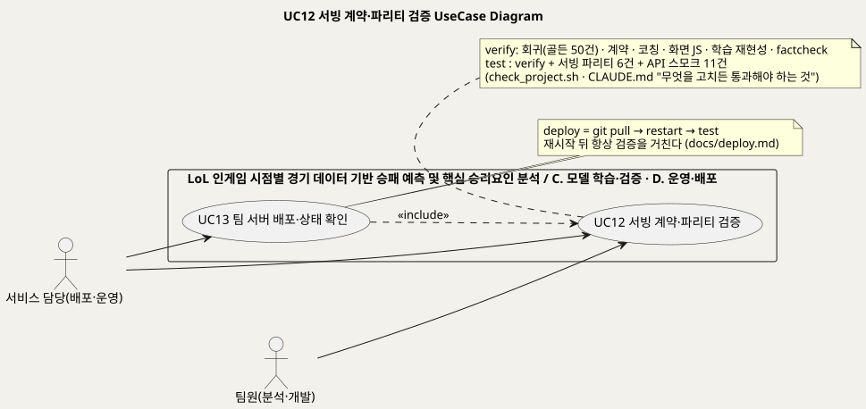
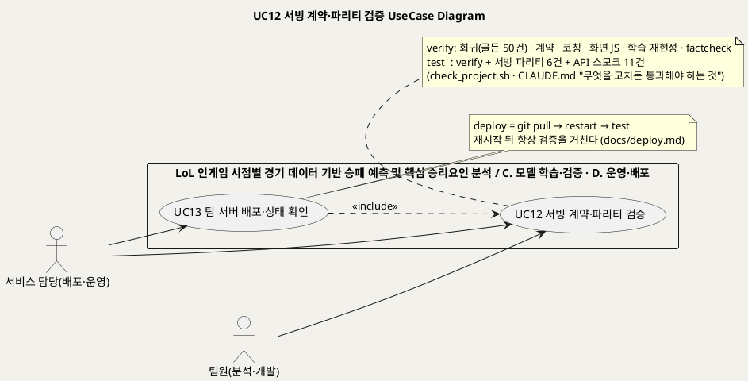
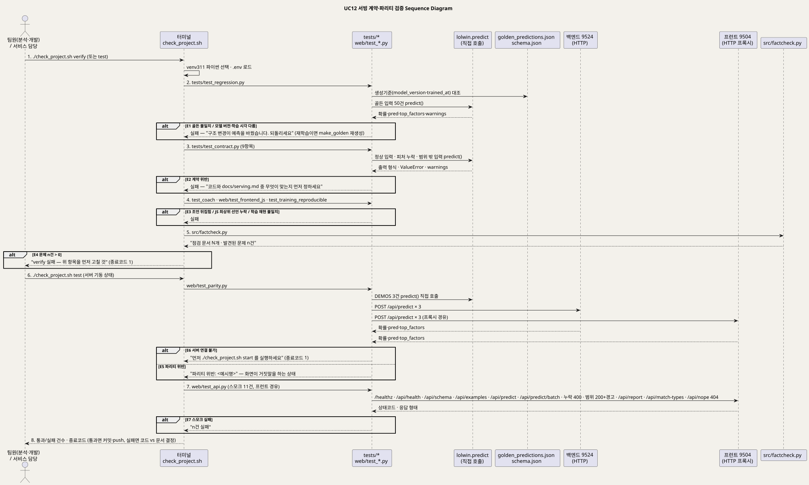
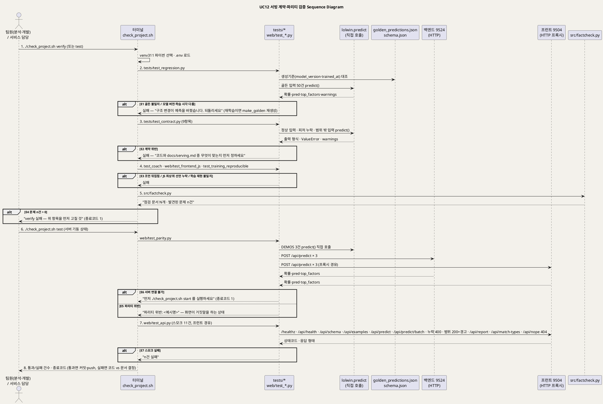

<!-- ─────────────────────────────────────────────
  UC12 상세 명세 — 무엇을 고치든 서빙 계약·파리티·문서 정합성이 유지되는지 검증하는 흐름.
  왜 필요한가: 개요(UC_00)의 목록을 구현 가능한 수준(사전·사후조건·흐름·예외·업무규칙·시퀀스)으로 내린다.
  주로 보는 사람: 팀원(구현·검수) · 서비스 담당 · Claude(검수)
  ───────────────────────────────────────────── -->

# UseCase 명세 #12 서빙 계약·파리티 검증 (C. 모델 학습·검증)
**LoL 인게임 시점별 경기 데이터 기반 승패 예측 및 핵심 승리요인 분석 · UC12 · UML 2.5.1 표준 (UseCase Diagram + UseCase 기술 + Sequence Diagram)**

---

> **문서 식별**: `docs/usecases/UC_12_서빙계약파리티검증.md`
> **작성일**: 2026-09-07 · **표준**: UML 2.5.1 (OMG)
> **원천(SoT)**: `CLAUDE.md` "무엇을 고치든 통과해야 하는 것"·"숫자를 바꿀 때" · `check_project.sh` `cmd_verify`·`cmd_test`·`cmd_deploy` · `tests/test_regression.py` · `tests/make_golden.py` · `tests/golden_predictions.json` · `tests/test_contract.py` · `tests/test_coach.py` · `tests/test_training_reproducible.py` · `tests/test_submission.py` · `web/test_parity.py` · `web/test_api.py` · `web/test_frontend_js.py` · `src/factcheck.py` · `web/app.py` `_parity`·`api_health`·`api_matches` · `docs/serving.md` 머리말·§7 · `docs/spec.md` §4 · `docs/deploy.md` "매일 / 누가 push 한 뒤"·"안 될 때" · `docs/TEAM_WORKFLOW.md` "매번 이 순서로"
> **개요 문서**: [UC_00_개요_LoL승패예측및핵심승리요인분석.md](UC_00_개요_LoL승패예측및핵심승리요인분석.md) §3 UC12 행
> **다이어그램**: 모든 PlantUML 소스는 로컬 Kroki 에서 렌더 검증 완료(HTTP 200). 렌더 결과는 `diagrams/*.svg` 로 함께 두어 로그인 없이 보인다. 뷰어 링크는 사내 서버라 SSO 로그인이 필요하다.

---

## 목차

1. [범위·개요](#1-범위개요)
2. [UseCase Diagram](#2-usecase-diagram)
3. [Actor 카탈로그](#3-actor-카탈로그)
4. [UseCase 목록 (원천 매핑)](#4-usecase-목록-원천-매핑)
5. [UseCase 기술 + Sequence Diagram](#5-usecase-기술--sequence-diagram)
6. [업무규칙(Business Rules) 종합](#6-업무규칙business-rules-종합)
7. [UML 표준 준수 노트](#7-uml-표준-준수-노트)

---

## 1. 범위·개요

이 유스케이스는 팀원이 **무엇을 고치든** 서비스가 약속(서빙 계약)을 지키고, 화면의 확률이 모델의 확률과 같으며(파리티), 문서의 수치가 근거 파일과
맞는지(정합성)를 **기계로 확인**하는 흐름이다. 저장소 규칙은 세 가지를 통과해야 한다고 못박는다 — 예측 회귀(골든 50건 완전 일치), `factcheck` 0건,
`./check_project.sh test`(서빙 파리티 + API 스모크). (근거: `CLAUDE.md` "무엇을 고치든 통과해야 하는 것")

검사는 두 층으로 나뉜다. `verify` 는 서버 없이 라이브러리·문서만으로 도는 검사(회귀·계약·코칭·화면 JS·학습 재현성·factcheck)이고 커밋 전에 먼저 돌린다.
`test` 는 `verify` 에 더해 서버가 떠 있어야 하는 검사(서빙 파리티 6건·API 스모크 11건)를 붙인다. (근거: `check_project.sh` `cmd_verify`·`cmd_test`, `docs/deploy.md`)
팀 서버 배포(UC13)는 재시작 뒤 항상 `test` 를 실행하므로, 이 UC 는 UC13 에 «include» 된다. (근거: `check_project.sh` `cmd_deploy`, `docs/deploy.md` "매일 / 누가 push 한 뒤")

이 검사들이 존재하는 이유는 하나다 — 웹에 예측 로직을 또 짜면 화면 확률과 모델 확률이 갈라져도 아무도 모른다. 파리티 테스트가 "두 계층이 같은 답을 낸다"를
증명하고, 계약 테스트가 "문서에 적은 약속을 코드가 지킨다"를 증명한다. (근거: `web/test_parity.py` 머리말, `tests/test_contract.py` 머리말, `docs/serving.md` §7)

| 항목 | 값 |
|---|---|
| 대상 시스템 | LoL 인게임 시점별 경기 데이터 기반 승패 예측 및 핵심 승리요인 분석 — 패키지 C. 모델 학습·검증 |
| 상위 프로세스 | 팀 협업 순서 — pull → 작업 → **검증** → 커밋 → push (`docs/TEAM_WORKFLOW.md` "매번 이 순서로" 2단계) · 팀 서버 배포 (UC13) |
| 원천 근거 | `CLAUDE.md` · `check_project.sh` · `tests/` · `web/test_*.py` · `src/factcheck.py` · `docs/serving.md` §7 · `docs/spec.md` §4 · `docs/deploy.md` |
| 핵심 UseCase | 1개 (UC12) — UC13 이 «include» |
| 주요 액터 | 팀원(분석·개발)(주) · 서비스 담당(배포·운영)(주) |

---

## 2. UseCase Diagram

PlantUML 소스 보기

소스를 직접 렌더하려면 **[「UC12 UseCase Diagram」 PlantUML 뷰어로 열기](https://plantuml.sumzip.com/plantuml/svg/eNqNk89LG0EUx-_7VzzSS6QYG0N7ECvaRKFFqFA8y7o7SbZudsPuxCKloLjYkkS0NqGJTcRCEFsirGZtEtBL_pQed2b-h77dNa2UHnp7M_N-fN73vZm3qWzRUkGHkpKcXivZRJFtItkbmlGULbkA67KykbPMkqGmTd204MFSaim5-Oyeh52XVfONZuQgK-sYq5MsBWqCpeXyFFTNIgrVTEOiGtUJrKaT08CdFhs2we85vH476otqlZ11RcUF_2qbn7Vh1SZpxICMJuewhCTJCsXaMVHd5l8O4-yHw532qO-7Lea2JmIg25Ahm2OvMLvDyx1gFY9VhnHmuuKgO-rzY483diL_l0VbkgI02cghVmzZXAbeHvhXVX7iAK-0-Okh6zlIdOsPXGD7Lm97wkHEgcvcBvDyUFTPgTc-8MFXYO4BiPo1r3SDB2yGH9cwG0SkMAXpBLDv52x_gG5NXr5G-KjVUR8yCYjIRv2INAZvJYC7WUDsfyQLewoc_wpMAWoWBl858FuH3R2x2wLRrCPjODIlvZMkVBEmJ-eiTCjRPw8pKUycSERPMAOzs5qh6CWVzM1JhkkJrJuUmgUws2OmTWJp2a0ZEMdVv78d93vn7NMpPH7kX3oTgQZRX4HFb2t8eBFYollj3zx48So8hLIBP-mKBmp6GdxlceBKnigbWIASmwKiRIXg4ViwP0I9wVp4v7DyHGfUwWmInS4kk3iL4fEwz1rRMl_jTiTsfJA_vbywmllMFFSIsa7HP7_nbVyI3ikfNgJ6sXft925E3eP1G-RrsHINp7Ebm5CIoUKgQyRG9BEiLVJYSyVF3dyCp5DTKBRLug4_947AIuFXDO2gGXTEZoNFPPkI7KiDFS5wcHfzDkkuXT5ssUoH4qqp2FNRXsS9BzCPFv5u6Re76dYr)** (사내 서버, SSO 로그인 필요) 또는 [로컬 Kroki 로 열기](http://192.168.0.91:8889/plantuml/svg/eNqNk89LG0EUx-_7VzzSS6QYG0N7ECvaRKFFqFA8y7o7SbZudsPuxCKloLjYkkS0NqGJTcRCEFsirGZtEtBL_pQed2b-h77dNa2UHnp7M_N-fN73vZm3qWzRUkGHkpKcXivZRJFtItkbmlGULbkA67KykbPMkqGmTd204MFSaim5-Oyeh52XVfONZuQgK-sYq5MsBWqCpeXyFFTNIgrVTEOiGtUJrKaT08CdFhs2we85vH476otqlZ11RcUF_2qbn7Vh1SZpxICMJuewhCTJCsXaMVHd5l8O4-yHw532qO-7Lea2JmIg25Ahm2OvMLvDyx1gFY9VhnHmuuKgO-rzY483diL_l0VbkgI02cghVmzZXAbeHvhXVX7iAK-0-Okh6zlIdOsPXGD7Lm97wkHEgcvcBvDyUFTPgTc-8MFXYO4BiPo1r3SDB2yGH9cwG0SkMAXpBLDv52x_gG5NXr5G-KjVUR8yCYjIRv2INAZvJYC7WUDsfyQLewoc_wpMAWoWBl858FuH3R2x2wLRrCPjODIlvZMkVBEmJ-eiTCjRPw8pKUycSERPMAOzs5qh6CWVzM1JhkkJrJuUmgUws2OmTWJp2a0ZEMdVv78d93vn7NMpPH7kX3oTgQZRX4HFb2t8eBFYollj3zx48So8hLIBP-mKBmp6GdxlceBKnigbWIASmwKiRIXg4ViwP0I9wVp4v7DyHGfUwWmInS4kk3iL4fEwz1rRMl_jTiTsfJA_vbywmllMFFSIsa7HP7_nbVyI3ikfNgJ6sXft925E3eP1G-RrsHINp7Ebm5CIoUKgQyRG9BEiLVJYSyVF3dyCp5DTKBRLug4_947AIuFXDO2gGXTEZoNFPPkI7KiDFS5wcHfzDkkuXT5ssUoH4qqp2FNRXsS9BzCPFv5u6Re76dYr) (내부망 전용). 위 그림 파일은 로그인 없이 보인다.

#### 다이어그램 쉽게 읽기 (유저 관점)

1. **누가 쓰나** — 왼쪽의 두 사람이 이 일을 한다. 팀원은 코드나 문서를 고친 뒤 검사를 돌리는 사람이고, 서비스 담당은 사이트에 새 버전을 올리기 전에 같은 검사를 돌리는 사람이다. 사이트를 구경하는 사람은 이 일을 하지 않는다.
2. **무슨 순서로** — 검사 프로그램이 여러 시험지를 차례로 푼다. 예측 답이 미리 적어 둔 정답 50개와 똑같은지, 문서에 적은 약속대로 답하는지, 코칭 조언이 말이 되는지, 화면 계산이 맞는지, 모델을 다시 공부시켜도 같은 답이 나오는지, 문서의 숫자가 근거 파일과 같은지 본다. 서버가 켜져 있으면 세 군데(코드 직접 호출·서버·화면)에서 물어본 답이 다 같은지도 본다. 하나라도 틀리면 "실패"로 끝난다.
3. **«include» = 항상 함께** — 사이트에 새 버전을 올리는 일(UC13)은 서버를 다시 켠 뒤 반드시 이 검사를 거친다. 검사를 건너뛰고 올리는 길은 없다.
4. **«extend» = 특별한 때만** — 이 그림에는 없다. 시험지 하나만 따로 풀거나(A1), 시험 경기를 눈으로 훑어보는 것(A4)은 같은 목표로 가는 다른 길이라 대체흐름에 적었다.
5. **Generalization(◁)** — 없다. 팀원과 서비스 담당은 같은 검사를 같은 방법으로 돌린다.
6. **그림에 없는 것** — 정답지 파일, 허용 범위 파일, 검사 프로그램은 시스템 안에 있는 물건이라 사람 모양으로 그리지 않는다. 바깥 회사나 서비스도 쓰지 않는다.

#### 표준 기호 범례

| 기호 | 의미 | UML 2.5.1 |
|---|---|---|
| 사람 모양 (actor) | 시스템 바깥에서 시스템을 쓰는 사람이나 다른 서비스 | Actor |
| 타원 (usecase) | 그 사람이 이루고 싶은 일 하나 | UseCase |
| 큰 사각형 (rectangle) | 우리 시스템의 울타리. 안은 우리가 만든 것, 밖은 남의 것 | Subject (System Boundary) |
| 실선 화살표 | 그 사람이 그 일을 시작한다 | Association |
| 점선 화살표 «include» | 이 일을 하면 저 일도 항상 같이 한다 | Include |

---

## 3. Actor 카탈로그

| 액터 | 구분 | 설명 | 근거 |
|---|---|---|---|
| 팀원(분석·개발) | Primary | `lolwin/`·`tests/`·`docs/` 등을 고친 뒤 커밋 전에 검사를 돌린다. 실패하면 코드와 문서 중 무엇이 맞는지 먼저 정한다 | `docs/TEAM_WORKFLOW.md` 역할 배치·"매번 이 순서로", `CLAUDE.md`, `tests/test_contract.py` 머리말 |
| 서비스 담당(배포·운영) | Primary | 팀 서버에서 `deploy` 로 pull → 재시작 → `test` 를 돌리고, 화면 숫자가 이상하면 `test` 로 파리티를 확인한다 | `docs/deploy.md` "매일 / 누가 push 한 뒤"·"안 될 때", `check_project.sh` `cmd_deploy` |
| (내부) `check_project.sh` | 시스템 구성요소 | 검사 순서·파이썬 선택·종료코드를 관리하는 진입점. 액터가 아니라 시퀀스의 lifeline | `check_project.sh` |
| (내부) `tests/golden_predictions.json` · `artifacts/schema.json` | 시스템 자산 | 시드 고정 입력 50건의 기대 출력(정답지)과 모델 버전·학습 시각. 정답지는 모델을 재학습했을 때만 다시 만든다 | `tests/make_golden.py`, `tests/test_regression.py` |
| (내부) 백엔드 9524 · 프런트 9504 | 시스템 구성요소 | 파리티·스모크가 HTTP 로 부르는 서빙 계층. 세 경로 중 두 경로 | `web/test_parity.py`, `web/test_api.py` |

이 UC 에는 Secondary Actor(외부 시스템)가 없다. 검사는 외부 API 를 부르지 않으며, 스모크 11건도 Riot 연동 엔드포인트를 포함하지 않는다. (근거: `web/test_api.py`)

---

## 4. UseCase 목록 (원천 매핑)

| UC ID | 유스케이스명 | 주액터 | 관계 | 원천 근거 |
|:--:|---|---|---|---|
| UC12 | 서빙 계약·파리티 검증 | 팀원(분석·개발) · 서비스 담당(배포·운영) | 기준 UC | `CLAUDE.md` · `check_project.sh` `cmd_verify`·`cmd_test` · `tests/` · `web/test_*.py` · `src/factcheck.py` · `docs/serving.md` §7 |
| UC13 | 팀 서버 배포·상태 확인 | 서비스 담당(배포·운영) | UC12 를 «include» | `check_project.sh` `cmd_deploy` (`restart && test`) · `docs/deploy.md` — 상세는 `UC_13_팀서버배포상태확인.md` |

---

## 5. UseCase 기술 + Sequence Diagram

### 5.1 UC12 서빙 계약·파리티 검증

> **쉽게 말하면** — 코드를 한 줄이라도 고쳤으면 "답이 예전과 똑같이 나오나"를 기계가 검사한다. 미리 적어 둔 정답 50개와 맞춰 보고,
> 문서에 적은 약속대로 답하는지 보고, 코드에서 직접 물어본 답과 서버가 준 답과 화면에 뜬 답이 세 군데 다 똑같은지 본다.
> 문서에 적은 숫자가 근거 파일과 같은지도 본다. 하나라도 어긋나면 저장도 사이트에 올리는 것도 멈춘다.

#### 유스케이스 기술

| 속성 | 내용 |
|---|---|
| **ID** | UC12 — 원천 식별자: `CLAUDE.md` "무엇을 고치든 통과해야 하는 것" · `check_project.sh` `cmd_verify`·`cmd_test` · `docs/serving.md` §7 · `docs/spec.md` §4 |
| **유스케이스명** | 서빙 계약·파리티 검증 |
| **액터** | 주액터: 팀원(분석·개발) · 서비스 담당(배포·운영). 보조액터: 없음 |
| **사전조건** | (1) 저장소가 `team` 브랜치이고 작업 변경이 로컬에 있다 (`docs/TEAM_WORKFLOW.md`). (2) `venv311`(Python 3.11, `requirements.txt` 고정 버전)이 있다 — 없으면 `venv` → `python3` 순으로 고르되 실제로 도는 파이썬만 쓴다 (`check_project.sh` 파이썬 찾기). (3) `artifacts/model.joblib` · `schema.json` · `tests/golden_predictions.json` 이 있다 (`tests/test_regression.py`). (4) `test` 경로는 백엔드 9524 · 프런트 9504 가 기동돼 있다 (`web/test_parity.py` 머리말). (5) 학습 재현성 검사는 원본 CSV 가 있을 때만 돌고 없으면 건너뛴다 (`tests/test_training_reproducible.py`). (6) `.env` 가 있으면 읽되 값은 출력하지 않는다 (`check_project.sh`) |
| **사후조건** | (1) 통과 시: 골든 50건 완전 일치 · 계약 9항목 통과 · 코칭 조언 전부 승률 상승 · 화면 JS 최상위 선언 정상 · factcheck 0건 · (test) 파리티 6건 통과 · 스모크 11건 통과, 종료코드 0. 팀원은 커밋·push 를 진행할 수 있다 (`docs/TEAM_WORKFLOW.md`). (2) 실패 시: 종료코드 1 과 실패 항목·사유가 출력되고, 변경은 커밋되지 않는다. (3) 검사는 저장소 파일을 바꾸지 않는다 — `final/` 에 `__pycache__` 를 남기지 않도록 바이트코드 생성을 끈다 (`tests/test_submission.py`) |
| **기본흐름** | ↓ 별도 기본흐름표 |
| **대체흐름** | A1. **개별 검사만 실행** — 스크립트 대신 `python tests/test_regression.py`, `python tests/test_contract.py`, `python src/factcheck.py`, `python web/test_parity.py` 를 단독으로 돌린다. 각 파일은 pytest 없이 `main()` 으로 돈다 (`tests/test_regression.py` 머리말, `CLAUDE.md`). 해당 단계만 수행된다. A2. **배포 경로에서 호출** — UC13 의 `./check_project.sh deploy` 가 `git pull --ff-only` → `restart` 뒤 `cmd_test` 를 부른다. 1단계 대신 배포 명령에서 진입하고 6~8단계가 그대로 수행된다 (`check_project.sh` `cmd_deploy`, `docs/deploy.md` "team 브랜치 pull → 재시작 → 파리티 6건 + 스모크 11건"). A3. **모델 재학습 후 정답지 재생성** — 재학습으로 `schema.json` 의 `version`·`trained_at` 이 바뀌면 2단계가 실패한다. 팀원은 `python tests/make_golden.py` 로 시드 고정 입력 50건의 정답지를 다시 만든 뒤 2단계부터 재실행한다 (`tests/make_golden.py`, `tests/test_regression.py` `test_model_identity_unchanged`, `CLAUDE.md` "바꾸면 골든 정답지도 다시"). A4. **시험셋 복기로 눈 검증** — [추론] 자동 검사와 별도로 `GET /api/matches` 로 학습에 쓰지 않은 시험셋 경기의 예측 vs 실제(`correct`·`verdict`·`top_factors` 5개·구간 `band`)를 열람해 모델이 어떤 판을 맞히고 틀리는지 사람이 확인한다. 필터 `band`·`correct`, 페이징 `limit`(최대 60)·`offset`·`seed`, 번호 조회 `id` 를 지원한다. 원천이 "검증·재현용 — 사용자 화면에서는 쓰지 않는다"고 명시하므로 이 UC 의 대체 경로로 둔다 (`docs/serving.md` §5 `/api/matches`, `web/app.py` `api_matches`·`_build_matches`). A5. **제출본 검사** — `python tests/test_submission.py` 로 `final/` 이 정확히 6개 파일인지, `final/5_predict.py` 가 `lolwin` 없이 단독 실행되는지, 정본 `lolwin.predict` 와 DEMOS 3건에서 같은 결과를 내는지, README 상대링크가 살아 있는지, 스키마 피처 수와 모델 입력 차원이 같은지 확인한다. `check_project.sh` 순서에는 없어 따로 돌린다 (`tests/test_submission.py`). A6. **기동 시 자가 파리티** — 백엔드는 기동할 때 DEMOS 3건으로 `predict()` 를 두 번 불러 차이 0 을 실측하고 `/api/health` 의 `parity` 로 보고한다. 스모크 2번 항목이 `parity.passed` 를 확인한다 (`web/app.py` `_parity`·`api_health`, `web/test_api.py`) |
| **예외흐름** | E1. **골든 불일치** — 2단계에서 50건 중 하나라도 확률·`pred`·승리요인(피처·기여도 순서)·경고 개수가 정답지와 다르면 실패. 메시지 "구조 변경이 예측을 바꿨습니다. 되돌리세요". 모델 버전·학습 시각이 정답지 생성기준과 다르면 "재학습했다면 정답지를 다시 만드세요"(A3) (`tests/test_regression.py`). E2. **계약 위반** — 3단계에서 출력 필드·확률 범위·4자리 반올림·`pred` 임계값·`top_factors` 5개·내림차순·방향 표기·누락 예외·범위 경고·정상 무경고·`schema.json` 피처 = `DIFF13`·CSV 텍스트 열·랭킹 puuid 없음 중 하나라도 어긋나면 실패. 메시지 "코드와 docs/serving.md 중 무엇이 맞는지 먼저 정하세요" (`tests/test_contract.py`). E3. **코칭·화면·재현성 실패** — 4단계에서 코칭 조언이 승률을 내리거나(순진한 계수 계산이 실제로 뒤집히는지도 함께 검사), 화면 JS 의 최상위 선언이 함수 안에 갇혀 있거나(과거 실제 배포 사고), 학습 재현이 배포본과 어긋나면 실패 (`tests/test_coach.py`, `web/test_frontend_js.py`, `tests/test_training_reproducible.py`). E4. **문서 정합성 위반** — 5단계에서 깨진 링크·없는 파일 언급·산출물 6종 누락·홀드아웃 수치 불일치·피처/SQL 뷰 불일치·`runs.csv` 열 어긋남·폐기된 이름·킬 계수·대표 정확도·`requirements.txt` 누락·저장소 주소·파이썬 버전·`model_card.md` 유효 범위 중 하나라도 걸리면 n건으로 보고. 팀원은 근거 파일(`reports/tables/` CSV)부터 다시 만들고 문서를 고친다 — 반대로 하지 않는다 (`src/factcheck.py`, `CLAUDE.md` "숫자를 바꿀 때"). E5. **파리티 위반** — 6단계에서 직접 호출과 HTTP 응답의 확률·`pred`·요인 순서가 다르면 "파리티 위반: <예시명>" 으로 중단. 화면이 거짓말을 하는 상태이므로 `predict.py` 를 누가 고쳤는지 `git log -- predict.py` 로 본다 (`web/test_parity.py`, `docs/serving.md` §7, `docs/deploy.md` "화면 숫자가 이상하다"). E6. **서버 미기동** — 6단계에서 백엔드·프런트에 연결할 수 없으면 "먼저 './check_project.sh start' 를 실행하세요" 로 종료코드 1 (`web/test_parity.py`). E7. **스모크 실패** — 7단계에서 11건 중 실패가 있으면 "n건 실패". 해당 엔드포인트의 응답 형태(피처 13개·예시 3건·요인 5개·404 등)를 확인한다 (`web/test_api.py`). E8. **아무것도 못 잡는 검사 규칙** — 새 검사 규칙을 추가했을 때 틀린 값을 넣어도 통과하면 규칙이 무의미하다. 반드시 틀린 값을 넣어 잡히는지 확인한다 — 과거에 아무것도 못 잡는 정규식을 두 번 만들었다 (`CLAUDE.md`, `src/factcheck.py` 주석 "초판 버그") |
| **포함/확장** | UC13 팀 서버 배포·상태 확인 이 이 UC 를 «include» (재시작 뒤 항상 `test`). «extend» 없음 |
| **우선순위** | High — 저장소 규칙이 "무엇을 고치든 통과해야 하는 것"으로 못박은 유일한 관문이며, 파리티가 깨지면 화면이 거짓말을 한다. 발표 순간까지 서비스가 살아 있어야 한다는 팀 목표의 전제다 (`CLAUDE.md`, `docs/serving.md` §7, `docs/TEAM_WORKFLOW.md` "남은 일") |
| **사용빈도** | 커밋마다 1회(`verify` 또는 `test`, 서비스·`predict.py` 를 건드렸을 때) · 팀 서버 배포마다 1회(`deploy` 가 `test` 포함) · 발표 당일 재시작 뒤 1회 (`docs/TEAM_WORKFLOW.md` "매번 이 순서로", `docs/deploy.md` "매일 / 누가 push 한 뒤"·"발표 당일"). 절대 횟수는 자료 없음 — 확인 필요 |
| **업무규칙** | BR-VER-01 ~ BR-VER-10 (§6) |
| **특별 요구사항** | (1) **환경** — Python 3.11 + `requirements.txt` 고정 버전. `python3` 이름의 스토어 스텁을 피하려고 "실제로 도는지"로 파이썬을 고른다 (`check_project.sh`). (2) **서버 없이 도는 검사와 필요한 검사 분리** — `verify` 는 서버 없이, `test` 는 9524·9504 기동 필요 (`check_project.sh`). (3) **비밀값 비출력** — `.env` 는 읽되 값을 출력하지 않는다 (`check_project.sh`). (4) **공개 산출물 정책** — 커밋되는 CSV·API 응답에 puuid 를 넣지 않는다. 한 번 커밋되면 히스토리에 남는다 (`tests/test_contract.py` `test_ranking_has_no_puuid`). (5) **정답지 비교는 원값** — 반올림 전 값이 아니라 `predict()` 가 돌려준 값을 그대로 비교해 미세한 변화도 잡는다 (`tests/make_golden.py`). (6) **채점자 환경 재현** — 제출본 검사는 `sys.path` 와 editable finder 를 지운 하위 프로세스로 돌려 `lolwin` 이 없는 환경을 흉내 낸다 (`tests/test_submission.py`). (7) 검사 소요 시간 목표·CI 연동: 자료 없음 — 확인 필요 |
| **비고** | 원천 추적성 — `CLAUDE.md` "무엇을 고치든 통과해야 하는 것"·"규칙을 새로 만들면"·"숫자를 바꿀 때"·"손대면 안 되는 것" · `check_project.sh` `cmd_verify`(6항목)·`cmd_test`(파리티·스모크)·`cmd_deploy` · `tests/test_regression.py`(골든 50건·모델 동일성) · `tests/make_golden.py`(시드 고정 50건) · `tests/test_contract.py`(9항목) · `tests/test_coach.py` · `tests/test_training_reproducible.py` · `tests/test_submission.py`(제출본 6개) · `web/test_parity.py`(DEMOS 3건 × 백엔드·프런트 = 6건) · `web/test_api.py`(스모크 11건) · `web/test_frontend_js.py` · `src/factcheck.py`(점검 1~8 + 유효 범위) · `web/app.py` `_parity`·`api_health`·`api_matches`(253~326행) · `docs/serving.md` 머리말·§7 · `docs/spec.md` §4 "서빙 파리티"·"아티팩트 검증" · `docs/deploy.md` "매일 / 누가 push 한 뒤"·"안 될 때" · `docs/TEAM_WORKFLOW.md` "매번 이 순서로". 파리티 6건 = 예시 3건 × 경로 2(백엔드 직접·프런트 프록시), 스모크 11건 = `web/test_api.py` 의 `check` 11회 |

#### 기본흐름 (Basic Flow)

| 단계 | 액터 행위 | 시스템 행위 |
|:--:|---|---|
| 1 | 팀원이 코드·문서를 고친 뒤 프로젝트 폴더에서 `./check_project.sh verify` 를 실행한다 (서버가 떠 있으면 `test`) | 스크립트가 `venv311` → `venv` → `python3` → `python` 순으로 실제로 도는 파이썬을 고르고, `.env` 가 있으면 값을 출력하지 않은 채 읽은 뒤 검사를 순서대로 시작한다 |
| 2 | — (출력을 지켜본다) | **예측 회귀** — `tests/test_regression.py` 가 `schema.json` 의 `version`·`trained_at` 이 정답지 생성기준과 같은지 본 뒤(E1), 골든 입력 50건을 `predict()` 에 넣어 확률·`pred`·승리요인(피처·기여도 순서)·경고 개수가 정답지와 완전히 같은지 대조한다(E1) |
| 3 | — | **서빙 계약** — `tests/test_contract.py` 가 9항목을 검사한다: `schema.json` 피처 = `DIFF13`, 출력 필드·형, `pred` 임계값 0.5, `top_factors` 5개·절대값 내림차순·방향 표기, 피처 누락 시 `ValueError`, 범위 밖 입력은 경고와 함께 반환, 정상 입력 무경고, CSV 이름·태그 문자열 유지, 랭킹 CSV 에 puuid 없음(E2) |
| 4 | — | **코칭·화면·재현성** — `tests/test_coach.py`(모든 조언이 승률을 올리는가, 순진한 계산은 실제로 뒤집히는가), `web/test_frontend_js.py`(최상위 선언·그리드 칸 수·node 부팅), `tests/test_training_reproducible.py`(원본 CSV 가 있을 때만, 배포본과 같은 모델이 나오는가)를 돌린다(E3) |
| 5 | — | **문서·수치 정합성** — `src/factcheck.py` 가 `README.md`·`model_card.md`·`STUDY.md`·`CLAUDE.md`·`docs/**`·`reports/**` 의 링크·파일 언급·산출물 6종·홀드아웃 수치·피처/SQL 뷰·`runs.csv`·폐기된 이름·킬 계수·대표 정확도·`requirements.txt`·저장소 주소·파이썬 버전·`model_card.md` 유효 범위를 대조해 "점검 문서 N개 · 발견된 문제 n건"을 출력한다(E4). 여기까지가 `verify` 이며 실패가 있으면 "verify 실패 — 위 항목을 먼저 고칠 것"으로 종료코드 1 |
| 6 | 팀원이 서버가 떠 있는지 확인하고(`./check_project.sh status`) `./check_project.sh test` 를 실행한다 (`test` 는 1~5단계를 포함해 다시 돈다) | **서빙 파리티** — `web/test_parity.py` 가 예시 3건마다 `predict()` 직접 호출 결과와 백엔드(9524)·프런트 프록시(9504)의 `POST /api/predict` 응답을 비교해 확률·`pred`·요인 순서가 같은지 6건을 확인한다(E5·E6). 하나라도 어긋나면 중단 |
| 7 | — | **API 스모크** — `web/test_api.py` 가 프런트를 통해 11건을 확인한다: `/healthz` 백엔드 연결, `/api/health` 상태·기동 시 파리티 통과, `/api/schema` 피처 13개, `/api/examples` 3건, `/api/predict` 블루 우세 예시(요인 5개), `/api/predict/batch` 3건(단건과 같은 확률), 누락 피처 400, 범위 밖 200+경고, `/api/report` 구간·승리요인, `/api/match-types` 4유형, 없는 경로 404(E7) |
| 8 | 팀원이 통과·실패 건수를 읽는다. 전부 통과면 커밋·push 로 넘어가고, 실패면 코드와 `docs/serving.md` 중 무엇이 맞는지 먼저 정한 뒤 고쳐서 1단계부터 다시 돌린다 | 스크립트가 항목별 `[통과]`/`[실패]` 와 사유, 마지막에 "전부 통과" 또는 "n건 실패"를 출력하고 종료코드(0/1)를 돌려준다 |

#### Sequence Diagram

PlantUML 소스 보기

소스를 직접 렌더하려면 **[「UC12 Sequence Diagram」 PlantUML 뷰어로 열기](https://plantuml.sumzip.com/plantuml/svg/eNqNVl1PG0cUfd9fceW-2GnwBx9JE1VRFGInqtQGBdonJGtZL-Bg77q7a1L6ZMSmpZgoprGDadfUtE4gkasuBoJRQZXoP-njzux_6J3Z9aeI2seduffOnXPOPbN3dUPUjHw2A3kpNprU5a_zsiLJgr6UVnKiJmZhTpSWFjQ1r6Qm1YyqwUeJsUQsfq8vQl8UU-rTtLIA82JGlwUjbWRk-HIyNgrUtMjZDjhHJq1cXJ66m5vkTdMt2uC0CvRNDab98-B-WlzAWoIgSgYeEnA3C_TnUpC8N6lZuzx1bIvYVmhWiXglTbrRAFI8JsWzAIg63JeXBWzGSEvpnKgYmG_a5I82MUuzirQoS0vJnKY-kSUjrC_yhOmHg_GGrBt65Nqs8lSei7CP5LVwboWHzgxGZtQM3jWc0-RUWjJmlSDdX6X1LXCrbfreCvGUqceDOQtqJiUrST8nrSp6-ImuKrOKjs1lRf7BEx8M5hH7kG6XyUsLbk2MjuNZD2dmprwj7sWHLlw2yS-2u9HG0GgnFNjqXo0W_b4SQ0m6JkXmEXEOUee-iUlBQDxh5A6iBLchFoZwZBhEWJa19PwKBEm1RDbKwCALCRjfyVqWleWxWAyQclo7ps-bSFzdXavB5SmEcQ_InoUX81NmMGM0DB4LHH5NXtBkXUessC9hhgU9wCC6VqPmodO2aaMQzKopOZPETljY5amhiWlFTiVFIwQE9bNne3lTjzHROTogL-tAd5-R-muYiDqHx-DzEQwJGDLit-HuVMjr-uUp28Saai45zzWpX54-FTUFZa4LYsaAeKxTk7xfp7VzelaFCJB3B-R5G0jLpHUTBV_ZoRsngAQ49ioKtkHemALgOSMdnGix4W4ewD-FMgSckyY2DeSo4LQuEDWg1XXa3qM1E4hddv46wFqkuI5lwkBKVfKCTRM12_SncgCCdLfpHYeZ5O0xZMUlOekpD6_d9JALCbKS6gN9bAB0SVUQRCQ4h8zeciu_k3dvQ30g0nqFrq12QEQm3fI5bVWBrJukdsEWSKtMLdbuq07UlSDjpLA9t1qhRS6Jr8RMXo5rGs4-fg0CPer7B2BlYlc_jB-9YLNCdwqQUiU9osvaMlYJZ1NAG1tAmsd0-3sGK9nfRc3S_QKQg3NaL7B7uZWqj-QQQuMeQoiNKC3y5joOMa8hXBicfKKzdb7GNYiHon5xWFJ5KT2Xkb1rjAGSS1-hOH5s0P0td5fp5bNpoCcWgspQwwnh-x6aEeioB4mtmj2ZXQVAX9OJSVydCMPwcAu40c0K0HoJPRhBaaOhwhdosJw-23JaTVKy-EbdAgXnJOD1P96_Bncgin2wE7Ekswus6XtCHyXsVp6MuIg9tJ2jOj2r4xOwxlT76zPy26bHHMQ8efa7z40r3Ydhjbn4FLRMQDcgL3bQGlbdNSvUR12XKTS9tLHSNRKu5fvxzx9Nw9iAD8CAl3vB9-IYPPVoegYiYi4d8WPh720Y8wISHw6AYNeAgY20VQ8JWO8_rUZI_J8gzsoN8FGg27bTsplKHLswKJGAD_wVQPLnH8jrc87aqx96Y3AFNfi4Q3wCeq_4VQMZGN6-DZ8yHyta5N2zOwEuC3enjA7FRtE5tOn-S7JfYvrAw9lb4hE5NIY3wz06EWbuUPgTgH7rrjYhFkMer0PvEeyg3WMosigjYIvfMplzorzv7qf3FHc_5W_EbC4j692FDq9D35E50fB8wR_b8Wi0zwhHo9GPsReUfDcRnUHVenWyLH_EWMn1naWoORkLjffrwEPFZwMDaW2LFE-YhTKwuBZuQg8R3xYGqeGT6-30bK47v5-Ewf3uxDk6j_gTjNF0vcoP65dC0Itibwz9s0HsIoozry9e9yvzdS9yWe8YDEoTTTYk3MVT8W9T-BcwCrni)** (사내 서버, SSO 로그인 필요) 또는 [로컬 Kroki 로 열기](http://192.168.0.91:8889/plantuml/svg/eNqNVl1PG0cUfd9fceW-2GnwBx9JE1VRFGInqtQGBdonJGtZL-Bg77q7a1L6ZMSmpZgoprGDadfUtE4gkasuBoJRQZXoP-njzux_6J3Z9aeI2seduffOnXPOPbN3dUPUjHw2A3kpNprU5a_zsiLJgr6UVnKiJmZhTpSWFjQ1r6Qm1YyqwUeJsUQsfq8vQl8UU-rTtLIA82JGlwUjbWRk-HIyNgrUtMjZDjhHJq1cXJ66m5vkTdMt2uC0CvRNDab98-B-WlzAWoIgSgYeEnA3C_TnUpC8N6lZuzx1bIvYVmhWiXglTbrRAFI8JsWzAIg63JeXBWzGSEvpnKgYmG_a5I82MUuzirQoS0vJnKY-kSUjrC_yhOmHg_GGrBt65Nqs8lSei7CP5LVwboWHzgxGZtQM3jWc0-RUWjJmlSDdX6X1LXCrbfreCvGUqceDOQtqJiUrST8nrSp6-ImuKrOKjs1lRf7BEx8M5hH7kG6XyUsLbk2MjuNZD2dmprwj7sWHLlw2yS-2u9HG0GgnFNjqXo0W_b4SQ0m6JkXmEXEOUee-iUlBQDxh5A6iBLchFoZwZBhEWJa19PwKBEm1RDbKwCALCRjfyVqWleWxWAyQclo7ps-bSFzdXavB5SmEcQ_InoUX81NmMGM0DB4LHH5NXtBkXUessC9hhgU9wCC6VqPmodO2aaMQzKopOZPETljY5amhiWlFTiVFIwQE9bNne3lTjzHROTogL-tAd5-R-muYiDqHx-DzEQwJGDLit-HuVMjr-uUp28Saai45zzWpX54-FTUFZa4LYsaAeKxTk7xfp7VzelaFCJB3B-R5G0jLpHUTBV_ZoRsngAQ49ioKtkHemALgOSMdnGix4W4ewD-FMgSckyY2DeSo4LQuEDWg1XXa3qM1E4hddv46wFqkuI5lwkBKVfKCTRM12_SncgCCdLfpHYeZ5O0xZMUlOekpD6_d9JALCbKS6gN9bAB0SVUQRCQ4h8zeciu_k3dvQ30g0nqFrq12QEQm3fI5bVWBrJukdsEWSKtMLdbuq07UlSDjpLA9t1qhRS6Jr8RMXo5rGs4-fg0CPer7B2BlYlc_jB-9YLNCdwqQUiU9osvaMlYJZ1NAG1tAmsd0-3sGK9nfRc3S_QKQg3NaL7B7uZWqj-QQQuMeQoiNKC3y5joOMa8hXBicfKKzdb7GNYiHon5xWFJ5KT2Xkb1rjAGSS1-hOH5s0P0td5fp5bNpoCcWgspQwwnh-x6aEeioB4mtmj2ZXQVAX9OJSVydCMPwcAu40c0K0HoJPRhBaaOhwhdosJw-23JaTVKy-EbdAgXnJOD1P96_Bncgin2wE7Ekswus6XtCHyXsVp6MuIg9tJ2jOj2r4xOwxlT76zPy26bHHMQ8efa7z40r3Ydhjbn4FLRMQDcgL3bQGlbdNSvUR12XKTS9tLHSNRKu5fvxzx9Nw9iAD8CAl3vB9-IYPPVoegYiYi4d8WPh720Y8wISHw6AYNeAgY20VQ8JWO8_rUZI_J8gzsoN8FGg27bTsplKHLswKJGAD_wVQPLnH8jrc87aqx96Y3AFNfi4Q3wCeq_4VQMZGN6-DZ8yHyta5N2zOwEuC3enjA7FRtE5tOn-S7JfYvrAw9lb4hE5NIY3wz06EWbuUPgTgH7rrjYhFkMer0PvEeyg3WMosigjYIvfMplzorzv7qf3FHc_5W_EbC4j692FDq9D35E50fB8wR_b8Wi0zwhHo9GPsReUfDcRnUHVenWyLH_EWMn1naWoORkLjffrwEPFZwMDaW2LFE-YhTKwuBZuQg8R3xYGqeGT6-30bK47v5-Ewf3uxDk6j_gTjNF0vcoP65dC0Itibwz9s0HsIoozry9e9yvzdS9yWe8YDEoTTTYk3MVT8W9T-BcwCrni) (내부망 전용). 위 그림 파일은 로그인 없이 보인다.

기본흐름 8단계와 시퀀스의 번호 메시지가 1:1 로 대응한다. 대체흐름 A1 은 2~7단계 중 하나만, A2 는 배포 명령에서 6~8단계로, A3 은 정답지 재생성 뒤 2단계부터 진입한다. A4(시험셋 복기)·A5(제출본 검사)·A6(기동 시 자가 파리티)은 별도 경로라 시퀀스에는 그리지 않았다.

---

## 6. 업무규칙(Business Rules) 종합

| BR ID | 규칙 | 적용 UC | 근거 |
|---|---|---|---|
| BR-VER-01 | 무엇을 고치든 세 가지를 통과해야 한다 — 예측 회귀(골든 50건 완전 일치) · `factcheck` 0건 · `./check_project.sh test`(서빙 파리티 + API 스모크). 통과 전에는 커밋·push 하지 않는다 | UC12 | `CLAUDE.md` "무엇을 고치든 통과해야 하는 것", `docs/TEAM_WORKFLOW.md` "매번 이 순서로" |
| BR-VER-02 | 골든 정답지는 시드 고정 입력 50건이며 확률·`pred`·승리요인(피처·기여도 순서)·경고 개수를 **원값 그대로** 비교한다. 정답지는 모델을 재학습했을 때만 다시 만들고, `schema.json` 의 버전·학습 시각이 정답지 생성기준과 다르면 검사가 멈춘다 | UC12 | `tests/make_golden.py`, `tests/test_regression.py`, `CLAUDE.md` "손대면 안 되는 것" |
| BR-VER-03 | 직접 호출·백엔드·프런트 프록시 **세 경로의 확률·`pred`·요인 순서가 같아야 한다.** 하나라도 어긋나면 화면이 거짓말을 하는 것이므로 배포하지 않는다 | UC12 | `docs/serving.md` §7, `docs/spec.md` §4 "서빙 파리티", `web/test_parity.py` |
| BR-VER-04 | 서빙 계약(입력·출력·에러 규약)을 바꾸려면 **버전을 올리고 `tests/test_contract.py` 를 함께 고친다.** 계약 검사가 막히면 코드를 고칠지 문서를 고칠지 먼저 정한다 | UC12 | `docs/serving.md` 머리말, `tests/test_contract.py` 머리말 |
| BR-VER-05 | 문서 수치는 전부 `reports/tables/` 의 CSV 가 근거다. 수치가 바뀌면 **근거 파일부터 다시 만들고** 문서를 고친다. `factcheck` 는 0건이어야 한다 | UC12 | `CLAUDE.md` "숫자를 바꿀 때", `src/factcheck.py` |
| BR-VER-06 | 검사 규칙을 새로 만들면 **반드시 틀린 값을 넣어 잡히는지 확인한다.** 아무것도 못 잡는 규칙은 통과해도 의미가 없다 | UC12 | `CLAUDE.md` "규칙을 새로 만들면", `tests/test_coach.py`(순진한 계산이 실제로 뒤집히는지 함께 검사) |
| BR-VER-07 | 예측 로직의 단일 진실은 `lolwin.predict`(진입점 `predict.py`) 하나다. `web/` 에는 `sklearn`·`joblib` import 가 없어야 하며, 파리티가 깨졌으면 `git log -- predict.py` 로 누가 고쳤는지 본다 | UC12 | `docs/plan.md` §3 Constitution 5, `docs/serving.md` §6, `docs/deploy.md` "안 될 때" |
| BR-VER-08 | 커밋되는 CSV 와 API 응답에 **puuid 를 넣지 않는다**(Riot 정책, 히스토리에 남음). CSV 의 이름·태그는 문자열로 유지한다 — 태그 "0223" 을 숫자로 읽으면 앞자리 0 이 사라진다 | UC12 | `tests/test_contract.py` `test_ranking_has_no_puuid`·`test_csv_keeps_text_columns_as_text` |
| BR-VER-09 | `artifacts/model.joblib` · `schema.json` 은 재학습 없이 바꾸지 않는다. 바꾸면 골든 정답지도 다시 만든다 | UC12 | `CLAUDE.md` "손대면 안 되는 것", `tests/test_regression.py` `test_model_identity_unchanged` |
| BR-VER-10 | `verify` 는 서버 없이 도는 검사(회귀·계약·코칭·화면 JS·학습 재현성·factcheck)로 **커밋 전에 먼저** 돌리고, `test` 는 서버 기동 상태에서 파리티·스모크를 더한다. 배포는 재시작 뒤 항상 `test` 를 거친다 | UC12 | `check_project.sh` `cmd_verify`·`cmd_test`·`cmd_deploy`, `docs/deploy.md` |

---

## 7. UML 표준 준수 노트

| 항목 | 적용 |
|---|---|
| UseCase Diagram | Subject(시스템 경계)를 `rectangle` 로, 주액터 둘을 경계 밖 왼쪽에 두었다. UC13 → UC12 는 배포 시 항상 발생하므로 «include» 로 표기했다 (UML 2.5.1 §18.1.3 Include) |
| UseCase 기술 | 14속성 세로형 표. 사전·사후조건은 "참이어야 할 상태 / 보장되는 상태"로 적었고 대체(A)·예외(E) 흐름을 번호로 분리했다 |
| Sequence Diagram | 기본흐름 8단계와 번호 메시지 1:1. 예외 E1~E7 은 `alt` 결합 프래그먼트로 표현했고, 직접 호출·백엔드·프런트 세 경로를 별도 lifeline 으로 분리해 파리티의 의미가 보이게 했다 (UML 2.5.1 §17.6 CombinedFragment) |
| 내부 구성요소 | 검사 스크립트·정답지·서빙 계층은 액터가 아니므로 UseCase Diagram 에서는 note 로만 언급하고 Sequence Diagram 의 lifeline 으로 그렸다 |
| 추적성 | 모든 흐름·규칙에 원천(문서 절·파일·함수)을 붙였고, 원천에 없는 판단은 `[추론]`, 없는 자료는 `자료 없음 — 확인 필요` 로 남겼다 |

---

*표기 표준: UML 2.5.1 (OMG). 서식 정본: usecase 스킬 `references/format-spec.md`. 개요 문서: [UC_00_개요_LoL승패예측및핵심승리요인분석.md](UC_00_개요_LoL승패예측및핵심승리요인분석.md). 이전 문서: `UC_11_모델재현재학습.md` · 다음 문서: `UC_13_팀서버배포상태확인.md`.*
