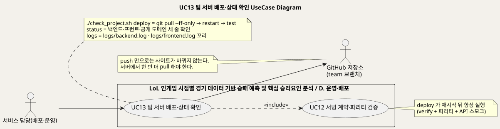
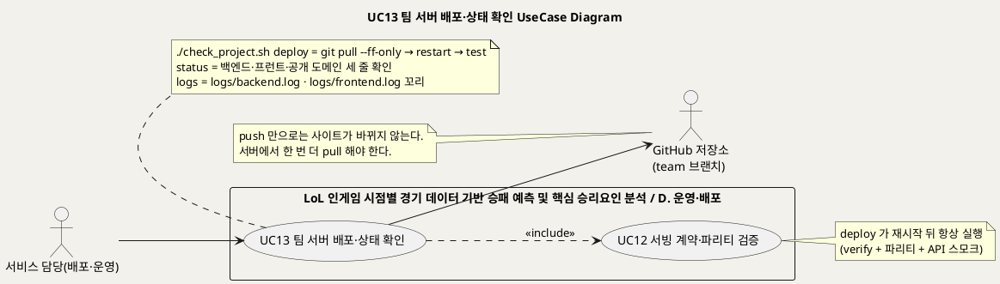
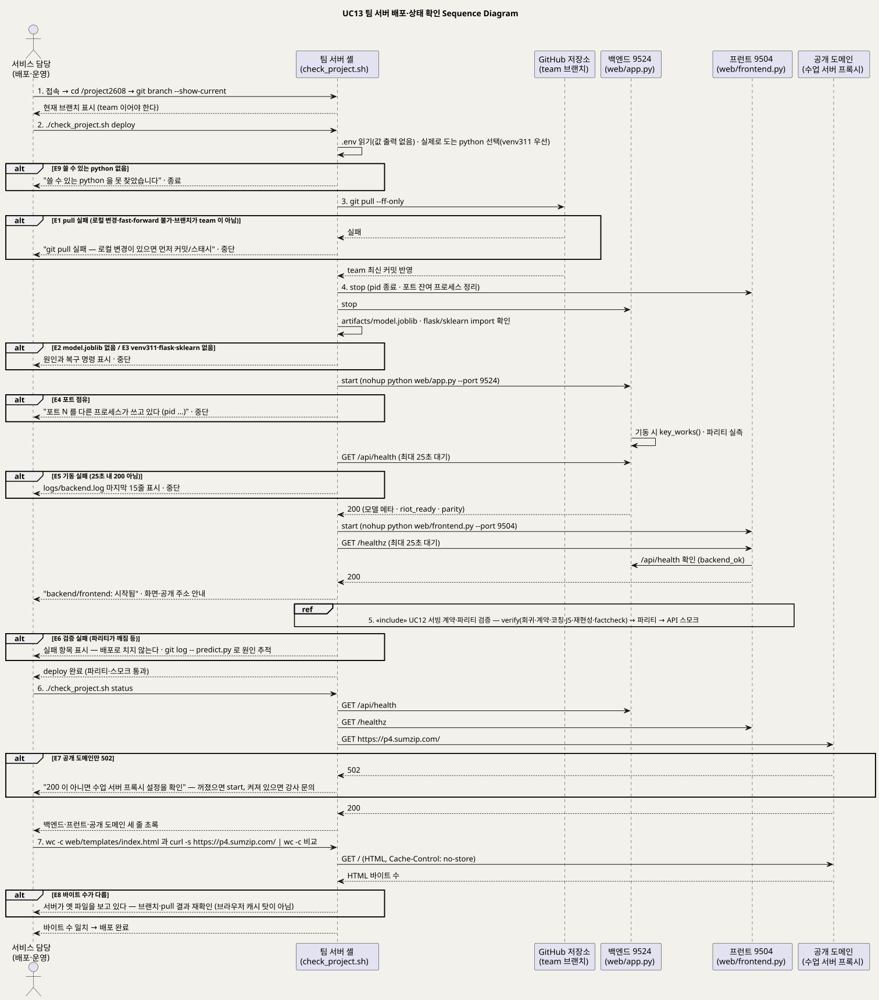
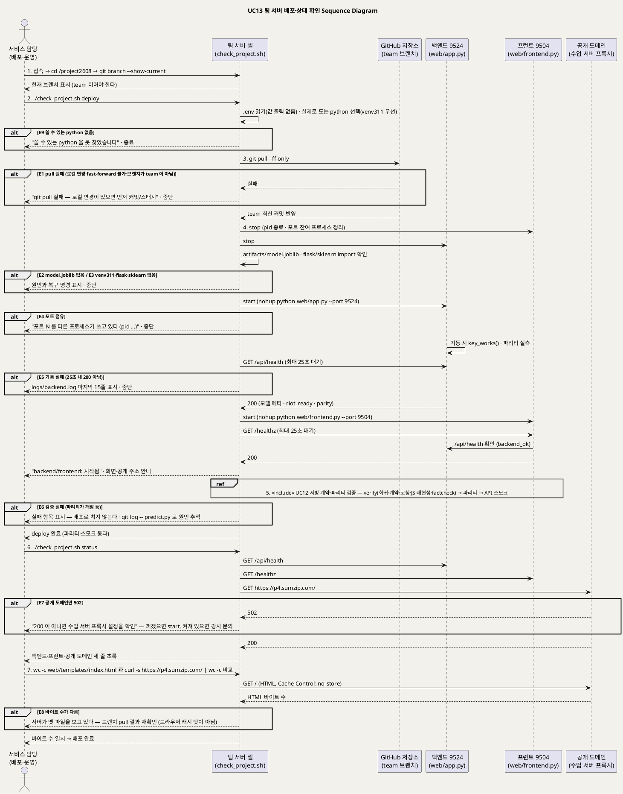

<!-- ─────────────────────────────────────────────
  UC13 상세 명세 — 팀 서버에 최신 코드를 올리고 살아 있는지 확인하는 흐름.
  왜 필요한가: 개요(UC_00)의 목록을 구현 가능한 수준(사전·사후조건·흐름·예외·업무규칙·시퀀스)으로 내린다.
  주로 보는 사람: 서비스 담당(배포·운영) · Claude(검수)
  ───────────────────────────────────────────── -->

# UseCase 명세 #13 팀 서버 배포·상태 확인 (D. 운영·배포)
**LoL 인게임 시점별 경기 데이터 기반 승패 예측 및 핵심 승리요인 분석 · UC13 · UML 2.5.1 표준 (UseCase Diagram + UseCase 기술 + Sequence Diagram)**

---

> **문서 식별**: `docs/usecases/UC_13_팀서버배포상태확인.md`
> **작성일**: 2026-09-07 · **표준**: UML 2.5.1 (OMG)
> **원천(SoT)**: `docs/deploy.md` 전문 · `check_project.sh` 전문(`cmd_deploy`·`cmd_start`·`cmd_stop`·`cmd_status`·`cmd_logs`·`cmd_test`·`cmd_verify`·`start_one`·`stop_one`) · `docs/troubleshooting.md` 3번 · `docs/TEAM_WORKFLOW.md` "브랜치 규칙"·"팀 서버(공개 서비스)에 반영하기"·"제출 시점에 team → main 합치기" · `docs/HANDOFF.md` "② 서버 배포" · `web/frontend.py` `index`·`_no_cache_html`·`healthz` · `web/app.py` `api_health`
> **개요 문서**: [UC_00_개요_LoL승패예측및핵심승리요인분석.md](UC_00_개요_LoL승패예측및핵심승리요인분석.md) §3 UC13 행
> **다이어그램**: 모든 PlantUML 소스는 로컬 Kroki 에서 렌더 검증 완료(HTTP 200). 렌더 결과는 `diagrams/*.svg` 로 함께 두어 로그인 없이 보인다. 뷰어 링크는 사내 서버라 SSO 로그인이 필요하다.

---

## 목차

1. [범위·개요](#1-범위개요)
2. [UseCase Diagram](#2-usecase-diagram)
3. [Actor 카탈로그](#3-actor-카탈로그)
4. [UseCase 목록 (원천 매핑)](#4-usecase-목록-원천-매핑)
5. [UseCase 기술 + Sequence Diagram](#5-usecase-기술--sequence-diagram)
6. [업무규칙(Business Rules) 종합](#6-업무규칙business-rules-종합)
7. [UML 표준 준수 노트](#7-uml-표준-준수-노트)

---

## 1. 범위·개요

이 유스케이스는 서비스 담당이 **팀 서버(내부망 맥)** 에 `team` 브랜치의 최신 코드를 올리고, 백엔드·프런트·공개 도메인이 살아 있는지 확인하는 흐름이다.
GitHub 에 push 했다고 사이트가 바뀌지 않는다. 서버에서 `./check_project.sh deploy` 를 한 번 더 실행해야 하며, 이 명령은
`git pull --ff-only` → 재시작 → 테스트(파리티·스모크) 순서로 돈다. (근거: `docs/deploy.md` "매일 / 누가 push 한 뒤", `docs/TEAM_WORKFLOW.md` "팀 서버(공개 서비스)에 반영하기", `check_project.sh` `cmd_deploy`)

공개 주소 https://p4.sumzip.com 은 수업 서버 프록시가 팀 서버의 **프런트 9504** 로 넘겨 주고, 프런트가 `/api/*` 를 **백엔드 9524** 로 중계하므로
바깥에 열린 문은 9504 하나뿐이다. 배포 확인은 눈이 아니라 바이트로 한다 — 로컬 `web/templates/index.html` 의 크기와 라이브 응답의 크기가 같아야 배포된 것이다.
(근거: `docs/deploy.md` 머리말·"매일 / 누가 push 한 뒤", `docs/troubleshooting.md` 3번)
재시작 뒤 테스트는 항상 돌기 때문에 UC12(서빙 계약·파리티 검증)를 «include» 한다. (근거: `check_project.sh` `cmd_deploy` — `cmd_restart && cmd_test`)

| 항목 | 값 |
|---|---|
| 대상 시스템 | LoL 인게임 시점별 경기 데이터 기반 승패 예측 및 핵심 승리요인 분석 — 패키지 D. 운영·배포 |
| 상위 프로세스 | 팀 협업 흐름 — 작업(`team` 브랜치 pull/push) → 팀 서버 반영(이 UC) → 제출 스냅샷(`team` → `main` 병합, 리허설 통과 후) (`docs/TEAM_WORKFLOW.md`) |
| 원천 근거 | `docs/deploy.md` · `check_project.sh` · `docs/troubleshooting.md` 3번 · `docs/TEAM_WORKFLOW.md` · `docs/HANDOFF.md` "② 서버 배포" |
| 핵심 UseCase | 1개 (UC13) + 포함 UC 1개 (UC12 서빙 계약·파리티 검증) |
| 주요 액터 | 서비스 담당(배포·운영)(주) · GitHub 저장소(보조) |

---

## 2. UseCase Diagram

PlantUML 소스 보기

소스를 직접 렌더하려면 **[「UC13 UseCase Diagram」 PlantUML 뷰어로 열기](https://plantuml.sumzip.com/plantuml/svg/eNqNVN9P01AUfu9fcTJfIIQSxptBgoKoCYm-8EZCStd2ldK7tLcaYkyGNAS3GhA3GaSbkExAM5M6htsSeNmf4mPv7f_gaTvQ8ORD0_vjfOd85ztfO2tTyaLOugGOPDm14tiKLNmKYK_pZkGypHVYleQ1zSKOmZsjBrHg3sLUwuTjR_9E2HkpR17rpgaqZCDWUFQKlICla3kKOd1SZKoTU6A6NRRYmpucgsgrAnd91naBBUG02xp0-dZmtOVDdFjl9R4s2coc8oB5XdKwhiBIMsXimRjUd3mpCazcYeX-yC38qMNrm6MZkGx4XrAFIa4qmRpWzCySRcCkYdvjDRd42efHe-zChbB9HfYCYB8CXu9EbgC4Y0ENeKkfeefAazu8d4IEdyGqXvJyK75gpy1-VIkpsl8ud-swAfMipNUH3ZRNBt4IAEMpIfNfHSfE48g7yGyC6h9CeOHy6vWgG3kecojKyLZd5Kf1G2BWeHur0hOdPnVWgR8XeeMr3_aWzRGq4KRYz2MNn_drqU5pmCCgXjA-PpOWT9iKYrLLwn2YntZN2XByysxMehdHDpEmoQqsEkrJOhD1hr44IecVeW2lYJGXOATRzkNOKRhkAx6AplMoOIaBWVR1nJjGBvze3gdLSWyYrCmuMQseUMdGCAt-8oMK--Rj7xWXfQmiUm_QDS8uw8AHtuuyb8k4uItP0x3KiQkMosXw-DURm1gxcyJuYNBNz1SLmPTmMLxqoaoCbiFuKu0sNXDaWBYzDrsIAxxloxX7qPER2H4T7fEDh4nOakaf32PgyCvF0tUNGIO_0xqDhy-eoYOa7Pt5tNkavVMr-Wiw1FBZQJVQN3bmcf-KnfisVAH-rhX7tNSLCbCgwooeP0Mq1RLesnJTRFRqMX6whwukhQK1d9DglVT0qNrh1av4PAm_ZTCLK_wFCH8ASMvhMw==)** (사내 서버, SSO 로그인 필요) 또는 [로컬 Kroki 로 열기](http://192.168.0.91:8889/plantuml/svg/eNqNVN9P01AUfu9fcTJfIIQSxptBgoKoCYm-8EZCStd2ldK7tLcaYkyGNAS3GhA3GaSbkExAM5M6htsSeNmf4mPv7f_gaTvQ8ORD0_vjfOd85ztfO2tTyaLOugGOPDm14tiKLNmKYK_pZkGypHVYleQ1zSKOmZsjBrHg3sLUwuTjR_9E2HkpR17rpgaqZCDWUFQKlICla3kKOd1SZKoTU6A6NRRYmpucgsgrAnd91naBBUG02xp0-dZmtOVDdFjl9R4s2coc8oB5XdKwhiBIMsXimRjUd3mpCazcYeX-yC38qMNrm6MZkGx4XrAFIa4qmRpWzCySRcCkYdvjDRd42efHe-zChbB9HfYCYB8CXu9EbgC4Y0ENeKkfeefAazu8d4IEdyGqXvJyK75gpy1-VIkpsl8ud-swAfMipNUH3ZRNBt4IAEMpIfNfHSfE48g7yGyC6h9CeOHy6vWgG3kecojKyLZd5Kf1G2BWeHur0hOdPnVWgR8XeeMr3_aWzRGq4KRYz2MNn_drqU5pmCCgXjA-PpOWT9iKYrLLwn2YntZN2XByysxMehdHDpEmoQqsEkrJOhD1hr44IecVeW2lYJGXOATRzkNOKRhkAx6AplMoOIaBWVR1nJjGBvze3gdLSWyYrCmuMQseUMdGCAt-8oMK--Rj7xWXfQmiUm_QDS8uw8AHtuuyb8k4uItP0x3KiQkMosXw-DURm1gxcyJuYNBNz1SLmPTmMLxqoaoCbiFuKu0sNXDaWBYzDrsIAxxloxX7qPER2H4T7fEDh4nOakaf32PgyCvF0tUNGIO_0xqDhy-eoYOa7Pt5tNkavVMr-Wiw1FBZQJVQN3bmcf-KnfisVAH-rhX7tNSLCbCgwooeP0Mq1RLesnJTRFRqMX6whwukhQK1d9DglVT0qNrh1av4PAm_ZTCLK_wFCH8ASMvhMw==) (내부망 전용). 위 그림 파일은 로그인 없이 보인다.

#### 다이어그램 쉽게 읽기 (유저 관점)

1. **누가 쓰나** — 왼쪽의 서비스 담당이 팀 서버 앞에 앉아서(또는 멀리서 접속해서) 명령 하나로 새 버전을 올리고 잘 돌아가는지 본다. 오른쪽의 GitHub 저장소는 최신 코드를 보관해 주는 바깥 금고다.
2. **무슨 순서로** — 금고에서 최신 코드를 받는다. 서버 프로그램 두 개(화면 담당·계산 담당)를 껐다 켠다. 검사를 돌린다. 마지막으로 상태 세 줄이 모두 초록인지, 사이트 화면 파일의 크기가 내 컴퓨터 파일과 같은지 보고 "정말 올라갔다"고 확인한다.
3. **«include» = 항상 함께** — 새 버전을 올리는 일(UC13)은 서버를 다시 켠 뒤 반드시 검사(UC12)를 거친다. 검사가 실패하면 올린 것으로 치지 않는다.
4. **«extend» = 특별한 때만** — 이 그림에는 없다. 상태만 보기, 기록만 보기, 껐다 켜기 같은 다른 명령은 같은 도구의 다른 사용법이라 대체흐름에 적었다.
5. **Generalization(◁)** — 없다. 서비스 담당 두 사람이 화면 쪽과 서버 쪽을 나눠 맡는 것은 파일을 누가 고치느냐의 약속이지, 사람 종류가 다른 것이 아니다.
6. **그림에 없는 것** — 수업 서버(바깥 손님의 요청을 우리 서버로 넘겨 주는 문지기)는 스스로 원하는 일이 없어서 사람 모양으로 그리지 않고, 순서 그림에서만 한 줄로 나온다.

#### 표준 기호 범례

| 기호 | 의미 | UML 2.5.1 |
|---|---|---|
| 사람 모양 (actor) | 시스템 바깥에서 시스템을 쓰는 사람이나 다른 서비스 | Actor |
| 타원 (usecase) | 그 사람이 이루고 싶은 일 하나 | UseCase |
| 큰 사각형 (rectangle) | 우리 시스템의 울타리. 안은 우리가 만든 것, 밖은 남의 것 | Subject (System Boundary) |
| 실선 화살표 | 그 사람이 그 일을 시작한다. 타원에서 오른쪽 바깥으로 나가는 선은 시스템이 그쪽을 부른다는 뜻 | Association |
| 점선 화살표 «include» | 이 일을 하면 저 일도 항상 같이 한다 | Include |

---

## 3. Actor 카탈로그

| 액터 | 구분 | 설명 | 근거 |
|---|---|---|---|
| 서비스 담당(배포·운영) | Primary | 웹·서버·배포를 맡은 팀원. 팀 서버에서 `./check_project.sh` 로 배포·상태·로그를 다루고, 발표 순간까지 서비스가 살아 있게 한다 | `docs/TEAM_WORKFLOW.md` "역할 배치"·"남은 일과 담당", `docs/deploy.md` 제목 "② 서비스·운영 담당" |
| GitHub 저장소 (`team` 브랜치) | Secondary | 배포 시 `git pull --ff-only` 로 최신 코드를 내주는 원격 저장소. 서버는 `team` 을 보고 있다 | `docs/deploy.md` "프로젝트 폴더 (서버)", `docs/TEAM_WORKFLOW.md` "브랜치 규칙", `check_project.sh` `cmd_deploy` |
| (환경) 수업 서버 프록시 (p4.sumzip.com) | 전달 경로 | 외부 요청을 팀 서버 프런트 9504 로 넘긴다. 목표를 갖지 않으므로 액터로 두지 않는다. 502 면 프록시 설정을 의심한다 | `docs/deploy.md` 머리말·"안 될 때" |
| (내부) 백엔드 프로세스 (`web/app.py`, 9524) | 시스템 구성요소 | 예측 API. 기동 시 `/api/health` 가 200 이어야 시작으로 친다. 헬스 응답에 모델 메타·`riot_ready`·파리티 실측이 실린다 | `check_project.sh` `cmd_start`, `web/app.py` `api_health` |
| (내부) 프런트 프로세스 (`web/frontend.py`, 9504) | 시스템 구성요소 | 화면 + `/api` 프록시. `/healthz` 가 백엔드 연결 여부(`backend_ok`)를 함께 알린다. HTML 응답에 `Cache-Control: no-store` 를 붙인다 | `web/frontend.py` `healthz`·`_no_cache_html` |
| (내부) `run/*.pid` · `logs/*.log` | 시스템 자산 | 프로세스 pid 파일과 표준출력 로그. 스크립트가 만들고 읽는다. 커밋하지 않는다 | `check_project.sh` `start_one`·`cmd_logs`, `docs/TEAM_WORKFLOW.md` "커밋하지 않는 것" |

---

## 4. UseCase 목록 (원천 매핑)

| UC ID | 유스케이스명 | 주액터 | 관계 | 원천 근거 |
|:--:|---|---|---|---|
| UC13 | 팀 서버 배포·상태 확인 | 서비스 담당(배포·운영) | 기준 UC | `docs/deploy.md` · `check_project.sh` `cmd_deploy`·`cmd_status`·`cmd_logs` · `docs/TEAM_WORKFLOW.md` "팀 서버에 반영하기" |
| UC12 | 서빙 계약·파리티 검증 | 팀원(분석·개발) · 서비스 담당 | UC13 이 «include» | `check_project.sh` `cmd_deploy` → `cmd_test`(`cmd_verify` + 파리티 + API 스모크) · `docs/serving.md` §7 — 상세는 `UC_12_서빙계약파리티검증.md` |

---

## 5. UseCase 기술 + Sequence Diagram

### 5.1 UC13 팀 서버 배포·상태 확인

> **쉽게 말하면** — 팀원이 코드를 온라인 금고(GitHub)에 넣어도 사이트는 저절로 바뀌지 않는다. 서비스 담당이 팀 서버에서 명령 하나를 치면,
> 금고에서 새 코드를 받아 서버를 껐다 켜고 자동 검사까지 돌린다. 그 다음 상태 세 줄이 모두 초록인지, 사이트 화면 파일의 크기가
> 내 파일과 같은지 보고 "정말 올라갔다"고 확인한다.

#### 유스케이스 기술

| 속성 | 내용 |
|---|---|
| **ID** | UC13 — 원천 식별자: `docs/deploy.md` "매일 / 누가 push 한 뒤"·"안 될 때" · `check_project.sh` `cmd_deploy`·`cmd_status` · `docs/TEAM_WORKFLOW.md` "팀 서버(공개 서비스)에 반영하기" |
| **유스케이스명** | 팀 서버 배포·상태 확인 |
| **액터** | 주액터: 서비스 담당(배포·운영). 보조액터: GitHub 저장소(`team` 브랜치). 환경 요소: 수업 서버 프록시(p4.sumzip.com) — 액터 아님 |
| **사전조건** | (1) 팀 서버에 접속돼 있고 `~/project2608` 이 `team` 브랜치로 clone 돼 있다 (`docs/deploy.md` "처음 한 번", `docs/HANDOFF.md` "브랜치 확인이 먼저다"). (2) `venv311/`(Python 3.11 + `requirements.txt` 고정 버전)이 만들어져 있고 `.env` 에 `DB_PASSWORD`(선택 `RIOT_API_KEY`)가 채워져 있다 — 값은 저장소에 적지 않는다 (`docs/deploy.md`). (3) `artifacts/model.joblib` · `schema.json` 이 저장소에 들어 있어 따로 올리지 않는다 (`docs/deploy.md`). (4) 반영할 커밋이 GitHub `team` 에 push 돼 있다 (`docs/TEAM_WORKFLOW.md`). (5) 작업 트리에 커밋되지 않은 로컬 변경이 없다 — 있으면 `pull --ff-only` 가 실패한다 (`check_project.sh` `cmd_deploy`) |
| **사후조건** | (1) 서버 작업 트리가 GitHub `team` 최신과 같다. (2) 백엔드(9524)·프런트(9504)가 새 pid 로 떠 있고 `run/backend.pid` · `run/frontend.pid` 가 갱신됐으며, 각각 `/api/health` · `/healthz` 가 200 이다 (`check_project.sh` `start_one`). (3) «include» UC12 의 검증(회귀·계약·코칭·JS·재현성·factcheck·파리티·API 스모크)이 통과했다 (`check_project.sh` `cmd_test`). (4) `status` 세 줄(백엔드·프런트·공개 도메인)이 200 이고, 로컬 `index.html` 과 라이브 응답의 바이트 수가 같다 (`docs/deploy.md`). (5) 로그가 `logs/backend.log` · `logs/frontend.log` 에 이어 쓰였다 (`check_project.sh`) |
| **기본흐름** | ↓ 별도 기본흐름표 |
| **대체흐름** | A1. **상태만 확인(매일)** — 배포 없이 `./check_project.sh status` 만 실행한다. 백엔드·프런트·공개 도메인 세 줄이 초록이면 정상. 6단계만 수행 (`docs/deploy.md` "매일 / 누가 push 한 뒤"). A2. **pull 과 재시작을 따로** — `git pull && ./check_project.sh restart && ./check_project.sh test` 로 같은 일을 단계별로 한다. `deploy` 가 `git pull` 만 하므로 먼저 `git branch --show-current` 로 `team` 인지 본다 (`docs/HANDOFF.md` "② 서버 배포"). A3. **로그 확인** — 이상하면 `./check_project.sh logs [n]` 으로 `logs/backend.log` · `logs/frontend.log` 꼬리 n줄(기본 40)을 본다 (`docs/deploy.md`, `check_project.sh` `cmd_logs`). A4. **발표 당일** — `restart && test && status` 를 돌리고, 발표 노트북에서 공개 주소를 미리 열어 예시 버튼 3개를 눌러 둔다 (`docs/deploy.md` "발표 당일"). A5. **서버 재부팅 후** — 자동으로 살아나지 않으므로 접속해서 `./check_project.sh start` 를 실행한다 (`docs/deploy.md` "안 될 때"). A6. **공개 도메인이 죽었을 때의 시연** — 서버 화면에서 `http://127.0.0.1:9504` 로 대체 시연한다 (`docs/deploy.md` "발표 당일"). A7. **처음 한 번(새 서버)** — `git checkout team && git pull` → `python3.11 -m venv venv311` → `pip install -r requirements.txt` → `.env` 작성 → `predict.py --demo` 로 51.2% / 94.6% / 16.8% 확인 → `start && test` (`docs/deploy.md` "처음 한 번"). A8. **health 만** — `./check_project.sh health` 로 두 헬스 URL 이 모두 200 인지만 본다 (`check_project.sh` `cmd_health`). A9. **환경변수로 포트·도메인 변경** — `FRONTEND_PORT` `BACKEND_PORT` `DOMAIN` 을 바꿔 실행할 수 있다 (`check_project.sh` 머리말) |
| **예외흐름** | E1. **git pull 실패** — 3단계에서 로컬 변경이 있거나 fast-forward 가 안 되면 "git pull 실패 — 로컬 변경이 있으면 먼저 커밋/스태시" 를 내고 중단한다. 브랜치가 `team` 이 아니면 엉뚱한 브랜치를 당기므로 브랜치 확인이 먼저다 (`check_project.sh` `cmd_deploy`, `docs/HANDOFF.md`). E2. **model.joblib 없음** — 4단계 start 에서 `artifacts/model.joblib` 이 없으면 "먼저 학습 산출물을 받아오거나 python src/finalize_model.py" 를 내고 중단한다 (`check_project.sh` `cmd_start`). E3. **venv311 없음 / flask·sklearn 없음** — 4단계에서 선택된 python 에 `flask`·`sklearn`·`joblib` 가 없으면 venv 생성 명령을 안내하고 중단한다. 3.9 로는 모델이 안 열린다 (`check_project.sh` `cmd_start`, `docs/deploy.md` "안 될 때"). E4. **포트 점유** — 4단계에서 9524 또는 9504 를 다른 프로세스가 듣고 있으면 pid 를 출력하고 기동을 거부한다. DDBM 사이트의 "기본 페이지"가 9504 를 잡고 있을 수 있어 사이트에서 중지한다 (`check_project.sh` `start_one`, `docs/deploy.md` "안 될 때"). E5. **기동 실패** — 4단계에서 25초 안에 헬스 URL 이 200 이 되지 않으면 해당 `logs/<name>.log` 마지막 15줄을 보이고 중단한다 (`check_project.sh` `start_one`·`wait_up`). E6. **검증 실패** — 5단계 «include» UC12 에서 어느 항목이든 실패하면 배포로 치지 않는다. 파리티가 깨졌으면 `predict.py` 를 누가 고친 것이므로 `git log -- predict.py` 로 추적한다 (`check_project.sh` `cmd_test`, `docs/deploy.md` "화면 숫자가 이상하다"). E7. **공개 도메인만 502** — 6단계에서 백엔드·프런트는 초록인데 공개 도메인이 502 면 서비스가 꺼진 것이면 `start`, 켜져 있는데도 502 면 수업 서버 프록시 문제라 강사에게 문의한다 (`docs/deploy.md` "안 될 때", `check_project.sh` `cmd_status`). E8. **화면이 그대로** — 7단계에서 로컬과 라이브의 바이트 수가 다르면 서버가 옛 파일을 보고 있는 것이다. HTML 은 `Cache-Control: no-store` 라 브라우저 캐시 탓이 아니므로 브랜치·pull 결과를 다시 본다 (`docs/deploy.md`, `docs/troubleshooting.md` 3번, `web/frontend.py` `_no_cache_html`). E9. **python 을 못 찾음** — 2단계에서 `venv311` → `venv` → `python3` → `python` 순으로 실제로 `import sys` 가 도는 것을 고르는데 하나도 없으면 "쓸 수 있는 python 을 못 찾았습니다" 로 종료한다. Windows 스토어 스텁을 걸러내기 위한 검사다 (`check_project.sh` 머리말·PY 선택) |
| **포함/확장** | «include» UC12 서빙 계약·파리티 검증 — `deploy` 가 재시작 뒤 항상 `cmd_test`(verify + 파리티 + API 스모크)를 돌린다 (`check_project.sh` `cmd_deploy`). «extend» 없음 |
| **우선순위** | High — "서비스가 발표 순간까지 살아 있기"가 서비스 담당의 남은 일 1순위이고, 배포는 push 만으로 되지 않아 이 절차 없이는 어떤 변경도 공개되지 않는다 (`docs/TEAM_WORKFLOW.md` "남은 일과 담당", `docs/deploy.md` 머리 주석) |
| **사용빈도** | 매일 `status` 1회 + 누군가 `team` 에 push 할 때마다 `deploy` 1회 (`docs/deploy.md` "매일 / 누가 push 한 뒤"). 발표 당일 `restart && test && status` 1회 추가 (`docs/deploy.md` "발표 당일"). 정량 건수: 자료 없음 — 확인 필요 |
| **업무규칙** | BR-DEP-01 ~ BR-DEP-10 (§6) |
| **특별 요구사항** | (1) **보안** — 서버 접속 정보(호스트·포트·계정)는 저장소에 적지 않고 팀 게시판/강사 안내를 본다. 비밀번호·API 키는 `.env` 에만 두고 스크립트는 값을 출력하지 않는다 (`docs/deploy.md`, `check_project.sh`). (2) **노출면** — 바깥에 열린 문은 프런트 9504 하나. 백엔드는 프런트가 중계한다 (`docs/deploy.md`). (3) **기동 시간** — 각 프로세스는 헬스 URL 200 을 최대 25초 기다린다 (`check_project.sh` `wait_up`). (4) **캐시** — HTML 응답은 `Cache-Control: no-store, must-revalidate` (`web/frontend.py`). (5) **플랫폼** — Python 3.11 `venv311`, 모델이 scikit-learn 저장본이라 다른 버전으로는 열리지 않는다 (`docs/deploy.md`, `docs/TEAM_WORKFLOW.md`). (6) **Riot 키** — 없어도 소환사 검색 외 전부 동작한다. 키 갱신은 UC14 (`docs/deploy.md` "Riot API 키"). (7) 가용성 목표·자동 재기동·모니터링: 자료 없음 — 확인 필요 |
| **비고** | 원천 추적성 — `docs/deploy.md` 머리말(도메인·포트·폴더·파이썬 표)·"처음 한 번"·"매일 / 누가 push 한 뒤"·"발표 당일"·"안 될 때" · `check_project.sh` 머리 주석·PY 선택(23~34행)·`start_one`(48~58행)·`stop_one`(60~69행)·`cmd_start`(71~78행)·`cmd_status`(82~95행)·`cmd_logs`·`cmd_deploy`(98~102행)·`cmd_verify`·`cmd_test` · `docs/troubleshooting.md` 3번 "배포했는데 화면이 그대로다" · `docs/TEAM_WORKFLOW.md` "브랜치 규칙"·"팀 서버(공개 서비스)에 반영하기"·"제출 시점에 team → main 합치기" · `docs/HANDOFF.md` "② 서버 배포" · `web/frontend.py` `index`(37~46행)·`_no_cache_html`(49~59행)·`healthz`(78~81행) · `web/app.py` `api_health`. 원천 불일치 한 곳 — `check_project.sh` 의 `cmd_deploy` 안내문과 머리 주석은 "최신 main 가져오기"·"main 에 push 한 뒤" 라고 적혀 있으나 실제 명령은 현재 브랜치를 `pull --ff-only` 하고, `docs/deploy.md`·`docs/TEAM_WORKFLOW.md` 는 서버가 `team` 을 본다고 명시한다. 이 문서는 문서·실동작(`team`)을 따른다. 안내문 정정 여부: 확인 필요. `team` → `main` 병합(제출 스냅샷)은 배포와 별개 절차라 이 UC 범위 밖이다 (`docs/TEAM_WORKFLOW.md`) |

#### 기본흐름 (Basic Flow)

| 단계 | 액터 행위 | 시스템 행위 |
|:--:|---|---|
| 1 | 서비스 담당이 팀 서버에 접속해 `cd ~/project2608` 뒤 `git branch --show-current` 로 브랜치를 확인한다 | 셸이 현재 브랜치 이름을 표시한다. `team` 이 아니면 담당이 `git checkout team` 을 먼저 한다 (`docs/HANDOFF.md`) |
| 2 | `./check_project.sh deploy` 를 실행한다 | 스크립트가 `.env` 를 읽고(값은 출력하지 않음), `venv311` → `venv` → `python3` → `python` 순으로 실제로 도는 python 을 고른다(E9). `run/` `logs/` 폴더를 준비하고 "배포: 최신 가져오기 → 재시작 → 테스트" 를 안내한다 |
| 3 | — (기다린다) | `git pull --ff-only` 로 GitHub `team` 최신 커밋을 받는다(E1). 실패하면 재시작으로 넘어가지 않는다 |
| 4 | — | `restart`: 프런트·백엔드를 pid 로 종료하고 포트에 남은 프로세스를 정리한 뒤, `artifacts/model.joblib` 과 `flask`·`sklearn`·`joblib` import 를 확인하고(E2·E3), 백엔드를 `web/app.py --port 9524` 로 띄워 `/api/health` 200 을 최대 25초 기다리고, 이어 프런트를 `web/frontend.py --port 9504` 로 띄워 `/healthz` 200 을 기다린다(E4·E5). 백엔드는 기동 시 Riot 키가 실제로 통하는지와 파리티를 실측한다 |
| 5 | — | «include» UC12: `test` 가 `verify`(예측 회귀 골든 50건·서빙 계약·코칭·화면 JS 부팅·학습 재현성·문서 수치 정합성) 를 돌리고, 서버가 떠 있어야 도는 서빙 파리티와 API 스모크를 이어 돌린다(E6). 전부 통과해야 `deploy` 가 정상 종료한다 |
| 6 | `./check_project.sh status` 를 실행한다 | 백엔드(`/api/health`)·프런트(`/healthz`)의 pid·포트·헬스 코드와 공개 도메인 `https://p4.sumzip.com/` 의 HTTP 코드를 세 줄로 보여준다. 세 줄이 초록(200)이면 정상(E7) |
| 7 | 로컬 `web/templates/index.html` 의 바이트 수와 `curl -s https://p4.sumzip.com/ \| wc -c` 를 비교한다 | 프런트가 `Cache-Control: no-store` 를 붙인 HTML 을 내려준다. 두 값이 같으면 배포 완료이고, 다르면 서버가 옛 파일을 보고 있는 것이다(E8) |

#### Sequence Diagram

PlantUML 소스 보기

소스를 직접 렌더하려면 **[「UC13 Sequence Diagram」 PlantUML 뷰어로 열기](https://plantuml.sumzip.com/plantuml/svg/eNp9V1tPG1cQfvevGNEXW8JrrrnwUKWhQFr1EimplIdKaLHXeMOyu91dhxJVlQkGudhRINjFJDY1DQRCieSAiU1w-uCfksc9Z_9D55xdGy-EPiCxhzNz5vtmvpnhlmmJhpWcVSAZ7R-cNKVfkpIalQLmjKzqoiHOwpQYnZk2tKQaG9UUzYAvxgfH-8dud90wE2JMm5PVaYiLiikFLNlSJPhptH8QnFwKaLpEjtJAqlXn2WGrThcXnMUSOJsFWm7APe9B-FoWp9FZICBGLXylh1mdpunKDpBsjWRPf1aDHQ8varS4EOoB0YQfdTOAUVhyVNZF1YKerhfpUgOtogkpOjOpG9pDKWoJZsK1u3fHbzYhW3eSU0ArKbq1S5dzaGhJiI00cmSrRE-LrtnEBTNSfUc38mS9BDeHB4bQaE6aioi6LujzrsHtsQvh5dPkr6qz0kCDvrZB3NBUS1JjHavxC1b28YldLQF5liZv8kgb2tFMkW4staEyt9tlmi259ncfBALIDIS_RKAwAv0CIlujy0_h0_JziMbg94hHyMC1vhv8cFq2YMoQ1WgCwmEzoc2Fo0nDkFQrgB7C6Ij5GwGnmKZbh-e0gLNWwmfBZYuWa_TPGi00wSmUSHYn5ItiQAAhcjEdEJN0RZvnr3j3BEl9hK4-2o1q0K4-B_q-RCq7QDeWaTkXglYdaHaHVkpk26VkJQ_6vJXQVGSj4iyWg4_QwWB_P9AXVTwJBUTFgrGbQNcbgLQB3cp023C3AQAfzp4rLpexkA_OgFb_pYUiXTkh2Qzi7OFB_b1EXuUCmEcPzAQDMyhwavWkoqD7eDysqcq8G1G_e4pgnNw-BBEOPUNqj1P20cdWPS6aVjiuGXOiEQPyPmNXU616h3f8gjblQAtpki2GEMOEi4HT6Pq9BKwTjffup1QefE9zj1sZWmqSNzUg-00UBdCzHVLNRlCPKF5MuIt4Z41k9zni7ofduE7wWsWzQ_EXUbIeL-NjeGlIANPSdAjqcsyjjrlEgTNx0K083Th0y7pE0w3WB2ilQF4fhjwnt5kT5qG7cphm4thAzMisFpMU4aE2pchTzG9cEc2ZiDmjSKKhgjyra4bl9SA3GQPgM3GrAiIwNgheOWFKmJNWve3l85VDX66iU_u4iXSe2CfI6sESqZy2heKnzYcFo4egqiWServczrsJPsBDZm3GK-ihDlmVVVqqXEq099cfgOxiLNkdstvwEcpKiK5X7eMKL_LsjpsLQRBCF7OLAbbDRFGSZ5vAoMxI85NzmjFjBrkonVwO8-Nkq1yeje1ucBNj9wGRyJGEhLEnIIjlQbBTDwzTWgbwN3TrwRo-f8LVhXfnSQ0G-vq6at2HVtGmzQgbVayN4geQvQzdS5G9P6B_mO6kP08_w9XpTug8SA72ydMGYJd1FlPssiFr1qQhibF59oVNWbbmQ911fFXaunr6ee76hny2nBWXkcdXUDJ-znw3f970DHqIJ7UZ92oXGH_f7vFuduJi_aFEt9bI6j7PtrOZR7m36t6ooa-aOAWR7QwSHzCkOGiPJAOd92IwvW74wwK0_pHVqJKMSa0zNvAH-Dw63QT7OE0L2MTOa8I-StHXZd5t0JEcnw86L3J2PcVedO_Sj3l6-rZV__Ye_r51yCZN-h3rg1GLD40Qn1PnHtnXV3e_ASxlTJuzcOjWz7X2U-366ViwgrdP9-neKpD1d5dKyLvvFN6SgzfteuHdke8dbNpg48WiQlZWcCYwxSBxrJ-ygguHQTekmIxTDVPOb_NOgOMrTysLHbl33nMHH9DNNOt952Ei-jYicJZPsJP4x-i1z45RrEMraf6P5q4qPO_87gPvPGFZujkSiehDgpmcfSzrQlSbjbjcXoeLmwjZy8Fw3wByiQ465eee-AuQi7c9rDJstFyxwuABTvcCG7VumffwLNgfmnQ7500lrrpeoM0SrTS6ppVdLdAn2HIPG7Rc5JR3h3VJFZ31DSu1vZh1JNDBiAHhD_YQFCaG6EvGdQHmohCOcs1b0qyuiJZkRmQ1Jv0qJCzcq9kkwFUKp795Bbfwm-cDF177ZPViQiIQvHP_--96YVTErIdHUb-GpoyAqoVx_hlSyIeRXUVcGHeNz4ZM0U3dDf8h0wKbCa_Tl2TA08GHQ_ElkxstN_nac1zrGhVcF-1lpFXnC4V9VGVgmXa99sRuoDWuYWyF-LDKsussrnfvLJdk4QsT2OO4ZTKtuzL09BK4hYb4b0vgP-60x64=)** (사내 서버, SSO 로그인 필요) 또는 [로컬 Kroki 로 열기](http://192.168.0.91:8889/plantuml/svg/eNp9V1tPG1cQfvevGNEXW8JrrrnwUKWhQFr1EimplIdKaLHXeMOyu91dhxJVlQkGudhRINjFJDY1DQRCieSAiU1w-uCfksc9Z_9D55xdGy-EPiCxhzNz5vtmvpnhlmmJhpWcVSAZ7R-cNKVfkpIalQLmjKzqoiHOwpQYnZk2tKQaG9UUzYAvxgfH-8dud90wE2JMm5PVaYiLiikFLNlSJPhptH8QnFwKaLpEjtJAqlXn2WGrThcXnMUSOJsFWm7APe9B-FoWp9FZICBGLXylh1mdpunKDpBsjWRPf1aDHQ8varS4EOoB0YQfdTOAUVhyVNZF1YKerhfpUgOtogkpOjOpG9pDKWoJZsK1u3fHbzYhW3eSU0ArKbq1S5dzaGhJiI00cmSrRE-LrtnEBTNSfUc38mS9BDeHB4bQaE6aioi6LujzrsHtsQvh5dPkr6qz0kCDvrZB3NBUS1JjHavxC1b28YldLQF5liZv8kgb2tFMkW4staEyt9tlmi259ncfBALIDIS_RKAwAv0CIlujy0_h0_JziMbg94hHyMC1vhv8cFq2YMoQ1WgCwmEzoc2Fo0nDkFQrgB7C6Ij5GwGnmKZbh-e0gLNWwmfBZYuWa_TPGi00wSmUSHYn5ItiQAAhcjEdEJN0RZvnr3j3BEl9hK4-2o1q0K4-B_q-RCq7QDeWaTkXglYdaHaHVkpk26VkJQ_6vJXQVGSj4iyWg4_QwWB_P9AXVTwJBUTFgrGbQNcbgLQB3cp023C3AQAfzp4rLpexkA_OgFb_pYUiXTkh2Qzi7OFB_b1EXuUCmEcPzAQDMyhwavWkoqD7eDysqcq8G1G_e4pgnNw-BBEOPUNqj1P20cdWPS6aVjiuGXOiEQPyPmNXU616h3f8gjblQAtpki2GEMOEi4HT6Pq9BKwTjffup1QefE9zj1sZWmqSNzUg-00UBdCzHVLNRlCPKF5MuIt4Z41k9zni7ofduE7wWsWzQ_EXUbIeL-NjeGlIANPSdAjqcsyjjrlEgTNx0K083Th0y7pE0w3WB2ilQF4fhjwnt5kT5qG7cphm4thAzMisFpMU4aE2pchTzG9cEc2ZiDmjSKKhgjyra4bl9SA3GQPgM3GrAiIwNgheOWFKmJNWve3l85VDX66iU_u4iXSe2CfI6sESqZy2heKnzYcFo4egqiWServczrsJPsBDZm3GK-ihDlmVVVqqXEq099cfgOxiLNkdstvwEcpKiK5X7eMKL_LsjpsLQRBCF7OLAbbDRFGSZ5vAoMxI85NzmjFjBrkonVwO8-Nkq1yeje1ucBNj9wGRyJGEhLEnIIjlQbBTDwzTWgbwN3TrwRo-f8LVhXfnSQ0G-vq6at2HVtGmzQgbVayN4geQvQzdS5G9P6B_mO6kP08_w9XpTug8SA72ydMGYJd1FlPssiFr1qQhibF59oVNWbbmQ911fFXaunr6ee76hny2nBWXkcdXUDJ-znw3f970DHqIJ7UZ92oXGH_f7vFuduJi_aFEt9bI6j7PtrOZR7m36t6ooa-aOAWR7QwSHzCkOGiPJAOd92IwvW74wwK0_pHVqJKMSa0zNvAH-Dw63QT7OE0L2MTOa8I-StHXZd5t0JEcnw86L3J2PcVedO_Sj3l6-rZV__Ye_r51yCZN-h3rg1GLD40Qn1PnHtnXV3e_ASxlTJuzcOjWz7X2U-366ViwgrdP9-neKpD1d5dKyLvvFN6SgzfteuHdke8dbNpg48WiQlZWcCYwxSBxrJ-ygguHQTekmIxTDVPOb_NOgOMrTysLHbl33nMHH9DNNOt952Ei-jYicJZPsJP4x-i1z45RrEMraf6P5q4qPO_87gPvPGFZujkSiehDgpmcfSzrQlSbjbjcXoeLmwjZy8Fw3wByiQ465eee-AuQi7c9rDJstFyxwuABTvcCG7VumffwLNgfmnQ7500lrrpeoM0SrTS6ppVdLdAn2HIPG7Rc5JR3h3VJFZ31DSu1vZh1JNDBiAHhD_YQFCaG6EvGdQHmohCOcs1b0qyuiJZkRmQ1Jv0qJCzcq9kkwFUKp795Bbfwm-cDF177ZPViQiIQvHP_--96YVTErIdHUb-GpoyAqoVx_hlSyIeRXUVcGHeNz4ZM0U3dDf8h0wKbCa_Tl2TA08GHQ_ElkxstN_nac1zrGhVcF-1lpFXnC4V9VGVgmXa99sRuoDWuYWyF-LDKsussrnfvLJdk4QsT2OO4ZTKtuzL09BK4hYb4b0vgP-60x64=) (내부망 전용). 위 그림 파일은 로그인 없이 보인다.

기본흐름 7단계와 시퀀스의 번호 메시지가 1:1 로 대응한다. 대체흐름 A1(`status`)·A3(`logs`)·A8(`health`)은 6단계 이후의 조회 명령이고, A2·A4·A5·A7 은 같은 스크립트의 다른 하위 명령을 부르는 경로라 시퀀스에는 기본(`deploy`) 경로만 그렸다.

---

## 6. 업무규칙(Business Rules) 종합

| BR ID | 규칙 | 적용 UC | 근거 |
|---|---|---|---|
| BR-DEP-01 | GitHub 에 push 했다고 사이트가 바뀌지 않는다. 팀 서버에서 `./check_project.sh deploy` 를 한 번 더 실행해야 반영된다 | UC13 | `docs/deploy.md` 머리 주석, `docs/TEAM_WORKFLOW.md` "팀 서버(공개 서비스)에 반영하기" |
| BR-DEP-02 | 팀 서버는 `team` 브랜치를 본다. `deploy` 는 현재 브랜치를 `pull --ff-only` 할 뿐이므로 실행 전 브랜치를 확인한다. `main` 은 제출 스냅샷이라 직접 커밋하지 않는다 | UC13 | `docs/deploy.md` "프로젝트 폴더 (서버)", `docs/TEAM_WORKFLOW.md` "브랜치 규칙", `docs/HANDOFF.md` "② 서버 배포" |
| BR-DEP-03 | 배포 순서는 `git pull --ff-only` → 재시작 → 테스트(파리티·스모크) 로 고정이며, 앞 단계가 실패하면 뒤 단계로 가지 않는다 | UC13 | `check_project.sh` `cmd_deploy` |
| BR-DEP-04 | 바깥에 열린 문은 프런트 9504 하나. 공개 주소는 수업 서버 프록시가 9504 로 넘기고, `/api/*` 는 프런트가 백엔드 9524 로 중계한다 | UC13 | `docs/deploy.md` 머리말·표 |
| BR-DEP-05 | 서버 접속 정보(호스트·포트·계정)는 저장소에 적지 않는다. 비밀번호·API 키는 `.env` 에만 두고 커밋하지 않으며, 스크립트는 `.env` 값을 출력하지 않는다 | UC13 | `docs/deploy.md` 머리말 인용문·"처음 한 번", `check_project.sh` `.env` 읽기 주석, `docs/TEAM_WORKFLOW.md` "커밋하지 않는 것" |
| BR-DEP-06 | HTML 응답은 `Cache-Control: no-store, must-revalidate`. 배포 확인은 눈이 아니라 로컬 `index.html` 과 라이브 응답의 바이트 수 비교로 한다 | UC13 | `docs/deploy.md` "배포 확인", `docs/troubleshooting.md` 3번, `web/frontend.py` `_no_cache_html` |
| BR-DEP-07 | 서버가 재부팅되면 자동으로 살아나지 않는다. 접속해서 `start` 를 실행한다 | UC13 | `docs/deploy.md` "안 될 때" |
| BR-DEP-08 | 파이썬은 `venv311`(3.11, `requirements.txt` 고정 버전). 스크립트는 "있는지"가 아니라 "실제로 도는지"로 python 을 고르며, 시작 전에 `model.joblib` 과 `flask`·`sklearn` 존재를 확인한다 | UC13 | `check_project.sh` 머리 주석·PY 선택·`cmd_start`, `docs/deploy.md` "파이썬" |
| BR-DEP-09 | 포트를 다른 프로세스가 듣고 있으면 기동하지 않는다. 각 프로세스는 헬스 URL 이 200 이 될 때까지 최대 25초 기다리고, 안 되면 로그 마지막 15줄을 보이고 실패로 친다 | UC13 | `check_project.sh` `start_one`·`wait_up` |
| BR-DEP-10 | `artifacts/model.joblib` · `schema.json` 은 저장소에 들어 있어 따로 올리지 않는다. 원본 CSV 는 서비스에 필요 없다. Riot 키가 없어도 소환사 검색 외 기능은 전부 동작한다 | UC13 | `docs/deploy.md` "Riot API 키"·아래 문단 |

---

## 7. UML 표준 준수 노트

| 항목 | 적용 |
|---|---|
| UseCase Diagram | Subject(시스템 경계)를 `rectangle` 로, 주액터를 경계 밖 왼쪽에, GitHub 저장소를 경계 밖 오른쪽 Secondary Actor 로 두었다. UC13 → UC12 는 항상 발생하므로 «include» 로 표기했다 (UML 2.5.1 §18.1.3 Include) |
| UseCase 기술 | 14속성 세로형 표. 사전·사후조건은 "참이어야 할 상태 / 보장되는 상태"로 적었고 대체(A1~A9)·예외(E1~E9) 흐름을 번호로 분리했다 |
| Sequence Diagram | 기본흐름 7단계와 메시지 1:1. 예외 E1~E9 는 `alt`, 포함 UC12 는 `ref` 결합 프래그먼트로 표현했다 (UML 2.5.1 §17.6 CombinedFragment·InteractionUse). GitHub 저장소·수업 서버 프록시는 별도 lifeline 으로 분리했다 |
| 내부 구성요소 | 백엔드·프런트 프로세스와 pid·로그 파일은 액터가 아니므로 UseCase Diagram 에는 두지 않고 Sequence Diagram 의 lifeline·note 로만 그렸다 |
| 추적성 | 모든 흐름·규칙에 원천(문서 절·파일·함수·행)을 붙였고, 원천에 없는 판단은 `[추론]`, 없는 자료는 `자료 없음 — 확인 필요` 로 남겼다. 원천끼리 어긋나는 곳(`cmd_deploy` 안내문의 `main`)은 비고에 기록했다 |

---

*표기 표준: UML 2.5.1 (OMG). 서식 정본: usecase 스킬 `references/format-spec.md`. 개요 문서: [UC_00_개요_LoL승패예측및핵심승리요인분석.md](UC_00_개요_LoL승패예측및핵심승리요인분석.md). 다음 문서: `UC_14_RiotAPI키갱신검증.md`.*
