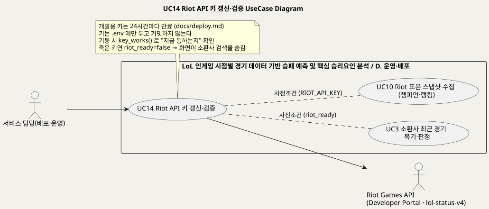
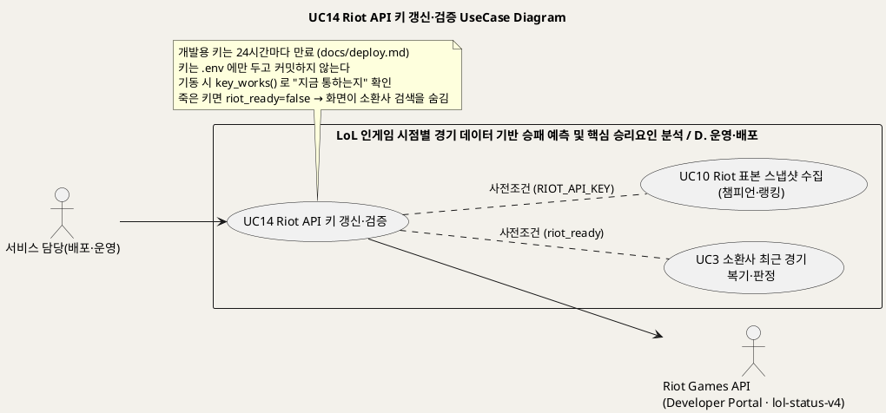
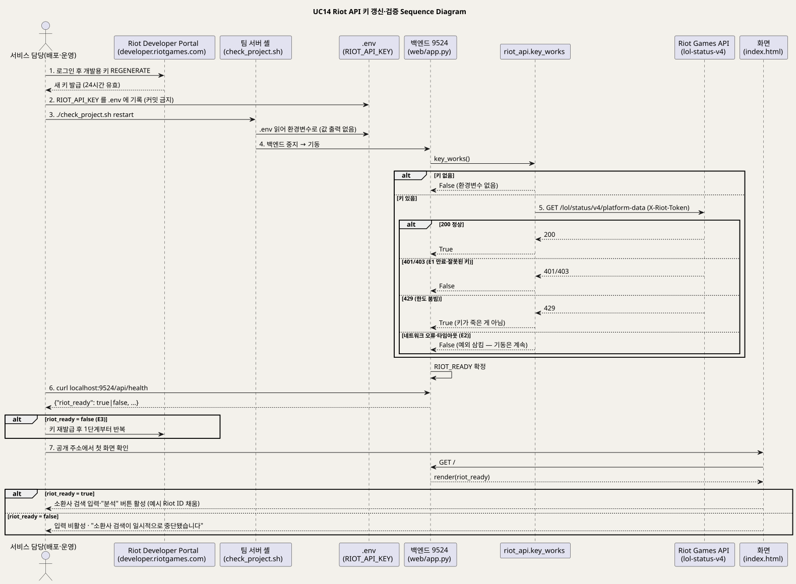
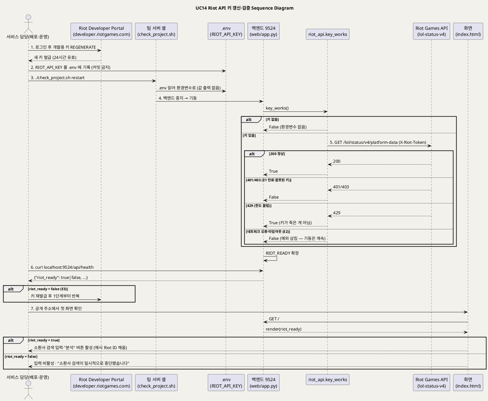

<!-- ─────────────────────────────────────────────
  UC14 상세 명세 — Riot API 키를 갱신하고 서버가 실제로 통하는지 확인하는 운영 흐름.
  왜 필요한가: 개발용 키는 24시간마다 만료된다. 죽은 키를 걸러내지 못하면 화면이 되지 않는 기능을 권한다.
  주로 보는 사람: 서비스 담당(배포·운영) · Claude(검수)
  ───────────────────────────────────────────── -->

# UseCase 명세 #14 Riot API 키 갱신·검증 (D. 운영·배포)
**LoL 인게임 시점별 경기 데이터 기반 승패 예측 및 핵심 승리요인 분석 · UC14 · UML 2.5.1 표준 (UseCase Diagram + UseCase 기술 + Sequence Diagram)**

---

> **문서 식별**: `docs/usecases/UC_14_RiotAPI키갱신검증.md`
> **작성일**: 2026-09-07 · **표준**: UML 2.5.1 (OMG)
> **원천(SoT)**: `docs/deploy.md` "Riot API 키 — 발표 당일 아침에 갱신할 것"·"처음 한 번" · `docs/riot-api-application.md` 전체 · `src/riot_api.py` `_get`·`key_works` · `web/app.py` `RIOT_READY`·`api_health`·`api_summoner` · `web/templates/index.html` `riot_ready` 분기 · `check_project.sh` `.env` 로드·`restart` · `.env.example` · `docs/TEAM_WORKFLOW.md` "커밋하지 않는 것" · `scripts/run_collectors.sh` 예산 양보
> **개요 문서**: [UC_00_개요_LoL승패예측및핵심승리요인분석.md](UC_00_개요_LoL승패예측및핵심승리요인분석.md) §3 UC14 행
> **다이어그램**: 모든 PlantUML 소스는 로컬 Kroki 에서 렌더 검증 완료(HTTP 200). 렌더 결과는 `diagrams/*.svg` 로 함께 두어 로그인 없이 보인다. 뷰어 링크는 사내 서버라 SSO 로그인이 필요하다.

---

## 목차

1. [범위·개요](#1-범위개요)
2. [UseCase Diagram](#2-usecase-diagram)
3. [Actor 카탈로그](#3-actor-카탈로그)
4. [UseCase 목록 (원천 매핑)](#4-usecase-목록-원천-매핑)
5. [UseCase 기술 + Sequence Diagram](#5-usecase-기술--sequence-diagram)
6. [업무규칙(Business Rules) 종합](#6-업무규칙business-rules-종합)
7. [UML 표준 준수 노트](#7-uml-표준-준수-노트)

---

## 1. 범위·개요

이 유스케이스는 서비스 담당이 **Riot 개발용 API 키를 새로 받아 서버에 넣고, 서버가 그 키로 실제 Riot 호출이 되는지 확인**하는 운영 흐름이다.
개발용 키는 24시간마다 만료되며, 키는 소환사 검색 기능(UC3·UC4)과 배치 수집기(UC10)에만 쓰이고 없어도 나머지 기능은 전부 동작한다.
(근거: `docs/deploy.md` "Riot API 키 — 발표 당일 아침에 갱신할 것")

핵심은 서버가 기동할 때 키가 **있는지가 아니라 지금 통하는지**를 `key_works()` 로 확인하는 것이다. 가장 가벼운 호출(lol-status-v4 플랫폼 상태)을 한 번 보내
401/403 이면 죽은 키로 보고 `riot_ready=false` 로 둔다. 그러면 화면은 소환사 검색 입력을 비활성화하고 "일시적으로 중단"을 안내해, 되지 않는 기능을 눌러보게 만들지 않는다.
(근거: `src/riot_api.py` `key_works`, `web/app.py` `RIOT_READY`, `web/templates/index.html` `riot_ready` 분기)
키 만료 자체를 없애기 위한 Personal API Key 신청은 대체흐름으로 다루며, 승인 여부는 원천에 기록이 없다. (근거: `docs/riot-api-application.md`)

| 항목 | 값 |
|---|---|
| 대상 시스템 | LoL 인게임 시점별 경기 데이터 기반 승패 예측 및 핵심 승리요인 분석 — 패키지 D. 운영·배포 |
| 상위 프로세스 | 팀 서버 운영 — 배포(UC13)와 함께 "서비스가 발표 순간까지 살아 있기" 를 지탱한다 (`docs/TEAM_WORKFLOW.md` "남은 일과 담당") |
| 원천 근거 | `docs/deploy.md` · `docs/riot-api-application.md` · `src/riot_api.py` `key_works` · `web/app.py` `RIOT_READY`·`api_health` · `index.html` `riot_ready` · `check_project.sh` |
| 핵심 UseCase | 1개 (UC14). UC3·UC4·UC10 의 사전조건을 만든다 (포함·확장 관계는 없음) |
| 주요 액터 | 서비스 담당(배포·운영)(주) · Riot Games API(보조) |

---

## 2. UseCase Diagram

PlantUML 소스 보기

소스를 직접 렌더하려면 **[「UC14 UseCase Diagram」 PlantUML 뷰어로 열기](https://plantuml.sumzip.com/plantuml/svg/eNqFU01PGlEU3c-vuKEbWIhaWTVpY-tHY2qiMXXRxISM8MQJwzwyM2hM04Tq1FCgERto0YDBSEQTm4wCBVLd8FO6nHfnP_QOYGu76Wrm5Z1zz7lnzkwbpqybqYQKqchkKJwyWEQ2mGTEFS0p63IC1uVIPKbzlBad4SrX4dH81Pzk3IsHCGNTjvJtRYvBhqwSV2UbJpgcdCW2aUJU0VnEVLgmmYqpMlidmQzBisJNeL68AO5uHRz7GnO1fse5SeN5FVYNNkMWYFaRYzRekuSISbo-tCqiZ2G2DiLXErmeX9i2e3DV7-BxC8vvAz6QDVhKGpLkCcpajMR8i3wRsNp1bvJ4YgHmKlgriKYFzs2d07VBfLKx2nItG-gk7DJgtufmLwDLGeyegrAPwC21MXflXYjzKzwu0jQQ3y20qjAOs0EYqvc7Qzc-eCsBjFIE3_-WHXj2QH-TpgD38-5RGXdJuF1xOrcjw2uaaLbp2e-4-QLWSiP-1D-aE0NN97Aiml2yXhd7H3CvA5gpY-NwTfPjddEt3uKXLvk--ebu9gL3Tiakd78THwx5KSeY4dkn2izbYipPMh2WuW7KKvQ7oHJ1jDpkpoyxrdBwjMeTJPoUMDb2bLjeIAjvNLgbnIJBzzk8AdoSaxae2s51C_w6AcI6k6M7gQc4Wulf4MrC0usw-Qq_mnsTkDRuMljnpskTwDfuM3XsirAreHzpZS-yRXgcog44tiUaGZGjJjXy4iwP_iiPGONRllT5TjARDRBzhA8ybQvwa4GAIA4LTrMG-KMu7JxboijTgKUswWiUJ0YVOjjySgZxthPe5nrc8AdAnFaovI20082Au98mIjHo7AP3qERtIiae3WE1PdC8bMGfBJ4Ofij4uf-ZsEW6o7I-qIbXob2PWKViZy6cXlpiWhS8IKRpeqN_WvoFTEPQjw==)** (사내 서버, SSO 로그인 필요) 또는 [로컬 Kroki 로 열기](http://192.168.0.91:8889/plantuml/svg/eNqFU01PGlEU3c-vuKEbWIhaWTVpY-tHY2qiMXXRxISM8MQJwzwyM2hM04Tq1FCgERto0YDBSEQTm4wCBVLd8FO6nHfnP_QOYGu76Wrm5Z1zz7lnzkwbpqybqYQKqchkKJwyWEQ2mGTEFS0p63IC1uVIPKbzlBad4SrX4dH81Pzk3IsHCGNTjvJtRYvBhqwSV2UbJpgcdCW2aUJU0VnEVLgmmYqpMlidmQzBisJNeL68AO5uHRz7GnO1fse5SeN5FVYNNkMWYFaRYzRekuSISbo-tCqiZ2G2DiLXErmeX9i2e3DV7-BxC8vvAz6QDVhKGpLkCcpajMR8i3wRsNp1bvJ4YgHmKlgriKYFzs2d07VBfLKx2nItG-gk7DJgtufmLwDLGeyegrAPwC21MXflXYjzKzwu0jQQ3y20qjAOs0EYqvc7Qzc-eCsBjFIE3_-WHXj2QH-TpgD38-5RGXdJuF1xOrcjw2uaaLbp2e-4-QLWSiP-1D-aE0NN97Aiml2yXhd7H3CvA5gpY-NwTfPjddEt3uKXLvk--ebu9gL3Tiakd78THwx5KSeY4dkn2izbYipPMh2WuW7KKvQ7oHJ1jDpkpoyxrdBwjMeTJPoUMDb2bLjeIAjvNLgbnIJBzzk8AdoSaxae2s51C_w6AcI6k6M7gQc4Wulf4MrC0usw-Qq_mnsTkDRuMljnpskTwDfuM3XsirAreHzpZS-yRXgcog44tiUaGZGjJjXy4iwP_iiPGONRllT5TjARDRBzhA8ybQvwa4GAIA4LTrMG-KMu7JxboijTgKUswWiUJ0YVOjjySgZxthPe5nrc8AdAnFaovI20082Au98mIjHo7AP3qERtIiae3WE1PdC8bMGfBJ4Ofij4uf-ZsEW6o7I-qIbXob2PWKViZy6cXlpiWhS8IKRpeqN_WvoFTEPQjw==) (내부망 전용). 위 그림 파일은 로그인 없이 보인다.

#### 다이어그램 쉽게 읽기 (유저 관점)

1. **누가 쓰나** — 왼쪽의 서비스 담당이 이 일을 시작한다. 사이트 손님은 이 일을 직접 하지 않고, 결과(소환사 검색 칸이 열려 있는지 잠겨 있는지)만 화면에서 본다.
2. **무슨 순서로** — Riot(게임 회사)의 개발자 사이트에서 새 열쇠를 받는다. 열쇠는 API 키(우리 서버가 게임 회사 창구에 들어갈 때 쓰는 비밀 문자열)를 말한다. 그 열쇠를 서버의 비밀 설정 파일에 넣고 서버를 다시 켠다. 서버는 켜지면서 게임 회사 창구에 가벼운 질문을 한 번 보내 열쇠가 정말 통하는지 확인한다.
3. **«include» = 항상 함께** — 이 그림에는 없다. 서버를 다시 켜는 명령은 새 버전 올리기(UC13)와 같은 도구를 쓰지만, 다른 일을 통째로 품고 있지는 않다.
4. **«extend» = 특별한 때만** — 이 그림에는 없다. 만료가 없는 정식 열쇠를 신청하는 일은 특별한 때만 덧붙는 일이 아니라 같은 목표로 가는 다른 길이라 대체흐름 A1 에 적었다.
5. **점선(사전조건)** — 소환사 검색(UC3)과 자료 모으기(UC10)는 이 일이 먼저 끝나 열쇠가 살아 있어야 시작할 수 있다. 정식 표준 화살표가 아니라 "먼저 필요하다"는 뜻을 적어 둔 보조선이다.
6. **오른쪽 Riot Games API** — 열쇠를 내주는 개발자 사이트(사람이 웹에서 하는 일)와 열쇠를 확인하는 창구(서버가 하는 일)를 한 사람 모양으로 묶어 그렸다.

#### 표준 기호 범례

| 기호 | 의미 | UML 2.5.1 |
|---|---|---|
| 사람 모양 (actor) | 시스템 바깥에서 시스템을 쓰는 사람이나 다른 서비스 | Actor |
| 타원 (usecase) | 그 사람이 이루고 싶은 일 하나 | UseCase |
| 큰 사각형 (rectangle) | 우리 시스템의 울타리. 안은 우리가 만든 것, 밖은 남의 것 | Subject (System Boundary) |
| 실선 화살표 | 그 사람이 그 일을 시작한다. 타원에서 바깥으로 나가는 선은 시스템이 그쪽을 부른다는 뜻 | Association |
| 점선 (레이블 "사전조건") | 다른 일을 시작하려면 이 일이 먼저 끝나 있어야 한다는 뜻. 정식 표준 기호가 아닌 보조 표시 | Dependency (비표준 레이블) |

---

## 3. Actor 카탈로그

| 액터 | 구분 | 설명 | 근거 |
|---|---|---|---|
| 서비스 담당(배포·운영) | Primary | 팀 서버에 앉아 키를 받아 넣고 재시작하며 `riot_ready` 를 확인한다. 발표 당일 아침에 반드시 한다 | `docs/deploy.md`, `docs/TEAM_WORKFLOW.md` "웹·서버·배포" |
| Riot Games API | Secondary | (1) Developer Portal — 개발용 키 REGENERATE, Personal Key 신청·심사 메시지. (2) lol-status-v4 `platform-data` — 서버가 키 생존을 확인하는 가장 가벼운 호출 | `docs/deploy.md`, `docs/riot-api-application.md` "LOL-STATUS-V4", `src/riot_api.py` `key_works` |
| (내부) `check_project.sh` | 시스템 구성요소 | `.env` 를 읽어 환경변수로 올리고(값은 출력하지 않음) 백엔드·프런트를 재시작한다. 액터가 아니라 시퀀스의 lifeline | `check_project.sh` 20~21행·`cmd_restart` |
| (내부) `.env` | 시스템 자산 | `RIOT_API_KEY` 등 비밀값의 유일한 보관처. 커밋 금지 | `.env.example`, `docs/TEAM_WORKFLOW.md` "커밋하지 않는 것" |
| (내부) 화면 `index.html` | 시스템 구성요소 | `riot_ready` 로 소환사 검색 입력·버튼의 활성 여부와 안내 문구를 가른다 | `web/templates/index.html` 421~426행 |

이 UC 의 이용자(랭크 유저 등)는 액터가 아니다. 결과만 UC3 의 사전조건으로 받는다.

---

## 4. UseCase 목록 (원천 매핑)

| UC ID | 유스케이스명 | 주액터 | 관계 | 원천 근거 |
|:--:|---|---|---|---|
| UC14 | Riot API 키 갱신·검증 | 서비스 담당(배포·운영) | 기준 UC | `docs/deploy.md` "Riot API 키" · `src/riot_api.py` `key_works` · `web/app.py` `RIOT_READY` · `index.html` `riot_ready` |
| UC3 | 소환사 최근 경기 복기·판정 | 랭크 유저 · 코치·스트리머 | UC14 가 사전조건(`riot_ready=true`)을 만든다 | `web/app.py` `api_summoner` 503 분기 — 상세는 `UC_03_소환사최근경기복기판정.md` |
| UC10 | Riot 표본 스냅샷 수집 (챔피언·랭킹) | 서비스 담당 | UC14 가 사전조건(`RIOT_API_KEY`)을 만들고, 같은 키 예산을 나눠 쓴다 | `src/collect_champion_stats.py` 머리말 — 상세는 `UC_10_Riot표본스냅샷수집.md` |

---

## 5. UseCase 기술 + Sequence Diagram

### 5.1 UC14 Riot API 키 갱신·검증

> **쉽게 말하면** — 게임 회사(Riot)가 주는 연습용 열쇠는 하루가 지나면 못 쓴다. 열쇠는 API 키, 곧 우리 서버가 게임 회사 창구에 들어갈 때
> 보여 주는 비밀 문자열이다. 그래서 담당자가 아침에 새 열쇠를 받아 서버에 넣고 다시 켜면, 서버가 "이 열쇠로 문이 열리나"를 한 번 눌러 본다.
> 열리면 화면의 소환사 검색 칸을 열어 주고, 안 열리면 검색 칸을 잠그고 "잠시 중단"이라고 적어 둔다. 열쇠가 없어도 소환사 검색 말고는 전부 그대로 돈다.

#### 유스케이스 기술

| 속성 | 내용 |
|---|---|
| **ID** | UC14 — 원천 식별자: `docs/deploy.md` "Riot API 키 — 발표 당일 아침에 갱신할 것" · `src/riot_api.py` `key_works` · `web/app.py` `RIOT_READY` |
| **유스케이스명** | Riot API 키 갱신·검증 |
| **액터** | 주액터: 서비스 담당(배포·운영). 보조액터: Riot Games API — Developer Portal(키 발급, 사람이 웹에서 수행) 및 lol-status-v4 `platform-data`(서버의 생존 확인 호출) |
| **사전조건** | (1) 서비스 담당이 Riot 개발자 포털 계정에 로그인할 수 있다 (`docs/deploy.md` "developer.riotgames.com 에서 REGENERATE"). (2) 팀 서버 `~/project2608` 에 접속해 있고 `.env` 파일이 있다 — 처음이면 `.env.example` 을 복사한다 (`docs/deploy.md` "처음 한 번"). (3) `venv311` 과 `check_project.sh` 가 준비돼 있다 (`docs/deploy.md`). (4) 팀 서버에서 Riot API 호스트로 HTTPS 가 나간다 — 자료 없음 — 확인 필요 (원천에 네트워크 요건 기록 없음) |
| **사후조건** | (1) `.env` 에 새 `RIOT_API_KEY` 가 있고 저장소에는 커밋되지 않았다 (`docs/TEAM_WORKFLOW.md` "커밋하지 않는 것"). (2) 백엔드가 재기동됐고 `GET /api/health` 의 `riot_ready` 가 true 다 (`docs/deploy.md`). (3) 화면의 소환사 검색 입력·"분석" 버튼이 활성이고 예시 Riot ID 가 채워져 있다 (`index.html` 424~426행). (4) UC3·UC4(`api_summoner`·`api_ranks`) 와 UC10(수집기) 이 시작 가능한 상태가 됐다. (5) 정확한 만료 시각은 기록되지 않는다 — 원천은 "24시간" 만 말한다 |
| **기본흐름** | ↓ 별도 기본흐름표 |
| **대체흐름** | A1. **Personal API Key 신청** — 만료를 없애기 위해 `docs/riot-api-application.md` 의 영문 신청서를 developer.riotgames.com → Register Product → Personal App 에 제출한다. 제출 전 세 가지를 확인한다: 서버를 최신으로 배포, 저장소 공개 여부, 쓰지 않을 API(LEAGUE-V4) 문단 삭제. 결과는 이메일이 아니라 포털의 application messages 로 오므로 주기적으로 확인한다. 심사 기간은 공표된 값이 없다. 승인 여부: 자료 없음 — 확인 필요. 기다리는 동안은 개발용 키를 기본흐름대로 갱신한다. A2. **키 없이 운영** — 키를 넣지 않고 기동하면 `key_works()` 가 False 를 돌려주고 소환사 검색만 닫힌 채 나머지 전 기능이 동작한다 (`docs/deploy.md` "없어도 나머지는 전부 동작한다", `web/app.py` "Riot API 연동은 선택 기능"). 5~7단계는 `riot_ready=false` 경로로 진행된다. A3. **처음 한 번(서버 새로 받을 때)** — `cp .env.example .env` 로 파일을 만들고 `DB_PASSWORD` 와 선택적으로 `RIOT_API_KEY` 를 채운 뒤 `./check_project.sh start && ./check_project.sh test` 로 기동한다 (`docs/deploy.md` "처음 한 번"). 4단계부터 동일. A4. **429 로 확인이 막힘** — 5단계에서 Riot 이 429 를 주면 키가 죽은 것이 아니라 잠깐 붐비는 것이므로 `key_works()` 는 True 로 본다. False 로 두면 다음 재시작까지 검색이 잠긴 채 굳기 때문이다 (`src/riot_api.py` `key_works` 주석) |
| **예외흐름** | E1. **만료·잘못된 키** — 5단계에서 lol-status-v4 가 401/403 을 돌려주면 `key_works()` 가 False → `riot_ready=false`. 화면은 입력을 비활성화하고 "소환사 검색이 일시적으로 중단됐습니다" 를 표시하며, `api_summoner` 는 키가 있으면 "만료되어 일시 중단" 503, 없으면 "키가 없어 쓸 수 없다" 503 을 돌려준다 (`src/riot_api.py` `key_works`·`_get`, `web/app.py` `api_summoner`, `index.html` 424~426행). 담당자는 1단계부터 다시 한다. E2. **네트워크 오류·타임아웃** — 5단계에서 6초 안에 응답이 없거나 그 밖의 예외가 나면 `key_works()` 는 예외를 올리지 않고 False 를 돌려준다. 이 확인 때문에 서버가 못 뜨면 안 되기 때문이다 (`src/riot_api.py` `key_works` docstring). 결과는 E1 과 같은 `riot_ready=false` 상태이며, 담당자는 6단계에서 이를 발견하고 재시작으로 재확인한다. E3. **`riot_ready=false` 로 확인됨** — 6단계 `curl localhost:9524/api/health` 에 `riot_ready: false` 가 나오면 키 만료(E1)·네트워크(E2)·`.env` 기록 누락 중 하나다. `.env` 의 변수명을 확인하고 필요하면 키를 재발급해 2단계부터 반복한다 (`docs/deploy.md` "true 여야 한다"). E4. **재시작 실패** — 4단계에서 `venv311` 이 없거나 포트가 점유돼 백엔드가 뜨지 않으면 `./check_project.sh logs` 로 원인을 보고 `stop` 뒤 `start` 한다 (`docs/deploy.md` "안 될 때"). E5. **키가 저장소에 들어감** — 2단계에서 키를 `.env` 가 아닌 파일에 적거나 `.env` 를 커밋하면 규칙 위반이다. `.gitignore` 가 막지만 `git status` 로 확인한다 (`docs/TEAM_WORKFLOW.md` "커밋하지 않는 것"). [추론] 이미 push 됐다면 포털에서 즉시 REGENERATE 해 옛 키를 무효화한다 — 원천에 절차 없음, 확인 필요. E6. **라이브 서버가 죽은 키를 못 걸러내는 옛 버전** — 2026-09-02 실측에서 서버가 `key_works()` 이전 버전이라 `riot_ready=true` 인데 실제 조회는 "키가 만료됐습니다" 로 실패했다. `./check_project.sh deploy` 로 최신(27d3438 이상)을 올려야 걸러진다 (`docs/riot-api-application.md` "Product URL" 경고) |
| **포함/확장** | «include» 없음. «extend» 없음. UC3·UC4·UC10 의 사전조건(`riot_ready`·`RIOT_API_KEY`)을 이 UC 가 만든다 — 관계가 아니라 상태 의존이므로 다이어그램에 주석 점선으로만 표시 |
| **우선순위** | High — 소환사 복기(UC3)는 1차 타겟의 핵심 기능이고 그것을 막는 것은 "코드가 아니라 Riot API 키 하나" 다 (`docs/product.md` §3). 발표 당일 아침 필수 절차로 지정돼 있다 (`docs/deploy.md`) |
| **사용빈도** | 개발용 키가 24시간마다 만료되므로 키가 필요한 날마다 1회, 발표 당일 아침 1회 필수 (`docs/deploy.md`, `docs/riot-api-application.md` "기다리는 동안"). 서버 기동마다 `key_works()` 가 1회 호출된다 (`web/app.py`). Personal Key 가 승인되면 갱신 빈도는 0 이 된다 — 승인 여부 자료 없음 — 확인 필요 |
| **업무규칙** | BR-KEY-01 ~ BR-KEY-08 (§6) |
| **특별 요구사항** | (1) **비밀 관리** — 키는 환경변수(`.env`)로만 읽고 코드·문서·로그에 넣지 않는다. `check_project.sh` 는 `.env` 값을 출력하지 않는다 (`src/riot_api.py` 머리말, `check_project.sh` 20행). (2) **기동 견고성** — 키 확인 실패가 서버 기동을 막아선 안 된다 (`key_works` "실패해도 예외를 올리지 않는다"). (3) **확인 비용** — 생존 확인은 대상이 필요 없는 가장 가벼운 호출 1회, 타임아웃 6초 (`key_works`). (4) **User-Agent 필수** — 없으면 Cloudflare 가 파이썬 기본 UA 를 차단해 403 이 난다 (`src/riot_api.py` `_get`). (5) **예산 공유** — 라이브와 수집기가 같은 키 예산(100회/120초)을 쓰므로 수집기는 예산 100 중 30 만 쓰고 나머지를 양보한다 (`scripts/run_collectors.sh`, `src/collect_champion_stats.py` `RESERVE`). (6) **한국 라우팅** — 생존 확인은 `kr` 플랫폼, 계정·매치는 `asia` 라우팅 (`src/riot_api.py`). (7) 접근성·규제: 자료 없음 — 확인 필요 |
| **비고** | 원천 추적성 — `docs/deploy.md` "Riot API 키 — 발표 당일 아침에 갱신할 것"(32~45행)·"처음 한 번"·"안 될 때" · `docs/riot-api-application.md` "Product URL" 경고·"WHICH APIS WE USE" LOL-STATUS-V4·"붙여넣기 전 확인 3가지"·"제출한 뒤"·"기다리는 동안"·"심사에서 떨어지는 흔한 이유" · `src/riot_api.py` `_get`(53~87행: 401/403 만료 메시지, User-Agent)·`key_works`(103~131행) · `web/app.py` 29~36행(`RIOT_READY = key_works()`)·`api_health`(113~123행 `riot_ready`)·`api_summoner`(547~556행 503 두 갈래) · `web/templates/index.html` 421~426행(`riot_ready` 로 입력·버튼 분기)·544행(`RIOT_READY` 상수) · `check_project.sh` 20~21행(`.env` 로드)·79행(`cmd_restart`) · `.env.example`(변수명 `RIOT_API_KEY`) · `docs/TEAM_WORKFLOW.md` 79행. 이 UC 가 만든 상태를 쓰는 곳: UC3(`api_summoner`)·UC4(`api_ranks`)·UC10(`collect_*.py` 가 `.env` 를 직접 읽음) |

#### 기본흐름 (Basic Flow)

| 단계 | 액터 행위 | 시스템 행위 |
|:--:|---|---|
| 1 | 서비스 담당이 developer.riotgames.com 에 로그인해 개발용 키를 REGENERATE 한다 | (외부) Riot Developer Portal 이 24시간 유효한 새 키를 발급한다 |
| 2 | 팀 서버 `~/project2608` 의 `.env` 에 `RIOT_API_KEY=...` 를 기록한다 (E5: 다른 파일·커밋 금지) | (파일) `.env` 가 유일한 보관처가 된다. `.gitignore` 가 커밋을 막는다 |
| 3 | `./check_project.sh restart` 를 실행한다 | `check_project.sh` 가 `.env` 를 읽어 환경변수로 올린다 (값은 출력하지 않음) |
| 4 | — (기다린다) | 스크립트가 백엔드(9524)·프런트(9504)를 중지 후 기동한다 (E4). 백엔드는 import 시점에 `riot_api.key_works()` 를 부른다 |
| 5 | — | `key_works()` 가 환경변수의 키로 `kr` 플랫폼 lol-status-v4 `platform-data` 를 GET 한다(타임아웃 6초). 200 이면 True, 401/403 이면 False(E1), 429 면 True(A4), 그 밖의 예외는 False(E2). 결과를 `RIOT_READY` 에 담는다 |
| 6 | `curl -s localhost:9524/api/health` 로 `riot_ready` 를 확인한다 (E3: false 면 2단계부터 반복) | `api_health` 가 `riot_ready` · 모델 메타 · 파리티 · 기동 시각을 JSON 으로 돌려준다 |
| 7 | 공개 주소(https://p4.sumzip.com)를 열어 첫 화면의 소환사 검색이 열려 있는지 본다 | `riot_ready=true` 면 검색 입력에 예시 Riot ID 를 채우고 "분석" 버튼을 활성화한다. false 면 입력·버튼을 비활성화하고 "소환사 검색이 일시적으로 중단됐습니다" 를 표시한다 |

#### Sequence Diagram

PlantUML 소스 보기

소스를 직접 렌더하려면 **[「UC14 Sequence Diagram」 PlantUML 뷰어로 열기](https://plantuml.sumzip.com/plantuml/svg/eNptVV1P22YUvvevOMpuEmlxSEg3gbSqUAxCSGtFQV2lSZHrvCVZHDuzHRjaJgVwUUoywTpYAziIqmFtNy4CBBLU9Iaf0su8r__Djl8n4fOCSNjPec5znvPhB6YlG1Y-q0JeicYTJvk5TzSFCGYmreVkQ87Cc1nJzBl6Xks-1FXdgK_GB8ej0ugVhJmSk_pCWpuDF7JqEsFKWyqB2YfROEyndQtGHk-Cu1yDTv2IlfYvmp3jAvunCk-6uWAsLc8hjyDIioUJAsx26LnN1mpASw1aOg_Set1dP7xosp0GqyyFAiCb8ChnCpjeSivpnKxZEOCpxsg8UfUcMeCxbliy-qMWTPYeiQYi5uQsMUVFz_osPuo6kVsugCfh2Ab2soUMSooomUTO0H8iiiWaKT_0SYqoNyJFos0jfnry0UwCi05MSc98rKTNX0dStOLNJv3LgaF7sTjGLJDnETmXE3OLfsSodD3A056Qc2kxQxYTC7qRMTls6ukdJkx4NXquI6-qq2FssZU3w_Nxn9rD3Kh4e5N-bCA6rSXJL2LKyqo-dHZSENBoCN_vOgXDEBWBvnU6zRartsDdtbGtDq07bOcjb_K0NCF9L02PzEhCNySM0R7JMLCVIscgvNN6BcFYnJWcTh19dvbdnQ-hXi60C9ExEa46CfSgDZ7DwN5sQKdVp2-rEGSfarRewn-L7H2hT8B7gxSDIoiRm-0Dg_ChF3xUP5_PXf3M_m6Au13pHH-mJwVWrGC1EOzUXwM7c-j-AaZfZdVy6DJ8VMLoONrSbyqr_Yly4Mvqay50fVtADCKnniKy38FgSJBVizvicwrgIcI9ynFvmyB4VUs_OfFe8ci94mXkfX_hhuGeCBPSDESw_RG__ZH5eCSnytYL3ciGk7IlQ_CHsIcOz-gZooWQwRMTGxgAtr_FVpbwAfh04Z5yfMmfXhU5Y-QJPuR64gPRSHxgEIJSFOj7Mn1Xxp3dq9B_P9ENx1MbuoO0G3SLmFffZ44NoRFbDl23gZ5t0PPNO6liQ3fqw9DlWqeOa_3uM6sWoHNcBrZl01Il1EtA7Zq71mK7ZXfpEFilRg8qF013pcD2bESy3RUsKha6WyROYaXItlvAltvucgO-FDa7befJTmy2-gdPpCUF78-fBR7PB3xaGhl7hiO3hcb3Jpi__UYEJW-ooOqKrKZ00xr2rgXeiXQkRbBbKU7VX69f_SthEDm5GBgGCyv_jV_kr0EUxd_5sF0i4Dv_XGNhg566m3vuD9dhd1e9RY_S0geshp4VXLuO016hJ6e8oG7o7CSGfStixad4E9DsNlst47LiMQV2_B_4Z4YXWm0JiO7VyUe1VwtnMZCWGMFLtaHb6i1_8jyeywuzWsZ1YcuH4H1kVl5hBS9xZy-aAXpmM7saADzr7lobRTjMPvI7V3L8OZocA3aEvS501-u2V7fScXbAr1WX76KJn68bGli1gWeljWnY_hJz2t49wQOBZtKNDbZ2SktFWqoFuJMP8Ac_xsL_z5AZmQ==)** (사내 서버, SSO 로그인 필요) 또는 [로컬 Kroki 로 열기](http://192.168.0.91:8889/plantuml/svg/eNptVV1P22YUvvevOMpuEmlxSEg3gbSqUAxCSGtFQV2lSZHrvCVZHDuzHRjaJgVwUUoywTpYAziIqmFtNy4CBBLU9Iaf0su8r__Djl8n4fOCSNjPec5znvPhB6YlG1Y-q0JeicYTJvk5TzSFCGYmreVkQ87Cc1nJzBl6Xks-1FXdgK_GB8ej0ugVhJmSk_pCWpuDF7JqEsFKWyqB2YfROEyndQtGHk-Cu1yDTv2IlfYvmp3jAvunCk-6uWAsLc8hjyDIioUJAsx26LnN1mpASw1aOg_Set1dP7xosp0GqyyFAiCb8ChnCpjeSivpnKxZEOCpxsg8UfUcMeCxbliy-qMWTPYeiQYi5uQsMUVFz_osPuo6kVsugCfh2Ab2soUMSooomUTO0H8iiiWaKT_0SYqoNyJFos0jfnry0UwCi05MSc98rKTNX0dStOLNJv3LgaF7sTjGLJDnETmXE3OLfsSodD3A056Qc2kxQxYTC7qRMTls6ukdJkx4NXquI6-qq2FssZU3w_Nxn9rD3Kh4e5N-bCA6rSXJL2LKyqo-dHZSENBoCN_vOgXDEBWBvnU6zRartsDdtbGtDq07bOcjb_K0NCF9L02PzEhCNySM0R7JMLCVIscgvNN6BcFYnJWcTh19dvbdnQ-hXi60C9ExEa46CfSgDZ7DwN5sQKdVp2-rEGSfarRewn-L7H2hT8B7gxSDIoiRm-0Dg_ChF3xUP5_PXf3M_m6Au13pHH-mJwVWrGC1EOzUXwM7c-j-AaZfZdVy6DJ8VMLoONrSbyqr_Yly4Mvqay50fVtADCKnniKy38FgSJBVizvicwrgIcI9ynFvmyB4VUs_OfFe8ci94mXkfX_hhuGeCBPSDESw_RG__ZH5eCSnytYL3ciGk7IlQ_CHsIcOz-gZooWQwRMTGxgAtr_FVpbwAfh04Z5yfMmfXhU5Y-QJPuR64gPRSHxgEIJSFOj7Mn1Xxp3dq9B_P9ENx1MbuoO0G3SLmFffZ44NoRFbDl23gZ5t0PPNO6liQ3fqw9DlWqeOa_3uM6sWoHNcBrZl01Il1EtA7Zq71mK7ZXfpEFilRg8qF013pcD2bESy3RUsKha6WyROYaXItlvAltvucgO-FDa7befJTmy2-gdPpCUF78-fBR7PB3xaGhl7hiO3hcb3Jpi__UYEJW-ooOqKrKZ00xr2rgXeiXQkRbBbKU7VX69f_SthEDm5GBgGCyv_jV_kr0EUxd_5sF0i4Dv_XGNhg566m3vuD9dhd1e9RY_S0geshp4VXLuO016hJ6e8oG7o7CSGfStixad4E9DsNlst47LiMQV2_B_4Z4YXWm0JiO7VyUe1VwtnMZCWGMFLtaHb6i1_8jyeywuzWsZ1YcuH4H1kVl5hBS9xZy-aAXpmM7saADzr7lobRTjMPvI7V3L8OZocA3aEvS501-u2V7fScXbAr1WX76KJn68bGli1gWeljWnY_hJz2t49wQOBZtKNDbZ2SktFWqoFuJMP8Ac_xsL_z5AZmQ==) (내부망 전용). 위 그림 파일은 로그인 없이 보인다.

기본흐름 7단계와 시퀀스의 번호 메시지가 1:1 로 대응한다. 대체흐름 A1(Personal Key 신청)은 사람이 포털에서 하는 절차라 시퀀스에 그리지 않았고, A2(키 없음)·A4(429) 는 5단계의 `alt` 가지로, E1·E2·E3 도 같은 자리의 가지로 표현했다.

---

## 6. 업무규칙(Business Rules) 종합

| BR ID | 규칙 | 적용 UC | 근거 |
|---|---|---|---|
| BR-KEY-01 | 키는 환경변수 `RIOT_API_KEY`(`.env`)로만 읽는다. 코드·문서·로그에 넣지 않고 `.env` 는 커밋하지 않는다 | UC14 | `src/riot_api.py` 머리말 "키는 환경변수로만", `check_project.sh` 20행, `docs/TEAM_WORKFLOW.md` 79행 |
| BR-KEY-02 | 개발용 키는 24시간마다 만료된다. 키가 필요한 날과 발표 당일 아침에는 반드시 갱신한다 | UC14 | `docs/deploy.md` "Riot API 키 — 발표 당일 아침에 갱신할 것" |
| BR-KEY-03 | 서버는 기동할 때 키가 있는지가 아니라 **실제로 통하는지**를 확인한다 (`key_works()`, lol-status-v4 1회 호출) | UC14 | `docs/deploy.md` 43행, `src/riot_api.py` `key_works`, `web/app.py` 29~34행 |
| BR-KEY-04 | 죽은 키(401/403)면 `riot_ready=false` 로 두고 화면은 소환사 검색을 권하지 않는다 — 되지 않는 기능을 눌러보게 하지 않는다 | UC14 | `docs/deploy.md` 44~45행, `index.html` 421~426행 |
| BR-KEY-05 | 키가 없어도 소환사 검색을 제외한 모든 기능은 정상 동작해야 한다. 키 확인 실패가 기동을 막아선 안 된다 | UC14 | `docs/deploy.md` 34행, `web/app.py` "Riot API 연동은 선택 기능", `key_works` docstring |
| BR-KEY-06 | 429 는 키가 죽은 것이 아니므로 `riot_ready` 를 False 로 굳히지 않는다 | UC14 | `src/riot_api.py` `key_works` 주석 |
| BR-KEY-07 | 키가 있는데 만료된 경우와 아예 없는 경우는 다른 안내(503 메시지)로 구분한다 | UC14 | `web/app.py` `api_summoner` 550~556행 |
| BR-KEY-08 | 라이브와 배치 수집기는 같은 키 예산(100회/120초)을 나눠 쓰므로 수집기는 예산 100 중 30 만 쓰고 나머지를 양보한다 | UC14 (UC10 공유) | `scripts/run_collectors.sh` 8~9행, `src/collect_champion_stats.py` `RESERVE` |

---

## 7. UML 표준 준수 노트

| 항목 | 적용 |
|---|---|
| UseCase Diagram | Subject(시스템 경계)를 `rectangle` 로, 주액터를 왼쪽·외부 시스템(Riot)을 오른쪽에 두었다. UC3·UC10 과의 관계는 «include»/«extend» 가 아니라 상태 의존이라 레이블 점선(Dependency)으로만 표시했다 (UML 2.5.1 §18.1 UseCases — 표준 스테레오타입 아님을 범례에 명시) |
| UseCase 기술 | 14속성 세로형 표. 사전·사후조건은 "참이어야 할 상태 / 보장되는 상태"로 적었고 대체(A)·예외(E) 흐름을 번호로 분리했다 |
| Sequence Diagram | 기본흐름 7단계와 메시지 1:1. 키 유무·응답 코드별 분기는 중첩 `alt` 로, 외부 시스템(Developer Portal · lol-status-v4)은 별도 lifeline 으로 분리했다 (UML 2.5.1 §17.6 CombinedFragment) |
| 비밀값 표기 | `.env` 는 파일 participant 로만 그리고 키 값은 어디에도 적지 않았다 |
| 추적성 | 모든 흐름·규칙에 원천(문서 절·파일·행)을 붙였고, 원천에 없는 판단은 `[추론]`, 없는 자료는 `자료 없음 — 확인 필요` 로 남겼다 |

---

*표기 표준: UML 2.5.1 (OMG). 서식 정본: usecase 스킬 `references/format-spec.md`. 개요 문서: [UC_00_개요_LoL승패예측및핵심승리요인분석.md](UC_00_개요_LoL승패예측및핵심승리요인분석.md). 이 문서가 목록의 마지막(UC14)이다.*
