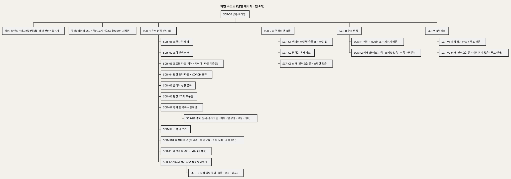
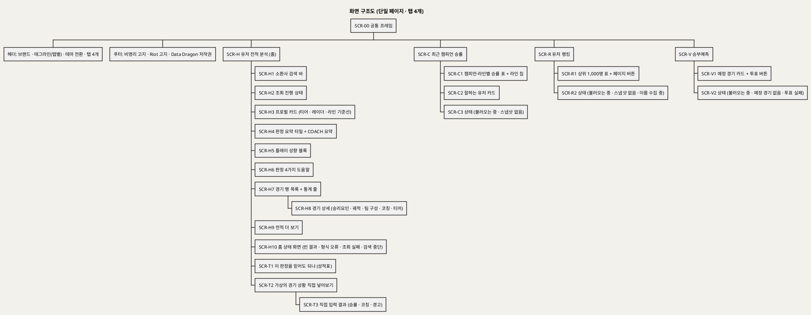
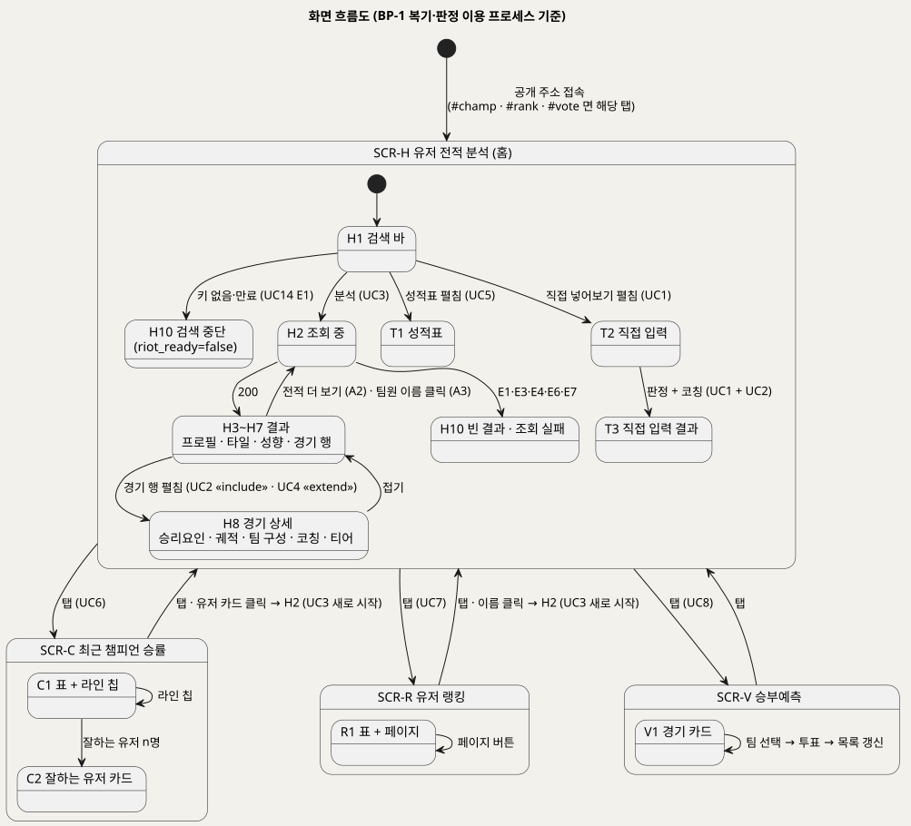
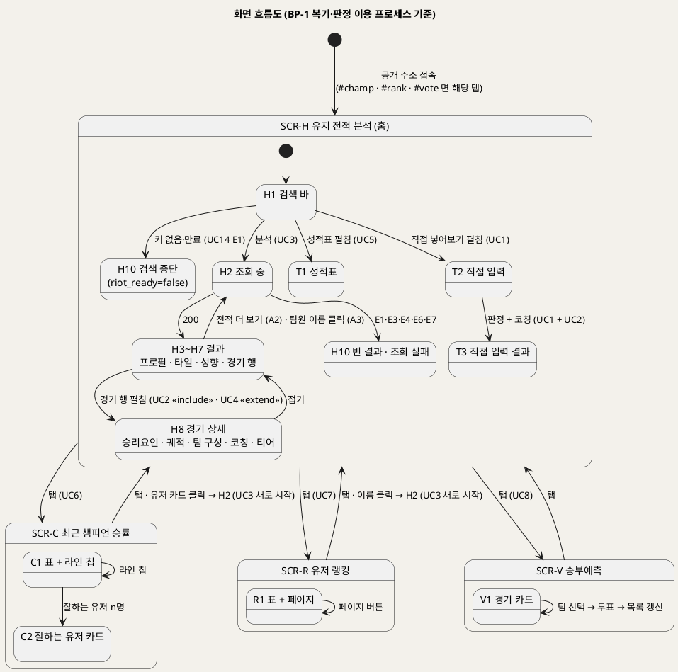

<!-- ─────────────────────────────────────────────
  화면목록 — UI/UX 설계의 출발점.
  왜 필요한가: 비즈니스 프로세스(BP)·액티비티(AD)는 "누가 언제 무엇을"을 적었다. 이 문서는 그 활동이
  어느 화면의 어느 요소로 나타나는지를 화면 ID 로 못 박아, 설계·구현·검수가 같은 이름을 쓰게 한다.
  주로 보는 사람: 화면 담당(박예은) · 팀원 · Claude(검수)
  ───────────────────────────────────────────── -->

# LoL 인게임 시점별 경기 데이터 기반 승패 예측 및 핵심 승리요인 분석 화면목록
**BP_00 의 프로세스·액티비티와 UC_01~UC_14 를 화면 단위로 내린 UI/UX 설계 기준 문서**

---

> **문서 식별**: `docs/usecases/UI_00_화면목록.md`
> **작성일**: 2026-09-07
> **원천(SoT)**: [BP_00_비즈니스프로세스_액티비티다이어그램.md](BP_00_비즈니스프로세스_액티비티다이어그램.md) (BP-1~4 · AD-1~14) · [UC_00_개요_LoL승패예측및핵심승리요인분석.md](UC_00_개요_LoL승패예측및핵심승리요인분석.md) · `UC_01`~`UC_14` · 현재 구현 화면 `web/templates/index.html` · `docs/serving.md` · `docs/product.md` · `model_card.md`
> **범위**: 이용자 화면(P1)을 전부 다루고, 운영·개발 프로세스(P2~P4)는 명령행 인터페이스라 §7 에 화면이 아닌 것으로 따로 적는다.
> **다이어그램**: 화면 구조도 1 · 화면 흐름도 1. 로컬 Kroki 렌더 검증(HTTP 200) 뒤 `diagrams/*.svg` 로 저장했다.

---

## 목차

1. [목적·범위·화면 ID 규칙](#1-목적범위화면-id-규칙)
2. [화면 구조도](#2-화면-구조도)
3. [화면 목록](#3-화면-목록)
4. [화면별 상세](#4-화면별-상세)
5. [화면 흐름도](#5-화면-흐름도)
6. [상태·메시지 목록 (예외흐름 대응)](#6-상태메시지-목록-예외흐름-대응)
7. [운영·개발 인터페이스 (화면이 아닌 것)](#7-운영개발-인터페이스-화면이-아닌-것)
8. [UI/UX 설계 시 지켜야 할 규칙](#8-uiux-설계-시-지켜야-할-규칙)
9. [미해결 사항](#9-미해결-사항)

---

## 1. 목적·범위·화면 ID 규칙

서비스는 **단일 페이지**(`index.html` 하나)에 탭 4개가 있는 구조다. 주소가 바뀌지 않고 영역이 숨겨지고 보이는 방식이므로, 여기서 "화면"은 **탭 페이지 · 영역 · 펼침 상세 · 상태(로딩·빈·오류·비활성)** 를 뜻한다. 운영자가 쓰는 것은 터미널 명령과 Riot 개발자 포털이라 화면이 아니며 §7 에 별도로 둔다.

| 접두어 | 뜻 | 대응 프로세스 |
|---|---|---|
| `SCR-00` | 모든 탭에 공통인 프레임(헤더·푸터) | BP-1 첫 화면 |
| `SCR-H*` | 유저 전적 분석(홈) 탭의 영역 | BP-1 소환사 검색 갈래 · AD-3 · AD-2 · AD-4 |
| `SCR-T*` | 홈 하단 "이 판정을 믿어도 되나" 영역 | BP-1 첫 화면 · AD-5 · AD-1 · AD-2 |
| `SCR-C*` | 최근 챔피언 승률 탭 | BP-1 탭 갈래 · AD-6 |
| `SCR-R*` | 유저 랭킹 탭 | BP-1 탭 갈래 · AD-7 |
| `SCR-V*` | 승부예측 탭 | BP-1 탭 갈래 · AD-8 |

**일관성 규칙**

- 화면 ID 하나는 AD 의 활동 하나 이상에 대응한다. 대응하지 않는 화면은 만들지 않았다(§3 의 "대응 활동" 열).
- 화면의 상태 문구는 UC 문서의 **예외흐름 번호(E)** 와 짝을 이룬다(§6). 새 상태를 추가하면 UC 문서의 예외흐름에도 추가한다.
- 화면 안의 API 경로·파일명은 UC 문서와 같은 것만 쓴다.

---

## 2. 화면 구조도

PlantUML 소스 보기

소스를 직접 렌더하려면 **[「화면 구조도」 PlantUML 뷰어로 열기](https://plantuml.sumzip.com/plantuml/svg/eNqVVE9vE1cQv_tTjMTFCSDZCS1_TmkNiFulUOWKNk1IrQQb2UZcN_FLtCTbEqvrsAGvu1E3mKBEdbDj2JIjJD7Ozrzv0HlvvbuGS8XN-97Mb35_5nmhWjMqtZfLVXhRfFIt1lafGc8z1fVi6blRMZ7BsvHb-lql_KK0UihvlCtw7eH8w_yDn6cqqr8bK-WXxdIaPDU2qquZWrG2sQry0MGTPoQXp3TUxdcCsrj3gbwxyD9d8vrUMeHLJcj6GdwKu62ZzCw8LizezOUg7F3InQuQjkDforbIzM6CfBPgH849wKGN7Rb-1Yp6W-HlEL0xecMsA2FPzOjzbRs7FpAv5KE7PUQjNYZSdBlpJMjdxPenPM-fkFkslmtTn_eNmgH3K8ZaucRgJrUb4cBWGIroI6CWz6dqDPmbgANBwoOsPLRYS1yUB9qxmQVt8ZxPJtVfAXad9H4O2Bz51gbqCHnwCqi-yarS-3ltw1FLNgXQqK-EZ-Velw76iqDyx-uzMfpD-wDhsEuBScKfYnELpL1PfhPorUPNK_bDVEFch8IvPxUeTU7T8h94qB1hA4lzeXDMvjt45KUlP8aIbKup7OKA6Z2Jnf205jYrvmI6oIThxxMG4JEcbdhjMYHKNS69E5eyfhJDyNLuiKNRxFgSiwsHgTJZZWmbeqfEufqiK4dGZ_pcuzIl-m6SDPuDvT7DT-WS4_20JnbHq5rFkcVEumFvrBHdJu15QG6Ax3qN4qj2Aml_0KyiRClo8Gqno3_l1Nm6yCHyBOC_n5mbegO47-KWy_rEOVOTjdZU1xwoL9kAz52yQx6e8HJskt8AFP8omETKpG8-vqf2NvrHsQLt4bH_tUsKt6dXQ_cWgC74DY2Bzh3pjOlgCFFXwqqQT---XEY7hiq_CJwVcKaT1aPRSdrHm912ZdPFXSd5KXqB05L52P8sDiz8-1Q5raqDhia9G2B9m-r8680OeXZCejHGw_aZ3BoleIt5vT4tAfkbuVwOP25P6KV_OPhJyN1x2jH3XQz0Gb-39yzfcqnTUIUJrSXtycAk16LhUTJjiVnxCT-VONPoGTMt61Tx-4bT0v9w-hor4TUBi3ZzJrOwWlrhf_TMf7-sBr8=)** (사내 서버, SSO 로그인 필요) 또는 [로컬 Kroki 로 열기](http://192.168.0.91:8889/plantuml/svg/eNqVVE9vE1cQv_tTjMTFCSDZCS1_TmkNiFulUOWKNk1IrQQb2UZcN_FLtCTbEqvrsAGvu1E3mKBEdbDj2JIjJD7Ozrzv0HlvvbuGS8XN-97Mb35_5nmhWjMqtZfLVXhRfFIt1lafGc8z1fVi6blRMZ7BsvHb-lql_KK0UihvlCtw7eH8w_yDn6cqqr8bK-WXxdIaPDU2qquZWrG2sQry0MGTPoQXp3TUxdcCsrj3gbwxyD9d8vrUMeHLJcj6GdwKu62ZzCw8LizezOUg7F3InQuQjkDforbIzM6CfBPgH849wKGN7Rb-1Yp6W-HlEL0xecMsA2FPzOjzbRs7FpAv5KE7PUQjNYZSdBlpJMjdxPenPM-fkFkslmtTn_eNmgH3K8ZaucRgJrUb4cBWGIroI6CWz6dqDPmbgANBwoOsPLRYS1yUB9qxmQVt8ZxPJtVfAXad9H4O2Bz51gbqCHnwCqi-yarS-3ltw1FLNgXQqK-EZ-Velw76iqDyx-uzMfpD-wDhsEuBScKfYnELpL1PfhPorUPNK_bDVEFch8IvPxUeTU7T8h94qB1hA4lzeXDMvjt45KUlP8aIbKup7OKA6Z2Jnf205jYrvmI6oIThxxMG4JEcbdhjMYHKNS69E5eyfhJDyNLuiKNRxFgSiwsHgTJZZWmbeqfEufqiK4dGZ_pcuzIl-m6SDPuDvT7DT-WS4_20JnbHq5rFkcVEumFvrBHdJu15QG6Ax3qN4qj2Aml_0KyiRClo8Gqno3_l1Nm6yCHyBOC_n5mbegO47-KWy_rEOVOTjdZU1xwoL9kAz52yQx6e8HJskt8AFP8omETKpG8-vqf2NvrHsQLt4bH_tUsKt6dXQ_cWgC74DY2Bzh3pjOlgCFFXwqqQT---XEY7hiq_CJwVcKaT1aPRSdrHm912ZdPFXSd5KXqB05L52P8sDiz8-1Q5raqDhia9G2B9m-r8680OeXZCejHGw_aZ3BoleIt5vT4tAfkbuVwOP25P6KV_OPhJyN1x2jH3XQz0Gb-39yzfcqnTUIUJrSXtycAk16LhUTJjiVnxCT-VONPoGTMt61Tx-4bT0v9w-hor4TUBi3ZzJrOwWlrhf_TMf7-sBr8=) (내부망 전용). 위 그림 파일은 로그인 없이 보인다.

---

## 3. 화면 목록

우선순위는 개요 §3 의 UC 우선순위를 그대로 물려받았다(High: 서비스의 존재 이유, Medium: 부가, Low: 조건부).

| 화면 ID | 화면명 | 유형 | 진입 경로 | 관련 UC | 대응 활동 (BP · AD) | 호출 API | 우선순위 |
|:--:|---|:--:|---|:--:|---|---|:--:|
| SCR-00 | 공통 프레임 | 프레임 | 항상 | 전체 | BP-1 "첫 화면 그리기" | — | High |
| SCR-H1 | 소환사 검색 바 | 영역 | 홈 탭 상단 | UC3 · UC14 | AD-3 1단계 · AD-14 "검색 활성/비활성" · BP-4 | — | High |
| SCR-H2 | 조회 진행 상태 | 상태 | 분석 클릭 직후 | UC3 | AD-3 "되감는 중" | POST /api/summoner | High |
| SCR-H3 | 프로필 카드 | 영역 | 조회 성공 | UC3 | AD-3 9단계 (summary.rank · radar · lane) | — | High |
| SCR-H4 | 판정 요약 타일 + COACH 요약 | 영역 | 조회 성공 | UC3 | AD-3 9단계 (summary 판정별 건수 · avg_win_prob) | — | High |
| SCR-H5 | 플레이 성향 블록 | 영역(펼침) | 조회 성공, 3판 이상 | UC3 | AD-3 9단계 (summary.style) | — | Medium |
| SCR-H6 | 판정 4가지 도움말 | 펼침 | 홈 탭 | UC3 | product §1 판정 표 (AD-3 verdict_of) | — | Medium |
| SCR-H7 | 경기 행 목록 + 통계 줄 | 영역 | 조회 성공 | UC3 | AD-3 9단계 (games[]) | — | High |
| SCR-H8 | 경기 상세 | 펼침 상세 | 경기 행 ＋ 클릭 | UC3 · UC2 · UC4 | AD-3 10단계 포크 · AD-2 A1 · AD-4 전체 | POST /api/coach · POST /api/ranks | High |
| SCR-H9 | 전적 더 보기 | 버튼 | 5판 가득 찼을 때 | UC3 | AD-3 A2 | POST /api/summoner (start) | Medium |
| SCR-H10 | 홈 상태 화면 | 상태 | 조회 실패·빈 결과·형식 오류·검색 중단 | UC3 · UC14 | AD-3 E1~E7 · AD-14 E1·E3 | — | High |
| SCR-T1 | 이 판정을 믿어도 되나 (성적표) | 펼침 | 홈 탭 하단 | UC5 | AD-5 전체 · BP-1 "성적표 준비" | GET /api/report · GET /api/match-types | Medium |
| SCR-T2 | 가상의 경기 상황 직접 넣어보기 | 펼침 | 홈 탭 하단 | UC1 | AD-1 1~3단계 | — | High |
| SCR-T3 | 직접 입력 결과 | 영역 | 판정 + 코칭 클릭 | UC1 · UC2 | AD-1 4~8단계 · AD-2 | POST /api/predict · POST /api/coach | High |
| SCR-C1 | 챔피언·라인별 승률 표 + 라인 칩 | 탭 페이지 | 탭 · #champ | UC6 | AD-6 1~6단계 | GET /api/champions[?position] | Medium |
| SCR-C2 | 잘하는 유저 카드 | 펼침 | "잘하는 유저 n명" 버튼 | UC6 | AD-6 7~8단계 | — | Medium |
| SCR-C3 | 챔피언 탭 상태 | 상태 | 불러오는 중 · 스냅샷 없음 | UC6 | AD-6 "스냅샷 없음" | — | Medium |
| SCR-R1 | 유저 랭킹 표 + 페이지 버튼 | 탭 페이지 | 탭 · #rank | UC7 | AD-7 1~7단계 | GET /api/ranking?page | Low |
| SCR-R2 | 랭킹 탭 상태 | 상태 | 불러오는 중 · 스냅샷 없음 · 이름 수집 중 | UC7 | AD-7 E1 · A4 | — | Low |
| SCR-V1 | 승부예측 경기 카드 + 투표 | 탭 페이지 | 탭 · #vote | UC8 | AD-8 전체 | GET /api/schedule · POST /api/vote | Medium |
| SCR-V2 | 승부예측 탭 상태 | 상태 | 불러오는 중 · 예정 경기 없음 · 투표 실패 | UC8 | AD-8 E4·E5·E7 | — | Medium |

---

## 4. 화면별 상세

각 항목은 **목적 → 구성 요소 → 데이터 출처 → 상태 → 이동 → 근거** 순서다. 구성 요소는 현재 구현(`index.html`)에 있는 것만 적었고, 설계 판단은 `[추론]` 으로 표시했다.

### SCR-00 공통 프레임

- **목적**: 어느 탭에서든 "이 서비스는 전적 사이트가 아니라 10분 시점 판정을 하는 곳"임을 한 줄로 알리고, 탭 4개로 나눈다.
- **구성 요소**: 브랜드 로고 · 태그라인(탭마다 바뀜: 홈 "전적을 보여주는 곳이 아닙니다. 언제 갈렸는지 판정하고…" / 챔피언 "마스터 이상 솔로랭크에서 최근 실제로 관찰된…" / 랭킹 "솔로랭크 상위 1,000명입니다…" / 승부예측 "곧 열리는 프로 경기입니다…") · 테마 전환 버튼(밝게/어둡게, 브라우저 저장) · 탭 4개(`role=tab`, `aria-selected`) · 푸터(4조 비영리 교육 프로젝트 · Riot Games 비보증 고지 영문 · 챔피언 이미지 Data Dragon 저작권 · 공개 주소).
- **데이터 출처**: 서버 렌더 값 `riot_ready`(검색 바 활성 여부, SCR-H1) · `domain`.
- **상태**: 밝음/어둠 두 테마. 주소 해시 `#champ` · `#rank` · `#vote` 로 진입하면 그 탭이 열린다.
- **이동**: 탭 클릭 → SCR-H / SCR-C / SCR-R / SCR-V. 탭 전환 시 홈 전용 영역(검색 바·프로필·전적·성적표·직접 입력)은 숨긴다.
- **근거**: `index.html` 405~430 · 524~531 · `showTab` · `docs/riot-api-application.md` "DATA HANDLING"(고지 문구).
- **설계 산출물**: 공통 프레임 목업·디자인 토큰·공통 요소 카탈로그(CMP-01~23)·요소↔화면↔UC 매트릭스는 [SCR-00_공통화면.html](../ui/SCR-00_공통화면.html) 에 있다. 독립 화면 설계는 이 카탈로그의 요소 ID 를 참조한다.

### SCR-H1 소환사 검색 바

- **목적**: 랭크 유저·코치가 게임명#태그를 넣어 소환사 복기(UC3)를 시작한다. 서비스의 1순위 입구다.
- **구성 요소**: 텍스트 입력(플레이스홀더 "소환사명#태그 (예: Hide on bush#KR1)") · "분석" 버튼 · Enter 키 실행.
- **데이터 출처**: `riot_ready`(UC14 산출물). true 면 입력에 예시 Riot ID 가 미리 채워지고 **첫 화면에서 그 표본을 자동 조회**한다. false 면 입력·버튼이 비활성이고 플레이스홀더가 "소환사 검색이 일시적으로 중단됐습니다"로 바뀐다.
- **상태**: 활성 / 비활성(키 죽음). 원칙: "초대한 문은 열려 있어야 한다" — 눌러도 안 되는 버튼을 보여 주지 않는다.
- **이동**: 분석 → SCR-H2. 형식 오류 → SCR-H10(형식 안내).
- **근거**: `index.html` 421~427 · 1465~1469 · `docs/deploy.md` "Riot API 키" · UC_03 1단계 · UC_14 7단계.
- **설계 산출물**: 화면 상세 목업·요소 ID(H*-nn)·상태 머신(S0~S7)·통합 계약은 [SCR-H1-H5_유저전적분석_화면설계.html](../ui/SCR-H1-H5_유저전적분석_화면설계.html) 에 있다.

### SCR-H2 조회 진행 상태

- **목적**: Riot 호출이 경기마다 타임라인을 받아 수십 초 걸리므로 기다리는 이유를 알린다.
- **구성 요소**: 회전 표시 + "{Riot ID} 의 최근 경기를 10분 시점으로 되감는 중… (경기마다 타임라인 …)" 문구. 통계 줄·더 보기 버튼은 비운다.
- **데이터 출처**: 없음(대기 화면).
- **상태**: 캐시 적중(A1)이면 거의 즉시 SCR-H3 로 넘어간다.
- **이동**: 성공 → SCR-H3~H7. 실패 → SCR-H10.
- **근거**: `index.html` 978~979 · UC_03 1~3단계 · AD-3.
- **설계 산출물**: 화면 상세 목업·요소 ID(H*-nn)·상태 머신(S0~S7)·통합 계약은 [SCR-H1-H5_유저전적분석_화면설계.html](../ui/SCR-H1-H5_유저전적분석_화면설계.html) 에 있다.

### SCR-H3 프로필 카드

- **목적**: "이 사람은 어떤 플레이어인가"를 한눈에. 티어와 다섯 축 성향, 라인 기준선.
- **구성 요소**: 엠블럼 · 이름 · 티어(조회 실패 시 null → 표시 생략) · 보조 문구 · 레이더 오각형(교전 · 라인 · 정글 · 오브젝트 · 시야 백분위, 3판 미만이면 없음) · 라인 기준선 등급(과소평가 / 제 실력 / 박빙 / 거품 주의, 색으로 구분) · 통계 3개.
- **데이터 출처**: `/api/summoner` 응답 `rank` · `summary.radar` · `summary.lane`.
- **상태**: 3판 미만이면 레이더·라인 기준선이 비어 있다(서버가 None).
- **이동**: 없음.
- **근거**: `index.html` 852~870 · 932~938 · `docs/serving.md` "유저 레이더" · "라인 기준선" · UC_03 9단계 · BR-SUM(3판 미만 None).
- **설계 산출물**: 화면 상세 목업·요소 ID(H*-nn)·상태 머신(S0~S7)·통합 계약은 [SCR-H1-H5_유저전적분석_화면설계.html](../ui/SCR-H1-H5_유저전적분석_화면설계.html) 에 있다.

### SCR-H4 판정 요약 타일 + COACH 요약

- **목적**: 첫 화면이 진단부터 던진다 — "최근 n판 중 역전패 n판". 원인이 라인전인지 마무리인지 방향을 준다.
- **구성 요소**: 타일(티어 · 10분 시점 승률 평균 · 10분에 앞선 비율 · 앞선 판을 지킨 비율(60% 미만이면 경고 색) 등) · COACH 요약 카드(라벨 + 한 줄 진단).
- **데이터 출처**: `summary.n` · `avg_win_prob_10min` · 판정별 건수(우세승·역전승·역전패·열세패) · `model_correct`.
- **상태**: `summary` 가 없으면 영역을 비운다.
- **이동**: 없음.
- **근거**: `index.html` 875 · 923 · 948~962 · `docs/product.md` §2 "1차" · F6 · UC_03 사후조건.
- **설계 산출물**: 화면 상세 목업·요소 ID(H*-nn)·상태 머신(S0~S7)·통합 계약은 [SCR-H1-H5_유저전적분석_화면설계.html](../ui/SCR-H1-H5_유저전적분석_화면설계.html) 에 있다.

### SCR-H5 플레이 성향 블록

- **목적**: 10분 격차를 무엇으로 만들었나(싸움 · 파밍 · 오브젝트 비중)를 유형별 판수·승률로 보인다. 예측에는 쓰지 않는 복기 재료다.
- **구성 요소**: 펼침 상자(기본 열림) · 유형 행(유형명 · 판수 · 승률) · 강조 문구 · 주의 문구 + "3판 미만인 유형은 승률을 내지 않습니다".
- **데이터 출처**: `summary.style`. 화면은 여러 페이지를 합쳐 다시 계산한다(서버 값은 현재 페이지만).
- **상태**: 성향이 없으면 영역을 비운다.
- **이동**: 없음.
- **근거**: `index.html` 929~946 · `docs/serving.md` "플레이 성향 (`style`) 의 경계" · UC_03 A2 주석.
- **설계 산출물**: 화면 상세 목업·요소 ID(H*-nn)·상태 머신(S0~S7)·통합 계약은 [SCR-H1-H5_유저전적분석_화면설계.html](../ui/SCR-H1-H5_유저전적분석_화면설계.html) 에 있다.

### SCR-H6 판정 4가지 도움말

- **목적**: 우세승·역전승·역전패·열세패의 뜻을 2×2 표로 설명한다. 이 구분이 서비스의 존재 이유다.
- **구성 요소**: 펼침 상자 "판정 4가지가 무슨 뜻인가" · 2×2 표(앞섬/밀림 × 이겼다/졌다, 배지 색·기호) · 처방 문구("열세패는 10분까지 버티는 법을, 역전패는 앞선 판을 끝내는 법을").
- **데이터 출처**: 정적.
- **상태**: 접힘/펼침.
- **이동**: 없음.
- **근거**: `index.html` 457~481 · `docs/product.md` §1 표.

### SCR-H7 경기 행 목록 + 통계 줄

- **목적**: 판마다 "10분에 어땠고 결국 어떻게 됐나"를 한 줄로.
- **구성 요소**: 통계 줄("최근 n판 · 10분 판정이 실제 결과와 맞은 경기 n판") · 경기 행(챔피언 초상 · 판정 배지 · 구간 이름 · 10분 승률 게이지(내 팀 기준) · 갈린 분 · 결과 · 펼침 버튼 "왜 이렇게 판정했나" `aria-expanded`).
- **데이터 출처**: `games[]` 의 `verdict` · `band` · `my_win_prob` · `swing_minute` · `my_won` · `played_at`. 구간 경계 숫자는 화면에 적지 않는다(서버가 이름을 준다).
- **상태**: 0판이면 SCR-H10 "최근 솔로랭크 경기를 찾지 못했습니다".
- **이동**: 펼침 → SCR-H8. 5판 가득 → SCR-H9 표시.
- **근거**: `index.html` 665~699 · 1034 · `docs/serving.md` "/api/summoner 응답" · UC_03 9단계.

### SCR-H8 경기 상세

- **목적**: 그 판이 왜 그렇게 판정됐고(원인), 무엇을 했어야 했는지(코칭)를 한 판 안에서 보인다. 코칭(UC2)·참가자 티어(UC4)는 **이 화면을 펼칠 때만** 호출된다.
- **구성 요소**: 승리요인 막대 5개(숫자 = 10분 실제 격차, 막대 = 판정에 작용한 크기, 파랑 유리/빨강 불리 범례) · 골드차 궤적 그래프(분 단위, 갈린 분 표시) · 팀 구성 두 열(우리 팀/상대 팀: 챔피언 초상 · 포지션 · 이름(클릭 시 그 사람 조회) · KDA · 본인 강조 · 티어 "…" → 한글 약칭 또는 "언랭") · 코칭 상자("코칭을 계산하는 중…" → 조언 목록 "10분까지 CS 20개 더 +N%p → NN%" · 판정 처방 굵은 제목 + 설명) · 경고 상자(학습 범위 밖 등).
- **데이터 출처**: `games[].top_factors` · `trajectory` · `roster` · `/api/coach`(features + verdict) · `/api/ranks`(puuid 10개) · Data Dragon 초상.
- **상태**: 코칭 실패 "코칭을 불러오지 못했습니다." · 티어 실패는 빈칸/언랭 · 같은 행 재펼침 시 재요청 없음.
- **이동**: 접기 → SCR-H7. 팀원 이름 클릭 → SCR-H2(UC3 새로 시작).
- **근거**: `index.html` 699~832 · `toggleDetail` · UC_03 10단계 · UC_02 A1 · UC_04 전체 · AD-3 포크.

### SCR-H9 전적 더 보기

- **목적**: 다음 5판을 이어서 본다.
- **구성 요소**: 버튼 하나. 5판이 가득 찼을 때만 보인다.
- **데이터 출처**: `next_start`.
- **이동**: → SCR-H2(start 증가) → SCR-H7 에 행 추가.
- **근거**: `index.html` 484 · 1040 · UC_03 A2.

### SCR-H10 홈 상태 화면

- **목적**: 조회가 안 될 때 이유를 사람 말로 알린다.
- **구성 요소·문구**: §6 표 참조. 빈 결과("최근 솔로랭크 경기를 찾지 못했습니다") · 형식 안내("소환사 이름을 이름#태그 형식으로 입력하세요") · 조회 실패("조회에 실패했습니다.") · 검색 중단("소환사 검색이 일시적으로 중단됐습니다. 잠시 후 다시 시도해 주세요.").
- **근거**: `index.html` 1010 · 1038 · 1055 · 1457 · UC_03 E1~E7 · UC_14 E1·E3.

### SCR-T1 이 판정을 믿어도 되나 (성적표)

- **목적**: 어떤 판은 잘 맞히고 어떤 판은 자주 틀리는지 숨기지 않고 보인다. 신뢰도가 먼저다.
- **구성 요소**: 제목 "이 판정을 믿어도 되나" · 부제 · 펼침 상자 "성적표 — 어떤 판을 맞히고, 어떤 판을 틀리나" 안에: 한 줄 요약 · 골드차 구간별 표(구간 · 경기 수 · 맞힌 비율 · "열 판 중 n판 적중") · "판정은 무엇을 보고 내리나"(상위 3 요인, 두 방법 순위 일치) · "킬이 목록에 없는 이유" · 경기 성격별 표(유형 · 경기 수 · 비중 · 10분에 앞선 팀이 이긴 비율) · 전체 적중률과 반복 횟수.
- **데이터 출처**: `/api/report` · `/api/match-types`. 첫 화면에서 미리 받아 두고 펼칠 때 보인다. 구간 목록은 `confBins` 로 보관해 SCR-H7·SCR-T3 의 접전 경고에 재사용한다.
- **상태**: "불러오는 중…" → 내용 / "리포트를 불러오지 못했습니다."
- **근거**: `index.html` 496~501 · 1064~1090 · UC_05 전체 · `docs/product.md` F2.

### SCR-T2 가상의 경기 상황 직접 넣어보기

- **목적**: 관전·복기 유저가 13개 수치를 넣어 판정을 본다(UC1). 발표 시연의 기본 화면이기도 하다.
- **구성 요소**: 펼침 상자 · 안내("전부 블루 − 레드 차이값. 양수면 블루가 앞선 것") · 예시 버튼 3개("팽팽한 초반" · "블루가 크게 유리" · "레드가 유리") · 입력 폼 13칸(첫 킬은 선택 상자, 나머지는 숫자, 평균 레벨은 0.1 단위) · "판정 + 코칭" · "모두 0으로".
- **데이터 출처**: 피처 목록·순서는 `lolwin/features.py` 정본과 같다.
- **상태**: 계산 중이면 버튼 잠금 "계산 중".
- **이동**: 판정 + 코칭 → SCR-T3.
- **근거**: `index.html` 502~520 · 1095~1105 · `docs/deploy.md` "발표 당일" · UC_01 1~3단계.

### SCR-T3 직접 입력 결과

- **목적**: 승률 · 예측 라벨 · 코칭 조언 · 읽는 법 · 경고를 한 카드로.
- **구성 요소**: COACH 카드("10분 승률 NN% — 블루/레드 승리 예측") · 조언 목록(상승폭 큰 순 3개) · `how_to_read` 문구(관찰 기반 가정 계산이라는 해석 한계) · 경고 상자(학습 범위 밖 값) · 오류 문구(서버 400 메시지 그대로 / "계산에 실패했습니다.").
- **데이터 출처**: `/api/predict` + `/api/coach` 동시 호출.
- **상태**: 성공 / 400(피처 누락·형식) / 실패.
- **근거**: `index.html` 1107~1131 · UC_01 4~8단계 · UC_02 A3 · `docs/serving.md` §3 "contribution 해석 주의".

### SCR-C1 챔피언·라인별 승률 표 + 라인 칩

- **목적**: 실력이 높은 사람들이 최근 어떤 챔피언으로 얼마나 이겼는지(관찰 승률).
- **구성 요소**: 제목 "최근 챔피언 승률 — 라인별" · 메타 줄(수집 경기 수 · 기간 · 패치 · 갱신 시각 · 정의, 5판·10판 기준 안내) · 라인 칩(전체 + 라인 5종, 눌림 상태) · 표(순위 · 초상+한글명 · 라인(전체 탭에서만) · 승률 막대 · 표본 수("표본 적음") · "잘하는 유저 n명" 버튼) · 하단 주의("우리 모델의 예측이 아니고 …").
- **데이터 출처**: `/api/champions[?position]` (스냅샷 CSV, Riot 호출 0회) · Data Dragon 초상·한글 이름(실패해도 진행).
- **상태**: "불러오는 중…" / 스냅샷 없음 → SCR-C3.
- **이동**: 라인 칩 → 같은 화면 재조회. 버튼 → SCR-C2.
- **근거**: `index.html` 486~495 · 1326~1400 · UC_06 1~6단계 · `docs/product.md` §5 "그마~챌 기준 명시".

### SCR-C2 잘하는 유저 카드

- **목적**: 그 챔피언으로 승률이 높았던 유저를 참고용으로 보이고, 이름을 누르면 그 사람 복기로 이어 준다.
- **구성 요소**: 행 아래 카드 목록(이름 · 판수 · 승률, 최대 5명) · 안내 "이름을 누르면 그 사람 전적을 10분 시점으로 분석합니다".
- **이동**: 카드 클릭 → 검색창 채움 · 맨 위로 스크롤 · 홈 탭 · SCR-H2(UC3 새로 시작). 관계가 아니라 화면 이동이다.
- **근거**: `index.html` 1392~1400 · 1445~1463 · UC_06 7~8단계.

### SCR-C3 챔피언 탭 상태

- 불러오는 중 · 스냅샷 없음(빈 표 + 안내). 근거: UC_06 E(스냅샷 없음) · AD-6.

### SCR-R1 유저 랭킹 표 + 페이지 버튼

- **목적**: 상위 1,000명. 이름을 누르면 그 유저의 10분 판정으로.
- **구성 요소**: 제목 "유저 랭킹 — 솔로랭크 상위 1,000명" · 메타 줄(설명 · 총 인원 · 갱신 시각 · 이름 수집 중 n명) · 표(순위 · 소환사(링크) · 티어 배지 · LP · 전적 · 승률, 상위 3 강조) · 페이지 버튼 1~10 과 "n~m위" · 하단 주의("스냅샷이라 실시간 순위와 다를 수 있습니다").
- **데이터 출처**: `/api/ranking?page=n` (스냅샷 CSV, puuid 없음).
- **상태**: "불러오는 중…" / 스냅샷 없음 / 전적 0 은 승률 빈칸.
- **이동**: 페이지 버튼 → 같은 화면 · 맨 위로. 이름 → SCR-H2.
- **근거**: `index.html` 447~455 · 1269~1300 · UC_07 1~7단계.

### SCR-R2 랭킹 탭 상태

- 불러오는 중 · 스냅샷 없음 · 이름 수집 중(메타 줄 표시). 근거: UC_07 E1 · A4.

### SCR-V1 승부예측 경기 카드 + 투표

- **목적**: 곧 열릴 프로 경기에 손을 들어 본다. 돈이 오가지 않고 모델은 개입하지 않는다.
- **구성 요소**: 제목 "승부예측 — 누가 이길 것 같나요" · 메타 줄(설명 · 경기 수 · 갱신 시각) · 경기 카드(리그 · 블록 · 시작 시각(오늘/내일/n일 뒤 + 시:분) · 팀 버튼 2개(로고 · 이름, 내 선택 강조) · 표 비율 막대(표 없으면 50:50 + "첫 표를 던져보세요") · 표 수·참여 인원) · 하단 주의("경기 시작 전까지만 · 한 경기에 한 번 · 다시 누르면 바꿈 · 상금도 참가비도 없음 · 배당을 만들지 않음").
- **데이터 출처**: `/api/schedule?voter=` (스냅샷 CSV + 투표 DB) · 브라우저 저장 voter 식별자(로그인 없음).
- **상태**: "불러오는 중…" / 예정 경기 없음 / 투표 실패 alert / 시작한 경기 409 alert.
- **이동**: 팀 버튼 → 투표 → 목록 재조회(같은 화면).
- **근거**: `index.html` 438~445 · 1133~1200 · UC_08 전체 · `docs/serving.md` "승부예측 투표의 경계".

### SCR-V2 승부예측 탭 상태

- 불러오는 중 · 예정 경기 없음 · 투표 실패(alert) · 저장소 접근 실패 시 집계 없이 일정만. 근거: UC_08 E4·E5·E6·E7.

---

## 5. 화면 흐름도

BP-1(복기·판정 이용 프로세스)의 활동을 화면 ID 로 옮긴 것이다. 홈 안의 상태 전이와 탭 사이의 이동을 함께 그렸다.

PlantUML 소스 보기

소스를 직접 렌더하려면 **[「화면 흐름도」 PlantUML 뷰어로 열기](https://plantuml.sumzip.com/plantuml/svg/eNqFVUFPG1cQvvtXjMIFN0JibRospFZpVkQ-VlvHl1KhDXYSC7OObNO0qhqZeIMc7CSQLpRQL1qECZCCZIjBtuJc_FN69Jv3Hzrv7a69RpV6WHn3fTPfzHwz83y3UNTzxdWVLKxmFh9lc89CheWM8VTP6yvwUF9afpzPrRopNZfN5WHifvS-Mn8vYFF4oqdyzzLGY3ikZwvpUDFTzKaBv7fYaQu4vck-mOytCZP3vp9SgH26GnSa_TavbaKzDWi3cO8UuGWygzqaHdxoAOHYKIVDoR-_-gmmpr6FH1RtMQ5zMCDfZh3wsIfrNUBnC9dfLxiTE0tP9JWn0G_DRF43luXLz7liGmT87RardoGXz4mQyqTjW8Q3FQesO-iUiMZEZw3YtYmmDZP8fSV8C_SCF_S3EICfRlyhD48irsDgsoTlV8CalrQfR6d9GBtbrHpCWeYzueJiPq2nfv1GyhT2vKYDbhHAgybfqwkvF44E0Ojz-CzRNgefeguGqxjfNkW5vFxCuyfe0LzgO0fibXD5hYQEvvPKZYoGmGI-iuU1En3BwI0u-3CGexbaHel83RCiCOpaCQZXZ8Qr6b9Y2D2X59Um7rRc6th45axb8dKULl5F1Qavnfg1Pxx5JBSRNEXjW3UJJwJCJkiR4zXqNOD-S-YcuQYBURLRcQMvsGsnSqZGyd5FaH78Hj9Qo-EARCnPAX_RAPxzHe1av82Oa-ywJuyUGZhXpG3EtY2SaWR6OnBCxdDZvNJvz0fpmaHnDj2zwiTqmsTE7A7bAfxND7sngj4C_b8zxlJ2NZXufxZiPVBn6Cj9SzFtpPqfZeDYKDCVSRwB4og8dOf3tUW71RIxJr-LhL3W4V-bYsVoA4Gv0c85gcHaSfy5kfyBzL4OGskwrsrMPKS2e4FG5lKjhKtIQqTqrfdtf2KEDX1RyeHQ72OLqAJe1QftHuCFxa0e7nRATOORM9xCVW6h50I0ItPbwOyeGFbsnkpDNTA1pCvu7_LtXbZhDde822J_uAOmivlR3dpUIcCIKgDIom-yGOzjS8o_kL7mQ2z_nL_oDpPWgklrftL8za648Y5L0k4TOWtuPE0kMoSBXZp8ozceKimFuS7hbgU7B8NIyWCkpDJc7VHBSREn6cZJyji01Gg6vGzDP-vvgFfORHrilX08ZQc2DJoXWHVEp9xr0L-FVeFclu28E76BaSNs9iaWHGExF1PHbnaBibsi2Ct_YkVaNOlia-m-qtCtR5dJHfe3XCLtP4nGZv5_GJI3GUJ3af3o3zD0LxZkAiM=)** (사내 서버, SSO 로그인 필요) 또는 [로컬 Kroki 로 열기](http://192.168.0.91:8889/plantuml/svg/eNqFVUFPG1cQvvtXjMIFN0JibRospFZpVkQ-VlvHl1KhDXYSC7OObNO0qhqZeIMc7CSQLpRQL1qECZCCZIjBtuJc_FN69Jv3Hzrv7a69RpV6WHn3fTPfzHwz83y3UNTzxdWVLKxmFh9lc89CheWM8VTP6yvwUF9afpzPrRopNZfN5WHifvS-Mn8vYFF4oqdyzzLGY3ikZwvpUDFTzKaBv7fYaQu4vck-mOytCZP3vp9SgH26GnSa_TavbaKzDWi3cO8UuGWygzqaHdxoAOHYKIVDoR-_-gmmpr6FH1RtMQ5zMCDfZh3wsIfrNUBnC9dfLxiTE0tP9JWn0G_DRF43luXLz7liGmT87RardoGXz4mQyqTjW8Q3FQesO-iUiMZEZw3YtYmmDZP8fSV8C_SCF_S3EICfRlyhD48irsDgsoTlV8CalrQfR6d9GBtbrHpCWeYzueJiPq2nfv1GyhT2vKYDbhHAgybfqwkvF44E0Ojz-CzRNgefeguGqxjfNkW5vFxCuyfe0LzgO0fibXD5hYQEvvPKZYoGmGI-iuU1En3BwI0u-3CGexbaHel83RCiCOpaCQZXZ8Qr6b9Y2D2X59Um7rRc6th45axb8dKULl5F1Qavnfg1Pxx5JBSRNEXjW3UJJwJCJkiR4zXqNOD-S-YcuQYBURLRcQMvsGsnSqZGyd5FaH78Hj9Qo-EARCnPAX_RAPxzHe1av82Oa-ywJuyUGZhXpG3EtY2SaWR6OnBCxdDZvNJvz0fpmaHnDj2zwiTqmsTE7A7bAfxND7sngj4C_b8zxlJ2NZXufxZiPVBn6Cj9SzFtpPqfZeDYKDCVSRwB4og8dOf3tUW71RIxJr-LhL3W4V-bYsVoA4Gv0c85gcHaSfy5kfyBzL4OGskwrsrMPKS2e4FG5lKjhKtIQqTqrfdtf2KEDX1RyeHQ72OLqAJe1QftHuCFxa0e7nRATOORM9xCVW6h50I0ItPbwOyeGFbsnkpDNTA1pCvu7_LtXbZhDde822J_uAOmivlR3dpUIcCIKgDIom-yGOzjS8o_kL7mQ2z_nL_oDpPWgklrftL8za648Y5L0k4TOWtuPE0kMoSBXZp8ozceKimFuS7hbgU7B8NIyWCkpDJc7VHBSREn6cZJyji01Gg6vGzDP-vvgFfORHrilX08ZQc2DJoXWHVEp9xr0L-FVeFclu28E76BaSNs9iaWHGExF1PHbnaBibsi2Ct_YkVaNOlia-m-qtCtR5dJHfe3XCLtP4nGZv5_GJI3GUJ3af3o3zD0LxZkAiM=) (내부망 전용). 위 그림 파일은 로그인 없이 보인다.

| 흐름 | 화면 순서 | 대응 BP/AD |
|---|---|---|
| 소환사 복기 여정 | SCR-00 → SCR-H1 → SCR-H2 → SCR-H3~H7 → SCR-H8 (→ SCR-H9 → SCR-H2 …) | BP-1 소환사 검색 갈래 · AD-3 · AD-2 · AD-4 |
| 직접 입력 여정 | SCR-00 → SCR-T2 → SCR-T3 | BP-1 수치 직접 입력 갈래 · AD-1 · AD-2 |
| 신뢰도 확인 여정 | SCR-00 → SCR-T1 (첫 화면에서 미리 준비) | BP-1 "성적표 준비" · AD-5 |
| 챔피언 → 소환사 | SCR-C1 → SCR-C2 → SCR-H2 | AD-6 8단계 → AD-3 |
| 랭킹 → 소환사 | SCR-R1 → SCR-H2 | AD-7 7단계 → AD-3 |
| 승부예측 | SCR-V1 → (투표) → SCR-V1 | AD-8 반복 |
| 검색 중단 | SCR-H1(비활성) · SCR-H10 | BP-4 riot_ready=false · AD-14 |

---

## 6. 상태·메시지 목록 (예외흐름 대응)

화면에 실제로 있는 문구와 UC 문서의 예외흐름 번호를 짝지었다. 새 문구를 만들면 이 표와 UC 문서를 함께 고친다.

| 화면 | 상황 | 화면 문구·표현 | UC 예외/대체 |
|:--:|---|---|:--:|
| SCR-H1 | Riot 키 없음·만료 | 입력·버튼 비활성, 플레이스홀더 "소환사 검색이 일시적으로 중단됐습니다" | UC14 E1·E3 · UC3 E1 |
| SCR-H10 | 첫 화면, 키 죽음 | "소환사 검색이 일시적으로 중단됐습니다. 잠시 후 다시 시도해 주세요." | UC3 E1 |
| SCR-H10 | "#" 없는 입력 | "소환사 이름을 이름#태그 형식으로 입력하세요 (예: Hide on bush#KR1)." | UC3 E2 |
| SCR-H10 | 계정 없음 · 키 오류 · 429 · 서버 오류 | "조회에 실패했습니다." (서버 메시지가 있으면 그것) | UC3 E3·E4·E6·E7 |
| SCR-H10 | 경기 없음 | "최근 솔로랭크 경기를 찾지 못했습니다." | UC3 E5(전부 제외된 경우 포함) |
| SCR-H2 | 조회 중 | "… 의 최근 경기를 10분 시점으로 되감는 중… (경기마다 타임라인 …)" | UC3 1단계 |
| SCR-H8 | 코칭 실패 | "코칭을 불러오지 못했습니다." | UC2 E3 |
| SCR-H8 | 티어 없음·조회 실패 | "언랭" 또는 빈칸 | UC4 E2·E3·E4 |
| SCR-H7 | 접전 구간 | 판정 옆 경고(구간별 적중률은 `confBins` 에서) | UC5 → UC3 재사용 |
| SCR-T1 | 리포트 실패 | "리포트를 불러오지 못했습니다." | UC5 E3 |
| SCR-T3 | 피처 누락·형식 | 서버 400 메시지 그대로 (빠진 피처 목록) | UC1 E1·E2·E3 |
| SCR-T3 | 학습 범위 밖 | 경고 상자 "… 학습 범위 [a, b] 밖 — 예측을 믿지 마세요" (결과는 그대로 표시) | UC1 E4 |
| SCR-T3 | 중계·서버 오류 | "계산에 실패했습니다." | UC1 E5·E7 |
| SCR-C3 | 스냅샷 없음 | 빈 표 + 안내 | UC6 스냅샷 없음 |
| SCR-C1 | 표본 부족 | "표본 적음" 표시, 아래로 정렬 | UC6 BR(10판 미만) |
| SCR-R2 | 스냅샷 없음 | 안내 | UC7 E1 |
| SCR-R1 | 전적 0 | 승률 빈칸 | UC7 E4 |
| SCR-R2 | 이름 수집 중 | 메타 줄 "이름 n명 수집 중" | UC7 A4 |
| SCR-V2 | 예정 경기 없음 | 빈 목록 안내 | UC8 E7 |
| SCR-V1 | 표 없음 | 50:50 막대 + "첫 표를 던져보세요" | UC8 3단계 |
| SCR-V2 | 투표 실패 · 이미 시작 | alert (409 "이미 시작한 경기입니다") | UC8 E3·E5 |
| SCR-V2 | 저장소 접근 실패 | 집계 없이 일정만 | UC8 E6 |

---

## 7. 운영·개발 인터페이스 (화면이 아닌 것)

P2~P4 는 GUI 가 없다. UI/UX 설계 범위에서 제외하되, 이용자 화면과 어떻게 이어지는지는 알아야 한다.

| 인터페이스 | 형태 | 관련 UC | 이용자 화면에 미치는 것 |
|---|---|:--:|---|
| `./check_project.sh status · deploy · restart · test · logs` | 터미널 | UC12 · UC13 | 배포 여부, 서비스 생사 |
| `./scripts/run_collectors.sh` · `src/collect_*.py` | 터미널 · 로그 파일 | UC9 · UC10 | SCR-C1 · SCR-R1 · SCR-V1 의 표 내용과 갱신 시각 |
| Riot 개발자 포털 (REGENERATE · Personal Key 신청) | 외부 웹 | UC14 | SCR-H1 활성 여부(`riot_ready`) |
| `.env` (`RIOT_API_KEY` · `DB_PASSWORD`) | 파일 | UC14 · UC11 | 위와 같음 |
| `GET /api/health` (`riot_ready` · 파리티 · 모델 메타) | JSON | UC12 · UC13 · UC14 | 운영 확인용, 화면 없음 |
| `python src/finalize_model.py` · `tests/make_golden.py` | 터미널 | UC11 | SCR-T1 의 수치, 모든 예측값 |

`[추론]` 운영 화면(키 상태·수집 갱신 시각·파리티 결과를 한 페이지로)은 원천에 없다. 만들 경우 `/api/health` 와 각 `*_meta.json` 만으로 구성할 수 있으나, 이 문서의 범위 밖이다.

---

## 8. UI/UX 설계 시 지켜야 할 규칙

원천의 업무규칙·서빙 계약·모델 카드에서 화면에 직접 닿는 것만 골랐다. UC 문서의 BR 번호를 병기했다.

| 규칙 | 화면 | 근거 |
|---|:--:|---|
| 되지 않는 기능은 눌러 보게 만들지 않는다 — 키가 죽으면 검색 바를 비활성하고 이유를 적는다 | SCR-H1 · SCR-H10 | `docs/deploy.md`, `index.html` 주석 "초대한 문은 열려 있어야 한다", BR-KEY |
| 학습 범위 밖 입력은 막지 않고 **경고와 함께** 결과를 보인다 | SCR-T3 · SCR-H8 | BR-PRD-02, `docs/serving.md` §4 |
| 승리요인 기여도(`contribution`)는 숫자만 띄우지 않고 설명(실제 격차 + 방향 범례)을 붙인다. 킬이 음수여도 "킬하면 진다"로 읽히지 않게 | SCR-H8 · SCR-T1 | BR-PRD-07, `docs/serving.md` §3 |
| 코칭은 "그랬던 경기들은 이랬다" 수준을 넘지 않는다. `how_to_read` 또는 판정 처방을 반드시 함께 보인다 | SCR-T3 · SCR-H8 | BR-COA, `model_card.md` 금지 7 |
| 팽팽한 경기(접전 구간)는 판정보다 **경고를 먼저** 보인다 | SCR-H7 · SCR-T1 | `docs/product.md` F2, `model_card.md` 금지 4 |
| 구간 경계 숫자를 화면에 적지 않는다. 서버가 주는 구간 이름을 쓴다 | SCR-H7 | `docs/serving.md` "/api/summoner 응답" `band` |
| 확률은 내 팀 기준(`my_win_prob`)으로 읽는다. 화면이 뒤집지 않는다 | SCR-H7 · SCR-H8 | `docs/serving.md` "/api/summoner 응답" |
| 챔피언 승률은 "관찰 승률이지 모델 예측이 아니다"와 표본 티어(마스터 이상)를 화면에 명시한다 | SCR-C1 | BR-CHP, `docs/product.md` §5 |
| 랭킹·챔피언·일정은 스냅샷이므로 **갱신 시각**을 함께 보인다 | SCR-C1 · SCR-R1 · SCR-V1 | BR-LDR, BR-VOT, `*_meta.json` |
| 투표 화면에는 모델 예측을 표시하지 않고, 돈이 오가지 않음·배당 없음을 적는다. 시작한 경기는 투표 불가 | SCR-V1 | BR-VOT, `docs/serving.md` "승부예측 투표의 경계", `model_card.md` 금지 6 |
| 성향·레이더·라인 기준선은 3판 미만이면 비운다. "높다고 잘하는 것이 아니라 치우쳤다는 뜻"을 적는다 | SCR-H3 · SCR-H5 | BR-SUM, `docs/serving.md` "유저 레이더" |
| 코칭·티어는 경기 행을 **펼칠 때만** 부른다(요청 절약). 같은 행 재펼침 시 재요청하지 않는다 | SCR-H8 | BR-RNK, UC_02 A1, UC_04 A2 |
| 이름 클릭은 관계가 아니라 **UC3 를 새로 시작하는 화면 이동**이다(검색창 채움 · 맨 위로 · 홈 탭) | SCR-C2 · SCR-R1 · SCR-H8 | UC_06·UC_07 대체흐름 |
| 진행 중 경기·실시간 승률은 어디에도 약속하지 않는다 | 전체 | `docs/spec.md` §6, `docs/product.md` §4 |
| 매 페이지에 Riot 비보증 고지와 Data Dragon 저작권을 둔다. 계정·개인정보를 저장하지 않는다 | SCR-00 · SCR-V1 | `docs/riot-api-application.md` "DATA HANDLING" |
| 탭은 `role=tab` · `aria-selected`, 펼침 버튼은 `aria-expanded` 를 유지한다. 밝음/어둠 테마 모두에서 판정 색(우세승·역전승·역전패·열세패)이 구분돼야 한다 | SCR-00 · 전체 | `index.html` 현재 구현. 접근성 기준치는 자료 없음 — 확인 필요 |
| 딥링크 `#champ` · `#rank` · `#vote` 는 유지한다(링크 공유용) | SCR-00 | `index.html` 1478~1482 |

---

## 9. 미해결 사항

| 항목 | 내용 | 관련 화면 |
|---|---|:--:|
| 접근성·반응형 기준 | 대비·키보드 조작·화면 폭 기준이 원천에 없다. 자료 없음 — 확인 필요 | 전체 |
| 성적표의 미노출 데이터 | `/api/report` 의 시점 비교(`experiment_b`)·교차검증·기준선 값은 응답에 있으나 화면이 쓰지 않는다. 보일지 결정 필요 | SCR-T1 |
| 그림 원본 | `/figures/<이름>` 라우트는 있으나 화면이 참조하지 않는다 | SCR-T1 |
| 표본 티어 문구 | 수집기 머리말은 "다이아 이상", 화면·API 는 "마스터 이상". 화면 문구를 어느 쪽에 맞출지 | SCR-C1 |
| 성향 집계 범위 | 서버 `summary.style` 은 현재 페이지만, 화면은 전체 페이지 재계산. 어느 쪽을 정본으로 할지 | SCR-H5 |
| 운영 화면 | 키 상태·수집 갱신·파리티를 보는 관리 화면은 원천에 없다(`[추론]` 후보만 §7) | — |
| 사용 빈도 | 화면별 실측 사용량이 없어 우선순위는 UC 우선순위를 물려받았다 | 전체 |

---

*원천: [BP_00_비즈니스프로세스_액티비티다이어그램.md](BP_00_비즈니스프로세스_액티비티다이어그램.md) · [UC_00_개요_LoL승패예측및핵심승리요인분석.md](UC_00_개요_LoL승패예측및핵심승리요인분석.md) · `UC_01`~`UC_14` · `web/templates/index.html`. 화면에 없는 요소는 만들지 않았고, 설계 판단은 `[추론]` 으로 표시했다.*
